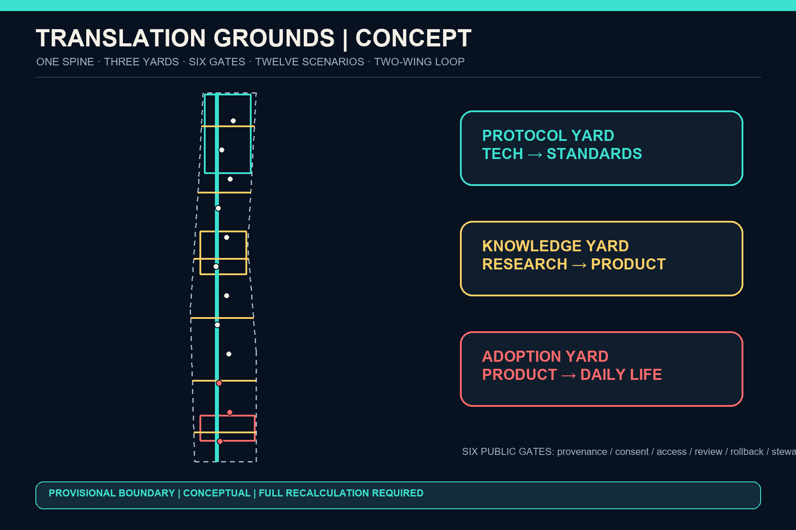
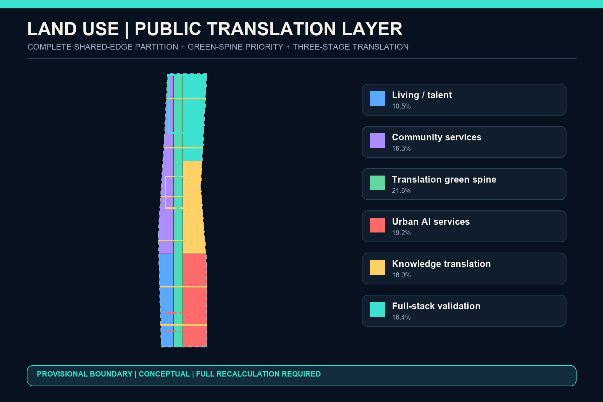
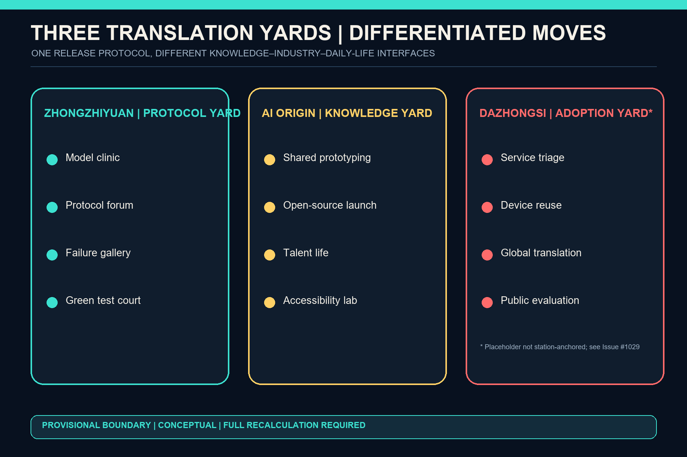
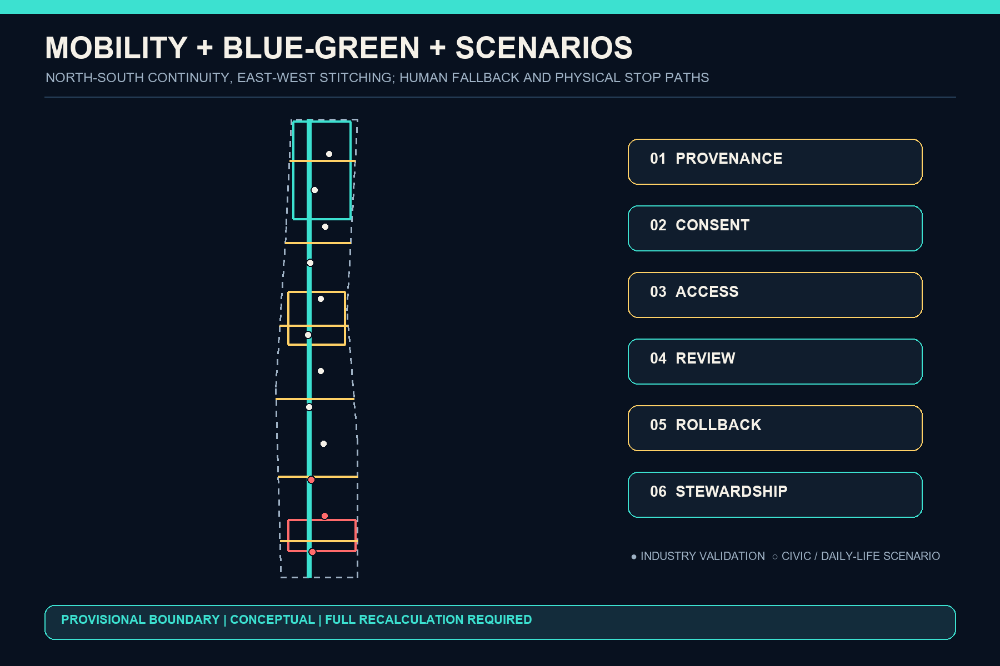
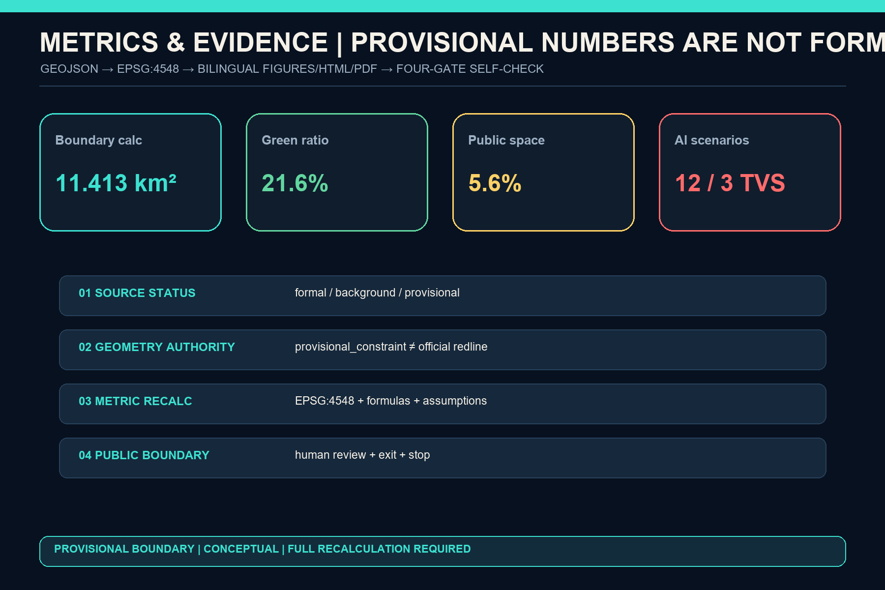

# JING-ZHANG TRANSLATION GROUNDS

> Translating frontier intelligence into verifiable public value. Every spatial move is a Conceptual Recommendation and reference scheme for professional teams to deepen. Nothing here replaces formal planning or constitutes a government approval.

## Design Basis and Source List

The official announcement controls the three scope levels, three key areas, objectives, and tasks; the Agent Taskbook supplies the Three Positionings, Five Functions, and six open-call tasks [source:OFFICIAL-ANNOUNCEMENT] [source:AGENT-TASKBOOK]. The Source Registry limits each source to approved uses, while the processed fact pack is navigation rather than new authority [source:SOURCE-REGISTRY] [source:PROCESSED-FACT-PACK].

Both the Overall Design Area and Key-Area polygons are repository provisional constraints used only for generation, visualization, and intake checking [source:BOUNDARY-SOURCE] [source:KEY-AREA-SOURCE]. Existing buildings, road redlines, heritage controls, utilities, and ownership remain pending, so reversible, stoppable, test-first decisions are more credible than invented precision [depth:existing_conditions_diagnosis].

## Three-Level Scope Framework

Translation Grounds does not invent a new boundary. It connects the 43.6 km² Coordinated Research Area, approximately 11.4 km² Overall Design Area, and 368.4 ha Key-Area Detailed Design Area through one translation chain: strategy coordinates resources, overall design arranges public space and renewal prototypes, and three key-area yards test scenarios. The 11.4 km² value is the announced approximation; the submitted-geometry calculation is only for internal consistency [standard:PROJECT-OFFICIAL-ANNOUNCEMENT] [data:geometry/site_boundary.geojson#SITE-001] [depth:three_level_scope_framework].

The structure is “one spine, three translation yards, six gates, twelve scenarios, and a two-wing feedback loop.” The green heritage spine supports north-south walking and cultural continuity. Zhongzhiyuan translates technology into protocols; Beijing AI Origin translates knowledge into products; Dazhongsi translates products into everyday adoption. The Zhongguancun Technology Services Wing and Xiaoyue River Scenario Enablement Wing return IP, capital, talent, and user feedback [depth:overall_spatial_structure] [data:geometry/roads.geojson#ROAD-001].

## Coordinated Research Area: Industry and Future City Research

Six cases contribute mechanisms, not transferable controls. Kendall Square suggests moving from an innovation park toward an innovation community [source:CASE-KENDALL]. Singapore's one-north combines modular startup space with a work-live-play-learn environment [source:CASE-ONENORTH]. Seoul AI Hub provides staged education, incubation, and validation services [source:CASE-SEOUL]. Paris-Saclay's Urba(IA) uses a user committee to compare and evaluate urban AI scenarios [source:CASE-PARIS-SACLAY]. London's Knowledge Quarter shows cross-sector collaboration among culture, research, business, and communities [source:CASE-KQ-LONDON]. Toronto's Vector Institute illustrates sustained convening across research, industry, and public-interest domains [source:CASE-VECTOR].

Six public gates localize these lessons: Provenance checks data and rights; Consent explains participation and exit; Access protects accessibility and low-digital routes; Review names accountable people; Rollback preserves pause and downgrade controls; Stewardship publishes maintenance responsibility. The gates are both east-west public spaces and a release protocol for AI services [standard:PROJECT-AGENT-OPEN-CALL-TASKBOOK] [data:geometry/public_space.geojson#PUBLIC-001].

The original “dual-rail translation bracket” identity turns two Jing-Zhang lines into an open bracket: cyan marks a traceable public route and warm yellow marks human judgment. It uses no corporate mark; “Translation Grounds” means both a place and a continuing civic practice.

## Overall Design Area: Urban Renewal and Regulatory-Plan-Level Urban Design

A complete land-use partition forms the machine-review base. The west hosts living and community-service prototypes, the centre is the continuous green spine, and the east shifts from urban services in the south to knowledge translation and full-stack validation in the north. Shared cuts cover the provisional boundary without gaps, but categories remain design proposals rather than approved planning [standard:MNR-LAND-USE-CLASSIFICATION-GUIDE] [data:geometry/land_use.geojson#LU-03] [depth:land_use_layout].

Renewal follows “retain first, adapt second, add last.” Twelve footprints describe translation-yard prototypes rather than demolition or ownership decisions. FAR, height, coverage, and setbacks remain pending. Massing guidance is limited to open ground floors, flexible partitions, low-impact rooftop equipment, and interfaces set back from the green spine [depth:development_intensity_controls] [depth:height_massing_character] [data:geometry/buildings.geojson#BLDG-001].

## Detailed Design of Key Areas

Three translation yards form one loop [depth:three_key_area_detailed_design]:

| Key area | Role | Spatial moves | First validation |
| --- | --- | --- | --- |
| Zhongzhiyuan | Protocol Yard: technology → standards | Green test court, protocol forum, failure gallery, river-edge public room | Open-model clinic and edge-compute rehearsal [data:geometry/key_areas.geojson#PROV-KEY-001] |
| Beijing AI Origin | Knowledge Yard: research → products | Near-campus transfer street, shared prototyping, talent services, open-source steps | Accessibility lab and youth maker yard [data:geometry/key_areas.geojson#PROV-KEY-002] |
| Dazhongsi | Adoption Yard: products → daily life | International translation hall, repair loop, service desk, public evaluation court | Service translation, device adoption, and feedback [data:geometry/key_areas.geojson#PROV-KEY-003] |

The Dazhongsi placeholder is not station-anchored. Issue #1029 records an approximately 2.26 km station-relation discrepancy. This proposal does not move upstream geometry or portray four-quadrant connectivity as an approved project; the announced task remains textual until official polygons trigger full recalculation [source:ISSUE-1029] [metric:key_area_count].

## AI Innovation Ecosystem, Personas, and AI+ Scenarios

Seven personas govern the scenarios: researchers need reproducibility; startups need affordable validation; mature firms need adoption feedback; residents need visible human service; older and low-digital users need non-mandatory digital routes; disabled users need multimodal access; international visitors need cross-language interpretation. No scenario requires persistent individual identification.

All twelve cards are registered through `scenario_ids` on the six public-gate spaces; the first three are industry Testing and Validation Scenarios [metric:scenario_node_count] [metric:test_validation_scenario_count] [data:geometry/public_space.geojson#PUBLIC-001]:

1. Open-model clinic with data cards, failure samples, and human sign-off.
2. Edge-compute load rehearsal within explicit energy and safety limits.
3. Multimodal accessibility lab co-tested by disabled users.
4. Walking-and-cycling co-pilot without persistent personal tracking.
5. Cross-language city service desk with escalation to people.
6. Public algorithm label showing purpose, data, owner, expiry, and stop control.
7. Jing-Zhang oral-history booth with consent and withdrawal.
8. Youth AI maker yard with attribution and safeguarding.
9. Legal first-contact desk limited to triage and professional review.
10. Community health guide limited to navigation with clinical fallback.
11. Smart-device repair and reuse station without vendor lock-in.
12. Global demo-to-neighbourhood forum requiring a public change log.

Three pilgrimage landmarks avoid high-energy spectacle: the Protocol Beacon displays standards and failures; the First-Kilometre Archive Gate pairs railway mileage with public memory and contributor credit; the Civic Translation Hall shows how products are adopted, challenged, repaired, and retired [metric:landmark_count].

## Land Use, Building Scale, and Retain-Renovate-Demolish Strategy

Six shared-edge polygons provide a recalculable partition: a public translation layer in the middle, knowledge production to the east, and everyday support to the west. Codes use repository enums, while the local MNR snapshot contains only the notice page; professional deepening must return to the official attachment before statutory use [standard:MNR-LAND-USE-CLASSIFICATION-GUIDE] [depth:land_use_layout].

The building strategy is a post-survey decision tree, not a parcel verdict. Retain safe and useful fabric; adapt buildings that can improve through open ground floors, services, and shared space; consider removal or addition only after ownership, structure, heritage, carbon, and public-interest review. Prototype footprint metrics exist only for package consistency [metric:building_footprint_area_sqm] [metric:building_coverage_ratio_design_prototype] [depth:retain_renovate_demolish].

## Transport, Rail, Municipal Infrastructure, and Public Services

One north-south walking and cycling spine plus six east-west Translation Gates express connection and interchange, not road redlines, bridges, or tunnels. Conceptual centreline length verifies that the network changes when geometry changes [metric:road_centerline_length_m] [depth:traffic_rail_slow_parking] [data:geometry/roads.geojson#ROAD-002].

Municipal and new infrastructure follow “small edge nodes, centralized audit, human takeover.” Yards may host scheduled computing, model evaluation, data authorization, and repair interfaces, while energy, utilities, fire safety, drainage, and cybersecurity remain specialist dependencies. Every public service keeps a staffed desk, non-smart route, and offline explanation [depth:municipal_new_infrastructure] [standard:MOHURD-CONTROL-DETAILED-PLANNING].

## Blue-Green Network, Public Space, and Urban Character

The translation green spine combines heritage narrative, walking, cycling, accessible companionship, and low-intrusion AI experience. Six gates provide east-west pause, explanation, and interchange. Geometry-derived green figures are not statutory green-ratio controls or commitments [metric:green_space_area_sqm] [metric:green_ratio] [data:geometry/green_space.geojson#GREEN-001].

Six components make public value visible: staffed desks, rewritable protocol walls, reusable exhibit frames, low-luminance status lights, tactile/audio wayfinding, and demo tables with physical stop controls. Their area and ratio measure the proposal's public-space commitment only [metric:public_space_area_sqm] [metric:public_space_ratio] [depth:blue_green_public_space].

Durable metal, reclaimed brick, timber touch surfaces, and replaceable information layers combine railway engineering discipline, Zhongguancun experimentation, and explainable AI. Heritage, river, and existing-park interventions stay reversible and subject to professional review [standard:MOHURD-URBAN-DESIGN-MEASURES].

## Renewal Projects, Implementation Policy, and Phasing

| Project | Content | Dependency and exit condition |
| --- | --- | --- |
| T-01 Green-spine sample | Wayfinding, staffed desk, public labels, accessible route | Heritage/park/traffic permission; fully removable |
| T-02 Protocol Yard | Standards forum, model clinic, failure gallery | Building safety and operator confirmation |
| T-03 Knowledge Yard | Shared prototyping, open-source launch, talent services | Campus edges, ownership, and use rights |
| T-04 Adoption Yard | Service desk, device loop, international translation | Official key-area and station anchoring |
| T-05 Six Public Gates | Provenance, Consent, Access, Review, Rollback, Stewardship | Road-redline and accessibility review |
| T-06 Twelve-scenario rotation | 90-day test, public review, renew or stop | Data rights, accountable person, complaint path |

Phase one uses reversible labels and service processes; phase two adapts the three yards after surveys; phase three waits for official geometry and specialist conditions before systemic construction. Phase-one area encodes dependency order, not an approved work boundary [metric:phase_1_area_sqm] [depth:renewal_project_list] [depth:phasing_implementation].

An annual loop is proposed: spring public problem call, summer scenario rehearsal, autumn Global Translation Grounds Week, and winter maintenance/retirement audit. Developer credit derives from open issues, test evidence, and maintenance promises; firms progress from demo to limited validation and then resident/professional review. Events, recruitment, policy, and finance remain proposals, not commitments.

## Metrics, Area Recalculation, and Compliance Matrix

The provisional Overall Design Area is recalculated in EPSG:4548 for package topology and ratio consistency only [metric:site_area_sqm] [depth:metrics_recalculation]. Green, public-space, prototype-building, walking-centreline, and phasing metrics derive from GeoJSON; statutory FAR, height, road-area ratio, and existing-building retention remain pending official data.

The compliance matrix covers announcement sections 1.3, 1.4, and 1.5 plus agent.1–agent.6. The standards matrix records five mandatory sources and one unavailable official-file gap. The design-depth matrix maps fifteen items to narrative, geometry, metrics, drawings, and checks. “Complete” means reviewable evidence under current provisional inputs, not completion of statutory planning.

## Risk, Copyright, and Compliance

The main risk is not missing numbers but provisional numbers being detached and misread as official. Official boundaries, controls, roads, buildings, heritage, utilities, and facilities must trigger full regeneration of geometry, metrics, figures, PDFs, HTML, manifest, and self-check [depth:risk_missing_data]. The repository lacks an official file for the architectural design-depth reference; it remains a data gap and is not claimed as a completed architectural standard [standard:MOHURD-ARCH-DESIGN-DEPTH-2016].

All figures are programmatically drawn from package GeoJSON and metrics. The cover and PDFs are original local renderings with no commercial map tiles, external photographs, corporate marks, portraits, or remote fonts. HTML contains no CDN, remote script, tracking, form, or network request. Every AI scenario requires a public purpose, minimum data, human review, complaint/exit path, and stop control.

## References

Complete publishers, links, access dates, permitted uses, and limitations are in `sources.json`; this section explains how evidence shapes the design without converting case experience into statutory control. The official announcement and taskbook establish the three scope levels, three key areas, and open tasks that become the one-spine, three-yard, six-gate, twelve-scenario structure [source:OFFICIAL-ANNOUNCEMENT] [source:AGENT-TASKBOOK]. Local standards constrain evidence authority, public procedure, and the conceptual status of the proposal. The six international cases contribute operating mechanisms only, not transferable metrics, permissions, or commitments [standard:MOHURD-URBAN-DESIGN-MEASURES] [source:CASE-KENDALL].

The spatial base is repository-provided provisional geometry, so area, green-space, and public-space values support only package topology and internal design consistency [data:geometry/site_boundary.geojson#SITE-001] [metric:site_area_sqm]. Issue #1029 shows that PROV-KEY-003 is not yet anchored to Dazhongsi Station; the submission does not relocate the upstream polygon or claim that station integration is resolved [source:ISSUE-1029]. Official boundaries, controls, roads, buildings, heritage, utilities, ownership, and facility data must trigger full geometry-and-metric recalculation and a new four-gate self-check. This remains an open co-creation submission—not selection, approval, or implementation.
