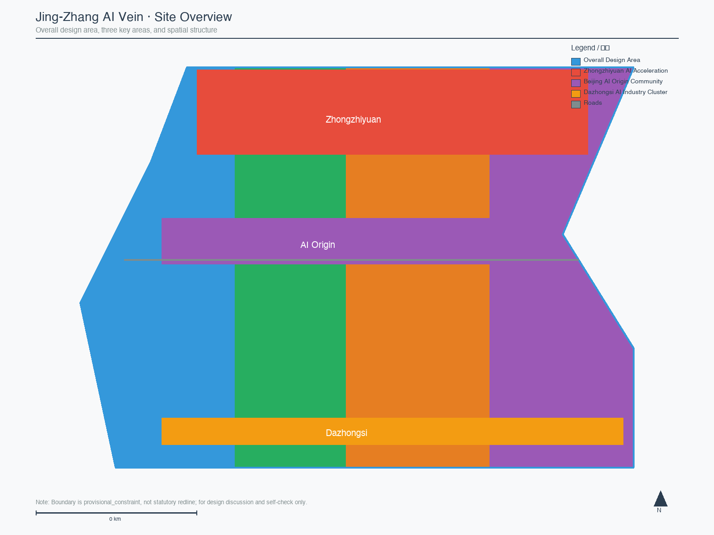
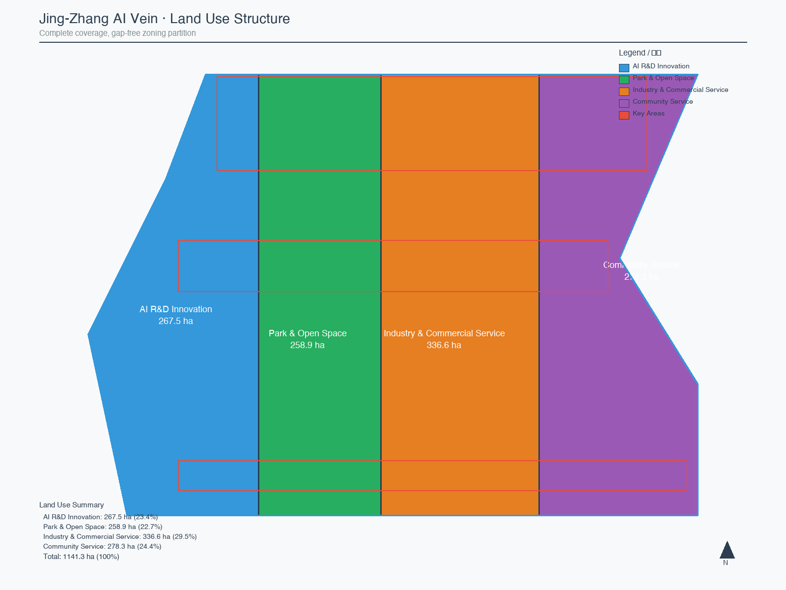
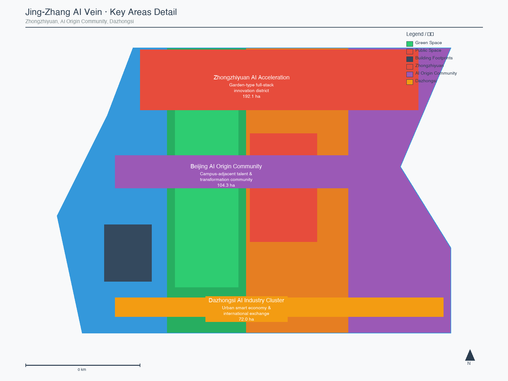
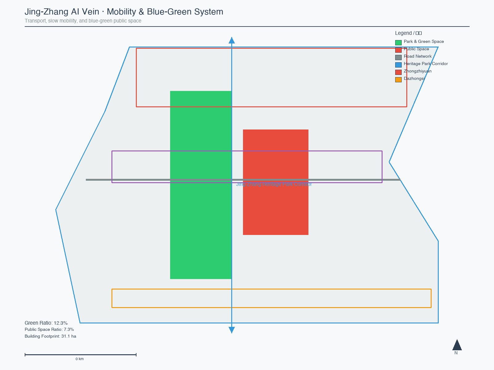
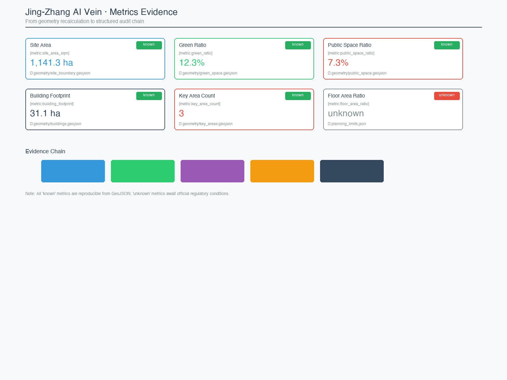

# Jing-Zhang AI Vein: Regenerating a Centennial Railway Corridor for AI Innovation

## Design Basis and Source Inventory

This formal proposal takes the *Qualification Pre-Announcement for the Centennial Jing-Zhang AI Innovation Belt International Urban Design Scheme Solicitation*, issued by the Beijing Municipal Planning and Natural Resources Commission Haidian Branch, as its primary authority. Machine-readable dependencies include the maintainer-registered provisional boundaries, key areas, enumerations, metrics, and source inventories in `brief/site-package/`. Before generating the proposal, the AI agent must read `design_brief.json`, `allowed_design_space.json`, `sources.json`, `enums/`, `ranges/`, `schemas/`, `data/source_registry.json`, and `data/processed/agent_fact_pack.md`, and use `project_scope_summary.csv`, `agent_task_requirements.csv`, `source_use_matrix.csv`, and `missing_data_checklist.csv` to build task, scope, source-use, and data-gap inventories. All design judgments must decompose into traceable sources, reproducible metrics, verifiable geometry layers, and human-reviewable assumptions. The announcement requires the proposal to reach the urban-design depth of a regulatory detailed plan and a comprehensive planning implementation scheme; therefore, narrative text cannot substitute for GeoJSON, metrics tables, A3 booklets, A0 boards, and HTML electronic exhibit deliverables.

The proposal is not an independent vision document but is organized from the announcement, the agent open-call taskbook, and the site package. This section places only the most critical authorities next to the relevant judgments [source:OFFICIAL-ANNOUNCEMENT] [source:AGENT-TASKBOOK] [depth:existing_conditions_diagnosis]. Complete source and standard coverage is preserved in `sources.json`, `standard_matrix.json`, and `design_depth_matrix.json`; machine indexes are not duplicated in the narrative.

The source registry's usage boundaries are as follows [source:SOURCE-REGISTRY]:

- `data/source_registry.json` registers usage boundaries for public, cleared, and provisional materials.
- Current registry summary: 7 formal-use sources, 1 background source, 1 provisional-only source.
- The agent must not upgrade background_only or provisional_only sources to official boundary, statutory regulatory plan, formal scoring evidence, or government implementation commitment.

`data/processed/agent_fact_pack.md` is the proposal's reading-navigation layer, not a new authoritative source [source:PROCESSED-FACT-PACK]. It helps the agent organize the three-level scope, three key areas, announcement tasks, agent.1–agent.6, source availability, and data gaps into a readable proposal; factual judgments must still return to the registered primary materials [source:OFFICIAL-ANNOUNCEMENT] [source:AGENT-TASKBOOK], with complete source relationships preserved in `sources.json`.

When the official `SITE_BOUNDARY` or the three `KEY_AREA` polygons are not yet available, this package uses `brief/site-package/geometry/provisional_boundaries.geojson` to generate a provisional formal package. Both `geometry/site_boundary.geojson` and `geometry/key_areas.geojson` in the submission must be labeled as `provisional_constraint` with `official_boundary=false`; they may only be used for proposal generation, self-check, visualization, and design discussion, and must not serve as official redlines, approval bases, precise-area references, or statutory control conclusions. This organizer data gap does not block content scoring; after official polygons are replaced, site boundary, key areas, land use, roads, green space, public space, buildings, phasing, and metrics must all be recalculated.

The scorable status of this scaffold-generated package is: **provisional boundary, with precision caveats retained and recalculation pending official data release; content scoring is not blocked**. Therefore, all spatial structures, scenarios, projects, and metrics in the narrative are written as "discussable, reviewable, and recalculable after official boundary replacement"; when official boundaries and key-area polygons are updated, the agent must rerun the scaffold, self-check, and drawing/HTML generation, not merely swap individual files.

Boundary interpretation returns to the overall scope layer and area recalculation [data:geometry/site_boundary.geojson#SITE-001] [metric:site_area_sqm]. The three key areas are verified by independent layers and quantitative metrics [data:geometry/key_areas.geojson#PROV-KEY-001] [metric:key_area_count]. Readers can enter the evidence from the narrative without first reading a string of machine IDs.

## Three-Level Scope Working Framework

The proposal organizes work across three levels defined by the announcement: the Coordinated Research Area (43.6 km²) addresses AI industry ecology, strategic positioning, innovation chains, and future urban form; the Overall Design Area (11.4 km²) covers the urban area and industrial districts within 1–2 km of the Jing-Zhang Heritage Park, requiring an overall urban renewal framework, industrial spatial layout, transportation-municipal support, and urban character controls; the Key Detailed Design Area (368.4 ha, three sub-areas) requires clear functional programs, building scale, retain-renovate-demolish classification, public-space connectivity, and traffic organization. All three levels are mapped entry-by-entry in `compliance_matrix.json`, ensuring that announcement sections 1.3, 1.4, 1.5 and agent.1–agent.6 mandatory tasks each have chapter, layer, metric, drawing, and HTML evidence.

The depth items for the three-level framework are constrained by [depth:three_level_scope_framework] and [depth:overall_spatial_structure]; spatial evidence is anchored to [data:geometry/site_boundary.geojson#SITE-001] and [data:geometry/key_areas.geojson#PROV-KEY-001]; task authority follows [standard:PROJECT-OFFICIAL-ANNOUNCEMENT]; the scope index is navigated via `project_scope_summary.csv` in [source:PROCESSED-FACT-PACK].

The three levels are not isolated drawing sets. Coordinated research determines industry-chain and urban-form judgments; overall design translates those judgments into renewal projects, spatial structure, and facility capacity; key-area detailed design validates the implementability of specific parcels, buildings, transit, public space, and AI application scenarios. When generating the proposal, the agent must first lock the official or provisional boundary and constraints adopted, then generate land use, buildings, roads, green space, public space, phasing, and AI service nodes, and finally recalculate metrics from those layers and explain in the narrative which conclusions remain subject to provisional-boundary limitations. Any area, ratio, scale, or project count that cannot be reproduced from structured data must not appear in formal conclusions.

The proposal's overall concept is the "Jing-Zhang AI Vein Symbiosis Belt": using the Jing-Zhang Heritage Park as the historical and public-space main axis, with the three key areas of Zhongzhiyuan, Beijing AI Origin Community, and Dazhongsi as innovation anchors, and universities, enterprises, communities, and rail stations as the daily network, forming a spatial organization of "one belt, three cores, multi-point scenarios, and a blue-green slow-mobility composite ring." Here, the "one belt" is not a newly drawn redline but a translation of the announcement's three-level scope into a working method; the "three cores" correspond to the three key areas; "multi-point scenarios" correspond to operable nodes for AI+ public services, industry services, and urban life; the "composite ring" corresponds to the linkage of slow mobility, green space, public space, and activity routes.

| Level | Design Question | Proposal Response | Data Anchor |
| --- | --- | --- | --- |
| Coordinated Research | How to organize the AI industry ecology and future urban form | Build an innovation chain of "university sourcing → open-source collaboration → enterprise transformation → public experience → international communication" | compliance_matrix.json, standard_matrix.json |
| Overall Design | How to map industry space, urban renewal, transit-municipal, and character | Expressed jointly through land-use, building, road, green-space, public-space, and phasing layers | [data:geometry/land_use.geojson#LU-001], [data:geometry/roads.geojson#ROAD-001] |
| Key Detailed Design | How the three sub-areas reach detailed-design depth | Positioning, spatial moves, AI scenarios, and implementation dependencies for each | [data:geometry/key_areas.geojson#PROV-KEY-001], [data:geometry/key_areas.geojson#PROV-KEY-002], [data:geometry/key_areas.geojson#PROV-KEY-003] |

## Coordinated Research: Industry and Future City

The core task of the Coordinated Research Area is to build a world-class AI innovation ecosystem. The proposal should survey Haidian's universities and research institutes, leading enterprises, computing-algorithm-data factors, incubation platforms, listed companies, unicorns, and technology-service resources, and propose a spatial coordination framework for the AI innovation chain, industry chain, talent chain, and urban-service chain. The naming scheme and logo design should serve the overall recognizability of the "Centennial Jing-Zhang Cultural Belt, Urban AI Life Experience Belt, and AI Convergence Innovation Belt," not stop at slogans, and should explain the connection to industry ecology, public space, and cultural resources. The agent open-call taskbook also requires responses to the "five functions" and "three areas + two wings" coordination, forming a naming system, visual identity, overall spatial structure diagram, scenario opening, and operational mechanisms that can be further deepened; this section must use [source:AGENT-TASKBOOK] and [standard:PROJECT-AGENT-OPEN-CALL-TASKBOOK] to label these requirements as originating from the agent open-call task, not statutory planning controls.

Coordinated research does not introduce pseudo-precise redlines; it returns to [standard:MOHURD-URBAN-DESIGN-MEASURES] for urban character, public space, and building-layout coordination, connecting back to [data:geometry/land_use.geojson#LU-001], [data:geometry/public_space.geojson#PUBLIC-001], and [depth:overall_spatial_structure] to show that industry strategy ultimately lands in visible, reviewable spatial structure.

Future urban form research should answer how AI transforms work, life, social interaction, learning, transportation, and public services. The proposal should translate AI transportation systems, continuous green space, innovation service facilities, and an internationalized live-work atmosphere into locatable functional zones, nodes, corridors, and scenarios, rather than vaguely describing technology visions. The agent should write industry-strategy metrics, AI innovation indices, talent density, spatial-supply types, and AI+ vertical-application focus areas into the metrics system, labeling which are official, which are design proposals, and which still await official-data calibration. If proposing global AI innovation events, developer communities, open scenarios, or pilgrimage routes, they should be written as "conceptual suggestions / reference schemes / for professional team deepening," not as confirmed government events or implementation arrangements.

## Overall Design: Urban Renewal and Regulatory-Plan-Depth Urban Design

The Overall Design Area requires urban-design depth equivalent to a regulatory detailed plan. The proposal must present an overall urban-renewal spatial structure, low-efficiency space identification, renewal project list, implementation policy recommendations, industry-function ratios, spatial organization models, total building scale, and comprehensive carrying-capacity assessment. `geometry/land_use.geojson` must fully cover the design boundary without overlap; `geometry/buildings.geojson` should express renewal or retained building footprints; `geometry/roads.geojson` should express micro-circulation, slow-mobility, and rail-transfer relationships; `metrics.json` should recalculate core areas, ratios, and layer counts.

This section decomposes regulatory-plan-depth content into reviewable objects per [standard:MOHURD-CONTROL-DETAILED-PLANNING]: [data:geometry/land_use.geojson#LU-001] expresses land-use structure, [data:geometry/buildings.geojson#BLDG-001] expresses building footprints, [data:geometry/roads.geojson#ROAD-001] expresses traffic organization, [metric:building_footprint_area_sqm] is used to verify building footprint area, and [depth:land_use_layout] and [depth:development_intensity_controls] constrain deliverable depth.

Overall design must also support transportation, rail, municipal, and supporting facilities. The proposal should address rail-station integration, road micro-circulation, bicycle parking, parking supply, innovation service platforms, talent living services, new infrastructure, distributed energy, and edge computing with spatial layout and implementation pathways. Content involving building height, development intensity, road redlines, setbacks, and facility standards, where official control conditions are absent, should be written as "pending official regulatory-plan conditions," not presented as agent-speculated approved indicators.

## Key Area Detailed Design

Key-area detailed design is mandatory. The Zhongzhiyuan AI Autonomous Innovation Acceleration Area should address national AI platforms, full-stack autonomous innovation, standards development, safety governance, industry exhibition, external transportation, Qinghe River culture, low-carbon green innovation exchange environments, and green-space AI scenarios. The Beijing AI Origin Community should address campus-adjacent innovation, achievement incubation and transformation, talent special zones, open-source systems, brand events, building retain-renovate-demolish, achievement display and release, residential living配套, campus-park slow-mobility connections, and rail-station integration. The Dazhongsi AI Industry Cluster should address leading enterprises, AI agents, smart terminals, content consumption, data factors, digital assets, commercial services, composite use of planned green space, Dazhongsi Station integration, and four-quadrant pedestrian connectivity at intersections.

The three key-area detailed designs must reference [data:geometry/key_areas.geojson#PROV-KEY-001], [data:geometry/key_areas.geojson#PROV-KEY-002], and [data:geometry/key_areas.geojson#PROV-KEY-003], and are checked by [depth:three_key_area_detailed_design] for whether they reach the depth of a comprehensive planning implementation scheme. If only "creating a demonstration zone" is described without functional, building, transit, public-space, and implementation-project evidence, it is considered incomplete.

The three key areas must appear in `geometry/key_areas.geojson`. If official polygons are available in the repository, they should be used as `official_constraint`; if official polygons are missing, `provisional_constraint` may be used temporarily, but the narrative, HTML, sources, assumptions, and self_check must state that they cannot serve as formal scoring or approval bases. `compliance_matrix.json` should cover announcement sections 1.5.3.1, 1.5.3.2, and 1.5.3.3 respectively. Design expression should include functional programs, building scale, building form, retain-renovate-demolish classification, public-space systems, traffic organization, slow-mobility connectivity, and implementation projects. The HTML page should support switching between the three key areas; the A3 booklet and A0 boards should include at least a key-area overview, partial detail, and metrics explanation.

| Key Area | Design Positioning | Spatial Moves | AI Industry & Operation Scenarios | Evidence |
| --- | --- | --- | --- | --- |
| Zhongzhiyuan AI Acceleration | Garden-type full-stack autonomous innovation district | Strengthen Qinghe interface, industry exhibition, low-carbon innovation exchange, and external transit; use green space for open testing and standards-governance display | Autonomous model testing, standards workshops, safety-governance display, low-carbon computing experience | [data:geometry/key_areas.geojson#PROV-KEY-001], [depth:three_key_area_detailed_design] |
| Beijing AI Origin Community | Campus-adjacent transformation & talent community | Organize campus-park-street slow-mobility stitching; supplement achievement release, talent services, residential living, and open-source collaboration space | Open-source community, achievement release, talent-zone services, campus-adjacent incubation | [data:geometry/key_areas.geojson#PROV-KEY-002], [source:AGENT-TASKBOOK] |
| Dazhongsi AI Industry Cluster | Urban smart-economy & international exchange district | Center on Dazhongsi Station integration, four-quadrant pedestrian connectivity, commercial services, and key-enterprise public-environment renewal | AI agent and smart-terminal display, content consumption, data factors, international roadshow | [data:geometry/key_areas.geojson#PROV-KEY-003], [metric:key_area_count] |

## AI Innovation Ecosystem, User Personas, and AI+ Scenarios

The proposal should build spatial demand profiles for AI talent and enterprises, covering R&D office, open-source collaboration, achievement release, enterprise services, talent housing, social learning, consumer life, sports and leisure, and international exchange. AI+ scenarios should address the directions proposed in the announcement—transportation, services, consumption, healthcare, education, law, and life services—forming both industry-development scenarios and AI-empowered urban-function scenarios. Each scenario should specify service targets, spatial location, data sources, privacy boundaries, human-review mechanisms, and operating entities.

AI scenarios must land in spatial and governance boundaries: public-space scenarios reference [data:geometry/public_space.geojson#PUBLIC-001], slow-mobility and transit scenarios reference [data:geometry/roads.geojson#ROAD-001], and open-space scenarios reference [data:geometry/green_space.geojson#GREEN-001] and [metric:public_space_ratio], [metric:green_ratio]. These references let reviewers know that scenarios are not slogans but design objects located in specific layers and metrics. The agent open-call taskbook requires at least 10 AI scenario cards, at least 3 industry test-and-verification scenarios, and at least 5 user persona types; the scaffold only provides structure, and formal participants must write scenario cards, persona tables, privacy boundaries, human-review mechanisms, and operating entities into the narrative, HTML, A3/A0, and compliance matrix.

| User Persona | Typical Needs | Spatial Response | Self-Check Boundary |
| --- | --- | --- | --- |
| Open-source developer | Release, collaboration, testing, community reputation | Origin Community open-source release hall, public code wall, nighttime collaboration space | No personal behavior tracking; activity data is aggregate-only |
| Startup team | Low-cost office, computing access, product testbed | Zhongzhiyuan shared testing ground, edge-computing service points, standards-governance consulting | Computing and data services require separate authorization |
| Leading-enterprise visitor | Exhibition, business, international reception, talent recruitment | Dazhongsi international roadshow parlor, rail-station transfer, key-enterprise surrounding public space | Enterprise logos and cases must be cleared |
| Surrounding resident | Commuting, leisure, community services, low-disturbance renewal | Heritage Park slow-mobility ring, embedded community services, tiered nighttime lighting and activities | Resident profiles not used for commercial recommendation |
| University faculty/student | Achievement transformation, cross-campus collaboration, daily slow-mobility | Campus-park slow-mobility stitching, achievement transformation stations, AI education experience points | Campus data and research achievements require authorization |

| Scenario Card | Spatial Carrier | Design Description |
| --- | --- | --- |
| 01 Open-Source Release Hall | Beijing AI Origin Community | For universities, open-source communities, and startup teams; provides achievement release, code-contribution display, and small-scale roadshow space |
| 02 Safety Governance Sandbox | Zhongzhiyuan | Translates standards development, safety evaluation, and model red-team testing into visitable, bookable, and supervisable display and collaboration nodes |
| 03 Edge Computing Station | Overall Design Area nodes | Combined with public services, enterprise services, and low-carbon energy strategy, as a new-infrastructure prototype for further deepening |
| 04 AI Slow-Mobility Navigation | Heritage Park activity belt | Uses explainable signage and low-intrusion sensing to identify slow-mobility breakpoints, congestion nodes, and accessibility needs |
| 05 Dazhongsi International Roadshow Parlor | Dazhongsi AI Industry Cluster | Serves AI-agent, smart-terminal, and content-consumption enterprises with display, negotiation, media release, and international exchange |
| 06 Qinghe Low-Carbon Innovation Corridor | Zhongzhiyuan Qinghe interface | Combines green space, stormwater, walking and cycling, and AI display as the district's public parlor |
| 07 Campus-Adjacent Transformation Street | Beijing AI Origin Community | For university achievement transformation; organizes incubation, display, legal, IP, and investment services |
| 08 Data Factor Parlor | Dazhongsi area | On the premise of compliance, authorization, and auditability, displays the urban-service interface for data-factor and digital-asset circulation |
| 09 AI Life Service Model Street | Community and commercial intersection | Places healthcare, education, legal, and life-service AI+ scenarios into operable small-scale street spaces |
| 10 Global AI Activity Week Route | One-belt public-space system | Forms a walkable, communicable experience route from heritage culture, open-source community, industry display, to international roadshow |

AI governance recommendations generated by the agent must follow data-minimization, public-source, explainability, and human-review principles. Urban AI agents may assist in identifying slow-mobility breakpoints, public-space heat maps, facility maintenance, enterprise-service demand, and event-safety risks, but cannot replace planning approval, cannot output unauthorized personal profiles, and cannot claim official implementation commitments. All AI scenario nodes should enter structured layers or the compliance matrix so reviewers can see their relationships to industry, space, and public interest.

## Land Use, Building Scale, and Retain-Renovate-Demolish

The land-use plan should follow public standards for territorial-space survey, planning, and use-control classification, forming a complete, closed, gap-free zoning partition. The building plan should distinguish retained, renovated, renewed, newly built, or pending-confirmation objects, specifying building footprint, function, scale, character, roof, massing, and height-control recommendation levels. If current-condition buildings, ownership, regulatory plans, and engineering conditions are missing, the proposal can only offer methods and pending-calibration lists, not fabricate retain-renovate-demolish conclusions.

Land-use classification follows [standard:MNR-LAND-USE-CLASSIFICATION-GUIDE]; building height, massing, interface, and character controls are managed by [depth:height_massing_character]; retain-renovate-demolish methods are managed by [depth:retain_renovate_demolish]. Primary evidence for land use and buildings is [data:geometry/land_use.geojson#LU-001], [data:geometry/buildings.geojson#BLDG-001], and [metric:building_footprint_area_sqm].

Building-scale and intensity metrics must be consistent with `metrics.json` and geometry layers. If total building scale, FAR, building height, building density, green ratio, setback, and building control line lack official conditions, they should uniformly use `status=unknown`, with `reason` / `assumptions` explaining pending conditions, current assumptions, and the recalculation path after official data arrives, without using fixed values to create false precision. The A3 booklet should provide a renewal project list and metrics verification table; the A0 boards should express key spatial structure and key areas clearly; the HTML page should provide linked metrics and layer viewing.

## Transportation, Rail, Municipal, and Public Service Facilities

The transportation plan should respond to the announcement's requirements for rail-station integration, road micro-circulation, slow-mobility breakpoints, external transportation, parking, bicycle parking, and green transportation systems. Key coverage should include the North Fifth Ring Road, Heritage Park cross-ring-road nodes, Wudaokou, Qinghua East Road West Exit, Dazhongsi Station, and key-enterprise surrounding traffic connections. Road and slow-mobility layers should stay within the submission boundary and cross-check with public space, green space, industry nodes, and key areas; if the submission boundary is provisional, traffic conclusions can only serve as temporary design discussion.

Transportation and municipal professional depth are constrained by [depth:traffic_rail_slow_parking] and [depth:municipal_new_infrastructure] respectively; layer evidence references [data:geometry/roads.geojson#ROAD-001], [data:geometry/public_space.geojson#PUBLIC-001], and [data:geometry/constraints.geojson#CONSTRAINTS]. When road redlines, pipelines, fire safety, and municipal conditions are missing, assumptions should document the pending items rather than presenting strategies as approved conditions.

Municipal and public service facilities should cover AI industry service facilities, innovation service platforms, talent living service facilities, new infrastructure, distributed energy, edge computing, and integration with traditional municipal facilities. The proposal should specify facility standards, spatial layout, service radius, operating models, and phased implementation logic. Missing pipeline, energy, drainage, flood control, and fire safety data should be listed as formal deepening prerequisites.

## Blue-Green Space, Public Space, and Urban Character

The blue-green space plan should use the Jing-Zhang Heritage Park activity belt as its backbone, coordinating the Qinghe River, Xiaoyue River, surrounding universities, enterprises, and community travel needs, proposing a north-south through and east-west connected system of walking paths, cycling lanes, and green spaces. The proposal should identify slow-mobility breakpoints, cross-ring-road nodes, and north/south-end landscape nodes, proposing composite-use strategies for parking, sports, innovation exchange, technology testing, application display, and public services.

Blue-green public space is jointly verified by design depth items and green/public-space layers [depth:blue_green_public_space] [data:geometry/green_space.geojson#GREEN-001] [data:geometry/public_space.geojson#PUBLIC-001]. Green and public-space ratios are explained in the narrative for their design significance; complete recalculation is preserved in `metrics.json`; urban character, public space, and building-control coordination returns to the professional standards matrix [standard:MOHURD-URBAN-DESIGN-MEASURES].

The urban character plan should fuse Jing-Zhang railway history, Zhongguancun innovation culture, and AI innovation culture, leveraging resources like Qinghuayuan Railway Station and Beijing Film Academy, proposing urban tone, building character, roof form, massing, interface, and public-art guidance. The agent should also propose signage, cultural symbols, international communication narratives, AI pilgrimage landmarks, and contribution walls or honor display systems, but all brand, font, image, portrait, and enterprise-logo assets must have cleared sources. Character controls should distinguish official controls, design proposals, and pending conditions; pseudo-precise control lines without heritage-protection or regulatory-plan basis are strictly prohibited.

## Renewal Project List, Implementation Policy, and Phasing

The implementation plan should form a reviewable renewal project list specifying project location, type, function, responsible entity, dependencies, implementation phase, risks, and evaluation metrics. Policy recommendations should cover urban renewal coordinated implementation, spatial supply, operational mechanisms, industry services, public participation, data governance, and property-rights coordination. `geometry/phasing.geojson` should express phasing ranges; `compliance_matrix.json` should link each task to phasing and drawings.

The project list and phasing depth are managed by [depth:renewal_project_list] and [depth:phasing_implementation]; phasing spatial evidence is [data:geometry/phasing.geojson#PHASE-001]. If ownership, funding, implementation entities, and approval pathways are absent, the proposal must write these as implementation risks, not commitments to delivery.

| Project No. | Project Name | Type | Key Dependencies | Evidence |
| --- | --- | --- | --- | --- |
| JZ-01 | Heritage Park slow-mobility breakpoint stitching | Public space / Transit | Road redline, under-bridge space, traffic organization review | [data:geometry/roads.geojson#ROAD-001] |
| JZ-02 | Zhongzhiyuan Qinghe innovation interface | Blue-green / Industry display | River blue line, ecological and flood-control conditions | [data:geometry/green_space.geojson#GREEN-001] |
| JZ-03 | Origin Community campus-adjacent transformation street | Urban renewal / Industry service | Campus boundary, ownership, ground-floor uses | [data:geometry/buildings.geojson#BLDG-001] |
| JZ-04 | Dazhongsi Station four-quadrant pedestrian connectivity | Rail integration / Slow mobility | Rail station, road intersection, municipal pipelines | [data:geometry/public_space.geojson#PUBLIC-001] |
| JZ-05 | AI public service and edge-computing nodes | New infrastructure / Public service | Energy, computing, security, operating entity | [data:geometry/constraints.geojson#CONSTRAINTS] |
| JZ-06 | Global AI Activity Week public route | Operation / Brand | Public space permits, event safety, copyright clearance | [data:geometry/phasing.geojson#PHASE-001] |

Phasing should distinguish between the 100-day solicitation design cycle and implementation phasing: the solicitation cycle is the submission deadline; implementation phasing is the advancement path for urban renewal and project construction. The proposal should present near-term pilots, mid-term renewal, and long-term governance frameworks, indicating which content can start with lightweight facilities, operational activities, and service platforms, and which must await official regulatory, municipal, transportation, and ownership conditions. For annual event systems, developer community operations, scenario open days, public experience routes, and international communication mechanisms, the narrative should specify operating targets, frequency, responsibility boundaries, conversion pathways, and risks, not just promotional slogans.

## Metrics System, Area Recalculation, and Compliance Matrix

The metrics system should include at minimum: overall design area, key-area areas, green and public-space ratios, building footprint, renewal project count, AI scenario nodes, slow-mobility connectivity metrics, industry-space metrics, talent-service metrics, and self-check status. All known metrics must be reproducible from GeoJSON or credible sources; unknown metrics must provide reasons and formal-submission prerequisites. Results from `scripts/spatial_review.py` and `scripts/visual_review.py` are important evidence for formal self-check.

Metric recalculation follows the unified design-depth requirement [depth:metrics_recalculation]. The narrative focuses on explaining the design significance of metrics—for example, how the overall scope constrains spatial allocation and how blue-green and public-space ratios support daily interaction; complete values, formulas, source files, and confidence levels are preserved in `metrics.json`. Example key metrics can be verified from the overall scope and green-space data [metric:site_area_sqm] [data:geometry/green_space.geojson#GREEN-001].

The compliance matrix is the master file for task responsiveness. Each announcement task and agent_taskbook task must correspond to report sections, layers, metrics, drawings, HTML pages, sources, assumptions, and self-check items. Failure to cover any mandatory task in announcement 1.3, 1.4, 1.5 or agent.1–agent.6 prevents the proposal from entering formal professional scoring.

During formal deepening, the agent should also classify each metric into three categories: first, spatial metrics reproducible directly from submitted geometry, such as boundary area, green ratio, public-space ratio, building footprint area, and phasing area; second, control metrics requiring official regulatory-plan or taskbook-attachment support, such as FAR, building height, building density, setback, road redline, and facility standards; third, performance metrics requiring operational or industry data for continuous calibration, such as AI innovation index, talent density, industry-service satisfaction, slow-mobility accessibility, event participation, and scenario usage frequency. These three categories should enter `metrics.json`, `assumptions.json`, and `compliance_matrix.json` respectively, avoiding mistaking operational vision for approved planning conditions.

## Risk, Copyright, and Compliance Statement

**Bilingual requirement.** The proposal main file may use Chinese or English, but must provide a complete counterpart translation via `proposal.en.md` or `proposal.zh.md`; A3/A0, HTML, and text-bearing figures must also provide corresponding language counterparts. When a v2 package lacks any required translation, language mapping, or valid file, finalize and CI will block submission. All images, drawings, icons, data, and code assets must document source, license, and authorization status in `sources.json` or `report/copyright_statement.md`. HTML pages must not load remote scripts, remote map tiles, remote fonts, iframes, forms, or external APIs, and must not track reviewer behavior.

Risk and data-gap lists are jointly verified by risk depth items, the constraints layer, and the site package [depth:risk_missing_data] [data:geometry/constraints.geojson#CONSTRAINTS] [source:SITE-PACKAGE]. Missing official boundary, key-area, regulatory, road, parcel, building, municipal, heritage-protection, and public-service data listed in `missing_data_checklist.csv` must enter `assumptions.json`, self-check, and the narrative risk chapter. Any conclusion lacking official regulatory, road-redline, ownership, municipal, fire-safety, or heritage-protection conditions must be downgraded to a pending item; complete professional verification is preserved in the standards matrix.

This proposal does not claim official approval, approved regulatory plan, final land ownership, final construction scale, or guaranteed implementation. The AI agent is responsible for facts, sources, copyright, spatial data, metrics, and expression; maintainers and professional reviewers may require rework or rejection based on self-check results, spatial review, and the compliance matrix.

## References

- brief/public-brief.md
- brief/site-package/design_brief.json
- brief/site-package/allowed_design_space.json
- brief/site-package/enums/
- brief/site-package/ranges/planning_limits.json
- data/processed/agent_fact_pack.md
- data/processed/project_scope_summary.csv
- data/processed/agent_task_requirements.csv
- data/processed/source_use_matrix.csv
- data/processed/missing_data_checklist.csv
- Complete machine indexes: see `sources.json`, `metrics.json`, `compliance_matrix.json`, `standard_matrix.json`, and `design_depth_matrix.json`
- This section's bibliography entry is based on the site package registration; complete citations and licenses are in the structured source list [source:SITE-PACKAGE]
