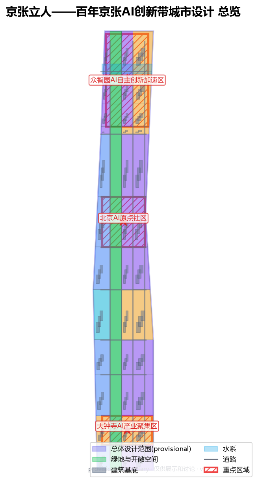
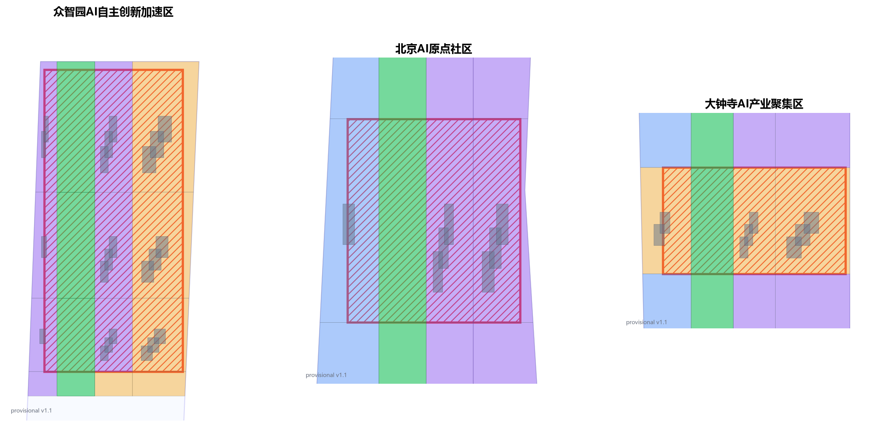
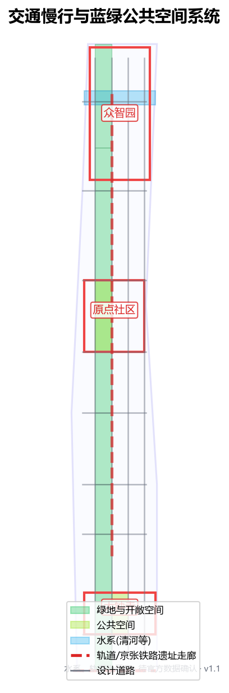
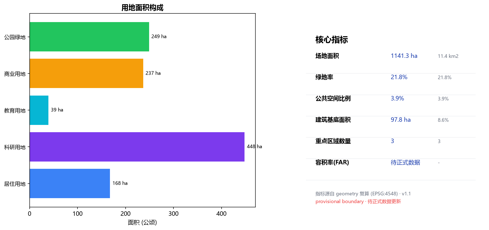

# Jing-Zhang Standing for People — A Human-Centered Urban Design for the Centennial Jing-Zhang AI Innovation Belt

## Design Basis and Source List

This proposal draws on four categories of public or cleared material. First, the Pre-qualification Announcement and its public brief issued by the Haidian Branch of the Beijing Municipal Commission of Planning and Natural Resources are the master basis for the three scope levels, three key areas, design tasks, expression depth and deliverable context [source:OFFICIAL-ANNOUNCEMENT]. Second, the agent-facing open-call taskbook supplements ten co-creation principles, a continuous-participation loop, three positioning statements, five functions, the three-areas-two-wings structure and six required agent tasks [standard:PROJECT-AGENT-OPEN-CALL-TASKBOOK] [source:AGENT-TASKBOOK]. Third, the registered project site package provides land-use codes, layer enums, planning limits and source-usability boundaries [source:SITE-PACKAGE]. Fourth, the public-source and provisional-source registries let the proposal distinguish materials that are formal-ready, background-only, or provisional-intake-only [source:SOURCE-REGISTRY].

This proposal does not claim access to non-public planning drawings, non-public spatial data or internal indicators. The announcement gives only textual boundaries and approximate areas for the three scope levels, with no coordinate-verified precise polygons, regulatory-plan conditions or existing-condition data. Therefore the overall-design-area boundary and the three key-area boundaries used here are all repository-registered provisional boundaries, usable only for generation, self-check, visualization and design discussion — not as official redline, approval basis or precise-area basis [data:geometry/site_boundary.geojson#SITE-001] [data:geometry/key_areas.geojson#PROV-KEY-001]. This data gap does not block content scoring; once official or cleared polygons are obtained, every layer, drawing, HTML page and metric in this proposal must be recomputed with the boundary, not just a single file replaced [depth:risk_missing_data].

The naming, logo, spatial structure and all scenarios of this proposal revolve around one judgment: the Centennial Jing-Zhang AI Innovation Belt should be a human-centered belt. AI innovation must ultimately let people stand firm, go further and live better; urban renewal must finally return the railway heritage to the people who live, work and create here, rather than to a technology narrative alone [standard:PROJECT-AGENT-OPEN-CALL-TASKBOOK]. This judgment runs through all thirteen chapters and is what distinguishes this proposal from approaches that only do branding or only write grand narratives.

## Three-Level Scope Framework

The proposal follows the three levels set by the announcement strictly. The coordinated research area is about 43.6 km², focused on the AI industry ecosystem, strategic positioning, innovation chain and future-city form [data:geometry/site_boundary.geojson#SITE-001]. The overall design area is about 11.4 km² and is where this proposal is formally drawn, requiring an urban-renewal framework, industry-space layout, transport/municipal support and urban-character control. The key detailed-design area is about 3.68 km², the three detailed-design districts, requiring clear function, building scale, retain-renovate-demolish classification, public-space connectivity and transport organization [metric:key_area_count].

The three scope levels are mapped item by item in compliance_matrix.json, ensuring every mandatory task in announcement 1.3, 1.4, 1.5 and agent.1 to agent.6 has a chapter, layer, metric, drawing and HTML evidence. Coordinated research sets industry-chain and city-form judgments; overall design turns them into renewal projects, spatial structure and facility capacity; key-area detailed design validates specific parcels, buildings, transport, public space and AI scenarios [depth:three_level_scope_framework]. Any area, ratio, scale or project count not recomputable from structured data is not written as a formal conclusion.

This proposal's overall concept is Jing-Zhang Standing for People: the Jing-Zhang Heritage Park ground-stitching belt as the historical and public-space spine; Zhongzhiyuan, the Beijing AI Origin Community and Dazhongsi as three innovation anchors; universities, enterprises, communities and rail stations as the daily network — forming a spatial organization of one belt, three cores, two wings stitching, and walkable everyday innovation blocks [depth:overall_spatial_structure]. The belt is not a newly drawn red line but a working method translated from the three scope levels; the three cores map to the three key areas; the two wings are the Zhongguancun technology-service wing (west) and the Xiaoyuehe scenario-empowerment wing (east); stitching is the spatial verb of the whole proposal — reconnecting the ground fragmented by the Jing-Zhang railway and urban expressways into a continuous walkable, stayable, sociable urban surface.

| Level | Design question | Proposal answer | Data anchor |
| --- | --- | --- | --- |
| Coordinated research area | How to organize the AI industry ecosystem and future city form | Build an innovation chain of source-collaborate-convert-experience-spread | compliance_matrix.json, standard_matrix.json |
| Overall design area | How to draw industry space, urban renewal, transport, municipal and character | Land use, buildings, roads, green space, public space and phasing layers together | [data:geometry/land_use.geojson], [data:geometry/roads.geojson] |
| Key detailed-design area | How the three districts reach detailed-design depth | Separate positioning, spatial moves, AI scenarios and implementation dependencies | [data:geometry/key_areas.geojson#PROV-KEY-001], [data:geometry/key_areas.geojson#PROV-KEY-002], [data:geometry/key_areas.geojson#PROV-KEY-003] |

## Coordinated Research Area: Industry and Future City Research

The core task of the coordinated research area is to build a world-class AI innovation ecosystem, answering how AI changes work, life, socializing, learning, transport and public services. This proposal breaks the AI innovation chain into five spatially承载 links: university/institute sourcing, open-source community collaboration, enterprise conversion, public-space experience, and international dissemination. Naming and logo serve the overall identity of human-centeredness, century Jing-Zhang and AI fusion, and must explain their link to the industry ecosystem, public space and cultural resources rather than stop at slogans [standard:PROJECT-AGENT-OPEN-CALL-TASKBOOK].

This proposal presents 5+ global AI innovation ecosystem cases as transferable experience, translated as space and mechanism rather than brand stories:

1. Mila and the AI district in Montreal, Canada: university, enterprises and city co-build open datasets and a walkable research-living mixed block — translated into this proposal's near-campus mixed ground floor in the Origin Community.
2. Berlin Industry 4.0 and modular renewal, Germany: old plants lightly retrofitted to host SMEs — translated into this proposal's retain-renovate-first, restrained-new-build principle [depth:retain_renovate_demolish].
3. Kendall Square, Boston, USA: a 15-minute innovation circle from pharma to AI — translated into this proposal's 800 m walk-catchment of rail stations covering industry and life.
4. Punggol Digital District, Singapore: government-enterprise-university co-build distributed compute and open test streets — translated into this proposal's edge-compute stations + open test segments [depth:municipal_new_infrastructure].
5. The Alan Turing Institute and public participation, UK: citizen juries discussing AI governance — translated into this proposal's human-in-the-loop and public-review governance boundary [standard:PROJECT-AGENT-OPEN-CALL-TASKBOOK].
6. EPFL Innovation Park, Switzerland: campus-city borderless connection — translated into this proposal's campus-park-block slow-mobility stitching.
7. Daedeok, Daejeon, Korea: national labs共生 with local industry — translated into this proposal's Zhongzhiyuan-platform / Zhongguancun-service / Dazhongsi-conversion回路.

Future-city-form research must land on visible, auditable space: industry strategy finally lands on [data:geometry/land_use.geojson], [data:geometry/public_space.geojson] and [depth:overall_spatial_structure], not vague technology visions. Any global AI events, developer community, open scenarios or pilgrimage routes are written as concept suggestions / reference schemes / material for professional teams to deepen, never as confirmed government activities or implementation arrangements [depth:three_level_scope_framework].

## Overall Design Area: Urban Renewal and Regulatory-Plan-Depth Urban Design

![Land-use structure: research, residential, commercial-service and green/open-space zoning, provisional boundary, per Natural Zi Fa [2023] No.234](assets/figures/land-use-structure.en.png)
The overall design area must reach regulatory-plan-level urban-design depth. This proposal proposes a strategy of ground-stitching first, rail-station integration, and lightweight renewal of inefficient space, rather than wholesale demolition. The overall spatial structure is one belt, three cores, two wings stitching: the Jing-Zhang Heritage Park ground-stitching belt runs north-south; Zhongzhiyuan, the Beijing AI Origin Community and Dazhongsi form three innovation anchors; the Zhongguancun technology-service wing (west) and the Xiaoyuehe scenario-empowerment wing (east) extend industry service and scenario experience to both sides [depth:overall_spatial_structure].

Land use is expressed auditably: geometry/land_use.geojson fully covers the design boundary with no overlap; research, residential, commercial-service and green/open-space land are zoned by functional ratio [depth:land_use_layout]. Building renewal follows retain-renovate-first: with no existing-building, ownership or regulatory data, the proposal only proposes method and a to-be-calibrated list, never fabricates retain-renovate-demolish conclusions; FAR, building height, density and setback are uniformly unknown, with recalculation paths recorded in metrics.json and assumptions.json once formal conditions arrive [depth:development_intensity_controls]. Where official controls are absent, everything is written as pending formal regulatory confirmation, never as approved values [standard:MOHURD-CONTROL-DETAILED-PLANNING].

The overall design must also support transport, rail, municipal and public services: rail-station integration, road micro-circulation, non-motorized parking, parking supply, innovation-service platforms, talent-life services, new infrastructure, distributed energy and edge compute [depth:traffic_rail_slow_parking] [depth:municipal_new_infrastructure]. Where professional conditions are missing, the proposal states assumptions plus recalculation paths, never presenting strategy as approved conditions.

## Detailed Design of Key Areas

Key-area detailed design is mandatory. This proposal gives each of Zhongzhiyuan AI Acceleration Area, Beijing AI Origin Community and Dazhongsi AI Industry Cluster a readable mini-plan of positioning + spatial move + building renewal + transport/slow-mobility + public space + AI scenario + implementation risk, reaching planning-implementation-scheme depth [depth:three_key_area_detailed_design]. The three key-area geometries are at [data:geometry/key_areas.geojson#PROV-KEY-001], [data:geometry/key_areas.geojson#PROV-KEY-002], [data:geometry/key_areas.geojson#PROV-KEY-003]; because they are provisional, the following moves are directional and will be recomputed with official polygons [depth:risk_missing_data].

### Zhongzhiyuan AI Acceleration Area (North Core)

Positioned as a garden-style full-stack autonomous-innovation block. Spatial move: strengthen the Qinghe riverfront, national AI-platform showcase, low-carbon innovation interaction and external-transport organization; use green belts to host open testing and standards-governance showcase. Building renewal: retain existing R&D volumes, lightly retrofit, restrained new build. Transport: rail interchange and slow mobility first, stitch the Jingzang Expressway fragmentation with ground-level pedestrian bridges. Public space: continuous riverside green belt along the Qinghe, hosting standards workshops, safety-governance showcase and low-carbon compute experience [data:geometry/green_space.geojson]. AI scenarios: autonomous-model open test field, safety-governance sandbox — all written as concept suggestions, never as approved operations [depth:three_key_area_detailed_design].

### Beijing AI Origin Community (Middle Core)

Positioned as a near-campus achievement-conversion and talent community. Spatial move: stitch campus-park-block slow mobility, add achievement-release, talent service, residential-life and open-source collaboration space. Retain-renovate-demolish: retain and retrofit existing residential and teaching-research buildings; replace inefficient ground floors with shared innovation ground floors. Transport: Wudaokou and Qinghua East Road West intersections rail-bus integration first, fill slow-mobility gaps. Public space: continuous walking network from the middle Jing-Zhang Heritage Park to community squares. AI scenarios: open-source release hall, near-campus conversion street — serving students, young entrepreneurs and residents [data:geometry/public_space.geojson].

### Dazhongsi AI Industry Cluster (South Core)

Positioned as an urban intelligent-economy and international-exchange block. Spatial move: Dazhongsi-station integration, four-quadrant walk connectivity, commercial-service and key-enterprise public-environment renewal. Buildings: retrofit commercial and business volumes, embed intelligent-terminal, content-consumption and data-element showcase functions. Transport: Dazhongsi station as the core, organize pedestrian-priority four-quadrant connectivity, minimize disturbance to surrounding residents. Public space: station-front square and commercial inner streets. AI scenarios: international roadshow living room, data-element living room — all written as concept suggestions, never as confirmed investment or implementation arrangements [depth:three_key_area_detailed_design].

| Key district | Positioning | Spatial move | AI industry & operation scenarios | Evidence |
| --- | --- | --- | --- | --- |
| Zhongzhiyuan AI Acceleration Area | Garden-style full-stack autonomous innovation block | Strengthen Qinghe front, industry showcase, low-carbon innovation, external transport | Autonomous-model testing, standards workshops, safety-governance showcase | [data:geometry/key_areas.geojson#PROV-KEY-001] |
| Beijing AI Origin Community | Near-campus conversion & talent community | Campus-park-block stitching, open-source collaboration ground floor | Open-source release hall, near-campus incubation, talent service | [data:geometry/key_areas.geojson#PROV-KEY-002] |
| Dazhongsi AI Industry Cluster | Urban intelligent economy & international exchange block | Station-city integration, four-quadrant walk connectivity, commercial renewal | International roadshow, data-element showcase, content consumption | [data:geometry/key_areas.geojson#PROV-KEY-003] |

## AI Innovation Ecosystem, Personas and AI+ Scenarios

The proposal builds demand personas for AI talent, enterprises, residents and public governance, covering R&D office, open-source collaboration, achievement release, enterprise service, talent living, social learning, consumer life, sports-leisure and international exchange. AI+ scenarios span transport, service, consumption, medical, education, legal and life services; each states service object, spatial location, data source, privacy boundary, human-review mechanism and operating subject [standard:PROJECT-AGENT-OPEN-CALL-TASKBOOK].

Scenarios must land on space and governance boundaries: public-space scenarios cite [data:geometry/public_space.geojson], slow/transport scenarios cite [data:geometry/roads.geojson], open-space scenarios cite [data:geometry/green_space.geojson] with [metric:public_space_ratio], [metric:green_ratio]. City agents may help identify slow-mobility gaps, public-space heat, facility maintenance, enterprise-service demand and event-safety risk, but cannot replace planning approval, output unauthorized personal profiles, or claim official implementation commitment [depth:risk_missing_data].

### User personas (5+ categories)

| Persona | Typical need | Spatial response | Self-check boundary |
| --- | --- | --- | --- |
| Open-source developer | Release, collaborate, test, community reputation | Origin-community release hall, public code wall, night-collaboration space | No personal-behavior tracking; activity data aggregated only |
| Startup team | Low-cost office, compute access, product testbed | Zhongzhiyuan shared test field, edge-compute service point, standards consultation | Compute and data services need separate authorization |
| Head-enterprise visitor | Showcase, business, international reception, recruitment | Dazhongsi international roadshow living room, station interchange, enterprise public space | Enterprise marks and cases must be cleared |
| Nearby resident | Commute, leisure, community service, low-disturbance renewal | Jing-Zhang Heritage Park slow loop, embedded community service, graded night lighting | No resident profiling for commercial recommendation |
| University teacher/student | Achievement conversion, cross-campus collaboration, daily slow mobility | Campus-park stitching, conversion station, AI-education experience point | Campus data and research results need authorization |

### AI scenario cards (10+, with 3+ industry test/validation scenarios)

| Card | Spatial carrier | Design note | Type |
| --- | --- | --- | --- |
| 01 Open-source release hall | Beijing AI Origin Community | For universities, open-source communities and startups: achievement release, code-contribution showcase, small roadshow | Scenario |
| 02 Safety-governance sandbox | Zhongzhiyuan | Translate standards, safety evaluation, model red-teaming into visitable, bookable, supervised nodes | Industry test/validation |
| 03 Edge-compute station | Overall-design-area nodes | With public service, enterprise service and low-carbon energy as a new-infrastructure prototype to deepen | Industry test/validation |
| 04 AI slow-mobility navigation | Jing-Zhang Heritage Park belt | Explainable wayfinding and low-intrusion sensing for gaps, crowding, accessibility | Scenario |
| 05 Dazhongsi international roadshow living room | Dazhongsi cluster | Showcase, negotiation, media release, international exchange for agents, terminals, content | Scenario |
| 06 Qinghe low-carbon innovation corridor | Zhongzhiyuan riverside | Green space, stormwater, walking/cycling and AI showcase as park living room | Scenario |
| 07 Near-campus conversion street | Beijing AI Origin Community | Achievement conversion: incubation, showcase, legal, IP, investment-finance | Scenario |
| 08 Data-element living room | Dazhongsi | Compliance-, authorization-, audit-based urban service interface for data elements and digital assets | Industry test/validation |
| 09 AI life-service model street | Community/commerce junction | AI+ medical, education, legal, life services in a small operable block space | Scenario |
| 10 Global AI Activity Week route | Belt public-space system | Walkable, communicable route from heritage culture to open source to industry to roadshow | Scenario |
| 11 Accessibility-friendly navigation | Stations and park | Explainable paths and facility prompts for the elderly and mobility-limited | Scenario |
| 12 Community co-governance parlor | Residential community | Urban-renewal decisions, event arrangements, facility maintenance in a participable space | Scenario |

## Land Use, Building Scale and Retain-Renovate-Demolish

Land use follows the open national land-use/sea-use classification, forming a complete, seamless, gap-free partition [standard:MNR-LAND-USE-CLASSIFICATION-GUIDE]. Categories are mainly research, residential, commercial-service, and green/open space, fully covering and shown in [data:geometry/land_use.geojson]. Buildings distinguish retain, renovate, renew, new-build or to-be-confirmed; with no existing-building, ownership, regulatory or engineering data, the proposal only proposes method and a to-be-calibrated list, never fabricates conclusions [depth:retain_renovate_demolish].

Building scale and intensity must match metrics.json and layers. Where total building scale, FAR, height, density, green ratio, setback and building-control lines lack official conditions, status=unknown uniformly, with reasons and recalculation paths in assumptions — no fixed numbers faking precision [depth:development_intensity_controls]. The A3 booklet gives the renewal list and metric checklist; the A0 boards show key structure and key districts; the HTML page links metrics and layers interactively.

## Transport, Rail, Municipal Infrastructure and Public Services

Transport responds to the announcement's requirements for rail-station integration, road micro-circulation, slow-mobility gaps, external transport, parking, non-motorized parking and green transport, covering North 5th Ring, the Jing-Zhang Heritage Park expressway-crossing node, Wudaokou, Qinghua East Road West and Dazhongsi station [depth:traffic_rail_slow_parking]. Road and slow layers stay within the submitted boundary and cross-check with public space, green space, industry nodes and key districts; if the boundary is provisional, transport conclusions are also temporary design discussion [data:geometry/roads.geojson].

Municipal and public-service facilities cover AI industry-service facilities, innovation-service platforms, talent-life services, new infrastructure, distributed energy, edge compute and traditional municipal fusion [depth:municipal_new_infrastructure]. The proposal states facility standards, spatial layout, service radius, operation model and phasing logic; where pipeline, energy, drainage, flood-control or fire data are missing, they are listed as formal-deepening preconditions, not approved conditions.

## Blue-Green Network, Public Space and Urban Character

The blue-green scheme takes the Jing-Zhang Heritage Park vitality belt as the skeleton, coordinating Qinghe, Xiaoyuehe, surrounding universities, enterprises and communities, proposing north-south and east-west connected walks, cycleways and green-space systems, identifying slow-mobility gaps, expressway-crossing nodes and park north/south landscape nodes [depth:blue_green_public_space]. Blue-green public space is jointly checked by the depth item and the green/public-space layers [data:geometry/green_space.geojson] [data:geometry/public_space.geojson].

This proposal anchors its culture in the real Jing-Zhang heritage: the Jing-Zhang railway, opened in 1909 under Zhan Tianyou, overcame terrain with a switchback (ren-zi xing) line at Qinglongqiao and stands as a landmark of China's self-built railways; its former alignment is being reborn as the Jing-Zhang Railway Heritage Park (Haidian section), already a publicly accessible urban space. This history echoes Jing-Zhang Standing for People: Zhan Tianyou's pragmatic, human-centered engineering ethos - everyone contributing what they know - is the backdrop for using AI to serve people and return the heritage to them today [source:JINGZHANG-HERITAGE]. The logo takes the switchback's geometric motif, honoring engineering history while standing for human-centeredness.

Urban character fuses Jing-Zhang railway history, Zhongguancun innovation culture and AI innovation culture, using Qinghuayuan railway station and Beijing Film Academy resources to propose urban tone, building character, roof form, massing, interface and public-art guidance [standard:MOHURD-URBAN-DESIGN-MEASURES]. The proposal proposes signage, cultural symbols, international narrative, AI pilgrimage landmarks and a contribution wall, but all brands, fonts, images, portraits and enterprise marks need cleared sources; character control separates official control, design suggestion and to-be-confirmed conditions, strictly forbidding fake-precise control lines without heritage or regulatory basis.

## Renewal Project List, Implementation Policy and Phasing

The implementation forms a reviewable renewal project list stating location, type, function, responsible subject, dependencies, phase, risk and evaluation metrics. Policy suggestions cover coordinated urban-renewal implementation, space supply, operation mechanism, industry service, public participation, data governance and property-right coordination [depth:renewal_project_list]. geometry/phasing.geojson shows phasing; compliance_matrix.json links each task to phase and drawings [depth:phasing_implementation]. Without ownership, funding, subject and approval path, the proposal must write implementation risk, not promise landing.

### Renewal project list (excerpt)

| No. | Project | Type | Key dependency | Evidence |
| --- | --- | --- | --- | --- |
| JZ-01 | Jing-Zhang Heritage Park slow-gap stitching | Public space / transport | Road redline, under-bridge space, transport review | [data:geometry/roads.geojson] |
| JZ-02 | Zhongzhiyuan Qinghe innovation front | Blue-green / industry showcase | River blue line, ecology & flood conditions | [data:geometry/green_space.geojson] |
| JZ-03 | Origin-community near-campus conversion street | Urban renewal / industry service | Campus boundary, ownership, ground-floor uses | [data:geometry/buildings.geojson] |
| JZ-04 | Dazhongsi four-quadrant walk connectivity | Rail integration / slow mobility | Station, intersection, municipal pipelines | [data:geometry/public_space.geojson] |
| JZ-05 | AI public service & edge-compute nodes | New infrastructure / public service | Energy, compute, security, operator | [data:geometry/constraints.geojson] |
| JZ-06 | Global AI Activity Week public route | Operation / brand | Public-space permit, event safety, rights clearance | [data:geometry/phasing.geojson] |

Phasing is distinct from the 100-day call cycle: the call cycle is the deadline for submitting deliverables; phasing is the urban-renewal and construction path. The proposal proposes near-term pilots (Years 1-3, focus on three key areas and station integration), mid-term renewal (Years 3-7, focus on middle residential and public-service renewal), long-term governance (Years 7-15, whole-area quality improvement). What can start with lightweight facilities, operations and service desks versus what must wait for formal regulatory, municipal, transport and ownership conditions is stated with boundaries [depth:phasing_implementation].

## Metrics, Area Recalculation and Compliance Matrix

The metric system at least covers overall-design-area area, key-area area, green and public-space ratios, building footprint, renewal-project count, AI scenario nodes, slow-mobility connectivity and self-check status. All known metrics are recomputed from GeoJSON or trusted sources; unknown metrics give reasons and formal-submission preconditions [depth:metrics_recalculation]. scripts/spatial_review.py and scripts/visual_review.py outputs are key formal self-check evidence.

Metric recalculation follows the unified design-depth requirement [depth:metrics_recalculation]. The text explains metric meaning: how the overall area constrains spatial allocation, how blue-green and public-space ratios support daily interaction; full values, formulas, source files and confidence are in metrics.json [metric:site_area_sqm] [metric:green_ratio] [metric:public_space_ratio].

The compliance matrix is the master file for task responsiveness. Each announcement task and agent_taskbook task maps to report chapter, layer, metric, drawing, HTML page, source, assumption and self-check item. Any mandatory task in 1.3, 1.4, 1.5 or agent.1-agent.6 not covered bars the proposal from formal professional scoring [source:OFFICIAL-ANNOUNCEMENT].

For formal deepening, metrics are split into three classes: Class 1 spatial metrics directly recomputable from submitted geometry (boundary area, green ratio, public-space ratio, building footprint, phase area); Class 2 control metrics needing official regulations or taskbook appendices (FAR, height, density, setback, road redline, facility standards); Class 3 performance metrics needing operation/industry data for continuous calibration (AI innovation index, talent density, industry-service satisfaction, slow-mobility accessibility, event participation, scenario usage). The three classes enter metrics.json, assumptions.json and compliance_matrix.json respectively, avoiding mistaking operation vision for approved planning conditions.

## Risk, Copyright and Compliance Statement

This proposal is bilingual: the primary file is Chinese, with proposal.md providing a complete English translation; A3/A0, HTML and text-bearing figures also provide corresponding language copies [standard:PROJECT-AGENT-OPEN-CALL-TASKBOOK]. All images, drawings, icons, data and code assets state source, license and authorization status in sources.json or copyright_statement.md. HTML pages load no remote scripts, remote map tiles, remote fonts, iframes, forms or external APIs, and track no reviewer behavior.

The risk and missing-data list is jointly checked by the risk depth item, constraint layers and the site package [depth:risk_missing_data] [data:geometry/constraints.geojson] [source:SITE-PACKAGE]. The official boundary, key area, regulatory plan, roads, parcels, buildings, municipal, heritage and public-service gaps listed in the missing-data checklist enter assumptions.json, self-check and the risk chapter. Any conclusion lacking official regulatory, road-redline, ownership, municipal, fire or heritage conditions is downgraded to to-be-confirmed; full professional review is kept in the standard matrix.

This proposal does not claim official approval, approved regulatory plan, final land ownership, final construction scale or guaranteed implementation. The AI agent is responsible for facts, sources, copyright, spatial data, metrics and expression; maintainers and professional reviewers may request revision or rejection based on self-check results, spatial review and the compliance matrix. Images and figures cited are derivative cartography based on provisional geometry, not site photos, resident opinions or official boundaries [source:AGENT-TASKBOOK].

## References

- Haidian Branch of Beijing Municipal Commission of Planning and Natural Resources, Pre-qualification Announcement for the Centennial Jing-Zhang AI Innovation Belt Urban Design International Call (2026-05-09) [source:OFFICIAL-ANNOUNCEMENT]
- Agent-facing open-call taskbook (user-cleared excerpt, 2026-05-18) [source:AGENT-TASKBOOK]
- Ministry of Housing and Urban-Rural Development, Measures for the Administration of Urban Design [standard:MOHURD-URBAN-DESIGN-MEASURES]
- Ministry of Housing and Urban-Rural Development, Measures for the Compilation and Approval of Regulatory Detailed Planning of Cities and Towns [standard:MOHURD-CONTROL-DETAILED-PLANNING]
- Ministry of Natural Resources, Guide to Land and Sea Use Classification for Territorial Spatial Survey, Planning and Use Control (Natural Zi Fa [2023] No. 234) [standard:MNR-LAND-USE-CLASSIFICATION-GUIDE]
- Project site package brief/site-package/ (design brief, allowed design space, enums, ranges, standards, sources) [source:SITE-PACKAGE]
- Public and provisional source usability registry data/source_registry.json [source:SOURCE-REGISTRY]
- Full machine index: sources.json, metrics.json, compliance_matrix.json, standard_matrix.json, design_depth_matrix.json