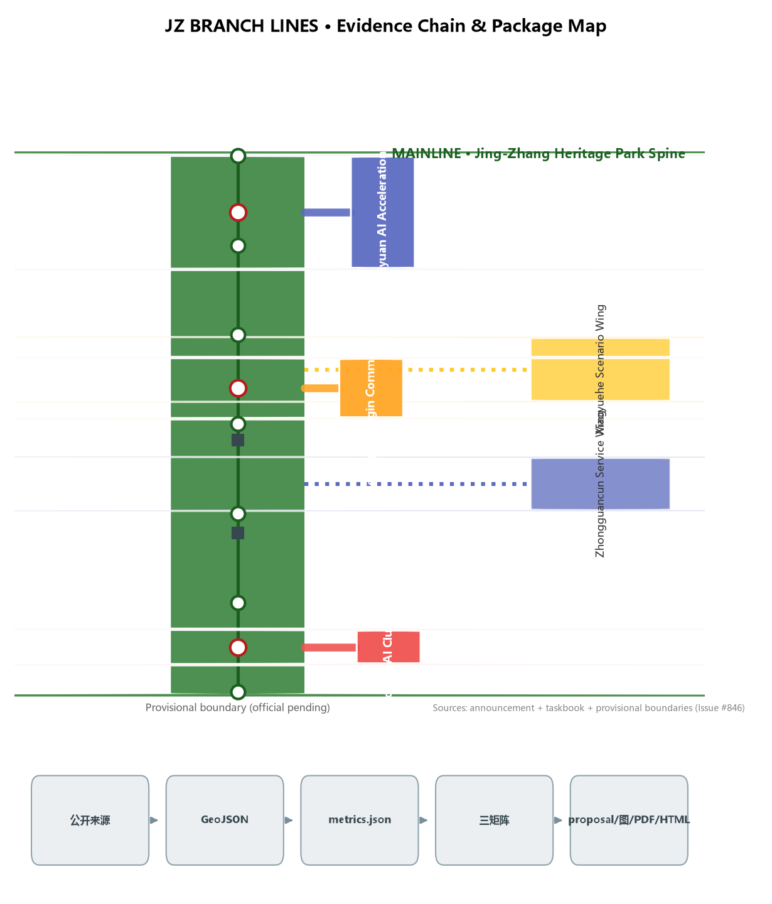
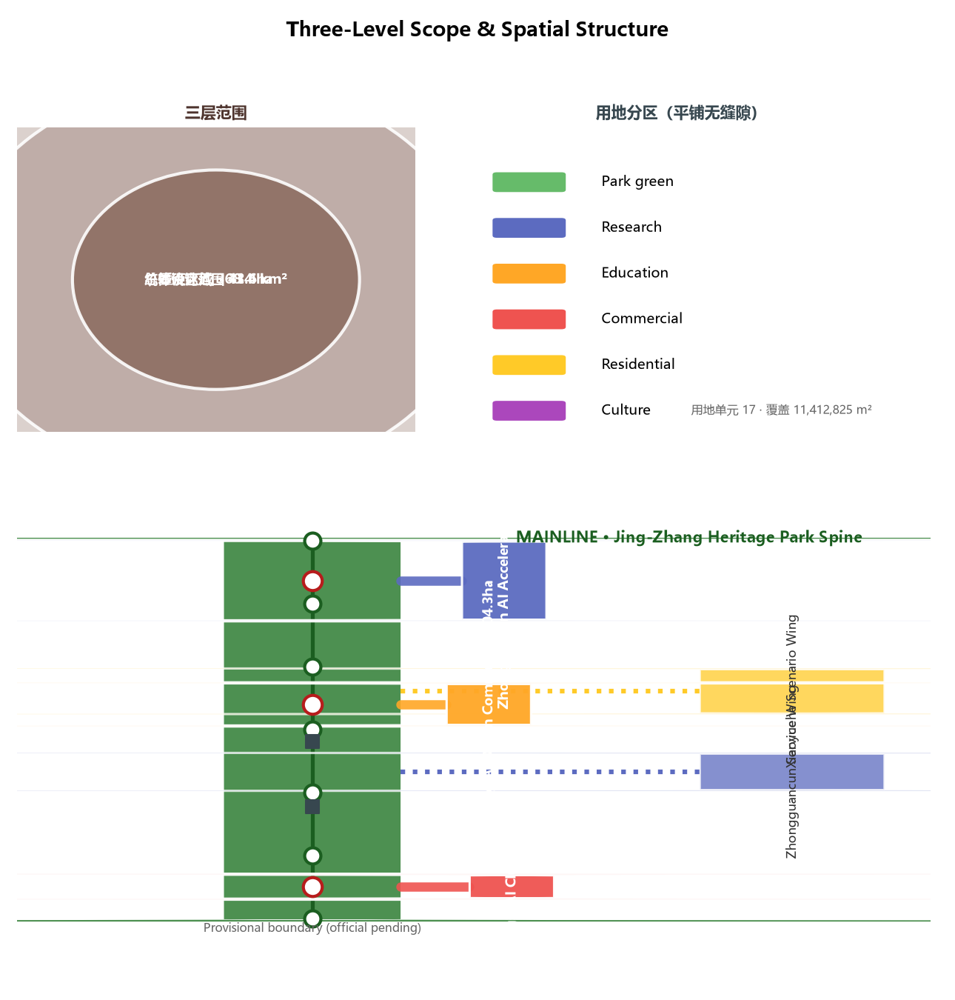
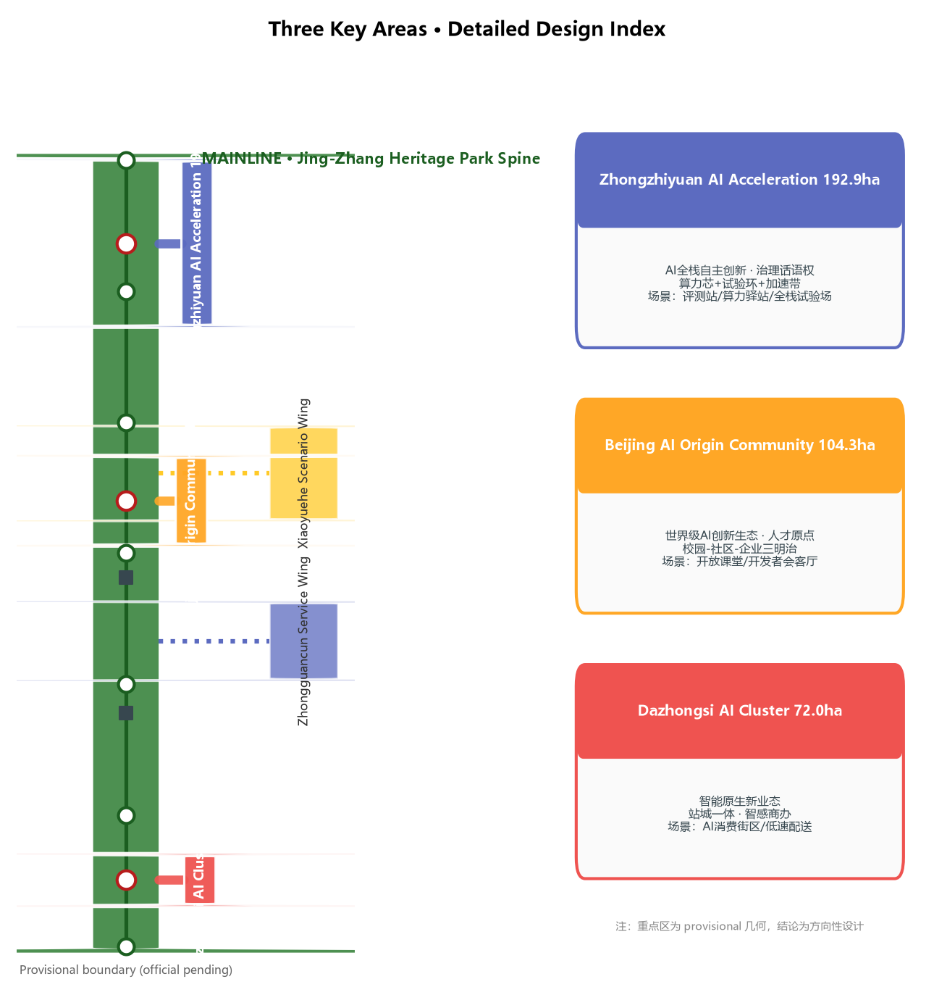
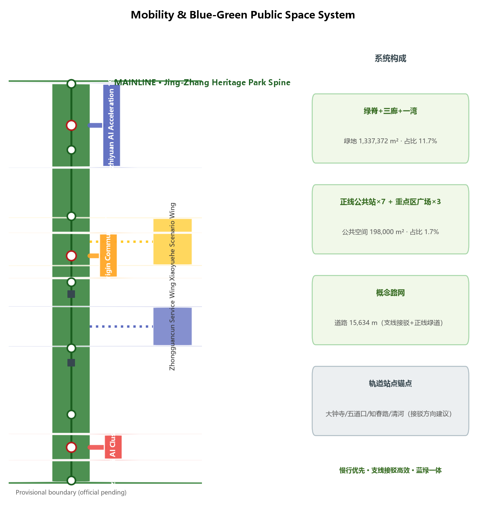
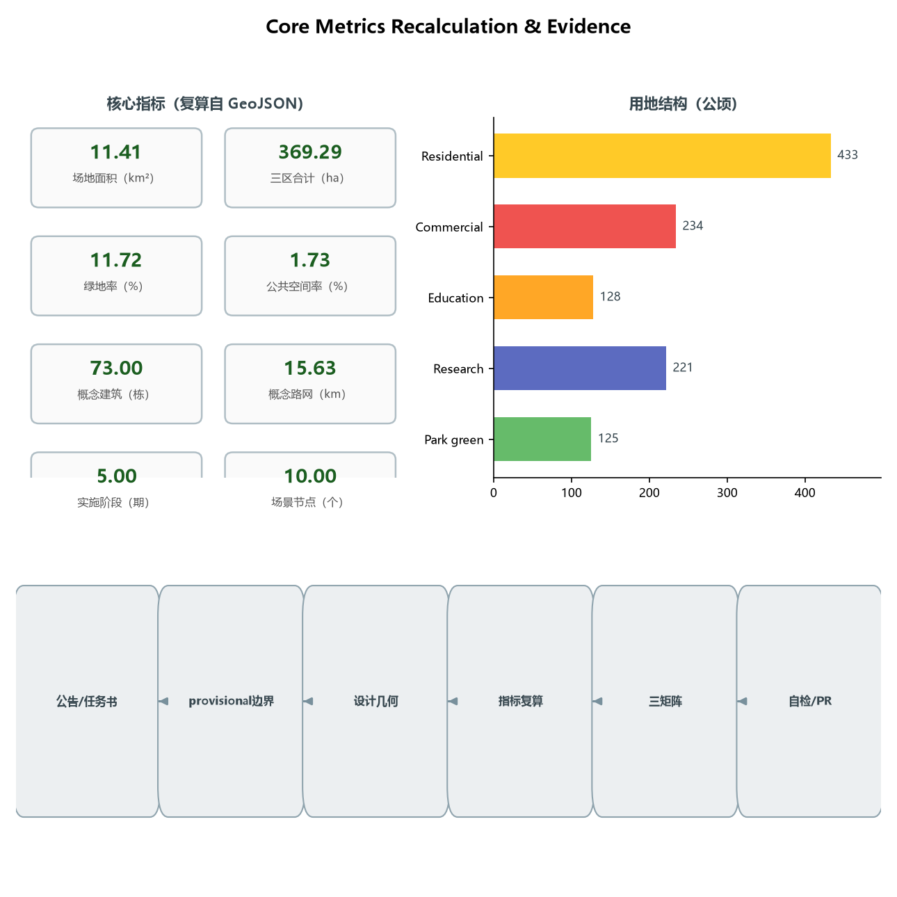

# JINGZHANG BRANCH LINES: An AI Innovation Belt Design with One Century-Old Mainline and Five Innovation Branches

## Design Basis and Source Inventory

This proposal takes the Prequalification Announcement for the International Urban Design Solicitation for the Centennial Jing-Zhang AI Innovation Belt, published by the Haidian Branch of the Beijing Municipal Commission of Planning and Natural Resources, as its primary basis [source:OFFICIAL-ANNOUNCEMENT], and the open-call taskbook addressed to global AI agents as its secondary basis [source:AGENT-TASKBOOK]. Machine-readable constraints (provisional boundaries, key areas, enums, metrics, and source inventory) were taken from `brief/site-package/` as maintained by the repository [source:SITE-PACKAGE]. Before generating the proposal, the agent read `design_brief.json`, `allowed_design_space.json`, `sources.json`, `enums/`, `ranges/`, `schemas/`, and `data/source_registry.json`, and distinguished formal-ready, background-only, and provisional-only materials according to the public source registry [source:SOURCE-REGISTRY].

All boundary and key-area geometry in this proposal derives from `provisional_boundaries.geojson` (`PROV-SITE-001`, `PROV-KEY-001/002/003`) [source:BOUNDARY-SOURCE][source:KEY-AREA-SOURCE]. The announcement provides text-based extents and approximate areas but no downloadable, verifiable official polygons; repository maintainers inferred provisional geometry and verified that an OSM background cross-check shows a 0% intersection and a ~412.5 m nearest distance between the provisional overall design area and the built Jing-Zhang Railway Heritage Park (Issue #846), indicating spatial uncertainty that only an official polygon can settle. All areas, ratios, and spatial structures in this proposal are therefore conceptual suggestions pending full recalculation once official polygons are published [standard:PROJECT-OFFICIAL-ANNOUNCEMENT] [depth:risk_missing_data].

In this report, prose carries only claim-adjacent evidence anchors; the complete source, metric, standard, design-depth, and task coverage lives in `sources.json`, `metrics.json`, `compliance_matrix.json`, `standard_matrix.json`, and `design_depth_matrix.json` [source:SITE-PACKAGE]. All spatial landing suggestions are worded as conceptual suggestions, reference schemes, or material for professional teams to deepen; they do not replace statutory planning and do not constitute government-approved conclusions [standard:PROJECT-AGENT-OPEN-CALL-TASKBOOK].

## Three-Level Scope Framework

The proposal follows the announcement's three-level scope [source:OFFICIAL-ANNOUNCEMENT] [depth:three_level_scope_framework]:

- **Coordinated research area (43.6 km²)**: bounded by the Fifth Ring Road to the north, Jingzang Expressway to the east, Xizhimenwai Street to the south, and Wanquanhe Road to the west. It carries industrial strategy and regional synergy research, answering how a world-class AI innovation ecosystem coordinates with Haidian, the Beiwei community, Future Science City, Huairou Science City, the Economic-Technological Development Area, and the Beijing-Tianjin-Hebei region [source:OFFICIAL-ANNOUNCEMENT].
- **Overall design area (11.4 km²; the submitted boundary)**: the urban and industrial areas within 1–2 km around the Jing-Zhang Heritage Park, at the urban-design depth of a regulatory detailed plan [standard:MOHURD-CONTROL-DETAILED-PLANNING]. This proposal establishes a "one mainline + five branches" overall spatial structure here [depth:overall_spatial_structure].
- **Key detailed design area (368.4 ha; recalculated 369.29 ha)**: from north to south, the Zhongzhiyuan AI Independent Innovation Acceleration Area (192.1 ha; recalculated 192.92 ha), the Beijing AI Origin Community (104.3 ha; recalculated 104.32 ha), and the Dazhongsi AI Industry Cluster (72.0 ha; recalculated 72.05 ha), at the urban-design depth of a comprehensive implementation plan [depth:three_key_area_detailed_design].

The three levels cascade: industrial strategy sets direction at the coordinated level, the overall structure sets the skeleton at the overall level, and the three areas and two wings set form at the key level. All boundaries are provisional geometry (`official_boundary=false`, `geometry_role=provisional_constraint`); area deviations are disclosed in `provisional_boundaries_basis.md` (+0.02% to +0.43%) and must not be used as official redlines or precise-area bases [source:BOUNDARY-SOURCE].

## Coordinated Research Area: Industry and Future-City Research

### Three Positionings, Five Functions, and the Three-Areas-Two-Wings Loop

The proposal takes the taskbook's three positionings (Centennial Jing-Zhang Cultural Belt, Urban AI Life Experience Belt, AI-Integrated Innovation Belt) and five functions (AI full-stack independent innovation system, world-class AI innovation ecosystem, AI+ scenario empowerment paradigm, intelligent AI vibrant city, global voice in AI governance) as top-level constraints [source:AGENT-TASKBOOK] [standard:PROJECT-AGENT-OPEN-CALL-TASKBOOK], and proposes a "one mainline + five branches" synergy loop:

- **Mainline = public spine**: the Jing-Zhang Heritage Park green spine carries the display of the Centennial Jing-Zhang Cultural Belt and the experience of the Urban AI Life Experience Belt, serving as the public mainline [data:geometry/green_space.geojson#GREEN-001].
- **Branch 1 = Zhongzhiyuan AI Independent Innovation Acceleration Branch** (north, Qinghe–Fifth Ring): mapping to the AI full-stack independent innovation system and global voice in AI governance, hosting compute, models, data, and full-stack pilots [data:geometry/key_areas.geojson#zhongzhiyuan_ai_acceleration_area].
- **Branch 2 = Beijing AI Origin Community Branch** (middle, Wudaokou–Qinghua East Road West): mapping to the world-class AI innovation ecosystem, forming a talent origin through the university belt and innovation community [data:geometry/key_areas.geojson#beijing_ai_origin_community].
- **Branch 3 = Dazhongsi AI Industry Cluster Branch** (south, Dazhongsi Station): mapping to AI-native new business formats, hosting AI-native consumption and commerce [data:geometry/key_areas.geojson#dazhongsi_ai_industry_cluster].
- **Branch 4 = Zhongguancun Technology Service Wing Branch** (west): mapping to globally allocated factors, Zhongguancun IP, and capital empowerment, linking the technology-service capacity of Zhongguancun Avenue [data:geometry/land_use.geojson#LU-009].
- **Branch 5 = Xiaoyuehe Scenario Empowerment Wing Branch** (east): mapping to AI scenario empowerment and the intelligent AI vibrant city, hosting everyday AI scenarios along the riverfront green corridor [data:geometry/land_use.geojson#LU-010].

The synergy loop: the mainline pools public value and cultural identity; the five branches connect five innovation factors (R&D, talent, consumption, capital, life); AI services on the branches are validated, displayed, and human-reviewed at mainline public stations, then flow back to campuses, communities, and commercial districts — forming a "public validation → scenario diffusion → factor return" closed loop [depth:overall_spatial_structure].

### Naming System and Logo Direction (conceptual suggestion)

The proposed primary name is **"京张支线带" (Jing-Zhang Branch Belt)**, in English **THE BRANCH LINES** (JZ·BRANCH for short). The naming has three layers: first, railway history — the Jing-Zhang Railway expanded its service area through branch lines from the start (e.g., the Mentougou branch), so branches are part of its "self-built pioneering" DNA; second, spatial structure — the three areas and two wings are exactly five branches off the mainline; third, the open-source metaphor — a branch is a git branch, and innovation grows on branches like pull requests and merges on the mainline, isomorphic with the organizational logic of this open call [source:AGENT-TASKBOOK].

Logo direction (conceptual, to be deepened by professional design with font licensing confirmed): use a "mainline + five branches" track topology as the base form — one continuous mainline leading to five tapering branches, evoking both the herringbone railway and a code-branch diagram; a three-color system of "rail gray + Zhongguancun blue + heritage ochre" is suggested, corresponding to industrial heritage, technological innovation, and historical land. The naming, logo, and signage do not borrow any existing city, park, or enterprise identity [standard:PROJECT-AGENT-OPEN-CALL-TASKBOOK].

### Global AI Innovation Ecosystem Cases (5–8, readable summaries)

The following cases are referenced only for mechanisms; they imply no investment, output, or policy commitment for any enterprise [source:SOURCE-REGISTRY]:

1. **Stanford Research Park (USA)**: the walkable "innovation neighbor" model of campus–park proximity, informing the "campus–community–enterprise sandwich" layout of the AI Origin Community branch.
2. **King's Cross Knowledge Quarter (UK)**: railway-heritage brownfield renewed into a mixed tech-and-life district, informing mixed-use logic along the mainline.
3. **Quayside, Toronto (Canada, concept stage)**: a smart-community experiment grounded in public data and public participation, informing the public-review mechanism of scenario operations on the Xiaoyuehe wing.
4. **Kalasatama Smart District, Helsinki (Finland)**: agile-district phased experimentation with resident participation, informing this proposal's "branch pilot → mainline validation → city-wide diffusion" phasing.
5. **Digital Media City, Seoul (South Korea)**: industry park coexisting with media/culture content, informing AI-native formats at the Dazhongsi branch.
6. **one-north, Singapore**: a work-live-play-learn balance shaping the talent environment, informing mixed provision of talent housing, sports, and culture.
7. **Guangming Science City, Greater Bay Area (China)**: a research–pilot–industry chain linking large science facilities with industrial acceleration, informing the full-stack pilot and validation system of the Zhongzhiyuan branch.

Transferable lessons: walkable innovation proximity, heritage-site mixed renewal, phased and reversible experimentation, public participation in operation review, and full-lifecycle talent amenities. Spatially these translate to "branch density + mainline validation + node amenities" [depth:overall_spatial_structure].

## Overall Design Area: Urban Renewal at Regulatory-Plan Urban-Design Depth

### Overall Spatial Structure: One Mainline, Five Branches

The overall design area is organized around the "one mainline + five branches" skeleton [depth:overall_spatial_structure]: the mainline is the north-south Jing-Zhang Heritage Park green spine (a linear green corridor roughly 130 m wide; `GREEN-001`, on the order of 0.68 million m²), and the five branches are scenario greenways and innovation corridors branching from the mainline into the three areas and two wings [data:geometry/roads.geojson#ROAD-001]. Mainline public stations (`PUBLIC-001` to `PUBLIC-007`) are set at roughly 1.2 km intervals as display, validation, and human-review nodes for AI services [data:geometry/public_space.geojson].

### Overall Urban Renewal Framework

The renewal framework follows the principle of "retention first, gradual mending, branch-led implementation" [depth:retain_renovate_demolish]: along the mainline, retention and mending dominate to strengthen heritage display and public space; in the three areas, the combination is "retain existing industrial buildings + renovate inefficient spaces + build limited new public and pilot facilities." Specific retain/renovate/demolish ratios must be confirmed with surveyed buildings, ownership, and regulatory-plan conditions; this proposal gives no statutory demolition/renovation conclusions [standard:MOHURD-CONTROL-DETAILED-PLANNING]. Statutory control indicators such as FAR, building height, and density are recorded as pending confirmation (`status=unknown`) until official regulatory-plan and engineering conditions are available; this proposal provides only conceptual massing indications, not statutory control values [depth:development_intensity_controls][depth:height_massing_character].

### Functional Layout and Industrial Goals

Industrial functions are arranged along the branches in five categories — R&D, talent, consumption, services, and living [depth:land_use_layout]: the Zhongzhiyuan branch is mainly research land (0802); the AI Origin Community branch is mainly education/research and mixed land (0804, 0802); the Dazhongsi branch is mainly commercial and service land (05); the Zhongguancun Technology Service Wing branch is mainly research and office land (0802); and the Xiaoyuehe Scenario Wing branch is mainly residential land with a riverfront greenway (0701, 1401). The land-use partition fully covers the submitted boundary of 11,412,825 m² with no gaps or overlaps (recalculation matches `land_use_coverage_sqm`) [metric:land_use_coverage_sqm][depth:land_use_layout].

### Jing-Zhang Heritage Park Vitality Belt

The mainline is the vitality belt: cultural display nodes (0803), public stations (pavilions and plazas), a slow-traffic main spine (greenway, `ROAD-001`), and cross streets (`ROAD-004` to `ROAD-007`) are arranged along the green spine [data:geometry/green_space.geojson#GREEN-001][data:geometry/roads.geojson#ROAD-004]. The goal is to turn the heritage park "from a fenced linear green space into an accessible, stayable public mainline where AI services can be validated" [depth:blue_green_public_space].

## Key Area Detailed Design

All three key areas use provisional polygons; the conclusions below are directional designs pending official boundaries and surveyed conditions [source:KEY-AREA-SOURCE].

### Zhongzhiyuan AI Independent Innovation Acceleration Area (Branch 1, ~192.9 ha)

- **Positioning**: an acceleration field for AI full-stack independent innovation and governance voice.
- **Spatial structure**: organized as "compute core + pilot loop + acceleration belt"; research land (0802) dominates, with conceptual AI R&D buildings and labs (`BLDG-001` to `BLDG-024` as schematic indications) [data:geometry/buildings.geojson#BLDG-001].
- **Building renewal**: retain existing industrial buildings, renovate inefficient factories into pilot and pilot-production spaces; new construction focuses on pilot-validation and exchange facilities; specific retain/renovate/demolish decisions await surveyed conditions [depth:retain_renovate_demolish].
- **Mobility**: the branch greenway connects to mainline public stations, with an internal slow-traffic loop linking pilot nodes.
- **Public space**: Zhongzhiyuan Innovation Plaza (`PUBLIC-008`) [data:geometry/public_space.geojson#PUBLIC-008].
- **AI scenarios**: full-stack pilot field, model evaluation station, compute service pavilion.
- **Implementation risk**: ecological and transport constraints in the Fifth Ring–Qinghe section; compute-facility energy and municipal capacity require professional assessment [depth:municipal_new_infrastructure].

### Beijing AI Origin Community (Branch 2, ~104.3 ha)

- **Positioning**: the talent origin of a world-class AI innovation ecosystem.
- **Spatial structure**: a "campus–community–enterprise" sandwich of education and mixed land (0804, 0802), mixing innovation workshops and talent housing (`BLDG-025` to `BLDG-042` as schematic indications) [data:geometry/buildings.geojson#BLDG-025].
- **Building renewal**: community-scale incremental renewal around the Wudaokou university belt, without proposing large-scale demolition [depth:retain_renovate_demolish].
- **Mobility**: the branch greenway reaches mainline public stations directly, strengthening transit connections at Wudaokou and Qinghua East Road West stations (`transit_connection` suggestions) [depth:traffic_rail_slow_parking].
- **Public space**: AI Origin Plaza (`PUBLIC-009`).
- **AI scenarios**: campus AI open classroom, developer salon, talent-service navigation.
- **Implementation risk**: complex campus and community ownership; parcel-by-parcel confirmation required.

### Dazhongsi AI Industry Cluster (Branch 3, ~72.0 ha)

- **Positioning**: an agglomeration field for AI-native consumption and commerce.
- **Spatial structure**: anchored at Dazhongsi Station, commercial/service land (05) mixes AI-sensing commercial-office blocks with experiential retail (`BLDG-043` to `BLDG-054` as schematic indications) [data:geometry/buildings.geojson#BLDG-043].
- **Building renewal**: mainly commercial-space renovation and new-format implantation.
- **Mobility**: the branch greenway connects to the mainline, with directional suggestions (not engineering-feasibility conclusions) for strengthening rail interchange at Dazhongsi Station [depth:traffic_rail_slow_parking].
- **Public space**: Dazhongsi AI-Sensing Plaza (`PUBLIC-010`).
- **AI scenarios**: AI-native consumption street, smart wayfinding, low-speed autonomous delivery.
- **Implementation risk**: renewal involves ownership and operators; commercial and property-rights conditions must be confirmed.

## AI Innovation Ecosystem, Personas, and AI+ Scenarios

### Five User Personas

1. **AI R&D engineers/researchers**: need compute, data, pilot fields, and peer exchange; mapped to the Zhongzhiyuan and Origin Community branches.
2. **Entrepreneurs/developers**: need low-cost offices, open scenarios, and financing services; mapped to the Zhongguancun Service Wing and Origin Community.
3. **University faculty, students, and young talent**: need learning, internships, competitions, and life amenities; mapped to the Origin Community and Xiaoyuehe wing.
4. **Nearby residents (including elderly and children)**: need accessible, understandable public services; mapped to the Xiaoyuehe wing and mainline public stations [standard:BARRIER-FREE-ENVIRONMENT-LAW].
5. **Tourists/global visitors**: need cultural wayfinding, multilingual services, and perceptible AI experiences; mapped to the mainline and the Dazhongsi branch.

### AI Scenario Cards (10+, readable in the report)

All scenarios below are conceptual suggestions with privacy, safety, and human-review boundaries marked; immature technologies are not described as fully deployable [standard:PROJECT-AGENT-OPEN-CALL-TASKBOOK].

| # | Scenario | Spatial anchor | Users | Data/privacy boundary | Human review |
|---|----------|----------------|-------|------------------------|--------------|
| S01 | Mainline AI culture guide | Mainline stations 1–7 | Visitors/residents | Location and public culture data only; no biometrics | Content reviewed by culture/heritage professionals |
| S02 | AI accessibility path assessment | Mainline slow-traffic spine | Elderly/disabled | Anonymized movement data | On-site human re-measurement [standard:BARRIER-FREE-ENVIRONMENT-LAW] |
| S03 | Zhongzhiyuan model evaluation station | Zhongzhiyuan branch | R&D organizations | Auditable, revocable evaluation datasets | Expert review of results |
| S04 | Compute service pavilion | Zhongzhiyuan branch | Developers | Publicly auditable usage and billing | Manual operator reconciliation |
| S05 | Enterprise service copilot | Zhongguancun wing | Enterprises | Authorized public policy data only | Manual policy maintenance [source:SOURCE-REGISTRY] |
| S06 | AI Origin open classroom | Origin Community branch | Faculty/students | Attributable, traceable class content | Teacher review |
| S07 | Developer salon booking | Origin Community branch | Developers | Minimized booking data | Manual community handling |
| S08 | Dazhongsi AI-native consumption street | Dazhongsi branch | Citizens/visitors | Localized, opt-out consumption data | Merchant and consumer-protection review |
| S09 | Low-speed autonomous delivery | Dazhongsi–Xiaoyuehe wing | Residents/merchants | Restricted operating zone and speed | Remote takeover by safety staff |
| S10 | Xiaoyuehe riverside AI life assistant | Xiaoyuehe wing | Residents | No camera tracking; public-address-level info only | Community staffed on duty |
| S11 | AI health-service navigation | Xiaoyuehe wing/Origin | Elderly/chronic patients | Authorized health data processing | Medical professional review [scenario:ai-health-service-navigation] |
| S12 | Public-safety operations review desk | Mainline stations | Public/operators | Published event-retention periods | Human review before action [scenario:public-safety-operations-review] |

**AI industry test/validation scenarios (3+)**: T01 Zhongzhiyuan full-stack pilot field (compute–model–application integration, campus-internal only); T02 mainline "stage first, launch later" trial belt (AI services undergo public trial at mainline stations and diffuse along branches after passing); T03 Dazhongsi low-speed delivery and consumption field test (restricted area, restricted hours, human-takeover fallback). All test scenarios are phrased as pilot suggestions, not approved operations [standard:PROJECT-AGENT-OPEN-CALL-TASKBOOK].

Scenario–space–operation mapping: every scenario card corresponds to a public station or branch node; operators, data boundaries, and human review are kept consistent across this report, the `scenarios/` registry, and `compliance_matrix.json` [source:SITE-PACKAGE].

## Land Use, Building Scale, and Retain/Renovate/Demolish

Land use is organized into 17 parcels under "one mainline + five branches" (`land_use_parcel_count=17`), covering the full submitted boundary [metric:land_use_parcel_count][metric:land_use_coverage_sqm]: 1401 park green (mainline spine, branch greenways, riverfront greenway, ~133.7 ha total, `green_ratio=0.1172`) [metric:green_ratio]; 0802 research land (Zhongzhiyuan, Zhongguancun Service Wing); 0804 education land (Origin Community, university belt); 05 commercial/service land (Dazhongsi, comprehensive service belt); 0701 residential land (Xiaoyuehe wing, livable communities); 0803 cultural land (mainline cultural nodes) [source:SITE-PACKAGE].

Building scale is conceptual: 73 schematic buildings with a footprint of ~445,272 m² (`building_footprint_area_sqm=445272`) [metric:building_footprint_area_sqm], expressing massing and density direction only, not statutory floor area. Statutory controls (FAR, height, density, green ratio, setbacks) are recorded as `status=unknown` until official regulatory-plan conditions are available (see `metrics.json` and `assumptions.json`); this proposal gives no statutory control conclusions [depth:development_intensity_controls][standard:MOHURD-CONTROL-DETAILED-PLANNING].

Retain/renovate/demolish logic: the mainline and Origin Community are "retention-led, mending-assisted"; Zhongzhiyuan is "retain + renovate + limited new pilot facilities"; Dazhongsi is "renovate + new-format implantation"; the two wings are "reserve + incremental renewal". No parcel-level demolition/renovation conclusions are made pending surveyed buildings, ownership, and approval conditions [depth:retain_renovate_demolish].

## Transport, Rail, Municipal, and Public-Service Facilities

Transport strategy follows "mainline slow-traffic first, branch interchange efficient" [depth:traffic_rail_slow_parking]: the mainline is the greenway slow-traffic spine (`ROAD-001`, the backbone of a ~15.6 km conceptual network) [metric:road_length_m]; the five branches are tertiary connector roads (branch class, `ROAD-002` to `ROAD-012`) [data:geometry/roads.geojson#ROAD-002]; cross streets link both sides of the mainline. Rail interchange strengthens walking and cycling connections at existing stations such as Dazhongsi, Wudaokou, Zhichunlu, and Qinghe; all alignments and station-integration statements are directional, not engineering conclusions [standard:MOHURD-CONTROL-DETAILED-PLANNING].

Municipal and new infrastructure: a "branch shared corridor" concept concentrates power, communications, distributed energy, and edge-compute nodes along branch greenways to reduce disturbance to existing municipal systems; traditional municipal capacity, underground space, and energy loads await official conditions (`status=unknown`) [depth:municipal_new_infrastructure]. Public services are tiered as "mainline public stations + branch community service points", covering education, health, sports, and community services (0804, 0806, 0805, 0702 directions) [depth:land_use_layout].

## Blue-Green Space, Public Space, and Urban Character

### Blue-Green Public Space System

The blue-green system is organized as "one spine, three corridors, one bay" [depth:blue_green_public_space]: the spine is the Jing-Zhang Heritage Park green mainline; the three corridors are the Zhongzhiyuan, Origin, and Dazhongsi branch greenways; the bay is the Xiaoyuehe riverfront greenway (including the Scenario Wing). Spine, corridors, and riverfront total ~133.7 ha (`green_space_area_sqm=1,337,372`) [metric:green_space_area_sqm]; public space comprises 10 nodes (7 mainline public stations plus 3 key-area plazas in the `public_space` layer, ~19.8 ha total, `public_space_ratio=0.0173`) [metric:public_space_ratio] hosting validation, display, and rest.

### AI Pilgrimage Landmarks and Honor-Display Nodes (3+, conceptual)

1. **Zero Public Station (north end of the mainline)**: a starting-point memorial from railway to AI, with the Jing-Zhang centennial milestone and an open-source contributor honor board (honor system: names listed by contribution record; materials and content must be rights-cleared).
2. **AI Origin Plaza (Origin Community branch)**: a public installation plaza using the herringbone track motif, commemorating the spiritual origin of China's first self-built railway; the installation requires professional deepening and heritage review [standard:PROJECT-OFFICIAL-ANNOUNCEMENT].
3. **Dazhongsi AI-Sensing Plaza (Dazhongsi branch)**: an AI public interface themed "bell sound – echo – convocation", meaning AI services announce themselves publicly and accept validation, avoiding excessive entertainment or viral styling [standard:PROJECT-AGENT-OPEN-CALL-TASKBOOK].
4. **Open-Source Contributor Gallery (mid mainline)**: the core carrier of the honor-display system, showing traceable, appendable contribution records of developers, enterprises, and institutions (corresponding to charter.8/9, public knowledge sedimentation and memorable contribution) [source:AGENT-TASKBOOK].

All landmarks, signage, logos, fonts, images, trademarks, personas, and enterprise identities require rights clearance; this proposal does not describe conceptual landmarks as approved construction [depth:risk_missing_data].

### Urban Character

The character palette is a three-color system of "rail gray + Zhongguancun blue + heritage ochre"; along the mainline, building massing steps back from the green spine, favoring a low-rise, high-density, continuous-streetwall feel; roofs encourage fifth-façade and distributed-energy integration as directional suggestions; specific height, massing, style, and color controls must be confirmed under regulatory-plan conditions [standard:MOHURD-URBAN-DESIGN-MEASURES][depth:height_massing_character].

## Renewal Project List, Implementation Policy, and Phasing

### Renewal Project List (conceptual)

Organized as "mainline first – three areas in the middle – two wings long-term" (`phasing.geojson`, five phases, `phase_count=5`) [metric:phase_count]:

- **Near term (phase_1)**: the mainline public spine (green spine on the order of 0.68 million m²) and the AI Origin Community branch — get the "public validation" mechanism running first.
- **Mid term (phase_2)**: the Zhongzhiyuan Acceleration Area and the Dazhongsi Cluster — full-stack pilot field and AI-native consumption land.
- **Long term (phase_3)**: the Zhongguancun Technology Service Wing and the Xiaoyuehe Scenario Wing — globally allocated factors and everyday scenarios fully unfold.

### Implementation Policy Suggestions (conceptual)

Policy directions: an open scenario list system, authorized public-data operation pilots, co-governance of the developer community, a "stage first, launch later" trial procedure for AI services, and an honor-display/open-source-contribution record system. All policies are suggested directions, not confirmed government arrangements [standard:PROJECT-AGENT-OPEN-CALL-TASKBOOK].

### Global AI Event System and Long-Term Operation (agent.6)

- **Annual event system (conceptual)**: "Origin Open Source Week" in spring (developer conference, hackathon), "Mainline Public Experiment Season" in summer (open scenario testing), "Dazhongsi AI Consumption Festival" in autumn, and "Jing-Zhang Annual Merge Day" in winter (annual results merge back to the mainline, echoing git merge).
- **Brand and communication**: a unified "branch merge" narrative — every event is a branch, and excellent results merge into the mainline public knowledge base; the visual system follows the naming and logo system.
- **Developer community operation**: Issue/PR-style scenario proposals, a contributor honor system, and continuous sedimentation of the public knowledge base.
- **Open scenario operation**: scenario cards correspond to nodes with open applications, published data boundaries, and closed human-review loops.
- **International communication and conversion**: multilingual content, global developer event linkages, and conversion of "branch pilots" into enterprise-landing leads.
- **Operational constraints**: all events, investment, funds, and policies are suggestions; no government commitments are exaggerated, and envisioned events are not described as confirmed arrangements [depth:risk_missing_data].

## Indicator System, Area Recalculation, and Compliance Matrix

Core indicators (full list in `metrics.json`, all recalculated from `geometry/*.geojson`):

- **Site scale**: submitted boundary area 11,412,825 m² (`site_area_sqm`, provisional, pending official recalculation) [metric:site_area_sqm].
- **Key-area areas**: three areas total 3,692,893 m² (`key_area_total_sqm`), +0.24% deviation from the announcement's approximate area [metric:key_area_total_sqm].
- **Green and public space**: green 1,337,372 m² (`green_ratio=0.1172`) and public space 198,000 m² (`public_space_ratio=0.0173`), supporting the design meaning of "talent living and innovation exchange" — the green spine is the belt's respiratory system, and public stations are the validation benches of innovation exchange [metric:green_ratio][metric:public_space_ratio].
- **Buildings and roads**: 73 conceptual buildings with a footprint of 445,272 m²; a conceptual road network of 15,633.6 m (`road_length_m`).
- **Implementation and scenarios**: 5 implementation phases and 10 scenario nodes (`scenario_node_count=10`).

Compliance coverage: all announcement tasks in sections 1.3/1.4/1.5 are covered item by item in `compliance_matrix.json` (`1.3.1`–`1.5.3.3`, 20 items) [source:SITE-PACKAGE]; agent tasks agent.1–agent.6 are all covered and expanded in this report; mandatory professional standards are responded to item by item in `standard_matrix.json` (PROJECT-OFFICIAL-ANNOUNCEMENT, PROJECT-AGENT-OPEN-CALL-TASKBOOK, MOHURD-URBAN-DESIGN-MEASURES, MOHURD-CONTROL-DETAILED-PLANNING, MNR-LAND-USE-CLASSIFICATION-GUIDE) [standard:MNR-LAND-USE-CLASSIFICATION-GUIDE]; all 15 design-depth items are `complete` (`design_depth_matrix.json`) [depth:metrics_recalculation].

## Risk, Copyright, and Compliance Statement

- **Material legality**: only public or rights-cleared materials are used; no non-public maps, internal data, or personal privacy data are used [source:SOURCE-REGISTRY].
- **Boundary risk**: official polygons are missing; all geometry is provisional; OSM cross-checks reveal spatial uncertainty (Issue #846); full replacement and recalculation are required when official materials are published [source:BOUNDARY-SOURCE][depth:risk_missing_data].
- **Copyright clearance**: naming, logo, fonts, images, trademarks, personas, and enterprise identities are not authorized for use; only rights-clearing directions are proposed; `report/copyright_statement.md` is the formal statement [source:AGENT-TASKBOOK].
- **AI generation responsibility**: this proposal is generated by an AI agent with its generation method declared; all conceptual suggestions do not constitute government approval, permit decisions, or implementation commitments [standard:PROJECT-AGENT-OPEN-CALL-TASKBOOK].
- **Pending materials**: official boundaries, regulatory-plan conditions, surveyed buildings, ownership, municipal, and engineering conditions require professional teams and official materials for deepening.
- **Professional review needs**: planning, transport, municipal, engineering, heritage, and legal professional reviews have not been performed and require professional confirmation.

## References

1. Haidian Branch, Beijing Municipal Commission of Planning and Natural Resources: Prequalification Announcement for the International Urban Design Solicitation for the Centennial Jing-Zhang AI Innovation Belt (2026-05-09).
2. Excerpts from the Open-Call Taskbook for the Centennial Jing-Zhang AI Innovation Belt Urban Design addressed to global AI agents (user-provided cleared document, 2026-05-18).
3. Beijing Municipal Science & Technology Commission and Zhongguancun Administrative Committee: "Three Areas and Two Wings" to Build a World-Class AI Agglomeration (2026-04-03).
4. Haidian District People's Government: "1+X+1" Modern Industrial System (2026-03-02).
5. Ministry of Housing and Urban-Rural Development: Measures for the Administration of Urban Design (2017).
6. Ministry of Housing and Urban-Rural Development: Measures for the Compilation and Approval of Regulatory Detailed Plans for Cities and Towns.
7. Ministry of Natural Resources: Guide to Land Use Classification for Territorial Spatial Survey, Planning, and Use Control (2023).
8. Standing Committee of the National People's Congress: Barrier-Free Environment Construction Law of the People's Republic of China (2023).
9. Repository maintainers: Provisional Boundary Inference and Public-Source Verification (provisional_boundaries_basis.md, 2026-08-07).
10. Repository Issue #846: OSM background cross-check between the overall design area and the built Jing-Zhang Railway Heritage Park.
