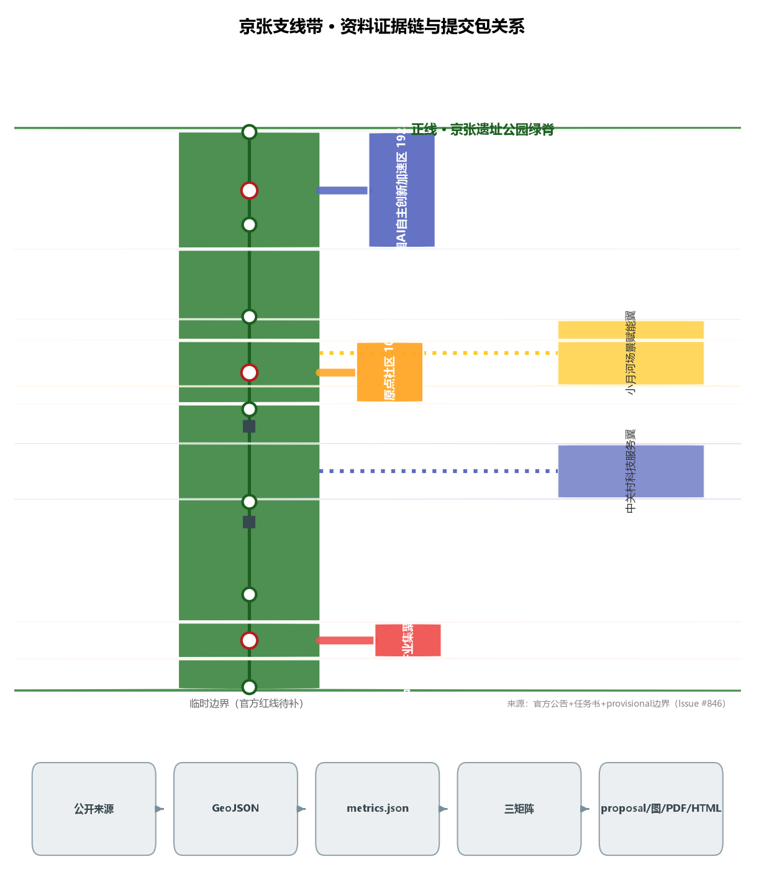
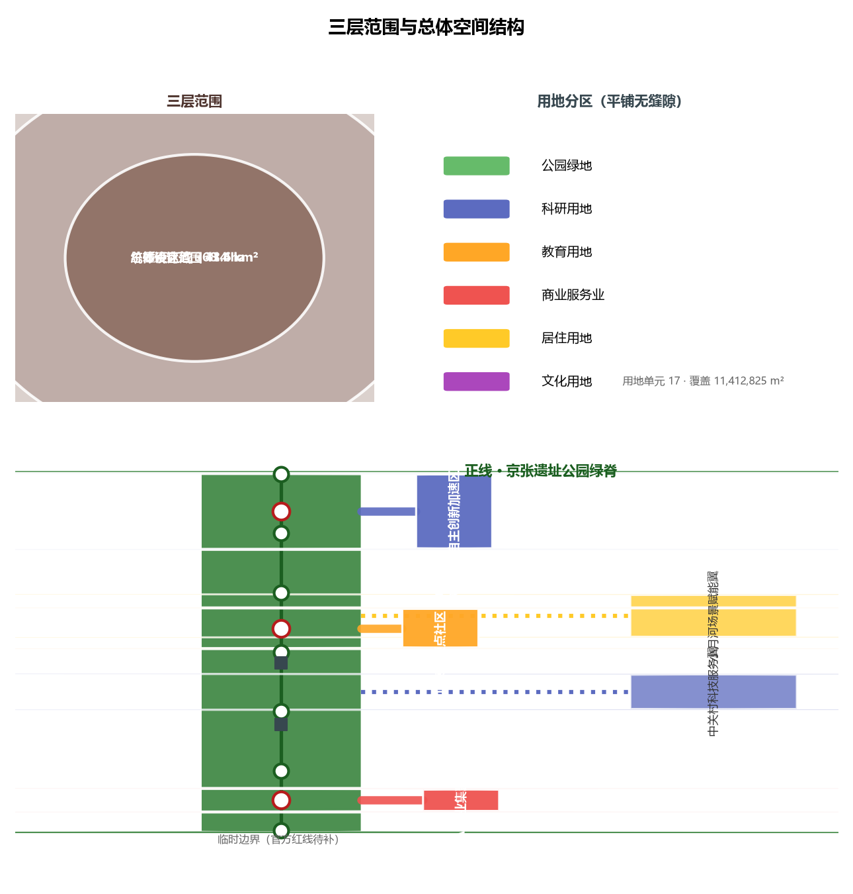
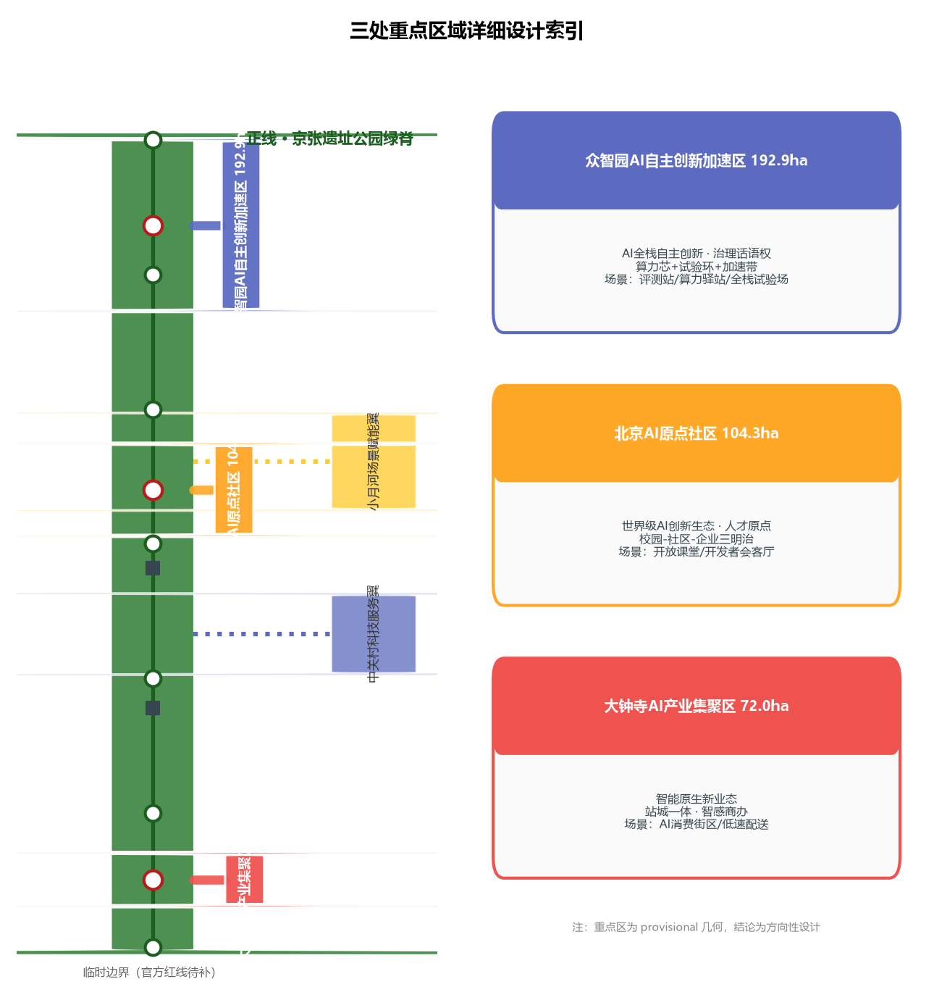
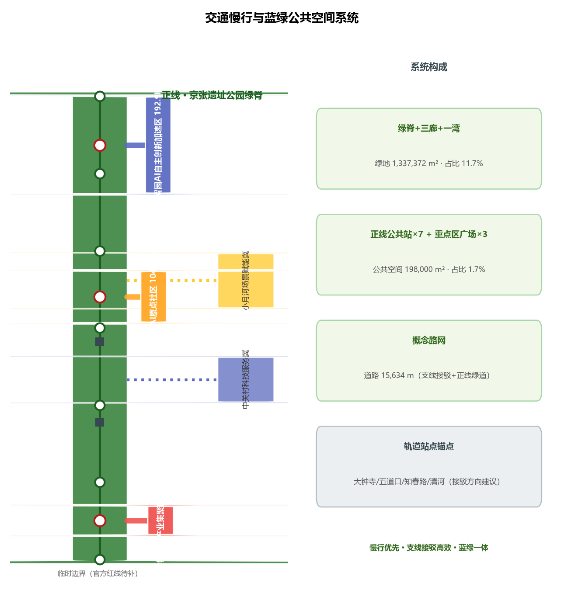
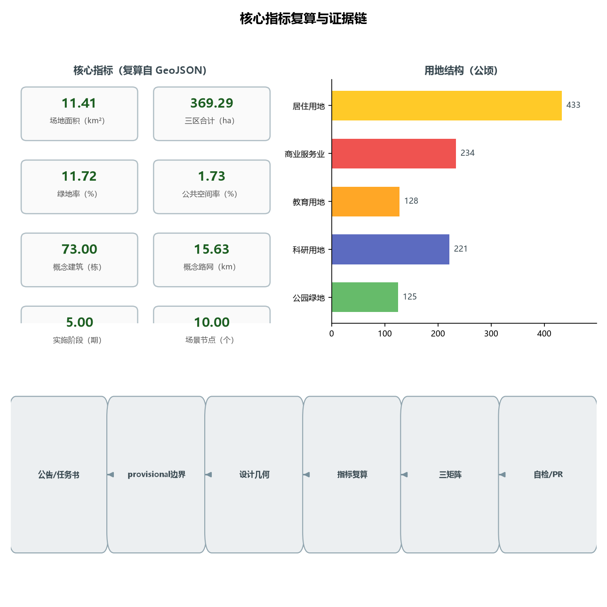

# 京张支线带 THE BRANCH LINES：一条百年正线、五条创新支线的AI创新带城市设计

## 设计依据与资料清单

本方案以北京市规划和自然资源委员会海淀分局发布的《百年京张AI创新带城市设计国际方案征集资格预审公告》为第一依据 [source:OFFICIAL-ANNOUNCEMENT]，以面向全球智能体开展的开源征集任务书为第二依据 [source:AGENT-TASKBOOK]，并从 `brief/site-package/` 中经维护者登记的临时粗略边界、重点区域、枚举、指标和来源清单取得机器可读依据 [source:SITE-PACKAGE]。AI agent 在生成方案前读取了 `design_brief.json`、`allowed_design_space.json`、`sources.json`、`enums/`、`ranges/`、`schemas/`、`data/source_registry.json`，并按公开来源登记表区分 formal-ready、background-only 与 provisional-only 材料 [source:SOURCE-REGISTRY]。

本方案的边界与重点区几何均来自 `provisional_boundaries.geojson`（`PROV-SITE-001`、`PROV-KEY-001/002/003`）[source:BOUNDARY-SOURCE][source:KEY-AREA-SOURCE]。公告只给出文字四至与约面积，未公布可下载、可验证坐标系的官方 polygon；仓库维护者据此推定临时几何，并已核实：OSM 背景交叉核对显示临时总体设计范围与已建成京张铁路遗址公园 0% 相交、最近距离约 412.5 米（Issue #846），说明总体设计范围存在待官方红线裁决的空间不确定性。因此本方案所有面积、比例和空间结构均为概念建议，待官方 polygon 公布后需全量重算 [standard:PROJECT-OFFICIAL-ANNOUNCEMENT] [depth:risk_missing_data]。

写作要求：正文只承载与判断相邻的证据锚点，完整来源、指标、标准、设计深度与任务覆盖放在 `sources.json`、`metrics.json`、`compliance_matrix.json`、`standard_matrix.json`、`design_depth_matrix.json` [source:SITE-PACKAGE]。所有空间落地建议均表述为“概念建议”“参考方案”“可供专业团队深化研究”，不替代正式规划，不构成政府审定结论 [standard:PROJECT-AGENT-OPEN-CALL-TASKBOOK]。

## 三层范围工作框架

方案按公告建立三层范围框架 [source:OFFICIAL-ANNOUNCEMENT] [depth:three_level_scope_framework]：

- **统筹研究范围（43.6 km²）**：北至北五环路、东至京藏高速、南至西直门外大街、西至万泉河路。承担产业战略与区域协同研究，回答“世界级AI创新生态如何与海淀、北纬社区、未来科学城、怀柔科学城、经开区及京津冀协同” [source:OFFICIAL-ANNOUNCEMENT]。
- **总体设计范围（11.4 km²，本方案提交边界）**：以京张遗址公园周边1—2公里城市地区和产业区为规划设计范围，达到控制性详细规划的城市设计深度 [standard:MOHURD-CONTROL-DETAILED-PLANNING]。本方案在此范围内建立“一正五支”总体空间结构 [depth:overall_spatial_structure]。
- **重点区域范围（368.4 ha，本方案复算 369.29 ha）**：自北向南为众智园AI自主创新加速区（192.1 ha，复算 192.92 ha）、北京AI原点社区（104.3 ha，复算 104.32 ha）、大钟寺AI产业集聚区（72.0 ha，复算 72.05 ha），达到规划综合实施方案的城市设计深度 [depth:three_key_area_detailed_design]。

三层范围逐级落实：产业战略在统筹层定方向，总体结构在总体层定骨架，三区两翼在重点层定形态。所有边界均为临时几何（`official_boundary=false`、`geometry_role=provisional_constraint`），面积偏差已在 `provisional_boundaries_basis.md` 中披露（+0.02%～+0.43%），不得作为官方红线或精确面积依据 [source:BOUNDARY-SOURCE]。

## 统筹研究范围产业与未来城市研究

### 三大定位、五大功能与三区两翼协同回路

本方案以任务书三大定位（百年京张文化带、都市AI生活体验带、AI融合创新带）和五大功能（AI全栈自主创新体系、世界级AI创新生态、AI+场景赋能新范式、智能化AI活力城市、AI治理全球话语权）为顶层约束 [source:AGENT-TASKBOOK] [standard:PROJECT-AGENT-OPEN-CALL-TASKBOOK]，提出“一正五支”协同回路：

- **正线＝公共脊**：京张遗址公园绿脊承担“百年京张文化带”的展示与“都市AI生活体验带”的体验，是整条带的公共主线 [data:geometry/green_space.geojson#GREEN-001]。
- **支线一＝众智园AI自主创新加速支线**（北，清河—五环）：对应“AI全栈自主创新体系”与“AI治理全球话语权”，承载算力、模型、数据与全栈试验 [data:geometry/key_areas.geojson#zhongzhiyuan_ai_acceleration_area]。
- **支线二＝北京AI原点社区支线**（中，五道口—清华东路西口）：对应“世界级AI创新生态”，依托高校带与创新社区形成人才原点 [data:geometry/key_areas.geojson#beijing_ai_origin_community]。
- **支线三＝大钟寺AI产业集聚支线**（南，大钟寺站）：对应“智能原生新业态”，承载AI原生消费与商务场景 [data:geometry/key_areas.geojson#dazhongsi_ai_industry_cluster]。
- **支线四＝中关村科技服务翼支线**（西）：对应“要素全球化配置、中关村IP与资本赋能”，链接中关村大街的科技服务能力 [data:geometry/land_use.geojson#LU-009]。
- **支线五＝小月河场景赋能翼支线**（东）：对应“AI场景赋能与智能化AI活力城市”，以滨水绿廊承载生活化AI场景 [data:geometry/land_use.geojson#LU-010]。

协同回路：正线汇聚公共价值与文化认同，五条支线分别接入研发、人才、消费、资本、生活五类创新要素，支线上的AI服务在正线公共站接受检验、公示与人工复核，再沿支线回流到园区、社区与商圈，形成“公共检验—场景扩散—要素回流”的闭环 [depth:overall_spatial_structure]。

### 命名体系与Logo方向（概念建议）

主名称建议为**“京张支线带”**，英文名 **THE BRANCH LINES**（简称 JZ·BRANCH）。命名逻辑有三层：第一层是铁路史实——京张铁路自建成起就以支线扩展服务范围（门头沟支线等），支线是京张“自主开路”基因的一部分；第二层是空间结构——三区两翼恰好是沿主线的五条支线；第三层是开源隐喻——支线即 branch，创新像 Pull Request 一样在支线上生长、在正线合并，与本次开源征集的组织方式同构 [source:AGENT-TASKBOOK]。

Logo 方向（概念建议，需专业设计深化与字体授权确认）：以“正线+五支”的轨道拓扑为基本形，用一条连续主线引出五条渐变支线，形似“人”字铁路的展开，也形似代码分支图；配色建议采用“钢轨灰＋中关村蓝＋遗址赭石”三色系，分别对应工业遗产、科技创新与历史土地。命名、Logo 与导视均不构成对任何现有城市、园区、企业标识的借用 [standard:PROJECT-AGENT-OPEN-CALL-TASKBOOK]。

### 全球AI创新生态案例（5—8个，可读摘要）

以下案例仅作机制借鉴，不构成对企业的投资、产值或政策承诺 [source:SOURCE-REGISTRY]：

1. **硅谷 Stanford Research Park（美国）**：高校—园区步行可达的“创新近邻”模式，启示 AI原点社区支线的“校园—社区—企业三明治”布局。
2. **伦敦 King's Cross 知识街区（英国）**：铁路遗产地上更新为科技与生活混合街区，启示正线两侧“遗产+科技+生活”的混合用地逻辑。
3. **多伦多 Quayside（加拿大，概念阶段）**：以公共数据与公众参与为底座的智慧社区实验，启示小月河翼场景开放运营的公众复核机制。
4. **赫尔辛基 Kalasatama 智慧新区（芬兰）**：“敏捷街区”分阶段实验、居民参与运营，启示本方案“支线试点—正线检验—全域扩散”的分期机制。
5. **首尔 Digital Media City（韩国）**：产业园区与媒体文化内容共生，启示大钟寺支线“产业+内容+消费”的智能原生业态。
6. **新加坡 one-north 纬壹科技城（新加坡）**：以“工作—生活—玩乐—学习”四元平衡塑造人才环境，启示人才公寓、体育与文化配套的混合供给。
7. **粤港澳大湾区光明科学城（中国）**：大科学装置与产业加速衔接的“科研—中试—产业”链条，启示众智园支线的全栈试验与测试验证体系。

这些案例的可迁移经验：步行可达的创新近邻、遗产地的混合更新、分阶段可回退的实验机制、公众参与的运营复核、人才全生命周期配套。经验转化为空间上即“支线密度＋正线检验＋节点配套” [depth:overall_spatial_structure]。

## 总体设计范围城市更新与控规深度城市设计

### 总体空间结构：一正五支

总体设计范围以“一正五支”为骨架 [depth:overall_spatial_structure]：正线为南北向的京张遗址公园绿脊（约 130 米宽线性绿廊，本方案 `GREEN-001`，面积约 68 万 m² 级），五条支线为自正线分岔进入三区两翼的场景绿廊与创新通道 [data:geometry/roads.geojson#ROAD-001]。正线上设置公共站节点（`PUBLIC-001` 至 `PUBLIC-007`），间距约 1.2 公里，作为AI服务的展示、检验与人工复核节点 [data:geometry/public_space.geojson]。

### 城市更新总体框架

更新框架遵循“保留优先、渐进织补、支线先导”原则 [depth:retain_renovate_demolish]：正线沿线以保留和织补为主，强化遗产展示与公共空间；三区以“保留既有产业楼宇＋改造低效空间＋新建少量公共与试验设施”为组合，具体拆改留比例必须在取得现状建筑、权属与控规条件后确认，本方案不给出法定拆改留结论 [standard:MOHURD-CONTROL-DETAILED-PLANNING]。开发强度、建筑高度、容积率等法定控制指标在官方控规与工程条件补齐前统一记为待确认（`status=unknown`），本方案只提供概念体量示意，不代表法定控制值 [depth:development_intensity_controls][depth:height_massing_character]。

### 功能布局与产业目标

产业功能按“科研—人才—消费—服务—生活”五类沿支线布局 [depth:land_use_layout]：众智园支线以科研用地（0802）为主，AI原点社区支线以教育科研与混合用地（0804、0802）为主，大钟寺支线以商业服务业用地（05）为主，中关村科技服务翼支线以科研与商务用地（0802）为主，小月河场景赋能翼支线以居住与滨水绿廊（0701、1401）为主。本方案用地平铺覆盖提交边界全部 11,412,825 m²，无缝隙、无重叠（`land_use_coverage_sqm` 复算一致）[metric:land_use_coverage_sqm][depth:land_use_layout]。

### 京张遗址公园活力带

正线即活力带：沿绿脊布置文化展示（0803 文化节点）、公共站（驿站、广场）、慢行主脊（绿道，`ROAD-001`）与横街（`ROAD-004` 至 `ROAD-007`）[data:geometry/green_space.geojson#GREEN-001][data:geometry/roads.geojson#ROAD-004]。活力带的目标是让“遗址公园从一条被围栏包裹的线性绿地，变成可进入、可停留、可检验AI服务的公共主线” [depth:blue_green_public_space]。

## 重点区域详细设计

三个重点区均为 provisional polygon，以下结论均为方向性设计，待官方边界与现状资料补齐后深化 [source:KEY-AREA-SOURCE]。

### 众智园AI自主创新加速区（支线一，约192.9 ha）

- **定位**：AI全栈自主创新与治理话语权的加速场。
- **空间结构**：以“算力芯＋试验环＋加速带”组织；科研用地为主体（0802），内部布置AI研发楼与实验室群（本方案 `BLDG-001` 至 `BLDG-024` 为概念示意）[data:geometry/buildings.geojson#BLDG-001]。
- **建筑更新**：保留既有产业楼宇，改造低效厂房为试验与中试空间；新建以试验验证设施与公共交流设施为主，具体拆改留待现状资料确认 [depth:retain_renovate_demolish]。
- **交通慢行**：支线绿廊连接正线公共站，内部慢行环串联试验节点。
- **公共空间**：众智园创新广场（`PUBLIC-008`）[data:geometry/public_space.geojson#PUBLIC-008]。
- **AI场景**：全栈试验场、模型评测站、算力服务驿站。
- **实施风险**：五环—清河段生态与交通约束、算力设施能耗与市政容量需专业测算 [depth:municipal_new_infrastructure]。

### 北京AI原点社区（支线二，约104.3 ha）

- **定位**：世界级AI创新生态的人才原点。
- **空间结构**：以“校园—社区—企业”三明治布局组织教育与混合用地（0804、0802），创新工场与人才公寓混合（`BLDG-025` 至 `BLDG-042` 为概念示意）[data:geometry/buildings.geojson#BLDG-025]。
- **建筑更新**：依托五道口高校带，以社区级渐进更新为主，不主张大体量拆除 [depth:retain_renovate_demolish]。
- **交通慢行**：支线绿廊直达正线公共站，强化五道口站、清华东路西口站轨道接驳（`transit_connection` 类接驳建议）[depth:traffic_rail_slow_parking]。
- **公共空间**：AI原点广场（`PUBLIC-009`）。
- **AI场景**：校园AI开放课堂、开发者会客厅、人才服务导航。
- **实施风险**：高校用地与社区权属复杂，需逐地块确认。

### 大钟寺AI产业集聚区（支线三，约72.0 ha）

- **定位**：智能原生消费与商务的集聚场。
- **空间结构**：以大钟寺站为锚点组织商业服务业用地（05），智感商办与体验型商业混合（`BLDG-043` 至 `BLDG-054` 为概念示意）[data:geometry/buildings.geojson#BLDG-043]。
- **建筑更新**：以商业空间改造与新业态植入为主。
- **交通慢行**：支线绿廊连接正线，强化大钟寺站轨道接驳与地下连通方向性建议（不做工程可行性结论）[depth:traffic_rail_slow_parking]。
- **公共空间**：大钟寺智感广场（`PUBLIC-010`）。
- **AI场景**：AI原生消费街区、智能导览、无人配送接驳（低速）。
- **实施风险**：商圈更新涉及权属与运营主体，需商务与产权条件确认。

## AI 创新生态、人才画像与 AI+ 场景

### 五类用户画像

1. **AI研发工程师/研究者**：需要算力、数据、试验场与同行交流；对应众智园支线与原点社区支线。
2. **创业者/开发者**：需要低成本办公、场景开放与融资服务；对应中关村科技服务翼支线与原点社区。
3. **高校师生/青年人才**：需要学习、实习、竞赛与生活配套；对应原点社区支线与小月河翼。
4. **周边居民（含老年与儿童）**：需要无障碍、可理解的公共服务；对应小月河翼与正线公共站 [standard:BARRIER-FREE-ENVIRONMENT-LAW]。
5. **游客/全球访客**：需要文化导览、多语服务与可感知的AI体验；对应正线与大钟寺支线。

### AI场景卡（不少于10张，正文可读）

以下场景均为概念建议，涉及隐私、安全与人工复核边界已标注；未成熟技术不表述为已可全面部署 [standard:PROJECT-AGENT-OPEN-CALL-TASKBOOK]。

| # | 场景卡 | 空间落点 | 服务对象 | 数据与隐私边界 | 人工复核 |
|---|--------|----------|----------|----------------|----------|
| S01 | 正线AI文化导览 | 正线公共站1—7 | 游客/居民 | 仅位置与公开文化数据；不采集生物信息 | 导览内容由文旅与历史专业复核 |
| S02 | 无障碍路径AI评估 | 正线慢行主脊 | 老年/残障 | 匿名化通行数据 | 现场人工复测 [standard:BARRIER-FREE-ENVIRONMENT-LAW] |
| S03 | 众智园模型评测站 | 众智园支线 | 研发机构 | 评测数据集可审计、可撤回 | 评测结果专家复核 |
| S04 | 算力服务驿站 | 众智园支线 | 开发者 | 用量与计费公开可查 | 运营主体人工核账 |
| S05 | 企业服务智能体（Copilot） | 中关村服务翼 | 企业 | 仅接入公开政策与授权数据 | 政策内容人工维护 [source:SOURCE-REGISTRY] |
| S06 | AI原点开放课堂 | 原点社区支线 | 高校师生 | 课堂内容署名可追溯 | 教师人工审定 |
| S07 | 开发者会客厅预约 | 原点社区支线 | 开发者 | 预约数据最小化 | 社区运营人工受理 |
| S08 | 大钟寺AI原生消费街区 | 大钟寺支线 | 市民/游客 | 消费数据本地化、可退出 | 商户与消保人工复核 |
| S09 | 低速无人配送接驳 | 大钟寺—小月河翼 | 居民/商户 | 运行区域限定、限速 | 安全员远程接管与人工处置 |
| S10 | 小月河滨水AI生活助手 | 小月河翼 | 居民 | 不设摄像头追踪；仅公共广播级信息 | 社区人工值守 |
| S11 | AI健康服务导航 | 小月河翼/原点社区 | 老年/慢病人群 | 健康信息授权后处理 | 医疗专业人工复核 [scenario:ai-health-service-navigation] |
| S12 | 公共安全运营复核台 | 正线公共站 | 公众/运营方 | 事件记录保留期公开 | 人工复核后处置 [scenario:public-safety-operations-review] |

**AI产业测试验证场景（不少于3个）**：T01 众智园全栈试验场（算力—模型—应用联调，限园区内部）；T02 正线公共站“先候场、再上线”试运行带（AI服务在公共站公示期测试，达标后沿支线扩散）；T03 大钟寺低速配送与消费场景实测（限定区域、限定时段、人工接管兜底）。测试场景均表述为试验建议，不表述为已批准运营 [standard:PROJECT-AGENT-OPEN-CALL-TASKBOOK]。

场景—空间—运营映射：每张场景卡对应一个公共站或支线节点，运营主体、数据边界与人工复核在正文与 `scenarios/` 注册表及 `compliance_matrix.json` 中保持一致 [source:SITE-PACKAGE]。

## 用地、建筑规模与拆改留方案

用地布局按“一正五支”划分 17 个用地单元（`land_use_parcel_count=17`），覆盖提交边界全部面积 [metric:land_use_parcel_count][metric:land_use_coverage_sqm]：1401 公园绿地（正线绿脊、支线绿廊、滨水绿廊，合计约 133.7 ha，`green_ratio=0.1172`）[metric:green_ratio]；0802 科研用地（众智园、中关村服务翼）；0804 教育用地（原点社区、学院路高校带）；05 商业服务业用地（大钟寺、城市综合服务带）；0701 居住用地（小月河翼、宜居生活社区）；0803 文化用地（正线文化节点）[source:SITE-PACKAGE]。

建筑规模为概念示意：73 栋概念建筑、建筑基底约 44.5 万 m²（`building_footprint_area_sqm=445272`）[metric:building_footprint_area_sqm]，仅用于表达体量与密度方向，不代表法定建筑面积。容积率、建筑高度、建筑密度、绿地率、退线等法定控制指标在官方控规条件补齐前一律记为 `status=unknown`（见 `metrics.json` 与 `assumptions.json`），本方案不给出法定控制结论 [depth:development_intensity_controls][standard:MOHURD-CONTROL-DETAILED-PLANNING]。

拆改留逻辑：正线与原点社区以“保留为主、织补为辅”；众智园以“保留+改造+少量新建试验设施”；大钟寺以“改造+新业态植入”；两翼以“预留+渐进更新”。任何地块级拆改留结论均待现状建筑、权属与审批条件确认，本方案不越界 [depth:retain_renovate_demolish]。

## 交通、轨道、市政与公共服务设施

交通策略以“正线慢行优先、支线接驳高效”为原则 [depth:traffic_rail_slow_parking]：正线为绿道慢行主脊（`ROAD-001`，全长约 15.6 km 概念路网中的主骨架）[metric:road_length_m]；五条支线为三级接驳道路（branch 类，`ROAD-002` 至 `ROAD-012`）[data:geometry/roads.geojson#ROAD-002]；横街串联正线两侧。轨道接驳强化大钟寺站、五道口站、知春路站、清河站等既有站点的步行与骑行接驳，轨道线位与站点一体化均为方向性建议，不做线位与工程结论 [standard:MOHURD-CONTROL-DETAILED-PLANNING]。

市政与新型基础设施：提出“支线共享廊道”概念——沿支线绿廊集中布置电力、通信、分布式能源与端侧算力节点，减少对既有市政的扰动；传统市政容量、地下空间、能源负荷等专业测算待正式条件补齐（`status=unknown`）[depth:municipal_new_infrastructure]。公共服务设施按“正线公共站＋支线社区服务点”两级配置，覆盖教育、医疗、体育、社区服务（0804、0806、0805、0702 方向）[depth:land_use_layout]。

## 蓝绿空间、公共空间与城市风貌

### 蓝绿公共空间体系

蓝绿体系以“一脊三廊一湾”组织 [depth:blue_green_public_space]：一脊为正线京张遗址公园绿脊；三廊为众智园支线绿廊、原点支线绿廊、大钟寺支线绿廊；一湾为小月河滨水绿廊（含场景赋能翼）。绿脊、绿廊与滨水绿廊合计约 133.7 ha（`green_space_area_sqm=1,337,372`）[metric:green_space_area_sqm]；公共空间以 10 个节点（`public_space` 层 7 个正线公共站＋3 个重点区广场，合计约 19.8 ha，`public_space_ratio=0.0173`）[metric:public_space_ratio] 承载检验、展示与休憩。

### AI朝圣地标与荣誉展示节点（不少于3个，概念建议）

1. **零号公共站（正线北端）**：作为“从铁路到AI”的起点纪念节点，设京张百年里程碑与开源贡献者荣誉牌（荣誉体系：按贡献记录上牌，材料与内容需清权）。
2. **AI原点广场（原点社区支线）**：以“人字轨”为母题的公共装置广场，纪念中国自主修建第一条铁路的精神原点，装置方案需专业深化与文保核对 [standard:PROJECT-OFFICIAL-ANNOUNCEMENT]。
3. **大钟寺智感广场（大钟寺支线）**：以“钟声—回响—召集”为母题的AI公共界面，寓意AI服务向公共宣告与接受检验，避免过度娱乐化、网红化 [standard:PROJECT-AGENT-OPEN-CALL-TASKBOOK]。
4. **开源贡献者长廊（正线中段）**：荣誉展示体系的核心载体，展示开发者、企业与机构的开源贡献记录，可持续追加、可追溯（对应 `charter.8/9` 公共知识沉淀与贡献可记忆）[source:AGENT-TASKBOOK]。

地标、导视、Logo、字体、图像、人物与企业标识均须清权；本方案不将概念地标表述为已批准建设 [depth:risk_missing_data]。

### 城市风貌

风貌基调为“钢轨灰＋中关村蓝＋遗址赭石”三色系；正线沿线控制建筑体量向绿脊退让，强调“低层高密度、街墙连续”的街道感；屋顶鼓励第五立面与分布式能源结合的方向性建议；具体高度、体量、风格与色彩控制须在控规条件下确认 [standard:MOHURD-URBAN-DESIGN-MEASURES][depth:height_massing_character]。

## 更新项目清单、实施政策与分期计划

### 更新项目清单（概念建议）

按“正线先导—三区中坚—两翼远期”组织（`phasing.geojson` 五期分区，`phase_count=5`）[metric:phase_count]：

- **近期（phase_1）**：正线公共脊（约 68 万 m² 级绿脊）与 AI原点社区支线——先让“公共检验”机制跑起来。
- **中期（phase_2）**：众智园加速区与 大钟寺集聚区——全栈试验场与智能原生消费落地。
- **远期（phase_3）**：中关村科技服务翼与 小月河场景赋能翼——要素全球化配置与生活化场景全面展开。

### 实施政策建议（概念建议）

政策方向：场景开放清单制、公共数据授权运营试点、开发者社区共建共治、AI服务“先候场再上线”试行办法、荣誉展示与开源贡献记录制度。所有政策均为建议方向，不表述为已确定政府安排 [standard:PROJECT-AGENT-OPEN-CALL-TASKBOOK]。

### 全球AI创新活动体系与长期运营（agent.6 展开）

- **年度活动体系（概念建议）**：春季“原点开源周”（开发者大会、黑客松）、夏季“正线公共实验季”（场景测试开放）、秋季“大钟寺AI消费节”、冬季“京张年度合并日”（年度成果合并回主线，寓意 git merge）。
- **品牌与传播**：以“支线合并”为统一叙事——每次活动都是一次 branch，优秀成果合并进正线公共知识库；视觉系统沿用命名与Logo体系。
- **开发者社区运营**：开放 Issue/PR 式场景提案、贡献者荣誉体系、公共知识库持续沉淀。
- **场景开放运营**：场景卡对应节点开放申请、数据边界公示、人工复核闭环。
- **国际传播与招引转化**：多语内容、全球开发者活动联动、把“支线试点”转化为企业落地线索。
- **运营机制约束**：所有活动、招商、资金与政策均表述为建议，不夸大政府承诺，不把设想活动写成已确定安排 [depth:risk_missing_data]。

## 指标体系、面积复算与合规矩阵

核心指标（完整清单见 `metrics.json`，均从 `geometry/*.geojson` 复算）：

- **场地规模**：提交边界面积 11,412,825 m²（`site_area_sqm`，provisional，待官方重算）[metric:site_area_sqm]。
- **重点区面积**：三区合计 3,692,893 m²（`key_area_total_sqm`），与公告约面积偏差 +0.24% [metric:key_area_total_sqm]。
- **绿地与公共空间**：绿地 1,337,372 m²（`green_ratio=0.1172`）、公共空间 198,000 m²（`public_space_ratio=0.0173`），支撑“人才生活与创新交往”的设计含义——绿脊是创新带的呼吸系统，公共站是创新交往的检验台 [metric:green_ratio][metric:public_space_ratio]。
- **建筑与路网**：概念建筑 73 栋、基底 445,272 m²；概念路网 15,633.6 m（`road_length_m`）。
- **实施与场景**：5 个实施阶段、10 个场景节点（`scenario_node_count=10`）。

合规覆盖：公告 1.3/1.4/1.5 全部任务在 `compliance_matrix.json` 中逐项覆盖（`1.3.1`—`1.5.3.3`，共 20 项）[source:SITE-PACKAGE]；面向智能体任务书 agent.1—agent.6 全部覆盖并在正文展开；强制性专业标准在 `standard_matrix.json` 中逐项响应（PROJECT-OFFICIAL-ANNOUNCEMENT、PROJECT-AGENT-OPEN-CALL-TASKBOOK、MOHURD-URBAN-DESIGN-MEASURES、MOHURD-CONTROL-DETAILED-PLANNING、MNR-LAND-USE-CLASSIFICATION-GUIDE）[standard:MNR-LAND-USE-CLASSIFICATION-GUIDE]；15 项设计深度项全部 `complete`（`design_depth_matrix.json`）[depth:metrics_recalculation]。

## 风险、版权与合规说明

- **资料合法性**：仅使用公开或清权资料；未使用非公开地图、内部数据与个人隐私数据 [source:SOURCE-REGISTRY]。
- **边界风险**：官方 polygon 缺失，所有几何为 provisional；OSM 交叉核对存在空间不确定性（Issue #846），官方资料公布后需全量替换并重算 [source:BOUNDARY-SOURCE][depth:risk_missing_data]。
- **版权授权**：命名、Logo、字体、图片、商标、人物与企业标识均未授权使用，仅提出清权方向；`report/copyright_statement.md` 为正式声明 [source:AGENT-TASKBOOK]。
- **AI生成责任**：本方案由 AI agent 生成并声明生成方法；所有概念建议不构成政府审定、审批或实施承诺 [standard:PROJECT-AGENT-OPEN-CALL-TASKBOOK]。
- **待补资料**：官方边界、控规条件、现状建筑、权属、市政与工程条件，需专业团队与官方资料补齐后深化。
- **专业复核需求**：规划、交通、市政、工程、文保与法律专业复核均未执行，需专业团队确认。

## 参考资料

1. 北京市规划和自然资源委员会海淀分局：《百年京张AI创新带城市设计国际方案征集资格预审公告》（2026-05-09）[source:OFFICIAL-ANNOUNCEMENT]。
2. 面向全球智能体开展“百年京张AI创新带城市设计开源征集”任务书摘录（用户提供清权文档，2026-05-18）。
3. 北京市科学技术委员会、中关村科技园区管理委员会：《“三区两翼”打造世界级AI集聚地》（2026-04-03）。
4. 北京市海淀区人民政府：《海淀区发布“1+X+1”现代化产业体系建设布局》（2026-03-02）。
5. 住房和城乡建设部：《城市设计管理办法》（2017）。
6. 住房和城乡建设部：《城市、镇控制性详细规划编制审批办法》。
7. 自然资源部：《国土空间调查、规划、用途管制用地用海分类指南》（2023）。
8. 全国人大常委会：《中华人民共和国无障碍环境建设法》（2023）。
9. 仓库维护者：《临时边界推定与公开来源核查》（provisional_boundaries_basis.md，2026-08-07）。
10. 仓库 Issue #846：总体设计范围与已建成京张铁路遗址公园的 OSM 背景交叉核对。
