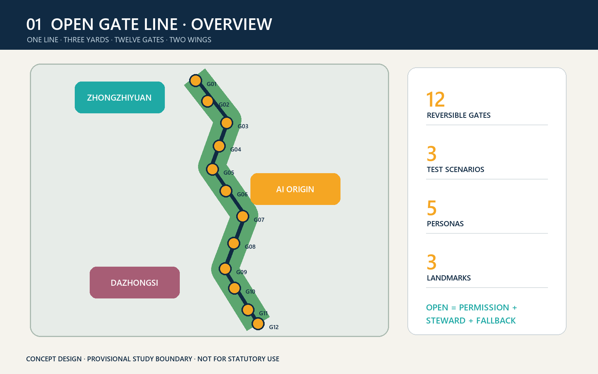
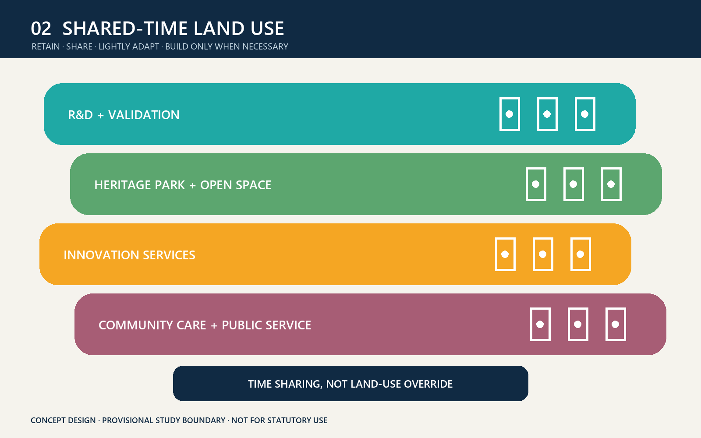
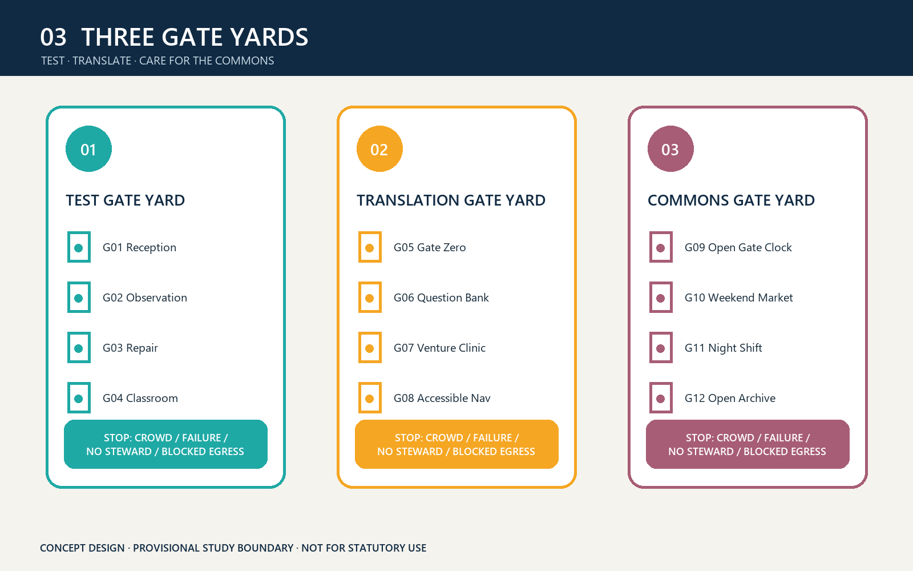
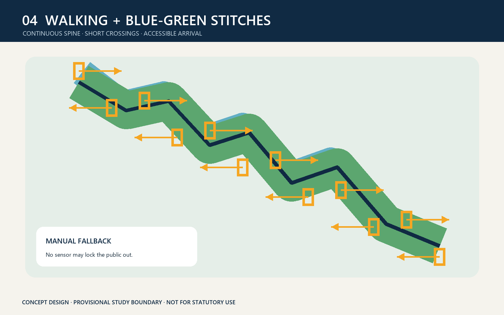
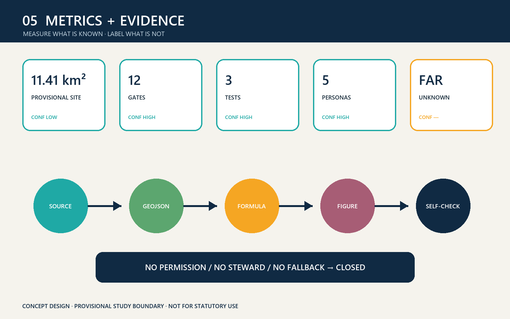

# THE OPEN GATE LINE / 京张开门线

> One heritage line, twelve doors that open on schedule. The project begins with auditable, reversible public-sharing agreements—not demolition.

## Design Basis and Source List

The proposal is grounded in the official call, the agent taskbook, the site package, the source registry, and local standards snapshots [source:OFFICIAL-ANNOUNCEMENT] [source:AGENT-TASKBOOK] [source:SITE-PACKAGE]. Standard coverage for the two project documents is recorded separately [standard:PROJECT-OFFICIAL-ANNOUNCEMENT] [standard:PROJECT-AGENT-OPEN-CALL-TASKBOOK]. The package reports approximately 43.6 km² for coordinated research, 11.4 km² for overall design, and 368.4 ha across the three key areas. These values support concept comparison; they are not a cadastral or statutory survey. No organizer-issued precise polygon is present, so the submitted site and key-area geometries remain provisional study boundaries [source:BOUNDARY-SOURCE] [source:KEY-AREA-SOURCE] [data:geometry/site_boundary.geojson].

Approved plot-level FAR, height, density, green-ratio, setback, road-redline, ownership, utility-capacity, and fire constraints are unavailable. The proposal does not invent them and keeps FAR unknown pending official information [metric:floor_area_ratio] [depth:development_intensity_controls]. Mechanism references include one-north, STATION F, and Kendall Square [source:CASE-ONE-NORTH] [source:CASE-STATION-F] [source:CASE-KENDALL], plus Kalasatama, Seoul AI Hub, and MaRS [source:CASE-KALASATAMA] [source:CASE-SEOUL-AI-HUB] [source:CASE-MARS]. Their scales, outcomes, and governance are not asserted for Jing-Zhang.

## Three-Level Scope Framework

One gate protocol links three scales while each answers a different question [depth:three_level_scope_framework]. The coordinated research area maps shareable capabilities among universities, firms, communities, rail heritage, and public services. The overall design area organizes a heritage-park walking spine, twelve shared-time gates, and blue-green public space. The three key areas turn spatial, operating, data, and safety conditions into testable prototypes. The object is not a continuous retail street, but a public-threshold system that opens at different times, for different users, under explicit permissions.

Each gate has four layers: a legible frame and accessible interface; reservation, arrival, and capacity information; on-site stewardship, inspection, and emergency closure; and quarterly public evaluation with an exit mechanism. Opening is never assumed. If ownership, fire, security, heritage, accessibility, insurance, or operating agreements are incomplete, the node stays in observation or closed status. Replacing the provisional boundaries regenerates every spatial layer and area metric while preserving the protocol structure [source:SOURCE-REGISTRY] [depth:risk_missing_data].

Acceptance at the research scale is a partner-resource-time catalog; at the overall scale, a continuous walking system, readable gate sequence, and coherent public realm; at the key-area scale, at least three field validations with stop conditions. The proposal scenario cards and metrics table jointly record twelve conceptual nodes, not existing ownership or permission to open [data:proposal.md] [metric:gate_count].

## Coordinated Research Area: Industry and Future City Research

The industry strategy shifts from “build another park” to “make existing capacity visible, reachable, and cooperative at the right time.” Northern life-science and university assets, the central AI origin and innovation firms, and southern Dazhongsi cultural-commercial resources exchange through an opening calendar: controlled visits and validation of research facilities; two-way translation between community problems and startup services; and joint curation of culture and public markets [depth:industry_ecosystem]. Two support wings are not large new buildings. They are a contracts/compliance wing and a data/operations wing providing common templates and training for all twelve gates.

Local translations of the six precedents are precise. one-north informs different programming for weekday evenings and weekends. STATION F informs a legible shared-service entrance. Kendall Square shows innovation carried by a public-space network rather than a single icon. Kalasatama informs resident participation in problem definition. Seoul AI Hub demonstrates staged education, enterprise, and research support. MaRS demonstrates continuity through partner networks. Jing-Zhang borrows only four light mechanisms—protocol, calendar, test, and review—not land regimes or investment levels.

The structure is “one line, three yards, twelve gates, two wings.” The line is the Jing-Zhang Heritage Park threshold spine. The yards are the Zhongzhiyuan Test Gate Yard, AI Origin Translation Gate Yard, and Dazhongsi Commons Gate Yard. Four gates sit in each key area. The two wings provide compliance and operations. Annual evaluation measures signed sharing agreements, accessible-task success, transparent cancellations and incident reporting, and joint resident-facility reviews rather than promised footfall or output [metric:scenario_node_count] [depth:urban_design_structure].

## Overall Design Area: Urban Renewal and Regulatory-Plan-Level Urban Design

The overall structure uses the provisional north-south heritage line as its spine and short east-west walking stitches as ribs. Four conceptual land-use zones—AI R&D, park/open space, industry services, and community support—organize the submitted geometry without constituting a land-use determination or rezoning recommendation [data:geometry/land_use.geojson] [standard:MNR-LAND-USE-CLASSIFICATION-GUIDE]. Renewal follows retain, share, lightly adapt, and only then build: activate ground floors, courtyards, links, and residual spaces before adding floor area.

Three spatial gate types are used. Courtyard gates suit contained tests, classes, and repair. Corridor gates connect walking, interpretation, and public service. Hall gates host reception, civic questions, and international exchange. Every type provides a two-sided status signal, step-free approach, sheltered waiting, lighting, and emergency closure. Removable construction keeps a pilot from becoming permanent occupation. Height, massing, and character respect heritage scale and park permeability; exact controls await statutory and professional review [depth:height_massing_character].

Regulatory-plan-level depth is expressed as a conditions table, not false precision. Before design development, each node checks ownership, heritage, fire and egress, utilities, noise, licenses, cybersecurity, personal information, and accessibility. Every unresolved item names an owner, missing evidence, and decision date. GeoJSON, metrics, figures, and reports share one evidence chain and can be recalculated when official boundaries arrive [metric:site_area_sqm] [metric:green_ratio] [metric:public_space_ratio]. Recalculation depth is audited separately [depth:metrics_recalculation].

## Detailed Design of Key Areas

Zhongzhiyuan contains G01 Test Reception, G02 Safety Observation, G03 Repair Learning, and G04 River-Park Classroom, forming the Test Gate Yard. Closable yards, equipment lockers, observation seating, and legible retreat routes support TVS-01, which tests reservation, queuing, and emergency closure at multiple capacities. Crowding, sensor failure, absent stewards, or blocked fire access stop the test. No facility or institution is represented as having agreed to open [assumption:A-GATE-APPROVAL-001].

AI Origin contains G05 Origin Gate, G06 Community Question Bank, G07 Venture Clinic, and G08 Accessible Navigation, forming the Translation Gate Yard. One side translates care, mobility, noise, learning, and other civic problems into verifiable briefs; the other translates model capability, limits, and data responsibility into public language. In TVS-02, older adults, wheelchair users, and blind or low-vision participants test arrival, recognition, help, and exit. Any system requiring biometrics as the default passage method is rejected.

Dazhongsi contains G09 Heritage Commons, G10 Weekend Prototype Market, G11 Night-Shift Service, and G12 Open Archive, forming the Commons Gate Yard. Mobile stalls, weather edges, and visible neighbor agreements support cultural curation, startup display, and daily services. TVS-03 compares everyday, event, and evacuation flows, retaining manual counts and anonymized data. The landmarks are G05 Gate Zero, G09 Open Gate Clock, and the corridor Commons Signal Towers. They show shared status and care without monumental excess [depth:three_key_area_detailed_design].

## AI Innovation Ecosystem, Personas, and AI+ Scenarios

Five primary personas guide the design: researcher Lin needs safe, reproducible real-world settings; caregiver Zhou uses evening and weekend services with a child; mobility-limited Mr. Chen needs step-free access, seated waiting, and human help; entrepreneur and international visitor Maya needs bilingual rules, temporary display, and partnership entry; steward Han manages keys, energy, cleaning, insurance, and closure. Each gate card records both user value and operator burden, preventing a district designed only for “innovators” [depth:personas_scenarios].

The twelve scenario cards are G01 contained robot test, G02 safety observation class, G03 repair and parts sharing, G04 climate classroom, G05 public AI briefing, G06 community question bank, G07 venture clinic, G08 accessible navigation, G09 heritage commons, G10 weekend prototype market, G11 night-shift services, and G12 open archive. Each specifies time, capacity, accountable steward, required data, no-data alternative, stop condition, and review date. TVS-01, TVS-02, and TVS-03 are the three test-validation scenarios [metric:test_scenario_count].

AI may forecast waits, assist scheduling, suggest accessible routes, cluster civic questions, support event review, and recommend energy actions. It does not make final admission decisions. An authorized person confirms each status and a manual mode remains available. Cameras and identity data are not collected by default. Any exception must state purpose, minimum fields, retention, access, and deletion. Model outputs display uncertainty and an appeal path; failure falls back to paper lists, manual counting, and human guidance [assumption:A-DATA-001] [standard:MOHURD-URBAN-DESIGN-MEASURES].

## Land Use, Building Scale, and Retain-Renovate-Demolish Strategy

Four continuous conceptual zones stitch R&D, park, industry, and community functions. The layer verifies topology and spatial logic, not legal classification. Building action prioritizes reversible ground-floor work. Retain buildings with usable structure, cultural cues, or current value. Renovate closed but serviceable edges through doors, shelter, accessibility, and limited MEP changes. Consider removal only after professional surveys confirm unsafe structures, critical public-safety obstruction, or no repair value [depth:retain_renovate_demolish].

The current `buildings.geojson` is a conceptual base whose measured footprint is approximately 310,807 m²; it is not an existing-building survey or approved development quantum [metric:building_footprint_area_sqm] [data:geometry/buildings.geojson]. Total floor area and FAR remain unknown because floors, statutory boundaries, and approved intensity are missing [metric:floor_area_ratio]. A later building-by-building survey must record age, structure, ownership, occupancy, ground-floor access, fire status, and heritage value before a formal retain-renovate-demolish plan.

The identity system uses deep navy frames, amber open signals, teal accessibility guidance, and stone information surfaces. Its form abstracts rail, doorway, and signal without copying historic components. Any necessary new volume should occupy existing hardscape or low-value ancillary areas and keep the park edge permeable. Materials are removable, repairable, and replaceable. The bilingual name is “THE OPEN GATE LINE / 京张开门线,” with the operating phrase “Open on time. Close together.”

## Transport, Rail, Municipal Infrastructure, and Public Services

The walking network follows the north-south heritage spine and sends twelve short, legible stitches into adjacent neighborhoods [data:geometry/roads.geojson] [depth:traffic_rail_slow_parking]. Pedestrians receive a continuous priority surface; cycles slow at busy gates; accessible routes do not detour. Ride-hail and servicing use peripheral short-stay points outside core gate yards. Rail-station connections are not pinpointed until official redlines, operating boundaries, and passenger data are available.

Municipal support uses a “small connection, monitored use, clean disconnect” kit: metered power, low-glare light, closable water, separated public and device networks, temporary wet-weather drainage, emergency audio, and mechanical keys. Environmental and energy data are published only as anonymous node totals, and sensor failure never blocks a manual opening. Public services include toilets, drinking water, family care, seating, first aid, bilingual assistance, and accessible help aligned with gate status [depth:municipal_new_infrastructure].

TVS-01 evaluates reservation limits, manual counts, queue length, and evacuation time. TVS-02 evaluates task completion, assistance calls, and detour distance. TVS-03 evaluates conflicts through anonymous segmented counts in normal, event, and evacuation modes. Fire, transport, and accessibility professionals set thresholds before tests; this concept does not invent them. Incidents, near misses, or complaints trigger downgrade, review, or closure.

## Blue-Green Network, Public Space, and Urban Character

The heritage park is the continuous ecological base, while gates occupy existing hardscape or recoverable micro-sites. Current concept geometry yields a 12.34% green ratio and a 7.33% public-space ratio relative to the provisional boundary. These are submission-geometry calculations, not existing-condition statistics, planning targets, or compliance claims [metric:green_ratio] [metric:public_space_ratio] [data:geometry/green_space.geojson]. Public-space geometry is retained in its structured layer [data:geometry/public_space.geojson]. Official boundaries and controls require full recalculation.

Public space supports four time sections: morning commute, midday learning, evening care, and weekend display. Gate forecourts provide shade, seating, water, visible exits, and child-safe edges. Rain gardens and tree planting prioritize thermal comfort, while species, soil, and sponge-city parameters await specialist design. Night lighting communicates status and low-level routes rather than using large screens or bright media against heritage settings [depth:blue_green_public_space].

Urban character follows “legible light intervention.” A repeated frame gives corridor continuity, while three landmarks hold shared memory and existing buildings retain material authenticity. Amber means open, teal means assisted, and dark means closed; digital and physical status must match. Commons Signal Towers acknowledge teams, open hours, and repaired issues without personal rankings or behavioral scores.

## Renewal Projects, Implementation Policy, and Phasing

Phase 1 (0–12 months) addresses agreements and three low-risk prototypes: verify official boundaries and ownership, establish a joint gate-line group, adopt the gate-card template, and select one closable pilot in each key area. Acceptance is three agreement sets, three tabletop exercises, and three TVS tests—not a construction count. Phase 2 (years 1–3) expands to twelve gates only after evaluation and completes walking, accessibility, blue-green, and public-service links. Phase 3 (after year 3) uses annual public reports to retain, move, or retire nodes [data:geometry/phasing.geojson] [depth:phasing_implementation].

The project list is P01 boundary replacement and baseline survey; P02 joint governance desk; P03 three gate-yard prototypes; P04 twelve-gate equipment and wayfinding; P05 walking stitches and accessibility repairs; P06 blue-green micro-renewal; P07 bilingual signs and open archive; P08 data-minimization and security audit; P09 steward training and annual drills. Each identifies lead, partners, prerequisites, stop conditions, operating funding, and restoration responsibility [depth:renewal_project_list].

Policy tools prioritize shared-time agreements, accounting between civic and commercial hours, revocable temporary permits, pooled insurance, opening-performance support, and a small maintenance fund. Facility owners, street and community representatives, specialists, and users review operations. Monthly disclosure covers hours, cancellations, and safety events; quarterly review covers accessibility and neighborhood impact; annual review decides renewal. Pilot status never bypasses planning, heritage, fire, or personal-information duties.

## Metrics, Area Recalculation, and Compliance Matrix

Four metric groups are used. Spatial-base metrics include the 11,412,825 m² provisional boundary, 310,807 m² conceptual footprint, 12.34% conceptual green ratio, 7.33% conceptual public-space ratio, and three key areas [metric:site_area_sqm]. Network-capacity metrics count twelve gates, three test scenarios, five personas, and three landmarks [metric:gate_count] [metric:persona_count] [metric:landmark_count]. Operating-quality metrics track scheduled opening, explained cancellations, and incident closure. Equity metrics track accessible-task success, manual fallback availability, and gaps between user groups.

The first five values recalculate from submitted GeoJSON; node and task counts cross-check structured files and proposal lists. Operating and equity measures remain “to be measured” before real pilots and no baseline is fabricated. FAR also remains unknown [metric:floor_area_ratio]. Each quantitative value records source files, formula, unit, confidence, and assumptions. Task coverage is in `compliance_matrix.json`, standards in `standard_matrix.json`, and professional depth in `design_depth_matrix.json` [depth:metrics_recalculation].

## Risk, Copyright, and Compliance

The first risk is missing boundary, ownership, and control information. Provisional geometry is not an official redline, precise area, or approval basis; official polygons require topology, area, figures, and PDFs to be regenerated [assumption:A-BOUNDARY-001]. The second is mistaking “open” for permission: all twelve gates are design candidates requiring ownership, heritage, fire, security, insurance, operations, and accessibility reviews [assumption:A-GATE-APPROVAL-001]. The third is technical overreach: AI makes no final admission decision and biometrics or behavioral scoring are never the default [assumption:A-DATA-001].

Operating risk is controlled through accountable gate cards, steward check-in, mechanical fallback, capacity limits, incident logs, and restoration budgets. Neighborhood risk is controlled through noise and night-hour conditions, complaint response, and quarterly review. Ecological risk is controlled through light intervention, reversible foundations, and pre-construction tree and hydrology surveys. The public can inspect opening rules, data fields, retention, and appeals. Honest unknowns are design content, not omissions [depth:risk_missing_data].

All text, diagrammatic figures, offline pages, and layout code were created for this submission. The cover was generated from an original prompt using OpenAI's image-generation tool, with provenance in `sources.json` and `report/copyright_statement.md`. No unlicensed photograph, third-party logo, or redistributed restricted font is embedded. The package uses the repository-required `COMMUNITY-DISPLAY-ONLY` license and does not sublicense precedent websites or government material.

## References

- Beijing Municipal Commission of Planning and Natural Resources, Haidian Branch, official call [source:OFFICIAL-ANNOUNCEMENT].
- Repository site package and agent taskbook [source:SITE-PACKAGE] [source:AGENT-TASKBOOK]; source registry and processed fact pack [source:SOURCE-REGISTRY] [source:PROCESSED-FACT-PACK].
- Local snapshots for urban-design measures, regulatory planning, and land-use classification [standard:MOHURD-URBAN-DESIGN-MEASURES] [standard:MOHURD-CONTROL-DETAILED-PLANNING] [standard:MNR-LAND-USE-CLASSIFICATION-GUIDE].
- Official or institutional pages for JTC one-north, STATION F, and City of Cambridge Kendall Square [source:CASE-ONE-NORTH] [source:CASE-STATION-F] [source:CASE-KENDALL]; Forum Virium Helsinki Kalasatama, Seoul Metropolitan Government Seoul AI Hub, and MaRS Discovery District [source:CASE-KALASATAMA] [source:CASE-SEOUL-AI-HUB] [source:CASE-MARS].

Machine-readable index: `manifest.json`, `sources.json`, `assumptions.json`, `metrics.json`, `compliance_matrix.json`, `standard_matrix.json`, `design_depth_matrix.json`, and `self_check.json`.
