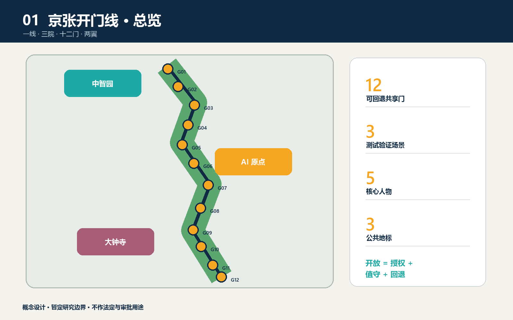
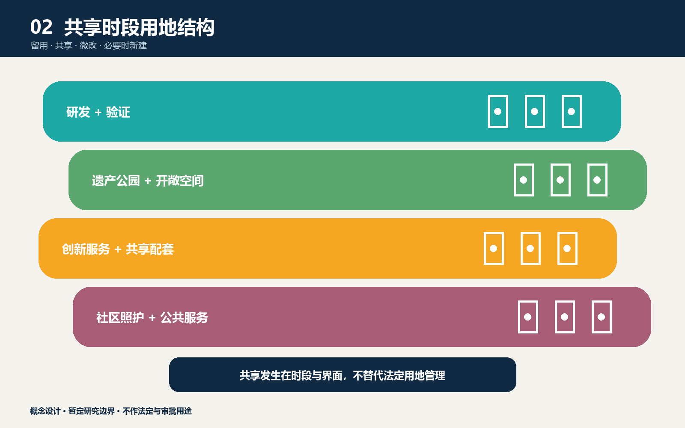
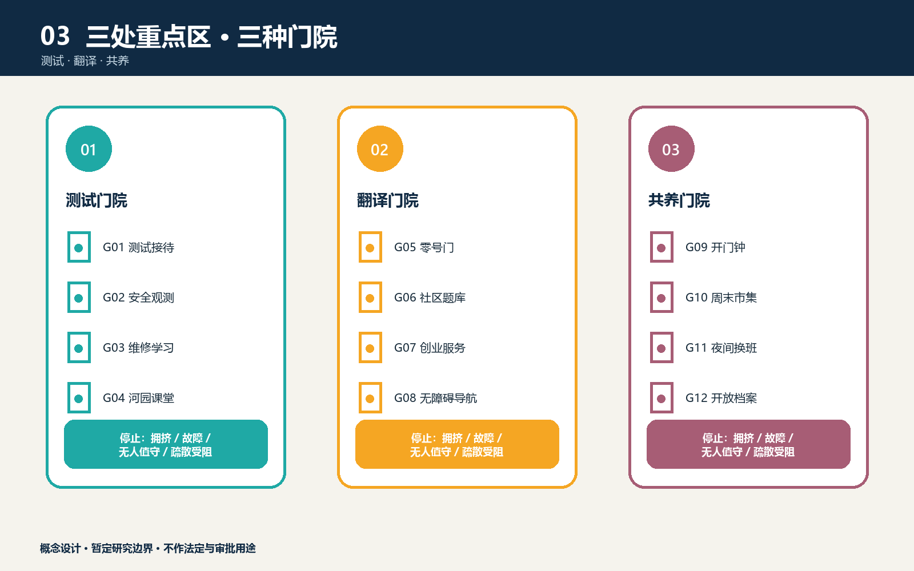
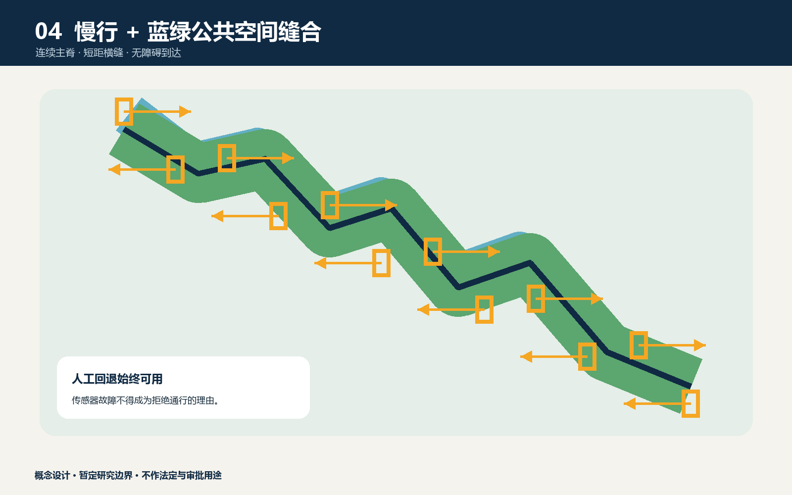
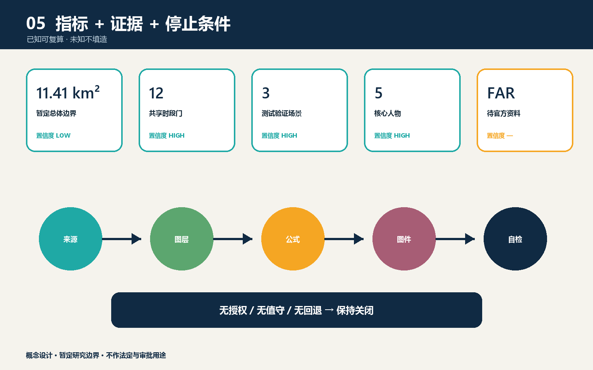

# 京张开门线 / THE OPEN GATE LINE

> 一条遗产线，十二扇按时打开的门。不是先拆墙，而是先建立可审计、可回退、可持续运营的公共共享协议。

## 设计依据与资料清单

本方案以征集公告、智能体任务书、场地包、来源登记表和本地标准快照为依据 [source:OFFICIAL-ANNOUNCEMENT] [source:AGENT-TASKBOOK] [source:SITE-PACKAGE]。两份项目文件的标准覆盖另见标准矩阵 [standard:PROJECT-OFFICIAL-ANNOUNCEMENT] [standard:PROJECT-AGENT-OPEN-CALL-TASKBOOK]。范围事实使用场地包给出的统筹研究范围约 43.6 平方公里、总体设计范围约 11.4 平方公里、重点区域合计约 368.4 公顷；这些数字用于概念比选，不替代法定测绘。当前仓库没有组织方发布的精确官方多边形，提交的 `site_boundary.geojson` 与三处 `key_areas.geojson` 因而均是暂定研究边界 [source:BOUNDARY-SOURCE] [source:KEY-AREA-SOURCE] [data:geometry/site_boundary.geojson]。

法定容积率、高度、建筑密度、绿地率、退线、道路红线、产权、市政容量与消防条件均未在公开包中形成可直接采用的地块控制值；方案不填造数字，相关指标标为待官方资料确认 [metric:floor_area_ratio] [depth:development_intensity_controls]。全球案例只用于机制研究：one-north 的跨时段场地活动与试验平台、STATION F 的共享服务社区、Kendall Square 的公共空间网络 [source:CASE-ONE-NORTH] [source:CASE-STATION-F] [source:CASE-KENDALL]；Kalasatama 的生活实验室、Seoul AI Hub 的产学研平台、MaRS 的创新社区构成另一组参考 [source:CASE-KALASATAMA] [source:CASE-SEOUL-AI-HUB] [source:CASE-MARS]。其规模、绩效和制度不外推为京张事实。

## 三层范围工作框架

三层范围由同一条“开门协议”贯通，但每层回答不同问题 [depth:three_level_scope_framework]。统筹研究范围识别高校、企业、社区、轨道遗产与公共服务之间可共享的能力，形成伙伴和政策清单；总体设计范围组织遗产公园慢行脊、十二个共享时段门及蓝绿公共空间；三个重点区域把门的空间、运营、数据与安全条件做成可测试原型。设计对象不是一条连续商业街，而是一套在不同时间、面对不同人群、以不同权限打开的公共阈值系统。

每扇门由四层组成：可辨识的门架和无障碍界面；预约、到达与容量提示；现场值守、巡检和应急关闭；季度公开评估与退出机制。开放从来不是默认状态：产权主体、消防、治安、文保、无障碍、保险与运营协议任何一项未满足，节点就保持“观察”或“关闭”。边界替换时，所有空间层和面积指标重新生成，而协议结构仍可保留 [source:SOURCE-REGISTRY] [depth:risk_missing_data]。

三个尺度的验收分别是：研究层形成伙伴—资源—时段目录；总体层形成连续慢行、清晰门序列和可读公共空间；重点层完成至少三项带停止条件的现场验证。十二个概念节点由提案场景卡与指标表共同记录，不表达现状产权或已获准开放 [data:proposal.md] [metric:gate_count]。

## 统筹研究范围产业与未来城市研究

产业策略从“再建一个园区”转为“让现有能力按合适时段可见、可达、可合作”。北部生命科学和高校资源、中部 AI 原点与创新企业、南部大钟寺文化商业资源通过开门日历形成三类交换：科研设施的受控参观与验证、创业服务与社区问题的双向翻译、文化内容与公共市场的共同策展 [depth:industry_ecosystem]。两翼不是新增大体量，而是合同与合规翼、数据与运营翼，为十二扇门提供统一模板和培训。

六个案例机制的本地转译如下：one-north 启发“工作日晚间、周末不同场景”的时段编排；STATION F 启发把服务清单做成可理解的社区入口；Kendall Square 启发以公共空间网络而非单栋地标承载创新；Kalasatama 启发居民参与问题定义；Seoul AI Hub 启发教育、企业与研究平台的阶段性支持；MaRS 启发以伙伴网络提供连续服务。京张只采用“协议、日历、测试、复盘”四种轻机制，不复制土地制度或投资规模。

空间上建立“一线、三院、十二门、两翼”：一线为京张遗产公园公共门槛脊；三院为中智园测试门院、AI 原点翻译门院、大钟寺共养门院；十二门每片区四处；两翼分别提供合规和运营。年度目标不承诺客流或产值，而以签署共享协议数、无障碍任务成功率、取消与事故记录公开度、居民与设施方共同复盘率衡量 [metric:scenario_node_count] [depth:urban_design_structure]。

## 总体设计范围城市更新与控规深度城市设计

总体结构以暂定总体边界内的南北遗产线为骨架，以东西向步行缝合为肋。土地用途图层采用 AI 研发、公园开敞、产业服务、社区配套四类概念分区，只作为方案结构，不构成地类认定或用地调整建议 [data:geometry/land_use.geojson] [standard:MNR-LAND-USE-CLASSIFICATION-GUIDE]。更新优先级是“留用—共享—微改—必要时新建”：先盘活首层、院落、连廊和边角空间，再讨论建筑增量。

十二门按三种空间原型实施：庭院门适合小型验证、课程和维修；廊道门连接慢行、展陈与公共服务；大厅门承载预约接待、社区议题与国际交流。每处都设置双向可见的开放状态、无台阶路径、等候避雨、照明和紧急关闭；设备采用可拆卸构造，避免把试验变成永久占用。建筑高度、体量、风貌以尊重遗产尺度、控制首层界面、避免压迫公园为原则，具体限值待控规与专业审查 [depth:height_massing_character]。

控规深度采取“条件表”而非伪精确图则：每个节点在进入方案深化前核对权属、文保、消防、疏散、市政接入、噪声、营业许可、网络安全、个人信息和无障碍；未通过项明确责任人、补充材料与最晚决策点。总体数据保持 GeoJSON—指标—图件同源，可在官方边界到位后自动复算 [metric:site_area_sqm] [metric:green_ratio] [metric:public_space_ratio]。复算深度由专业矩阵单列校核 [depth:metrics_recalculation]。

## 重点区域详细设计

中智园重点区设置 G01 测试接待门、G02 安全观测门、G03 维修学习门、G04 河园课堂门，构成“测试门院”。空间采用可封闭小院、器材柜、观察席与清晰回退路线；TVS-01 在不同容量下测试预约、排队与应急关闭。停止条件包括拥挤超阈、关键传感器失效、值守缺席或消防通道受阻。该区不预设任何具体机构设施已同意开放 [assumption:A-GATE-APPROVAL-001]。

AI 原点重点区设置 G05 原点门、G06 社区题库门、G07 创业服务门、G08 无障碍导航门，构成“翻译门院”。一侧把居民照护、出行、噪声、学习等问题转成可验证任务，另一侧把模型能力、限制和数据责任翻译成公众可理解语言；TVS-02 由老年人、轮椅使用者和视障参与者完成到达、识别、求助、退出全链路测试。任何以生物识别作为默认通行手段的方案直接淘汰。

大钟寺重点区设置 G09 文化共养门、G10 周末市集门、G11 夜间换班门、G12 门牌档案馆，构成“共养门院”。可移动摊位、遮雨边界和可见的邻里公约支持文化策展、创业展示与日常服务；TVS-03 比较日常、活动、疏散三种人流模式，保留手工计数和匿名化数据路径。三处地标分别是 G05“零号门”、G09“开门钟”和沿线“公共荣誉信号塔”，它们表达开放状态与共同维护，不制造宏大纪念物 [depth:three_key_area_detailed_design]。

## AI 创新生态、人才画像与 AI+ 场景

五类核心人物是：研究员林澄需要安全、可复现的真实场景；照护者周敏带儿童使用夜间与周末服务；行动不便的陈伯需要无台阶到达、可坐等候和人工求助；创业者兼国际访客 Maya 需要双语规则、临时展示和合作入口；设施管家韩师傅关心钥匙、能耗、清洁、保险和谁来收尾。方案用同一张门卡同时描述使用者收益与管理者负担，避免只为“创新者”设计 [depth:personas_scenarios]。

十二个场景卡分别为：G01 小型机器人封闭测试、G02 安全观测课、G03 维修与零件共享、G04 河园气候课堂、G05 AI 公共说明会、G06 社区问题题库、G07 创业门诊、G08 无障碍导航、G09 遗产共养、G10 周末原型市集、G11 夜间换班服务、G12 开放档案。每张卡记录时段、容量、责任人、所需数据、无数据替代流程、停止条件与复盘日期；其中 TVS-01/02/03 为测试验证场景 [metric:test_scenario_count]。

AI 只承担预测等候、辅助排班、无障碍路线提示、问题聚类、事件复盘和能源建议，不直接决定谁有资格进入。门的开放状态由授权责任人确认，系统保留人工模式；摄像与身份数据默认不采集，确需使用时必须说明目的、最小字段、保存期、访问权和删除流程。模型输出要显示置信度与申诉入口，失败时退回纸质名单、现场计数和人工导引 [assumption:A-DATA-001] [standard:MOHURD-URBAN-DESIGN-MEASURES]。

## 用地、建筑规模与拆改留方案

概念用地结构由四个连续分区组成，服务“研发—公园—产业—社区”的横向缝合；现有分区图仅验证几何闭合与空间逻辑，不作法定分类结论。建筑策略以可逆首层改造为主：保留具有使用价值、文化线索或良好结构条件的建筑；对界面封闭但主体可用的建筑做开门、遮雨、无障碍和机电微改；拆除只在专业鉴定确认危房、严重阻断公共安全或无修复价值后讨论 [depth:retain_renovate_demolish]。

当前 `buildings.geojson` 是概念建筑基底，用于计算设计示意的建筑占地约 310,807 平方米，不代表现状普查或获批建设量 [metric:building_footprint_area_sqm] [data:geometry/buildings.geojson]。总建筑面积和容积率保持未知，因为缺少楼层、法定边界和审批强度 [metric:floor_area_ratio]。后续应以逐栋调查表补充年代、结构、产权、使用状态、首层可达性、消防和文保价值，再形成留改拆专题图。

门架统一采用深海军蓝结构、琥珀开放灯、青绿无障碍导向和石灰白信息面，形态抽象自铁轨、门框与信号，不复制历史构件。新建体量如确有必要，应集中于既有硬化地或低价值附属空间，保持公园侧通透；所有材料以可拆、可修、可替换为先。身份系统名称为“京张开门线 / THE OPEN GATE LINE”，口号是“到点开门，共同收门”。

## 交通、轨道、市政与公共服务设施

慢行系统沿南北遗产脊连续组织，并以十二门向两侧街区形成短而清晰的东西向连接 [data:geometry/roads.geojson] [depth:traffic_rail_slow_parking]。步行优先面连续、骑行在拥挤门前降速、无障碍路线不绕行；网约车和装卸在外围短停，不进入核心公共门院。与轨道站点的接驳位置需在官方红线、运营边界和客流数据取得后校核，本方案不标注未经核实的出入口位置。

市政采用“小接入、可监测、可断开”的节点包：独立计量电源、低眩光照明、可关闭给排水接口、公共网络与设备网络隔离、雨天临时排水、应急广播和机械钥匙。能源与环境数据只以节点级匿名汇总发布；任何传感器故障不应阻止人工开放。公共服务由卫生间、饮水、母婴、休息、急救、双语咨询和无障碍求助组成，开放时间与门状态同步 [depth:municipal_new_infrastructure]。

TVS-01 用预约上限、现场计数、排队长度和疏散时间判断容量；TVS-02 用任务完成率、求助次数和绕行距离判断无障碍；TVS-03 用活动前后步行轨迹的匿名分段计数判断冲突。阈值由消防、交通和无障碍专业人员在现场测试前签定，不由本概念方案臆定。任何事故、近失事件或投诉触发降级、复盘或关闭。

## 蓝绿空间、公共空间与城市风貌

蓝绿系统以遗产公园为连续生态底板，门节点只占用已硬化或可恢复的微空间。现有概念图层测得绿地率约 12.34%、公共空间率约 7.33%，只是当前提交几何相对于暂定边界的复算值，不是现状统计、规划指标或达标声明 [metric:green_ratio] [metric:public_space_ratio] [data:geometry/green_space.geojson]。公共空间几何另行保存在结构化图层 [data:geometry/public_space.geojson]。官方边界与控制指标到位后必须整体重算。

公共空间形成晨间通勤、午间学习、傍晚照护、周末展示四种时间剖面。门前保留阴影、坐凳、饮水、可见出口和儿童安全边界；雨水花园与乔木补植优先改善热舒适，但具体树种、土壤和海绵参数需专项设计。夜景只点亮门的状态和低位路径，避免大屏、强光与遗产背景竞争 [depth:blue_green_public_space]。

城市风貌以“可读的轻介入”为原则：门框建立沿线连续识别，三座地标提供公共记忆，建筑本体保持材料真实性。开放灯的琥珀色表示“可进入”，青色表示“有人协助”，暗灯表示“未开放”；数字状态与现场实体必须一致。公众荣誉信号塔只展示共同维护的团队、时段和问题修复，不显示个人排名或行为评分。

## 更新项目清单、实施政策与分期计划

一期（0—12 个月）只做协议与三个低风险原型：完成官方边界和权属核验、成立门线联合工作组、制定门卡模板、在每个重点区选择一处可随时关闭的试点；验收是三套协议、三次桌面演练和三项 TVS 测试，而非建成数量。二期（1—3 年）在评估通过后扩展到十二门，补齐慢行、无障碍、蓝绿与公共服务；三期（3 年以后）依据年度公开报告决定固化、迁移或退出 [data:geometry/phasing.geojson] [depth:phasing_implementation]。

更新项目清单包括：P01 暂定边界替换与基础调查；P02 开门线联合治理台；P03 三个门院原型；P04 十二门设备与导向包；P05 慢行缝合与无障碍补口；P06 蓝绿微更新；P07 双语门牌与开放档案；P08 数据最小化与安全审计；P09 管家培训和年度演练。每项设置牵头方、合作方、前置资料、停止条件、运行预算来源和退出恢复责任 [depth:renewal_project_list]。

政策工具优先使用共享时段协议、公益与商业时段分账、可撤销临时许可、共同保险、开放绩效补贴和小额维护基金。年度运营由设施方、街道社区、专业机构与用户代表共同审阅；月度公布开放时段、取消原因与安全事件，季度复盘可达性和邻里影响，年度决定续约。任何节点不得因试点身份绕过文保、消防、规划或个人信息要求。

## 指标体系、面积复算与合规矩阵

指标分四组：空间底板记录暂定边界面积约 11,412,825 平方米、概念建筑占地约 310,807 平方米、概念绿地率 12.34%、概念公共空间率 7.33%和三处重点区 [metric:site_area_sqm]；网络能力记录 12 门、3 个测试场景、5 类人物和 3 个地标 [metric:gate_count] [metric:persona_count] [metric:landmark_count]；运营质量记录按计划开放率、取消解释率、事故与近失闭环率；公平与可达记录无障碍任务成功率、人工替代可用率和跨人群使用差异。

前五项可由提交的 GeoJSON 复算，节点与任务数量由结构化文件和提案清单核对；运营、公平指标在真实试点前保持“待测”，不得填造基线。容积率同样保持未知 [metric:floor_area_ratio]。所有数值都附来源文件、公式、单位、置信度与假设；完整任务覆盖见 `compliance_matrix.json`，标准覆盖见 `standard_matrix.json`，专业深度见 `design_depth_matrix.json` [depth:metrics_recalculation]。

## 风险、版权与合规说明

首要风险是边界、权属和控制条件缺失：暂定几何不得作为官方红线、精确面积或审批依据；取得官方图件后需替换并重跑拓扑、面积、图件和 PDF [assumption:A-BOUNDARY-001]。第二是“开放”被误读为已获许可：十二门全部是设计候选，必须逐点完成产权、文保、消防、治安、保险、运营和无障碍审查 [assumption:A-GATE-APPROVAL-001]。第三是技术越权：AI 不做最终准入判断，不以人脸或行为评分作为默认通行条件 [assumption:A-DATA-001]。

运营风险通过责任门卡、值守签到、机械回退、容量上限、事故记录和恢复预算控制；邻里风险通过噪声与夜间时段约束、投诉响应和季度复盘控制；生态风险通过轻介入、可逆基础和施工前树木水文调查控制。公众可以查看开放规则、数据字段、保存期和申诉路径。对未知项的诚实披露是方案的一部分，不是设计空白 [depth:risk_missing_data]。

所有文字、矢量化示意图、离线网页和排版脚本为本次提交原创生成；封面使用 OpenAI 图像生成工具按原创提示生成，来源与生成说明记录于 `sources.json` 和 `report/copyright_statement.md`。不嵌入未授权照片、第三方标志或受限字体文件。成果按仓库要求以 `COMMUNITY-DISPLAY-ONLY` 提交，不将案例网页内容或政府材料版权转授。

## 参考资料

- 北京市规划和自然资源委员会海淀分局，征集公告 [source:OFFICIAL-ANNOUNCEMENT]。
- 征集仓库场地包与智能体任务书 [source:SITE-PACKAGE] [source:AGENT-TASKBOOK]；来源登记与处理事实包 [source:SOURCE-REGISTRY] [source:PROCESSED-FACT-PACK]。
- 《城市设计管理办法（试行）》、控制性详细规划与国土空间调查规划用地分类相关本地标准快照 [standard:MOHURD-URBAN-DESIGN-MEASURES] [standard:MOHURD-CONTROL-DETAILED-PLANNING] [standard:MNR-LAND-USE-CLASSIFICATION-GUIDE]。
- JTC one-north、STATION F 与 City of Cambridge Kendall Square 官方或机构页面 [source:CASE-ONE-NORTH] [source:CASE-STATION-F] [source:CASE-KENDALL]；Forum Virium Helsinki Kalasatama、Seoul Metropolitan Government Seoul AI Hub 与 MaRS Discovery District 页面 [source:CASE-KALASATAMA] [source:CASE-SEOUL-AI-HUB] [source:CASE-MARS]。

机器可读索引：`manifest.json`、`sources.json`、`assumptions.json`、`metrics.json`、`compliance_matrix.json`、`standard_matrix.json`、`design_depth_matrix.json` 与 `self_check.json`。
