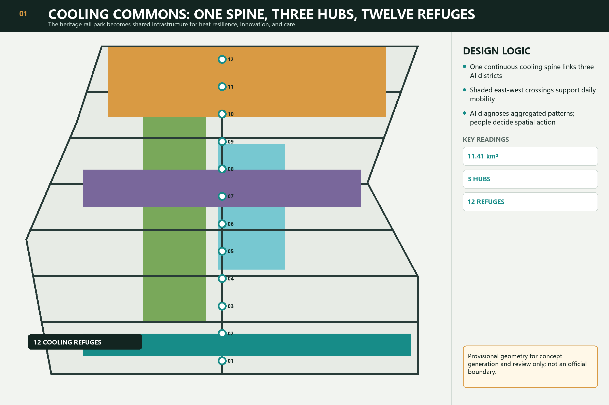
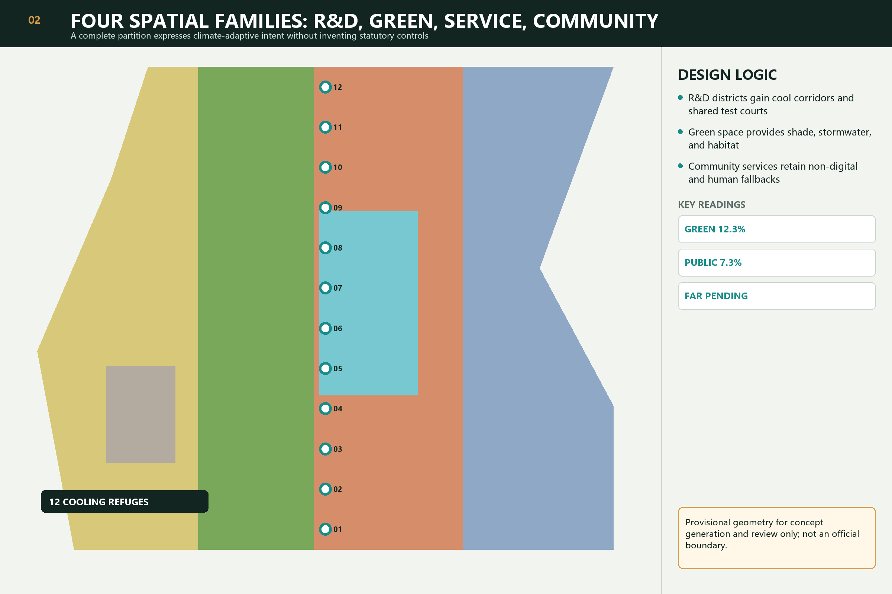
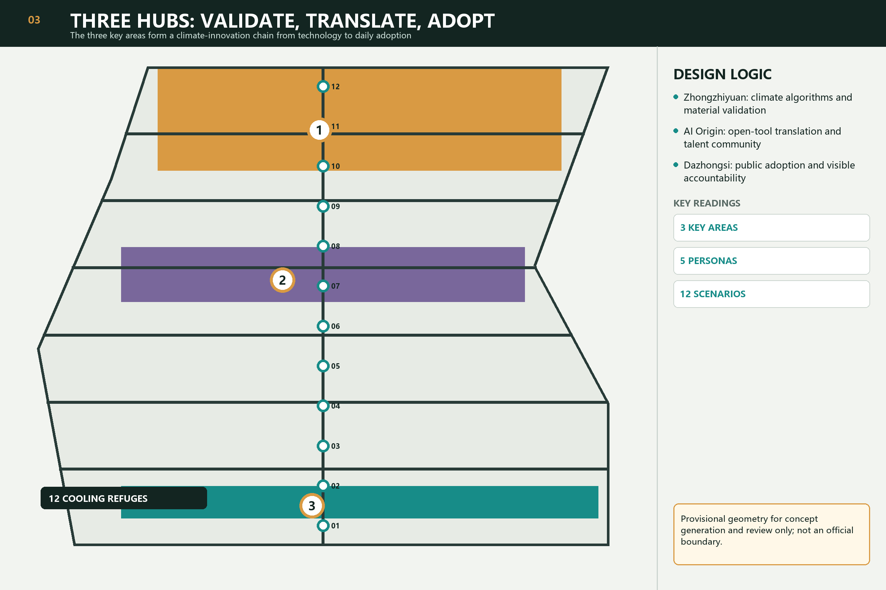
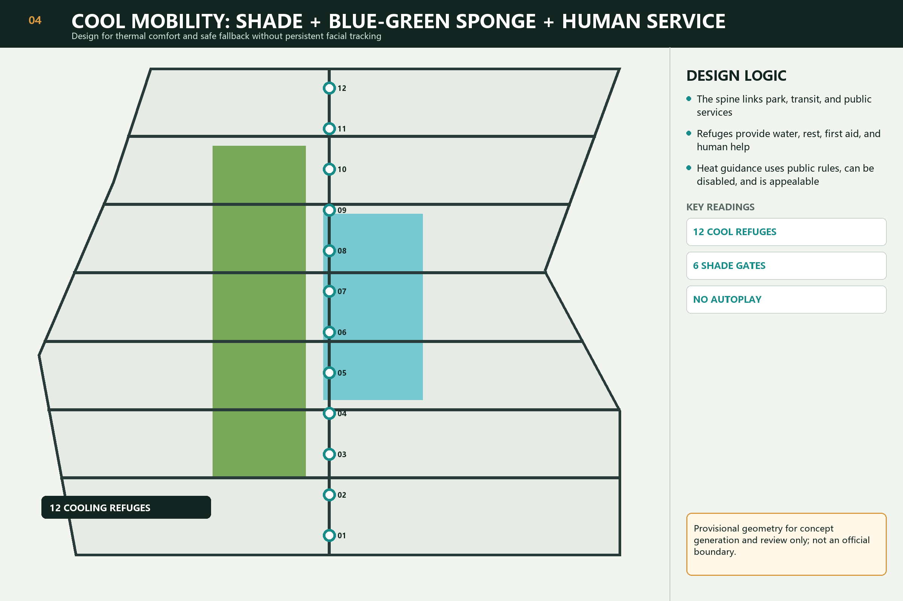
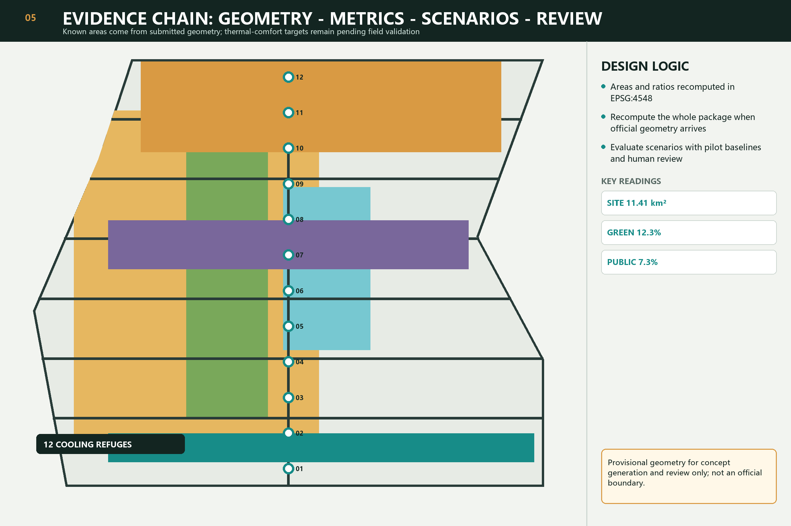

# JING-ZHANG COOLING COMMONS

## Design basis and source list

The proposal responds to the official prequalification announcement and the cleared Agent taskbook. It uses the repository's registered public sources and explicitly provisional geometry. The submitted boundary and three key-area polygons support generation, visualization, and intake review only; they are not official redlines or approval evidence. Every known area is recomputed from the submitted GeoJSON, while statutory FAR, height, ownership, road-redline, utility, heritage, and engineering controls remain pending official data. [source:OFFICIAL-ANNOUNCEMENT] [source:AGENT-TASKBOOK] [depth:existing_conditions_diagnosis]

## Three-level scope framework

The 43.6 km² coordinated research area frames the innovation ecosystem; the approximately 11.4 km² overall design area organizes renewal, mobility, services, and public space; the three provisional key areas support detailed concept design. Cooling Commons translates these nested scopes into one cooling spine, three hubs, six shaded east-west gates, twelve cooling refuges, and two supporting wings. This is a design method, not a new boundary. [data:geometry/site_boundary.geojson#SITE-001] [metric:site_area_sqm] [depth:three_level_scope_framework]

## Coordinated research area: industry and future city research

The central proposition is that a world-class AI district must remain usable during heat stress and when digital services are unavailable. Beijing's master plan supports connected greenways, ventilation corridors, and blue networks, while the ecological restoration plan identifies heat-island mitigation and shaded street networks as citywide directions. They are background policy, not proof of site-specific cooling. Zhongzhiyuan validates algorithms and materials; AI Origin Community translates tools; Dazhongsi demonstrates accountable adoption. [source:BEIJING-MASTER-PLAN] [source:BEIJING-ECO-RESTORATION] [depth:overall_spatial_structure]

The identity direction combines two rail lines, a tree-canopy negative space, and a water-drop node. It uses original geometry and avoids government, corporate, and historic-person emblems. The annual operating concept is a Climate AI Co-creation Week combining data review, material testing, public walks, developer repair sessions, and human decisions; it is a proposal, not a confirmed government program.

## Overall design area: urban renewal and regulatory-plan-level urban design

Four complete land-use families - R&D, green/open space, industry and commercial service, and community support - provide a machine-reviewable partition without inventing statutory controls. The cooling spine overlays continuous shade, blue-green sponge functions, slow mobility, cooling refuges, and non-digital wayfinding. Building and parcel decisions remain conceptual until official existing-condition, ownership, regulatory, and engineering files are available. [data:geometry/land_use.geojson#LU-001] [data:geometry/buildings.geojson#BLDG-001] [depth:land_use_layout]

Known geometry supports area and ratio recomputation. FAR, building height, density, setbacks, road redlines, and utility capacity stay `unknown` and require professional confirmation. The design prefers reversible shade structures, tree-canopy continuity, ground-floor public interfaces, and low-risk pilots before capital-intensive construction. [standard:MOHURD-CONTROL-DETAILED-PLANNING] [metric:building_footprint_area_sqm] [depth:development_intensity_controls]

## Detailed design of the three key areas

Zhongzhiyuan is the validation hub: climate algorithms, shade materials, low-carbon public interfaces, and safety-governance demonstrations are tested with declared baselines and stop conditions. AI Origin is the translation hub: open tools, talent life, near-campus incubation, and a readable public model-card room connect research to urban use. Dazhongsi is the adoption hub: transit arrival, commercial service, public explanation, and visible accountability make every AI service's data, owner, validity period, opt-out, and human appeal legible. [data:geometry/key_areas.geojson#PROV-KEY-001] [depth:three_key_area_detailed_design]

All three outlines remain provisional. The rectangular geometry must never be interpreted as parcel, street, ownership, or statutory boundaries. Official geometry triggers whole-package recalculation, not a cosmetic boundary replacement.

## AI innovation ecosystem, personas, and AI+ scenarios

Five priority personas are outdoor and frontline workers, older adults and caregivers, children and families, developers and start-ups, and commuters and visitors. Twelve scenarios include a cool-route adviser, refuge maintenance assistant, climate-material test field, open heat-risk toolbox, public adoption room, six shaded gates, Qinghe blue-green test corridor, no-tracking children's route, human-first elder station, heat-event switchboard, heritage cooling pavilion, and annual co-creation week. At least three industry tests compare materials, rules, and service fallbacks before scaling. [data:geometry/public_space.geojson#PUBLIC-001] [metric:public_space_ratio] [standard:PROJECT-AGENT-OPEN-CALL-TASKBOOK]

AI uses authorized aggregated readings and published rules. It does not require facial recognition, individual health scoring, children's trajectory retention, or mandatory QR codes. Every recommendation is optional, time-bounded, explainable, and subject to human review; drinking water, shade, seating, first aid, and wayfinding remain usable without AI.

## Land use, building scale, and retain-renovate-demolish strategy

Land-use terminology follows the registered national classification reference. Existing building status, ownership, structural safety, heritage value, and approved controls are not available in sufficient detail, so no parcel is declared for demolition or construction. The current building layer is a conceptual footprint set used to test spatial relationships; professional teams must classify retain, renovate, demolish, and new-build decisions after verified surveys. [standard:MNR-LAND-USE-CLASSIFICATION-GUIDE] [data:geometry/buildings.geojson#BLDG-001] [depth:retain_renovate_demolish]

## Transport, rail, municipal infrastructure, and public services

The cooling spine links the heritage park, transit stations, neighborhoods, campuses, and innovation districts. Six shaded gates organize waiting, crossing, seating, drinking water, and accessible slopes at major east-west interfaces. The system prioritizes walking and cycling comfort while preserving conventional signs and staffed help. Road redlines, crossings, parking, utilities, drainage, fire access, and energy capacity all require official and professional confirmation. [data:geometry/roads.geojson#ROAD-001] [depth:traffic_rail_slow_parking] [depth:municipal_new_infrastructure]

## Blue-green network, public space, and urban character

Shade, tree canopy, rain gardens, permeable surfaces, seating, and water access form a continuous public-care system rather than isolated smart objects. Cooling refuges use a restrained rail-charcoal, leaf-green, cooling-teal, pale-stone, and amber palette. Heritage interpretation distinguishes documented railway history from newly generated AI culture. Generated visualizations are labeled conceptual and never treated as observations or evidence of public consent. [data:geometry/green_space.geojson#GREEN-001] [data:geometry/public_space.geojson#PUBLIC-001] [depth:blue_green_public_space]

## Renewal projects, implementation policy, and phasing

Six coordinated project families are proposed: cooling-spine continuity, Qinghe climate-material interface, AI Origin open-tool street, Dazhongsi public adoption room, twelve cooling refuges, and the annual co-creation loop. Phase one uses reversible shade, seating, water, offline signs, and baseline measurement. Phase two deepens blue-green links and public-service adoption after review. Phase three recalculates geometry and capital projects using official controls and monitored pilot evidence. No funding, responsible authority, approval, or construction commitment is claimed. [data:geometry/phasing.geojson#PHASE-001] [depth:renewal_project_list] [depth:phasing_implementation]

## Metrics, area recalculation, and compliance matrix

Known site, green-space, public-space, and footprint metrics are recomputed in EPSG:4548 from the submitted geometry. Thermal-comfort improvement, canopy coverage, shaded-route continuity, refuge catchments, maintenance response, and user outcomes remain pending field baselines and defined measurement protocols. The compliance, professional-standard, and design-depth matrices hold exhaustive coverage; prose carries only claim-adjacent evidence. [metric:site_area_sqm] [metric:green_ratio] [metric:public_space_ratio] [depth:metrics_recalculation]

## Risk, copyright, and compliance

The largest risks are provisional geometry, absent statutory and engineering controls, heat-benefit claims without field measurements, surveillance creep, digital exclusion, generated-image misinterpretation, and uncertain operations. Mitigations are whole-package recalculation, human approval gates, aggregated data, explicit stop conditions, non-digital service equivalence, conceptual labels, rights records, and staged pilots. The offline HTML loads no remote scripts, tiles, fonts, trackers, forms, iframes, or APIs. [data:geometry/constraints.geojson#CONSTRAINTS] [source:SITE-PACKAGE] [depth:risk_missing_data]

## References

- Official announcement of the Centennial Jing-Zhang AI Innovation Belt urban design international call.
- Cleared Agent open-call taskbook and co-creation charter.
- Repository source registry, site package, professional-standard snapshots, terminology glossary, and provisional-geometry basis.
- Complete provenance, permissions, transformations, and limitations are recorded in `sources.json`; complete metrics and audit coverage are recorded in the structured package. [source:OFFICIAL-ANNOUNCEMENT] [source:AGENT-TASKBOOK] [source:SOURCE-REGISTRY]
