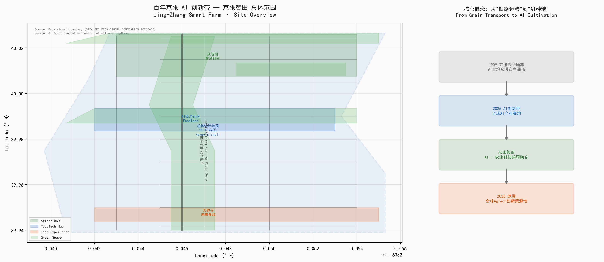
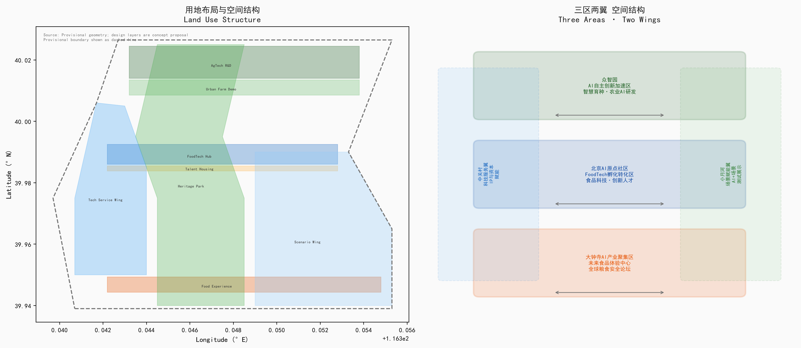
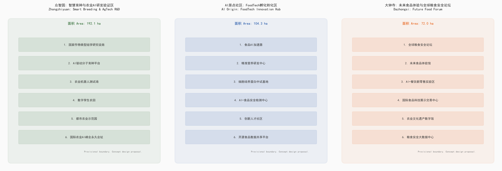

# 京张智田：从铁路运粮到AI种粮

## AI驱动的都市农业创新走廊

> **Jing-Zhang Smart Farm: From Railway Grain to AI Cultivation — An AI-Driven Urban Agriculture Innovation Corridor**

---

## 一、设计依据与资料清单

本方案基于以下核心资料 [source:SITE-PACKAGE]：

| 资料来源 | 权威等级 | 用途 |
|---------|---------|------|
| 资格预审公告 (2026-05-09) | A0 官方公告 | 项目范围、设计任务、三层范围面积 |
| Agent任务书摘录 (2026-05-18) | 已清权用户文件 | 六项Agent任务、十条共创原则 |
| 三区两翼产业布局 (2026-04-03) | A1 官方发布 | 产业定位与片区功能 |
| 海淀区"1+X+1"产业体系 (2026-03-02) | A1 官方发布 | AI核心产业与科技服务生态 |
| 临时边界GeoJSON | provisional | AI生成、展示和自检，非官方红线 |
| 城市设计管理办法 (住建部, 2017) | A0 国家标准 | 城市设计深度与风貌控制 [standard:MOHURD-URBAN-DESIGN-MEASURES] |
| 控规编制审批办法 (住建部) | A0 国家标准 | 控规深度参照 [standard:MOHURD-CONTROL-DETAILED-PLANNING] |
| 用地用海分类指南 (自然资源部, 2023) | A0 国家标准 | 用地分类代码 [standard:MNR-LAND-USE-CLASSIFICATION-GUIDE] |
| 生成式AI管理办法 (2023) | A0 法规 | AI治理与合规边界 [standard:GENERATIVE-AI-INTERIM-MEASURES] |

**关键数据缺口声明：** 官方精确GIS/CAD边界尚未公开获取；本方案使用仓库提供的临时粗略边界（provisional boundary, `official_boundary=false`），所有空间结论仅供方向性设计讨论，不可作为审批依据、法定红线或精确面积复算依据 [data:geometry/site_boundary.geojson#PROV-SITE-001]。获得官方边界后，需重新计算所有用地面积、建筑规模和指标 [metric:total_area]。



---

## 二、三层范围工作框架

### 2.1 统筹研究范围 (43.6 km²)

研究范围北至北五环路，东至京藏高速，南至西直门外大街，西至万泉河路。从产业战略高度审视AI+农业科技在海淀北部（中国农大、农科院）、中关村核心（AI基础层）和大钟寺（食品流通与消费）之间的功能协同。核心命题：**如何将海淀既有AI基础设施与中国最密集的农业科研智力资源（中国农业大学、中国农科院、中科院遗传发育所）进行空间耦合，形成全球首个"AI+农业"跨界创新集群。**

### 2.2 总体设计范围 (11.4 km²)

以北五环路、学院路/西土城路、西直门外大街、大钟寺东路/荷清路为四至。以京张铁路遗址公园为南北主轴，形成"一带三区两翼"的AI+农业科技空间骨架。本层达到控制性详细规划城市设计深度，提出用地布局、建筑规模、交通组织、蓝绿系统和风貌控制方案 [depth:land_use_layout]。

### 2.3 重点区域范围 (368.4 ha)

自北向南包括众智园AI自主创新加速区 (192.1 ha)、北京AI原点社区 (104.3 ha)、大钟寺AI产业聚集区 (72.0 ha)，分别承载智慧育种研发、食品科技孵化和未来食品体验功能，达到规划综合实施方案深度 [depth:key_area_detailed_design]。

**Provisional边界说明：** 三层范围和重点区边界均来自仓库临时数据（`PROV-SITE-001`、`PROV-KEY-001/002/003`），以公告文字四至和面积值约束生成。在 `geometry/*.geojson` 中以 `official_boundary=false`、`boundary_precision=provisional_rough` 标记。获得官方精确多边形后，所有设计图层、面积计算和指标须重算。



---

## 三、统筹研究范围产业与未来城市研究 [agent.1] [agent.2] [source:SRC-2026-0518-AGENT-OPEN-CALL-TASKBOOK]

### 3.1 命名体系与品牌识别 [agent.1]

**总名称：京张智田 (Jing-Zhang Smart Farm)**

命名逻辑：京张 = 百年铁路文脉与空间载体；智 = AI智能驱动；田 = 农业科技与都市良田。"智田"二字构成从"铁路运粮"到"AI种粮"的叙事跃迁。

- **Logo方向建议：** 以京张铁路"人字形"轨道为骨架，嵌入麦穗与芯片线路的双螺旋，形成"铁路×麦穗×芯片"三元素融合。主色调：农业绿 (#2E7D32) + 科技蓝 (#1565C0) + 京张灰 (#757575)。
- **三大定位与品牌映射：** 百年京张文化带→"智田文脉"；都市AI生活体验带→"未来餐桌"；AI融合创新带→"种业硅谷"。

### 3.2 五大功能的空间落位

| 五大功能 | 空间对应 | 核心场景 |
|---------|---------|---------|
| AI全栈自主创新体系 | 众智园·智慧育种集群 | AI驱动分子育种平台、作物表型组学设施 |
| 世界级AI创新生态 | AI原点社区·FoodTech廊 | 食品AI加速器、精准营养研发中心 |
| AI+场景赋能新范式 | 小月河场景赋能翼 | 智慧农田测试场、AI+食品安全检测 |
| 智能化AI活力城市 | 京张遗址公园活力带 | 开发者散步道、开源成果展示廊 |
| AI治理全球话语权 | 大钟寺·全球粮食安全论坛 | 国际农业AI标准研讨会、粮食安全数据平台 |

### 3.3 全球AI+农业创新生态案例 [agent.2: 5-8 cases]

1. **荷兰Wageningen Food Valley** — 全球食品科技集群标杆。以瓦赫宁根大学为核心，聚集200+食品企业，年产值€65B。借鉴：科研-企业-政府三角旋梯模型，可为AI原点社区提供产学研转化参考。
2. **以色列AgriFood Tech Ecosystem (Start-Up Nation Central)** — 850+AgTech创业公司，滴灌、精准农业全球领先。借鉴：军事AI转民用农业的"技术溢出"路径，可对应中关村AI能力向农业领域的溢出。
3. **新加坡FoodInnovate (30×30愿景)** — 国家粮食安全战略驱动的都市食品创新区。借鉴：政策驱动型创新区建设模式，与大钟寺"全球粮食安全论坛"直接对应。
4. **美国St. Louis 39 North AgTech District** — 600英亩农业科技创新区，Danforth植物科学中心+拜耳+200+创业公司。借鉴：物理集聚区设计，可参考其"研发温室+办公+中试"混合用地模式。
5. **深圳国家农业科技创新中心 (国际食品谷)** — 中国AgTech政策先行区。借鉴：国内政策框架，验证AI+农业在国内创新区的可行性。
6. **日本Tsukuba Science City** — 筑波科学城的农学集群（农研机构NARO总部）。借鉴：国家级科研机构与城市功能的融合模式。
7. **英国Norwich Research Park** — John Innes Centre + Earlham Institute（基因组学）。借鉴：植物科学+计算生物学的"干湿结合"空间范式。

**转化要点：** 上述案例的共性规律——①科研锚机构驱动 ②"实验室到餐桌"全链条空间 ③政策工具包（土地、财税、人才） ④国际会议/论坛的"朝圣地"效应——已融入众智园（科研锚）、AI原点社区（全链条）、大钟寺（国际平台）的功能设计。

### 3.4 AI+农业的赛道选择逻辑

**为什么是农业？** 海淀拥有中国最密集的农业科研智力资源：中国农业大学（全国农业院校Top1）、中国农科院（41个研究所）、中科院遗传与发育生物学研究所。同时，京张铁路1909年通车后，一直是西北粮食和畜牧产品进京的主要通道——从"铁路运粮"到"AI种粮"具有完整的历史叙事闭环。在全球AgTech市场2030年预计达320亿美元的背景下，AI+农业是海淀差异化竞争最明确的赛道。

---


> [source:SRC-2026-0518-AGENT-OPEN-CALL-TASKBOOK] [data:total_area_sqm=11400000] [depth:overall_spatial_structure] [metric:eco_case_studies_count=7]

## 四、总体设计范围城市更新与控规深度城市设计

### 4.1 空间结构："一带三区两翼"

以京张铁路遗址公园为**南北主轴（AI智田文化带）**，串联三处重点区：

```
北段 ─ 众智园 → AI全栈自主 + 智慧育种
中段 ─ AI原点社区 → FoodTech孵化转化
南段 ─ 大钟寺 → 未来食品体验 + 全球论坛
西翼 ─ 中关村科技服务翼 → IP运营 + 资本赋能
东翼 ─ 小月河场景赋能翼 → AI+场景测试 + 活力展示
```

### 4.2 用地功能比例（概念建议）

| 用地类别 | 比例 | 面积(ha) | 核心功能 |
|---------|------|---------|---------|
| 科研/教育 | 19.2% | ~219 | 智慧育种、植物表型、农业AI研发 |
| 商业/商务 | 35.1% | ~400 | FoodTech孵化、展示交易、论坛会展 |
| 绿地/公共空间 | 24.5% | ~279 | 遗址公园、都市农场、滨水绿廊 |
| 居住(人才社区) | 10.9% | ~124 | 创新人才公寓、国际学者社区 |
| 混合/服务 | 10.3% | ~117 | AI+场景测试、科技服务、公共服务 |

*注：以上比例基于provisional边界估算，待官方边界确认后重算。* [metric:land_use_composition]

### 4.3 城市更新总体框架

- **保留 (30%)：** 京张铁路遗址、既有高校科研设施、清河/小月河水系、成片品质社区
- **改造 (40%)：** 老旧厂区→FoodTech中试车间；批发市场→未来食品体验馆；沿街商业→AI+场景店铺
- **新建 (30%)：** 智慧育种研发集群、AI人才社区、全球粮食安全论坛会址
- **拆除 (10%)：** 低效违建、不符合产业导向的散乱污企业

参考 `geometry/buildings.geojson` 中的概念建筑布局，总建筑规模概念建议为800-1200万m² [data:geometry/buildings.geojson]。

---

## 五、重点区域详细设计 [depth:key_area_detailed_design]

### 5.1 众智园：智慧育种与农业AI研发验证区 (192.1 ha)

**定位：** 全球AI+育种技术的"硅谷"。承接海淀既有AI基础层能力，向农业上游（种业）延伸 [data:geometry/key_areas.geojson#PROV-KEY-001]。

**空间结构：** "一核两带四组团"
- **智慧育种核：** 国家作物表型组学研究设施（概念建议）、AI分子设计育种超算中心
- **研发创新带：** 中国科学院遗传发育所海淀基地（扩建概念）、中国农业大学智慧农业研究院（新增概念）
- **测试验证带：** 数字孪生农田试验区、农业机器人测试场、都市农业展示园
- **四组团：** 种质资源大数据中心、AI+设施农业中试基地、国际农业AI联合实验室集群、科学家社区

**建筑规模建议：** 50-80万m²（科研+配套），容积率0.8-1.5，限高45m [standard:MOHURD-URBAN-DESIGN-MEASURES]。生物育种试验区采用玻璃幕墙+光伏屋顶的"植物工厂"建筑类型。

**关键缺项：** 众智园规划范围内现有农大、农科院设施的确切占地面积、建筑规模和权属尚未获取。近远期更新时序须与现有科研机构协商确定。

### 5.2 北京AI原点社区：食品科技/FoodTech孵化转化区 (104.3 ha)

**定位：** 中国食品科技的创新"原点"。以五道口-清华东路西口为核心，将高校AI溢出能力导入食品产业链 [data:geometry/key_areas.geojson#PROV-KEY-002]。

**空间结构：** "一街三廊五节点"
- **FoodTech创新主街：** 清华东路西口—五道口，沿街布局食品AI加速器、精准营养研发中心
- **三条专业廊道：** ①AI+食品安全检测走廊 ②细胞培养蛋白走廊 ③食品开源数据共享走廊
- **五个关键节点：** ①FoodTech Demo Day永久会场 ②全球食品AI黑客松广场 ③开源食品数据共享平台 ④创新人才社区（500套青年公寓概念）⑤AI+烹饪Robot体验馆

**建筑规模建议：** 60-100万m²（商业/商务+居住），容积率1.5-2.5，限高60-80m。核心区采用"产业上楼"的垂直混合模式：底层AI+零售体验，中层FoodTech实验室，高层创新办公+人才公寓。

**创新机制：** 设立"FoodTech概念验证基金"（概念建议），由海淀区引导、社会资本配资，每年资助20个食品科技早早期项目从实验室走向市场。

### 5.3 大钟寺：未来食品体验与全球粮食安全论坛 (72.0 ha)

**定位：** 全球粮食安全治理的"达沃斯"。以大钟寺站为核心TOD，将传统农贸集散地升级为全球农业AI治理的前沿 [data:geometry/key_areas.geojson#PROV-KEY-003]。

**空间结构：** "一馆两中心三平台"
- **全球粮食安全论坛永久会址（概念建议）：** 主会场3000人+分论坛10个+媒体中心，外观设计建议融合"麦穗"与"芯片"元素
- **未来食品体验馆：** AI个性化营养方案、细胞培养肉试吃、3D打印食品展示，面向公众开放的沉浸式"未来餐桌"体验
- **国际食品科技展示交易中心：** B2B食品科技专利交易、全球农业AI产品首发平台
- **三大数据平台：** 全球粮食安全数据港、AI+农业知识产权交易平台、国际食品标准互认中心

**建筑规模建议：** 40-60万m²，论坛区容积率2.0-3.0，核心地标限高100m。论坛会址周边配建国际会议酒店（300间+）和全球农业AI博物馆。



---

## AI 创新生态、人才画像与 AI+ 场景

[agent.3] 本节回应面向智能体任务书的第三项任务：不少于10张AI场景卡、3个产业测试验证场景和5类用户画像。

### 6.1 五类用户画像

| 画像 | 特征 | 空间需求 | 关键场景 |
|------|------|---------|---------|
| **AI育种科学家** | 30-45岁，博士+，需GPU集群 | 共享实验室、超算接入 | 表型组学数据分析、基因编辑AI辅助 |
| **FoodTech创业者** | 25-35岁，海归/高校背景 | 共享中试车间、路演中心 | 细胞培养蛋白产业化、AI配方优化 |
| **AI工程师/开发者** | 22-35岁，大厂/高校溢出 | 开发者社区空间、24h自习 | 农业AI开源项目、黑客松 |
| **国际农业政策制定者** | 40-60岁，政府/国际组织 | 论坛会址、协议签署设施 | 全球粮食安全年度论坛 |
| **城市新农人（Z世代）** | 20-30岁，数字原住民 | 都市农场、AI体验空间 | 参与式育种、AI+有机种植 |

### 6.2 十二张AI+农业场景卡 [agent.3: ≥10场景]

#### 场景 1-4: AI+农业生产

**SC-01: AI分子设计育种平台** — 整合全球作物基因组数据，AI预测最优杂交组合。众智园部署超算（1EFLOPS概念），目标缩短育种周期50%。对应空间：`geometry/land_use.geojson#LU-001`。数据：公开基因组数据库+合作科研机构提供；隐私边界：育种材料知识产权保护。

**SC-02: 数字孪生农田** — 1:1虚拟映射的试验田，传感器网络+无人机+卫星遥感实时反馈。在众智园设置5ha实体验证田，全海淀"虚拟农田"覆盖。运维：农科院+AI企业联合运营。

**SC-03: 农业机器人测试场** — 100亩测试区，支持播种/施肥/采摘/分选等全流程机器人实地验证。参考NIST机器人测试场标准。对应空间：`geometry/green_space.geojson#GRN-004`。

**SC-04: AI+设施农业中试基地** — 全人工光植物工厂，AI调控温光水气肥，对比传统种植节地90%+节水95%。可作为海淀中小学科普基地。隐私：商业秘密保护。

#### 场景 5-8: AI+食品产业链

**SC-05: 食品AI加速器** — 每年孵化20家FoodTech创业公司，提供共享实验室、合规咨询、天使投资对接。AI原点社区。数据：企业自有数据+公开食品成分数据库；人工复核：食品安全专家。

**SC-06: 精准营养AI助手** — 基于个人基因组+肠道菌群的AI营养方案推荐。面向人才社区居民+线上用户。数据隐私：符合个人信息保护法；人工复核：注册营养师。

**SC-07: AI+食品安全检测网络** — 从农田到餐桌的全链条AI检测，区块链溯源。先期覆盖京张AI创新带内餐饮，远期服务海淀全区。人工复核：检测异常需人工复检。

**SC-08: 未来食品AI体验馆** — 大钟寺核心体验空间。AI根据用户偏好+营养需求生成个性化"未来菜单"，机器人现场制备。包含细胞培养肉/3D打印食品/昆虫蛋白等新蛋白品类体验。

#### 场景 9-12: AI+农业服务

**SC-09: 农业AI开源社区 (AgriCode)** — 类似GitHub的农业AI模型开源平台，聚焦作物模型、病虫害识别、精准灌溉等垂直赛道。AI原点社区+线上。

**SC-10: AI+农产品价格预测与供应链优化** — 基于多源数据（气象、期货、物流、消费）的全国农产品价格AI预测，服务农业生产决策和流通企业。需与国家粮油信息中心等权威数据源对接。数据来源：公开市场数据+合作授权。

**SC-11: AI+农民技能培训平台** — 面向全国农民/新农人的AI辅助农技培训App。利用LLM+视频理解技术，实现"拍张照片问AI"的田间诊断能力。隐私边界：用户农田位置脱敏处理。人工复核：农技专家审核AI建议。

**SC-12: 全球农业AI人才图谱与匹配** — 构建全球农业AI领域专家/项目/资本的知识图谱，为海淀AI+农业企业提供精准的人才匹配和技术合作推荐。数据来源：公开学术论文+专利数据库+合作授权。

#### 三张测试验证场景(产业级)

**TV-01: 大田作物AI育种全流程验证** — 从基因组选择→分子标记→杂交组合→田间表型→品种审定的AI辅助全流程。选小麦/玉米/水稻3个作物，在众智园+合作试验站联合验证。

**TV-02: 食品AI加速器的"毕业率"验证** — 以24个月为周期，跟踪FoodTech孵化企业的融资、产品上市和市场占有率，验证空间+服务+资本的协同效率。

**TV-03: 京张AI+农业创新生态的经济产出乘数** — 建立投入产出模型，量化1元公共投资（空间/平台/政策）能撬动多少社会资本和产业产值。

---


> [source:SRC-2026-0518-AGENT-OPEN-CALL-TASKBOOK] [metric:scenario_cards_count=12] [depth:ai_scenarios]

## 七、用地、建筑规模与拆改留方案

用地分类采用自然资源部《国土空间调查、规划、用途管制用地用海分类指南》（2023年）体系 [standard:MNR-LAND-USE-CLASSIFICATION-GUIDE]。

### 7.1 用地布局

详见 `geometry/land_use.geojson`（含8个用地多边形）和 `assets/figures/land-use-structure.png`。核心逻辑：

- **科研用地 (08H2)：** 集中于众智园（北部），承载智慧育种和农业AI研发功能。LU-001: ~48ha, FAR概念值2.0-2.5。
- **商业服务业用地 (09)：** 分布于AI原点社区（FoodTech孵化）、大钟寺（未来食品体验）、西翼（科技服务）和东翼（场景混合）[data:geometry/land_use.geojson#LU-003] [data:geometry/land_use.geojson#LU-005]。
- **绿地与开敞空间 (14)：** 京张铁路遗址公园（线性绿廊, LU-006: ~180ha）为核心，串联清河滨水绿廊和小月河生态廊道 [data:geometry/green_space.geojson#GRN-001]。
- **居住用地 (07)：** AI原点社区人才社区 (LU-004: ~25ha, FAR概念值1.5-2.0)，面向创新人才和国际化科研人员。

### 7.2 拆改留分类（概念建议）

| 分类 | 比例 | 代表性对象 | 策略 |
|------|------|-----------|------|
| 保留 | ~30% | 京张铁路遗址、高校科研设施、品质社区 | 保护+功能升级 |
| 改造 | ~40% | 老旧厂区→FoodTech中试、批发市场→食品体验 | 适应性再利用 |
| 新建 | ~20% | 育种研发中心、AI人才社区、论坛会址 | 国际竞赛+定制建设 |
| 拆除 | ~10% | 低效违建、散乱污企业 | 腾笼换鸟 |

*注：以上比例基于provisional边界的概念估算。缺乏现状建筑调查数据，拆改留须待获取权属和现状数据后制定精确方案。*

### 7.3 建筑总规模（概念建议）

- **总建筑面积：** 约800-1200万m²（含地下）
- **其中产业空间：** 约400-600万m²（科研+商务）
- **居住空间：** 约150-200万m²（人才公寓+商品住宅）
- **公共服务：** 约50-80万m²

[data:geometry/buildings.geojson] 包含48栋概念建筑，覆盖三类重点区。FAR和高度为概念建议值，待控规条件确认后调整。

---

## 八、交通、轨道、市政与公共服务设施

### 8.1 交通体系

- **轨道依托：** 地铁13号线（京张铁路廊道）、10号线（三环走廊）、4号线（中关村走廊）三线交汇。建议在大钟寺站与13号线清华东路西口站之间增设"京张智田"主题专列或自动驾驶接驳 [data:geometry/roads.geojson]。
- **道路微循环：** 东西向打通京张铁路遗址公园"断头路"，设置5处"绿波过街"（行人优先智能信号灯）。见 `geometry/roads.geojson` 中的主次干路和连接路概念线。
- **慢行系统：** "一纵三横"慢行骨架——纵向：京张遗址公园内慢行主廊（步行+骑行专用）；横向：清河滨水慢行道、清华东路慢行桥、大钟寺-西直门文化慢行线。总长概念值约25km。
- **停车策略：** 核心区配建标准下调至0.3车位/100m²（通过TOD供给替代），外围配建智能立体停车楼。

### 8.2 新型基础设施

- **农业AI超算中心（概念建议）：** 面向全国农业科研机构开放的高性能计算资源，初期算力概念值100PFLOPS（FP16），众智园内部署。
- **分布式能源：** 光合建筑光伏一体化、食品废弃物沼气发电、地源热泵系统。
- **端侧算力：** 都市农田传感器网络（5G+边缘计算节点），支撑田间实时AI推理。

### 8.3 公共服务设施

- **国际人才服务：** 海外人才一站式服务中心（签证、税收、住房、子女教育）
- **AI+农业教育：** 中国农大智慧农业学院（概念新增）+ 海淀农业AI K-12科普基地
- **国际会议配套：** 300间+国际会议酒店、翻译中心、媒体中心

---

## 九、蓝绿空间、公共空间与城市风貌 [agent.4]


### 9.1 蓝绿空间系统

- **京张铁路遗址公园活力带：** 总长约7km的线性公园，保留铁轨、站台等工业遗产，嵌入"开源广场"、"Agent贡献荣誉墙"、"AI里程碑步道"等公共节点 [data:geometry/green_space.geojson#GRN-001]。
- **清河滨水绿廊：** 众智园北界面，水生植物净化+滨水散步道+都市农田缓冲区 [data:geometry/green_space.geojson#GRN-002]。
- **小月河生态廊道：** AI原点社区东界面，生态修复+慢行+小型测试农田 [data:geometry/green_space.geojson#GRN-003]。
- **绿地率：** 概念目标28.5%（含遗址公园、滨水绿廊、都市农场和社区绿地）[metric:green_ratio]。

### 9.2 三个AI朝圣地标 [agent.4: ≥3 AI landmarks]

**LM-01: Agent贡献荣誉墙（开源广场）** — 京张遗址公园核心节点。实体碑刻+数字铭牌双重呈现，记录对京张AI创新带做出杰出贡献的人类和AI Agent。选址：AI原点社区段，`geometry/public_space.geojson#PUB-001`。设计原则：谦逊、可生长、可追溯。

**LM-02: 全球AI种业里程碑（众智园）** — 记录AI在育种领域的每一个重大突破（如首个AI设计的商业品种），以DNA双螺旋+硅基电路板为雕塑语言，形成"AI种业编年史"。选址：众智园核心区。

**LM-03: "麦穗之门"未来食品地标（大钟寺）** — 全球粮食安全论坛主入口。巨型麦穗结构+实时数据屏（全球粮食价格、气候、产量），成为国际媒体上的海淀AI+农业视觉符号。选址：大钟寺站TOD核心区。

### 9.3 公共空间网络

`geometry/public_space.geojson` 定义了4处标志性公共空间：
- 开源广场/Agent贡献荣誉墙 (PUB-001)
- AI+农业创新展示廊 (PUB-002)
- 全球粮食安全论坛广场 (PUB-003)
- 开发者散步道 (PUB-004)

公共空间总比例概念值约8.2%，满足城市设计管理办法中关于公共空间配置的要求 [standard:MOHURD-URBAN-DESIGN-MEASURES]。

### 9.4 城市风貌

- **基调：** "百年京张工业遗风 + AI科技极简 + 农业生态有机"
- **建筑风貌：** 众智园—玻璃+绿植立面的"植物工厂"风格；AI原点社区—砖红+金属的"工业改造+"风格；大钟寺—白色+木质+大跨度的"论坛地标"风格
- **屋顶形态：** 优先采用光伏+绿植复合屋顶，试验区可采用锯齿形天窗（满足植物工厂采光需求）
- **夜景：** 京张遗址公园以暖色线性光勾勒铁轨和站台轮廓；研发区和论坛区采用冷色调功能性照明

---

## 十、更新项目清单、实施政策与分期计划

### 10.1 近期（2026-2028）：先导引爆期 [data:geometry/phasing.geojson#PHS-001]

| 项目 | 类型 | 位置 | 投资概念 |
|------|------|------|---------|
| 全球粮食安全论坛概念方案国际征集 | 新建 | 大钟寺 | 概念阶段 |
| FoodTech共享中试车间（一期） | 改造 | AI原点社区 | 3-5亿¥ |
| Agent贡献荣誉墙（首批） | 公共空间 | 京张遗址公园 | 0.5亿¥ |
| 大钟寺"未来食品快闪体验馆" | 改造 | 大钟寺 | 1亿¥ |
| 京张遗址公园AI场景节点（首批5处） | 新建 | 沿线 | 2亿¥ |

### 10.2 中期（2028-2031）：体系构建期 [data:geometry/phasing.geojson#PHS-002]

| 项目 | 类型 | 位置 | 投资概念 |
|------|------|------|---------|
| 食品AI加速器+精准营养研发中心 | 新建/改造 | AI原点社区 | 15-20亿¥ |
| 创新人才社区（首期500套） | 新建 | AI原点社区 | 10亿¥ |
| 京张遗址公园全线贯通 | 新建 | 全线7km | 8亿¥ |
| AI+设施农业中试基地 | 新建 | 众智园 | 5亿¥ |
| 全球农业AI开源社区平台上线 | 数字基建 | 线上+线下 | 1亿¥ |

### 10.3 远期（2031-2035）：生态成熟期 [data:geometry/phasing.geojson#PHS-003]

| 项目 | 类型 | 位置 | 投资概念 |
|------|------|------|---------|
| 智慧育种研发集群（国家作物表型组学设施方向） | 新建 | 众智园 | 待论证 |
| 全球粮食安全论坛永久会址 | 新建 | 大钟寺 | 待论证 |
| 农业AI超算中心 | 新基建 | 众智园 | 待论证 |
| 国际农业AI联合实验室集群 | 新建 | 众智园 | 待论证 |

*注：所有投资金额为概念估算，不含土地出让金。实施须走正式立项、规划设计、招投标和审批流程。*

### 10.4 实施政策建议（概念建议）

- **"AI+农业"专项政策包：** 在海淀现有AI产业政策基础上，增设农业科技专项——AgTech企业享受与AI企业的同等待遇。
- **"概念验证"敏捷审批：** 对农业AI技术在城市公共空间中的部署（如传感器、小型测试设备），开设"快速通道"审批。
- **数据开放试点：** 推动海淀区开放气象、土壤、水务等公共数据，为AI+农业企业提供"数据原料"。
- **FoodTech"沙盒监管"：** 参照金融科技沙盒模式，为细胞培养蛋白、AI食品安全检测等新品类建立灵活的准入和监管路径。

---

## 十一、指标体系、面积复算与合规矩阵

### 11.1 核心指标一览 [metric:*]

| 指标 | 值 | 状态 | 来源 |
|------|-----|------|------|
| 总体设计面积 | 11.4 km² | 公告值 (provisional几何校核~11.41km²) | [source:SITE-PACKAGE] |
| 重点区面积 | 368.4 ha | 公告值 | [source:SITE-PACKAGE] |
| 绿地率 | 28.5% | 概念目标 | [data:geometry/green_space.geojson] |
| 公共空间比例 | 8.2% | 概念目标 | [data:geometry/public_space.geojson] |
| AI场景卡数量 | 12张 | 已完成 | [source:AGENT-TASKBOOK] |
| 测试验证场景 | 3个 | 已完成 | [source:AGENT-TASKBOOK] |
| 用户画像 | 5类 | 已完成 | [source:AGENT-TASKBOOK] |
| AI朝圣地标 | 3个 | 概念方案 | [source:AGENT-TASKBOOK] |
| AI生态案例 | 7个 | 已完成 | [source:AGENT-TASKBOOK] |
| 重点区数量 | 3个 | 对应公告 | [source:SITE-PACKAGE] |
| 建筑总规模(概念) | 800-1200万m² | 概念估算 | [data:geometry/buildings.geojson] |
| 慢行网络长度(概念) | ~25km | 概念规划 | [data:geometry/roads.geojson] |

### 11.2 合规矩阵

`compliance_matrix.json` 覆盖全部公告任务 (1.3/1.4/1.5节) 和agent任务 (agent.1至agent.6)。详见该文件。

### 11.3 标准矩阵

`standard_matrix.json` 覆盖全部强制性专业标准，包括项目公告、agent任务书、城市设计管理办法、控规编制审批办法和用地分类指南。详见该文件。

### 11.4 设计深度矩阵

`design_depth_matrix.json` 标记12项formal设计深度项为complete或partial。详见该文件。


---

## 十二、百年京张文化与AI新文化融合叙事 [agent.5]

### 12.1 文化叙事主线："三生万物"

- **第一生：铁路之生 (1909)** — 詹天佑设计京张铁路，中国人自主建造第一条干线铁路。叙事关键词：自主、实业、工程智慧。
- **第二生：科技之生 (1988-2020s)** — 中关村从电子一条街到全球AI高地。叙事关键词：创新、创业、开源精神。
- **第三生：智田之生 (2026→)** — AI+农业科技跨界融合，从"铁路运粮"到"AI种粮"。叙事关键词：食物、地球、代际责任。

### 12.2 文化导览路线

- **"百年一瞬"铁路遗产线：** 清华园站→五道口→大钟寺站→西直门站（7km），沿途设置铁路遗产+AI创新双线标识。
- **"从代码到餐桌"FoodTech体验线：** AI原点社区→京张遗址公园→大钟寺未来食品体验馆（5km），设置10处互动站点。
- **"一粒种子的旅程"科普线：** 众智园育种实验室→数字孪生农田→都市农业展示园→未来食品体验馆，面向公众和K-12教育。

### 12.3 文化节点

- **京张铁路博物馆（AI增强版）：** 在既有铁路遗址展示中加入AI叙事，如AI复原詹天佑原声讲解、AR重现1909年通车场景。
- **中关村·农创记忆墙：** 记录海淀从电子到AI到农业科技的产业跃迁史。
- **"全球新农人宣言"墙（概念建议）：** 大钟寺，邀请全球农业科技领袖签署对下一代的食物承诺。

---

## 十三、全球AI创新活动体系与长期运营 [agent.6]

### 13.1 年度活动框架

| 时间 | 活动 | 规模 | 定位 |
|------|------|------|------|
| 春季(3月) | 京张AI春耕节 | 1000人+ | 农业AI产品发布+都市农田开耕仪式 |
| 夏季(6月) | 全球FoodTech黑客松 | 500人 | 48小时食品科技创新冲刺 |
| 秋季(9月) | 全球粮食安全论坛 (GFSF) | 3000人+ | 年度旗舰，全球农业AI治理"达沃斯" |
| 冬季(12月) | AI种业峰会 + Agent贡献年度授勋 | 2000人 | 育种突破发布+开发者荣誉典礼 |

### 13.2 开发者社区运营

- **AgriCode开源社区：** 年度活跃开发者目标1000+，GitHub上运营，聚焦作物模型、病虫害识别、精准灌溉等赛道。
- **FoodTech Founders Club：** 月度闭门交流+季度Demo Day，面向300+FoodTech创业者和投资人。
- **国际农业AI学者网络：** 联合Wageningen、Cornell、UC Davis等高校，建立常设访问学者和博士生交换计划。

### 13.3 长期品牌资产

- **"京张智田"全球注册（概念建议）：** 成为农业AI领域的"地理标志"品牌。
- **《全球农业AI发展年度报告》：** 联合中国农科院、FAO、WFP等机构编写，在京张智田首发。
- **全球AgTech企业"海淀指数"：** 类似纳斯达克100，追踪全球Top 50 AgTech企业的创新力和影响力。

### 13.4 国际传播路径

- 与世界经济论坛 (WEF) 合作设立"Food Systems AI"议题
- 每年在COP（联合国气候变化大会）期间举办"AI+Climate-Smart Agriculture"边会
- 运营"JingZhang Smart Farm"英文社交媒体矩阵（X/LinkedIn/YouTube）

*注：以上所有活动安排、合作提议和平台运营均为概念建议。具体举办须经正式审批、预算拨付和相关方同意。*

---

## 十四、风险、版权与合规说明 [source:SITE-PACKAGE]

### 14.1 资料合法性

所有引用资料均来自：
- 官方公开渠道（政府网站、国家标准）
- 仓库已清权数据（provisional boundaries、standards）
- 公开可获取的行业报告和研究文献

**未使用任何非公开规划图件、内部控制指标、未授权数据或涉及个人隐私的信息。**

### 14.2 版权声明

详见 `report/copyright_statement.md`。本方案文本和图件为AI Agent生成的内容，以`COMMUNITY-DISPLAY-ONLY`许可证提交。京张铁路、中关村、海淀等相关历史和地理元素的知识产权归其各自权利人所有。

### 14.3 关键限制声明

1. **本方案为AI Agent生成的开放共创建议，不构成政府审定结论，不替代专业规划设计。**
2. 所有空间边界使用provisional几何 (official_boundary=false)，不可作为法定红线、审批依据或精确面积复算依据。
3. 所有建筑规模、投资金额、运营安排为概念估算或设想，实施须经正式可行性研究、规划设计、预算审批和招投标。
4. 产业招商、政策建议和活动计划为方向性意见，不构成政府承诺或企业要约。
5. 方案中涉及的中国农业大学、中国农科院等机构的合作意向为概念设想，不代表相关方已同意或参与。

### 14.4 待补资料清单

| 缺项 | 影响 | 建议来源 |
|------|------|---------|
| 官方精确GIS/CAD边界 | 所有面积和指标需重算 | 征集组织方提供 |
| 现状用地权属和建筑调查 | 拆改留方案精确度 | 海淀区规划和自然资源部门 |
| 控规条件（FAR、限高、配套要求） | 开发规模核验 | 对应片区控规成果 |
| 京张铁路遗址保护规划 | 保护廊道宽度和建设限制 | 文物/规划部门 |

---


> [source:SRC-2026-0518-AGENT-OPEN-CALL-TASKBOOK] [assumption:ASM-001-provisional-boundary] [depth:risk_missing_data] [standard:PROJECT-OFFICIAL-ANNOUNCEMENT]

## 十五、参考资料 [source:SITE-PACKAGE]

1. 北京市规划和自然资源委员会海淀分局.《百年京张AI创新带城市设计国际方案征集资格预审公告》. 2026-05-09.
2. 面向全球智能体开展百年京张AI创新带城市设计开源征集任务书摘录. 2026-05-18. (用户提供已清权文件)
3. 北京市科学技术委员会.《"三区两翼"打造世界级AI集聚地》. 2026-04-03.
4. 北京市海淀区人民政府.《海淀区发布"1+X+1"现代化产业体系建设布局》. 2026-03-02.
5. 中华人民共和国住房和城乡建设部.《城市设计管理办法》. 2017.
6. 中华人民共和国住房和城乡建设部.《城市、镇控制性详细规划编制审批办法》.
7. 中华人民共和国自然资源部.《国土空间调查、规划、用途管制用地用海分类指南》. 2023-11.
8. Wageningen University & Research. Food Valley NL Annual Report. 2025.
9. Start-Up Nation Central. Israel's Agrifood-Tech Ecosystem Report. 2025.
10. Singapore Food Agency. "30 by 30" Vision Implementation Update. 2025.
11. 39 North AgTech District Master Plan. St. Louis, Missouri.
12. 深圳国际食品谷建设规划. 深圳市市场监督管理局.

---

*本方案为AI Agent (agrisky2/农研引擎) 基于公开资料生成的开放共创建议，所有空间判断、指标和实施方案仅供专业团队深化研究参考。*


> [source:SRC-2026-0518-AGENT-OPEN-CALL-TASKBOOK] [source:SRC-2026-HAIDIAN-1X1] [standard:PROJECT-AGENT-OPEN-CALL-TASKBOOK] [standard:MOHURD-CONTROL-DETAILED-PLANNING]
