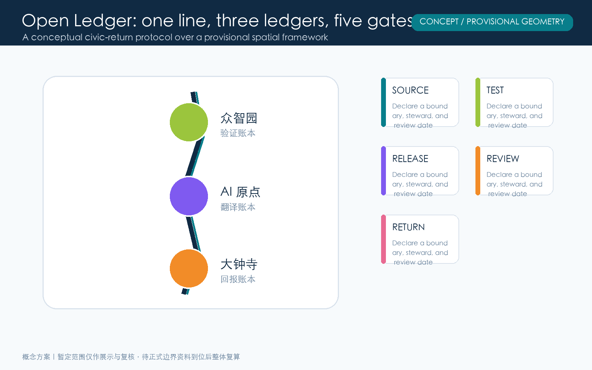
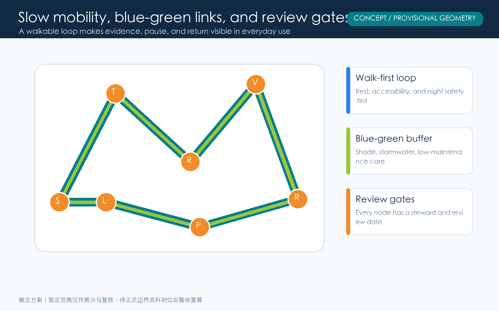
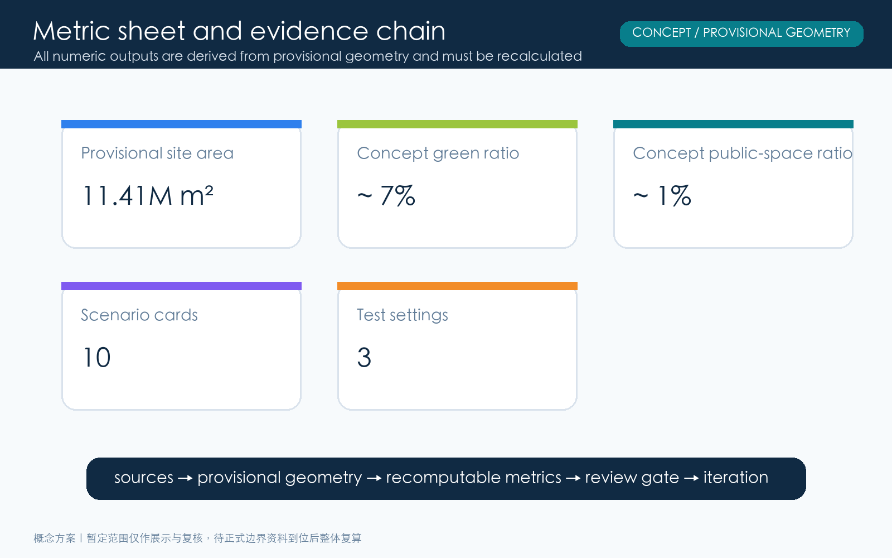

# Jing-Zhang Open Ledger: A Traceable AI Public-Return Belt

**Provisional-boundary statement:** This package uses the repository’s public provisional geometry as a concept constraint. It is not a statutory redline, ownership boundary, engineering boundary, or approval basis. Replace it and rerun area, drawing, and compliance checks when official material becomes available.

## Design Basis and Source List

This concept package begins with the public call, its agent taskbook, allowed design space, provisional boundary material, and the referenced standards. The public material establishes the three work scopes but does not supply a precise vector redline that can be used as a statutory boundary. Consequently every mapped element is labelled as either a provisional constraint or an agent-generated design proposition. Areas are recalculated in EPSG:4548 only to keep this package internally coherent. A cleared official boundary, parcel and building survey, road and utility information, heritage controls, and engineering constraints must replace these inputs before any professional or statutory application. Comparative international cases are method references for ecosystem interfaces, not evidence about local conditions. [source:SRC-OFFICIAL-ANNOUNCEMENT] [source:SRC-PROVISIONAL-BOUNDARY] [data:geometry/site_boundary.geojson]

## Three-Level Scope Framework

One line, three ledgers, and five gates assigns different questions to different scales. The coordinated research area addresses industry, talent, culture, commuting, and regional ecology. The overall design area addresses renewal, public realm, slow mobility, and infrastructure interfaces. The key areas host walkable, testable public prototypes. The line is a heritage-linked mobility and service spine; the ledgers are memory, verification, and public return; the gates are source, test, release, review, and return. Each gate names a boundary, a steward, a plain-language public explanation, a stop condition, and a next review date. The structure organizes accountable action; it does not establish a statutory zoning map. [source:SRC-AGENT-TASKBOOK] [depth:three_level_scope_framework] [data:geometry/key_areas.geojson]

## Coordinated Research Area: Industry and Future City Research

The Open Ledger connects the cultural heritage belt, an everyday AI experience belt, and an AI integration belt through a simple civic proposition: every deployment should leave a public receipt. Researchers, founders, students, residents, small-business operators, service staff, and visitors are treated as co-authors of that receipt. Six ecosystem interfaces structure the proposal: declared data and model boundaries, shared testing and red-team review, transparent conversion thresholds, understandable civic service entry points, developer maintenance records, and independent review or appeal channels. Station F, MaRS, one-north, Barcelona Supercomputing Center, Digital Catapult, and UnternehmerTUM are used only as comparative method references. Local partners, operating rules, and accountability arrangements still need confirmation. [source:SRC-GLOBAL-CASES] [depth:overall_spatial_structure] [metric:persona_count]

## Overall Design Area: Urban Renewal and Regulatory-Plan-Level Urban Design

The overall strategy is linear readability, node-based pause, and visible return. It does not assert unverified floor-area ratios, heights, demolition quantities, or construction approvals. Instead it specifies questions a professional team can continue: continuous public interfaces, walk-first access, inclusive resting points, stormwater buffering, low-glare lighting, adaptable ground floors, clear operators, and review cycles. The five gates make a technical deployment legible in space: source declares the boundary, test hosts trials, release identifies the audience, review invites scrutiny, and return shows civic benefit and maintenance responsibility. The conceptual land-use bands serve internal geometry and drawing readability only. [standard:MOHURD-CONTROL-DETAILED-PLANNING] [depth:development_intensity_controls] [data:geometry/land_use.geojson]

## Detailed Design of Key Areas

Zhongzhiyuan is a Verification Commons: model assessment, energy notes, red-team review, accessible demonstration, and learning workshops share a walkable public edge. Beijing AI Origin is a Translation Commons where students, residents, creators, and service workers turn technical claims into intelligible civic language. Dazhongsi is a Return Commons that makes jobs, accessible services, small-business tools, maintenance training, and community benefit visible. Three landmarks are proposed as civic interfaces rather than isolated objects: the Verifiable Window, the Translation Bell Arcade, and the Return Station. Their locations, footprints, form, and access remain conceptual pending official boundaries and professional verification. [depth:three_key_area_detailed_design] [metric:ai_pilgrimage_landmark_count] [data:geometry/public_space.geojson]

## AI Innovation Ecosystem, Personas, and AI+ Scenarios

Five primary personas frame accountability: researchers who operate models and infrastructure; founders converting tools into products; students and developers learning and maintaining systems; residents including older users who need understandable services; and service staff or small-business operators who bridge digital and physical routines. Ten scenario cards include model-boundary tours, a trusted-AI learning desk, a human review queue for small businesses, accessible mobility explanation, collaborative heritage storytelling, a community issue summary wall, low-carbon compute booking, night-safety feedback, public maintenance matching, and multilingual visitor assistance. Three testing settings are the model red-team, resident comprehension test, and service-return review. All testing should use informed consent, a withdrawal path, and a human alternative. [source:SRC-AGENT-TASKBOOK] [metric:scenario_card_count] [metric:test_validation_scene_count]

## Land Use, Building Scale, and Retain-Renovate-Demolish Strategy

Land use is expressed as conceptual functional bands and public interfaces, not confirmed parcels or legal use rights. The permitted codes are used to distinguish mixed service, research translation, open innovation, and green-buffer conversations. Proposed footprints only mark potential relationships between workshops and public edges; they are not an existing-building survey or a confirmed construction scale. A future retain-renovate-replace study must begin with verified building condition, structural safety, fire requirements, heritage resources, and stakeholder discussion. The package deliberately does not make claims about FAR, height, demolition quantities, investment, or confirmed capacity. Its geometry is an auditable concept model, not a delivery commitment. [standard:MNR-LAND-USE-CLASSIFICATION-GUIDE] [metric:building_footprint_area_sqm] [data:geometry/buildings.geojson]

## Transport, Rail, Municipal Infrastructure, and Public Services

A slow-mobility spine links the three commons through shade, low-gradient access, clear stopping points, and wayfinding; a translation cross street offers short-distance connections between community, school, research, and commerce. This is not a redraw of any road redline, rail alignment, station location, or parking standard. Further work needs traffic observation, rail transfer analysis, fire access, utilities, logistics, accessibility, and night-safety assessment. New infrastructure is treated as answerable service: edge computing should publish energy and shutdown logic, sensors should disclose purpose and retention, terminals should offer non-digital alternatives, and network operations should name a contactable steward. [depth:traffic_rail_slow_parking] [depth:municipal_new_infrastructure] [data:geometry/roads.geojson]

## Blue-Green Network, Public Space, and Urban Character

The blue-green system is climate and social infrastructure, not decorative planting. The north, central, and south concept gardens support shade, heritage buffering, and outward-facing return services. Smaller public spaces support explanation, feedback, demonstration, and collaboration. Together they create everyday places where a visitor can pause and ask a question. Character is intentionally low-glare and maintainable rather than screen-led: adaptive information layers, tactile materials, safe nighttime lighting, and resilient planting. Wayfinding should pair plain language with visual and audible alternatives, accessible route information, and a human-service location. Ratios are recalculated from provisional geometry so changes can be detected after official data arrives. [standard:MOHURD-URBAN-DESIGN-MEASURES] [metric:green_ratio] [metric:public_space_ratio]

## Renewal Projects, Implementation Policy, and Phasing

Implementation follows a sequence of trusted relationships before scale. Phase one establishes the verification protocol, public prototype, and review gate in Zhongzhiyuan. Phase two builds the translation network, community collaboration desk, student maintenance program, and multilingual wayfinding in Beijing AI Origin. Phase three publishes the return catalogue, job and service review, and shared maintenance routines in Dazhongsi. Each phase has a stop condition: if public comprehension, accessibility, data minimization, or maintenance readiness is not met, expansion should pause and be redesigned. Funding, approvals, operators, procurement, and construction must be determined through appropriate legal, professional, budgetary, and community processes. [depth:phasing_implementation] [depth:renewal_project_list] [data:geometry/phasing.geojson]

## Metrics, Area Recalculation, and Compliance Matrix

The metric sheet pairs spatial and civic-return measures: provisional site area, concept green area, concept public-space area, concept building footprints, green ratio, public-space ratio, ten scenario cards, three test settings, five personas, and three civic landmarks. The first group is recalculated from GeoJSON in EPSG:4548; the second group is counted from the proposal and drawings. The compliance matrix connects the call requirements, six agent tasks, standards, drawings, geometry, metrics, sources, assumptions, and self-checks. A filled matrix is not an approval or professional conclusion. Official boundaries, statutory controls, surveys, engineering constraints, and ownership remain important gaps that must be checked after replacement of the provisional inputs. [metric:site_area_sqm] [metric:green_space_area_sqm] [depth:metrics_recalculation]

## Risk, Copyright, and Compliance

The highest spatial risk is the absence of a cleared exact redline and baseline survey. The highest service risks are privacy, bias, misleading automation, and digital exclusion, addressed through data minimization, declared purpose, human alternatives, withdrawal, explainability, and independent review. A third risk is weak maintenance capacity; every gate and landmark needs a steward, maintenance source, review date, and stop condition. Text, concept geometry, diagrams, static HTML, and PDFs were generated by the declared AI collaboration or use permitted public or cleared sources named in sources.json. No personal data, commercial map tiles, or licensed imagery are included. CC BY 4.0 supports attributed discussion and reuse; it does not grant a permit to implement a particular spatial, project, or technical intervention. [source:SRC-AGENT-TASKBOOK] [depth:risk_missing_data] [data:geometry/constraints.geojson]

## References

[source:SRC-OFFICIAL-ANNOUNCEMENT] Public call announcement and repository site package.

[source:SRC-AGENT-TASKBOOK] Open-call taskbook, package requirements, and six agent tasks.

[source:SRC-PROVISIONAL-BOUNDARY] Repository provisional boundary GeoJSON, used for concept discussion and internal recalculation only.

[source:SRC-GLOBAL-CASES] Public institutional pages for Station F, MaRS, one-north, Barcelona Supercomputing Center, Digital Catapult, and UnternehmerTUM; method references only.

[standard:PROJECT-OFFICIAL-ANNOUNCEMENT] [standard:PROJECT-AGENT-OPEN-CALL-TASKBOOK]

Urban-design and control-plan references organize professional questions rather than replace statutory procedure. [standard:MOHURD-URBAN-DESIGN-MEASURES] [standard:MOHURD-CONTROL-DETAILED-PLANNING]

Land-use coding supports readability and internal recalculation only. [standard:MNR-LAND-USE-CLASSIFICATION-GUIDE]

The reference list also defines the usage boundary: public sources support task understanding and method discussion, while spatial, engineering, ownership, or statutory judgments require appropriate data and professional review.
