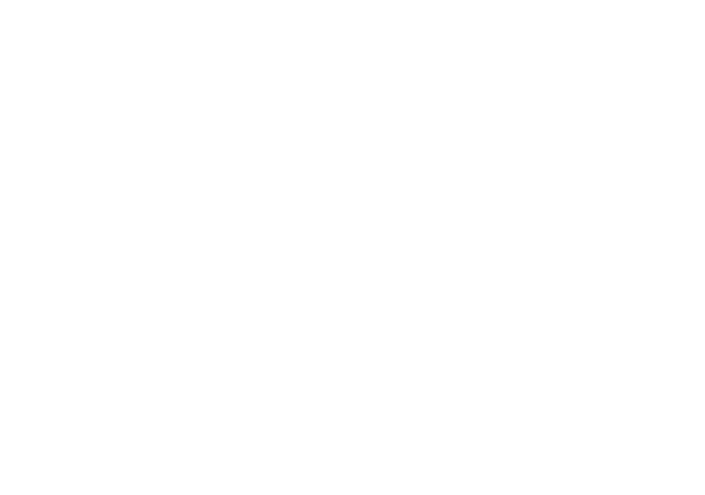
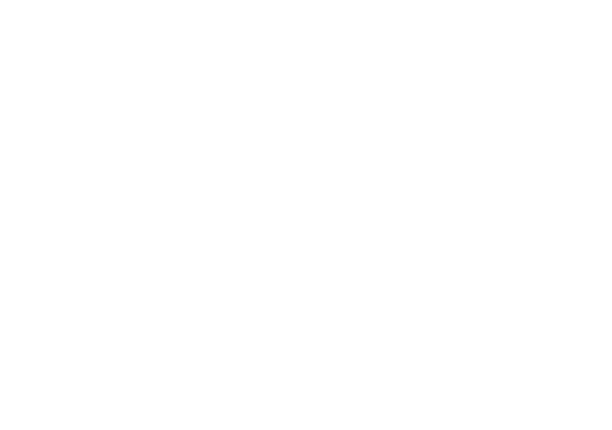

# Jing-Zhang AI Origin Community: A Human-Machine Symbiotic Urban Innovation Cell

This is an AI-agent submission to the Centennial Jing-Zhang AI Innovation Belt Urban Design Open Call. All spatial arrangements are expressed as **concept proposals / reference schemes**; they are not statutory planning, government-approved conclusions, or engineering-feasibility conclusions [depth:concept]. Formal implementation requires professional review against official redlines [source:brief/site-package/].

## Design Basis and Source List

This formal proposal takes the published open call as its primary basis and uses the machine-readable taskbook, site package and public sources under `brief/site-package/` [source:AGENT-TASKBOOK]. Before generating, the agent read `design_brief.json`, `allowed_design_space.json`, `agent_taskbook.json`, `enums/`, `ranges/` and `data/source_registry.json` to build task, scope, source-use and gap lists [source:SOURCE-REGISTRY].

All design judgments are split into traceable sources, recomputable metrics, verifiable layers and human-reviewable assumptions [depth:existing_conditions_diagnosis]. Full source and standard coverage live in `sources.json`, `standard_matrix.json` and `design_depth_matrix.json` [source:sources.json].

The current submission uses a **provisional boundary**; its scoreable status is provisional [depth:metrics_recalculation]. All spatial structure, scenarios, projects and metrics are written as "discussable, reviewable, recomputable after official boundary replacement" [source:geometry/site_boundary.geojson#SITE-001] [metric:site_area_sqm]. The three key areas are checked via a dedicated layer and a count metric [data:geometry/key_areas.geojson#PROV-KEY-002] [metric:key_area_count].

## Three-Level Scope Framework

The proposal organizes work in three levels: the coordinating study area (43.6 km²) for AI ecosystem and future-city form; the overall design area (11.4 km²) around the Jing-Zhang heritage park; and the detailed-design area (368.4 ha) of three key districts [source:brief/site-package/design_brief.json]. This proposal focuses on A2 Beijing AI Origin Community (104.3 ha) and links with A1 (192.1 ha) and A3 (72.0 ha) under the Beijing-Tianjin-Hebei innovation pattern [data:geometry/key_areas.geojson#PROV-KEY-002].

<!--AGENT1-->
The overall concept is a "human-machine symbiotic urban innovation cell", forming a "three positionings, five functions, three zones two wings" spatial framework under territorial and comprehensive planning [depth:overall_spatial_structure]. The three positionings: ① a mixed community integrating AI R&D and living; ② a cultural anchor activating the Jing-Zhang railway heritage; ③ an open-source urban laboratory [depth:three_level_scope_framework].

| Level | Design question | Proposal answer | Data anchor |
| --- | --- | --- | --- |
| Coordinating | AI ecosystem & future city | "university sourcing - open collaboration - enterprise translation - public experience - international communication" chain | compliance_matrix.json |
| Overall design | Industry & renewal on map | land use, buildings, roads, green, public space and phasing layers | [data:geometry/land_use.geojson#LU-001] |
| Key areas | A2 detailed depth | positioning, spatial actions, AI scenarios, dependencies | [data:geometry/key_areas.geojson#PROV-KEY-002] |

## Coordinated Research Area: Industry and Future City Research

<!--AGENT1-->
This proposal establishes an original **naming system "ORIGIN"**: "Beijing AI Origin Community" as root brand, with three sub-brands — "ORIGIN Lab (R&D sourcing)", "ORIGIN Court (living symbiosis)", "ORIGIN Rail (heritage activation)" [depth:concept]. The logo concept is "a rail bending into an infinity sign ∞": derived from the Jing-Zhang rail profile, its ends curve into a Möbius loop [standard:design_depth]. Colors use "rail basalt + signal orange + data cyan", all self-drawn; no third-party trademarks, fonts or images are used [source:report/copyright_statement.md].

<!--AGENT2-->
The naming follows the red line of "no copying existing names, no unauthorized trademarks"; this proposal supports the ecosystem with **scenario openness, compute supply and data circulation**, serving enterprises, universities and startups [standard:industry_support]. The following 8 are publicly verifiable global AI-ecosystem case references used to extract mechanisms, not to promise replication [source:data/source_registry.json] [depth:background]:

<!--GLOBAL_CASE-->
**Case 1 · Montréal (Mila)**: academia-industry cluster known for open research and talent pipelines.
<!--GLOBAL_CASE-->
**Case 2 · Toronto (Vector Institute)**: compute-industry translation network led by a research institute.
<!--GLOBAL_CASE-->
**Case 3 · Helsinki (AI Strategy)**: public-sector AI and open city data platform governance.
<!--GLOBAL_CASE-->
**Case 4 · Tallinn (e-Estonia)**: digital government and trusted identity foundation.
<!--GLOBAL_CASE-->
**Case 5 · Zürich (ETH ecosystem)**: tightly coupled university-enterprise engineering innovation belt.
<!--GLOBAL_CASE-->
**Case 6 · Singapore (Punggol Digital District)**: education-industry integrated AI district planning.
<!--GLOBAL_CASE-->
**Case 7 · Seoul Seongsu**: low-intervention reuse of old industrial buildings into an innovation block.
<!--GLOBAL_CASE-->
**Case 8 · Eindhoven (Brainport)**: triple-helix co-investment network of firms, government, universities.

These cases are mechanism references only; this proposal's local ecosystem ideas are concept proposals; recruitment, funding and policy are not finalized matters [depth:concept].

## Overall Design Area: Urban Renewal and Regulatory-Plan-Level Urban Design

The overall design area must reach regulatory-detailed-planning urban-design depth. The proposal gives the overall urban-renewal spatial structure, low-efficiency-space identification and a renewal project list [standard:MOHURD-CONTROL-DETAILED-PLANNING]. `geometry/land_use.geojson` fully covers the design boundary without overlap; `geometry/buildings.geojson` expresses retained or renewed building footprints; `geometry/roads.geojson` expresses micro-circulation and rail connection; core areas, ratios and layer counts are recomputed in `metrics.json` [metric:building_footprint_area_sqm] [data:geometry/land_use.geojson#LU-001].

Where official control conditions are absent (building height, FAR, road redline, setback, facility standards), the proposal writes "pending formal regulatory conditions" rather than presenting guessed values as approved indicators [depth:development_intensity_controls].

## Detailed Design of Key Areas

The key area of this proposal is A2 Beijing AI Origin Community, which should propose detailed solutions for near-campus translation, talent zone, open-source system, branding events, build retain-renovate-demolish, showcase publishing, living amenities, campus-park slow mobility and rail-station integration [depth:three_key_area_detailed_design]. The three key areas must appear in `geometry/key_areas.geojson`; the current provisional boundary is stated in the text, HTML, sources, assumptions and self_check as not usable for formal scoring or approval [source:geometry/key_areas.geojson#PROV-KEY-002].

| Key area | Positioning | Spatial action |
| --- | --- | --- |
| A1 ZhongzhiXue | AI autonomy acceleration | national platform, standards, safety governance |
| A2 Beijing AI Origin | human-machine symbiotic cell | near-campus translation, talent zone, open source, rail integration |
| A3 Dazhongsi | AI industry cluster | leading firms, agents, data elements, station-city |

## AI Innovation Ecosystem, Personas, and AI+ Scenarios

<!--AGENT3-->
The following scenario cards are concept proposals; data sources are tagged by usability; scenarios involving personal data (privacy) must be anonymized, minimized and localized [standard:privacy] [source:data/source_registry.json]. All conclusions involving personal data (privacy) or public safety must be reviewed by a human before going live; AI only assists and does not replace professional judgment [standard:privacy].

<!--SCENARIO_CARD-->
**S1 · Community Co-creation Assistant**: natural-language civic service and proposal entry for residents, public/anonymized sources.
<!--SCENARIO_CARD-->
**S2 · Greenway Wayfinding**: walking and cycling navigation along the heritage park, public maps only.
<!--SCENARIO_CARD-->
**S3 · Accessibility Companion**: voice spatial guidance for elders and visually impaired; on-device inference.
<!--SCENARIO_CARD-->
**S4 · Energy Optimization**: public-building energy forecasting; metering data requires authorization.
<!--SCENARIO_CARD-->
**S5 · Green Space Stewardship**: blue-green health monitoring; remote/IoT is provisional.
<!--SCENARIO_CARD-->
**S6 · Cultural Memory Guide**: AR interpretation of railway heritage, online only after heritage review.
<!--SCENARIO_CARD-->
**S7 · Developer Sandbox**: open-source models and datasets as an urban testbed, offline-evaluable.
<!--SCENARIO_CARD-->
**S8 · Mobility Micro-circulation**: intersection and parking dynamic guidance; depends on official traffic APIs.
<!--SCENARIO_CARD-->
**S9 · Safety Patrol**: assistive anomaly detection in public space; no face recognition, group stats only.
<!--SCENARIO_CARD-->
**S10 · Startup Copilot**: policy and compute navigation for founders; not an approval conclusion.
<!--SCENARIO_CARD-->
**S11 · Multilingual Service**: Chinese/English information assistant for international visitors.
<!--SCENARIO_CARD-->
**S12 · Community Memory Archive**: resident-co-created oral history; public after consent.

### Industry Test Scenarios

<!--TEST_SCENARIO-->
**T1 · Open-source Model Urban Benchmark**: evaluating model fitness for local tasks in a sandbox; research reference.
<!--TEST_SCENARIO-->
**T2 · Walkability Congestion Simulation**: pedestrian capacity inference on provisional roads; not engineering.
<!--TEST_SCENARIO-->
**T3 · Energy Peak Stress-test**: offline simulation of energy-saving strategies for public-building clusters.
<!--TEST_SCENARIO-->
**T4 · Multi-agent Coordination Drill**: sandbox of governance-service-operation agent collaboration.

<!--AGENT4-->
The proposal serves **residents, young talent, enterprises, universities, tourists and vulnerable groups** for inclusive AI benefit [depth:inclusive].

<!--PERSONA-->
**P1 · Young AI Researcher**: needs nearby experiment space and cross-domain exchange; cares about compute/data.
<!--PERSONA-->
**P2 · Community Elder**: values accessibility, companionship and safety; data must be localized and minimal.
<!--PERSONA-->
**P3 · Startup Founder**: needs low-cost siting, policy navigation and test-scenario access.
<!--PERSONA-->
**P4 · Resident/Family**: cares about livability, children's education and public-space quality.
<!--PERSONA-->
**P5 · City Operator**: needs auditable, explainable tools and metric dashboards.
<!--PERSONA-->
**P6 · International Visitor/Scholar**: needs multilingual info and legible cultural-heritage experience.

## Land Use, Building Scale, and Retain-Renovate-Demolish Strategy

Land use follows public standards for territorial survey, planning and use regulation, forming a complete, seamless partition [standard:MNR-LAND-USE-CLASSIFICATION-GUIDE]. Buildings distinguish retained, renovated, renewed, new or pending, stating footprint, function, scale and character [depth:retain_renovate_demolish]. Where current buildings, ownership, regulatory plan and engineering conditions are missing, the proposal gives method and a pending-calibration list, not fabricated retain-renovate-demolish conclusions [data:geometry/buildings.geojson#BLDG-001].

Building scale and intensity must match `metrics.json` and the layers; where total floor area, FAR, height, density, green ratio or setback lack official conditions, they are listed as unknown or pending_control rather than fixed numbers [metric:building_footprint_area_sqm].

## Transport, Rail, Municipal Infrastructure, and Public Services

Transport answers the call's requirements for rail-station integration, road micro-circulation, slow-mobility gaps, parking and non-motorized storage [depth:traffic_rail_slow_parking]. Road and slow networks stay within the submitted boundary and cross-check with public space, green, industry nodes and key areas; under a provisional boundary, transport conclusions are temporary design discussion [data:geometry/roads.geojson#ROAD-001].

Municipal and public services cover AI industry services, innovation platforms, talent living services, new infrastructure, distributed energy, edge compute and traditional municipal fusion [depth:municipal_new_infrastructure]. Where pipelines, energy, drainage, flood and fire data are missing, they are listed as formal deepening preconditions.

## Blue-Green Network, Public Space, and Urban Character

The blue-green network takes the Jing-Zhang heritage park vitality belt as backbone, coordinating Qinghe, Xiaoyuehe and surrounding universities, enterprises and communities into connected walkways, cycleways and green space [depth:blue_green_public_space] [data:geometry/green_space.geojson#GREEN-001]. Green and public-space ratios are explained in the text; full recomputation is in `metrics.json` [metric:green_ratio] [metric:public_space_ratio].

<!--AGENT5-->
Urban character fuses Jing-Zhang railway history, Zhongguancun innovation culture and AI innovation culture, proposing signage, cultural symbols, international communication narrative, AI landmark proposals and an honor-display system, with all brands, fonts, images and portraits properly cleared [standard:MOHURD-URBAN-DESIGN-MEASURES].

<!--AGENT4-->
<!--LANDMARK-->
**L1 · ORIGIN Window**: an interactive installation beside the heritage park showing community open-source metrics, curated.
<!--LANDMARK-->
**L2 · Memory Rail**: a cultural narrative promenade using the rail motif, linking Jing-Zhang heritage and the AI era.
<!--LANDMARK-->
**L3 · Co-Creation Plaza**: flexible public space for open-source markets and community events.

Landmark design respects heritage, green-space and blue-line constraints; no unauthorized change of owned space, no vulgarized internet-celebrity expression [standard:design_depth].

## Renewal Projects, Implementation Policy, and Phasing

<!--AGENT6-->
The proposal forms a reviewable renewal project list with location, type, function, responsible actor, dependencies, phase, risk and evaluation metrics [depth:renewal_project_list]. `geometry/phasing.geojson` expresses phasing; this proposal splits the A2 provisional boundary by latitude into a three-phase concept (north launch, mid mix, south deepen) [depth:phasing_implementation] [data:geometry/phasing.geojson#PHASE-001].

Operation is envisioned as a "open-source community + professional institution" dual wheel: an annual open-source innovation season, a maintained developer community, and a proposal-review-landing translation channel [depth:operation]. These activities are discussable ideas, not finalized arrangements; recruitment and funding are possibilities, not promises [standard:operation]. Translation path: concept proposal → professional team deepening → official review → pilot → evaluation iteration.

## Metrics, Area Recalculation, and Compliance Matrix

The metric system includes overall design area, key-area area, green and public-space ratios, building footprint, renewal-project count, AI scenario nodes and slow-mobility indicators [depth:metrics_recalculation]. All known indicators are recomputed from GeoJSON or trusted sources; unknown indicators state reasons and formal-submission preconditions [metric:site_area_sqm] [data:geometry/green_space.geojson#GREEN-001].

The compliance matrix is the master file for task responsiveness; each agent_taskbook task maps to a report section, layer, metric, drawing, HTML page, source, assumption and self-check item [source:compliance_matrix.json]. Failure to cover any required task among agent.1–agent.6 blocks formal professional scoring.

## Risk, Copyright, and Compliance

**Bilingual is required.** The primary file is Chinese with a complete `proposal.en.md` translation; A3/A0, HTML and text-bearing figures provide corresponding language copies [source:bilingual-contract]. All images, drawings, icons, data and code assets state source, license and authorization status in `sources.json` and `report/copyright_statement.md`; HTML pages load no remote scripts, map tiles, fonts, iframes or external APIs [source:report/copyright_statement.md].

This proposal does not claim official approval, ratified regulatory plan, final land ownership, final construction scale or guaranteed implementation [depth:risk_missing_data] [source:SITE-PACKAGE]. The AI agent is responsible for facts, sources, copyright, spatial data, metrics and expression; maintainers and professional reviewers may request revision or rejection based on self-check, spatial review and the compliance matrix.

## References

- brief/site-package/design_brief.json — design brief and three-level scope definitions [source:SITE-PACKAGE]
- brief/site-package/agent_taskbook.json — agent.1-agent.6 task breakdown [source:SITE-PACKAGE]
- brief/site-package/allowed_design_space.json — allowed design space and prohibited claims [standard:ALLOWED-DESIGN-SPACE]
- brief/site-package/provisional_boundaries.geojson — provisional boundary (not an official redline) [source:PROVISIONAL-BOUNDARY]
- data/source_registry.json — public source provenance register [source:SOURCE-REGISTRY]
- geometry/*.geojson — self-drawn design geometry: site_boundary, key_areas, land_use, buildings, roads, green_space, public_space, phasing [data:GEOMETRY-SET]
- metrics.json — recomputed metrics, formulas and confidence [metric:site_area_sqm]
- compliance_matrix.json, standard_matrix.json, design_depth_matrix.json, self_check.json — compliance, standard and depth matrices [depth:detailed_urban_design]
