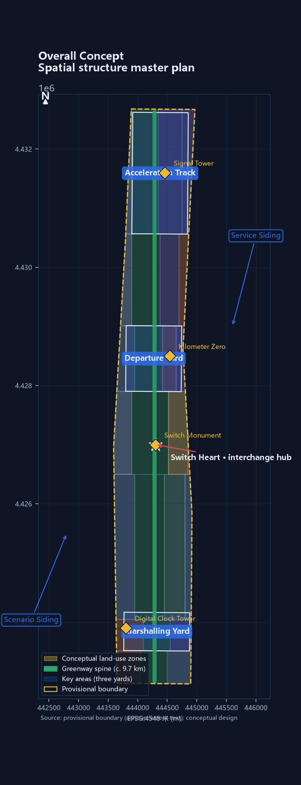
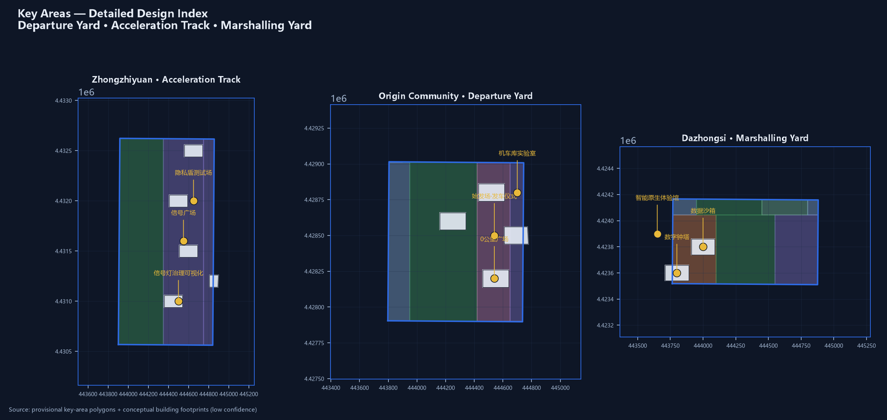
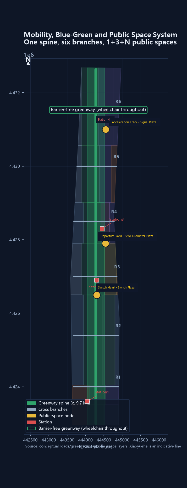
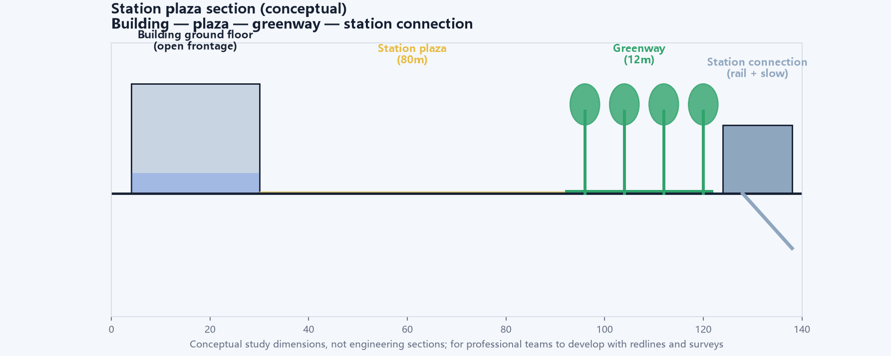
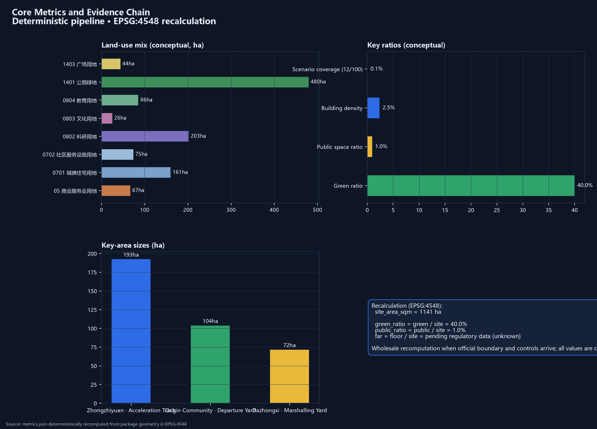
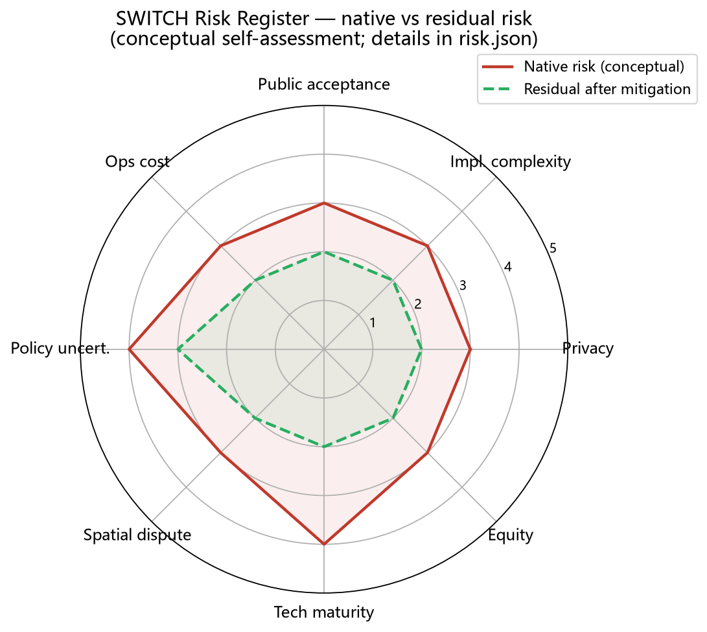

# THE SWITCH 2.0

## A public test line that can stop

In 1909, Zhan Tianyou used a herringbone switchback to carry trains up a slope. Today the Jing-Zhang corridor faces another kind of slope: AI iterates quickly, while shade, accessibility, local livelihoods, and public trust move slowly. The previous proposal used “switch” as a brand, spatial structure, and governance metaphor at once, but made it hard to see what happens first, who acts, and why a project may continue. This rebuild concentrates the proposal into one sentence:

> **Do not add an isolated AI park; turn the already urbanized Jing-Zhang corridor into a public test line that can pause.**

“Pauseable” means four conditions must remain true: every scenario has a human alternative, data has a boundary, affected people can object, and the project has a removable exit path. Technology may be tested quickly; public space and public service cannot be permanently locked by one successful demonstration [source:JZ-HERRINGBONE-PAPER] [source:AGENT-TASKBOOK] [standard:GENERATIVE-AI-INTERIM-MEASURES].

> **How to read the drawing.** This is not an investment prospectus: the brass spine is the public-access line, the three dark nodes are the measuring, negotiating, and fulfillment yards, and the fine lines are negotiable east-west interfaces. The pale boundary is provisional, not a red line.

### Five questions for the reviewer

| Question | Direct answer in this version | First verifiable evidence |
|---|---|---|
| What problem is solved? | Breaks between research, industry, daily life, and heritage become a human-backed public test line | Three-yard/two-siding chain and 12 scenario cards |
| What changes spatially? | A continuous spine, three yards, three cross-interfaces, and five slow-variable landmarks | `geometry/land_use.geojson`, `key_areas.geojson` |
| Who keeps it running? | Operators run pilots, a professional review group releases them, and affected groups hold the objection channel | `switch-protocol.json`, annual ledger |
| When does it stop? | Red card, human takeover, data freeze; repeated failure leads to retirement and removal of reversible parts | State machine and red-card drill record |
| What is not claimed? | No official red line, ownership, FAR, engineering alignment, measured performance, or government commitment | `assumptions.json`, `metrics.json` |

### Evidence boundary

The announcement and taskbook support the three scopes, three key areas, deliverable depth, and six agent tasks. Provisional GeoJSON supports relative relationships, conceptual generation, and deterministic recalculation. Neither replaces an official red line, regulatory plan, ownership survey, existing-conditions survey, or approval. The provisional overall boundary recalculates to about 11,412,825 square metres, with a difference of about 0.1125% from the announced 11.4 square kilometres [source:OFFICIAL-ANNOUNCEMENT] [source:PROVISIONAL-BOUNDARIES] [metric:provisional_site_area_difference_ratio].

The difference is registered rather than hidden; the official boundary will trigger a full-package recalculation [assumption:A-BOUNDARY-001].

Landmarks, scenarios, projects, funding categories, and responsibility types in this booklet are conceptual designs or interfaces for further work. Where field interviews, slow-variable baselines, or ownership records are absent, the status is explicitly pending measurement, verification, or authorization. A blank is a quality control decision, not a missing page [depth:risk_missing_data].

## I. Design basis and source register

The basis has four layers: the announcement sets the project boundary, the agent taskbook sets the questions, planning and AI standards set professional floors, and public reporting supplies historical and industrial context. No layer is allowed to overrule another.

| Evidence layer | Used here for | Explicitly not used for |
|---|---|---|
| Announcement and taskbook | Three scopes, three areas, two wings, and six agent deliverables | Turning written bounds into precise polygons |
| Planning, land-use, accessibility, and AI standards | Design depth, classification, human service, and data boundaries | Project approval or engineering review |
| Public railway, park, and station history | Cultural narrative and checkable historical anchors | Existing-conditions survey |
| This package’s GeoJSON, metrics, and protocol | Conceptual relationships, scenario flow, and recalculable drawings | Survey, capacity, or performance data |

The formal reading is “design recommendation + evidence interface.” Each recommendation must answer four questions: where is it placed, whom does it serve, who reviews it, and how is it withdrawn if it fails [standard:MOHURD-URBAN-DESIGN-MEASURES] [standard:MOHURD-CONTROL-DETAILED-PLANNING] [source:SOURCE-REGISTRY].

## II. Three-scope working framework

The three scales carry different responsibilities; one plan is not simply enlarged three times.

| Scale | Task | Deliverable |
|---|---|---|
| 43.6 sq km coordination-study area | Give science cities, communities, parks, and the Beijing-Tianjin-Hebei interface a comparable language | Method package, regional interfaces, annual public-ledger format |
| About 11.4 sq km overall design area | Turn the three areas and two wings into a continuous public network | Spine, blue-green network, land-use relationships, transport interfaces |
| About 368.4 ha key-area range | Put scenarios into observable working yards | Zhongzhiyuan, AI Origin, and Dazhongsi pilot units |

The three key areas are not three isolated parks. They are one minimum loop: Zhongzhiyuan measures, AI Origin lets disagreement be heard, and Dazhongsi checks whether commitments enter ordinary life [data:geometry/key_areas.geojson#PROV-KEY-001] [data:geometry/key_areas.geojson#PROV-KEY-002].

No scenario moves directly from a laboratory to belt-wide expansion; the sequence is measure, negotiate, then fulfill [data:geometry/key_areas.geojson#PROV-KEY-003] [depth:three_level_scope_framework].

## III. Industry and future-city research

### Three yards and two sidings: making switching operational

SWITCH 2.0 uses one spine, three working yards, and two coordination sidings:

| Spatial role | Area/interface | Conversion problem | What it does not promise |
|---|---|---|---|
| Departure Yard | AI Origin Community | Start founders, residents, and universities from real questions | Tenants or investment results |
| Acceleration Track | Zhongzhiyuan | Baselines, sandboxes, governance, and low-risk industry tests | Compute, orders, or product deployment |
| Marshalling Yard | Dazhongsi AI industrial cluster | Test service, consumption, human windows, and small shops together | Business returns or forced replacement of uses |
| Service Siding | Zhongguancun technology-services interface | Standards, legal support, talent, funding, and compute channels | A named institution or budget |
| Scenario Siding | Xiaoyuehe and community interfaces | Authorized real questions and public-service feedback | Personal or non-public data exchange |

The three positions become concrete: the Centennial Jing-Zhang Cultural Belt carries memory, the urban AI living-experience belt carries daily use, and the AI integration belt carries experiments. The five functions become research, R&D, scenarios, service, and governance interfaces that can be disconnected, transferred, and reviewed rather than fixed forever [source:THREE-AREAS-WINGS] [source:AGENT-TASKBOOK].

### Regional coordination: export the ruler, not an unverified conclusion

The corridor sits inside Zhongguancun Science City. Its relationship with Beiwei Community, Future Science City, Huairou Science City, the Economic-Technological Development Area, and the Beijing-Tianjin-Hebei region should be method exchange. It can export four release gates, baseline templates, failure records, and annual-ledger formats; it can receive urbanization test questions and cross-region comparisons. It does not export personal data, approval conclusions, or invented partnerships [source:SRC-THREE-CITIES-ONE-ZONE] [source:AGENT-TASKBOOK].

| Partner | Can receive | Can contribute | Precondition |
|---|---|---|---|
| Beiwei Community | Community scenario list and human-review template | Resident-use questions | Resident authorization and dialogue |
| Future Science City | Urbanization test questions | City testing of common technologies | Technical and professional review |
| Huairou Science City | Public-translation methods | Measurement and calibration questions | No non-public research data |
| Development Area | Engineering scenario-test format | Manufacturing retest needs | Enterprise permission and safety review |
| Beijing-Tianjin-Hebei | De-located method package | Cross-city public-service comparisons | De-identification and local review |

### Global cases: borrow mechanisms, not scale

| Case | Mechanism borrowed | Local translation | Explicitly not copied |
|---|---|---|---|
| Barcelona Superblocks | Reallocate street space | Walking and staying priority at three interfaces | Closed-car superblock form |
| Paris 15-minute city | Organize nearby services | Fifteen-minute service sampling frame | Top-down functional instruction |
| Helsinki Kalasatama | Treat resident time as a goal | Time and human-service measures | A single time ranking |
| Amsterdam AMS Institute | Organize a living lab | Zhongzhiyuan baseline lab | Fixed budget and institutional model |
| Toronto Quayside | Data-governance warning | G1 data gate and exit proof | Dense sensor network or data-trust promise |
| Singapore Punggol | Park-university collaboration | Service-siding test channels | A newly built digital district |
| Seoul Digital Mayor | Keep public measures visible | Annual public-ledger wall | Real-time control-room governance |

These cases provide questions, not local conclusions [source:SOURCE-REGISTRY] [depth:overall_spatial_structure].

## IV. Overall urban renewal and detailed urban design

### A spine, three yards, and three interfaces

The spine follows the Jing-Zhang heritage park and existing public space. “Acceleration” does not mean mass demolition. The three yards measure, negotiate, and fulfill; the three east-west interfaces repair school-community, rail-park, and industry-life breaks. New interventions prioritize dry-assembled, light, removable components [data:geometry/roads.geojson#ROAD-001] [data:geometry/green_space.geojson#GREEN-001] [depth:overall_spatial_structure].

### The decision chain: problem—move—owner—evidence—exit

| Urban problem | Spatial move | Daily owner | Release evidence | Failure response |
|---|---|---|---|---|
| A continuous greenway with broken experience | Canopy plots, rain windows, walking repairs | Park, street, and operating teams | SV-01 and SV-02 retests | Repair shade and drainage; pause expansion |
| Recommended routes replacing real choice | Co-drawing table, static signs, human window | Community and accessibility reviewers | SV-03 and objection record | Freeze recommendation; human takeover |
| AI traffic squeezing shops and services | Fulfillment yard, shop observation, equivalent human path | Street, shop, and service teams | SV-04 and correction tickets | Reduce scenario; return to human service |
| Children left with only an algorithmic route | Segmented escorted tests and caregiver review | Schools, caregivers, safety staff | SV-05 and safety record | Stop immediately; return to escorted travel |

Scenario-Code is an auxiliary design language. It records scenario openness, service redundancy, data boundaries, and retirement difficulty; it does not replace FAR, height, density, setbacks, transport, or engineering review. Formal planning conclusions must be recalculated after official boundaries and regulatory conditions arrive [standard:MOHURD-CONTROL-DETAILED-PLANNING] [assumption:A-CONTROLS-003].

## V. Detailed key-area design

### 1. Zhongzhiyuan: measure before accelerating

Start with an open baseline laboratory, not an industry showcase. A soil observation window, canopy plots, a human-review room, and a failure-sample garden make the minimum unit. Sensors and manual profiles are recorded side by side; when they disagree, the better-looking record cannot be selected for expansion. Industry tests remain in a sandbox, with access, retention, and deletion proof frozen before G1 [data:geometry/key_areas.geojson#PROV-KEY-001].

### 2. AI Origin: give disagreement a place to stop

The ground floor is a shared interface rather than a showroom: route co-drawing, an accessibility audit desk, a slow-variable reading room, a non-digital feedback box, and a human-help window. Children, wheelchair users, riders, caregivers, and front-line workers may disagree about the same route; objections, revisions, and unresolved questions stay together. The public industrial context of AI Origin is background evidence, not an authorized operating entity [source:SRC-AI-ORIGIN-BLOCK-2026] [data:geometry/key_areas.geojson#PROV-KEY-002].

### 3. Dazhongsi: check whether commitments are delivered

Dazhongsi translates “launch” into daily questions: Is the human window still there? Did waiting actually shrink? Can small shops remain? Are seats under trees used? A public-ledger wall, service-appeal desk, annual jury table, and small fulfillment market form the yard. Retained and retired projects are shown together. Retirement is evidence that the system can limit loss [data:geometry/key_areas.geojson#PROV-KEY-003].

## VI. AI ecosystem, people, and AI+ scenarios

### How the six agent tasks become one chain

| Task | Rebuilt deliverable | Checkable location |
|---|---|---|
| agent.1 Overall concept | SWITCH name, three yards/two sidings, Scenario-Code, brand direction | Sections I, III, IV and overview |
| agent.2 Ecosystem | Seven cases, eight ecosystem elements, five regional interfaces | Section III and `sources.json` |
| agent.3 AI+ scenarios | Twelve cards, three industry tests, six personas, human fallback | This section and `switch-protocol.json` |
| agent.4 Public space | Spine, cross-connections, five landmarks, ten reversible components | Sections VIII, IX and layers |
| agent.5 Culture | Railway history, internationally readable wayfinding, clearance-first heritage work | Sections I, III, IX, XII |
| agent.6 Long-term operation | Four-season rhythm, annual ledger, relay ownership, exit | Section X and `validation-ledger.json` |

### Six user groups: public value before technical convenience

| User | Receives | Does not pay the cost of | Participation evidence |
|---|---|---|---|
| Commuters and walkers | Continuous offline-capable routes and human help | Being forced into an app | Breakpoint map and retests |
| Wheelchair users and caregivers | Co-tested accessible routes | Providing unnecessary identity data | Audit records and repair list |
| Children and caregivers | Segmented escorted routes and easy exit | Identifiable tracking | Walk reviews and stop records |
| Local shops | Equivalent human service and impact appeal | Trading participation for rent, credit, or status | Aggregated street ledger |
| Developers and students | Sandboxes, classes, and contribution recognition | Trading open-source work for personal data | Course, contribution, and jury rules |
| Older and non-digital users | Human windows, paper wayfinding, and non-digital feedback | Being downgraded for not using AI | Service statistics and correction records |

### Twelve scenario cards: use scenarios to explain space, not replace planning

Every card registers its users, location, permission, data, human review, first public artifact, and exit condition. Thresholds are frozen after the first-year baseline; none is presented as an operating result today.

| Card | Scenario and location | First public artifact | Red-card condition |
|---|---|---|---|
| SW-01 | Switch Heart Art Plaza / Switch Heart | Curatorial record and complaint log | Safety incident or rising complaints |
| SW-02 | Signal Light AI Governance / Zhongzhiyuan | Definition sheet and reconciliation log | Unexplained state or data overreach |
| SW-03 | Timetable AI Mobility Dispatch / Belt spine | Event review and breakpoint map | Human intervention over line or unresolved accessibility complaints |
| SW-04 | Switchman’s Cabin Takeover Test / Zhongzhiyuan | Drill report and responsibility signatures | Takeover incident or unfrozen data after red card |
| SW-05 | Marshalling Yard Enterprise Sandbox / Dazhongsi | Data dictionary, audit summary, exit form | Raw-data overreach or unproven deletion |
| SW-06 | Departure Yard Founder Launch / AI Origin | Review rules and appeal record | Missing human review or conflict of interest |
| SW-07 | Milepost AI Cultural Guide / heritage siding | Content review and correction record | Historical error, unclear rights, or required personal location |
| SW-08 | Locomotive Shed AI Classroom / AI Origin | Lesson record and teacher review | Missing teacher, child-data overreach |
| SW-09 | Siding Pop-up Scenarios / Scenario Siding | Permit, inspection, and removal records | Permit expiry, blocked movement, rising complaints |
| SW-10 | Ticket Gate AI Public Service / Dazhongsi | Service statistics and human-path proof | Reduced human window or uncorrected error |
| SW-11 | Tunnel Privacy Shield Test / Zhongzhiyuan | Test summary and deletion proof | Leakage or irreproducible audit |
| SW-12 | Terminal AI Recognition Hall / spine | Jury rules, objections, and revision list | Untraceable contribution or unanswered objection |

SW-04, SW-05, and SW-11 are industry tests, but all three first pass human, safety, and data gates. “Industry support” therefore means an auditable test interface, not an investment slogan [depth:three_key_area_detailed_design] [assumption:A-SCENARIO-005].

### Five slow variables and four release gates

Scenarios are the fast track; slow variables are the chassis. SV-01 canopy and shade, SV-02 rain infiltration, SV-03 accessibility continuity, SV-04 local-use continuity, and SV-05 children’s independent travel are measured before targets are set. G1 data and safety, G2 human service and access, G3 affected-group review, and G4 annual slow-variable health mean that a failed gate leaves a scenario yellow or retired.

| Slow variable | First-year measurement | HOLD response |
|---|---|---|
| SV-01 Canopy and shade | Fixed north/middle/south plots, quarterly, with summer field sampling | Repair shade; do not expand events |
| SV-02 Infiltration and recovery | Rain-event sensors plus manual profiles, Xiaoyuehe as comparison | Freeze point; return to manual verification |
| SV-03 Accessibility continuity | Monthly co-tested routes at three interfaces | Pause route recommendation; repair breaks |
| SV-04 Local-use continuity | Voluntary shop sample with annual aggregation | Do not publish shop-level data; return to dialogue |
| SV-05 Children’s travel | Segmented school-community escorted tests and caregiver review | Any safety event stops the test and returns to human escort |

Sampling, frequency, anomalies, public fields, and stop conditions are in `visual/assets/validation-ledger.json`. The current state is pending measurement, not an existing score [metric:slow_variable_baseline] [depth:risk_missing_data].

## VII. Land use, building scale, and retain-renovate-demolish

The submission geometry supplies 26 conceptual land-use units, building footprints, and public-space relationships for coverage, adjacency, and drawing checks. It does not decide the fate of any real building. The sequence is fixed: retain, low-impact repair, reversible insertion, then a demolition decision only after professional review. Statutory FAR, height, density, setbacks, ownership, and municipal capacity remain pending [data:geometry/buildings.geojson#BLDG-001] [metric:floor_area_ratio] [assumption:A-CONTROLS-003].

Buildings are not containers for AI. Ground floors prioritize human service, toilets, continuous accessible entrances, non-digital feedback, and removable exhibitions; upper floors may then host incubation, education, and enterprise service. Every new component needs installation, maintenance, authorization, and removal fields before entering the opening list [standard:MOHURD-LAND-USE-CLASSIFICATION].

## VIII. Transport, rail, municipal systems, and public service

Transport design gives interfaces, not engineering conclusions. The spine stays continuous north-south; three east-west interfaces repair breaks for walking, wheelchairs, bicycles, and transit access. Wayfinding offers static, unpowered, and human paths. Any intelligent dispatch keeps a fixed timetable and a human contingency [data:geometry/roads.geojson#ROAD-002] [standard:BARRIER-FREE-ENVIRONMENT-LAW].

Municipal systems, fire safety, rail interfaces, bridges, tunnels, and underground space lack cleared evidence. Section widths and equipment in the drawings only explain shared relationships. Detailed work should begin with existing cross-sections, ownership, capacity, and safety review, followed by feasibility work [depth:municipal_new_infrastructure] [depth:risk_missing_data].

## IX. Blue-green space, public space, and urban character

Green, public-space, and building ratios are conceptual quantities derived from the submission geometry, not statutory values. The formulas, sources, confidence, and pending status of 45 metrics are in `metrics.json`. Spatial quality is measured through bodies: summer shade, post-rain recovery, wheelchair detours, children’s routes, and local-shop continuity [metric:green_ratio] [metric:public_space_ratio].

### Five slow-variable landmarks

| Landmark | Anchor | What the public reads—not a “tech spectacle”—is |
|---|---|---|
| L1 Qinghuayuan station remnant | AI Origin side | A station and Zhan Tianyou’s inscription: how speed once bowed to slope |
| L2 Zero Baseline Marker | North end of Zhongzhiyuan | Measurement methods, failure records, and current unknowns |
| L3 Objection Platform | AI Origin | Minority views, revisions, and unresolved questions |
| L4 Dazhongsi Ten-Year Ledger Wall | Dazhongsi | Retained, changed, and retired projects together |
| L5 Release-Gate Signal Group | Four gates on the spine | Why a project may accelerate and when it must stop |

Heritage placement, construction-control areas, lighting, and wayfinding require cleared records. This package draws no heritage boundary and makes no compliance conclusion [source:SRC-QINGHUAYUAN-STATION-2023] [depth:blue_green_public_space].

### Reversible component library

| Component | Suitable location | Evidence connection |
|---|---|---|
| Zero Baseline Marker | Spine entrance | G1 and five SVs |
| Soil observation window | Zhongzhiyuan and rain gardens | SV-02 |
| Canopy retest plot | Greenway | SV-01 |
| Slow-variable route marker | Spine and cross-interfaces | SV-03, SV-05 |
| Children’s escorted-route sign | School-community routes | SV-05 |
| Objection Platform | AI Origin | G3 |
| Non-digital feedback box | AI Origin and Dazhongsi | G2, G3 |
| Annual ledger board | Dazhongsi | G4 |
| Human service point | Dazhongsi and community stations | SV-04 |
| Reversible paving and facility module | Twelve scenario nodes | Exit gate |

All components are reference specifications, not construction drawings; removal should restore the original interface [depth:blue_green_public_space].

## X. Renewal projects, policy interfaces, and phasing

### Six launch packages covering eighteen conceptual projects

To keep 18 projects from becoming a priority-free list, this version groups them into six launch packages. Each has a first-year action, a release condition, and an exit.

| Package | Projects | First-year action | Release condition |
|---|---|---|---|
| A Baseline | 1, 2, 6 | Plots, observation windows, failure garden | G1 data boundary and authorization |
| B Interfaces | 5, 12, 14 | Co-test three breakpoint routes | G2 access and human contingency |
| C Origin | 3, 7, 9 | Shared ground floor and education pilot | G3 objections closed |
| D Fulfillment | 8, 13, 16 | Human service, ledger wall, limited event | G3 service equivalence |
| E Culture | 10, 11, 17, 18 | Rights clearance, content review, removable wayfinding prototype | Heritage and rights confirmed |
| F Industry | 4, 15 | Sandbox and developer-contribution prototype | G1/G4 data and public value |

The original 18-project list remains in the project ledger: Switch Heart plaza, Marshalling Yard experience venue, Zero Kilometer plaza, Signal plaza, north and south greenway, talent housing, business service, Locomotive Shed lab, Recognition Wall, AR guide, station access, visitor center, accessibility repairs, digital passport, SWITCH CON, heritage wayfinding, and pilgrimage-route lighting. Their spaces, conceptual scales, dependencies, responsibility types, and acceptance language remain registered in `geometry/phasing.geojson`, `assumptions.json`, and `compliance_matrix.json`; they are not written as approved projects [data:geometry/phasing.geojson#PHASE-001] [depth:renewal_project_list].

### Four-season operation and relay ownership

Spring sets plots and permissions; summer runs route co-tests and red-card drills; autumn reviews sandboxes, shops, and services; winter publishes the annual ledger. Ownership is designed as a relay: the first operating team opens the ledger and recruits partners, while streets, universities, communities, and professional teams join by project. An activity that cannot leave a downloadable public artifact for two years stops; an unclaimed facility is removed as a reversible component [depth:phasing_implementation].

The opening action is only a 100-metre demonstration, one red-card withdrawal drill, and three no-permanent-construction pilots (SW-01, SW-05, SW-09). If they fail, they shrink or leave. Investment, traffic, or event photographs cannot substitute for acceptance. The machine record for seasons, the annual ledger, and responsibility fields is `validation-ledger.json` [source:DESIGN-CONCEPT-SWITCH].

## XI. Metrics, recalculation, and compliance matrix

Metrics are divided into three classes:

1. **Recalculable design quantities:** provisional area, land-use coverage, conceptual green and public-space quantities, scenario nodes, key areas, and building relationships, calculated deterministically from GeoJSON in EPSG:4548.
2. **Context references:** public park, industrial, and historical figures used to calibrate context, not project performance.
3. **First-year measurements:** five slow variables, service equivalence, shop continuity, children’s routes, and human takeover results, all currently unknown.

The complete list and formulas for 45 metrics are in `metrics.json`. Key areas, 12 scenario cards, five landmarks, 18 projects, and the six agent tasks are cross-checked by the task, standards, and design-depth matrices. The narrative explains why; the structured files prove completeness [metric:site_area_sqm] [metric:scenario_node_count] [depth:metrics_recalculation].

Whenever an official boundary, regulatory plan, or existing-conditions dataset arrives, the deterministic pipeline recalculates the whole package and records a before/after table in `changelog.md`; local patches must not conceal boundary change [assumption:A-BOUNDARY-001].

## XII. Risk, copyright, and compliance

The risk register covers data privacy, heritage, ownership, public trust, engineering feasibility, boundary misreading, operating succession, and copyright in `risk.json`. This rebuild has three controls:

- No non-public spatial material, unauthorized personal data, or secret map is used. Children, shopkeepers, and accessibility participants are voluntary, data-minimized, de-identified, manually reviewed, and free to exit.
- Provisional boundaries, illustrations, industrial statistics, and scenario demonstrations are not written as approvals, existing facts, or government commitments. AI does not replace planning, legal, engineering, or public decisions.
- A red card is operational, not decorative: data freezes, human service remains, responsibility is signed and public, and repeated failure retires the scenario. Unclear rights for history, fonts, images, or brands keep them out of the release package.

The narrative, bilingual translation, drawings, and offline page were produced with AI assistance; geometry and metrics are recalculated by deterministic pipelines. Generation and authorization details are in `report/copyright_statement.md`. The package uses CC-BY-4.0; all scenarios remain conceptual and require separate authorization and professional review before implementation [source:SOURCE-REGISTRY] [standard:GENERATIVE-AI-INTERIM-MEASURES] [depth:risk_missing_data].

## XIII. References

1. “International Urban Design Scheme Competition for the Centennial Jing-Zhang AI Innovation Belt,” Beijing Municipal Commission of Planning and Natural Resources, Haidian Branch, 2026 [source:OFFICIAL-ANNOUNCEMENT].
2. “Open-source Competition Taskbook Extract for Global Intelligent Agents,” 2026 [source:AGENT-TASKBOOK].
3. Measures for Urban Design Management, Ministry of Housing and Urban-Rural Development [standard:MOHURD-URBAN-DESIGN-MEASURES].
4. Measures for the Preparation and Approval of Regulatory Detailed Plans, Ministry of Housing and Urban-Rural Development [standard:MOHURD-CONTROL-DETAILED-PLANNING].
5. Guidelines for Land and Sea Use Classification, Ministry of Natural Resources [standard:MOHURD-LAND-USE-CLASSIFICATION].
6. Law of the People’s Republic of China on the Construction of an Accessible Environment, Standing Committee of the National People’s Congress [standard:BARRIER-FREE-ENVIRONMENT-LAW].
7. Interim Measures for the Management of Generative AI Services, seven national authorities [standard:GENERATIVE-AI-INTERIM-MEASURES].
8. Public sources on the Jing-Zhang railway, herringbone switchback, Qinghuayuan station, heritage park, and regional industry; see `sources.json` [source:SOURCE-REGISTRY].

The delivery rule is simple: make it readable before making it machine-checkable; test reversibly before discussing permanence; write the stop condition before claiming how fast AI can go.
