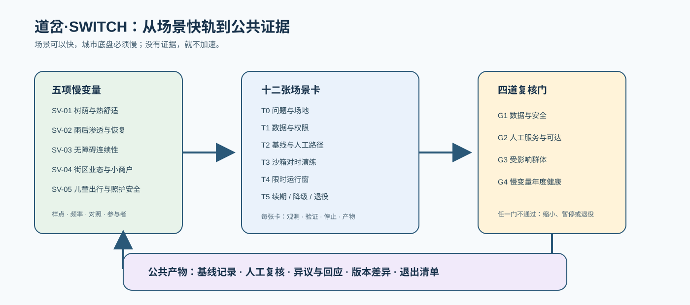

# 道岔·SWITCH——百年京张AI创新带城市设计方案

1909年，詹天佑在青龙桥用"人"字形展线，让火车在陡坡上完成一次著名的"换轨"——这是中国自主设计干线铁路的智慧原点。道岔，是铁路系统里让列车换轨的装置：看似一次简单的转向，背后是精确的几何、联锁与安全逻辑。今天，在这条铁路的城内起点，另一个转向正在发生：京张高铁走廊向北，京张故线走廊折向西北，两条"轨道"在场地内分道[source:PROVISIONAL-BOUNDARIES]。本方案把京张遗址公园走廊读作城市的**道岔**——一个让"技术、人才、资本、文化"换轨转向的枢纽装置，并把整条创新带命名为：

> **道岔·SWITCH——为城市换轨。**

"换轨"在本方案中有四层含义。工程层：道岔是人字形展线的工程记忆，是钢轨的交汇与分向[source:JZ-HERRINGBONE-PAPER]。产业层：AI 创新带的核心动作是换轨——从科研换轨到产业、从实验室换轨到城市场景、从文化换轨到体验消费，这与三区两翼的"转换器"功能一一对应[source:THREE-AREAS-WINGS]。治理层：道岔需要联锁系统保证安全，对应 AI 治理的"红牌暂停、人工接管、可退役"机制[standard:GENERATIVE-AI-INTERIM-MEASURES]。城市层：京张故线是历史侧线，高铁走廊是未来主线，场地本身就是一个写在城市平面上的道岔符号。

空间结构由此展开为**一岔、三场、两翼**：**岔心**（京张遗址公园中段的换轨枢纽，全带公共体验核心）；**始发场**（北京AI原点社区，0公里桩，策源与开源转化）；**加速轨道**（众智园AI自主创新加速区，全栈创新与AI治理）；**编组场**（大钟寺AI产业集聚区，智能原生业态与交会编组）；**东侧线**（中关村科技服务翼，要素全球化配置与资本赋能）；**西侧线**（小月河场景赋能翼，AI场景与活力城市）。9公里主脊同时是一部"换轨叙事"：南起编组场是交会，中段岔心是换轨，北抵加速轨道是加速——场景密度、公共界面与地标序列都沿这条"钢轨"组织[depth:overall_spatial_structure][data:geometry/land_use.geojson#LU-001]。

方案速览：一，这是已建成城区，本方案不重新规划城市，只为它接通断裂的公共界面、在触媒点上示范更新[depth:retain_renovate_demolish]；二，道岔符号双关历史与未来，命名、Logo、导视共用"钢轨—道岔"语汇[depth:overall_spatial_structure]；三，12个AI场景由状态机统一治理（红牌暂停、人工接管、可退役）[depth:three_key_area_detailed_design]；四，26个用地单元、9.7公里绿廊主轴与41项指标由确定性管道生成，官方数据到位整包重算[metric:site_area_sqm]；五，首开行动含完整"红牌撤回"演练，5处朝圣地标对接纪念机制[source:AGENT-TASKBOOK]。**统一声明：本方案为AI生成的开放共创建议，基于临时粗略边界，全部空间内容均为概念建议、参考方案，供专业团队深化研究，不构成政府审定结论；官方红线与控规条件到位后，全部面积、比例与位置关系须整体重算。本声明覆盖全文。**[source:PROVISIONAL-BOUNDARIES][depth:risk_missing_data]

### 证据边界台账（四态）

本方案把"已知与未知的边界"做成显式可审计结构，不把未知写成已知，也不因未知回避设计讨论：

| 证据项 | 状态 | 说明 |
|--------|------|------|
| 三层范围文字四至与约面积（43.6/11.4/368.4 公顷） | ✅ 已验证 | 公告原文[source:OFFICIAL-ANNOUNCEMENT] |
| 三处重点区名称与约面积（192.1/104.3/72.0 公顷） | ✅ 已验证 | 公告原文[source:OFFICIAL-ANNOUNCEMENT] |
| 控规草案空间结构"一带一轴两心多点" | ✅ 已验证 | 官方"一张图读懂"读本[source:HD00-1601-DRAFT-GUIDE] |
| 京张公园二期配套工程规模（530900㎡）与竣工字段 | ✅ 已验证 | 官方业绩公示原件（2026-08-05）[source:JZ-PARK-PHASE2-RECORD-2026]；配套项目口径，不等于整体竣工验收 |
| 京张公园一期开放（约2.5公里） | ✅ 已验证 | 官方公开报道（2023-06）[source:JZ-PARK-PHASE1] |
| 北京 AI 产业口径（2500企业/212模型/4500亿） | ✅ 已验证 | 官方口径（全市）[source:BJ-AI-INDUSTRY-2026] |
| 总体设计范围精确多边形 | ⏳ 待官方 | 临时粗略边界复算 11,412,825 m²，与公告约 11.4 km² 差 **0.1125%**——如实披露[metric:provisional_site_area_difference_ratio][assumption:A-BOUNDARY-001] |
| 三处重点区精确多边形 | ⏳ 待官方 | 临时粗略矩形，官方到位后重算[assumption:A-KEYAREA-002] |
| 法定控制值（容积率/高度/密度/绿地率/退线） | ⏳ 待官方图则 | 全部登记 unknown，不推测伪精确值[metric:floor_area_ratio] |
| 现状建筑与权属底数 | ⏳ 待官方普查 | 概念基底仅覆盖三处重点区示意，不作现状判断[assumption:A-CONTROLS-003] |
| 道路红线/轨道接口/市政容量 | ⏳ 待专项资料 | 交通市政为概念骨架，不作工程结论[depth:risk_missing_data] |
| 概念设计内容（用地/建筑/场景/指标） | 🟡 本包概念建议 | 低置信度标注，官方数据到位后整包重算[depth:metrics_recalculation] |

**证据类别与用途边界**：

| 证据类别 | 可以支持 | 不能支持 |
|---------|---------|---------|
| 官方任务依据（公告与标准快照） | 任务、范围文字、约面积、成果深度 | 精确 polygon、控规指标、工程条件 |
| 清权任务依据（智能体任务书） | 品牌、案例、场景、地标、文化、运营任务 | 法定规划、政府行动或投资承诺 |
| 临时空间依据（provisional 边界） | 概念生成、拓扑自检、相对关系、离线可视化 | official redline、权属、精确面积、审批依据 |
| 法规与政策基线（本地快照） | 非 AI 路径、人工复核、投诉反馈底线的合法性论证 | 具体项目的合规结论或行政审批判断 |
| 公开统计与报道（背景） | 校准服务对象规模、产业语境 | 走廊客流、设施容量、空间落位或项目绩效 |
| 智能体设计数据（本包 GeoJSON/metrics） | 概念分区、网络关系、场景落位、分期 | 现状测绘、工程线位、已确定拆改留 |

**表达与可访问性**：本包以"人可直接理解"为表达终点——正文为双语主文档；`visual/index.html` 提供本地离线的交互式阅读（图层切换、指标动画、双语按钮，资源全部本地打包，无 CDN/远程依赖）；图件均由 GeoJSON 与指标确定性派生并带图注与来源说明；`assets/media/cover.webp` 为自定义封面并登记于 manifest。所有媒体均为解释层，不冒充现场照片、居民意见、官方边界或实测数据；图片与交互均提供文字替代（图注/alt），不自动播放任何内容，生成工具与许可边界登记于版权声明[source:AGENT-TASKBOOK][depth:metrics_recalculation]。

## 评审问答速览

| 评审会问 | 本方案的回答 | 可核验的东西 |
|---------|-------------|-------------|
| 核心命题是什么 | 京张走廊是城市的"道岔"：1909 换轨上坡、2026 换轨转向——科研→产业、实验室→城市、文化→体验；治理上"城市对智能体开放接口，人对智能体保留中断权" | 一岔三场两翼空间结构 [data:geometry/land_use.geojson#LU-001] |
| 治理机制能否被第三方检验 | 能。道岔联锁协议形式化信号灯状态机：绿灯通行/黄灯限速/红灯暂停可退役，迁移须人工签认、红不得直转绿、退役为终态、季度红牌演练 | 机器可读协议 `visual/assets/switch-protocol.json` + 验证脚本 |
| 空间上做了什么 | 一条约9.7公里绿廊主轴纵贯，三场（始发场/加速轨道/编组场）对应三处重点区，两翼（东侧线/西侧线）承接中关村服务与小月河场景；26 个概念用地单元无缝覆盖 | 九类 GeoJSON，用地覆盖无缝隙无重叠 [metric:land_use_total_area_sqm] |
| 三条服务底线凭什么可执行 | 不凭设计者善意，凭现行法规与政策：城市更新"留改拆"并举（条例）、防大拆大建 20% 红线（建科〔2021〕63号）、AI 场景合规（生成式 AI 暂行办法） | 三个法规级来源 [source:BJ-RENEWAL-REGULATION][source:MOHURD-63-NO-MASS-DEMOLITION] |
| 公共价值落在谁身上 | 不使用 AI 者获得等价人工服务；受影响群体代表可发起红牌暂停；朝圣路线与开发者荣誉展示面向全球开发者 | 公共利益三原则 + 5 处朝圣地标 [source:AGENT-TASKBOOK] |
| 近期能做什么 | 首开行动"零号行动·换轨典礼"：100 米示范段+红牌撤回演练+3 个首批试点场景（申请—审查—试点—评估闭环） | 首开行动清单 [depth:phasing_implementation] |
| 刻意不给什么 | 容积率、建筑高度、密度、退线、道路红线、拆改留结论、工程线位、投资测算——统一登记待正式数据补齐 | metrics.json 相应指标状态 [metric:floor_area_ratio] |
| 方法的边界在哪 | 全部空间内容为概念建议，官方边界与控规到位后整包重算并公开差异表；临时边界精度限制如实披露 | 假设登记与复算承诺 [assumption:A-BOUNDARY-001] |

## 六项任务交付链（正文可读版）

六项智能体任务不只在机器文件中“存在”，而是沿同一条可追踪链路落到正文、图件、矩阵和后续运营。每一项都给出交付物、核验位置和继续深化的责任接口；其中“建议”不等于政府承诺或工程结论。

| 任务 | 本包可直接阅读的交付物 | 核验位置 | 下一步责任接口 |
|---|---|---|---|
| agent.1 总体概念 | 道岔·SWITCH 命名、Logo方向、一岔三场两翼、场景规 | 第三、四章；总图与 `compliance_matrix.json` | 规划/设计团队核对正式边界与空间层级 |
| agent.2 生态体系 | 七案例机制转译、八类生态要素闭环、五个区域最小接口 | 第三章生态与协同表 | 产业/运营团队核对资源、权属和可用性 |
| agent.3 AI+场景 | 12张场景卡、3个产业测试、6类画像、人工兜底与退出 | 第六章；`visual/assets/switch-protocol.json` | 场景运营方逐卡试点、审查、复盘 |
| agent.4 公共空间 | 东西缝合、南北贯通、5处地标、10项可拆卸组件及生命周期 | 第八、九章；公共空间图层 | 交通、园林、文保与无障碍专业联合深化 |
| agent.5 文化融合 | 京张换轨叙事、历史侧线、国际可读导视与文保前置 | 第一、三、九、十二章 | 文保与文化内容团队核验史料和落点 |
| agent.6 长期运营 | SWITCH CON、四季活动、年度换轨总账、分期和退出 | 第十章；分期图层 | 公共空间运营方按季度公开证据和停运决定 |

## 换轨五项慢变量与四道复核门

上一轮已经把“信号灯”做成了场景生命周期，但长期质量不能只看场景是否上线。本轮把五项慢变量改成可被规划专业人员和公众共同观察的真实对象：树荫热舒适、雨后渗透与恢复、无障碍连续性、街区业态与小商户存续、儿童独立出行与照护安全。它们不预设未经测量的目标值，而是先锁定样点、频率、责任人和公开证据；任何变量恶化都先进入复核，不以一次活动数据掩盖长期损耗。

| 慢变量 | 首次基线与观察频率 | 公开证据 | 触发动作 |
|---|---|---|---|
| SV-01 树荫与热舒适 | 南/中/北三段各设观察样点；春夏秋冬复测，夏季增加现场遮荫时长 | 树冠/遮荫记录、座椅可用性、热舒适反馈 | 连续两季恶化则先补绿荫与停留服务，不扩展活动 |
| SV-02 雨后渗透与恢复 | 低洼点、雨水花园和小月河界面建档；每场明显降雨后记录，月度人工抽查 | 积水深度、消退时长、人工剖面记录 | 传感与人工记录持续冲突则该点结论作废并回到人工核验 |
| SV-03 无障碍连续性 | 北三环/知春路/站点接口建档；轮椅、婴儿车和步行者每月共测 | 断点清单、通行耗时、参与者复测记录 | 断点连续两月未修复则暂停相关路线推荐 |
| SV-04 街区业态与小商户存续 | 大钟寺及站前自愿商户样本；季度填报，年度对照 | 存续状态、服务需求、影响台账，不收集非必要财务数据 | 数据被用于租金、征拆或信用判断则整体下线 |
| SV-05 儿童独立出行与照护安全 | 学校—社区短段陪测；学期内分段每周陪测，照护者可随时退出 | 分段放手里程、路口事件、照护者复盘 | 任一安全事件或参与者退出即停测并转人工陪同 |

四道复核门把慢变量接回现有联锁协议：G1 数据与安全边界，G2 人工服务与可达性，G3 受影响群体复核，G4 五项慢变量年度健康度。公共信任、文保争议和少数意见不被压缩成一个“满意度”数字，而是在 G3 留存异议、回应、再诉和版本差异；T0–T5 负责单个场景的申请、审查、试点、评估与退出，G1–G4 负责“这条城市轨道是否还值得继续运行”。

### 第一年基线任务单：先测准，再决定是否加速

下表是测量与协商任务，不是已经完成的现状调查。第一年只建立可复核的基线和退出条件，不把暂时没有数据的地方填成漂亮数字；所有参与都须自愿、可退出，儿童路线不做隐性跟踪，商户样本不收集非必要财务数据。

| 慢变量 | 点位/样本原则 | 频率与样本量 | 统计/对照方法 | HOLD 规则 | 异常处理 | 年度公开格式 |
|---|---|---|---|---|---|---|
| SV-01 树荫与热舒适 | 南/中/北各2个固定绿廊样点，另设1个未介入对照点 | 春夏秋冬复测，夏季加测遮荫时长；样点全检 | 样点均值、季节前后与对照点比较；异常点人工复核 | 连续两季恶化则触发 G4 HOLD，先补绿荫，不扩展活动 | 风灾、病虫害和缺测单列标记，不静默填补 | 点位、周期、遮荫时长、座椅/雨天可用性、方法版本、异常标记 + 可视化页 |
| SV-02 雨后渗透与恢复 | 低洼点、雨水花园、小月河界面各选样点 | 每场明显降雨记录；月度人工剖面，汛期加密 | 雨后恢复时长的中位数与 P90；人工剖面和读数并列对照 | 恢复口径连续冲突或较基线持续恶化则点位 HOLD，不用于扩点 | 极端降雨和传感器故障单列，故障时段标记无效 | 场次、点位、峰值积水、恢复时长、数据来源、剖面记录编号 |
| SV-03 无障碍连续性 | 北三环、知春路、站点接驳各1段；每段至少1条轮椅/婴儿车共测路线 | 每月共测，断点修复后即时复测 | 断点密度、通行耗时分布；修复前后与相邻未修段对照 | 任一路线断点连续两月未修复则 G2 HOLD，暂停路线推荐 | 施工临时断点单独标注期限，不从账本删除 | 路段、断点类型、发现/修复日期、状态、通行耗时 + 路线图 |
| SV-04 街区业态与小商户存续 | 大钟寺和站前自愿商户样本；不为凑数强行补样 | 年度铺面存续汇总 + 季度自愿填报 | 街区聚合存续/退出率年度对照，不发布单店可识别信息 | 连续两年恶化或商户权益边界失守则 G3/G4 HOLD | 拒绝填报不作不利推定；退出样本不追记，异常年份单列 | 街区级存续/退出汇总、需求与调整台账、参与缺口说明 |
| SV-05 儿童独立出行与照护安全 | 学校—社区短段分成3个可收回路段，按路线而非个人抽样 | 学期内逐段每周陪测，假期停测 | 独立完成里程占比、路口事件类型与学期前后比较 | 任一安全事件、照护者退出或事件率上升则立即 G2/G3 HOLD | 安全事件转人工复盘，不进入自动趋势统计；不记录可识别轨迹 | 路段级聚合记录、放手里程、照护者复盘、停止记录 |

第一年节奏是“春季定样点与授权、夏季做热舒适和通行共测、秋季做商户与人工服务协商、冬季开年度总账和公众质询”。表中 HOLD 只是判定结构，不是已经发生的恶化结果；具体数值阈值由专业团队、使用者与运营者在首轮基线后共同确认并冻结。统一分析规则是按样点和参与者类型分层，做同点前后、相邻未介入点和异常点比较；异常不删除。该状态型指标目前为待测 `slow_variable_baseline`，不是现状得分[metric:slow_variable_baseline]。机器可读任务单见 `visual/assets/validation-ledger.json`；任何一项没有获得第一份可复核证据，都只能停留在黄灯试点或概念接口层[source:AGENT-TASKBOOK][depth:phasing_implementation][depth:risk_missing_data]。

阅读这张图的钥匙是：场景是快轨，五项慢变量是底盘；没有公共证据，道岔不加速。图示是本方案的证据链，不是已经完成的运营结果。

## 一、设计依据与资料清单

本方案的任务边界来自征集公告与面向全球智能体的开源征集任务书：公告界定三层范围、三处重点区与成果深度，任务书界定六项智能体任务、三大定位与十条共创原则[source:OFFICIAL-ANNOUNCEMENT][source:AGENT-TASKBOOK]。专业判断依据五部国家层面规范与政策：城市设计统筹遵循《城市设计管理办法》，"已知—待定"边界遵循《城市、镇控制性详细规划编制审批办法》，用地编码采用《国土空间调查、规划、用途管制用地用海分类指南》[standard:MOHURD-URBAN-DESIGN-MEASURES][standard:MOHURD-CONTROL-DETAILED-PLANNING][standard:MNR-LAND-USE-CLASSIFICATION-GUIDE]；AI 场景合规遵循《生成式人工智能服务管理暂行办法》，公共空间无障碍遵循《无障碍环境建设法》[standard:GENERATIVE-AI-INTERIM-MEASURES][standard:BARRIER-FREE-ENVIRONMENT-LAW]。建筑设计深度规定正式文本尚未入库，本包如实登记为资料缺口，不宣称满足建筑设计深度[standard:MOHURD-ARCH-DESIGN-DEPTH-2016]。

**控规进程的官方原件（2026）**：据《海淀区2026年政府工作报告》，京张铁路遗址公园沿线街区控规**已通过技术审查**、正推进获批实施[source:HD-GOV-REPORT-2026]；控规草案于2024年12月19日起公示，官方"一张图读懂"读本载明"**一带一轴，两心多点**"空间结构——"沿京张铁路遗址公园形成创新交往带"[source:HD00-1601-DRAFT-EXHIBITION][source:HD00-1601-DRAFT-GUIDE]；2025年2月规自委发布草案公示意见采信通告[source:HD00-1601-CONTROL-NOTICE]。本方案的"一岔三场两翼"与草案同向而非同一：主脊沿同一遗址公园展开，岔心对应"一带"中枢，三场中的大钟寺编组场与原点始发场对应"两心"所在片区；"道岔"命名、信号灯治理与东/西侧线为本方案自有结构，历史侧线在官方结构中没有对应物，主脊北端延至北五环[source:HD00-1601-DRAFT-GUIDE][depth:overall_spatial_structure]。

**公园建设进程的官方原件（2026）**：京张遗址公园二期配套项目，市园林绿化局2026年7月14日政务公开记录完工[source:JZ-PARK-COMPLETION-2026]；北京市公共资源交易服务平台2026年8月5日业绩公示载明该配套项目（监理）工程规模**530900平方米**[metric:reference_park_phase2_scale_sqm]、竣工字段为"是"[source:JZ-PARK-PHASE2-RECORD-2026]——两处记录的记录对象均为二期配套项目，本包据此读作二期规模口径，不据此断言二期整体通过竣工验收，具体完工日期以主管部门公布为准；原件转录随包交付于 `visual/assets/official-records.json`。

**产业底数的官方口径（2026）**：海淀区备案大模型累计122款、全市占比近60%，依托AI原点社区、AI北纬社区与京张铁路遗址公园创新带打造人工智能创新街区（2026政府工作报告口径）[source:HD-GOV-REPORT-2026]；北京备案模型达212款（2026北京两会口径）[source:BJ-AI-MODELS-2026]——两个口径并列存录、不作归一，均无面积分母，本包不作单位面积密度或地区排名判断[source:BJ-AI-INDUSTRY-2026]。

资料分三类管理：**正式论据只取自登记表批准的来源**；公开政策属背景（语境与产业叙事，不支撑红线或承诺）[source:THREE-AREAS-WINGS][source:HAIDIAN-1X1]；历史资料与临时边界只用于叙事与概念生成[source:JZ-HERRINGBONE-PAPER][source:PROVISIONAL-BOUNDARIES]。每条来源的权威等级、用于何处、不能支撑什么，逐条登记于 `sources.json`（机器可读可审计）[source:SOURCE-REGISTRY][depth:risk_missing_data]。

## 二、三层范围工作框架

本方案按公告的三层范围逐级落实：**统筹研究范围**（约43.6平方公里）回答"产业战略与未来城市"问题，工作目标是 AI 创新生态体系、三区两翼协同回路与未来 AI 城市形态研究；**总体设计范围**（约11.4平方公里）回答"城市更新与空间结构"问题，工作目标是控规深度城市设计，形成"一岔三场两翼"总体结构；**重点区域范围**（约368.4公顷）回答"落地与深化"问题，工作目标是对三处重点区开展精细化设计[source:OFFICIAL-ANNOUNCEMENT][depth:three_level_scope_framework]。

三层范围的数据基础是公告文字四至派生的临时粗略边界：总体设计范围约11.41平方公里，与公告"约11.4平方公里"一致，但这不是官方红线，不能用于精确面积复算或审批依据[source:PROVISIONAL-BOUNDARIES][metric:site_area_sqm]。三处重点区同样使用临时粗略矩形（众智园约192.9公顷、原点社区约104.3公顷、大钟寺约72.0公顷，与公告公布面积一致），官方多边形到位后，本包全部面积、比例与位置关系将整包重算[metric:key_area_count][data:geometry/key_areas.geojson#PROV-KEY-001]。任何涉及精确边界与法定控制的表述，都以"待正式数据补齐"处理[assumption:A-BOUNDARY-001]。

## 三、统筹研究范围产业与未来城市研究

本章的产业判断有官方口径锚点（第一章已登记）；全球案例只取机制、不移植指标政策或企业名单[source:SOURCE-REGISTRY]；区域协同只给可交换的最小对象，不虚构签约与名单。

### 3.1 总体概念、主名称与命名体系

主名称建议为**"道岔·SWITCH"**（全称：道岔·京张AI创新带 / THE SWITCH, Jing-Zhang AI Innovation Belt）。命名逻辑有三重：其一，道岔是京张铁路"人字形"展线的工程本质，把詹天佑的转向智慧提炼为可传播的公共符号[source:JZ-HERRINGBONE-PAPER]；其二，SWITCH 是 AI 领域的通用语汇（模型切换、开关决策），中英文同义同构，天然具备国际传播力[source:DESIGN-CONCEPT-SWITCH]；其三，场地自身就是道岔——高铁走廊与故线走廊在此分道，三区两翼如同编组场、始发场与侧线。子命名体系：岔心（换轨枢纽）、始发场（原点社区，0公里桩）、加速轨道（众智园）、编组场（大钟寺）、东侧线（中关村科技服务翼）、西侧线（小月河场景赋能翼）、历史侧线（京张故线走廊）[depth:overall_spatial_structure]。

Logo 方向：两段钢轨在岔心一分而二，形似"人"字与"Y"字复合；主色为钢轨灰蓝（历史）与信号三色（治理），点缀 AI 电光蓝——可延展为导视、场景图标与活动视觉母题，不与文化标识混淆[depth:overall_spatial_structure][source:AGENT-TASKBOOK]。**品牌语汇三重同构**：道岔、信号、编组场、侧线、扳道、联锁——这套铁路语汇同时是空间语法（一岔三场两翼的命名）、品牌系统（Logo/导视/活动视觉）与治理流程的操作词（第六章状态机）——空间、品牌、治理共用同一套词，读方案的人每遇到一个铁路词，都能同时定位到它在空间、视觉与规则中的位置[depth:overall_spatial_structure]。

### 3.2 三大定位、五大功能与三区两翼协同回路

三大定位（百年京张文化带、都市AI生活体验带、AI融合创新带）在道岔语汇下各有空间落位：文化带=历史侧线+岔心叙事，体验带=西侧线+岔心公共体验，创新带=东侧线+三场产业引擎[source:THREE-AREAS-WINGS][depth:overall_spatial_structure]。五大功能映射为空间单元：AI全栈自主创新体系→众智园加速轨道；世界级AI创新生态→原点社区始发场；AI+场景赋能新范式→小月河西侧线；智能化AI活力城市→岔心与公共空间网络；AI治理全球话语权→众智园信号联锁体系[depth:three_key_area_detailed_design]。

三区两翼协同回路按"发车—加速—交会"组织：原点社区发车（策源与开源）→众智园加速（全栈创新与治理）→大钟寺交会（智能原生业态与市场），东侧线提供要素与资本，西侧线提供场景与体验，形成闭环[source:THREE-AREAS-WINGS][source:AGENT-TASKBOOK]。公开口径可作锚点：海淀人工智能创新街区覆盖南部53平方公里，以"三横两纵一带"为骨架，汇聚37所高校、1300家人工智能企业，并**率先在五道口与大钟寺建设两个先导区**[source:HD-AI-DISTRICT-PILOTS]——本方案的始发场（原点社区）与大钟寺编组场即对应这两个先导区的功能方向，属概念深化而非另起炉灶[source:AGENT-TASKBOOK]。

### 3.4 区域协同网络：国家创新轨道网的总道岔

**京张创新带不是一段孤立的走廊，而是国家创新轨道网的"总道岔"**[source:THREE-AREAS-WINGS][depth:three_level_scope_framework]。北向：京张高铁走廊直连北纬社区、未来科学城与怀柔科学城，构成"基础研究—应用研究—产业转化"的梯度，众智园是这条梯度的"加速轨"；南向：与亦庄经开区、大兴临空经济区形成"研发在海淀、制造在亦庄"的轨道闭环，大钟寺编组场是这条闭环的"交会点"；西向：京张铁路历史走廊通向张家口与冬奥遗产，是百年铁路叙事的延伸，也是国际传播的现成故事线[source:JZ-HERRINGBONE-PAPER]。三区两翼因此不仅是内部回路，更是一个接入国家与京津冀创新网络的接口装置——原点社区接高校策源，东侧线接中关村资本与要素，西侧线接小月河沿线城市场景，众智园接科学城算力与装置[depth:overall_spatial_structure]。协同不虚构签约与名单，只定义可交换的最小对象，联动机制待专业深化确认[source:AGENT-TASKBOOK]：

| 协同对象 | 概念输入 | 可交换的最小输出 | 进入与退出条件 |
|---------|---------|-----------------|---------------|
| 北纬社区 | 居民问题与非数字服务体验 | 去标识化问题卡、场景反馈 | 社区授权；参与不推定为同意部署 |
| 未来科学城 | 端侧模型与算力测试方向 | 基准测试协议、失效分类 | 测试责任与知识产权明确；结果不自动互认 |
| 怀柔科学城 | 科学装置与数据集互通方向 | 校时方法说明、口径核对 | 专业责任确认；不以合作设想代替资源 |
| 亦庄经开区 | 工程化与制造反馈 | 互操作测试记录、维护要求 | 企业自愿；不承诺采购或落地 |
| 京津冀 | 跨城规则复用方向 | 去地点化的场景卡与协议格式 | 各地依法复核；不复制坐标或审批结论 |

### 3.4.1 AI创新生态要素闭环（agent.2）

全球案例学习的落点不是“列出更多园区”，而是把八类要素逐一接到本地空间接口，并为每一类写清楚可公开验证的第一份证据。要素仍是概念研究，不代表已有供给、签约、融资或算力承诺。

| 要素 | SWITCH 的本地接口 | 责任/合作类型 | 第一份公共证据 | 明确不声称 |
|---|---|---|---|---|
| 土地与界面 | 重点区、绿廊和站前公共界面；先做权属与红线核验 | 规划、权属与运营主体 | 权属/边界清单、界面开放记录 | 不声称有可供地或可开发规模 |
| 空间 | 三场服务窗口、首层公共界面、可拆卸组件 | 园林、街区与场地运营 | 首层开放时段、无障碍断点清单 | 不把概念建筑量当法定指标 |
| 产业 | SW-04/05/11 三个测试场景，按沙箱和独立审查推进 | 企业、科研与场景运营方 | 测试协议、失效分类、退出报告 | 不承诺企业入驻、采购或招商 |
| 资本与政策 | 项目库和政策工具箱作为检索路径，不作为资金来源 | 项目申报/政策咨询接口 | 适用性核对表、申报结果 | 不承诺融资、补贴或政策批准 |
| 人才 | 原点开源孵化、教育实验室、SWITCHMAN 社区 | 高校、开发者和教育运营方 | 贡献记录、课程/参与记录 | 不声称人才规模或稳定供给 |
| 算力 | 众智园端侧测试节点和治理实验室的概念插口 | 算力/科研设施专业方 | 容量测评、能耗与安全评估 | 不声称已有算力、容量或接入许可 |
| 数据 | 去标识化、合成数据和沙箱；只保留聚合状态 | 数据运营、审查和隐私责任方 | 数据字典、删除证明、审查记录 | 不收集原始个人数据，不输出合规结论 |
| 场景 | 12张卡、T0–T5 生命周期、红牌暂停与退役 | 场景运营方、公众与独立复核方 | 场景卡、红牌演练、年度复盘 | 不把一次演示写成长期部署 |

这张表把“案例启发”转成了“要素—空间—责任—证据—边界”的闭环：只有当第一份公共证据出现，某一要素才可以进入下一道复核门；否则停留在概念接口层。[source:AGENT-TASKBOOK][source:SOURCE-REGISTRY][depth:risk_missing_data]

为避免“要素闭环”停留在名词层，首年试点按“申请—记录—退出”三件套推进。以下是建议的操作口径，不是已获得的算力、资金或合作承诺：

| 要素 | 首年试点机制 | 记录与退出 |
|---|---|---|
| 算力 | 只为合成/脱敏基准测试申请按窗口计量的端侧或实验室资源；申请单写清模型版本、时段、能耗与安全责任 | 公开聚合使用时长、容量评估和异常单；窗口到期自动释放，未完成安全评估不得扩容 |
| 资金与政策 | 将每个更新项目拆成小额、可撤销的阶段卡，先核对适用政策，再进入 G1–G4；不在本包编造预算或补贴 | 公布适用性核对表和程序结果；未通过 G4 不进入下一阶段，不把申报路径写成获批资金 |
| 数据 | 先用合成/脱敏数据建立字段级数据字典，公开数据用途、保留期、人工复核和删除责任 | 每个窗口生成删除证明和审计摘要；T5 或红牌触发后立即停止访问，删除链无法证明则退回沙箱 |
| 人才与场景 | 以角色和交接任务登记高校、开发者、教师、商户与运营者，不把参与名单当作人才规模；场景按卡片进入 T0–T5 | 公开角色责任、培训/交接记录和申诉入口；责任无人接手或人工兜底缺席，场景不续期 |
| 空间组件 | 首开只使用可拆卸、可维修的组件和临时窗口，安装前先做无障碍、消防和权属核验 | 组件账记录安装、运行、复核、撤除；权属、许可或安全条件不明时不安装，撤除后公开复盘 |

这组机制把“谁提供、怎样计量、何时归还”落到可审计的动作上；专业团队可以替换具体责任主体和指标，但不能跳过申请、证据和退出三步[source:DESIGN-CONCEPT-SWITCH][depth:phasing_implementation][depth:risk_missing_data]。

### 3.4.2 区域协同最小接口（agent.1/agent.2）

区域协同采用“可交换对象”而非“合作名单”表达，确保方案可以被复核、拒绝或退出。每个接口都先做一次小规模证明，再决定是否继续，不把交通联系、产业梯度和合作设想混写成已发生事实。

| 区域对象 | 可交换对象 | SWITCH 接口 | 第一份证明 | 退出/不声称 |
|---|---|---|---|---|
| AI北纬社区 | 去标识化居民问题卡与人工服务反馈 | 原点社区/西侧线的公共服务台 | 问题卡授权记录、人工回访 | 不推定居民同意部署 |
| 未来科学城 | 端侧模型基准与失效分类 | 众智园加速轨道的测试协议 | 基准测试报告、责任签名 | 结果不自动互认 |
| 怀柔科学城 | 科学装置校时方法与数据口径 | 信号广场的治理/数据接口 | 口径核对单、专业责任确认 | 不以设想代替装置或数据资源 |
| 经开区 | 工程化反馈与互操作要求 | 大钟寺编组场产业测试 | 互操作记录、维护清单 | 不承诺采购、制造或落地 |
| 京津冀 | 去地点化场景卡与协议格式 | SWITCH 联锁协议版本接口 | 依法复核后的格式样本 | 不复制坐标、审批或政策结论 |

### 3.5 情境比选：为什么是"道岔"

本方案不是从单一灵感出发。设计前在三个候选情境间按七项标准比较（整体效应、公共利益、AI 原生性、空间可转化性、长期运营、证据可复核性、对资料缺口的稳健性）[source:DESIGN-CONCEPT-SWITCH]：

| 候选情境 | 主要长处 | 代价与短板 |
|---------|---------|-----------|
| A 智能展示带：沿廊布设备与体验节点 | 传播直观、见效快 | 公共回路弱；设备折旧快；资料缺口下只能伪精确落点 |
| B 基准园区带：三园各建测试设施 | 产业逻辑清楚、与三处重点区对应 | 公众只是旁观者；治理停在园区围墙内；园区间缺制度连接 |
| C 道岔制度带：换轨机制+信号灯治理+朝圣路线 | 验证、使用、监督闭合成环；资料缺口下按制度而非伪精确落位；退出与问责内生 | 依赖持续人工投入；见效慢于展示型方案 |

C（道岔）为主方案。比选的输家不被丢弃、被降级使用：A 的展示语汇保留为导视与公告板设计工具，B 的园区测试能力吸收为加速轨道的基准职能。C 的短板同样照登——对持续人工投入的依赖，正是"扳道员计划"与联锁协议轮值条款要解决的问题[source:DESIGN-CONCEPT-SWITCH][depth:overall_spatial_structure]。

### 3.6 规划创新主张：从"容积率思维"到"场景规"（SCENARIO-CODE）

本方案提出一项面向 AI 创新带的规划创新思路——**"场景规"（Scenario-Code）**：在法定控规指标（容积率、高度、密度）之外，引入"场景容量"作为城市设计的辅助衡量工具，回应 AI 创新带"以场景为资产"的特殊性[source:AGENT-TASKBOOK][depth:development_intensity_controls]。场景容量由三项构成：**场景密度**（每公顷可承载的 AI 场景数）、**开放度**（公众可达与可体验的比例）、**治理完备度**（信号灯状态机与联锁协议的覆盖率）。沿"一岔三场两翼"设三档场景分区：S1 高开放区（岔心与绿廊，公众体验为主）、S2 中开放区（原点与大钟寺，产业测试与预约体验）、S3 受控区（众智园实验室，科研与治理测试）[depth:three_key_area_detailed_design]。每处更新项目在标注开发强度的同时标注"场景容量"——传统控规回答"能建多少楼"，回答不了"能承载多少创新交往与公众体验"，场景规把这层差异显性化[depth:development_intensity_controls]。**概念测算**：以岔心广场为例（约2.5公顷，S1 档），场景密度按每公顷2-3个概念场景、开放度100%、治理完备度按联锁协议全覆盖计，概念场景容量约5-7个——该数值为演示性测算，正式口径待专业团队与实测校准[metric:scenario_node_count]。必须说明：场景规是本方案的概念性工具建议，不属于法定规划指标，不替代控规与审批，仅供专业团队与规划部门深化研究[depth:risk_missing_data][source:MOHURD-CONTROL-DETAILED-PLANNING]。

### 3.3 全球 AI 创新生态案例

产业语境有公开口径支撑（全国748款生成式AI服务备案、北京备案大模型212款、核心AI企业超2500家、产业规模预计约4500亿元[source:BJ-AI-INDUSTRY-2026]，均为全市口径、只作背景，不作密度或排名判断[assumption:A-CONTROLS-003]）。本方案研究6个全球案例，只取机制、不作承诺[source:SOURCE-REGISTRY]。为避免把外部案例误写成规划依据，表格同时记录机制落位和明确不迁移项：

| 案例 | 可迁移机制 | 在“道岔·SWITCH”的落位 | 明确不迁移 |
|------|---------|-------------|-------------|
| 美国硅谷—帕洛阿尔托走廊 | 大学策源、风险资本与工程师流动 | 原点社区设置近校策源、低门槛协作和开源孵化接口 | 不移植其土地价格、资本规模或企业名单 |
| 英国伦敦国王十字区 | 单主体统筹、知识机构集群、公共空间先行 | 岔心以公共空间和站前界面先行，作为产业导入的公共入口 | 不移植其开发主体、更新周期或融资结构 |
| 加拿大多伦多滨水区（Quayside 教训） | 数据驱动规划必须先处理公共信任 | 众智园设置红牌暂停、人工复核和可读的数据边界 | 不移植其数据平台、技术供应商或治理结论 |
| 新加坡裕廊创新区 | 政府平台、测试沙盒与开放场景协同 | 编组场设置数据沙箱、测试验证和面向公众的观察界面 | 不移植其产业政策、开发强度或政府承诺 |
| 中国杭州城西科创大走廊 | 龙头牵引、小镇尺度与场景快闪组合 | 西侧线用可撤除的场景快闪激活沿线公共界面 | 不移植其产业规模、招商名单或空间指标 |
| 美国波士顿肯德尔广场 | 高密度创新社群与全天候服务配套 | 加速轨道补充全栈服务、人才交流和可预约测试节点 | 不移植其专业园区类型、密度或24小时运营承诺 |

以上案例仅支持方法层判断：成功的 AI 创新生态通常需要“策源—加速—交会”协同，且公共空间与治理机制是先决条件；本方案的空间结构、面积和实施安排仍以本地资料、概念假设和专业深化为准[depth:three_key_area_detailed_design][depth:overall_spatial_structure]。

## 四、总体设计范围城市更新与控规深度城市设计

### 4.1 空间结构：一岔三场两翼

总体结构以**京张绿廊主轴**为纲：一条约9.7公里的慢行绿廊沿场地中轴南北贯通[metric:greenway_length_m]，串联南端编组场（大钟寺）、中段岔心（京张公园换轨枢纽）、北端加速轨道（众智园），东侧线（学院路—中关村方向）与西侧线（小月河方向）在岔心处与主轴交汇，形成"钢轨上的城市"骨架[data:geometry/roads.geojson#ROAD-001][depth:overall_spatial_structure]。用地分区沿绿廊两侧展开：科研用地集中于两场（众智园、原点），商业服务业集中于编组场与岔心东侧，居住与社区服务分布于生活段，公园绿地构成南北贯通的绿廊主体[data:geometry/land_use.geojson#LU-010]。

**换轨一日：沿着钢轨走一遍这条带**。这是空间结构的公共体验版——清晨在编组场启程：大钟寺站前广场上看智能终端首发，编组场数据沙箱的黄灯显示"审计中"，路人能读到数据边界与退出条件[data:geometry/public_space.geojson#PUBLIC-003]；沿绿廊北行，岔心换轨广场上两条钢轨在地面分道，换轨纪念碑铭刻"1909换轨上坡，2026换轨转向"，信号灯柱实时显示全带AI场景的运行状态[data:geometry/public_space.geojson#PUBLIC-002]；午后抵达原点社区，0公里广场正在举行创业"发车仪式"，机车库里中小学生在上AI开源课，始发场站台檐廊下工程师与高校师生候车式交谈；傍晚折向众智园，信号广场的三色铺装下，治理实验室的"红牌演练"向公众开放观摩，站台环外圈的行人透过透明规则墙看到内圈测试——测试在内圈发生，理解在外圈发生[data:geometry/buildings.geojson#BLDG-004]；最后在绿廊北段的树冠下收束，完成从编组场到加速轨道的"一日换轨"。全线约9.7公里，纯步行约两小时，含12处场景与5处地标的完整体验约需一日——这条线的连续可达性未经本方案现场核验，主脊段与站区接驳均须踏勘，本方案不主张全程当前连续可达，叠加的是场景、地标与治理[source:AGENT-TASKBOOK][depth:overall_spatial_structure]。

### 4.2 城市更新总体框架

本方案坚持"已建成城区"的现实约束：现状建筑基底覆盖率按 OSM 概念量测约 17.2%（见第七章），概念更新基底约 28 公顷仅为三处重点区示意，更新策略是**接通公共界面、注入AI触媒**——在岔心、站前、绿廊断点植入18项更新项目（见第十章）[depth:retain_renovate_demolish][metric:building_footprint_area_sqm]。拆改留：现状保留为主体，改造集中于沿绿廊界面建筑，拆除与新建仅现于触媒地块，全部为概念建议、不作地块级结论[assumption:A-CONTROLS-003]。**交付物不是拆改留图纸，而是可核验的制度设计**——决策门给条件、台账给主体与验收口径、服务门给生命周期，官方底数到位后每个数字可重算、每个结论可追溯。

### 4.3 功能比例与创新指标体系

概念功能比例（以提交边界计）：绿地与开敞空间约42%（绿廊为主体，含公园绿地与广场），科研用地约18%，居住用地约14%，商业服务业约6%，社区服务与配套约7%，教育用地约7%[depth:land_use_layout]。创新指标体系建议沿"策源—加速—交会"三段设置：策源段考核论文转化、开源贡献、初创密度；加速段考核全栈企业数、算力利用率、治理机制数；交会段考核智能原生业态数、场景开放数、公众体验人次；全带考核 AI 朝圣地标到访与全球传播声量[depth:metrics_recalculation][metric:scenario_node_count]。法定控制指标（容积率、建筑高度、建筑密度、绿地率、退线）未在清权资料包中提供，统一登记为待正式数据补齐，本包不宣称任何法定控制值[source:MOHURD-CONTROL-DETAILED-PLANNING][metric:floor_area_ratio]。

**但带内已经有官方标尺**：HD00-1603 街区地块《建设项目规划条件》（2025-0074号）载明 HD00-1603-01 为 B4 商业金融用地、用地面积约9.67公顷、容积率2.45[metric:reference_plot_far_01]，HD00-1603-03A 容积率2.2[metric:reference_plot_far_03a][source:HD-PLOT-CONDITIONS]——本方案不为任何地块预设强度，"低基底、开放首层"管的是界面尺度，总量留给逐地块控规。

带内"战略定方向、设计定结构、实施定项目"的传导逻辑与《海淀分区规划（2017年—2035年）》的科学城定位同向[source:HD-DISTRICT-PLAN][depth:development_intensity_controls]。本方案与在编控规（2024-12 公示、2025-02 采信通告[source:HD00-1601-CONTROL-NOTICE]）"同向而非同一"：官方读本载明"一带一轴，两心多点"，一带即"京张铁路遗址公园创新交往带"，两心为大钟寺与五道口中心[source:HD00-1601-DRAFT-GUIDE]——本方案岔心与三场沿这条官方"一带"组织，两处重点区与两心位置相合，是空间深化而非冲突；控规图则获批公开后本包控制相关表述随之重算[assumption:A-CONTROLS-003]。规自委案例可作控规覆盖本带的直接证据：蓝景丽家地块（东至京包铁路13号线用地西边界、南至北三环西路、总用地约3.95公顷）被官方明确为"京张遗址公园创新交往带的重要节点"[source:LANJINGLIJIA-OFFICIAL-CASE]。带内另有东升科技园三期 0807-604 地块走协议出让程序，其四项控制值经检索确认未公开[source:DONGSHENG-PLOT-NOT-PUBLIC]。

## 五、重点区域详细设计

三处重点区均使用临时粗略多边形，以下为方向性概念设计，官方边界与控规条件到位后重算[source:PROVISIONAL-BOUNDARIES][data:geometry/key_areas.geojson#PROV-KEY-001]。

### 5.1 众智园AI自主创新加速区（加速轨道 ACCELERATION TRACK）

**形态原型：编组场原型**——实验组团如编组股道并列布置，可分合重组以适配团队生长；外圈为公众可走的"站台环"慢行界面，测试在内圈发生、理解在外圈发生，透明规则墙替代实体高墙。定位：AI全栈自主创新体系与AI治理全球话语权承载区。空间结构：以"信号广场"为核（AI治理可视化地标），沿南北向形成"算力研发—模型训练—治理实验室—全栈加速器"的产业梯度[data:geometry/buildings.geojson#BLDG-004][depth:three_key_area_detailed_design]。

建筑更新：以现状科研建筑改造为主，新建集中于加速器楼群，建筑基底为概念布局（约8公顷），标注低置信度[metric:building_footprint_area_sqm]。公共空间：信号广场（红黄绿三色铺装，AI治理可视化）、绿廊北段生态段。AI场景：信号灯治理可视化、隐私盾测试场（产业测试）、AI治理国际论坛会场。实施风险：现状权属复杂，须先做权属与建筑普查，再确定触媒地块[assumption:A-CONTROLS-003]。

### 5.2 北京AI原点社区（始发场 DEPARTURE YARD）

**形态原型：站房街坊原型**——80—120米小街坊组织"西转化、东生活、轴上开源"：孵化组团与开源之家居西，人才公寓居东，始发场站台是候车式交流空间，0公里广场是"发车仪式"的站前厅。定位：世界级AI创新生态与近校策源社区。空间结构：以"0公里广场"为原点（纪念京张铁路起点叙事），沿绿廊形成"开源孵化—大模型研发—文化展示—人才公寓"的混合社区[data:geometry/buildings.geojson#BLDG-007][depth:three_key_area_detailed_design]。建筑更新：利用高校周边既有楼宇改造为开源孵化空间，新建集中于人才公寓与社区中心，保持街道尺度。公共空间：0公里广场（AI创业"发车仪式"场地）、始发场站台（候车式交流空间）。AI场景：始发场创业发车仪式、机车库AI教育实验室、里程桩AI文化导览。实施风险：紧邻高校与居住区，须协调校园与社区利益，公共活动控制噪音与时段[assumption:A-SCENARIO-005]。

### 5.3 大钟寺AI产业集聚区（编组场 MARSHALLING YARD）

**形态原型：四象限站城客厅**——站前广场与四象限步行连通为第一项目，四个象限互补为通勤服务、智能终端消费展场、总部商务与文化客厅；商业展示不得挤占人行与无障碍通行。定位：智能原生新业态与城市消费交会区。空间结构：以"数字钟塔"为地标（编组场交会意象），沿南端形成"智能原生商业体验—AI产业办公—商务服务综合体"的混合街区[data:geometry/buildings.geojson#BLDG-011][depth:three_key_area_detailed_design]。建筑更新：商业建筑改造为智能原生体验馆（AI零售、无人配送、数字展陈），办公与综合体以新建与改造结合。公共空间：编组场站前广场、南门户口袋公园。AI场景：编组场企业数据沙箱（产业测试）、侧线场景快闪、检票口AI政务服务。实施风险：地处交通节点与商业区，须衔接轨道站点与地下空间管理，概念不涉及工程可行性结论[source:AGENT-TASKBOOK][assumption:A-SCENARIO-005]。**站点锚定边界（组织方确认）**：征集组织方已确认三处重点区占位矩形按公告南北顺序与约面积配置、尚未完成站点/道路锚定，其中大钟寺占位矩形质心距大钟寺站约2.26公里、落在北京北站一带[source:KEY-AREA-ANCHOR-GAP-CONFIRMED]——因此本方案不按占位矩形断言与轨道站点的几何关系，编组场设计只给接驳组织原则，站点正式位置待官方锚定关系到位后重算。

## 六、AI 创新生态、人才画像与 AI+ 场景

本章的治理主张可以一句话说清：**城市对智能体开放接口，人对智能体保留中断权**[source:AGENT-TASKBOOK][standard:GENERATIVE-AI-INTERIM-MEASURES]——全部场景由信号灯状态机治理，红牌暂停、人工接管、可退役，画像与场景互为检验工具。

### 6.1 用户画像

| 画像 | 特征 | 核心需求 | 对应场景 |
|------|------|---------|---------|
| AI创业者/开发者 | 24-40岁，中关村与高校周边 | 低成本启动、开源协作、融资对接 | 始发场发车仪式、机车库实验室 |
| AI科研人员 | 高校与院所师生 | 成果转化、算力共享、学术交流 | 加速轨道研发楼群、原点研发楼 |
| 企业管理决策者 | 产业与投资机构 | 场景验证、政策合规、商务洽谈 | 编组场数据沙箱、数字钟塔商务空间 |
| 周边居民 | 全龄段，含老年与家庭 | 日常休闲、适老服务、社区活动 | 绿廊慢行、岔心公园、适老化AI服务 |
| 国际访客与AI朝圣者 | 全球开发者与游客 | 文化体验、地标打卡、国际活动 | 0公里桩、换轨纪念碑、SWITCH CON |
| 城市治理者 | 政府与公共机构 | 治理可视化、公众参与、国际话语 | 信号灯治理塔、联锁协议机制 |

### 6.1.1 公共利益与参与权

“谁受益”必须进一步落到服务路径、可见证据和停止权，而不是停在画像名称。下表把任务书中的公共价值要求转成每类人都能使用、质疑和退出的接口。

| 群体 | 直接公共收益 | 等价服务/参与路径 | 可见证据与停止权 |
|---|---|---|---|
| 周边居民、老年人 | 连续慢行、休息遮荫、线下咨询 | 不使用AI也可由人工窗口办理；纸面导览 | 通行/响应记录；居民代表可发起红牌 |
| 儿童、照护者 | 安全的教育与文化体验 | 教师/照护者在场，默认不进入受控测试 | 课程与事故记录；照护者可要求退出 |
| 低数字能力者、残障者 | 无障碍、可理解、可复述的服务 | 现场指导、人工办理、文字/触觉替代 | 无障碍断点清单；未达标不得升绿灯 |
| 商户与小微经营者 | 可预期的客流和不被挤占的首层界面 | 预约、限时、人工协商，不以平台强制接入 | 影响台账；商户可要求调整时段或撤除 |
| 清洁、安保、维护与接驳人员 | 清晰的责任边界和安全工作条件 | 纸面故障卡、人工接管、退出标识 | 值守与维护记录；一线人员可触发黄/红灯 |
| 开发者、科研人员 | 可审计的沙箱、社区与贡献回路 | 版本锁定、知识产权边界、可撤回试验 | 测试报告、版本谱系；不得绕过复核门 |
| 访客与外地公众 | 可读的历史、规则和国际化体验 | 双语/非数字导览，体验不要求交出个人数据 | 来源与投诉处理公开；争议未闭合则冻结传播 |

这张表是第六章场景卡的公共接口，不是新增承诺：场景只有同时满足服务等价、弱势保护和受影响群体复核，才可进入既有 T0–T5 生命周期[source:AGENT-TASKBOOK][standard:BARRIER-FREE-ENVIRONMENT-LAW]。

### 6.2 AI 场景卡（12张）

全部场景采用铁路语汇状态机治理：**绿灯通行、黄灯限速（人工抽查）、红灯暂停（可退役）**，每张卡标注空间位置、服务对象、数据边界、人工复核与运营主体[standard:GENERATIVE-AI-INTERIM-MEASURES]。状态机已形式化为机器可读协议（`visual/assets/switch-protocol.json`）：迁移须人工签认、红不得直转绿、退役为终态、每季度一次红牌撤回演练——城市对智能体开放的是接口，人对智能体保留的是中断权[depth:three_key_area_detailed_design]。**法律接口逐卡登记**：每张场景卡登记其法定义务方向（个人信息最小化、数据分类分级、生成式AI内容标识、智能网联测试规定、公共影像管理、未成年人保护等，见 `switch-protocol.json` 的 legal_interfaces 字段）——登记是运营透明层，不替代法定程序，本包不作合规认定[source:CN-LEGAL-INTERFACE-REFS][standard:GENERATIVE-AI-INTERIM-MEASURES]。

**公共利益三原则**贯穿全部场景：**服务等价**（不使用 AI 者获得等价人工服务）、**弱势保护**（老幼病障不作为首轮测试对象）、**红牌复核权**（受影响群体代表可发起红牌暂停）[standard:GENERATIVE-AI-INTERIM-MEASURES][source:AGENT-TASKBOOK]。

**服务生命周期六道门（T0-T5）**：问题与场地→数据与权限→基准与人工路径→沙箱对时演练→限时运行窗→续期/降级/退役，每道门由证据推进、不得越级；**T4 窗口即到期日**——批准运行与设定退场是同一动作，试点永久化在结构上不可能[source:DESIGN-CONCEPT-SWITCH][depth:phasing_implementation]。**进化即失效**：场景资格绑定版本哈希，任何自我进化立即作废资格、退回沙箱重新对时；资格不继承，档案按版本谱系连续记录[source:DESIGN-CONCEPT-SWITCH][standard:GENERATIVE-AI-INTERIM-MEASURES]。三条底线有条文级依据：《无障碍环境建设法》第三十九条要求**保留现场指导、人工办理等传统服务方式**（"服务等价"的方案转译）[standard:BARRIER-FREE-ENVIRONMENT-LAW]；《生成式人工智能服务管理暂行办法》第十四条要求对违法内容**停止生成、整改并报告**（红牌暂停）、第十五条要求**建立投诉举报机制**（红牌复核权）[standard:GENERATIVE-AI-INTERIM-MEASURES]。协议可第三方检验：`verify_switch_protocol.js` 对协议做 10 项确定性检查，当前全部通过[source:DESIGN-CONCEPT-SWITCH][depth:three_key_area_detailed_design]。

| # | 场景卡 | 空间落位 | 服务对象 | 状态机 |
|---|--------|---------|---------|--------|
| 1 | 岔心·换轨艺术广场：AI实时生成钢轨光影艺术，公众参与"换轨"互动 | 岔心广场 | 全体公众 | 绿灯+人工策展 |
| 2 | 信号灯·AI治理可视化：三色状态灯实时展示城市AI运行状态 | 众智园信号广场 | 治理者/公众 | 绿灯+公开数据 |
| 3 | 时刻表·AI出行调度：活动日公交接驳、慢行导流、无障碍路径规划 | 全带绿廊 | 居民/访客 | 绿灯+人工预案 |
| 4 | **扳道房·人工接管测试场**（产业测试）：AI安全护栏压力测试，红牌演练 | 众智园实验室 | 企业/监管 | 红灯演练为核心 |
| 5 | **编组场·企业数据沙箱**（产业测试）：脱敏数据合规训练，沙盒隔离 | 大钟寺商务楼 | 企业 | 黄灯+审计 |
| 6 | 始发场·创业发车仪式：AI辅助商业计划评审，轨道式"发车"典礼 | 原点0公里广场 | 创业者 | 绿灯+专家复核 |
| 7 | 里程桩·AI文化导览：京张铁路历史AR导览，里程桩打卡 | 历史侧线/绿廊 | 公众/游客 | 绿灯+内容审核 |
| 8 | 机车库·AI教育实验室：中小学生AI课程与开源工作坊 | 原点社区 | 学生/教师 | 绿灯+教师在场 |
| 9 | 侧线·场景快闪：AI新业态月度快闪（无人零售、机器人配送试点） | 西侧线 | 公众/企业 | 黄灯+限时许可 |
| 10 | 检票口·AI政务服务：政务事项智能预审与预约 | 大钟寺/社区站 | 居民 | 黄灯+人工终审 |
| 11 | **隧道·隐私盾测试场**（产业测试）：联邦学习与隐私计算验证 | 众智园 | 企业/科研 | 红灯+独立审计 |
| 12 | 终点站·AI荣誉殿堂：开发者荣誉展示与朝圣地标 | 岔心/绿廊北段 | 全球开发者 | 绿灯+评选机制 |

其中场景4、5、11为产业测试验证场景（3张），满足任务书不少于3张的要求；场景1、7、12承载朝圣与荣誉展示功能[source:AGENT-TASKBOOK][depth:three_key_area_detailed_design]。

**正文展开最影响空间的三张**：

**场景3·时刻表出行调度（缝合走廊的试金石）**——活动日公交接驳、慢行导流与无障碍路径规划由 AI 调度，常规过街设施全程保留、不因智能导流而移除[data:geometry/roads.geojson#ROAD-001]；数据边界：仅聚合匿名人流，不做个体识别；人工预案为兜底，调度失效即回退固定时刻表；试点卡：基线=活动日实测人流，最小成功=无障碍路径零投诉且平均等待不劣于现状，停止阈值=任一过街口人工干预超过三次。

**场景4·扳道房人工接管测试场（治理核心）**——AI 安全护栏压力测试与红牌演练的常设场地[data:geometry/buildings.geojson#BLDG-003]，演练向公众开放观摩；数据边界：测试仅用合成与脱敏数据；人工接管为强制路径，红牌演练完成且人工接管零事故为最小成功口径；试点卡含申诉与问责路径（受影响群体代表可要求独立复核）。

**场景11·隧道隐私盾测试场（隐私核心）**——联邦学习与隐私计算验证场地[data:geometry/buildings.geojson#BLDG-004]，数据不出域为强制前提；最小成功口径=隐私计算验证通过独立审计且无数据泄露；试点卡含数据删除证明与受益/担风险群体登记，阈值由实测基线冻结。

**场景叙事（创业者视角）**：一位创业者的"换轨日"——始发场发车仪式（专家复核后绿灯）→ 编组场数据沙箱合规训练（黄灯审计中、边界可见[data:geometry/buildings.geojson#BLDG-011]）→ 岔心换轨纪念碑前看到开发者荣耀墙新增铭刻（她的开源积分已计入[data:geometry/public_space.geojson#PUBLIC-002]）。全程没有一次"试点永久化"：每个场景挂着信号灯状态与下次对时时间，红牌可暂停、人工可接管、到期可退役[standard:GENERATIVE-AI-INTERIM-MEASURES][source:DESIGN-CONCEPT-SWITCH]。

**场景-空间-运营映射**（agent.3 完整矩阵）：12 张场景卡逐一映射到空间图层、运营主体、数据边界、人工复核与退出路径，机器可读版见 `visual/assets/switch-protocol.json`；三档分区——S1 高开放（岔心/绿廊：场景1/2/3/7/12）、S2 中开放（原点/大钟寺：场景5/6/8/9/10）、S3 受控（众智园实验室：场景4/11）[source:AGENT-TASKBOOK][depth:three_key_area_detailed_design]。三张产业测试场景各配**十一字段试点卡**（基线、阈值、责任、等价人工服务、数据删除证明、申诉问责等），阈值一律试点前由实测基线冻结、本包不编造数值[source:DESIGN-CONCEPT-SWITCH][depth:phasing_implementation]：扳道房以"红牌演练完成且人工接管零事故"为最小成功口径，数据沙箱以"脱敏合规训练通过独立审计"、隐私盾以"隐私计算通过独立审计且无泄漏"为口径。

| 试点 | 试点前基线 | 最小成功口径 | 停止条件 | 第一份公共成果 |
|---|---|---|---|---|
| SW-04 扳道房人工接管 | 合成/脱敏数据上的安全护栏基线 | 红牌演练完成，人工接管零事故 | 任一接管事故或边界不明 | 演练记录、独立复核和责任签名 |
| SW-05 编组场数据沙箱 | 数据字典、权限和删除流程基线 | 脱敏训练通过独立审计 | 原始数据越界或删除无法证明 | 数据字典、审计报告、退出单 |
| SW-11 隧道隐私盾 | 隐私计算性能与泄漏测试基线 | 独立审计通过且无数据泄漏 | 发现泄漏或审计无法复现 | 测试摘要、删除证明、申诉处理记录 |

三张卡的数值阈值都在试点前从实测基线冻结；表格只提前公开判断结构，不把概念建议伪装成已经发生的结果[source:DESIGN-CONCEPT-SWITCH][depth:risk_missing_data]。

### 6.3 十二张场景卡验证方法（正文可读版）

机器可读协议解决“卡片有没有字段”，下面这张人类可读表解决“准备怎样验证”。每张卡先在 T2 建立人工基线，再在 T3 沙箱或限时窗口中验证；所有数值阈值由试点前的实测基线冻结，表中不伪造结果。

| 卡片 | 观测对象与频率 | 核验方法/对照 | 停止条件 | 第一份公共产物 |
|---|---|---|---|---|
| SW-01 换轨艺术广场 | 聚合互动、投诉和现场安全；每次活动后 | 静态展陈与互动展陈分时对照，人工策展复核 | 安全事件、投诉持续上升或人工策展缺位 | 策展记录、投诉处理单、撤除记录 |
| SW-02 治理可视化 | 数据口径、状态准确性；每月 | 与源数据人工逐项核对，错误状态回放 | 状态不可解释或公开数据越界 | 口径表、核对记录、修订日志 |
| SW-03 出行调度 | 等待、接驳、无障碍路径；活动日 | AI调度与固定时刻表/人工预案对照 | 任一过街口人工干预超过冻结阈值，或无障碍投诉未闭合 | 活动日复盘、断点图、人工接管记录 |
| SW-04 人工接管测试 | 合成/脱敏日志、红牌演练；每次版本变更 | 沙箱压力测试、人工接管演练、独立安全复核 | 任一接管事故或红牌后数据未冻结 | 演练报告、责任签名、版本差异 |
| SW-05 企业数据沙箱 | 数据字典、权限、删除链；每个试点窗口 | 独立审计与人工抽样，检查脱敏数据边界 | 原始数据越界、删除无法证明或审计不可复现 | 数据字典、审计摘要、退出单 |
| SW-06 创业发车仪式 | 参与结构、专家复核和意见；每次活动 | 专家组线下评审与AI辅助建议双轨对照 | 评审理由不可解释、人工复核缺席或出现利益冲突 | 评审规则、匿名汇总、申诉处理 |
| SW-07 文化导览 | 史料版本、纠错和无定位使用；每季度 | 文史人员逐条审校，公众纠错与实体展板对照 | 史实错误未纠正、版权边界不明或必须定位个人 | 内容审校表、纠错记录、下架/恢复记录 |
| SW-08 教育实验室 | 教师在场、课程完成和儿童反馈；每课次 | 教师面授/纸面路径与AI辅助课堂对照 | 教师缺席、儿童数据越界或照护者要求退出 | 课程记录、教师复盘、退出记录 |
| SW-09 场景快闪 | 许可、投诉、撤场和日常界面影响；每次快闪 | 限时运行与普通市集时段对照，人工巡检 | 许可到期未撤场、投诉持续上升或阻塞通行 | 许可单、巡检表、撤场照片/记录 |
| SW-10 政务预审 | 预审准确性、等待时长、人工终审；每月 | 与人工窗口办理结果逐项比对，保留线下对照 | 人工窗口缩减、错误未纠正或人工终审缺席 | 服务统计、纠错记录、人工路径证明 |
| SW-11 隐私盾测试 | 合成/脱敏数据、泄漏和删除；每次版本变更 | 独立隐私审计、攻击复演、删除证明复核 | 任一泄漏、审计不可复现或删除链断裂 | 测试摘要、审计意见、删除证明 |
| SW-12 荣誉殿堂 | 贡献来源、评选程序、公示与异议；每季度 | 评选委员会复核、贡献者自证、公众公示期 | 贡献不可追溯、评选利益冲突或异议未回应 | 评选规则、贡献证据、异议与修订清单 |

这张表把“AI场景”从展示清单变成可暂停的城市试验：验证对象、方法、停止条件和公共产物四项缺一不可；同一内容的机器可读版本与五项慢变量任务单合并登记于 `visual/assets/validation-ledger.json`；没有公共产物的试点不进入下一次续期[source:AGENT-TASKBOOK][standard:GENERATIVE-AI-INTERIM-MEASURES][depth:phasing_implementation]。

十二张卡统一采用三段式：原型期只校准方法与人工路径，限时试点期做前后/相邻对照并保留人工兜底，续期或退役期只接受已公开的产物、异常处置和下次复核日期。每张卡的公共记录至少包含观察对象、频率、运营责任、人工兜底、核验/对照、停止条件、公共产物和下次复核；这组字段不等于已经发生的运营结果[source:DESIGN-CONCEPT-SWITCH][depth:phasing_implementation][depth:risk_missing_data]。

## 七、用地、建筑规模与拆改留方案

用地布局以绿廊为轴、两翼展开：提交边界内共26个概念用地单元，完整覆盖边界、无缝隙无重叠[data:geometry/land_use.geojson#LU-001][depth:land_use_layout]。公园绿地约480公顷、广场约44公顷构成绿廊主体（合计开敞约525公顷）；科研用地约203公顷集中于众智园与原点；居住用地约161公顷分布于生活段；商业服务业约67公顷集中于大钟寺与岔心东侧[depth:land_use_layout]。建筑基底概念布局约28公顷，集中于三处重点区，全部标注为低置信度概念设计量，不等于法定规模[metric:building_footprint_area_sqm][assumption:A-CONTROLS-003]。拆改留以"保留为主、界面改造、触媒新建"为原则，不作出地块级结论[depth:retain_renovate_demolish]。

该原则有明确政策依据：《北京市城市更新条例》确立"留改拆"并举、以保留利用提升为主[source:BJ-RENEWAL-REGULATION]；住建部《防止大拆大建通知》（建科〔2021〕63号）要求拆除建筑面积不大于现状总建筑面积的20%、拆建比不大于2[source:MOHURD-63-NO-MASS-DEMOLITION]。本方案概念建筑基底约占提交范围2.5%，远低于20%红线，与政策方向同向[metric:building_footprint_area_sqm]。拆改留执行**决策门**：具体建筑进入深化后依次判断历史与公共价值、结构与消防可行性、全生命周期影响、使用者安置与参与、控规与权属合规，然后才进入"保留修缮/功能改造/局部替换/依法更新"四类；当前包不在图上标注任何拆除对象——把缺资料伪装成果断设计，正是本方案反对的那种"未对时的确定感"[source:MOHURD-63-NO-MASS-DEMOLITION][depth:retain_renovate_demolish]。容积率、建筑高度等法定控制值待正式控规数据补齐后复算[metric:floor_area_ratio][source:MOHURD-CONTROL-DETAILED-PLANNING]。

**现状建成底数（OSM 概念量测）**：按 OpenStreetMap 公开建筑轮廓的量级参照，提交边界内基底不小于 400 平方米的建筑约 1,286 处，基底合计约 196 公顷，覆盖率约 17.2%[metric:building_count_existing][metric:building_footprint_existing_sqm][metric:building_coverage_ratio]。建筑轮廓数据来源为 OpenStreetMap 公开数据（ODbL 1.0）[source:OSM-EXISTING-BUILDINGS]。这个数字的意义不在"多"，而在"是什么样的多"：对建成区而言 17.2% 的基底覆盖率并不高，正是高校校园与大院式用地的形态特征——本包据此推断为"占满而未建足"；但建筑轮廓不能判定土地空置、权属状态与可开发容量，该推断待官方现状调查与权属底数核验[assumption:A-CONTROLS-003]。

## 八、交通、轨道、市政与公共服务设施

本章要服务的官方目标是明确的：控规草案对其集中建设区提出**2035年绿色出行比例80%**的导向[source:HD00-1601-DRAFT-GUIDE]——本带南中段的慢行工作直接服务这一目标，做的是出行方式结构而不是车行容量。两处节点的官方处理已见于控规草案公示意见采信通告：北三环与四道口路按**分离式立交**标注；**知春路为下穿铁路段、不具备平交条件，规划为分离式立交并预留联通道路条件**[source:HD00-1601-CONTROL-NOTICE]——这把两处缝合分成两道题：北三环要在快速路体系下织出连续人行，知春路则要在下穿段之上接住地面步行，通用断面不能两处照搬。

### 8.4 东西缝合与南北贯通的接口清单（agent.4）

“缝合”在本包不是一条漂亮的线，而是每个断点都有人工替代、验收证据和工程边界。下表先把需要专业深化的接口说清楚，不把概念线位写成已获批道路方案。

| 接口 | 当前待核问题 | 概念接口动作 | 人工替代与验收证据 | 工程边界 |
|---|---|---|---|---|
| 北三环—四道口路 | 快速路体系下连续人行与站前导流 | 分离式立交两侧接入绿廊，站前设置可读导视 | 人工引导、无障碍通行记录、断点清单 | 不给桥梁断面、红线或容量结论 |
| 知春路下穿段 | 下穿铁路、不能平交，地面步行如何接续 | 下穿两端接慢行支路与服务窗口，保留地面替代路径 | 雨天/夜间步行演练、照明和响应记录 | 不给隧道、地下空间或市政工程结论 |
| 学院路—中关村服务翼 | 东侧线跨场地公共界面与首层服务连续性 | 首层责任牌、可拆卸导视、预约/线下服务台 | 开放时段、首层可达性和投诉处理记录 | 不承诺资本、企业或交通接驳资源 |
| 小月河场景赋能翼 | 西侧线场景快闪对日常生活的影响 | 限时许可、人工接管、可撤除组件和退出牌 | 影响台账、商户/居民复核、撤除记录 | 不给小月河蓝线或场地工程线位 |

四个接口共同组成“南北贯通、东西换轨”的公共空间验收清单；任一接口没有人工路径或证据记录时，只能停留在概念研究层[source:HD00-1601-CONTROL-NOTICE][standard:BARRIER-FREE-ENVIRONMENT-LAW][depth:risk_missing_data]。

交通骨架以“一主轴、六支路”组织：绿廊主轴慢行道沿场地中轴贯通南北（概念骨架约9.7公里）[data:geometry/roads.geojson#ROAD-001][metric:greenway_length_m]，六条横向联通支路衔接东西两翼与轨道站点[data:geometry/roads.geojson#ROAD-002]，站点接驳按“轨道+慢行+低速接驳”组织，活动日由“时刻表”场景统一调度。

**六类断面尺寸表（概念研究）**：

| 断面类型 | 概念总宽 | 组成（自界面至界面） |
|---------|---------|---------------------|
| 绿廊主轴标准段 | 约 200 米 | 退台界面（≤30m）—绿廊 12m—漫步道 12m—骑行道 4m—组件带 3m—绿廊 12m—退台界面（≤30m）[data:geometry/roads.geojson#ROAD-001] |
| 站前城市街道 | 约 40 米 | 建筑首层（开放界面）—人行 6m—骑行 3m—车行—绿带 |
| 编组场站前广场段 | 约 80 米 | 建筑—站前广场 80m—绿廊 12m—站点接驳 |
| 校园界面街 | 约 30 米 | 檐廊 3m—人行 4m—骑行 3m—既有车行—首层开放界面 |
| 小月河滨水段 | 约 45 米 | 社区界面—人行 4m—绿岸 12m—河道—生态岸 8m—园区界面 |
| 加速轨道产业段 | 梯度组织 | 研发楼群（8-12层）—可控测试庭院—信号广场（全栈发布场） |

全部为概念研究尺寸，供交通与市政专业结合红线与实测深化，不作工程结论[source:DESIGN-CONCEPT-SWITCH][depth:traffic_rail_slow_parking]。

无障碍设计贯彻《无障碍环境建设法》，绿廊全段考虑轮椅与婴儿车通行[standard:BARRIER-FREE-ENVIRONMENT-LAW]。市政与新型基础设施：端侧算力节点沿绿廊布设（灯杆、站亭集成），分布式能源与智慧路灯结合，既有市政管线改造与公共空间更新同步实施，容量测算留待专业评估[depth:municipal_new_infrastructure][assumption:A-CONTROLS-003]。公共服务设施按"三场+岔心"配置：岔心游客服务中心、原点社区中心、大钟寺商务服务中心、众智园产业服务楼，形成15分钟创新服务圈[depth:municipal_new_infrastructure][data:geometry/buildings.geojson#BLDG-015]。公共界面三条控制建议：面向绿廊主轴的首层保持**可见的服务责任界面**（谁在运营、下次对时何时，现场可读）；信息设施不占据连续无障碍通道；一切对时与展示构件**可拆卸、可维修、可退场**[source:DESIGN-CONCEPT-SWITCH][standard:BARRIER-FREE-ENVIRONMENT-LAW]。**因此本方案在交通与市政上不给工程结论，只给可核验的骨架、断面与界面清单**——红线、流量与容量待专业评估，这正是"已知与未知边界"纪律在工程层的落实。

## 九、蓝绿空间、公共空间与城市风貌

蓝绿空间以京张公园概念绿廊为骨架：三段式绿廊（南段活力绿廊、岔心中央公园、北段生态绿廊）共约480公顷[data:geometry/green_space.geojson#GREEN-001][metric:green_ratio]，与清河、小月河蓝绿系统衔接（小月河概念示意线见 constraints 图层，精确蓝线待官方数据）[data:geometry/constraints.geojson#CON-002]。官方口径可作叙事锚点：京张铁路遗址公共空间改造提升工程（二期）已于2026年8月6日建成开放，串联西直门至北五环形成总长9公里的文化带状绿廊、总用地约53公顷，分南段社区活力段与北段自然休闲段，并建成"三道一绿"慢行系统[source:JZ-PARK-PHASE2-OPEN-2026]——本方案概念绿廊与该官方绿廊同向展开，本包概念主轴长度（约9.7公里，临时边界内几何复算）与官方全线口径（9公里）并存登记、不作同一值处理[metric:greenway_length_m]。

公园建设历程同样印证"轻量介入"策略：一期（知春路至清华东路段，约2.5公里）于2023年6月开放，保留老铁轨、原址复刻火车转盘与货运联络线铁轨，贯彻"最小干预原则"[source:JZ-PARK-PHASE1]——本方案的绿廊节点激活与组件植入延续这一原则[source:JZ-PARK-PHASE1]。公共空间体系为"1+3+N"：1处岔心换轨广场（全带公共体验核心）、3处站前广场（始发场、编组场、信号广场）[data:geometry/public_space.geojson#PUBLIC-002]、N处沿线口袋公园与慢行驿站[depth:blue_green_public_space]。

**道岔公共空间组件库（agent.4，概念十项）**：组件库是可组合、可拆卸、可回收的概念原型，不是施工图；每一项都必须同时具备责任主体、运行状态、人工服务路径和退出条件，供专业团队进一步形成构件图集。

| 组件 | 参考规格与状态表达 | 适用场景 | 挂钩变量/放行门 |
|------|------------------|---------|----------------|
| 换轨导向柱 | 可替换牌面，提供双语方向、状态和无障碍信息 | 岔心、站前界面、绿廊入口 | 公共可达；人工服务 |
| 联锁信号柱 | 红/黄/绿状态灯加离线故障牌，状态可被现场读取 | 众智园信号广场、测试场边界 | G1 数据边界；G2 人工复核 |
| 里程桩 | 可拆牌体，保留非数字识读方式，二维码仅作补充 | 历史侧线、0公里广场 | 文化叙事；退出条件 |
| 扳道互动台 | 机械或纸面交互，保留版本号与意见回收口 | 岔心、原点社区公共节点 | G3 公众反馈；可回收 |
| 站台檐廊 | 遮雨、坐靠和停留界面，连续无障碍净空优先 | 三处重点区站前或候场面 | 公共空间；无障碍 |
| 无障碍连续带标记 | 地面导向、触觉提示和可维护节点标识 | 绿廊与站点接驳段 | 无障碍；维护责任 |
| 数据沙箱信息屏 | 只展示聚合状态、审核阶段和退出入口，不展示原始个人数据 | 编组场、众智园测试场 | G1/G2；隐私边界 |
| 荣耀墙模块 | 可替换面板，贡献标准、版本和撤下流程可读 | 朝圣路线、绿廊节点 | 公共荣誉；程序透明 |
| 人工服务窗口牌 | 明示人工咨询、离线办理和响应责任，不以数字界面替代服务 | 三场服务节点、活动入口 | G2 人工兜底；适老友好 |
| 退出/回收铭牌 | 标注组件状态、责任人、复核日期和拆除条件 | 全带节点 | 红牌暂停；回收闭环 |

**组件生命周期账（四件代表件）**：组件不是“放上去就完成”的展陈，而要经历安装、运行、复核、撤除四个动作。其余六项按同一字段登记。

| 代表组件 | 安装前 | 运行中 | 复核与公开证据 | 撤除/恢复 |
|---|---|---|---|---|
| 换轨导视柱 | 无障碍、文保、权属核验 | 双语/非数字信息与人工问询 | 季度可读性与通行记录 | 面板可换，退出牌标明责任人和日期 |
| 数据沙箱信息屏 | 数据最小化与断电/离线方案 | 只显示聚合状态、审计阶段和出口 | 审计摘要、故障卡、删除证明 | 争议或黄灯超时即断开并回收 |
| 人工服务窗口牌 | 值守时段和人工流程先行 | 屏幕失效仍可线下办理 | 响应时长、投诉和等价服务记录 | 服务撤销前先公告并保留纸面路径 |
| 退出/恢复牌 | 明确运营主体、复核日期和退出条件 | 与每次状态迁移同步更新 | 红牌演练、维护记录、公众复核 | 到期拆除，现场恢复并留存差异表 |

这本生命周期账把 G1/G2 数据与人工门、G3 公众复核门和 G4 慢变量门接到空间构件上；没有责任、复核日期和恢复路径的组件不得进入专业深化[source:DESIGN-CONCEPT-SWITCH][standard:BARRIER-FREE-ENVIRONMENT-LAW]。

以上均为概念设计建议，不给出施工尺寸、材料定标或工程安全结论；组件的安装、维护、撤除和文保/无障碍核验须在专业深化阶段完成[source:AGENT-TASKBOOK][depth:three_key_area_detailed_design][source:DESIGN-CONCEPT-SWITCH]。

**AI朝圣地标（5处）与荣誉展示体系**：①岔心·换轨纪念碑——两条钢轨在岔心交汇的纪念性构筑物，铭刻"1909换轨上坡，2026换轨转向"[data:geometry/public_space.geojson#PUBLIC-002]；②始发场·0公里桩——AI创业"发车"起点，对应京张铁路里程叙事[depth:three_key_area_detailed_design]；③编组场·数字钟塔——交会与时刻的数字化表达；④众智园·信号塔——AI治理可视化的天际线地标；⑤放行门·信号群——沿四道复核门逐门公开通过、暂停与退出理由，把可审计的停止权转成不依赖屏幕的公共识别。荣誉展示体系沿绿廊设置"开发者荣耀墙"，对接征集活动公布的纪念机制，入选贡献者与方案可按程序铭刻，全部地标为概念建议、待专业团队深化[source:AGENT-TASKBOOK][depth:three_key_area_detailed_design]。

**文保约束前置（地标深化先决条件）**：本包朝圣地标落点必须先行核验文物保护约束——觉生寺（大钟寺）已划定保护范围与建设控制地带（Ⅰ类建控地带为保护范围外东、西两侧各二十米以内）[source:HERITAGE-JUESHENGSI-SCOPE]，数字钟塔与编组场站前广场的任何落点须避让并经文保专项审查；清华园车站旧址已列入第十一批市级文物保护单位（2025年公布），其保护范围及建设控制地带图纸由市文物局与市规划自然资源委另行印发[source:HERITAGE-QINGHUAYUAN-STATION-SCOPE]，0公里桩与朝圣路线在该址周边的深化须待图纸到位后核验。本包不在任何图上画文保边界线，不作合规结论——文保约束是地标深化必须先解决的前置，顺序不能反[depth:risk_missing_data]。

**朝圣路线**：五座地标沿历史侧线与绿廊主轴连成完整朝圣路线——信号塔→换轨纪念碑→0公里桩→数字钟塔，并在四道放行门信号群收束；与京张故线走廊重合，呼应"全球人工智能产业高地和朝圣地"目标[source:AGENT-TASKBOOK][depth:overall_spatial_structure]；配套"开发者数字护照"（打卡/徽章/贡献积分），与扳道员计划、SWITCH CON 联动，形成"物理空间—数字身份—荣誉展示"闭环[source:DESIGN-CONCEPT-SWITCH][depth:phasing_implementation]。为概念建议，待专业深化。

城市风貌以"钢轨—道岔"为母题：建筑体量沿绿廊由南向北渐升（编组场低层商业→岔心公共建筑→加速轨道产业楼群），风貌控制色为钢轨灰蓝+信号三色点缀，屋顶与立面鼓励"轨道式"线脚语言；风貌控制为概念建议，法定建筑高度待控规确认[source:MOHURD-URBAN-DESIGN-MEASURES][assumption:A-CONTROLS-003]。

## 十、更新项目清单、实施政策与分期计划

本章的全部活动、招商、资金、政策与运营安排均为**概念建议或深化方向**，不表述为已确定的政府安排；拆改留以决策门给条件而非给结论[source:AGENT-TASKBOOK][depth:renewal_project_list]。

更新项目清单（18项，概念建议）：①岔心换轨广场与中央公园；②编组场站前广场与智能原生体验馆改造；③始发场0公里广场与开源孵化楼改造；④加速轨道信号广场与治理实验室新建；⑤绿廊南段活力段贯通；⑥绿廊北段生态段贯通；⑦原点人才公寓新建；⑧大钟寺商务服务综合体改造；⑨机车库教育实验室；⑩开发者荣耀墙；⑪历史侧线AR导览系统；⑫站点接驳与慢行断点整治；⑬岔心游客服务中心；⑭绿廊无障碍与慢行断点整治；⑮开发者数字护照系统；⑯"换轨大会 SWITCH CON"年度会场；⑰历史侧线解说与导视系统；⑱朝圣路线照明与导视[data:geometry/phasing.geojson#PHASE-001][depth:renewal_project_list]。实施政策建议：场景开放许可制（联锁协议）、开发者社区共建、公共空间先行、数据沙箱试点、国际活动申报机制——全部为政策机制建议，不构成政府承诺[source:AGENT-TASKBOOK][assumption:A-SCENARIO-005]。**政策衔接路径**：18 项在条件具备后可建议按《北京市城市更新项目库管理办法（试行）》方向申报纳入市、区两级项目库，是否入库由主管程序审查决定[source:BJ-RENEWAL-BANK]；可对照《政策激励工具箱（1.0版）》的规划土地、审批服务、资金金融、民生运营四类工具检索适用可能[source:BJ-RENEWAL-TOOLKIT]。这条路径在本带已有官方实例：大钟寺片区的蓝景丽家城市更新项目，规自委案例明确其相关规划指标已纳入 HD00-1601 等街区控规统筹保障，是城市更新助力土地供应的探索[source:LANJINGLIJIA-OFFICIAL-CASE]——个案是否可复制仍由主管程序判定，本包不据此作任何承诺。

分期计划：**近期（1-2年）**南段，岔心公园与大钟寺场景激活（场景1/5/9先导）[data:geometry/phasing.geojson#PHASE-001]；**中期（3-5年）**中段，原点社区与绿廊贯通（场景2/3/6/7/8）[data:geometry/phasing.geojson#PHASE-002]；**远期（6-10年）**北段，众智园全栈加速区成形（场景4/11/12）[data:geometry/phasing.geojson#PHASE-003][depth:phasing_implementation]。各期以条件门推进（权属确认、公众参与、安全评估、资料补齐四项完成方进入下一阶段），年份仅为概念时序。

**18 项按【平/市/校】标注推进责任类型**：平台型（区属平台与公共机构，如岔心广场、绿廊贯通）、市场型（运营主体与商业机构，如智能原生体验馆、人才公寓）、校地型（高校与院所协同，如机车库实验室、开源孵化）——责任类型决定首开动作与决策主体，具体分工待立项程序确定。

**对时周期**：每项更新项目设**3年评估—6年换装—不达标回退**的自适应周期——与场景"下次对时"同构：3 年评估一次空间绩效，6 年检讨功能与业态配置，连续两轮不达标的项目降级或退出，避免"建成即固化"。**道岔更新统筹单元**：建议设跨项目统筹责任方（概念），承担三廊缝合、场景开放、校地协调与版本重算的跨项目协调，其职责与边界待专业团队与相关主体深化。

**首开预可研行动包（四件套）**：零号行动·换轨典礼（100米示范段+红牌撤回演练）为核心，配套三个不新增永久工程的先行行动——组件库快闪、0公里桩首发、侧线场景快闪；各按迷你实施卡预填六字段（对象/许可/责任/数据/时限/退出），各为一个中远期项目的先导验证，验证不通过则对应项目降级或调整。

### 10.1 更新项目实施台账（概念）

| # | 项目 | 空间位置 | 概念规模 | 依赖条件 | 建议实施主体 | 政策工具（建议） | 近期动作 | 验收口径（概念） |
|---|------|---------|---------|---------|-------------|----------------|---------|----------------|
| 1 | 岔心换轨广场与中央公园 | 岔心带[data:geometry/public_space.geojson#PUBLIC-002] | 约2.5公顷概念 | 京张公园开放空间与现状绿化 | 区园林绿化局+运营公司 | 公共空间更新、场景开放许可 | 公众参与工作坊 | 开放运营+首场活动 |
| 2 | 编组场站前广场与智能原生体验馆改造 | 大钟寺带[data:geometry/buildings.geojson#BLDG-011] | 概念楼群约0.6公顷基底 | 建筑普查与权属 | 商业运营方+属地街道 | 存量更新、业态引导 | 建筑普查与改造可行性研究 | 首层开放+试运营 |
| 3 | 始发场0公里广场与开源孵化楼改造 | 原点社区[data:geometry/buildings.geojson#BLDG-007] | 概念楼群约0.5公顷基底 | 高校周边楼宇权属与租赁 | 社区运营方+高校合作 | 城市更新条例框架、人才公寓政策 | 校地协调 | 发车仪式首办+入驻 |
| 4 | 加速轨道信号广场与治理实验室新建 | 众智园[data:geometry/buildings.geojson#BLDG-004] | 概念楼群约0.6公顷基底 | 园区权属与规划条件 | 园区主体+治理机构 | 产业用地保障、科研设施支持 | 条件核验 | 信号广场开放+实验室挂牌 |
| 5 | 绿廊南段活力段贯通 | 南段绿廊[data:geometry/green_space.geojson#GREEN-001] | 概念绿廊约150公顷 | 现状断面与障碍物普查 | 区园林绿化局 | 绿道建设、无障碍改造 | 断面普查+方案征集 | 全线步行贯通 |
| 6 | 绿廊北段生态段贯通 | 北段绿廊[data:geometry/green_space.geojson#GREEN-003] | 概念绿廊约180公顷 | 生态与防洪要求核查 | 区园林绿化局+水务部门 | 蓝绿统筹、生境保护 | 生态调查 | 生态段开放+监测启动 |
| 7 | 原点人才公寓新建 | 原点社区东侧[data:geometry/buildings.geojson#BLDG-010] | 概念基底约1.5公顷 | 用地权属与控规条件 | 国资平台+运营公司 | 保障性租赁住房政策 | 条件核验 | 首期公寓投用 |
| 8 | 大钟寺商务服务综合体改造 | 大钟寺带[data:geometry/buildings.geojson#BLDG-013] | 概念基底约1.2公顷 | 现状建筑与商圈流量 | 商业运营方 | 存量更新、商圈升级 | 改造+招商预研 | 综合体改造完成+入驻 |
| 9 | 机车库教育实验室 | 原点社区[data:geometry/buildings.geojson#BLDG-008] | 概念基底约0.3公顷 | 教育合作与课程开发 | 教育机构+学校 | 科普教育支持 | 课程试点 | 首批课程开课 |
| 10 | 开发者荣耀墙 | 绿廊沿线[data:geometry/phasing.geojson#PHASE-002] | 概念线性设施 | 纪念机制公布 | 运营机构+评选委员会 | 荣誉机制、征集活动对接 | 机制设计 | 首期铭刻完成 |
| 11 | 历史侧线AR导览系统 | 历史侧线走廊 | 概念全线 | 历史资料清权与AR技术方 | 文博机构+技术方 | 文化遗产数字化 | 清权+原型 | 首条导览线路上线 |
| 12 | 站点接驳与慢行断点整治 | 全带站点[data:geometry/roads.geojson#ROAD-002] | 概念接驳线 | 轨道站点接口与交通组织 | 交通部门+运营公司 | 站城一体化、慢行优先 | 断点清单+设计 | 首批断点整治完成 |
| 13 | 岔心游客服务中心 | 岔心带[data:geometry/public_space.geojson#PUBLIC-002] | 概念约0.2公顷 | 京张公园现状服务设施 | 区园林绿化局+运营公司 | 公共服务设施补强 | 功能策划 | 服务中心开放 |
| 14 | 绿廊无障碍与慢行断点整治 | 全带绿廊[data:geometry/green_space.geojson#GREEN-001] | 概念全线 | 现状断面普查 | 区园林绿化局 | 无障碍改造、绿道建设 | 断点清单+设计 | 全段轮椅通行贯通 |
| 15 | 开发者数字护照系统 | 绿廊沿线+虚拟[data:geometry/phasing.geojson#PHASE-002] | 概念数字系统 | 社区运营与评选机制 | 运营机构+开发者社区 | 荣誉机制、征集活动对接 | 原型 | 首批护照发放 |
| 16 | 换轨大会年度会场 | 岔心/编组场[data:geometry/public_space.geojson#PUBLIC-002] | 概念会场 | 活动机制与场地条件 | 运营机构+国际活动主体 | 国际活动申报机制 | 场地策划 | 首届大会举办 |
| 17 | 历史侧线解说与导视系统 | 历史侧线走廊[data:geometry/phasing.geojson#PHASE-002] | 概念全线 | 历史资料清权 | 文博机构+技术方 | 文化遗产数字化 | 清权+原型 | 首条解说线路上线 |
| 18 | 朝圣路线照明与导视 | 朝圣路线沿线[data:geometry/phasing.geojson#PHASE-003] | 概念线性设施 | 地标深化与文保核验 | 运营机构+景观团队 | 场景开放许可 | 地标深化 | 全线导视投用 |

本台账为概念性实施框架：主体、政策与验收口径均为建议方向，供专业团队与相关部门深化，不构成立项、投资或审批安排[source:AGENT-TASKBOOK][assumption:A-SCENARIO-005]。

### 10.2 首开行动（概念）

**"零号行动·换轨典礼"**：以岔心换轨广场为起点，首开 100 米示范段——完成绿廊断面改造、换轨纪念碑安装、首场公众"换轨"互动活动，并同步完成**一次完整的红牌撤回演练**（选择信号灯可视化场景触发红牌、执行人工接管、公开复盘），向公众示范"AI 可暂停、可撤回、有人接管"的治理承诺[source:DESIGN-CONCEPT-SWITCH][depth:phasing_implementation]。首开三个试点场景：场景1岔心换轨艺术广场（公众体验）、场景5编组场数据沙箱（产业测试）、场景9侧线场景快闪（限时运营），按联锁协议完成申请—审查—试点—评估闭环[standard:GENERATIVE-AI-INTERIM-MEASURES]。

### 10.3 与已建成工程的衔接

京张铁路遗址公共空间改造提升工程（二期）已于2026年8月6日建成开放，串联西直门至北五环形成 9 公里文化带状绿廊[source:JZ-PARK-PHASE2-OPEN-2026]。本方案在**已建成底子**上做增量：绿廊主轴的慢行与无障碍改造、岔心与站前广场的节点激活、场景装置与公共组件的植入，均以"不破坏已建成公共空间、以轻量介入为主"为原则；涉及现状工程的任何改造须在专业评估与主管部门程序内进行[source:JZ-PARK-PHASE2-OPEN-2026][assumption:A-CONTROLS-003]。

**全球AI创新活动体系与长期运营**（agent.6）：年度旗舰**"换轨大会 SWITCH CON"**（开发者年会+场景开放日+AI治理论坛）+ 四季活动（春·发车节、夏·信号灯节、秋·编组节、冬·0公里节）[depth:phasing_implementation]；"扳道员计划"（分级认证+开源积分+荣誉联动）[source:AGENT-TASKBOOK]；场景开放走联锁协议（信号灯审查，红牌可撤回）[standard:GENERATIVE-AI-INTERIM-MEASURES]；国际传播"道岔宣言"年度发布+朝圣路线；转化路径"场景体验→社区加入→企业落地→荣誉展示"。全部为概念建议[assumption:A-SCENARIO-005][depth:phasing_implementation]。

### 10.4 年度换轨总账与四季验收

四季活动不以“办过一次”作为长期运营证明，而以每一季都产生可留存、可复核、可退役的证据为准。活动、场景和公共空间共用 G1–G4 复核门；任何一季出现公共利益或慢变量问题，下一季先做修复，不自动续办。

| 季节/动作 | 主要参与者 | 必须留下的证据 | 关注指标 | 不通过时的动作 |
|---|---|---|---|---|
| 春·发车节：开源与教育 | 高校、开发者、学生、照护者 | 课程/贡献记录、人工服务反馈 | 参与结构与服务等价 | 缩小活动、补人工路径 |
| 夏·信号灯节：红牌演练 | 运营方、独立复核、居民代表 | 红牌演练录像/记录、责任签名、问题闭环 | 接管安全、投诉响应 | 冻结新增场景并公开复盘 |
| 秋·编组节：沙箱与产业测试 | 企业、科研、数据责任人 | 测试摘要、审计意见、删除证明 | 数据边界、审计可复现 | 退回沙箱或退役，不以招商替代验收 |
| 冬·0公里节：年度公开复盘 | 居民、商户、维护人员、游客、运营方 | 慢变量年度表、保留/调整/退役清单 | G4 慢变量健康度与公共信任 | 下一年度只保留通过复核的项目 |

年度总账与第十章实施台账、`switch-protocol.json` 版本谱系和公共投诉记录互相指向；它是运营建议和审计格式，不是已获批的活动日程或政府承诺[source:AGENT-TASKBOOK][source:DESIGN-CONCEPT-SWITCH][depth:phasing_implementation]。

## 十一、指标体系、面积复算与合规矩阵

核心指标的设计含义：绿地比例约40%（概念）支撑人才与居民的生活品质，是"都市AI生活体验带"的空间底色[metric:green_ratio]；公共空间比例约1%（概念节点式）强调"少而精"的节点触媒，以岔心与站前广场承载交往与仪式[depth:metrics_recalculation]；科研用地约18%支撑"策源—加速"产业供给，直接对应五大功能中的全栈创新体系；建筑基底约28公顷仅为概念示意，回应"触媒更新而非推倒重来"的实施逻辑[metric:building_footprint_area_sqm]。

面积复算方法：全部指标由本包 GeoJSON 在 EPSG:4548 投影下确定性计算，公式、来源与置信度登记于 metrics.json[metric:site_area_sqm][depth:metrics_recalculation]。合规覆盖：公告任务（1.3-1.5节）与智能体任务（agent.1-6）全部登记于任务覆盖矩阵，专业标准登记于标准矩阵，设计深度登记于设计深度矩阵[source:AGENT-TASKBOOK][depth:metrics_recalculation]。

## 十二、风险、版权与合规说明

资料合法性：全部论据来自公开或清权来源，登记于 sources.json；京张铁路历史与全球案例为背景资料，不支撑规划控制结论[source:SOURCE-REGISTRY]。

**风险矩阵（概念，逐项风险+缓解）**：机器可读登记册见 `risk.json`（八类风险维度的原生/缓解后等级；等级为概念自评，非实测）。八类风险维度等级雷达：

- ① 数据隐私风险：场景不依赖个人数据，测试场景限定脱敏与沙箱；缓解：数据最小化+独立审计[standard:GENERATIVE-AI-INTERIM-MEASURES]
- ② 文保与遗产风险：京张故线与历史站房；缓解：文保避让+历史资料清权[source:AGENT-TASKBOOK]
- ③ 权属与实施风险：已建成区权属复杂；缓解：权属普查先行+轻量介入原则[assumption:A-CONTROLS-003]
- ④ 舆情与公众信任风险：AI 场景引发疑虑；缓解：红牌机制+季度演练+公开复盘[source:DESIGN-CONCEPT-SWITCH]
- ⑤ 工程可行性风险：桥隧、地下空间、市政容量不作结论；缓解：全部登记待专业评估[depth:risk_missing_data]
- ⑥ 合规与边界风险：概念不得表述为政府决策；缓解：统一声明+版权声明登记[source:AGENT-TASKBOOK]版权：Logo、命名与场景体系为本智能体原创概念，许可采用 CC-BY-4.0；未使用未授权字体、图片、商标、人物与企业标识[source:DESIGN-CONCEPT-SWITCH]。隐私：AI 场景不依赖非公开数据与个人隐私，产业测试场景限定于沙箱与脱敏数据[standard:GENERATIVE-AI-INTERIM-MEASURES]。AI 生成责任：本方案由 AI 智能体生成，几何与指标由确定性管道可复算，全部空间内容为概念建议[assumption:A-BOUNDARY-001]。官方边界与控规条件到位前，本包不主张任何法定效力；待补资料清单与复算触发条件见 assumptions.json 与版权声明[depth:risk_missing_data]。**复算差异表承诺**：官方红线、控规图则或现状底数每到位一批，本包将按确定性管道整包重算，并以"差异表"形式在 changelog 中公开记录重算前后数值与受影响图层，确保任何面积、比例与位置变化可追溯[source:DESIGN-CONCEPT-SWITCH][depth:metrics_recalculation]。**版权与合规声明详见 `report/copyright_statement.md`。**

## 十三、参考资料

1. 《百年京张AI创新带城市设计国际方案征集资格预审公告》，北京市规划和自然资源委员会海淀分局，2026-05-09，https://ghzrzyw.beijing.gov.cn/zhengwuxinxi/tzgg/hd/202605/t20260509_4643047.html
2. 《面向全球智能体开展"百年京张AI创新带城市设计开源征集"任务书摘录》，用户提供清权资料，2026-05-18
3. 《"三区两翼"打造世界级AI集聚地》，北京市科委、中关村管委会，2026-04-03，https://kw.beijing.gov.cn/xwdt/kcyx/xwdtcyfz/202604/t20260403_4573808.html
4. 《海淀区发布"1+X+1"现代化产业体系建设布局》，北京市海淀区人民政府，2026-03-02，https://www.bjhd.gov.cn/ztzx/2026/2026jjshgzlfzdh/yw/202603/t20260303_4806875.shtml
5. 《城市设计管理办法》，住房和城乡建设部，2017-03-14，https://www.mohurd.gov.cn/gongkai/zc/wjk/art/2023/art_17339_775476.html
6. 《城市、镇控制性详细规划编制审批办法》，住房和城乡建设部，https://www.gov.cn/zhengce/2022-01/25/content_5711967.htm
7. 《国土空间调查、规划、用途管制用地用海分类指南》，自然资源部，2023-11-22，https://www.gov.cn/zhengce/zhengceku/202311/content_6917279.htm
8. 《生成式人工智能服务管理暂行办法》，国家网信办等七部门，2023-07，https://www.cac.gov.cn/
9. 《无障碍环境建设法》，全国人大常委会，2023-06-28
10. 京张铁路青龙桥"人字形"展线历史资料，中国铁路公开史料

完整机器索引以 `sources.json` 与三份矩阵文件为准[source:SOURCE-REGISTRY][depth:metrics_recalculation]。
