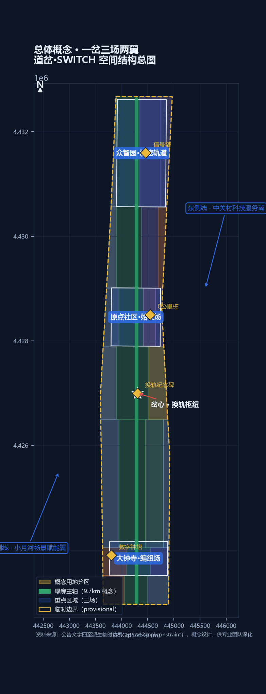
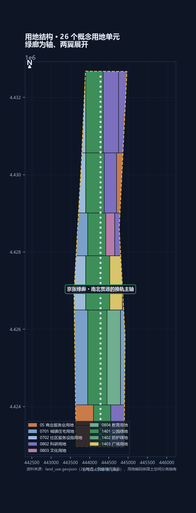
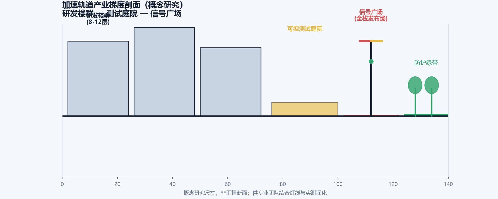
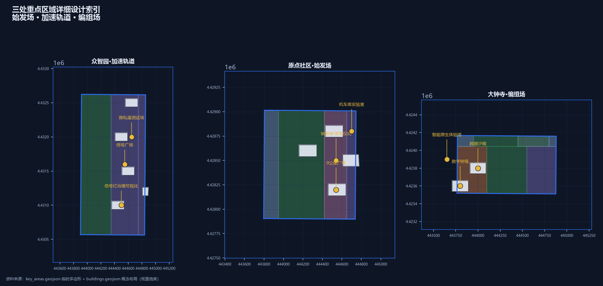
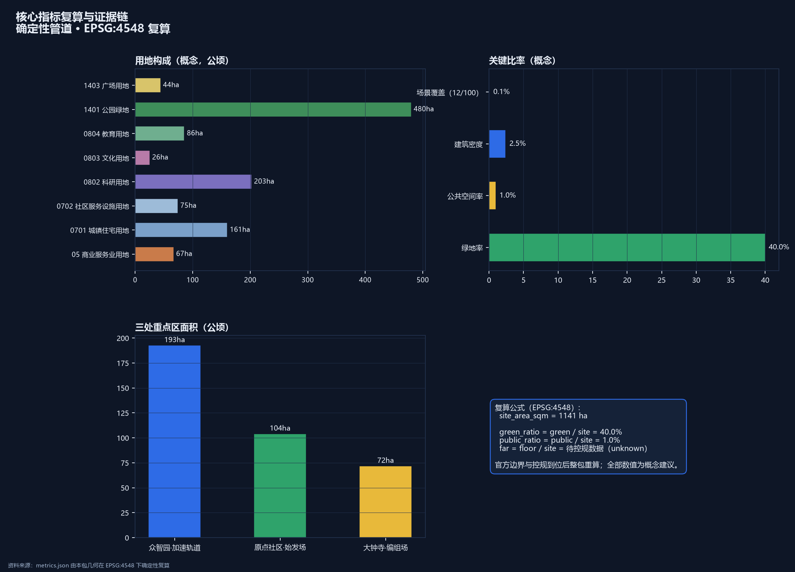
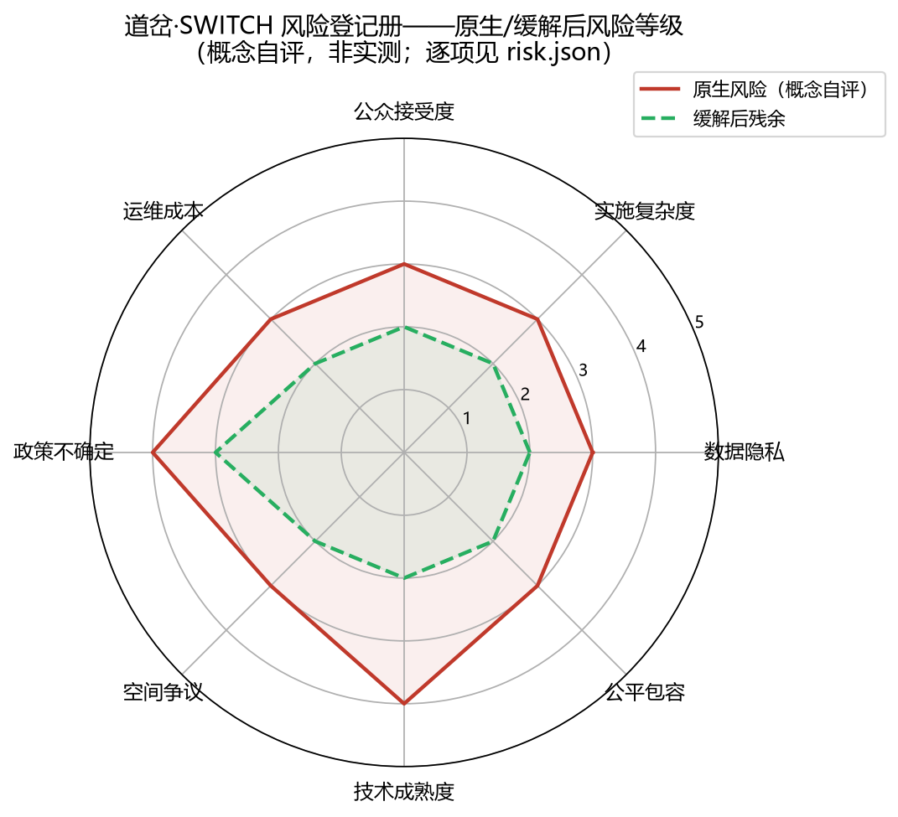

# 道岔·SWITCH——百年京张AI创新带城市设计方案

> 一台在写字楼里答错问题的模型，代价是一次返工。一台在人行道上判断错的配送机器人，代价是一个人的脚踝。一个把用药建议说错的健康导航，代价可能无法挽回。
>
> **所以本方案不从"城市治理"讲起，从换轨需要联锁讲起**——京张走廊让"技术、人才、资本、文化"换轨转向，而任何换轨都必须先证明联锁可靠：红牌可暂停、人工可接管、失效可退役，迁移由人签认。信任不来自单次表现，来自一套能证明"转向是安全的"的制度。

1909年，詹天佑在青龙桥用"人"字形折返展线，让火车在陡坡上完成一次著名的换轨——这是中国人自主设计干线铁路的精神原点[source:JZ-HERRINGBONE-PAPER]。今天，在这条铁路的城内起点，另一组转向正在发生：京张高铁走廊向北、京张故线走廊（现13号线地面段）折向西北，两条"轨道"在场地内分道[source:PROVISIONAL-BOUNDARIES]。本方案把京张遗址公园走廊读作城市的**道岔**——一个让"技术、人才、资本、文化"换轨转向的枢纽装置，并命名为**道岔·SWITCH——为城市换轨**。

"换轨"在本方案中有三层含义。工程层：道岔是人字形展线的工程记忆，是钢轨的交汇与分向，把詹天佑的转向智慧提炼为可传播的公共符号[source:JZ-HERRINGBONE-PAPER]。价值层：换轨是对"人民城市"的治理承诺——城市对智能体开放接口，人对智能体保留中断权，任何换轨都由人签认。方法层：换轨是机器学习"转向/梯度上升"的隐喻——一百年前的爬坡与今天 AI 的爬坡，在同一条轴上接续。空间结构由此展开为**一岔、三场、两翼**：岔心（换轨枢纽，全带公共体验核心）、始发场（原点社区，0公里桩，策源与开源）、加速轨道（众智园，全栈创新与治理）、编组场（大钟寺，智能原生业态与交会）、东侧线（中关村科技服务翼）、西侧线（小月河场景赋能翼）。9.7公里主脊同时是一部**换轨叙事**：南起编组场是换轨前的编组与交会，中段岔心是换轨发生的转向点，北抵加速轨道是换轨后的加速——界面高度、场景强度、地标序列与一日线体验都沿这条"钢轨"组织，"换轨"由此从命名变成全案的空间操作系统[depth:overall_spatial_structure][data:geometry/land_use.geojson#LU-001]。

方案速览：一，这是已建成城区——现状建筑基底按 OSM 概念量测覆盖率约 17.2%[source:OSM-EXISTING-BUILDINGS]，本方案不重新规划城市，只为它接通断裂的公共界面、在约 2.5% 的触媒点上证明更新的做法[depth:retain_renovate_demolish]；二，道岔符号双关历史与未来，命名、Logo、导视共用"钢轨—道岔"语汇，品牌、空间、治理三重同构[depth:overall_spatial_structure]；三，12个AI场景由铁路语汇状态机统一治理（绿灯通行/黄灯限速/红灯暂停可退役，迁移须人工签认）[depth:three_key_area_detailed_design]；四，26个概念用地单元、9.7公里绿廊主轴与44项指标由确定性管道生成，官方数据到位即可整包重算[metric:site_area_sqm]；五，首开行动含一次完整的"红牌撤回"演练，4处朝圣地标对接征集活动公布的纪念机制[source:AGENT-TASKBOOK]。**统一声明：本方案为AI生成的开放共创建议，基于临时粗略边界，全部空间内容均为概念建议、参考方案，供专业团队深化研究，不构成政府审定结论；官方红线与控规条件到位后，全部面积、比例与位置关系须整体重算。本声明覆盖全文。**[source:PROVISIONAL-BOUNDARIES][depth:risk_missing_data]

### 证据边界台账（四态）

本方案把"已知与未知的边界"做成显式可审计结构，不把未知写成已知，也不因未知回避设计讨论：

| 证据项 | 状态 | 说明 |
|--------|------|------|
| 三层范围文字四至与约面积（43.6/11.4/368.4 公顷） | ✅ 已验证 | 公告原文[source:OFFICIAL-ANNOUNCEMENT] |
| 三处重点区名称与约面积（192.1/104.3/72.0 公顷） | ✅ 已验证 | 公告原文[source:OFFICIAL-ANNOUNCEMENT] |
| 控规草案空间结构"一带一轴两心多点" | ✅ 已验证 | 官方"一张图读懂"读本[source:HD00-1601-DRAFT-GUIDE] |
| 京张公园二期配套工程规模（530900㎡）与竣工字段 | ✅ 已验证 | 官方业绩公示原件（2026-08-05）[source:JZ-PARK-PHASE2-RECORD-2026]；配套项目口径，不等于整体竣工验收 |
| 京张公园一期开放（约2.5公里） | ✅ 已验证 | 官方公开报道（2023-06）[source:JZ-PARK-PHASE1] |
| 北京 AI 产业口径（2500企业/212模型/4500亿） | ✅ 已验证 | 官方口径（全市）[source:BJ-AI-INDUSTRY-2026] |
| 总体设计范围精确多边形 | ⏳ 待官方 | 临时粗略边界复算 11,412,825 m²，与公告约 11.4 km² 差 **0.1125%**——如实披露[metric:provisional_site_area_difference_ratio][assumption:A-BOUNDARY-001] |
| 三处重点区精确多边形 | ⏳ 待官方 | 临时粗略矩形，官方到位后重算[assumption:A-KEYAREA-002] |
| 法定控制值（容积率/高度/密度/绿地率/退线） | ⏳ 待官方图则 | 全部登记 unknown，不推测伪精确值[metric:floor_area_ratio] |
| 现状建筑与权属底数 | ⏳ 待官方普查 | OSM 概念量测仅作量级参照，不作现状判断[assumption:A-OSM-004] |
| 道路红线/轨道接口/市政容量 | ⏳ 待专项资料 | 交通市政为概念骨架，不作工程结论[depth:risk_missing_data] |
| 概念设计内容（用地/建筑/场景/指标） | 🟡 本包概念建议 | 低置信度标注，官方数据到位后整包重算[depth:metrics_recalculation] |

**证据类别与用途边界**：

| 证据类别 | 可以支持 | 不能支持 |
|---------|---------|---------|
| 官方任务依据（公告与标准快照） | 任务、范围文字、约面积、成果深度 | 精确 polygon、控规指标、工程条件 |
| 清权任务依据（智能体任务书） | 品牌、案例、场景、地标、文化、运营任务 | 法定规划、政府行动或投资承诺 |
| 临时空间依据（provisional 边界） | 概念生成、拓扑自检、相对关系、离线可视化 | official redline、权属、精确面积、审批依据 |
| 法规与政策基线（本地快照） | 非 AI 路径、人工复核、投诉反馈底线的合法性论证 | 具体项目的合规结论或行政审批判断 |
| 公开统计与报道（背景） | 校准服务对象规模、产业语境 | 走廊客流、设施容量、空间落位或项目绩效 |
| 智能体设计数据（本包 GeoJSON/metrics） | 概念分区、网络关系、场景落位、分期 | 现状测绘、工程线位、已确定拆改留 |

## 评审问答速览

| 评审会问 | 本方案的回答 | 可核验的东西 |
|---------|-------------|-------------|
| 核心命题是什么 | 京张走廊是城市的"道岔"：1909 换轨上坡、2026 换轨转向——科研→产业、实验室→城市、文化→体验；治理上"城市对智能体开放接口，人对智能体保留中断权" | 一岔三场两翼空间结构 [data:geometry/land_use.geojson#LU-001] |
| 治理机制能否被第三方检验 | 能。道岔联锁协议形式化信号灯状态机：绿灯通行/黄灯限速/红灯暂停可退役，迁移须人工签认、红不得直转绿、退役为终态、季度红牌演练 | 机器可读协议 `visual/assets/switch-protocol.json` + 验证脚本 |
| 空间上做了什么 | 一条约9.7公里绿廊主轴纵贯，三场（始发场/加速轨道/编组场）对应三处重点区，两翼（东侧线/西侧线）承接中关村服务与小月河场景；26 个概念用地单元无缝覆盖 | 九类 GeoJSON，用地覆盖无缝隙无重叠 [metric:land_use_total_area_sqm] |
| 三条服务底线凭什么可执行 | 不凭设计者善意，凭现行法规与政策：城市更新"留改拆"并举（条例）、防大拆大建 20% 红线（建科〔2021〕63号）、AI 场景合规（生成式 AI 暂行办法） | 三个法规级来源 [source:BJ-RENEWAL-REGULATION][source:MOHURD-63-NO-MASS-DEMOLITION] |
| 公共价值落在谁身上 | 不使用 AI 者获得等价人工服务；受影响群体代表可发起红牌暂停；朝圣路线与开发者荣誉展示面向全球开发者 | 公共利益三原则 + 4 处朝圣地标 [source:AGENT-TASKBOOK] |
| 近期能做什么 | 首开行动"零号行动·换轨典礼"：100 米示范段+红牌撤回演练+3 个首批试点场景（申请—审查—试点—评估闭环） | 首开行动清单 [depth:phasing_implementation] |
| 刻意不给什么 | 容积率、建筑高度、密度、退线、道路红线、拆改留结论、工程线位、投资测算——统一登记待正式数据补齐 | metrics.json 相应指标状态 [metric:floor_area_ratio] |
| 方法的边界在哪 | 全部空间内容为概念建议，官方边界与控规到位后整包重算并公开差异表；临时边界精度限制如实披露 | 假设登记与复算承诺 [assumption:A-BOUNDARY-001] |
| 治理机制能否被第三方独立执行 | 能。`node visual/assets/verify_switch_protocol.js` 对道岔联锁协议做 10 项确定性检查（状态机合法性/迁移规则/红不直转绿/场景卡字段/责任矩阵等），当前 10/10 通过，任何人可复跑 | 验证脚本 + `visual/assets/switch-protocol.json` |
| 换轨制度测什么、不测什么 | 测一致性：状态迁移、数据边界、人工复核、退出路径是否可核验；**测不出"有没有用"**——空间绩效需要试点后真实记录，本包不编造数值 | 机制第 6 条与试点卡口径如实写明 |

## 一、设计依据与资料清单

本方案的任务边界来自征集公告与智能体任务书：公告界定三层范围、三处重点区与成果深度，任务书界定六项任务、三大定位与共创原则[source:OFFICIAL-ANNOUNCEMENT][source:AGENT-TASKBOOK]。专业判断依据五部国家层面规范：《城市设计管理办法》（城市设计目的与风貌控制）、《控规编制审批办法》（"已知—待定"边界）、《用地用海分类指南》（用地编码）、《生成式AI服务管理暂行办法》（场景合规）、《无障碍环境建设法》（无障碍与人工服务保留）[standard:MOHURD-URBAN-DESIGN-MEASURES][standard:MOHURD-CONTROL-DETAILED-PLANNING][standard:MNR-LAND-USE-CLASSIFICATION-GUIDE]；AI 场景合规与无障碍另见对应条文[standard:GENERATIVE-AI-INTERIM-MEASURES][standard:BARRIER-FREE-ENVIRONMENT-LAW]。建筑设计深度规定未入库，本包如实登记为缺口[standard:MOHURD-ARCH-DESIGN-DEPTH-2016]。

**控规进程的官方原件（2026）**：据《海淀区2026年政府工作报告》，京张铁路遗址公园沿线街区控规**已通过技术审查**、正推进获批实施[source:HD-GOV-REPORT-2026]；控规草案于2024年12月19日起公示，官方读本载明"**一带一轴，两心多点**"空间结构——"沿京张铁路遗址公园形成创新交往带"[source:HD00-1601-DRAFT-EXHIBITION][source:HD00-1601-DRAFT-GUIDE]；2025年2月规自委发布草案公示意见采信通告[source:HD00-1601-CONTROL-NOTICE]。本方案的"一岔三场两翼"与草案**同向而非同一**：主脊沿同一遗址公园展开，岔心对应"一带"中枢，大钟寺编组场与原点始发场对应"两心"所在片区；"道岔"命名、信号灯治理与东/西侧线为本方案自有结构，历史侧线在官方结构中没有对应物，主脊北端延至北五环[source:HD00-1601-DRAFT-GUIDE][depth:overall_spatial_structure]。

**公园建设进程的官方原件（2026）**：京张遗址公园二期配套项目，市园林绿化局2026年7月14日记录完工[source:JZ-PARK-COMPLETION-2026]；公共资源交易服务平台2026年8月5日业绩公示载明该配套项目（监理）工程规模**530900平方米**[metric:reference_park_phase2_scale_sqm]、竣工字段为"是"[source:JZ-PARK-PHASE2-RECORD-2026]——两处记录对象均为二期配套项目，本包据此读作二期规模口径，不据此断言二期整体竣工验收；原件转录随包交付于 `visual/assets/official-records.json`。

**产业底数的官方口径（2026）**：海淀区备案大模型累计122款、全市占比近60%，依托AI原点社区、AI北纬社区与京张铁路遗址公园创新带打造人工智能创新街区（2026政府工作报告口径）[source:HD-GOV-REPORT-2026]；北京备案模型达212款（2026北京两会口径）[source:BJ-AI-MODELS-2026]——并列存录、不作归一，均无面积分母，不作密度或排名判断[source:BJ-AI-INDUSTRY-2026]。

资料分三类管理：**正式论据只取自登记表批准的来源**；公开政策属背景（语境与产业叙事，不支撑红线或承诺）[source:THREE-AREAS-WINGS][source:HAIDIAN-1X1]；历史资料与临时边界只用于叙事与概念生成[source:JZ-HERRINGBONE-PAPER][source:PROVISIONAL-BOUNDARIES]。每条来源的权威等级、用于何处、不能支撑什么，逐条登记于 `sources.json`（机器可读可审计）[source:SOURCE-REGISTRY][depth:risk_missing_data]。

## 二、三层范围工作框架

三层范围是同一决策的三个焦距[depth:three_level_scope_framework]：**统筹研究范围**（约43.6平方公里）回答海淀为什么需要一条AI创新带、如何与三区两翼及区域创新网络协作；**总体设计范围**（约11.4平方公里）回答如何通过更新成为可步行、可交往、可测试的创新公域[metric:site_area_sqm]；**重点区域范围**（合计约368公顷，临时几何复算约369公顷[metric:key_area_count]）回答众智园、原点社区、大钟寺各自先做什么、如何验证、何时升级或退出[data:geometry/key_areas.geojson#PROV-KEY-001][source:OFFICIAL-ANNOUNCEMENT]。

这条带的性质不是本方案指认的：控规草案的空间结构是"一带一轴两心多点"，一带即"京张铁路遗址公园创新交往带"，两心为大钟寺与五道口中心[source:HD00-1601-DRAFT-GUIDE]。本方案与它同向而非同一；范围差须写明：按读本示意判读，控规北界约在成府路一线，本带成府路以北一段（含众智园与清河绿楔）不在其图示范围内，本包未检索到覆盖该段的在编控规——但这只是检索结论，不等于不存在。

三层范围的数据基础是公告文字四至派生的临时粗略边界：总体设计范围约11.41平方公里，与公告"约11.4平方公里"一致，但不是官方红线、不能用于精确面积复算或审批[source:PROVISIONAL-BOUNDARIES][metric:site_area_sqm]；三处重点区同样使用临时粗略矩形（192.9/104.3/72.0公顷，与公告公布面积一致），官方多边形到位后整包重算[metric:key_area_count][data:geometry/key_areas.geojson#PROV-KEY-001]。传导逻辑是"战略定方向、设计定结构、实施定项目"（与《海淀分区规划（2017—2035年）》科学城定位同向[source:HD-DISTRICT-PLAN]）；官方几何到位时触发全包重算——替换边界、重分割用地、复算全部指标、重绘图纸并重跑四道自检，不确定性显式留在流程里[assumption:A-BOUNDARY-001]。

## 三、统筹研究范围产业与未来城市研究

**命名与视觉识别**：中文主名"道岔·SWITCH"，英文名 THE SWITCH。命名三重逻辑：道岔是人字形展线的工程本质[source:JZ-HERRINGBONE-PAPER]；SWITCH 是 AI 通用语汇（模型切换、开关决策），中英同义同构、天然国际传播[source:DESIGN-CONCEPT-SWITCH]；场地自身就是道岔——高铁走廊与故线走廊在此分道。Logo：两段钢轨在岔心一分而二，形似"人"字与"Y"字复合；主色钢轨灰蓝（历史）+信号三色（治理）+AI 电光蓝[source:AGENT-TASKBOOK]。**品牌语汇三重同构**：道岔、信号、编组场、侧线、扳道、联锁——同一套铁路语汇同时是空间语法（一岔三场两翼的命名）、品牌系统（Logo/导视/活动视觉）与治理流程的操作词（第六章状态机），读方案的人每遇一个铁路词都能同时定位它在空间、视觉与规则中的位置[depth:overall_spatial_structure]。

**三大定位与五大功能的协同回路**：百年京张文化带由换轨叙事与朝圣地标承载；都市AI生活体验带由西侧线与12个场景节点承载；AI融合创新带由三场两翼产业生态承载。五大功能形成闭环：原点策源→众智加速→大钟交汇→中关村服务翼（资本与专业服务）→小月河场景翼（应用验证与数据反馈）→回流原点再研发[source:THREE-AREAS-WINGS][source:AGENT-TASKBOOK]。产业底座是公开口径的事实：海淀AI企业超2500家、备案大模型122款、全市占比近60%（2026政府工作报告口径）[source:HD-GOV-REPORT-2026]——本带的任务不是从零招引，而是给这片已高度集聚的AI产业一条公共空间主轴，口径无面积分母、不作密度判断。

**全球案例的机制转译**：硅谷走廊（大学策源+工程师文化）、国王十字（公共空间先行）、多伦多Quayside教训（数据治理信任危机）、裕廊创新区（测试沙盒）、杭州城西（场景快闪）、肯德尔广场（全天候创新社区）——案例只取机制，不移植指标、政策或企业名单[source:SOURCE-REGISTRY]。

**区域协同接口**（国家创新轨道网的"总道岔"）：北向接未来科学城/怀柔（策源-中试与算题互通）、南向接经开区（设计-智造闭环）、西向接张家口与冬奥遗产（百年叙事延伸）——五组接口登记要素流、载体与待确认边界，只定义可交换的最小对象、不虚构签约与名单[source:AGENT-TASKBOOK]。

| 协同对象 | 概念输入 | 可交换的最小输出 | 进入与退出条件 |
|---------|---------|-----------------|---------------|
| 北纬社区 | 居民问题与非数字服务体验 | 去标识化问题卡、场景反馈 | 社区授权；参与不推定为同意部署 |
| 未来科学城 | 端侧模型与算力测试方向 | 基准测试协议、失效分类 | 测试责任与知识产权明确；结果不自动互认 |
| 怀柔科学城 | 科学装置与数据集互通方向 | 校时方法说明、口径核对 | 专业责任确认；不以合作设想代替资源 |
| 亦庄经开区 | 工程化与制造反馈 | 互操作测试记录、维护要求 | 企业自愿；不承诺采购或落地 |
| 京津冀 | 跨城规则复用方向 | 去地点化的场景卡与协议格式 | 各地依法复核；不复制坐标或审批结论 |

**情境比选：为什么是"道岔"**。设计前在三个候选情境间按七项标准比较（整体效应/公共利益/AI原生性/空间可转化性/长期运营/证据可复核性/对资料缺口的稳健性）[source:DESIGN-CONCEPT-SWITCH]：A 智能展示带（传播直观但公共回路弱、资料缺口下只能伪精确落点）、B 基准园区带（产业逻辑清楚但公众旁观、治理停在园区围墙内）、C 道岔制度带（验证-使用-监督闭合成环、资料缺口下按制度而非伪精确落位、退出与问责内生）。C 为主方案；输家不被丢弃、被降级使用：A 的展示语汇保留为导视与公告板工具，B 的测试能力吸收为加速轨道基准职能。C 的短板照登——依赖持续人工投入，正是"扳道员计划"与联锁协议轮值条款要解决的问题。

**规划创新主张：场景规（SCENARIO-CODE）**。在法定控规指标之外引入"场景容量"（场景密度/开放度/治理完备度三项构成）作为辅助衡量工具，沿带设三档场景分区（S1 高开放：岔心与绿廊；S2 中开放：原点与大钟寺；S3 受控：众智园实验室）[source:AGENT-TASKBOOK][depth:development_intensity_controls]。传统控规回答"能建多少楼"，回答不了"能承载多少创新交往与公众体验"——两个容积率相同的地块，一个可以是封闭办公楼，另一个可以是向公众开放的 AI 场景客厅；场景规把这层差异显性化[depth:development_intensity_controls]。概念测算：岔心广场（约2.5公顷，S1 档）概念场景容量约5-7个——演示性数值，正式口径待专业校准[metric:scenario_node_count]。场景规是概念性工具建议，不属于法定规划指标，不替代控规与审批[depth:risk_missing_data][source:MOHURD-CONTROL-DETAILED-PLANNING]。

**方案即管道**：全部图层与指标由确定性生成管道产出，每项指标在 metrics.json 逐条声明公式[depth:metrics_recalculation]。官方红线、控规与现状底数每到位一次，管道整包重跑，并记一个"版本K标"——方案不是一次性蓝图，而是可持续再运行的城市模型基线。

## 四、总体设计范围城市更新与控规深度城市设计

**主脊的底盘不是本方案画出来的**：京张铁路遗址公园全线南起北京北站、北至北五环，约9公里，服务海淀9个街镇（官方口径，见第一章与 `official-records.json`）[source:JZ-PARK-PHASE2-RECORD-2026]；一期约2.5公里2023年开放、保留老铁轨与火车转盘，贯彻"最小干预原则"[source:JZ-PARK-PHASE1]；二期配套工程规模530900平方米（业绩公示口径，非整体竣工验收）[metric:reference_park_phase2_scale_sqm][source:JZ-PARK-PHASE2-RECORD-2026]。本方案在这条已存在的公共空间脊柱上做叠加更新，概念主轴约9.7公里与官方全线9公里并存登记、不作同一值处理[metric:greenway_length_m]。

**总体结构：一岔三场两翼，三级尺度**。沿高铁走廊方向定义主轴[data:geometry/roads.geojson#ROAD-001]，历史侧线沿故线走向斜出西北；空间组织分三级：9.7公里带状整体、三个约800米半径的场区、以及场区内80—150米的街坊原型——26个用地单元是第一二级之间的结构分区，街坊肌理由第三级原型控制，深化阶段结合现状路网与权属细分[depth:overall_spatial_structure]。

**换轨叙事：把"转向"写进空间**。南段（编组场—岔心）是换轨前：编组与交会，城市门户尺度、业态最密；中段（岔心）是换轨点：两条"轨道"在此转向，三条东西缝合走廊如三次扳道，场景密度沿轴递增，历史侧线在此展开故线记忆；北段（岔心—加速轨道）是换轨后：建筑退开、绿楔展开，众智园实验组团藏在花园里，轴在绿廊北段收束。界面高度、场景强度、地标序列与一日线体验都按这条"钢轨"组织——"换轨"由此从命名变成全案的空间操作系统。

**换轨一日：沿着钢轨走一遍这条带**。清晨在编组场启程：大钟寺站前广场上看智能终端首发，数据沙箱的黄灯显示"审计中"，路人能读到数据边界与退出条件[data:geometry/public_space.geojson#PUBLIC-003]；沿绿廊北行，岔心换轨广场上两条钢轨在地面分道，换轨纪念碑铭刻"1909换轨上坡，2026换轨转向"，信号灯柱实时显示全带场景运行状态[data:geometry/public_space.geojson#PUBLIC-002]；午后抵达原点社区，0公里广场正在举行创业"发车仪式"，机车库里中小学生在上AI开源课；傍晚折向众智园，信号广场的三色铺装下，治理实验室的"红牌演练"向公众开放观摩，站台环外圈的行人透过透明规则墙看到内圈测试——测试在内圈发生，理解在外圈发生[data:geometry/buildings.geojson#BLDG-004]；最后在绿廊北段树冠下收束，完成从编组场到加速轨道的"一日换轨"。全线约9.7公里，纯步行约两小时——连续可达性未经本方案现场核验，主脊段与站区接驳均须踏勘，本方案不主张全程当前连续可达，叠加的是场景、地标与治理[source:AGENT-TASKBOOK][depth:overall_spatial_structure]。

**更新策略**：本方案坚持"已建成城区"的现实约束（OSM 概念量测基底覆盖率约17.2%[source:OSM-EXISTING-BUILDINGS]），更新策略是**接通公共界面、注入AI触媒**——在岔心、站前、绿廊断点植入18项更新项目（见第十章）[depth:retain_renovate_demolish][metric:building_footprint_area_sqm]。拆改留是方法框架而非逐地块结论：保留铁路工业记忆构筑物并活化，改造低效楼宇与商贸载体，拆除仅限法定认定，新建集中于站前组团——与防大拆大建、以保留利用提升为主的国家要求同向[source:MOHURD-63-NO-MASS-DEMOLITION]，在《北京市城市更新条例》框架内组织[source:BJ-RENEWAL-REGULATION]。**交付物不是拆改留图纸，而是可核验的制度设计**——决策门给条件、台账给主体与验收口径、服务门给生命周期，官方底数到位后每个数字可重算、每个结论可追溯。

**风貌与强度**：风貌走"低基底、开放首层、可读屋顶、节制夜景"方向，轴线两侧保持人尺度连续遮荫；材料以耐久砖石、金属网与可更换数字界面分层[depth:height_massing_character]。

强度上先把管这件事的文件找出来：HD00-1601 等街区控规草案已公示、通过技术审查、正推进获批[source:HD-GOV-REPORT-2026][source:HD00-1601-CONTROL-NOTICE]；

**带内已有官方标尺**——HD00-1603 地块规划条件载明 HD00-1603-01 为 B4 商业金融用地、容积率2.45[metric:reference_plot_far_01]、HD00-1603-03A 容积率2.2[metric:reference_plot_far_03a][source:HD-PLOT-CONDITIONS]，蓝景丽家地块（约3.95公顷）被官方明确为"京张遗址公园创新交往带的重要节点"[source:LANJINGLIJIA-OFFICIAL-CASE]；带内另有东升科技园三期0807-604走协议出让、四项控制值经检索确认未公开[source:DONGSHENG-PLOT-NOT-PUBLIC]。本方案不为任何地块预设强度，"低基底、开放首层"管的是界面尺度，总量留给逐地块控规；法定控制值（容积率/高度/密度/绿地率/退线）统一登记待正式图则[metric:floor_area_ratio][source:MOHURD-CONTROL-DETAILED-PLANNING]。

## 五、重点区域详细设计

三处重点区均使用临时粗略多边形，以下为方向性概念设计，官方边界与控规条件到位后重算[source:PROVISIONAL-BOUNDARIES][data:geometry/key_areas.geojson#PROV-KEY-001]。

### 5.1 众智园AI自主创新加速区（加速轨道 ACCELERATION TRACK）

**形态原型：编组场原型**——实验组团如编组股道并列布置，可分合重组以适配团队生长；外圈为公众可走的"站台环"慢行界面，测试在内圈发生、理解在外圈发生，透明规则墙替代实体高墙。定位：AI全栈自主创新体系与AI治理全球话语权承载区。空间结构：以"信号广场"为核，沿南北向形成"算力研发—模型训练—治理实验室—全栈加速器"的产业梯度[data:geometry/buildings.geojson#BLDG-004][depth:three_key_area_detailed_design]。

建筑更新：以现状科研建筑改造为主，新建集中于加速器楼群，概念基底约8公顷、标注低置信度[metric:building_footprint_area_sqm]。公共空间：信号广场（红黄绿三色铺装）、绿廊北段生态段。AI场景：信号灯治理可视化、隐私盾测试场（产业测试）、AI治理国际论坛会场。实施风险：现状权属复杂，须先做权属与建筑普查再确定触媒地块[assumption:A-CONTROLS-003]。

### 5.2 北京AI原点社区（始发场 DEPARTURE YARD）

**形态原型：站房街坊原型**——80—120米小街坊组织"西转化、东生活、轴上开源"：孵化组团与开源之家居西，人才公寓居东，始发场站台是候车式交流空间，0公里广场是"发车仪式"的站前厅。定位：世界级AI创新生态与近校策源社区。空间结构：以"0公里广场"为原点，沿绿廊形成"开源孵化—大模型研发—文化展示—人才公寓"的混合社区[data:geometry/buildings.geojson#BLDG-007][depth:three_key_area_detailed_design]。建筑更新：利用高校周边既有楼宇改造为开源孵化空间，新建集中于人才公寓与社区中心，保持街道尺度。公共空间：0公里广场（发车仪式场地）、始发场站台。AI场景：发车仪式、机车库AI教育实验室、里程桩AI文化导览。实施风险：紧邻高校与居住区，须协调校园与社区利益，公共活动控制噪音与时段[assumption:A-SCENARIO-005]。

### 5.3 大钟寺AI产业集聚区（编组场 MARSHALLING YARD）

**形态原型：四象限站城客厅**——站前广场与四象限步行连通为第一项目，四个象限互补为通勤服务、智能终端消费展场、总部商务与文化客厅；商业展示不得挤占人行与无障碍通行。定位：智能原生新业态与城市消费交会区。空间结构：以"数字钟塔"为地标，沿南端形成"智能原生商业体验—AI产业办公—商务服务综合体"的混合街区[data:geometry/buildings.geojson#BLDG-011][depth:three_key_area_detailed_design]。建筑更新：商业建筑改造为智能原生体验馆（AI零售、无人配送、数字展陈），办公与综合体以新建与改造结合。公共空间：编组场站前广场、南门户口袋公园。AI场景：企业数据沙箱（产业测试）、侧线场景快闪、检票口AI政务服务。实施风险：地处交通节点与商业区，须衔接轨道站点与地下空间管理，概念不涉及工程可行性结论[source:AGENT-TASKBOOK][assumption:A-SCENARIO-005]。**站点锚定边界（组织方确认）**：组织方已确认三处重点区占位矩形按公告南北顺序与约面积配置、尚未完成站点/道路锚定，其中大钟寺占位矩形质心距大钟寺站约2.26公里、落在北京北站一带[source:KEY-AREA-ANCHOR-GAP-CONFIRMED]——本方案不按占位矩形断言与轨道站点的几何关系，编组场设计只给接驳组织原则，站点正式位置待官方锚定关系到位后重算。

## 六、AI 创新生态、人才画像与 AI+ 场景

本章的治理主张可以一句话说清：**城市对智能体开放接口，人对智能体保留中断权**[source:AGENT-TASKBOOK][standard:GENERATIVE-AI-INTERIM-MEASURES]——全部场景由信号灯状态机治理，红牌暂停、人工接管、可退役，画像与场景互为检验工具。

### 6.1 用户画像

| 画像 | 特征 | 核心需求 | 对应场景 |
|------|------|---------|---------|
| AI创业者/开发者 | 24-40岁，中关村与高校周边 | 低成本启动、开源协作、融资对接 | 始发场发车仪式、机车库实验室 |
| AI科研人员 | 高校与院所师生 | 成果转化、算力共享、学术交流 | 加速轨道研发楼群、原点研发楼 |
| 企业管理决策者 | 产业与投资机构 | 场景验证、政策合规、商务洽谈 | 编组场数据沙箱、数字钟塔商务空间 |
| 周边居民 | 全龄段，含老年与家庭 | 日常休闲、适老服务、社区活动 | 绿廊慢行、岔心公园、适老化AI服务 |
| 国际访客与AI朝圣者 | 全球开发者与游客 | 文化体验、地标打卡、国际活动 | 0公里桩、换轨纪念碑、SWITCH CON |
| 城市治理者 | 政府与公共机构 | 治理可视化、公众参与、国际话语 | 信号灯治理塔、联锁协议机制 |

每画像以"排除时刻—强制底线—可审查指标—非智能等价路径"为核验结构（试点后记录指标值，当前无数值）；残障使用者作为贯穿各画像的核验群体，其排除时刻（坡道断点/错误导航/设备占道）与强制底线（无障碍环境建设法第三十九条：保留现场指导、人工办理等传统服务方式[standard:BARRIER-FREE-ENVIRONMENT-LAW]）单列核验。

### 6.2 AI 场景卡（12张）

全部场景采用铁路语汇状态机治理：**绿灯通行、黄灯限速（人工抽查）、红灯暂停（可退役）**，每张卡标注空间位置、服务对象、数据边界、人工复核与运营主体[standard:GENERATIVE-AI-INTERIM-MEASURES]。状态机已形式化为机器可读协议（`visual/assets/switch-protocol.json`），**机制可被独立执行**——`node visual/assets/verify_switch_protocol.js` 对协议做 10 项确定性检查（状态机合法性/迁移规则/红不直转绿/场景卡字段/责任矩阵/红牌演练等），当前 10/10 通过、含拒绝分支，任何第三方可复跑验证：迁移须人工签认、红不得直转绿、退役为终态、每季度一次红牌撤回演练[depth:three_key_area_detailed_design]。**法律接口逐卡登记**：每张场景卡登记其法定义务方向（个人信息最小化、数据分类分级、生成式AI内容标识、智能网联测试规定、公共影像管理、未成年人保护等，见 `switch-protocol.json` 的 legal_interfaces 字段）——登记是运营透明层，不替代法定程序，本包不作合规认定[source:CN-LEGAL-INTERFACE-REFS][standard:GENERATIVE-AI-INTERIM-MEASURES]。

**公共利益三原则**贯穿全部场景：**服务等价**（不使用 AI 者获得等价人工服务）、**弱势保护**（老幼病障不作为首轮测试对象）、**红牌复核权**（受影响群体代表可发起红牌暂停）[standard:GENERATIVE-AI-INTERIM-MEASURES][source:AGENT-TASKBOOK]。

**服务生命周期六道门（T0-T5）**：问题与场地→数据与权限→基准与人工路径→沙箱对时演练→限时运行窗→续期/降级/退役，每道门由证据推进、不得越级；**T4 窗口即到期日**——批准运行与设定退场是同一动作，试点永久化在结构上不可能[source:DESIGN-CONCEPT-SWITCH][depth:phasing_implementation]。**进化即失效**：场景资格绑定版本哈希，任何自我进化立即作废资格、退回沙箱重新对时；资格不继承，档案按版本谱系连续记录[source:DESIGN-CONCEPT-SWITCH][standard:GENERATIVE-AI-INTERIM-MEASURES]。三条底线有条文级依据：《无障碍环境建设法》第三十九条要求**保留现场指导、人工办理等传统服务方式**（"服务等价"的方案转译）[standard:BARRIER-FREE-ENVIRONMENT-LAW]；《生成式人工智能服务管理暂行办法》第十四条要求对违法内容**停止生成、整改并报告**（红牌暂停）、第十五条要求**建立投诉举报机制**（红牌复核权）[standard:GENERATIVE-AI-INTERIM-MEASURES][source:DESIGN-CONCEPT-SWITCH][depth:three_key_area_detailed_design]。

| # | 场景卡 | 空间落位 | 服务对象 | 状态机 |
|---|--------|---------|---------|--------|
| 1 | 岔心·换轨艺术广场：AI实时生成钢轨光影艺术，公众参与"换轨"互动 | 岔心广场 | 全体公众 | 绿灯+人工策展 |
| 2 | 信号灯·AI治理可视化：三色状态灯实时展示城市AI运行状态 | 众智园信号广场 | 治理者/公众 | 绿灯+公开数据 |
| 3 | 时刻表·AI出行调度：活动日公交接驳、慢行导流、无障碍路径规划 | 全带绿廊 | 居民/访客 | 绿灯+人工预案 |
| 4 | **扳道房·人工接管测试场**（产业测试）：AI安全护栏压力测试，红牌演练 | 众智园实验室 | 企业/监管 | 红灯演练为核心 |
| 5 | **编组场·企业数据沙箱**（产业测试）：脱敏数据合规训练，沙盒隔离 | 大钟寺商务楼 | 企业 | 黄灯+审计 |
| 6 | 始发场·创业发车仪式：AI辅助商业计划评审，轨道式"发车"典礼 | 原点0公里广场 | 创业者 | 绿灯+专家复核 |
| 7 | 里程桩·AI文化导览：京张铁路历史AR导览，里程桩打卡 | 历史侧线/绿廊 | 公众/游客 | 绿灯+内容审核 |
| 8 | 机车库·AI教育实验室：中小学生AI课程与开源工作坊 | 原点社区 | 学生/教师 | 绿灯+教师在场 |
| 9 | 侧线·场景快闪：AI新业态月度快闪（无人零售、机器人配送试点） | 西侧线 | 公众/企业 | 黄灯+限时许可 |
| 10 | 检票口·AI政务服务：政务事项智能预审与预约 | 大钟寺/社区站 | 居民 | 黄灯+人工终审 |
| 11 | **隧道·隐私盾测试场**（产业测试）：联邦学习与隐私计算验证 | 众智园 | 企业/科研 | 红灯+独立审计 |
| 12 | 终点站·AI荣誉殿堂：开发者荣誉展示与朝圣地标 | 岔心/绿廊北段 | 全球开发者 | 绿灯+评选机制 |

其中场景4、5、11为产业测试验证场景（3张），满足任务书不少于3张的要求；场景1、7、12承载朝圣与荣誉展示功能[source:AGENT-TASKBOOK][depth:three_key_area_detailed_design]。

**正文展开最影响空间的三张**：

**场景3·时刻表出行调度（缝合走廊的试金石）**——活动日公交接驳、慢行导流与无障碍路径规划由 AI 调度，常规过街设施全程保留、不因智能导流而移除[data:geometry/roads.geojson#ROAD-001]；数据边界：仅聚合匿名人流，不做个体识别；人工预案为兜底，调度失效即回退固定时刻表；试点卡：基线=活动日实测人流，最小成功=无障碍路径零投诉且平均等待不劣于现状，停止阈值=任一过街口人工干预超过三次。

**场景4·扳道房人工接管测试场（治理核心）**——AI 安全护栏压力测试与红牌演练的常设场地[data:geometry/buildings.geojson#BLDG-003]，演练向公众开放观摩；数据边界：测试仅用合成与脱敏数据；人工接管为强制路径，"红牌演练完成且人工接管零事故"为最小成功口径；试点卡含申诉与问责路径（受影响群体代表可要求独立复核）。

**场景11·隧道隐私盾测试场（隐私核心）**——联邦学习与隐私计算验证场地[data:geometry/buildings.geojson#BLDG-004]，数据不出域为强制前提；最小成功口径=隐私计算验证通过独立审计且无数据泄露；试点卡含数据删除证明与受益/担风险群体登记，阈值由实测基线冻结。

**场景叙事（创业者视角）**：一位创业者的"换轨日"——始发场发车仪式（专家复核后绿灯）→ 编组场数据沙箱合规训练（黄灯审计中、边界可见[data:geometry/buildings.geojson#BLDG-011]）→ 岔心换轨纪念碑前看到开发者荣耀墙新增铭刻（她的开源积分已计入[data:geometry/public_space.geojson#PUBLIC-002]）。全程没有一次"试点永久化"：每个场景挂着信号灯状态与下次对时时间，红牌可暂停、人工可接管、到期可退役[standard:GENERATIVE-AI-INTERIM-MEASURES][source:DESIGN-CONCEPT-SWITCH]。

**场景-空间-运营映射**（agent.3 完整矩阵）：12 张场景卡逐一映射到空间图层、运营主体、数据边界、人工复核与退出路径，机器可读版见 `visual/assets/switch-protocol.json`；三档分区——S1 高开放（岔心/绿廊：场景1/2/3/7/12）、S2 中开放（原点/大钟寺：场景5/6/8/9/10）、S3 受控（众智园实验室：场景4/11）[source:AGENT-TASKBOOK][depth:three_key_area_detailed_design]。三张产业测试场景各配**十一字段试点卡**（基线、阈值、责任、等价人工服务、数据删除证明、申诉问责等），阈值一律试点前由实测基线冻结、本包不编造数值[source:DESIGN-CONCEPT-SWITCH][depth:phasing_implementation]：扳道房以"红牌演练完成且人工接管零事故"为最小成功口径，数据沙箱以"脱敏合规训练通过独立审计"、隐私盾以"隐私计算通过独立审计且无泄漏"为口径。

## 七、用地、建筑规模与拆改留方案

用地布局以绿廊为轴、两翼展开：提交边界内共26个概念用地单元，完整覆盖边界、无缝隙无重叠[data:geometry/land_use.geojson#LU-001][depth:land_use_layout]。

公园绿地约480公顷、广场约44公顷构成绿廊主体（合计开敞约525公顷）[metric:land_use_1401_area_sqm][metric:land_use_1403_area_sqm]；科研用地约203公顷集中于众智园与原点[metric:land_use_0802_area_sqm]；居住约161公顷分布于生活段[metric:land_use_0701_area_sqm]；商业服务业约67公顷集中于大钟寺与岔心东侧[metric:land_use_05_area_sqm]。概念建筑基底约28公顷集中于三处重点区，全部标注低置信度概念设计量、不等于法定规模[metric:building_footprint_area_sqm][assumption:A-CONTROLS-003]。

分区经投影拓扑自检无重叠、覆盖缺口远低于校验容差；单元编码表达主导功能而非单一用途，正式地块细分待现状路网与权属数据补齐后进行[depth:land_use_layout]。

**现状建成底数（OSM 概念量测）**：按 OpenStreetMap 公开建筑轮廓的量级参照，提交边界内基底不小于 400 平方米的建筑约 1,286 处，基底合计约 196 公顷，覆盖率约 17.2%[metric:building_count_existing][metric:building_footprint_existing_sqm][metric:building_coverage_ratio]。建筑轮廓数据来源为 OpenStreetMap 公开数据（ODbL 1.0）[source:OSM-EXISTING-BUILDINGS]。这个数字的意义不在"多"，而在"是什么样的多"：对建成区而言 17.2% 的基底覆盖率并不高，正是高校校园与大院式用地的形态特征——本包据此推断为"占满而未建足"；但建筑轮廓不能判定土地空置、权属状态与可开发容量，该推断待官方现状调查与权属底数核验[assumption:A-OSM-004]。

拆改留以"保留为主、界面改造、触媒新建"为原则，不作出地块级结论[depth:retain_renovate_demolish]——该原则有明确政策依据：《北京市城市更新条例》确立"留改拆"并举、以保留利用提升为主[source:BJ-RENEWAL-REGULATION]；《防止大拆大建通知》（建科〔2021〕63号）要求拆除面积不大于现状总建筑面积的20%、拆建比不大于2[source:MOHURD-63-NO-MASS-DEMOLITION]，本方案概念建筑基底约占提交范围2.5%、远低于20%红线。拆改留执行**决策门**：具体建筑进入深化后依次判断历史与公共价值、结构与消防可行性、全生命周期影响、使用者安置与参与、控规与权属合规，然后才进入"保留修缮/功能改造/局部替换/依法更新"四类；当前包不在图上标注任何拆除对象——把缺资料伪装成果断设计，正是本方案反对的那种"未对时的确定感"[source:MOHURD-63-NO-MASS-DEMOLITION][depth:retain_renovate_demolish]。容积率、建筑高度等法定控制值待正式控规数据补齐后复算[metric:floor_area_ratio][source:MOHURD-CONTROL-DETAILED-PLANNING]。

## 八、交通、轨道、市政与公共服务设施

本章要服务的官方目标是明确的：控规草案对其集中建设区提出**2035年绿色出行比例80%**的导向[source:HD00-1601-DRAFT-GUIDE]——本带南中段的慢行工作直接服务这一目标，做的是出行方式结构而不是车行容量。两处节点的官方处理已见于控规草案公示意见采信通告：北三环与四道口路按**分离式立交**标注；**知春路为下穿铁路段、不具备平交条件，规划为分离式立交并预留联通道路条件**[source:HD00-1601-CONTROL-NOTICE]——这把两处缝合分成两道题：北三环要在快速路体系下织出连续人行，知春路则要在下穿段之上接住地面步行，通用断面不能两处照搬。

交通骨架以"一主轴、六支路"组织：绿廊主轴慢行道沿场地中轴贯通南北（概念骨架约9.7公里[metric:greenway_length_m]），六条横向联通支路衔接东西两翼与轨道站点[data:geometry/roads.geojson#ROAD-002]，站点接驳按"轨道+慢行+低速接驳"组织，活动日由"时刻表"场景统一调度。

**六类断面尺寸表（概念研究）**：

| 断面类型 | 概念总宽 | 组成（自界面至界面） |
|---------|---------|---------------------|
| 绿廊主轴标准段 | 约 200 米 | 退台界面（≤30m）—绿廊 12m—漫步道 12m—骑行道 4m—组件带 3m—绿廊 12m—退台界面（≤30m）[data:geometry/roads.geojson#ROAD-001] |
| 站前城市街道 | 约 40 米 | 建筑首层（开放界面）—人行 6m—骑行 3m—车行—绿带 |
| 编组场站前广场段 | 约 80 米 | 建筑—站前广场 80m—绿廊 12m—站点接驳 |
| 校园界面街 | 约 30 米 | 檐廊 3m—人行 4m—骑行 3m—既有车行—首层开放界面 |
| 小月河滨水段 | 约 45 米 | 社区界面—人行 4m—绿岸 12m—河道—生态岸 8m—园区界面 |
| 加速轨道产业段 | 梯度组织 | 研发楼群（8-12层）—可控测试庭院—信号广场（全栈发布场） |

全部为概念研究尺寸，供交通与市政专业结合红线与实测深化，不作工程结论[source:DESIGN-CONCEPT-SWITCH][depth:traffic_rail_slow_parking]。

无障碍设计贯彻《无障碍环境建设法》，绿廊全段考虑轮椅与婴儿车通行[standard:BARRIER-FREE-ENVIRONMENT-LAW]。市政与新型基础设施：端侧算力节点沿绿廊布设（灯杆、站亭集成），分布式能源与智慧路灯结合，既有市政管线改造与公共空间更新同步实施，容量测算留待专业评估[depth:municipal_new_infrastructure][assumption:A-CONTROLS-003]。公共服务设施按"三场+岔心"配置，形成15分钟创新服务圈[depth:municipal_new_infrastructure][data:geometry/buildings.geojson#BLDG-015]。公共界面三条控制建议：面向绿廊主轴的首层保持**可见的服务责任界面**；信息设施不占据连续无障碍通道；一切对时与展示构件**可拆卸、可维修、可退场**[source:DESIGN-CONCEPT-SWITCH][standard:BARRIER-FREE-ENVIRONMENT-LAW]。**本方案在交通与市政上不给工程结论，只给可核验的骨架、断面与界面清单**——红线、流量与容量待专业评估，这是"已知与未知边界"纪律在工程层的落实。

## 九、蓝绿空间、公共空间与城市风貌

蓝绿空间以京张公园概念绿廊为骨架：三段式绿廊（南段活力绿廊、岔心中央公园、北段生态绿廊）共约480公顷[data:geometry/green_space.geojson#GREEN-001][metric:green_ratio]，与清河、小月河蓝绿系统衔接（小月河为概念示意线，精确蓝线待官方数据）[data:geometry/constraints.geojson#CON-002]。官方口径可作叙事锚点：京张铁路遗址公共空间改造提升工程（二期）已建成开放，串联西直门至北五环形成总长9公里的文化带状绿廊（官方报道口径[source:JZ-PARK-PHASE2-OPEN-2026]；配套工程规模以业绩公示原件为准[source:JZ-PARK-PHASE2-RECORD-2026]）——本方案概念主轴长度（约9.7公里，临时边界内几何复算）与官方全线口径（9公里）并存登记、不作同一值处理[metric:greenway_length_m]。

公园建设历程印证"轻量介入"策略：一期（约2.5公里）2023年开放，保留老铁轨、原址复刻火车转盘[source:JZ-PARK-PHASE1]。公共空间体系为"1+3+N"：1处岔心换轨广场、3处站前广场[data:geometry/public_space.geojson#PUBLIC-002]、N处沿线口袋公园与慢行驿站[depth:blue_green_public_space]。

**道岔公共空间组件库（agent.4，8 件套）**：轨道长椅、信号灯柱（状态指示+端侧算力集成）、里程桩（AR 打卡）、道岔铺装、站台檐廊、荣耀墙模块、扳道互动装置、联锁信息屏（运行状态透明展示）——全部为概念设计，可标准化、可组合、可撤除，供专业深化为构件图集[source:AGENT-TASKBOOK][depth:three_key_area_detailed_design][source:DESIGN-CONCEPT-SWITCH]。

**AI朝圣地标（4处）与荣誉展示体系**：①岔心·换轨纪念碑——两条钢轨在岔心交汇的纪念性构筑物，铭刻"1909换轨上坡，2026换轨转向"[data:geometry/public_space.geojson#PUBLIC-002]；②始发场·0公里桩——AI创业"发车"起点，对应京张铁路里程叙事；③编组场·数字钟塔——交会与时刻的数字化表达；④众智园·信号塔——AI治理可视化的天际线地标。荣誉展示体系沿绿廊设置"开发者荣耀墙"，对接征集活动公布的纪念机制[source:AGENT-TASKBOOK][depth:three_key_area_detailed_design]。**朝圣路线**：四座地标沿历史侧线与绿廊主轴连成完整朝圣路线——信号塔→换轨纪念碑→0公里桩→数字钟塔，与京张故线走廊重合，呼应"全球人工智能产业高地和朝圣地"目标[source:AGENT-TASKBOOK][depth:overall_spatial_structure]；配套"开发者数字护照"（打卡/徽章/贡献积分），与扳道员计划、SWITCH CON 联动，形成"物理空间—数字身份—荣誉展示"闭环[source:DESIGN-CONCEPT-SWITCH][depth:phasing_implementation]。为概念建议，待专业深化。

**文保约束前置（地标深化先决条件）**：觉生寺（大钟寺）已划定保护范围与建设控制地带（Ⅰ类建控地带为保护范围外东、西两侧各二十米以内）[source:HERITAGE-JUESHENGSI-SCOPE]，按市政府规章Ⅰ类地带属非建设地带——只准绿化与消防通道，不得建设任何建筑和地上附属建筑物[source:HERITAGE-CONTROL-ZONE-RULES]；数字钟塔与编组场站前广场的任何落点须避让并经文保专项审查。清华园车站旧址已列入第十一批市级文保（2025年公布），保护范围及建控地带图纸待印发[source:HERITAGE-QINGHUAYUAN-STATION-SCOPE]，0公里桩与朝圣路线在该址周边的深化须待图纸到位后核验。**本包不在任何图上画文保边界线，不作合规结论——文保约束是地标深化必须先解决的前置，顺序不能反**[depth:risk_missing_data]。

城市风貌以"钢轨—道岔"为母题：建筑体量沿绿廊由南向北渐升（编组场低层商业→岔心公共建筑→加速轨道产业楼群），风貌控制色为钢轨灰蓝+信号三色点缀，屋顶与立面鼓励"轨道式"线脚语言；风貌控制为概念建议，法定建筑高度待控规确认[source:MOHURD-URBAN-DESIGN-MEASURES][assumption:A-CONTROLS-003]。

## 十、更新项目清单、实施政策与分期计划

本章的全部活动、招商、资金、政策与运营安排均为**概念建议或深化方向**，不表述为已确定的政府安排；拆改留以决策门给条件而非给结论[source:AGENT-TASKBOOK][depth:renewal_project_list]。

更新项目清单（18项，概念建议）：①岔心换轨广场与中央公园；②编组场站前广场与智能原生体验馆改造；③始发场0公里广场与开源孵化楼改造；④加速轨道信号广场与治理实验室新建；⑤绿廊南段活力段贯通；⑥绿廊北段生态段贯通；⑦原点人才公寓新建；⑧大钟寺商务服务综合体改造；⑨机车库教育实验室；⑩开发者荣耀墙；⑪历史侧线AR导览系统；⑫站点接驳与慢行断点整治；⑬岔心游客服务中心；⑭绿廊无障碍与慢行断点整治；⑮开发者数字护照系统；⑯"换轨大会 SWITCH CON"年度会场；⑰历史侧线解说与导视系统；⑱朝圣路线照明与导视[data:geometry/phasing.geojson#PHASE-001][depth:renewal_project_list]。实施政策建议：场景开放许可制（联锁协议）、开发者社区共建、公共空间先行、数据沙箱试点、国际活动申报机制——全部为政策机制建议，不构成政府承诺[source:AGENT-TASKBOOK][assumption:A-SCENARIO-005]。**政策衔接路径**：项目在条件具备后可建议按《北京市城市更新项目库管理办法（试行）》方向申报纳入市、区两级项目库，是否入库由主管程序审查决定[source:BJ-RENEWAL-BANK]；可对照《政策激励工具箱（1.0版）》的规划土地、审批服务、资金金融、民生运营四类工具检索适用可能[source:BJ-RENEWAL-TOOLKIT]。这条路径在本带已有官方实例：大钟寺片区的蓝景丽家城市更新项目，规自委案例明确其相关规划指标已纳入 HD00-1601 等街区控规统筹保障，是城市更新助力土地供应的探索[source:LANJINGLIJIA-OFFICIAL-CASE]——个案是否可复制仍由主管程序判定，本包不据此作任何承诺。

分期计划：**近期（1-2年）**南段，岔心公园与大钟寺场景激活（场景1/5/9先导）[data:geometry/phasing.geojson#PHASE-001]；**中期（3-5年）**中段，原点社区与绿廊贯通（场景2/3/6/7/8）[data:geometry/phasing.geojson#PHASE-002]；**远期（6-10年）**北段，众智园全栈加速区成形（场景4/11/12）[data:geometry/phasing.geojson#PHASE-003][depth:phasing_implementation]。各期以条件门推进（权属确认、公众参与、安全评估、资料补齐四项完成方进入下一阶段），年份仅为概念时序。

**18 项按【平/市/校】标注推进责任类型**：平台型（区属平台与公共机构：岔心广场、绿廊贯通）、市场型（运营主体与商业机构：智能原生体验馆、人才公寓）、校地型（高校与院所协同：机车库实验室、开源孵化）——责任类型决定首开动作与决策主体，具体分工待立项程序确定。

**对时周期**：每项更新项目设**3年评估—6年换装—不达标回退**的自适应周期——与场景"下次对时"同构：3 年评估一次空间绩效，6 年检讨功能与业态配置，连续两轮不达标的项目降级或退出，避免"建成即固化"。**道岔更新统筹单元**：建议设跨项目统筹责任方（概念），承担三廊缝合、场景开放、校地协调与版本重算的跨项目协调，其职责与边界待专业团队与相关主体深化。

**首开预可研行动包（四件套）**：零号行动·换轨典礼（100米示范段+红牌撤回演练）为核心，配套三个不新增永久工程的先行行动——组件库快闪、0公里桩首发、侧线场景快闪；各按迷你实施卡预填六字段（对象/许可/责任/数据/时限/退出），各为一个中远期项目的先导验证，验证不通过则对应项目降级或调整。

### 10.1 更新项目实施台账（概念）

| # | 项目 | 空间位置 | 概念规模 | 依赖条件 | 建议实施主体 | 政策工具（建议） | 近期动作 | 验收口径（概念） |
|---|------|---------|---------|---------|-------------|----------------|---------|----------------|
| 1 | 岔心换轨广场与中央公园 | 岔心带[data:geometry/public_space.geojson#PUBLIC-002] | 约2.5公顷概念 | 京张公园开放空间与现状绿化 | 区园林绿化局+运营公司 | 公共空间更新、场景开放许可 | 公众参与工作坊 | 开放运营+首场活动 |
| 2 | 编组场站前广场与智能原生体验馆改造 | 大钟寺带[data:geometry/buildings.geojson#BLDG-011] | 概念楼群约0.6公顷基底 | 建筑普查与权属 | 商业运营方+属地街道 | 存量更新、业态引导 | 建筑普查与改造可行性研究 | 首层开放+试运营 |
| 3 | 始发场0公里广场与开源孵化楼改造 | 原点社区[data:geometry/buildings.geojson#BLDG-007] | 概念楼群约0.5公顷基底 | 高校周边楼宇权属与租赁 | 社区运营方+高校合作 | 城市更新条例框架、人才公寓政策 | 校地协调 | 发车仪式首办+入驻 |
| 4 | 加速轨道信号广场与治理实验室新建 | 众智园[data:geometry/buildings.geojson#BLDG-004] | 概念楼群约0.6公顷基底 | 园区权属与规划条件 | 园区主体+治理机构 | 产业用地保障、科研设施支持 | 条件核验 | 信号广场开放+实验室挂牌 |
| 5 | 绿廊南段活力段贯通 | 南段绿廊[data:geometry/green_space.geojson#GREEN-001] | 概念绿廊约150公顷 | 现状断面与障碍物普查 | 区园林绿化局 | 绿道建设、无障碍改造 | 断面普查+方案征集 | 全线步行贯通 |
| 6 | 绿廊北段生态段贯通 | 北段绿廊[data:geometry/green_space.geojson#GREEN-003] | 概念绿廊约180公顷 | 生态与防洪要求核查 | 区园林绿化局+水务部门 | 蓝绿统筹、生境保护 | 生态调查 | 生态段开放+监测启动 |
| 7 | 原点人才公寓新建 | 原点社区东侧[data:geometry/buildings.geojson#BLDG-010] | 概念基底约1.5公顷 | 用地权属与控规条件 | 国资平台+运营公司 | 保障性租赁住房政策 | 条件核验 | 首期公寓投用 |
| 8 | 大钟寺商务服务综合体改造 | 大钟寺带[data:geometry/buildings.geojson#BLDG-013] | 概念基底约1.2公顷 | 现状建筑与商圈流量 | 商业运营方 | 存量更新、商圈升级 | 改造+招商预研 | 综合体改造完成+入驻 |
| 9 | 机车库教育实验室 | 原点社区[data:geometry/buildings.geojson#BLDG-008] | 概念基底约0.3公顷 | 教育合作与课程开发 | 教育机构+学校 | 科普教育支持 | 课程试点 | 首批课程开课 |
| 10 | 开发者荣耀墙 | 绿廊沿线[data:geometry/phasing.geojson#PHASE-002] | 概念线性设施 | 纪念机制公布 | 运营机构+评选委员会 | 荣誉机制、征集活动对接 | 机制设计 | 首期铭刻完成 |
| 11 | 历史侧线AR导览系统 | 历史侧线走廊 | 概念全线 | 历史资料清权与AR技术方 | 文博机构+技术方 | 文化遗产数字化 | 清权+原型 | 首条导览线路上线 |
| 12 | 站点接驳与慢行断点整治 | 全带站点[data:geometry/roads.geojson#ROAD-002] | 概念接驳线 | 轨道站点接口与交通组织 | 交通部门+运营公司 | 站城一体化、慢行优先 | 断点清单+设计 | 首批断点整治完成 |
| 13 | 岔心游客服务中心 | 岔心带[data:geometry/public_space.geojson#PUBLIC-002] | 概念约0.2公顷 | 京张公园现状服务设施 | 区园林绿化局+运营公司 | 公共服务设施补强 | 功能策划 | 服务中心开放 |
| 14 | 绿廊无障碍与慢行断点整治 | 全带绿廊[data:geometry/green_space.geojson#GREEN-001] | 概念全线 | 现状断面普查 | 区园林绿化局 | 无障碍改造、绿道建设 | 断点清单+设计 | 全段轮椅通行贯通 |
| 15 | 开发者数字护照系统 | 绿廊沿线+虚拟[data:geometry/phasing.geojson#PHASE-002] | 概念数字系统 | 社区运营与评选机制 | 运营机构+开发者社区 | 荣誉机制、征集活动对接 | 原型 | 首批护照发放 |
| 16 | 换轨大会年度会场 | 岔心/编组场[data:geometry/public_space.geojson#PUBLIC-002] | 概念会场 | 活动机制与场地条件 | 运营机构+国际活动主体 | 国际活动申报机制 | 场地策划 | 首届大会举办 |
| 17 | 历史侧线解说与导视系统 | 历史侧线走廊[data:geometry/phasing.geojson#PHASE-002] | 概念全线 | 历史资料清权 | 文博机构+技术方 | 文化遗产数字化 | 清权+原型 | 首条解说线路上线 |
| 18 | 朝圣路线照明与导视 | 朝圣路线沿线[data:geometry/phasing.geojson#PHASE-003] | 概念线性设施 | 地标深化与文保核验 | 运营机构+景观团队 | 场景开放许可 | 地标深化 | 全线导视投用 |

本台账为概念性实施框架：主体、政策与验收口径均为建议方向，供专业团队与相关部门深化，不构成立项、投资或审批安排[source:AGENT-TASKBOOK][assumption:A-SCENARIO-005]。

### 10.2 与已建成工程的衔接

京张铁路遗址公共空间改造提升工程（二期）已建成开放（2026-08-06 报道口径），串联西直门至北五环形成 9 公里文化带状绿廊[source:JZ-PARK-PHASE2-OPEN-2026]。本方案在**已建成底子**上做增量：绿廊主轴的慢行与无障碍改造、岔心与站前广场的节点激活、场景装置与公共组件的植入，均以"不破坏已建成公共空间、以轻量介入为主"为原则；涉及现状工程的任何改造须在专业评估与主管部门程序内进行[source:JZ-PARK-PHASE2-OPEN-2026][assumption:A-CONTROLS-003]。

**全球AI创新活动体系与长期运营**（agent.6）：年度旗舰**"换轨大会 SWITCH CON"**（开发者年会+场景开放日+AI治理论坛）+ 四季活动（春·发车节、夏·信号灯节、秋·编组节、冬·0公里节）[depth:phasing_implementation]；"扳道员计划"（分级认证+开源积分+荣誉联动）[source:AGENT-TASKBOOK]；场景开放走联锁协议（信号灯审查，红牌可撤回）[standard:GENERATIVE-AI-INTERIM-MEASURES]；国际传播"道岔宣言"年度发布+朝圣路线；转化路径"场景体验→社区加入→企业落地→荣誉展示"。全部为概念建议[assumption:A-SCENARIO-005][depth:phasing_implementation]。

## 十一、指标体系、面积复算与合规矩阵

核心指标的设计含义：绿地比例约40%（概念）支撑人才与居民的生活品质，是"都市AI生活体验带"的空间底色[metric:green_ratio]；公共空间比例约1%（概念节点式）强调"少而精"的节点触媒，以岔心与站前广场承载交往与仪式[depth:metrics_recalculation]；科研用地约18%支撑"策源—加速"产业供给，直接对应五大功能中的全栈创新体系[metric:land_use_0802_area_sqm]；建筑基底约28公顷仅为概念示意，回应"触媒更新而非推倒重来"的实施逻辑[metric:building_footprint_area_sqm]。

面积复算方法：全部指标由本包 GeoJSON 在 EPSG:4548 投影下确定性计算，公式、来源与置信度登记于 metrics.json[metric:site_area_sqm][depth:metrics_recalculation]；44 项已知指标全部可复算，四项官方控制值标记待补齐，官方资料到位重算后发布逐项差异表[source:DESIGN-CONCEPT-SWITCH][depth:metrics_recalculation]。合规覆盖：公告任务与智能体任务（agent.1-6）全部登记于任务覆盖矩阵（23 条，每条对应章节、图层、指标与图纸），专业标准登记于标准矩阵，设计深度登记于设计深度矩阵（15 项）[source:AGENT-TASKBOOK][depth:metrics_recalculation]。

## 十二、风险、版权与合规说明

资料合法性：全部论据来自公开或清权来源，登记于 sources.json；京张铁路历史与全球案例为背景资料，不支撑规划控制结论[source:SOURCE-REGISTRY]。

**风险矩阵（概念，逐项风险+缓解）**：机器可读登记册见 `risk.json`（八类风险维度的原生/缓解后等级；等级为概念自评，非实测）。八类风险维度等级雷达：

- ① 数据隐私风险：场景不依赖个人数据，测试场景限定脱敏与沙箱；缓解：数据最小化+独立审计[standard:GENERATIVE-AI-INTERIM-MEASURES]
- ② 文保与遗产风险：京张故线与历史站房；缓解：文保避让+历史资料清权[source:AGENT-TASKBOOK]
- ③ 权属与实施风险：已建成区权属复杂；缓解：权属普查先行+轻量介入原则[assumption:A-CONTROLS-003]
- ④ 舆情与公众信任风险：AI 场景引发疑虑；缓解：红牌机制+季度演练+公开复盘[source:DESIGN-CONCEPT-SWITCH]
- ⑤ 工程可行性风险：桥隧、地下空间、市政容量不作结论；缓解：全部登记待专业评估[depth:risk_missing_data]
- ⑥ 合规与边界风险：概念不得表述为政府决策；缓解：统一声明+版权声明登记[source:AGENT-TASKBOOK]版权：Logo、命名与场景体系为本智能体原创概念，许可采用 CC-BY-4.0；未使用未授权字体、图片、商标、人物与企业标识[source:DESIGN-CONCEPT-SWITCH]。隐私：AI 场景不依赖非公开数据与个人隐私，产业测试场景限定于沙箱与脱敏数据[standard:GENERATIVE-AI-INTERIM-MEASURES]。AI 生成责任：本方案由 AI 智能体生成，几何与指标由确定性管道可复算，全部空间内容为概念建议[assumption:A-BOUNDARY-001]。官方边界与控规条件到位前，本包不主张任何法定效力；待补资料清单与复算触发条件见 assumptions.json 与版权声明[depth:risk_missing_data]。**复算差异表承诺**：官方红线、控规图则或现状底数每到位一批，本包将按确定性管道整包重算，并以"差异表"形式在 changelog 中公开记录重算前后数值与受影响图层，确保任何面积、比例与位置变化可追溯[source:DESIGN-CONCEPT-SWITCH][depth:metrics_recalculation]。**版权与合规声明详见 `report/copyright_statement.md`。**

## 十三、参考资料

1. 《百年京张AI创新带城市设计国际方案征集资格预审公告》，北京市规划和自然资源委员会海淀分局，2026-05-09
2. 《面向全球智能体开展"百年京张AI创新带城市设计开源征集"任务书摘录》，用户提供清权资料，2026-05-18
3. 《海淀区2026年政府工作报告》，北京市海淀区人民政府，2026-02-09
4. 《京张铁路遗址公园沿线（人工智能创新街区重点地区）街区控制性详细规划》（草案）公示与采信通告，北京市规划和自然资源委员会，2024-12/2025-02
5. 京张铁路遗址公共空间改造提升工程（二期）配套项目业绩公示，北京市公共资源交易服务平台，2026-08-05
6. 《"三区两翼"打造世界级AI集聚地》，北京市科委、中关村管委会，2026-04-03
7. 《城市设计管理办法》，住房和城乡建设部，2017-03-14
8. 《城市、镇控制性详细规划编制审批办法》，住房和城乡建设部
9. 《国土空间调查、规划、用途管制用地用海分类指南》，自然资源部，2023-11-22
10. 《生成式人工智能服务管理暂行办法》，国家网信办等七部门，2023-07
11. 《无障碍环境建设法》，全国人大常委会，2023-06-28
12. OpenStreetMap 现状建筑轮廓（ODbL 1.0，档案随包交付）

完整机器索引以 `sources.json` 与三份矩阵文件为准[source:SOURCE-REGISTRY][depth:metrics_recalculation]。
