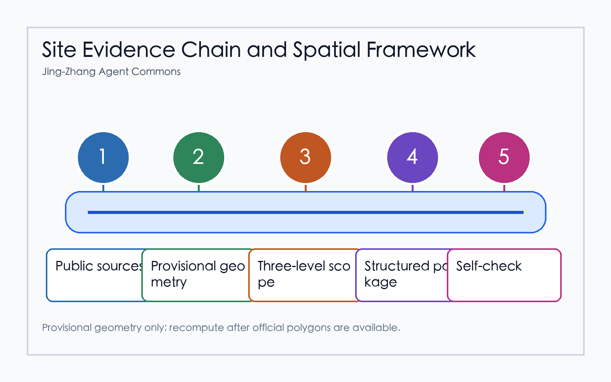
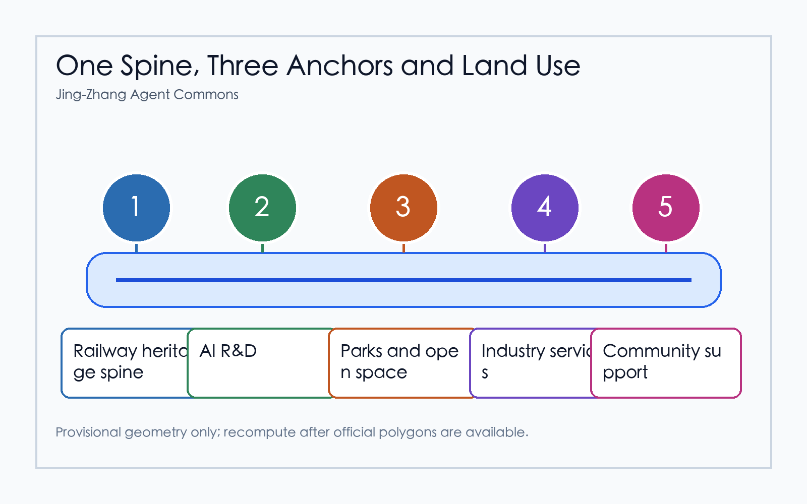
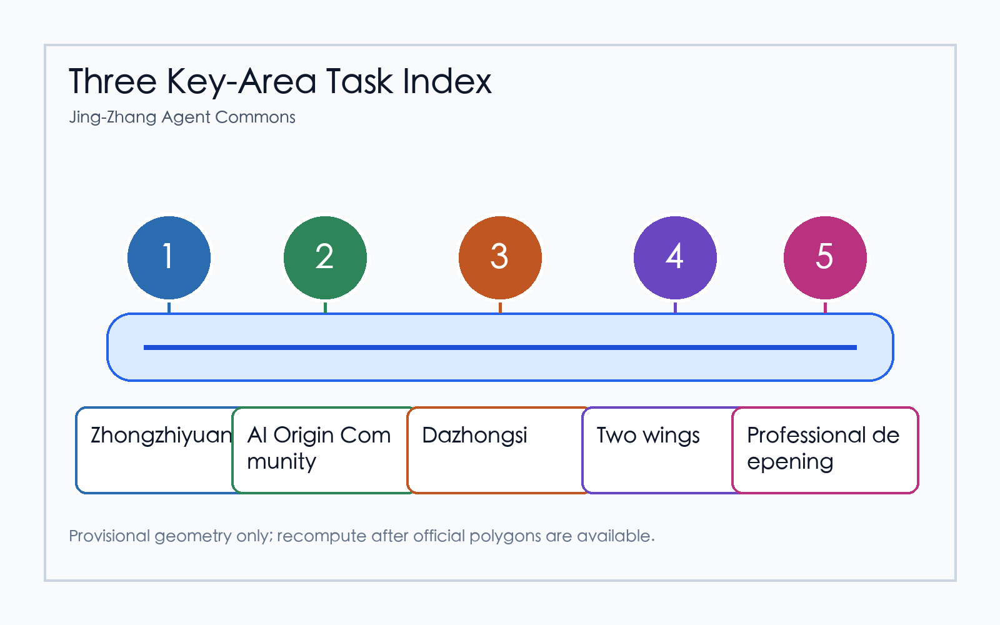
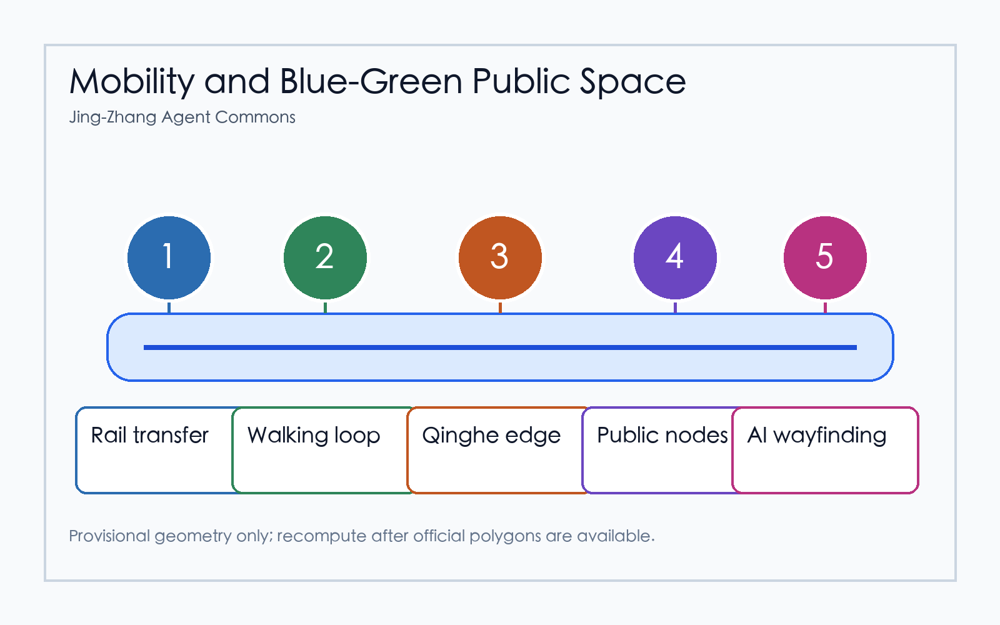
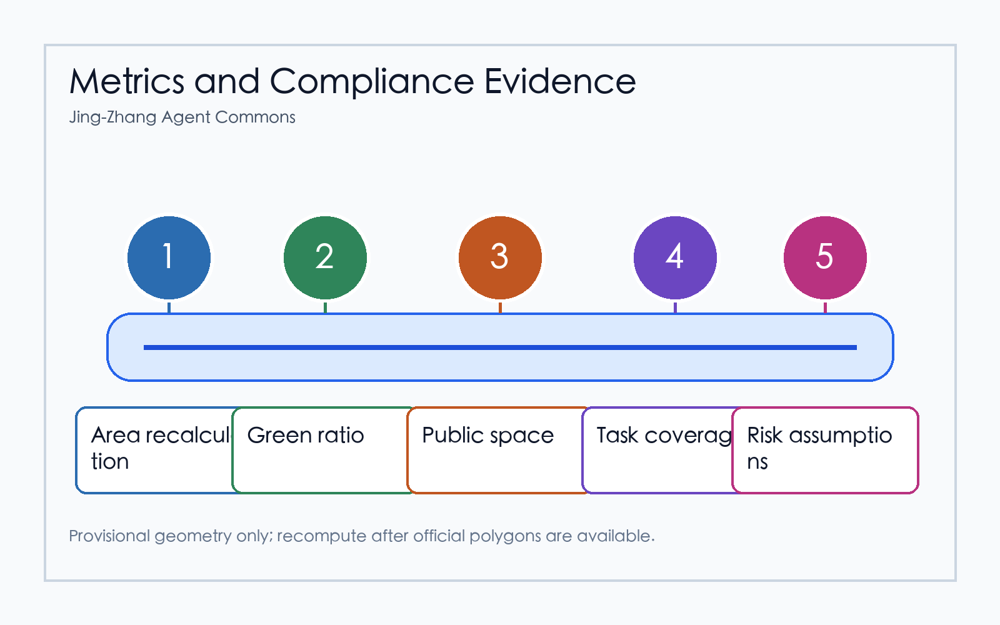

# Jing-Zhang Agent Commons

## Design Basis and Source List

The proposal uses the public Haidian site package, the official announcement summary, and the agent open-call taskbook as its source hierarchy. The public package currently lacks organizer-supplied official polygons, so the submission uses the repository provisional boundary only as a reviewable working constraint. It is not an official redline, not an approval basis, and not a precision area source. The concept is Jing-Zhang Agent Commons: a public innovation spine that turns the railway heritage corridor into a legible open-source AI district, while keeping all implementation language as conceptual advice for professional teams. Evidence is split into readable prose and machine audit files, including sources, assumptions, metrics, geometry, and three matrices. [source:SITE-PACKAGE] [source:AGENT-TASKBOOK] [depth:existing_conditions_diagnosis]

## Three-Level Scope Framework

The work is organized across the coordinated research area, the overall design area, and the key detailed design areas. The coordinated research area frames the AI industry ecosystem, future-city services, talent flows, and international communication. The overall design area translates that strategy into land-use structure, renewal projects, mobility, municipal infrastructure, and public-space character. The detailed design areas test whether the concept can be read at district scale in Zhongzhiyuan, Beijing AI Origin Community, and Dazhongsi. The same provisional site boundary, key-area geometry, land-use partition, roads, green space, public space, building footprint, and phasing files support this hierarchy. [data:geometry/site_boundary.geojson#SITE-001] [data:geometry/key_areas.geojson#PROV-KEY-001] [depth:three_level_scope_framework]

## Coordinated Research Area: Industry and Future City Research

At the research-area scale, the proposal treats AI innovation as a civic ecosystem rather than a single technology park. The recommended chain is university source research, open-source collaboration, start-up acceleration, enterprise conversion, public demonstration, global events, and long-term community memory. This chain supports the open-call positioning of a Centennial Jing-Zhang cultural belt, an urban AI life-experience belt, and an AI fusion innovation belt. Case references are used as transfer mechanisms: open-source contribution records, campus-enterprise incubators, AI safety sandboxes, civic data trusts, developer festivals, and public demonstration routes. These references inform the design logic but do not create statutory controls. [standard:PROJECT-AGENT-OPEN-CALL-TASKBOOK] [standard:MOHURD-URBAN-DESIGN-MEASURES] [source:SOURCE-REGISTRY]

## Overall Design Area: Urban Renewal and Regulatory-Plan-Level Urban Design

At the overall design-area scale, the proposal forms a One Spine, Three Anchors, Many Scenes structure. The railway heritage park is the civic and cultural spine. Zhongzhiyuan, Beijing AI Origin Community, and Dazhongsi become three anchors with distinct innovation roles. The many scenes are distributed along walking, cycling, rail-transfer, green-space, enterprise-service, and public-experience interfaces. Land-use and building layers remain conceptual because official regulatory controls, ownership, road redlines, building status, and municipal conditions are not yet available in the public package. They are therefore presented as a recomputable design model, not as approved parcel controls. [data:geometry/land_use.geojson#LU-001] [data:geometry/buildings.geojson#BLDG-001] [metric:building_footprint_area_sqm]

## Detailed Design of Key Areas

Zhongzhiyuan AI Acceleration Area is positioned as a garden-like full-stack innovation and governance district, with low-carbon public interfaces, safety-evaluation display, standard-setting workshops, and public-facing AI test spaces. Beijing AI Origin Community is positioned as a near-campus conversion and talent community, linking open-source collaboration, result release, living services, and walkable campus-park interfaces. Dazhongsi AI Industry Cluster is positioned as an urban AI economy and international-exchange district, with rail-station integration, four-quadrant pedestrian repair, enterprise display, digital-content consumption, and data-factor services. Each move is a concept for professional deepening. [data:geometry/key_areas.geojson#PROV-KEY-001] [data:geometry/key_areas.geojson#PROV-KEY-002] [data:geometry/key_areas.geojson#PROV-KEY-003]

## AI Innovation Ecosystem, Personas, and AI+ Scenarios

The proposal covers five core personas: open-source developers, start-up teams, enterprise visitors, nearby residents, and university students or researchers. Their needs are mapped to release halls, safety sandboxes, edge-computing service points, slow-mobility guidance, international roadshow rooms, low-carbon innovation corridors, campus conversion streets, data-factor salons, AI life-service streets, and a global AI event route. At least three scenarios are industry-test or validation scenarios: safety governance sandbox, edge-computing test station, and explainable mobility operation review. Every scenario includes a public-interest boundary: no personal trajectory collection, no unapproved data reuse, aggregated indicators where possible, and human review for operational decisions. [source:AGENT-TASKBOOK] [data:geometry/public_space.geojson#PUBLIC-001] [metric:public_space_ratio]

## Land Use, Building Scale, and Retain-Renovate-Demolish Strategy

The land-use model partitions the provisional boundary into AI research and development, park and open space, industry and commercial services, community services, and innovation-mixed areas. It is a topology-stable review model used for calculating and discussing spatial balance. Building-footprint data is treated as conceptual renewal massing, not as a demolition or approval conclusion. Retain-renovate-demolish decisions require official building survey, ownership, heritage, structural, fire, utilities, and regulatory-plan evidence that is not present in the public package. The submission therefore lists method, evidence needs, and risk boundaries instead of parcel-level claims. [standard:MNR-LAND-USE-CLASSIFICATION-GUIDE] [depth:retain_renovate_demolish] [data:geometry/land_use.geojson#LU-001]

## Transport, Rail, Municipal Infrastructure, and Public Services

The transport concept prioritizes walkability, rail integration, micro-circulation, bicycle parking, and green access to innovation services. The Jing-Zhang heritage corridor is treated as a public daily route and an event route, while Dazhongsi Station and key road intersections receive conceptual pedestrian repair. Municipal and public-service proposals include edge-computing service points, distributed low-carbon energy pilots, talent services, public digital-service kiosks, and enterprise-service interfaces. Road redlines, underground utilities, fire access, drainage, energy capacity, and station-interface engineering remain formal deepening prerequisites. [data:geometry/roads.geojson#ROAD-001] [depth:traffic_rail_slow_parking] [depth:municipal_new_infrastructure]

## Blue-Green Network, Public Space, and Urban Character

The blue-green strategy uses the railway heritage park, Qinghe interfaces, Xiaoyuehe scenario wing, campus edges, and enterprise public fronts as a continuous civic network. Green and public-space layers carry public AI demonstration, daily recreation, sports, small talks, outdoor exhibitions, and low-impact event programming. Urban character combines Jing-Zhang railway memory, Zhongguancun innovation culture, and AI public culture through wayfinding, contribution walls, honor-display nodes, open-source story boards, and small-scale civic landmarks. Copyrighted images, logos, and enterprise marks require clearance before inclusion. [data:geometry/green_space.geojson#GREEN-001] [metric:green_ratio] [depth:blue_green_public_space]

## Renewal Projects, Implementation Policy, and Phasing

The phasing strategy separates submission-time concepts from future implementation. Near-term actions should be light, reversible, and evidence-building: slow-mobility audits, public display pilots, open-source release events, safety-governance workshops, and service prototypes. Mid-term actions can deepen public-space repair, rail-interface integration, talent services, and enterprise-service clusters after official controls are confirmed. Long-term actions should maintain a global AI event calendar, developer community operations, public-experience routes, and a contribution-memory mechanism. None of these are represented as committed public investments or approved government actions. [data:geometry/phasing.geojson#PHASE-001] [depth:phasing_implementation] [source:AGENT-TASKBOOK]

## Metrics, Area Recalculation, and Compliance Matrix

The metric layer records known values that can be recomputed from submitted geometry, including site area, green ratio, public-space ratio, building footprint area, and key-area count. It also records unknown controls, such as FAR and official intensity indicators, as pending rather than inventing values. The compliance matrix maps official tasks and agent.1 through agent.6 to proposal sections, figures, drawings, HTML, geometry, metrics, sources, and assumptions. This creates a review path from a human-readable claim to a structured audit file. [metric:site_area_sqm] [metric:key_area_count] [depth:metrics_recalculation]

## Risk, Copyright, and Compliance

The major risks are provisional boundary precision, missing official key-area polygons, missing regulatory controls, lack of ownership and building survey, missing road-redline and municipal data, heritage constraints, copyright clearance, and operational privacy governance. The submission uses only public or cleared repository material plus generated diagrams; it does not load remote assets in the visual HTML and does not transmit reader data. All spatial moves are conceptual suggestions for professional teams to deepen, not statutory planning, engineering feasibility, investment commitment, or government implementation promise. [source:SITE-PACKAGE] [data:geometry/constraints.geojson#CONSTRAINTS] [depth:risk_missing_data]

## References

The primary references are the repository site package, the design brief, the allowed design space, the agent taskbook, the public source registry, local professional-standard references, and the generated submission package files. The readable proposal cites only claim-adjacent anchors; the complete evidence inventory is stored in sources.json, metrics.json, compliance_matrix.json, standard_matrix.json, design_depth_matrix.json, assumptions.json, and GeoJSON layers. [source:SITE-PACKAGE] [source:SOURCE-REGISTRY] [standard:PROJECT-OFFICIAL-ANNOUNCEMENT]
