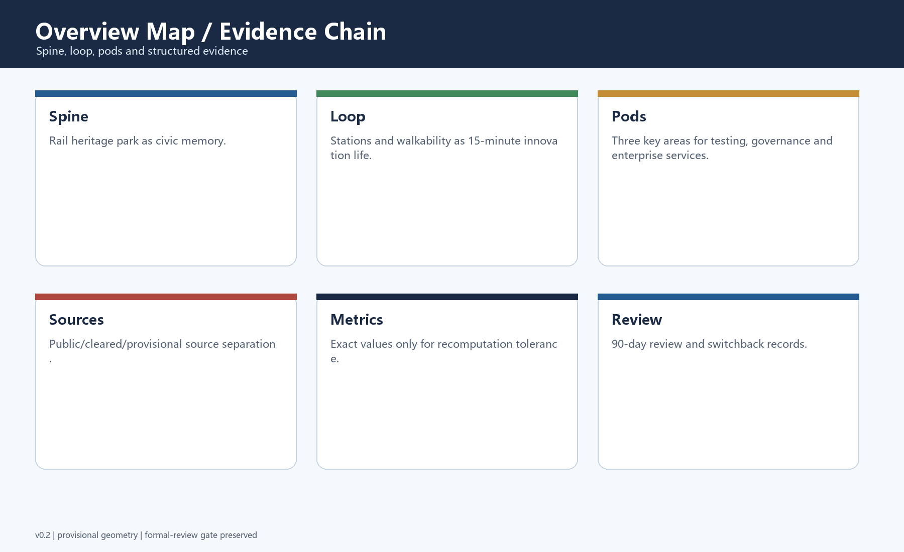
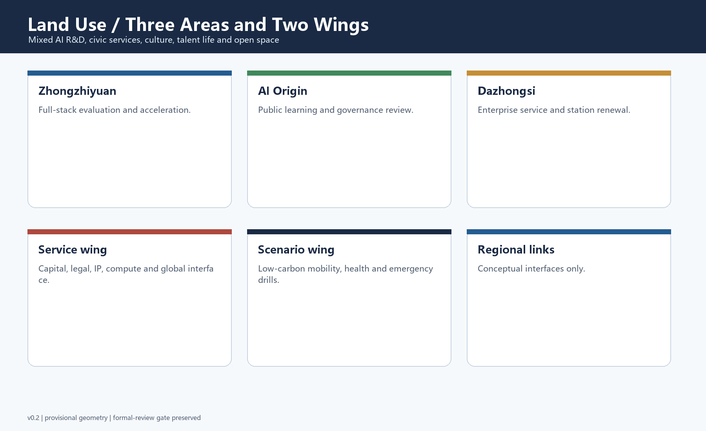
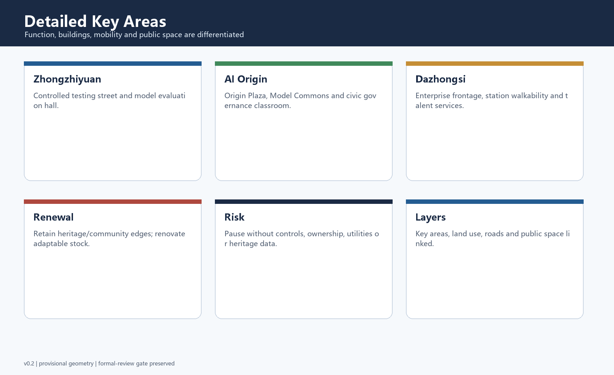
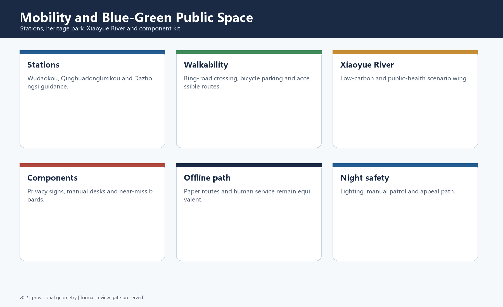
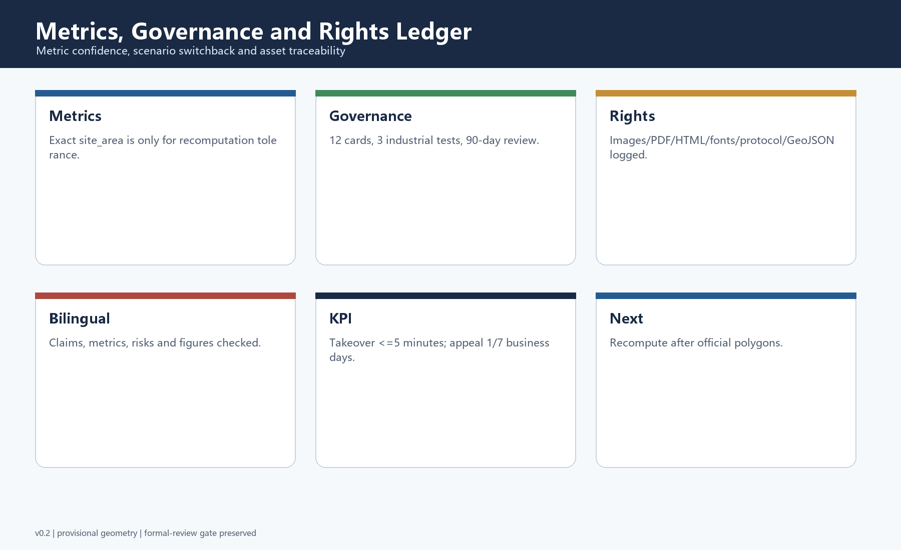

# Jing-Zhang Civic Spine: An AI Civic Innovation Corridor on a Century-Old Railway Heritage Axis

## Design Basis and Source List

This English file is the display translation of `proposal.md`. The primary package is based on the public project brief, the agent taskbook, the source registry, the provisional geometry package, and the local validation scripts supplied by the repository. The submission treats official announcements and cleared taskbook content as design requirements, while the current boundary and key-area polygons remain provisional constraints rather than statutory redlines. The evidence chain is split between human-readable narrative, GeoJSON layers, metrics, matrices, drawings, and offline HTML so reviewers can read the idea first and then recompute claims from structured files.

The design is named **Jing-Zhang Civic Spine**. It uses the railway heritage corridor as the memory spine, the AI innovation ecosystem as the productive engine, and civic public space as the shared interface. The proposal uses registered public or cleared sources only, marks missing regulatory controls as pending, and avoids any claim that provisional geometry can replace official survey or planning data.

## Three-Level Scope Framework

The proposal is organized through three nested scopes. The coordinated research area addresses the 43.6 square kilometer strategic ecosystem: universities, research institutes, enterprises, station areas, heritage assets, and cross-district innovation flows. The overall design area focuses on the 11.4 square kilometer corridor around the Jing-Zhang Railway Heritage Park and nearby urban and industrial districts. The detailed key-area layer focuses on Zhongzhiyuan AI Autonomous Innovation Acceleration Area, Beijing AI Origin Community, and Dazhongsi AI Industry Cluster.

Because official polygons are not yet present in the site package, the package uses explicitly marked provisional constraints for generation, visualization, and intake self-check. This limitation does not remove the design value of the proposal, but it does limit precision. When official boundaries are published, the site boundary, key areas, land use, roads, green space, public space, buildings, phasing, and all derived metrics must be recalculated.

## Coordinated Research Area: Industry and Future City Research

At the research-area scale, the corridor should become a world-facing AI innovation ecosystem rather than a traditional office belt. The strategy links three positions: a century-old Jing-Zhang culture belt, an urban AI life-experience belt, and an AI fusion innovation belt. These positions are translated into five functions: full-stack AI autonomy, world-class innovation ecology, AI-plus scenario empowerment, intelligent city vitality, and global AI governance discourse.

The proposal uses international precedents only as transferable mechanisms, not copied forms. Relevant lessons include university-industry adjacency, developer community operations, public testing sandboxes, civic data trusts, transit-oriented innovation districts, accessible public learning spaces, mixed-use talent neighborhoods, and transparent risk governance. These lessons become spatial rules: open interfaces over closed campuses, slow-mobility continuity over isolated landmarks, and operational programming as part of urban design.

## Overall Design Area: Urban Renewal and Regulatory-Plan-Level Urban Design

The overall area is structured as a public AI corridor with three layers. The first layer is a heritage and public-space layer that keeps the railway park legible and active. The second layer is an innovation-production layer that places R&D, testing, exhibition, accelerator, enterprise-service, and talent-community functions along walkable nodes. The third layer is a governance and infrastructure layer that embeds edge-computing rooms, privacy review points, service kiosks, public dashboards, low-carbon mobility, and municipal resilience into ordinary urban blocks.

The package does not claim approved FAR, building height, road redline, land ownership, or municipal engineering conditions. Instead, it proposes a concept-level renewal framework: retain valuable community and heritage interfaces, renovate adaptable industrial and office stock, demolish only when later verified as low-value or unsafe, and introduce new construction as public-facing mixed-use infill.

## Detailed Design of Key Areas

Zhongzhiyuan AI Autonomous Innovation Acceleration Area is positioned as a full-stack testing and acceleration district. It concentrates model evaluation, agent sandboxes, robotics and embodied-intelligence prototyping, responsible AI review, and developer events. Its public-space edge remains open so testing scenes can be observed, explained, and supervised rather than hidden inside a sealed campus.

Beijing AI Origin Community is positioned as the civic and cultural anchor. It combines AI history interpretation, open-source salons, public learning, youth education, civic-service pilots, and community-scale AI governance demonstrations. Dazhongsi AI Industry Cluster is positioned as a mixed enterprise-service and intelligent-native business district connecting station accessibility, renovated commercial frontage, enterprise-service copilots, legal/medical/education AI service pilots, and talent-life amenities.

## AI Innovation Ecosystem, Personas, and AI+ Scenarios

The proposal defines five user personas: frontier researchers, start-up founders, enterprise product teams, local residents and students, and public-service operators. Each persona needs different spatial and governance support. Researchers need evaluation rooms and collaboration interfaces; founders need affordable acceleration space and demonstration channels; enterprise teams need compliance-oriented scenario testing; residents need trustworthy life services; public operators need auditable dashboards and human review workflows.

The scenario system includes walkability copilot, station crowd guidance, micromobility balancing, public-space safety review, heritage interpretation guide, developer hackathon route, enterprise-service copilot, medical-service navigation, education mentor kiosk, legal-service consultation gateway, low-carbon energy dashboard, and emergency drill simulation. At least three are industrial testing scenarios: model-evaluation sandbox, embodied-intelligence street test, and enterprise-service copilot benchmark.

## Land Use, Building Scale, and Retain-Renovate-Demolish Strategy

Land use is organized around a mixed innovation spine rather than single-use zoning. AI research and office space is combined with civic service, culture, education, exhibition, housing-supportive amenities, and public open space. Building-footprint metrics are concept-level calibration values derived from submitted geometry, not confirmed construction quantities. Retain-renovate-demolish decisions should be made through later field survey and official control data.

Retention applies to heritage, active community interfaces, and adaptable structures. Renovation applies to underperforming office, commercial, or industrial stock that can support AI services or maker activity. Demolition and new construction are limited to locations that later prove low reuse value, weak public frontage, or strong strategic need. Any intensity control must wait for official regulatory-planning attachments.

## Transport, Rail, Municipal Infrastructure, and Public Services

The mobility strategy links rail stations, the heritage park, slow streets, public-service nodes, and AI scenario clusters. It addresses Wudaokou, Qinghuadongluxikou, Dazhongsi, North Fifth Ring crossing conditions, bicycle parking, micromobility, station-area guidance, and last-mile pedestrian continuity. The corridor should operate as a legible walkable network rather than a sequence of disconnected technology plots.

Municipal and public-service strategy combines conventional utilities with AI-native infrastructure. Edge computing, sensor management, data minimization, service kiosks, energy dashboards, emergency review rooms, and public feedback interfaces should be embedded in visible and auditable places. The proposal does not use non-public utility drawings; all infrastructure claims remain conceptual until official engineering information is available.

## Blue-Green Network, Public Space, and Urban Character

The blue-green strategy treats the Jing-Zhang Railway Heritage Park as the civic front room of the AI belt. Green and public-space layers improve daily comfort, event capacity, ecological continuity, and public learning. The Xiaoyue River and related open spaces should be used as scenario corridors for low-carbon mobility, public health, outdoor learning, and cultural interpretation, while avoiding over-programming that would weaken everyday accessibility.

Three AI pilgrimage landmarks are proposed as concept nodes: the Origin Plaza for public AI history and open-source culture, the Model Commons for transparent benchmark exhibitions and civic review, and the Future Station Lab for station-area scenario demonstrations. These are not approved buildings; they are design directions combining signage, public programs, exhibition infrastructure, and open data interpretation.

## Renewal Projects, Implementation Policy, and Phasing

Implementation is staged in three phases. The near term focuses on provisional-boundary replacement, public data completion, pilot event programming, slow-mobility gap repair, and low-cost public-space activation. The medium term builds scenario sandboxes, enterprise-service frontage, talent amenities, heritage interpretation, and a repeatable annual AI civic festival. The long term deepens district operations, international collaboration, public governance protocols, and selected construction after professional review.

The project list is organized by type: boundary and data completion, public-space activation, station-area connectivity, adaptive reuse, AI scenario testing, service infrastructure, landmark identity, and long-term governance. Each project should have a spatial location, dependency, lead body, risk statement, public engagement route, and maintenance mechanism before implementation. No funding, procurement, or government commitment is asserted.

## Metrics, Area Recalculation, and Compliance Matrix

Core metrics are site area, building footprint area, green ratio, public-space ratio, and key-area count. The site-area value is recalculated from the submitted provisional site boundary, while green and public-space ratios are derived from submitted concept layers. These metrics are useful for internal consistency and review intake, but they are not official planning indicators. FAR, height, building density, setback, and statutory green controls remain unknown.

The compliance matrix links official task requirements, agent taskbook requirements, drawings, geometry layers, metrics, assumptions, and self-check items. The standard matrix covers the project announcement, the agent open-call taskbook, urban-design management measures, control detailed planning guidance, and land-use classification references. The design-depth matrix confirms coverage of diagnosis, scope, spatial structure, land use, intensity, massing, renewal categories, transport, municipal infrastructure, public space, detailed design, phasing, metrics, and risk.

## Risk, Copyright, and Compliance

The package excludes secrets, personal information, commercial map tiles, non-public drawings, and unverified official claims. Images are generated locally from submission concepts and do not rely on remote assets. The offline HTML files contain no remote scripts, forms, iframes, or network calls. The copyright statement records community-display-only licensing and requires later confirmation for any reused external material.

The main risk is data precision. Provisional boundaries are adequate for concept generation and intake self-check, but not for statutory review, engineering design, or precise area scoring. The next iteration should replace provisional polygons with official data, add verified existing-building and utility information, refine road and slow-mobility geometry, and invite professional planners, transport engineers, heritage experts, and public-service operators to review the assumptions.

## References

- Beijing Municipal Commission of Planning and Natural Resources, Haidian Branch: Centennial Jing-Zhang AI Innovation Belt urban design open call prequalification announcement.
- Repository site package: design brief, allowed design space, source registry, provisional boundaries, standards references, and validation scripts.
- Cleared agent taskbook excerpt for the open-source AI urban-design call.
- Ministry-level urban design, control detailed planning, and land-use classification reference snapshots included in the site package.
- Generated GeoJSON, metrics, matrices, HTML, figures, and PDF drawings in this submission directory.

## v0.2 Review Response Addendum

This revision responds to the requested changes. It adds a taskbook delivery checklist, brand and naming system, six global reference mechanisms, scenario governance matrix, three industrial testing scenarios, three landmark concepts, public-space component kit, annual operating calendar, rights-clearance ledger, bilingual equivalence check, and explicit inclusion responses.

The English name is **Jing-Zhang Civic Spine**. The brand direction is a double rail line, open-source nodes, and civic review brackets. The three-area/two-wing loop links Zhongzhiyuan, AI Origin, Dazhongsi, the Zhongguancun service wing, and the Xiaoyue River scenario wing. Regional links are conceptual interfaces only.

The scenario cards follow a Switchback Protocol-inspired governance contract: green for normal operation, yellow for controlled pilot, red for rollback to the last stable state with public explanation. Human takeover target, appeal handling, 90-day review, trigger conditions, recovery conditions, and evidence logs are recorded per card.
