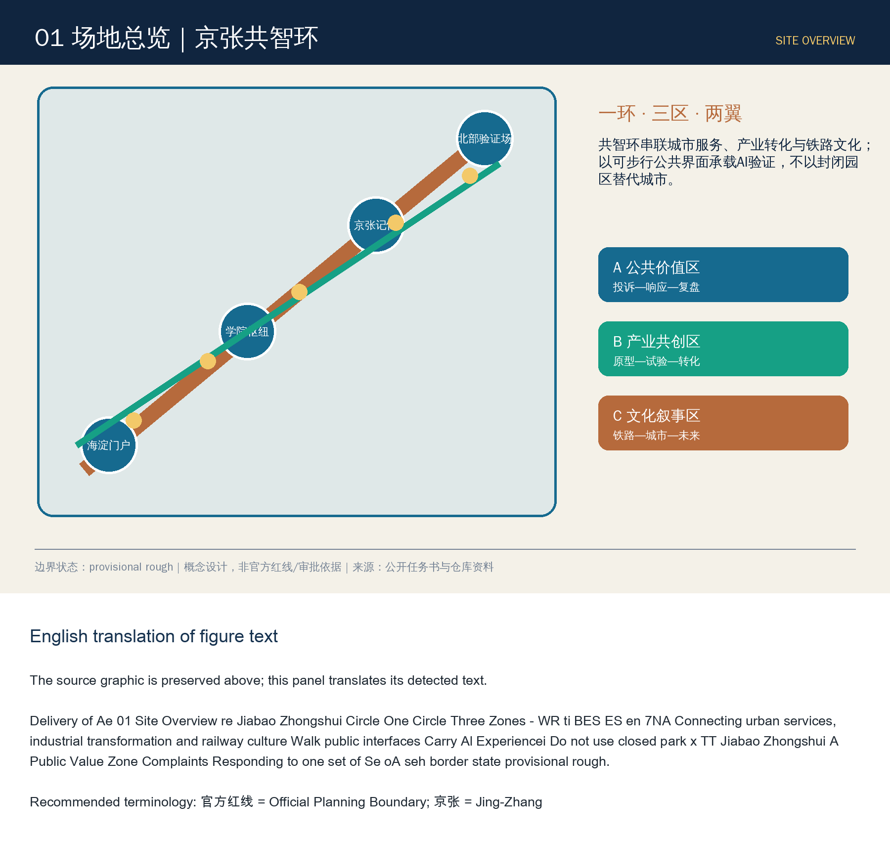
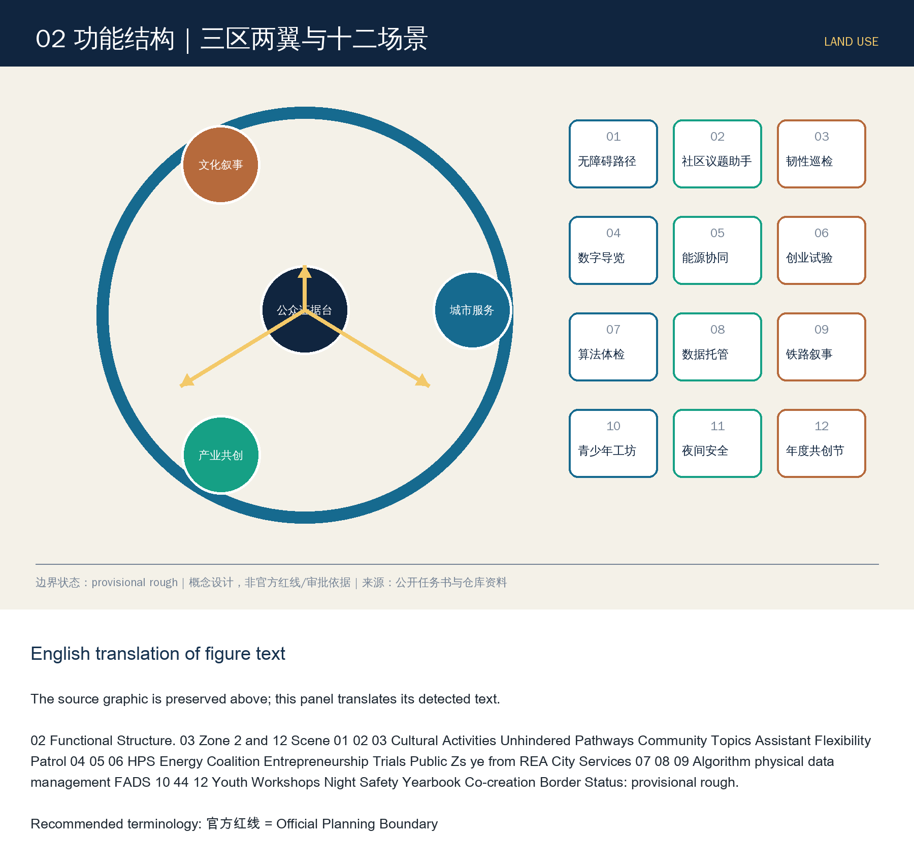
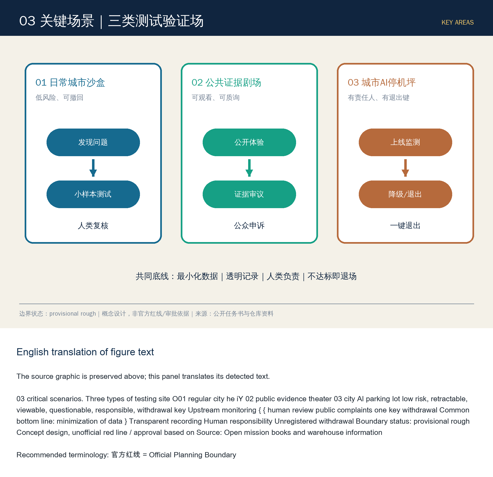
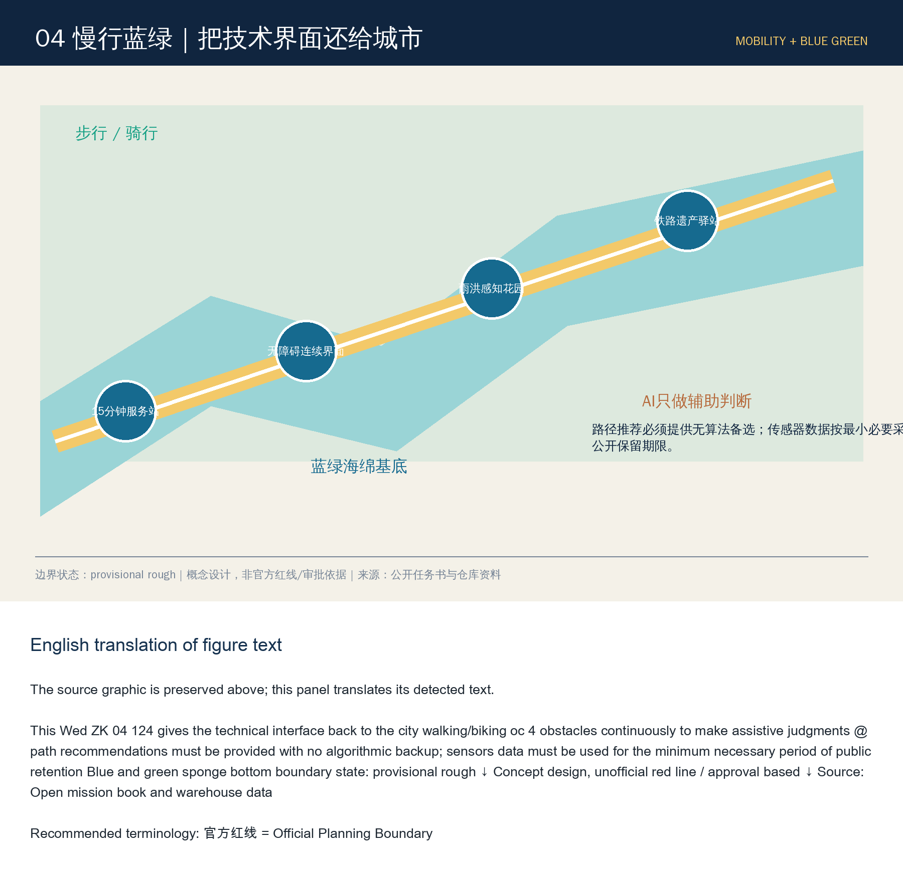
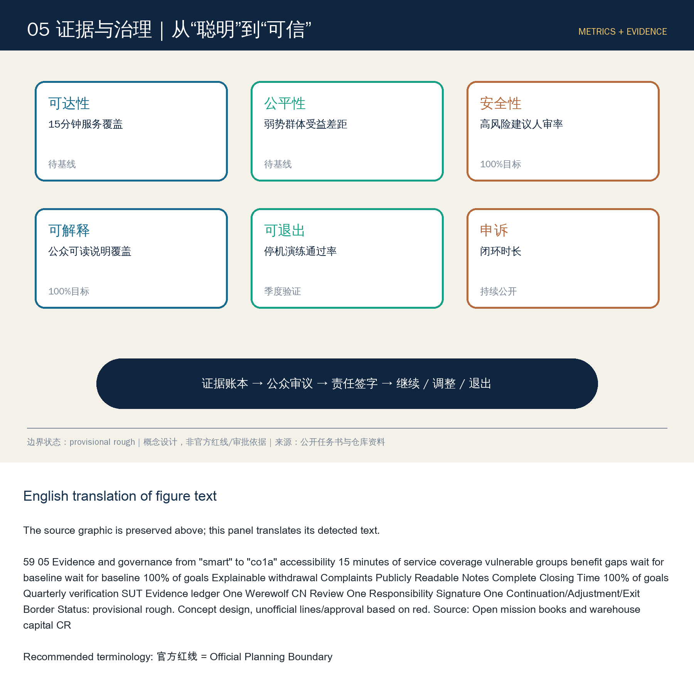

# Jing-Zhang Civic AI Loop

**English Name: Jing-Zhang Civic AI Loop; Slogan: Let Every Citywide Smart Move Undergo Public Scrutiny.**

## Design Basis and Source List
This outcome is an Open Co-Creation concept Urban Design, not a substitute for official planning, government approval, or engineering design. It is based on official announcements, agent task books, public site packages, fact navigation packages, and warehouse registration data [source:OFFICIAL-ANNOUNCEMENT] [source:AGENT-TASKBOOK] [source:SITE-PACKAGE] [source:PROCESSED-FACT-PACK] [source:SOURCE-REGISTRY]. The current SITE_BOUNDARY and three KEY_AREA sources are from the warehouse provisional geometry [source:BOUNDARY-SOURCE] [source:KEY-AREA-SOURCE]: they are only for generation, discussion, display, and entry self-check, not for official redlining, and do not support conclusions on Floor Area Ratio, height, demolish–renovate–retain strategy, ownership, road redlines, or precise area; a full recalculation [depth:metrics_recalculation] is required after the official drawings are released. (Demolish–Renovate–Retain Strategy)

Method as a five-step cycle "Evidence—Hypothesis—Design—Metrics—Review": each strategy is linked to its source, spatial layer, reviewable metrics, responsible roles, and exit conditions. All urban AI follows the principles of minimal data, opt-in, appealable, human final review, logging, and independent evaluation. [standard:PROJECT-OFFICIAL-ANNOUNCEMENT] [depth:existing_conditions_diagnosis]

## Three-Level Scope Framework
"Jing-Zhang" is not about affixing an AI label to traditional parks and gardens, but rather a **public value validation loop** along the historical Jing-Zhang line: problems are raised by citizens and businesses, prototypes are developed in three zones, elements and scenarios are obtained in the two wings, and they enter the public test belt for small-scale validation. The final decision on expansion, revision, or exit is based on the public results.

- **One Belt**: The public main axis of the Jing-Zhang Heritage Park "walkable, learnable, testable, and reviewable."
- **Three Zones**: Zhongzhiyuan is responsible for full-stack tools and security evaluations; the AI Origin community is responsible for research—entrepreneurship—community co-creation; Dazhongsi is responsible for intelligent native consumption, business, and public experiences.
- **Wings**: The Zhongguancun Technology Services Wing configures capital, intellectual property, talent, and international services; the Xiao Yuehe Scenographic Wing accommodates transportation, ecology, health, and controlled testing of robots.
- **Four Phases**: Identify Problems → Sandbox Validation → Public Experience → Evidence Review, forming a reversible Urban Renewal mechanism.

Spatial evidence can be found in [data:geometry/site_boundary.geojson#SITE-001], [data:geometry/key_areas.geojson#PROV-KEY-001], and [data:geometry/roads.geojson#ROAD-001]. Overall control is not about large-scale demolition and reconstruction, but rather about prioritizing the activation of the ground floors of existing buildings, rail nodes, under bridges, and corner spaces; any bridge and tunnel, underground space, cultural relic, and traffic solutions must undergo specialized argumentation. [depth:three_level_scope_framework] [depth:overall_spatial_structure]

### Visual Identity
Logo direction is "railway double tracks + closed verification loop + open nodes," composed of deep track blue, verification green, and historical bronze colors. Character identifiers are independently drawn and do not use corporate trademarks or restricted fonts. Signage is divided into three sets: cultural brown, public service blue, and experimental status yellow/green, and should not be mixed with the main One Belt Logo.

## Coordinated Research Area: Industry and Future City Research
The Co-Intelligence Ring translates industrial policies into eight shareable elements: computing power vouchers, trusted data spaces, model evaluation, open-source legal affairs, first-test scenarios, patient capital, international talent services, and public procurement evidence. Zhongzhiyuan builds a joint validation stack for "toolchain—model—agent—robot"; AI Origin community forms a short loop of university labs, open-source communities, startup teams, and resident issues; Zhongguancun Technology Services Wing provides intellectual property, standards, financing, and internationalization services. All support is offered as mechanism suggestions and does not represent fiscal, recruitment, or corporate commitments.

### 6 Case Studies for Benchmarking and Transferable Key Points
|Case|Learning Points|Jing-Zhang Translation|Not to be Replicated|
|---|---|---|---|
|Smart Nation / AI Verify in Singapore [source:CASE-AI-VERIFY]|Public Interest Objectives, Standardized Testing|City AI Public Evaluation Protocol|National Identity and Data Conditions|
|Barcelona 22@ [source:CASE-22AT]|Mixed Update of Former Industrial Zones, Innovation Network|Railway Heritage + Progressive Activation of Existing Spaces|Large-Scale Real Estate Update|
|Eindhoven Brainport [source:CASE-BRAINPORT]|Entrepreneurship—Academia—Government Collaboration|Three Zones and Two Wings Task-Based Alliance|Single Dominant Leader Dependence|
|Controversies over Digital Governance of Toronto Waterfront [source:CASE-QUAYSIDE]|Learning from Failures in Data Governance and Public Consent|Data Impact Assessment, Exit, and Appeals|Platform-Dominated Governance|
|Boston Kendall Square [source:CASE-KENDALL]|High-Density Research and Development Conversion and Public Space|Origins Community Pedestrian Innovation Network|High-Rent Exclusion Effect|
|Shenzhen Nan Mountain High-Tech Park [source:CASE-NANSHAN]|industrial chain, capital, and rapid scenario iteration|Zhongzhiyuan full-stack validation + Dazhongsi market feedback|speed replacing safety assessment|

Align this only as a method background, not as support for formal spatial control. Formal space and task conclusions shall still be based on the warehouse registration documents. Ecology KPI Use "verifiable rather than wishful": open testing task count, independent evaluation coverage, public issue closure rate, small and medium team adoption rate, accessible participation rate, accident/appeal closure duration, and open-source result reuse count; baseline missing items marked as pending investigation, and do not fabricate output and investment values.

## Overall Design Area: Urban Renewal and Regulatory-Plan-Level Urban Design
The overall design is structured around a framework of "Railway Cultural Spine + Public Value Ring + Horizontal Seam," preserving reusable existing elements, enhancing continuous pedestrian and cycling paths and public services, and only placing new developments after official control plans, ownership, cultural heritage, and municipal conditions are confirmed. The four categories of conceptual land uses will carry out innovative research and development, mixed services, cultural public functions, and blue-green open spaces [data:geometry/land_use.geojson#LU-001]; the building scale will only recalculate the conceptual base [data:geometry/buildings.geojson#BLDG-001] [metric:building_footprint_area_sqm], without deriving statutory capacity. [standard:MOHURD-CONTROL-DETAILED-PLANNING] [depth:land_use_layout] [depth:development_intensity_controls]

Update objects are divided into retention for reuse, adaptive renovation, conditional demolition, and reversible new construction: in the absence of a current building inventory, specific demolition is not determined; height, massing, and the skyline are directed towards the preservation of low-rise public interfaces and the railway line of sight [depth:height_massing_character] [depth:retain_renovate_demolish]. Municipal infrastructure adopts concepts of demand-side reduction, distributed energy, and edge-side computing, with engineering capacity awaiting specialized verification [depth:municipal_new_infrastructure].

## Detailed Design of Key Areas
- **Zhongzhiyuan AI Independent Innovation Acceleration Area** [data:geometry/key_areas.geojson#PROV-KEY-001]: garden-type validation stack, with shared toolchain, model evaluation, and security experiments on the ground floor; pedestrian-friendly connections to Qinghe, with robot test speed limits, time limits, and the option for human take-over.
- **Beijing AI Origin Community** [data:geometry/key_areas.geojson#PROV-KEY-002]: proximity school conversion zone, forming a pedestrian innovation network through small blocks, shared ground floors, open-source domes, and living services.
- **Dazhongsi AI Industry Cluster** [data:geometry/key_areas.geojson#PROV-KEY-003]: Urban-type intelligent economic district, integrating the quadrants with commercial activities, data element theater, and public experience to avoid closed park-like development.

Three areas are provisional polygons, expressing scale, the Demolish–Renovate–Retain Strategy, road interfaces, and building forms only in terms of direction; the areas will be recalculated after the official boundaries are replaced, including re-evaluating areas, conflicts, and accessibility [metric:key_area_count] [depth:three_key_area_detailed_design]. (Official Boundary)

## AI Innovation Ecosystem, Personas, and AI+ Scenarios
This section expands on the user, scenario, testing, and operations for the intelligent agent open call, rather than treating AI as a decorative label [source:AGENT-TASKBOOK] [standard:PROJECT-AGENT-OPEN-CALL-TASKBOOK].
Six user categories: commuters, elderly/disabled individuals, students and research personnel, startup teams and small and medium-sized enterprises (SMEs), tourists and families with children, and grassroots operators. Each scenario must disclose its purpose, data, model limitations, human point of contact, appeal mechanism, and conditions for deactivation.

### 12 scene cards
|#|Scenes-Spaces-Operations|Minimum Data and Human Boundaries|Success Metrics|
|---|---|---|---|
|01|Accessibility Path Assistant—Fully Integrated Slow-Travel Network—Community Co-Testing|Anonymous Road Conditions; User Confirmation of Route|Coverage of Accessible Routes, Error Correction Time|
|02|Crowding Management Recommendations—Node Plaza—On-Site Coordination|Aggregate foot traffic; manual commands|Wait duration, false alarm rate|
|03|Multilingual Cultural Tour—Railway Site—Curatorial Review|No Identity Verification; Historical Accuracy Review|Correction Rate, Understandability|
|04|Community Service Navigation—Yuan Dian Community—Block Service Desk|Voluntary user input; human backup|One-stop completion rate|
|05|Small and Medium Enterprise Compliance Assistant—Technology Service Wing—Professional Review|Enterprise Authorization Documents; Expert Final Review|Adoption and Rejection Rate|
| 06 | Open-source Computing Power Scheduling—Zhongzhiyuan—Resources Committee | Task metadata minimized | Small to medium-sized teams availability |
|07|Low-Speed Robot Delivery—Xiao Yuehe Wing—Time Window Restriction|No Face Recognition; Remote Takeover|Zero Harm, Takeover Rate|
|08|Public Space Microclimate Recommendations—Park Nodes—Garden Review|Environmental Sensing; No Personal Information Collected|Heat Comfort Improvement|
| 09 | Age-Friendly Health Services Navigation—Community Nodes—Medical Referral | No diagnosis; artificial referral | misleading rate, referral completion rate |
|10|Consumer Services Translation—Dazhongsi—Merchant Co-Governance|End-side Translation; No Image Pricing|Complaint Rate, Response Time|
|11|Public Safety Retrospective Assistant—Operations Center—Post-Event Review|Masked Incidents; Prohibit Automatic Enforcement|Retrospective Closure Rate|
|12|Summary of Public Issues—Co-Intelligence Forum—Random Review|De-identified Text; Public Random Review|Coverage of Views, Fair Error|

### Class  Industry Testing and Verification Site
A "Model on Street Before" Evaluation Field: Bias, Illusion, Robustness, Privacy, and Accessibility Testing; B "Robot Slow Coexistence" Field: Restricted Area, Speed, Time Period, Remote Takeover, and Accident Exit; C "Cross-Departmental Intelligent Agent Joint Testing" Field: Inter-departmental Process Sandbox, Using Synthetic/Privileged Data Only, No Production System Involvement. Testing Status Indicated by Green/Yellow/Red Lights, Any Yellow/Red Status Prohibited from Being Packaged as Deployed.

## Land Use, Building Scale, and Retain-Renovate-Demolish Strategy
The concept land use is composed of four complementary categories—innovation and mixed use, public services, cultural display, and blue-green open spaces—avoiding the simplification of R&D office spaces; the layer area is calculable, but the planning ratio and Floor Area Ratio are pending Official Boundary and control plan determination [data:geometry/land_use.geojson#LU-002] [metric:floor_area_ratio] [standard:MNR-LAND-USE-CLASSIFICATION-GUIDE]. At this stage, the building layer only expresses a transformation base controlled by a single participant [data:geometry/buildings.geojson#BLDG-001]: prioritize "retaining structure, modifying the first floor, and supplementing accessibility"; demolition must undergo safety, cultural heritage, carbon emissions, and public procedures, while new additions should adopt removable small-scale elements. [standard:MOHURD-ARCH-DESIGN-DEPTH-2016]

## Transport, Rail, Municipal Infrastructure, and Public Services
Collaborative Loop prioritizes walking, cycling, and public transit connections, linking three zones with a conceptual slow-moving spine that horizontally stitches existing road discontinuities [data:geometry/roads.geojson#ROAD-001] [depth:traffic_rail_slow_parking]. Parking is directed towards shared, staggered, and peripheral conversion as a deepening focus; new bridges and tunnels are not included as commitments. Public services are embedded in 15-minute nodes, including accessibility consultation, talent services, open-source legal services, and human fallback windows; New Infrastructure is implemented with end-side priority, minimal data collection, distributed energy systems, and traditional municipal collaboration, with capacities and sites awaiting specialized review [depth:municipal_new_infrastructure].

## Blue-Green Network, Public Space, and Urban Character
Conceptual blue-green base consists of the Jing-Zhang Heritage Park, Qinghe/Xiaoyuehe connectivity, and pocket gardens [data:geometry/green_space.geojson#GREEN-001] [depth:blue_green_public_space]; the actual shoreline, ecological, and cultural heritage boundaries await official documentation for verification.
Public Space adopts a three-tiered structure of "Continuous Slow-Travel Spine—Transverse Seam—Pocket Verification Station": the park's main axis continuously organizes walking, cycling, resting, and cultural activities; transverse seams prioritize improving existing cross-street connections and accessibility, with new bridges and tunnels only serving as a concept for specialized research; verification stations are embedded in existing spaces using movable and disassemblable components [data:geometry/public_space.geojson#PUBLIC-001] [metric:public_space_ratio].

1. **AI Origin·Open Source Dome**: An accessible open-source achievement annulus and real-time evaluation wall, displaying data sources, versions, failure records, and contributors; it does not display commercial rankings.
2. **Jing-Zhang Centennial · Time Sequence Station**: Using mechanical railway signal language to connect 1909, the innovative era, and the AI future, all historical facts are reviewed and approved by professional institutions.
3. **Collaborative Forum:** Citizens, developers, and operators collectively deliberate on the urban AI circular space. It features a quiet room, accessible seating, a child's perspective platform, and an artificial appeal window.

Dazhongsi explores a new paradigm that is "intelligent and native but not devoid of human touch": explainable product advisors, cross-linguistic services, a robot night resupply sandbox, an AI creative workshop, and digital accessibility certification. Component library includes: dual-faced information kiosks (services/risk), end-side interaction stations, deployable robot docking stations, low-light sensing poles, rain garden seating, and contributor plaques. Components must not obstruct cultural heritage elements, fire safety, tactile paving, or traffic sightlines. The honor system only records verifiable contributions: open-source code, public data, accessibility fixes, public issue loops, and long-term maintenance.

## 5. A Time-Space Narrative of Three Cultures (agent.5)
Narrative is not a "railway + code" decorative collage, but rather three shared values: the autonomous engineering and public connection of the Jing-Zhang Railway, the open experimentation and knowledge transformation of Zhongguancun, and collaborative verification in the AI era. The route is divided into three acts: **starting from autonomous construction — iterating through open innovation — jointly responsible for human-centric intelligence**.

Signage employs sleeper rhythms, coordinate scales, and verification stamps; cultural identifiers narrate "time and place," while the overall logo speaks to "collective validation," with strict layering. International communication text: *From the first railway engineered by China to civic AI tested with the public — Jing-Zhang turns innovation into a shared, accountable urban capability.* All historical images, fonts, portraits, and identifiers use only custom-made, public domain, or explicitly licensed materials.

## Renewal Projects, Implementation Policy, and Phasing
The project list is categorized into four types: reversible prototypes, public evidence facilities, slow-stitching, and revitalization of existing ground floors. Conceptual phased layers document recent pilot projects, thresholds, and exit conditions [data:geometry/phasing.geojson#PHASE-001] [depth:renewal_project_list] [depth:phasing_implementation], which do not represent government investment, recruitment, or approval arrangements.
The annual rhythm is centered on real urban issues rather than exhibition traffic:
- Spring "Open Call for Urban Issues": Residents and grassroots operators post tasks, forming public issue lists;
- Summer "Model on the Street Challenge": Conduct Red Team and Reconciliation Exercises Focusing on Safety, Equity, and Accessibility;
- Fall "Jing-Zhang Urban AI Week": Open Demonstrations, International Dialogue, Failure Case Exhibits, and Professional Reviews;
- Winter "Public Value Review Meeting": announce indicators, appeals, incidents, deactivations, and next year's budget recommendations.

The developer community implements task claiming, mentor review, version tracking, maintenance commitments, and permanent attribution to contributors; testing scenarios undergo a six-step process of "proposing—ethics/safety pre-review—small-scale trial—public feedback—independent evaluation—expansion/revision/exit." International cooperation only outputs open-source licenses, evaluation datasets, and reusable components, without providing unauthorized data.

## 7. Implementation Pathway and Governance
|Stage|Low Regret Actions|Threshold for Proceeding to the Next Stage|
|---|---|---|
|0—6 months|official documentation completion, accessibility audit, issue collection, inventory of existing spaces|source clearance, public representative involvement, risk register completion|
|6-18 months|3 reversible prototypes, public evaluation protocol, contributor system|Independent evaluation passed, major risks allow exit|
|18—36 months|Three Zones and Two Wings Integration, Annual Activities, Open Component Reuse|Continuous Improvement of Public Value Indicators|
|36 months later|after going through the legal procedures and specialized argumentation|final judgment by the human professional team|

The governance structure consists of a Public Value Committee (including resident and accessibility representatives), a Technical and Safety Group, a Space and Heritage Group, an Independent Review Group, and an Operations Secretariat. High-impact decisions are prohibited from automation; outputs that involve health, safety, rights, law enforcement, or resource allocation must have human accountability. Data is not collected by default; when collection is necessary, it is minimized, time-limited, purpose-separated, revocable, and subject to audit.

## Metrics, Area Recalculation, and Compliance Matrix

The spatial metrics [metric:site_area_sqm] [metric:green_ratio] [metric:public_space_ratio] are merely the machine-calculated results based on the provisional geometry, not the planning control indicators. The scheme truly commits to the evaluation criteria:

- Public Interest: Issue Closure Rate, Participation Rate of Vulnerable Groups, Completion Rate of Accessible Tasks;
- Trusted AI: Independent Evaluation Coverage, Serious Defect Block Rate, Human Takeover Rate, and Time to Close Appeals;
- Innovative Ecology: Number of Open Tasks, Participation Rate of Small and Medium Teams, Number of Repurposed Outcomes, Number of Cross-Zone Collaborations;
- Spatial Experience: Proportion of Continuous Access Nodes, Thermal Comfort Feedback, Coverage of Public Activity Periods;
- Operational Resilience: Maintain responsibility assignment rate, renewal review rate, and deactivation drill pass rate.

Baseline established in the initial census; do not fill in false target values until real data is available. Risk priorities: 1) provisional boundaries and statutory conditions missing — replace with official data after package acquisition, recompute with EPSG:4548; 2) algorithmic bias and digital exclusion — offline or manual alternatives, group testing, and accessible co-testing; 3) monitoring expansion — prohibit default deployment of facial recognition, data impact assessment, and sunset clauses; 4) robot safety — physical isolation, speed limits, remote take-over, and stop on accident; 5) cultural heritage and engineering conflicts — specialized arguments for cultural heritage, fire safety, traffic, and municipal services; 6) operational abandonment — assign responsibility for each scenario, assume budget sources, maintain SLA, and develop exit plans.

## Risk, Copyright, and Compliance
The current constraint layers are empty, clearly indicating that ownership, cultural heritage, municipal, fire safety, flood control, and road right-of-way constraints have not yet been obtained. Misreading this as "no constraints" is incorrect [data:geometry/constraints.geojson#CONSTRAINTS-PENDING] [depth:risk_missing_data] [source:SOURCE-REGISTRY].
- Five Core Maps: Overall Evidence and Concept, Three Zones and Two Wings Structure, Roles of Three Key Areas, Slow-Travel Blue-Green and Test Ring, Indicator Governance Loop.
- Machine-readable: geometry, metrics, assumptions, sources, compliance/standard/depth matrices.
- This report, along with the offline visual, A3 booklet, and A0 poster.
- Copyright: Text, charts, and graphics are generated by this collaborative agent; third-party facts are cited only, and no unauthorized images, fonts, trademarks, or imagery of individuals are embedded.

This plan responds to three key positioning, five major functions, the Three Zones and Two Wings, and agents.1—agents.6. Its core is not to predict an "autonomous city," but to establish a system and spatial infrastructure that allows city AI to first prove its value in real Public Spaces, then be gradually rolled out, continuously subject to public oversight, and always available for exit. Human and professional teams retain the final judgment.

## References
- [source:OFFICIAL-ANNOUNCEMENT] Official Pre-Qualification Announcement.
- [source:AGENT-TASKBOOK] Excerpt from Open Call Task Book for Global Agents.
- [source:SOURCE-REGISTRY] Warehouse Public Documentation Registry.
- [standard:MOHURD-URBAN-DESIGN-MEASURES] Urban Design Management Measures Local Snapshot.
- [standard:MOHURD-CONTROL-DETAILED-PLANNING] Regulatory Detailed Planning Compilation and Approval Method Local Snapshot.
- [standard:MNR-LAND-USE-CLASSIFICATION-GUIDE] Local Snapshot of the Land and Sea Use Classification Guide.
