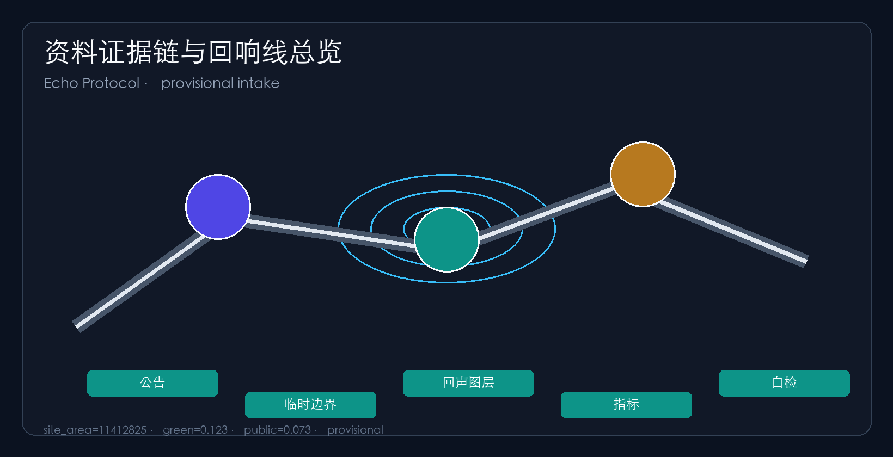
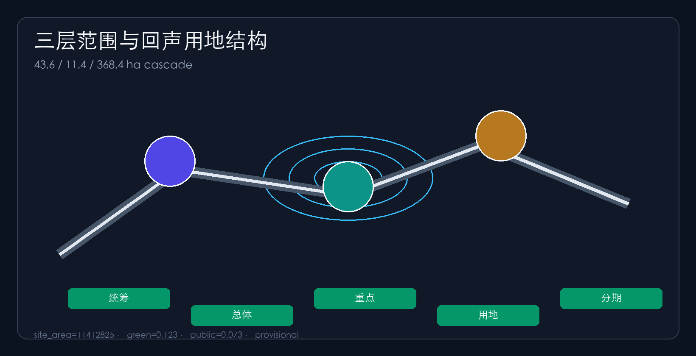
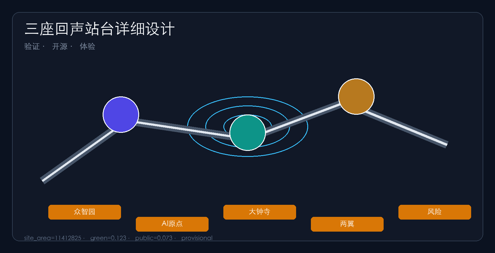
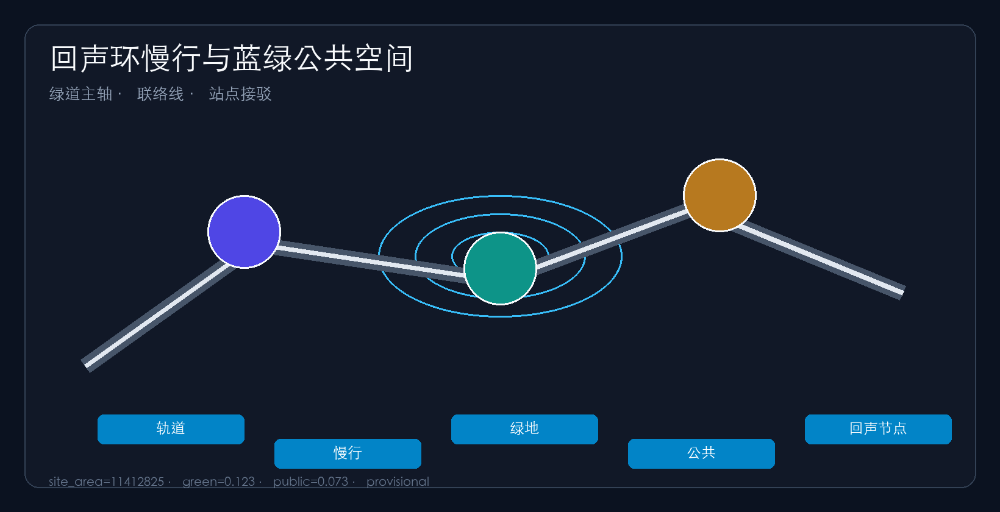
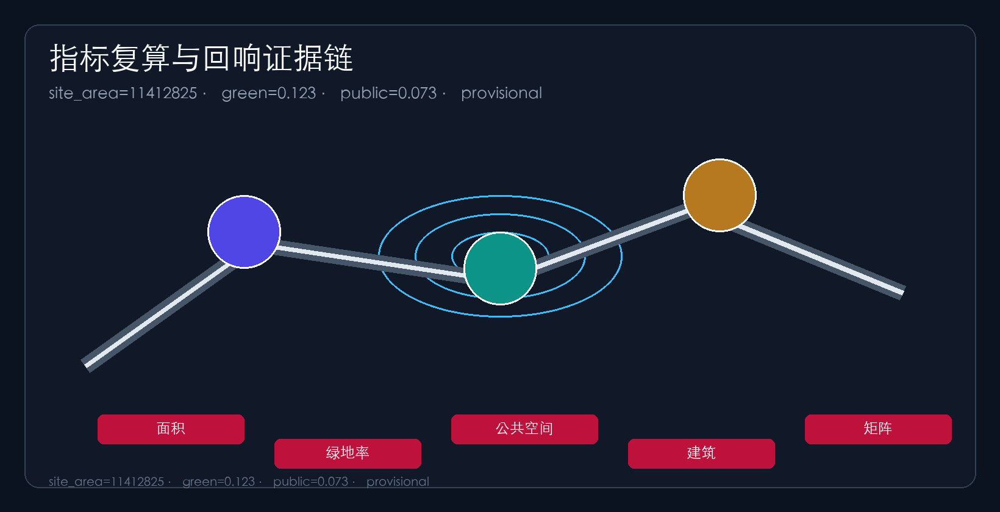

# THE ECHO LINE

## Design Basis and Source List

This package uses the official prequalification notice for three-level scope, three key areas and design tasks [source:OFFICIAL-ANNOUNCEMENT], and the agent open-call taskbook for three positionings, five functions, three-areas/two-wings and agent.1–agent.6 [source:AGENT-TASKBOOK]. Machine-readable inputs live in `brief/site-package/` [source:SITE-PACKAGE] with navigation via `data/processed/agent_fact_pack.md`.

Official SITE_BOUNDARY and KEY_AREA polygons are missing, so provisional geometry from `provisional_boundaries.geojson` is used [source:BOUNDARY-SOURCE] [source:KEY-AREA-SOURCE]. Submitted boundaries are `provisional_constraint` with `official_boundary=false` [data:geometry/site_boundary.geojson#SITE-001]. Organizer data gaps do not block content scoring; recalculate after official polygons. Areas are recomputed in EPSG:4548.

## Three-Level Scope Framework

Research (~43.6 km²), overall design (~11.4 km²) and key areas (~368.4 ha) cascade into land use, roads, green/public space, buildings and phasing layers [source:OFFICIAL-ANNOUNCEMENT] [depth:three_level_scope_framework] [depth:overall_spatial_structure].

| Level | Area | Question | Echo Line answer |
| --- | --- | --- | --- |
| Research | 43.6 km² | Ecosystem & future city | Echo Protocol deploy–return–audit loop [data:geometry/land_use.geojson#LU-001] |
| Overall design | 11.4 km² | Renewal depth | One belt, three cores, echo loop [data:geometry/roads.geojson#ROAD-001] |
| Key areas | 368.4 ha | Detailed design | Three echo stations: verify / open-source / experience [data:geometry/key_areas.geojson#PROV-KEY-002] |

## Coordinated Research Area: Industry and Future City Research

For agent.1, the concept is **THE ECHO LINE**: the heritage park is a two-way public innovation line—upstream runs deploy models and services; downstream runs must return public echoes: slow-mobility repair, open-source artifacts, skills, culture and audit logs [source:AGENT-TASKBOOK] [depth:overall_spatial_structure]. Naming: 京张回响线 / THE ECHO LINE; Echo Station, Echo Loop, Echo Protocol. Visual identity: dual arrow of rail soundwave + echo waveform in rail grey, echo teal and Zhongguancun red.

For agent.2, six transferable mechanisms from global cases [source:AGENT-TASKBOOK]: campus–park–street stack; open-source + safety evaluation; scenario openness with data minimization; energy–compute–model corridor as a mechanism reference only; talent + transfer services; international demo/dev-festival branding. All are concept references, not commitments. Future-city form requires explainable, pauseable, rollbackable governance alongside productivity [depth:metrics_recalculation].

## Overall Design Area: Urban Renewal and Regulatory-Plan-Level Urban Design

Regulatory-plan urban design depth [standard:MOHURD-CONTROL-DETAILED-PLANNING] [depth:land_use_layout]: identify breaks, insert echo interfaces, stitch slow mobility, reserve audit nodes. Land-use partitions cover the submitted boundary [data:geometry/land_use.geojson#LU-001]. Building footprints are concept-level; FAR/height remain unknown pending controls. Mobility uses greenway spine, east–west connectors and station shuttles.

## Detailed Design of Key Areas

Detailed design depth for three key areas [depth:three_key_area_detailed_design]: Zhongzhiyuan as **Verification Echo Station** [data:geometry/key_areas.geojson#PROV-KEY-001]; AI Origin as **Open-Source Echo Station** [data:geometry/key_areas.geojson#PROV-KEY-002]; Dazhongsi as **Experience Echo Station**. ZGC service wing returns capital/IP echoes; Xiaoyuehe wing returns living-scenario echoes.

## AI Innovation Ecosystem, Personas, and AI+ Scenarios

Five personas [depth:existing_conditions_diagnosis]. For agent.3, ten scenario cards [metric:scenario_node_count]: echo launch hall; pauseable agent sandbox; slow-mobility echo diagnosis; talent echo concierge; safety governance corridor; campus-enterprise lounge; data-element theatre; low-carbon compute depot; memory echo trail; global AI echo week. ≥3 industry test scenarios. Concept only .

## Land Use, Building Scale, and Retain-Renovate-Demolish Strategy

Land use follows national classification guidance [standard:MNR-LAND-USE-CLASSIFICATION-GUIDE]. `geometry/land_use.geojson` partitions the submitted boundary without gaps: AI R&D along the northern spine, education/research next to campuses, the Jingzhang heritage green belt in the middle, industry-service and cultural exchange around Dazhongsi, living/community uses to the east, plus flexible reserve land [data:geometry/land_use.geojson#LU-001]. Zone counts come from the layer [metric:land_use_zone_count].

Building strategy prioritizes retain and renovate over new build. Without surveyed buildings, ownership and controls, retain-renovate-demolish remains a method and checklist rather than parcel demolition conclusions [depth:retain_renovate_demolish]. Building footprint area is recomputed from concept footprints in `geometry/buildings.geojson` [metric:building_footprint_area_sqm]. FAR, height and setbacks stay unknown pending official controls [metric:floor_area_ratio]. After official redlines and regulatory controls arrive, land-use partitions, building scale and RRD lists must be fully recalculated.

## Transport, Rail, Municipal Infrastructure, and Public Services

The mobility strategy answers the notice requirements for rail-station integration, micro-circulation, slow-mobility breaks and external access [standard:PROJECT-OFFICIAL-ANNOUNCEMENT]. A Jingzhang greenway spine runs north–south; east–west connectors stitch campuses and parks; station-access cross axes serve Wudaokou and Dazhongsi; ring-road barriers host “echo-interface” crossings so living and innovation areas reconnect through explainable and reversible slow-mobility repair [depth:traffic_rail_slow_parking].

Road centerlines and lengths are recomputed from `geometry/roads.geojson` as conceptual corridor scale only, not approved redlines or engineering alignments [data:geometry/roads.geojson#ROAD-001]. Public interfaces and station-city walkability are expressed in the public-space layer [metric:road_total_length_m]. Missing redlines, utilities and fire conditions are listed in `assumptions.json` and do not constitute approved controls [source:SITE-PACKAGE].

Municipal and public-service strategy covers AI industry services, innovation platforms, talent living services, new infrastructure, distributed energy and edge-compute prototypes. Standards and service radii remain pending official engineering materials [depth:municipal_new_infrastructure]. Alignments, capacities and investment sequencing are concept advice; after formal special plans are published the full package must be recalculated and must not be read as an approved engineering implementation plan.

## Blue-Green Network, Public Space, and Urban Character

For agent.4 and agent.5, blue-green structure uses the Jingzhang heritage park as the spine and coordinates Qinghe, Xiaoyuehe, campuses and neighborhoods into a north–south continuous, east–west connected walking/cycling green network [depth:blue_green_public_space]. The heritage green belt forms the “echo corridor” for memory and everyday mobility [data:geometry/green_space.geojson#GREEN-001]. Qinghe protective greens buffer ecology and low-carbon exchange, while public interfaces and the Dazhongsi four-quadrant plaza host daily activity [metric:green_ratio].

Public-space ratios and nodes are recomputed from the public-space layer, emphasizing accessible stay spaces for small demos and open-source launches rather than decorative greenery only [metric:public_space_ratio]. Urban character fuses Jingzhang railway culture, Zhongguancun innovation culture and AI culture. At least three pilgrimage landmarks—Echo Beacon, Evaluation Ark and Intelligent Sound Echo Plaza—plus contribution walls and a public-space component library direction are proposed [source:AGENT-TASKBOOK]. Brands, fonts and corporate marks require cleared rights; character guidance distinguishes statutory controls, design advice and pending conditions and never claims legal height or facade mandates.

## Renewal Projects, Implementation Policy, and Phasing

For agent.6, six packages EL-01..EL-06 [metric:renewal_project_count] [source:OFFICIAL-ANNOUNCEMENT] [depth:renewal_project_list] and three phases. Operations are concept schedules, not committed government programs.

## Metrics, Area Recalculation, and Compliance Matrix

Recomputable metrics and unknown controls as listed in `metrics.json` [metric:site_area_sqm] [metric:green_ratio] [metric:public_space_ratio]. Compliance covers notice 1.3–1.5 and agent.1–agent.6; six standards and fifteen depth items complete.

## Risk, Copyright, and Compliance

Chinese primary with English translation; bilingual drawings/HTML/visual. Offline visual with no remote assets [source:SITE-PACKAGE]. Risks and missing data in assumptions and constraints [depth:risk_missing_data] [data:geometry/constraints.geojson#CON-001]. Concept advice only; not statutory planning.

## References

- brief/site-package materials [source:SITE-PACKAGE] [source:AGENT-TASKBOOK]
- provisional geometry [source:BOUNDARY-SOURCE]
- source registry and fact pack
- official prequalification notice
- Machine indexes: sources.json, metrics.json, matrices
