# 京张共振环：面向人本AI城市的遗址公园创新网络

**提交版本说明（2026-08-10）：** 本版完成五张概念图、离线展示页、双语文本与图册的协同更新；所有依赖临时边界的空间数值仍按中等置信度管理，并保留正式边界发布后的复算义务。

**航拍图使用说明：** 航拍效果图用于呈现清华园—东升镇—中关村—大钟寺连续轴线的空间体验、既有道路与铁路的城市界面，以及概念性绿轴织补；它不是官方测绘底图，也不用作边界、面积或控制指标的计算依据。

场景效果图采用轻量化本地文件交付，以保证离线展示和代码仓库审查均可稳定打开。

## 设计依据与资料清单

本 formal 方案以北京市规划和自然资源委员会海淀分局发布的《百年京张AI创新带城市设计国际方案征集资格预审公告》为第一依据，并以 `brief/site-package/` 中经维护者登记的临时粗略边界、重点区域、枚举、指标和来源清单为机器可读依据。AI agent 在生成方案前必须读取 `design_brief.json`、`allowed_design_space.json`、`sources.json`、`enums/`、`ranges/`、`schemas/`、`data/source_registry.json` 和 `data/processed/agent_fact_pack.md`，并用 `project_scope_summary.csv`、`agent_task_requirements.csv`、`source_use_matrix.csv`、`missing_data_checklist.csv` 建立任务、范围、资料用途和缺口清单。所有设计判断都要拆分为可追溯来源、可复算指标、可校验图层和可人工复核假设。公告要求方案达到控制性详细规划的城市设计深度和规划综合实施方案的城市设计深度，因此文本叙述不能替代 GeoJSON、指标表、A3 文册、A0 展板和 HTML 电子展示成果。

方案不是独立愿景文本，而是从公告、面向智能体任务书和场地资料出发组织成果；本节只把最关键依据放在判断旁边 [source:OFFICIAL-ANNOUNCEMENT] [source:AGENT-TASKBOOK] [depth:existing_conditions_diagnosis]。完整来源和标准覆盖分别保存在 `sources.json`、`standard_matrix.json` 与 `design_depth_matrix.json`，不在正文重复机器索引。

资料登记表的使用边界如下 [source:SOURCE-REGISTRY]：

- data/source_registry.json 登记公开、清权与临时资料的用途边界。
- 当前登记摘要：formal 可用资料 7 条，背景资料 1 条，provisional-only 资料 1 条。
- agent 不得把 background_only 或 provisional_only 资料升级为 official boundary、法定控规、正式评分依据或政府实施承诺。

`data/processed/agent_fact_pack.md` 是本方案的阅读导航层，不是新的权威来源 [source:PROCESSED-FACT-PACK]。它帮助 agent 把三层范围、三处重点区、公告任务、agent.1-agent.6、资料可用性和缺资料事项组织成可读方案；事实判断仍需回到已登记的原始材料 [source:OFFICIAL-ANNOUNCEMENT] [source:AGENT-TASKBOOK]，完整来源关系由 `sources.json` 保存。

本脚手架在官方 `SITE_BOUNDARY` 或三处 `KEY_AREA` 尚未取得时，使用 `brief/site-package/geometry/provisional_boundaries.geojson` 生成临时 formal 包。提交包中的 `geometry/site_boundary.geojson` 与 `geometry/key_areas.geojson` 均必须标注为 `provisional_constraint`、`official_boundary=false`，只能用于方案生成、自检、可视化和设计讨论，不能作为 official redline、审批依据、精确面积依据或法定控制结论。该组织方数据缺口本身不阻断内容评分；替换 official polygons 后，site boundary、key areas、land use、roads、green space、public space、buildings、phasing 和 metrics 均需重算。

本次脚手架生成的可评分状态为：**临时边界，保留精度警示并待正式数据发布后复算；不阻断内容评分**。因此，正文中的空间结构、场景、项目和指标均按“可讨论、可复核、可替换官方边界后重算”的原则写入；当官方边界和重点区 polygon 更新后，agent 必须重新运行脚手架、自检和图纸/HTML生成，不能只替换单个文件。

边界解释可回到总体范围图层和面积复算 [data:geometry/site_boundary.geojson#SITE-001] [metric:site_area_sqm]。三处重点区则由独立图层和数量指标核对 [data:geometry/key_areas.geojson#PROV-KEY-001] [metric:key_area_count]。这意味着读者可以从正文进入证据，但不必先读一串机器编号。

## 三层范围工作框架

方案按照公告确定的三个层次组织工作：统筹研究范围关注 43.6 平方公里的AI产业生态、战略定位、创新链和未来城市形态；总体设计范围关注 11.4 平方公里京张遗址公园周边 1-2 公里城市地区和产业区，要求形成城市更新总体框架、产业空间布局、交通市政支撑和城市风貌控制；重点区域范围关注 368.4 公顷三处详细设计地区，要求明确功能业态、建筑规模、拆改留分类、公共空间连通和交通组织。三层范围在 `compliance_matrix.json` 中逐条映射，保证公告 1.3、1.4、1.5 与 agent.1-agent.6 的必选任务都有章节、图层、指标、图纸和 HTML 证据。

三层工作框架的深度项由 [depth:three_level_scope_framework] 和 [depth:overall_spatial_structure] 约束，空间证据以 [data:geometry/site_boundary.geojson#SITE-001] 与 [data:geometry/key_areas.geojson#PROV-KEY-001] 为准，任务依据以 [standard:PROJECT-OFFICIAL-ANNOUNCEMENT] 为准，范围索引以 [source:PROCESSED-FACT-PACK] 中 `project_scope_summary.csv` 的三层范围表为导航。

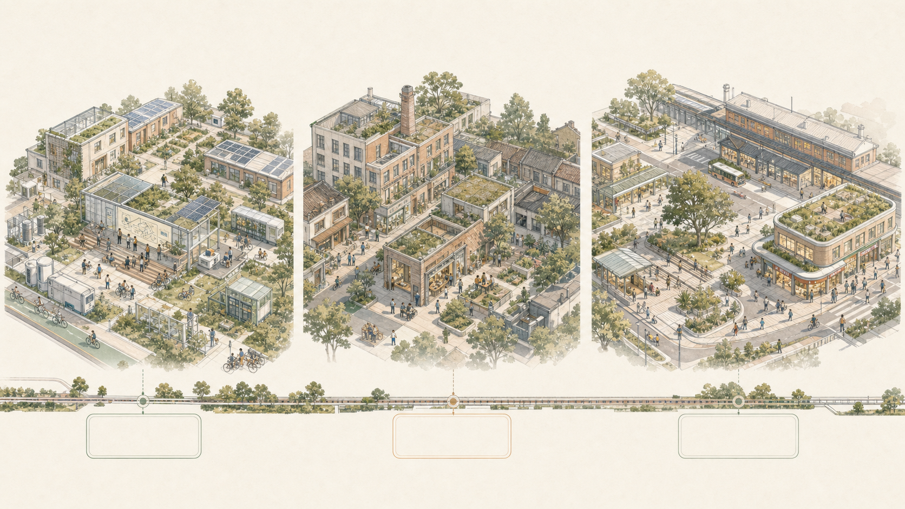

三层工作不是互相割裂的图纸集合。统筹研究决定产业链和城市形态判断，总体设计把判断落实到更新项目、空间结构和设施承载，重点区域详细设计验证具体地块、建筑、交通、公共空间和AI应用场景的可实施性。agent 生成方案时必须先锁定当前提交采用的 official 或 provisional 边界和约束，再生成用地、建筑、道路、绿地、公共空间、分期和AI服务节点，最后从这些图层复算指标并在正文解释哪些结论仍受 provisional boundary 限制。任何无法从结构化数据复算的面积、比例、规模或项目数量，不得写入正式结论。

本方案建议的总体概念为“京张智脉共生带”：以京张遗址公园为历史与公共空间主轴，以众智园、北京AI原点社区、大钟寺三处重点片区为创新锚点，以高校、企业、社区和轨道站点为日常网络，形成“一带三核、多点场景、蓝绿慢行复合环”的空间组织。总体图的道路骨架参照用户提供的实景地图阅读：学院路的东西向联系、北三环的快速交通边界、西土城路的南北廊道，以及清华、北航、北交大、中科院等院校院所的既有肌理均被作为“保留并织补”的前提，而非大拆大建的空白基地。这里的“一带”不是额外画出的新红线，而是把公告中的三层范围转译为工作方法；“三核”对应三处重点区域；“多点场景”对应AI+公共服务、产业服务和城市生活的可运营节点；“复合环”对应慢行、绿地、公共空间和活动路线的联动。

| 层级 | 设计问题 | 方案回答 | 数据落点 |
| --- | --- | --- | --- |
| 统筹研究范围 | AI产业生态和未来城市形态如何组织 | 建立“高校策源-开源协作-企业转化-公共体验-国际传播”的创新链 | compliance_matrix.json、standard_matrix.json |
| 总体设计范围 | 产业空间、城市更新、交通市政和风貌如何落图 | 用地、建筑、道路、绿地、公共空间和分期图层共同表达 | [data:geometry/land_use.geojson#LU-001]、[data:geometry/roads.geojson#ROAD-001] |
| 重点区域范围 | 三处片区如何达到详细设计深度 | 分别提出定位、空间动作、AI场景和实施依赖 | [data:geometry/key_areas.geojson#PROV-KEY-001]、[data:geometry/key_areas.geojson#PROV-KEY-002]、[data:geometry/key_areas.geojson#PROV-KEY-003] |

## 统筹研究范围产业与未来城市研究

统筹研究范围的核心任务是构建世界级 AI 创新生态体系。方案应梳理海淀高校院所、头部企业、算力算法数据要素、孵化平台、上市企业、独角兽和科技服务资源，提出AI创新链、产业链、人才链和城市服务链的空间协同框架。命名方案和 logo 设计应服务于“百年京张文化带、都市AI生活体验带、AI融合创新带”的整体辨识度，不能只停留在口号，应说明与产业生态、公共空间和文化资源的关联。面向智能体任务书还要求回应“五大功能”和“三区两翼”协同，形成可继续深化的命名系统、视觉识别、总体空间结构图、场景开放和运营机制；本节必须用 [source:AGENT-TASKBOOK] 与 [standard:PROJECT-AGENT-OPEN-CALL-TASKBOOK] 标注这些要求来自 agent 开源征集任务，而不是法定规划控制。

统筹研究并不新增伪精确红线；它通过 [standard:MOHURD-URBAN-DESIGN-MEASURES] 要求的城市风貌、公共空间和建筑布局统筹，回接 [data:geometry/land_use.geojson#LU-001]、[data:geometry/public_space.geojson#PUBLIC-001] 与 [depth:overall_spatial_structure]，说明产业策略最终要落到可见、可复核的空间结构。

未来城市形态研究应回答人工智能如何改变工作、生活、社交、学习、交通和公共服务。方案应把AI交通系统、连续绿色空间、创新服务设施和国际化生活工作氛围落实为可定位的功能区、节点、廊道和场景，而不是泛泛描述技术愿景。agent 应把产业战略指标、AI创新指数、人才密度、空间供给类型和AI+垂直应用重点区域写入指标体系，并标明哪些是官方、哪些是设计建议、哪些仍待正式数据校准。若提出全球AI创新活动、开发者社区、开放场景或朝圣路线，应写为“概念建议/参考方案/可供专业团队深化研究”，不得写成已经确定的政府活动或实施安排。

## 总体设计范围城市更新与控规深度城市设计

总体设计范围要求达到控制性详细规划的城市设计深度。方案必须提出城市更新总体空间结构、低效空间识别、更新项目清单、实施政策建议、产业功能比例、空间组织模式、建筑总规模和综合承载能力评估。`geometry/land_use.geojson` 应完整覆盖设计边界且无重叠，`geometry/buildings.geojson` 应表达更新建筑基底或保留建筑基底，`geometry/roads.geojson` 应表达微循环、慢行和轨道接驳关系，`metrics.json` 应复算核心面积、比例和图层数量。

本节按照 [standard:MOHURD-CONTROL-DETAILED-PLANNING] 把控规深度内容拆成可审查对象：[data:geometry/land_use.geojson#LU-001] 表达用地结构，[data:geometry/buildings.geojson#BLDG-001] 表达建筑基底，[data:geometry/roads.geojson#ROAD-001] 表达交通组织，[metric:building_footprint_area_sqm] 用于复核建筑基底面积，[depth:land_use_layout] 与 [depth:development_intensity_controls] 约束成果深度。

总体设计还必须支撑交通、轨道、市政和配套设施。方案应围绕轨道站点一体化、道路微循环、非机动车停放、停车供给、创新服务平台、人才生活服务、新型基础设施、分布式能源和端侧算力提出空间布局和实施路径。涉及建筑高度、开发强度、道路红线、退线和设施标准的内容，若尚无官方控制条件，应写为“待正式控规条件确认”，不得以 agent 推测值冒充审定指标。

## 重点区域详细设计

重点区域详细设计是必选项。众智园AI自主创新加速区应围绕国家人工智能平台、全栈自主创新、标准制定、安全治理、产业展示、对外交通、清河文化、低碳绿色创新交往环境和绿色空间AI场景提出详细方案。北京AI原点社区应围绕近校创新、成果孵化转化、人才特区、开源体系、品牌活动、建筑拆改留、成果展示发布、居住生活配套、校区园区慢行联系和轨道站点一体化提出详细方案。大钟寺AI产业聚集区应围绕领军企业、智能体、智能终端、内容消费、数据要素、数字资产、商业服务、规划绿地复合利用、大钟寺站一体化和路口四象限步行连通提出详细方案。

三处重点区域详细设计必须引用 [data:geometry/key_areas.geojson#PROV-KEY-001]、[data:geometry/key_areas.geojson#PROV-KEY-002]、[data:geometry/key_areas.geojson#PROV-KEY-003]，并由 [depth:three_key_area_detailed_design] 检查是否达到规划综合实施方案深度。若只描述“打造示范区”而没有功能、建筑、交通、公共空间和实施项目证据，应被视为未完成。

三处重点区域必须在 `geometry/key_areas.geojson` 中出现。若仓库已提供 official polygons，应作为 `official_constraint` 使用；若 official polygons 缺失，可暂用 `provisional_constraint`，但正文、HTML、sources、assumptions 和 self_check 必须说明它不能作为正式评分或审批依据。`compliance_matrix.json` 应分别覆盖公告 1.5.3.1、1.5.3.2、1.5.3.3。设计表达应包含功能业态、建筑规模、建筑形态、拆改留分类、公共空间系统、交通组织、慢行连通和实施项目。HTML 页面应能切换查看三处重点区域，A3 文册和 A0 展板应至少包含重点片区总图、局部详图和指标说明。

| 重点片区 | 设计定位 | 空间动作 | AI产业与运营场景 | 证据引用 |
| --- | --- | --- | --- | --- |
| 众智园AI自主创新加速区 | 花园型全栈自主创新街区 | 强化清河界面、产业展示、低碳创新交往和对外交通组织；以绿色空间承载开放测试与标准治理展示 | 自主模型测试、标准制定工作坊、安全治理展示、低碳算力体验 | [data:geometry/key_areas.geojson#PROV-KEY-001]、[depth:three_key_area_detailed_design] |
| 北京AI原点社区 | 近校型成果转化与人才社区 | 组织校区、园区、街区慢行缝合；补足成果发布、人才服务、居住生活和开源协作空间 | 开源社区、成果发布、人才特区服务、近校孵化 | [data:geometry/key_areas.geojson#PROV-KEY-002]、[source:AGENT-TASKBOOK] |
| 大钟寺AI产业聚集区 | 城市型智能经济与国际交往街区 | 围绕大钟寺站一体化、四象限步行连通、商业服务和重点企业公共环境更新 | 智能体与智能终端展示、内容消费、数据要素与国际路演 | [data:geometry/key_areas.geojson#PROV-KEY-003]、[metric:key_area_count] |

## AI 创新生态、人才画像与 AI+ 场景

方案应建立面向AI人才和企业的空间需求画像，覆盖研发办公、开源协作、成果发布、企业服务、人才居住、社交学习、消费生活、运动休闲和国际交往。AI+场景应围绕公告提出的交通、服务、消费、医疗、教育、法律、生活服务等方向，形成产业发展场景和AI赋能城市功能场景。每个场景应说明服务对象、空间位置、数据来源、隐私边界、人工复核机制和运营主体。

AI 场景必须落到空间和治理边界：公共空间场景引用 [data:geometry/public_space.geojson#PUBLIC-001]，慢行与交通场景引用 [data:geometry/roads.geojson#ROAD-001]，开放空间场景引用 [data:geometry/green_space.geojson#GREEN-001] 和 [metric:public_space_ratio]、[metric:green_ratio]。这些引用让评审者知道场景不是口号，而是位于具体图层和指标中的设计对象。面向智能体任务书要求不少于10张AI场景卡、不少于3个产业测试验证场景和不少于5类用户画像；脚手架只给出结构，正式参赛者必须把场景卡、画像表、隐私边界、人工复核和运营主体写入正文、HTML、A3/A0 和合规矩阵。

| 用户画像 | 典型需求 | 空间响应 | 自检边界 |
| --- | --- | --- | --- |
| 开源开发者 | 发布、协作、测试、社区声誉 | 原点社区开源发布厅、公共代码墙、夜间协作空间 | 不采集个人行为轨迹；活动数据只做聚合统计 |
| 初创团队 | 低成本办公、算力入口、产品试验场 | 众智园共享测试场、端侧算力服务点、标准治理咨询 | 算力和数据服务需另行授权 |
| 头部企业访客 | 展示、商务、国际接待、人才招聘 | 大钟寺国际路演客厅、轨道站点接驳、重点企业周边公共空间 | 企业标识和案例须清权 |
| 周边居民 | 通勤、休闲、社区服务、低扰动更新 | 京张遗址公园慢行环、社区服务嵌入、夜间照明和活动分级 | 不将居民画像用于商业推荐 |
| 高校师生 | 成果转化、跨校协作、日常慢行 | 校区-园区慢行缝合、成果转化驿站、AI教育体验点 | 校园数据和科研成果需授权 |

| 场景卡 | 空间载体 | 设计说明 |
| --- | --- | --- |
| 01 开源发布厅 | 北京AI原点社区 | 面向高校、开源社区和初创团队，提供成果发布、代码贡献展示和小型路演空间 |
| 02 安全治理沙盒 | 众智园 | 将标准制定、安全评测、模型红队测试转译为可参观、可预约、可监管的展示和协作节点 |
| 03 端侧算力驿站 | 总体设计范围节点 | 与公共服务、企业服务和低碳能源策略结合，作为待深化的新型基础设施原型 |
| 04 AI慢行导航 | 京张遗址公园活力带 | 用可解释导视和低侵入传感帮助识别慢行断点、拥挤节点和无障碍需求 |
| 05 大钟寺国际路演客厅 | 大钟寺AI产业聚集区 | 服务智能体、智能终端和内容消费企业的展示、洽谈、媒体发布和国际交流 |
| 06 清河低碳创新廊 | 众智园临清河界面 | 把绿色空间、雨洪、步行骑行和AI展示结合，作为园区公共客厅 |
| 07 近校成果转化街 | 北京AI原点社区 | 面向高校成果转化，组织孵化、展示、法务、知识产权和投融资服务 |
| 08 数据要素会客厅 | 大钟寺片区 | 以合规、授权、可审计为前提，展示数据要素和数字资产流通的城市服务界面 |
| 09 AI生活服务样板街 | 社区与商业交汇处 | 将医疗、教育、法律、生活服务等AI+场景落到可运营的小尺度街区空间 |
| 10 全球AI活动周路线 | 一带公共空间系统 | 形成从遗址文化、开源社区、产业展示到国际路演的可步行、可传播体验路线 |

agent 生成的AI治理建议必须遵守数据最小化、公开来源、可解释和人工复核原则。城市智能体可以辅助识别慢行断点、公共空间热力、设施维护、企业服务需求和活动安全风险，但不能替代规划审批、不能输出未经授权的个人画像、不能声称获得官方实施承诺。所有AI场景节点应进入结构化图层或合规矩阵，便于评审者看到它们与产业、空间和公共利益之间的关系。

## 用地、建筑规模与拆改留方案

用地方案应依据国土空间调查、规划、用途管制分类等公开标准表达，形成完整、闭合、无缝的用地分区。建筑方案应区分保留、改造、更新、新建或待确认对象，明确建筑基底、功能、规模、风貌、屋顶、体量和高度控制的建议层级。若缺少现状建筑、权属、控规和工程条件，方案只能提出方法和待校准清单，不能编造拆改留结论。

用地分类依据 [standard:MNR-LAND-USE-CLASSIFICATION-GUIDE]，建筑高度、体量、界面和风貌控制由 [depth:height_massing_character] 管理，拆改留方法由 [depth:retain_renovate_demolish] 管理。用地和建筑的主要证据是 [data:geometry/land_use.geojson#LU-001]、[data:geometry/buildings.geojson#BLDG-001] 和 [metric:building_footprint_area_sqm]。

建筑规模和强度指标必须与 `metrics.json` 和图层一致。若总建筑规模、容积率、建筑高度、建筑密度、绿地率、退线和建筑控制线缺少官方条件，应在指标体系中列为 unknown 或 pending_control，不得用固定数值制造精确感。A3 文册应给出更新项目清单和指标复核表，A0 展板应把关键空间结构和重点片区表达清楚，HTML 页面应提供指标和图层联动查看。

## 交通、轨道、市政与公共服务设施

交通方案应回应公告对轨道站点一体化、道路微循环、慢行断点、对外交通、停车、非机动车停放和绿色交通系统的要求。重点应覆盖北五环、京张遗址公园跨环路节点、五道口、清华东路西口、大钟寺站及重点企业周边交通联系。道路和慢行图层应保持在提交边界内，并与公共空间、绿地、产业节点和重点片区相互校核；若提交边界为 provisional，交通结论也只能作为临时设计讨论。

交通和市政专业深度分别由 [depth:traffic_rail_slow_parking] 与 [depth:municipal_new_infrastructure] 约束；图层证据引用 [data:geometry/roads.geojson#ROAD-001]、[data:geometry/public_space.geojson#PUBLIC-001] 和 [data:geometry/constraints.geojson#CONSTRAINTS]。当道路红线、管线、消防和市政条件缺失时，应通过 assumptions 说明待补，而不是把策略写成审定条件。

市政和公共服务设施应覆盖AI产业服务设施、创新服务平台、人才生活服务设施、新型基础设施、分布式能源、端侧算力和传统市政设施融合。方案应说明设施标准、空间布局、服务半径、运营模式和分期实施逻辑。缺少管线、能源、排水、防洪、消防等工程资料时，应列为正式深化前置条件。

## 蓝绿空间、公共空间与城市风貌

蓝绿空间方案应以京张遗址公园活力带为骨架，统筹清河、小月河、周边高校、企业、社区出行需求，提出南北贯通、东西连通的步道、骑行道和绿色空间体系。方案应识别慢行断点、上跨环路节点、公园南端和北端景观节点，提出停车、体育、创新交往、科技测试、应用展示和公共服务复合利用策略。

蓝绿公共空间由设计深度项和绿地、公共空间图层共同校核 [depth:blue_green_public_space] [data:geometry/green_space.geojson#GREEN-001] [data:geometry/public_space.geojson#PUBLIC-001]。绿地与公共空间比例在正文解释设计意义，完整复算保存在 `metrics.json`；城市风貌、公共空间和建筑控制的统筹则回到专业标准矩阵 [standard:MOHURD-URBAN-DESIGN-MEASURES]。

### 天气—空间—服务照护环：蓝绿系统先服务于日常韧性

AI+能源和 AI+公园运维不以“智慧装置”数量定义，而以蓝绿空间在晴天、降雨和傍晚仍能让人安全通行、停留与获得帮助来衡量。方案提出一套概念性的**天气—空间—服务照护环**：雨水优先在可核验的下凹绿地、透水停留面和既有排水条件中被缓释；遮阴、坐憩、夜间可读性和人工报修点优先服务步行与无障碍；低碳算力只能以非实时、可解释的示例进入现场，并服从公共空间、生态、能源、安全与维护条件。没有管线、排水、防洪、供电、消防和权属资料时，不预设工程做法、容量或性能数值。

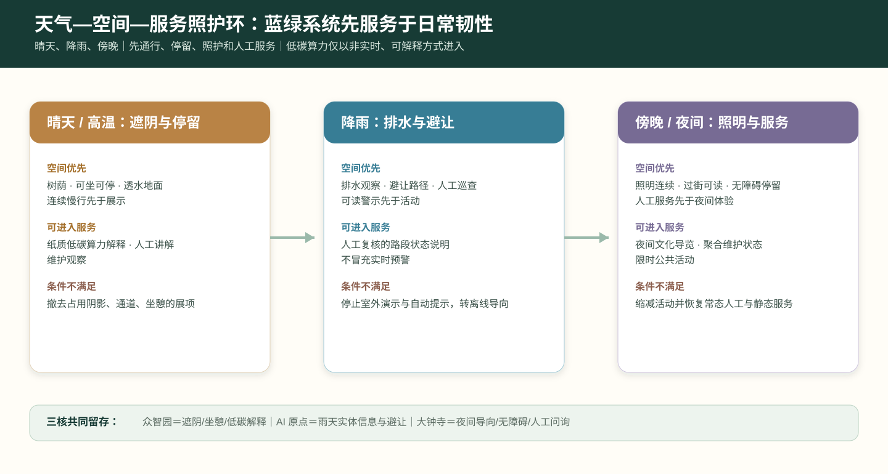

| 天气 / 时段 | 公共空间优先动作 | 可进入的低干扰服务 | 必留的人工与离线底线 | 若条件不满足 |
| --- | --- | --- | --- | --- |
| 晴天与高温 | 树荫、可坐可停、透水地面和连续慢行先于展示 | 纸质低碳算力解释、人工讲解、维护观察 | 实体导览、饮水/休憩信息、人工问询 | 关闭或撤去占用阴影、通道和坐憩的展项 |
| 降雨与积水风险 | 排水观察、避让路径、可读警示和人工巡查先于活动 | 仅发布经人工复核的路段状态；不将展示数据伪装成实时预警 | 静态临时导向、现场/电话报修、人工安全提示 | 停止室外演示和自动提示，改用离线导向或暂缓 |
| 傍晚与夜间 | 照明连续、过街可读、无障碍停留和人工服务先于夜间体验 | 夜间文化导览、聚合维护状态说明和限时公共活动 | 静态夜间导视、人工服务台、紧急求助信息 | 发现照明、拥挤或安全风险即缩减活动并恢复常态服务 |

照护环在三核中留下不同但互相连通的公共成果：众智园的“低碳算力说明”必须同时留下遮阴、坐憩和维护责任；AI 原点的“知识前台”应在雨天仍保留可读的实体信息和避让路径；大钟寺的“日常门”应把夜间导向、无障碍停留与人工问询作为任何商业或技术服务的前置条件。公园运维只公开经授权的工单类别、状态和复核日期，不展示私人联系方式，也不以视觉识别、持续定位或自动评分替代人工巡检。这样，蓝绿系统不只是方案底图，而是把技术限制在可维护、可解释、可退回的日常照护之中。

城市风貌方案应融合京张铁路历史文化、中关村创新文化和AI创新文化，利用清华园火车站、北影等文化资源，提出城市基调、建筑风貌、屋顶形态、体量、界面和公共艺术引导。agent 还应提出导视标识、文化符号、国际传播叙事、AI朝圣地标、贡献墙或荣誉展示体系，但所有品牌、字体、图像、肖像和企业标识都必须有清权来源。风貌控制应分清官方管控、设计建议和待确认条件，严禁在没有文保或控规依据时给出伪精确控制线。

### 铁路遗址公共生活线：从清华园到大钟寺

公开背景报道将京张铁路遗址公园叙述为自清华园火车站向南、穿越高校与科研片区、通达大钟寺的连续文化线，并提出“百年京张文化带、都市AI生活体验带、AI融合创新带”的叠加愿景 [source:NCSTI-2026-AGENT-CITY-PLANNING]。据此，本方案把“京张公共创新廊”深化为不依赖大拆大建的四段公共生活线：清华园段以铁路记忆与基础研究开放日为主；东升镇段以开发者散步道、校园—园区慢行缝合和雨洪花园为主；中关村段以开源成果展示廊、公共讲堂和企业服务会客点为主；大钟寺段以站城界面、城市路演、文化导览和夜间步行安全为主。它们是待专业团队深化、待正式边界与文保条件校核的概念建议，不构成建设承诺或审批结论。

沿线设立三个可移动、可撤回的公共原型：**开源成果展示廊**用于展示经授权的研究与社区贡献；**智能体贡献荣誉墙**以年度、可核验的公开贡献为记录对象，避免采集无关个人数据；**开发者散步道**以无障碍连续步行、遮阴、坐憩、导览和紧急求助为优先，而非以数字装置密度取胜。年度“全球 AI 活动周”只作为运营情景：由独立策展、场地许可、消防与人流安全、版权清权和事后公众评估共同决定能否发生或扩展 [source:NCSTI-2026-AGENT-CITY-PLANNING] [depth:public_space_system].

## 更新项目清单、实施政策与分期计划

实施方案应形成可审查的更新项目清单，说明项目位置、类型、功能、责任主体、依赖条件、实施阶段、风险和评估指标。政策建议应覆盖城市更新统筹实施、空间供给、运营机制、产业服务、公共参与、数据治理和产权协同。`geometry/phasing.geojson` 应表达分期范围，`compliance_matrix.json` 应把每个任务与分期和图纸挂接。

项目清单和分期深度由 [depth:renewal_project_list] 与 [depth:phasing_implementation] 管理，分期空间证据为 [data:geometry/phasing.geojson#PHASE-001]。如果没有权属、资金、实施主体和审批路径，方案必须把它写成实施风险，而不是承诺落地。

| 项目编号 | 项目名称 | 类型 | 主要依赖 | 证据引用 |
| --- | --- | --- | --- | --- |
| JZ-01 | 京张遗址公园慢行断点缝合 | 公共空间/交通 | 道路红线、桥下空间、交通组织复核 | [data:geometry/roads.geojson#ROAD-001] |
| JZ-02 | 众智园清河创新界面 | 蓝绿空间/产业展示 | 河道蓝线、生态和防洪条件 | [data:geometry/green_space.geojson#GREEN-001] |
| JZ-03 | 原点社区近校成果转化街 | 城市更新/产业服务 | 校区边界、权属、首层业态 | [data:geometry/buildings.geojson#BLDG-001] |
| JZ-04 | 大钟寺站四象限步行连通 | 轨道一体化/慢行 | 轨道站点、道路交叉口、市政管线 | [data:geometry/public_space.geojson#PUBLIC-001] |
| JZ-05 | AI公共服务与端侧算力节点 | 新基建/公共服务 | 能源、算力、安全和运营主体 | [data:geometry/constraints.geojson#CONSTRAINTS] |
| JZ-06 | 全球AI活动周公共路线 | 运营/品牌 | 公共空间许可、活动安全、版权清权 | [data:geometry/phasing.geojson#PHASE-001] |

分期应与 100 天征集设计周期形成区分：征集周期是提交成果的时间要求，实施分期是城市更新和项目建设的推进路径。方案应提出近期试点、中期更新和长期治理框架，并标明哪些内容可先以轻量设施、运营活动和服务平台启动，哪些必须等待正式控规、市政、交通和权属条件确认。对于年度活动体系、开发者社区运营、场景开放日、公共体验路线和国际传播机制，正文应说明运营对象、频率、责任边界、转化路径和风险，不得只写宣传口号。

### 三阶段共振路线图：每一阶段都能停、能回看、能留下

本案不以模糊的“近期—远期建设愿景”推进，而以三次公共决策把空间、服务和运营逐步接续。三个阶段均为概念性行动窗口，不代表已批准的时序、投资、工程量或责任主体。只有前一阶段留下的公共回响仍在使用、现场条件可核验且人工责任明确时，才讨论进入下一阶段。

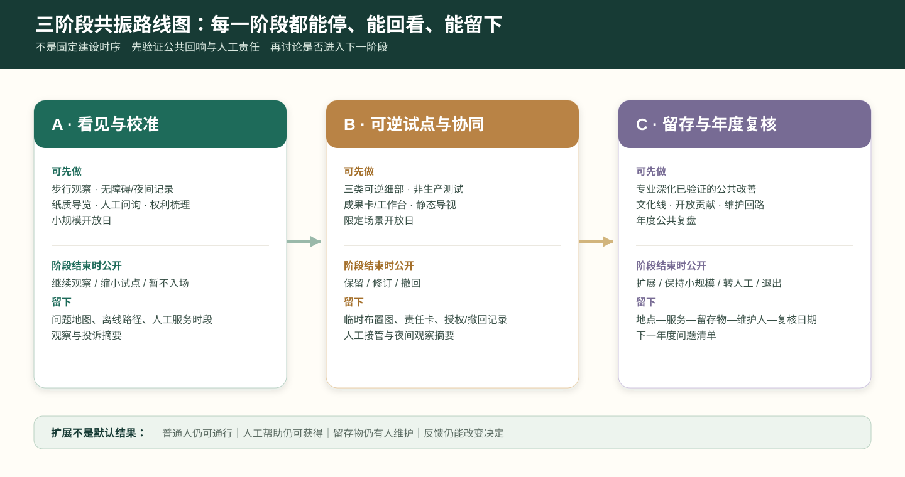

| 阶段 | 可先做的事 | 必须暂缓的事 | 阶段结束的公共决策 | 留下的最小公共成果 |
| --- | --- | --- | --- | --- |
| A · 看见与校准 | 沿线步行观察、无障碍/夜间记录、人工问询、纸质导览、成果权利梳理、小规模开放日 | 固定设施、道路/轨道工程、实时数据接入、以人脸或轨迹为基础的服务 | 公开“继续观察、缩小试点或暂不进入现场”的理由 | 问题地图、离线路径、人工服务时段、观察与投诉摘要 |
| B · 可逆试点与协同 | 三类可逆细部、非生产测试、成果卡与公共工作台、站城静态导视、限定场景开放日 | 未核实的扩建、融资承诺、排他性入驻、把展示数据当官方实时数据 | 由现场使用者、维护角色和专业顾问共同判断“保留、修订或撤回” | 临时布置图、服务责任卡、授权/撤回记录、人工接管与夜间观察摘要 |
| C · 留存与年度复核 | 由后续专业团队深化已验证的公共空间改善，形成年度文化线、开放贡献和维护回路 | 无维护人、无许可、无无障碍条件或无法解释权利/责任的常态化服务 | 冬季公共复盘会公布“扩展、保持小规模、转人工或退出” | 地点—服务—留存物—维护人—复核日期台账及下一年度问题清单 |

路线图的关键不是把每一项技术都推向第三阶段，而是允许它停留在 A 或 B，甚至退出。**扩展权不来自流量、融资或媒体热度，而来自普通人仍可通行、仍能获得人工帮助、留存物仍有人维护、反馈仍能改变决定。**资本、技术和活动组织可参与其中，但不得替代公共决策；涉及审批、采购、建设、医疗、交通、文保或数据处理的事项仍须依相应程序另行核定。

## 指标体系、面积复算与合规矩阵

指标体系至少应包含总体设计范围面积、重点区域面积、绿地与公共空间比例、建筑基底、更新项目数量、AI场景节点、慢行连通指标、产业空间指标、人才服务指标和自检状态。所有 known 指标必须能从 GeoJSON 或可信来源复算；unknown 指标必须给出原因和正式提交前置条件。`scripts/spatial_review.py` 和 `scripts/visual_review.py` 的结果是 formal 自检的重要证据。

指标复算遵循统一的设计深度要求 [depth:metrics_recalculation]。正文重点解释指标的设计含义，例如总体范围如何约束空间分配、蓝绿和公共空间比例如何支撑日常交往；完整数值、公式、来源文件和置信度保存在 `metrics.json`。示例关键指标可由总体范围和绿地数据复核 [metric:site_area_sqm] [data:geometry/green_space.geojson#GREEN-001]。

合规矩阵是任务响应性的主控文件。每条公告任务和 agent_taskbook 任务必须对应到报告章节、图层、指标、图纸、HTML 页面、来源、假设和自检项。未能覆盖公告 1.3、1.4、1.5 或 agent.1-agent.6 的任一必选任务，方案不得进入 formal professional scoring。

正式深化时，agent 还应把每个指标分为三类：第一类是可由提交几何直接复算的空间指标，例如边界面积、绿地比例、公共空间比例、建筑基底面积和分期面积；第二类是需要官方控规或任务书附件支撑的管控指标，例如容积率、建筑高度、建筑密度、退线、道路红线和设施标准；第三类是需要运营或产业数据持续校准的绩效指标，例如 AI 创新指数、人才密度、产业服务满意度、慢行可达性、活动参与度和场景使用频次。三类指标应分别进入 `metrics.json`、`assumptions.json` 和 `compliance_matrix.json`，避免把运营愿景误写成审定规划条件。

## 方案深化：共振环的可验证行动体系

**本次提交深化。** 本版以“京张共振环”主展板作为跨媒介统一母图，并将六项征集任务落实为一廊三核、四段文化导览、六类人本 AI 场景和年度运营闭环；下述内容均为面向评审的概念性设计表达。

“京张共振环 / Jing-Zhang Resonance Loop”不是新的行政或法定边界，而是一套把知识策源、场景验证、公共体验和长期反馈组织到同一条遗址公园公共界面的概念方法。它以遗址公园作为可步行、可停留、可被公众理解的验证线，并以众智园、AI原点社区和大钟寺三处重点区作为三种不同的创新接口 [source:AGENT-TASKBOOK] [depth:overall_spatial_structure]。

### 品牌与空间识别

建议以“双线同频”为识别方向：一条细深蓝线代表京张铁路的时间线，一条青绿色线代表公共空间、慢行与开放协作线；两线在三个重点区形成“共振点”。标志、导视和荣誉展示仅作为概念性视觉系统，后续应由专业设计团队完成字体、无障碍、版权与场地适配深化，不使用任何未授权机构标识 [source:AGENT-TASKBOOK]。

### 三种重点区角色与三个公共地标

众智园定位为“可信AI试验场”：以可预约的评测、标准讨论、低碳算力体验和公共解释为主，而非承诺具体工程设施。AI原点社区定位为“开源转化客厅”：把高校成果、开发者协作、知识产权与人才服务组织到近校慢行界面。大钟寺定位为“城市化展示窗口”：以站点周边步行缝合、智能终端体验、路演和日常消费的复合界面回应国际交往需求。三处空间均在临时重点区范围内作方向性表达，正式范围发布后应重新校准 [data:geometry/key_areas.geojson#PROV-KEY-001] [data:geometry/key_areas.geojson#PROV-KEY-002] [data:geometry/key_areas.geojson#PROV-KEY-003]。

三个概念地标是：

1. **开放贡献墙**：展示经贡献者授权的开源项目、研究协作和社区反馈，以可更新、可撤回的信息展示替代企业广告墙。
2. **可信AI观测台**：用公众可读的方式解释模型测试、数据最小化、人工复核与风险申诉，不呈现个人或敏感运行数据。
3. **京张未来站**：在活动期间作为文化叙事、成果发布和无障碍导览的临时公共空间原型；是否建设、位置和尺度须待文保、交通和权属条件核验。

### 一条公共界面链：从铁路记忆到站城日常

“一廊三核”不应被理解为三处彼此孤立的创新项目。本案将清华园—东升镇—中关村—大钟寺之间的连续公共界面，概念性地拆解为六段**可步行、可解释、可维护**的转换段：北端让铁路记忆被读到，中段让研究和日常慢行相遇，三核让测试与知识进入公共前台，南端让站城服务回到普通人的通行与停留。东侧学院路/铁路走廊与中部东西向快速路是需要被谨慎穿越、衔接和复核的结构条件，而不是用单一“AI 大道”覆盖的背景。

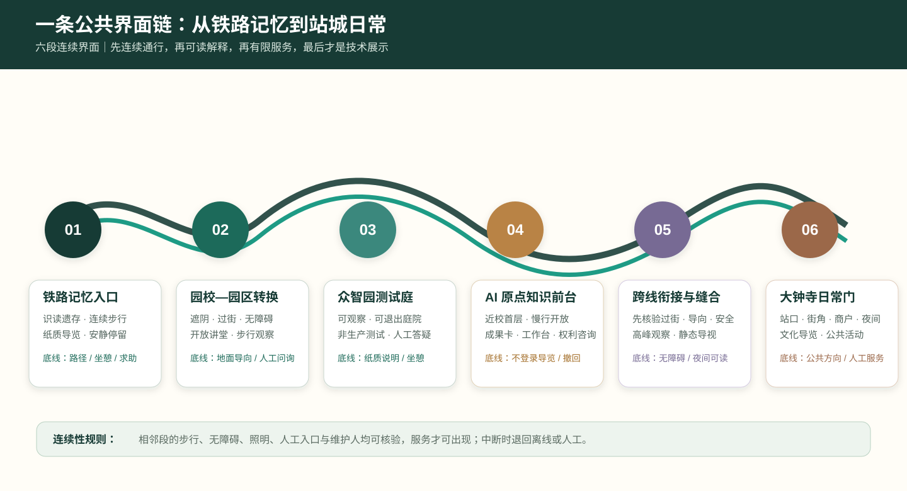

| 公共界面段 | 首要空间动作 | 可进入的轻量服务 | 必须保留的非数字底线 | 不应预设的内容 |
| --- | --- | --- | --- | --- |
| 01 铁路记忆入口 | 识读遗存、连续步行、安静停留 | 纸质文化导览、人工讲述、问题收集 | 可读路径、坐憩与紧急求助 | 固定活动规模或沿线建设量 |
| 02 园校—园区转换 | 遮阴、过街、慢行连续与无障碍 | 开放讲堂集合、步行观察 | 地面导向、实体地图、人工问询 | 以数字入口替代公共通行 |
| 03 众智园测试回响庭 | 留出可观察、可退出的公共庭院 | 非生产测试说明、低碳算力讲解 | 纸质说明、坐憩、人工答疑 | 占用主通道的设备或实时官方数据宣称 |
| 04 AI 原点知识前台 | 近校首层与慢行界面向公众打开 | 成果卡、公开课、权利咨询、工作台 | 不登录导览、署名/撤回说明 | 权利不清的展示或封闭式园区化界面 |
| 05 跨线衔接与城市缝合 | 在快速路/铁路等条件前优先确认过街、导向和安全 | 高峰观察、临时静态导视、人工换乘问询 | 连续无障碍路径与夜间可读性 | 以概念图承诺跨线工程或交通组织 |
| 06 大钟寺站城日常门 | 站口、街角、商户与夜间服务共同可读 | 文化导览、商户服务、限时公共活动 | 公共方向优先、遮阴坐憩、人工服务台 | 商业信息遮蔽公共导向或自动化替代人工 |

六段的设计优先级从北到南始终一致：**先连续通行，再可读解释，再有限服务，最后才是技术展示**。服务只在相邻段的步行、无障碍、照明、人工入口和维护人均可核验时出现；任何一段出现施工、天气、拥挤、权利或安全问题时，服务可退回上一段或转为离线/人工方式。它使铁路文化、中关村协作文化和 AI 新文化不只并置在一张主图上，而是在同一条日常路径中轮流成为主角。

### 六个全球案例与海淀转译

案例不是“国际名称拼贴”，而是用来校验创新链中缺失的空间接口、运营角色和公共边界。本案选择六个有公开一手资料的创新地区/平台；只借鉴其机制，不复制建筑尺度、融资规模、治理权限或政策条件。所有转译均为待专业团队、场地权属和运营主体进一步核验的概念建议。

| 公开案例 | 已验证的机制 | 海淀的具体转译 | 不直接照搬的部分 |
| --- | --- | --- | --- |
| 美国 Kendall Square（MIT） | 研究、实验室、居住、零售、开放空间与社区参与共同组织创新街区 | AI 原点设置“近校成果转化街”：首层咨询、共享工坊、步行界面和日常服务同时出现 | 不按 MIT 地块、开发强度或项目时序推定本地更新 |
| 法国 STATION F | 历史建筑再利用，项目制孵化，专家、企业、基金与活动共处 | 大钟寺“站城会客厅”采用“开放前台—预约协作—活动路演”的三级可达空间 | 不承诺固定工位数、入驻资格、投资回报或品牌合作 |
| 加拿大 MaRS Discovery District | 研究转化、客户/资本/人才连接与健康、气候等垂直领域服务 | 原点社区设置成果转化服务台，把知识产权、临床/教育场景咨询、创业服务与人工问询连接 | 不引入其基金、医疗资质或融资结果 |
| 新加坡 one-north / LaunchPad | 研究园区与工作、学习、生活、公共活动共同构成持续社区；孵化器与资本近距离协作 | 众智园形成“可信算力花园”：测试庭院、低碳展示、开发者散步道和开放日可分时使用 | 不照搬园区管理权、土地供应或国家级产业政策 |
| 香港数码港 Cyberport | 孵化、技术网络、行业试点与人才支持共同服务 AI 企业成长 | 大钟寺设置“城市应用试验前台”：将商户、公共服务、企业展示与合规咨询放到可观察、可暂停的小范围场景 | 不推断算力中心、补贴、政府审批或企业入驻 |
| 多伦多 Waterfront Innovation Centre | 将数字基础设施、就业空间和滨水公共环境以明确开发/运营责任协同推进 | 京张遗址公园以“公共空间优先、数字能力后置”为原则，把网络、照明、导览和活动接口写入可撤回项目包 | 不引用其开发主体、建设规模、经济效益或工程标准 |

由此形成海淀的完整链路：**基础研究 → 开源贡献 → 可信测试 → 孵化/知识产权/资本对接 → 小尺度公共服务试点 → 公开复盘与国际传播**。每个箭头都需要明确的空间载体、牵头角色、人工服务入口和停止条件；资本服务只包括合规咨询、路演和资源连接，不构成投资承诺 [source:CASE-KENDALL-SQUARE] [source:CASE-STATION-F] [source:CASE-MARS]。

### 从研究到城市采用：六段生态接力

为避免“生态链”被画成单向招商流程，方案将六段链路组织为可回退的空间接力。每一段只交接一个可阅读、可复核的成果：研究段交接问题简报，开源段交接授权/署名说明，测试段交接人工接管与异常摘要，转化段交接知识产权与场景适配清单，资本服务段交接非排他性的路演准备与资源对接记录，城市采用段交接公共回响台账。任何一个环节无法说明权利、责任、人工入口或停止条件时，不进入下一段。

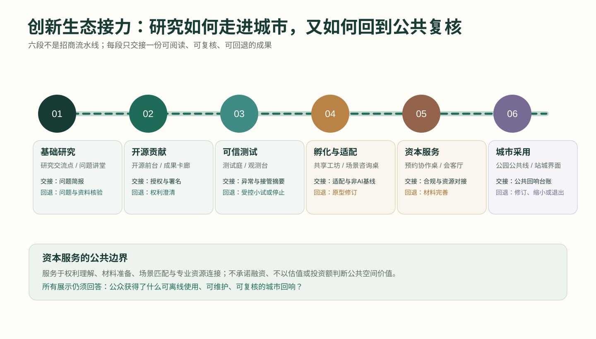

| 生态段 | 可进入的空间前台 | 本段只交接什么 | 人工责任入口 | 不满足时回到哪里 |
| --- | --- | --- | --- | --- |
| 基础研究 | 清华园—东升镇研究交流点与问题讲堂 | 与真实日常问题对应的研究简报，不含未经授权数据 | 高校/研究机构的公开咨询时段 | 回到问题定义与资料核验 |
| 开源贡献 | AI 原点开源前台与成果卡廊 | 授权状态、贡献署名、可撤回的成果摘要 | 开源社区与成果转化人工前台 | 回到权利澄清或不公开展示 |
| 可信测试 | 众智园测试回响庭与观测台 | 测试范围、异常摘要、人工接管/撤场记录 | 测试负责人和现场答疑 | 回到受控小试或停止测试 |
| 孵化与场景适配 | 近校共享工坊与场景咨询桌 | 场景适配清单、服务边界和非 AI 基线 | 转化、法律/知识产权与场景运营协同 | 回到原型修订或人工服务 |
| 资本服务与协作连接 | 大钟寺站城会客厅的预约协作桌 | 路演材料完整性、合规提示、资源对接记录；不承诺融资 | 合规咨询、创业服务和活动组织者 | 回到材料完善，不以融资结果作为进入条件 |
| 城市采用与复盘 | 遗址公园公共线与站城日常界面 | 留存物、维护人、复核日期和经授权的汇总反馈 | 公园/街区运营及公共反馈入口 | 回到上一段修订、保持小规模或退出 |

这套接力把资本服务放回城市设计应承担的边界：它是帮助团队理解权利、准备表达、匹配场景与获取专业资源的服务接口，而非以企业估值、投资额、排他入驻或商业回报定义公共空间价值。公共线上的任何展示仍须以“公众是否获得可离线使用的回响”为优先判断。

### 场景卡的验证与治理边界

十张场景卡按三组组织：产业测试验证（安全治理沙盒、端侧算力驿站、近校成果转化街）；公共服务验证（AI慢行导航、AI生活服务样板街、数据要素会客厅）；文化与交往体验（开源发布厅、清河低碳创新廊、国际路演客厅、全球AI活动周路线）。每张卡都应先以公开或经授权的数据、明确运营主体、人工复核和退出机制为前提；禁止持续跟踪个人、以黑箱结果替代公共决策，或将试验表述为已获批准运营 [standard:GENERATIVE-AI-INTERIM-MEASURES] [standard:BARRIER-FREE-ENVIRONMENT-LAW]。

为使场景真正落入街区，本方案将 **AI+教育** 放在近校慢行界面的学习工坊、公开课与成果转化服务台，学生可不用任何账号而参与实体导览和公开展示；将 **AI+健康** 放在社区健康咨询、无障碍导诊和药房/养老服务的人工优先流程中；将 **AI+商业** 放在大钟寺站周边的商户服务、客流安全、夜间照明和可解释的信息导览中。三类服务必须提供非数字替代路径，不得以人脸识别、连续画像或自动化决定取代人工服务。对应的人视效果图只用于说明可感知的空间体验，不是对已建项目的陈述。

### 人本使用者与长期运营

五类使用者是开发者、初创团队、企业访客、周边居民和高校师生。设计并不把他们变成数据标签：居民和访客可选择不使用数字服务，现场必须保留可理解的人工说明和替代路径。运营建议采用“年度主题季—季度场景开放日—月度开发者共创—日常公共反馈”的轻量节奏：主题季提供国际传播框架，开放日测试有限场景，开发者共创沉淀可复用工具，公共反馈决定下一轮是否继续、调整或停止。该机制是概念建议，不构成政府活动、招商、资金或实施承诺 [source:AGENT-TASKBOOK] [depth:phasing_implementation]。

### 一条文化线、四个季节、三次回到现场

运营不是在遗址公园旁附加一串活动。方案将清华园—东升镇—中关村—大钟寺组织为一条**“记忆—提问—共创—回响”文化线**：铁路文化提供可被阅读的连接与维护记忆；中关村文化提供问题导向、开放协作与成果转化的日常舞台；AI 新文化只在能被公众理解、质疑并留下实体回响时进入现场。每次活动均沿同一条线完成三个动作：在现场提出问题、在三核中协作测试、回到公共空间公布修订或暂停。

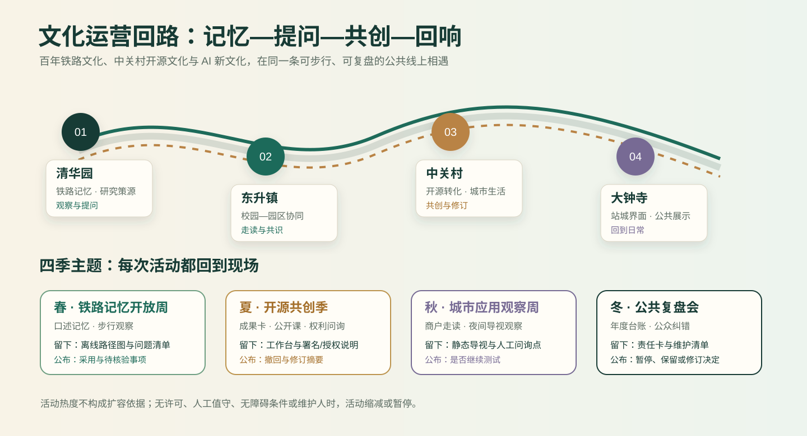

| 季节/主题 | 文化线的主场 | 公众可以参与什么 | 必须留下的回响 | 结束时必须公开什么 |
| --- | --- | --- | --- | --- |
| 春 · 铁路记忆开放周 | 清华园—东升镇 | 口述记忆收集、步行观察、无障碍与停留点共识 | 通行回响：更新的离线路径图、休憩/问题清单 | 哪些路线与记忆被采用、哪些仍待场地核验 |
| 夏 · 开源共创季 | AI 原点近校界面 | 开源成果卡、公开课、工具共修与权利问询 | 知识回响：授权/署名说明、公共工作台、人工咨询时段 | 被授权展示的内容、撤回和修订摘要 |
| 秋 · 城市应用观察周 | 大钟寺站城界面 | 商户/居民走读、夜间导视观察、场景演示与人工答疑 | 日常回响：静态导视、夜间提示、无障碍与问询点 | 高峰/夜间观察摘要、投诉处理和是否继续测试 |
| 冬 · 公共复盘会 | 三核轮换与遗址公园节点 | 阅读年度台账、提出纠错、共定下一年度问题 | 维护回响：责任卡、维护清单、下一轮复核日期 | 场景暂停、保留、修订或仅保留人工服务的决定 |

四季并非固定节庆承诺，而是一个可替换主题、可缩小规模的运行框架。任何活动在 G0—G5 实施关口中缺少场地许可、人工值守、无障碍条件或明确维护人时，均缩减为线上/室内讨论或暂缓；活动热度、到场人数和媒体传播不能替代公共价值、空间安全和人工复核。

### 四个文化节点：让三种文化轮流成为日常主角

文化线不以统一风格的“打卡点”覆盖沿线，而为四个节点设置不同的**停留理由、公共叙事、可参与动作和留存物**。铁路文化在清华园被读作连接、维护与时间；中关村文化在东升—中关村被读作提问、协作与贡献；AI 新文化只在 AI 原点与大钟寺以可解释、可撤回、可人工接管的服务被感知。每一节点首先是日常可使用的公共界面，活动只是在其上短暂发生。

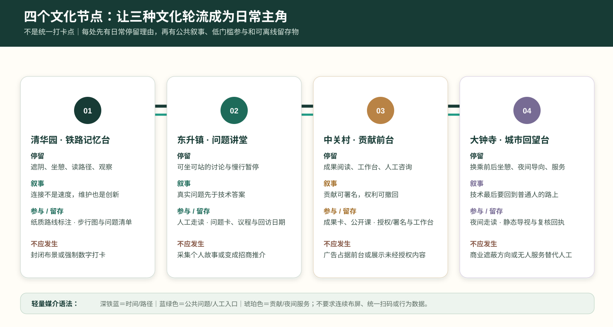

| 节点 | 日常停留理由 | 当日可读的叙事 | 低门槛参与动作 | 留下的离线物 | 不应发生的事 |
| --- | --- | --- | --- | --- | --- |
| 清华园 · 铁路记忆台 | 遮阴、坐憩、阅读路径与安静观察 | “连接不是速度，维护也是创新” | 在纸质路线图标注不便处或讲述可公开的记忆 | 更新的步行图、问题清单、维护提示 | 将遗存变成封闭布景或强制数字打卡 |
| 东升镇 · 问题讲堂 | 可坐可站的开放讨论与园校之间的慢行停留 | “真实问题先于技术答案” | 提出一个公共空间、生活或协作问题；参加人工引导的走读 | 可公开的问题卡、线下议程、回访日期 | 收集可识别个人故事或把讨论变为招商推介 |
| 中关村 / AI 原点 · 贡献前台 | 可不登录进入的成果阅读、工作台和人工咨询 | “贡献可署名，权利可撤回，知识可共修” | 阅读成果卡、参加公开课、提问或申请撤回展示 | 署名/授权说明、公共工作台、人工咨询时段 | 用企业广告或未经授权内容占据公共前台 |
| 大钟寺 · 城市回望台 | 换乘前后的遮阴、坐憩、夜间导向与人工服务 | “技术最后要回到普通人的路上” | 夜间导视观察、商户/居民走读、人工问询 | 静态导视、夜间提示、维护/复核回执 | 让商业信息遮蔽公共方向，或以无人服务替代人工 |

四个节点使用同一套轻量媒介语法：**深铁蓝标记时间与路径，蓝绿色标记公共问题与人工入口，琥珀色标记贡献与夜间服务**；所有文字须经无障碍可读性、双语/多语需要、版权与场地条件核验后深化。节点不要求连续布屏、统一扫码或收集行为数据。它们以纸质、实体、人工和可更新的少量信息共同构成一条能被日常使用的文化导览，而不是活动期间才存在的视觉包装。

### 共振协议：把空间、服务与公共价值接成一条可复核链

本案以“**共振协议 / Resonance Protocol**”组织从空间原型到长期运营的公共责任链：每项 AI 服务须依次通过“可理解、可选择、可接管、可复盘”四个公共门槛，才可从单点演示进入沿线常态服务。这不是行政审批程序，而是概念性试点的责任框架 [source:AGENT-TASKBOOK] [standard:GENERATIVE-AI-INTERIM-MEASURES]。

### 回响留存：让每次数字试验都留下可离线使用的城市改善

“共振”不应只停留在屏幕、活动或短期演示。本案新增**回响留存准则**：任何进入遗址公园或街区前台的数字服务，必须同时完成一项不依赖账号、设备或算法持续运行的公共空间改善；数字服务暂停后，这份改善仍可被日常使用、维护和复核。它把 AI 的价值从“展示了什么”改为“为城市留下了什么”。

回响留存不是新建地标清单，而是三种可在既有开放空间、街角首层和站城界面中逐步校准的设计构件：**通行回响**修复步行、停留、遮阴与无障碍信息；**知识回响**把授权、贡献、人工解释和修订痕迹留在可阅读的公共前台；**维护回响**把照明、积水、树木、设施和投诉的人工受理入口留在现场。三类构件均须服从场地、文保、消防、交通与权属条件，不以本概念方案替代专业设计或审批。

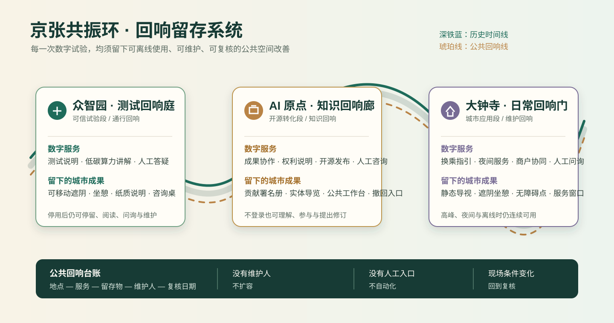

| 回响单元 | 可被公众直接感知的空间动作 | 数字服务暂停后仍留下什么 | 首次交接给谁 | 首轮核验问题 |
| --- | --- | --- | --- | --- |
| 众智园“测试回响庭” | 在开放测试庭院配置可移动遮阴、坐憩、纸质说明和人工答疑桌 | 低碳算力解释牌、可坐可停的庭院、人工咨询时段 | 园区公共空间维护与技术运营团队 | 说明是否清楚，停用数字展项后空间是否仍可停留、使用和维护 |
| AI 原点“知识回响廊” | 在近校慢行界面设置可更新的成果卡、权利说明、公共工作台与线下集合点 | 贡献署名册、撤回入口、实体导览和可复用的工作台 | 载体运营、成果转化与知识产权服务团队 | 公众能否不登录地理解成果，权利争议能否被人工处理 |
| 大钟寺“日常回响门” | 在站口/街角优先补齐静态导视、遮阴坐憩、夜间照明提示和人工问询点 | 可读的换乘/过街信息、无障碍停留点、人工服务窗口 | 街区运营、无障碍与交通专业团队 | 高峰和夜间时普通步行、人工问询与无障碍路径是否连续 |

三类回响单元通过一张“**地点—服务—留存物—维护人—复核日期**”的公开台账连接。台账只记录空间设施、服务责任和经授权的汇总反馈，不记录个人轨迹、身份或画像；当维护人、人工入口或现场条件缺失时，数字服务不得扩容。该台账为后续专业团队交接提供工作底稿，而不是行政许可、实时监控系统或建设承诺。

| 共振段 | 空间原型 | 首要使用者 | 先验证什么 | 必留的非数字路径 | 可公开的最小证据 |
| --- | --- | --- | --- | --- | --- |
| 众智园“可信试验段” | 可信算力花园、观测台、共享测试庭院 | 开发者、初创团队、园区工作人员 | 服务是否安全、可解释、能人工接管 | 现场咨询、纸质说明、人工预约 | 测试范围、异常处置、负责人、退出记录 |
| AI 原点“开源转化段” | 开源前台、成果展示廊、近校慢行客厅 | 高校师生、开源贡献者、转化团队 | 成果能否被理解、协作能否被公平参与 | 无账号导览、线下发布、人工服务台 | 授权状态、贡献署名、反馈摘要、修订记录 |
| 大钟寺“城市应用段” | 人机共行商街、站城会客厅、夜间路演台 | 周边居民、商户、企业访客 | 服务能否改善日常体验且不排除不使用 AI 的人 | 人工导购、人工问询、静态导视 | 无障碍检查、客诉入口、运营时段、暂停条件 |

三段不是线性“产业流水线”：任何服务都可以因反馈回到上一段修订或停止。这样，京张铁路的“连接”被转译为公共价值的往返校验，而非单向技术展示。三段的实际位置、尺度、建筑动作和工程条件均须在正式边界、权属、交通、市政、消防与文保资料齐备后由专业团队深化 [data:geometry/key_areas.geojson#PROV-KEY-001] [data:geometry/key_areas.geojson#PROV-KEY-002] [data:geometry/key_areas.geojson#PROV-KEY-003]。

### 三个可运营的空间原型卡

| 原型卡 | 一天中的使用情景 | 空间动作 | 运营责任与停止条件 | 先行试点方式 |
| --- | --- | --- | --- | --- |
| RP-01 可信算力花园（众智园） | 白天为研发测试说明与低碳算力展示；傍晚转为面向公众的“问题—人工答复”开放时段 | 在既有开放空间内布置可移动遮阴、坐憩、信息台与可撤回展陈；不预设具体建筑改造 | 由明确责任主体维护服务清单；出现安全、误导、能耗或投诉阈值问题即暂停并公开修订 | 先以预约工作坊、临时导览和匿名反馈测试，不接入个人画像 |
| RP-02 开源前台（AI 原点） | 课间为近校成果咨询；傍晚为开源发布、知识产权问询和开发者散步道集合点 | 把街角首层、慢行界面和展示廊组织为“看得见、走得进、可不登录”的公共前台 | 贡献展示须有授权、署名和撤回入口；无法确认权利或维护责任时不发布 | 先以线下成果卡、人工讲解和小规模开放日运行 |
| RP-03 人机共行商街（大钟寺） | 通勤时段做无障碍换乘与步行信息；夜间支持商户服务、文化导览和小型路演 | 优先修复过街、遮阴、坐憩、照明和静态导视，再叠加可解释的数字提示 | 商业信息不得替代公共导向；发生拥挤、误导、无障碍失效或隐私争议时切回人工与静态系统 | 先在一个街角和一个站点出入口进行限时测试，不承诺道路工程 |

三张原型卡把“场景很多”的方案收束为可审查的城市动作：**谁在何时使用、在何处获得人工替代、由谁维护、何时停止**。其机器可读版本存于 `visual/assets/resonance-protocol.json`，供离线展示页和后续专业深化校对；该文件不含个人信息、实时数据或工程控制值。

### 三核一日：以不同时间检验人本 AI

三处重点区不以全天候“科技秀”占据公共空间，而以**早高峰—日间—傍晚**三个可观察时段检验服务是否真的改善日常。时段是运营情景而非营业时间承诺；任何时段都保留不依赖手机、账号或算法的通行、解释和人工入口。若现场客流、天气、许可、无障碍条件或值守能力不满足，数字服务只可缩小、转为人工或暂停。

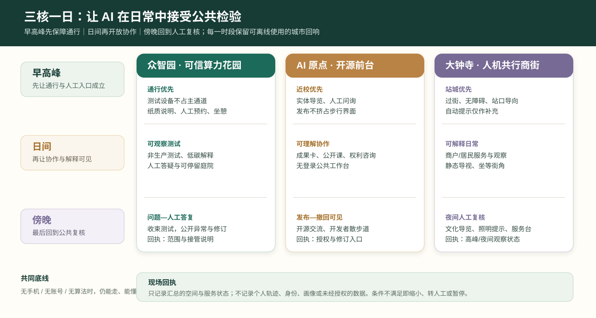

| 时段 | 众智园 · 可信算力花园 | AI 原点 · 开源前台 | 大钟寺 · 人机共行商街 |
| --- | --- | --- | --- |
| 早高峰：先让通行成立 | 测试设备不占用主通道；以纸质说明、人工预约和安静坐憩为主 | 保留近校步行通道、实体导览与人工问询；不以发布活动挤占通行 | 优先过街、站口导向、无障碍连续性与人工问询；自动化提示仅作补充 |
| 日间：再让协作可见 | 预约的非生产测试、低碳算力解释和可观察的人工答疑 | 成果卡、公开课、权利/署名咨询和可不登录使用的公共工作台 | 商户与居民的解释性服务、小尺度场景观察、静态导视和可坐可等候的街角 |
| 傍晚：最后回到公共复核 | 关闭或收束测试，转为“问题—人工答复”与当天异常/修订说明 | 以开源发布、开发者散步道集合和撤回/修订说明为主，保留安静离场路径 | 文化导览、夜间照明提示和人工服务台；拥挤、误导或无障碍风险时立即切回静态系统 |

这一日常节奏要求每次试点在结束时留下一个可见的**现场回执**：众智园留下当天测试范围与人工接管说明，AI 原点留下已授权内容和撤回/修订入口，大钟寺留下高峰或夜间观察与人工服务状态。回执只呈现汇总的服务和空间信息，不展示个人轨迹、身份、画像或未经授权的数据。它使“是否扩容”回到普通人的通行、理解、停留与获得帮助，而非演示时长或流量指标。

### 三核项目包：责任、指标与退出条件

| 项目包 | 近期动作（0—12个月） | 牵头/协同角色 | 公开 KPI（仅作试点评估） | 不达标时如何处理 |
| --- | --- | --- | --- | --- |
| P-01 众智园可信算力花园 | 临时测试庭院、可移动说明台、低碳算力讲解和预约开放日 | 园区运营方牵头；高校/企业技术团队、公共空间维护方协同 | 公开说明覆盖率、人工接管演练完成率、匿名反馈闭环率、能耗说明完整率 | 暂停数字演示，保留实体导览与人工问询；复核安全、能耗和误导问题 |
| P-02 AI 原点开源前台 | 首层共享工坊、成果卡、知识产权咨询时段和开发者散步道集合点 | 载体运营方牵头；高校成果转化、开源社区、法律/知识产权服务协同 | 授权/署名完整率、无账号参与比例、反馈答复时效、撤回请求处理率 | 下架权利不清内容，改为人工讲解或线下成果卡，必要时停止开放展示 |
| P-03 大钟寺人机共行商街 | 一个站口/街角的静态导视、遮阴坐憩、限时接驳和商户服务试点 | 街区运营方牵头；商户、交通/无障碍专业人员、社区代表协同 | 普通步行连续性、人工服务可达率、投诉闭环时效、夜间照明与人流安全复核 | 立即切回静态导视与人工服务；停止自动化服务并公开复盘 |

上述 KPI 不用于人群画像、绩效排名或实时监控；只使用经授权的聚合运营记录、现场观察和匿名反馈。任何涉及道路、轨道、市政、消防、文保、医疗或无人机的试点，须先取得相应专业审查与场地许可，不能由本概念方案替代。

### 三类空间动作的专业交接

为了避免“概念完整、落地失焦”，三核项目包不以单一运营方包办，而以可核验的交接物将规划、建筑景观、交通无障碍、运营和合规工作接续起来。下表中的交接物均为概念阶段应补齐的工作成果；具体尺寸、工程量、费用、权属和许可由后续责任主体与专业团队核定。

| 空间动作 | 需要先确认的现场条件 | 概念阶段交接物 | 后续专业接收角色 | 未确认时的处理 |
| --- | --- | --- | --- | --- |
| 遗址公园通行回响 | 出入口、交叉口、雨雪排水、树木、照明、无障碍和铁路安全边界 | 步行观察记录、实体导视草图、停留点清单、人工问询流程 | 景观/市政/无障碍/公园运营团队 | 只保留临时人工导览，不叠加数字指引或固定设施 |
| 近校知识回响 | 首层开放性、慢行界面、消防疏散、成果权利与日常维护 | 成果卡模板、授权与撤回说明、活动时段表、公共工作台布置原则 | 建筑更新/运营/高校转化/知识产权服务团队 | 不公开权利不清内容，改用人工咨询与线下说明 |
| 站城日常回响 | 站口客流、过街组织、夜间照明、商户界面、无障碍连续性 | 高峰观察表、静态导视优先级、服务台责任卡、暂停与复盘记录 | 交通/无障碍/街区运营/商户协同团队 | 先恢复静态导视和人工问询，暂停自动化服务 |

三大定位、五大功能与本案空间动作的交叉证据见 `visual/assets/taskbook-resonance-crosswalk.json`；重点区概念窗口见 `spatial.json`；八类实施风险及人工复核责任见 `risk.json`。三份文件均将“可审查”理解为补充方案依据，而非新增的法定控制或实施承诺。

### 三类可逆空间细部：从观察到交接，而非一次性改造

三处锚点的共同方法是“**先测量使用，再布置可逆构件，后决定是否交给专业深化**”。这避免在尚未核实红线、树木、消防、客流或产权之前，把效果图误当成建设清单。所有构件均以不阻断无障碍和消防通道、不越过铁路安全边界、不采集个人画像为前提；数量、尺寸、材料、造价和固定方式不在本方案中预设。

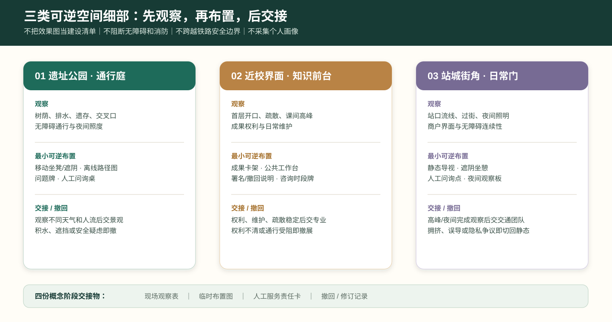

| 细部原型 | 第一次到现场要看什么 | 可逆的最小布置 | 公众如何知道/使用 | 何时交给专业团队，何时撤回 |
| --- | --- | --- | --- | --- |
| 遗址公园“通行庭” | 树荫、排水、轨迹遗存、交叉口、轮椅/婴儿车通行与夜间照度 | 可移动坐凳与遮阴、离线路径图、可更新问题牌、人工问询桌 | 地面低干扰提示与纸质路线；不要求扫码或预约 | 连续观察覆盖不同天气与人流后，再由景观/市政/无障碍团队深化；有积水、遮挡或安全边界疑虑即撤去临时物 |
| 近校“知识前台” | 首层开口、疏散、慢行宽度、课间高峰、展示权利和日常维护 | 可移动成果卡架、公共工作台、署名/撤回说明、人工咨询时段牌 | 走近即可读，不能理解时由人解释；不以屏幕代替权利说明 | 授权、维护和疏散条件稳定后，再由建筑更新/运营/知识产权团队深化；权利不清或通行受阻即撤展并转人工 |
| 站城“日常门” | 站口流线、过街等待、夜间照明、商户外摆、无障碍连续性 | 静态导视优先级牌、临时遮阴坐憩、人工问询点、夜间观察记录板 | 公共方向先于商业信息；人工可解释任何数字提示 | 高峰和夜间均完成观察后，再由交通/无障碍/街区运营团队深化；拥挤、误导或隐私争议即切回静态导视 |

每个细部原型只形成四份可交接材料：**现场观察表、临时布置图、人工服务责任卡、撤回/修订记录**。这四份材料在概念阶段比“效果更炫的固定装置”更重要：它们能让后续专业团队判断什么值得保留，公众也能看见一个服务为何开始、如何被修改、何时退出。

### 公共价值证据台账：只观察服务，不画像人群

为使“人本 AI”可被检验而不滑向监控，本案设置一张低数据、可离线阅读的**公共价值证据台账**。台账记录的是空间与服务是否成立，不记录个体身份、脸部、设备标识、精确轨迹、商业偏好或可反向识别的原始反馈。现场可通过人工巡查、纸面勾选、经授权的聚合意见与维护工单形成摘要；原始记录由相应责任方依规处理，不进入公共展示。

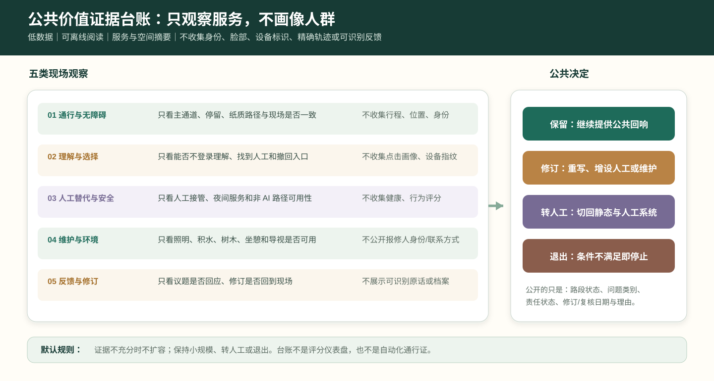

| 观察维度 | 只看什么 | 不收集什么 | 公开的最小摘要 | 触发的行动 |
| --- | --- | --- | --- | --- |
| 通行与无障碍 | 主通道是否连续、停留是否妨碍、纸质路径与现场是否一致 | 个体行程、精确位置、身份标签 | 路段状态、障碍类型、修复/复核日期 | 先移除遮挡、恢复静态导向；必要时暂停服务 |
| 理解与选择 | 公众能否不登录理解服务、找到人工入口和撤回方式 | 点击画像、设备指纹、情绪推断 | 说明是否可读、人工时段是否可达、常见问题类别 | 重写说明、增设人工答疑或下架不清内容 |
| 人工替代与安全 | 人工接管、应急说明、夜间服务和非 AI 路径是否可用 | 个体健康、行为评分、自动风险画像 | 人工入口状态、演练/检查是否完成、暂停原因 | 切回人工与静态系统，复核后再讨论恢复 |
| 维护与环境 | 照明、积水、树木、坐憩、导视等留存物是否可用 | 私人报修人的身份或联系方式 | 工单类别、完成/未完成状态、下一次复核 | 维护优先；无维护人不得扩容数字服务 |
| 反馈与修订 | 经授权的意见是否得到回应、修订是否回到现场 | 可识别的原话、个人档案、社交关系 | 议题数量、答复状态、保留/修订/退出决定 | 在阶段回执与年度复盘中公开理由 |

台账不是评分仪表盘，更不是自动化通行证。它的唯一作用是让公众、维护人和后续专业团队共同看见：一项服务是否仍在改善空间、是否仍保留人工选择、是否值得留在现场。若没有足够的可读证据，默认结论不是扩容，而是**保持小规模、转为人工或退出**。

### 六张首用场景卡：从 AI+ 类型到日常责任

本案的场景卡将**具体的人、日常任务、非 AI 基线、责任角色和停止条件**写在同一张卡中。AI+教育、健康、商业、能源、慢行与公园运维的结构化记录见 `visual/assets/scenario-persona-matrix.json`；它们不等同于已获授权的服务清单。

| 首用场景 | 人与日常任务 | 公共空间落点 | 必须留下的回响 | 不可删去的人工基线 | 何时停止 |
| --- | --- | --- | --- | --- | --- |
| AI+教育 | 高校师生理解成果、参加公开课、获得转化咨询 | AI 原点开源前台与近校慢行界面 | 知识回响：实体导览、公共工作台、可更新的成果/署名说明 | 实体导览、纸面课程表、人工咨询台 | 内容权利不清、通行受阻或无人工说明 |
| AI+健康 | 长者与照护者寻找健康服务、无障碍路径 | 社区服务界面 | 维护回响：无障碍地图、可坐等候点、人工导诊联系卡 | 人工导诊、纸面目录、无障碍地图 | 被误解为医疗建议、路径失效或人工服务不可用 |
| AI+商业 | 居民、商户和通勤者获取可解释信息 | 大钟寺人机共行商街 | 日常回响：静态导视、遮阴坐憩、人工问询窗口 | 静态导视、人工问询、普通商户服务 | 商业信息遮蔽公共导向、拥挤或隐私争议 |
| AI+能源 | 开发者与公众理解低碳算力边界 | 众智园可信算力花园 | 测试回响：纸质能耗解释、可停留庭院和人工答疑时段 | 实体说明、人工讲解、离线展板 | 安全条件不满足或被误读为实时官方数据 |
| AI+慢行 | 不同能力的行人选择连续、安全路径 | 遗址公园开发者散步道 | 通行回响：地面导向、休憩点和离线路径图 | 实体地图、地面导向、人工问询 | 指引与现场不一致、普通通行或无障碍受阻 |
| AI+公园运维 | 居民报告照明、积水、树木和设施问题 | 蓝绿公共节点 | 维护回响：现场报修点、责任卡与可阅读维护记录 | 电话/现场报修、纸面工单、人工巡检 | 无人工受理、泄露联系方式或影响安全处置 |

### 十项服务蓝图：把“AI 场景”变成可测服务

| 服务 | 起点与人工入口 | 最小数据/工具 | 责任角色 | 公开证据与停止条件 |
| --- | --- | --- | --- | --- |
| 开源发布厅 | 人工前台、线下成果卡 | 经授权的项目摘要 | 社区策展人 | 署名、授权、撤回记录；权利不清即下架 |
| 安全治理沙盒 | 预约说明会、人工答疑 | 非生产测试日志 | 测试负责人 | 测试范围与异常摘要；安全疑虑即暂停 |
| 端侧算力驿站 | 实体展板、人工讲解 | 非实时能耗示例 | 设施运营方 | 说明准确性抽查；误导风险即撤展 |
| AI 慢行导航 | 实体地图、人工问询 | 经复核的路径状态 | 公共空间运营方 | 路径核验与投诉记录；现场不一致即关闭提示 |
| 国际路演客厅 | 人工接待、活动报名台 | 活动登记与授权材料 | 活动主办方 | 无障碍/人流复核；超容量或许可缺失即取消 |
| 清河低碳创新廊 | 公园服务点 | 雨洪/绿化维护台账 | 绿地维护方 | 维护工单摘要；生态或安全风险即停止装置 |
| 近校成果转化街 | 校企咨询窗口 | 经授权的成果简介 | 转化服务机构 | 咨询响应与撤回记录；权利争议即转人工处理 |
| 数据要素会客厅 | 人工合规咨询 | 不含个人数据的流程样例 | 合规负责人 | 数据用途说明；无法说明即不展示 |
| AI 生活服务样板街 | 社区服务台 | 自愿、最小化的服务请求 | 社区运营方 | 人工替代可用率；无法人工接管即停止 |
| 全球 AI 活动周路线 | 线下导览点 | 活动日程和匿名客流观察 | 路线策展方 | 许可、无障碍、投诉复盘；任一缺失即缩减或取消 |

### 六道实施关口：从概念窗口到可退出的长期运营

四个公共体验门槛约束每次服务接触；六道实施关口则约束项目能否从桌面研究、限时试点走向更大范围的概念性讨论。`visual/assets/implementation-gates.json` 将 G0 资料与场地前置、G1 公共价值、G2 权利与可达、G3 安全与人工接管、G4 运营责任、G5 扩容与复核逐项记录。任何一关未通过，行动只能回到上一阶段、保持小规模或退出；不以传播热度、使用人数或单次技术演示取代公共价值判断。

### 六项任务的空间总纲

**01 概念、命名与视觉规范。** 总体命名为“京张共振环 / Jing-Zhang Resonance Loop”，空间母题为“**一廊三核、四段共振、六类生活服务**”。深铁蓝代表百年铁路时间线，蓝绿色代表可步行的公共验证线，琥珀色代表开放贡献与夜间公共服务；三色只作为概念识别，不取代法定导视或机构品牌。

**02 创新生态完整链路。** 清华园—东升镇承接基础研究、人才交流与可信评测；AI 原点社区承接开源协作、知识产权、孵化器与企业服务；大钟寺承接产品展示、商业验证、资本路演与国际交往。链路以“研究—开源—测试—孵化—服务—展示—反馈”闭环运行，资本服务是面向初创团队的合规咨询、路演和资源对接，不承诺投资或回报。

**03 六类 AI+街区场景。** AI+教育落在近校学习工坊、公开课与成果转化前台；AI+健康落在无障碍导诊、社区咨询和药房/养老服务；AI+商业落在站区商户服务、夜间安全与客流信息；AI+能源落在楼宇能耗可视化、屋顶光伏、储能和充换电协同；AI+慢行落在过街、停放、照明维护与无障碍导航；AI+公园运维落在雨洪、灌溉、树木健康和设施报修。所有服务均保留人工路径、最小化数据与人工复核。

**04 铁路遗址公园的公共空间和 AI 地标。** 开发者散步道以遮阴、无障碍、坐憩与开放导览为底层设施；开源成果展示廊展示经授权的研究与社区贡献；智能体贡献荣誉墙以可核验的年度开源贡献为记录对象；可信 AI 观测台解释测试、申诉和人工复核。四类原型均可阶段性部署、评估和撤回。

**05 三重文化叙事与导览。** 四段导览由清华园“铁路记忆与研究策源”、东升镇“校园—园区协同”、中关村“开源转化与城市生活”、大钟寺“文化展示与站城界面”组成。每段设置一处可停留的公共节点、一条可读的步行提示和一个可参与的低门槛公共活动，使铁路文化、中关村文化与 AI 新文化在日常路径中相遇。

**06 全球活动与长期运营。** 以年度“AI 文化与开源主题季”统领：春季开源生态节、夏季 AI 创新周、秋季全球开发者会、冬季公共验证大会；季度场景开放日检验有限试点，月度开发者共创形成可复用工具，日常反馈和独立评估决定下一轮扩展、调整或停止。活动、地标和荣誉体系均须经过场地许可、公共安全、无障碍、隐私、版权与专业审查，不能被理解为已批准的政府实施安排 [source:NCSTI-2026-AGENT-CITY-PLANNING] [source:AGENT-TASKBOOK].

## 风险、版权与合规说明

**要求双语言。** 方案主文件可使用中文或英文，但必须通过 `proposal.en.md` 或 `proposal.zh.md` 提供完整对照译文；A3/A0、HTML 和含文字图件也必须提供对应语言副本，并优先使用 `docs/terminology-glossary.md` 的赛事推荐译法。v2 包缺少任一必需译稿、语言映射或有效文件时，finalize 与 CI 会阻断提交。所有图片、图纸、图标、数据和代码资产必须在 `sources.json` 或 `report/copyright_statement.md` 中说明来源、许可和授权状态。HTML 页面不得加载远程脚本、远程地图瓦片、远程字体、iframe、表单或外部 API，不得跟踪评审者行为。

风险和缺资料清单由风险深度项、约束图层和场地包共同校核 [depth:risk_missing_data] [data:geometry/constraints.geojson#CONSTRAINTS] [source:SITE-PACKAGE]。`missing_data_checklist.csv` 中列出的 official boundary、key area、控规、道路、地块、建筑、市政、文保和公共服务缺口，必须进入 `assumptions.json`、自检和正文风险章节。任何缺少官方控规、道路红线、权属、市政、消防或文保条件的结论，都必须降级为待确认事项；完整专业核对保存在标准矩阵中。

本方案不声称官方批准、审定控规、最终土地权属、最终建设规模或保证实施。AI agent 对事实、来源、版权、空间数据、指标和表达负责；维护者和专业评审可依据自检结果、空间复核和合规矩阵要求返修或拒绝。

## 参考资料

- brief/public-brief.md
- brief/site-package/design_brief.json
- brief/site-package/allowed_design_space.json
- brief/site-package/enums/
- brief/site-package/ranges/planning_limits.json
- data/processed/agent_fact_pack.md
- data/processed/project_scope_summary.csv
- data/processed/agent_task_requirements.csv
- data/processed/source_use_matrix.csv
- data/processed/missing_data_checklist.csv
- 完整机器索引：见 `sources.json`、`metrics.json`、`compliance_matrix.json`、`standard_matrix.json` 与 `design_depth_matrix.json`
- 本节书目入口依据场地包登记，完整出处和许可见结构化来源清单 [source:SITE-PACKAGE]
