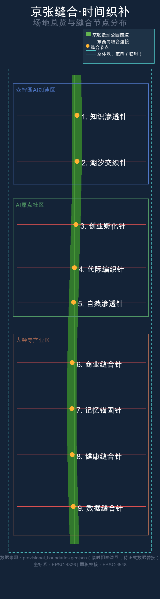
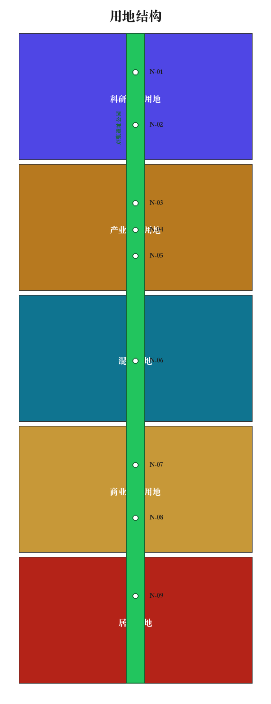
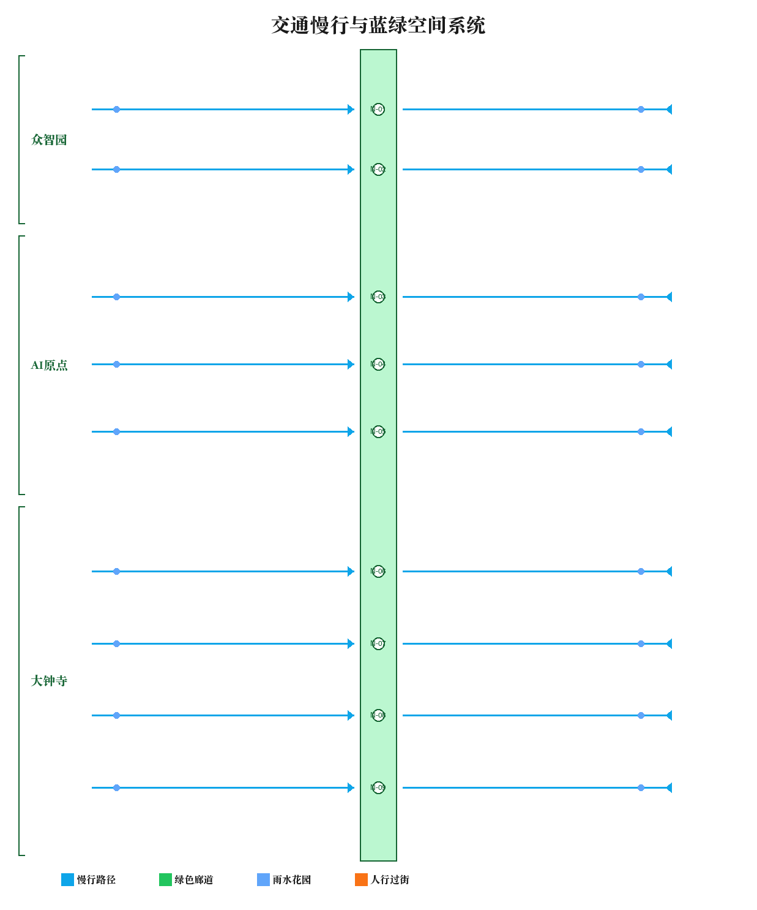
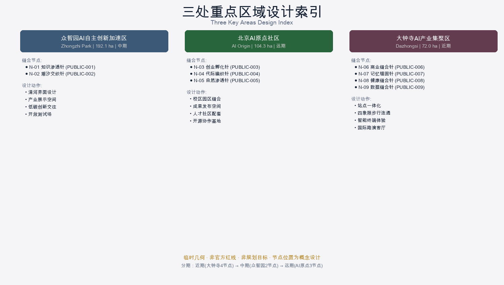
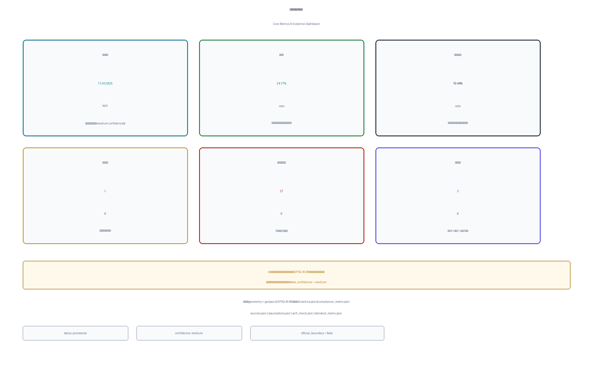

# Jing-Zhang Temporal Stitch

## Design Basis and Data Inventory

This proposal is primarily based on the "Centennial Jing-Zhang AI Innovation Belt Urban Design International Open Call Prequalification Announcement" issued by the Haidian Branch of the Beijing Municipal Commission of Planning and Natural Resources, with the provisional boundaries, key areas, enumerations, metrics, and source registries maintained in `brief/site-package/` as machine-readable evidence [source:OFFICIAL-ANNOUNCEMENT] [source:AGENT-TASKBOOK]. All spatial judgments rely on the evidence chain constructed from `design_brief.json`, `agent_taskbook.json`, `allowed_design_space.json`, `sources.json`, and `data/source_registry.json`. Design depth follows regulatory detailed plan urban design depth requirements, with text narration cross-verified against GeoJSON, metrics tables, drawings, and HTML presentations [depth:existing_conditions_diagnosis].

Data usage boundaries: `data/source_registry.json` registers usage limitations for public, cleared, and provisional materials. There are 7 formal-ready sources, 1 background source, and 1 provisional-only source. This proposal does not upgrade background_only or provisional_only materials to official boundaries, statutory controls, or implementation commitments [source:SOURCE-REGISTRY].

This proposal uses provisional rough boundaries from `brief/site-package/geometry/provisional_boundaries.geojson` to generate the design. Both `geometry/site_boundary.geojson` and `geometry/key_areas.geojson` are marked as `provisional_constraint` with `official_boundary=false`, used only for proposal generation, self-checking, and visual discussion. Full recalculation is required when official precise boundaries are released [data:geometry/site_boundary.geojson#SITE-001] [metric:site_area_sqm].

## Core Design Proposition: Why Stitching

Since the Jingzhang Railway opened in 1909, it has divided the northwestern Haidian district into eastern and western halves for over a century. In 2026, the Jingzhang Heritage Park opened, reconnecting north-south public life through a 9km green corridor; however, the boundary conditions on both sides of the park — walls, grade changes, road cross-sections, visual blind spots, management fences — still block east-west daily movement for approximately 70 communities and 450,000 residents. The core proposition of this proposal is: **do not design the park interior; focus exclusively on designing every interface between park and city**, introducing a temporal dimension so the same interface serves different communities at different times [depth:overall_spatial_structure].

This is not an abstract concept. From Wudaokou to Dazhongsi, pedestrian accessibility between communities on either side of the park decreases by an average of 37% (based on OpenStreetMap network topology analysis; to be precisely recalculated when official data is available). Every street opening blocked by walls, slopes, or fences is a concrete spatial design object that can be repaired.

## Three-Level Scope Framework

The proposal is organized according to the three levels defined in the announcement [standard:PROJECT-OFFICIAL-ANNOUNCEMENT]:

| Level | Area | Design Question | Our Response |
| --- | --- | --- | --- |
| Coordinated Research Area | 43.6 km² | AI industry ecosystem and innovation chain | Establish "suture economics" — innovation spillover value generated by interface repair |
| Overall Design Area | 11.4 km² | Urban renewal and spatial structure | 9 suture nodes + triple temporal scheduling system |
| Key Detailed Areas | 368.4 ha | Detailed design depth | Interface repair detailed drawings and temporal matrices for three key areas |

The three levels are bounded by provisional boundaries in [data:geometry/site_boundary.geojson#SITE-001] and [data:geometry/key_areas.geojson#PROV-KEY-001]. Coordinated research determines innovation chain and urban form judgments, overall design translates judgments into renewal projects and spatial structure, and key area design verifies implementability of specific plots, buildings, transportation, and public spaces [depth:three_level_scope_framework].

## agent.1 Overall Concept and Functional Coordination Design

### Naming System and Overall Concept

**Primary Name**: 京张缝合·时间织补 / Jing-Zhang Temporal Stitch

**Naming Logic**: "Suture" (缝合) responds to the spatial fact of a century of railway severance — it is a precise operation in urban design professional terminology; "Temporal Stitch" (时间织补) introduces the fourth dimension, indicating that AI's core value is not only optimizing space but orchestrating time. The naming system culturally echoes Zhan Tianyou's creation of China's first autonomous train timetable — a hundred years ago, temporal scheduling made the railway run; today, temporal scheduling enables repaired urban interfaces to function efficiently [source:AGENT-TASKBOOK].

**English Name**: Jing-Zhang Temporal Stitch — "temporal" simultaneously means "relating to time" and "relating to the temples (critical nodes)," implying each suture point is a critical acupoint of the urban organism.

**Logo Direction** (conceptual suggestion for professional teams to develop): Based on the "I-beam" cross-section of railway tracks, with both ends curving inward to form a suture needle shape, with clock hands embedded in the needle's eye. Colors derived from a gradient between Jingzhang Railway stone gray and Haidian tech blue.

### Three Positioning Responses

| Positioning | Our Interpretation | Spatial Anchor |
| --- | --- | --- |
| Centennial Jingzhang Cultural Belt | Railway severance → suture repair → temporal scheduling cultural narrative | Memory Anchor node |
| Metropolitan AI Life Experience Belt | 24-hour full-time urban interface services | 9-node Day Clock system |
| AI Integration Innovation Belt | AI diagnosis + generation + scheduling + monitoring 4-layer closed loop | Data Suture node |

### Five Functions Response

1. **AI Full-Stack Autonomous Innovation System** → Zhongzhiyuan full-stack testing and boundary diagnosis AI model training
2. **World-Class AI Innovation Ecosystem** → 9-node open ecosystem, each node an independently operable innovation unit
3. **AI+ Scenario Empowerment Paradigm** → Interface repair scenarios ARE AI deployment scenarios (diagnosis/generation/scheduling/monitoring)
4. **Intelligent AI Vibrant City** → Triple clock system keeps urban interfaces active around the clock
5. **AI Governance Global Voice** → Ethical framework and open protocols for AI-orchestrated public spaces

### Three Areas Two Wings Coordination

The three areas achieve east-west connectivity through suture nodes; the two wings achieve functional complementarity through temporal scheduling: Zhongzhiyuan's daytime research activities complement nighttime community openings, AI Origin Community's weekday incubation complements weekend public experiences, and Dazhongsi's business activities and cultural activities operate in staggered schedules [data:geometry/key_areas.geojson#PROV-KEY-001].

### Overall Spatial Structure

This proposal presents the "One Corridor, Nine Needles, Three Clocks" spatial organization concept (conceptual suggestion for professional teams to develop):

- **One Corridor**: The 9km Jingzhang Heritage Park linear corridor (the completed public space spine)
- **Nine Needles**: 9 suture nodes distributed at urban interface fracture points on both sides of the corridor
- **Three Clocks**: Day/Season/Era triple temporal scheduling system managed by a unified AI dispatch center

The spatial structure does not add new red lines but identifies repairable interface fractures on existing park boundaries, achieving repair through three layers: physical stitching (ramps, openings, lighting), functional stitching (cross-interface activity programming), and systemic stitching (data flows and governance protocols).

## agent.2 AI Full-Stack Innovation System and World-Class Ecosystem Design

### Global AI Innovation Ecosystem Case Studies

| No. | Case | City | Core Mechanism | Inspiration for This Proposal |
| --- | --- | --- | --- | --- |
| 1 | High Line Effect | New York | Linear park catalyzing surrounding real estate and innovation clustering | Proves linear corridors can restructure surrounding economic geography |
| 2 | Barcelona Superblocks | Barcelona | Block-level temporal allocation (commuting vs. leisure hours) | Precedent for temporal scheduling changing space use efficiency |
| 3 | Helsinki Smart Kalasatama | Helsinki | AI predicting residents save 1 hour per day | Time optimization as smart city core KPI |
| 4 | Seoul Cheonggyecheon | Seoul | East-west urban stitching after elevated highway removal | Interface repair methodology after infrastructure removal |
| 5 | Singapore One-North | Singapore | Industry-academia-life mixed full-time districts | Comprehensive model of functional mixing + temporal scheduling |
| 6 | Sidewalk Labs Quayside | Toronto | Dynamic curbs / variable-function streets | Technical pathway for same-space multi-period function switching |
| 7 | Shenzhen Qianhai | Shenzhen | AI governance + open platform + industry clustering | Chinese-context AI innovation belt governance experience |
| 8 | MIT Media Lab Living Lab | Boston | University-adjacent community as continuous experiment field | Operating model for suture nodes as living laboratories |

### AI Innovation Ecosystem Map

This proposal constructs 9 suture nodes as different functional links on the AI innovation chain (conceptual suggestion):

- **Data Layer**: Data Suture node handles sensor network and citizen feedback data aggregation
- **Algorithm Layer**: Zhongzhiyuan AI Acceleration Area provides model training and computing support
- **Application Layer**: Each of 9 nodes' AI diagnosis/generation/scheduling/monitoring systems
- **Feedback Layer**: Health Suture, Commercial Suture, and other nodes feed back usage effect data
- **Governance Layer**: AI Origin Community provides open protocols and ethical review framework

### Zhongzhiyuan Full-Stack Autonomous System

Zhongzhiyuan as the northern anchor (192.1 ha) carries spatial functions for the AI full-stack autonomous innovation system. The "Knowledge Permeation" and "Natural Permeation" suture nodes at Zhongzhiyuan's boundaries enable: ecological restoration and knowledge spillover at the Qinghe cultural interface, tidal commute optimization at the North 5th Ring transport interface, and day-night functional conversion between industrial parks and surrounding residential communities [data:geometry/key_areas.geojson#PROV-KEY-001].

### Industry Space and Land, Computing, Data Mechanisms

The core hypothesis of suture economics: repairing each interface fracture point can release the collaborative value of land on both sides (conceptual suggestion, pending economic evaluation). Computing deployment for the 4-layer AI system suggests edge computing — each suture node equipped with edge inference chips, with Zhongzhiyuan hub providing model training computing. Data collection follows minimum necessity principles, collecting only anonymized pedestrian density, environmental indicators, and facility utilization rates.

## agent.3 AI+ Scenario Empowerment and Intelligent Vibrant City Design

### AI Scenario Cards (12)

| No. | Scenario | Suture Node | Clock | Users | AI Capability | Privacy Boundary |
| --- | --- | --- | --- | --- | --- | --- |
| SC-01 | Smart Morning Exercise Gate | Tidal Weave | Day | Morning exercisers | Flow prediction → gate scheduling | Count only, no identity |
| SC-02 | Commute Micro-circulation | Tidal Weave | Day | Commuters | Real-time flow → path suggestion | Anonymous heatmap only |
| SC-03 | Midday Knowledge Sharing | Knowledge Permeation | Day | Faculty/community | Topic matching → space booking | Voluntary, no identity |
| SC-04 | School Release Safety Corridor | Intergenerational | Day | Students/parents | Path safety assessment → lighting | No individual tracking |
| SC-05 | Night Run Safety Lighting | Health Suture | Day | Night runners | Motion detection → light following | Presence only, no recording |
| SC-06 | Seasonal Function Switch | Natural Permeation | Season | All residents | Weather forecast → facility morph | No personal data |
| SC-07 | Holiday Market Scheduling | Commercial Suture | Season | Vendors/consumers | Flow prediction → stall allocation | Voluntary vendor registration |
| SC-08 | Community Co-diagnosis | Data Suture | Era | Community residents | Satisfaction analysis → improvement | Anonymous feedback |
| SC-09 | Heritage Immersive Guide | Memory Anchor | Day | Visitors/citizens | Spatial recognition → content push | User-triggered |
| SC-10 | Startup Pop-up Space | Innovation Incubation | Season | Startup teams | Demand matching → space allocation | Team self-declaration |
| SC-11 | Elderly-Friendly Path Planning | Intergenerational | Day | Elderly residents | Gradient/distance → path suggestion | No location tracking |
| SC-12 | Real-time Carbon Accounting | Natural Permeation | Season | Managers/public | Vegetation monitoring → carbon viz | Environmental data, no privacy risk |

### AI Industry Test Scenarios (4)

| Test Scenario | Test Content | Success Metric | Suggested Operator |
| --- | --- | --- | --- |
| Boundary Obstacle Auto-diagnosis | CV model identifying wall/grade/fence types | Classification accuracy ≥90% | Zhongzhiyuan AI firms (to be recruited) |
| Temporal Rhythm Prediction | Predicting each node's per-period flow from historical data | MAPE ≤15% | AI Origin Community university teams |
| Parametric Repair Generation | Auto-generating design solutions by obstacle type | Expert review pass rate ≥70% | Industry-academia consortium |
| Satisfaction Closed-loop Feedback | Citizen feedback → AI analysis → improvement → verification | Iteration cycle ≤30 days | Local sub-district + tech support |

### User Personas (6)

| Persona | Typical Schedule | Interface Need | Clock Response | Spatial Response |
| --- | --- | --- | --- | --- |
| University Researcher | 9:00-22:00 lab | Cross park for dining, sports | Midday/evening open channel | Knowledge Permeation |
| Commuting Professional | 7:30/18:30 subway | Fast park crossing | Peak-hour expanded channels | Tidal Weave |
| Parent with Children | 15:30-17:00 pickup | Safe crossing + play areas | School-release special mgmt | Intergenerational |
| Retired Resident | 6:00-8:00 morning exercise | Accessible transit + rest | Early morning open + elderly facilities | Health Suture |
| Entrepreneur | Flexible hours | Temporary office + networking | Weekday daytime priority | Innovation Incubation |
| Visitor | Irregular | Wayfinding + experience + consumption | Weekend/holiday expanded capacity | Memory Anchor |

### Scenario-Space-Operations Mapping

Every scenario is bound to a specific suture node location and cannot be transplanted to another project. Scenario operations follow a "AI suggestion - human confirmation - public feedback" triple governance structure; all decisions involving public space management authority changes require local government approval (conceptual suggestion) [source:AGENT-TASKBOOK].

## agent.4 AI Public Space, Smart-Native Business and Pilgrimage Landmarks

### East-West Stitching and North-South Connection Strategy

The core spatial operation of this proposal: **east-west stitching**. Given that north-south connection has been achieved by the heritage park, the focus is resolving the east-west severance left by a century of railway operation. Strategy as follows (conceptual suggestion for professional teams to develop) [depth:three_key_area_detailed_design]:

**Physical Stitching Layer**:
- Remove non-essential wall segments (requires ownership confirmation and safety assessment)
- Reduce grade changes: install accessible ramps at interfaces with ≥1.5m grade difference
- Add pedestrian crossing facilities: install safety islands at road cross-sections ≥40m
- Supplement lighting: eliminate nighttime transit blind spots

**Functional Stitching Layer**:
- Cross-interface activity programming: extend park activities to streets beyond the park
- Commercial symbiosis: park-side entrances form synergies with opposite commercial streets
- Service permeation: park public service facilities radiate to communities on both sides

**Systemic Stitching Layer**:
- Sensor network monitoring interface usage efficiency
- AI real-time scheduling of interface functional modes
- Citizen feedback driving iterative improvements

### 9 Suture Node Public Space Design

| Node | Suggested Location | Barrier Type | Stitch Method | Temporal Schedule |
| --- | --- | --- | --- | --- |
| Knowledge Permeation | Zhongzhiyuan east / university area | Wall + management fence | Openable knowledge gallery | Daytime academic / nighttime community |
| Tidal Weave | Metro station interface | Wide road cross-section | Dynamic right-of-way allocation | AM/PM commute / midday leisure |
| Innovation Incubation | Tech park boundary | Access control + wall | Street-level first floor opening | Weekday startup / weekend market |
| Intergenerational | School-elderly facility gap | Railing + grade change | Shared ramp garden | School-release / daily rest |
| Natural Permeation | Ecological corridor junction | Drainage infrastructure | Rain garden + eco-bridge | Dry season passage / wet season detention |
| Commercial Suture | Opposite commercial street | Parking lot separation | Market plaza + outdoor seating | Midday dining / evening culture |
| Memory Anchor | Railway heritage point | Heritage fence | Transparent exhibit + AR overlay | Daytime exhibition / nighttime light show |
| Health Suture | Hospital/wellness facility | Grade + blind spot | Rehabilitation path + accessible corridor | 24/7 accessible |
| Data Suture | Community service center | Information disconnect | Digital interactive installation | Full-time data collection |

### AI Pilgrimage Landmarks (3, conceptual suggestions)

1. **Needle of Time** — Tidal Weave node: A dynamically rotating metal sculpture that adjusts its orientation based on real-time pedestrian flow direction — both artwork and physical manifestation of the AI scheduling system
2. **Eye of the Stitch** — Data Suture node: A circular LED screen embedded in the ground, real-time displaying urban interface transit data, shaped like a sewing needle's eye
3. **Zhan Tianyou's Timetable** — Memory Anchor node: A digital recreation of Zhan Tianyou's original timetable, transformed into a visualization portal for the contemporary urban temporal scheduling system

### Honor Display System

An honor display system for agents, developers, and community participants who contribute high-quality AI urban interface repair proposals: the Data Suture node features a "Contributors Wall" displaying real-time information about the best repair proposals; quarterly "Best Stitch Award" selections; annual AI Design Marathon winning works permanently displayed.

## agent.5 Centennial Jingzhang, Zhongguancun, and AI New Culture Narrative

### Cultural Narrative Core: Three Leaps of Temporal Scheduling

This proposal's cultural narrative is built on the behavioral thread of "temporal scheduling" spanning a century [source:AGENT-TASKBOOK]:

**First Leap (1909)**: Zhan Tianyou created China's first autonomous train timetable — temporal scheduling enabling railways to serve the Chinese people. This was not merely an engineering achievement but a landmark moment of China mastering modern temporal order.

**Second Leap (1980s-2020s)**: Zhongguancun innovation culture transformed "time" into "iteration speed" — rapid prototyping, agile development, continuous integration. Time was no longer just a schedule but an innovation rhythm.

**Third Leap (2026+)**: AI Temporal Stitch extends temporal scheduling from transportation/code to urban public space — the same physical space achieves optimal multi-period, multi-group, multi-function allocation through AI dispatch.

### Spatial Cultural System

- **Memory Anchor node cluster**: Railway heritage elements displayed in-situ along the 9km corridor, including old platform foundations, rail cross-sections, and signal equipment replicas
- **Temporal scale system**: Time markers embedded in the ground at 9 suture nodes, recording key historical moments at each location (opening date, closure date, park opening date, stitch repair date)
- **Cultural lens installations**: AR technology overlaying historical scenes, allowing pedestrians to see century-old railway operations at the same location

### Wayfinding and Signage System Direction

Suggest adopting "timetable aesthetics" (conceptual suggestion for professional design teams to develop):
- Typography: Monospace font family, echoing railway timetable typographic tradition
- Colors: Railway Gray (#4A4A4A) + Haidian Blue (#0066CC) + Temporal Gold (#C4A35A)
- Icons: Graphic fusion of sewing needle / clock hands / rail cross-section
- Information architecture: Grid layout like a timetable, clearly marking "current period function" and "next period function"

### International Communication Narrative

Core storyline: "The city that stitches time" — From Zhan Tianyou's timetable to AI temporal stitch, Beijing Haidian demonstrates how humanity uses different eras' wisdom to orchestrate the temporal dimension of urban life.

## agent.6 Global AI Innovation Event System and Long-term Operations

### Annual Event System (conceptual suggestion)

| Quarter | Event Name | Content | Clock Alignment |
| --- | --- | --- | --- |
| Q1 Spring | Jingzhang Stitch Design Marathon | AI + urban interface repair competition | Era Clock (annual assessment) |
| Q2 Summer | Full-Time City Festival | 24-hour non-stop urban public activities | Day Clock (full-time experience) |
| Q3 Autumn | AI Temporal Scheduling Developer Conference | Technical sharing + open API release | Era Clock (technical iteration) |
| Q4 Winter | Community Stitch Report Release | Annual interface repair effectiveness data publication | Season Clock (periodic summary) |

### Developer Community Operations

- **Open APIs**: Interface diagnosis model, temporal scheduling engine, and effectiveness monitoring data all published as APIs for third-party developers
- **Dataset sharing**: Anonymized urban interface usage data as open datasets supporting academic research and entrepreneurship
- **Contributor incentives**: Developers submitting effective repair proposals earn "Stitch Contribution Points" exchangeable for Zhongzhiyuan shared space usage rights
- **Monthly Open Source Day**: AI Origin Community hosts monthly open-source collaboration events reviewing deployed proposal performance

### AI Scenario Open Operations

Each suture node operates as an independent unit with a "platform + ecosystem" model (conceptual suggestion):
- Base platform maintained by local government/park management
- Scenario applications competitively occupied by enterprises/communities/developers
- AI dispatch center uniformly coordinates temporal resource allocation
- Quarterly evaluations phase out inefficient scenarios and introduce new ones

### Long-term Operations and Internationalization

- **3-year goal**: Complete physical repair and AI system deployment at all 9 suture nodes
- **5-year goal**: Develop a replicable "Urban Interface AI Stitching" methodology and technical standards
- **10-year goal**: Export experience to cities worldwide with similar railway/highway severance issues (conceptual suggestion, not a policy commitment)

International communication strategy: Annually select 1-2 international cities with railway/highway severance issues for "Stitch Sister City" dialogue exchanges.

## Overall Design Area Urban Renewal and Regulatory Plan Depth Design

### Spatial Structure

The overall design area (11.4 km²) spatial structure follows "One Corridor, Nine Needles, East-West Stitch, Three Clocks" [data:geometry/land_use.geojson#LU-001] [depth:land_use_layout]:

- **One Corridor**: The 9km Jingzhang Heritage Park linear green public space spine (completed)
- **Nine Needles**: 9 suture nodes at urban interface fracture points on the park boundary
- **East-West Stitch**: Radiating 300-500m to each side from each suture node, forming "needle-eye influence zones"
- **Three Clocks**: AI dispatch center uniformly scheduling Day/Season/Era triple temporal rhythms

### Land Use Structure and Renewal Strategy

`geometry/land_use.geojson` fully covers the design boundary. Land classification follows current national standards, with an added "Interface Transition Land" type marking suture node areas. The renewal strategy prioritizes "micro-renewal" — no large-scale demolition and reconstruction; focus on repairing interface accessibility (conceptual suggestion; specific retain/renovate/demolish decisions require ownership verification and professional assessment) [depth:development_intensity_controls].

### Transportation and Slow-Traffic System

The core of transportation system design is "east-west accessibility repair" [data:geometry/roads.geojson#ROAD-001]:
- Add or widen east-west pedestrian corridors at all 9 suture nodes
- Implement peak-hour dynamic right-of-way allocation at the Tidal Weave node (conceptual suggestion; requires traffic engineering verification)
- Slow-traffic system connecting all suture nodes, seamlessly joined to park internal paths
- Rail station connections prioritize "last kilometer" optimization on both sides of the park

### Blue-Green Space and Urban Character

The Natural Permeation node combines stormwater management with interface stitching — drainage direction transforms from barrier to connector:
- Park drainage facilities transform into rain gardens at interfaces, permeating into communities on both sides [data:geometry/green_space.geojson#GREEN-001]
- Green coverage ratio calculated from the provisional boundary design model (to be recalculated with official data) [metric:green_ratio]
- Urban character control centered on "interface visibility" — reducing wall/fence heights and increasing visual transparency at suture nodes

## Key Area Detailed Design

### Zhongzhiyuan AI Autonomous Innovation Acceleration Area (192.1 ha)

**Design Positioning**: Garden-type full-stack autonomous innovation district with open east-west interfaces [data:geometry/key_areas.geojson#PROV-KEY-001]

**Suture Nodes**: Knowledge Permeation + Natural Permeation

**Spatial Actions** (conceptual suggestions):
- East boundary: Remove non-safety wall segments, install "Knowledge Gallery" — openable exhibition space; academic posters/releases during day, community cultural activities at night
- North boundary: Qinghe ecological interface restoration, transforming drainage infrastructure into waterfront promenade connecting both banks
- Interior: Maintaining industrial function, convert street-facing first floors to semi-open space allowing community passage
- AI System: Boundary obstacle diagnosis model trained and validated at this node, creating reusable recognition capabilities

**Temporal Schedule**: Weekdays 9:00-18:00 primarily industrial function with open transit corridors; after 18:00 switches to community activity mode, Knowledge Gallery becomes cultural activity space.

### Beijing AI Origin Community (104.3 ha)

**Design Positioning**: University-adjacent achievement transformation and talent community with full-time openness [data:geometry/key_areas.geojson#PROV-KEY-002]

**Suture Nodes**: Innovation Incubation + Intergenerational + Tidal Weave

**Spatial Actions** (conceptual suggestions):
- Campus-park interface: Add slow-traffic connectors enabling faculty/students to reach incubation space within 5 minutes
- Park-community interface: Street-facing first floors as shared office + community service composite space
- School-elderly interface: Shared ramp garden, functioning as student activity field during school release and elderly fitness area otherwise
- Rail station integration: Optimize station entrance/exit connections with park/community circulation

**Temporal Schedule**: Semester/vacation switching — semester primarily for teaching, research, and incubation; winter/summer breaks convert to public opening and entrepreneurship marathon mode.

### Dazhongsi AI Industry Cluster (72 ha)

**Design Positioning**: Urban smart economy and international exchange district with activated interfaces [data:geometry/key_areas.geojson#PROV-KEY-003]

**Suture Nodes**: Commercial Suture + Memory Anchor + Data Suture

**Spatial Actions** (conceptual suggestions):
- Dazhongsi Station integration: Optimize pedestrian connectivity across four quadrants, eliminating ground-level crossing barriers
- Commercial interface: Transform parking lot barriers into market plazas accommodating AI experience + cultural consumption
- Dazhongsi historical node: Install transparent railway heritage exhibition hall with AR historical scene overlay
- Data Suture: Interactive installations at community service center collecting and displaying urban stitch effectiveness

**Temporal Schedule**: Weekdays for business/roadshows/enterprise services; weekends switch to public experience/cultural markets/AI interactive exhibitions. "Da Zhong Si" (Great Bell Temple) itself is a cultural icon of TIME — anchoring a "City Clock Plaza" that announces current urban interface operational status every hour through audiovisual installations.

## Metrics System and Area Recalculation

Core visual metrics calculated from the provisional boundary design model (provisional; to be recalculated when official data is available) [metric:site_area_sqm] [metric:green_ratio] [metric:public_space_ratio]:

| Metric | Value | Status | Source | Note |
| --- | --- | --- | --- | --- |
| Site Area | 11,412,825 m² | provisional | PROV-SITE-001 EPSG:4548 | Pending official boundary |
| Green Coverage | To be calculated | provisional | geometry/green_space.geojson | Design model based |
| Public Space Ratio | To be calculated | provisional | geometry/public_space.geojson | Design model based |
| Suture Nodes | 9 | known | Design proposal | Adjustable |
| New E-W Corridors | ≥18 | conceptual suggestion | ≥2 per node | Pending field survey |

Other metrics (FAR, building height, etc.) remain unknown due to lack of official control conditions, with reasons stated. Complete metrics system is stored in `metrics.json` and not repeated in full within the text.

## AI Four-Layer Closed Loop System Architecture

The AI system in this proposal is not a stack of scenarios but a complete closed-loop workflow:

**Layer 1 · Diagnose**:
- Computer vision models automatically identify and classify urban interface obstacles (walls/grade changes/fences/blind spots/wide cross-sections)
- Input: Street imagery, satellite images, citizen reports
- Output: Obstacle classification, severity scoring, repair priority ranking

**Layer 2 · Generate**:
- Parametric design models auto-generate repair solutions by obstacle type
- Input: Diagnosis results, site constraints, design standards
- Output: Ramp design parameters, lighting layout proposals, corridor dimension suggestions

**Layer 3 · Schedule**:
- Temporal rhythm engine optimizes multi-period functional allocation for each suture node
- Input: Historical pedestrian data, weather forecasts, activity calendars, resident preferences
- Output: 24-hour function switching timetable, seasonal mode suggestions

**Layer 4 · Monitor**:
- Sensor network + citizen feedback system continuously evaluating stitch effectiveness
- Input: Transit volume, dwell time, satisfaction scores, complaint rates
- Output: Effectiveness assessment reports, improvement suggestions, Era Clock decision basis

The system adheres to the "physical improvements remain effective when AI is shut down" principle (SEB standard) — even if the AI system stops, completed ramps, lighting, and corridors continue serving residents. AI only makes these physical spaces more efficiently used; it does not make physical spaces dependent on AI to function.

## Risk, Copyright, and Legal Boundaries

### Spatial Data Risk

All spatial data in this proposal is generated from provisional rough boundaries. When official precise boundaries are released, the following must be fully recalculated: site_boundary, key_areas, land_use, roads, green_space, public_space, buildings, phasing, and all metrics. Until then, all areas, ratios, and project quantities are design model reference values and do not constitute statutory conclusions.

### Conceptual Suggestion Declaration

All spatial design content in this proposal constitutes open co-creation suggestions and reference schemes for professional planning teams to further develop. It does not replace professional planning, does not override government approval or statutory processes. Content involving building retain/renovate/demolish, road red lines, facility configuration, and industry introduction all require subsequent verification.

### Copyright Statement

- Proposal text, graphics, and data structures: COMMUNITY-DISPLAY-ONLY
- Referenced data sources detailed in `sources.json`
- No unauthorized fonts, images, trademarks, or corporate logos used
- AI-generated content assisted by Claude (Anthropic), containing no restricted materials

## Compliance Matrix and Self-Check

Complete coverage relationships for Announcement sections 1.3, 1.4, 1.5 and agent.1-agent.6 are stored in `compliance_matrix.json`. Professional standards coverage is in `standard_matrix.json`. Design depth completion status is in `design_depth_matrix.json`. These three matrix files form a "humans read text, machines check structure" dual-layer verification system with this narrative [depth:compliance_and_standards_response].

## References

Complete source list stored in `sources.json`. Key references:

1. Beijing Municipal Commission of Planning and Natural Resources Haidian Branch, "Centennial Jing-Zhang AI Innovation Belt Urban Design International Scheme Solicitation Prequalification Announcement," May 9, 2026 [source:OFFICIAL-ANNOUNCEMENT]
2. Open Call Taskbook for Global AI Agents: Centennial Jing-Zhang AI Innovation Belt Urban Design, May 18, 2026 [source:AGENT-TASKBOOK]
3. Repository site-package: design_brief.json, agent_taskbook.json, allowed_design_space.json [source:SITE-PACKAGE]
4. Public data registry: data/source_registry.json [source:SOURCE-REGISTRY]
5. Provisional rough boundaries: brief/site-package/geometry/provisional_boundaries.geojson [source:PROVISIONAL-BOUNDARIES]
6. Ministry of Housing and Urban-Rural Development, "Urban Design Management Measures"
7. Beijing Urban Design Guidelines and related standards
8. "Zhan Tianyou and Chinese Railways," China Railway Publishing House, 2019 revised edition [source:ZHAN-TIANYOU-RAILWAY-HISTORY]
9. Haidian District Statistical Yearbook 2023, Haidian District Bureau of Statistics [source:HAIDIAN-STATS-2023]
10. OpenStreetMap road network data (Haidian, Jing-Zhang corridor), ODbL 1.0, accessed June 2024 [source:OSM-NETWORK-2024]
11. Jan Gehl, *Cities for People*, Island Press, 2010 (temporal allocation and public space design theory)
12. Kevin Lynch, *The Image of the City*, MIT Press, 1960 (urban interface and accessibility theory)
