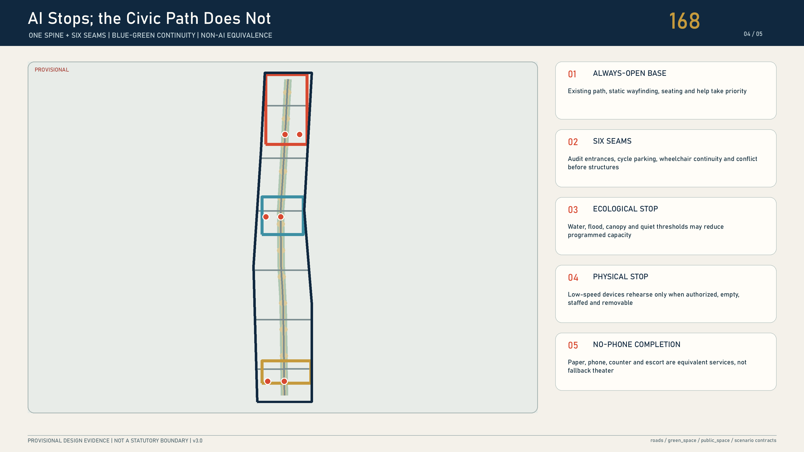

# Jingzhang 168: The Civic Timetable

> **One-sentence proposal.** The park stays open while AI arrives by timetable. A delayed service must be visible, a failed service must have a human conductor, and a suspended service must never block the civic path. Jingzhang's contemporary legacy is not railway-shaped decoration; it is measurement, timing, handover, delay explanation, and recovery made civic responsibility.

## Executive summary

**The site conflict.** Jingzhang Railway Heritage Park is not a blank site waiting to be “AI-enabled.” Official sources state that planning began in 2019 for an approximately 9 km corridor; about 6 km of high-speed rail runs underground while the operating Line 13, complex interests, and nearly twenty universities and research institutes overlap. A first phase of about 2.5 km and 16.8 ha is already open. Beijing's park directory lists the existing heritage park as free, reservation-free, and open 24 hours [source:OFFICIAL-PARK-PLAN-2021] [source:OFFICIAL-PARK-PHASE1-2023] [source:OFFICIAL-PARK-DIRECTORY-2025]. The design therefore asks one hard question: **How can AI innovation be tested without converting a public park into a gated technology exhibition?**

**The spatial answer.** Layer 0 is an unclosable civic base: existing public paths, static bilingual maps, shade and seating, paper information, and human/telephone help remain available without an account, booking, network, or AI. Layer 1 contains scheduled AI services that may “arrive” only with a named human, non-AI equivalent, minimum-data contract, stop threshold, and restoration receipt. Three station prototypes turn the relationship into section: Zhongzhi Validation Yard is “public observation edge—scheduled test court—isolated back-of-house”; AI Origin Open Transfer Hall is “public front counter—translation workshop—controlled back room”; Dazhongsi Civic Terminal is “always-open ground—staffed counter—synthetic transaction sandbox” [data:visual/assets/station-prototypes.json].

**The operating answer.** Twelve services are no longer a generic AI+ list. They comprise three industrial validations in the north, four knowledge-transfer services in the middle, and five everyday civic services in the south. Every service names a platform, window, human conductor, prohibited data, non-AI equivalent, stop trigger, reset action, and expected receipt [data:visual/assets/civic-timetable.json]. The state machine remains `proposed → admitted → scheduled → active → paused → returned → audited → archived`, with one constitutional rule: **AI may stop; the civic base may not.**

**The executable answer.** `visual/assets/tabletop-runner.js --check` runs six synthetic branches for each of twelve contracts: nominal, missing human, missing non-AI path, prohibited data, blocked public path, and post-stop reset. The 72 cases include 24 stop branches and 12 reset branches [metric:tabletop_case_count] [data:visual/assets/timetable-tabletop-evidence.json]. The runner has no network or device I/O, uses no real personal data, and keeps `field_performance=null`. PASS proves contract and failure-path closure only, never field success [assumption:A-TABLETOP-001].

**The first slice.** The first 168 hours still contain only paper publication, staffed counters, accessibility and quiet walks, shadow mode, offline exercises, public co-review, clearance, and audit. There is no permanent construction, production account, or road-right change. At week 12 an independent review may continue, narrow, or archive. A complete contract is not one in which technology always succeeds; it is one in which every failure can be seen, stopped, restored, and assigned a receipt.

## Design Basis and Source List

### Evidence hierarchy and limits

The proposal uses five evidence levels. The official announcement and public task documents control scope but do not automatically supply survey-grade geometry [source:OFFICIAL-ANNOUNCEMENT] [standard:PROJECT-OFFICIAL-ANNOUNCEMENT]. Beijing and Haidian authority pages provide current park, renewal, heritage, and AI-policy context without replacing project approval. The agent taskbook controls the six AI-agent tasks, ten principles, branding, scenarios, personas, and operations [source:AGENT-TASKBOOK] [standard:PROJECT-AGENT-OPEN-CALL-TASKBOOK]. The repository site package, registry, and provisional geometry create a reproducible design base [source:SITE-PACKAGE] [source:SOURCE-REGISTRY]. International cases compare mechanisms only, never Beijing statutory parameters.

The repository public draft `brief/public-brief.md` only supplements development aspirations, priority directions, and public-data boundaries [source:PUBLIC-BRIEF-DRAFT]. Because its `published_at` remains TBD, this proposal treats it strictly as background and never as proof of an official boundary, statutory control, committed implementation, or government decision.

Urban-design reasoning follows the public frameworks for urban-design administration, regulatory planning, and land-use classification [standard:MOHURD-URBAN-DESIGN-MEASURES] [standard:MOHURD-CONTROL-DETAILED-PLANNING] [standard:MNR-LAND-USE-CLASSIFICATION-GUIDE]. Architecture, mobility, utilities, fire, heritage, structure, privacy, accessibility, labor, and law still require competent professional review. AI does not fill missing conditions by inference.

### Usability register

| Category | Usable in v3.0 | Must not be read as | Update trigger |
|---|---|---|---|
| Task basis | Three scopes, six agent tasks, delivery depth | Government adoption or implementation promise | Official addendum |
| Provisional boundaries | Topology, option comparison, recalculation workflow | Statutory line or ownership area | Official polygon |
| Conceptual buildings | Shared-ground-floor and renewal tests | Existing-condition survey or demolition quantity | Building and title survey |
| Case material | Temporal sharing, trials, and collaboration mechanisms | Imported institutions or intensity | Evidence of local mismatch |
| Operating protocol | First-week pilot, audit fields, and exit | Established government operating arrangement | Co-design and legal review |
| Existing park | Current 24-hour, free, no-reservation baseline | The entire provisional range is built or freely programmable | Operator, field, and official-data check |
| Three renewal areas | Public renewal direction, coordinating context, and anchors | Exact parcel, title, or approved building action | Official drawings, project list, professional review |

The overall geometry is provisional [data:geometry/site_boundary.geojson#SITE-001], as are the three key areas [data:geometry/key_areas.geojson#PROV-KEY-001]. The repository also records an approximately 412.5 m nearest-distance, zero-overlap background discrepancy between a public OSM park object and the provisional overall range. That discrepancy must be exposed, but it is not authority to replace or shift the boundary [assumption:A-OSM-DISCREPANCY-001]. `geometry/constraints.geojson` records operating locators only and does not fabricate official controls [assumption:A-LOCATOR-001]. Missing statutory plan, title, utility, fire, heritage, ecology and accessibility evidence remains fail-closed at G0 and G4 [assumption:A-CONTROLS-001].

### How claims are audited

The narrative places no more than three direct evidence markers beside one judgment. Complete indices live in `sources.json`, `metrics.json`, `standard_matrix.json`, `design_depth_matrix.json`, and `compliance_matrix.json`. Figures explain; GeoJSON and JSON permit audit. If they conflict, the machine asset and higher-grade evidence prevail. Replacing the official boundary triggers full-chain recalculation, not selective number editing [assumption:A-BOUNDARY-001] [depth:metrics_recalculation].

## Three-Level Scope Framework

### One chain across three scales

| Level | Core question | Spatial evidence | Design depth | Output |
|---|---|---|---|---|
| Coordinated research | How do industry, talent, and knowledge circulate? | Approximately 43.6 km² task extent, pending verification | Strategy and interfaces | Case mechanisms, regional interfaces, brand, index framework |
| Overall design | How do renewal, mobility, blue-green space, and service form a system? | [data:geometry/site_boundary.geojson#SITE-001] | Regulatory-plan-level design direction | Land use, network, projects, metrics, gates |
| Key areas | How do three districts become actionable prototypes? | [data:geometry/key_areas.geojson#PROV-KEY-001] | Comprehensive implementation-plan direction | Nodes, components, sections, timetable, responsibility cards |

All levels use a single “need–space–time–responsibility–evidence” chain [depth:three_level_scope_framework]. The coordinated level defines the regional collaboration task; the overall level translates it into three time zones and a continuous civic structure; key areas prove whether the mechanism is enterable, pausable, and restorable through twelve nodes and the first-week timetable. A failed local trial must change the overall rule instead of being hidden by promotional storytelling.

### Proper use of provisional geometry

The provisional overall area is approximately 11.4 km² and supports only version-internal calculations [metric:site_area_sqm]. Published task areas and current coarse key-area polygons are not the same survey product and are not combined. When official polygons arrive, the workflow locks the coordinate version, clips land-use and networks, recalculates areas and ratios, refreshes five figures, reassigns projects, and publishes a difference log. Until then, all placements remain directional [assumption:A-BOUNDARY-001].

### Common acceptance questions

Each level answers five questions: Who receives the public benefit? Is the spatial action legible? Is data minimized? Who may pause under which threshold? What evidence remains after restoration? A strategy without an implementable interface cannot move to overall design. An overall design without explicit constraint gates cannot move to key areas. A key-area action without a human equivalent and restoration action cannot enter the first-week schedule.

## Coordinated Research Area: Industry and Future City Research

### Three positions, five functions, three zones and two wings

The three positions are: a verifiable AI-autonomy corridor; an open trial belt that governs failure; and a future-city demonstrator measured by public time and rights. Five functions are R&D validation, transfer, enterprise service, talent life, and public culture. Validation, transfer, and city lounge form three zones; an eastern wing connects academic and research networks, while a western wing connects communities and industrial space. Collaboration is a loop of public issue, minimum contract, human admission, synthetic tabletop, small field slice, stop/reset, and public retrospective—not decorative arrows [source:AGENT-TASKBOOK].

This structure comes from the site rather than a generic innovation-district template. Public renewal information in the north names Zhongzhi Garden, Tencent Xuezhi Park, Dongsheng 604, and the Qinghe–Xiaoyue ecological connection. AI Origin is publicly described as an approximately 3 km² campus–park–street integration area. Dazhongsi renewal information emphasizes comprehensive renewal, public-commercial balance, and a phased project pipeline [source:OFFICIAL-ZHONGZHI-RENEWAL-2026] [source:OFFICIAL-AI-ORIGIN-2026] [source:OFFICIAL-DAZHONGSI-RENEWAL-2026]. These differences produce three station prototypes rather than one AI box with three labels.

Regional interfaces remain light and auditable. Universities share public research questions and equipment vacancy, not student profiles. Hospitals connect only public navigation and human appointments, not diagnosis. Firms share compliance questions and trial windows, not trade secrets. Communities share complaints, quiet periods, and accessibility blockers, not resident scores. Haidian, Changping, and other corridor nodes may exchange calendars and public outputs, but the proposal does not claim an adopted inter-district policy.

### Seven cases: mechanism translated, institution not copied

| Case | Transferable mechanism | Jingzhang 168 application | Explicit non-copy |
|---|---|---|---|
| Kalasatama | Value measured through residents' time | Service completion and takeover waiting | No imported target value [source:CASE-KALASATAMA] |
| Marineterrein | Real-world, small, reversible trials | Two-week minimum trial and reset mark | No copied site governance [source:CASE-MARINETERREIN] |
| one-north | work-live-play-learn mixing | One address, multiple time uses | No imported development intensity [source:CASE-ONE-NORTH] |
| Punggol | Space linked to learning systems | Night school, equipment slots, public calendar | No copied digital identity [source:CASE-PUNGGOL] |
| Knowledge Quarter | Institutions collaborate around issues | Public issue tickets and quarterly agenda | Membership count is not collaboration quality [source:CASE-KNOWLEDGE-QUARTER] |
| Paris-Saclay | Proof–maturity–transfer chain | G0–G7 evidence gates | No copied finance or governance [source:CASE-PARIS-SACLAY] |
| Kendall Square | Public space connects innovation actors | Time Park and twelve nodes | Land value does not replace public value [source:CASE-KENDALL] |

Four additional references stress-test the mechanism only. Singapore AI Verify shows why governance principles need testable records [source:CASE-AI-VERIFY]. The Dutch Algorithm Register and Helsinki AI Register show public-facing disclosure of purpose, responsibility, limitations, and contact [source:CASE-DUTCH-ALGORITHM-REGISTER] [source:CASE-HELSINKI-AI-REGISTER]. Seoul's Gyeongui Line Forest Park shows a rail corridor functioning as continuous everyday public space [source:CASE-SEOUL-GYEONGUI]. None supplies Beijing permission, scale, or performance values.

### Brand and cultural narrative

“Jingzhang 168” means the 168 hours of a week, railway timetable discipline, and a redeemable civic schedule. A seven-by-twenty-four grid forms “168.” Deep blue is the accountability base, warm white is vacancy, operating orange is admitted opening, and pause red is risk or exit. The bilingual wordmark is “京张168 / JINGZHANG 168,” with “把一周还给城市 / GIVE THE WEEK BACK TO THE CITY.” It must not resemble a government, railway-operator, or corporate mark.

The four-act narrative is measure, run, hand over, and restore. National Museum material on Jingzhang engineering measurement reminds us that its legacy begins with rigor about terrain, error, and responsibility—not decorative zigzags [source:OFFICIAL-JINGZHANG-HISTORY]. Railway history is not nostalgic scenery: a timetable must explain delay, a signal must show suspension, a handover must be signed, and restoration must return space to civic use. Voice, archive, and personal material still require clearance.

## Overall Design Area: Urban Renewal and Regulatory-Plan-Level Urban Design

### Three time zones and six segments

The v3 primary structure is not three colors on a corridor; it is two layers of rights. Layer 0—the civic base—always takes priority: continuous public paths, static wayfinding, seating and shade, blue-green systems, paper information, and human/telephone help. Layer 1—the service timetable—may appear only temporarily: AI devices, event enclosures, data collection, and booking interfaces must clear on time and gain no permanent right-of-way. The three zones and six segments remain provisional operating locators, not the main concept. This **civic-timetable mechanism** binds the spatial system, service scenarios, stop modes, and restoration receipts into one auditable chain instead of adding another technology-park platform.

| Time zone | Booking segments | Primary task | Layer 0 that cannot close | Layer 1 exit condition |
|---|---|---|---|---|
| TZ-03-MODEL-VALIDATION | BK-05-TRANSFER-NORTH; BK-06-TEST-YARD | Agent interoperability, red-team, edge-energy receipts | Ecological and public observation edges; ordinary walking | Data overreach, heat/noise spill, isolation failure, no duty human |
| TZ-02-KNOWLEDGE-TRANSFER | BK-03-TRANSFER-SOUTH; BK-04-ORIGIN-HUB | Open-source/IP transfer, access audit, maintainer school, research translation | Campus–park public interface and no-account front counter | Professional overreach, unclear rights, access or quiet breach |
| TZ-01-CITY-LOUNGE | BK-01-SOUTH-GATE; BK-02-CIVIC-SEAM | Four-quadrant audit, document navigation, heritage reading, quiet observatory, consumer sandbox | Public path, static map, seating, and help | Blockage, real-account request, automatic eligibility decision, heritage conflict |

The time zones are operating locators, not statutory land-use changes. Twenty-four provisional parcels [data:geometry/land_use.geojson#LU-001] use “base use + civic base + service window” labels, and a continuous slow-mobility and blue-green structure links six segments [depth:overall_spatial_structure]. The official 168-hour park fact cannot be multiplied by the provisional `PUBLIC-168` geometry to manufacture a site-wide square-metre-hour total. The v2 97M display value is withdrawn; effective hours and `m²·h/week` remain unknown pending segment-level field evidence [metric:weekly_public_open_hours] [metric:public_space_weekly_sqm_hours].

### Seven legible time components

| ID | Component | Spatial function | Human/offline minimum |
|---|---|---|---|
| TC-01-WEEK-BOARD | Weekly board | Publishes slot, capacity, owner, alternate route | Printed weekly; readable in outage |
| TC-02-HUMAN-GATE | Human gate | Booking, explanation, appeal, takeover | No smartphone or behavioral profile required |
| TC-03-TIME-BAY | Time bay | Marks activity capacity, boundary, return time | Reverts to ordinary public use when unbooked |
| TC-04-QUIET-EDGE | Quiet edge | Controls light, sound, queue, trial spillover | Human inspection precedes enforcement |
| TC-05-RESET-MARK | Reset mark | Records conditions before and after a temporary use | Public restoration photos and sign-off |
| TC-06-ACCESS-STOP | Accessibility stop | Wheelchair turn, seating, help, physical stop | Physical control and human contact coexist |
| TC-07-EVIDENCE-CLOCK | Evidence clock | Shows version, limits, incidents, complaints, reviews | Source records cannot be replaced by generated summary |

The seven components recur across twelve nodes in different combinations, producing a scalable but non-repetitive spatial grammar. Built-form direction favors continuous frontage, open ground floors, railway view corridors, shade, and quiet interfaces. Survey, daylight, fire, structure, and heritage evidence must precede precise controls [depth:height_massing_character].

### Overall renewal threshold

The action sequence is survey, retain, repair, performance upgrade, reversible addition, and defer; demolition is not the default. Mobility, ecology, utilities, and services are linked to timetable duties. Freight may be staggered without compressing workers' rest. Compute sites disclose energy, heat, and maintenance. Stormwater limits activity capacity. Service agents only navigate or explain. The framework uses [data:geometry/roads.geojson#ROAD-168], [data:geometry/green_space.geojson#GREEN-168], and [data:geometry/public_space.geojson#PUBLIC-168], pending official checks.

## Detailed Design of Key Areas

### Twelve-node index

| ID | Node | Zone/segment | Main components | First purpose |
|---|---|---|---|---|
| SCN-01 | Agent Interoperability Clinic | Zhongzhi / BK-06 | TC-02+TC-07 | Synthetic tool calls and handover failure |
| SCN-02 | Red-Team Shed and Failure Archive | Zhongzhi / BK-06 | TC-05+TC-07 | Isolation, stop, and retrospective |
| SCN-03 | Four-Quadrant Walking and Robot-Boundary Audit | Dazhongsi / BK-02 | TC-05+TC-06 | Crossing, cycle parking, wheelchair continuity, yielding, physical stop |
| SCN-04 | Edge Energy and Compute Receipt Bench | Zhongzhi / BK-05 | TC-04+TC-05 | Power, heat, noise, and version receipt |
| SCN-05 | Open-Source and IP Transfer Desk | AI Origin / BK-04 | TC-02+TC-07 | Source, licence, human professional transfer |
| SCN-06 | Public-Service Document Navigator | Dazhongsi / BK-01 | TC-02+TC-06 | Explain public documents; never decide eligibility |
| SCN-07 | Accessible Route Co-Audit | AI Origin / BK-03 | TC-02+TC-06 | User co-audit, barrier ticket, return walk |
| SCN-08 | Open-Source Maintainer Night School | AI Origin / BK-04 | TC-01+TC-03 | Public issues, maintenance labor, no-account seat |
| SCN-09 | Research-to-Civic-Service Translation Desk | AI Origin / BK-03 | TC-01+TC-02 | Problem–evidence–permission–minimum trial |
| SCN-10 | Jingzhang Memory Co-Reading Station | Dazhongsi / BK-02 | TC-01+TC-07 | Cleared history, version, public correction |
| SCN-11 | Night Quiet and Public-Path Observatory | Dazhongsi / BK-02 | TC-04+TC-06 | Light, noise, queue, and clearance |
| SCN-12 | Consumer-Agent Permission Sandbox | Dazhongsi / BK-01 | TC-01+TC-02+TC-07 | Synthetic transaction, explicit confirmation, withdrawal |

### Three key-area mini-plans

Zhongzhi Validation Yard occupies provisional area [data:geometry/key_areas.geojson#PROV-KEY-001]. Its section runs from an always-open walking and observation edge, through a scheduled fenced synthetic-test court, to data-isolation and maintenance back-of-house. SCN-01, 02, and 04 test agent handover, red-team stop, and edge-energy receipts without production connections. The Qinghe–Xiaoyue ecological connection and renewal anchors come from official public context; parcel, title, and engineering conditions remain pending [source:OFFICIAL-ZHONGZHI-RENEWAL-2026].

AI Origin Open Transfer Hall occupies [data:geometry/key_areas.geojson#PROV-KEY-002]. Its section contains a no-account public front counter, a translation workshop, and a controlled IP/data back room. SCN-05, 07, 08, and 09 deliver open-source/IP transfer, accessible co-audit, maintainer school, and research translation. Any licence, professional opinion, or procurement conclusion transfers to a human. The public approximately 3 km² campus–park–street context does not establish that a particular building is available for alteration [source:OFFICIAL-AI-ORIGIN-2026].

Dazhongsi Civic Terminal occupies [data:geometry/key_areas.geojson#PROV-KEY-003]. Layer 0 first protects four-quadrant ground access, static maps, seating, and help. Staffed counters and Jingzhang co-reading open only with humans present; the consumer agent runs only in a synthetic sandbox physically separated from real accounts and payments. SCN-03 first establishes walking/access baselines, then may rehearse low-speed empty-device yielding and physical stop only when authorized, staffed, and removable; SCN-06, 10, 11, and 12 cover document navigation, memory, quiet, and consumer permission. Public renewal direction supports a phased pipeline but not a premature bridge, tunnel, or demolition line [source:OFFICIAL-DAZHONGSI-RENEWAL-2026]. Complete sections and gates are in [data:visual/assets/station-prototypes.json] [depth:three_key_area_detailed_design].

## AI Innovation Ecosystem, Personas, and AI+ Scenarios

### People and rights floors

Six personas are design tests, not user labels [metric:persona_count]. Researchers need reservable validation and a bounded failure-confidentiality period. Start-ups need compliance, procurement, and compute navigation. Students need low-threshold night school. Families need safety and quiet. Delivery, cleaning, and maintenance workers need rest, schedule notice, and clear right of way. Older and disabled visitors need accessible routes, printed information, and human assistance. Occupation, health, age, or participation must never become a hidden score.

### Twelve complete scenario cards

| ID | Subject/location | Affected and non-participant impact | Minimum data/non-AI equivalent | Human owner | KPI/SLO | Stop/restore | Evidence/review |
|---|---|---|---|---|---|---|---|
| SCN-01【industry test】 | Engineers/Zhongzhi | Future users; no production link | Synthetic task and permission table; human interface check | DS+DHL+SASP | Zero tool overreach (target) | Credentials, overreach, or no human isolates and rolls back | Call summary+reset receipt |
| SCN-02【industry test】 | Red team/Zhongzhi | Future users; payload contained | Isolated sample; fixed human test set | DHL+SASP+IE | Human stop available (target) | Isolation or stop failure disconnects and seals evidence | Incident+retrospective |
| SCN-03【mobility test】 | Pedestrians/Dazhongsi | Riders, wheelchairs, carers | Anonymous barrier and device state; paper map/human/cart | AO+OPS+DHL | 100% yield, 60 s stop (target) | Narrowing, near miss, or stop failure removes device and restores route | Walk sheet+stop timestamp+photos |
| SCN-04【industry test】 | Device team/Zhongzhi | Maintainers and neighbors | Aggregate power/heat/noise; manual meter | OPS+DHL+IE | No heat/noise breach (target) | Heat, noise, measurement, or fire uncertainty powers down | Compute receipt+exception |
| SCN-05 | Teams/AI Origin | Small teams; no pay-to-prioritize | Public project/licence; paper checklist | PA+OPS+DHL | Traceable source (target) | Licence conflict or automated legal opinion stops answer | Issue+human transfer |
| SCN-06 | Applicants/Dazhongsi | No-phone, non-Chinese, older visitors | Public guide; paper/phone/counter | OPS+DHL+PA | No eligibility decision | Stale version, eligibility output, or no transfer triggers static mode | Version+correction |
| SCN-07 | Disabled users/AI Origin | All path users | Anonymous barrier; tactile/large-print map and escort | AO+NL+DHL | Barrier closure (target) | Broken route or absent help restores original path | Ticket+return walk |
| SCN-08 | Maintainers/AI Origin | Neighbors, teachers, cleaners | Public issue; no-account seat | OPS+PTC+NL | Clear by 21:00 (target) | Rights, overtime, or absent host stops session | Course+clearance |
| SCN-09 | Research/civic service/AI Origin | Community; no invented demand | Public result and issue; human interview | PA+IE+PTC | Complete boundary (target) | Mismatch or absent owner returns problem definition | Boundary+return ticket |
| SCN-10 | Public/Dazhongsi | Narrators, residents, deaf visitors | Cleared history; paper timeline | OPS+NL+PA | 100% source/version (target) | Unknown source, synthetic testimony, or heritage conflict removes item | Source+correction |
| SCN-11 | Residents/Dazhongsi | Night workers and passersby | Anonymous event; human patrol | NL+OPS+DHL | Civic path remains open | Light/noise, unanswered complaint, or absent maintenance clears event | Patrol+follow-up |
| SCN-12 | Consumers/Dazhongsi | Low-digital users and small merchants | Synthetic product/budget; paper comparison | DHL+DS+PTC | Zero real transaction | Credential request, bypassed confirmation, or failed withdrawal clears state | Permission+withdrawal receipt |

The four test scenarios [metric:test_scenario_count] begin in the smallest restorable space, and the total is checked by [metric:scenario_card_count]. `visual/assets/jz168-week.schema.json` and `visual/assets/example-week.json` carry the operating fields and example. They do not store faces, continuous trajectories, or participation scores.

### State machine and separation of powers

Every transition needs evidence. `proposed` submits a card; `admitted` passes review; `scheduled` gains capacity; `active` requires owner check-in; `paused` protects the site and opens a human alternative; `returned` restores the site; `audited` checks KPI and complaint; `archived` publishes the conclusion. Anyone may complain, but only the designated safety lead may resume a high-risk scenario. AI cannot skip `paused`.

| Authority | TO Timetable Operator | PTC Public Time Council | SASP Scenario Admission and Safety Panel |
|---|---|---|---|
| Schedule and conflict | A/R | C | C |
| Fairness, quiet, accessibility rules | C | A/R | C |
| Technical admission and stop | I | C | A/R |
| Complaint intake | R | A | C |
| Restoration acceptance | R | C | A |
| Quarterly public review | R | A | R |

A means accountable, R responsible, C consulted, I informed. TO, PTC, and SASP hold the three core powers; DHL is Duty Human Lead, DS Data Steward, AO Access Officer, and NL Neighbor Liaison. PA is a professional/permitting liaison and does not impersonate an authority; OPS aggregates area, counter and maintenance operations; IE is the independent Week-12 evaluator. All ten roles are pending conceptual responsibilities rather than authorised organisations. Membership, conflicts, and minutes should be public. TO cannot lower safety thresholds, SASP cannot monopolize public time, and PTC cannot replace professional permission. Public benefit, labor rights, appeals, non-AI equivalence, and exit outrank trial success [assumption:A-AI-001].

## Land Use, Building Scale, and Retain-Renovate-Demolish Strategy

### Dual-label land use

Twenty-four conceptual units [metric:land_use_parcel_count] receive “base use + weekly opening protocol” labels. R&D property cannot remain closed merely because its code is industrial; public land must still protect quiet and maintenance. The provisional layer [data:geometry/land_use.geojson#LU-001] compares time-zone capacities but does not replace statutory classification. All areas and ratios apply only to this geometry version.

### Three building registers and five actions

The survey register records age, structure, use, title, lease, fire, accessibility, energy, and cultural value. The action register allows retain, repair, performance upgrade, reversible addition, or defer; it does not quantify demolition before survey, title, structural, heritage, and whole-life-carbon evidence [depth:retain_renovate_demolish]. The opening register records ground-floor time, capacity, operator, maintainer, and restoration.

Fourteen conceptual footprints [data:geometry/buildings.geojson#BLDG-001] express shared-ground-floor and node relationships only. Their footprint total [metric:building_footprint_area_sqm] is not an existing-building inventory. FAR, height, demolition, and new floor area remain unknown until mobility, utilities, services, daylight, microclimate, fire, and heritage views are jointly reviewed.

### Spatial supply and labor rights

Shared ground floors cannot depend on unpaid extended opening. Every slot schedules cleaning, security, maintenance, and human service, with maximum continuous hours and handover time. The system shows that a duty is staffed, not individual performance. When staffing is insufficient, the space returns to closed or static service instead of assigning safety responsibility to AI.

Land and building maturity follows G0 issue registration, G1 boundary/title, G2 condition/structure, G3 public benefit, G4 professional design, G5 permission/funding, G6 minimum implementation, and G7 post-evaluation. Any failed gate returns the project to an earlier state; sunk cost is never a reason to continue.

## Transport, Rail, Municipal Infrastructure, and Public Services

### Mobility and rail interface

The “one longitudinal, six cross-links” slow network uses [data:geometry/roads.geojson#ROAD-168] and six seams [metric:crosslink_count]. Station interfaces prioritize four-quadrant crossings, wheelchair gradients, weather protection, bicycle parking, night recognition, and evacuation. Vehicles and freight use negotiated windows without stealing rest from delivery, cleaning, or night workers.

Low-speed devices run only at SCN-03, 11:00–15:00, with a safety marshal and continuous accessible route. TC-05 records before/after condition, and TC-06 supplies physical stop and help. A near miss, wrong route, blockage, or public refusal stops the trial. Station integration, parking demand, road lines, and impact remain subject to official and professional evidence [depth:traffic_rail_slow_parking].

### Utilities and new infrastructure

The rule is minimum sensing, edge processing, physical override, and maintainability. Rain gardens, permeable paving, and trees handle ordinary runoff first. Compute is sited only after power, cooling, heat, noise, fire, and maintenance responsibility are known. Sensors collect the minimum scenario field with short retention. Utility and fire evidence remain open under [assumption:A-CONTROLS-001]; until G4 professional safety is signed, drawings show interfaces and review envelopes rather than engineered locations [depth:municipal_new_infrastructure].

### Dual-track public service

Enterprise, health, education, legal, and mobility agents retrieve public information, explain, book, and transfer. Qualified humans decide eligibility, diagnosis, law, safety, or enforcement. Every digital service has a paper directory and phone or staffed counter. In outage, static wayfinding returns. SLOs include transfer time, no-phone completion, correction time, and appeal acceptance—not speed alone.

Service points do not collect unrelated identity, health, occupation, emotion, or continuous location. Temporary queue tokens are deleted after service. Public dashboards show totals, waits, and failures rather than individual trails. A partner's new data request must re-enter scenario admission; collaboration cannot silently expand purpose.

## Blue-Green Network, Public Space, and Urban Character

### Blue-green structure and public time

Jingzhang Time Park [data:geometry/green_space.geojson#GREEN-168] is an ecological spine and a physical weekly timetable. Provisional green area [metric:green_space_area_sqm] and ratio [metric:green_ratio] are design calculations, not statutory values. Tree canopy, runoff, shade, quiet edges, and transverse links organize six segments. Ecological recovery time takes priority over an AI experience.

The public-time ribbon [data:geometry/public_space.geojson#PUBLIC-168] retains its provisional area calculation [metric:public_space_area_sqm], but no longer multiplies it by assumed opening hours. The official directory supports 168 hours per week for the listed existing heritage park [metric:listed_existing_park_open_hours_per_week], not every square metre of the provisional design range. Effective design-area hours and `m²·h/week` remain unknown until each segment verifies access, maintenance, quiet, labor staffing, and complaint recovery [metric:weekly_public_open_hours] [metric:public_space_weekly_sqm_hours].

### Landmarks without technology worship

Four pilgrimage/honor nodes are the 168 Clock, Model Version Court, Failure Archive, and Open-source Departure Board [metric:landmark_count]. The clock shows civic time, not advertising. The court displays model, data date, and limits. The archive honors timely stopping and repair. The board records maintainers, contributors, and unresolved problems. They are conceptual components, not approved construction.

### Character and accessible expression

Paper, ink, steel, warm white, and operating orange replace generic purple neon, giant screens, and humanoid robots. Orange means active; red means pause; deep blue carries text and boundaries. Shape and words duplicate color status. Fonts must have clear embedding rights, and size, contrast, touch height, and wheelchair sightline require accessibility review.

Railway elements require heritage, structural, and title review. Sound and imagery require permission, captions, and quiet mode. Night lighting favors entrances, feet, and help points, lowers after 22:00, and avoids dynamic screens at residential edges. Daily maintainability, rather than a one-off rendering, defines character [depth:blue_green_public_space].

## Renewal Projects, Implementation Policy, and Phasing

### Nine independently stoppable packages

| ID | Project/location | Accountable / responsible | Resource gate | KPI/SLO | Stop/evidence |
|---|---|---|---|---|---|
| PRJ-01 | Public-time baseline ledger | PTC/TO | Bilingual boards, duty, print budget | 100% on-time publication; staffed gate | No staff closes digital booking; weekly report |
| PRJ-02 | Three-zone public-time corridor | PA/AO | Road-authority approval pending; right-of-way and safety review | Blocker closure; 30-minute verification | Narrowing removes item; audit sheet |
| PRJ-03 | Twelve-node scenario network | SASP/area operator | Title, fire, ecology, insurance | Zero boundary event; 15-minute takeover | Failed G gate prevents launch; trial file |
| PRJ-04 | Seven time components | TO/maintenance team | Fabrication, access, maintenance | Legible information; working stop | Failed component is removed; inspection |
| PRJ-05 | First-168-hour laboratory | PTC/TO+DHL | Staff, permission, space | No-phone completion; on-time return | No human means static service; weekly audit |
| PRJ-06 | Public-data and model safe house | SASP/DS | Privacy, network, data permission | Zero unauthorized event; 15-minute takeover | Purpose breach isolates data; incident sheet |
| PRJ-07 | No-barrier public interface | AO/counter team | Access, translation, labor staffing | Non-AI equivalence; two-day appeal | Unequal route pauses digital service; ticket |
| PRJ-08 | Failure archive and appeal system | PTC/NL+DS | Rights and maintenance | 100% version plate; monthly update | Unknown source removes item; version card |
| PRJ-09 | Twelve-week evidence-to-exit plan | Independent evaluator/TO | Evaluation and restoration budget | Quarterly publication; on-time return | Insufficient evidence exits; audit package |

### The first 168 hours

| Time | Action | Location | Decision/evidence |
|---|---|---|---|
| H000–H009 | Freeze example week and print boards | SCN-08/07/12 | Versioned schedule and paper-publication log |
| H009–H024 | Open three staffed counters, test no-phone path, close safely | SCN-08/07/12 | Duty, non-AI-equivalence and closeout logs |
| H024–H048 | Accessibility walk and quiet baseline | SCN-07/11/03 | TC-06 blocker list and TC-04 baseline |
| H048–H072 | Shadow mode without automatic answers | SCN-05/07 | Human comparison and error/stop log |
| H072–H096 | Offline tabletop exercises without production data | SCN-01/02 | SASP admit/return record and isolation checklist |
| H096–H120 | Public limitation and appeal drill | SCN-12 | Limitation notice and non-AI appeal receipt |
| H120–H144 | Family, disability and worker co-review | SCN-08/11 | Participant/nonparticipant impact record |
| H144–H160 | Clear, return the site and delete/export data | Eight nodes touched this week: SCN-01/02/03/05/07/08/11/12 | Site-return pack and data receipts |
| H160–H168 | Audit and decide Week 2 | SCN-12 public interface | Publish `continue / modify / stop`; no automatic expansion |

The first week builds no permanent facility, changes no vehicle right, and accepts no production or sensitive data. It tests service, signage, scheduling, human takeover, and restoration. Weeks 2–4 may host two minimum scenarios, Weeks 5–8 compare groups and conditions, and Weeks 9–12 support independent evaluation. Expansion requires executed evidence across project-maturity G0–G7 and the applicable scenario-admission C0–C7, followed by a competent human decision.

### G0–G7 and C0–C7 gates

G0 issue, G1 lawful data, G2 space/title, G3 public and labor impact, G4 professional safety, G5 operator/funding, G6 minimum build, and G7 post-evaluation control project maturity. C0 complete card, C1 minimum data, C2 non-AI equivalent, C3 human owner, C4 SLO/stop, C5 restoration, C6 auditable evidence, and C7 appeal/review control scenario admission. One failed gate stops progression; averages cannot hide a fatal gap.

Three phases map to [data:geometry/phasing.geojson#PHASE-01]. Near term delivers protocol, seam audit, and temporary services. Medium term may adapt shared ground floors after official evidence and permission. Long term may extend validation and corridor operation [depth:phasing_implementation]. An annual “Jingzhang 168 Open Week” is a concept dependent on weekly operation and quarterly review, never a substitute for maintenance.

## Metrics, Area Recalculation, and Compliance Matrix

### Metric layers

| Layer | Examples | Formula/source | Purpose | Does not prove |
|---|---|---|---|---|
| Geometry | Site, green, public, building area | EPSG:4548 union [metric:site_area_sqm] | Version-internal recalculation | Statutory area or title |
| Structure | 3 key areas, 24 parcels, 6 seams, 12 scenarios, 9 projects | GeoJSON/register count [metric:key_area_count] | Completeness | Construction completion |
| Operating contract | 12 services, human/non-AI/stop-reset coverage, 72 branches | Timetable and synthetic receipt [metric:scheduled_ai_service_contract_count] [metric:tabletop_case_count] | Contract and failure-path closure | Field performance or authorization |
| Field operation | Effective opening, takeover, restoration, path continuity | Future field record [metric:weekly_public_open_hours] | Delivery of public time | Unknown is neither zero nor success |
| Equity | No-phone completion, barrier events, complaint intake | Anonymous service ticket | Exclusion check | Personal profile or credit |
| Safety | Boundary event, near miss, stop, restoration time | Incident/reset ticket | Pause/continue decision | Absolute technical safety |

Geometry uses one boundary version, projection, and union-deduplication method. Parcels cover the site without internal overlap; green and public layers may overlap semantically but are unioned separately; footprints are unioned; line length is computed in projected coordinates [depth:metrics_recalculation]. v3 withdraws an unsupported weekly-supply headline. Any future calculation must aggregate versioned segment records for effective area, time, access continuity, maintenance, and labor.

Contract metrics and performance metrics are separate. All 12 contracts contain registered human roles, a non-AI equivalent, and stop/reset fields [metric:contract_human_conductor_coverage_ratio] [metric:contract_non_ai_equivalent_coverage_ratio] [metric:contract_stop_reset_coverage_ratio]; that is a documentation coverage ratio of 1.0. Field service success [metric:field_service_success_ratio] remains unknown. Real personal data used by the tabletop is zero [metric:real_personal_data_used_in_tabletop], and the former cannot substitute for the latter.

The structural contract checks three zones, six booking segments, and seven components [metric:temporal_zone_count] [metric:booking_segment_count] [metric:time_component_count]. State, governance and project-maturity gates are counted separately [metric:schedule_state_count] [metric:governance_role_count] [metric:project_maturity_gate_count]. Scenario-admission gates and first-week stages prevent gaps in the delivery chain [metric:scenario_admission_gate_count] [metric:first_168h_stage_count].

### Unknown is not zero

FAR, average height, demolition, official key-area area, traffic capacity, utility capacity, fire permission, capital cost, and funding remain unknown. Unknown means evidence is insufficient; it is not zero and cannot be imputed from case averages. When official or professional data arrives, the record must include source, date, coordinates/definition, formula, confidence, and version difference before machine assets and all bilingual displays are updated.

Outcome metrics remain unknown before real operation. Non-AI equivalence, human takeover, and on-time return use [metric:non_ai_equivalent_coverage_ratio] [metric:human_takeover_success_ratio] [metric:on_time_space_return_ratio]. Restoration minutes, accessibility blockers, and unauthorized-data events use [metric:restoration_time_minutes] [metric:accessibility_blocking_events] [metric:unauthorized_data_events]. Maintenance labor and benefit-burden distribution use [metric:maintenance_labor_hours] [metric:benefit_burden_distribution_index]. No target is reported as observed performance.

### Seven-dimension 5/5 evidence contract

| Review dimension | Human-readable evidence | Machine audit | Rejection question |
|---|---|---|---|
| Brief alignment | Three scopes, six agent tasks, nine projects | `compliance_matrix.json` | Is any official task missing? |
| Originality | Public-time metric, seven components, state machine | Week schema and figure positions | Does one concept control space and operation? |
| AI/planning innovation | Always-open civic base, three station sections, twelve service contracts | Civic timetable, scenarios, governance | Is the public path open when AI stops? |
| Feasibility | First 168h, 72-branch tabletop, G/C gates, RACI | Runner, receipt, phasing | Can 12 weeks test, stop, and restore? |
| Public interest | Accessibility, labor, quiet, offline route | Equity and complaint records | Are non-participants protected? |
| Risk/compliance | Unknown, minimum data, rights, restoration | Assumptions, constraints, copyright | Is any precision or authority fabricated? |
| Expression | Isomorphic bilingual text, five figures, HTML, A3/A0 | Manifest and local validation | Can a person understand without JSON? |

`compliance_matrix.json`, `standard_matrix.json`, `design_depth_matrix.json`, and `metrics.json` hold the complete task, standard, depth, and metric maps. Narrative explains the design meaning; a matrix mapping never pretends missing data exists. Five figures, bilingual HTML, and bilingual A3/A0 artifacts must be generated from the same sources and inspected page by page.

## Risk, Copyright, and Compliance

The first risk is treating an already open park as an AI test blank, or reading provisional boundaries, conceptual footprints, or a tabletop PASS as an official plan or field result. Every drawing must state “PROVISIONAL / NOT A STATUTORY BOUNDARY,” and areas are design-geometry calculations [source:BOUNDARY-SOURCE]. The OSM discrepancy is disclosed as a data risk and never used to repair the boundary [assumption:A-OSM-DISCREPANCY-001]. The second risk is AI overreach. Facial recognition, credit scoring, automated enforcement, diagnosis, unappealable decisions, and out-of-purpose reuse are prohibited. Minimum data, human review, physical stop, and non-AI equivalence are hard gates [assumption:A-AI-001].

The third risk is shifting the burden of innovation to residents, disabled people, or workers. Layer 0 takes precedence over every booking and device; every scenario records non-participant impact, staffing, stop threshold, and restoration. The fourth risk is unsustainable operation. Long-term events, investment promotion, policy, budget, and regional collaboration remain concepts subject to G5 and confirmed owners. `risk.json` records eight dimensions, mitigations, and human reviewers; policy/data uncertainty, spatial dispute, and implementation complexity remain 5/5 high risks rather than being cosmetically “designed away.”

The fifth risk concerns copyright and AI generation. The submission authors its text, protocols, GeoJSON transformation, and original geometric graphics. External cases are short factual summaries; their plans, images, logos, and long text are not copied. The five Chinese core figures and five English counterparts, both A3/A0 sets, and offline HTML are deterministically rendered from the package GeoJSON, metrics, assumptions, protocols, and matrices; generative imagery is not used as spatial, numerical, or engineering evidence. Three site-specific, text-free concept images were generated on 2026-08-11 through the built-in OpenAI GPT Image 2 channel, manually screened, and used only as `presentation only` atmosphere [assumption:A-IMAGEGEN-001]. Their captioned Chinese and English triptychs are deterministic layouts. Model, date, full prompt record, reference relation, human edits, and prohibited uses are itemized in `visual/assets/rights-ledger.json` and `report/copyright_statement.md`.

“Jingzhang 168” is a competition concept and implies no authorization by government, railway bodies, or organizers. The license is COMMUNITY-DISPLAY-ONLY. No third-party photo, map screenshot, portrait, corporate mark, or unclear font is embedded. Any later external asset requires checking permission, attribution, territory, term, sublicense, and model-training restrictions. Decorative generated text never becomes evidence; Chinese and English figures must agree with narrative and JSON.

Planning, architecture, structure, mobility, utilities, fire, ecology, heritage, accessibility, privacy, labor, and legal professionals must review any deployment. Model scores, repository intake, or public display do not constitute an award, planning approval, engineering permission, procurement decision, or government endorsement. Honest limits are part of the governance design.

## References

1. Official announcement and public appendices for the Jingzhang corridor urban-design call [source:OFFICIAL-ANNOUNCEMENT].

2. Agent-oriented taskbook for the Jingzhang AI innovation corridor [source:AGENT-TASKBOOK].

3. Repository site package, source registry, and provisional-boundary notes [source:SITE-PACKAGE] [source:SOURCE-REGISTRY].

4. Public national measures for urban-design administration [standard:MOHURD-URBAN-DESIGN-MEASURES].

5. Public regulatory-planning and land-use-classification guides [standard:MOHURD-CONTROL-DETAILED-PLANNING] [standard:MNR-LAND-USE-CLASSIFICATION-GUIDE].

6. Smart Kalasatama public material on residents' time as an innovation outcome [source:CASE-KALASATAMA].

7. Marineterrein Amsterdam Living Lab public material on reversible real-world trials [source:CASE-MARINETERREIN].

8. one-north and Punggol Digital District public material on mixed innovation and learning space [source:CASE-ONE-NORTH] [source:CASE-PUNGGOL].

9. London Knowledge Quarter public material on institutional networks and shared agendas [source:CASE-KNOWLEDGE-QUARTER].

10. Paris-Saclay public material on proof, maturity, and transfer [source:CASE-PARIS-SACLAY].

11. Connect Kendall Square public material on public space linking innovation institutions [source:CASE-KENDALL].

12. This package's `sources.json`, `metrics.json`, three matrices, GeoJSON, weekly protocol, and copyright statement, which provide the complete machine index and version audit.

13. Repository public task-brief draft `brief/public-brief.md`, used only for background aspirations and public-data boundaries [source:PUBLIC-BRIEF-DRAFT].

14. Beijing planning, parks, heritage, and Haidian public pages for heritage-park planning, the current 24-hour listing, Qinghuayuan protection, and renewal context [source:OFFICIAL-PARK-PLAN-2021] [source:OFFICIAL-PARK-DIRECTORY-2025] [source:OFFICIAL-QINGHUAYUAN-HERITAGE].

15. Beijing agentic-AI policy, personal-information protection, and Haidian renewal guidance, used only for governance boundaries and implementation gates [source:OFFICIAL-BEIJING-AGENTIC-AI-2026] [source:OFFICIAL-PIPL] [source:OFFICIAL-HAIDIAN-RENEWAL-GUIDE-2025].

References support only adjacent judgments. A case shows that a mechanism has been used somewhere; it does not establish suitability for Jingzhang. A standard provides a review framework; it does not prove professional or administrative confirmation. If a source is withdrawn, updated, or found out of scope, its dependent judgment moves to `paused` until reviewed and either restored or archived.
