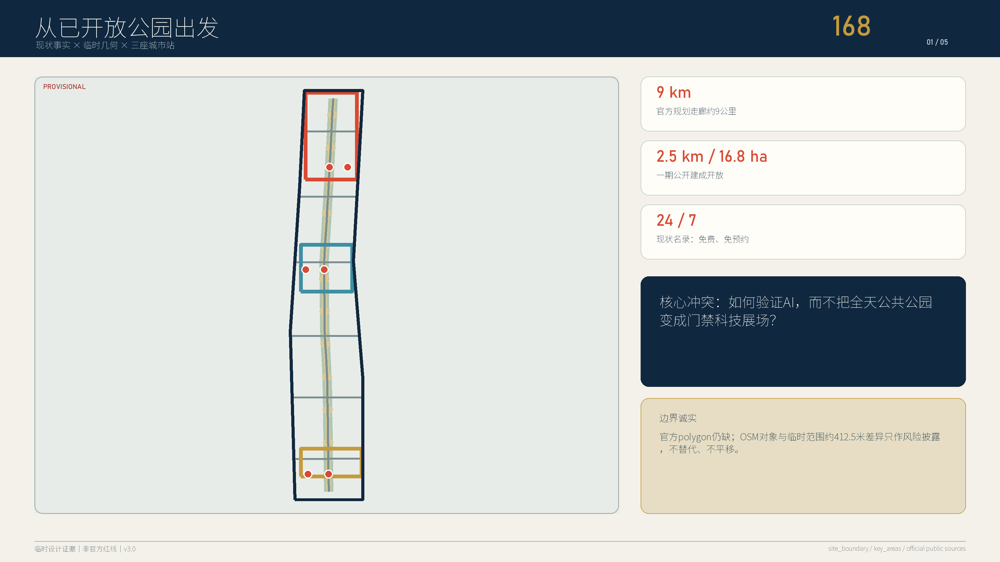
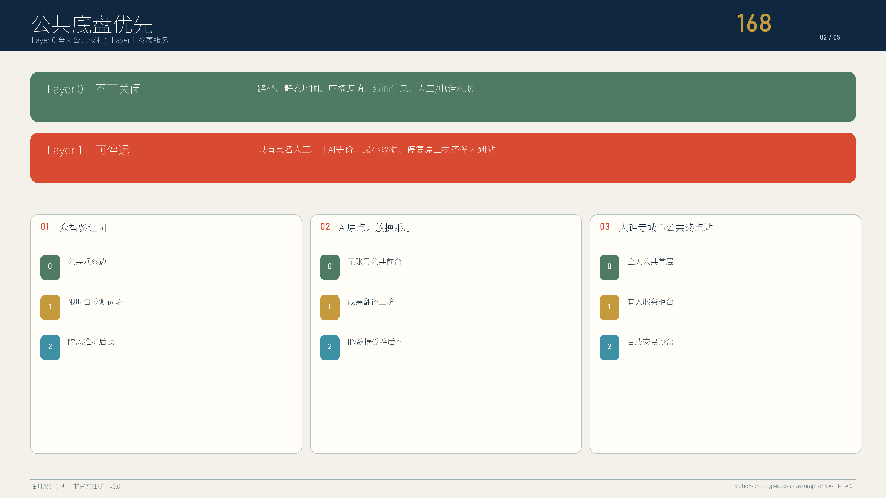
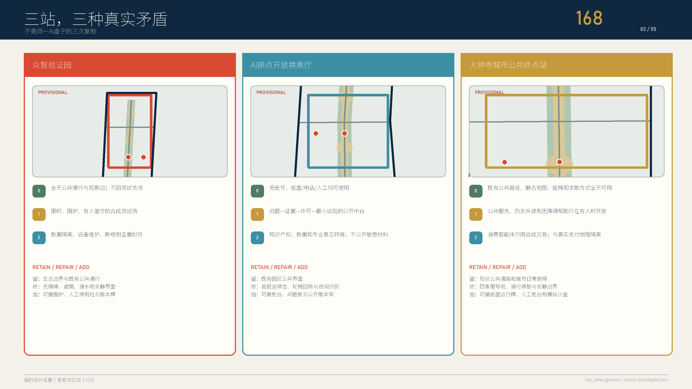

# 京张168：城市公共时刻表

> **一句话提案。** 公园全天开放，AI按表到站；服务晚点必须可见，失效必须有人接管，停运不得堵住公共路径。百年京张的当代价值不是复刻铁路造型，而是把测量、时刻、交接、晚点解释与故障复原变成城市责任。

## 执行摘要

**场地冲突。** 京张铁路遗址公园不是等待“AI化”的空白用地。官方资料显示：规划工作2019年启动，走廊约9公里，约6公里高铁地下穿行，同时叠加运行中的13号线、近20所高校科研机构和复杂权属；一期约2.5公里、16.8公顷已经建成开放。北京市公园名录又明确现状遗址公园免费、免预约、24小时开放 [source:OFFICIAL-PARK-PLAN-2021] [source:OFFICIAL-PARK-PHASE1-2023] [source:OFFICIAL-PARK-DIRECTORY-2025]。因此本方案只接受一个问题：**如何在不把公园变成门禁科技展场的前提下，让AI创新可验证、可问责、可退场？**

**空间答案。** Layer 0 是不可关闭的城市公共底盘：既有公共路径、静态双语地图、座椅遮荫、纸面信息、人工/电话求助，不因账号、预约、网络或AI故障关闭。Layer 1 是按表运行的AI服务：只有在具名人工、非AI等价、最小数据、停止阈值和复原回执齐备时才“到站”。三座城市站原型把这一关系做成剖面：北部众智验证园是“公共观察边—限时测试场—隔离后勤”；中部AI原点开放换乘厅是“公共前台—成果翻译工坊—受控后室”；南部大钟寺城市公共终点站是“全天首层—有人柜台—合成交易沙盒” [data:visual/assets/station-prototypes.json]。

**运行答案。** 十二项服务不再是泛化“AI+”清单，而是北部三项产业验证、中部四项知识转接、南部五项日常公共服务。每项都有站台、时窗、人工列车长、禁入数据、非AI等价、停运触发、复原动作和预期回执 [data:visual/assets/civic-timetable.json]。状态机仍为 `proposed → admitted → scheduled → active → paused → returned → audited → archived`，但 v3 增加一条不可越过的宪法：**AI可停运，公共底盘不可停运。**

**可执行答案。** `visual/assets/tabletop-runner.js --check` 对12份合同各跑正常、缺人工、缺非AI替代、出现禁入数据、堵塞公共路径和停运后复原六类合成分支；共72例，24条停止分支、12条复原分支全部按合同返回预期状态 [metric:tabletop_case_count] [data:visual/assets/timetable-tabletop-evidence.json]。该脚本不联网、不接设备、不读取真实个人数据，`field_performance=null`；PASS只证明合同和失败路径闭合，不声称现场成功 [assumption:A-TABLETOP-001]。

**第一切片。** 首个168小时仍只安排纸面发布、人工柜台、无障碍与安静走查、影子运行、离线演练、公众共评、清场与审计；不建永久设施、不接生产账户、不改变机动车路权。第12周由独立评估决定继续、收窄或归档。真正的满分合同不是“技术都成功”，而是每次失败都能被看到、停止、复原并留下责任证据。

## 设计依据与资料清单

### 证据等级与判断边界

方案把资料分成五层。第一层是征集公告与任务书，只界定任务和评审要求，不自动提供精确几何 [source:OFFICIAL-ANNOUNCEMENT] [standard:PROJECT-OFFICIAL-ANNOUNCEMENT]。第二层是北京、海淀各主管部门公开的公园建设、三处更新、文保、AI与城市更新事实，用于回答“场地现在是什么、政策要求什么”，但仍不替代项目审批。第三层是智能体任务书，约束品牌、案例、场景、文化和长期运营 [source:AGENT-TASKBOOK] [standard:PROJECT-AGENT-OPEN-CALL-TASKBOOK]。第四层是仓库站点包、来源注册表与临时几何，用于建立可重复的设计底板 [source:SITE-PACKAGE] [source:SOURCE-REGISTRY]。第五层是国际案例，仅比较透明、试验和复原机制，不作为北京法定参数。

仓库公开草案 `brief/public-brief.md` 仅补充发展愿景、重点方向和公开资料边界 [source:PUBLIC-BRIEF-DRAFT]；因其 `published_at` 仍为 TBD，本方案把它严格限制为背景材料，不用它证明官方边界、法定控制、既定实施或政府决定。

城市设计方法按城市设计管理、控制性详细规划内容和国土空间用地分类的公开标准组织 [standard:MOHURD-URBAN-DESIGN-MEASURES] [standard:MOHURD-CONTROL-DETAILED-PLANNING] [standard:MNR-LAND-USE-CLASSIFICATION-GUIDE]。建筑、交通、市政、消防、文保和结构仍需相应专业团队复核；任何未取得的条件不由AI猜测补齐。

### 可用性清单

| 类别 | 可用于本版 | 不可被解释为 | 更新触发 |
|---|---|---|---|
| 任务依据 | 三层范围、六项智能体任务、交付深度 | 政府采纳或实施承诺 | 官方补遗发布 |
| 临时边界 | 拓扑、方案比较、复算流程 | 官方红线、确权面积 | official polygon 到位 |
| 概念建筑 | 共享首层与更新动作测试 | 现状测绘、拆迁量 | 建筑普查与权属到位 |
| 案例资料 | 提取时间共享、试验和协作机制 | 直接移植制度或强度 | 机制失效证据出现 |
| 运行协议 | 首周试点、审计字段和退出路径 | 已确定政府运营制度 | 共创与法务复核完成 |
| 现状公园 | 24小时、免费、免预约的现状公共基线 | 整个临时范围都已建成或可随意布置 | 运营方、现场与官方资料核验 |
| 三处更新 | 更新方向、公开实施统筹与片区锚点 | 精确地块、权属、批准建筑动作 | 官方图、项目清单和专业会审到位 |

当前总体边界为临时几何 [data:geometry/site_boundary.geojson#SITE-001]，三处重点范围亦为 provisional [data:geometry/key_areas.geojson#PROV-KEY-001]。仓库另记录公开OSM遗址公园对象与临时总体范围最近约412.5米且不相交；这是一条应暴露的背景差异，不是用OSM替换或平移设计边界的理由 [assumption:A-OSM-DISCREPANCY-001]。`geometry/constraints.geojson` 只登记可复核的运营定位，不虚构官方约束线 [assumption:A-LOCATOR-001]。控规、权属、市政、消防、文保、生态与无障碍底图缺口集中写入 [assumption:A-CONTROLS-001]，并在 G0 与 G4 作为“资料未到即停止”的条件。

### 引用与复核方式

正文只在判断附近放最多三条直接证据；完整来源、指标、标准与任务映射留在 `sources.json`、`metrics.json`、`standard_matrix.json`、`design_depth_matrix.json` 和 `compliance_matrix.json`。图是解释层，GeoJSON与JSON是复核层，二者冲突时以机器资产和更高等级来源为准。官方边界替换将触发一次全链重算，而不是手改个别数字 [assumption:A-BOUNDARY-001] [depth:metrics_recalculation]。

## 三层范围工作框架

### 三层不是三个孤岛

| 层级 | 主要问题 | 空间证据 | 设计深度 | 交付物 |
|---|---|---|---|---|
| 统筹研究范围 | 产业、人才、知识与区域协同如何循环 | 约43.6 km²任务范围，待官方图核验 | 战略与接口 | 案例机制、协同接口、品牌与指数框架 |
| 总体设计范围 | 更新、交通、蓝绿、公共服务如何形成系统 | [data:geometry/site_boundary.geojson#SITE-001] | 控规深度城市设计方向 | 用地、路网、项目、指标与闸门 |
| 重点区域范围 | 三处片区如何形成可实施的首批原型 | [data:geometry/key_areas.geojson#PROV-KEY-001] | 规划综合实施方案方向 | 节点、构件、剖面、时段与责任卡 |

三层通过同一套“需求—空间—时段—责任—证据”链逐级落实 [depth:three_level_scope_framework]。统筹层定义三区两翼的协作任务；总体层把任务翻译为三时区和连续公共骨架；重点层则用十二节点与首周运行图证明一项机制是否真的可进入、可暂停、可恢复。任何重点区试点失败都能反馈总体规则，而非被宣传叙事掩盖。

### 临时几何的正确用法

总体临时边界约11.4 km²，仅用于本方案内部复算 [metric:site_area_sqm]。三处重点区的任务面积与当前临时多边形不是同一测绘成果，因此正文不把两者混算。得到官方多边形后，按版本锁定坐标、重裁用地和网络、重算面积与比率、更新五张图、复审项目归属，再发布差异日志；在此之前，所有定位都是方向性设计 [assumption:A-BOUNDARY-001]。

### 三层共同验收问题

每层都回答五个问题：公共利益对象是谁；空间动作是否可识别；数据是否最小化；谁能按什么阈值暂停；恢复后留下何种证据。战略层若没有可落地接口则不进入总体层，总体层若没有明确约束闸门则不进入重点层，重点层若没有人工等价服务与恢复动作则不进入首周排程。这一递进关系避免“范围越细，承诺越虚”。

## 统筹研究范围产业与未来城市研究

### 三大定位、五类功能、三区两翼

三大定位是：可验证的AI自主创新走廊、把失败也纳入治理的开放试验带、以公共时间和公共权利衡量价值的未来城市样板。五类功能是研发验证、成果转化、企业服务、人才生活、公共文化。北部验证、中部转化、南部服务构成三区；东翼连接学院与科研网络，西翼连接社区与产业空间。协同不是画箭头，而是用“公开问题单—最小合同—人工准入—合成推演—小规模现场—停运/复原—公开复盘”形成闭环 [source:AGENT-TASKBOOK]。

这个结构来自场地，不是套模板。北部众智园公开更新信息指向众智园、腾讯学知园、东升604及清河—小月河生态联系；中部AI原点公开范围约3平方公里，强调园区—公园—街区融合和开放测试；南部大钟寺公开更新信息强调综合更新、公共与商业平衡及分期项目库 [source:OFFICIAL-ZHONGZHI-RENEWAL-2026] [source:OFFICIAL-AI-ORIGIN-2026] [source:OFFICIAL-DAZHONGSI-RENEWAL-2026]。这三类真实差异决定三站原型，而不是给同一种“AI盒子”换三块招牌。

区域接口保持轻量且可审计：与高校交换公开课题和设备空档，不交换学生画像；与医院只连接公开导航与人工预约，不做诊断；与企业共享合规需求和测试窗口，不共享商业秘密；与社区共享投诉、安静时段和无障碍阻断，不建立居民评分；与昌平、海淀及沿线创新节点交换活动日历和公开成果，不声称跨区政策已确定。

### 七个案例：取机制，不照搬

| 案例 | 可转化机制 | 京张168落点 | 明确不照搬 |
|---|---|---|---|
| Kalasatama | 用节省人的时间衡量技术 | 服务完成时间、人工接管等待 | 不把国外目标值当北京基准 [source:CASE-KALASATAMA] |
| Marineterrein | 真实环境、小步、可逆试验 | 两周最小试点与恢复标记 | 不复制场地管理制度 [source:CASE-MARINETERREIN] |
| one-north | work-live-play-learn 混合 | 一址多时段的共享首层 | 不移植开发强度 [source:CASE-ONE-NORTH] |
| Punggol | 空间与学习系统联动 | 夜校、设备空档与公共日历 | 不复制数字身份体系 [source:CASE-PUNGGOL] |
| Knowledge Quarter | 机构网络围绕共同议题协作 | 公开问题单与季度议程 | 不把成员数量当成协同质量 [source:CASE-KNOWLEDGE-QUARTER] |
| Paris-Saclay | 概念验证—成熟—转移链 | G0–G7证据闸门 | 不照搬治理与资金结构 [source:CASE-PARIS-SACLAY] |
| Kendall Square | 公共空间连接创新机构 | 时间公园与十二节点 | 不以地价或招商结果替代公共价值 [source:CASE-KENDALL] |

v3又增加四个只用于机制压力测试的对照：Singapore AI Verify说明治理原则必须能进入测试链 [source:CASE-AI-VERIFY]；荷兰算法登记册与Helsinki AI Register说明公共系统应公开用途、责任、限制和联系人 [source:CASE-DUTCH-ALGORITHM-REGISTER] [source:CASE-HELSINKI-AI-REGISTER]；首尔京义线森林公园说明铁路廊道可以成为连续日常公共空间，而不必成为单一纪念物 [source:CASE-SEOUL-GYEONGUI]。这些案例不提供北京的许可、尺度或性能值，只帮助检验“是否可读、可停、可追责”。

### 品牌与文化叙事

品牌名“京张168”同时指一周168小时、铁路运行图的时间纪律和公共空间的可兑现日程。标志以七列×二十四行网格构成“168”，深蓝为责任底色，暖白为空闲，运行橙表示经许可的开放，暂停红仅表示风险与退出。中英文字标为“京张168 / JINGZHANG 168”，副句为“把一周还给城市 / GIVE THE WEEK BACK TO THE CITY”。品牌不得与政府徽标、铁路运营标识或企业商标混淆。

文化叙事由“测量、运行、交接、复原”四幕组成。国家博物馆公开的京张铁路工程测量相关馆藏提醒我们：京张精神首先是对地形、误差和责任的严谨，而不是装饰性的人字线 [source:OFFICIAL-JINGZHANG-HISTORY]。百年铁路不被消费为怀旧背景；时刻表必须能解释晚点，信号必须能显示停运，交接必须留下签字，复原必须回到公共状态。声音、档案与人物素材必须先清权；没有授权时只使用本提交原创的抽象线、点、网格和文字。

## 总体设计范围城市更新与控规深度城市设计

### 总体结构：三时区、六区段

v3的主结构不再是“给走廊分三种颜色”，而是两层权利叠加。Layer 0城市公共底盘始终优先：连续公共路径、静态导视、座椅遮荫、雨洪生态、纸面信息与人工/电话求助。Layer 1服务时刻表只能在Layer 0之上限时出现：AI设备、活动围护、数据采集和预约界面到点撤场，不能取得永久专用路权。三时区、六区段继续作为临时几何的运营索引，而不再承担主概念。这套**城市公共时刻表机制**把空间体系、服务场景、停止模式与复原回执组织成同一条可审计链，而不是再增加一层技术园区平台。

| 时区 | 六区段 | 主任务 | Layer 0不可关闭项 | Layer 1退出条件 |
|---|---|---|---|---|
| TZ-03-MODEL-VALIDATION | BK-05-TRANSFER-NORTH；BK-06-TEST-YARD | 智能体互操作、红队、端侧能耗 | 生态边、公共观察边、普通慢行 | 数据越权、热噪外溢、隔离失效、无人值守 |
| TZ-02-KNOWLEDGE-TRANSFER | BK-03-TRANSFER-SOUTH；BK-04-ORIGIN-HUB | 开源/IP转接、无障碍共审、维护者夜校、科研翻译 | 园区—公园公共界面、无账号前台 | 专业意见越权、材料不清权、无障碍或安静边界破坏 |
| TZ-01-CITY-LOUNGE | BK-01-SOUTH-GATE；BK-02-CIVIC-SEAM | 四象限走查、办事导航、历史共读、安静观察、消费沙盒 | 全天公共路径、静态地图、座椅和求助 | 通行受阻、真实账户请求、自动资格判断、文保冲突 |

三时区是运营索引，不改变法定用地。24个临时用地单元 [data:geometry/land_use.geojson#LU-001] 用“基本用途+公共底盘+服务时窗”三标签组织；一条连续慢行与蓝绿骨架串联六区段 [depth:overall_spatial_structure]。官方公园名录的168小时只证明现状遗址公园的开放基线，不能与当前临时 `PUBLIC-168` 面积相乘制造全范围 `m²·h/week`；v2的97M展示值已撤销并改为unknown [metric:weekly_public_open_hours] [metric:public_space_weekly_sqm_hours]。

### 七类可识别空间构件

| ID | 构件 | 空间作用 | 人工/离线底线 |
|---|---|---|---|
| TC-01-WEEK-BOARD | 周运行牌 | 公示时段、容量、责任与替代路线 | 每周打印；停电仍可读 |
| TC-02-HUMAN-GATE | 人工闸门 | 预约、解释、申诉与接管 | 不以手机或实名画像为前提 |
| TC-03-TIME-BAY | 时间泊位 | 标明活动容量、边界和清场时刻 | 未预约时恢复普通公共使用 |
| TC-04-QUIET-EDGE | 静音边界 | 控制灯光、声响、排队与测试外溢 | 现场巡查优先于自动处罚 |
| TC-05-RESET-MARK | 恢复标记 | 记录临时设施撤除前后状态 | 恢复照片与签字公开归档 |
| TC-06-ACCESS-STOP | 无障碍停止点 | 提供轮椅回转、座椅、求助与停机 | 物理按钮和人工联络共存 |
| TC-07-EVIDENCE-CLOCK | 证据时钟 | 展示版本、限制、事故、投诉与复盘 | 不用生成式摘要替代原始记录 |

七构件跨十二节点重复出现，但每处组合不同，形成可扩展而非千篇一律的设计语法。建筑形态以连续街墙、开放首层、铁路视廊、遮荫与安静界面为方向；未有测绘、日照、消防与结构证据前不输出伪精确控制线 [depth:height_massing_character]。

### 总体更新门槛

更新次序为“调查—保留—修缮—性能改造—可逆加建—待定”，拆除不是默认动作。交通、蓝绿、市政和公共服务均与时段协议相连：装卸错峰但不压缩劳动者休息；算力节点公开能耗、散热与维护责任；雨洪设施既服务生态也限制活动容量；公共服务智能体只能导航与解释。总体框架依托 [data:geometry/roads.geojson#ROAD-168]、[data:geometry/green_space.geojson#GREEN-168] 与 [data:geometry/public_space.geojson#PUBLIC-168]，但仍需官方资料校核。

## 重点区域详细设计

### 十二节点索引

| ID | 节点 | 时区/区段 | 主构件 | 首批场景 |
|---|---|---|---|---|
| SCN-01 | 智能体互操作诊所 | 众智验证园 / BK-06 | TC-02+TC-07 | 合成工具调用与交接失败 |
| SCN-02 | 红队工棚与失败档案 | 众智验证园 / BK-06 | TC-05+TC-07 | 隔离红队、停机与复盘 |
| SCN-03 | 四象限步行与低速机器人边界审计 | 大钟寺终点站 / BK-02 | TC-05+TC-06 | 过街、骑停、轮椅连续性、让行与物理停机 |
| SCN-04 | 端侧能耗与算力票据台 | 众智验证园 / BK-05 | TC-04+TC-05 | 功耗、热、噪与版本票据 |
| SCN-05 | 开源与知识产权转接台 | AI原点换乘厅 / BK-04 | TC-02+TC-07 | 来源、许可与人工专业转接 |
| SCN-06 | 公共服务材料导航 | 大钟寺终点站 / BK-01 | TC-02+TC-06 | 公开办事材料解释，不判断资格 |
| SCN-07 | 无障碍路径共审 | AI原点换乘厅 / BK-03 | TC-02+TC-06 | 使用者共审、阻断工单与复走 |
| SCN-08 | 开源维护者夜校 | AI原点换乘厅 / BK-04 | TC-01+TC-03 | 公开问题单、维护劳动与无账号席位 |
| SCN-09 | 科研到公共服务翻译台 | AI原点换乘厅 / BK-03 | TC-01+TC-02 | 问题—证据—许可—最小试验 |
| SCN-10 | 京张记忆共读站 | 大钟寺终点站 / BK-02 | TC-01+TC-07 | 清权史料、版本与公众纠错 |
| SCN-11 | 夜间安静与公共路径观察站 | 大钟寺终点站 / BK-02 | TC-04+TC-06 | 灯光、噪声、排队与撤场 |
| SCN-12 | 消费智能体权限沙盒 | 大钟寺终点站 / BK-01 | TC-01+TC-02+TC-07 | 合成交易、明确确认与撤回 |

### 三处重点区的小方案

众智“验证园”对应临时范围 [data:geometry/key_areas.geojson#PROV-KEY-001]。剖面从公共侧向受控侧依次为：全天公共慢行与观察边、限时围护的合成测试场、数据隔离与设备维护后勤。SCN-01、02、04分别测试智能体交接、红队停机、端侧能耗，不连接生产系统。清河—小月河生态联系和公开更新锚点来自官方信息，但精确地块、权属与工程条件仍待核 [source:OFFICIAL-ZHONGZHI-RENEWAL-2026]。

AI原点“开放换乘厅”对应 [data:geometry/key_areas.geojson#PROV-KEY-002]。剖面是无账号公共前台、成果翻译工坊、知识产权与数据受控后室。SCN-05、07、08、09把开源/IP转接、无障碍共审、维护者夜校和科研翻译放在连续首层；涉及许可、专业意见或采购的结论一律转人工。约3平方公里和园区—公园—街区融合是公开片区语境，不是本方案对单栋建筑可改造性的确认 [source:OFFICIAL-AI-ORIGIN-2026]。

大钟寺“城市公共终点站”对应 [data:geometry/key_areas.geojson#PROV-KEY-003]。Layer 0先做四象限地面通行、静态地图、座椅与求助；有人时才开放公共服务柜台与京张共读；消费智能体只在与真实账户、支付物理隔离的合成沙盒中运行。SCN-03先以人工走查建立步行与无障碍基线，再在获准、空载、低速、有人值守时演练机器人让行和物理停机，永不取得永久路权；SCN-06、10、11、12分别承担办事材料导航、历史共读、夜间安静观察和消费权限演练。公开更新方向支持综合更新和分期项目库，但不支持本方案提前画桥隧或拆改线 [source:OFFICIAL-DAZHONGSI-RENEWAL-2026]。完整剖面与闸门见 [data:visual/assets/station-prototypes.json] [depth:three_key_area_detailed_design]。

## AI 创新生态、人才画像与 AI+ 场景

### 服务对象与权利底线

六类画像是设计检验器而非用户标签 [metric:persona_count]：科研人员需要可预约验证与失败保密期；初创团队需要合规、采购和算力导航；学生需要低门槛夜校；带儿童居民需要安全和安静；配送、保洁与维护劳动者需要休息、排班知情和清晰路权；老年与残障访客需要无障碍、纸面信息与人工帮助。系统不得用职业、健康、年龄或参与度形成隐性评分。

### 十二张完整场景卡

| ID | 对象/地点 | 受影响者与非参与者影响 | 最小数据/非AI等价 | 人工责任 | KPI与SLO | 停止/恢复 | 证据/复审 |
|---|---|---|---|---|---|---|---|
| SCN-01【产业测试】 | 工程师/众智 | 未来用户；不连接生产 | 合成任务与许可表；人工接口检查 | DS+DHL+SASP | 工具越权0（目标） | 生产凭据、越权或无人即隔离回滚 | 调用摘要+复原回执 |
| SCN-02【产业测试】 | 红队/众智 | 未来用户；载荷不外溢 | 隔离样本；人工固定测试集 | DHL+SASP+IE | 可人工停机（目标） | 隔离失效或无法停机即断网封存 | 事件单+复盘卡 |
| SCN-03【交通测试】 | 行人/大钟寺 | 骑行、轮椅、照护者 | 匿名阻断点与设备状态；纸图/引导员/人工推车 | AO+OPS+DHL | 让行100%、60秒停机（目标） | 净宽受阻、近失或停机失败即撤设备复路 | 走查单+停机时间戳+前后照片 |
| SCN-04【产业测试】 | 设备团队/众智 | 维护者与居民 | 聚合功耗热噪；人工读表 | OPS+DHL+IE | 热噪不越界（目标） | 热噪、测量链或消防条件异常即断电 | 能耗票据+异常单 |
| SCN-05 | 团队/AI原点 | 小团队；不按支付能力排序 | 公开项目与许可；纸面清单 | PA+OPS+DHL | 来源可追踪（目标） | 许可冲突、自动法律结论即停答 | 问题单+人工转接 |
| SCN-06 | 办事人/大钟寺 | 无手机、非中文、老年访客 | 公开办事指南；纸面/电话/柜台 | OPS+DHL+PA | 不判断资格 | 版本不明、资格判断或无人转接即静态降级 | 版本卡+更正单 |
| SCN-07 | 残障使用者/AI原点 | 所有通行者 | 匿名障碍点；触觉/大字图和陪行 | AO+NL+DHL | 阻断闭环（目标） | 路线中断或求助无人即恢复原通路 | 工单+复走记录 |
| SCN-08 | 维护者/AI原点 | 居民、教师与保洁劳动者 | 公开议题；无账号旁听 | OPS+PTC+NL | 21:00前清场（目标） | 权利不清、超时或无主持即停 | 课程单+清场单 |
| SCN-09 | 科研与公共服务/AI原点 | 社区；不制造伪需求 | 公开成果与问题单；人工访谈 | PA+IE+PTC | 边界完整（目标） | 能力错配、责任不明即退回问题定义 | 边界卡+退回单 |
| SCN-10 | 公众/大钟寺 | 口述者、居民和听障访客 | 清权史料；纸面时间线 | OPS+NL+PA | 来源与版本100%（目标） | 来源不明、合成史实或文保冲突即下架 | 来源卡+纠错单 |
| SCN-11 | 居民/大钟寺 | 夜班劳动者和普通通行者 | 匿名事件；人工巡查 | NL+OPS+DHL | 公共路径不阻断 | 噪光越界、投诉无人或维护不足即撤场 | 巡查单+回访记录 |
| SCN-12 | 消费者/大钟寺 | 低数字素养者与小商户 | 合成商品和预算；纸面比较 | DHL+DS+PTC | 真实交易0 | 请求凭据、绕过确认或无法撤回即清空 | 权限票+撤回回执 |

四个测试场景 [metric:test_scenario_count] 先在可恢复的最小空间运行；十二场景总数由 [metric:scenario_card_count] 复核。运行协议字段与例周记录分别见 `visual/assets/jz168-week.schema.json`、`visual/assets/example-week.json`；它们只保存服务所需数据，不保存人脸、连续轨迹或参与者信用分。

### 状态机与三权分离

状态转移必须有证据：`proposed`提交场景卡，`admitted`完成准入，`scheduled`取得时空容量，`active`由责任人签到，`paused`保全现场并开放人工替代，`returned`恢复空间，`audited`核对KPI与投诉，`archived`公开结论。任何人都可触发投诉，但只有值班安全负责人可恢复高风险场景；AI不得自行越过暂停状态。

| 权限 | TO 运行图运营者 | PTC 公共时间理事会 | SASP 场景准入与安全小组 |
|---|---|---|---|
| 排程与冲突 | A/R | C | C |
| 公平、安静与无障碍规则 | C | A/R | C |
| 技术准入和停机 | I | C | A/R |
| 投诉受理 | R | A | C |
| 恢复原状验收 | R | C | A |
| 季度公开复盘 | R | A | R |

这里A为最终问责、R为执行、C为会签、I为知会。核心三权是TO、PTC与SASP；DHL值班人工负责人、DS数据管理员、AO无障碍负责人和NL邻里联络员提供场景级职责。PA是专业与许可主管联络接口，不冒充主管部门；OPS汇集片区、柜台与维护运营岗位；IE是第12周独立评估角色。十个角色目前全部是待确认的概念职责，不能被解释为主体已经授权。成员和会议记录应公开利益冲突；TO不能降低安全阈值，SASP不能独占公共时间，PTC不能替代专业许可。公共利益、劳动权、申诉、非AI等价和退出优先于“试点成功率” [assumption:A-AI-001]。

## 用地、建筑规模与拆改留方案

### 双标签用地与面积边界

24个概念单元 [metric:land_use_parcel_count] 采用“基本用途+周开放协议”双标签：研发单元仍需在许可时段开放共享首层，公共空间也必须尊重静默和维护窗口。临时用地层 [data:geometry/land_use.geojson#LU-001] 用于比较三时区容量，不替代法定用地分类；总体面积、绿地和公共空间的复算只对当前版本几何成立。

### 建筑三表与五类动作

建筑先建调查表：年代、结构、用途、权属、租约、消防、无障碍、能耗、文化价值。动作表只允许保留、修缮、性能改造、可逆加建和待定；在测绘、权属、结构、文保和全生命周期碳评估前，不提出拆除量 [depth:retain_renovate_demolish]。开放表再记录首层的时段、容量、运营者、维护者与恢复方式。

14个概念建筑基底 [data:geometry/buildings.geojson#BLDG-001] 仅表达共享首层与节点关系，概念基底面积 [metric:building_footprint_area_sqm] 不等于现状建筑面积。容积率、高度、拆除面积与新建量保持 unknown；后续只能在交通、市政、公共服务、日照、微气候、消防和遗产视廊共同校核后填入。

### 空间供给与劳动权

共享首层不能建立在无偿延长开放和维护劳动上。每个开放时段必须同时排入清洁、保安、设备维护与人工服务班次，公布最大连续工时和交接时间；系统只显示岗位是否有人，不公开个人绩效。若排班不足，空间自动回到关闭或静态服务，而不是要求AI替代现场安全责任。

用地与建筑变更的G门槛是：G0资料登记、G1边界与权属、G2现状与结构、G3公共利益、G4专业方案、G5许可资金、G6小规模实施、G7后评估。任何一门未通过都可回到前一状态，不把沉没成本当作继续理由。

## 交通、轨道、市政与公共服务设施

### 交通与轨道接口

“一纵六横”慢行骨架以主线 [data:geometry/roads.geojson#ROAD-168] 和六条缝合支线 [metric:crosslink_count] 连接三时区。轨道接口优先解决站点四象限过街、轮椅坡度、风雨连廊、自行车停放、夜间识别和应急疏散；机动车与装卸采用可协商错峰，不能用“智慧调度”压缩配送、保洁和夜班劳动者的休息。

低速设备只在SCN-03、11:00–15:00、现场安全员到位、无障碍通道连续时运行。试验前后由TC-05-RESET-MARK记录路面与设施状态，TC-06-ACCESS-STOP提供物理停机和求助；出现近失、错路、通道受阻或公众拒绝即停。轨道接驳、停车供需、道路红线与交通影响仍待官方和专业资料 [depth:traffic_rail_slow_parking]。

### 市政与新型基础设施

市政策略是“最少感知、边缘处理、物理开关、可维护”。雨水花园、透水铺装和树阵先承担日常雨洪；算力设备只有在电力、冷却、热排、噪声、消防和维护责任明确后布置；传感器只采场景所需最小字段并短期留存。市政与消防资料缺口按 [assumption:A-CONTROLS-001] 保持 open，且 G4 专业安全门未签署时，图上只表达接口和校核范围，不表达工程点位 [depth:municipal_new_infrastructure]。

### 公共服务双轨制

企业、健康、教育、法律和交通智能体只做公开信息检索、解释、预约与转接；资格、诊断、法律、安全和执法决定由具备职责的人完成。每个数字服务都有纸面目录、电话或现场柜台，网页故障时恢复静态导视，语言障碍可转人工。SLO不仅计算速度，还计算转人工时间、无手机完成率、错误纠正时间和申诉受理率。

公共服务点不收集与服务无关的身份证、健康、职业、情绪或连续位置；为排队所需的临时编号在服务结束后删除。公开仪表板显示总量、等待和失败，不显示个人轨迹。任何合作机构的数据请求必须重新进入场景准入流程，而不能借项目合作扩大用途。

## 蓝绿空间、公共空间与城市风貌

### 蓝绿骨架与公共时间

京张时间公园 [data:geometry/green_space.geojson#GREEN-168] 是连续生态骨架，也是周运行图的物理载体。当前临时几何复算绿地面积 [metric:green_space_area_sqm] 与绿地率 [metric:green_ratio]，只用于本方案比较，不是法定指标。六区段以树冠、雨水路径、遮荫、安静边界和横向连通组织，生态敏感处宁可减少活动容量，也不以“AI体验”侵占生态恢复时间。

公共时间带 [data:geometry/public_space.geojson#PUBLIC-168] 仍保留临时面积复算 [metric:public_space_area_sqm]，但不再把它与一个假定开放时数相乘。官方名录支持的是“现状遗址公园每周168小时”的事实 [metric:listed_existing_park_open_hours_per_week]，不是临时总体范围内每一平方米都全天有效。设计范围的有效开放小时和 `m²·h/week` 均保持unknown，待逐段现场核验无障碍、维护、安宁、劳动排班和投诉恢复后计算 [metric:weekly_public_open_hours] [metric:public_space_weekly_sqm_hours]。

### 地标不是技术崇拜

四个“朝圣/荣誉”节点由168时钟、模型版本院、失败档案馆和开源发车板组成 [metric:landmark_count]。168时钟显示公共时段而非广告；版本院公开模型、数据日期和限制；失败档案馆表彰及时停止与修正；开源发车板记录维护者、贡献者和未解决问题。它们是概念性空间构件，不声称已批准建设。

### 风貌与无障碍表达

风貌采用纸、墨、钢、暖白和运行橙，不用蓝紫霓虹、大屏或拟人机器人制造泛化“AI感”。橙色只表示正在运行，暂停红只表示风险，深蓝承载文字和边界；所有状态同时使用形状与文字，避免只靠颜色。字体选用可嵌入、许可清楚的中英文字体，最小字号、对比度、触摸高度和轮椅视线由无障碍审查确认。

铁路遗产构件必须先做文保、结构和权属核验；声音和影像须有授权、字幕和静默模式。夜景优先入口、脚下和求助点照明，22:00后降亮度，居民界面不布置扩声和动态屏。城市风貌由日常可维护性而非一次性效果图定义 [depth:blue_green_public_space]。

## 更新项目清单、实施政策与分期计划

### 九个可独立停止的项目包

| ID | 项目/位置 | A问责 / R执行 | 资源闸门 | KPI/SLO | 停止与证据 |
|---|---|---|---|---|---|
| PRJ-01 | 公共时间底账 | PTC/TO | 双语牌、值班与打印预算 | 发布准时率100%；柜台有人 | 无值班即关闭数字预约；周报 |
| PRJ-02 | 三时区公共时间廊 | PA/AO | 道路主管部门批准待取得；路权与安全审查 | 阻断闭环率；30分钟核实 | 通道变窄即撤设施；审计单 |
| PRJ-03 | 十二节点场景网 | SASP/片区运营 | 权属、消防、生态、保险 | 越界0；15分钟接管 | G门槛未过不启用；试验档案 |
| PRJ-04 | 七件时间构件 | TO/维护团队 | 制作、无障碍与维护 | 信息可读；停止点可用 | 构件失效即撤换；巡检表 |
| PRJ-05 | 首个168小时实验室 | PTC/TO+DHL | 人员、许可和场地 | 无手机完成；按时归还 | 人工缺席即静态服务；周审计包 |
| PRJ-06 | 公共数据与模型安全屋 | SASP/DS | 隐私、网络与数据许可 | 未授权事件0；15分钟接管 | 数据越界即隔离；事件单 |
| PRJ-07 | 无门槛公共接口 | AO/柜台团队 | 无障碍、翻译与劳动排班 | 非AI等价；2日申诉受理 | 通路不等价即暂停数字服务；服务票 |
| PRJ-08 | 失败档案与申诉系统 | PTC/NL+DS | 内容权利与长期维护 | 版本牌100%；月度更新 | 来源不明即下架；版本卡 |
| PRJ-09 | 十二周证据到退场计划 | 独立评估方/TO | 评估与恢复预算 | 季度发布；按时恢复 | 证据不足即退场；审计包 |

### 第一周：168小时可验证切片

| 时间 | 动作 | 启用地点 | 决策与产物 |
|---|---|---|---|
| H000–H009 | 冻结例周版本、打印运行牌 | SCN-08/SCN-07/SCN-12 | 版本化日程与纸面发布日志 |
| H009–H024 | 三个人工柜台上线、无手机通路测试并安全关闭 | SCN-08/SCN-07/SCN-12 | 值班、非AI等价与关闭日志 |
| H024–H048 | 无障碍走查和静音基线 | SCN-07/SCN-11/SCN-03 | TC-06阻断清单与TC-04基线 |
| H048–H072 | 影子运行，不自动答复 | SCN-05/SCN-07 | 逐条人工比对与错误/停止日志 |
| H072–H096 | 离线桌面演练，不接生产数据 | SCN-01/SCN-02 | SASP准入/退回单与隔离检查表 |
| H096–H120 | 公开限制说明与申诉演练 | SCN-12 | 限制公告、非AI申诉与受理回执 |
| H120–H144 | 家庭、残障与劳动者共评 | SCN-08/SCN-11 | 参与者/非参与者影响记录 |
| H144–H160 | 清场、场地归还与数据删除/导出 | 本周触达的八节点：SCN-01/02/03/05/07/08/11/12 | 场地归还包与数据回执 |
| H160–H168 | 审计并决定第二周 | SCN-12公开界面 | 公开 `continue / modify / stop`；不自动扩张 |

第一周不新建永久设施、不改变机动车路权、不接生产或敏感数据；只验证服务、标识、排程、人工接管和恢复。第2–4周可做两个最小场景，第5–8周检验季节/人群差异，第9–12周独立评估；只有项目成熟度 G0–G7 和相关场景准入 C0–C7 均以执行证据通过，才可由有权主体决定扩展。

### G0–G7与C0–C7双闸门

G0问题登记、G1资料合法、G2空间与权属、G3公众与劳动、G4专业安全、G5运营资金、G6最小实施、G7后评估，控制项目成熟度。C0提案完整、C1数据最小、C2非AI等价、C3人工负责、C4SLO与停止阈值、C5恢复可行、C6证据可审计、C7申诉与复审，控制场景准入。项目和场景任何一条失败都停在上一状态，禁止平均分掩盖致命缺口。

三期空间仍映射 [data:geometry/phasing.geojson#PHASE-01]：近期完成协议、缝合审计和三处临时服务；中期在官方资料与许可到位后改造共享首层和知识换乘；长期才考虑验证园扩展和全带联运 [depth:phasing_implementation]。年度“京张168开放周”是概念建议，必须建立在每周运营与季度复盘之上，不替代日常维护。

## 指标体系、面积复算与合规矩阵

### 指标分层

| 层级 | 指标例 | 公式/来源 | 用途 | 不能说明什么 |
|---|---|---|---|---|
| 几何 | site/green/public/building area | EPSG:4548几何并集 [metric:site_area_sqm] | 版本内复算 | 法定面积或权属 |
| 结构 | 3重点区、24单元、6支线、12场景、9项目 | GeoJSON/清单计数 [metric:key_area_count] | 检查方案完整度 | 实际建设完成 |
| 运行合同 | 12服务、人工/非AI/停复原覆盖、72分支 | 时刻表与合成回执 [metric:scheduled_ai_service_contract_count] [metric:tabletop_case_count] | 检查合同和失败路径闭合 | 现场绩效或授权 |
| 现场运行 | 有效开放小时、接管、恢复和公共路径连续性 | 未来现场记录 [metric:weekly_public_open_hours] | 检查公共时间兑现 | unknown不能当0或目标达成 |
| 公平 | 无手机完成、无障碍阻断、投诉受理 | 匿名服务票 | 检查排除风险 | 个人画像或信用 |
| 安全 | 越界、近失、停机、恢复时间 | 事件与恢复单 | 决定暂停/继续 | 技术绝对安全 |

几何复算统一采用同一边界版本、投影与并集去重：用地覆盖总体边界且内部不重叠；绿地和公共空间可语义叠合，但分别以并集计；建筑基底以并集去重；线长按投影坐标计算 [depth:metrics_recalculation]。v3主动撤回无法由现状证据支撑的周供给大数；正式计算必须逐段记录有效面积、有效时段、通行连续性、维护与人力，再以版本化明细聚合。

合同指标与绩效指标严格分开：12/12合同具有注册人工角色、非AI等价、停止与复原字段 [metric:contract_human_conductor_coverage_ratio] [metric:contract_non_ai_equivalent_coverage_ratio] [metric:contract_stop_reset_coverage_ratio]；这只说明文档覆盖率为1.0。现场服务成功率 [metric:field_service_success_ratio] 仍为unknown，桌面推演使用真实个人数据数为0 [metric:real_personal_data_used_in_tabletop]，不能用前者替代后者。

结构契约分别核对三时区、六预约段和七构件 [metric:temporal_zone_count] [metric:booking_segment_count] [metric:time_component_count]。状态、治理与项目成熟度门另行计数 [metric:schedule_state_count] [metric:governance_role_count] [metric:project_maturity_gate_count]。场景准入门与首周阶段防止实施链漏项 [metric:scenario_admission_gate_count] [metric:first_168h_stage_count]。

### unknown不是零

容积率、平均高度、拆除面积、官方重点区面积、交通容量、市政余量、消防许可、建设成本和财政来源保持 unknown。unknown 表示缺少足以支持判断的资料，不能在汇总中按0计，也不能由案例均值补齐。官方边界或专业数据到位后，必须登记来源、日期、坐标/口径、计算式、置信度和版本差异，再更新机器资产与全部中英图文。

结果指标在真实运行前也保持 unknown：非AI等价覆盖、人工接管和按时恢复分别由 [metric:non_ai_equivalent_coverage_ratio] [metric:human_takeover_success_ratio] [metric:on_time_space_return_ratio] 观测；恢复分钟、无障碍阻断和未授权数据事件分别由 [metric:restoration_time_minutes] [metric:accessibility_blocking_events] [metric:unauthorized_data_events] 观测。维护劳动与利益负担分配由 [metric:maintenance_labor_hours] [metric:benefit_burden_distribution_index] 记录；任何目标值都不能写成实绩。

### 七维5/5证据合同

| 评审维度 | 本文可见证据 | 机器复核 | 否决性自问 |
|---|---|---|---|
| 任务契合 | 三层范围、六项智能体任务、九项目 | `compliance_matrix.json` | 是否漏掉任何官方任务 |
| 原创性 | 时间供给指标、七构件、状态机 | week schema与图位 | 概念是否控制空间和运营 |
| AI/规划创新 | 全天公共底盘、三站剖面、十二服务合同 | civic timetable、场景与治理协议 | AI停运时公共路径是否仍开 |
| 可实施性 | 首168h、72分支桌面推演、G/C闸门、RACI | runner、receipt、phasing | 12周内能否验证、停止并复原 |
| 公共利益 | 无障碍、劳动、安静、离线路径 | 公平指标与投诉单 | 非参与者是否仍被保护 |
| 风险合规 | unknown、最小数据、权利与恢复 | assumptions/constraints/copyright | 是否有伪精确或越权承诺 |
| 表达完整 | 双语同构、五图、HTML与A3/A0 | manifest与本地验证 | 人不打开JSON能否理解 |

完整任务映射、标准、深度和指标分别由 `compliance_matrix.json`、`standard_matrix.json`、`design_depth_matrix.json` 与 `metrics.json` 承担。正文对关键指标解释设计含义，矩阵不得以“已映射”冒充“已有数据”。五张图与中英HTML、A3/A0制品必须同源生成并逐页目检。

## 风险、版权与合规说明

首要风险是把已经开放的公园当作AI试验空地，或把临时边界、概念建筑、桌面PASS误读为官方方案和现场绩效。所有图面必须标注“PROVISIONAL / 非官方红线”，当前面积仅为设计几何复算 [source:BOUNDARY-SOURCE]；OSM差异只作为资料风险披露，不用于修边界 [assumption:A-OSM-DISCREPANCY-001]。第二是AI越权：禁止人脸识别、信用评分、自动执法、健康诊断、不可申诉决定和用途外数据复用；最小数据、人工复核、物理停机和非AI等价构成硬门槛 [assumption:A-AI-001]。

第三是创新活动挤压居民安宁、无障碍通行和劳动权。Layer 0公共底盘优先于所有预约和设备；每个场景都列非参与者影响、人工排班、停止阈值和恢复动作。第四是资金与运营不可持续：所有长期活动、招商、政策、预算和跨区协同均为概念建议，必须通过G5和责任主体确认。八类风险、严重度、减缓和人工复核主体完整登记于 `risk.json`；其中政策资料、空间争议和实施复杂度保持5/5高风险，不用“设计得漂亮”降低真实不确定性。

第五是版权与AI生成边界。文字、协议、GeoJSON重组和原创几何图形由本提交制作；外部案例只做事实性短摘要，不复制其图纸、图像、Logo和长段文字。五张中文核心图及五张英文对应图、双语A3/A0与离线HTML均由本地确定性渲染流程读取本包GeoJSON、指标、假设、协议和矩阵生成，不使用生成式图像作为空间、数字或工程证据。另有三张2026-08-11生成的无文字、分站点概念体验图，通过 OpenAI 内置图像通道的 GPT Image 2 制作，经人工筛查后仅作 `presentation only` 气氛表达 [assumption:A-IMAGEGEN-001]；带中英说明的三联图由本地确定性排版生成。模型、日期、完整提示记录、参考关系、人工编辑和禁止用途逐项登记于 `visual/assets/rights-ledger.json` 与 `report/copyright_statement.md`。

品牌“京张168”是本次征集概念，不暗示政府、铁路机构或主办方授权；许可为 COMMUNITY-DISPLAY-ONLY。未嵌入第三方照片、地图截图、人物肖像、企业标识或来源不明字体。若后续引入外部素材，必须先确认许可、署名、地域、期限、再许可和模型训练限制。中英文图的文字事实必须与正文和JSON一致，不能让生成图中的装饰性文字成为证据。

所有部署还需规划、建筑、结构、交通、市政、消防、生态、文保、无障碍、隐私、劳动和法律专业复核。任何模型评分、仓库接收或公众展示都不等于获奖、规划审批、工程许可、采购决定或政府背书；方案的诚实边界本身是治理设计的一部分。

## 参考资料

1. 百年京张铁路沿线重点站区城市设计征集官方公告及其公开附件 [source:OFFICIAL-ANNOUNCEMENT]。

2. 面向智能体的京张创新带城市设计任务书 [source:AGENT-TASKBOOK]。

3. 仓库站点包、来源注册表与临时边界说明 [source:SITE-PACKAGE] [source:SOURCE-REGISTRY]。

4. 《城市设计管理办法》相关公开文本 [standard:MOHURD-URBAN-DESIGN-MEASURES]。

5. 控制性详细规划与国土空间用地分类公开指南 [standard:MOHURD-CONTROL-DETAILED-PLANNING] [standard:MNR-LAND-USE-CLASSIFICATION-GUIDE]。

6. Smart Kalasatama：以居民时间收益衡量城市创新的公开材料 [source:CASE-KALASATAMA]。

7. Marineterrein Amsterdam Living Lab：真实环境可逆试验公开材料 [source:CASE-MARINETERREIN]。

8. one-north 与 Punggol Digital District：混合创新区和学习空间公开材料 [source:CASE-ONE-NORTH] [source:CASE-PUNGGOL]。

9. London Knowledge Quarter：机构网络与共同议程公开材料 [source:CASE-KNOWLEDGE-QUARTER]。

10. Paris-Saclay：技术成熟与转移链公开材料 [source:CASE-PARIS-SACLAY]。

11. Connect Kendall Square：公共空间连接创新机构公开材料 [source:CASE-KENDALL]。

12. 本提交的 `sources.json`、`metrics.json`、三类矩阵、GeoJSON、周运行协议与版权声明；它们是完整机器索引，正文书目不替代其版本与字段审计。

13. 仓库公开任务书草案 `brief/public-brief.md`，仅作背景愿景与资料边界说明 [source:PUBLIC-BRIEF-DRAFT]。

14. 北京市规划自然资源、园林绿化、文物及海淀区公开页面：遗址公园规划、24小时公园名录、清华园车站保护与更新语境 [source:OFFICIAL-PARK-PLAN-2021] [source:OFFICIAL-PARK-DIRECTORY-2025] [source:OFFICIAL-QINGHUAYUAN-HERITAGE]。

15. 北京市智能体AI政策、个人信息保护与海淀更新指南，仅用于治理边界和实施门槛 [source:OFFICIAL-BEIJING-AGENTIC-AI-2026] [source:OFFICIAL-PIPL] [source:OFFICIAL-HAIDIAN-RENEWAL-GUIDE-2025]。

参考资料只支持其相邻判断：案例证明某种机制曾被采用，不证明其在京张适用；标准提供审查框架，不证明本方案已经获得专业或行政确认。若来源撤回、更新或适用范围改变，相应判断进入 `paused`，复核后再恢复或归档。
