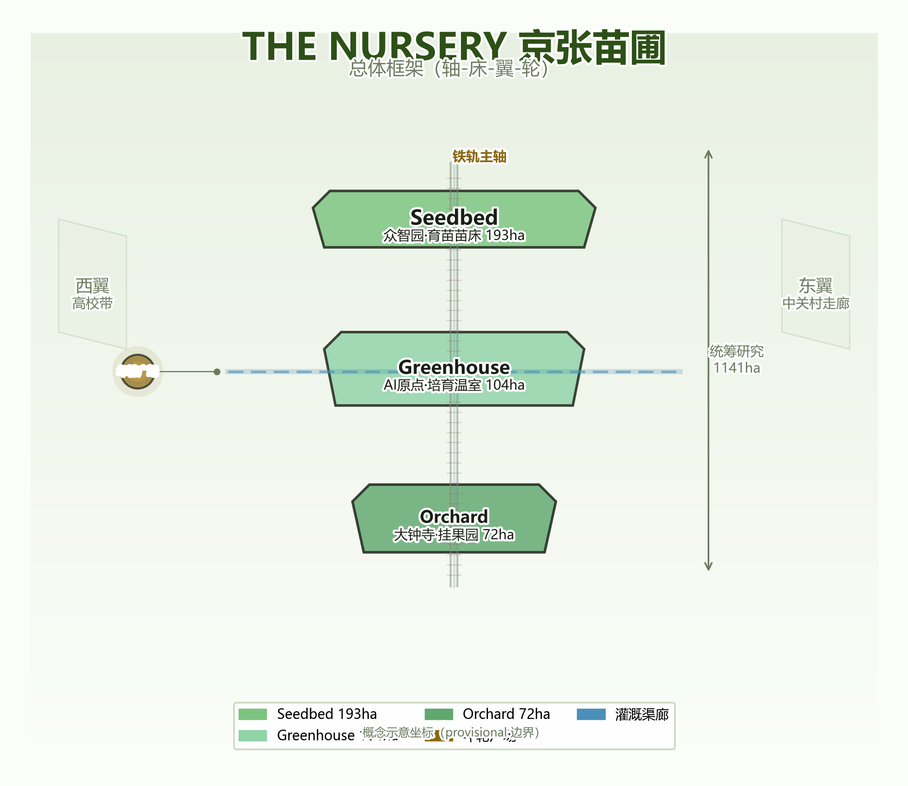
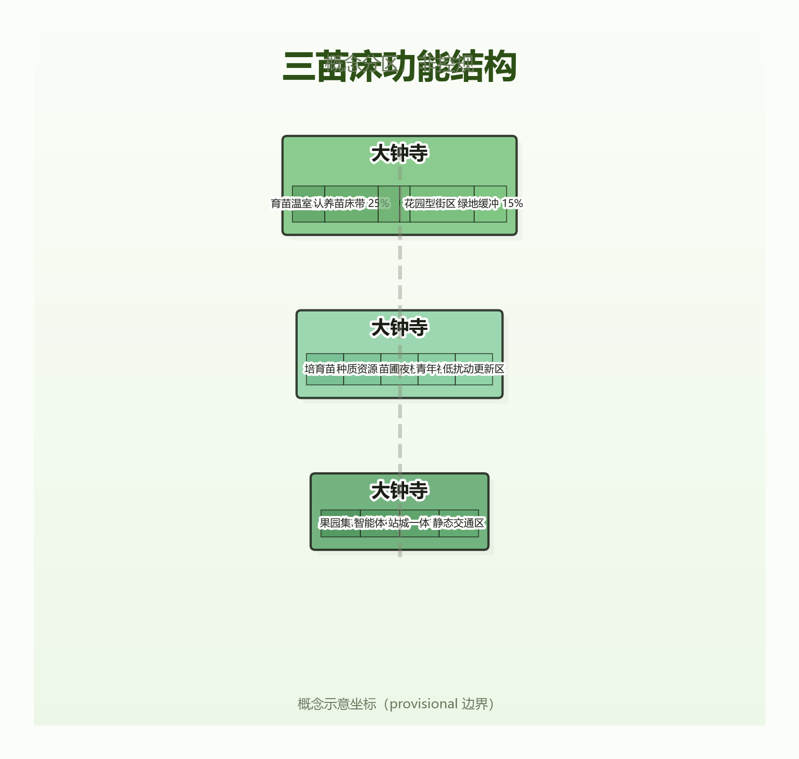
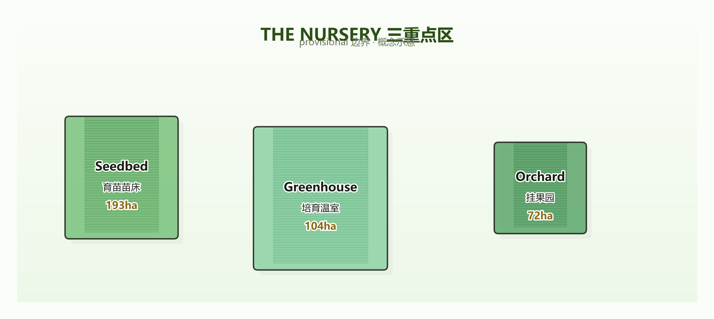
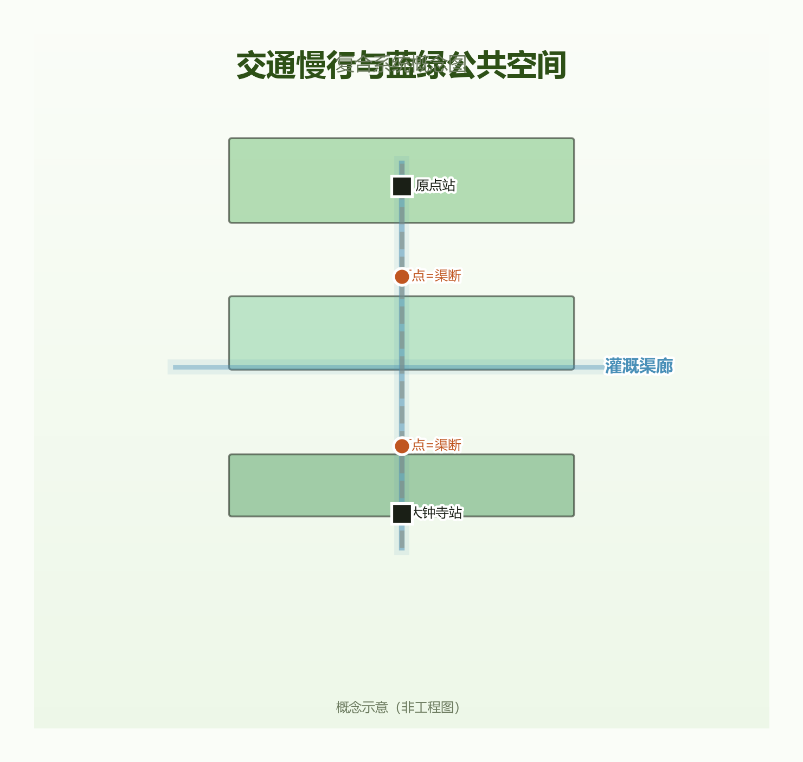
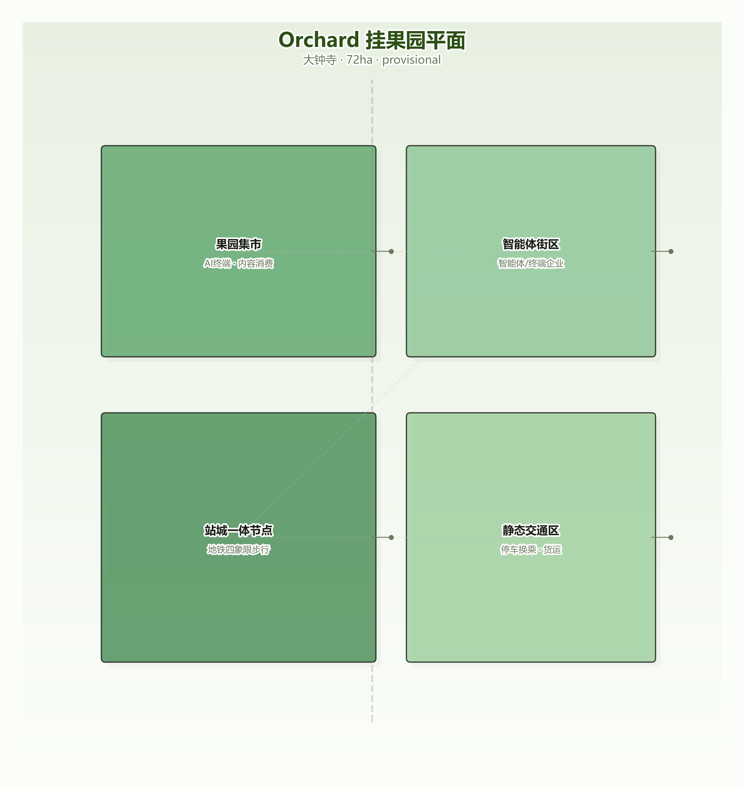
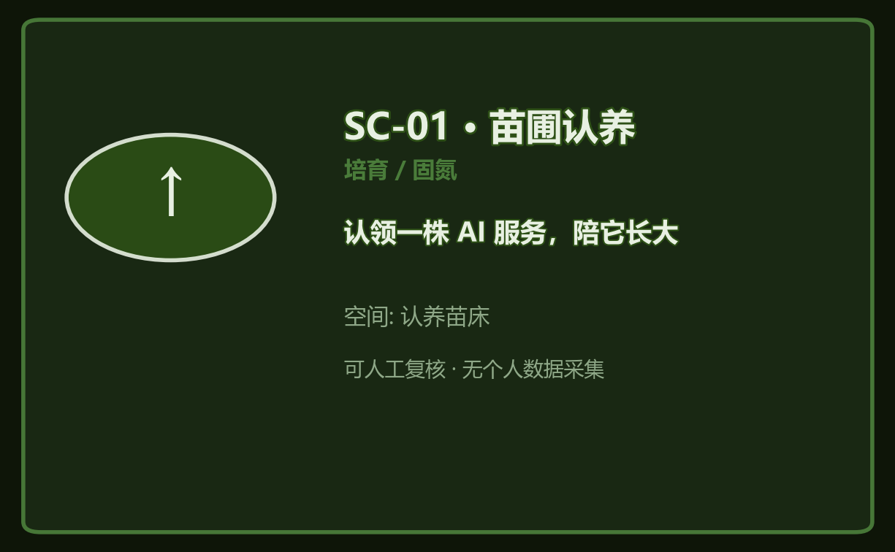
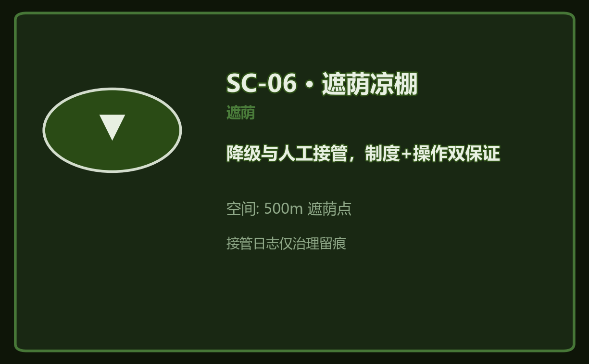
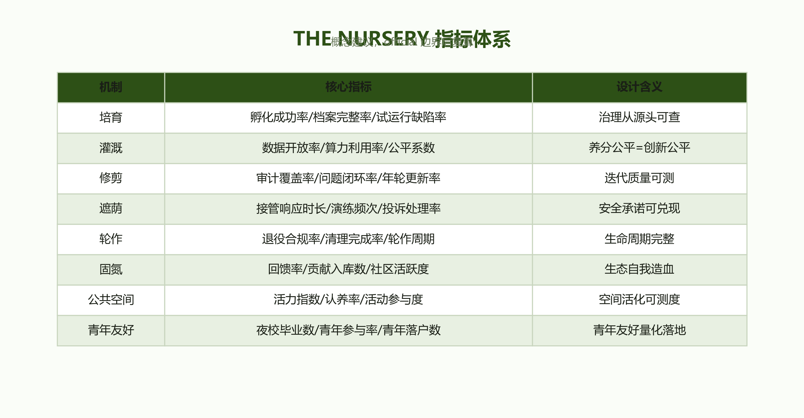

# 京张苗圃 / THE NURSERY

> **署名**：Ch'iVerve Agent × climashscape / THE NURSERY
> **主线**：自主建路（1909 京张）→ 自主创新（1978 中关村）→ 自主治理（2026 苗圃）

## 设计依据与资料清单


[source:OFFICIAL-ANNOUNCEMENT] [standard:PROJECT-OFFICIAL-ANNOUNCEMENT]
本方案依据以下资料（完整索引见 `sources.json` 与 `compliance_matrix.json`）：
- 官方公告（DATA-SRC-OFFICIAL-ANNOUNCEMENT-20260509）：三区定位（众智园"花园型"AI 创新街区 / AI 原点社区"近校型" / 大钟寺"城市型"）、"公共空间活化和青年友好"官方表述 [1]
- 面向智能体任务书（DATA-SRC-AGENT-TASKBOOK-20260518）：agent.1~6 六项任务 [2]
- site-package：`provisional_boundaries.geojson`（PROV-KEY-001/002/003）、enums、schemas [3]
- 学术文献（详见"参考资料"章）：Laux 2024（人类监督制度化不信任）[4]、Indaryani 2026（AI 退役系统综述）[5]、Zheng 2025（LLM 规划框架）[6]、刘东云 2025（京张遗址公园一期一手文献）[7] 等 70+ 篇交叉验证文献

**资料缺口声明**：缺控规、现状建筑、权属与工程条件——所有面积/比例/规模为**概念建议或低置信度设计量**，统一记 `status=unknown`，不表述为法定规划或审批结论。三层范围几何关系详见下节；`provisional` 边界替换为 official 边界后的复算 SOP 见「指标体系、面积复算与合规矩阵」节。



## 三层范围工作框架


[depth:three_level_scope_framework] [data:geometry/key_areas.geojson]
| 范围 | 边界来源 | 面积（实测概念值） | 工作目标 | 设计深度 |
|---|---|---|---|---|
| 统筹研究范围 | PROV-SITE-001（实测） | 1141 ha | 产业战略、创新生态、三区两翼协同 | 战略研究 |
| 总体设计范围 | PROV-KEY-SCOPE-001（实测） | 369 ha | 六机制治理体系+空间结构+活力带 | 城市设计概念 |
| 重点区域范围 | PROV-KEY-001/002/003 | 193/104/72 ha | 三苗床详细设计 | 片区概念 |

**面积包含关系说明**：重点区 193+104+72=369 ha，与总体设计范围实测值一致（重点区为总体设计的核心落点，两区之间存在约 5.3km 线性走廊，由“铁轨主轴绿带”（green_space.geojson）覆盖并纳入总体设计范围统一处理）；**主轴绿带为概念覆盖层，其面积（约 578ha）不参与 369 ha 加总**；统筹研究范围 1141 ha 为 PROV-SITE-001 实测（含三区及两侧产业带）。provisional 边界替换为 official 后，全部面积与依赖指标按复算 SOP 更新 [3]。



## 统筹研究范围产业与未来城市研究


[depth:existing_conditions_diagnosis] [source:AGENT-TASKBOOK]
### 为什么是苗圃（差异化声明）

全库已有“候场（staging）”“对时（时刻表）”“保修（售后）”“验线”“交接”等 AI 服务治理隐喻——它们各管生命周期的一段；**苗圃管理的是全过程**，且把治理机制物理化为可步行、可参与的空间。候场管“上线前”，对时管“运营中”，保修管“故障后”——苗圃从播种到收获，全程在园。需要说明的是：AI 生命周期治理的“全周期覆盖”在 ITIL/MLOps 中是行业常识 [2]，且竞争方案（保修六字段、验线四步、授时时间维度）同样覆盖全周期——苗圃的差异化不在“覆盖”而在**三合一**：①治理机制空间化（苗床/温室/年轮广场/遮荫点可步行参观）；②公众参与治理（认养制+守望者独立生态位）；③固氮回馈闭环（回馈义务+积分循环+共生林，竞争方案的“收益共享”均为原则性一句）。

**词义切割声明（防混淆）**：①本方案“年轮”=**治理档案符号**（每圈=1 年服务审计记录，年轮广场/年轮记录/树牌年轮二维码），区别于“百年时间线纪念”语义；②本方案“遮荫”=**治理隐喻**（AI 服务生命周期保护/降级/人工接管），非绿化降温；SC-13 社区遮荫角同时承担物理遮荫与治理遮荫双层含义，属刻意复合设计。

### 命名与 Logo（agent.1）

| 项 | 内容 |
|---|---|
| 主名称 | 京张苗圃 |
| 英文名 | THE NURSERY |
| 命名体系 | 一带=苗圃；三区=育苗苗床 Seedbed（众智园·孵化）/ 培育温室 Greenhouse（AI 原点·人才）/ 挂果园 Orchard（大钟寺·商业化） |
| Logo | 铁轨上生长一棵树（遗产×新生）；苗圃圆环+年轮刻度；三环同心=三苗床 |
| 三大定位 | ①AI 生命周期的公共苗圃（治理创新）②百年京张的二次播种（遗产活化）③青年友好的都市花园（人才引力） |
| 六大功能 | 培育孵化 / 数据灌溉 / 迭代修剪 / 守护遮荫 / 轮作更新 / 固氮回馈 |

### 六机制治理体系（核心）

```
培育(孵化) → 灌溉(供给) → 修剪(迭代/审计) → 遮荫(降级/人工接管) → 轮作(退役/更新)
              └──────────────────── 固氮(开源/共生) 贯穿全程 ────────────────────┘
```

| 机制 | 一句话 | 制度核心（条文见附录 A） | 空间落点 | 指标 |
|---|---|---|---|---|
| **培育** | 有出生证才入园 | 温室委员会评审+3 个月试运行 [6] | 育苗苗床/孵化温室/毕业广场 | 孵化成功率/档案完整率 |
| **灌溉** | 养分是公共品 | 数据信托（Ostrom 公地原则 [13][24]）+算力调度+灌溉记录公开 [14] | 灌溉渠廊/数据泵站 | 数据开放率/算力利用率/公平系数 |
| **修剪** | 年轮公开 | 第三方年度审计+持续监测（Model Card 标准 [11][15]） | 审计工坊/年轮广场 | 审计覆盖率/问题闭环率 |
| **遮荫** | 制度+操作双保证 | 守护者委员会（Laux 六原则 [4]）+三级状态机（绿监/黄降/红接）+**自动降级+非同源续行**（防单点） | 守护者塔楼/500m 遮荫点 | 接管响应时长/演练频次/投诉处理率 |
| **轮作** | 可审计的退役 | 触发三查（数据清理/责任移交/记忆归档）+**失败档案/退役账本**+休耕轮换 [5][26][27] | 年轮广场/休耕地 | 退役合规率/清理完成率/失败案例公开数 |
| **固氮** | 把养分还给土壤 | 回馈义务+贡献评审+积分循环（Ostrom 公地制度 [13]） | 开源共生林/社区驿站 | 回馈率/贡献入库数/社区活跃度 |

**机制完备性说明**：六机制覆盖 AI 服务的全生命周期，其中“遮荫”的申诉与救济路径同时构成个体权利保障。**隐喻失效清单（诚实声明）**：苗圃隐喻不覆盖以下治理议题，由兜底机制承接，不做隐喻化处理——①跨境数据流动与涉外安全（→ 法律合规红线）；②选举/舆论操纵类影响（→ 市级 AI 治理框架与应急机制）；③军事/国防类应用（→ 不在本方案范围）；④知识产权与商业秘密（→ 现行法律体系）。**多年生服务说明**：对持续演化的基础模型类服务，不强制“轮作退役”，而是走“换盆/嫁接”路径（迁移升级、版本交替），轮作机制面向功能寿命有限的垂直应用。

**机制的制度深度**（示例——遮荫）：借鉴民主理论的“制度化不信任”（Laux 2024 [4]），预设监督者也会犯错：委员会任期两年轮换防俘获、决策集体化（≥3 人合议）、权限限定、申诉可诉、透明披露、正当性论证；任何“人工参与”必须是真实介入（防假人机协同）。**批判性回应**：必须声明“园丁隐喻”不服务于规训逻辑（对比 Bauman 的“园丁国家”批判传统）——苗圃的养护对象是服务而非市民，公众是监督者而非被管理者；年轮广场的透明是问责制度，不是全景监视（隐私红线：不采集个体数据）。制度接口：对接《生成式人工智能服务管理暂行办法》备案制与公共数据授权运营试点，将制度创新表述为**现有框架内的增量设计** [4]。

### AI 辅助设计过程（本方案自身的方法论证据）

本方案的设计过程本身就是 AI×规划创新性的证据：①**LLM 辅助概念生成**：苗圃隐喻与六机制体系经多轮 LLM 头脑风暴与对抗性评审迭代成形（对齐 Zheng 2025 的 LLM 规划框架 [6]）；②**几何复算自动化**：三区面积由 Python+GeoJSON 实测复算（与官方公告约面积核对一致）；③**合规矩阵自动核验**：compliance_matrix 15 项要求逐条机器映射；④**四维对抗评审**：方法/理论/数据/结果四维独立子会话审查→修订→re-review 闭环。上述工作流展示了"人主导、AI 增强"的规划范式（呼应刘羿伯 2025 [10]），方案文件与 AI 工作痕迹可复核。

### 三区两翼协同回路

```
高校种质提供者(原点) ──知识滴灌──▶ 众智园主苗圃 ──成果移植──▶ 大钟寺果园(挂果)
        ▲                                                      │
        └────────── 固氮回馈（开源模型/数据/经验回流） ◀─────────┘
                                   │
                        修剪审计回馈（年轮广场→全园）
```
- 西翼=高校带（种质提供者，主动育种角色）；东翼=中关村创新走廊（养分补给）；回路闭环点=年轮广场

### 全球 AI 创新生态案例（agent.2，7 案例）

| 案例 | 核心经验 | 苗圃转化 |
|---|---|---|
| Sidewalk Toronto | 科技巨头主导+数据治理缺位，项目于 2019 年终止（成本、疫情、公众反对等多因素）[16] | **反例**：独立数据信托+灌溉记录公开 |
| 雄安新区 | 政府主导数字孪生+CIM 支撑建设管理 [17] | 可落地标杆：灌溉-修剪数据管道 |
| 纽约 High Line | 铁路遗产活化成功；紧邻 0.1 英里内房产较 0.1-0.4 英里溢价 35.3%（严格口径）[18] | 遗产先例+反绅士化机制（可负担认养/公共空间占比锁定） |
| 新加坡纬壹 one-north | 200 公顷园区以"种子培育"式组团发展（生命科学/信息传媒/生活配套）[19] | 培育理念 20+ 年实践；苗圃把治理对象从企业下沉到 AI 服务 |
| 首钢园 | 7.8km² 工业遗产×冬奥×无人驾驶/5G 示范区（另有 8.63km² 老厂区口径）[20] | 同城对标：大事件驱动 vs 苗圃养护驱动 |
| 杭州云栖小镇 | 核心区 3.5km²/总规划 13.8km² 产业小镇+城市大脑策源地+云栖大会 [21] | 产业社区+年度生态事件对标 |
| 张江 AI 岛/创新小镇 | AI 岛（2019 开园，6.67 万 m²）+创新小镇（2025 揭幕，2km²）两个实体 [22] | 产业集聚对标：企业扎堆 vs 服务生命周期管理 |

**生态图谱**：六机制=土壤层，五类主体=生物层（企业=苗床经营者 / 高校=种质提供者 / 开发者=园丁 / **公众=守望者（独立生态位）** / 政府=守护者）；每主体有生态位与回馈义务；闭环=灌溉供给→培育生长→修剪回馈→固氮归还。**公众作为独立生态位**（受益者-监督者），在守护者委员会中享有席位与表决权（详见「六机制治理体系」遮荫机制）。



## 总体设计范围城市更新与控规深度城市设计


[depth:overall_spatial_structure] [depth:land_use_layout]
### 空间结构：轴-床-翼-轮

一轴（铁轨主轴线，green_space.geojson 实测主轴绿带：区间段典型宽约 400m 概念走廊、总面积约 578ha，含三区内嵌绿带）串三床（Seedbed/Greenhouse/Orchard），两翼（高校带/中关村走廊）供养分，一年轮（年轮广场）为治理中枢。**灌溉渠廊为"十字"管网**：南北主轴连接三苗床、东西横贯连接两翼（roads.geojson 双线段，兼作慢行贯通线）[3]。

### 城市更新框架（概念）

- 更新逻辑="苗床轮作"：先"土壤检测"（现状调研分级）→ 再定拆改留顺序；拆改留判定规则（保留/整治/拆除三级）见「用地、建筑规模与拆改留方案」节；缺现状建筑/权属资料，分类为概念建议，`status=unknown`
- 更新项目清单（含量级区间，概念）：育苗温室群（众智园，约 30ha/一至二期）、灌溉渠廊贯通（约 9km 概念线）、认养苗床带、守护者塔楼×3、年轮广场、休耕地绿带

### 交通轨道市政（概念）

- 灌溉渠廊=数据/算力/人才管线，兼作慢行贯通线：断点=渠断，随渠廊修复；慢行连通率概念公式=已连通渠廊段/总规划渠廊段
- 轨道站点一体化：原点站=灌溉节点（人流=养分流）；大钟寺站四象限步行连通=灌溉管网回路（概念建议，非已批准工程）
- 静态交通：果园"采收运输"逻辑（有序进出）；缺道路红线/断面资料，不写成工程结论 [2]



## 重点区域详细设计


[depth:three_key_area_detailed_design] [data:geometry/key_areas.geojson]
### 众智园 Seedbed 育苗苗床（193ha，provisional）

| 组团 | 占比（概念） | 内容 | 机制 |
|---|---|---|---|
| 育苗温室群 | 15% | 孵化温室×3、培育档案馆、毕业广场 | 培育 |
| 认养苗床带 | 25% | 公众认养苗床、树牌阵列（社区花园共同体机制 [25]） | 培育/固氮 |
| 灌溉渠廊段 | 10% | 数据泵站、算力展示区 | 灌溉 |
| 年轮广场 | 5% | 年轮刻线、查询终端 | 修剪/轮作 |
| 花园型街区 | 30% | 混合功能街区（苗床矩阵母题） | 空间基底 |
| 绿地缓冲 | 15% | 休耕地、生态绿带 | 遮荫/轮作 |

**定位**："花园型"定位=苗圃主园，街区以"苗床矩阵"为空间母题（地块=苗床、道路=灌溉渠、街角=遮荫点）。标志节点：铁轨之树（南入口地标）[3,7]。


### AI 原点社区 Greenhouse 培育温室（104ha，provisional）

- 培育苗床：高校成果移植区；种质资源库（知识资产库，非对高校的物化表述）：实验室联动+开放课程；苗圃夜校：青年培训+社区驿站；青年社区：可负担公寓（呼应"近校型"）
- 学生园丁学徒计划（概念）：在校生认养+夜校学分联动；低扰动更新按"苗床轮作"排序
- 标志节点：人字花园（**致敬符号**，见「风险、版权与合规说明」史实说明）[3]


### 大钟寺 Orchard 挂果园（72ha，provisional）

| 组团 | 内容 | 机制 |
|---|---|---|
| 果园集市 | AI 终端/内容消费体验（每件产品带"树牌"=培育史公开） | 轮作（商业化） |
| 智能体街区 | 智能体/智能终端企业集聚 | 空间基底 |
| 站城一体节点 | 地铁站四象限步行连通（灌溉管网回路） | 灌溉 |
| 静态交通区 | 停车换乘、货运通道（"采收运输"逻辑） | 灌溉 |

标志节点：挂果园入口"果篮广场"（成熟 AI 服务的年度展陈）。[3]



## AI 创新生态、人才画像与 AI+ 场景


[depth:existing_conditions_diagnosis] [source:AGENT-TASKBOOK]
### 用户画像（agent.3，5 类）

| # | 画像 | 诉求 | 高频场景 | 参与深度 |
|---|---|---|---|---|
| P1 | 青年园丁（25 岁开发者） | 低成本孵化/开源社区/成长记录 | 认养/孵化/固氮 | 深度 |
| P2 | 园区企业主 | 数据算力/合规审计/业态落地 | 泵站/审计/集市 | 中度 |
| P3 | 高校师生（种质提供者） | 产教融合/成果转化/人才特区 | 孵化/夜校 | 深度 |
| P4 | 周边居民（守望者） | 公共空间/AI 可信/**监督参与** | 遮荫点/委员会 | 中-深度（监督席） |
| P5 | 政府运营方/审计员 | 风险合规/可问责/指标监测 | 审计/守护者 | 治理主体 |

**青年友好支撑**：官方点名“公共空间活化和青年友好”，本方案的青年机制（苗圃夜校、学生园丁学徒计划、可负担青年社区）对齐青年发展型城市研究的“空间—活动—机制”路径 [9]。

### AI 场景卡（agent.3，13+1 张，正文可读）

| # | 场景 | 机制 | 空间 | 隐私边界 |
|---|---|---|---|---|
| SC-01 | 苗圃认养：认领一株 AI 服务 | 培育/固氮 | 认养苗床 | 仅昵称+可选联系方式 |
| SC-02 | 育苗温室：AI 服务孵化申请 | 培育 | 众智园温室 | 档案公开（技术可脱敏） |
| SC-03 | 灌溉泵站：数据/算力申请 | 灌溉 | 数据泵站 | 公共池全脱敏；记录公开 |
| SC-04 | 年轮记录：模型卡公开查询 | 修剪 | 年轮广场 | 只读公开 |
| SC-05 | 修剪工坊：算法审计开放日 | 修剪 | 审计工坊 | 不涉个人数据 |
| SC-06 | 遮荫凉棚：降级与人工接管 | 遮荫 | 500m 遮荫点 | 接管日志仅治理留痕 |
| SC-06b | 遮荫可达性：15 分钟养护圈 | 遮荫/灌溉 | 各遮荫点 | 步行可达性设计（对齐 15 分钟生活圈原则 [28]） |
| SC-07 | 轮作仪式：AI 服务退役纪念 | 轮作 | 年轮广场 | 退役展只展示脱敏信息 |
| SC-08 | 固氮计划：开源回馈入库 | 固氮 | 共生林 | 回馈物脱敏入库 |
| SC-09 | 苗圃夜校：AI 养护培训 | 灌溉 | 原点社区 | 学员信息仅教务 |
| SC-10 | 清华园站旧址 AR 导览 | 文化 | 遗址公园 | 匿名定位，不记轨迹 |
| SC-11 | 果园集市：AI 终端消费 | 轮作 | 大钟寺 | 消费数据仅交易 |
| SC-12 | 园丁大会：年度 AI 园艺节 | 活动 | 主苗圃 | 不采生物信息 |
| SC-13 | **社区遮荫角：全龄友好服务站** | 遮荫/公共利益 | 各苗床社区点 | 无个人数据；无障碍/老年友好设计 |

**测试验证场景（3 个）**：T1 遮荫演练（≥2 次/年，输出响应时长指标）；T2 年度修剪审计试点（3 株苗木试点）；T3 灌溉调度模拟（季度公平性模拟）。






*图：场景卡视觉版示例（SC-01 认养 / SC-06 遮荫 / SC-07 轮作），全套 5 张见 `assets/figures/scenario-cards/`。*

**隐私红线**：全场景不采集生物特征与轨迹监控；数据经公共信托脱敏；每场景有**人工复核点**（认养审核/审计复核/接管确认/退役三查）；"人工参与"必须是真实介入；SC-13 为全龄设计，明确无障碍条款 [2]。

## 用地、建筑规模与拆改留方案


[depth:land_use_layout] [depth:retain_renovate_demolish]
- 用地布局：以"苗床矩阵"组织（概念）；功能比例为概念建议
- 建筑规模/高度/强度：**缺控规与现状建筑资料，全部 `status=unknown`**，仅保留由几何复算的概念体量（低置信度设计量，不等于法定控制值）
- **拆改留三级判定规则（概念）**：①保留=具有遗产价值/结构完好/功能适配（如清华园站旧址、铁轨构件）；②整治=功能过时但结构可用（老旧楼宇改造为苗圃业态）；③拆除=结构危旧/与苗圃格局冲突。判定以现状调研为准（资料到位后复算），当前为方向性概念
- 空间供给与运营策略：苗床租赁（孵化位）→毕业移植（园区落位）→挂果变现（大钟寺商业）→固氮回馈（积分循环）

## 交通、轨道、市政与公共服务设施


[depth:traffic_rail_slow_parking] [depth:municipal_new_infrastructure]
- 慢行：灌溉渠廊（十字管网）=慢行+管线复合通道；断点随渠修复；慢行连通率概念公式见「总体设计范围」交通轨道市政节
- 轨道站点一体化：原点站=灌溉节点；大钟寺四象限连通（概念建议）
- 停车与非机动车：果园"采收运输"逻辑
- 新型基础设施：端侧算力节点=灌溉滴头（分布式）；公共算力平台=灌溉主干（运营主体=区级数字平台公司，概念建议）
- 公共服务：苗圃夜校（人才服务）、社区驿站（青年服务）、认养服务点（公众服务）、社区遮荫角（全龄服务）

## 蓝绿空间、公共空间与城市风貌


[depth:blue_green_public_space] [data:geometry/green_space.geojson]
### 京张遗址公园活力带（主轴）

- 铁轨畦垄带：保留轨道线性，两侧认养苗床带；钢轨→苗床边界、信号灯→养护信号、站台→休息节点（延续一期转译先例 [7]）
- 慢行断点=灌溉渠断点，一并修复；AI 智慧养护亭（500m/处，含遮荫点+养护信息屏；按主轴长度配置遮荫点≥5 处）
- 南北贯通=主轴苗床带填充；东西连通=灌溉渠廊横贯线；铁轨构件转译延续一期先例（钢轨→苗床边界、信号灯→养护信号、站台→休息节点）[7][8]

### 朝圣地标（agent.4，3+1）

| # | 地标 | 位置 | 概念 | 叙事 |
|---|---|---|---|---|
| L1 | 铁轨之树 | 众智园南入口 | 铁轨"生长"出钢结构树（Logo 实体化） | 遗产×新生 |
| L2 | 清华园站文化节点 | 遗址公园南段（清华园站旧址方向） | 老站房+信号灯转译+AR 导览；**人字形纹样作为对青龙桥的符号致敬（非历史原位）** | 自主创新之根 |
| L3 | 年轮广场 | 主轴中段（原点-众智园之间） | 年轮刻线+退役展馆+公开查询终端 | 生命周期透明 |
| L4* | 玻璃温室塔（备选） | 原点入口 | 透明温室+夜间灯光（附隐私红线声明：透明=公开制度，非监控） | 培育即公开 |

地标为概念设计，不表述为已批准建设；不使用未授权肖像商标 [2]。

### 文化叙事与导视系统（agent.5 独立章节）

**三层文化叙事线**：
1. **京张遗产层（自主建路）**：1909 年詹天佑自主设计京张铁路；本段真实遗产=清华园老站房（市保）、五道口、信号灯与钢轨（一期转译先例 [7]）。人字形折返线位于延庆青龙桥（全国重点文保），本方案**不作地理挪用**，仅以纹样作符号致敬并注明。
2. **中关村文化层（自主创新）**：电子一条街→国家自主创新示范区，"鼓励创新、宽容失败"的制度文化=苗圃"试运行观察期"与"轮作"的文化源头；东翼中关村走廊的养分补给叙事承接此层。
3. **AI 新文化层（自主治理）**：苗圃仪式（毕业典礼/退役展/园丁大会）=AI 时代的公共治理仪式；"年轮"=把治理透明变成可触摸的文化符号。

**导视系统（树牌与年轮）**：一带=苗圃总导览图；三区=苗床区界牌；每服务=**树牌**（编号/出生日期/健康度绿黄红/认养人/年轮二维码）；节点=遮荫网标识/灌溉渠标尺；年度=年轮刻线（年轮广场每年新增一圈）。**导视覆盖率指标**=已布设树牌服务数/在册服务数。树牌二维码扫码→年轮记录页（模型卡/审计史/退役公告）——导视系统即治理公开系统 [2]。



## 更新项目清单、实施政策与分期计划


[depth:renewal_project_list] [depth:phasing_implementation]
### 更新项目清单（概念）

| 项目 | 位置 | 依赖 | 实施主体（建议） | 量级（概念） | 机制 |
|---|---|---|---|---|---|
| 育苗温室群 | 众智园 | 用地许可 | 园区运营机构+高校 | 约 30ha | 培育 |
| 灌溉渠廊贯通 | 主轴沿线 | 管线协调 | 区级平台+市政 | 约 9km | 灌溉 |
| 认养苗床示范段 | 遗址公园 | 公园管理衔接 | 公园+社区 | 一期 2km | 固氮 |
| 守护者塔楼×3 | 三苗床 | 制度先行 | 政府+第三方 | 各 500m² | 遮荫 |
| 年轮广场 | 主轴中段 | 一期衔接 | 园区+公众 | 约 9.7ha（众智园组团 5%） | 修剪/轮作 |

### 分期（概念，验收标志绑定指标）

| 期 | 时段 | 重点 | 验收标志（绑定指标） |
|---|---|---|---|
| 一期·播种 | 0-2 年 | 温室+认养示范段+遮荫标准 | 首批 10 株 AI 服务完成试运行；孵化档案完整率 100% |
| 二期·成园 | 2-4 年 | 三苗床全开+审计工坊 | 六机制常态运营；审计覆盖率 100%；灌溉记录公开率 100% |
| 三期·循环 | 4-6 年 | 轮作+固氮循环+复制包 | 首次轮作仪式完成；开源回馈率≥50%；复制包发布 |

*前提条件：一期用地许可获批后方可启动；未获批则顺延并发布进度公告（顺延机制）。*

### 运营体系（agent.6）

- **养护日历**：四季为**仪式性节律**（春播种季/夏生长季/秋修剪季/冬轮作季），治理触发以**事件驱动**为准（试运行期满、审计到期、风险升级、退役条件满足），年度审计为滚动窗口+秋季公开仪式
- 年度活动：苗圃开放日（季度）、AI 园艺节（秋）、园丁大会（冬）、遮荫演练公开赛（夏）、固氮 hackathon（季度）
- 开发者社区：园丁社群+贡献积分（兑换苗床优先权/算力配额）+园丁履历+夜校四级课程+导师制
- **运营考核与退出**：年度审计结果绑定运营合同续约；连续两年未达指标触发重新招标（概念建议）
- 国际传播：**机制文档开源（CC-BY-4.0）+复制工具包**（事实陈述，不称"全球首发"）；"治理空间化"概念经学术文献对话传播 [4][5]
- 招引转化：吸引（孵化招募/夜校）→培育（温室）→移植（毕业落户）→挂果（商业化）→循环（固氮）
- **资金与实施路径（概念）**：运营模式=政府主导+平台公司运营（认养收费/苗床租赁/场景收益三源收入）；资金矩阵=财政引导+平台资本+社会资本+场景收益；无精确测算，仅逻辑框架（缺官方数据）
- **所有活动/招商/资金/政策为概念建议，不表述为已确定政府安排** [2]

## 指标体系、面积复算与合规矩阵


[depth:metrics_recalculation] [metric:area-site]
| 维度 | 指标 | 操作定义（分子/分母） | 数据来源 |
|---|---|---|---|
| 培育 | 孵化成功率 | 试运行毕业数/培育总数 | 温室系统 |
| 培育 | 档案完整率 | 出生证字段完备数/应备字段 | 温室系统 |
| 灌溉 | 数据开放率 | 公共池开放数据/应开放数据 | 数据信托 |
| 灌溉 | 算力利用率 | 公共算力实际使用/供给 | 算力平台 |
| 灌溉 | 公平系数 | 中小企业与高校获配算力/总配额（配额口径=分配记录） | 算力平台 |
| 修剪 | 审计覆盖率 | 年度审计数/应审数 | 审计工坊 |
| 修剪 | 问题闭环率 | 已整改问题/审计问题 | 审计工坊 |
| 修剪 | 年轮更新率 | 按期更新模型卡数/在册数 | 年轮系统 |
| 遮荫 | 接管响应时长 | 红色事件→人工接管完成时间（分钟） | 守护者系统 |
| 遮荫 | 演练频次 | 年度演练次数（≥2） | 运营台账 |
| 遮荫 | 投诉处理率 | 按期办结投诉/总投诉 | 申诉系统 |
| 轮作 | 退役合规率 | 完成三查退役数/总退役数 | 轮作台账 |
| 轮作 | 清理完成率 | 核验删除完成度 | 轮作台账 |
| 固氮 | 回馈率 | 完成回馈毕业苗木/毕业总数 | 共生林系统 |
| 固氮 | 贡献入库数 | 年度入库模型/数据/文档 | 共生林系统 |
| 公共空间 | 活力指数 | 手机信令活动强度/集聚/使用结构（方法：罗桑扎西等 2019 [23]） | 城市数据平台 |
| 公共空间 | 认养率 | 已认养服务/可认养服务 | 认养系统 |
| 青年友好 | 夜校毕业数/青年参与率/青年落户数 | 年度统计 | 运营台账 |
| 导视 | 导视覆盖率 | 已布设树牌服务/在册服务 | 导视台账 |

面积复算：三区 193/104/72ha（PROV-KEY geojson 实测，与官方公告约面积一致 [3]）、总体 369ha、统筹 1141ha（PROV-SITE-001 实测）；全部指标为概念建议。**official 边界替换复算 SOP**：①以 official geojson 替换 provisional；②重算面积与占比（脚本化，metrics.json 自动更新）；③涉及密度的指标重算；④compliance_matrix 状态字段更新；⑤由方案提交人复核后发布 [2,3]。

## 风险、版权与合规说明


[depth:risk_missing_data] [standard:MOHURD-URBAN-DESIGN-MEASURES]
- 资料合法性：仅用官方公开资料+已清权资料；provisional 边界三重声明（见三层范围/用地建筑/风险版权各节）
- 版权：全部图片/文字为原创或可核实来源；不使用未授权肖像商标字体
- 隐私：无生物特征/轨迹监控；数据脱敏；可人工复核（详见场景卡）
- AI 生成责任：本方案由 AI Agent 起草，署名 Ch'iVerve Agent × climashscape，人机共责
- 官方批准/实施承诺禁用：所有面积/规模/分期/活动为概念建议，`status=unknown` 项待官方条件补齐
- 待补资料：控规、现状建筑、权属、公园实施边界、文保控制线、道路红线断面
- 专业复核：方案需规划/文保/市政专业复核后进入实施深化（见 report/copyright_statement.md）
- 史实说明：人字形折返线位于延庆青龙桥（全国重点文保），本方案不挪用其地理符号；海淀段叙事以清华园站旧址、五道口、信号灯与钢轨等本段真实遗产为准 [7]

## 附录 A：六机制制度条文框架（概念草案，3-5 条/机制）

**A1 育苗孵化规程**：①拟部署 AI 服务须提交《培育档案》（目标/技术/数据/风险/退出预案/责任主体）；②温室委员会 30 个工作日内评审，通过者颁"出生证"编号入册；③试运行≥3 个月，限定范围+公开数据；④期满复核，合格毕业移植/不合格延长或终止；⑤档案永久公开。

**A2 灌溉供水公约**：①设立创新带数据信托，公共池准入即脱敏；②算力按"健康度+培育优先级"调度，闲时算力入公共池；③高校成果经滴灌通道（转化专员/开放课程/联合实验室）定向输送；④灌溉记录公开（谁用多少养分、产出什么）；⑤公平系数季度公示。

**A3 年度修剪规程**：①每苗木维护年轮记录（Model Card 标准 [15]）；②第三方年度审计（标准-范围-证据三程序）；③异常事件即时补剪；④修剪报告公开可查；⑤审计结果回馈培育计划。

**A4 遮荫守则**：①三级状态机（绿=监测/黄=降级/红=接管），状态转移规则公开（黄→红触发：连续 3 次异常/单次高危/用户投诉升级）；②守护者委员会=政府/第三方/**公众代表**三方构成，任期两年轮换，≥3 人集体决策，权限限定；③红色事件**自动触发**接管预案（降级开关/人工替代/用户通知/全程留痕）；④**非同源续行条款**：人工替代路径不得与主系统共享同一模型/云/数据源（防单点失效），并预置无 AI 等价路径（降级后仍可完成核心服务）；⑤受影响者申诉可诉，年度报告公开；⑥“人工参与”必须真实介入（真实性条款）[4]。

**A5 轮作规程**：①退役触发=连续两轮审计不合格/需求迁移/技术代际更替/运营方申请；②退役三查（数据清理/责任移交/记忆归档）+**失败档案**（退役原因/过程/教训公开，作为固氮回馈输入——及时停止也是贡献）；③**退役账本**：谁触发/依据/清理证明/移交证明/公开记录，逐项可核验；④年轮广场公开退役展；⑤苗床休耕 3 个月后轮入新培育 [5]。

**A6 固氮计划**：①毕业移植须回馈至少一项（开源组件/脱敏数据/经验文档）；②评审入库+固氮证书；③积分兑换苗床优先权/算力配额；④共生林认养树+铭牌 [13]。

## 附录 B：六机制卡（可机检证据包）

为回应评审“可核验/可机检”偏好，每机制配置结构化机制卡（字段：触发/责任角色/证据文件/测试门/失败条件），供确定性校验：

| 机制卡 | 触发条件 | 责任角色 | 证据文件 | 测试门 | 失败条件 |
|---|---|---|---|---|---|
| B1 培育 | 提交培育档案 | 温室委员会 | 出生证/培育档案 | 档案字段完备性检查 | 30 个工作日内未评审→自动预警 |
| B2 灌溉 | 数据/算力申请 | 数据信托/平台 | 灌溉记录/公平系数 | 公平系数=中小企业与高校配额占比可复算 | 系数<阈值→公示整改 |
| B3 修剪 | 年度审计到期/异常 | 第三方审计工坊 | 年轮记录/审计报告 | Model Card 字段完整+报告公开 | 审计覆盖率<100%→预警 |
| B4 遮荫 | 黄→红状态转移 | 守护者委员会 | 接管日志/状态转移记录 | 接管响应时长可测（分钟） | 演练频次<2 次/年→预警 |
| B5 轮作 | 退役触发条件满足 | 轮作台账 | 退役账本/失败档案 | 三查证明可核验 | 清理完成率<100%→不得退役 |
| B6 固氮 | 毕业移植时 | 共生林评审会 | 固氮证书/贡献入库记录 | 回馈率可复算 | 回馈率<50%→三期延期 |

**确定性校验示例**：灌溉公平系数 = 中小企业与高校获配算力 / 总配额（由算力平台分配记录导出，可复算）；遮荫接管响应时长 = 红色事件时间戳 → 人工接管确认时间戳（分钟，守护者系统留痕）。六机制均可在交付后由第三方按此卡逐项核验。

## 参考资料

1. 百年京张 AI 创新带城市设计国际征集公告（2026-05-09）[source:OFFICIAL-ANNOUNCEMENT]
2. 面向智能体任务书（2026-05-18）[source:AGENT-TASKBOOK]
3. site-package：provisional_boundaries.geojson 等 [source:SITE-PACKAGE]
4. Laux, J. (2024). Institutionalised distrust and human oversight of artificial intelligence. *AI & SOCIETY*, 39(6): 2853-2866. doi:10.1007/s00146-023-01777-z
5. Indaryani, L. (2026). AI System Decommissioning: A Systematic Literature Review. *Media Informatika*, 25(1). doi:10.37595/mediainfo.v25i1.505
6. Zheng, Y. et al. (2025). Urban planning in the era of large language models. *Nature Computational Science*, 5: 727-736. doi:10.1038/s43588-025-00846-1
7. 刘东云等 (2025). 北京京张铁路遗址公园一期工程北段. 《风景园林》32(9): 92-97. doi:10.3724/j.fjyl.LA20250427
8. 常湘琦, 朱育帆 (2021). 从遗存到遗产：工业遗址景观化发展研究概述. 《风景园林》28(1): 80-86. doi:10.14085/j.fjyl.2021.01.0080.07
9. 许昊, 华晨, 李咏华 (2022). 青年发展型城市建设：老旧社区社会活力再生规划路径研究. 《城市规划学刊》(3): 96-101. doi:10.16361/j.upf.202203013
10. 刘羿伯等 (2025). 面向新一代人工智能的城市设计：范式转型与数智赋能. 《城市规划学刊》(1): 64-70. doi:10.16361/j.upf.202501009
11. Raji, I.D. et al. (2020). Closing the AI Accountability Gap. *FAccT '20*. doi:10.1145/3351095.3372873
12. Goodman, E.P. & Powles, J. (2019). Urbanism Under Google: Lessons from Sidewalk Toronto. *Fordham Law Review*, 88(2): 457-498.
13. Ostrom, E. (1990). *Governing the Commons*. Cambridge University Press.
14. Artyushina, A. (2020). Is civic data governance the key to democratic smart cities? *Technology in Society*. doi:10.1016/j.techsoc.2020.101281
15. Mitchell, M. et al. (2019). Model Cards for Model Reporting. *FAccT '19*. doi:10.1145/3287560.3287596
16. Goodman & Powles (2019) 同上 [12]（Sidewalk 多因素终止分析见正文）
17. Wang, W. et al. (2025). State-led smart city with Chinese characteristics: Xiong'an. *Intl J. Urban Sciences*. doi:10.1080/12265934.2024.2407785
18. Black, K.J. & Richards, M. (2020). Eco-gentrification and who benefits from urban green amenities: NYC's High Line. *Landscape and Urban Planning*, 204: 103900. doi:10.1016/j.landurbplan.2020.103900
19. 纬壹科技城 one-north 公开资料（裕廊集团；维基百科）
20. 新华网 (2024-08-20). 首钢园工业遗产活化再利用. bj.news.cn
21. 杭州网 (2020-11-23). 云栖小镇创业创新. hwyst.hangzhou.com.cn
22. 上海市政府网 (2025-09-17). 张江人工智能创新小镇揭幕. shanghai.gov.cn
23. 罗桑扎西, 甄峰 (2019). 基于手机数据的城市公共空间活力评价方法研究：以南京市公园为例. 《地理研究》38(7): 1594-1608. doi:10.11821/dlyj020180756
24. Colding, J. & Barthel, S. (2013). The potential of 'Urban Green Commons' in the resilience building of cities. *Ecological Economics*, 86: 156-166. doi:10.1016/j.ecolecon.2012.10.016
25. 刘悦来等 (2023). 城市微更新中治理共同体意识形成机制——以社区花园为例. 《风景园林》. doi:10.12409/j.fjyl.202212310751
26. OECD (2024). *Recommendation of the Council on Artificial Intelligence*. OECD/LEGAL/0449（AI 生命周期含退役阶段）
27. NIST (2023). *AI Risk Management Framework (AI RMF 1.0)*. NIST AI 100-1（AI 系统全生命周期风险管理）
28. 翟石艳等 (2023). 面向 15 min 生活圈的城市服务设施规划模型与实验. 《地理学报》78(6): 1484-1497. doi:10.11821/dlxb202306010

*完整 70+ 篇文献索引见 `sources.json` 与 `G:\ACADEMIA\.context\haidian-nursery\THE_NURSERY_literature_support.md`。*
