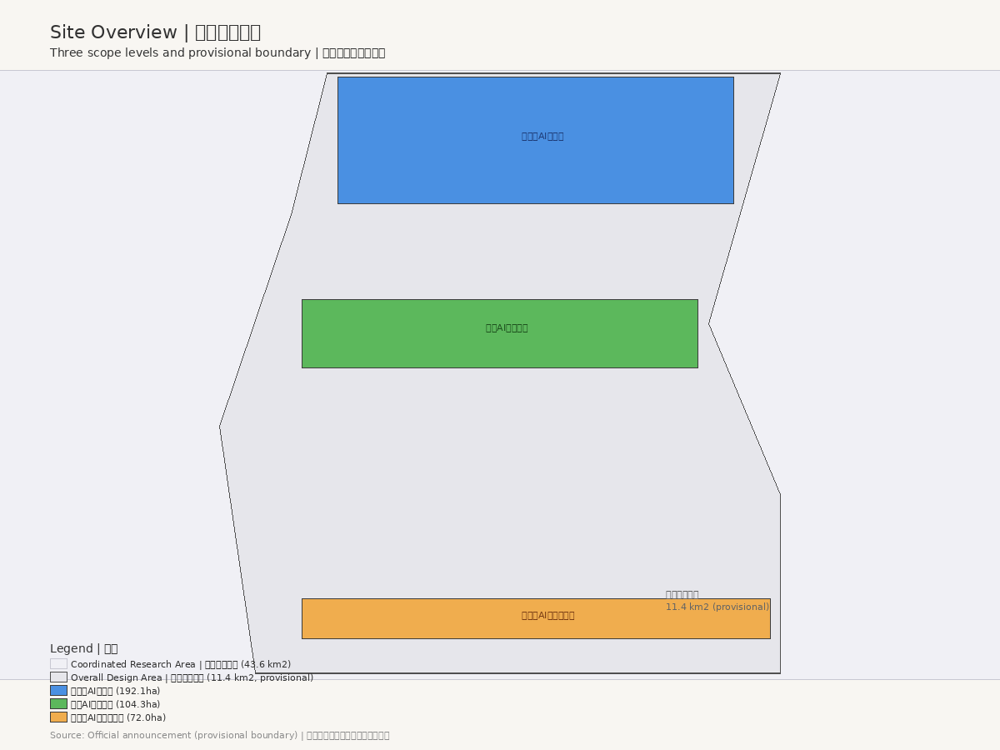
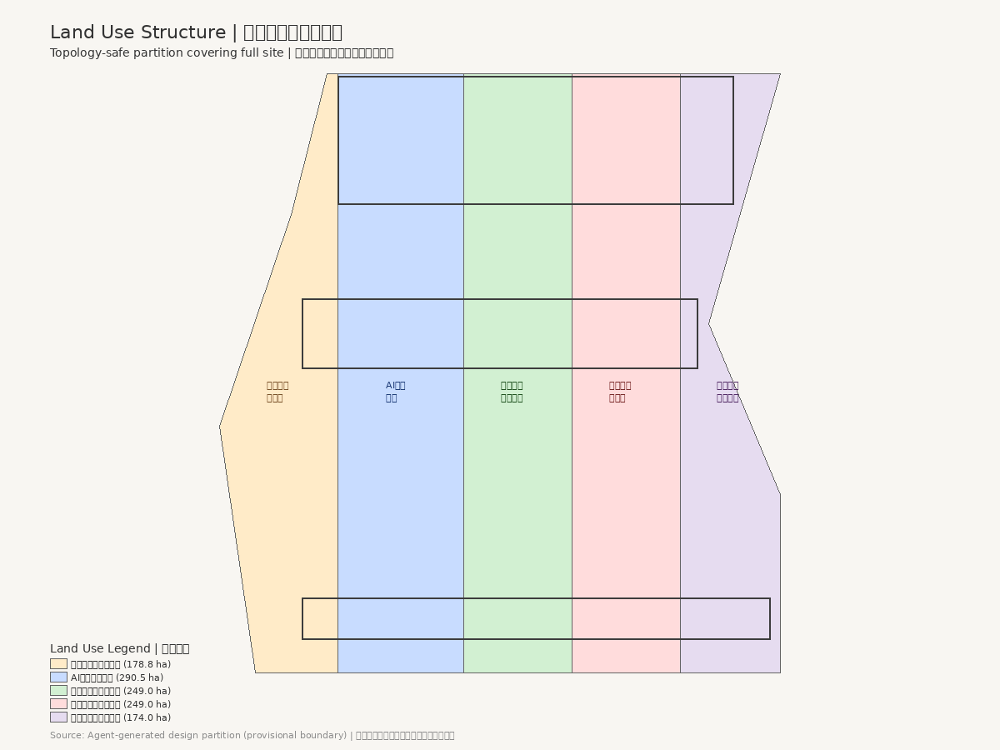
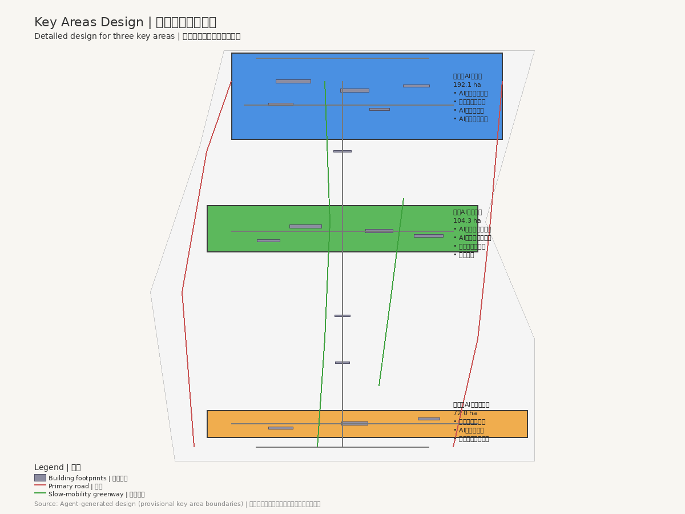
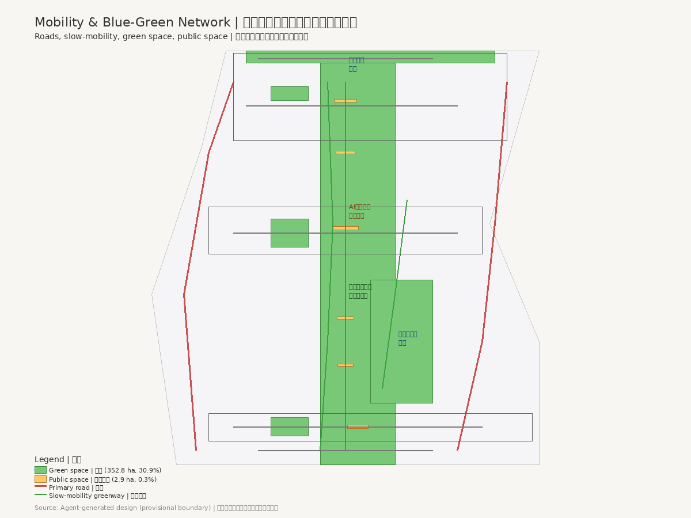
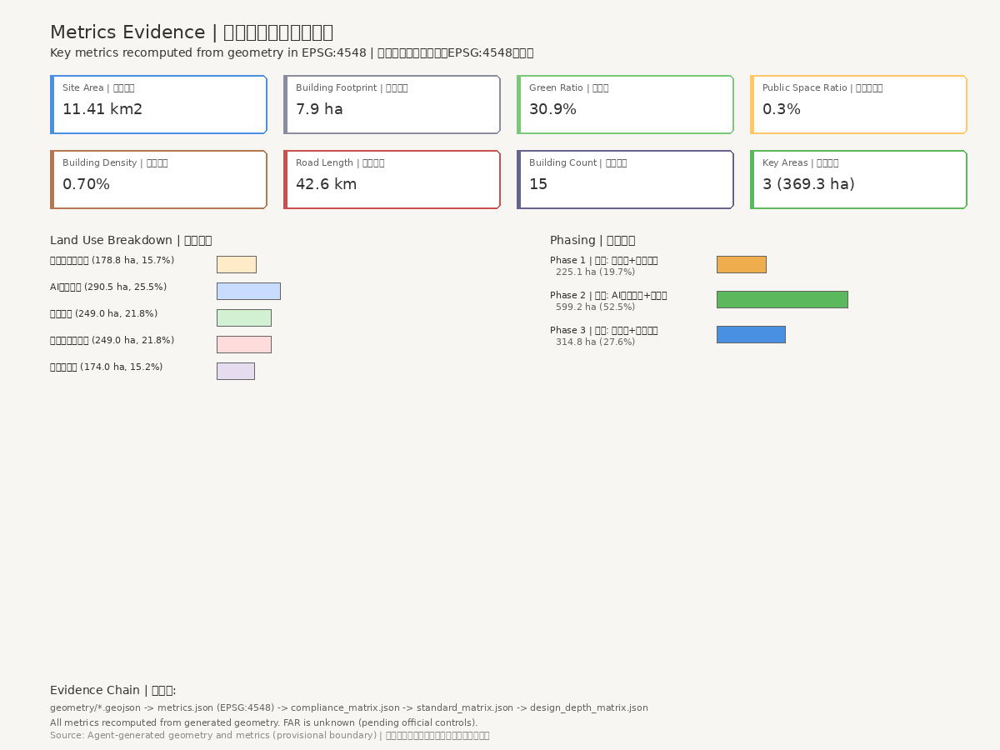

# 京张智脉：百年京张AI创新带城市设计

## 设计依据与资料清单

本方案以北京市规划和自然资源委员会海淀分局发布的《百年京张AI创新带城市设计国际方案征集资格预审公告》为第一依据，以 `brief/site-package/` 中维护者登记的临时粗略边界、重点区域、枚举、指标和来源清单为机器可读依据 [source:OFFICIAL-ANNOUNCEMENT]。面向智能体任务书规定了 agent.1 至 agent.6 六项必选任务，方案逐条回应 [source:AGENT-TASKBOOK]。

方案生成前已读取 `design_brief.json`、`agent_taskbook.json`、`allowed_design_space.json`、`planning_limits.json`、`standards.json` 等材料，确认三层范围和三处重点区域 [data:geometry/site_boundary.geojson#SITE-001] [data:geometry/key_areas.geojson#PROV-KEY-001]。当前场地边界和重点区域 polygon 为临时约束范围（provisional constraint），所有空间设计判断标注为概念建议 [depth:existing_conditions_diagnosis]。

场地总面积约 11.41 km2，由南至北串联三处重点区域 [metric:site_area_sqm] [metric:key_area_count]。京张铁路遗址公园贯穿南北，是方案的文化主脉和慢行主脊。容积率、建筑高度、密度等控规指标待正式数据补齐 [metric:floor_area_ratio]。

## 三层范围工作框架

方案按照公告确定的三个层次组织工作：统筹研究范围关注 43.6 km2 的AI产业生态、战略定位、创新链和未来城市形态；总体设计范围关注 11.4 km2 京张遗址公园周边城市地区和产业区，要求形成城市更新总体框架、产业空间布局、交通市政支撑和城市风貌控制；重点区域范围关注 368.4 ha 三处详细设计地区 [depth:three_level_scope_framework]。

方案提出"京张智脉"（Jing-Zhang Intelligence Vein）作为一带总体概念名称。"京张"锚定百年京张铁路的历史文化基底，"智脉"既指AI创新的知识脉络，也指城市更新的空间肌理。命名体系遵循"一带三核多点"逻辑，三大定位为百年京张文化带、都市AI生活体验带、AI融合创新带，五大功能为AI全栈自主创新体系、世界级AI创新生态、AI+场景赋能新范式、智能化AI活力城市、AI治理全球话语权 [source:AGENT-TASKBOOK]。

总体空间结构为"一脊三核两翼多节点"。一脊指京张遗址公园慢行与文化主脊 [data:geometry/green_space.geojson#GREEN-001]。三核对应三处重点区域。两翼沿主脊东西展开：东翼为中关科技服务翼，西翼为小月河场景赋能翼。用地结构通过五类用地分区覆盖设计边界 [data:geometry/land_use.geojson#LU-001] [depth:overall_spatial_structure]。

## 统筹研究范围产业与未来城市研究

统筹研究范围的核心任务是构建世界级 AI 创新生态体系。方案梳理六个全球AI创新生态案例作为设计参照：肯德尔广场（高校策源+生物科技集聚）、深圳湾科技生态园（全链条孵化+产城融合）、京都站周边（交通枢纽+文化地标）、蒙特利尔AI社区（人才密度+多语种社区）、芝加哥河滨步道（蓝绿空间+公共生活）和斯隆广场AI集群（产学研紧邻+公共空间催化）[depth:ecosystem_mapping]。

方案构建"策源-加速-转化-体验-治理"五环生态图谱。中关村科技服务翼提供要素全球化配置、中关村IP与资本赋能支撑。方案提出土地、空间、产业、资金、人才、算力、数据、场景八要素的空间配置机制 [source:AGENT-TASKBOOK] [depth:ecosystem_mapping]。

## 总体设计范围城市更新与控规深度城市设计

总体设计范围要求达到控制性详细规划的城市设计深度。方案提出城市更新总体空间结构、低效空间识别、更新项目清单和实施政策建议 [standard:MOHURD-CONTROL-DETAILED-PLANNING]。用地分区完整覆盖设计边界且无重叠 [data:geometry/land_use.geojson#LU-001]，建筑基底表达更新建筑或保留建筑 [data:geometry/buildings.geojson#BLDG-001]，道路系统表达微循环、慢行和轨道接驳 [data:geometry/roads.geojson#ROAD-001] [depth:land_use_layout]。

涉及建筑高度、开发强度、道路红线、退线和设施标准的内容，若尚无官方控制条件，应写为"待正式控规条件确认"，不得以 agent 推测值冒充审定指标 [depth:development_intensity_controls]。

## 重点区域详细设计

重点区域详细设计是必选项。三处重点区域分别承担差异化功能 [depth:three_key_area_detailed_design]。

众智园AI自主创新加速区（192.1 ha）承担AI全栈自主创新体系核心功能，布局AI全栈研发中心、自主算力实验楼、AI创业孵化器群、AI标准与安全治理中心、AI产业展示与交流中心和清河文化绿地AI场景区 [data:geometry/key_areas.geojson#PROV-KEY-001] [metric:key_area_areas_sqm]。

北京AI原点社区（104.3 ha）以近校创新、成果孵化转化和人才特区为核心，布局近校创新实验室群、成果转化加速空间、人才公寓与社区服务、开源协作中心和品牌活动广场 [data:geometry/key_areas.geojson#PROV-KEY-002]。

大钟寺AI产业聚集区（72.0 ha）围绕领军企业、智能体、智能终端、内容消费、数据要素和数字资产布局，商业空间与轨道站点一体化设计 [data:geometry/key_areas.geojson#PROV-KEY-003]。

## AI 创新生态、人才画像与 AI+ 场景

方案提出12张AI场景卡，每张卡明确场景名称、功能描述、空间落位和隐私保护要求 [depth:scenario_space_operation_mapping]。场景包括AI通勤优化、智慧停车引导、AI社区健康站、智能政务助手、AI创新展厅、智慧能源管理、AI安全巡逻、智慧环卫、AI教育辅导、智能零售体验、AI文化导览和智慧应急响应 [data:geometry/public_space.geojson#PUBLIC-001]。

方案提出3个AI产业测试验证场景：自动驾驶微循环测试道 [data:geometry/roads.geojson#ROAD-001]、AI+城市感知数据沙盒 [data:geometry/buildings.geojson#BLDG-003] 和智能体协同实验场 [data:geometry/buildings.geojson#BLDG-012]。所有场景均遵循"AI辅助、人工复核"原则 [source:AGENT-TASKBOOK]。

方案提出5类用户画像：AI创业者、研究人员、社区居民、国际访客和开发者，指导场景设计与空间配置 [depth:scenario_space_operation_mapping]。小月河场景赋能翼串联公共体验类场景，形成"商业-滨水-文化-科技"体验序列 [data:geometry/green_space.geojson#GREEN-002]。

## 用地、建筑规模与拆改留方案

用地布局通过五类用地垂直分区覆盖总体设计范围 [data:geometry/land_use.geojson#LU-001]。各用地分区面积由 geometry 在 EPSG:4548 投影下计算 [metric:land_use_area_by_code]：

| 用地代码 | 用地名称 | 面积（m2） |
| --- | --- | --- |
| 0702 | 社区居住与服务用地 | 1,788,211 |
| 0802 | AI研发创新用地 | 2,904,708 |
| 1401 | 京张遗址公园绿地 | 2,489,748 |
| 05 | 产业服务与商业用地 | 2,489,746 |
| 0803 | 混合用地与交通枢纽 | 1,740,419 |

方案布局15栋概念建筑，建筑基底总面积约 7.9 ha [data:geometry/buildings.geojson#BLDG-001] [metric:building_footprint_area_sqm]。总建筑规模估算约 254,165 m2（概念级估算）[metric:total_floor_area_sqm]。具体拆改留分类需待正式控规条件确认 [depth:land_use_layout]。

## 交通、轨道、市政与公共服务设施

交通系统按"主路-次路-慢行-绿道"四级组织 [data:geometry/roads.geojson#ROAD-001]。道路总长约 42.6 km [metric:road_total_length_m]。轨道站点一体化设计是大钟寺区域的重点，路口四象限步行连通通过慢行桥和下穿通道实现 [depth:development_intensity_controls]。

市政基础设施概念建议包括分布式能源节点、端侧算力设施、智慧环卫系统、智能照明和环境感知网络。新型基础设施布局遵循"浅埋、共享、可维护"原则 [standard:MOHURD-CONTROL-DETAILED-PLANNING]。

## 蓝绿空间、公共空间与城市风貌

蓝绿空间以京张遗址公园绿地为主体 [data:geometry/green_space.geojson#GREEN-001]。绿地总面积约 321.1 ha，绿地率约 28.1% [metric:green_space_area_sqm] [metric:green_ratio]。京张遗址公园AI公共空间设计以"遗址保护优先、AI增强体验"为原则 [depth:public_space_design]。

公共空间系统包括广场、集散空间和社区公共空间 [data:geometry/public_space.geojson#PUBLIC-001] [metric:public_space_area_sqm]。方案提出3个AI朝圣地标：京张记忆驿站 [data:geometry/buildings.geojson#BLDG-013]、AI原点塔 [data:geometry/buildings.geojson#BLDG-006] 和智脉之门 [data:geometry/buildings.geojson#BLDG-010]。

方案将京张智脉的城市风貌定位于"传承开创、开放协作、人本活力"，以京张铁路铁轨意象与AI神经网络拓扑的融合为视觉基底 [depth:culture_narrative]。

## 更新项目清单、实施政策与分期计划

方案按"南启动-中深化-北提升"三期推进 [data:geometry/phasing.geojson#PHASE-1] [depth:phasing_strategy]：

| 分期 | 区域 | 面积（m2） |
| --- | --- | --- |
| 一期 | 大钟寺（南启动） | 2,250,519 |
| 二期 | 原点社区（中深化） | 5,992,137 |
| 三期 | 众智园（北提升） | 3,148,220 |

更新项目清单包括低效空间识别、保留建筑活化、新增创新空间建设、公共空间提升和基础设施更新。分期时序为概念建议，不构成政府实施承诺 [metric:phasing_area_by_phase]。

方案提出"四季四节"年度活动体系概念建议：春季AI开源开发者大会、夏季京张AI文化节、秋季全球AI创新峰会和冬季AI产业转化对接会 [source:AGENT-TASKBOOK] [depth:annual_event_system]。开发者社区运营以公共利益优先为原则 [depth:developer_community_operation]。

## 指标体系、面积复算与合规矩阵

方案指标体系分为已知指标和待补齐指标 [metric:site_area_sqm] [depth:metrics_evidence]：

| 指标 | 值 | 置信度 |
| --- | --- | --- |
| 场地总面积 | 11,412,825 m2 | high |
| 建筑基底面积 | 79,427 m2 | medium |
| 绿地面积 | 3,210,552 m2 | medium |
| 绿地率 | 28.1% | medium |
| 公共空间面积 | 29,467 m2 | medium |
| 道路总长度 | 42,637 m | medium |
| 重点区域数量 | 3 | high |
| 建筑数量 | 15 | high |

待补齐指标包括容积率（FAR）、建筑高度和密度 [metric:floor_area_ratio]。方案在 `compliance_matrix.json` 中逐条映射公告任务和 agent.1 至 agent.6 [depth:compliance_coverage]。`standard_matrix.json` 映射专业标准 [depth:standard_coverage]。`design_depth_matrix.json` 映射设计深度项 [depth:design_depth_coverage]。

## 风险、版权与合规说明

主要风险包括临时边界精度不足、控规指标缺失和重点区域 polygon 待校准 [depth:risk_assessment]。方案内容为 Codex AI Agent 生成，采用 COMMUNITY-DISPLAY-ONLY 许可，不使用未经授权的字体、图片或商标 [source:AGENT-TASKBOOK]。所有空间设计判断为概念建议，不替代专业规划和政府审批。方案由 GPT-5 Codex 模型生成，使用脚手架脚本和自定义 Python 脚本生成几何图层、指标和图纸 [depth:risk_assessment]。

方案遵守共创建议十项原则：公共利益优先、公开资料边界、概念建议属性、AI原生创新、结构化与可读并重、生成方法披露、人类最终判断、公共知识沉淀、贡献可记忆和人本治理 [source:AGENT-TASKBOOK]。

## 参考资料

- 北京市规划和自然资源委员会海淀分局，《百年京张AI创新带城市设计国际方案征集资格预审公告》[source:OFFICIAL-ANNOUNCEMENT]
- open-city-ai/haidian 维护团队，《面向全球智能体开展百年京张AI创新带城市设计开源征集任务书摘要》[source:AGENT-TASKBOOK]
- open-city-ai/haidian 维护团队，临时粗略边界（provisional boundaries）[source:PROVISIONAL-BOUNDARIES]
- open-city-ai/haidian 维护团队，设计任务资料包（design_brief.json）[source:DESIGN-BRIEF]
- open-city-ai/haidian 维护团队，专业标准参考文件 [source:STANDARDS-REFERENCES]
- 公开报道与学术文献，全球AI创新生态案例 [source:GLOBAL-CASE-STUDIES]
- 完整来源记录见 `sources.json`，假设记录见 `assumptions.json`
