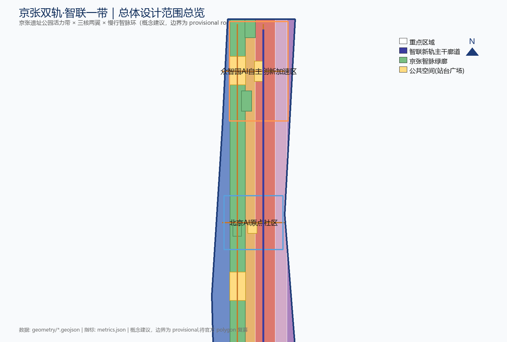
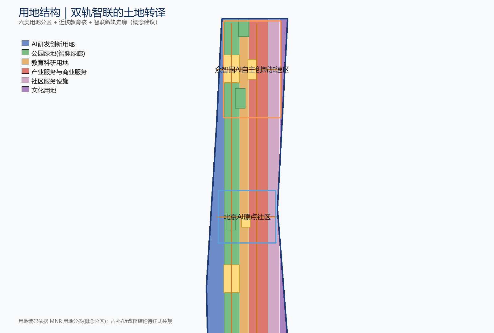
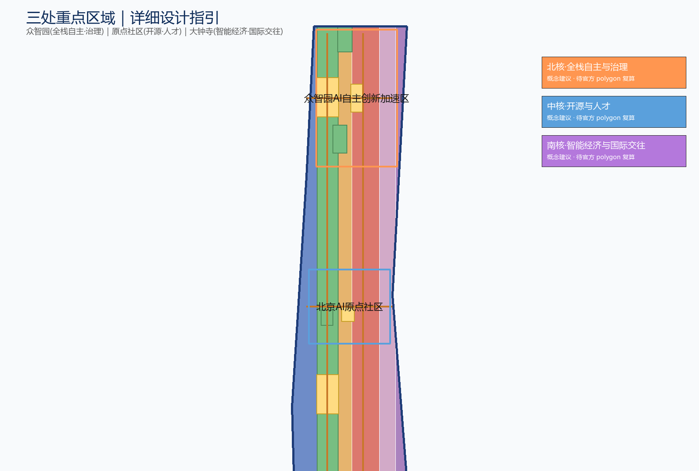
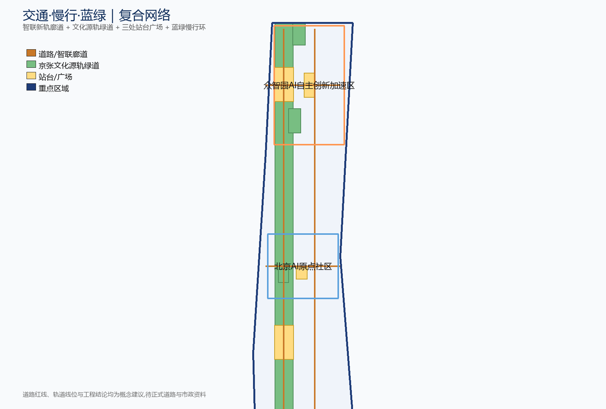
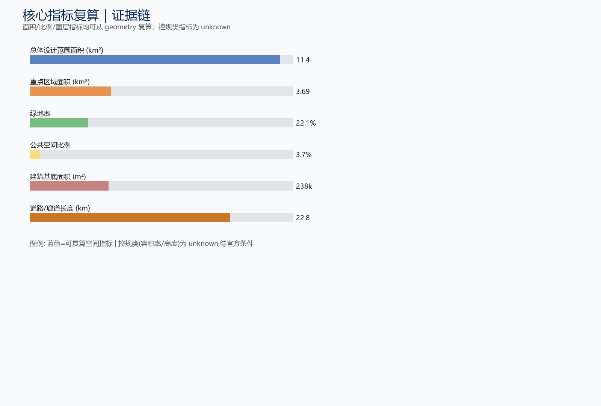

# 京张双轨·智联一带——百年京张AI创新带总体概念设计

## 设计依据与资料清单

本方案以北京市规划和自然资源委员会海淀分局发布的《百年京张AI创新带城市设计国际方案征集资格预审公告》为第一依据，并以 `brief/site-package/` 中经维护者登记的临时粗略边界、重点区域、枚举、指标和来源清单为机器可读依据 [source:OFFICIAL-ANNOUNCEMENT] [standard:PROJECT-OFFICIAL-ANNOUNCEMENT]。生成方案前须读取设计任务书、允许设计空间、枚举、范围与事实包等机器可读依据，并建立任务、范围、资料用途和缺口清单 [source:SITE-PACKAGE]。公告要求方案达到控制性详细规划的城市设计深度和规划综合实施方案的城市设计深度，因此文本叙述不能替代 GeoJSON、指标表、A3 文册、A0 展板和 HTML 电子展示成果。

资料登记表的使用边界如下 [source:SOURCE-REGISTRY]：formal 可用资料 7 条、背景资料 1 条、provisional-only 资料 1 条；agent 不得把 background_only 或 provisional_only 资料升级为 official boundary、法定控规、正式评分依据或政府实施承诺。`agent_fact_pack.md` 是本方案的阅读导航层，不是新的权威来源，事实判断仍需回到已登记的原始材料 [source:PROCESSED-FACT-PACK]。

本脚手架在官方 `SITE_BOUNDARY` 或三处 `KEY_AREA` 尚未取得时，使用 `brief/site-package/geometry/provisional_boundaries.geojson` 生成临时 formal 包。提交包中的 `geometry/site_boundary.geojson` 与 `geometry/key_areas.geojson` 均标注为 `provisional_constraint`、`official_boundary=false`，只能用于方案生成、自检、可视化和设计讨论，不能作为 official redline、审批依据、精确面积依据或法定控制结论；该组织方数据缺口本身不阻断内容评分，替换 official polygons 后所有图层与指标均需重算 [source:BOUNDARY-SOURCE] [depth:existing_conditions_diagnosis]。

边界解释可回到总体范围图层和面积复算 [data:geometry/site_boundary.geojson#SITE-001] [metric:site_area_sqm]；三处重点区则由独立图层和数量指标核对 [data:geometry/key_areas.geojson#PROV-KEY-001] [metric:key_area_count]。正文的空间结构、场景、项目和指标均按"可讨论、可复核、可替换官方边界后重算"的原则写入，官方边界更新后须重跑脚手架、自检与图纸/HTML 生成。

## 三层范围工作框架

方案按照公告确定的三个层次组织工作：统筹研究范围关注 43.6 平方公里的 AI 产业生态、战略定位、创新链和未来城市形态；总体设计范围关注 11.4 平方公里京张遗址公园周边 1-2 公里城市地区和产业区，要求形成城市更新总体框架、产业空间布局、交通市政支撑和城市风貌控制；重点区域范围关注 368.4 公顷三处详细设计地区，要求明确功能业态、建筑规模、拆改留分类、公共空间连通和交通组织 [source:OFFICIAL-ANNOUNCEMENT]。三层范围在 `compliance_matrix.json` 中逐条映射，保证公告 1.3、1.4、1.5 与 agent.1–agent.6 的必选任务都有章节、图层、指标、图纸和 HTML 证据。

三层工作框架的深度项由 [depth:three_level_scope_framework] 与 [depth:overall_spatial_structure] 约束，空间证据以 [data:geometry/site_boundary.geojson#SITE-001] 与 [data:geometry/key_areas.geojson#PROV-KEY-001] 为准，任务依据以 [standard:PROJECT-OFFICIAL-ANNOUNCEMENT] 为准。

三层工作不是互相割裂的图纸集合：统筹研究决定产业链和城市形态判断，总体设计把判断落实到更新项目、空间结构和设施承载，重点区域详细设计验证具体地块、建筑、交通、公共空间和 AI 应用场景的可实施性。本方案建议的总体概念为"京张双轨·智联一带"：以京张遗址公园为公共空间主轴（文化源轨），以 AI 数字服务走廊为并行新轨（智联新轨），三核两翼以"慢行智脉环"串联；"一带"不是额外画出的新红线，而是把公告三层范围转译为工作方法 [source:PROCESSED-FACT-PACK]。

| 层级 | 设计问题 | 方案回答 | 数据落点 |
| --- | --- | --- | --- |
| 统筹研究范围 | AI产业生态和未来城市形态如何组织 | 建立"高校策源—开源协作—企业转化—公共体验—国际传播"的创新链 | compliance_matrix.json、standard_matrix.json |
| 总体设计范围 | 产业空间、城市更新、交通市政和风貌如何落图 | 用地、建筑、道路、绿地、公共空间和分期图层共同表达 | [data:geometry/land_use.geojson#LU-001]、[data:geometry/roads.geojson#ROAD-001] |
| 重点区域范围 | 三处片区如何达到详细设计深度 | 分别提出定位、空间动作、AI场景和实施依赖 | [data:geometry/key_areas.geojson#PROV-KEY-001]、[data:geometry/key_areas.geojson#PROV-KEY-002]、[data:geometry/key_areas.geojson#PROV-KEY-003] |

## 统筹研究范围产业与未来城市研究

统筹研究范围的核心任务是构建世界级 AI 创新生态体系。本方案提出主名称「京张双轨·智联一带」（Jingzhang Twin-Track · Smartly Connected Belt），简称「智联一带」（JZ·Link Belt），英文名 Jingzhang Twin-Track AI Belt；Logo 方向建议为"双平行轨道 + 数字节点"，使「JZ」与「∞」同构，象征历史与未来的无限连接。所有命名、简称、英文名与 Logo 方向均为**概念建议**，仅供专业团队深化，不构成既定品牌或官方标识 [source:AGENT-TASKBOOK] [standard:PROJECT-AGENT-OPEN-CALL-TASKBOOK]。

核心隐喻是"双轨"：百年京张铁路是**文化源轨**（heritage origin track），承载历史火车头的记忆与公共空间；AI 创新是并行铺设的**智联新轨**（digital intelligence track），承载智能体、数据与场景。两条轨道并行、交汇、共生——历史火车头与智能体在"同一站台"相遇。空间转译为：一带（京张遗址公园活力带，文化主轴/公共空间主轴）、三核（众智园北核·全栈自主与治理、原点社区中核·开源与人才、大钟寺南核·智能经济与国际交往）、两翼（中关村科技服务翼、小月河场景赋能翼）、双轨交汇站台（JZ/Hub 概念站）与慢行智脉环。

三大定位、五大功能与三区两翼按下表耦合 [source:AGENT-TASKBOOK]：三大定位（百年京张文化带、都市AI生活体验带、AI融合创新带）分别对应文化源轨、智联新轨与双轨交汇的城市形态；五大功能（AI全栈自主创新体系、世界级AI创新生态、AI+场景赋能新范式、智能化AI活力城市、AI治理全球话语权）分别落到众智园、原点社区、小月河翼与公共体验等节点。三区两翼协同回路为：原点社区把高校人才与开源社区转化为创新供给，众智园把开源创新转化为全栈自主能力与治理标准，大钟寺把技术转化为智能经济与国际交往；小月河翼将上述能力反哺城市日常生活与公共服务，中关村翼以资本、IP 与全球化要素配置反哺三核，双轨交汇站台与慢行智脉环作为"同一站台"让文化、人才、资本、场景在此循环闭合 [standard:PROJECT-AGENT-OPEN-CALL-TASKBOOK]。

| 全球案例 | 核心机制 | 对本方案的启示 |
| --- | --- | --- |
| 北京中关村 | 高校策源、政策与资本密集、创新浓度高 | 沿遗址带复制"近校转化"与"要素聚合"双通道 |
| 深圳湾科技生态园 | 研发、孵化、居住、生态一体化的产业园区 | 众智园应形成花园型全栈自主街区与绿色测试场 |
| Silicon Valley / Stanford | 大学—产业—资本的正反馈与自由知识流动 | 原点社区要营造开源、低门槛、高流动的人才生态 |
| Seoul Digital Media City | 数字内容产业集群与媒体文创园区 | 大钟寺可借鉴内容消费与数字资产展示运营 |
| London King's Cross | 工业铁路遗产更新为知识经济街区 | 京张铁路廊道更新为创新公共空间带的可比范式 |
| Zürich Zurich West | 旧工业区更新为创意与科技街区 | 保留工业遗存肌理、导入轻量创意业态 |
| Barcelona 22@ | 老工业区知识密集型更新与混合用地 | 智能原生新业态应支持混合用地与立体分层 |
| Toronto Waterfront / Quayside | 智慧城区与数据治理实验场 | 智能化活力城市应设置可复用的治理与测试节点 |

上述案例仅用于提炼机制，不构成对任何园区现状的背书 [depth:overall_spatial_structure]。未来城市形态研究应回答 AI 如何改变工作、生活、社交、学习、交通和公共服务，把这些变化落实为可定位的功能区、节点、廊道和场景，并把产业战略指标、AI创新指数、人才密度、空间供给和 AI 垂直应用重点区域写入指标体系，标明官方、设计建议与待校准三类 [source:AGENT-TASKBOOK]。方案同时关注与北纬社区、未来科学城、怀柔科学城、经开区及京津冀的创新协同，把"智联一带"作为区域创新网络的文化—人才—场景接口。

## 总体设计范围城市更新与控规深度城市设计

总体设计范围要求达到控制性详细规划的城市设计深度。方案提出"一带、三核、两翼、一环、多站台"的总体空间结构：一带即京张遗址公园活力带，作为南北贯通的公共空间与文化主轴；三核对应三处重点片区；两翼沿东西方向展开；一环即"慢行智脉环"，串联遗址公园、清河界面、小月河翼与三核；多站台即沿地铁 13 号线与京张廊道设置的双轨交汇站台（JZ/Hub）概念站 [depth:overall_spatial_structure] [data:geometry/roads.geojson#ROAD-001]。这样组织的原因是：遗址带是唯一能同时连接北五环、五道口、清华东路西口与大钟寺站的线性公共资源，以它为轴可最经济地缝合被铁路与环路切碎的城市肌理，让创新资源沿文化线索集聚。

用地结构按国土空间规划分类表达：沿遗址公园两侧布置公园绿地与开敞空间，形成绿廊 [data:geometry/land_use.geojson#LU-002]；临轨道与站点布置 AI 研发创新用地与产业服务商业用地，形成创新核，分列智联新轨走廊两侧 [data:geometry/land_use.geojson#LU-001]、[data:geometry/land_use.geojson#LU-003]；社区服务与配套用地沿居住片区布置，保证职住平衡与日常生活 [data:geometry/land_use.geojson#LU-004]。用地表达的完整性依据 [standard:MNR-LAND-USE-CLASSIFICATION-GUIDE]，用地布局深度由 [depth:land_use_layout] 校核。

城市更新总体框架以"低效空间识别—更新项目清单—分期实施"为主线，区分保留、改造、更新、新建与待确认对象，采用"增量服务轻触、存量改造激活、公共空间先行"的拆改留方法 [depth:retain_renovate_demolish] [data:geometry/buildings.geojson#BLDG-001]。涉及容积率、建筑高度、建筑密度、退线、道路红线和设施标准的内容，因官方控规条件缺失，一律写为"待正式控规条件确认"，不得以 agent 推测值冒充审定指标 [metric:floor_area_ratio] [standard:MOHURD-CONTROL-DETAILED-PLANNING]。开发强度与高度体量控制只提出"近轨道高强度、近公园低密度、文化界面限高"的**概念建议方向**，具体数值待官方条件到位后由专业团队复算 [depth:development_intensity_controls] [depth:height_massing_character]。

## 重点区域详细设计

重点区域详细设计是必选项。三处重点片区按"北核—中核—南核"分工，形成完整创新链条：众智园承接全栈自主与治理，原点社区承接开源与人才，大钟寺承接智能经济与国际交往 [source:AGENT-TASKBOOK] [standard:PROJECT-AGENT-OPEN-CALL-TASKBOOK]。

| 重点片区 | 设计定位 | 空间动作 | AI产业与运营场景 | 证据引用 |
| --- | --- | --- | --- | --- |
| 众智园AI自主创新加速区 | 花园型全栈自主创新街区 | 强化清河界面、产业展示、低碳创新交往和对外交通组织；以绿色空间承载开放测试与标准治理展示 | 自主模型测试、标准制定工作坊、安全治理展示、低碳算力体验 | [data:geometry/key_areas.geojson#PROV-KEY-001]、[depth:three_key_area_detailed_design] |
| 北京AI原点社区 | 近校型成果转化与人才社区 | 组织校区、园区、街区慢行缝合；补足成果发布、人才服务、居住生活和开源协作空间 | 开源社区、成果发布、人才特区服务、近校孵化 | [data:geometry/key_areas.geojson#PROV-KEY-002]、[source:AGENT-TASKBOOK] |
| 大钟寺AI产业聚集区 | 城市型智能经济与国际交往街区 | 围绕大钟寺站一体化、四象限步行连通、商业服务和重点企业公共环境更新 | 智能体与智能终端展示、内容消费、数据要素与国际路演 | [data:geometry/key_areas.geojson#PROV-KEY-003]、[metric:key_area_count] |

众智园为什么把"绿色空间 + 治理展示"作为核心动作：全栈自主创新需要可参观、可预约、可监管的测试与评测空间，把抽象的"标准与安全"转译为可见的绿色公共实验场，既服务产业又服务公众 [depth:three_key_area_detailed_design]。原点社区为什么强调"校区—园区—街区缝合"：高校人才是 AI 人才的最大来源，把围墙两侧的空间与功能打通，才能形成发布、协作、转化的连续生态。大钟寺强调"站一体化与四象限步行连通"：轨道站点是国际交往的人流入口，四象限被主干路割裂则无法形成连续消费与商务体验。

三处重点区域必须在 `geometry/key_areas.geojson` 中出现；若仓库已提供 official polygons 应作为 `official_constraint` 使用，当前缺失时可暂用 `provisional_constraint`，但正文、HTML、sources、assumptions 和 self_check 必须说明其不能作为正式评分或审批依据。设计表达应包含功能业态、建筑规模、建筑形态、拆改留分类、公共空间系统、交通组织、慢行连通和实施项目。

## AI 创新生态、人才画像与 AI+ 场景

方案建立面向 AI 人才和企业的空间需求画像，覆盖研发办公、开源协作、成果发布、企业服务、人才居住、社交学习、消费生活、运动休闲和国际交往 [source:AGENT-TASKBOOK]。五大类用户画像如下：

| 用户画像 | 典型需求 | 空间响应 | 自检边界 |
| --- | --- | --- | --- |
| 开源开发者 | 发布、协作、测试、社区声誉 | 原点社区开源发布厅、公共代码墙、夜间协作空间 | 不采集个人行为轨迹；活动数据只做聚合统计 |
| 初创团队 | 低成本办公、算力入口、产品试验场 | 众智园共享测试场、端侧算力服务点、标准治理咨询 | 算力和数据服务需另行授权 |
| 头部企业访客 | 展示、商务、国际接待、人才招聘 | 大钟寺国际路演客厅、轨道站点接驳、重点企业周边公共空间 | 企业标识和案例须清权 |
| 周边居民 | 通勤、休闲、社区服务、低扰动更新 | 京张遗址公园慢行环、社区服务嵌入、夜间照明和活动分级 | 不将居民画像用于商业推荐 |
| 高校师生 | 成果转化、跨校协作、日常慢行 | 校区-园区慢行缝合、成果转化驿站、AI教育体验点 | 校园数据和科研成果需授权 |

面向智能体任务书要求不少于 10 张 AI 场景卡，以下场景全部对应"服务对象、空间位置、数据来源、隐私边界、人工复核机制和运营主体"六要素，并按可运营节点进入图层与合规矩阵 [standard:PROJECT-AGENT-OPEN-CALL-TASKBOOK]：

| 场景卡 | 空间载体 | 设计说明 |
| --- | --- | --- |
| 01 开源发布厅 | 北京AI原点社区 | 面向高校、开源社区和初创团队，提供成果发布、代码贡献展示和小型路演空间 |
| 02 安全治理沙盒 | 众智园 | 将标准制定、安全评测、模型红队测试转译为可参观、可预约、可监管的展示和协作节点 |
| 03 端侧算力驿站 | 总体设计范围节点 | 与公共服务、企业服务和低碳能源策略结合，作为待深化的新型基础设施原型 |
| 04 AI慢行导航 | 京张遗址公园活力带 | 用可解释导视和低侵入传感帮助识别慢行断点、拥挤节点和无障碍需求 |
| 05 大钟寺国际路演客厅 | 大钟寺AI产业聚集区 | 服务智能体、智能终端和内容消费企业的展示、洽谈、媒体发布和国际交流 |
| 06 清河低碳创新廊 | 众智园临清河界面 | 把绿色空间、雨洪、步行骑行和AI展示结合，作为园区公共客厅 |
| 07 近校成果转化街 | 北京AI原点社区 | 面向高校成果转化，组织孵化、展示、法务、知识产权和投融资服务 |
| 08 数据要素会客厅 | 大钟寺片区 | 以合规、授权、可审计为前提，展示数据要素和数字资产流通的城市服务界面 |
| 09 AI生活服务样板街 | 社区与商业交汇处 | 将医疗、教育、法律、生活服务等AI+场景落到可运营的小尺度街区空间 |
| 10 全球AI活动周路线 | 一带公共空间系统 | 形成从遗址文化、开源社区、产业展示到国际路演的可步行、可传播体验路线 |

三个产业测试验证场景作为"看得见、进得去、验得了"的公共测试载体，均为**概念建议**，非已批准运营安排 [source:AGENT-TASKBOOK]：其一，众智园"自主模型安全评测沙盒"，面向全栈自主模型开展基准评测与红队测试，公开基准加授权语料，评测结果经人工复核后方可发布，运营主体建议为产业联盟与标准机构联合体；其二，总体设计范围"端侧算力与 AI 边缘推理验证场"，面向端侧模型与智能体部署测试，数据不出域、安全审查后放行，运营主体为平台运营方；其三，大钟寺"数据要素与数字资产合规测试床"，面向数据要素流通与数字资产登记，仅使用授权数据并设合规审计，运营主体为专业机构。AI 治理建议遵守数据最小化、公开来源、可解释和人工复核原则；城市智能体可辅助识别慢行断点、公共空间热力、设施维护、企业服务需求和活动安全风险，但不能替代规划审批、不能输出未经授权的个人画像、不能声称获得官方实施承诺 [depth:three_key_area_detailed_design]。

## 用地、建筑规模与拆改留方案

用地方案依据国土空间调查、规划、用途管制分类等公开标准表达，形成完整、闭合、无缝的用地分区 [standard:MNR-LAND-USE-CLASSIFICATION-GUIDE]。用地分类与建筑基底的主要证据是 [data:geometry/land_use.geojson#LU-001] 与 [data:geometry/buildings.geojson#BLDG-001]，建筑规模复核使用 [metric:building_footprint_area_sqm]。建筑方案区分保留、改造、更新、新建或待确认对象，明确建筑基底、功能、规模、风貌、屋顶、体量和高度控制的建议层级 [depth:retain_renovate_demolish]。

由于现状建筑、权属、控规和工程条件缺失，方案只提出方法和待校准清单，不编造拆改留结论。拆改留判断原则为：对京张铁路遗址、文物与历史建筑一律以保留为前提，只做环境与功能轻触；对低效产业空间以改造激活为主；对无保留价值且阻碍公共空间连通的对象才列入待确认的更新范围，且必须等待正式权属、控规与文保条件确认。建筑高度、体量、界面和风貌控制由 [depth:height_massing_character] 管理，只提出"近轨道高强度、近公园低密度、文化界面限高、屋顶与体量呼应双轨线形"的**概念建议方向**。

建筑规模和强度指标必须与 `metrics.json` 和图层一致。总建筑规模、容积率、建筑高度、建筑密度、绿地率、退线和建筑控制线缺少官方条件时，统一使用 `status=unknown`，并在 `reason`/`assumptions` 中说明待补条件、当前假设和正式数据到位后的复算路径，不得用固定数值制造精确感 [standard:MOHURD-CONTROL-DETAILED-PLANNING]。

## 交通、轨道、市政与公共服务设施

交通方案回应公告对轨道站点一体化、道路微循环、慢行断点、对外交通、停车、非机动车停放和绿色交通系统的要求，重点覆盖北五环、京张遗址公园跨环路节点、五道口、清华东路西口、大钟寺站及重点企业周边交通联系 [source:OFFICIAL-ANNOUNCEMENT]。交通与市政专业深度分别由 [depth:traffic_rail_slow_parking] 与 [depth:municipal_new_infrastructure] 约束，图层证据引用 [data:geometry/roads.geojson#ROAD-001]。

"双轨·智联"在交通层有具体所指：轨道轨是地铁 13 号线与京张铁路廊道组成的物理轨道带，智联轨是沿廊道布设的 AI 数字服务走廊（含慢行与创新服务廊道）。方案在五道口（原点社区门户）、清华东路西口（近校接驳）、大钟寺站（南核站一体化）与跨北五环节点（缝合遗址带）设置"双轨交汇站台"（JZ/Hub）**概念站**，使物理轨道与数字服务在同一站点交汇 [data:geometry/roads.geojson#ROAD-001]。轨道站点周边按"轨道优先、慢行优先"组织接驳与非机动车停放，道路微循环缝合被铁路和环路切碎的街区，统一校核公交、骑行、步行与停车供给；道路红线、线形与桥隧工程一律列为待正式交通与工程条件确认。

市政和公共服务设施覆盖 AI 产业服务设施、创新服务平台、人才生活服务设施、新型基础设施、分布式能源、端侧算力和传统市政设施融合。方案把分布式能源与端侧算力作为"智联新轨"的市政落地，说明设施标准、空间布局、服务半径、运营模式和分期实施逻辑，但管线、能源、排水、防洪、消防等工程资料缺失时，全部列为正式深化前置条件 [depth:municipal_new_infrastructure]。公共服务设施按"人才服务、创新服务、生活服务"三类布置：人才服务（人才特区、居住与社交）、创新服务（孵化、发布、评测、路演）、生活服务（医疗、教育、法律、生活服务样板街），并以轨道站点为服务半径锚点 [source:AGENT-TASKBOOK]。

## 蓝绿空间、公共空间与城市风貌

蓝绿空间方案以京张遗址公园活力带为骨架，统筹清河、小月河、周边高校、企业、社区出行需求，提出南北贯通、东西连通的步道、骑行道和绿色空间体系，形成"慢行智脉环" [depth:blue_green_public_space] [data:geometry/green_space.geojson#GREEN-001]。慢行智脉环串联三核两翼：北段沿清河界面接众智园，中段穿越京张遗址公园连接原点社区，南段沿小月河翼接大钟寺，东西向以道路与公共空间缝合断点。绿地与公共空间比例支撑日常交往、创新偶遇与户外测试 [metric:green_ratio] [metric:public_space_ratio] [data:geometry/public_space.geojson#PUBLIC-001]。方案识别慢行断点、上跨环路节点、公园南北两端景观节点，提出停车、体育、创新交往、科技测试、应用展示和公共服务复合利用策略。

京张遗址公园的 AI 公共空间定位为"文化源轨与智联新轨的同一站台"：保留钢轨、站台、里程碑等铁路元素作为历史记忆，叠加可解释的 AI 导视、数据艺术装置与场景体验，形成东西缝合（跨铁路东西两侧慢行与功能连通）与南北贯通（北五环至西直门外大街的连续轴线）的空间策略 [standard:MOHURD-URBAN-DESIGN-MEASURES]。在此基础上提出三个 AI 朝圣地标（**概念建议**）：其一，清华园火车站"时空站台"，把百年铁路源头与 AI 创新起点并置，成为公共空间的原点；其二，京张钢轨"里程碑"装置带，以沿线里程为叙事线索，把 1909 年的筑路里程换算为今日的创新节点；其三，"智联塔"数字孪生地标，置于大钟寺或原点社区节点，以实时、可解释的创新热度可视化呈现一带活力。三个地标均须满足文保、绿地、蓝线与交通安全约束，不涉桥隧或地下工程结论，不擅自改造企业建筑或权属空间 [source:AGENT-TASKBOOK]。

城市风貌融合京张铁路历史文化、中关村创新文化和 AI 创新文化，利用清华园火车站、北影等文化资源，提出城市基调、建筑风貌、屋顶形态、体量、界面和公共艺术引导 [depth:height_massing_character]。方案同时提出导视标识、文化符号、国际传播叙事与荣誉展示体系（贡献墙、开源榜、开发者铭牌，实体与数字荣誉联动），所有品牌、字体、图像、肖像和企业标识必须有清权来源；风貌控制分清官方管控、设计建议和待确认条件，严禁在没有文保或控规依据时给出伪精确控制线。

## 更新项目清单、实施政策与分期计划

实施方案形成可审查的更新项目清单，说明项目位置、类型、功能、责任主体、依赖条件、实施阶段、风险和评估指标 [depth:renewal_project_list] [data:geometry/phasing.geojson#PHASE-001]：

| 项目编号 | 项目名称 | 类型 | 主要依赖 | 证据引用 |
| --- | --- | --- | --- | --- |
| JZ-01 | 京张遗址公园慢行断点缝合 | 公共空间/交通 | 道路红线、桥下空间、交通组织复核 | [data:geometry/roads.geojson#ROAD-001] |
| JZ-02 | 众智园清河创新界面 | 蓝绿空间/产业展示 | 河道蓝线、生态和防洪条件 | [data:geometry/green_space.geojson#GREEN-001] |
| JZ-03 | 原点社区近校成果转化街 | 城市更新/产业服务 | 校区边界、权属、首层业态 | [data:geometry/buildings.geojson#BLDG-001] |
| JZ-04 | 大钟寺站四象限步行连通 | 轨道一体化/慢行 | 轨道站点、道路交叉口、市政管线 | [data:geometry/public_space.geojson#PUBLIC-001] |
| JZ-05 | AI公共服务与端侧算力节点 | 新基建/公共服务 | 能源、算力、安全和运营主体 | [depth:municipal_new_infrastructure] |
| JZ-06 | 全球AI活动周公共路线 | 运营/品牌 | 公共空间许可、活动安全、版权清权 | [data:geometry/phasing.geojson#PHASE-001] |

政策建议覆盖城市更新统筹实施、空间供给、运营机制、产业服务、公共参与、数据治理和产权协同，以"公共空间先行、轻量运营启动、专业条件后置"降低启动门槛。实施分期分为近期试点（以轻量设施、运营活动和服务平台启动，如 JZ-01、JZ-06）、中期更新（如 JZ-02、JZ-03、JZ-04）和长期治理框架（如 JZ-05 及系统化运营），并明确哪些内容必须等待正式控规、市政、交通和权属条件确认 [depth:phasing_implementation]。征集周期是提交成果的时间要求，与实施分期不同。

面向 agent.6 的长期运营设计（**均为概念建议**）包括四套机制 [source:AGENT-TASKBOOK]：一是**年度活动体系**，按季节锚定"春·开源共创季（原点社区）—夏·AI 场景开放日（一带全域）—秋·京张 AI 创新大会/智联周（大钟寺国际路演）—冬·开发者马拉松（众智园评测沙盒）"，形成可预期、可传播、可转化的年度节奏；二是**开发者社区运营机制**，以开源仓库、Issue/PR、公共代码墙与贡献榜为纽带，把线上协作与线下空间绑定，贡献可记忆、知识可沉淀；三是**场景开放运营机制**，通过场景开放日、预约评测与公共体验路线，把场景卡转化为常态运营对象；四是**国际传播与招引转化机制**，以"双轨"叙事与地标视觉传播全球关注度，并明确从活动参与、场景试用、落地洽谈、入驻服务的转化路径。上述机制均不夸大政府承诺，不把设想活动写成已确定安排 [standard:PROJECT-AGENT-OPEN-CALL-TASKBOOK]。

## 指标体系、面积复算与合规矩阵

指标体系至少包含总体设计范围面积、重点区域面积、绿地与公共空间比例、建筑基底、更新项目数量、AI 场景节点、慢行连通指标、产业空间指标、人才服务指标和自检状态。`scripts/spatial_review.py` 与 `scripts/visual_review.py` 的结果是 formal 自检的重要证据；指标复算遵循统一设计深度要求 [depth:metrics_recalculation]。

关键指标的设计含义：总体范围面积约束空间分配与蓝绿承载 [metric:site_area_sqm] [data:geometry/site_boundary.geojson#SITE-001]；绿地与公共空间比例支撑日常交往、创新偶遇与户外测试，其复算分别引用 [metric:green_ratio]、[metric:public_space_ratio] [data:geometry/public_space.geojson#PUBLIC-001]；建筑基底面积反映更新建筑规模量级 [metric:building_footprint_area_sqm]；重点区域数量保证三处必选片区齐全 [metric:key_area_count]。容积率等管控指标因缺少官方控规，状态为 unknown，待正式数据到位后复算 [metric:floor_area_ratio]。

正式深化时把每个指标分为三类：第一类可由提交几何直接复算的空间指标（边界面积、绿地比例、公共空间比例、建筑基底面积、分期面积）；第二类需官方控规或任务书附件支撑的管控指标（容积率、建筑高度、建筑密度、退线、道路红线、设施标准）；第三类需运营或产业数据持续校准的绩效指标（AI 创新指数、人才密度、产业服务满意度、慢行可达性、活动参与度、场景使用频次）。三类指标分别进入 `metrics.json`、`assumptions.json` 和 `compliance_matrix.json`。合规矩阵是任务响应性的主控文件，每条公告任务与 agent_taskbook 任务对应到报告章节、图层、指标、图纸、HTML 页面、来源、假设和自检项；未覆盖公告 1.3、1.4、1.5 或 agent.1–agent.6 任一必选任务，方案不得进入 formal professional scoring。

## 风险、版权与合规说明

**要求双语言。** 方案主文件使用中文，通过 `proposal.en.md` 提供完整对照译文；A3/A0、HTML 和含文字图件也提供对应语言副本，并优先使用 `docs/terminology-glossary.md` 的赛事推荐译法。v2 包缺少任一必需译稿、语言映射或有效文件时，finalize 与 CI 会阻断提交。所有图片、图纸、图标、数据和代码资产在 `sources.json` 或 `report/copyright_statement.md` 中说明来源、许可和授权状态；HTML 页面不得加载远程脚本、远程地图瓦片、远程字体、iframe、表单或外部 API，不得跟踪评审者行为 [source:SITE-PACKAGE]。

风险与缺资料清单由风险深度项与场地包共同校核 [depth:risk_missing_data] [source:SITE-PACKAGE]：official boundary、key area polygon、控规控制线、道路红线、地块权属、建筑现状、市政管线、文保范围与建设控制地带均缺官方几何，`geometry/constraints.geojson` 保持空集合以避免以推定线条冒充 official_constraint，缺口按 assumption A-CONTROLS-001 登记 [source:SOURCE-REGISTRY]。任何缺少官方控规、道路红线、权属、市政、消防或文保条件的结论，都必须降级为待确认事项；完整专业核对保存在标准矩阵中。方案所有空间落地建议均为"概念建议/参考方案/可供专业团队深化研究"，不声称官方批准、审定控规、最终土地权属、最终建设规模或保证实施；AI agent 对事实、来源、版权、空间数据、指标和表达负责 [standard:PROJECT-AGENT-OPEN-CALL-TASKBOOK]。

## 参考资料

- brief/public-brief.md
- brief/site-package/design_brief.json
- brief/site-package/allowed_design_space.json
- brief/site-package/agent_taskbook.json
- brief/site-package/enums/
- brief/site-package/ranges/planning_limits.json
- data/processed/agent_fact_pack.md
- data/processed/project_scope_summary.csv
- data/processed/agent_task_requirements.csv
- data/processed/source_use_matrix.csv
- data/processed/missing_data_checklist.csv
- 完整机器索引：见 `sources.json`、`metrics.json`、`compliance_matrix.json`、`standard_matrix.json` 与 `design_depth_matrix.json`
- 本节书目入口依据场地包登记，完整出处和许可见结构化来源清单 [source:SITE-PACKAGE]
