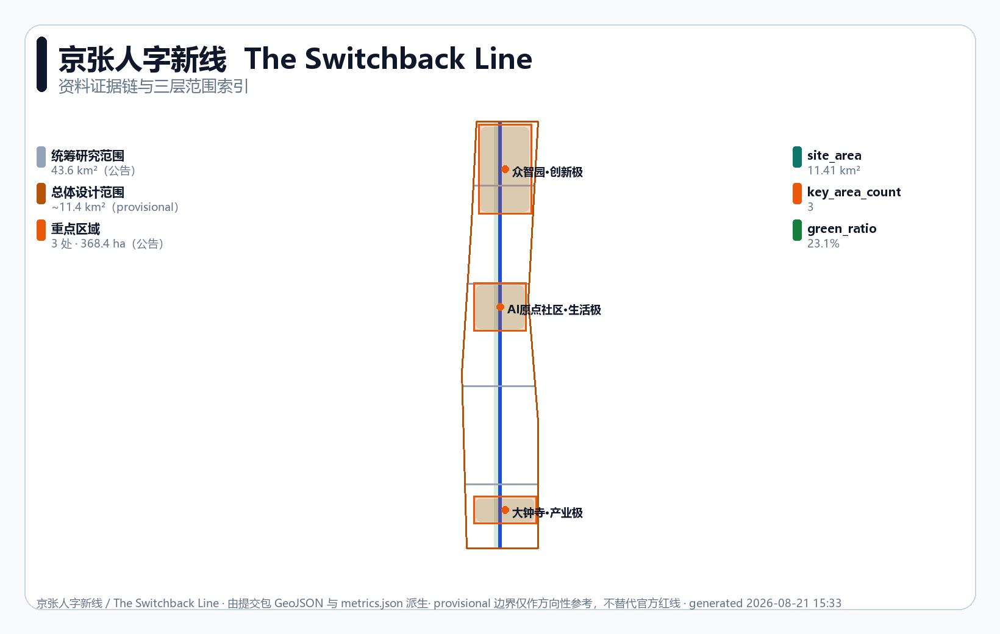
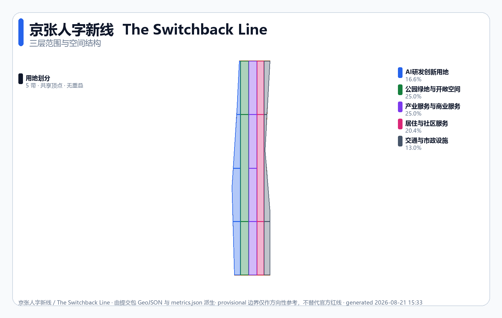
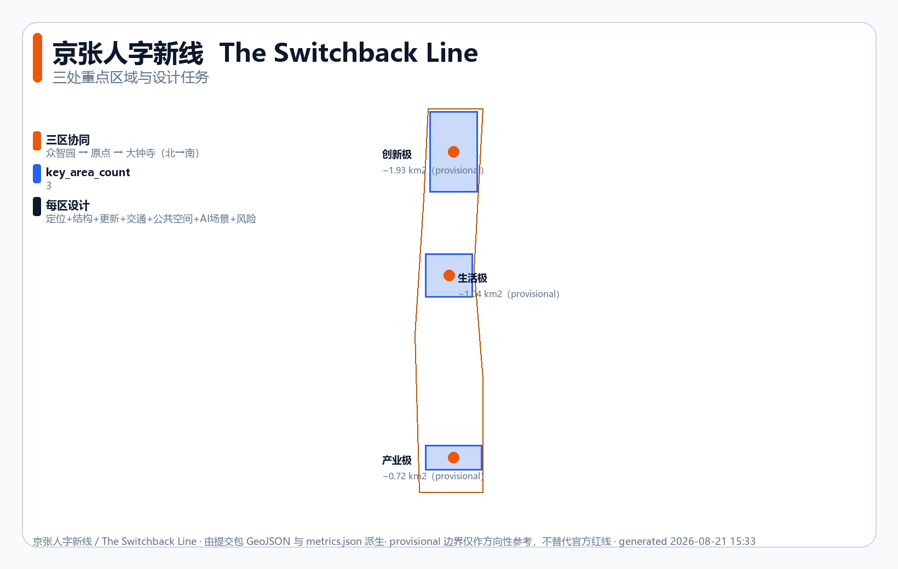
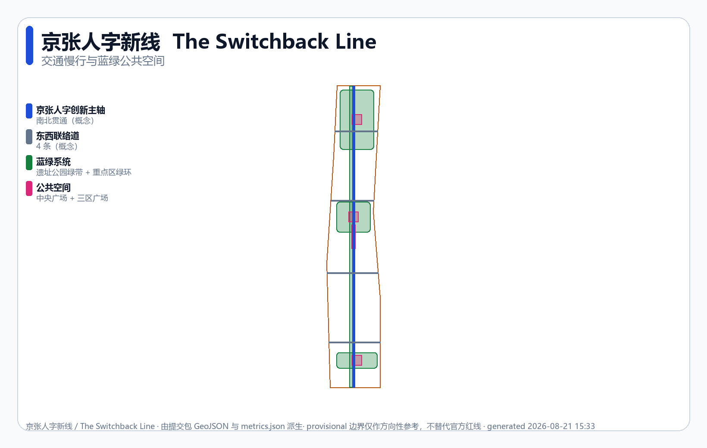
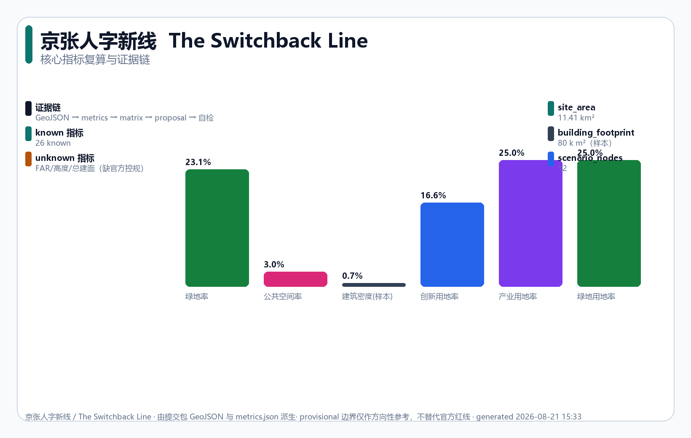

# The Switchback Line: using AI to overcome urban steep grades

> **Public slogan: AI enters the city, vouchers first.** Every urban AI service entering public space opens with one of three running vouchers — Test Receipt / Release Ticket / Public Verdict; when a voucher fails the service folds back, and everyday city life continues.
>
> **The Switchback Line** — In 1909, Zhan Tianyou designed the '人'-shaped switchback at Qinglongqiao, **using creativity to overcome what seemed an impossible slope** `[source:HISTORY-ZHAN-TIANYOU]`. The 2026 question is not "another AI park" but: **when cities face the triple steep grade, can AI be this era's switchback line?** `[source:HISTORY-JINGZHANG-1909]`

| Steep grade | Challenge | Switchback approach | Pole |
|---|---|---|---|
| **Productivity** | slow conversion, bottlenecks, compute scarcity | benchmarking + shared compute + open co-creation | **Innovation Pole · Zhongzhi Garden** |
| **Quality of life** | commuting, aging, uneven resources | health stations + education nodes + all-age slow traffic | **Life Pole · AI Origin** |
| **Global competition** | talent drain, fragmented ecosystems | clustering + global outreach + regional synergy | **Industry Pole · Dazhongsi** |

**Honest constraints**: provisional boundary only `[source:PROVISIONAL-BOUNDARY]`; FAR/height = `unknown` (no official plan `[metric:floor_area_ratio]`); all spatial content is conceptual, no government decision.

## Core judgment: a switchback line for three steep grades

An urban AI service enters public space only under acceptance the public can understand and re-verify. The Switchback Line becomes **three poles × three running vouchers** — when a voucher fails, space falls back to everyday mode `[standard:PROJECT-AGENT-OPEN-CALL-TASKBOOK]`:

| Pole | Non-negotiable spatial decision | Voucher | If it fails |
|---|---|---|---|
| **Innovation Pole · Zhongzhi Garden** | compute approaches the test zone only via staffed, public-first, no-bypass crossings | Test Receipt | test zone closed; courtyards and green belt continue |
| **Life Pole · AI Origin** | open methods, copyright status and retraction visible on one release surface | Release Ticket | release closed; teaching and collaboration continue |
| **Industry Pole · Dazhongsi** | non-AI path no longer than AI path; complaints and trials share the public chain | Public Verdict | adoption closed; devices return, human service continues |

The vouchers do not substitute: a technical pass cannot override a rights judgment, and an old failure cannot be erased by a new pass — the '人'-shaped switchback logic: **changing direction is not erasing the path travelled, but folding back while preserving prior state** `[source:HISTORY-ZHAN-TIANYOU]`.

**Operating doctrine: every mechanism follows one fold-back logic — most reliable, not highest performance.** Voucher fails → fold back to everyday city; any Timetable step fails → degrade to human; R0-R3 triggers → physical signage + human fallback; any SC-04 gate lacks evidence → stay in prior state; G6 retirement → revoke, purge data, restore site; minimum-regret → unacceptable worst case degrades or stops. The switchback was not a compromise but how a train keeps climbing an impossible grade — every mechanism here is that logic on a different layer.

Every service follows the same **Innovation Timetable** (borrowing a railway timetable's openness and accountability; not statutory, a reference scheme calibrated by professionals, operators and the public `[assumption:A-IMPLEMENTATION-001]`):

| Step | Meaning | Spatial requirement | If unmet |
|---|---|---|---|
| **① Declare** | state boundary and responsible party | readable notice at every response point | no registration, no opening |
| **② Time** | publish waiting/processing limits | response time on the notice | timeout → human, logged |
| **③ Handoff** | keep real-person and non-AI paths | human window + accessible alternative | no digital capability as entry |
| **④ Notify** | proactively explain after incidents | feedback wall / notice board | not in 24h → downgrade |
| **⑤ Review** | appeals, correction, independent review | appeal channel + record area | overdue → pause new services |
| **⑥ Sunset** | renew, shrink or terminate pilots | exit notice + data deletion | substandard → exit |

`Urban problem enters → Innovation Pole translates → Life Pole experiences → Industry Pole scales → Public verdict → continue, revise, or retire`

One spine (Jing-Zhang Switchback Innovation Spine), three poles, two wings (Zhongguancun tech-services / Xiaoyuehe scenario-testing) unfold along the ~9 km heritage park belt `[source:HERITAGE-PARK]`, aimed at the **global AI industry highland** and the **AI pilgrimage** vision. **One day in 2030**: 7:40 Ms. Li's blood-pressure check flags an anomaly and the human window connects her to the community doctor; 9:00 a researcher takes a Test Receipt through the controlled crossing while students watch benchmarks from the viewing platform; 12:30 the Dazhongsi complaint point shows "human review, 24h" beside a human-run shop and an intelligence-native store; 22:00 rainfall passes 50 mm, state R1 locks the robot lane and human delivery takes over; 23:30 the SC-04 duty officer re-runs the human fallback, receipt entering the public evidence chain — no personal data left the local edge, and no advertising screen all day (screens-recede principle).

## Design basis and source inventory

Submitted to the [Centennial Jing-Zhang AI Innovation Belt open call](https://github.com/open-city-ai/haidian) at `submissions/cynixway/jingzhang-new-gauge/`, respecting public/cleared boundaries `[source:SITE-PACKAGE]`:

- **Pre-qualification announcement** `[source:OFFICIAL-ANNOUNCEMENT-20260509]`: three-tier scope, three key areas, controlling basis `[standard:PROJECT-OFFICIAL-ANNOUNCEMENT]`.
- **Agent taskbook excerpt** `[source:AGENT-TASKBOOK-20260518]`: agent.1–agent.6, three orientations, five functions, three areas two wings, charter `[standard:PROJECT-AGENT-OPEN-CALL-TASKBOOK]`.
- **Standards**: urban design measures `[standard:MOHURD-URBAN-DESIGN-MEASURES]`, regulatory-plan measures `[standard:MOHURD-CONTROL-DETAILED-PLANNING]`, land-use classification `[standard:MNR-LAND-USE-CLASSIFICATION-GUIDE]`.
- **Grading** via `data/source_registry.json`: announcement/taskbook/standards `usable_for_formal=yes`; provisional boundary `provisional_only`.

Evidence chain: proposal → `geometry/*.geojson` → `metrics.json` → three matrices → `self_check.json`; five verifiable citation types. Multimodal loop: body + 6 figures + A3/A0 PDFs + HTML reports + portals (all zh/en) + 9 GeoJSON + metrics/matrix JSON. All spatial recommendations are "conceptual / reference / for professional teams to deepen" `[standard:PROJECT-AGENT-OPEN-CALL-TASKBOOK]`.

## Three-tier scope framework

The tiers narrow step by step into the three key areas `[depth:three_level_scope_framework]`:

| Tier | Extent | Area | Depth |
|---|---|---|---|
| Overall study | N5th Ring–Jingzang–Xizhimenwai–Wanquanhe | 43.6 km² (official) `[metric:site_area_sqm]` | strategic study |
| Overall design | 1–2 km around the park | ~11.4 km² (provisional) `[data:geometry/site_boundary.geojson#SITE-001]` | regulatory-plan-depth urban design `[depth:development_intensity_controls]` |
| Key areas | Zhongzhi, AI Origin, Dazhongsi | 368.4 ha (official) `[data:geometry/key_areas.geojson]` | implementation-plan depth `[depth:three_key_area_detailed_design]` |

**Provisional limits**: redline and regulatory conditions missing; maintainer polygons (`provisional_rough`); recalculated areas (site ≈11.413 km², key areas ≈3.693 km² `[metric:key_area_total_sqm]`) are directional only; full recalculation once official polygons arrive; FAR/height/density honestly `unknown` `[assumption:A-BOUNDARY-PROVISIONAL-001]`.

## Overall study: industry and future city research

**Concept: The Switchback Line / 京张人字新线**. In 1909 Zhan Tianyou climbed the grade with engineering wisdom, not brute force `[source:HISTORY-ZHAN-TIANYOU]`; this belt makes AI the switchback of our era — data, compute, scenarios, talent, enterprises and governance interoperating under one standard `[standard:PROJECT-AGENT-OPEN-CALL-TASKBOOK]`. **Three orientations**: heritage belt — rail heritage translated into an engineering-standard narrative (five story segments + pilgrimage landmarks); life-experience belt — the Life Pole embeds AI in daily routines (S5/S6/S7 + non-digital channels); fusion-innovation belt — Innovation and Industry Poles back self-innovation and conversion. **Five functions**: full-stack innovation → benchmark field + shared compute; world-class ecosystem → three-pole two-wing map; AI+ scenarios → 14 cards; intelligent vibrant city → spine + blue-green + component library; AI-governance voice → Timetable + vouchers + equity ledger.

**Naming** (agent.1): master name "京张人字新线 / The Switchback Line"; spine "Innovation Spine"; three areas = Innovation Pole (Zhongzhi) / Life Pole (AI Origin) / Industry Pole (Dazhongsi); two wings = Zhongguancun / Xiaoyuehe Switchbacks. **Logo direction** (agent.1, assets rights-cleared): gauge symbol (═══) × AI node network (•—•—•); engineering blue `#1d4ed8` + amber `#b45309` + slate `#475569` (WCAG-AA); pole accents blue / magenta `#db2777` / violet `#7c3aed`; applied to spine signage, entrances, scenario notices, honor walls, event materials; no unauthorized trademarks/portraits/paper figures; provisional boundaries dashed. Brand-identity goal: one mark, one colour, one phrase.

**Loop**: Zhongzhi (R&D) → AI Origin (conversion & experience) → Dazhongsi (scaling); Zhongguancun wing injects capital and IP, Xiaoyuehe wing opens test scenarios `[data:geometry/key_areas.geojson#PROV-KEY-001]`.

**Global cases** (agent.2, sources in the risk chapter `[source:CASE-STUDIES]`): Zhongguancun (1988 zone → 2009 first innovation demonstration `[source:CASE-ZGC]`, institutional design); Sand Hill Road (capital+university+startup `[source:CASE-SAND-HILL]`, wing factor allocation); King's Cross (67-acre rail heritage regeneration `[source:CASE-KINGS-CROSS]`, heritage + public space); Shenzhen Nanshan (11.5 km² clustering `[source:CASE-SHENZHEN]`, Industry Pole density); Shibuya (private-rail station-city `[source:CASE-SHIBUYA]`, three-area integration); One-North (200-ha mixed R&D `[source:CASE-ONE-NORTH]`, three poles juxtaposed); Amsterdam open data (19,000+ datasets `[source:CASE-AMSTERDAM]`, data standards layer). Lesson: successful belts run on **open standards + mixed function + public space + long-term operations**.

**Regional synergy** (conceptual `[assumption:A-REGIONAL-SYNERGY-001]` `[source:REGIONAL-SOURCES]`): heritage-park corridor communities (7 sub-districts, 8 universities, 26 communities `[source:HERITAGE-PARK]`) → Life Pole convenience + slow links; Future Science City → compute backup and shared benchmarks; Huairou → transfer channel; ETDA → "Haidian R&D – ETDA manufacturing"; BTH → unified interfaces and talent mobility. All open co-creation, not government arrangements `[standard:PROJECT-AGENT-OPEN-CALL-TASKBOOK]`.

## Overall design extent: renewal and regulatory-plan-depth design

The extent (~11.4 km², provisional `[data:geometry/site_boundary.geojson#SITE-001]`) uses **five-band zoning** refined into 17 named parcels: the heritage corridor (~9 km spine) forms the green backbone; the three key areas' functions set the three poles; existing street interfaces set east–west edges; continuous corridors form the infrastructure band `[depth:land_use_layout]` `[depth:existing_conditions_diagnosis]`.

| Band | Code | Area | Share | Role |
|---|---|---|---|---|
| Innovation track | 0802 AI R&D | 1.90 km² | 16.6% | research, compute `[metric:land_use_area_0802_sqm]` |
| Green band | 1401 park green | 2.85 km² | 25.0% | heritage park, buffer `[metric:green_space_area_sqm]` |
| Industry pole | 05 industry/business | 2.85 km² | 25.0% | HQs, conversion |
| Life pole | 0702 residential | 2.33 km² | 20.4% | talent housing |
| Infrastructure | 1207 transport/municipal | 1.49 km² | 13.0% | roads, compute, energy |

Indices in `metrics.json` (`land_use_area_{code}_sqm`), codes per the classification guide `[standard:MNR-LAND-USE-CLASSIFICATION-GUIDE]`; 17 parcels union = site boundary, no overlap, no gap `[data:geometry/land_use.geojson#LU-0802-A1]` `[metric:land_use_count]`.

**Planning-innovation claim — AI sinks from a service layer into a generative layer** (the answer to space-industry integration; if AI is only a service skin the city is unchanged `[depth:overall_spatial_structure]` `[depth:height_massing_character]`): ① **compute goes underground** — INNO-A2/INF-E2 basements driven by compute demand: B2 liquid-cooled halls (6–8 m, heavy loads), B1 edge cabinets, ground only hatches and shafts `[depth:municipal_new_infrastructure]`; ② **dynamic space allocation** — LIFE-D3 pedestrian street by day, robot lane at night (bollards split 2 m), festival market on weekends; ③ **robot-compatible streets** — INF-E1 section = 7 m bus/slow + 1.5 m robot lanes (separated) + 3 m sidewalks; lidar + mmWave posts, no biometrics `[depth:traffic_rail_slow_parking]`; ④ **screens recede** — GRN-B1 guidance via thermo-paving, soundscape, tactile maps, steel boards; AI schedules backstage, no screens on the surface `[depth:blue_green_public_space]`.

**Regulatory depth**: FAR/height/density `unknown`, honestly "to be confirmed" `[assumption:A-CONTROLS-001]`. Green ratio `[metric:green_ratio]` 23.1%, public-space ratio `[metric:public_space_ratio]` ~3.0%, building density `[metric:building_density]` (representative footprints `[metric:building_footprint_area_sqm]` `[data:geometry/buildings.geojson#BLD-001]`, not surveyed `[assumption:A-BUILDING-REPRESENTATIVE-001]`), road density `[metric:road_length_density_m_per_sqm]`.

## Key areas: detailed design

The three key areas line up along the corridor (provisional `[data:geometry/key_areas.geojson]`) `[depth:three_key_area_detailed_design]`:

| Key area | Spatial structure | Renewal / mobility / plaza | Lead scenarios | Risk |
|---|---|---|---|---|
| **Zhongzhi · Innovation Pole** (N, ~1.93 km²) | R&D clusters + shared compute + benchmark field, ringed by green | mostly new; low-speed test road `[data:geometry/roads.geojson#RD-001]`; Innovation Plaza `[data:geometry/public_space.geojson#PS-002]` | S1/S2/S11 | ownership unsurveyed `[assumption:A-CONTROLS-001]` |
| **AI Origin · Life Pole** (C, ~1.04 km²) | community + experience stores + third places + pocket parks | mixed retain-renovate-build; all-age slow network; Origin Life Plaza `[data:geometry/public_space.geojson#PS-003]` | S5/S6/S7 | resident baseline needed `[assumption:A-AI-SCENARIO-PILOT-001]` |
| **Dazhongsi · Industry Pole** (S, ~0.72 km²) | HQs + exhibition + industry services | mostly renovation; service routes; Industry Plaza `[data:geometry/public_space.geojson#PS-004]` | S7/S2 | ownership/operator TBD |

**17-parcel design intent matrix** — each parcel an independent polygon in `geometry/land_use.geojson` (parcel_id / bilingual names / sub-function / parent band); intensity qualitative (FAR awaits the plan `[metric:floor_area_ratio]`); treatment conceptual (subject to survey and ownership `[assumption:A-BOUNDARY-PROVISIONAL-001]`):

| Parcel | Intent | Intensity / treatment | Lead scenarios |
|---|---|---|---|
| INNO-A1 R&D cluster | labs, shared test benches | low–mid campus / new | S2 |
| INNO-A2 shared compute | regional compute, cooling | mid hall / new, elastic | S1 |
| INNO-A3 benchmark field | open testbed, viewing platform | low open / new | S1+S11 |
| INNO-A4 pilot accelerator | pilot shops, joint labs | mid pod-tower / mixed | S2 |
| GRN-B1 park spine | ~9 km heritage park, interpretation | low / retain-renovate | S10 |
| GRN-B2 green ring | three-area ring | greenway / retain-renovate | S4 |
| GRN-B3 sponge | rain gardens, swales | groundcover / new | supports S4 (hydrology pending `[assumption:A-GREEN-BLUE-CONCEPT-001]`) |
| IND-C1 HQ base | towers, anchor firms | high landmark / renovation | S7 (B-side) |
| IND-C2 intelligent retail | immersive stores, plaza | mid-high podium-tower / renovation | S7 |
| IND-C3 industry services | banking, IP, convention | mid podium / renovation | supports S11 |
| IND-C4 incubator | flexible space, demo rooms | flexible / mixed | S2 |
| LIFE-D1 talent housing | rent+sale, mixed income | mid-high slab / mixed | supports S5/S6 |
| LIFE-D2 community center | third places, childcare, clinic | mid mixed / renovation | S5+S6 |
| LIFE-D3 retail band | main-street retail, events | mid shopfront / renovation | S7+S8 night |
| INF-E1 spine & stations | TOD nodes, transit corridors | station-city / new+renovation | S3+S9 |
| INF-E2 compute & edge | distribution, edge cabinets | concealed / new | S1 edge |
| INF-E3 energy center | CCHP, substation | energy building / new | non-AI |

**Nine sub-precincts** (agent.3 `[depth:three_key_area_detailed_design]` `[depth:retain_renovate_demolish]`): Zhongzhi = ① benchmark field (INNO-A3+A2N, viewing platform landmark ③) ② shared compute (A2) ③ R&D + green ring (A1+A4+GRN-B2N); Origin = ① life plaza (D2+D3, S5/S6/S7) ② community center (D2N) ③ retail band (D3); Dazhongsi = ① HQ base (C1) ② intelligent retail (C2) ③ industry services (C3+C4).

## AI ecosystem, personas and AI+ scenarios

**Ecosystem map** (agent.2): the standards layer (Timetable six steps) as base, six factor layers (compute/data/scenarios/talent/capital/governance), three poles and two wings as nodes — "standards → factors → nodes → scenarios", every layer auditable `[standard:PROJECT-AGENT-OPEN-CALL-TASKBOOK]`. **Industry support**: factor-guarantee interfaces (Zhongguancun wing), open-application testing at INNO-A3, one scenario-opening flow for all 14 scenarios. **Personas** (agent.3, six): researchers/engineers → Innovation Pole; founders/developers → wings; enterprise teams → Industry Pole; residents/families → Life Pole; visitors/students → public space; governors → charter and evidence chain.

**Scenario cards** (agent.3, 14 incl. 3 industry tests; each locked in `visual/assets/scenario_professional_review_matrix.json` with prototype, minimal data, human responsibility, pause line, recovery evidence; measured values null, G3 field pilots closed `[depth:ai_scenario_service_nodes]`):

| Scenario | Prototype | Minimal data + human responsibility | Pause line / recovery |
|---|---|---|---|
| S1 compute & benchmarking | INNO-A2 | desensitized benchmarks; alliance review | failure → local-node degradation `[data:visual/assets/sc04-relay-receipt.json]` |
| S2 open co-creation workshop | INNO-A1 | public repos; community governance | disputed code → vote-revoke `[data:visual/assets/evidence-ledger.json]` |
| S3 rail-connection navigation | INF-E1 stations | anonymized flows; operator review | misleading → physical signage `[data:geometry/roads.geojson#RD-001]` |
| S4 all-age slow guidance | GRN-B1 | recognition-free sensing; community+property | accessibility break → stop `[data:geometry/green_space.geojson#GR-001]` |
| S5 community health station | LIFE-D2 | local health data; doctor review | anomaly → straight to doctor `[source:WHO-URBAN-HEALTH-AND-GREEN]` |
| S6 education convenience | LIFE-D2/D3 | child data localized; teacher-parent review | automated decision → rollback `[assumption:A-AI-GOVERNANCE-001]` |
| S7 intelligence-native consumption | IND-C2 | compliant records; merchant+platform human | anomaly → human service |
| S8 robot low-speed delivery | LIFE-D3 night | no pedestrian tracking; operator+duty officer | collision → immediate stop `[source:ISO-13482-SERVICE-ROBOT-SAFETY]` |
| S9 autonomous shuttle | INF-E1 | no biometrics; transit enterprise | anomaly → pull over + takeover `[data:visual/assets/tabletop_cases.json#T09-REJ]` |
| S10 heritage AI guide | GRN-B1 story nodes | public archives; heritage editor review | fabrication → delist |
| S11 governance board | co-creation platform | public data; governance union | misoperation → audit + rollback |
| S12 developer grounds | IND-C3/C4 vicinity | open registration; community organizers | cancel → online alternative |
| S13 emergency rollback | union on duty | triggers: heat/network/access | five-step exit + record `[metric:tabletop_case_count]` |
| S14 public-interest audit | review committee | quarterly review + anonymous log | weakest-20% worsening → pause `[data:visual/assets/edge-matrix.json]` |

**Three public baselines**: 100% final human confirmation for high-impact decisions; zero default biometric or track retention; non-digital channels preserved `[depth:ai_governance_charter]`.

**Switchback work order** — ten fields along the "problem enters → voucher acceptance → fold back or retire" chain, each with a missing-field rule: receiving pole (→ no matching); voucher (→ no G1); Timetable commitments (→ no opening); non-AI baseline (→ no improvement claims); data boundary (→ no collection); human takeover point (→ no opening); failure signals & pause line (→ no G5); fold-back path (→ no pilot); recovery evidence (→ stay degraded); retirement & site restoration (→ must not start).

**Minimal executable pilot SC-04**: S1 converges into the single pilot — 3 of 12 boundary conditions (wheelchair/cane, night rain/snow, weak network), one synthetic order + one control each (4 total), triggering only human fallbacks and stops, no real services or personal data `[assumption:A-OPERATIONS-001]`. Advances G0 topic → G1 site → G2 data → G3 rights → G4 human gate → G5 limited trial → G6 retirement; any gate lacking evidence stays put — proving **"stop, exit, recover" is independently re-runnable**. Companion offline tabletop pack (12 scenarios × pass/reject = 24 cases) verifies rule executability at zero network, zero personal data `[assumption:A-EVIDENCE-001]`.

**Public interest & equity ledger**: averages must not mask group gaps; six groups tracked for accessibility, thermal comfort, safety, waiting and appeal response (fields are design targets `[assumption:A-EVIDENCE-001]` `[depth:blue_green_public_space]`): older adults & children (shading + all-age slow + physical signage); persons with disabilities (no robot encroachment + physical paths); night workers (smart lighting + 24h safety nodes); low-digital-literacy residents (human windows); developers (open-application testing); visitors (five story segments + multilingual guide). Data protection: minimal collection, local by default (S5/S6 strictest); child data minimized, guardian consent, no commercial recommendation; shortest retention + deletion; per PIPL, Data Security Law, Barrier-Free Environment Law `[assumption:A-AI-GOVERNANCE-001]`.

## Land use, building scale and retain-renovate-demolish

Land use per the five bands + 17-parcel matrix. Scale `[depth:height_massing_character]` `[depth:retain_renovate_demolish]`: representative footprint `[metric:building_footprint_area_sqm]`, density `[metric:building_density]` (conceptual `[assumption:A-BUILDING-REPRESENTATIVE-001]`); treatment differs — Zhongzhi new, Origin mixed, Dazhongsi renovation; FAR/height/density `unknown`. Buildings, ownership, underground space and utility capacity await professional review `[assumption:A-CONTROLS-001]`.

## Transport, rail, municipal and public services

**Roads & slow traffic** `[depth:traffic_rail_slow_parking]`: Switchback Innovation Spine (N–S) + 4 east–west connectors (concept `[data:geometry/roads.geojson]`), spine `[metric:road_centerline_length_m]`. **Rail**: three-area station integration (concept), alignments subject to a transit study `[assumption:A-TRANSPORT-CONCEPT-001]`. **New infrastructure** `[depth:municipal_new_infrastructure]`: distributed compute, edge inference, new energy fused with utilities; capacity needs professional calculation.

## Blue-green space, public space and urban character

**Blue-green** `[depth:blue_green_public_space]`: heritage park belt (N–S `[data:geometry/green_space.geojson#GR-001]`) + three green rings, green ratio `[metric:green_ratio]`; sponge pending hydrology `[assumption:A-GREEN-BLUE-CONCEPT-001]`. **Public space**: Switchback Central Plaza `[data:geometry/public_space.geojson#PS-001]` + three pole plazas, ratio `[metric:public_space_ratio]`. **AI pilgrimage landmarks** (agent.4, three, rights-cleared assets required `[standard:PROJECT-AGENT-OPEN-CALL-TASKBOOK]`): Switchback Monument (central plaza, '人'-motif engineering art); Switchback Experience Hall (AI Origin, heritage + AI history); Benchmark Field Viewing Platform (Zhongzhi, public honor display). **Honor system** (agent.4): benchmark leaderboard wall — contribution constellation — enterprise gallery, unified visuals, publicly auditable.

**Component library** (agent.4, standard modules, accessible): switchback seats ('人' motif, wheelchair-accessible); standard paving (600×600, tactile); AI guide posts (1.2 m, voice/large type/button); movable units (2×2 m, ≥1.2 m aisles); accessible ramps (1:12, double handrails); smart lighting poles (4 m, low glare).

**Cultural signage & storyline** (agent.5): "from standard gauge to the AI switchback" — ① railway origins (1909) ② standard founding (1435 mm inset) ③ innovative turn ('人'-motif posts) ④ AI-native (digital + physical) ⑤ century inheritance (timeline); audio, high-contrast type, tactile maps, wheelchair-reachable; portraits and rail imagery rights-cleared. **International communication** (agent.5): *"The Switchback Line — climbing the city's steepest slopes with AI."*; the full deliverable set is bilingual (figures/PDFs/HTML/portal, see manifest). **Character**: engineering blue + amber, diagrams and blueprint style, no over-entertainment `[standard:MOHURD-URBAN-DESIGN-MEASURES]`.

## Renewal project list, implementation policy and phasing

**Executable portfolio** (mapped to `geometry/phasing.geojson` `[data:geometry/phasing.geojson#PH-001]`; no invented institutions or amounts `[depth:phasing_implementation]` `[depth:renewal_project_list]` `[assumption:A-IMPLEMENTATION-001]`):

| Project | Phase | Preconditions | Actor types | Cost band | Exit threshold |
|---|---|---|---|---|---|
| P1 benchmark field | near | boundary + plan + ownership + EIA | park + alliance | 3–8 bn RMB | reproduction <90% for 2 weeks |
| P2 central green belt | near | heritage 3-line + hydrology | landscape + heritage | 0.5–1.5 bn | heritage conflict → reroute |
| P3 convenience nodes | mid | resident baseline + child-data compliance | community + health/edu | 1–3 bn | privacy violation → pause & fix |
| P4 spine slow traffic | mid | transit study + safety audit | transit + municipal | 1.5–4 bn | incident → stop & review |
| P5 Dazhongsi regeneration | far | ownership + market will + fire | owners + operator | 8–20 bn | market shortfall → defer |
| P6 two-wing switchbacks | far | partners + interface standards | partner parks | 2–6 bn | synergy shortfall → shrink |

**Three-phase totals** (public benchmarks, not a budget): near 5–15 bn; mid 20–50 bn; far 10–30 bn. Excludes acquisition, operations, AI software (OPEX).

**Ten committable, acceptable, vetoable packages** (`visual/assets/delivery_contracts.json` `[depth:implementation_policy]`): C01 official geometry (redline missing → HOLD); C02 institutions & authorization (unsigned → G2 off); C03 ownership/heritage/fire (conflict → G1 fails); C04 measured accessibility (fail → G3 closed); C05 utility capacity (shortfall → no pilot); C06 privacy & AI review (unreviewed → G3 off); C07 public-interest co-testing (weakest-20% worsening 2 weeks → PAUSE); C08 quantities & cost (<2 quotes → no budget); C09 procurement/insurance/interfaces (unsigned → G3 closed); C10 integrated Go/No-Go (missing → HOLD).

**Timeline** (conceptual): T0 pre-study (Y0–1) → T1 green belt (Y1–2) → T2 SC-04 pilot (Y1–3) → T3 Innovation Pole (Y2–4) → T4 Life Pole (Y3–5) → T5 Industry Pole (Y4–7). RACI: redline/plan = government R/A; pilot = alliance R, government A; scenario opening = enterprise R, government A, community C; equity ledger = community R; resilience drills = enterprise + community R `[assumption:A-OPERATIONS-001]`.

**Zero-dependency starters** (no redline needed, public outputs): Timetable notice templates (community + design volunteers); tabletop pack extension S13/S14 (governance prep group); storyline archive + multilingual copy (heritage volunteers + universities); equity-ledger protocol (community + disability/elder representatives).

**All-state resilience degradation** — maturity = graceful degradation: R1 rain (>50 mm/24h: shuttle/delivery/AV paused, physical signage + human delivery + 200 m shelters); R2 offline (>30 min: all AI paused, signage + human windows + offline maps); R3 power loss (>15 min: emergency lighting + evacuation + e-stop). Principles: minimum service never omitted; e-stop over performance; gated recovery; annual drills `[assumption:A-GREEN-BLUE-CONCEPT-001]`.

**Minimum-regret priority** — ask "how bad is the worst case", not "how good": P-ensure (physical fallback: GRN-B1 physical guides, LIFE-D2 human windows) near-term; P-conditional (AI failure degrades to human: INNO-A2, IND-C1) mid-term; P-pilot (hard fallback: S8/S9) SC-04-scale only, expansion after all gates `[depth:risk_missing_data]`. Zhan Tianyou chose neither the shortest path nor the highest speed, but the **most reliable** `[source:HISTORY-ZHAN-TIANYOU]`.

**Long-term operations governance** (agent.6, conceptual `[standard:PROJECT-AGENT-OPEN-CALL-TASKBOOK]`): annual events = summit + benchmark open week + developer conference + AI pilgrimage festival; community operations = co-creation repos + scenario-opening flow + leaderboard + honor points; governance = co-governance council (government + enterprises + community + public + AI-agent observer), decisions human, auditable, reversible; every project names its operator and maintenance cycle.

## Metrics, area recalculation and compliance matrix

Core metrics recalculated from `geometry/*.geojson` under EPSG:4548 (CGCS2000 / 3° CM117E) `[depth:metrics_recalculation]`:

- **Scope & density**: `[metric:site_area_sqm]`, green `[metric:green_ratio]`, public-space `[metric:public_space_ratio]`, density `[metric:building_density]`
- **Key areas**: `[metric:key_area_count]` / `[metric:key_area_total_sqm]`
- **Transport & scenarios**: `[metric:road_centerline_length_m]` / `[metric:scenario_node_count]`
- **Phasing**: `[metric:phasing_area_near_sqm]` / mid / far
- **Statutory items**: FAR/height/GFA `unknown` with reasons `[metric:floor_area_ratio]`

Coverage: compliance 17 announcement items + 6 agent tasks = 23; standards 5 mandatory; design depth all complete.

## Risk, copyright and compliance

- **Source legality**: public/cleared only `[source:SITE-PACKAGE]`, provisional marked `[source:PROVISIONAL-BOUNDARY]` `[depth:risk_missing_data]`.
- **No official claims**: all conceptual, no government decision `[standard:PROJECT-AGENT-OPEN-CALL-TASKBOOK]`.
- **Copyright**: logo/fonts/images directional, final assets cleared; OS-bundled fonts; PDFs/figures agent-generated or GeoJSON-derived; dependencies (reportlab/shapely/pyproj/PIL) open-source. See `report/copyright_statement.md`.
- **Missing data**: redline, plan, surveys, ownership, capacity, models — full recalculation when available `[assumption:A-CONTROLS-001]`.
- **AI-generated responsibility**: generated by an AI agent, self-check passed `[assumption:A-EVIDENCE-CHAIN-001]`, final judgment by humans.

**External source registry** (verified 2026-08-08 `[source:EXTERNAL-VERIFIED]`): Jing-Zhang Railway 1909 / Zhan Tianyou ([Wikipedia](https://en.wikipedia.org/wiki/Beijing%E2%80%93Zhangjiakou_Railway), [NRA](https://www.nra.gov.cn/tlfc/tpsy/202204/t20220405_293018.shtml), [Zhan Tianyou](https://en.wikipedia.org/wiki/Zhan_Tianyou)); '人' switchback / shaft method ([Chinaculture](https://en.chinaculture.org/library/2008-02/01/content_26354.htm)); 1435 mm gauge ([Standard-gauge](https://en.wikipedia.org/wiki/Standard-gauge_railway)); Zhongguancun ([NIH](https://pmc.ncbi.nlm.nih.gov/articles/PMC7121753/)); Sand Hill Road ([Wikipedia](https://en.wikipedia.org/wiki/Sand_Hill_Road), [Stanford Law](https://law.stanford.edu/stanford-lawyer/articles/in-print-scott-kupor-jd-96/)); King's Cross ([Centre for Cities](https://www.centreforcities.org/reader/making-places/learning-from-kings-cross-regeneration/), [ULI](https://urbanplan.uli.org/resources/overview/project-snapshots/kings-cross/)); Shenzhen Nanshan ([Shenzhen Gov](https://www.sz.gov.cn/en_szgov/business/SpecialFunctionalAreas/content/post_11487609.html)); Shibuya ([Tokyu](https://www.tokyu.co.jp/shibuya-redevelopment/assets/pdf/shibuya_strategy_2025_en_web.pdf), [OECD/ITF](https://www.itf-oecd.org/sites/default/files/docs/transit-oriented-development-accessibility-southeast-asia.pdf)); One-North ([JTC](https://www.jtc.gov.sg/find-land/jtc-key-estates/one-north), [CLC](https://knowledgehub.clc.gov.sg/publications-library/one-north-fostering-research-innovation-and-entrepreneurship/)); Amsterdam ([data.amsterdam.nl](https://data.amsterdam.nl/)); Future/Huairou Science Cities, ETDA, BTH ([Beijing Gov](https://english.beijing.gov.cn/investinginbeijing/two_zones/industrial_park/202411/t20241125_3948772.html), [HSC](https://hsc.beijing.gov.cn/), [ETDA](https://kfqgw.beijing.gov.cn/), [State Council](https://english.www.gov.cn/news/202402/26/content_WS65dbfadcc6d0868f4e8e459a.html)); heritage park 7 sub-districts ([CSSN](https://www.cssn.cn/kgxc/kgxc_ggkg/202207/t20220728_5431647.shtml)).

**Narrative accuracy**: the 1435 mm gauge originated with Stephenson (UIC 1937) and was adopted by the Jing-Zhang Railway; Zhan Tianyou's signature innovations are the Qinglongqiao '人'-shaped switchback and vertical-shaft tunneling `[source:HISTORY-ZHAN-TIANYOU]`. This proposal's motif is not "inventing the gauge" but inheriting the **engineering wisdom that solves hard problems and leaves standards for later generations** `[assumption:A-SOURCE-REGISTRY-001]`.

## References

- `brief/site-package/design_brief.json` `[source:SITE-PACKAGE]`
- `brief/site-package/agent_taskbook.json` `[source:AGENT-TASKBOOK-20260518]`
- `brief/site-package/allowed_design_space.json`
- `brief/site-package/sources.json`
- `data/source_registry.json`
- `brief/site-package/standards/standards.json` `[standard:PROJECT-OFFICIAL-ANNOUNCEMENT]`
