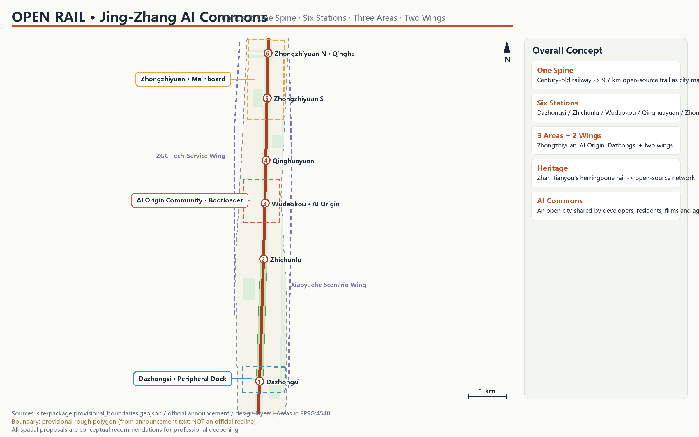
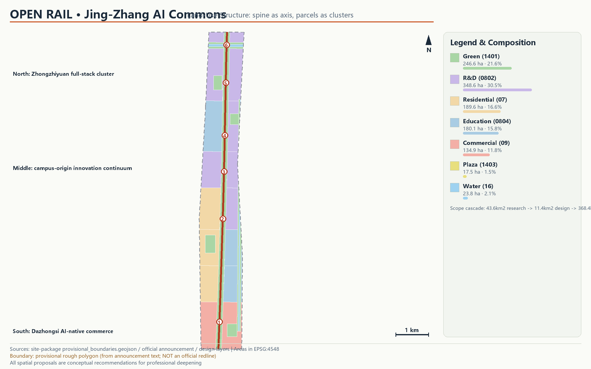
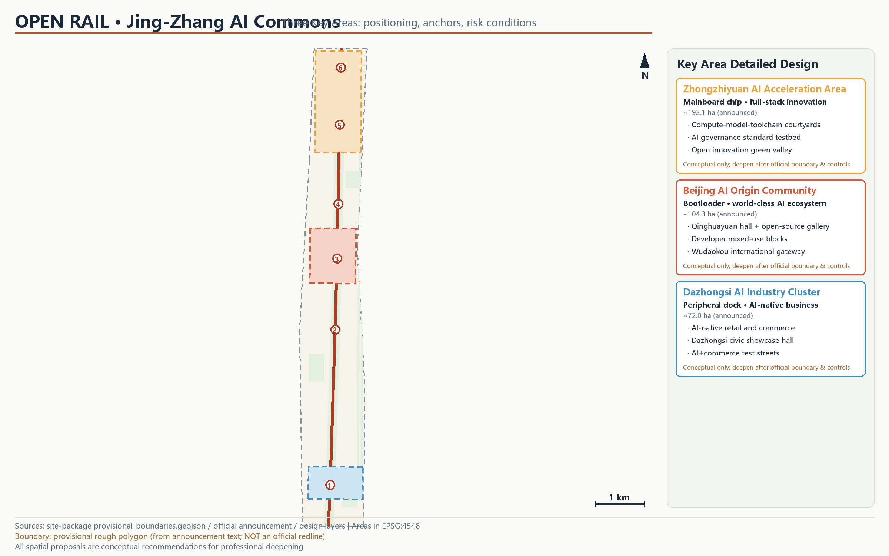
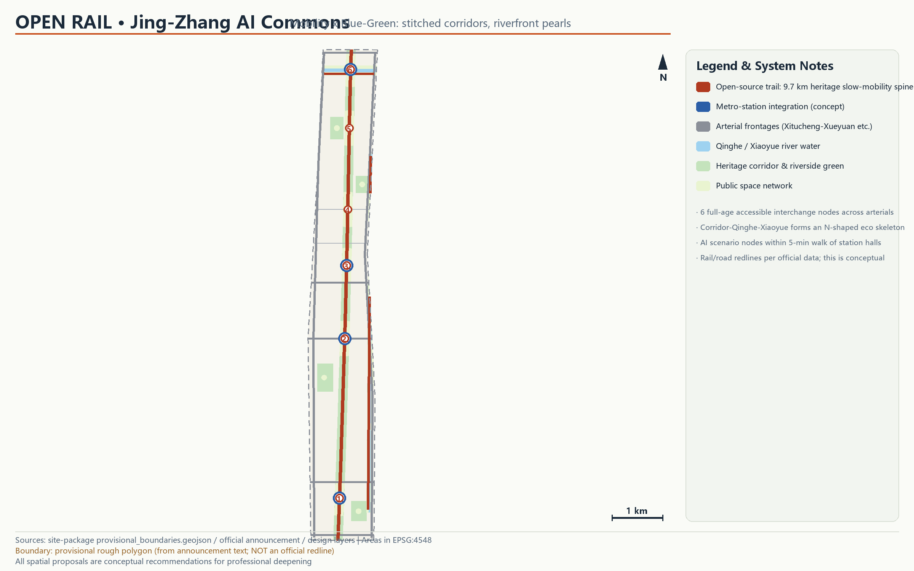
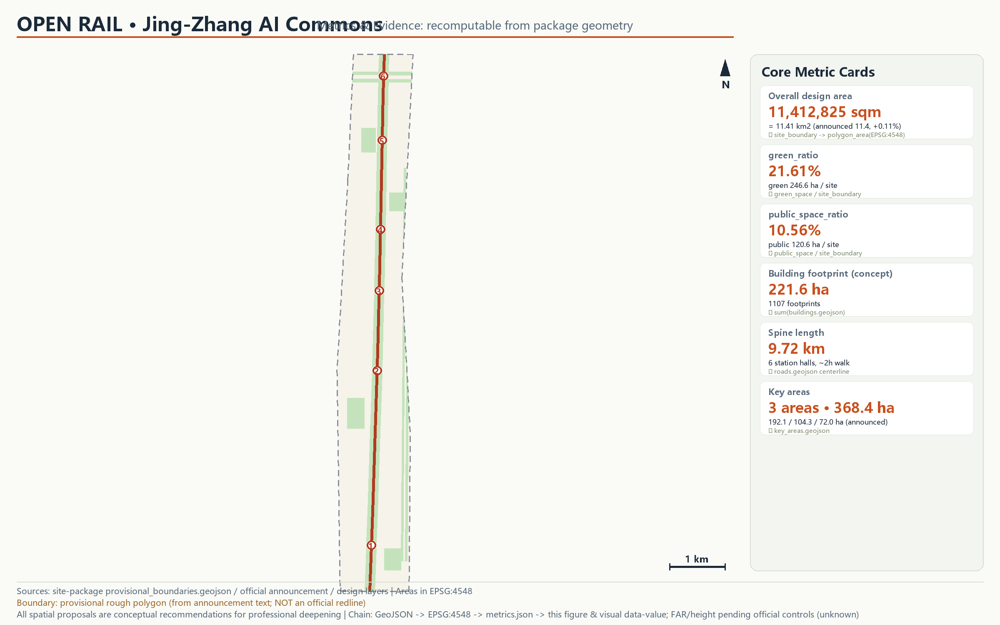

# OPEN RAIL: Jing-Zhang AI Commons Urban Design Proposal

> **Concept disclaimer**: All spatial, operational, branding and policy content in this proposal is an open co-creation recommendation — a "concept proposal" or "reference scheme" for professional teams to deepen. It does not replace statutory planning and does not constitute a government-approved conclusion. Every area and ratio can be recomputed from the package GeoJSON in EPSG:4548. The overall design boundary and the three key areas use provisional rough boundaries (provisional_constraint); all layers and metrics must be recalculated once official boundaries are released.

## Design Basis and Source List

This proposal rests on four categories of material. The primary authority is the official pre-qualification announcement issued by the Haidian Branch of the Beijing Municipal Commission of Planning and Natural Resources, which defines the project purpose, the three-level scope and the area figures [source:OFFICIAL-ANNOUNCEMENT]. The second is the repository's public site package, providing the structured brief, scope levels, enumerations and validation rules [source:SITE-PACKAGE]. The third is the agent-facing taskbook, which stipulates the ten co-creation principles, three positionings, five functions, three areas with two wings, and six mandatory agent tasks [source:AGENT-TASKBOOK]. The fourth is public background material on the Jing-Zhang Railway Heritage Park and the Qinghuayuan Station heritage site, used only for cultural narrative context, never as a basis for spatial controls [source:JINGZHANG-HERITAGE-PARK].

Source usability was checked item by item against the public source registry: no background-only source supports any spatial conclusion in this proposal, and no non-public or unclear-provenance data is used [source:SOURCE-REGISTRY]. Because the official precise redline has not been published, the overall design boundary and the three key areas use the repository's provisional rough boundary; its derivation method and precision limits are fully disclosed in the Three-Level Scope Framework section [source:BOUNDARY-SOURCE]. Complete indexes of sources, metrics, standards, design depth and task coverage are recorded in `sources.json`, `metrics.json`, `compliance_matrix.json`, `standard_matrix.json` and `design_depth_matrix.json`; the prose keeps only key citations attached to specific judgments.

Main data gaps: the official precise boundary and precise key-area polygons, current regulatory-plan control values, existing-building and property-rights base data, and municipal capacity data. These gaps are registered as pending conditions; the relevant sections are marked "to be completed upon official data" instead of being filled with inferred values [depth:existing_conditions_diagnosis].

## Three-Level Scope Framework

The three scope levels follow the announcement. The coordinated research area covers about 43.6 km² (North Fifth Ring Road to the north, Jingzang Expressway to the east, Xizhimenwai Street to the south, Wanquanhe Road to the west) and hosts industry and future-city research. The overall design area covers about 11.4 km² and hosts urban renewal and regulatory-plan-level urban design. The key detailed design areas total about 368.4 ha — from north to south: Zhongzhiyuan AI Acceleration Area (about 192.1 ha), Beijing AI Origin Community (about 104.3 ha) and Dazhongsi AI Industry Cluster (about 72.0 ha) [source:OFFICIAL-ANNOUNCEMENT] [depth:three_level_scope_framework].

The recomputed area of the submitted design boundary is 11,412,825 sqm, a deviation of about 0.11% from the announced 11.4 km²; the provisional key-area polygons recompute to 192.9, 104.3 and 72.0 ha respectively, all within 0.5% of the announced figures [metric:site_area_sqm] [data:geometry/site_boundary.geojson#SITE-001].

**Provisional boundary disclosure**: because the official precise redline has not been released with the public materials, all geometry in this proposal derives from `provisional_boundaries.geojson` (provisional_rough, inferred from the announcement's textual extents and area constraints). It is not an official redline and cannot be used for approval, precise area determination or engineering purposes; all land-use, green, public-space and building layers and every metric derived from it are interim design-model values. Upon release of official boundaries, the following must be recomputed: the full land-use partition, green and public-space layers, the three core metrics, building-footprint statistics and all drawings; the recalculation path is registered in `assumptions.json` (A-BOUNDARY-002) [source:BOUNDARY-SOURCE].

The cascade logic: the research area answers "where does the industry go and how does the urban form change"; the overall design area translates the industrial strategy into spatial structure, land use and system organisation; the key areas turn structure into recognisable public nodes and renewal projects. The conceptual spatial structure "one spine, six stations, three areas, two wings" is developed at the overall-design level in the following sections [depth:overall_spatial_structure].

## Coordinated Research Area: Industry and Future City Research

### Overall concept: OPEN RAIL

A century ago, Zhan Tianyou solved the Badaling climb with a herringbone alignment, making the Jing-Zhang Railway the first trunk railway designed and built by Chinese engineers; a century later, the same corridor faces a new "gradient" — how innovation factors flow efficiently through a city in the AI era [source:JINGZHANG-HERITAGE-PARK]. This proposal advances the overall concept **"OPEN RAIL: Jing-Zhang AI Commons"**: the 9.7 km heritage corridor is read as a continuous civic mainboard, where rails become the data and slow-mobility bus, stations become compute-and-community nodes, and the three key areas are functional chips on the board — together forming an open-source city to which every developer, resident, enterprise and agent can "commit" [source:AGENT-TASKBOOK].

**Naming system**: the master name is "OPEN RAIL", with the Chinese subtitle "京张AI共同体" (Jing-Zhang AI Commons). The spatial sequence uses a three-level naming of "Spine — Station Hall — Courtyard": the Open Rail Spine, six station halls (Dazhongsi, Zhichunlu, Wudaokou · AI Origin, Qinghuayuan, Zhongzhiyuan South, Zhongzhiyuan North), and innovation courtyards across the three areas. The naming deliberately reuses open-source software vocabulary — mainline, station hall, commit, merge — so that a century of engineering culture and contemporary developer culture meet in one language.

**Visual identity and logo direction** (concept proposal): the logo builds on the isomorphism between the railway herringbone switch and a circuit trace — two rail lines merge at the switch into a single circuit line, signifying "engineering wisdom merging into open-source intelligence". The primary palette is heritage rust and circuit teal, with basalt grey as support. Typefaces should use open-licensed fonts (e.g. Source Han Sans class); all visual elements must be originally drawn and cleared, with no third-party trademarks, portraits or copyrighted material [source:AGENT-TASKBOOK].

### Three positionings, five functions and the three-areas-two-wings synergy loop

The three positionings (Centennial Jing-Zhang Culture Belt, Urban AI Life Experience Belt, AI Integrated Innovation Belt) are organised as a "trio on a timeline": the culture belt answers "where we come from", carried by the heritage corridor and the Qinghuayuan Station narrative; the experience belt answers "how it is perceived", carried by the six station halls and the AI+ scenario network; the innovation belt answers "where we are going", carried by the industrial ecosystem of the three areas and two wings. The five functions are each anchored: the AI full-stack independent innovation system lands in Zhongzhiyuan; the world-class AI innovation ecosystem lands in the AI Origin Community; the AI+ scenario empowerment paradigm unfolds along the spine and the Xiaoyuehe wing; the intelligent AI vitality city is embodied in the slow-mobility and public-space network; and the global voice on AI governance rests on the Zhongzhiyuan governance testbed and open-source governance mechanisms [source:AGENT-TASKBOOK].

The synergy loop (concept proposal): Zhongzhiyuan (mainboard chip) produces technology, standards and governance tools; the AI Origin Community (bootloader) turns technology into products, showcases and talent intake; Dazhongsi (peripheral dock) delivers consumer-grade applications and commercial returns; the Zhongguancun technology-service wing provides capital, legal and global factor allocation; the Xiaoyuehe scenario wing supplies everyday test scenarios. The return loop: commercial revenue and data insights flow back through the Xiaoyuehe wing to the research end, closing a "research — incubation — application — feedback" cycle.

### Global AI innovation ecosystem case studies (6)

The following cases distill transferable ecosystem mechanisms; all are public general-knowledge studies and specific figures should be verified against official releases [source:GLOBAL-AI-ECOSYSTEM-CASES]:

1. **Silicon Valley Menlo Park — Palo Alto corridor (USA)**: a rail corridor linking universities, laboratories and venture capital, proving that "a corridor is an ecosystem" — the Jing-Zhang corridor can likewise serve as the backbone of factor flows. Transferable mechanism: showcase, investment-matching and talent-exchange interfaces along the spine.
2. **Kendall Square (Cambridge, USA)**: deep fusion of the MIT campus with urban renewal plots, forming a "university — enterprise — public space" sandwich. Transferable mechanism: campus interfaces and courtyard-style R&D space in the AI Origin Community.
3. **Station F (Paris, France)**: the world's largest startup campus converted from a historic rail depot, proving the narrative power of "transport heritage + startup ecosystem". Transferable mechanism: the Qinghuayuan station-hall open-source achievement gallery concept.
4. **TU Munich Garching — city-centre innovation corridor (Germany)**: a metro line linking campus, research institutes and corporate headquarters, defining the innovation collaboration radius by transit time. Transferable mechanism: station-integrated innovation services at the six halls.
5. **Nanshan Yuehai Sub-district (Shenzhen, China)**: a high-density mixed district embedding test scenarios and engineering capacity, enabling "test downstairs, research upstairs" rapid iteration. Transferable mechanism: the Dazhongsi AI-native commercial blocks and test scenarios.
6. **Zhangjiang Science City (Shanghai, China)**: an innovation ecosystem and urban services organised around major science facilities, emphasising the "science — industry — city" triad. Transferable mechanism: Zhongzhiyuan's full-stack system with an open central green valley.

Ecosystem mechanisms in place: land and space provide elastic supply through courtyard R&D plots; industry avoids homogeneous competition through the "mainboard — bootloader — dock" division; capital and talent rely on the global networks of the Zhongguancun wing; compute and data are embedded in station halls as edge-compute nodes and compliant data sandboxes (concept); scenarios open up on the Xiaoyuehe wing and the spine as living testbeds [depth:overall_spatial_structure].

## Overall Design Area: Urban Renewal and Regulatory-Plan-Level Urban Design

### Spatial structure: one spine, six stations, three areas, two wings

The spatial structure of the overall design area is summarised as "one spine, six stations, three areas, two wings" (concept proposal). The spine: the Jing-Zhang Heritage Park · Open Rail corridor, 180 m wide and 9.7 km long, a composite of continuous parkland, slow-mobility mainline and cultural gallery [data:geometry/green_space.geojson#GREEN-001] [metric:spine_length_m]. The six stations: six station-hall public nodes spaced 800–2,200 m apart, each combining transit connection, public square and AI scenario gateway. The three areas: Zhongzhiyuan, AI Origin Community and Dazhongsi. The two wings: the Zhongguancun technology-service wing on the west and the Xiaoyuehe scenario-empowerment wing on the east [depth:overall_spatial_structure].

### Land-use layout and renewal framework

The land-use layout follows "corridor first, moderate mixing, campus linkage" (concept proposal): R&D land of about 348.6 ha (30.5%) clusters along the spine and the three key areas; residential land of about 189.6 ha (16.6%) remains in the mature central communities with gradual renewal; education land of about 180.1 ha (15.8%) reinforces the campus interfaces along BUPT, BUAA and East Qinghua Road; commercial land of about 134.9 ha (11.8%) concentrates at Dazhongsi and Wudaokou; green space of about 246.6 ha (21.6%), giving a green ratio of 21.61% [metric:green_ratio] [depth:land_use_layout].

The urban renewal framework (reference scheme): gradual renewal based on retain-renovate-demolish classification — the central residential areas focus on retention, repair and functional stitching; campus interfaces focus on adaptive reuse and interface opening; the three key areas combine new construction with renovation. Because existing-building base data and property-rights data are unavailable, plot-level classification is directional only and must be verified by professional teams once official data arrives [depth:retain_renovate_demolish].

### Innovation indicator system (concept proposal)

Suggested distinctive indicators for the belt include: green ratio (current design-model value 21.61%), public space ratio (10.56%), spine trail continuity (target 100%), 5-minute walking coverage of station halls, number of open AI scenarios, and annual open-source events [metric:public_space_ratio]. Industrial indicators (output, enterprise count, talent count) depend on official statistics; this proposal makes no numerical commitments and only offers an indicator framework for professional deepening.

### Jing-Zhang Heritage Park vitality belt

The vitality belt is the backbone of the structure: running from the Qing River in the north to Xizhimenwai Street in the south, it is fully walkable and rideable, hosting open-source showcases, AI scenario tests, cultural performances and daily recreation. Through six station halls and eight arterial interfaces, the belt "stitches" the blocks historically split by the railway to the east and west [depth:blue_green_public_space].

### Urban character

Character control (concept proposal): the corridor takes "industrial heritage + natural wilderness" as its tone, keeping rails, sleepers and signals; the campus interfaces favour a dialogue between collegiate brick and contemporary glass; Dazhongsi adopts a modern commercial frontage. Specific control values for building height, massing and roofscape are statutory regulatory-plan matters; this proposal makes no numerical determinations and offers only character-zone intentions [depth:height_massing_character].

## Detailed Design of Key Areas

### Zhongzhiyuan AI Acceleration Area (~192.1 ha) — "Mainboard Chip"

Positioning: the core carrier of the AI full-stack independent innovation system and the global voice on AI governance [source:AGENT-TASKBOOK]. Spatial structure (concept proposal): a central green valley forms the open innovation interface, flanked by compute, model and toolchain R&D courtyards composed of 60×40 m modular footprints for flexible subdivision [data:geometry/key_areas.geojson#PROV-KEY-001]. Building renewal is dominated by new R&D courtyards; concept footprints are shown in the buildings layer. Mobility: the south and north station halls serve the southern courtyards and the Qing River gateway respectively, with a low-speed robot-delivery test loop (concept). Public space: the central green valley doubles as a venue for launches and hackathons. AI scenarios: the AI governance standard testbed and public tests of edge-compute nodes. Implementation risks: the boundary is provisionally inferred and awaits the official polygon and regulatory conditions; development intensity is pending [depth:three_key_area_detailed_design].

### Beijing AI Origin Community (~104.3 ha) — "Bootloader"

Positioning: the showcase window of the world-class AI innovation ecosystem and the intake portal for talent. Spatial structure (concept proposal): organised around the Qinghuayuan hall as "one core, two streets" — the Qinghuayuan Station Hall · Open-Source Achievement Gallery (concept) hosts the AI pilgrimage landmark; Wudaokou hall organises international exchange and developer services; the central mixed-innovation blocks provide "test downstairs, research upstairs" composite space [data:geometry/key_areas.geojson#PROV-KEY-002]. Building renewal: mainly adaptive reuse with infill mixed courtyards. Mobility: Wudaokou and Qinghuayuan halls connect Chengfu Road and East Qinghua Road, stitching campus-community slow-mobility gaps. Public space: the achievement gallery, developer square and AI origin memorial node. AI scenarios: AI+ education (campus linkage) and AI cultural guide. Implementation risks: heritage-protection requirements for the Qinghuayuan Station site follow the cultural relics authority's formal publications; no construction may touch protection redlines [source:QINGHUAYUAN-STATION-HERITAGE].

### Dazhongsi AI Industry Cluster (~72.0 ha) — "Peripheral Dock"

Positioning: the consumer-grade application zone for AI-native business formats. Spatial structure (concept proposal): "one port, two streets" around Dazhongsi hall — a civic showcase window and AI-native consumption streets hosting AI+ commerce, robot services and digital-consumption test scenarios [data:geometry/key_areas.geojson#PROV-KEY-003]. Building renewal: mainly functional replacement within existing commercial space, with cautious new volume. Mobility: Dazhongsi hall connects the North Third Ring Road and Xizhimenwai Street directions as the southern gateway of the belt. Public space: the gateway green corridor and the station-front performance square. AI scenarios: the AI+ commerce test street, robot guides and delivery. Implementation risks: complex property rights and multiple renewal actors require negotiated renewal; this proposal offers no plot-level demolition conclusions [depth:three_key_area_detailed_design].

## AI Innovation Ecosystem, Personas, and AI+ Scenarios

### Five user personas

1. **AI researcher/engineer** (25–40, working in R&D courtyards and university labs): needs elastic research space, 24-hour compute services, cross-institution exchange interfaces and high-quality third places.
2. **Developer/entrepreneur** (22–35, startups and independent developers): needs low-cost test scenarios, open-source showcase opportunities, investment matching and an international community atmosphere.
3. **University students and faculty** (18–30, BUPT, BUAA and others): needs shared city-campus facilities, internship-to-employment channels and youth-friendly public venues.
4. **Local residents** (all ages, mature central communities): needs daily slow-mobility safety, waterfront and park accessibility, better community services and informed participation in renewal.
5. **Visitors/city observers** (domestic and international tourists, delegations, media): needs a legible cultural narrative, iconic public nodes and convenient wayfinding.

### AI+ scenario cards (12)

All scenario cards are concept proposals; operating data is limited to public or authorised sources, and any processing of personal information carries explicit privacy boundaries and human review [source:AGENT-TASKBOOK]:

| # | Scenario card | Location | Users | Data & privacy boundary | Operator (concept) |
|---|---------------|----------|-------|-------------------------|--------------------|
| 1 | AI+ walkability assessment: identify slow-mobility gaps | Belt-wide slow network | Residents/commuters | Public road data + authorised feedback; no personal trajectories | City operations team |
| 2 | AI cultural guide: centennial Jing-Zhang narration | Entire Open Rail spine | Visitors/students | Public cultural materials; no personal data | Cultural operations team |
| 3 | AI health-service navigation: community care and fitness guidance | Central communities & parks | Residents | Public facility data; health data stays on personal devices | Community service centre |
| 4 | Enterprise-service copilot: policy/scenario/compliance navigation | Zhongzhiyuan & Origin Community | Enterprises/teams | Public policy library; enterprise data by authorisation | Park service platform |
| 5 | Public-safety incident review: joint drills on public events | Station halls & squares | Governance/public | Public incident records; released after human review | City governance team |
| 6 | Low-speed robot delivery test | Zhongzhiyuan test loop | Merchants/residents | Confined/semi-confined segments; speed-limited and supervised | Park + enterprise joint |
| 7 | AI+ education open classes: university courses in the park | Qinghuayuan hall | Students/public | Open course resources | Universities + community |
| 8 | AI+ retail guide and accessible shopping guidance | Dazhongsi blocks | Consumers | Public merchant data; no mandatory face capture | Commercial operator |
| 9 | Public test of edge-compute nodes | Six station halls | Developers | Open test protocol; data processed locally | Infrastructure operator |
| 10 | Smart park maintenance: vegetation and facility inspection | Corridor & riverside green | Maintenance dept | Public environmental data | Park management |
| 11 | **Test: open-street autonomous shuttle bus** | Dazhongsi–Zhichunlu segment (concept) | Commuters | Designated segments, speed limit, safety operator, takeover-ready | Professional test body |
| 12 | **Test: AI governance sandbox — algorithm filing & impact assessment** | Zhongzhiyuan governance testbed | Enterprises/researchers | Open assessment framework; human review | Governance research body |

Cards 6, 11 and 12 are AI-industry test-and-validation scenarios (no fewer than three); all require competent-authority permission before implementation and are not represented here as approved operations. Scenario-space-operation mapping: each card maps to a station hall or corridor node (see `geometry/public_space.geojson`), an explicit data boundary and an operating body, and plugs into the long-term operation system of section ten [source:AGENT-TASKBOOK].

## Land Use, Building Scale, and Retain-Renovate-Demolish Strategy

The land-use layout (concept proposal) follows the land_use layer: seven land-use classes seamlessly cover the entire design area using verifiable national classification codes, with no self-invented categories [standard:MNR-LAND-USE-CLASSIFICATION-GUIDE] [data:geometry/land_use.geojson#LU-001]. Conceptual building footprints number 1,107 and total about 2.216 million sqm, a footprint ratio of about 19.4% — a figure expressing the magnitude of space supply only, not an approval scheme or the existing building stock [metric:building_footprint_area_sqm].

Building scale and development intensity: floor-area ratio, building height and development intensity are statutory regulatory-plan matters and are not publicly available; they are uniformly recorded as pending (status=unknown in metrics) with no numerical determination [depth:development_intensity_controls]. Retain-renovate-demolish: central residential areas emphasise retention; campus interfaces emphasise renovation; the three key areas combine all three, but specific classification awaits existing-building and property-rights data, and this proposal issues no plot-level conclusions [depth:retain_renovate_demolish].

Space supply and operation strategy (concept proposal): R&D courtyards use modular footprints to adapt to team sizes; Dazhongsi favours functional replacement in existing commercial space to reduce large-scale demolition; residential renewal uses light-touch measures such as elevator retrofitting, pocket parks and slow-mobility stitching.

## Transport, Rail, Municipal Infrastructure, and Public Services

Transport organisation (concept proposal): external access relies on the arterial frontages of the North Third/Fourth/Fifth Ring Roads, Xitucheng–Xueyuan Road and Heqing–Dazhongsi East Road; internally, the Open Rail slow-mobility mainline forms the skeleton, and six station halls stitch east-west links historically cut by the corridor, creating a "one hall, one interface" slow-mobility network [data:geometry/roads.geojson#ROAD-010] [depth:traffic_rail_slow_parking].

Rail-station integration: stations at Dazhongsi, Zhichunlu, Wudaokou and the Shangdi direction conceptually connect with station halls, whose 800 m coverage serves most R&D and residential areas; rail alignments and station settings follow official information and no engineering judgement is made. Parking and non-motorised transport: station halls provide bicycle parking and shared-mobility interchange; motor-parking supply indicators await regulatory conditions.

Municipal and new infrastructure (concept proposal): retrofitting and capacity accounting of conventional municipal facilities await official data; for new infrastructure, the concept of "edge-compute nodes in the park" places edge computing, open Wi-Fi and positioning services at the six halls to support AI scenario testing; distributed energy and sponge facilities are coordinated with the riverside green belt [depth:municipal_new_infrastructure].

Public services: aligned with the five personas — youth apartments and maker services (Origin Community), community healthcare and elder stations (central residential areas), international schools and science venues (campus interfaces), and cultural performance facilities (corridor and halls); specific scales and layouts await specialised deepening.

## Blue-Green Network, Public Space, and Urban Character

The blue-green system (concept proposal): the Open Rail corridor (about 1.567 million sqm of parkland) and the Qing River / Xiaoyue River riverside green belts form an N-shaped ecological skeleton, complemented by four community parks completing the 500 m service radius, giving a design-model green ratio of 21.61% [metric:green_ratio] [data:geometry/green_space.geojson#GREEN-001]. The public-space system: six station-hall squares, six active corridor segments, waterfront public open spaces and five pocket squares, giving a public-space ratio of 10.56%; the composite use of green and public space is explained in the assumptions and the two ratios are not additive [metric:public_space_ratio].

Urban character: a belt-wide colour cue of "heritage rust + circuit teal"; wayfinding and signage reuse the herringbone-circuit symbol of the logo; campus interfaces encourage contemporary expression of collegiate materials; new structures inside the corridor are limited to small-scale service kiosks, yielding to rails and vegetation [depth:blue_green_public_space].

### AI pilgrimage landmarks and honour display system (4, concept proposals)

1. **Developer Promenade (entire Open Rail spine)**: the rail trail is inlaid with open-source milestone engravings recording global AI open-source events — walking as reading.
2. **Agent Contribution Honour Wall (Qinghuayuan hall)**: a continuously updated honour wall for agents and human contributors to urban co-creation, engraving GitHub IDs and agent names — this very project is a candidate for the first plaque.
3. **Open-Source Achievement Gallery (Qinghuayuan station building, concept conversion)**: an annually curated showcase of the year's most influential AI open-source achievements, linked with university courses.
4. **AI Origin Monument (Wudaokou hall square)**: marking the spatial coordinate of "Beijing's AI origin", becoming the default backdrop for industry gatherings and annual launches.

No landmark involves physical alteration inside heritage protection redlines; all Qinghuayuan station content is conceptual and subject to the cultural relics authority's requirements [source:QINGHUAYUAN-STATION-HERITAGE]. Landmark and signage design avoids over-entertainment and keeps the restrained temperament of engineering commemoration [source:AGENT-TASKBOOK].

## Renewal Projects, Implementation Policy, and Phasing

Renewal project list (concept proposals, all reference schemes): ① Open Rail spine connection (walkway, cycling, signage); ② six station-hall node upgrades; ③ Qinghuayuan gallery concept conversion; ④ central green valley open interface; ⑤ Dazhongsi AI-native block renewal; ⑥ gradual renewal of central residential areas with pocket parks; ⑦ Qing River–Xiaoyue River green-belt connection; ⑧ edge-compute nodes and new-infrastructure demonstration [data:geometry/phasing.geojson#PHASE-001] [depth:renewal_project_list].

Phasing (concept proposal): near term (2026–2029) completes the southern spine, the AI Origin Community and the Dazhongsi gateway as the most legible demonstration segment; medium term (2029–2032) advances the northern corridor and southern Zhongzhiyuan; long term (2032–2035) completes northern Zhongzhiyuan and the Qing River waterfront gateway. The sequence is advisory only; implementing bodies, funding arrangements and approval procedures follow formal decisions [depth:phasing_implementation].

### Global AI innovation event system and long-term operation (concept proposal)

Annual event system: the spring "Open Rail Conference" (main forum + developer fair), the summer "AI City Test Season" (open scenarios + published test validation), the autumn "Jing-Zhang Centennial Culture Season" (heritage performances + campus linkage), and the winter "Agent Contribution Annual" (honour-wall update + annual open-source releases). Branding and communication: all events use the OPEN RAIL visual system, with the international narrative "From the first Chinese-built railway to the first open-source city". Developer community operation: GitHub remains the main collaboration interface, extending this open call's PR/Issue mechanism into a standing civic co-creation routine. Open-scenario operation: an annual open-scenario list and test specification is published. Conversion: a three-stage "events — testing — implementation" pathway; no policy or funding commitments are made [source:AGENT-TASKBOOK].

## Metrics, Area Recalculation, and Compliance Matrix

All core metrics are recomputable from package geometry: overall design area 11,412,825 sqm (EPSG:4548); green ratio 21.61% (246.6 ha of green space ÷ total site); public-space ratio 10.56% (120.6 ha ÷ total site); conceptual building footprint about 2.216 million sqm; Open Rail spine length 9.72 km; key areas recomputed at 192.9 / 104.3 / 72.0 ha [metric:site_area_sqm] [metric:green_ratio] [metric:public_space_ratio].

Design meaning of the metrics: the green ratio supports "a high-quality district that AI talent aspires to" — every R&D courtyard is within 500 m of green; the public-space ratio supports innovative encounter — every station hall is a linger-worthy third place; the footprint ratio of about 19.4% expresses a supply structure where high-density intellectual activity coexists with a generous green base [depth:metrics_recalculation].

Compliance coverage: the response relationships for announcement items 1.3, 1.4, 1.5 and agent tasks agent.1–agent.6 are fully recorded in `compliance_matrix.json`; professional-standard responses are recorded in `standard_matrix.json` (urban design, regulatory-depth distinction, land-use classification, etc.); design-depth evidence is recorded in `design_depth_matrix.json`, where all 15 items are complete (items limited by unavailable official data disclose this via completeness_limited_by). Floor-area ratio and building height remain unknown with reasons because official control conditions are not public [standard:MOHURD-CONTROL-DETAILED-PLANNING].

## Risk, Copyright, and Compliance

Material and compliance risks: ① provisional-boundary risk — all geometry and metrics are interim design-model values requiring full recalculation upon official data release; ② regulatory-gap risk — intensity, height and demolition classification are uniformly pending and no inferred values are passed off as controls; ③ heritage risk — all Qinghuayuan Station content is conceptual and subordinate to relics-protection requirements; ④ implementation risk — phasing and the project list are recommendations, not government commitments [depth:risk_missing_data].

Copyright and generation responsibility: the text, geometry layers, figures and exhibit pages of this proposal are generated by an AI agent entirely from public or cleared materials; the figures are original programmatic drawings using no third-party map screenshots, trademarks, portraits or copyrighted material; system-bundled fonts are used only for local rendering and are not redistributed. See `report/copyright_statement.md` for the full statement. The submitting author is responsible for the facts, citations and final expression of AI-generated content [source:AGENT-TASKBOOK].

Privacy and ethics: every scenario card involving personal information sets boundaries of on-device processing, authorised use and human review; test-and-validation scenarios require competent-authority permission; this proposal contains no scenario design of excessive surveillance or unreviewable automation.

## References

The following are the materials that genuinely shaped this proposal [source:OFFICIAL-ANNOUNCEMENT] [source:SITE-PACKAGE] [source:AGENT-TASKBOOK]; the complete machine-readable index is maintained in `sources.json` and the three matrix files.

1. Haidian Branch, Beijing Municipal Commission of Planning and Natural Resources: Pre-qualification Announcement of the Centennial Jing-Zhang AI Innovation Belt Urban Design International Solicitation, May 2026 [source:OFFICIAL-ANNOUNCEMENT].
2. Haidian · Centennial Jing-Zhang AI Innovation Belt open-call repository: public site package (design_brief.json, agent_taskbook.json, provisional_boundaries.geojson, standards), open-city-ai/haidian [source:SITE-PACKAGE].
3. Agent-facing open-call taskbook excerpt (agent_taskbook.json and its local reference text) [source:AGENT-TASKBOOK].
4. Beijing Municipal Cultural Heritage Bureau: public information on the Qinghuayuan Station heritage site [source:QINGHUAYUAN-STATION-HERITAGE].
5. Public releases and reports on the Jing-Zhang Railway Heritage Park (Beijing Municipality and Haidian District) [source:JINGZHANG-HERITAGE-PARK].
6. Beijing Public Data Open Platform: public statistical calibres on population, transport and public facilities (background reference) [source:BEIJING-OPEN-DATA].
7. Public general-knowledge studies of global AI innovation ecosystems: Silicon Valley corridor, Kendall Square, Station F, TU Munich innovation corridor, Shenzhen Nanshan, Shanghai Zhangjiang [source:GLOBAL-AI-ECOSYSTEM-CASES].
8. MOHURD Urban Design Management Measures and related professional requirements for urban design and regulatory-plan depth (repository local standards reference library) [standard:MOHURD-URBAN-DESIGN-MEASURES].
