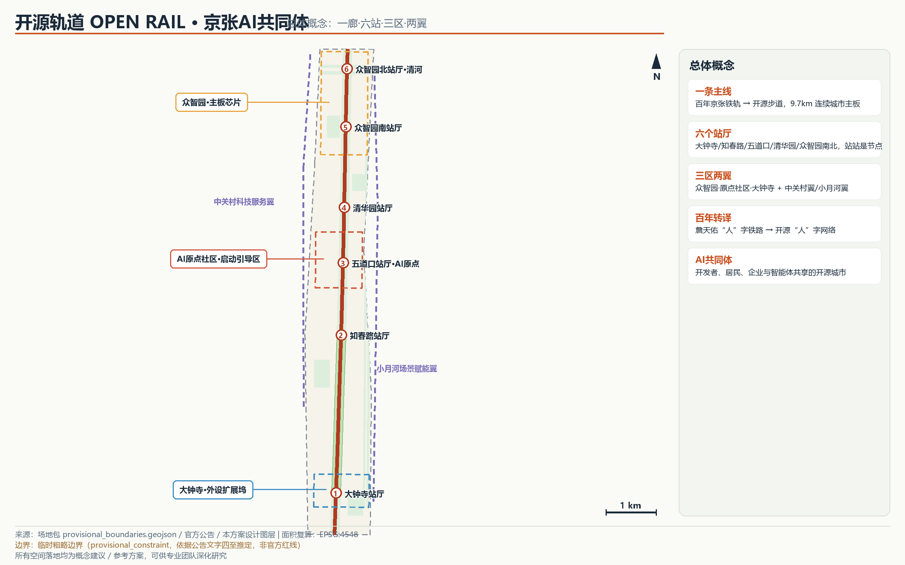
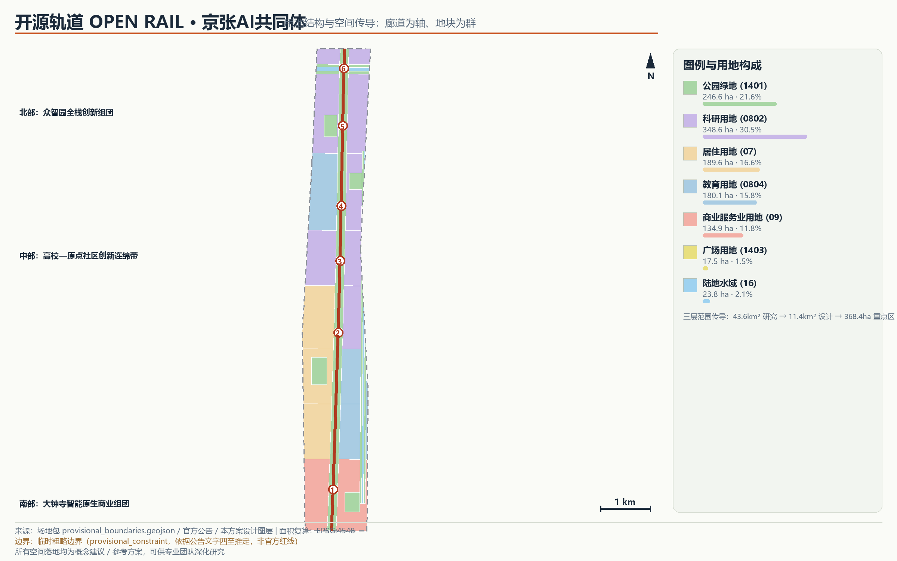
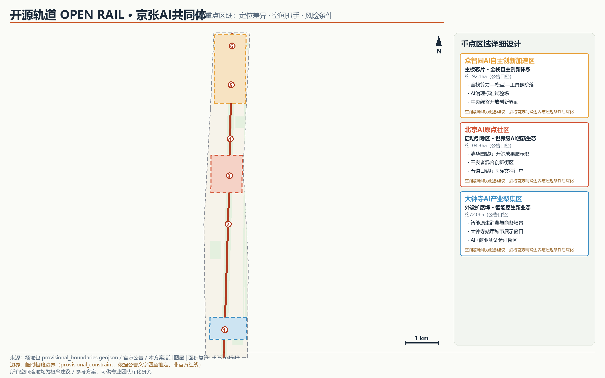
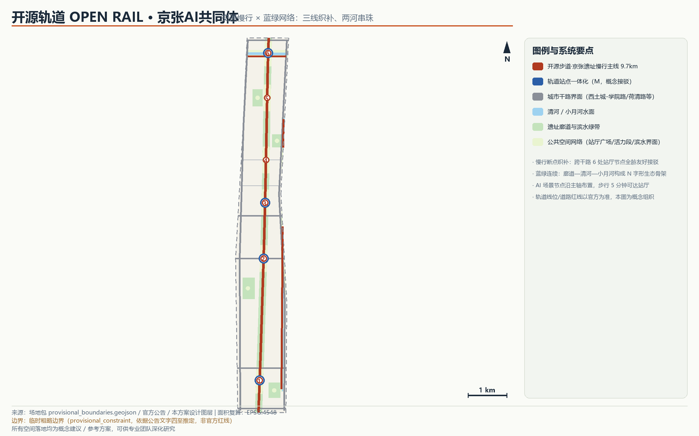
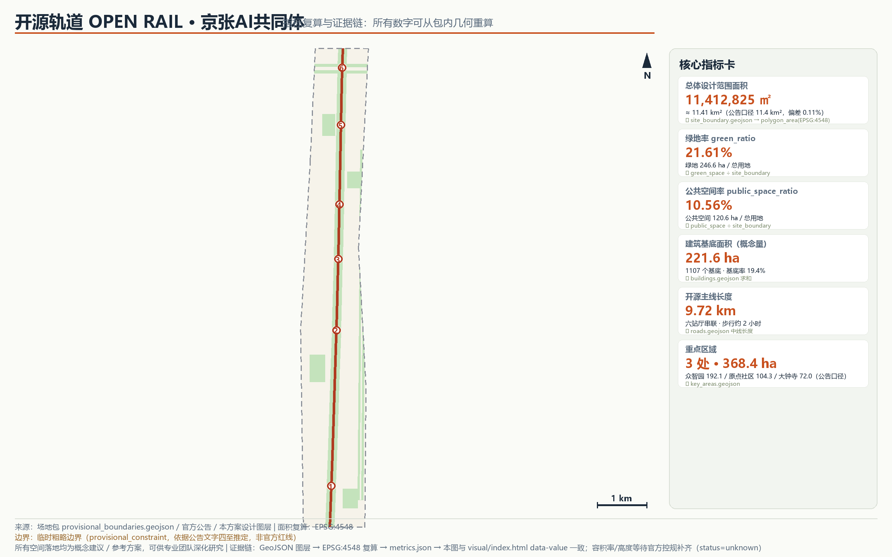

# 开源轨道 OPEN RAIL：京张AI共同体城市设计方案

> **概念声明**：本方案全部空间落地、活动运营、品牌传播与政策机制内容均为“概念建议”“参考方案”或“可供专业团队深化研究”的开放共创建议，不替代正式规划，不构成政府审定结论。所有面积与比例均可从本包 GeoJSON 几何在 EPSG:4548 下复算；总体设计范围与三处重点区域使用临时粗略边界（provisional_constraint），正式官方边界发布后须整体复算。

## 设计依据与资料清单

本方案依据四类资料形成：第一权威依据是北京市规划和自然资源委员会海淀分局发布的征集资格预审公告，它确定了项目目的、三层范围与面积口径 [source:OFFICIAL-ANNOUNCEMENT]；其次是仓库公开场地包，提供结构化任务书、范围层级、枚举与校验规则 [source:SITE-PACKAGE]；第三是面向智能体的任务书摘录，规定十条共创原则、三大定位、五大功能、三区两翼与六项必答任务 [source:AGENT-TASKBOOK]；第四是公开背景资料，包括京张铁路遗址公园与清华园车站旧址的公开信息，仅用于文化叙事背景，不作空间控制依据 [source:JINGZHANG-HERITAGE-PARK]。

资料可用性经公开资料登记表逐项核对：本方案不使用任何 background_only 资料支撑空间结论，不使用任何非公开或来源不清的数据 [source:SOURCE-REGISTRY]。因官方精确红线尚未公开，总体设计范围与三处重点区域采用仓库提供的临时粗略边界，其推定方法与精度限制完整披露于三层范围工作框架一节 [source:BOUNDARY-SOURCE]。完整的来源、指标、标准、设计深度与任务覆盖索引分别记录于 `sources.json`、`metrics.json`、`compliance_matrix.json`、`standard_matrix.json` 与 `design_depth_matrix.json`，正文只保留紧贴判断的关键引用。

主要资料缺口：官方精确边界与三处重点区域精确 polygon、现行控制性详细规划控制指标、现状建筑与权属底数、市政承载力资料。上述缺口已登记为待补条件，相应章节以“待正式数据补齐”标注，不以推测值冒充 [depth:existing_conditions_diagnosis]。

## 三层范围工作框架

三层范围按公告口径逐级落实：统筹研究范围约 43.6 平方公里（北至北五环路、东至京藏高速、南至西直门外大街、西至万泉河路），承担产业与未来城市研究；总体设计范围约 11.4 平方公里，承担城市更新与控规深度城市设计；重点区域范围约 368.4 公顷，自北向南为众智园 AI 自主创新加速区（约 192.1 公顷）、北京 AI 原点社区（约 104.3 公顷）、大钟寺 AI 产业聚集区（约 72.0 公顷），承担详细设计 [source:OFFICIAL-ANNOUNCEMENT] [depth:three_level_scope_framework]。

本包提交的设计边界复算面积为 11,412,825 平方米，与公告 11.4 平方公里口径偏差约 0.11%；三处重点区域临时几何复算分别为 192.9、104.3、72.0 公顷，与公告口径的偏差均小于 0.5% [metric:site_area_sqm] [data:geometry/site_boundary.geojson#SITE-001]。

**临时边界披露**：由于官方精确红线尚未随公开资料发布，本方案全部几何基于 `provisional_boundaries.geojson`（provisional_rough，依据公告文字四至与面积约束推定）。它不是官方红线，不能用于审批、精确面积认定或工程依据；本方案中由其派生的用地、绿地、公共空间、建筑基底与全部指标均为临时设计模型值。官方边界发布后需要重算的内容包括：全部用地分区、绿地与公共空间图层、三项核心指标、建筑基底统计与图纸，重算路径已在 `assumptions.json`（A-BOUNDARY-002）登记 [source:BOUNDARY-SOURCE]。

三层传导逻辑：统筹研究范围回答“产业往哪里去、城市形态怎么变”；总体设计范围把产业战略翻译成空间结构、用地布局与系统组织；重点区域把结构落到可识别的公共节点与更新项目。概念性空间结构“一廊·六站·三区·两翼”在总体设计范围层面展开，详见后续章节 [depth:overall_spatial_structure]。

## 统筹研究范围产业与未来城市研究

### 总体概念：开源轨道 OPEN RAIL

一百年前，詹天佑以“人”字形铁路解决八达岭爬坡难题，京张铁路成为中国人自主设计建造的第一条干线铁路；一百年后，同一条走廊面对新的“坡度”——AI 时代的创新要素如何在城市中高效流动 [source:JINGZHANG-HERITAGE-PARK]。本方案提出总体概念**“开源轨道 OPEN RAIL：京张 AI 共同体”**：把 9.7 公里遗址廊道视为一块连续的城市主板，铁轨是数据与慢行总线，车站是算力与社区节点，三处重点区域是主板上的功能芯片，把整个创新带组织成一个所有开发者、居民、企业与智能体都可以“提交贡献”的开源城市 [source:AGENT-TASKBOOK]。

**命名体系**：总名称“开源轨道 OPEN RAIL”，中文副名“京张 AI 共同体”；空间序列采用“主线—站厅—院落”三级命名：开源主线（Open Rail Spine）、六座站厅（大钟寺、知春路、五道口·AI原点、清华园、众智园南、众智园北）、以及分布在三区的创新院落。命名刻意复用开源软件语汇——主线（mainline）、站厅（station hall）、提交（commit）、合并（merge），使百年工程文脉与当代开发者文化在同一套语言中相遇。

**视觉识别与 Logo 方向**（概念建议）：Logo 以铁轨“人”字叉形与电路走线的同构图形为核心符号——两条铁轨线在人字岔口汇成一条电路迹线，寓意“工程智慧汇入开源智能”。主色为铁轨橙红（heritage rust）与电路青绿（circuit teal），辅助色为玄武岩灰；字体建议使用可自由商用授权的开源字体（如思源黑体类），全部视觉元素须原创绘制并完成清权，不使用任何第三方商标、人物肖像或版权素材 [source:AGENT-TASKBOOK]。

### 三大定位、五大功能与三区两翼协同回路

三大定位（百年京张文化带、都市 AI 生活体验带、AI 融合创新带）在本方案中被组织为一条“时间轴上的三重唱”：文化带回答“从哪里来”，由遗址廊道与清华园车站叙事承载；生活体验带回答“如何被感知”，由六站厅与 AI+ 场景网络承载；融合创新带回答“向哪里去”，由三区两翼的产业生态承载。五大功能逐项落位：AI 全栈自主创新体系落位众智园；世界级 AI 创新生态落位 AI 原点社区；AI+ 场景赋能新范式沿主轴与小月河翼展开；智能化 AI 活力城市体现在全域慢行与公共空间网络；AI 治理全球话语权依托众智园治理试验场与开源治理机制 [source:AGENT-TASKBOOK]。

三区两翼协同回路（概念建议）：众智园（主板芯片）产出技术、标准与治理工具；AI 原点社区（启动引导区）完成技术的产品化、展示与人才导入；大钟寺（外设扩展坞）实现消费级应用与商业变现；中关村科技服务翼提供资本、法务与全球要素配置；小月河场景赋能翼提供生活化测试场景。回流机制：商业收益与数据洞察经小月河翼回到研发端，形成“研发—孵化—应用—反馈”的闭环。

### 全球 AI 创新生态案例研究（6 个）

以下案例用于提炼可转化的生态机制，均为公开通识研究，具体数据以各案例官方发布为准 [source:GLOBAL-AI-ECOSYSTEM-CASES]：

1. **硅谷门洛帕克—帕洛阿尔托走廊（美国）**：铁路走廊串联高校、实验室与风险资本，启示“走廊即生态”——京张廊道可同样承担要素流动主干。可转化机制：沿主轴布局展示、投融资对接与人才交往界面。
2. **肯德尔广场（剑桥，美国）**：MIT 校区与城市更新地块深度融合，形成“大学—企业—公共空间”三明治结构。可转化机制：AI 原点社区的高校界面与院落式研发空间。
3. **Station F（巴黎，法国）**：由历史车站建筑改造的全球最大创业园区，证明“交通遗产+创业生态”的强叙事力。可转化机制：清华园站厅的开源成果展示廊概念。
4. **慕尼黑工业大学加兴—市中心创新廊道（德国）**：地铁线串联校区、研究机构与企业总部，以轨道交通时间定义创新协作半径。可转化机制：以轨道站点一体化组织六站厅创新服务。
5. **深圳南山粤海街道（中国深圳）**：高密度混合城区内嵌测试场景与工程化能力，形成“楼下测试、楼上研发”的快速迭代环境。可转化机制：大钟寺智能原生商业街区与测试验证场景。
6. **上海张江科学城（中国上海）**：以大科学装置为核心组织创新生态与城市配套，强调“科学—产业—城市”三位一体。可转化机制：众智园全栈体系与中央绿谷开放界面。

### AI 创新生态图谱（概念建议）

生态图谱以「要素—空间—机制」三列矩阵组织八大创新要素，回应任务书 agent.2 的生态图谱必答项 [source:AGENT-TASKBOOK]：

| 创新要素 | 空间落位 | 生态机制（概念建议） |
|----------|----------|----------------------|
| 土地与空间 | 三区院落式研发地块 | 模块化基底弹性供给，主板—引导区—外设分工避免同质竞争 |
| 产业 | 众智园（全栈）→ 原点社区（产品化）→ 大钟寺（消费级） | 研发—孵化—应用三级传导 |
| 资金 | 中关村科技服务翼 | 投融资对接界面与全球要素配置 |
| 人才 | 原点社区青年公寓与高校界面 | 校城实习转化通道与国际开发者社区 |
| 算力 | 六站厅端侧算力节点 | 开放测试协议，边缘算力进公园 |
| 数据 | 站厅合规数据沙箱（概念） | 公开数据优先，个人数据不出设备 |
| 场景 | 小月河翼与主轴开放实验场 | 年度场景开放清单与测试规范 |
| 治理 | 众智园治理试验场 | 算法备案与影响评估公开试验 |

图谱读法：横向看，每行要素均有明确空间锚点与机制出口，避免要素清单化；纵向看，三区两翼不是并列标签，而是「产出—转化—反哺」循环——大钟寺消费级洞察与小月河场景数据回流众智园研发端 [source:GLOBAL-AI-ECOSYSTEM-CASES]。要素—空间映射的完整机器索引见合规矩阵与用地图层 [data:geometry/land_use.geojson#LU-001] [depth:overall_spatial_structure]。

## 总体设计范围城市更新与控规深度城市设计

### 空间结构：一廊·六站·三区·两翼

总体设计范围的空间结构概括为“一廊·六站·三区·两翼”（概念建议）。一廊：京张遗址公园·开源主线廊道，宽 180 米、长 9.7 公里，是连续公园绿地、慢行主线与文化展廊的复合体 [data:geometry/green_space.geojson#GREEN-001] [metric:spine_length_m]。六站：六座站厅级公共节点，间距 800—2200 米，每座站厅都是“轨道接驳+公共广场+AI 场景入口”的复合节点。三区：众智园、AI 原点社区、大钟寺三处重点区。两翼：西侧中关村科技服务翼与东侧小月河场景赋能翼 [depth:overall_spatial_structure]。

### 用地布局与更新框架

用地布局遵循“廊道优先、混合适度、高校联动”原则（概念建议）：科研用地约 348.6 公顷（30.5%）沿主轴两侧与三重点区集聚；居住用地约 189.6 公顷（16.6%）保留于中部成熟社区并作渐进式更新；教育用地约 180.1 公顷（15.8%）强化北邮、北航、清华东路沿线高校界面；商业服务业用地约 134.9 公顷（11.8%）集中于大钟寺与五道口；公园绿地约 246.6 公顷（21.6%），绿地率 21.61% [metric:green_ratio] [depth:land_use_layout]。

城市更新总体框架（参考方案）：以“留改拆”分类的渐进更新为主——中部居住片区以保留修缮与功能织补为主；高校界面以改造利用与界面开放为主；三处重点区以新建与改建结合为主。由于缺少现状建筑底数与权属资料，具体地块的拆改留分类仅为方向性判断，待正式数据补齐后由专业机构核定 [depth:retain_renovate_demolish]。

### 创新指标体系（概念建议）

建议创新带的特色指标包括：绿地率（当前设计模型值 21.61%）、公共空间率（10.56%）、开源步道贯通率（目标 100%）、站厅 5 分钟步行覆盖率、AI 场景开放数量、年度开源活动场次 [metric:public_space_ratio]。产业类指标（产值、企业数、人才数）依赖官方统计口径，本方案不作数值承诺，仅提出指标框架供专业团队深化。

### 京张遗址公园活力带

遗址公园活力带是本结构的脊柱：北起清河、南至西直门外大街，全线贯通步行与骑行，沿线布置开源成果展示、AI 场景测试、文化展演与日常休闲功能。活力带向东西两侧通过六座站厅与八条城市干路接口“缝合”被铁路历史分割的街区 [depth:blue_green_public_space]。

### 城市风貌

风貌控制概念建议：廊道以“工业遗产+自然野趣”为基调，保留铁轨、枕木、号志等工业元素；高校界面以学院红砖与现代玻璃的对话为基调；大钟寺以都市商业的现代界面为基调。建筑高度、体量与屋顶形态的具体控制值属法定控规内容，本方案不作数值判断，仅提出风貌分区意向 [depth:height_massing_character]。

## 重点区域详细设计

### 众智园 AI 自主创新加速区（约 192.1 公顷）——“主板芯片”

定位：AI 全栈自主创新体系与 AI 治理全球话语权的核心承载区 [source:AGENT-TASKBOOK]。空间结构（概念建议）：以中央绿谷为开放创新界面，两侧布置算力—模型—工具链三类研发院落，院落以 60×40 米模块化基底组合，形成可灵活分割的弹性供给 [data:geometry/key_areas.geojson#PROV-KEY-001]。建筑更新以新建研发院落为主，概念性建筑基底布局见 buildings 图层。交通慢行：众智园南、北两座站厅分别服务南部院落群与清河门户，区内组织无人配送低速测试环线（概念）。公共空间：中央绿谷兼作开放发布与黑客马拉松场地。AI 场景：AI 治理标准试验场、端侧算力节点公开测试。实施风险：边界为临时推定，须待官方精确边界与控规条件；建设强度待确认 [depth:three_key_area_detailed_design]。

### 北京 AI 原点社区（约 104.3 公顷）——“启动引导区”

定位：世界级 AI 创新生态的展示窗口与人才导入门户。空间结构（概念建议）：以清华园站厅为核心组织“一核两街”——清华园站厅·开源成果展示廊（概念）承载 AI 朝圣地标功能；五道口站厅组织国际交往与开发者服务；中部混合创新街区提供“楼下测试、楼上研发”的复合空间 [data:geometry/key_areas.geojson#PROV-KEY-002]。建筑更新：以改建利用与插建混合院落为主。交通慢行：五道口、清华园两站厅衔接成府路与清华东路，织补高校—社区慢行断点。公共空间：开源成果展示廊、开发者广场与AI原点纪念节点。AI 场景：AI+ 教育（高校联动）、AI 文化导览。实施风险：清华园车站旧址文物保护要求须以文物部门正式公布为准，任何建设活动不得触碰保护红线 [source:QINGHUAYUAN-STATION-HERITAGE]。

### 大钟寺 AI 产业聚集区（约 72.0 公顷）——“外设扩展坞”

定位：智能原生新业态与 AI+ 商业的消费级应用区。空间结构（概念建议）：依托大钟寺站厅形成“一港两街”——城市展示窗口与智能原生消费街区，组织 AI+ 商业、机器人服务与数字消费测试场景 [data:geometry/key_areas.geojson#PROV-KEY-003]。建筑更新：以既有商业空间的功能置换与改造为主，新建体量谨慎。交通慢行：大钟寺站厅衔接北三环与西直门外大街方向，是全域的南门户。公共空间：门户绿廊与站前展演广场。AI 场景：AI+ 商业测试验证街区、机器人导览与配送。实施风险：权属复杂、改造主体多元，须以协商式更新推进，本方案不提供地块级拆改结论 [depth:three_key_area_detailed_design]。

## AI 创新生态、人才画像与 AI+ 场景

### 五类用户画像

1. **AI 研究员/工程师**（25—40 岁，就职于研发院落与高校实验室）：需要弹性研发空间、24 小时算力服务、跨机构交流界面与高品质第三空间。
2. **开发者/创业者**（22—35 岁，初创团队与自由开发者）：需要低成本测试场景、开源展示机会、投融资对接与国际化社区氛围。
3. **高校师生**（18—30 岁，北邮、北航等高校）：需要校城共享的实验设施、实习转化通道与青年友好的公共活动场地。
4. **在地居民**（全龄，中部成熟社区）：需要日常慢行安全、滨水与公园可达性、社区公共服务提升与更新过程的知情参与。
5. **访客/城市观察者**（国内外游客、考察团、媒体）：需要可读的文化叙事、标志性公共节点与便捷的导览服务。

### AI+ 场景卡（12 张）

以下场景卡均为概念建议，运行数据以公开或授权数据为限，涉及个人信息处理的一律设置隐私边界与人工复核机制 [source:AGENT-TASKBOOK]：

| # | 场景卡 | 空间落位 | 服务对象 | 数据与隐私边界 | 运营主体（概念） |
|---|--------|----------|----------|----------------|------------------|
| 1 | AI+交通慢行评估：识别慢行断点与接驳缺口 | 全域慢行网络 | 居民/通勤者 | 公开道路资料+授权反馈，不采集个人轨迹 | 城市运营团队 |
| 2 | AI 文化导览：京张百年叙事智能讲解 | 开源主线全线 | 访客/学生 | 公开文化资料，无个人数据 | 文化运营团队 |
| 3 | AI 健康服务导航：社区医疗与健身设施引导 | 中部社区与公园 | 居民 | 公开设施数据，健康数据不出个人设备 | 社区服务中心 |
| 4 | 企业服务副驾：政策/场景/合规一站式导航 | 众智园与原点社区 | 企业/团队 | 公开政策库，企业数据授权使用 | 园区服务平台 |
| 5 | 公共安全事件复盘：公开事件联合演练 | 站厅与广场 | 治理部门/公众 | 公开事件资料，人工复核后发布 | 城市治理团队 |
| 6 | 机器人低速配送测试 | 众智园测试环线 | 商户/居民 | 限定封闭/半封闭路段，限速可监管 | 园区+企业联合 |
| 7 | AI+教育开放课堂：高校课程进公园 | 清华园站厅 | 师生/公众 | 公开课程资源 | 高校+社区 |
| 8 | AI+商业智能导购与无障碍导购 | 大钟寺街区 | 消费者 | 公开商户数据，无强制人脸采集 | 商业运营方 |
| 9 | 端侧算力节点公开测试 | 六站厅 | 开发者 | 开放测试协议，数据本地处理 | 基础设施运营方 |
| 10 | 智慧公园养护：植被与设施巡检 | 廊道与滨水绿带 | 养护部门 | 公开环境数据 | 公园管理方 |
| 11 | **测试验证：开放街道自动驾驶接驳小巴** | 大钟寺—知春路段（概念） | 通勤者 | 限定路段、限速、安全员、可接管 | 专业测试机构 |
| 12 | **测试验证：AI 治理沙箱——算法备案与影响评估公开试验** | 众智园治理试验场 | 企业/研究者 | 公开评估框架，人工复核 | 治理研究机构 |

其中第 6、11、12 为 AI 产业测试验证场景（不少于 3 个），均须取得主管部门许可后方可实施，本方案不将其表述为已批准运营。场景—空间—运营映射：每张场景卡对应站厅或廊道节点（见 `geometry/public_space.geojson`）、明确的数据边界与运营主体，场景开放机制接入第六节长期运营体系 [source:AGENT-TASKBOOK]。

## 用地、建筑规模与拆改留方案

用地布局（概念建议）以 land_use 图层为准：七类用地无缝覆盖全部设计范围，用地分类采用可校验的国标分类码，不使用自造分类 [standard:MNR-LAND-USE-CLASSIFICATION-GUIDE] [data:geometry/land_use.geojson#LU-001]。概念性建筑基底 1107 个、合计约 221.6 万平方米，基底率约 19.4%，该数字仅表达空间供给量级，不代表审批方案或现状建筑 [metric:building_footprint_area_sqm]。

建筑规模与开发强度：容积率、建筑高度与建筑强度属法定控规内容，公开资料不可得，本方案统一记为待确认（metrics 中 `status=unknown`），不给出任何数值判断 [depth:development_intensity_controls]。拆改留方案：中部居住片区以“留”为主，高校界面以“改”为主，三处重点区“留改拆”结合但具体分类待现状建筑底数与权属资料补齐后核定，本方案不输出地块级拆改结论 [depth:retain_renovate_demolish]。

空间供给与运营策略（概念建议）：研发院落采用模块化基底组合以适应团队规模变化；大钟寺以既有商业空间功能置换减少大拆大建；居住区更新以加装电梯、口袋公园与慢行织补等轻量手法为主。

## 交通、轨道、市政与公共服务设施

交通组织（概念建议）：对外依靠北三环、北四环、北五环、学院路—西土城路、荷清路—大钟寺东路等干路界面；内部以开源步道慢行主线为骨架，六座站厅织补被廊道分割的东西向联系，形成“一站厅一接口”的慢行网络 [data:geometry/roads.geojson#ROAD-010] [depth:traffic_rail_slow_parking]。

轨道站点一体化：大钟寺、知春路、五道口、上地方向站点与站厅节点概念接驳，站厅 800 米覆盖主要研发与居住片区；轨道线位与站点设置以官方为准，本方案不作工程判断。停车与非机动车：站厅节点配置非机动车停放与共享出行换乘，机动车停车供给指标待控规条件。

市政与新型基础设施（概念建议）：传统市政设施改造与承载力核算待官方资料；新型基础设施提出“端侧算力节点进公园”概念——在六站厅布置边缘算力与开放 Wi-Fi/定位服务，支撑 AI 场景测试；分布式能源与海绵设施结合滨水绿带统筹 [depth:municipal_new_infrastructure]。

公共服务设施：结合五类画像配置青年公寓与创客服务（原点社区）、社区医疗与养老驿站（中部居住区）、国际学校和科普场馆（高校界面）、文化展演设施（廊道与站厅），具体规模与布局待专项深化。

## 蓝绿空间、公共空间与城市风貌

蓝绿系统（概念建议）：开源主线廊道（约 156.7 万平方米公园绿地）与清河、小月河滨水绿带构成“N”字形生态骨架，四个社区公园补全 500 米服务半径，绿地率设计模型值 21.61% [metric:green_ratio] [data:geometry/green_space.geojson#GREEN-001]。公共空间系统：六座站厅广场、六段廊道公共活力段、滨水公共开放空间与五处口袋广场，公共空间率 10.56%；绿地与公共空间的复合利用关系已在假设中说明，两指标不相加 [metric:public_space_ratio]。

城市风貌：以“遗产锈色+电路青绿”为全域色彩线索，导视与标识系统复用 Logo 的人字—电路符号；高校界面鼓励学院材料的当代表达；廊道内新增建构筑物以小尺度服务亭为主，让位于铁轨与植被 [depth:blue_green_public_space]。

### AI 朝圣地标与荣誉展示体系（4 处，概念建议）

1. **开发者散步道（开源主线全线）**：铁轨步道镶嵌开源里程碑地刻，记录全球 AI 开源大事记，步行即阅读。
2. **智能体贡献荣誉墙（清华园站厅）**：为参与城市共创的智能体与人类贡献者设立可持续更新的荣誉墙，镌刻 GitHub ID 与 Agent 名称——本项目自身即为第一块铭牌的候选。
3. **开源成果展示廊（清华园站厅站房概念改造）**：以年度策展方式展示当年最具影响的 AI 开源成果，与高校课程联动。
4. **AI 原点纪念碑（五道口站厅广场）**：标记“北京 AI 原点”的空间坐标，成为行业聚会与年度发布的默认背景。

地标均不涉及文保红线内的实体改造，清华园站房相关内容仅为概念意向，须以文物部门要求为准 [source:QINGHUAYUAN-STATION-HERITAGE]。地标与导视设计避免过度娱乐化，保持工程纪念的克制气质 [source:AGENT-TASKBOOK]。

### 公共空间组件库（概念建议）

为支撑站厅、廊道与口袋广场的统一品质与可维护性，本方案提出十类可组合的公共空间组件（component library），全部组件为原创概念设计，复用 OPEN RAIL 视觉系统的人字—电路符号语言 [source:AGENT-TASKBOOK]：

| 组件 | 类型 | 落位优先级 | 功能 |
|------|------|-----------|------|
| 开源里程碑地刻 | 文化叙事 | 主线全线 | 开发者散步道纪事系统 |
| 智能体荣誉铭牌 | 荣誉展示 | 站厅墙面 | 贡献者可持续更新铭牌 |
| 轨迹服务亭 | 服务设施 | 六站厅 | 导览、Wi-Fi 与端侧算力接入 |
| 模块化座椅组 | 街具 | 廊道活力段 | 可重组的停留界面 |
| 轨缘灯带 | 照明 | 铁轨两侧 | 遗产要素夜间安全与叙事 |
| 雨水花园模块 | 生态设施 | 滨水绿带 | 海绵设施与科普界面 |
| 场景测试桩 | 新基建 | 测试路段 | 传感器供电与数据接口 |
| 导视塔 | 标识系统 | 站厅入口 | 三层范围导航与场景入口索引 |
| 临时展亭 | 活动设施 | 站厅广场 | 四季活动弹性载体 |
| 无障碍通行带 | 通用设计 | 全域慢行 | 全龄友好与轮椅通行 |

组件配置规则（概念建议）：组件按「站厅高配、廊道标配、口袋广场轻配」三级配置，选型与数量以专业深化为准 [data:geometry/public_space.geojson#PUBLIC-001]；涉及文保地段的组件仅采用可逆安装方式 [source:QINGHUAYUAN-STATION-HERITAGE]；所有组件为概念建议，供专业团队深化研究 [depth:blue_green_public_space]。

## 更新项目清单、实施政策与分期计划

更新项目清单（概念建议，均为参考方案）：①开源主线贯通工程（步道、骑行、标识）；②六站厅公共节点提升；③清华园站厅展示廊概念改造；④中央绿谷开放创新界面；⑤大钟寺智能原生商业街区更新；⑥中部居住区渐进更新与口袋公园；⑦清河—小月河滨水绿带连通；⑧端侧算力节点与新型基础设施示范 [data:geometry/phasing.geojson#PHASE-001] [depth:renewal_project_list]。

分期计划（概念建议）：近期（2026—2029）完成主线南段、AI 原点社区与大钟寺门户，树立可读性最强的示范段；中期（2029—2032）推进廊道北段与众智园南片；远期（2032—2035）完成众智园北片与清河滨水门户。时序仅为建议，实施主体、资金安排与审批程序以正式决策为准 [depth:phasing_implementation]。

### 全球 AI 创新活动体系与长期运营（概念建议）

年度活动体系：春季“开源轨道大会”（主论坛+开发者集市）、夏季“AI 城市测试季”（场景开放+测试验证公示）、秋季“京张百年文化季”（遗址展演+高校联动）、冬季“智能体贡献年会”（荣誉墙更新+年度开源成果发布）。品牌与传播：活动统一使用 OPEN RAIL 视觉体系，国际传播以“From the first Chinese-built railway to the first open-source city”为叙事主线。开发者社区运营：以 GitHub 为主要协作界面，延续本次开源征集的 PR/Issue 机制形成常态化城市共创；场景开放运营：每年发布场景开放清单与测试规范；招引转化：活动—测试—落地的三级转化通道，具体政策与资金安排不作承诺 [source:AGENT-TASKBOOK]。

## 指标体系、面积复算与合规矩阵

核心指标均可从包内几何复算：总体设计范围面积 11,412,825 平方米（EPSG:4548）；绿地率 21.61%（绿地 246.6 公顷 ÷ 总用地）；公共空间率 10.56%（公共空间 120.6 公顷 ÷ 总用地）；概念性建筑基底约 221.6 万平方米；开源主线长 9.72 公里；三处重点区域复算面积 192.9/104.3/72.0 公顷 [metric:site_area_sqm] [metric:green_ratio] [metric:public_space_ratio]。

指标的设计含义：绿地率支撑“AI 人才向往的高品质城区”——研发院落 500 米见绿；公共空间率支撑创新交往——每个站厅都是可停留的第三空间；建筑基底率约 19.4% 表达“高密度智力活动与宽松绿色基底并存”的供给结构 [depth:metrics_recalculation]。

合规覆盖：公告 1.3、1.4、1.5 各条与 agent.1—agent.6 六项任务的响应关系完整记录于 `compliance_matrix.json`；专业标准响应记录于 `standard_matrix.json`（城市设计、控规深度区分、用地分类等）；设计深度证据记录于 `design_depth_matrix.json`，15 个深度项均为 complete（受官方数据限制的项以 completeness_limited_by 披露）。容积率与建筑高度等指标因官方控制条件未公开保持 unknown 并说明原因 [standard:MOHURD-CONTROL-DETAILED-PLANNING]。

## 风险、版权与合规说明

资料与合规风险：①临时边界风险——全部几何与指标为临时设计模型值，官方数据发布后须整体复算；②控规缺口风险——强度、高度、拆改留一律待确认，不以推测值冒充；③文保风险——清华园车站旧址相关内容仅为概念，须服从文物保护要求；④实施风险——分期与项目清单为建议，不作政府承诺 [depth:risk_missing_data]。

版权与生成责任：本方案文本、几何图层、图件与展示页由 AI 智能体生成，全部基于公开或已清权资料；图件为程序绘制的原创示意图，未使用第三方地图截图、商标、肖像或版权素材；字体使用系统随附字体仅用于本地渲染，不随包分发。详细声明见 `report/copyright_statement.md`。AI 生成内容的事实、引用与最终表达由提交作者负责 [source:AGENT-TASKBOOK]。

隐私与伦理：场景卡涉及个人信息的一律设置数据不出设备、授权使用与人工复核边界；测试验证场景须取得主管部门许可；本方案不包含任何过度监控或无法人工复核的场景设计。

## 参考资料

以下书目为真正影响本方案判断的主要材料 [source:OFFICIAL-ANNOUNCEMENT] [source:SITE-PACKAGE] [source:AGENT-TASKBOOK]；完整机器索引以 `sources.json` 和三个矩阵文件为准。

1. 北京市规划和自然资源委员会海淀分局：《百年京张AI创新带城市设计国际方案征集资格预审公告》，2026 年 5 月 [source:OFFICIAL-ANNOUNCEMENT]。
2. 海淀·百年京张 AI 创新带开源征集仓库：公开场地包（design_brief.json、agent_taskbook.json、provisional_boundaries.geojson、standards），open-city-ai/haidian [source:SITE-PACKAGE]。
3. 面向全球智能体的开源征集任务书摘录（agent_taskbook.json 及其本地参考文本）[source:AGENT-TASKBOOK]。
4. 北京市文物局：清华园车站旧址文物保护公开信息 [source:QINGHUAYUAN-STATION-HERITAGE]。
5. 京张铁路遗址公园公开建设报道与发布资料（北京市、海淀区公开发布）[source:JINGZHANG-HERITAGE-PARK]。
6. 北京市公共数据开放平台：人口、交通、公共设施公开统计口径（背景参照）[source:BEIJING-OPEN-DATA]。
7. 全球 AI 创新生态公开案例通识研究：硅谷走廊、肯德尔广场、Station F、慕尼黑工大创新廊道、深圳南山、上海张江 [source:GLOBAL-AI-ECOSYSTEM-CASES]。
8. 住建部《城市设计管理办法》及城市设计、控规深度相关专业要求（仓库本地标准参考库）[standard:MOHURD-URBAN-DESIGN-MEASURES]。
