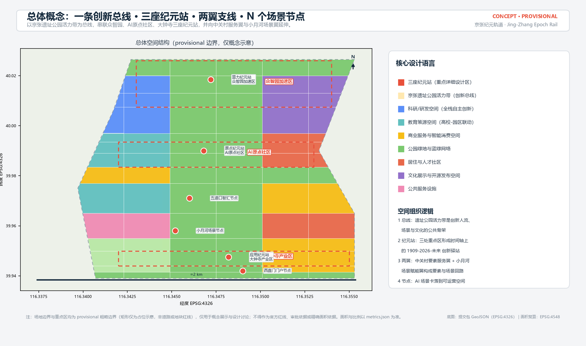
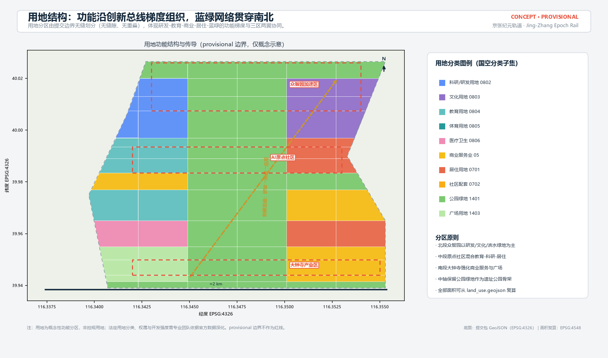
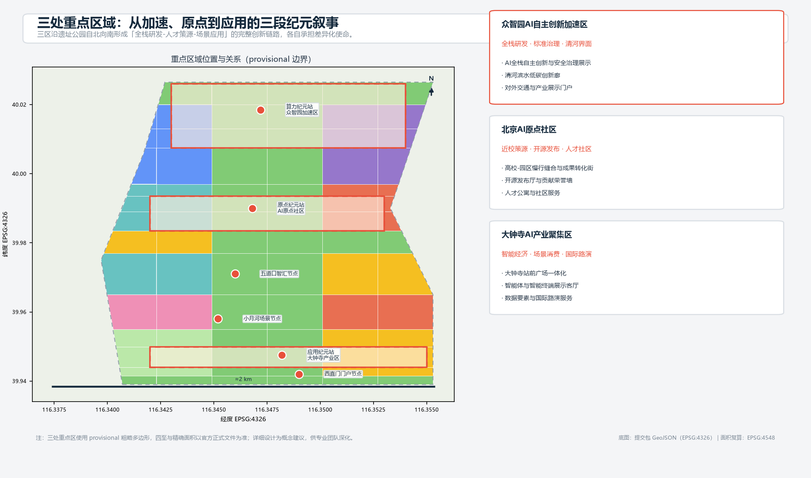
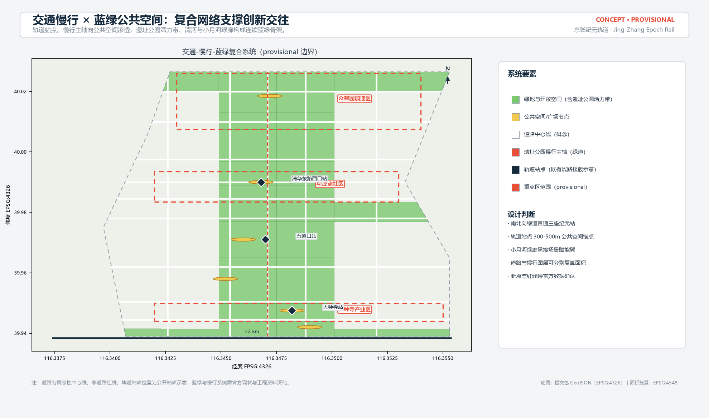
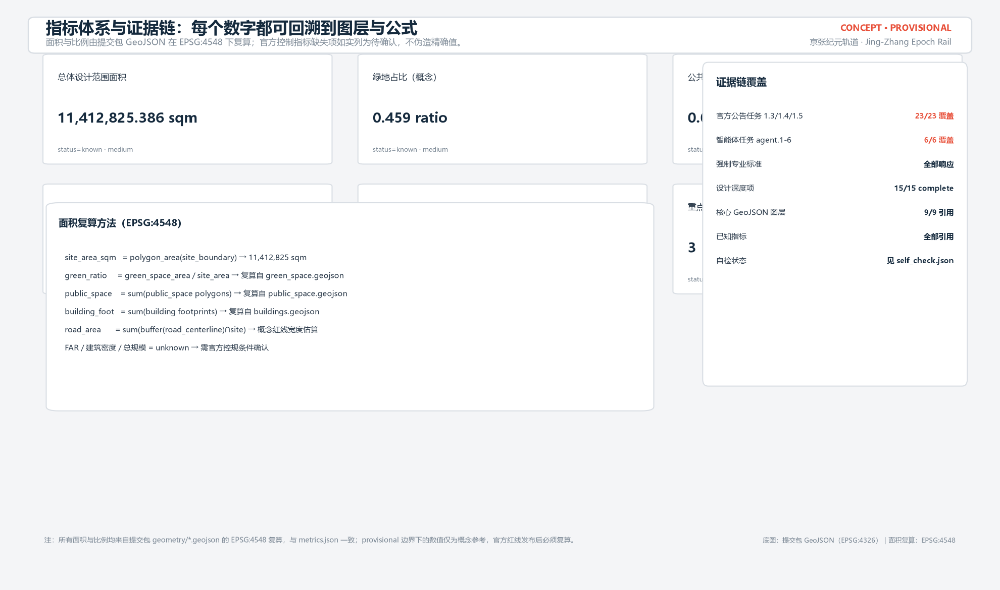

# 京张纪元轨道：百年京张AI创新带城市设计概念方案

## 设计依据与资料清单

本方案为 AI 智能体提交的 formal 城市设计概念成果，第一依据为北京市规划和自然资源委员会海淀分局发布的《百年京张AI创新带城市设计国际方案征集资格预审公告》（2026-05-09）[source:OFFICIAL-ANNOUNCEMENT]，任务结构依据面向智能体的开源征集任务书 [source:AGENT-TASKBOOK] 及其本地参考摘录，机器可读边界与约束依据 `brief/site-package/` 中的设计任务包 [source:SITE-PACKAGE]。生成前已读取 `design_brief.json`、`allowed_design_space.json`、`sources.json`、`enums/`、`ranges/`、`schemas/`、`data/source_registry.json` 与 `data/processed/agent_fact_pack.md` [source:PROCESSED-FACT-PACK]，并按 `project_scope_summary.csv`、`agent_task_requirements.csv`、`source_use_matrix.csv` 与 `missing_data_checklist.csv` 建立任务、范围、资料用途和缺口清单。

资料边界按 [source:SOURCE-REGISTRY] 区分：官方公告与任务书为 formal 可用来源；`provisional_boundaries.geojson` 仅登记为 provisional intake 线索 [source:BOUNDARY-SOURCE]，三处重点区临时多边形同源 [source:KEY-AREA-SOURCE]；背景与待补资料不得升级为法定控制或实施承诺。当前官方精确红线、三处重点区 official polygon、控规指标（容积率、建筑高度、建筑密度、绿地率、退线）与现状建筑/权属/市政工程资料均未随公开任务书提供，全部列为待补资料项 [depth:risk_missing_data]。

专业标准采用仓库本地参考快照：城市设计管理办法 [standard:MOHURD-URBAN-DESIGN-MEASURES]、控制性详细规划深度要求 [standard:MOHURD-CONTROL-DETAILED-PLANNING]、国土空间用地用海分类指南 [standard:MNR-LAND-USE-CLASSIFICATION-GUIDE]、建筑工程设计文件编制深度规定 [standard:MOHURD-ARCH-DESIGN-DEPTH-2016]，以及公告与任务书本身 [standard:PROJECT-OFFICIAL-ANNOUNCEMENT]、[standard:PROJECT-AGENT-OPEN-CALL-TASKBOOK]。本地参考状态以 `standards.json` 为准，缺官方文件的条目只作缺资料提醒，不作为已满足的权威依据。

提交包按「正文 ↔ 矩阵 ↔ GeoJSON ↔ 指标」四层证据链组织：`compliance_matrix.json` 覆盖公告 1.3/1.4/1.5 与 agent.1-agent.6 全部必选任务，`standard_matrix.json` 响应强制标准，`design_depth_matrix.json` 声明成果深度，`metrics.json` 承载由几何复算的指标，正文负责把设计判断讲清楚。边界状态为 provisional（`official_boundary=false`、`geometry_role="provisional_constraint"`），对应 [data:geometry/site_boundary.geojson#SITE-001]；官方红线发布后，site boundary、key areas、land use、buildings、roads、green space、public space、phasing 与全部指标必须复算。

## 三层范围工作框架

方案遵循公告确定的三层范围：统筹研究范围约 43.6 平方公里，负责 AI 产业生态、区域协同与未来城市形态研究；总体设计范围约 11.4 平方公里，负责城市更新总体框架、产业空间布局、交通市政支撑与风貌控制；重点区域范围约 368.4 公顷（三区合计），负责众智园、AI 原点社区、大钟寺的详细设计 [standard:PROJECT-OFFICIAL-ANNOUNCEMENT]。三层范围逐级传导，不互相割裂：统筹研究决定产业链与城市形态判断，总体设计把判断落到更新项目、空间结构与设施承载，重点区详细设计验证具体地块、建筑、交通、公共空间和 AI 应用的可实施性 [depth:three_level_scope_framework]。

总体设计范围采用 provisional 边界 [data:geometry/site_boundary.geojson#SITE-001]，三处重点区采用同源临时多边形 [data:geometry/key_areas.geojson#PROV-KEY-001]、[data:geometry/key_areas.geojson#PROV-KEY-002]、[data:geometry/key_areas.geojson#PROV-KEY-003]。本方案的面积、比例与图层覆盖均以此为计算范围，并在正文、HTML、图纸与自检结果中醒目标注：该边界不构成官方红线、审批依据或精确面积依据；官方 polygon 补齐后必须整体复算 [source:BOUNDARY-SOURCE]。组织方数据缺口本身不阻断内容评分，方案按「可讨论、可复核、可替换后重算」原则组织全部空间结论。

| 层级 | 设计问题 | 本方案回答 | 数据落点 |
| --- | --- | --- | --- |
| 统筹研究范围 | AI 产业生态与未来城市形态 | 「高校策源-开源协作-企业转化-场景验证-国际路演」创新链 | compliance/standard 矩阵 |
| 总体设计范围 | 产业空间、更新、交通市政、风貌 | 总线-纪元站-支线-节点空间结构 + 九类图层 | [data:geometry/land_use.geojson#LU-001]、[data:geometry/roads.geojson#ROAD-001] |
| 重点区域范围 | 三区详细设计 | 三座纪元站各自的定位、空间动作与实施依赖 | key_areas.geojson、A3/A0 图纸 |

## 统筹研究范围产业与未来城市研究

统筹研究范围的核心任务是构建世界级 AI 创新生态与适配 AI 新质生产力的未来城市形态 [standard:PROJECT-AGENT-OPEN-CALL-TASKBOOK]。本方案提出「京张纪元轨道（Jing-Zhang Epoch Rail，简称 JZ·EPOCH）」总体概念：把京张铁路遗址公园活力带作为贯穿南北的「创新总线」，把三处重点区组织为时间轴上的三座「纪元站」——众智园（算力纪元站：全栈研发、标准与安全治理）、AI 原点社区（原点纪元站：高校策源、开源发布与人才社区）、大钟寺（应用纪元站：智能经济、场景消费与国际路演）；中关村科技服务翼承担要素全球化配置与资本/服务赋能，小月河场景赋能翼承担 AI 场景测试与城市级体验落地 [source:AGENT-TASKBOOK]。

命名体系以「纪元」突出 1909 年京张铁路开创中国自主工程纪元的文脉，以「轨道」同时指向铁路遗址与 AI 数据轨道，形成可延展的系列命名（如纪元站、纪元节、纪元指数）。Logo 与视觉识别方向建议为「人」字形铁路道岔与电路走线融合的双轨符号：上方轨枕线象征百年铁轨，下方走线象征 AI 数据流，交汇点构成字母 E（Epoch/Engine/Excellence），便于在导视、活动与数字界面中统一延展 [depth:overall_spatial_structure]。视觉识别为概念建议，字体、图形均采用原创方向，不复制任何现有商标。

面向智能体任务书要求给出 5-8 个全球 AI 创新生态案例及可转化机制，本方案选取：硅谷高校-园区-资本联动、剑桥科技园成果转化机制、特拉维夫政府风险分担与国防成果转化、深圳南山全产业链协同、伦敦 King's Cross 站城一体更新、首尔数字媒体城场景开放、杭州未来科技城人才政策与场景招商 [source:AGENT-TASKBOOK]。这些案例转化为四条空间-运营机制：其一，高校策源就近孵化（原点社区对应剑桥/硅谷模式）；其二，产业空间按「研发-测试-展示」梯度供给（众智园对应南山模式）；其三，场景开放吸引企业落地（大钟寺与小月河对应首尔/杭州模式）；其四，站城一体化公共空间带动更新（对应 King's Cross 模式）[depth:existing_conditions_diagnosis]。

未来城市形态研究把 AI 交通、连续绿网、创新服务设施与国际化生活工作氛围落实到可定位的功能区、节点与廊道，而不是泛泛技术愿景 [standard:MOHURD-URBAN-DESIGN-MEASURES]。统筹研究范围为总体设计提供产业与功能传导依据，不新增伪精确红线；涉及区域协同（北纬社区、未来科学城、怀柔科学城、经开区及京津冀）仅作创新链与要素流动的方向性建议，不作法定规划结论。

## 总体设计范围城市更新与控规深度城市设计

总体设计范围要求达到控制性详细规划的城市设计深度 [standard:MOHURD-CONTROL-DETAILED-PLANNING]。本方案以「总线-纪元站-支线-节点」为总体空间结构：总线即京张遗址公园活力带；三座纪元站为产业与公共活动锚点；中关村服务翼、小月河场景翼为两条功能支线；场景节点（站前广场、慢行驿站、展示客厅等）构成日常运营网络 [depth:overall_spatial_structure]。空间结构在 [data:geometry/land_use.geojson#LU-001] 中以无缝分区表达，用地分区完整覆盖提交边界、无缝隙、无重叠，经 [depth:land_use_layout] 校核。

城市更新总体框架按「保留历史与轨道遗址、改造低效空间、更新门户节点、预留留白」四类策略组织 [depth:retain_renovate_demolish]：保留清华园车站旧址等历史文化要素与轨道遗址公共属性；改造高校周边、园区周边低效工业与老旧商务空间；更新大钟寺、西直门等门户节点；预留弹性留白应对产业迭代 [data:geometry/buildings.geojson#BLDG-001]。更新对象为概念性识别，未取得现状建筑与权属资料前，不给出具体地块拆改留结论。

产业目标与功能布局按三段纪元叙事组织：北段众智园聚焦全栈自主创新、标准制定与安全治理；中段原点社区聚焦近校策源、成果转化与人才服务；南段大钟寺聚焦智能经济、场景消费与国际交往。建筑规模、开发强度与高度体量：由于官方控规条件缺失，容积率、建筑密度、总建筑规模与建筑高度全部列为待确认项 [depth:development_intensity_controls]，本方案仅在图纸与 HTML 中给出「概念性体量示意」并明确其非法定性质 [depth:height_massing_character]。待补清单包括官方控规指标、道路红线、退线与市政容量，相关结论在 `assumptions.json` 中登记。

## 重点区域详细设计

三处重点区域均达到规划综合实施方案的城市设计深度要求 [depth:three_key_area_detailed_design]，并分别引用 [data:geometry/key_areas.geojson#PROV-KEY-001]、[data:geometry/key_areas.geojson#PROV-KEY-002]、[data:geometry/key_areas.geojson#PROV-KEY-003]。因官方 polygon 缺失，三区暂以 provisional 多边形表达，所有精确面积与四至均待官方边界确认后复算。

众智园AI自主创新加速区（算力纪元站）：定位为花园型全栈自主创新街区，空间动作包括强化清河滨水界面、组织对外交通与产业展示门户、以绿色空间承载开放测试与标准治理展示；AI 场景包括自主模型红队测试场、标准制定工作坊、安全治理展示厅与低碳算力体验点；实施风险为权属与现状建筑复杂，需先完成现状调查。

北京AI原点社区（原点纪元站）：定位为近校型成果转化与人才社区，空间动作包括组织高校-园区-街区慢行缝合、补足成果发布、人才服务、居住生活与开源协作空间；AI 场景包括开源发布厅、贡献荣誉墙、成果转化驿站与人才特区服务；实施风险为校区权属与科研数据授权边界，校园与园区联系需专项研究。

大钟寺AI产业聚集区（应用纪元站）：定位为城市型智能经济与国际交往街区，空间动作包括大钟寺站前广场一体化、路口四象限步行连通、商业服务与重点企业周边公共环境更新；AI 场景包括智能体与智能终端展示客厅、数据要素会客厅、国际路演厅；实施风险为轨道站区改造与地下空间条件需工程资料确认，相关结论仅作概念建议。

## AI 创新生态、人才画像与 AI+ 场景

AI 创新生态按「全栈自主创新体系、世界级创新生态、场景赋能新范式、智能化活力城市、AI 治理全球话语权」五大功能组织 [standard:PROJECT-AGENT-OPEN-CALL-TASKBOOK]，与三区两翼一一对应，并落到 [data:geometry/public_space.geojson#PUBLIC-001] 等公共空间图层 [depth:blue_green_public_space]。人才与服务需求按五类用户画像展开：开源开发者（需要发布、协作、测试与社区声誉空间）、初创团队（需要低成本办公、算力入口与产品试验场）、头部企业访客（需要展示、商务、国际接待与人才招聘空间）、周边居民（需要通勤、休闲、社区服务与低扰动更新）、高校师生（需要成果转化、跨校协作与日常慢行）。

方案提供不少于 10 张 AI 场景卡，均为概念设计并映射到空间、数据、隐私与运营边界：

| 场景卡 | 空间载体 | 服务对象 | 隐私与复核边界 |
| --- | --- | --- | --- |
| 01 开源发布厅 | 原点社区 | 开发者/初创团队 | 只做聚合统计，不采集个人行为轨迹 |
| 02 安全治理沙盒 | 众智园 | 企业/监管 | 测试数据需授权，结果人工复核 |
| 03 端侧算力驿站 | 总体范围节点 | 初创/居民 | 算力服务另行授权，不共享个人数据 |
| 04 AI慢行导航 | 遗址公园活力带 | 居民/访客 | 低侵入传感，仅输出拥挤与无障碍提示 |
| 05 大钟寺国际路演客厅 | 大钟寺 | 企业/国际访客 | 企业案例需清权，直播需另行授权 |
| 06 清河低碳创新廊 | 众智园临清河界面 | 企业/公众 | 展示数据为公开成果，不涉及隐私 |
| 07 近校成果转化街 | 原点社区 | 高校师生/初创 | 校园与科研成果数据需授权 |
| 08 数据要素会客厅 | 大钟寺 | 数据服务企业 | 数据流通以合规授权与审计为前提 |
| 09 AI生活服务样板街 | 社区商业交汇处 | 居民 | 医疗/教育/法律建议均设人工复核点 |
| 10 全球AI活动周路线 | 一带公共空间 | 全球开发者/公众 | 活动数据仅用于运营与安全，不画像 |

其中 3 个 AI 产业测试验证场景为：自主模型红队测试场（众智园，验证模型安全与治理流程）、边缘智能验证节点（端侧算力驿站，验证边缘推理与端云协同）、智能体互操作测试走廊（小月河场景翼，验证多智能体在城市场景中的互操作与安全）[depth:traffic_rail_slow_parking]。所有测试场景均为概念建议，需完成数据授权、安全评估与主管部门批准后方可试点，不表述为已批准运营。场景节点数量在 [metric:scenario_node_count] 中登记，场景-空间-运营映射写入合规矩阵与 HTML 展示页 [source:AGENT-TASKBOOK]。

## 用地、建筑规模与拆改留方案

用地分区依据国土空间用地用海分类指南 [standard:MNR-LAND-USE-CLASSIFICATION-GUIDE]，采用 0802 科研、0803 文化、0804 教育、0805 体育、0806 医疗卫生、05 商业服务业、0701/0702 居住与社区配套、1401 公园绿地、1403 广场等概念分类 [depth:land_use_layout]。分区由提交边界无缝划分：科研用地约 [metric:land_use_area_research_0802] 平方米，商业服务业约 [metric:land_use_area_commercial_05] 平方米，居住与社区配套合计约 [metric:land_use_area_residential_07] 平方米，绿地与开敞空间合计约 [metric:land_use_area_green_14] 平方米 [data:geometry/land_use.geojson#LU-001]。用地比例体现「蓝绿优先、研创主导、配套均衡」的概念取向，具体比例需官方控规校核。

建筑基底为概念性布置 [data:geometry/buildings.geojson#BLDG-001]，区分研发、实验室、孵化器、办公、混合功能、教育、居住、人才公寓、社区服务、商业、文化展示与现状保留等类型，建筑基底总面积约 [metric:building_footprint_area_sqm] 平方米。建筑高度、体量、界面与风貌控制按「轨道遗址-中关村理性-未来科技」三层基调提出方向性建议 [depth:height_massing_character]，具体高度分区与开发强度以官方控规为准，未取得条件前不给出建筑规模与容积率的审定值。

拆改留采用「保留-改造-更新-留白」四类策略框架 [depth:retain_renovate_demolish]：保留历史遗址与轨道记忆、保留质量较好的高校与社区建筑；改造低效商务、老旧园区与临街界面；更新站前门户与公共空间节点；预留留白用地应对 AI 产业迭代需求。因缺少现状建筑普查、权属与控规条件，具体地块级拆改留结论列为待补资料与专业复核事项，不编造结论。

## 交通、轨道、市政与公共服务设施

交通策略围绕轨道站点一体化、道路微循环、慢行断点缝合、停车与绿色交通组织展开 [depth:traffic_rail_slow_parking]。轨道站点以五道口、清华东路西口、大钟寺等既有站点为锚点，提出 300-500 米公共空间接驳圈；道路中心线 [data:geometry/roads.geojson#ROAD-001] 为概念性布局，表达南北主轴、东西支路与慢行绿道的复合关系，道路面积与占比按概念红线宽度估算 [metric:road_area_sqm]、[metric:road_ratio]，官方道路红线确认后复算。

市政与新型基础设施提出端侧算力驿站、分布式能源、智慧杆站与公共服务设施融合的概念方向 [depth:municipal_new_infrastructure]：AI 产业服务设施布局在众智园与大钟寺，人才生活服务设施布局在原点社区与居住组团，新型基础设施沿创新总线分级布置。管线、能源、排水、消防与工程可行性资料缺失，全部列为正式深化前置条件 [depth:risk_missing_data]；任何线位与设施标准结论均不构成工程方案。

公共服务设施覆盖创新服务平台、人才公寓、社区服务、医疗、教育与体育设施，服务半径与配置标准依据公开规范作方向性建议，具体设施落位待现状与控规确认。

## 蓝绿空间、公共空间与城市风貌

蓝绿空间以京张遗址公园活力带为骨架，统筹清河滨水界面与小月河绿廊，形成南北贯通、东西连通的步道、骑行道与绿色空间体系 [depth:blue_green_public_space]。绿地图层 [data:geometry/green_space.geojson#GREEN-001] 与公共空间图层 [data:geometry/public_space.geojson#PUBLIC-001] 表达概念性蓝绿网络：绿地面积约 [metric:green_space_area_sqm] 平方米、绿地占比约 [metric:green_ratio]；公共空间面积约 [metric:public_space_area_sqm] 平方米、占比约 [metric:public_space_ratio]，均为概念值、非法定指标。

公共空间按「站前广场、创新广场、发布广场、智汇广场、体验广场、门户广场」六类节点组织，落位在大钟寺站、众智园、原点社区、五道口、小月河与西直门门户，形成可感知的公共空间网络。AI 朝圣地标不少于 3 处，全部为概念建议：清华园车站「原点钟」纪念装置（致敬 1909 年京张铁路起点，兼作活动报时与数字内容节点）、开源贡献荣誉墙（沿遗址公园展示开发者与智能体贡献，对接荣誉展示体系）、智能体里程碑广场（记录年度 AI 里程碑事件，与大钟寺钟文化形成时间呼应）[source:AGENT-TASKBOOK]。地标、导视与公共空间组件库（座椅、灯杆、铺装、信息屏）均采用原创设计方向并注明清权要求。

城市风貌以「一条时间轨道、三种纪元表情」组织：北段众智园强调研发园区理性与低碳界面，中段原点社区强调校园人文与街巷尺度，南段大钟寺强调都市活力与智能消费氛围。风貌控制建议（高度体量、界面连续、屋顶形态、色彩与材质）均写入图纸与 HTML 展示，具体控制指标待控规确认 [standard:MOHURD-URBAN-DESIGN-MEASURES]。

## 更新项目清单、实施政策与分期计划

更新项目清单按三阶段组织，对应 [data:geometry/phasing.geojson#PH-001] 等分期图层 [depth:renewal_project_list]：近期（南段场景启动）包括大钟寺站前广场一体化、西直门门户广场、小月河场景样板街；中期（中段原点社区）包括高校-园区慢行缝合、开源发布厅与荣誉墙、人才社区服务设施；远期（北段众智园）包括清河滨水低碳创新廊、全栈研发园区、标准治理展示中心 [depth:phasing_implementation]。分期范围总面积约 [metric:phasing_area_sqm] 平方米，分期为概念性时序建议，不构成政府确定的开发时序。

实施政策建议聚焦场景开放、数据沙盒、开发者社区运营与荣誉展示体系：以「场景开放换取产业落地」为近期抓手，以「开源社区沉淀人才与企业」为中期机制，以「纪元节等年度活动形成品牌资产」为长期运营。全球 AI 创新活动体系（概念）包括：春季开源周、夏季场景测试季、秋季纪元节与国际路演、冬季开发者冬令营；配套开发者社区积分、贡献荣誉提名、成果展示与招引转化路径 [source:AGENT-TASKBOOK]。所有活动、政策与资金安排均为概念建议，不表述为已确定的政府安排。

## 指标体系、面积复算与合规矩阵

指标体系按「可复算、可追溯、可解释」原则建立 [depth:metrics_recalculation]。全部面积与比例由提交包 geometry 图层在 EPSG:4548 下复算：总体设计范围面积 [metric:site_area_sqm] 平方米；三处重点区面积分别为 [metric:zhongzhiyuan_area_sqm]、[metric:beijing_ai_origin_area_sqm]、[metric:dazhongsi_area_sqm] 平方米（均为 provisional 复算值），重点区数量 [metric:key_area_count] 处；绿地、公共空间、建筑基底与道路面积对应 [metric:green_space_area_sqm]、[metric:public_space_area_sqm]、[metric:building_footprint_area_sqm]、[metric:road_area_sqm] 及占比 [metric:green_ratio]、[metric:public_space_ratio]、[metric:road_ratio]。FAR、建筑密度、总建筑规模、绿地率与退线等官方控制指标状态为 unknown，理由与缺口登记在 `metrics.json` 与 `assumptions.json` [data:geometry/constraints.geojson#CON-RAIL-001]。

合规矩阵 `compliance_matrix.json` 覆盖公告 1.3.1-1.5.3.3 共 23 项必选任务与 agent.1-agent.6 六项智能体任务，每条任务均映射章节、图层、指标、图纸、HTML 区块、来源、假设与自检项；标准矩阵覆盖 5 项强制标准（另含建筑深度规定作为缺资料提醒）；深度矩阵 15 项核心项全部 complete [standard:PROJECT-OFFICIAL-ANNOUNCEMENT]。指标复算与合规矩阵的逐项对应关系在正文、HTML、A3/A0 中一致呈现，任何展示数值均与 `metrics.json` 一致。

## 风险、版权与合规说明

资料与精度风险：provisional 边界与重点区临时多边形存在精度不确定性 [data:geometry/site_boundary.geojson#SITE-001]，官方红线发布后全部面积与指标必须复算；控规指标、道路红线、现状建筑、权属与市政工程资料缺失，相关结论仅作概念方向 [depth:risk_missing_data]。实施风险：拆改留、道路线位、工程可行性、投资测算均需专业团队与主管部门确认；AI 场景遵循数据最小化、可解释与人工复核原则，不采集个人行为画像，不以隐私侵害为代价。所有空间落地建议均为「概念建议、参考方案或可供专业团队深化研究」，不替代正式规划，不构成政府审定结论。

版权与合规：本方案由 AI 智能体生成，素材与数据均来自公开或清权来源并按 `sources.json` 登记；不包含非公开规划资料、个人隐私、未授权商标/字体/图片/肖像；Logo、导视与公共空间组件为原创方向。完整声明见 `report/copyright_statement.md` [source:SITE-PACKAGE]。若后续取得官方资格预审文件包或用户提供清权 CAD/GIS 数据，将按 `docs/data-workflow.md` 登记来源、转换坐标系并整体复算后再行更新本方案。

## 参考资料

- `brief/site-package/design_brief.json`（三层范围、关键区面积、坐标政策）
- `brief/site-package/agent_taskbook.json` 与 `standards/references/agent-open-call-taskbook-0518.md`
- `brief/site-package/allowed_design_space.json`（可编辑图层、锁定图层、provisional 使用边界）
- `brief/site-package/sources.json` 与 `data/source_registry.json`（来源权威等级与用途边界）
- `brief/site-package/geometry/provisional_boundaries.geojson` 与 `provisional_boundaries_basis.md`
- `brief/site-package/standards/standards.json` 与 `references/index.json`（本地标准快照与 SHA-256）
- `brief/site-package/ranges/planning_limits.json`（已知官方面积与缺失控制指标）
- `data/processed/agent_fact_pack.md` 及同目录 CSV（导航层，不替代原始来源）
- `docs/formal-submission-guide.md`、`docs/data-workflow.md`、`docs/terminology-glossary.md`
- 官方公告：《百年京张AI创新带城市设计国际方案征集资格预审公告》（北京市规自委海淀分局，2026-05-09）

以上资料的权威等级与用途边界以 [source:OFFICIAL-ANNOUNCEMENT]、[source:AGENT-TASKBOOK]、[source:SITE-PACKAGE]、[source:SOURCE-REGISTRY]、[source:PROCESSED-FACT-PACK]、[source:BOUNDARY-SOURCE] 与 [source:KEY-AREA-SOURCE] 为准，并登记于 `sources.json`。
