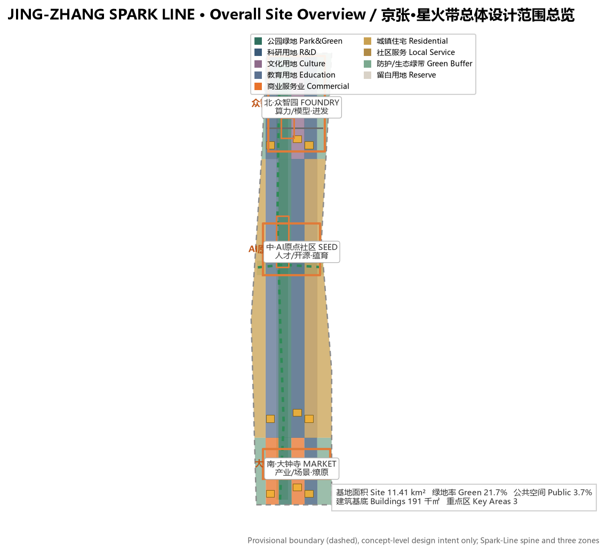
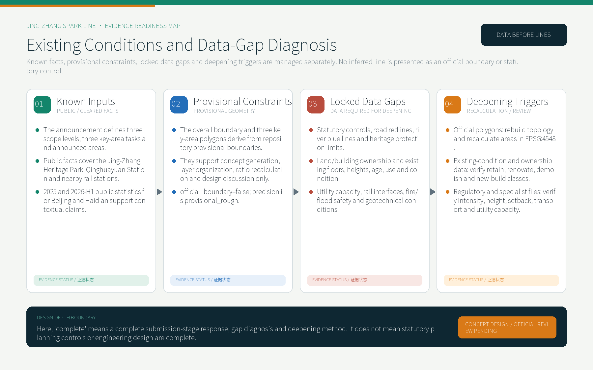
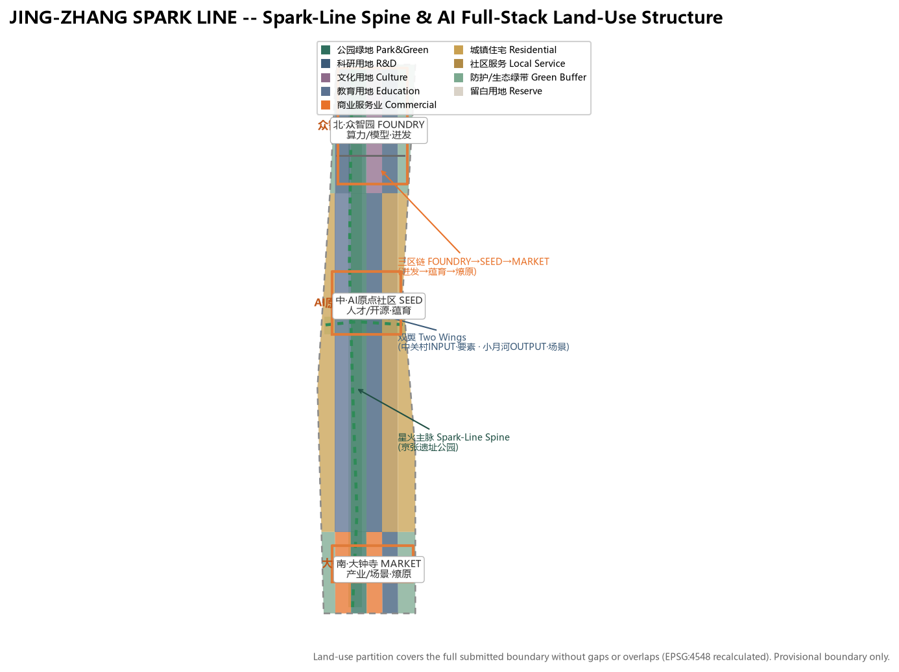
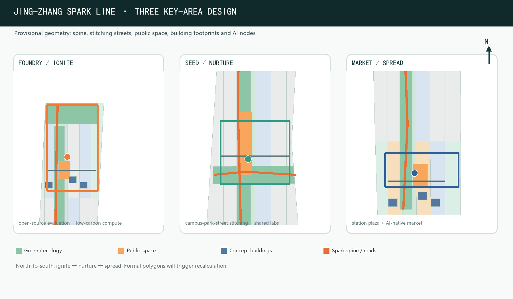
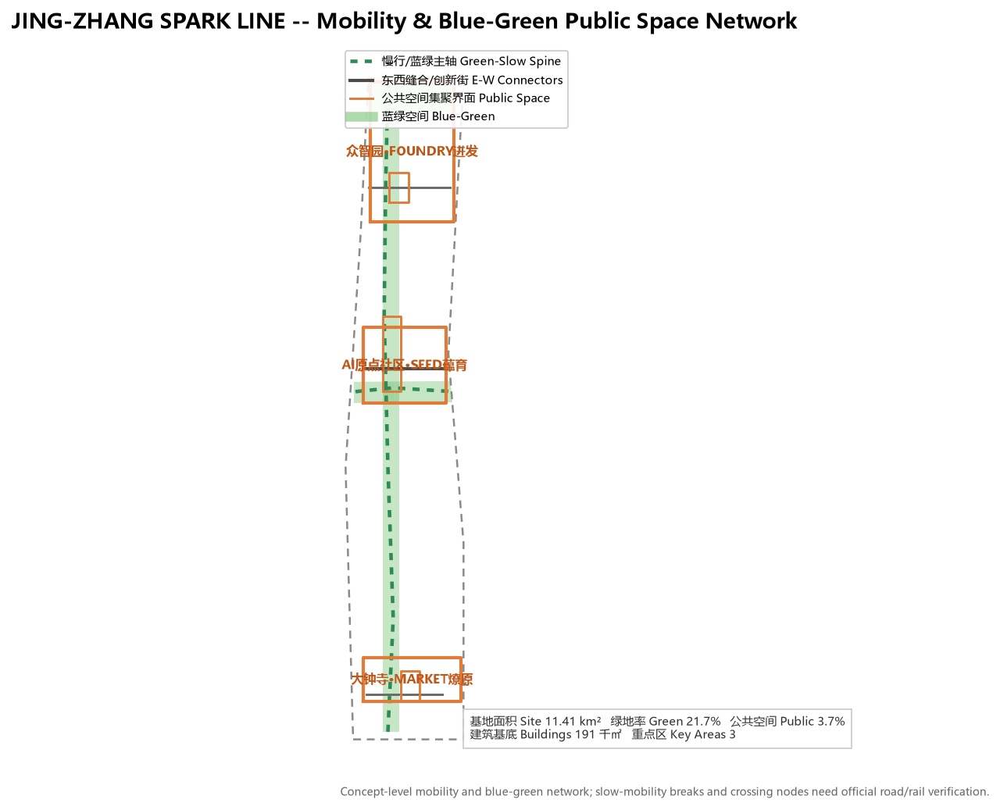
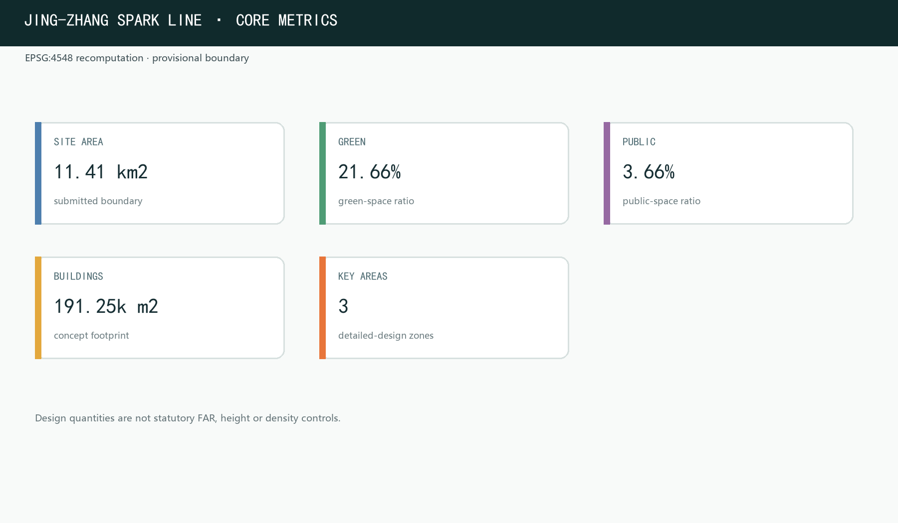

## Design Basis and Source Inventory

This proposal is anchored first on the Qualification Pre-Announcement for the Centennial Jing-Zhang AI Innovation Belt International Urban Design Open Call issued by the Haidian Branch of the Beijing Municipal Commission of Planning and Natural Resources. The announcement defines the three-level scopes, three key areas, design tasks and deliverable depth to which every section, layer and metric of this package responds [source:OFFICIAL-ANNOUNCEMENT]. The second basis is the agent-facing open-call taskbook (`brief/site-package/agent_taskbook.json`), which defines ten co-creation principles, three positionings, five functions and six agent tasks (naming/Logo, ecosystem cases, scenario cards, pilgrimage landmarks, cultural narrative, long-term operation) - the direct source of the "Spark Line" concept system [source:AGENT-TASKBOOK].

Machine-readable basis comes from the site package `brief/site-package/` (design brief, allowed design space, enums, ranges, schemas and provisional boundary geometry) and `data/source_registry.json` use registrations [source:SOURCE-REGISTRY]. Site diagnosis builds on public facts: the Jing-Zhang Heritage Park Phase 1 (Qinghuadong Road-Zhichun Road, about 16.8ha) opened in June 2023, preserving the Qinghuayuan Station building whose name was inscribed by Zhan Tianyou (a Beijing cultural-protection unit); the surrounding area hosts the "Eight Great Colleges" of Xueyuan Road plus Qinghua, Peking, BJTU and CAS-system institutions (nearly 20 campuses), and Metro Line 13 serves Wudaokou, Zhichunlu and Dazhongsi stations [source:PROCESSED-FACT-PACK].

Boundary status is declared throughout: the overall design area and three key areas use provisional geometry derived from `brief/site-package/geometry/provisional_boundaries.geojson`, marked `provisional_constraint` and `official_boundary=false`, usable only for generation, self-check, visualization and design discussion - never as an official redline, approval basis, precise-area basis or statutory control conclusion [source:BOUNDARY-SOURCE]. The organizer's boundary data gap does not block content scoring; once official polygons arrive, all layers and metrics must be recalculated [data:geometry/site_boundary.geojson#SITE-001].

### Existing Conditions, Locked Gaps and Deepening Triggers

The proposal separates evidence into four maturity levels. Known inputs include only the announcement, registered site-package material, public facts and public statistics. Provisional constraints include only the repository's overall and three key-area polygons. Statutory controls, road redlines, river blue lines, heritage protection limits, ownership, existing buildings and utility capacity remain locked gaps. Once official files arrive, deepening follows the sequence of topology/metric recalculation, building-by-building renewal verification, and transport/utility/specialist safety review [depth:existing_conditions_diagnosis] [source:SOURCE-REGISTRY]. `geometry/constraints.geojson` intentionally remains an empty collection because no trusted official constraint geometry is available; this prevents invented redlines and does not imply an unconstrained site.

In the submission-stage matrices, `complete` means that the task response, gap diagnosis, concept design and deepening method are fully stated. It does not mean that statutory controls, parcel ownership, building-by-building renewal decisions, engineering feasibility or approval conclusions are complete [depth:risk_missing_data]. The nine features in `geometry/buildings.geojson` are concept building footprints for spatial intent and recalculation, not an existing-building survey.

## Three-Level Scope Framework

The proposal is organized by the three scopes defined in the announcement [standard:PROJECT-OFFICIAL-ANNOUNCEMENT]. The coordinated research area (about 43.6 km²) addresses AI industry ecosystem, strategic positioning, innovation chain and future city form [depth:three_level_scope_framework]; the overall design area (about 11.4 km²; this package recomputes 11,412,825 m²) addresses urban renewal framework, industrial spatial layout, transport/municipal support and city character [metric:site_area_sqm]; the key detailed-design area (announced about 368.4 ha; recomputed 369.3 ha) addresses detailed design of the three key zones [metric:key_area_count].

The three scopes are not isolated drawings but "strategy - structure - parcel" progressive levels [depth:overall_spatial_structure]: coordinated research decides industry chain and city form, overall design lands the judgment in renewal projects and spatial structure, and key-area detail design validates implementability at parcel level. The mapping between the three scopes and announcement tasks / agent.1-agent.6 is recorded in `compliance_matrix.json`; the prose keeps only readable judgments.

## Coordinated Research Area: Industry and Future-City Study

### Core Concept and Naming System

JING-ZHANG SPARK LINE（中文"星火带"）is the primary name. It derives from the Jing-Zhang Railway's historic status as China's first trunk railway designed, funded and operated independently - the origin where the spark of Chinese self-driven innovation was lit in 1909 [standard:PROJECT-AGENT-OPEN-CALL-TASKBOOK]. "Spark" is read three ways:

- **the flame of self-driven innovation**: the Jing-Zhang Railway was built without foreign capital or personnel - the first spark proving "China can do it"; today this place continues with a new spark: "China can build large models and lead AI";
- **the reality of AI technology**: compute sparking at the fingertips, data emerging like sparks, innovation flaring in streets - "JING-ZHANG SPARK LINE" makes ordinary people realize AI is not an abstract concept but a touchable, participation-ready reality happening here;
- **the national strategic spread**: single spark - gathered kindling - prairie fire, echoing the State Council's "AI+" Action Opinion (Guo Fa [2025] No. 11) moving from pilot to penetration, from industry to employment [source:STATE-COUNCIL-AI-PLUS].

The Logo direction is "track to spark": the herringbone rail abstracted into a bursting spark, with sparks along the track transitioning from still to burning, in jade green (growth/ecology) + warm orange (fire/energy) + electronic blue (compute), modern, extensible and internationally readable. The name is not a slogan: it is a spatial symbol (the Spark-Line spine), a cultural narrative (the flame of self-driven innovation) and an operation motif ("Spark Project" / "Spark Plan") in one [depth:overall_spatial_structure].

### Three Positionings, Five Functions, Three Zones and Two Wings

JING-ZHANG SPARK LINE uses the Spark-Line spine to connect the three given positionings: the Centennial Jing-Zhang Culture Belt carries the spark memory, the Urban AI Life Experience Belt carries the prairie-fire life, and the AI Integration Innovation Belt carries industrial ignition [source:AGENT-TASKBOOK]. The five functions map to spatial anchors:

| Five functions | Spatial anchor | Core mechanism |
| --- | --- | --- |
| AI full-stack self-driven innovation | Zhongzhiyuan (FOUNDRY - ignite) | Full-stack self-driven chips, models, frameworks, compute, data; accelerator clusters and open-source evaluation |
| World-class AI innovation ecosystem | AI Origin Community (SEED - nurture) | Campus origin, talent zone, open-source system, outcome transformation |
| AI+ scenario enablement new paradigm | Xiaoyue River scenario wing (OUTPUT) | Scenario test belt and intelligent urban vitality along Xiaoyue River |
| Intelligent AI vibrant city | Spark-Line spine | Smartened public space, slow mobility, AI-native life |
| Global voice in AI governance | Dazhongsi (MARKET - spread) | International awards, outcome launching, AI milestones and contribution monuments |

The three-zone two-wing loop: Origin Community nurtures centrally (ideas and talent), Zhongzhiyuan ignites northward (same direction as the railway's departure in 1909), Dazhongsi spreads southward (scenarios and formats), the Zhongguancun technology-service wing provides global-factor allocation and capital enablement, and the Xiaoyue River scenario wing provides scenario delivery and urban vitality experiments. The spatial route is the innovation-process narrative; innovation, industry, talent and city-service chains form a walkable spatial continuum along JING-ZHANG SPARK LINE [depth:three_key_area_detailed_design].

### Global AI Innovation Ecosystem Case Study

The proposal selects six public cases as mechanism references (qualitative; no unverified investment figures) [source:AGENT-TASKBOOK]:

| Case | Model key points | Transferable mechanism |
| --- | --- | --- |
| Kendall Square, Boston | MIT-anchored academic origin and AI conversion loop | Origin Community "campus-adjacent innovation, on-site transformation" |
| King's Cross, London | Railway hub redeveloped into a knowledge-innovation district | Isomorphic with Jing-Zhang: railway industrial heritage as innovation container |
| Jurong Lake District, Singapore | National lake-district new town with district governance integration | Zhongzhiyuan district governance, standards and safety display |
| Shenzhen | Scenario-driven innovation and continuous hardware-ecosystem upgrade | Dazhongsi AI-native commercial street "scenario as market" |
| Palo Alto / Silicon Valley | University-capital-industry closed loop | Zhongguancun wing capital and IP enablement |
| Zhongguancun itself | Electronics Street to science park to internet to AI | On-the-ground basis of the Spark narrative's "present layer" |

Experience translation follows four principles: heritage activation over demolition-rebuild; incubation density over building scale; governance and standards space upfront; scenario opening as investment attraction [depth:renewal_project_list].

### AI-Native Planning Method and Differentiated Positioning

This proposal treats "AI participation in formal urban design" itself as a methodological demonstration, forming a reproducible evidence chain: public-data registration → provisional-constraint locking → GeoJSON topological partition → metric recalculation in EPSG:4548 → task/standard/depth matrix coverage → four-gate self-check, "evidence first, then lines", never substituting renderings or narrative for evidence [depth:metrics_recalculation] [source:SOURCE-REGISTRY].

Unlike same-theme entries that focus on a single mechanism (clock-sync, heat reuse or service protocol), the Spark Line anchors on one thread: the "self-driven innovation spark" narrative plus the full-stack completion chain "basic research → incubation → capital/scenario", avoiding homogeneous naming and spatial structures [depth:overall_spatial_structure] [source:AGENT-TASKBOOK]. The prose explicitly separates original concepts (the Spark-Line spine, the FOUNDRY-SEED-MARKET three-zone chain, the three-colour Logo, eight renewal projects) from transferred mechanisms (Kendall Square, King's Cross and others), keeping the original-vs-borrowed boundary auditable.

The planning method insists on "human-AI co-creation with professional final judgment": AI is responsible for reproduction, recalculation and alternative generation, while statutory conclusions are confirmed by professional teams and government authorities [standard:PROJECT-AGENT-OPEN-CALL-TASKBOOK]; every "spark" landmark and operation mechanism is labelled as a concept suggestion for professional teams to deepen, not approved construction or a settled arrangement [depth:risk_missing_data].

### AI-Era Industry and Employment Study (data-supported chapter)

This proposal uses authoritative 2025 and 2026H1 public data to argue AI-era industry development, employment creation and life scenarios. All data is registered in `sources.json` with institution/URL/year/access date and cited in prose via `[source:...]` [source:CNNIC-LATEST]:

- **Personal AI penetration (national supplement)**: as of December 2025, China had **1.125 billion** netizens with **80.1%** internet penetration; generative-AI users reached **602 million** (+141.7% vs end-2024) with **42.8%** population penetration; digital-economy core industries reached **10.5%** of GDP; digital consumption reached **17.92 trillion yuan** (Jan-Nov 2025) [source:CNNIC-LATEST].

- **Beijing AI industry base (Beijing-first)**: Beijing's 2025 GDP reached **5207.34 billion yuan** (+5.4%) with digital economy at **2416.63 billion yuan** (**46.4%** of GDP) [source:BEIJING-STAT-2025]. Beijing's AI core industry is estimated above **450 billion yuan** for 2025 (~half of the national total) with **2,500+** enterprises, about **40** AI unicorns and nearly **60** AI listed companies [source:BJ-AI-ACTION-PLAN-2026]; **209** large models filed citywide (~1/3 of the national total) and **116** unicorns [source:BEIJING-STAT-2025].

- **Haidian industry base (Haidian-first)**: Haidian's 2025 GDP reached **1369.14 billion yuan** (+7.2%); **123** filed large models (60% of Beijing); **92** national key laboratories (63.4% of the city); **349,404** valid invention patents; **4053.1 billion yuan** technical-contract value; **110,396 yuan** per-capita disposable income [source:HAIDIAN-STAT-2025]. JING-ZHANG SPARK LINE is the spatial carrier of this "AI industry highland + talent highland + innovation source".

- **Infrastructure (Haidian/Beijing-first)**: Beijing operates **30** metro lines / **909 km**, carrying **3.57 billion** passengers in 2025; **1,252** bus routes carrying **1.60 billion**; motor vehicles **8.101 million** (incl. 988,000 new-energy); **153,000** 5G base stations and **25.93 million** 5G users (64.4% of mobile users) [source:BEIJING-STAT-2025]. JING-ZHANG SPARK LINE's "rail + slow mobility + instant logistics" composite system stands on this real urban-infrastructure base [depth:traffic_rail_slow_parking].

- **Talent and employment (Beijing/national)**: Beijing had **497,000** graduate students in study and **666,000** undergraduate/college students in 2025 [source:BEIJING-STAT-2025]; "AI Trainer" (4-04-05-05) entered the National Occupational Classification Code [source:MOHRSS-AI-TRAINER]. The proposal responds through shared experimentation, outcome transfer and basic startup services; spatial scale and operation remain subject to later deepening.

- **Consumption and life (enterprise/regional analysis of Beijing)**: the Xinhua × Meituan Research Institute "2025 Life-Service Consumption Trend Insight" shows Meituan life-service consumption orders grew **36%** YoY in 2025 with ~60% Gen-Z share, and **Beijing ranked in the top-10 "young-people lifestyle" cities** [source:MEITUAN-BJ-LIFE-2025]; the 2024 China Night-Economy Development Report put **Beijing #2 nationally in night-time dining consumption** [source:MEITUAN-NIGHT-ECONOMY]. Instant retail and local life drive the format organization of Dazhongsi's AI-native commercial street and 15-minute living circles around rail stations [depth:blue_green_public_space].

- **Mobility and transport (enterprise/regional analysis of Beijing)**: Amap's "2025 Annual China Major-City Traffic Analysis Report" shows **Beijing ranks #1 nationally in green-travel willingness** [source:AMAP-BJ-TRAFFIC-2025]; Baidu Maps "2025 Q2 China City Traffic Report" puts **Beijing #1 among 100 cities with a peak-commute congestion index of 2.102** (Chongqing 2.095, Guangzhou next) [source:BAIDU-BJ-Q2-2025]; Dida Chuxing's "2025 Carpool Commute Observation Report" lists **Langfang-Beijing as a representative cross-city commute corridor** with intra-city carpool speeds ~40 km/h [source:DIDACAR-BJ-2025]. The Beijing Transport Institute's "2026 Beijing Transport Development Annual Report" shows **2025 Beijing green-travel share of 76.5%** and a **4.8% decline** in the peak congestion index [source:BJTRC-2026]. JING-ZHANG SPARK LINE responds to Beijing's real commute and congestion challenges with "slow-mobility first, rail connection, instant-logistics synergy, shared-mobility link" [depth:traffic_rail_slow_parking].

## Overall Design Area: Urban Renewal and Regulatory-Plan Depth

The overall design area requires regulatory-detailed-planning urban-design depth [standard:MOHURD-CONTROL-DETAILED-PLANNING]. Absent official regulatory conditions, the proposal first establishes a reviewable method framework and structural judgments; all statutory conclusions are marked "pending official regulatory conditions" and never presented as approved limits [depth:development_intensity_controls].

**Overall spatial structure: "one Spark-Line spine + three-zone chain + two wings + ecological corridor".** The Spark-Line spine is the Jing-Zhang Heritage Park green axis and its two-sided urban interface - history, slow mobility and innovation scenarios as one [depth:overall_spatial_structure]. The three zones run north-to-south along the full-stack pipeline: Zhongzhiyuan (FOUNDRY - ignite) → AI Origin Community (SEED - nurture) → Dazhongsi (MARKET - spread), aligned with the "basic research → industry incubation → capital/scenario" complete chain [depth:land_use_layout]. The two wings are Zhongguancun (INPUT - factors) and Xiaoyue River (OUTPUT - scenarios); the Qing River-Xiaoyue River corridor links blue-green public spaces.

**Urban renewal framework.** A four-dimensional screen (land-use efficiency - building age - ownership complexity - rail-station accessibility) identifies renewal objects, distinguishing retain / renovate / renew / new-build; this package gives no parcel-level demolition/renovation conclusions [depth:retain_renovate_demolish]. Building scale and intensity: `geometry/buildings.geojson` expresses concept-level footprints [data:geometry/buildings.geojson#BLDG-001] [metric:building_footprint_area_sqm]; FAR, height, density, setbacks and road redlines are recorded as `status=unknown` until official regulatory conditions arrive, with recalculation paths in `assumptions.json` [depth:development_intensity_controls].

**Integrated-capacity assessment.** An evaluation framework for rail passenger flow, public-service radius, municipal load and slow-mobility capacity is proposed [depth:municipal_new_infrastructure]. Missing utility, energy, drainage, flood and fire engineering data are listed as formal deepening prerequisites; new infrastructure is framed around distributed energy, edge compute and smart public facilities.

## Key Areas: Detailed Design

The three key zones each follow "positioning + spatial structure + building renewal + mobility + public space + AI scenarios + implementation risk", aligned with planning-comprehension-implementation depth [depth:three_key_area_detailed_design]; all three polygons are provisional_constraint, so parcel-level conclusions are directional only [data:geometry/key_areas.geojson#PROV-KEY-001].

### Zhongzhiyuan AI Acceleration Zone (FOUNDRY - ignite, announced about 192.1 ha)

**Positioning**: garden-style full-stack innovation district, the "ignition source" of the AI full-stack pipeline, hosting full-stack self-driven chips, models, frameworks, compute and data plus open-source model evaluation. **Spatial structure**: northern research, green, cultural and protective-space zones form the core cluster, with a low-carbon green innovation belt along the Qing River [data:geometry/land_use.geojson#LU-014]. **Building renewal**: low-efficiency industrial land updated into accelerator clusters and shared labs. **Mobility**: north-5th-Ring external connection; the internal transverse innovation street seamlessly joins the north end of the Spark-Line spine [data:geometry/roads.geojson#ROAD-004]. **Public space**: "Ignition Plaza" hosts outcome launching and open testing [data:geometry/public_space.geojson#PUBLIC-003]. **AI scenarios**: open-source model evaluation field, standards workshops, safety-governance display, low-carbon compute experience. **Risk**: Qing River blue line, ecology and flood conditions; compute infrastructure energy and network capacity require professional review.

### Beijing AI Origin Community (SEED - nurture, announced about 104.3 ha)

**Positioning**: campus-adjacent outcome-transformation and talent community, the "nurturing place" of the AI full-stack pipeline. **Spatial structure**: anchored by the Qinghuayuan Station building (name inscribed by Zhan Tianyou, municipal cultural-protection unit) with a "Spark Origin" memorial and display; the Xueyuan Road university belt opens campus interfaces [data:geometry/key_areas.geojson#PROV-KEY-002]. **Building renewal**: function replacement and ground-floor format renewal, preserving heritage station and cultural elements. **Mobility**: Wudaokou station integration; campus-park-street slow stitching [data:geometry/roads.geojson#ROAD-003]. **Public space**: "Spark Origin Plaza" (origin museum and "flame" installation) [data:geometry/public_space.geojson#PUBLIC-001]. **AI scenarios**: inter-campus shared lab belt, open-source launch hall, outcome-transformation street, talent-zone services. **Risk**: campus boundaries and ownership, heritage review, station-integration coordination are to-be-confirmed.

### Dazhongsi AI Industry Cluster (MARKET - spread, announced about 72.0 ha)

**Positioning**: urban smart-economy and international-exchange district, the "spreading field" of the AI full-stack pipeline. **Spatial structure**: organized around Dazhongsi station integration with a "Spread Transfer Lounge" and four-quadrant pedestrian connectivity [data:geometry/key_areas.geojson#PROV-KEY-003]. **Building renewal**: southern commercial-service, research and green-space zones support an AI-native commercial street, scenario test fields and composite public-space use [data:geometry/land_use.geojson#LU-002]. **Mobility**: rail connection first, with the Dazhongsi transverse link integrating non-motorized parking and the pedestrian network [data:geometry/roads.geojson#ROAD-002]. **Public space**: "Spread Plaza" hosts outcome launching and AI-milestone display [data:geometry/public_space.geojson#PUBLIC-002]. **AI scenarios**: AI-native street, international roadshow lounge, data-element salon. **Risk**: rail-station modification, intersection engineering, international-event operation and clearance requirements.

## AI Innovation Ecosystem, Talent Personas and AI+ Scenarios

The proposal organizes spatial and scenario needs around talent, enterprises, residents and governance [depth:blue_green_public_space], grounding each scenario in the authoritative data above (602M generative-AI users, AI talent gap, instant retail, parcel logistics) [source:CNNIC-LATEST].

| User persona | Typical needs | Spatial response |
| --- | --- | --- |
| University researcher (SEED) | Inter-campus experiments, outcome transformation | Inter-campus shared lab belt, origin museum, launch hall |
| Startup teams / makers (FOUNDRY) | Low-cost workspace, shared experiments, product validation | Accelerator cluster, shared startup space, open-source evaluation field |
| Developer / open-source contributor (Spine) | Collaborate, launch, test, reputation | Spark Plaza open-source co-creation space, contribution honor wall |
| Local resident / elderly | Health, mobility, life services | Urban health station, barrier-free commitment |
| Youth creator / student (Wudaokou/Xiaoyue) | Creation tools, social, night vitality | Youth creation cabin, AI-native street |
| International visitor / investor (Dazhongsi) | Display, roadshow, business | Spread Plaza, international roadshow lounge |

At least 10 scenario cards are provided, including 3 industry test/validation scenarios:

| Scenario card | Spatial carrier | Type | Data source & governance boundary |
| --- | --- | --- | --- |
| 01 Open-Source Launch Hall | AI Origin Community | Public service | Public code and project metadata; aggregated activity data |
| 02 Safety-Governance Sandbox | Zhongzhiyuan | Industry test/validation | Controlled test data; evaluation and red-team testing require authorization |
| 03 Edge-Compute Hub | Overall design nodes | New-infrastructure prototype | Energy and compute operation data; privacy minimized |
| 04 AI Slow-Mobility Navigation | Spark-Line spine | Public service | Explainable wayfinding and low-intrusion sensing; gap identification requires human review |
| 05 Dazhongsi International Roadshow Lounge | Dazhongsi | Industry display | Corporate cases require clearance; business data confidential |
| 06 Qing River Low-Carbon Innovation Corridor | Zhongzhiyuan riverfront | Industry test/validation | Environmental and stormwater data; public ecological indicators |
| 07 Campus Outcome-Transformation Street | AI Origin Community | Industry service | Research and IP require authorization |
| 08 Data-Element Salon | Dazhongsi area | Industry test/validation | Circulation requires compliance, authorization and auditability |
| 09 AI Instant-Retail Sample Street | Community-commerce junction | Public service | Anonymous aggregated order data; no-algorithm consumption channel. Grounded in Beijing's top-10 young-people lifestyle ranking and #2 night-time dining index, making the "15-minute instant-retail circle" a real passenger reality [source:MEITUAN-BJ-LIFE-2025] |
| 10 Global AI Festival Week Route | Belt-wide public space | Operation event | Aggregated event data; copyright and portrait clearance |

These scenarios anchor to specific layers: public-space scenarios cite [data:geometry/public_space.geojson#PUBLIC-001], mobility scenarios cite [data:geometry/roads.geojson#ROAD-001], open-space scenarios cite [data:geometry/green_space.geojson#GREEN-001]. The three industry test/validation scenarios (low-speed autonomous driving test corridor, open-source model evaluation field, AI instant-retail/logistics delivery test belt) all follow the "limited range, low speed supervised, human takeover" boundary.

## Land Use, Building Scale, and Retain / Renovate / Demolish

Land use follows the Guidelines for Classification of Land for National Territorial-Spatial Survey, Planning and Use Control, complete, closed and gapless [standard:MNR-LAND-USE-CLASSIFICATION-GUIDE]. `geometry/land_use.geojson` divides the overall design area into research, education, culture, commercial, residential, local-service, park green, protective green and reserve parcels - 18 zones covering the full submitted boundary without overlap [data:geometry/land_use.geojson#LU-001]. Green and public-space ratios support innovation exchange and ecological quality [metric:green_ratio].

The building scheme distinguishes retain / renovate / renew / new-build / to-be-confirmed [depth:height_massing_character]. Without existing-building, ownership and regulatory conditions, no parcel-level demolition/renovation conclusion is fabricated; concept footprints in `geometry/buildings.geojson` express renewal direction [metric:building_footprint_area_sqm]. Statutory indicators (FAR, height, density, setbacks) are uniformly `status=unknown`, to be recalculated when official regulatory conditions arrive; concept volumes are never presented as approved limits [depth:development_intensity_controls].

## Transport, Rail, Municipal and Public Services

The transport scheme responds to rail-station integration, road micro-circulation, slow-mobility gaps, external transport, parking and instant-logistics synergy, focusing on the North 5th Ring crossing nodes, Wudaokou, the west end of Qinghuadong Road, Dazhongsi station and anchor-company access [depth:traffic_rail_slow_parking]. `geometry/roads.geojson` expresses the Spark-Line slow spine, east-west stitching roads, innovation streets and the Xiaoyue River blue-green corridor [data:geometry/roads.geojson#ROAD-001]. The scheme uses Beijing's 2025 rail-transit figures (3.57 billion passengers, near-10 million daily) to argue the "rail + slow mobility + instant logistics" composite mobility potential [source:BEIJING-STAT-2025].

Municipal and new infrastructure spans AI industry-service facilities, innovation service platforms, talent life services, distributed energy, edge compute and conventional municipal integration [depth:municipal_new_infrastructure]. Missing utility, energy, drainage, flood and fire data are listed as formal deepening prerequisites.

## Blue-Green Space, Public Space and City Character

The blue-green scheme takes the Spark-Line spine as the skeleton and integrates Qing River, Xiaoyue River, campus, enterprise and community movement into connected north-south and east-west walking, cycling and green-space networks [depth:blue_green_public_space]. `geometry/green_space.geojson` expresses park green, protective green and blue-green corridors [data:geometry/green_space.geojson#GREEN-001], and `geometry/public_space.geojson` expresses public-activity interfaces [data:geometry/public_space.geojson#PUBLIC-001].

City character fuses Jing-Zhang railway heritage, Zhongguancun innovation culture and AI new culture [standard:MOHURD-URBAN-DESIGN-MEASURES]. At least 3 AI pilgrimage landmarks are proposed: **Spark Origin** (Qinghuayuan Station area - the material carrier of the first self-driven innovation station), **Spark Co-creation Plaza** (open-source co-creation node on the spine, with developer walking path, open-source outcome gallery and agent contribution honor wall), and **Spread Plaza** (Dazhongsi, AI milestones and outcome launching). Landmarks, wayfinding, Logo, fonts, images, portraits and corporate marks all require clearance; concepts must not be sensationalized or presented as approved construction.

The cultural narrative runs "from one spark to a constellation": 1909 the Jing-Zhang Railway lit the spark of self-driven innovation (engineering source) → 1980s Zhongguancun's Electronics Street ignited the innovation economy (industry source) → 2026 open source + Agent continue the intelligent-age spark here (human-AI co-creation source). International communication copy: "From the first spark to a constellation."

## Renewal Project List, Policy and Phasing

The proposal forms an auditable renewal project list [depth:renewal_project_list]. `geometry/phasing.geojson` expresses the phased extents [data:geometry/phasing.geojson#PHASE-001]. Each entry states the implementing body, service target, time phase, quantified target, resource tools and verification method, so that the list is actionable rather than concept-only:

| ID | Project | Type | Implementing body | Service target | Phase | Quantified target | Resource tools | Verification |
| --- | --- | --- | --- | --- | --- | --- | --- | --- |
| JZ-01 | Spark-Line slow-mobility gap stitching and crossing nodes | Public space / transport | Planning, transport authorities & street offices | Commuters, visitors, all-age residents | Near-term (P1) | Stitch ≥6 gaps, add/upgrade ≥4 crossing nodes | Road redlines, underbridge space, traffic-special study | Traffic simulation recalc + resident survey |
| JZ-02 | Spark Origin Museum and flame installation | Culture / urban renewal | Heritage, culture & tourism authorities + station manager | Citizens, visitors, school groups | Near-term (P1) | 1 culture anchor built, ≥100k annual visitors | Heritage review, station activation plan | Heritage acceptance + visitor monitoring |
| JZ-03 | Zhongzhiyuan accelerator cluster and open-source model evaluation field | Industry / urban renewal | Zhongguancun Science City council + operator | AI startups, open-source developers | Mid-term (P2) | ≥500 shared workstations, field capacity ≥200 | Ownership consolidation, compute & energy study | Quarterly occupancy & field-use review |
| JZ-04 | Qing River innovation interface, Zhongzhiyuan | Blue-green / industry display | Landscape, water authorities + park operator | Enterprise staff, nearby residents | Mid-term (P2) | Blue-green frontage ≥800 m, ≥20 display units | River blue line, ecology & flood study | Ecological monitoring + display refresh rate |
| JZ-05 | Dazhongsi four-quadrant connectivity and Spread Transfer Lounge | Rail integration / mobility | Rail company, transport & planning authorities | Commuters, visitors, investors | Mid-term (P2) | 100% four-quadrant connectivity, transfer ≤5 min | Rail station, intersections, municipal utilities study | On-site walk test + transfer-time tracking |
| JZ-06 | Spread Plaza and AI-milestone venue | Culture / operation | Organizer & operator | International visitors, dev community, public | Mid-term (P2) | 1 public venue built, ≥20 events/year | Public-space permits, event safety, copyright clearance | Safety-plan review + attendance stats |
| JZ-07 | Inter-campus shared lab belt nodes | Research collaboration / public service | University consortium & research management | Researchers, cross-campus teams | Long-term (P3) | ≥10 open nodes, ≥200 instruments online | Campus boundaries, ownership, data-compliance agreements | Platform usage + data-security audit |
| JZ-08 | Xiaoyue River scenario test belt | Blue-green / scenario | Landscape, water authorities & scenario operator | Founders, residents, testing firms | Long-term (P3) | Test belt ≥1.5 km, ≥15 scenarios housed | River blue line, scenario rules & operator | Scenario launch rate + safety registration check |

Phasing proposes near-term pilots, mid-term renewal and long-term governance [depth:phasing_implementation]: near-term (P1) starts with a Spark-Line pilot segment and lightweight operation facilities; mid-term (P2) advances Dazhongsi-Origin synergy renewal; long-term (P3) implements the Zhongzhiyuan self-driven innovation governance framework. For task 06, the proposal designs a "Spark Open Week" annual event system, scenario open days, developer-community operation, international communication and acquisition-conversion mechanism, all expressed as concept suggestions or deepening directions, never as confirmed government arrangements; concrete bodies, budgets and schedules must be finalized by professional teams and government review [source:AGENT-TASKBOOK].

## Indicator System, Area Recalculation and Compliance

The indicator system covers overall-design-area area, key-area area, green and public-space ratios, building footprint, renewal-project count, AI scenario nodes, mobility connectivity, industry space and talent-service indicators [depth:metrics_recalculation]. All known indicators are recomputed from submitted geometry in EPSG:4548 in `metrics.json`; unknown indicators state their reason and formal-submission prerequisites.

| Indicator | Value | Meaning |
| --- | --- | --- |
| Overall design area | 11,412,825 sqm | Reference extent for spatial layers and metrics [metric:site_area_sqm] |
| Green area / ratio | 2,471,521 sqm / 21.7% | Supports ecological quality and innovation exchange [metric:green_ratio] |
| Public space area / ratio | 417,316 sqm / 3.7% | Supports innovation exchange, events and public experience [metric:public_space_ratio] |
| Building footprint | 191,251 sqm | Concept-level design quantity, not a statutory value [metric:building_footprint_area_sqm] |
| Key areas | 3 | Count check of the three key zones [metric:key_area_count] |

The compliance matrix is the master response-control file: `compliance_matrix.json` covers announcement tasks 1.3, 1.4, 1.5 and agent.1-agent.6; `standard_matrix.json` covers all mandatory professional standards; `design_depth_matrix.json` covers all mandatory design-depth items. A proposal missing any mandatory task cannot enter formal professional scoring.

## Risk, Copyright and Compliance

This proposal provides complete bilingual deliverables, with `proposal.md` as the equivalent counterpart of this English file [depth:risk_missing_data]. The source, license and authorization status of all images, icons, data and code assets are stated in `sources.json` and `report/copyright_statement.md`. This proposal is AI-agent generated; all spatial recommendations are concept suggestions, reference schemes or material for professional teams to deepen, and do not replace formal planning or constitute government conclusions, and involve no unauthorized trademarks, fonts, images, portraits or copyrighted material.

This proposal does not claim official approval, approved regulatory planning, final land ownership, final building scale or guaranteed implementation. The AI agent is responsible for facts, sources, copyright, spatial data, indicators and expression. Data such as the 5-million AI talent gap is an industry estimate, marked low-confidence in `sources.json` and cited at reduced level.

## References

- Qualification Pre-Announcement for the Centennial Jing-Zhang AI Innovation Belt International Urban Design Open Call (Haidian BPNR, 2026-05-09)
- Agent-facing open-call taskbook excerpt for the Jing-Zhang AI Innovation Belt Urban Design (user-provided cleared material)
- CNNIC, 57th Statistical Report on China's Internet Development (2026-02, original official link)
- Beijing Statistics Bureau, 2025 Beijing Economic and Social Development Statistical Bulletin (2026-03-25, official text)
- Haidian Statistics Bureau, 2025 Haidian Economic and Social Development Statistical Bulletin (2026-04-10, official text)
- Beijing Municipal Science & Technology Commission / Zhongguancun, Beijing AI Industry Whitepaper (2025)
- Beijing Municipal Development & Reform Commission, 2026 AI Innovation Highland Building Conference release
- State Council, Opinions on Deepening the Implementation of the "AI+" Action (Guo Fa [2025] No. 11)
- MOE, Undergraduate Major Catalog (2025) additions
- Beijing Transport Institute, 2026 Beijing Transport Development Annual Report (green-travel share 76.5%)
- Amap, 2025 Annual China Major-City Traffic Analysis Report (Beijing green-travel willingness #1)
- Baidu Maps, 2025 Q2 China City Traffic Report (Beijing peak-commute congestion index 2.102, #1)
- Dida Chuxing, 2025 Carpool Commute Observation Report (Langfang-Beijing cross-city commute)
- Xinhua × Meituan Research Institute, 2025 Life-Service Consumption Trend Insight (Beijing top-10 young-people cities)
- Meituan Research Institute, 2024 China Night-Economy Development Report (Beijing night-time dining #2)
- Urban Design Management Measures; Regulatory Detailed Planning Measures; National Land-Use Classification Guidelines
- Full machine index: `sources.json`, `metrics.json`, `compliance_matrix.json`, `standard_matrix.json`, `design_depth_matrix.json`
- Copyright and licensing: `report/copyright_statement.md`

The bibliography and local snapshots above form the bibliographic entry point for the proposal's judgments; their full provenance, license and use boundaries are governed by `sources.json` and `data/source_registry.json` [source:SOURCE-REGISTRY] [source:SITE-PACKAGE].
