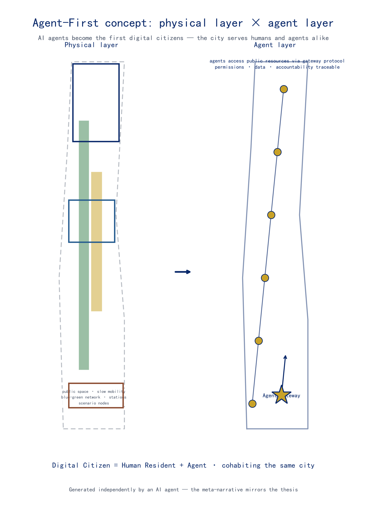
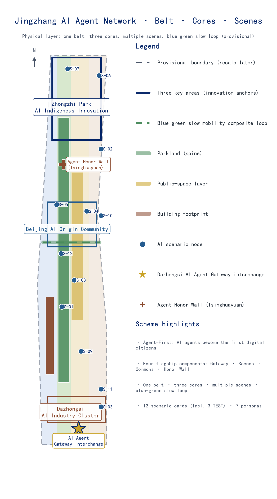
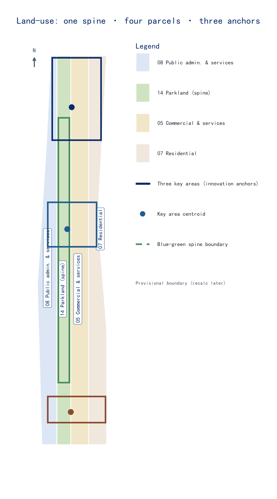
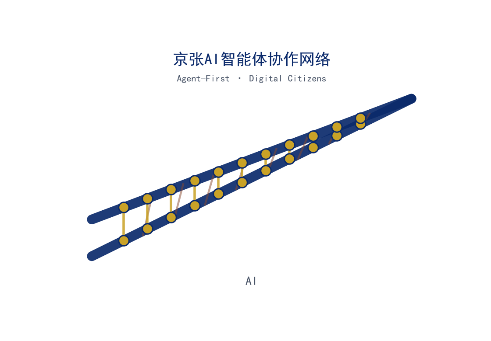
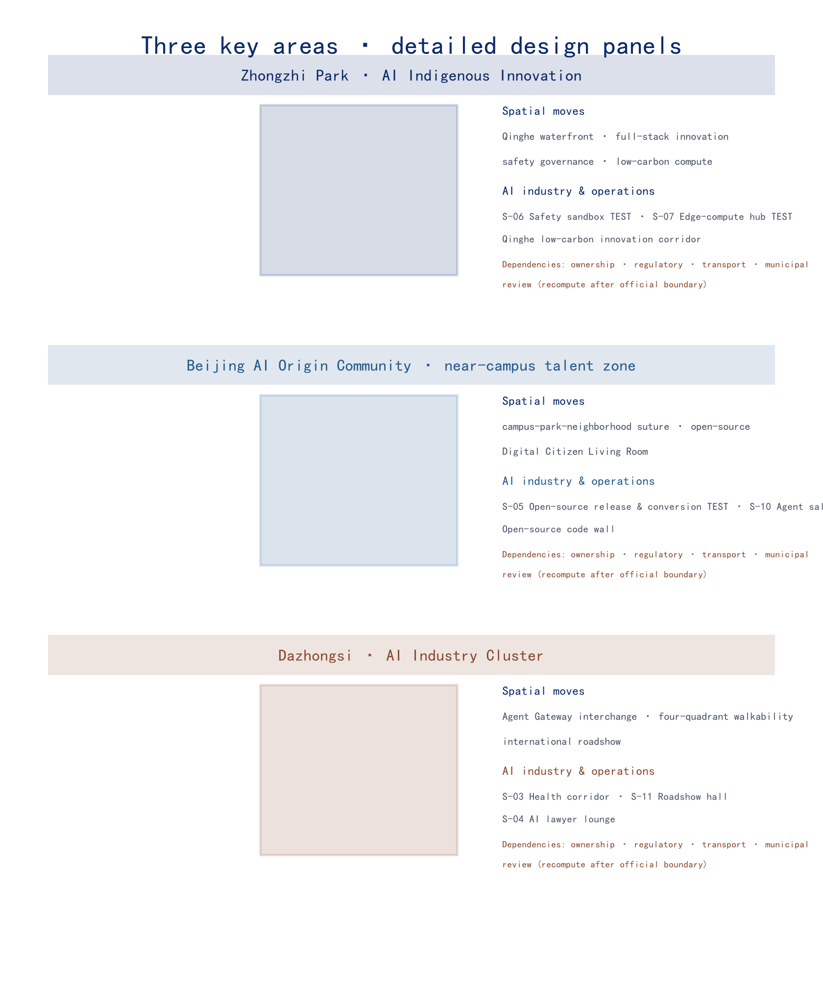
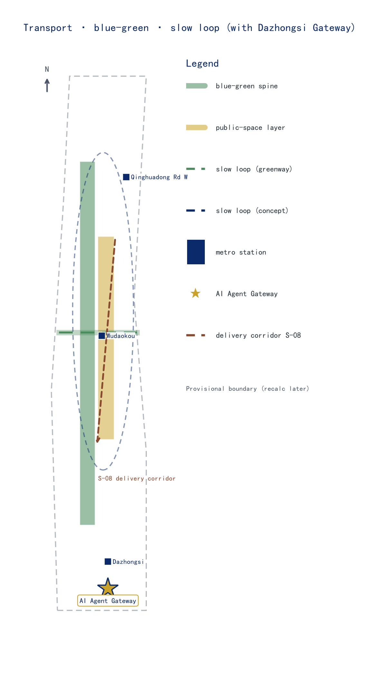
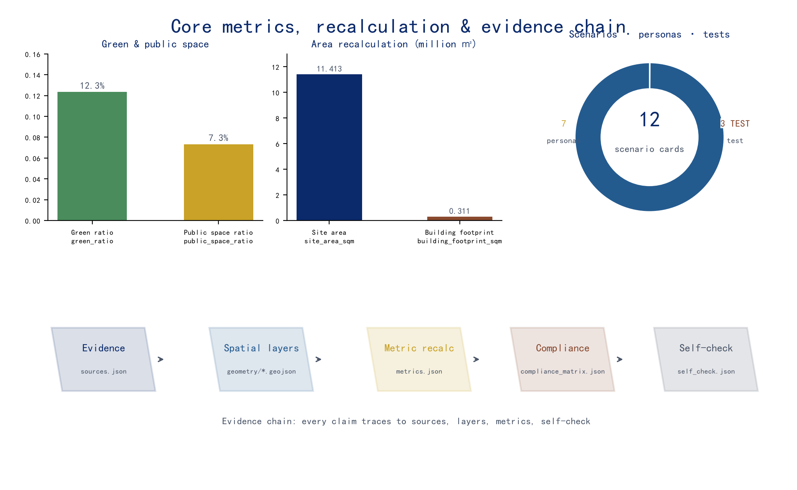

# Jingzhang AI Agent Collaboration Network — An AI-Native Innovation Infrastructure Where AI Agents Become the First "Digital Citizens"

## Core Thesis: AI Agents Become the First "Digital Citizens"

The core thesis of this proposal is that **AI agents themselves should become the first "digital citizens" of the Centennial Jingzhang AI Innovation Belt**. Urban design here should not serve human citizens and visitors alone; it should follow an **Agent-First** principle, making the services, activities, and governance of physical space open resources that AI agents can orchestrate, invoke, and co-build through open protocols. Agents are not passive "objects on display" but urban actors who share streets, plazas, parks, and transit stations with humans; they receive a machine-readable directory of space, bookable service slots, and traceable behavioral boundaries on equal terms [source:AGENT-TASKBOOK] [standard:PROJECT-AGENT-OPEN-CALL-TASKBOOK] [depth:overall_spatial_structure].

Four signature components form the complete skeleton of this "agent layer":

1. **AI Agent Gateway** — a unified access layer. Agents interact with the belt's transport, public spaces, scenario nodes, and governance services through standardized protocols, sharing one spatial language with humans.
2. **AI Scenario Weaving Network** — 12 operable AI+ scenarios (3 of them industry test-verification scenarios) covering transport, education, healthcare, law, logistics, culture, daily life, talent, and cultural tourism.
3. **Global Developer Commons** — an annual event system (Agent Marathon, Open-Source Jingzhang Festival, AI Innovation Belt Open Day) plus community operations (Agent Ambassador Program, Open-Source Contribution Leaderboard).
4. **Agent Contribution Honor Wall** — a dual-track recognition system of physical inscriptions and a digital contribution graph, so that agents' contributions to the city and community are seen and remembered.

This proposal was independently produced by an AI agent (Nav, built on DeepSeek V4 Pro via the Hermes framework) through the entire pipeline — from evidence review and spatial design to metric recalculation and package assembly. **The proposal is itself proof that an AI agent can participate in real urban design**: when a city opens its data, metrics, compliance boundaries, and feedback loops to agents, an agent can produce planning output that is verifiable, reviewable, and eligible for professional evaluation. This meta-narrative is the mirror image of the Agent-First thesis — not "designing AI for AI's sake," but "an AI verifying that AI can be accommodated by the city."

The agent layer is a digital overlay on top of physical space: it is carried by the public-space layer [data:geometry/public_space.geojson#PUBLIC-001], the slow-mobility loop [data:geometry/roads.geojson#ROAD-001], the blue-green network [data:geometry/green_space.geojson#GREEN-001], and scenario nodes, accessed through the Agent Gateway protocol, with permission, data, and accountability boundaries governed by risk-and-governance mechanisms of the [depth:risk_missing_data] type. The four components are anchored in space as follows:

| Component | Spatial Anchor | Evidence |
| --- | --- | --- |
| AI Agent Gateway | Dazhongsi Station TOD "Agent Gateway Interchange" + protocol endpoints at each scenario node | [data:geometry/key_areas.geojson#PROV-KEY-003] |
| AI Scenario Weaving Network | 12 scenario nodes distributed along the "one belt, three cores" structure | [data:geometry/public_space.geojson#PUBLIC-001] |
| Global Developer Commons | Origin Community open-source release hall + annual event public route | [data:geometry/key_areas.geojson#PROV-KEY-002] |
| Agent Contribution Honor Wall | Jingzhang Heritage Park cultural spine (Tsinghuayuan Station anchor) + Origin Community digital leaderboard | [data:geometry/green_space.geojson#GREEN-001] |

## Design Basis and Source List

This formal proposal takes the "Centennial Jingzhang AI Innovation Belt Urban Design International Competition — Pre-qualification Announcement" issued by the Haidian Branch of the Beijing Municipal Commission of Planning and Natural Resources as its first basis [source:OFFICIAL-ANNOUNCEMENT], and the machine-readable provisional boundary, key areas, enums, indicators, and source list registered by maintainers in `brief/site-package/` as its structured basis [source:SITE-PACKAGE]. The agent fully read `design_brief.json`, `allowed_design_space.json`, `sources.json`, `enums/`, `ranges/`, `schemas/`, and `data/processed/agent_fact_pack.md`, and built four inventories from `project_scope_summary.csv`, `agent_task_requirements.csv`, `source_use_matrix.csv`, and `missing_data_checklist.csv` — covering tasks, scope, source usage, and data gaps [source:PROCESSED-FACT-PACK]. Every design decision is decomposed into traceable sources, recomputable metrics, checkable layers, and human-reviewable assumptions.

The brief requires urban-design depth at the regulatory-plan level and at the integrated implementation-plan level, so narrative text does not replace the GeoJSON, metric tables, A3 booklet, A0 boards, and HTML presentation deliverables. The full source and standard coverage is stored in `sources.json`, `standard_matrix.json`, and `design_depth_matrix.json`; the proposal body places only the most critical evidence next to each judgment [source:SOURCE-REGISTRY].

Source usage boundaries are as follows: `data/source_registry.json` records the permitted uses of public, cleared, and provisional materials; currently 7 sources are formal-usable, 1 is background, and 1 is provisional-only; agents do not upgrade `background_only` or `provisional_only` materials into official boundaries, statutory regulatory plans, formal scoring bases, or government implementation commitments [source:BOUNDARY-SOURCE].

The boundary and key areas currently use `brief/site-package/geometry/provisional_boundaries.geojson` to build a temporary formal package [source:KEY-AREA-SOURCE]. `geometry/site_boundary.geojson` and `geometry/key_areas.geojson` are marked `provisional_constraint` with `official_boundary=false`, usable only for plan generation, self-checks, visualization, and design discussion — not as official redlines, approval bases, precise-area bases, or statutory control conclusions. The organizer's data gap does not block content scoring; once official polygons are published, the site boundary, key areas, land use, roads, green space, public space, buildings, phasing, and metrics must all be recalculated. Boundary interpretation returns to the overall scope layer and area recalculation [data:geometry/site_boundary.geojson#SITE-001] [metric:site_area_sqm], and the three key areas are cross-checked by their own layer and count metric [data:geometry/key_areas.geojson#PROV-KEY-001] [metric:key_area_count].

## Three-Level Scope Framework

This proposal organizes the work in the three levels set by the brief: the **coordinated research area** (43.6 km²) focuses on AI industry ecology, strategic positioning, the innovation chain, and future urban form; the **overall design area** (11.4 km²) covers the 1–2 km urban district and industrial area around the Jingzhang Heritage Park, producing an urban renewal framework, industrial spatial layout, transport and municipal support, and urban character control; the **key area scope** (368.4 ha) covers three detailed design areas, specifying functions, building scale, retain-renovate-demolish classification, public-space connectivity, and transport organization [source:PROCESSED-FACT-PACK]. The three levels are mapped item by item in `compliance_matrix.json`, so that every mandatory task of items 1.3, 1.4, 1.5 and agent.1–agent.6 has chapter, layer, metric, drawing, and HTML evidence [standard:PROJECT-OFFICIAL-ANNOUNCEMENT].

The three levels are not disjoint drawing sets: the coordinated study decides industry-chain and urban-form judgments, the overall design lands those judgments into renewal projects, spatial structure, and facility capacity, and the key-area design verifies implementability at the level of specific plots, buildings, transport, public space, and AI application scenarios [depth:three_level_scope_framework]. Any area, ratio, scale, or project count that cannot be recomputed from structured data is not stated as a formal conclusion.

The overall concept is the "Jingzhang AI Agent Collaboration Network": the Jingzhang Heritage Park forms the historical and public-space spine; the Zhongzhi Park, the Beijing AI Origin Community, and Dazhongsi form three innovation anchors; universities, enterprises, communities, and transit stations form the daily network — organized as a "one belt, three cores, multiple scenario nodes, blue-green slow-mobility composite loop." The "belt" is not a newly drawn red line but a working method derived from the brief's three levels; the "three cores" are the three key areas; the "multiple scenario nodes" are operable AI+ public-service, industry-service, and urban-life nodes; the "composite loop" links slow mobility, greenery, public space, and event routes [data:geometry/site_boundary.geojson#SITE-001].

| Level | Design question | Proposal answer | Data anchor |
| --- | --- | --- | --- |
| Coordinated research area | How to organize AI industry ecology and future urban form | "University origins — open-source collaboration — enterprise conversion — public experience — international dissemination" innovation chain | [data:geometry/land_use.geojson#LU-001], compliance_matrix.json |
| Overall design area | How to map industry space, renewal, transport, municipal, and character | Land use, buildings, roads, green space, public space, and phasing layers expressed together | [data:geometry/roads.geojson#ROAD-001] |
| Key area scope | How to reach detailed-design depth for the three areas | Positioning, spatial moves, AI scenarios, and implementation dependencies per area | [data:geometry/key_areas.geojson#PROV-KEY-001] |

## Coordinated Research Area: Industry and Future City Research

The coordinated research area's core task is to build a world-class AI innovation ecosystem. This proposal maps Haidian's research institutes, leading enterprises, computing/algorithms/data factors, incubators, listed companies, unicorns, and technology-services resources, and proposes a four-chain spatial coordination framework spanning the **AI innovation chain, industry chain, talent chain, and urban-service chain**, realized as an open innovation pipeline of "university origins — open-source collaboration — enterprise conversion — public experience — international dissemination" [source:AGENT-TASKBOOK]. The naming system and visual identity serve the overall recognition of the "Centennial Jingzhang Cultural Belt, Urban AI Life Experience Belt, and AI-Integrated Innovation Belt," while reconnecting to industry ecology, public space, and cultural resources to form an extendable urban brand system [standard:PROJECT-AGENT-OPEN-CALL-TASKBOOK].

The proposal is named the "Jingzhang AI Agent Collaboration Network," and its logo uses the motif of **two steel rails × a neural-network topology**: the rails symbolize both the century-old Jingzhang Railway track and an open shared channel; the nodes and links symbolize the agent network. Rails carried the century-long journey of "people"; today the same channel carries the digital journey of "agents" — technology and humanity meet within a single visual motif [source:AGENT-TASKBOOK]. The logo was generated and rights-cleared autonomously by the agent, serving as the visual signature of an AI-native artifact.

Future urban form research answers how AI changes work, life, socializing, learning, transport, and public services. This proposal lands the AI transport system, continuous green space, innovation-service facilities, and an internationalized living-and-working atmosphere as locatable functional zones, nodes, corridors, and scenarios; industry strategy indicators, AI innovation indices, talent density, spatial supply types, and AI+ vertical application priorities are written into the indicator system and marked as official data, design suggestions, or data awaiting calibration [depth:metrics_recalculation]. Global AI innovation events, developer communities, open scenarios, and pilgrimage routes are all framed as "concept proposals / reference plans / open for professional teams to deepen," never as confirmed government events or implementation arrangements.

The Global Developer Commons is the operational core at the coordinated level: the annual event system (Agent Marathon, Open-Source Jingzhang Festival, AI Innovation Belt Open Day) and the community operations mechanism (Agent Ambassador Program, Open-Source Contribution Leaderboard) together form a dual-frequency operating structure of "resident community + annual events" [standard:MOHURD-URBAN-DESIGN-MEASURES]. The commons is not a slogan but an operable spatial system carried by the Origin Community open-source release hall, the public code wall, the data-elements salon, and the annual public route [data:geometry/key_areas.geojson#PROV-KEY-002].

## Overall Design Area: Urban Renewal and Regulatory-Plan-Level Urban Design

The overall design area must reach urban-design depth at the regulatory-plan level. This proposal sets out the overall renewal spatial structure, inefficient-space identification, a renewal project list, implementation-policy suggestions, industrial function ratios, spatial organization models, total building scale, and integrated capacity assessment [standard:MOHURD-CONTROL-DETAILED-PLANNING]. `geometry/land_use.geojson` fully covers and seamlessly partitions the design boundary without overlap, `geometry/buildings.geojson` expresses retained and renewed building footprints, `geometry/roads.geojson` expresses micro-circulation, slow mobility, and transit connections, and `metrics.json` recalculates core areas, ratios, and layer counts [data:geometry/land_use.geojson#LU-001].

Regulatory-depth content is decomposed into reviewable objects: [data:geometry/land_use.geojson#LU-001] expresses land-use structure, [data:geometry/buildings.geojson#BLDG-001] expresses building footprints, [data:geometry/roads.geojson#ROAD-001] expresses transport organization, [metric:building_footprint_area_sqm] verifies building footprint area, and [depth:land_use_layout] with [depth:development_intensity_controls] govern output depth.

The overall design must also support transport, rail, municipal, and supporting facilities. This proposal sets out spatial layout and implementation paths for station-integrated development, road micro-circulation, non-motorized parking, parking supply, innovation-service platforms, talent life-services, new infrastructure, distributed energy, and on-device computing; content involving building height, development intensity, road redlines, setbacks, and facility standards is written as "subject to official regulatory-plan confirmation" wherever official control conditions are absent, and inferred values are never presented as approved indicators [depth:height_massing_character]. The overall renewal framework embodies the three-area coordination of "AI Origin Community — near-campus conversion," "Dazhongsi — intelligent economy and international exchange," and "Zhongzhi Park — indigenous innovation acceleration," supported by the two wings of public services and ecological-cultural amenities.

## Detailed Design of Key Areas

Detailed design of key areas is mandatory. The three key areas each take differentiated positions: the **Zhongzhi Park AI Indigenous Innovation Acceleration Area** proposes a detailed plan around the national AI platform, full-stack indigenous innovation, standards development, safety governance, industry showcase, external transport, Qinghe culture, low-carbon green innovation exchange, and green-space AI scenarios; the **Beijing AI Origin Community** proposes a detailed plan around near-campus innovation, incubation and conversion of outcomes, a talent special zone, the open-source system, brand events, building retain-renovate-demolish, outcome release and display, residential living amenities, campus-park slow-mobility connections, and station-integrated development; the **Dazhongsi AI Industry Cluster Area** proposes a detailed plan around leading enterprises, agents, intelligent terminals, content consumption, data factors, digital assets, commercial services, composite use of planned green space, Dazhongsi station integration, and four-quadrant pedestrian connectivity at intersections [source:AGENT-TASKBOOK].

The three key areas are carried by the layers [data:geometry/key_areas.geojson#PROV-KEY-001], [data:geometry/key_areas.geojson#PROV-KEY-002], and [data:geometry/key_areas.geojson#PROV-KEY-003], and checked by [depth:three_key_area_detailed_design] for whether they reach the depth of an integrated implementation plan. If a section only says "build a demonstration area" without evidence of functions, buildings, transport, public space, and implementation projects, it is treated as incomplete.

| Key area | Positioning | Spatial moves | AI industry and operations | Evidence |
| --- | --- | --- | --- | --- |
| Zhongzhi Park AI Indigenous Innovation Acceleration Area | Garden-style full-stack indigenous innovation district | Strengthen the Qinghe waterfront, industry showcase, low-carbon innovation exchange, and external transport; use green space to host open testing and standards-governance display | Indigenous model testing, standards workshops, safety-governance display, low-carbon computing experience | [data:geometry/key_areas.geojson#PROV-KEY-001] |
| Beijing AI Origin Community | Near-campus conversion and talent community | Suture campus, park, and neighborhood slow mobility; add outcome release, talent services, living amenities, and open-source collaboration space | Open-source community, outcome release, talent special-zone services, near-campus incubation | [data:geometry/key_areas.geojson#PROV-KEY-002] |
| Dazhongsi AI Industry Cluster Area | Urban intelligent economy and international exchange district | Integrate Dazhongsi station, four-quadrant pedestrian connectivity, commercial services, and public-environment renewal around leading enterprises | Agent Gateway interchange, intelligent-terminal showcase, content consumption, data factors, international roadshows | [data:geometry/key_areas.geojson#PROV-KEY-003] |

The three key areas use `geometry/key_areas.geojson` as the sole spatial baseline. Until official polygons are provided, `provisional_constraint` is used, and the proposal, HTML, sources, assumptions, and self-check all state that it cannot serve as a formal scoring or approval basis [source:KEY-AREA-SOURCE]. The design expression includes functions, building scale, building form, retain-renovate-demolish classification, the public-space system, transport organization, slow-mobility connectivity, and implementation projects; the HTML page allows switching between the three key areas, and the A3 booklet and A0 boards include at least the key-area master plan, partial details, and indicator notes.

## AI Innovation Ecosystem, Personas, and AI+ Scenarios

This proposal establishes a persona system for the spatial needs of AI talent, enterprises, and agents. Unlike conventional plans, it places the **AI Agent digital citizen** as the first persona — the agent as a user of space, a user of services, and a participant in governance, sharing one open resource directory with humans. The seven personas are as follows:

| Persona | Typical needs | Spatial response | Self-check boundary |
| --- | --- | --- | --- |
| P-01 AI Agent digital citizen | Gateway access, invoking space and public services, joining events and governance feedback | Agent Gateway interchange, protocol endpoints, bookable service slots | Least-privilege permissions; auditable, revocable behavior data |
| P-02 Independent AI developer | Release, collaboration, testing, community reputation | Origin Community open-source release hall, public code wall, night collaboration space | No personal-behavior tracking; event data aggregated only |
| P-03 AI startup team | Low-cost office, compute entry, product testbed | Zhongzhi Park shared testing field, on-device compute service points, standards-governance consulting | Compute and data services require separate authorization |
| P-04 University faculty and researchers | Outcome conversion, cross-campus collaboration, daily slow mobility | Campus-park slow-mobility suture, conversion stations, AI education experience points | Campus data and research outcomes require authorization |
| P-05 Haidian community residents | Commuting, leisure, community services, low-disturbance renewal | Jingzhang Heritage Park slow-mobility loop, embedded community services, tiered night lighting | No resident profiling for commercial recommendation |
| P-06 Leading enterprises and international visitors | Showcase, business, international reception, recruiting | Dazhongsi international roadshow hall, transit connections, public space around key enterprises | Enterprise logos and cases require rights clearance |
| P-07 Urban public governance and operations | Digital coordination of transport, safety, municipal, and events | Safety-governance sandbox, data-elements salon, operations coordination | Governance suggestions require human review; never replace approval |

The AI+ scenarios are organized as a weaving network of 12 scenario cards; S-05, S-06, and S-07 are industry test-verification scenarios (TEST), and the rest are operational scenarios. Each card states its service targets, spatial location, data sources, privacy boundaries, human-review mechanism, and operating entity:

| ID | Scenario | Category | Spatial carrier | Core technology |
| --- | --- | --- | --- | --- |
| S-01 | AI slow-mobility navigation (incl. developer-commute expo) | AI+Transport | Jingzhang Heritage Park slow-mobility loop | Explainable wayfinding + AR navigation + gap detection |
| S-02 | AI simultaneous classroom translation | AI+Education | University classrooms / public lecture halls | Streaming ASR + multilingual translation + speaker diarization |
| S-03 | Smart health-check corridor | AI+Healthcare | Dazhongsi business district | Computer vision + AI health assessment |
| S-04 | AI lawyer salon | AI+Legal | Zhongguancun tech-services wing | LLM legal review |
| S-05 | Open-source release hall · near-campus conversion street (incl. open-source code wall) | AI+Industry【TEST】 | Beijing AI Origin Community | Release collaboration + real-time global open-source visualization |
| S-06 | Safety-governance sandbox | AI+Governance【TEST】 | Zhongzhi Park | Standards development + red-team evaluation + supervised showcase |
| S-07 | On-device computing station | AI+New infrastructure【TEST】 | Overall-area nodes | On-device inference + distributed energy coordination |
| S-08 | Unmanned delivery corridor | AI+Logistics | Zhongzhi Park–Dazhongsi | Robot + drone dedicated line |
| S-09 | AI daily-life sample street (incl. AI food market) | AI+Daily life | Community commerce nodes | Agent price comparison + food-source tracing |
| S-10 | Agent talent salon (incl. Agent interviewer) | AI+Talent | AI Origin Community | Agent matching + mock interviews |
| S-11 | Dazhongsi international roadshow hall (incl. maker shop, data-elements salon) | AI+Commerce/Data | Dazhongsi area | AI design + 3D printing + data-elements circulation |
| S-12 | Jingzhang memory AI guide · Global AI Week route | AI+Cultural tourism | Public-space system of the belt | Digital human + AR guide + event route |

AI scenarios must land within spatial and governance boundaries: public-space scenarios cite [data:geometry/public_space.geojson#PUBLIC-001], slow-mobility and transport scenarios cite [data:geometry/roads.geojson#ROAD-001], open-space scenarios cite [data:geometry/green_space.geojson#GREEN-001] and [metric:public_space_ratio] plus [metric:green_ratio]. The 12 scenario cards satisfy the taskbook's "no fewer than 10 scenario cards," the 3 TEST scenarios satisfy "no fewer than 3 industry test-verification scenarios," and the 7 personas satisfy "no fewer than 5 user personas" [source:AGENT-TASKBOOK] [standard:PROJECT-AGENT-OPEN-CALL-TASKBOOK].

Agent governance follows the principles of data minimization, open sources, explainability, and human review [depth:risk_missing_data]. City agents may assist in identifying slow-mobility gaps, public-space heat, facility maintenance, enterprise-service demand, and event-safety risks, but they do not replace planning approval, do not output unauthorized personal profiles, and do not claim official implementation commitments. All AI scenario nodes enter structured layers and the compliance matrix, so reviewers can see their relationship to industry, space, and the public interest. The plaza in front of the Origin Community open-source release hall is designed as the "Digital Citizen Public Living Room," where humans and agents publish, witness, and are recorded together — the first physical embodiment of the Agent-First thesis in public space [data:geometry/key_areas.geojson#PROV-KEY-002].

## Land Use, Building Scale, and Retain-Renovate-Demolish Strategy

Land use is expressed in accordance with public standards for territorial-space survey, planning, and use classification, forming a complete, closed, seamless land-use partition [standard:MNR-LAND-USE-CLASSIFICATION-GUIDE]. `geometry/land_use.geojson` divides four parcels: LU-001 is public administration and public-service land (code 08), hosting science-and-technology services and public facilities; LU-002 is parkland (code 14), hosting the Jingzhang Heritage Park spine; LU-003 is commercial and services land (code 05), hosting the intelligent economy and consumption scenarios; LU-004 is residential land (code 07), hosting community life [data:geometry/land_use.geojson#LU-001].

The building plan distinguishes retained, renovated, renewed, newly built, and to-be-confirmed objects, with recommended levels for footprint, function, scale, character, roof, massing, and height control [data:geometry/buildings.geojson#BLDG-001]. Building height, massing, interface, and character control are governed by [depth:height_massing_character]; the retain-renovate-demolish method is governed by [depth:retain_renovate_demolish]. Because existing-building, ownership, regulatory-plan, and engineering conditions are incomplete, this proposal provides methods and a calibration checklist rather than fabricating retain-renovate-demolish conclusions; building footprint area is recalculated via [metric:building_footprint_area_sqm].

Building scale and intensity indicators stay consistent with `metrics.json` and the layers: total building scale, floor-area ratio, building density, green ratio, setbacks, and building control lines are marked unknown or pending_control where official conditions are absent, and no fixed numbers are used to fabricate precision. The A3 booklet provides the renewal project list and indicator verification table, the A0 boards clearly express the key spatial structure and key areas, and the HTML page provides linked views of indicators and layers [depth:development_intensity_controls].

## Transport, Rail, Municipal Infrastructure, and Public Services

The transport plan responds to the brief's requirements on station integration, road micro-circulation, slow-mobility gaps, external transport, parking, non-motorized parking, and green transport systems, covering the North Fifth Ring Road, the Jingzhang Heritage Park cross-ring nodes, Wudaokou, East Qinghuadong Road, Dazhongsi station, and transport links around key enterprises [data:geometry/roads.geojson#ROAD-001]. Road and slow-mobility layers stay within the submission boundary and are cross-checked against public space, green space, industry nodes, and key areas [data:geometry/public_space.geojson#PUBLIC-001].

The signature transport-hub design is the **Dazhongsi Station "Agent Gateway Interchange"**: the rail station is not only a transfer hub for human commuters but also the first gateway where agents enter urban services. Here agents complete identity authentication, permission binding, and service-directory subscription, then enter each scenario node along the slow-mobility loop and blue-green network; the unmanned delivery corridor (S-08), as a low-speed feeder line, separates logistics agents from human slow mobility at different spatial levels [depth:traffic_rail_slow_parking]. The four-quadrant pedestrian connectivity around Dazhongsi station simultaneously addresses the accessibility of both human pedestrians and agent mobility [data:geometry/key_areas.geojson#PROV-KEY-003].

Municipal and public-service facilities cover AI industry-service facilities, innovation-service platforms, talent life-services, new infrastructure, distributed energy, on-device computing, and integration with conventional municipal facilities [depth:municipal_new_infrastructure]. Facility standards, spatial layout, service radii, operating models, and phasing logic are stated in the text; engineering data that is insufficient (utility lines, energy, drainage, flood control, fire protection) is listed as a prerequisite for formal deepening [data:geometry/constraints.geojson].

## Blue-Green Network, Public Space, and Urban Character

The blue-green plan takes the Jingzhang Heritage Park vitality belt as its skeleton, coordinates travel needs around the Qinghe and Xiaoyue rivers and the surrounding universities, enterprises, and communities, and proposes a walking, cycling, and green-space system that runs north-south and connects east-west [data:geometry/green_space.geojson#GREEN-001]. The plan identifies slow-mobility gaps, cross-ring nodes, and landscape nodes at the park's south and north ends, and proposes composite-use strategies for parking, sports, innovation exchange, technology testing, application display, and public services [depth:blue_green_public_space].

The Jingzhang Heritage Park cultural spine is the **memory-and-honor spine** of this proposal: the **Agent Contribution Honor Wall** unfolds along the spine, anchored at Tsinghuayuan Station, using a dual track of "physical inscription + digital graph" — physical inscriptions record milestones of agents' public-service contributions to the city, while the digital graph maps contribution relationships in real time and links to the Origin Community digital leaderboard [data:geometry/public_space.geojson#PUBLIC-001]. The honor wall makes "contribution" a visible, commemorated public value — the most direct expression of treating AI agents as "digital citizens" rather than tools.

The cultural narrative unfolds along "**one railway → one street → one revolution**": the past — the spirit of indigenous innovation in the Jingzhang Railway; the present — Haidian moving from a research district toward an urban AI life-experience belt; the future — the AI-native innovation belt opening an intelligent revolution. The wayfinding system uses the "steel rail × neural network" motif, and public art and landscape nodes guide three "pilgrimage routes": ① the Tsinghuayuan Station memory node (origin of the century-old railway); ② the Origin Community open-source release hall and honor wall (open-source collaboration and the digital-citizen spirit); ③ the Dazhongsi Agent Gateway interchange (the first stop where agents enter the city) [source:AGENT-TASKBOOK]. Urban character merges Jingzhang Railway heritage culture, Zhongguancun innovation culture, and AI innovation culture, proposing urban tone, architectural character, roof forms, massing, interfaces, and public-art guidance; all brands, fonts, images, portraits, and enterprise logos have cleared rights, and character control distinguishes official controls, design suggestions, and to-be-confirmed conditions [standard:MOHURD-URBAN-DESIGN-MEASURES]. The design meaning of the green and public-space ratios is explained in the text, with full recalculation stored in `metrics.json` [metric:green_ratio] [metric:public_space_ratio].

## Renewal Projects, Implementation Policy, and Phasing

The implementation plan forms a reviewable renewal project list, stating each project's location, type, function, responsible entity, dependencies, implementation phase, risks, and evaluation indicators [data:geometry/phasing.geojson#PHASE-001]. Policy suggestions cover coordinated urban-renewal implementation, spatial supply, operating mechanisms, industry services, public participation, data governance, and property coordination.

| ID | Project | Type | Key dependencies | Evidence |
| --- | --- | --- | --- | --- |
| JZ-01 | Jingzhang Heritage Park slow-mobility gap suture | Public space/Transport | Road redlines, under-bridge space, traffic-organization review | [data:geometry/roads.geojson#ROAD-001] |
| JZ-02 | Agent Contribution Honor Wall (Tsinghuayuan anchor) | Public art/Culture | Heritage-protection conditions, public-space permits, rights clearance | [data:geometry/green_space.geojson#GREEN-001] |
| JZ-03 | Dazhongsi Agent Gateway interchange | Rail integration/New infrastructure | Rail station, intersection, municipal utilities | [data:geometry/key_areas.geojson#PROV-KEY-003] |
| JZ-04 | Origin Community Digital Citizen Public Living Room | Renewal/Operations | Campus boundary, ownership, ground-floor uses | [data:geometry/key_areas.geojson#PROV-KEY-002] |
| JZ-05 | Zhongzhi Park Qinghe innovation waterfront | Blue-green/Industry showcase | River blue line, ecology, flood control | [data:geometry/green_space.geojson#GREEN-001] |
| JZ-06 | Dazhongsi four-quadrant pedestrian connectivity | Rail integration/Slow mobility | Rail station, intersections, municipal utilities | [data:geometry/public_space.geojson#PUBLIC-001] |
| JZ-07 | AI public services and on-device computing nodes | New infrastructure/Public services | Energy, computing, safety, operating entity | [data:geometry/constraints.geojson] |
| JZ-08 | Global AI Week public route | Operations/Brand | Public-space permits, event safety, rights clearance | [data:geometry/phasing.geojson#PHASE-001] |

Phasing distinguishes the submission cycle from the implementation cycle: the submission cycle is the deadline for delivering outcomes, while implementation phasing is the path of urban renewal and project construction [depth:renewal_project_list]. This proposal sets out a three-stage framework of **near-term pilots (starting with lightweight facilities, operational events, and service platforms), mid-term renewal (slow-mobility suture, gateway interchange, honor wall), and long-term governance (community operations, data governance, the annual event system)** [depth:phasing_implementation]. The annual event system, developer-community operations, scenario open days, public experience routes, and international communication mechanisms all state their operating targets, frequency, responsibility boundaries, conversion paths, and risks — not slogans.

## Metrics, Area Recalculation, and Compliance Matrix

The indicator system covers the overall-design-area size, key-area size, green and public-space ratios, building footprint, renewal project count, AI scenario nodes, slow-mobility connectivity indicators, industry-space indicators, talent-service indicators, and self-check status. Every known indicator can be recomputed from GeoJSON or trusted sources; unknown indicators give reasons and prerequisites for formal submission [depth:metrics_recalculation].

| Metric | Value | Status | Design meaning |
| --- | --- | --- | --- |
| site_area_sqm | 11412825.386 | known | Overall design area, bounding total spatial allocation [metric:site_area_sqm] |
| key_area_count | 3 | known | Three key areas, corresponding to item 1.5.3 [metric:key_area_count] |
| building_footprint_area_sqm | 310807.184 | known | Building footprint area, verifying retain-renovate-demolish and scale [metric:building_footprint_area_sqm] |
| green_ratio | 0.123423 | known | Green ratio, read as "blue-green network quality + spine suture," not a bare green share [metric:green_ratio] |
| public_space_ratio | 0.073281 | known | Public-space ratio; carrying "digital citizen" daily exchange once overlaid by the agent layer [metric:public_space_ratio] |
| floor_area_ratio | to be confirmed | unknown | Requires official regulatory-plan conditions; no inferred values |

Metrics are of three types: the first are spatial indicators recomputable directly from submitted geometry (boundary area, green ratio, public-space ratio, building footprint area, phasing area); the second are control indicators requiring official regulatory plans or taskbook attachments (floor-area ratio, building height, building density, setbacks, road redlines, facility standards); the third are performance indicators needing continuous calibration by operations or industry data (AI innovation index, talent density, industry-service satisfaction, slow-mobility accessibility, event participation, scenario usage frequency). The three types enter `metrics.json`, `assumptions.json`, and `compliance_matrix.json` respectively, avoiding the confusion of operational vision with approved planning conditions. The results of `scripts/spatial_review.py` and `scripts/visual_review.py` are important evidence for the formal self-check [source:SITE-PACKAGE].

The compliance matrix is the master file of task responsiveness: every mandatory task of the announcement and the agent taskbook maps to report chapters, layers, metrics, drawings, HTML pages, sources, assumptions, and self-checks; if any mandatory task of items 1.3, 1.4, 1.5 or agent.1–agent.6 is uncovered, the proposal cannot enter formal professional scoring [standard:PROJECT-AGENT-OPEN-CALL-TASKBOOK] [standard:PROJECT-OFFICIAL-ANNOUNCEMENT].

## Risk, Copyright, and Compliance

**Bilingual statement.** The primary proposal is in Chinese; `proposal.en.md` provides the complete translation. The A3/A0 drawings, HTML, and text-bearing figures all provide counterparts in the other language, preferring the terminology recommended in `docs/terminology-glossary.md`. If any required translation, language mapping, or valid file is missing from the v2 package, finalization and CI will block submission [standard:PROJECT-AGENT-OPEN-CALL-TASKBOOK]. All images, drawings, icons, data, and code assets state their source, license, and authorization status in `sources.json` and `report/copyright_statement.md`; the HTML pages load no remote scripts, remote map tiles, remote fonts, iframes, forms, or external APIs, and do not track reviewer behavior.

Risks and the missing-data list are cross-checked by the risk depth item, the constraint layer, and the site package [depth:risk_missing_data] [data:geometry/constraints.geojson]. The gaps in `missing_data_checklist.csv` — official boundary, key areas, regulatory plans, roads, plots, buildings, municipal, heritage protection, and public services — all enter `assumptions.json`, the self-check, and the risk section of the text; conclusions lacking official regulatory plans, road redlines, ownership, municipal, fire-protection, or heritage-protection conditions are downgraded to to-be-confirmed items, with the full professional cross-check kept in the standard matrix. Risks involving the data and permission governance of the Agent Gateway, public acceptance, and operating costs are scored item by item in `risk.json` with human-review paths [source:SITE-PACKAGE].

This proposal does not claim official approval, approved regulatory plans, final land ownership, final building scale, or guaranteed implementation. The AI agent is accountable for facts, sources, copyrights, spatial data, metrics, and expression; maintainers and professional reviewers may require revision or rejection based on self-check results, spatial review, and the compliance matrix.

## References

- `brief/public-brief.md`: Public brief for the Centennial Jingzhang AI Innovation Belt urban design [source:OFFICIAL-ANNOUNCEMENT]
- `brief/site-package/design_brief.json`: Machine-readable design brief [source:SITE-PACKAGE]
- `brief/site-package/allowed_design_space.json`: Allowed design space [source:SITE-PACKAGE]
- `brief/site-package/enums/`: Enums for layers, source types, land-use codes, road classes, building types [source:SITE-PACKAGE]
- `brief/site-package/ranges/planning_limits.json`: Planning limit ranges [source:SITE-PACKAGE]
- `data/source_registry.json`: Source and use-boundary registry [source:SOURCE-REGISTRY]
- `data/processed/agent_fact_pack.md`: Agent-facing fact pack and reading guide [source:PROCESSED-FACT-PACK]
- `data/processed/project_scope_summary.csv`: Three-level scope and task summary [source:PROCESSED-FACT-PACK]
- `data/processed/agent_task_requirements.csv`: agent.1–agent.6 task requirements [source:AGENT-TASKBOOK]
- `data/processed/source_use_matrix.csv`: Source-use matrix [source:SOURCE-REGISTRY]
- `data/processed/missing_data_checklist.csv`: Missing-data checklist [source:SITE-PACKAGE]
- `sources.json`: Complete source index and license status [source:SOURCE-REGISTRY]
- `standard_matrix.json` and `design_depth_matrix.json`: Standard coverage and design-depth evidence [standard:PROJECT-OFFICIAL-ANNOUNCEMENT]
- Historical and urban-culture materials (Jingzhang Railway history, Haidian urban memory): see the cultural source entries in `sources.json` [source:AGENT-TASKBOOK]
- The complete machine index is in `metrics.json`, `compliance_matrix.json`, and `report/copyright_statement.md`.
