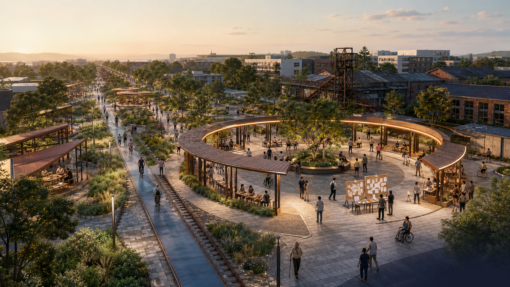
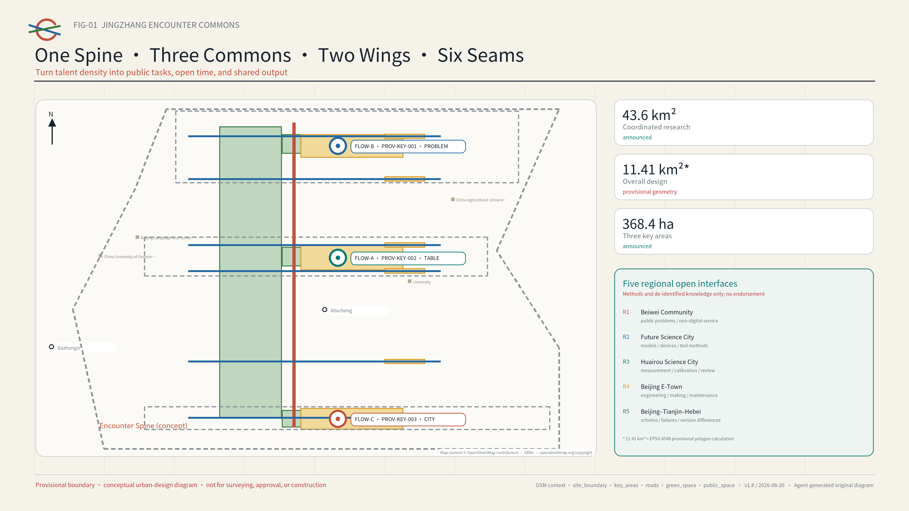
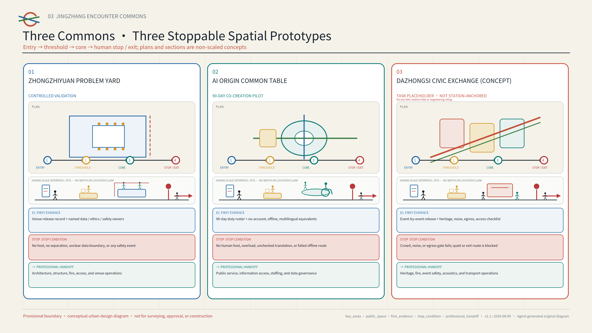
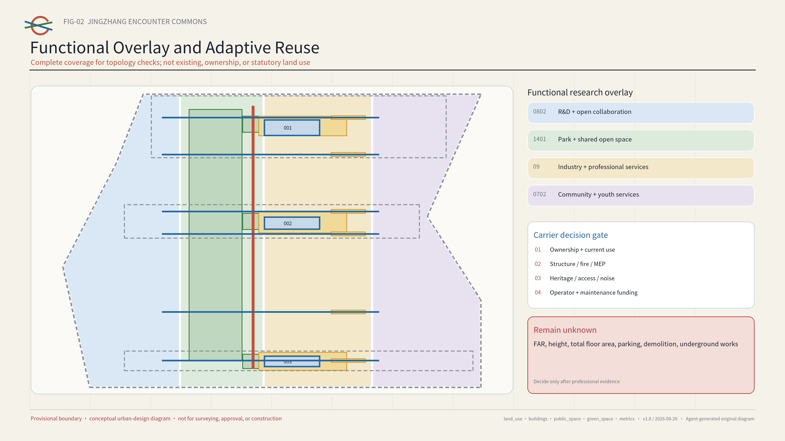
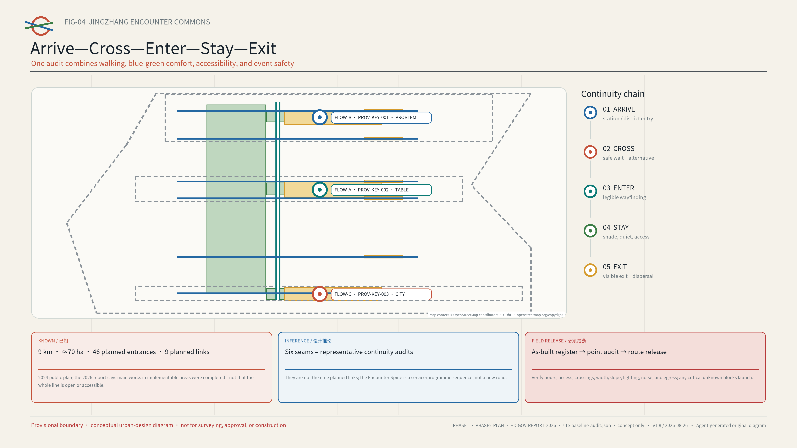
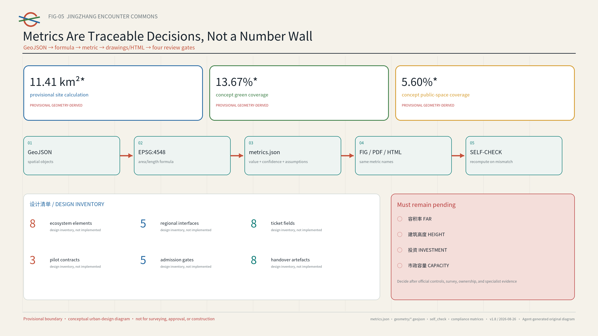

# JINGZHANG ENCOUNTER COMMONS

> Let dense talent create meaningful connections.
> AI lowers the cost of encounter; people decide whether to travel together.

*Presentation-layer limitation | AI-generated concept visual (2026-08-09): an abstract spatial narrative of the public-collaboration experience across One Spine and Three Commons. It is not a site photograph, existing-condition or boundary evidence, an official planning drawing, an approved design, or built work. People, buildings, dimensions, materials, and exact location are illustrative.[source:AI-CONCEPT-VISUALS-20260809]*

## Executive Summary: Replace "Who Should Meet?" with "What Can We Complete Together?"

The Jing-Zhang corridor already concentrates universities, research teams, founders, and communities, but talent density does not automatically produce collaboration. Public problems, available venues, open time slots, mentors, and services are fragmented across organisations, forcing young people to repeatedly cross access, information, and trust barriers. Haidian's public material reports that AI Origin Community has more than 10,000 practitioners and that people aged 25-35 exceeded 70% in a local enterprise survey.[source:HD-AI-ORIGIN-FIRST-STOP]

Phase I of Jing-Zhang Railway Heritage Park opened at approximately 2.5 kilometres and 16.8 hectares; a 2024 official plan described a public-space baseline of approximately nine kilometres and seventy hectares, with 46 planned entrances, nine planned urban links, three paths plus greenery, and eight planned community activity areas; Haidian's 2026 government report states that main works in implementable Phase II areas had been completed.[source:BEIJING-JZ-PARK-PHASE1] [source:BEIJING-JZ-PARK-PHASE2-PLAN] [source:HD-GOV-REPORT-2026]

The proposal should therefore overlay a reversible operating protocol on existing and advancing public space rather than design another park. Planned entrances, however, are not necessarily built, open, or accessible entrances; any route still requires an as-built/operating register and point-by-point field audit.[assumption:A-PHASE2-ASBUILT-001]

The proposal therefore does not recommend people. It schedules the public conditions for collaboration. AI combines public tasks, spaces, time slots, and shared resources only from authorised catalogues; a person decides whether to join, a named host decides whether to publish, and an on-site duty holder decides whether to pause. One Encounter Spine, three Commons, two resource wings, and six weak-connection seams spatialise this operating model. A reversible ninety-day AI Origin pilot is the first candidate minimum slice. [metric:pilot_duration_days] [depth:overall_spatial_structure]

| Delivery layer | What this version supplies | How a professional team takes over |
| --- | --- | --- |
| Spatial | One Spine, Three Commons, Two Wings, Six Seams, and three plan-section prototypes | Re-site and dimension them with official polygons, ownership, transport, and field evidence |
| Operations | An eight-field Encounter Ticket, three pilot contracts, and five admission gates | Obtain signatures from authorised venue, safety, access, data, and operations roles |
| Evidence | A ninety-day baseline, eight commissioning/handover artefacts, and public review and retirement records | Verify access, hosting, deletion, and exit before discussing expansion |
| Coordination | Five open interfaces with Beiwei Community, Future Science City, Huairou Science City, Beijing E-Town, and the Beijing-Tianjin-Hebei region | Convert an interface into cooperation only after a reply and agreement; none is presented as endorsement or commitment |

A simple test lets reviewers decide whether the proposal works: can a person without a smartphone, unwilling to provide private data, or needing accessible or multilingual support still find a task, enter the place, obtain human help, see the result, and leave safely? If not, the scenario must not launch. [metric:encounter_ticket_field_count] [metric:handoff_artifact_count]

## Design Basis and Source List

This proposal translates “a high-quality district desired by global AI innovators” into a testable urban-design question. Talent is already dense, yet public problems, available spaces, open time slots, and collaboration resources are fragmented across organisations and interfaces. Haidian’s official material describes the Beijing AI Origin Community as friendly to entrepreneurship, encounter, and growth. Another official report identifies narrow social circles and insufficient emotional support among young technology workers and documents the “Future Relationship Lab” initiative. A 2026 mobile talent-service station provides a local public-service baseline. The proposal therefore designs social infrastructure rather than a friendship product: AI reduces the cost of discovering public tasks and common resources, while each person decides whether to participate.[source:HD-YOUTH-RELATIONSHIP-LAB] [source:HD-AI-ORIGIN]

Evidence follows three tiers. The official announcement, public Agent taskbook, repository standards, and Haidian government pages define objectives, scope, and local baseline. Six primary-source city or district cases supply transferable mechanisms only. The proposal’s concept layers, metrics, and operating assumptions are design recommendations. Publisher, link, intended use, rights status, and limitations are recorded in `sources.json`; every uncertain condition is registered in `assumptions.json`.[source:SOURCE-REGISTRY] [standard:PROJECT-AGENT-OPEN-CALL-TASKBOOK]

Public facts about Jing-Zhang Railway Heritage Park, design inferences, and field handoff are registered separately in `visual/assets/site-baseline-audit.json` so that planned quantities, construction status, and current operating conditions cannot substitute for one another.[source:BEIJING-JZ-PARK-PHASE1] [source:BEIJING-JZ-PARK-PHASE2-PLAN] [source:HD-GOV-REPORT-2026]

Until as-built and operating records plus point-by-point field checks are complete, planned entrances and construction status cannot be upgraded into a route or pilot-release claim.[assumption:A-PHASE2-ASBUILT-001]

| Known fact | Design inference made by this proposal only | Required field audit and professional handoff |
| --- | --- | --- |
| Phase I public baseline of approximately 2.5 km/16.8 ha; the 2024 plan describes approximately 9 km/70 ha and 46 planned entrances | Treat the planned entrance set as a candidate access-audit universe and overlay an operating protocol on existing public space | Obtain as-built boundary, current entrance, and operator registers; verify hours, step-free continuity, and emergency exit point by point |
| The 2024 plan describes nine planned urban links and three paths plus greenery | The six “seams” are representative arrive–cross–enter–stay–exit audit transects only | Verify crossing control, clear width/slope, conflict points, night lighting, and a safe alternative; do not publish an unverified route |
| The 2024 plan describes eight planned community activity areas; the 2026 report records completion of main works in implementable Phase II areas | Overlay reversible Commons prototypes on candidate carriers only | Verify ownership, operator, capacity, fire, noise, heritage, and data conditions; do not launch without authorisation |

A candidate seam may move from `pending/not_authorized` to a published route only after four roles complete the same arrival-to-exit joint walkthrough. An authorised venue operator checks ownership or operating authority, hours, capacity, and on-site stop authority; a local resident or community representative checks daily-access conflict, noise, and complaint response; an accessibility participant tests the whole journey with no local account, an unavailable phone, and mobility or sensory support; and a safety or transport professional checks crossings, lighting, fire, and egress. All four slots require real named acceptance, while the public output keeps only the date, an anonymised issue/stop list, repair owner, recheck date, and publish-or-withdraw decision. It never publishes participant identity, precise trajectory, or accessibility and complaint details.[assumption:A-SITE-VERIFY-001] [depth:traffic_rail_slow_parking]

The repository currently contains no official precise polygon for the overall design area or the three key areas. `geometry/site_boundary.geojson` and `geometry/key_areas.geojson` reuse the organiser-provided provisional rough geometry and explicitly state `official_boundary=false`. Grey dashed outlines support composition, checking, and provisional area calculations only; they are not official redlines, road boundaries, property lines, or approval evidence. The announced 43.6 km², approximately 11.4 km², and 368.4 ha are brief figures. The value 11,412,825.386 m² is the EPSG:4548 calculation of the provisional polygon; the two must not be conflated as a precise statutory area. All layers, ratios, and drawings must be recomputed when official geometry becomes available.[source:BOUNDARY-SOURCE] [assumption:A-BOUNDARY-001]

Every spatial action is a “conceptual recommendation, reference scheme, or item for professional deepening.” The package makes no final determination on FAR, building height, retain-renovate-demolish decisions, road or rail alignments, municipal capacity, investment, ownership, approval, or development sequence. Proposed events are not government commitments, and no private, internal-enterprise, or unpublished planning data are used.[standard:MOHURD-CONTROL-DETAILED-PLANNING] [depth:risk_missing_data]

## Three-Level Scope Framework

The three levels form a strategic–system–prototype progression rather than three disconnected drawing sets. The 43.6 km² coordinated research area links universities, research institutions, enterprises, communities, and regional innovation resources. The approximately 11.4 km² overall design area translates those connections into public-space, walking, service, and operating networks. The 368.4 ha key-area scope tests three replicable encounter prototypes. Announced figures of 192.1 ha for Zhongzhiyuan, 104.3 ha for the AI Origin Community, and 72.0 ha for Dazhongsi organise the tasks; provisional rectangles must not be interpreted as parcel boundaries.[source:OFFICIAL-ANNOUNCEMENT] [depth:three_level_scope_framework]

The overall structure is “One Spine, Three Commons, Two Wings, Six Seams, Twelve Scenes.” The Encounter Spine organises a sequence of public spaces along the Jingzhang corridor. The three Commons are the Common Problem Yard at Zhongzhiyuan, Common Table Yard at AI Origin, and Common City Yard at Dazhongsi. The two wings are the Zhongguancun Technology Service Wing and Xiaoyuehe Scenario Enablement Wing. Six east–west seams are representative continuity-audit transects sampled from the planned network; they test road, campus, park, and accessibility discontinuities and are not the nine planned urban links reported by the official source. Twelve scenarios can be launched at small scale, evaluated, and retired.[source:BEIJING-JZ-PARK-PHASE2-PLAN] [assumption:A-PHASE2-ASBUILT-001]

This is not a new infrastructure corridor or statutory structure; it is an operating map that places tasks, spaces, times, resources, and accountable hosts on one interface, with one numbered traceability chain for the spatial layer and six concept connections.[data:geometry/roads.geojson#ROAD-SPINE-001] [metric:connector_count]

An open ledger closes the loop across all three levels. The coordinated level publishes verifiable public problems and resources. The overall level registers candidate spaces, open hours, accessibility, and safety conditions. The key-area level runs controlled pilots. Each pilot produces a public output, retrospective, and retirement record before replication, revision, or archiving. A node without field survey, ownership coordination, fire-safety review, and professional confirmation remains only a candidate.[assumption:A-SITE-VERIFY-001] [depth:overall_spatial_structure]

## Coordinated Research Area: Industry and Future City Research

The proposal disaggregates the AI ecosystem into the taskbook's eight schedulable inputs rather than a company list: land, space, industry, capital, talent, compute, data, and scenarios. Land records statutory and ownership status only; space records available time and access; industry and capital gain no default data right; talent enters as a public-task role rather than a ranked person; compute and data state versions, permissions, and deletion; and every scenario has human accountability and exit. Zhongzhiyuan focuses on full-stack technology and controlled validation. AI Origin focuses on cross-campus talent, venture translation, and public services. Dazhongsi focuses on first use, civic feedback, and cultural communication. The two wings contribute professional services and real problems. Every resource call has an accountable person, time limit, cost class, and exit condition. [source:AGENT-TASKBOOK] [metric:ecosystem_element_count] [depth:existing_conditions_diagnosis]

Six primary-source cases form a transferable mechanism library. Their scale, authority, and commercial models are not copied:

| Case | Primary mechanism | Jingzhang transfer | What is not copied |
| --- | --- | --- | --- |
| Singapore Punggol Digital District | Education, industry, community, and a living lab in proximity | Link campuses, firms, and city tests through public problems | Development intensity or platform vendor |
| Helsinki Varaamo | One interface to discover and reserve public rooms and equipment | Candidate space–time–facility ledger | Any assumption that local spaces are already authorised |
| Seoul Community Space | Search, programme discovery, and registration across public/private shared spaces | Let operators publish genuinely available time slots | A historical space count as a current fact |
| Paris Quartier Jeunes | Youth employment, rights, health, culture, and shared work in one welcoming place | Account-free equivalent service entry at the Common Table | Institutional staffing or service commitments |
| MIT Kendall Square | Research, housing, retail, culture, open space, and community input | Connect innovation display to everyday life | Ownership, development, or university governance models |
| Paris UrbanLab | Real-condition pilots that can stop or pivot | A test–review–scale/exit gate | Treating a concept pilot as an approved project |

Together, the cases reveal a planning innovation: scarce urban resources include not only area but also accessible time, legible invitations, trusted hosts, and preserved public outputs. The space ledger therefore records more than square metres: public/reservable/restricted status, accessibility, noise and capacity, data need, host, maintainer, and exit route.[source:CASE-PUNGGOL] [source:CASE-PARIS-URBANLAB]

### Five Regional Open Interfaces: Methods That Can Return, Not Prewritten Partnerships

The taskbook names Beiwei Community, Future Science City, Huairou Science City, Beijing E-Town, and Beijing-Tianjin-Hebei coordination as a deep-review dimension. This proposal does not write endorsements on behalf of any party. It declares five candidate interfaces with the status `open_interface_no_commitment`. The minimum unit of coordination is one reproducible public task, one shared field set, one independent review, and one adopt/exit conclusion--not a signing photograph or personal-data exchange. [source:AGENT-TASKBOOK] [metric:regional_interface_count]

| Candidate interface | Non-sensitive artefact Jingzhang can open | Method that may return | Hard boundary |
| --- | --- | --- | --- |
| Beiwei Community | Public-problem template, non-smartphone route, and accessibility checklist | Community hosting, preservation of minority views, and repair language | No resident recruitment or raw-opinion transfer before authorisation |
| Future Science City | Public-task orchestration and space-time conflict test | Validation methods linking research facilities and city services | No assumed procurement, policy recognition, or data sharing |
| Huairou Science City | Multilingual public-explanation and evidence-level templates | Measurement, calibration, science communication, and independent review | No uncleared content and no equation of communication with safety certification |
| Beijing E-Town | Offline, stop, spare-part, and retirement fields for the event-operations sandbox | Engineering, manufacturing, interoperability, and lifecycle experience | No named vendor and no self-certification of safety by a supplier |
| Beijing-Tianjin-Hebei | De-located Encounter Ticket schema, failure examples, and version differences | Cross-city access, maintenance, and exit lessons | Exchange de-identified knowledge assets only, never personal or sensitive operating data |

The original identity combines an “open ring” with twin Jingzhang rails. Two trajectories meet at a circle with a visible gap, signifying voluntary entry and exit at any time. Origin Blue represents trustworthy services, Signal Orange an open invitation, Park Green public space, and Rail Grey the historic base. The primary English name is JINGZHANG ENCOUNTER COMMONS; sub-brands are COMMON PROBLEM YARD, COMMON TABLE YARD, and COMMON CITY YARD. No corporate mark, portrait, or third-party image is used.[standard:PROJECT-AGENT-OPEN-CALL-TASKBOOK] [assumption:A-BRAND-001]

## Overall Design Area: Urban Renewal and Regulatory-Plan-Level Urban Design

Renewal follows the sequence “open protocol first, lightweight component second, professional works later.” First, audit usable hours and access conditions of existing indoor and outdoor space. Second, create a visible fifteen-minute encounter interface with movable tables, clear wayfinding, shade, lighting, temporary power, and accessibility infill. Third, only where actual use, public feedback, and professional survey support it should qualified teams study buildings, roads, municipal systems, or permanent landscape works. This tests demand and operating capacity without presuming large-scale demolition or construction.[standard:MOHURD-URBAN-DESIGN-MEASURES] [depth:land_use_layout]

`land_use.geojson` is a four-part functional research overlay covering the provisional overall area. It represents conceptual coordination among innovation R&D, public green space, industrial services, and community support; it is neither existing land use nor statutory zoning. `buildings.geojson` contains three envelopes for adaptive-reuse candidate carriers requiring site verification, not a building survey or a retain-renovate-demolish decision. Development intensity, total floor area, height, and parcel boundaries remain unknown pending statutory controls, ownership, survey, and professional capacity evidence.[data:geometry/land_use.geojson#LU-001] [assumption:A-CONTROLS-001]

Four decision labels are reserved for later deepening: retain and share time; adaptive-reuse candidate; temporary activation; and pending assessment. A label may advance only after field survey, structural and fire safety, accessibility, heritage, noise, operator, maintenance, and ownership checks. Demolition is never a default action. Transport and rail work covers walking transfers, crossing waits, and event-day operations only—not road redlines, bridges, tunnels, underground works, or track alignment. Municipal work prioritises reversible power, network, lighting, and edge-device interfaces; capacity and energy claims await specialist calculations.[depth:retain_renovate_demolish] [depth:municipal_new_infrastructure]

## Detailed Design of Key Areas

The three key areas share one Encounter Protocol but perform different roles in the innovation cycle. Each has a public entry, controlled validation mode, visible public output, and exit-oriented landmark. Provisional boundaries show relative position only; professional teams must select final locations within official geometry and verified field conditions.[data:geometry/key_areas.geojson#PROV-KEY-001] [depth:three_key_area_detailed_design]

`PROV-KEY-003` is only an order-and-announced-area placeholder, not a Dazhongsi Station-anchored frame. Open repository Issue #1029 reports an approximate 2.26 km separation from Dazhongsi Station, but this is neither an organiser ruling nor official geometry. This version therefore makes no station-quadrant, station-to-site route, or station-area integration claim; every “Dazhongsi Common City Yard” action is a transferable prototype.[source:REPO-ISSUE-1029] [assumption:A-DAZHONGSI-ANCHOR-001]

**Zhongzhiyuan Common Problem Yard.** “Publish the problem before recruiting the technology.” Communities, districts, and public-service organisations frame public problems as bounded task cards. R&D teams test models, robots, or tools in an isolated setting, and a host decides whether a result can enter limited first use. Spatial prototypes include an open problem wall, reconfigurable test tables, a separated demonstration strip, and a failure-review bench. The landmark “First Open Table” displays only the problem, validation conditions, and public output—not firm rankings or private relationships. Every model or robot test still requires separate safety, data, and operating approval.[assumption:A-TEST-001]

**AI Origin Common Table Yard.** Proposed as the first ninety-day, low-cost pilot, it combines a cross-campus table, mentor clinic, OPC compliance clinic, multilingual newcomer desk, and talent/public-service navigation. People may view activities without an account and register on site. AI recommends from public task tags, capacity, language, and time; a host must confirm before publication. The pilot collects no face, contact list, precise trajectory, emotional state, or private-relationship data and never predicts “who should know whom.” The “Public Contribution Moment Wall” records shared documents, fixes, translations, tests, and retirement decisions only.[source:HD-TALENT-MOBILE-STATION] [metric:pilot_duration_days]

*Presentation-layer limitation | AI-generated concept visual (2026-08-09): a candidate operating setting for account-free entry, human hosting, an open common table, and visible exit. It is not a real-site record, existing-condition survey, authorised event, or implementation commitment. Space, occupancy, structures, and operating status await field and professional review.[source:AI-CONCEPT-VISUALS-20260809]*

**Dazhongsi Common City Yard.** It brings R&D outputs into legible first-use and feedback settings through co-edited cultural guides, evening public demonstrations, explainable intelligent-native consumption experiences, and citizen/enterprise retrospectives. The spatial prototype includes a closable display interface, quiet feedback table, accessible viewing area, and visible night boundary. The “Centennial Junction” links a verifiable Jingzhang railway timeline with Zhongguancun’s open-collaboration culture using original graphics; history is not a technology decoration. Every evening opening, commercial event, noise condition, fire arrangement, and heritage question requires event-specific approval.[source:CASE-PARIS-QJ] [assumption:A-HERITAGE-001]

*Presentation-layer limitation | AI-generated concept visual (2026-08-09): a transferable prototype for first use, public feedback, a quiet edge, and distributed exit. It does not depict the actual Dazhongsi site, station entrance, buildings, or an approved event. Siting, dimensions, heritage, fire, noise, and operating conditions await official material, field survey, and specialist review.[source:AI-CONCEPT-VISUALS-20260809]*

These are not one generic plaza with three names. They are three transferable plan-section-operation prototypes. The table fixes spatial sequence, first evidence, hard-stop location, and professional handover. All dimensions shown in figures are component-level suggestions; siting and dimensioning await official polygons, ownership, and field survey.[metric:spatial_prototype_count] [depth:three_key_area_detailed_design]

| Prototype | Plan-section sequence | First evidence required | On-site hard stop | Next professional accountability slot |
| --- | --- | --- | --- | --- |
| Zhongzhiyuan Common Problem Yard | Public foyer → rule threshold → closable test tables/controlled demonstration strip → human emergency-stop desk → failure archive | Authorised venue operator, test boundary, and equipment-safety checklist | No named duty holder; sandbox breach; uncontrolled equipment/person risk | Joint sign-off by venue operations, safety, data/ethics, and equipment specialists |
| AI Origin Common Table Yard | Park/campus/street edge → quiet and accessible buffer → common table → multilingual/mentor service bar → visible exit | Continuous accessible route, capacity, and opening-hours walk-through; the public first phase of Jing-Zhang Railway Heritage Park is baseline context only | Offline equivalent fails; crowd/noise breach; personal data exceed minimum | Public-space, access, fire, and day-to-day operations review [source:BEIJING-JZ-PARK-PHASE1] |
| Dazhongsi Common City Yard | Four-way urban arrival → public-service forecourt → reversible first-use/feedback strip → heritage and quiet edge → distributed exits | Official scope and a real candidate site, then arrival/crossing/egress, heritage, and noise checks | No safe exit; heritage/resident impact; commercial display displaces public feedback | Planning, transport, heritage, fire, city-management, and community confirmation |

## AI Innovation Ecosystem, Personas, and AI+ Scenarios

Personas represent a current task and access barrier, never a persistent relationship profile. Seven types are used: a student or young researcher seeking cross-campus collaboration; a first-time/OPC founder needing a compliance path; an engineer needing a real problem; a resident or community group seeking public participation; an international newcomer needing multilingual entry; a frontline operator responsible for safety and service; and a mobility- or sensory-impaired visitor needing continuous access and quiet participation. A person may change roles between tasks, and no persona is used to score, rank, or infer sensitive traits.[source:HD-YOUTH-RELATIONSHIP-LAB] [metric:persona_count]

A ninety-minute synthetic journey turns inclusion from a slogan into a checkable path. A first-time international newcomer with limited Chinese, no local account, and an empty phone battery follows physical bilingual wayfinding, enters through a human walk-in desk, chooses an authorised public task, contributes by paper card or speech, reviews a bilingual output, requests deletion of temporary preferences or lodges a complaint, and leaves by a visible route without creating a persistent account. Every step states the limited AI duty, human accountability, minimum data, and hard stop in `visual/assets/ordinary-person-journey.json`. This is a composite design scenario for a future pilot to test, not field user research or performance evidence.[assumption:A-DATA-001] [assumption:A-ACCESS-001]

All twelve scenario cards use an eight-field minimum operating contract, Encounter Ticket 0.2: (1) public task ID and expiry; (2) entry, accessibility, and exit; (3) candidate space-time-capacity; (4) minimum data and deletion date; (5) named human host and stop authority; (6) resource dependencies and cost class; (7) public output and rights state; and (8) complaint, review, and adopt/revise/retire decision. It contains no persistent account, relationship graph, or personal score. The full schema, fixture envelope, three valid but unauthorised synthetic S01–S03 tickets, five expected-invalid cases, and twelve-scenario index are in `visual/assets/encounter-ticket.schema.json`, `encounter-ticket.fixture.schema.json`, `encounter-ticket.example.json`, `encounter-ticket.expected-invalid.json`, and `encounter-ticket.scenarios.json`. The dependency-free package-local runner `run-encounter-ticket-validation.js` can replay the keyword subset used by the current schema, formats, chronology, data boundaries, authorisation conditions, three positive fixtures, five negative fixtures, and twelve-scenario index with `node visual/assets/run-encounter-ticket-validation.js --check`; `encounter-ticket.validation.json` binds input hashes and the replay summary. The runner explicitly is not a complete Draft 2020-12 engine, and passing synthetic validation does not establish field performance.[metric:encounter_ticket_field_count]

The first three are recast as not-yet-authorised, not-yet-run industry validation protocols, all with `performance_results=null`. Schema validation or a synthetic tabletop rehearsal does not prove that a real service is usable, safe, lawful, publicly accepted, or scalable. The remaining nine embed technology in everyday public service instead of creating another mandatory app.[metric:industry_test_count]

| ID | Scenario and users | AI’s limited duty | Space/time | Human gate, output, and exit |
| --- | --- | --- | --- | --- |
| S01 | Open Task Orchestration Interoperability Test: teams/communities | With public/synthetic tasks, spaces, times, devices, and access rules only, test permission filtering, conflict checks, human reassignment, and rollback | Zhongzhiyuan isolation; fixed version and fixture | Problem owner and test lead co-sign; field-level evidence JSON; hard stop on overreach, unexplained result, or failed rollback |
| S02 | Grounded Multilingual Public-Service Test: newcomers | With dated/source-linked public material and synthetic questions only, test citation coverage, refusal, translation variance, expiry, and human transfer | AI Origin; frozen corpus snapshot | Bilingual public-service worker signs off; versioned Q&A evidence; refuse/transfer on no source, critical mistranslation, or expiry |
| S03 | Accessible Event Operations Sandbox: operators/disabled visitors | With synthetic capacity, route, time, and resource constraints only, test route continuity, conflicts, offline fallback, emergency stop, and strike recovery | Tabletop sandbox for all Commons; approved field rehearsal only | Venue/access/safety roles jointly release; before/after state and restoration receipt; cancel if any safety path fails |
| S04 | Cross-campus Project Clinic: students/researchers | Recommend table session by public topic and equipment | AI Origin, weekends | Institution/venue confirms; next-step list; expire in 30 days |
| S05 | Mentor Hour: first-time founders | Organise public questions and optional services | Rotating service-wing point | Mentor confirms; anonymous topic note; no private-chat storage |
| S06 | OPC Compliance Clinic: small teams | Navigate public policy, IP, and service entry | AI Origin, booked slot | Professional explains; not legal advice; withdraw stale material |
| S07 | Talent and Health Service Navigation: youth/newcomers | Multilingual search of public services; no diagnosis | Common Table, account-free | Staff reviews; links/checklist only; no health record retained |
| S08 | Public Test-Partner Call: R&D teams/citizens | Turn validation conditions into a legible invitation | Controlled Zhongzhiyuan area | Ethics/safety review; public result; no start without approval |
| S09 | Community AI Co-design: residents/groups | Cluster anonymous issues and show disagreement | Xiaoyuehe wing | Community host confirms; preserve minority views; delete raw text |
| S10 | Co-edited Cultural Guide: visitors/cultural workers | Check public sources and draft multilingual copy | Dazhongsi, day/evening | Cultural specialist signs off; traceable version; withdraw disputes |
| S11 | Evening Open Demo: engineers/citizens | Draft plain-language explanation and Q&A queue | Dazhongsi, limited hours | Host/venue releases; public feedback; stop if noise limit fails |
| S12 | Annual Encounter Week: all users | Aggregate public tasks and accessible event schedule | Three Commons, annual candidate | Joint curators confirm; output index; new permission each edition |

All three test Agents “recommend but do not decide.” A public catalogue enters retrieval; a rule engine first filters permission, accessibility, capacity, and freshness; the model explains a ranking only among eligible options; a host releases the result. No permanent personal account is required by default. One-time registration tokens are deleted after retrospective, and public outputs are stored separately from private raw input. Walk-in, telephone, and human service remain equivalent; refusing AI never reduces eligibility.[standard:PROJECT-AGENT-OPEN-CALL-TASKBOOK] [metric:scenario_card_count]

Every pilot must pass five admission gates in sequence: G0 legal, ownership, and task authorisation; G1 venue, safety, access, and capacity; G2 data, content source, rights, and deletion; G3 named host, non-AI equivalent, failure/emergency stop/recovery; and G4 public benefit, independent review, complaints, and handover. A `blocked` gate or missing evidence prevents launch. Detailed status, role, evidence path, and stop rule are in `visual/assets/pilot-contracts.json`.[metric:admission_gate_count]

## Land Use, Building Scale, and Retain-Renovate-Demolish Strategy

The land-use language follows two rules: do not invent statutory classes, and do not represent a design overlay as existing conditions. Four complete-coverage polygons use allowed repository codes for innovation R&D, green/open space, industrial service, and community support. Their widths are a topologically complete conceptual partition, not planning conditions. Three building envelopes compare three cost paths—sharing existing time, lightweight adaptive reuse, and temporary outdoor components. Their areas are concept-polygon calculations, not surveyed building footprints.[standard:MNR-LAND-USE-CLASSIFICATION-GUIDE] [data:geometry/buildings.geojson#BLDG-COMMON-001]

The retain-renovate-demolish decision table activates only in professional deepening: ownership/current use; structure/fire/MEP; heritage/character; all-weather accessibility; operator and maintenance funding; and evidence from at least one complete pilot cycle. Until all six are present, the status is “pending assessment.” Permanent new buildings, height, FAR, above/below-ground scale, and parking supply remain unknown. Massing on the A3/A0 material illustrates component scale and interface only.[assumption:A-SITE-VERIFY-001] [depth:height_massing_character]

The component library includes an open table, movable host station, quiet seat, wheelchair turning bay, multilingual e-ink sign, temporary shade, closable power/network box, public contribution card, and exit marker. Each must be maintainable, replaceable, and useful offline. Sensors are not default components; any attendance estimate first uses manual time samples and non-identifying totals.[assumption:A-DATA-001] [metric:building_footprint_area_sqm]

## Transport, Rail, Municipal Infrastructure, and Public Services

The Encounter Spine is a public-space and programme concept, not a new road or rail line. The 46 planned entrances, nine planned urban links, and three paths plus greenery in the 2024 public plan are a verification baseline only. This proposal's six east–west connections sample representative barriers with a five-stage audit—arrive, cross, enter, stay, exit—and do not map one-to-one to those planned quantities.[source:BEIJING-JZ-PARK-PHASE2-PLAN] [assumption:A-PHASE2-ASBUILT-001]

One north–south line and six cross-lines in `roads.geojson` express intentions requiring field verification. No specific entrance or safe route is published before an as-built/operating register is obtained; any crossing of a major road, railway, campus, or controlled district requires separate transport, engineering, ownership, and safety study.[data:geometry/roads.geojson#ROAD-CONNECT-001] [depth:traffic_rail_slow_parking]

Rail stations are service-transfer interfaces, not alignments editable by this proposal. Candidate actions are continuous, legible directions from exits to the Commons; staggered dispersal; walking/cycle-parking guidance; pre-checked accessible routes; and a rule to close or shrink an event under crowd pressure. Live footfall, video surveillance, and individual trajectories are not prerequisites. Any future lawful aggregate-data connection requires data-protection, minimisation, and purpose review.[assumption:A-ACCESS-001]

The municipal/digital base follows “small ports, hard boundaries”: closable power and network interfaces, an offline-readable event list, mirrored public-service links, device-health logs, and a human master switch. Paper task cards, human hosts, and fixed service desks preserve basic operation when AI fails. Edge devices collect no biometric identity, do not reuse tokens across events, and do not require vendor lock-in.[source:HD-TALENT-MOBILE-STATION] [standard:MOHURD-URBAN-DESIGN-MEASURES]

## Blue-Green Network, Public Space, and Urban Character

The blue-green strategy does not add technology objects to parks; it treats ecological comfort as a precondition for encounter. The concept green layer tests continuous shade, rain alternatives, seat spacing, quiet areas, and night boundaries. The public-space layer contains three Commons and open-table candidates. Green and public-space ratios are computed from provisional design polygons and express concept-layer coverage only—not existing green ratio, regulatory control, or implementation commitment.[data:geometry/green_space.geojson#GREEN-SPINE-001] [depth:blue_green_public_space]

The three pilgrimage landmarks celebrate contribution rather than celebrity photography. The First Open Table remembers the moment a problem becomes public. The Centennial Junction links Jingzhang’s connective history to open collaboration in Zhongguancun. The Public Contribution Moment Wall records shared outputs, major corrections, and failures deliberately retired. The honour system displays only authorised public contribution names, with an anonymous option; it never displays relationships, spending, financing, or algorithmic ranking.[source:AGENT-TASKBOOK] [metric:landmark_count]

The cultural story runs “from rails connecting geography to open collaboration connecting knowledge” and uses a three-layer content register to prevent invention. `fact` accepts only traceable public history; `memory` records the contributor's consent and withdrawal route; `design_interpretation` is labelled as contemporary design. An optional walking narrative can link heritage facts, the First Open Table, failure review, and annual Encounter Week, but does not replace statutory heritage interpretation. Wayfinding uses short bilingual text, one numbering system, and reachable placement. The district logo identifies the corridor; three Commons icons identify functions. The original vector mark and minimum-use rules are in `visual/assets/encounter-commons-logo.svg`. Five character principles are public legibility, restrained day/night expression, reversible installations, visible heritage, and visible failure.[source:BEIJING-JZ-PARK-PHASE1] [assumption:A-HERITAGE-001] [depth:height_massing_character]

## Renewal Projects, Implementation Policy, and Phasing

Ten projects form a “mechanism before space” package: P01 public problem and space-time ledger; P02 ninety-day AI Origin Common Table; P03 controlled Zhongzhiyuan Common Problem test; P04 Dazhongsi first use and feedback; P05 accessibility/safety audit of six connections; P06 multilingual newcomer desk; P07 rotating OPC and mentor clinics; P08 three landmarks and contribution archive; P09 monthly City Problem Table and quarterly Cross-campus Open Day; and P10 annual Encounter Week. Each has a candidate accountable party, prerequisite, minimum output, public retrospective, and stop rule. No fiscal allocation or delivery party is presumed.[data:geometry/phasing.geojson#PHASE-001] [metric:project_count]

| Project | Primary users | A / R / C slots awaiting real acceptance | Minimum resource and cost class | Start gate, minimum output, and stop/recovery |
| --- | --- | --- | --- | --- |
| P01 Space-Time Ledger | Problem owners, venue operators, public | A authorised task/venue owner; R ledger steward; C access/data | Existing staff and public catalogue, A | G0–G2; authorised catalogue with expiry; hide and version-archive any stale/unowned item |
| P02 AI Origin Common Table | Youth, international newcomers, disabled visitors | A authorised venue operator; R named host; C fire/access/multilingual/data | Existing place and movable table, A | G0–G4; ninety-day baseline and public review; stop on failed offline equivalent/safety, delete expiring data, return place |
| P03 Zhongzhiyuan Test | Public problem owners, R&D teams, evaluators | A authorised test venue; R test lead; C device safety/ethics/independent review | Isolated equipment and reversible enclosure, B | Re-run G0–G4 per fixture; versioned evidence JSON and rollback receipt; hard stop on sandbox breach, no explanation, or failed restoration |
| P04 Dazhongsi First Use | Citizens, cultural workers, enterprise testers | A real venue/event operator; R duty holder; C planning/transport/heritage/fire/community | Reversible single-event display and feedback desk, B | Obtain official scope and real site before G0–G4; feedback and strike receipt; cancel without safe exit or if commercial display displaces public feedback |
| P05 Six-Seam Walk-through | Walk/cycle users, mobility/sensory-impaired visitors | A relevant place/road management slot; R access auditor; C transport/community | Manual walk, paper form, managed photo rights, A | G0–G1; arrive-to-exit barrier/alternative list; do not publish an unauthorised/unsafe route, record it as pending only |
| P06 Multilingual Newcomer Desk | International newcomers, public-service staff | A service-operation slot; R bilingual worker; C authoritative source/access | Frozen public-material snapshot and human desk, A | G2–G3; source-linked answer version; refuse and transfer to human on no source, critical mistranslation, or expiry |
| P07 OPC/Mentor Clinic | First-time founders, small teams | A rotating professional-service organisation; R duty professional; C IP/compliance/conflicts | Existing service slot, A | G0, G2–G4; next-step list labelled non-legal conclusion; stop without duty holder, conflict disclosure, or fresh material |
| P08 Landmarks/Contribution Archive | Public, railway culture, community contributors | A public-space/content operator; R editor; C heritage/rights/community | Reversible wayfinding and rights register, B | G0, G2, G4; fact-memory-interpretation register; remove disputed/withdrawn/uncleared content and retain no private relationship |
| P09 Monthly/Quarterly Open Day | Youth, residents, campuses, districts | A authorised co-host per edition; R edition host; C safety/community/data | Shared venue and rota, A | New G0–G4 per edition; task/output/complaint review; shrink/revise after two cycles with no public output or exclusionary participation |
| P10 Annual Encounter Week | Public and five regional-interface candidates | A authorised curator for that edition; R lead duty holder; C all professional/public seats | Multi-site temporary programme, B; permanent works separately C | Independent annual permission; public output index and handover pack; cancel edition if host, budget, safety, or approval is absent |

The ninety-day evaluation begins with a two-week baseline. Each session records once and each week aggregates: whether public tasks remain valid; completion/retirement state; success of the account-free equivalent; accessibility failures; host hours and cost class; complaint receipt/closure; on-time deletion; and site restoration. Candidate service gates are “100% of sessions have a named host and non-AI route before opening; all expiring tokens are deleted by their declared date; every safety/access event enters human review.” These are admission/operating targets for a real pilot to test, not existing performance. Any personal-safety or rights event, critical source failure, inaccessible route without equivalent, missed deletion, or empty A slot triggers immediate stop and a public recovery decision.[assumption:A-PILOT-001] [metric:pilot_duration_days]

| Phase | Concept window | Priority projects | Gate to advance | Stop/revert condition |
| --- | --- | --- | --- | --- |
| 1 Validate | 0–90 days | P01, P02, P05, P06 | Named operator; site, safety, access, and data review; public retrospective | No operator, material safety/privacy issue, or no offline equivalent |
| 2 Network | 4–12 months | P03, P04, P07, P09 | Two stable cycles; executable cross-organisation protocol; complaint/maintenance loop | Exclusionary participation, maintenance failure, or no demonstrable benefit |
| 3 Embed | After 12 months | P08, P10 and any justified permanent deepening | Independent professional/public support; clear ownership, funds, and approval | Site or statutory conditions do not support it; annual review retires it |

Long-term operation uses four seats: a Public Problem Seat validates issues; a Space Operation Seat decides capacity, time, and safety; a Data and Ethics Seat reviews minimum data, model boundary, and deletion; and a Youth and Community Seat can veto exclusionary design. Monthly City Problem Tables, quarterly Cross-campus Open Days, and annual Jingzhang Encounter Week are proposed brands only. Host, date, budget, and scale require approval and partnership agreements.[assumption:A-OPERATIONS-001] [depth:phasing_implementation]

Three pilot contracts leave accountability as slots that real organisations must sign, rather than making commitments on their behalf. P02 AI Origin Common Table has a ten-working-day commissioning pack and a ninety-day baseline; P03 Zhongzhiyuan industry test is authorised per fixture/version; P04 Dazhongsi first use is authorised per event. Every contract fixes A (accountable), R (on-site responsible), C (safety/access/data/professional consultation), and I (public information) slots, plus expansion, stop, and return state. Until an authorised party accepts a slot, the status remains `not_authorized`.[metric:pilot_contract_count] [metric:pilot_start_workdays]

Commissioning and handover require eight artefacts: (1) authorisation and named A slot; (2) space-time ledger snapshot; (3) capacity/access/safety walk-through; (4) data inventory and deletion plan; (5) content/font/brand rights register; (6) human-host, emergency-stop, outage, and recovery drill; (7) walk-in/telephone non-AI route test; and (8) baseline, public notice, and final adopt/revise/retire template. Missing one prevents a plan from being described as operational. Costs use classes A (shared existing space/staff), B (reversible components/temporary service), and C (permanent or specialist works pending quantities and approval), with no fabricated investment total.[metric:handoff_artifact_count]

The conversion path is “public problem → controlled test → limited first use → resident/professional review → replicate, revise, or archive.” Success is not registration or connection count; it is public-task completion, cross-organisation output, accessible equivalent participation, complaint resolution, on-time deletion, and effective voluntary exit. A scenario without public output for two cycles, or with maintenance beyond operator capacity, must shrink or close.[metric:phase_count] [assumption:A-COST-001]

## Metrics, Area Recalculation, and Compliance Matrix

Metrics have three classes. Announced scope figures are approximately 43.6 km² coordinated research, approximately 11.4 km² overall design, and 368.4 ha across three key areas. Recomputable provisional-geometry values include site-polygon area, concept green/public-space coverage, candidate building-envelope area, and Encounter Spine length. Design-inventory counts include three Commons, six connections, twelve scenarios, seven personas, three landmarks, ten projects, and three phases. Geometry values must be recalculated with any official polygon or layer change; inventory counts update with the proposal version.[metric:site_area_sqm] [depth:metrics_recalculation]

| Metric | Current status | Interpretation |
| --- | --- | --- |
| site_area_sqm / green_ratio / public_space_ratio | known, medium/low confidence | Mechanically reproducible from submitted provisional/concept polygons; not statutory or existing-condition indicators |
| commons_count=3 / connector_count=6 / scenario_card_count=12 | known design inventory | Completeness checks; no claim that items are built or operating |
| ecosystem_element_count=8 / regional_interface_count=5 | known mechanism inventory | Structural coverage only; every regional relation remains a no-commitment suggestion |
| encounter_ticket_field_count=8 / pilot_contract_count=3 / admission_gate_count=5 | known protocol inventory | Protocol completeness, not approval or actual operation |
| spatial_prototype_count=3 / handoff_artifact_count=8 / pilot_start_workdays=10 | known design targets | Prototypes, artefacts, and preparation window await real operators and professional verification |
| floor_area_ratio / building_height_m | unknown | No official control, survey, ownership, or specialist condition; no guessed value |
| investment_cny / municipal_capacity | unknown | No delivery body, engineering design, price basis, or professional assessment |
| Pilot outcomes | baseline pending | Formula only; evaluate after lawful, voluntary, minimum data become available |

Five core figures, nine GeoJSON files, the A3 booklet, A0 boards, bilingual offline HTML, narrative, and three compliance/standard/depth matrices share the same metric names. `metrics.json` records formula, source file, confidence, and assumptions; `self_check.json` stores deterministic, spatial, visual, and professional-evidence checks. A discrepancy is repaired by recalculation and regeneration, never by editing one display number.[data:geometry/site_boundary.geojson#SITE-001] [metric:green_ratio]

## Risk, Copyright, and Compliance

The compliance floor is explicit: use public material only; do not process privacy-sensitive information without consent; check copyright for images, fonts, and text; require human sign-off with a review record for consequential judgments; and stop publication whenever a data, spatial, or operating compliance check fails.

The highest ethical risk is turning “encounter” into interpersonal profiling, dating matching, or surveillance. This proposal prohibits recommendations based on face, contact list, precise trajectory, emotion, health, ethnicity, religion, sexual orientation, or social relationship. It processes only actively submitted public tasks, language, accessibility need, time, and resource preferences. Defaults are short-lived tokens, expiry deletion, human hosting, explainable suggestions, and an account-free equivalent. Any future data processing requires separate legal and security assessment.[assumption:A-DATA-001] [standard:PROJECT-AGENT-OPEN-CALL-TASKBOOK]

Spatial risks include provisional-boundary error, ownership, campus/district access, heritage, fire, noise, crossings, and municipal capacity. Precision is reduced to transferable node types; Phase 1 is limited to reversible events and field survey; bridges, underground space, permanent buildings, and road changes go to specialist deepening. Technical risks include hallucination, mistranslation, bias, vendor lock-in, and outage; mitigations are linked sources, human sign-off, offline lists, rule-first filtering, and replaceable interfaces.[source:BOUNDARY-SOURCE] [depth:risk_missing_data]

Equity measures include offline equivalent access, free basic participation, accessible seats, multilingual and plain-language text, quiet sessions, a community veto seat, and no ranking by spending or funding. Operating risk is reduced by small pilots, one accountable owner per item, maintenance funding before launch, two-cycle review, and explicit retirement. `risk.json` rates eight dimensions from 1–5 with mitigation and human-review routes. Missing official boundaries, existing conditions, ownership, transport, municipal, and heritage data are registered as assumptions rather than fabricated spatial anchors.[assumption:A-BOUNDARY-001] [assumption:A-SITE-VERIFY-001]

The declared Agent generated the text, submission-specific graphics, design GeoJSON, HTML, and PDF. Public facts come only from registered sources in `sources.json`. Figures use no third-party raster basemap, photograph, trademark, remote font, or remote script. Low-contrast major-road, rail, water, park, university, and selected-station context in the overview and mobility figures derives from OpenStreetMap vector data, credited to OpenStreetMap contributors under the ODbL. It is orientation context only—not official survey, ownership, or planning evidence. Noto Sans SC is used under its open licence only as rasterised glyphs or a PDF subset; no font file is distributed. Rights and limitations are detailed in `report/copyright_statement.md`. The `COMMUNITY-DISPLAY-ONLY` front-matter licence is not the same as the intellectual-property terms of the separate institutional qualification route.[source:SOURCE-REGISTRY] [source:OSM-CONTEXT-20260809]

The three spatial-setting images were independently generated on 2026-08-09 from text-only prompts written for this proposal, using OpenAI image generation in Codex. The tool exposed no model ID, and no peer work or third-party photograph was supplied as a direct image input. The images help reviewers understand candidate spatial prototypes and human use only; they provide no evidence for boundaries, existing conditions, ownership, dimensioning, engineering feasibility, approval, or implementation outcomes.[source:AI-CONCEPT-VISUALS-20260809]

## References

Core references are the public announcement of the Haidian Branch of the Beijing Municipal Commission of Planning and Natural Resources; the repository’s public taskbook and site package; Haidian government pages on AI Origin, youth practice, and talent services; and primary pages from Singapore JTC, the Cities of Helsinki, Seoul and Paris, and MIT. Full URLs, access dates, uses, and limitations are in `sources.json`. No copyrighted image or lengthy source text is reproduced.[source:OFFICIAL-ANNOUNCEMENT] [source:SITE-PACKAGE]

Five evidence entry points organise the package: provisional scope and key areas in `geometry/site_boundary.geojson` and `geometry/key_areas.geojson`; design overlays and nodes in `geometry/land_use.geojson` and `spatial.json`; calculations in `metrics.json`; task traceability in `compliance_matrix.json`; and gaps/risks in `risk.json` and `assumptions.json`. Before submission, the package is rerendered, finalised, self-checked, and preflighted against the latest main branch. Any official-polygon or rule change triggers whole-package recomputation; old diagrams are never treated as official conclusions.[source:PROCESSED-FACT-PACK] [data:geometry/key_areas.geojson#PROV-KEY-002]
