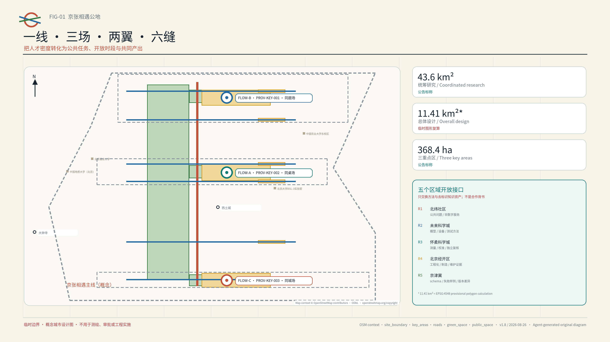
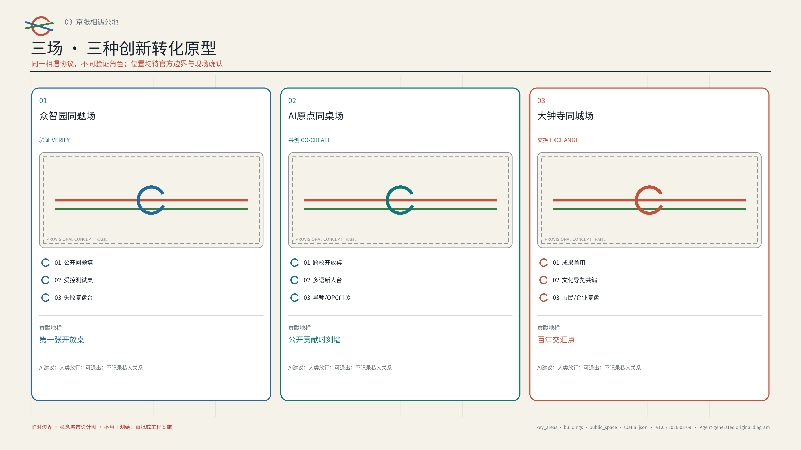
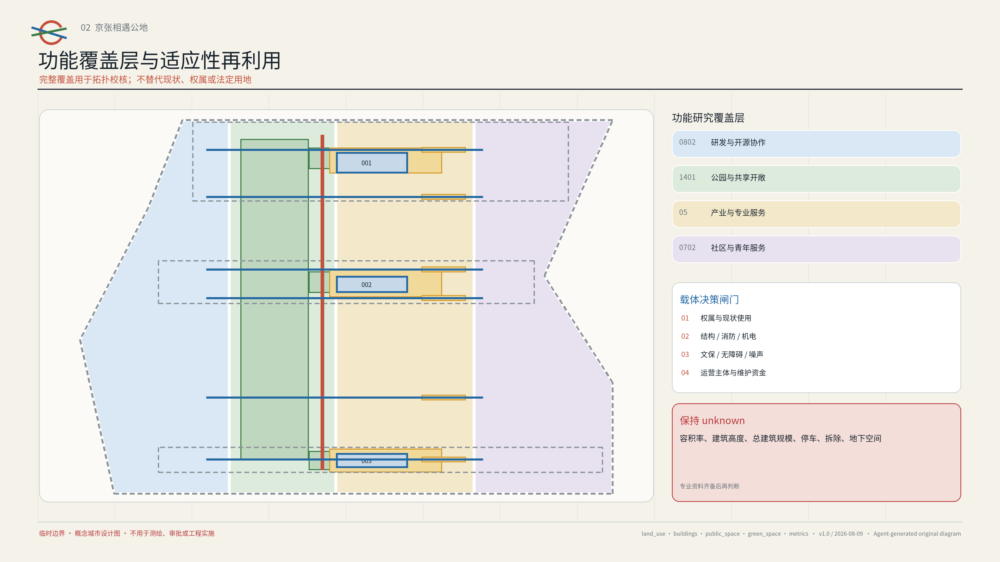
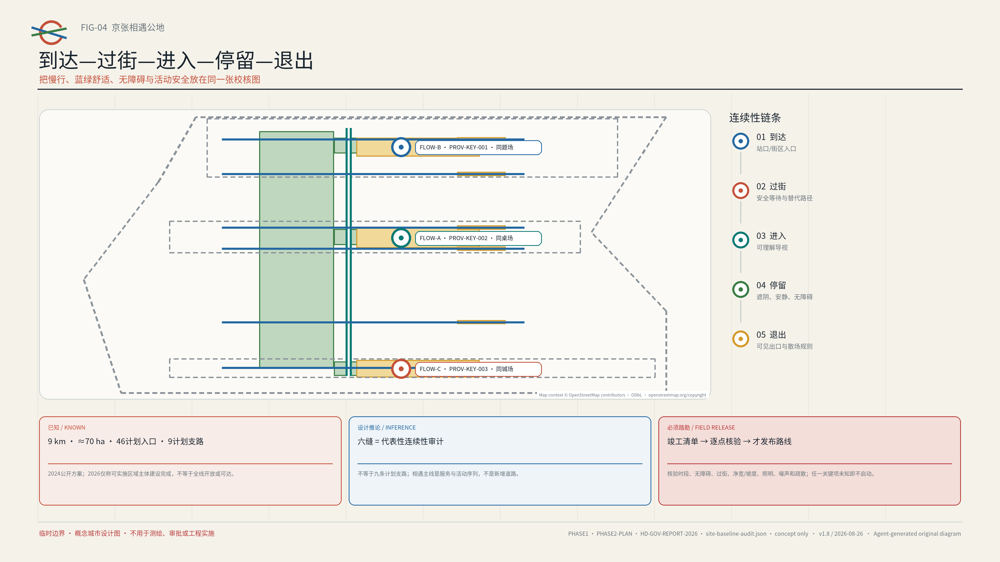
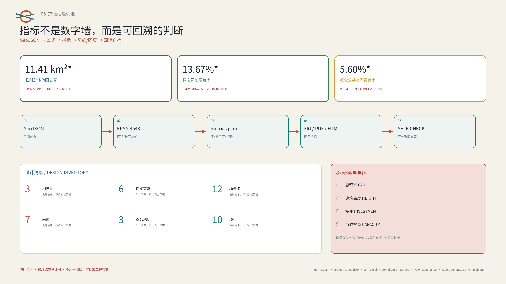

# 京张相遇公地 / JINGZHANG ENCOUNTER COMMONS

> 让高密度人才，产生高质量连接。
> AI lowers the cost of encounter; people decide whether to travel together.

*呈现层限定｜AI 生成概念图（2026-08-09）：以抽象空间叙事说明“一线三场”的公共协作体验。非现场照片、非现状或边界证据、非官方规划图、非获批方案或建成效果；人物、建筑、尺度、材料与具体位置均为示意。[source:AI-CONCEPT-VISUALS-20260809]*

## 一页执行摘要：把“认识谁”改成“共同完成什么”

京张沿线已经集聚了高校、研发团队、创业者和社区，但“有人才”不自动等于“有协作”。当公共问题、可用场地、开放时段、导师与服务资源分散在不同组织中，青年需要不断跨越门禁、信息和信任成本。海淀公开材料显示，AI 原点社区已聚集超过 1 万名从业者，区域企业调研中 25–35 岁人群占比超过 70%。[source:HD-AI-ORIGIN-FIRST-STOP]

京张遗址公园一期已以约 2.5 公里、16.8 公顷开放；2024 年官方方案又把公共空间基线描述为约 9 公里、约 70 公顷、46 个计划入口、9 条计划支路、“三道一绿”和 8 处计划社区活动场地；海淀 2026 年政府工作报告记载二期可实施区域主体已建设完成。[source:BEIJING-JZ-PARK-PHASE1] [source:BEIJING-JZ-PARK-PHASE2-PLAN] [source:HD-GOV-REPORT-2026]

这意味着方案应在既有与推进中的公共空间上叠加可退出运营协议，而不是再造一座公园；但计划入口不等于已建、开放或无障碍入口，任何具体路线仍须取得竣工/运营清单并逐点踏勘。[assumption:A-PHASE2-ASBUILT-001]

本方案的核心不是“推荐人”，而是“编排公共协作条件”：AI 只从已授权目录中组合公共任务、空间、时段与共享资源；人决定是否加入，有名主持人决定是否发布，现场责任人决定是否暂停。设计用一条相遇主线、三座相遇场、两翼资源回路和六条弱连接将这套机制空间化，并以 AI 原点的 90 天可逆试点作为首个候选最小切片。[metric:pilot_duration_days] [depth:overall_spatial_structure]

| 可交付层 | 本版给出什么 | 专业团队如何接手 |
| --- | --- | --- |
| 空间层 | 一线、三场、两翼、六缝；三种平面—剖面原型 | 用官方 polygon、权属、交通与现场数据重新选址和定尺 |
| 运行层 | 8 字段“相遇票”、3 份试点合同、5 道准入闸门 | 由被授权的场地、安全、无障碍、数据与运营角色签署 |
| 证据层 | 90 天基线、8 件开场/移交工件、公开复盘与退役记录 | 先验证可进入、可主持、可删除和可退出，再讨论扩展 |
| 协同层 | 北纬社区、未来科学城、怀柔科学城、北京经开区、京津冀五个开放接口 | 只在获得回复和协议后转为合作，当前不写成背书或承诺 |

评审可以用一个简单标准判断方案是否成立：一个没有智能手机、不愿提供私人数据、需要无障碍或多语帮助的人，是否仍能找到任务、进入场地、获得人工帮助、看到结果并安全退出。如果不能，该场景就不应上线。[metric:encounter_ticket_field_count] [metric:handoff_artifact_count]

## 设计依据与资料清单

本方案把“全球 AI 创新人才向往的高品质城区”翻译成一个可测试的城市设计问题：人才密度已经很高，公共问题、开放空间、可用时段和协作资源却分散在不同组织与界面中，偶遇难以转化为共同产出。海淀官方材料已经把 AI 原点社区描述为创业、交往、成长友好的青年社区；另一份官方报道指出科技青年存在社交圈较窄、情感支持不足等现实困境，并开展“未来关系实验室”实践；2026 年启用的人才服务流动站则提供了公共服务导航的在地基础。本方案据此提出“社会基础设施”而非交友产品：AI 只降低发现公共任务与共同资源的成本，人与人是否同行始终由本人决定。[source:HD-YOUTH-RELATIONSHIP-LAB] [source:HD-AI-ORIGIN]

资料采用三级证据秩序。第一层是公告、公开任务书、仓库标准与海淀政府公开页面，用于界定目标、范围和在地基线；第二层是六个城市或园区的一手机制案例，只用于提炼可迁移方法；第三层是本方案的概念图层、指标与运营假设，只是设计建议。每条来源的发布者、链接、用途、许可状态和限制记录在 `sources.json`，每个不确定条件记录在 `assumptions.json`。[source:SOURCE-REGISTRY] [standard:PROJECT-AGENT-OPEN-CALL-TASKBOOK]

京张遗址公园的公开事实、设计推论和现场移交被单独登记在 `visual/assets/site-baseline-audit.json`，以免“计划数量”“建设状态”和“当前可运营条件”互相替代。[source:BEIJING-JZ-PARK-PHASE1] [source:BEIJING-JZ-PARK-PHASE2-PLAN] [source:HD-GOV-REPORT-2026]

在竣工与运营资料、逐点现场核验完成前，计划入口和建设状态不得升级为具体路线或试点放行依据。[assumption:A-PHASE2-ASBUILT-001]

| 已知事实 | 本方案只作的设计推论 | 必须踏勘与专业移交 |
| --- | --- | --- |
| 一期公开基线约 2.5 公里/16.8 公顷；2024 方案描述全线约 9 公里/70 公顷、46 个计划入口 | 把计划入口集合视为候选可达性审计全集，在既有公共空间上叠加运营协议 | 取得竣工边界、现状入口和运营主体清单；逐点核验开放时段、无障碍连续性与应急退出 |
| 2024 方案描述 9 条计划城市支路与“三道一绿” | 六条“缝”只抽取代表性到达—过街—进入—停留—退出核验剖面 | 核验路口控制、净宽/坡度、冲突点、夜间照明和安全替代路径；未核验路线不得发布 |
| 2024 方案描述 8 处计划社区活动场地；2026 报告记载二期可实施区域主体建设完成 | 三座相遇场只是在候选载体上叠加可逆运营原型 | 核验权属、运营者、容量、消防、噪声、文保和数据条件；未获授权不得上线 |

任何候选“缝”只有在四类角色完成同一条到达—退出联合走查后，才能从 `pending/not_authorized` 升级为可发布路线：获授权场地运营方核验权属或运营权限、开放时段、容量与现场停止权；周边居民或社区代表核验日常通行、噪声与投诉响应；无障碍同行者以无本地账号、手机不可用和行动/感官辅助情境核验全程；安全或交通专业人员核验过街、照明、消防与疏散。四类槽位必须由真实具名主体接受，但公开输出只保留日期、匿名问题/停止清单、修复责任、复查日期和发布或撤回结论，不公开个人身份、精确轨迹或无障碍/投诉细节。[assumption:A-SITE-VERIFY-001] [depth:traffic_rail_slow_parking]

当前仓库没有官方精确总体范围和三处重点区 polygon。`geometry/site_boundary.geojson` 与 `geometry/key_areas.geojson` 沿用组织方提供的 provisional rough geometry，属性均明确 `official_boundary=false`；图中虚线只用于构图、自检和可讨论的面积复算，不是官方红线、道路红线、权属线或审批依据。公开的 43.6 平方公里、约 11.4 平方公里和 368.4 公顷是公告标称规模；11,412,825.386 平方米是临时 polygon 在 EPSG:4548 下的计算结果，两者不能混作精确法定面积。官方 geometry 到位后，所有图层、比例和图纸必须整体复算。[source:BOUNDARY-SOURCE] [assumption:A-BOUNDARY-001]

所有空间动作均为“概念建议、参考方案、可供专业团队深化研究”。方案不作容积率、建筑高度、具体拆改留、道路或轨道线位、市政容量、投资、权属、审批与开发时序的最终判断；不把活动设想写成政府承诺，也不使用个人隐私、未获授权的企业资料或未向公众开放的规划资料。[standard:MOHURD-CONTROL-DETAILED-PLANNING] [depth:risk_missing_data]

## 三层范围工作框架

三层范围不是三套互不相干的图纸，而是“战略—系统—原型”的递进。43.6 平方公里统筹研究范围负责连接高校、研究机构、企业、社区与区域创新资源；约 11.4 平方公里总体设计范围负责把连接转化为公共空间、慢行、服务与运营网络；368.4 公顷三处重点区负责验证三种可复制的相遇原型。公告标称的众智园 192.1 公顷、AI 原点社区 104.3 公顷、大钟寺 72.0 公顷只用于任务分解，临时矩形不得被解释为地块边界。[source:OFFICIAL-ANNOUNCEMENT] [depth:three_level_scope_framework]

总体结构为“一线、三场、两翼、六缝、十二景”。“一线”是沿京张公共空间序列组织的相遇主线；“三场”是众智园同题场、AI 原点同桌场和大钟寺同城场；“两翼”分别是中关村科技服务翼与小月河场景赋能翼；“六缝”是从计划网络中抽取的代表性东西向连续性核验剖面，用于检查跨路、跨园、跨校和无障碍断点，不等同于官方报道中的 9 条计划支路；“十二景”是可以小规模上线、评估并退出的日常场景。[source:BEIJING-JZ-PARK-PHASE2-PLAN] [assumption:A-PHASE2-ASBUILT-001]

它不是新增基础设施走廊或法定规划结构，而是一张把任务、空间、时段、资源和责任人放在同一界面的运营地图；空间图层与六条概念连接可由同一编号链复核。[data:geometry/roads.geojson#ROAD-SPINE-001] [metric:connector_count]

三层之间通过一个公开台账闭环：统筹层发布可被验证的公共问题与资源；总体层登记候选空间、开放时段、无障碍与安全条件；重点区层运行受控试点；每次试点形成公开产出、复盘与退出记录，再决定复制、修改或归档。任何没有完成现场踏勘、权属协调、消防与专业复核的节点只能停留在候选状态。[assumption:A-SITE-VERIFY-001] [depth:overall_spatial_structure]

## 统筹研究范围产业与未来城市研究

方案把 AI 创新生态拆成任务书要求的八种可调度要素，而不是企业名单：土地、空间、产业、资金、人才、算力、数据、场景。土地只记录法定和权属状态，空间记录可用时段与进入条件，产业与资金不获得默认数据权，人才只以公开任务角色进入，算力与数据需声明版本、许可和删除，场景必须有人工责任与退出。众智园侧重全栈技术与受控验证，AI 原点侧重跨校人才、创业转化与公共服务，大钟寺侧重成果首用、市民反馈与文化传播；两翼输入专业服务和真实问题。每次要素调用都有责任人、期限、费用类别和退出条件。[source:AGENT-TASKBOOK] [metric:ecosystem_element_count] [depth:existing_conditions_diagnosis]

六个一手机制案例用于构成“可迁移方法库”，不复制其规模、治理权限或商业模式：

| 案例 | 一手机制 | 转译到京张的动作 | 不照搬的内容 |
| --- | --- | --- | --- |
| 新加坡 Punggol Digital District | 教育、产业、社区与 living lab 相邻协作 | 以公开问题连接校园、企业与城市测试 | 不照搬开发强度或平台供应商 |
| 赫尔辛基 Varaamo | 公共房间与设备统一发现和预约 | 建立候选公共空间—时段—设施台账 | 不假设本地空间已获开放授权 |
| 首尔 Community Space | 公私共享空间的检索、项目发现与登记 | 允许运营方主动登记可用时段 | 不把历史空间数量当作当前事实 |
| 巴黎 Quartier Jeunes | 青年就业、权利、健康、文化与共享工作一站式入口 | 在同桌场设置无账号等价服务入口 | 不复制机构编制和服务承诺 |
| MIT Kendall Square | 研究、居住、零售、文化与开放空间混合，并吸收社区意见 | 把成果展示与日常生活界面相连 | 不复制产权、开发或大学治理模式 |
| 巴黎 UrbanLab | 真实城市条件下小规模试验，可中止或转向 | 建立“试验—复盘—扩展/退出”闸门 | 不把概念试点写成获批工程 |

这些案例共同指向一个规划创新：未来城市的稀缺资源不只是面积，也包括“可进入的时段、清晰的邀请、可信的主持和被保存的公共产出”。因此，空间台账同时记录面积之外的开放条件：公共/预约/受限状态、可达性、噪声与容量、数据需求、主持者、维护者和退出方式。[source:CASE-PUNGGOL] [source:CASE-PARIS-URBANLAB]

### 五个区域开放接口：可回流的方法，不是预写好的合作

任务书将北纬社区、未来科学城、怀柔科学城、北京经开区与京津冀协同列为深化观察维度。本方案不为任何主体预写背书，而是声明五个状态为 `open_interface_no_commitment` 的候选接口。协同的最小单位是一份可复现公共任务、一套共同字段、一次独立复核和一个采用/退出结论，不是签约照片或个人数据交换。[source:AGENT-TASKBOOK] [metric:regional_interface_count]

| 候选接口 | 京张可开放的非敏感工件 | 可回流的方法 | 硬边界 |
| --- | --- | --- | --- |
| 北纬社区 | 公共问题模板、无手机进入和无障碍检查表 | 社区主持、少数意见保留与修复语言 | 未授权前不招募居民、不传输原始意见 |
| 未来科学城 | 公开任务编排与空间—时段冲突测试 | 科研设施与城市服务的验证方法 | 不预设采购、政策互认或数据共享 |
| 怀柔科学城 | 多语公共解释与证据等级模板 | 测量、校准、科学传播和独立复核 | 不复制未清权内容，不把科普当成安全认证 |
| 北京经开区 | 活动运营沙盒的断网、急停、备件和退役字段 | 工程化、制造、互操作与全生命周期经验 | 不指定供应商，不允许企业自证安全 |
| 京津冀 | 去地点化的相遇票 schema、失败样例和版本差异 | 跨城可达、运维和退出经验 | 只交换去标识知识资产，不交换个人或敏感运营数据 |

品牌采用“开放环 + 京张双轨”的原创几何：两条轨迹在一个留有缺口的圆环相遇，缺口表示自愿加入与随时退出；原点蓝代表可信服务，信号橙代表公开邀请，公园绿代表公共空间，轨道灰代表历史基底。中文主名“京张相遇公地”、英文主名“JINGZHANG ENCOUNTER COMMONS”，子品牌为 COMMON PROBLEM YARD、COMMON TABLE YARD、COMMON CITY YARD。图形不使用企业标识、人物肖像或第三方图像。[standard:PROJECT-AGENT-OPEN-CALL-TASKBOOK] [assumption:A-BRAND-001]

## 总体设计范围城市更新与控规深度城市设计

总体设计以“先开放协议、再轻量组件、后专业工程”为更新顺序。第一步盘点既有室内外空间的可用时段和进入条件；第二步以可移动桌椅、清晰导视、遮阴照明、临时电源与无障碍补点形成 15 分钟可见的相遇界面；第三步只在实际使用数据、公众反馈和专业勘察支持时，才由有资质团队研究建筑、道路、市政或永久景观工程。这样可以在不预设大拆大建的前提下，先验证需求与运营能力。[standard:MOHURD-URBAN-DESIGN-MEASURES] [depth:land_use_layout]

`land_use.geojson` 是覆盖临时总体范围的四类“功能研究覆盖层”，分别表示创新研发、公共绿地、产业服务和社区配套的概念协同，不替代现状用地或法定用地。`buildings.geojson` 只表达三类待现场核验的“适应性再利用候选载体包络”，不是现状建筑测绘或拆改留结论。开发强度、总建筑规模、建筑高度和地块边界均保持 unknown，等待正式控规、权属、测绘和专业承载力资料。[data:geometry/land_use.geojson#LU-001] [assumption:A-CONTROLS-001]

城市更新项目采用四个决策标签：保留并共享时段、适应性改造候选、临时激活、待评估。标签只有在现场踏勘、结构安全、消防疏散、无障碍、文保、噪声、运营主体与权属核实完成后才能升级；本方案不使用“拆除”作为默认动作。交通与轨道只研究步行接驳、过街等待和活动日组织，不给出道路红线、桥隧、地下空间或轨道线位。市政侧优先可逆的电力、网络、照明和端侧设备接口，任何容量与能源结论均待专项测算。[depth:retain_renovate_demolish] [depth:municipal_new_infrastructure]

## 重点区域详细设计

三处重点区使用同一“相遇协议”，但承担不同的创新环节。每处均设置一个公开入口、一种受控验证方式、一类可见公共产出和一个可退出地标；临时范围仅用于表达相对位置，最终落点必须由专业团队在官方 polygon 与现场条件中重新选择。[data:geometry/key_areas.geojson#PROV-KEY-001] [depth:three_key_area_detailed_design]

其中 `PROV-KEY-003` 只是按任务顺序与标称面积构造的临时占位框，并非大钟寺站锚定范围。仓库开放 Issue #1029 报告该框与大钟寺站约相距 2.26 km，但尚不是组织方裁定或官方 geometry；因此本版不据此判断站点四象限、站口路径或站城一体化，所有“大钟寺同城场”内容均视为可迁移原型。[source:REPO-ISSUE-1029] [assumption:A-DAZHONGSI-ANCHOR-001]

**众智园同题场 / COMMON PROBLEM YARD。** 以“先发布问题，再招募技术”为规则。社区、园区和公共服务单位把可公开的问题写成边界明确的任务卡，研发团队在隔离环境中测试模型、机器人或工具，主持人决定是否进入小范围首用。空间原型包括公开问题墙、可重新布置的测试桌、隔离演示带和失败复盘台。地标“第一张开放桌”每天只展示问题、验证条件和公共产出，不展示企业排名或个人关系。所有模型与机器人测试须另行完成安全、数据和运营审批。[assumption:A-TEST-001]

**AI 原点同桌场 / COMMON TABLE YARD。** 作为首个 90 天低成本试点候选，以跨校开放桌、导师门诊、OPC 合规门诊、多语新人台、人才与公共服务导航为核心。参与者可以无账号查看活动并现场报名；AI 根据公开任务标签、空间容量、语言和时段给出建议，主持人确认后才发布。试点不采集人脸、通讯录、精确轨迹、情感状态或私人关系数据；系统不预测“谁应该认识谁”。地标“公开贡献时刻墙”只记录共享文档、修复、翻译、测试与退役决定。[source:HD-TALENT-MOBILE-STATION] [metric:pilot_duration_days]

*呈现层限定｜AI 生成概念图（2026-08-09）：说明无账号进入、人工主持、开放共桌与明示退出的候选运营情境。非真实场地记录、现状调查、已授权活动或实施承诺；空间、人数、构筑物与运营状态均待踏勘和专业复核。[source:AI-CONCEPT-VISUALS-20260809]*

**大钟寺同城场 / COMMON CITY YARD。** 把研发成果带到市民可理解的首用与反馈界面，组织文化导览共编、晚间公开演示、智能原生消费的可解释体验和市民/企业复盘。空间原型包括可关闭的展示接口、安静反馈桌、无障碍观演区和夜间边界标记。地标“百年交汇点”以京张铁路时间轴与中关村开放协作史为线索，只使用可核验事实和原创图形，不把历史当作科技装饰。夜间开放、商业活动、噪声、消防与文保均须逐场审批。[source:CASE-PARIS-QJ] [assumption:A-HERITAGE-001]

*呈现层限定｜AI 生成概念图（2026-08-09）：表达可迁移的首用、公共反馈、安静边界与分流退出原型，不代表大钟寺真实场地、站口、建筑或已批准活动。具体落点、尺度、文保、消防、噪声与运营条件均待官方资料、踏勘和专项审查。[source:AI-CONCEPT-VISUALS-20260809]*

三处不是换名字的同一种广场，而是三套可移交的“平面—剖面—运行”原型。下表规定空间序列、首项核验、急停位置和专业团队接手条件；图中的尺寸均为组件级建议，落位与定尺必须等待官方 polygon、权属与现场测绘。[metric:spatial_prototype_count] [depth:three_key_area_detailed_design]

| 原型 | 平面—剖面序列 | 第一项必须取得的证据 | 现场停止条件 | 下一专业责任槽位 |
| --- | --- | --- | --- | --- |
| 众智园同题场 | 公共门厅 → 规则阈值 → 可围合测试桌/受控演示带 → 人工急停台 → 失败复盘档案 | 被授权场地运营方、测试边界与设备安全清单 | 无具名现场负责人；越出沙箱；设备/人员风险不可控 | 场地运营、安全、数据/伦理和设备专业人员共同签核 |
| AI 原点同桌场 | 公园/校园/街道边缘 → 安静与无障碍缓冲 → 开放共桌 → 多语/导师服务吧 → 明示退出 | 连续无障碍路径、容量与开放时段踏勘；京张遗址公园一期仅作为已公开公共空间基线 | 线下等价入口失效；拥挤、噪声或个人数据超出最少范围 | 公共空间、无障碍、消防和日常运营团队复核 [source:BEIJING-JZ-PARK-PHASE1] |
| 大钟寺同城场 | 城市四向到达 → 公共服务前场 → 可逆首用/反馈条带 → 遗产与安静边界 → 分流退出 | 官方范围与真实候选场地；其后才核验到达/过街/疏散、文保与噪声 | 无安全退出；活动影响遗产或居民；商业展示替代公共反馈 | 规划、交通、文保、消防、城管与社区代表逐项确认 |

## AI 创新生态、人才画像与 AI+ 场景

用户画像以“当前任务与进入障碍”为单位，不建立长期人际画像。七类画像是：寻找跨校协作的学生/青年研究者、需要首次合规路径的 OPC 创业者、需要真实问题验证的研发工程师、希望参与公共问题的居民/社区组织、需要多语入口的国际新人、承担现场安全与服务的一线运营者，以及需要连续无障碍与安静参与方式的行动或感官受限访客。任何人可在不同任务中切换角色，画像不用于评分、排序或推断敏感属性。[source:HD-YOUTH-RELATIONSHIP-LAB] [metric:persona_count]

一条 90 分钟合成旅程把包容性从口号变成可检查路径：一名首次来访、中文有限、没有本地账号且手机没电的国际新人，从实体双语导视到线下人工进入，选择已授权公共任务，以纸卡或口述共同完成，查看双语产出，要求删除临时偏好或提交投诉，再沿明示路线离场；全程不建立永久账号。每一步都标明 AI 的有限职责、人类责任人、最少数据和硬停止，见 `visual/assets/ordinary-person-journey.json`。这是待未来试点验证的复合设计场景，不是实地用户研究或绩效结果。[assumption:A-DATA-001] [assumption:A-ACCESS-001]

十二张场景卡以 8 字段“相遇票 / Encounter Ticket 0.2”作为最小运行合同：①公开任务 ID 与到期日；②进入、无障碍与退出方式；③候选空间—时段—容量；④最少数据与删除日期；⑤具名人类主持人与停止权限；⑥资源依赖与费用类别；⑦公共产出与权利状态；⑧投诉、复核及采用/修正/退役决定。它不含永久账号、关系图谱或个人评分。完整 schema、fixture envelope、S01–S03 三张有效的未授权合成票、五类预期失败负例和十二场景索引分别见 `visual/assets/encounter-ticket.schema.json`、`encounter-ticket.fixture.schema.json`、`encounter-ticket.example.json`、`encounter-ticket.expected-invalid.json` 与 `encounter-ticket.scenarios.json`。包内无依赖回放器 `run-encounter-ticket-validation.js` 可用 `node visual/assets/run-encounter-ticket-validation.js --check` 复演当前 schema 使用到的关键字子集、格式、时间顺序、数据边界、授权条件、3 个正例、5 个负例和 12 场景索引；`encounter-ticket.validation.json` 固化输入哈希与回放摘要。该回放器明确不是完整 Draft 2020-12 引擎，合成校验通过也不代表现场绩效。[metric:encounter_ticket_field_count]

前三项被重构为尚未授权、尚未运行的产业验证协议；当前统一记录 `performance_results=null`。结构校验或合成桌面预演不证明现实服务可用、安全合规、公众接受或可规模部署。其余九项把技术嵌入日常公共服务，而不是制造额外 App。[metric:industry_test_count]

| ID | 场景与服务对象 | AI 的有限职责 | 空间/时段 | 人类闸门、产出与退出 |
| --- | --- | --- | --- | --- |
| S01 | 公开任务编排互操作测试：团队与社区 | 仅用公开/合成任务、空间、时段、设备与无障碍规则，测试权限过滤、冲突检查、人工改派和回滚 | 众智园隔离环境；固定版本与 fixture | 问题方与测试主管双签；输出逐字段证据 JSON；越权、无法解释或无法回滚即硬停止 |
| S02 | 有据多语公共服务测试：国际新人 | 仅检索有来源和日期的公开材料及合成问题，测试来源覆盖、拒答、译差、过期和人工转接 | AI 原点；固定语料快照 | 双语公共服务人员签核；输出版本化问答证据；无来源、关键误译或过期即拒答/转人工 |
| S03 | 无障碍活动运营沙箱：运营者与无障碍访客 | 仅用合成容量、路线、时段和资源约束，测试通路连续、冲突、断网降级、现场急停和撤场恢复 | 三场的桌面沙箱及获批现场演练候选 | 场地方/无障碍/安全角色共同放行；输出前后状态与恢复回执；任一安全路径失败即取消 |
| S04 | 跨校项目门诊：学生/研究者 | 按公开课题与设备需求推荐桌次 | AI 原点，周末 | 学校/场地方确认；形成下一步清单；30 天到期 |
| S05 | 导师小时：首次创业者 | 整理公开问题与可选服务 | 科技服务翼轮值点 | 导师本人确认；形成匿名主题摘要；不保存私聊 |
| S06 | OPC 合规门诊：小团队 | 导航公开政策、知识产权与办事入口 | AI 原点，预约时段 | 专业人员解释；非法律结论；资料过期即撤下 |
| S07 | 人才与健康服务导航：青年/新人 | 多语检索公开服务，不作诊断 | 同桌场，无账号入口 | 服务人员复核；只输出链接和清单；不留健康记录 |
| S08 | 公开测试伙伴招募：研发团队/市民 | 将测试条件转成可读邀请 | 众智园受控区 | 伦理与安全审核；公开结果；未获批准不启动 |
| S09 | 社区 AI 共创：居民/组织 | 聚类匿名议题、呈现分歧 | 小月河场景翼 | 社区主持确认；保留少数意见；任务完成即删除原文 |
| S10 | 文化导览共编：访客/文化工作者 | 校核公开来源、生成多语草稿 | 大钟寺，日间/夜间 | 文化专业人员签核；发布可追溯版本；争议内容下线 |
| S11 | 晚间开放演示：工程师/市民 | 生成通俗说明和问答队列 | 大钟寺，限时活动 | 主持与场地方放行；形成公开反馈；超噪即终止 |
| S12 | 年度相遇周：全体 | 汇总公开任务与可访问活动日程 | 三场联动，年度候选 | 联合策展组确认；发布成果索引；每届独立授权 |

三项测试智能体都采用“建议而不决定”的架构：公开目录进入检索层，规则引擎先过滤权限、无障碍、容量与时效，模型只对合格候选做解释性排序，最后由主持人放行。系统默认不创建永久个人账号；一次性报名令牌在活动复盘后删除，公共产出与私人原始输入分库存放。线下、电话和人工服务是等价入口，拒绝 AI 不降低参与资格。[standard:PROJECT-AGENT-OPEN-CALL-TASKBOOK] [metric:scenario_card_count]

任何试点必须依次通过五道准入闸门：G0 法律、权属与任务授权；G1 场地、安全、无障碍与容量；G2 数据、内容来源、许可与删除；G3 具名主持、非 AI 等价入口、故障/急停/恢复；G4 公共利益、独立复核、投诉与移交。任一闸门为 `blocked` 或证据缺失即不得上线；详细状态、负责角色、证据路径和停止规则见 `visual/assets/pilot-contracts.json`。[metric:admission_gate_count]

## 用地、建筑规模与拆改留方案

用地表达坚持“法定分类不自造、方案覆盖层不冒充现状”。四个完整覆盖 polygon 使用现行仓库允许的用地代码，分别承载创新研发、绿地开敞、产业服务和社区配套研究；其宽度只是拓扑完整的概念分区，不能用于核发规划条件。三处建筑包络用于比较“既有空间共享时段、轻改造后共享、临时室外组件”三种成本路径，面积来自概念 polygon 的几何复算，不代表真实建筑基底。[standard:MNR-LAND-USE-CLASSIFICATION-GUIDE] [data:geometry/buildings.geojson#BLDG-COMMON-001]

拆改留决策表在深化阶段才启用：①权属与现状使用；②结构、消防和机电；③文保与风貌；④全天候与无障碍；⑤运营主体和维护资金；⑥至少一个完整试点周期的使用证据。六项未齐备时只能标记“待评估”。新增永久建筑、建筑高度、容积率、地上地下规模和停车供给均为 unknown；A3/A0 图中的体块只是组件尺度与界面关系示意。[assumption:A-SITE-VERIFY-001] [depth:height_massing_character]

组件库包括开放桌、可移动主持台、静音席、轮椅回转位、多语电子墨水牌、临时遮阴、可关闭电源/网络箱、公开贡献卡和退出标识。每个组件必须可维修、可替换、在断网时仍可使用；传感器不是默认组件，任何客流统计优先采用人工时段抽样和不含身份的总量记录。[assumption:A-DATA-001] [metric:building_footprint_area_sqm]

## 交通、轨道、市政与公共服务设施

“相遇主线”是公共空间和活动组织概念，不是新道路或轨道。2024 年公开方案中的 46 个计划入口、9 条计划城市支路和“三道一绿”只构成待核验的公共基线；本方案的六条东西向连接采用“到达—过街—进入—停留—退出”五段检查法抽取代表性障碍，不与上述计划数量建立一一对应。[source:BEIJING-JZ-PARK-PHASE2-PLAN] [assumption:A-PHASE2-ASBUILT-001]

`roads.geojson` 中的一条南北线与六条横线只表达待现场核验的连接意图；取得竣工/运营清单前，不发布具体入口或安全路线，跨越主路、铁路、校园或园区边界的任何桥隧和穿行方案都需另行交通、工程、权属与安全论证。[data:geometry/roads.geojson#ROAD-CONNECT-001] [depth:traffic_rail_slow_parking]

轨道站点被视为“服务换乘界面”，而非本方案可编辑的线位。候选动作是：站口至相遇场的连续易读导视、活动散场分批、步行/自行车停车提示、无障碍路线预检，以及大客流时关闭或缩小活动的规则。实时客流、视频监控和个人轨迹不是本方案运行前提；如未来依法接入聚合数据，必须经过数据保护、最小化和用途审查。[assumption:A-ACCESS-001]

市政与数字底座采用“小端口、硬边界”：可关闭电源与网络接口、离线可读活动清单、公开服务链接镜像、设备健康日志和现场人工总控。AI 失效时，纸质任务卡、人工主持和固定服务台维持基本功能；任何端侧设备不采集生物识别，不跨活动复用令牌，不用供应商锁定作为必要条件。[source:HD-TALENT-MOBILE-STATION] [standard:MOHURD-URBAN-DESIGN-MEASURES]

## 蓝绿空间、公共空间与城市风貌

蓝绿策略不是给公园叠加科技装置，而是把生态舒适性作为“能否相遇”的基础条件。概念绿地层用于检查连续遮阴、雨天替代、座椅间距、安静区和夜间边界；公共空间层由三处场和若干开放桌候选组成。绿色与公共空间比例均由本方案临时 polygon 复算，表示概念图层覆盖率，不能当作现状绿地率、控规指标或实施承诺。[data:geometry/green_space.geojson#GREEN-SPINE-001] [depth:blue_green_public_space]

三个朝圣地标都把“贡献”而非“名人打卡”作为核心。第一张开放桌纪念问题被公开提出的时刻；百年交汇点把京张铁路的连接精神与中关村开放协作并置；公开贡献时刻墙记录公共成果、重要修正和被主动退役的失败。荣誉体系只展示经本人或组织授权的公开贡献名称，也允许匿名；不展示社交关系、消费能力、融资金额或算法排名。[source:AGENT-TASKBOOK] [metric:landmark_count]

文化叙事以“从铁轨连接地理，到开放协作连接知识”为主线，并用三层内容登记避免虚构：`fact` 只采用可追溯公开史料，`memory` 必须记录提供者同意与撤回方式，`design_interpretation` 明示为当代设计。可选步行叙事把遗存事实、第一张开放桌、失败复盘与年度相遇周串联，但不替代正式文保解说。导视使用双语短句、统一编号和可触达高度；整体 Logo 表达带域身份，三场图标表达空间功能，两者不混用。原创矢量标识与最小使用规则见 `visual/assets/encounter-commons-logo.svg`；风貌控制只提出公共可读、昼夜克制、装置可逆、遗产可辨、失败可见五项原则。[source:BEIJING-JZ-PARK-PHASE1] [assumption:A-HERITAGE-001] [depth:height_massing_character]

## 更新项目清单、实施政策与分期计划

十个项目形成“先机制、后空间”的实施包：P01 公开问题与空间时段台账；P02 AI 原点 90 天同桌场；P03 众智园受控同题测试；P04 大钟寺同城首用与反馈；P05 六条连接的无障碍/安全踏勘；P06 多语新人台；P07 OPC 与导师门诊轮值；P08 三地标与贡献档案；P09 月度城市出题桌和季度跨校开放日；P10 年度 Encounter Week。每项都有候选责任主体、前置条件、最小产出、公开复盘与停止标准，不预设财政资金或实施主体已经承诺。[data:geometry/phasing.geojson#PHASE-001] [metric:project_count]

| 项目 | 首要服务对象 | 待真实主体接受的 A / R / C 槽位 | 最小资源与费用级 | 启动门、最小产出与停止/恢复 |
| --- | --- | --- | --- | --- |
| P01 空间—时段台账 | 问题方、场地运营者、公众 | A 授权任务/场地所有者；R 台账管理员；C 无障碍/数据 | 现有人员与公开目录，A | G0–G2；输出带到期日的授权目录；失去责任人或过期即隐藏并归档版本 |
| P02 AI 原点同桌场 | 青年、国际新人、无障碍访客 | A 授权场地运营者；R 具名主持；C 消防/无障碍/多语/数据 | 既有空间与可移动桌，A | G0–G4；输出90天基线与公开复盘；线下等价入口或安全条件失效即停、删到期数据并交还场地 |
| P03 众智园同题测试 | 公共问题方、研发团队、评测人员 | A 授权测试场地；R 测试主管；C 设备安全/伦理/独立复核 | 隔离设备与可逆围合，B | 每个fixture重新过G0–G4；输出版本化证据JSON和回滚回执；越出沙箱、无解释或无法恢复即硬停 |
| P04 大钟寺首用 | 市民、文化工作者、企业测试方 | A 真实场地/活动运营者；R 当场值守；C 规划/交通/文保/消防/社区 | 单场可逆展示与反馈台，B | 先取得官方范围与真实场地再过G0–G4；输出反馈及撤场恢复记录；无安全退出或公共反馈被商业展示替代即取消 |
| P05 六连接踏勘 | 步行/骑行者、行动或感官受限访客 | A 相关空间/道路管理槽位；R 无障碍踏勘员；C 交通/社区 | 人工步测、纸表与照片权利管理，A | G0–G1；输出“到达—退出”障碍/替代路径清单；未授权或危险点不发布路线，只记录待处理问题 |
| P06 多语新人台 | 国际新人、公共服务人员 | A 服务运营槽位；R 双语人员；C 信息权威来源/无障碍 | 公开资料快照与人工服务台，A | G2–G3；输出有来源版本的问答；无来源、关键误译或资料过期即拒答并切人工 |
| P07 OPC/导师门诊 | 首次创业者、小团队 | A 轮值专业服务组织；R 当班专业人员；C IP/合规/利益冲突 | 既有服务时段，A | G0、G2–G4；输出非法律结论的下一步清单；无人负责、冲突未披露或资料过期即停排 |
| P08 地标与贡献档案 | 公众、铁路文化与社区贡献者 | A 公共空间/内容运营者；R 内容编辑；C 文保/权利/社区 | 可逆导视与权利登记，B | G0、G2、G4；输出事实—记忆—设计诠释登记；争议、撤回或权利不清即下线，不留私人关系 |
| P09 月/季开放日 | 青年、居民、学校与园区 | A 每期获授权联合主办槽位；R 当期主持；C 安全/社区/数据 | 共享场地与排班，A | 每期重过G0–G4；输出任务/成果/投诉复盘；连续两期无公共产出或参与排他即缩小/改版 |
| P10 年度相遇周 | 全体公众与五个区域接口候选 | A 当届获授权策展主体；R 总值守；C 全部专业及公众席 | 多点临时活动，B；永久工程另列C | 当届独立授权；输出公共成果索引和移交包；主体、预算、安全或审批未落实则取消当届而非带病扩张 |

90 天评估从前两周基线开始，每场记录一次、每周汇总一次：公开任务是否仍有效、任务完成/退役状态、无账号等价入口是否成功、无障碍失败数、主持人工时与费用类别、投诉受理/关闭、到期删除和撤场恢复。候选服务门槛是“开场前 100% 有具名主持和非 AI 路径、所有到期令牌按声明日期删除、每次安全/无障碍事件均进入人工复核”；它们是待真实试点验证的准入/运行目标，不是既有绩效。任何人身安全或权利事件、关键来源失真、不可替代的无障碍路径失效、到期数据未删除或 A 槽位空缺，均触发立即停止并公开记录恢复决定。[assumption:A-PILOT-001] [metric:pilot_duration_days]

| 阶段 | 时间窗（概念） | 重点项目 | 升级条件 | 停止/回退条件 |
| --- | --- | --- | --- | --- |
| 1 验证 | 0–90 天 | P01、P02、P05、P06 | 有明确运营者；完成场地、安全、无障碍和数据审查；公开复盘 | 无运营主体、重大安全/隐私问题、线下等价入口不可用 |
| 2 联网 | 4–12 个月 | P03、P04、P07、P09 | 两个周期稳定运行；跨组织协议可执行；投诉与维护闭环 | 参与高度排他、维护失效、试验收益无法证明 |
| 3 沉淀 | 12 个月后 | P08、P10及必要的永久化深化 | 独立专业评估和公众审议支持；权属、资金、审批明确 | 现场条件或法定规划不支持；年度复盘决定退役 |

长期运营采用四席治理：公共问题席保证议题真实且可公开；空间运营席决定容量、时段和现场安全；数据与伦理席审查最少数据、模型边界和删除；青年与社区席拥有否决排他设计的权利。每月“城市出题桌”、每季“跨校开放日”和年度“京张相遇周”均是概念活动品牌，具体主办、日期、预算和规模待审批与合作协议确认。[assumption:A-OPERATIONS-001] [depth:phasing_implementation]

三份试点合同把“谁负责”留成必须由真实主体签署的责任槽位，而不是替未来机构做承诺。P02 AI 原点同桌场以 10 个工作日形成开场包、90 天建立基线；P03 众智园产业测试按单次 fixture/版本立项；P04 大钟寺首用按单场活动授权。每份合同均固定 A（最终负责）、R（现场执行）、C（安全/无障碍/数据/专业咨询）和 I（公众告知）四类槽位，并列出扩展门、停止门和交还状态；槽位未被有权主体接受时状态保持 `not_authorized`。[metric:pilot_contract_count] [metric:pilot_start_workdays]

开场与移交必须交齐八件工件：①授权记录及具名 A 槽位；②空间—时段台账快照；③容量、无障碍与安全踏勘；④数据清单和删除计划；⑤内容/字体/品牌权利登记；⑥人工主持、急停、断网与恢复演练；⑦线下/电话非 AI 路径测试；⑧基线、公开告知与最终采用/修正/退役模板。缺一件即不得把“计划”升级为“已运行”。成本只分 A（共享既有空间与人员）、B（可逆组件/临时服务）、C（永久或专业工程，待工程量和审批）三类，不虚构投资额。[metric:handoff_artifact_count]

转化路径是“公开问题 → 受控试验 → 小范围首用 → 居民/专业复盘 → 复制、修正或归档”。成功不以注册量或连接数衡量，而看公共任务完成、跨组织产出、无障碍等价参与、投诉解决、数据按期删除和主动退出是否有效。任何场景连续两个周期没有公共产出，或维护成本超过运营主体承受能力，应缩小或下线。[metric:phase_count] [assumption:A-COST-001]

## 指标体系、面积复算与合规矩阵

指标分成三类。第一类是公告标称规模：统筹研究约 43.6 平方公里、总体设计约 11.4 平方公里、三重点区合计 368.4 公顷；第二类是临时 geometry 的可复算值，包括 site polygon 面积、概念绿地/公共空间覆盖率、候选建筑包络面积与相遇主线长度；第三类是设计清单计数，包括三场、六连接、十二场景、七画像、三地标、十项目与三阶段。第二类随 official polygon 或设计图层变化必须重算，第三类随方案版本变化更新。[metric:site_area_sqm] [depth:metrics_recalculation]

| 指标 | 当前状态 | 如何解释 |
| --- | --- | --- |
| site_area_sqm / green_ratio / public_space_ratio | known，但 medium/low confidence | 仅对应提交的 provisional/概念 polygon，可机械复算，不是法定或现状指标 |
| commons_count=3 / connector_count=6 / scenario_card_count=12 | known，设计清单 | 用于检查任务完整性，不宣称已经建成或运营 |
| ecosystem_element_count=8 / regional_interface_count=5 | known，机制清单 | 八要素与五接口是结构覆盖；所有跨区关系仍为无承诺建议 |
| encounter_ticket_field_count=8 / pilot_contract_count=3 / admission_gate_count=5 | known，协议清单 | 说明协议是否完整，不表示任何试点获批或实际运行 |
| spatial_prototype_count=3 / handoff_artifact_count=8 / pilot_start_workdays=10 | known，设计目标 | 平剖原型、开场工件和准备时限待真实运营方与专业团队核验 |
| floor_area_ratio / building_height_m | unknown | 缺官方控规、测绘、权属与专项条件，不给猜测值 |
| investment_cny / municipal_capacity | unknown | 缺实施主体、工程方案、价格与专业评估 |
| 试点结果指标 | baseline pending | 只定义计算方法；必须在获得自愿、最少且合规的数据后评估 |

五张主图、九个 GeoJSON、A3 文册、A0 展板、双语离线 HTML、正文以及三张合规/标准/深度矩阵共享同一指标命名。`metrics.json` 给出公式、来源文件、置信度和假设；`self_check.json` 保存确定性、空间、视觉与专业证据检查。若图面数字与 JSON 不一致，以重新计算并重新出图为修复方式，而不是手工改一个展示数字。[data:geometry/site_boundary.geojson#SITE-001] [metric:green_ratio]

## 风险、版权与合规说明

本方案的合规底线是：只使用可公开资料；不处理未经同意的隐私；图片、字体与文本先做版权核验；关键判断由人工签署并保留复核记录；任何数据、空间或运营合规检查未通过即停止发布。

最高伦理风险是把“相遇”误做成人际画像、约会匹配或监控。本方案明确禁止基于人脸、通讯录、精确轨迹、情绪、健康、民族、宗教、性取向或社交关系进行推荐；只处理用户主动提交的公共任务、语言、无障碍需求、时段与资源偏好。默认短期令牌、到期删除、人工主持、可解释建议和无账号等价入口；任何未来数据处理都须另行合法性与安全评估。[assumption:A-DATA-001] [standard:PROJECT-AGENT-OPEN-CALL-TASKBOOK]

空间风险包括 provisional boundary 偏差、场地权属、校园/园区开放、文保、消防、噪声、过街和市政容量。应对方式是把精确落位降级为可迁移节点类型，把第一阶段限定为可逆活动与现场踏勘，把桥隧、地下空间、永久建筑和道路改造交给专项深化。技术风险包括模型幻觉、翻译错误、偏见、供应商锁定和断网；应对方式是来源链接、人工签核、离线清单、规则优先和可替换接口。[source:BOUNDARY-SOURCE] [depth:risk_missing_data]

公平风险通过线下等价入口、免费基础参与、无障碍席位、多语与易读文本、安静时段、居民否决席和不按消费/融资能力排序来降低。运营风险通过小规模试点、单项责任人、维护预算前置、两个周期复盘和明确退役机制降低。`risk.json` 对八个维度给出 1–5 分、缓解措施和人类审查路径；官方边界、现状、权属、交通、市政和文保等数据缺口登记为假设，不伪造空间锚点。[assumption:A-BOUNDARY-001] [assumption:A-SITE-VERIFY-001]

文本、为本投稿制作的图形、GeoJSON 设计图层、HTML 与 PDF 由声明的 Agent 生成；公共事实只来自 `sources.json` 登记来源。图件不使用第三方栅格底图、照片、商标、远程字体或远程脚本；总览与慢行图中的主干路、轨道、水系、公园、高校和部分站点为 OpenStreetMap 矢量数据的低对比方向性背景，按 ODbL 署名 OpenStreetMap contributors，仅供定位阅读，不是官方测绘、权属或规划证据。Noto Sans SC 仅作为开放许可字体进行字形栅格化或 PDF 子集嵌入，不分发字体文件。详细权利与限制见 `report/copyright_statement.md`。本包采用前言声明的 `COMMUNITY-DISPLAY-ONLY`，其使用边界不等同于传统机构资格预审的知识产权安排。[source:SOURCE-REGISTRY] [source:OSM-CONTEXT-20260809]

三张空间情境图于 2026-08-09 使用 Codex 内的 OpenAI 图像生成功能，由为本方案编写的纯文字提示独立生成；工具未暴露模型 ID，也未将同业作品或第三方照片作为直接图像输入。它们只帮助评审理解候选空间原型与人的使用情境，不支撑边界、现状、权属、尺度、工程可行性、批准状态或实施结果判断。[source:AI-CONCEPT-VISUALS-20260809]

## 参考资料

核心依据包括：北京市规划和自然资源委员会海淀分局公开公告、仓库公开任务书与 site package、海淀区关于 AI 原点社区、青年实践与人才服务的公开页面，以及新加坡 JTC、赫尔辛基市、首尔市、巴黎市和 MIT 的一手案例页面。所有条目的完整 URL、获取日期、用途和限制均在 `sources.json`；正文不复制受版权保护的图像或长篇原文。[source:OFFICIAL-ANNOUNCEMENT] [source:SITE-PACKAGE]

本方案的五个最重要证据入口是：临时范围与重点区 `geometry/site_boundary.geojson`、`geometry/key_areas.geojson`；设计覆盖层与节点 `geometry/land_use.geojson`、`spatial.json`；复算指标 `metrics.json`；任务映射 `compliance_matrix.json`；风险和缺口 `risk.json`、`assumptions.json`。正式提交前按仓库最新 main 重新渲染、finalize、自检与 preflight；官方 polygon 或规则更新后，整包重算，不把旧图当作官方结论。[source:PROCESSED-FACT-PACK] [data:geometry/key_areas.geojson#PROV-KEY-002]
