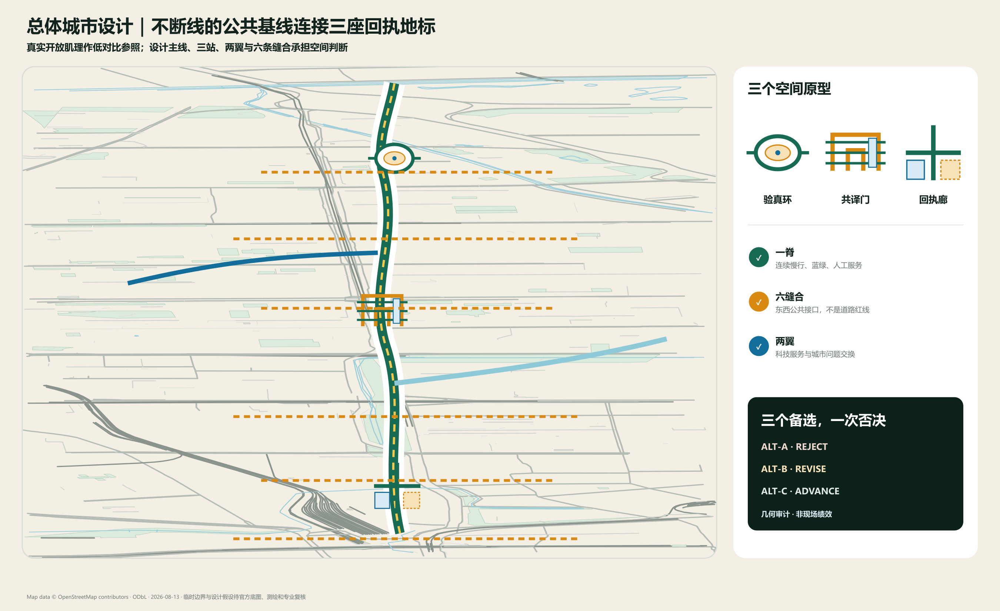
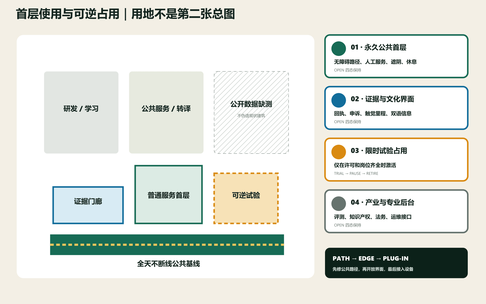
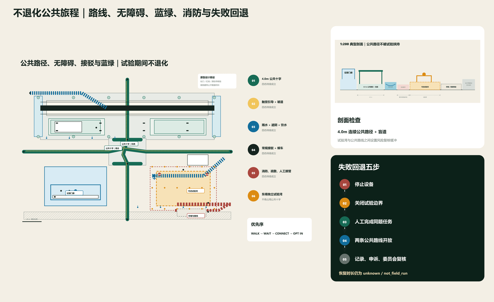
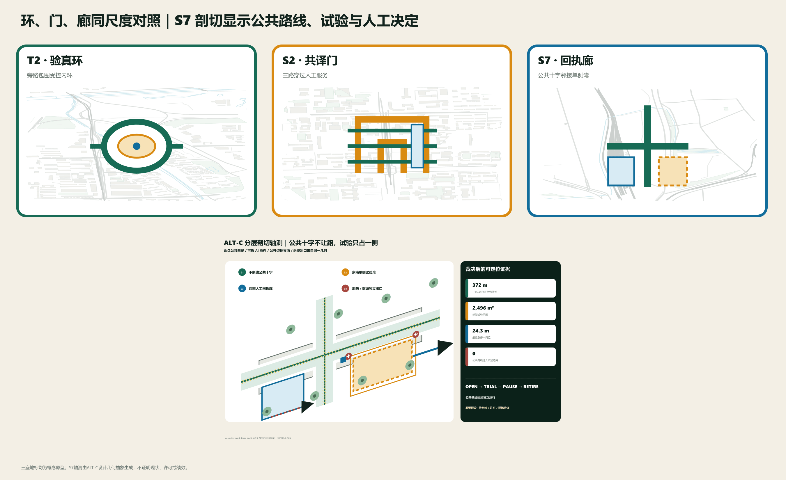
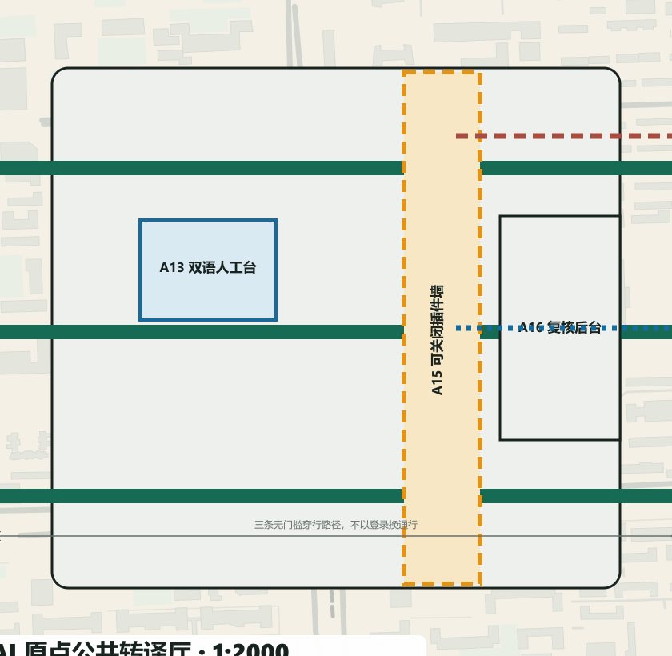
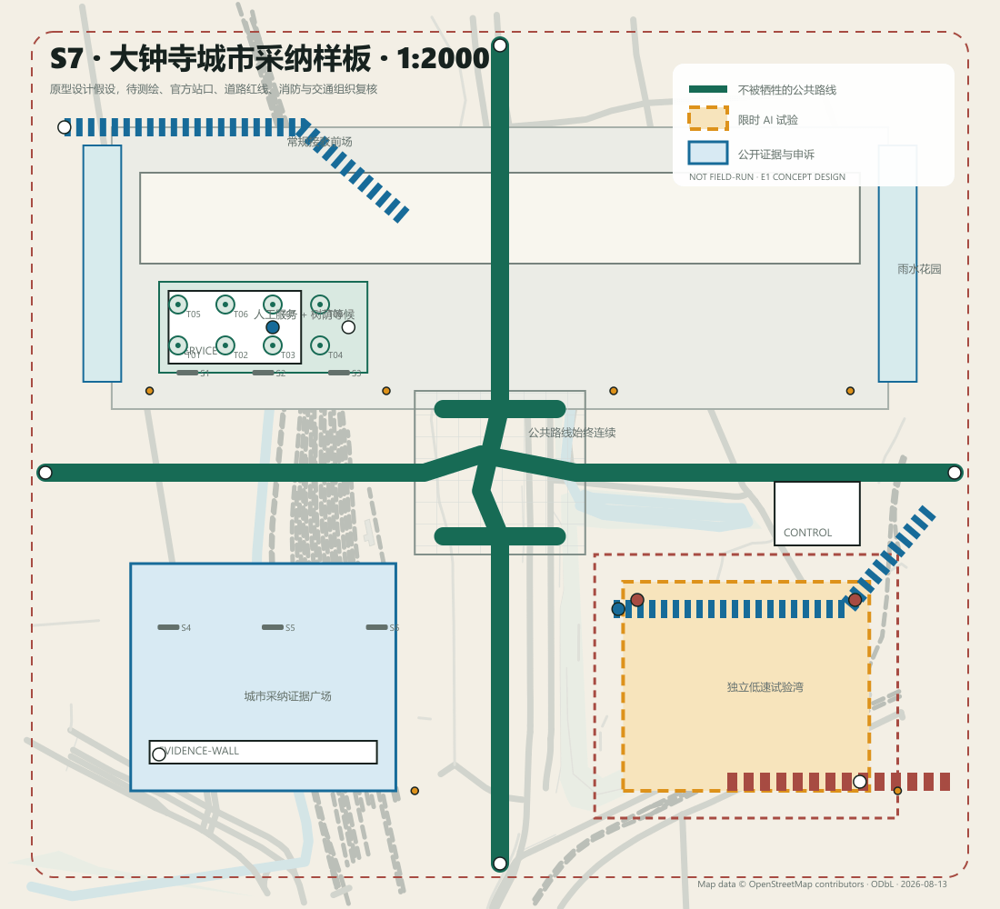
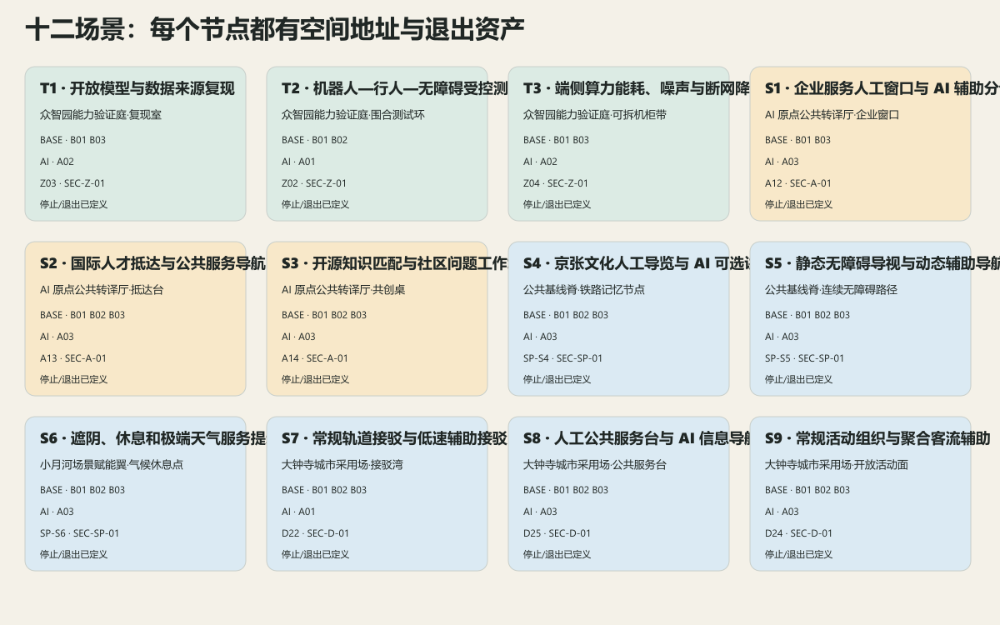
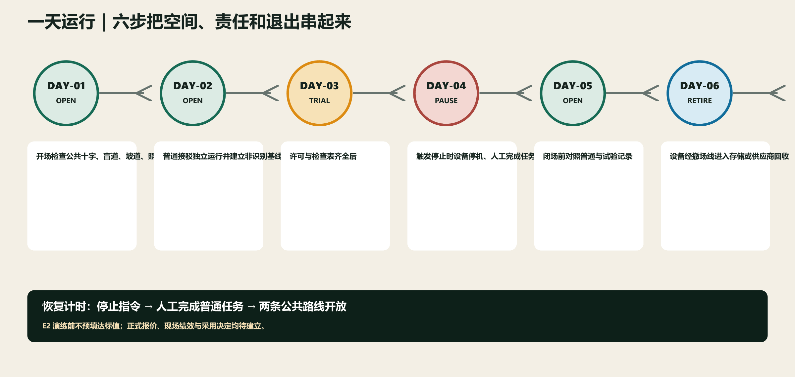
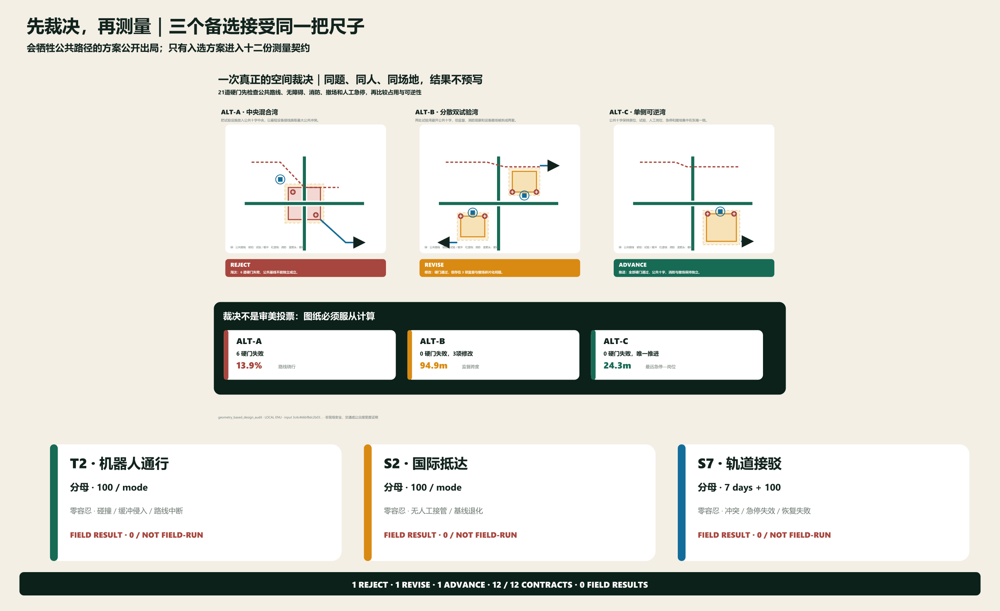

# 京张双答 / JING-ZHANG TWO ANSWERS

> **城市采纳编译器 / CIVIC ADOPTION COMPILER：三个空间备选，一次公开否决，一个可复核选择。** 普通服务先成立，AI 再进入同题验证；任何会切断公共路线的空间方案必须被编译器淘汰。现场决定仍只允许 `adopt / revise / stop`，并属于人类场景委员会。

三座不可混淆的回执地标——众智园·验真环、AI 原点·共译门、大钟寺·回执廊——继续承担空间原型；春、夏、秋、冬四季日历把公共基线审计、能力开放测试、公众采纳周和年度退出复盘连成长期运营。[data:visual/assets/two-answers.json] [data:visual/assets/spatial-atlas.json]

S7 以五级审查尺度承担实施样板；12 个场景各运行 7 类确定性桌面用例，形成 84 项可复跑验证。五级尺度与 84 项验证分别引用其可复算指标，不用场景数替代空间深度。[metric:s7_review_scale_count] [metric:synthetic_design_verification_case_count]

**本轮有三个可定位结论：城市尺度上三座地标各有独立轮廓；旗舰尺度上公共十字在 `OPEN / TRIAL / PAUSE / RETIRE` 四态中始终连续；验证尺度上许可、岗位、公共服务或状态跃迁任一失败都会阻止进入下一态。** 不读标题也应能区分环、门、廊；不读图例也应能找到触觉引导、独立试验湾、人工岗位、双急停、消防到达和撤场方向。[data:geometry/roads.geojson#V11-ALT-C-BASE-NS] [data:visual/assets/tabletop-results.json]

<!-- V11_DECISION_START -->
## 一次真正的空间裁决

城市采纳编译器不再把“全部通过”当作优秀。当前方案对 S7 的同一任务、同一用户和同一场地生成三个空间备选，再用同一组几何硬门审计：**ALT-A 中央混合湾被淘汰，ALT-B 分散双湾退回修改，ALT-C 单侧可逆湾进入深化。** 这里的 reject_design / revise_design / advance_design 是设计备选状态，不是现场采纳结论；现场仍只允许由人类委员会作出 adopt / revise / stop。[data:visual/assets/spatial-decision.json] [metric:spatial_alternative_count]

ALT-A 的试验边界切断公共十字，并与消防、撤场和人工急停可达性同时发生冲突，因此六道硬门失败。ALT-B 保住公共路线，却把两处试验湾、两条撤场线和监督岗位分散到相距约 94.9 米的两端，形成三项软性修改要求。ALT-C 让 372 米概念公共路线在试验态保持原长，将 2,496 平方米试验范围和 3,840 平方米可逆缓冲集中于单侧，并把最远急停—人工岗位距离控制为 24.3 米的原型假设。[metric:rejected_spatial_alternative_count] [metric:revised_spatial_alternative_count] [metric:advanced_spatial_alternative_count] [metric:alt_c_public_route_length_m] [metric:alt_c_trial_area_sqm] [metric:alt_c_reversible_buffer_area_sqm] [metric:alt_c_max_estop_staff_distance_m] [data:geometry/public_space.geojson#V11-ALT-C-TRIAL-1]

这些数值来自以大钟寺原型中心建立的局部等距近似画布，只能审查设计几何是否自洽，不代表现状测绘、交通表现、消防审批或安全绩效。任何正式底图、站口、权属或专业条件变化，都必须重新运行审计；若计算结果变化，图纸和文字必须服从计算。[data:geometry/roads.geojson#V11-ALT-C-BASE-NS] [depth:three_key_area_detailed_design]
<!-- V11_DECISION_END -->

<!-- V12_MEASUREMENT_START -->
## 入选之后再测量：十二份现场契约

当前版本把“双答”从价值宣言变成可执行测量协议。每个场景固定同题分母、基线窗口、比较设计、分层变量、统计量、缺失数据规则、零容忍事件、人工复核与公开输出。**12/12 契约已写入；0 项现场结果已建立。** 非安全增量阈值一律保持 `pending_baseline_committee`，不得由作者预填。[data:visual/assets/two-answers.json] [metric:measurement_contract_count] [metric:field_verification_result_count]

六个跨场景公共价值指标只有一套定义：任务完成、无障碍公平差、每百任务安全事件、人工介入、每完成任务资源、申诉—恢复时钟。缺失样本不得删除或填补为成功；若缺失破坏分层比较，决定只能是 `revise` 或 `stop`。

| 场景 | 同题服务 | 分母 | 基线与样本窗口 | 主要统计量 | AI 增量阈值 |
|---|---|---|---|---|---|
| T1 | 开放模型与数据来源复现 | 每个模型包的全部必需复现步骤 | 至少 3 个模型包；每包由 3 名独立人员各完成普通与 AI 两种模式 | paired completion difference and human minutes | 待基线委员会 |
| T2 | 机器人—行人—无障碍受控测试 | 每种模式 100 次符合准入条件的通行；所有严重事件另行全量保留 | 普通模式与试验模式各 100 次，按轮椅、视障、步行和昼夜分层 | rate per 100 passages and accessibility parity gap | 待基线委员会 |
| T3 | 端侧算力能耗、噪声与断网降级测试 | 每种状态 30 个同题任务，并保留连续 7 日能耗与噪声日志 | 正常、断网、降级三种状态各 30 次；同设备、同任务集 | completion rate resource per completed task and fallback rate | 待基线委员会 |
| S1 | 企业服务人工窗口与 AI 辅助分诊 | 每种模式 100 个符合准入条件的服务请求 | 人工模式与 AI 辅助模式各 100 个同类请求，按事项复杂度分层 | completion rate misrouting rate and human minutes | 待基线委员会 |
| S2 | 国际人才抵达与公共服务导航 | 每种模式 100 个符合准入条件的抵达服务请求 | 人工与 AI 辅助各 100 个请求，按语言、辅助需求和事项复杂度分层 | completion rate accessibility parity gap intervention rate | 待基线委员会 |
| S3 | 开源知识匹配与社区问题工作坊 | 20 场完整工作坊及其全部问题—证据—决定记录 | 至少 20 场，交替使用普通知识台账与 AI 辅助匹配 | verified link rate unresolved issue rate and human review minutes | 待基线委员会 |
| S4 | 京张文化人工导览与 AI 可选讲解 | 100 个讲解内容项，并全量复核所有争议项 | 同一 100 项分别由静态/人工讲解与 AI 可选讲解呈现 | source accuracy accessibility coverage and correction time | 待基线委员会 |
| S5 | 静态无障碍导视与动态辅助导航 | 10 条路线 × 3 类辅助需求 × 昼/夜两时段 | 每个组合均完成普通静态导视与 AI 辅助两种模式 | route completion accessibility parity gap and intervention rate | 待基线委员会 |
| S6 | 遮阴、休息和极端天气服务提示 | 3 类天气条件，每类至少 30 个节点小时 | 常态、高温/强日照、降雨三类；普通静态服务与 AI 提示并行记录 | correct service arrival rate resource per completed task | 待基线委员会 |
| S7 | 常规轨道接驳与低速辅助接驳 | 每种模式 100 次符合准入条件的接驳通行；严重事件全量保留 | 普通接驳连续 7 个运行日，再记录 AI 试验模式 100 次；按高峰/平峰、昼夜、天气和辅助需求分层 | completion rate conflicts per 100 intervention rate recovery clock | 待基线委员会 |
| S8 | 人工公共服务台与 AI 信息导航 | 每种模式 100 个符合准入条件的公共服务请求 | 人工与 AI 辅助各 100 个请求，按年龄、语言、智能手机可用性和辅助需求分层 | completion rate accessibility parity gap and handoff rate | 待基线委员会 |
| S9 | 常规活动组织与聚合客流辅助 | 全部受控活动试验，且至少覆盖 3 个到场规模等级 | 小、中、大三类到场规模；每类先普通组织、后 AI 聚合辅助 | egress task completion intervention rate and grievance recovery time | 待基线委员会 |

T2、S2、S7 是三类完整示例：T2 比较每模式 100 次同路线通行；S2 比较每模式 100 个抵达请求并按语言与辅助需求分层；S7 先记录连续 7 个普通运行日，再进入 100 次限时试验。三者均把碰撞、公共路线中断、无人工接管或基础服务退化列为零容忍停止事件。计算和合成验证只能证明协议与设计自洽，不能证明现场绩效。
<!-- V12_MEASUREMENT_END -->

## 设计依据与资料清单

京张双答把百年京张 AI 创新带定义为一条**公共基线先行的城市证明线**。永久层先解决连续无障碍、慢行、蓝绿、遮阴休息、静态导视、人工窗口和常规接驳；AI 只以限时、可选、可停、可拆的插件进入；公开证据界面用同一组指标说明普通答案和 AI 答案的差异。技术不再用“是否部署”证明先进，而用“是否值得被城市采用”接受审查。[source:OFFICIAL-ANNOUNCEMENT] [source:AGENT-TASKBOOK]

本轮边界、三处重点区、用地界面、建筑包络和节点位置均为临时边界下的概念建议，不是 official boundary、道路红线、权属或控规结论。正式范围、市政、消防、遗产、现状建筑、现场客流与绩效尚未提供；相应指标保持 unknown，图像均标注概念生成，不用视觉精度冒充证据。[source:BOUNDARY-SOURCE] [source:KEY-AREA-SOURCE] [standard:PROJECT-OFFICIAL-ANNOUNCEMENT]

文化与场地背景只采用官方公开资料：京张铁路遗址公园规划解读和一期、二期建设信息用于理解铁路遗产、连续公园和公共空间目标。[source:JINGZHANG-PLAN-OFFICIAL] [source:JINGZHANG-PHASE1-OFFICIAL] [source:JINGZHANG-PHASE2-OFFICIAL]

北京市政府公开的中关村创新史用于说明“试验—转化—共享”的文化线索；大钟寺轨道背景仅作方向性接口。它们均不证明精确站口、建筑、红线或权属。[source:ZHONGGUANCUN-HISTORY-OFFICIAL] [source:DAZHONGSI-LINE13-CONTEXT]

设计证据明确分为三类：**已知设计**是可复算的几何、数量与文档覆盖；**合成验证**是规则驱动的 84 项桌面用例；**现场未知**包括客流、安全表现、效率、满意度、能耗、成本和恢复时长。合成验证记录输入哈希、规则版本、预期/实际状态、责任触发和恢复出口，但不产生机构合作、投资、许可或现场绩效结论。[data:visual/assets/tabletop-results.json] [metric:field_verification_result_count] [depth:existing_conditions_diagnosis]

## 三层范围工作框架

43.6 平方公里统筹研究范围用于组织跨区域能力；约 11.4 平方公里临时总体设计范围用于建立连续公共基线；约 368.4 公顷三处临时重点区用于一比一原型。三层范围共享同一双答协议与证据链，精度随资料和阶段逐级收敛。[data:geometry/site_boundary.geojson#SITE-001]

研究层回答“能力从哪里来、问题如何交换”，总体层回答“公共基线怎样连续、两翼怎样缝合”，重点区回答“每个场景如何落到平面、剖面和运营”。`site_boundary.geojson` 与 `key_areas.geojson` 只记录临时约束，所有设计 GeoJSON 都标为 `design_proposal`；约 11.4 平方公里和三处数量可作临时复算，正式面积、道路红线、地块与权属仍待官方资料。范围变更时先重算边界、面积和节点归属，再更新图纸与指标，不让概念线反向固化为控制线。[metric:site_area_sqm] [metric:key_area_count]

## 统筹研究范围产业与未来城市研究

区域协同采用“问题—证据—能力”交换，而非把所有设施搬进基地：北纬社区连接个体创业与校友服务；未来科学城连接场景需求与央企能力；怀柔科学城连接基础研究与仪器。[source:REGION-BEIWEI] [source:REGION-FUTURE-SCIENCE-CITY] [source:REGION-HUAIROU]

经开区连接工程中试、制造与场景证据；京津冀连接设施、算力和产业转化。每条接口都要记录问题所有者、数据边界、接收证据和人工责任，未签协议前仅为概念协作线。[source:REGION-ETOWN] [source:REGION-CAPITAL-CIRCLE]

七个国际案例各只转译一种机制：one-north 的长期运营与共享创新服务；22@Barcelona 的知识区与存量更新；Paris-Saclay 的规划/环境情景决策。[source:CASE-ONE-NORTH] [source:CASE-BARCELONA] [source:CASE-PARIS-SACLAY]

Brainport 提供共享实验和区域协作，Helsinki AI Register 提供公开登记与反馈，Woven City 提供受控实景测试，Toronto Quayside 提供公共空间与分期公共利益条款。这些机制只用于提问，不用于证明北京的空间红线或许可条件。[source:CASE-BRAINPORT] [source:CASE-HELSINKI] [source:CASE-WOVEN]

Quayside 的协议机制另作开发责任对照，不引用其空间形态。[source:CASE-QUAYSIDE]

## 总体设计范围城市更新与控规深度城市设计

城市采纳编译器把抽象协议落到三座城市地标、四季运营、五级空间证据链和确定性状态机上。`context-open-map.json` 冻结的 OSM 参照在大钟寺范围只有 1 个建筑要素，因此图面把道路、铁路、水系和公园作为方向性参照，并把建筑缺测区明确画成“公开数据待补”；任何新界面均标记为设计假设，不能被误读为现状建筑或法定总平面。全部开放数据均为 `open_data_context / reference_only`，不进入面积、强度、容量或绩效计算。

三站从 1:5000 城市联系进入 1:2000 重点区总平面，英雄场景再进入 1:500 详图、1:200 剖面；S7 继续进入 1:50 装配节点和分层轴测。全部标为“概念比例，待测绘与官方底图复核”。众智园保留环形测试庭和完整旁路；AI 原点保留无账户穿行大厅；大钟寺被重构为“公共十字 + 东南可逆试验湾 + 西南证据门廊 + 双侧蓝绿边界”。设计尺寸是原型建议，不是现状测量；专业判断以矢量构件、结构化接口和数量公式为准。

43.6 平方公里统筹研究范围用于组织跨区域能力；约 11.4 平方公里临时总体设计范围用于建立连续公共基线；约 368.4 公顷三处临时重点区用于一比一原型。核心结构为“一脊、三站、两翼、十二组双答场景”：公共基线脊串联众智园能力验证站、AI 原点公共转译站和大钟寺城市采用站；中关村科技服务翼提供法务、知识产权、评测、融资与国际服务；小月河场景赋能翼提供居民问题、气候韧性与真实反馈。[data:geometry/site_boundary.geojson#SITE-001] [data:geometry/key_areas.geojson#PROV-KEY-001]

公共基线脊是不断线的步行、自行车、无障碍、蓝绿和人工服务系统；两翼是概念性横向缝合，不是新增道路红线。用地采取四类“界面”而非法定分类：研发学习、遗产公园、产业服务、社区生活；先修接口、首层和公共空间，再在权属与控规明确后讨论建筑强度。[data:geometry/roads.geojson#ROAD-001] [data:geometry/land_use.geojson#LU-001] [depth:overall_spatial_structure]

六条东西缝合联系以 `STITCH-01—06` 固定空间地址：每座证明场各两条，分别把周边街区入口与公共基线脊相接；它们只表达连续步行、无障碍和服务界面的优先方向，不推定道路红线。总体轴测用同一组 `SCN-001—012` 节点连接三站、两翼和公共基线，形成从总图到场景卡可追踪的空间索引。[data:geometry/roads.geojson#STITCH-01] [metric:east_west_stitch_count]

## 核心概念：三层空间构件与双答协议

每个点位只允许三类构件：①永久公共基线——坡道、盲道、静态标牌、树荫、座椅、饮水、人工窗口和常规接驳；②可拆 AI 插件——机器人、传感、端侧机柜、可选终端和低速接驳；③公开证据界面——以非识别、可理解的方式显示运行、暂停、人工接管、指标状态和投诉入口。AI 移除后，普通城市服务必须仍完整。[depth:municipal_new_infrastructure]

三类构件进一步固定为九个可复用 ID：`B01` 连续无障碍路径、`B02` 遮阴座椅饮水、`B03` 静态导视与人工服务；`A01` 低速机器人测试湾、`A02` 端侧算力机柜、`A03` 可选服务终端；`E01` 状态与指标牌、`E02` 人工接管与急停台、`E03` 反馈申诉与退出公告。九个 ID 同时出现在空间图集、重点区平面、场景数据和交互展；每项还登记空间/界面需求、与公共路径的最小隔离、电力/数据/人工/维护接口、开放—试验—暂停—退役四态，以及退役资产去向。[data:visual/assets/spatial-atlas.json] [metric:spatial_component_type_count]

AI 准入同时满足五道门：普通答案独立成立；服务同一任务与用户；不降低无障碍、公平与基本可靠性；数据、能耗、人工时间与生命周期可记录；有明确责任人、停止条件与恢复路径。证据不足时不是“先试再说”，而是保持普通答案并把 AI 标记为未准入。[metric:paired_scenario_count] [metric:measurement_contract_count]

这套“双答协议”既是空间概念，也是可复制的运营机制、治理体系和场景网络：同一协议从测试庭延伸到公共服务、文化、交通与气候空间，但每一处都必须重新通过本地准入门。

空间副命题为“**验真成环、共译成门、回执成廊；规则先编译，现场再证明**”。为保持已经合并版本的对象可追踪性，S7 继续使用稳定的 `V7-D-*` 几何 ID；版本名称不等于对象版本。公共路线、盲道、坡道、过街、路缘、接驳、试验边界、门廊、人工岗位、急停、消防、存储和撤场仍解析到同一 WGS84 证据链。[data:geometry/roads.geojson#V7-D-BASE-EW] [metric:key_area_count]

证据按 `E0 public source → E1 concept design → E2 documented prototype ready → E3 controlled trial pending → E4 civic adoption pending` 五级推进。[metric:evidence_ladder_level_count] S7 为 `E2_documented_prototype_ready`，T2/S2 为 `E1_concept_design`；另设不占用现场等级的 `T0_synthetic_contract_verified`。E2 不表示测绘、许可、搭建或现场基线完成，E4 必须由人类场景委员会签署 `adopt / revise / stop`。所有页面和交互首屏统一显示 `NOT FIELD-RUN`。[metric:measurement_contract_count] [metric:field_verification_result_count]

### 城市采纳编译器：测量契约、空间裁决与 E2 文件就绪

S7 的 **E2 原型准备文件**由同一套几何生成 1:5000 城市联系、1:2000 重点区、1:500 构件详图、1:200 剖面、1:50 坡道/盲道—可拆隔离—证据牌—临电—雨水节点和分层装配轴测。E2 的严格含义是构件数量、八类许可、采购分包和五类空白表单可复核；它**不表示**测绘、许可、采购、搭建或现场运行已经发生。[data:visual/assets/spatial-atlas.json] [metric:s7_review_scale_count] [metric:s7_prototype_kit_item_count] [metric:e2_permit_gate_count] [metric:e2_printable_form_count] [metric:e2_procurement_package_count]

“编译器”对 `SCN-001—012` 各执行七类用例：普通基线、许可缺失、岗位缺失、公共服务退化、零容忍事件、人工恢复和设备退役。状态机只接受 `OPEN→TRIAL`、`TRIAL→PAUSE`、`PAUSE→OPEN`、`PAUSE→RETIRE`、`RETIRE→OPEN`；非法跃迁、许可/岗位不全、公共路线中断，或把现场未知冒充已知，都会使构建失败。本次脚本实际生成并通过 84/84 项，结果为 `synthetic_design_verification`，不是现场仿真或安全认证。[data:visual/assets/tabletop-results.json] [metric:synthetic_design_verification_case_count]

S7 的普通公共十字和人工服务必须先完成测绘与 7 个连续运行日的基线记录。只有场地、权属、消防、无障碍、临电、网络、交通组织和设备安全八道许可门全部关闭，且场地负责人、普通服务人员、安全负责人和数据记录人员独立在岗，东南侧试验湾才可进入 `TRIAL`。碰撞、缓冲侵入、急停失效、公共路线中断或人工接管失败均触发零容忍停止；计时从停止指令开始，到人工完成同题任务且两条公共路线恢复开放为止。当前恢复时间仍为 `unknown / not_field_run`。

三座地标继续采用不同空间原型：众智园验真环以完整公共旁路包围受控内环；AI 原点共译门以三条无账户路线穿过人工服务与复核后台；大钟寺回执廊以公共十字、单侧试验湾和人工证据门廊构成旗舰样机。三张体验图均为严格对应构件关系的概念生成图，不承担现状、尺度或绩效证明。

## 总体设计：用地更新、慢行蓝绿与公共基线

更新遵循“基线—首层—包络”顺序：0 级先完成路口、坡道、触觉、照明、遮阴、座椅、饮水和人工服务；1 级开放存量首层为评测、转译、公共服务与夜班运维界面；2 级才在专业调查后决定保留、改造或新建。三个建筑 polygon 只是适应性更新包络，不代表现状建筑或拆改结论。[data:geometry/buildings.geojson#BLDG-001] [depth:retain_renovate_demolish]

典型断面把 3.0m 连续无障碍步行、2.5m 自行车、1.8m 遮阴休息、受控插件湾、蓝绿缓冲和遗产轨迹并置。尺寸是概念原型，须由测绘、树木、地下管线、消防和道路工程复核。普通路径永不穿过机器测试湾；可拆机柜使用独立回路和清晰检修边界；雨洪、树荫与休息点不是 AI 绩效的一部分。[data:geometry/green_space.geojson#GREEN-001] [depth:traffic_rail_slow_parking]

## 重点区域详细设计

**众智园·验真环 / Verification Ring**以“围合测试环 + 完整旁路 + 人工安全台 + 可拆机柜带”组织 T1—T3。机器人不进入连续公共基线，评测结果分公开/受限层，端侧设备先做断网和降级演练。外圈公共旁路与内圈试验状态共同形成可辨认地标；荣誉界面只展示任务、证据等级、失败原因、决定和复核日期，不做企业广告排名。[data:geometry/public_space.geojson#PUBLIC-001] [data:visual/assets/spatial-atlas.json]

英雄场景 T2 把 B01 公共旁路、A01 4.0 m 受控环、1.5 m 建议安全缓冲、E02 急停视线、两处人工岗位和设备撤场通道画在同一张 1:500 详图与 1:200 剖面上。上述尺寸只代表待复核的原型设计建议；任何人进入缓冲区、连续两次近失误或急停失效均是零容忍停止事件。[data:visual/assets/two-answers.json#SCN-002]

**AI 原点·共译门 / Translation Gate**以“三条无账户穿行路径 + 人工窗口 + 共创桌 + 可关闭插件墙”组织 S1—S3。企业、人才、社区使用同一排队和人工接管规则；门形公共界面在 AI 关闭时仍提供静态双语服务；高风险事项只做导航和转介，不自动作出专业决定。[data:geometry/public_space.geojson#PUBLIC-002] [data:visual/assets/spatial-atlas.json]

英雄场景 S2 将三条无门槛穿行线、双语人工抵达台、可关闭服务终端、专业复核后台和最近人工升级路径叠合；AI 关闭时纸质地图、静态导视、电话预约和人工接待仍完成同一抵达任务。[data:visual/assets/two-answers.json#SCN-005]

**大钟寺·回执廊 / Receipt Porch**是旗舰样板，以“公共十字 + 常规接驳 + 东南可逆试验湾 + 西南证据门廊 + 蓝绿边界”组织 S7—S9。OSM 只能支持方向性城市联系，不能确认精确站口或完整建筑界面；四个入口是待核验的方向性接口，南侧缺测带也被直接披露。AI 只进入东南试验湾，门廊集中人工服务、运行状态、申诉与采纳决定，撤场后场地恢复为候车、短停或公共活动面。[data:geometry/public_space.geojson#V7-D-FORECOURT] [data:geometry/public_space.geojson#V7-D-NODATA]

英雄场景 S7 将两条 4.0m 原型公共路线、0.4m 触觉引导、两处路缘坡道、常规接驳、双侧候车与遮阴、雨水花园、独立低速湾、证据门廊、安全缓冲、疏散面、人工岗位和存储撤场线并置。所有尺寸是待复核的设计假设，只用于明确“普通路线不穿过试验边界”的空间关系。[data:geometry/roads.geojson#V7-D-TACTILE-NS] [data:geometry/buildings.geojson#V7-D-PORCH]

四态运行直接改变空间：`OPEN` 开放公共十字、常规接驳、服务亭和证据门廊；`TRIAL` 才激活东南试验湾、缓冲、试验岗位和双急停；`PAUSE` 关闭 AI 边界、人工完成任务并保持公共十字开放；`RETIRE` 沿服务撤场线将设备移入存储或返还供应商，试验湾恢复普通用途。证据门廊在四态中持续提供状态、申诉和退出公告。[data:visual/assets/spatial-atlas.json] [data:geometry/buildings.geojson#V7-D-STORAGE]

S7 的测量分母预先写清但结果保持未知：E2 普通原型建成后，每种模式连续记录 100 次符合准入条件的通行，并按高峰/平峰、昼/夜、天气和辅助需求分层；严重碰撞、人员进入缓冲、急停失效、公共路线中断或人工接管超时均不需要等待样本量即可停止。AI 增量阈值只在 7 个连续运行日的普通基线完成后，由人类场景委员会登记。[metric:field_verification_result_count] [data:visual/assets/two-answers.json#SCN-010]

运营 RACI 落到具体位置：资产代表负责前场、存储与恢复；普通服务人员驻证据门廊；AI 运营者只管理东南试验湾；安全负责人驻缓冲西缘并控制双急停；数据负责人维护人工、非识别事件台账；公众代表在门廊审阅申诉。`TRIAL` 时安全负责人不得与普通服务岗位由同一人兼任；任一适用许可或最低岗位缺失只能保持 `OPEN`。[data:geometry/buildings.geojson#V7-D-PORCH] [data:geometry/constraints.geojson#V7-D-STAFF-TRIAL]

16 项原型包把可实施性拆成可复算数量：公共铺装、盲道、坡道、雨水花园、遮阴、座椅、饮水、照明、可拆围挡、双急停、状态牌、服务亭、控制亭、端侧机柜、人工计数和存储单元。每项登记数量公式、装配状态、维护责任和退役去向；单价与总价统一为 `pending_market_quote`，总价只保留“数量 × 正式询价”的公式。[metric:measurement_contract_count] [metric:field_verification_result_count]

一天运行被固定为六步：开场检查；普通基线独立运行；许可齐全后开启受控试验；触发停止后人工接管；闭场对照记录；设备进入存储或供应商回收。恢复计时从停止指令发出开始，到人工完成普通任务且两条公共路线恢复开放为止；E2 演练前不预填达标值。[data:visual/assets/spatial-atlas.json]

三处原型故意不共享同一平面母题：众智园以环形隔离和旁路解决人机安全；AI 原点以三条无门槛穿行线把服务嵌入公共大厅；大钟寺以四象限步行联系和独立时限湾保障常规交通优先。每处均把普通基线、AI 插件和证据界面落实为相互可见但不相互挟持的位置关系。[metric:key_area_count]

S7 采用六项审查视图：1:5000 城市联系、1:2000 总平面、1:500 组件详图、1:200 剖面、1:50 装配节点和分层轴测；T2/S2 补齐各自关键局部，使“环、门、廊”不依赖标题辨认。比例均为原型建议，待测绘与官方底图复核。[data:visual/assets/spatial-atlas.json]

## AI 创新生态、人才画像与 AI+ 场景

三项英雄场景承担专业审查深度，九项复制场景承担协议外推广度。12/12 均保留稳定 ID、地图节点、组件、责任人、共同指标、停止事件和恢复状态，但只有 T2、S2、S7 在本轮占用完整总平面—详图—剖面—运营—回执篇幅。这一取舍避免“十二项平均用力、每项都不够深”。

六类压力测试画像是轮椅使用者、视障行人、无智能手机老人、居民及照护者、国际研究者及创业团队、夜班运营维护人员。画像用于检查路径和责任，不建立持续可识别个人档案。T1—T3 是产业测试；S1—S9 是公共场景，场景 ID 与 GeoJSON、交互展和图纸一一对应。[data:geometry/constraints.geojson#SCN-001]

| ID | 同题场景 | 空间 | 普通答案 | AI 可选增强 | 停止条件 |
| --- | --- | --- | --- | --- | --- |
| T1 | 开放模型与数据来源复现 | 众智园能力验证庭·复现室 | 人工登记模型版本、数据许可和复现步骤，提供离线检查清单。 | 在隔离环境运行可选复现助手，生成差异报告但不替代专业签字。 | 发现无权数据、无法解释的外联或复现环境越界时立即停止。 |
| T2 | 机器人—行人—无障碍受控测试 | 众智园能力验证庭·围合测试环 | 以人工安全员、实体隔离、步行优先路线和手动急停完成小规模测试。 | 可选低速机器人在限定时窗和限定速度内运行，实时记录近失误与人工接管。 | 任何人进入安全缓冲区、连续两次近失误或急停失效即停止。 |
| T3 | 端侧算力能耗、噪声与断网降级测试 | 众智园能力验证庭·可拆机柜带 | 普通服务以纸质流程、人工台账和独立照明运行。 | 可拆端侧机柜仅处理必要任务，并在断网时自动降级到人工流程。 | 超过许可噪声/热环境、异常外传或降级失败时停止。 |
| S1 | 企业服务人工窗口与 AI 辅助分诊 | AI 原点公共转译厅·企业窗口 | 人工窗口用纸质清单说明法务、知识产权、评测和融资路径。 | 可选分诊助手按公开目录建议下一站，不生成正式法律或投资意见。 | 高风险事项被自动决定、连续误分诊或人工窗口不可用时停止 AI。 |
| S2 | 国际人才抵达与公共服务导航 | AI 原点公共转译厅·抵达台 | 双语人工接待、纸质地图、静态导视和电话预约提供完整抵达服务。 | 可选多语导航助手解释公开办事目录，并把不确定问题交给人工。 | 出现身份误用、翻译改变权利义务或错误无法及时纠正时停止。 |
| S3 | 开源知识匹配与社区问题工作坊 | AI 原点公共转译厅·共创桌 | 主持人用问题卡、公开目录和面对面工作坊匹配社区问题与专业资源。 | 可选助手检索已授权开源知识，提出候选而不替代社区优先级判断。 | 抓取无许可内容、生成不可追溯建议或压过社区选择时停止。 |
| S4 | 京张文化人工导览与 AI 可选讲解 | 公共基线脊·铁路记忆节点 | 人工讲解、触摸模型、静态图文和纸质路线构成完整文化服务。 | 可选讲解按已核验史料提供多语版本，并显示来源与不确定性。 | 出现无来源断言、错误未纠正或影响遗产安全时停止。 |
| S5 | 静态无障碍导视与动态辅助导航 | 公共基线脊·连续无障碍路径 | 连续坡道、盲道、触觉节点、高对比静态导视和人工问路点独立成立。 | 可选动态导航只在用户主动选择时给出障碍提醒，不持续追踪。 | 导航引向障碍、无障碍路径中断或退出后仍留存轨迹时停止。 |
| S6 | 遮阴、休息和极端天气服务提示 | 小月河场景赋能翼·气候休息点 | 树荫、雨棚、座椅、饮水、公告牌和人工巡查构成常态服务。 | 可选端侧提示结合公开预警和现场非识别传感，建议开放/关闭休息点。 | 预警来源中断、现场值异常或提示与人工判断冲突时转人工并停止。 |
| S7 | 常规轨道接驳与低速辅助接驳 | 大钟寺城市采用场·接驳湾 | 常规公交、轨道步行连接、出租车和人工引导始终可用。 | 可选低速接驳只在限定湾、限定时窗运行，行人优先。 | 发生碰撞/近失误、定位失效、人工接管超时或投诉集中时停止。 |
| S8 | 人工公共服务台与 AI 信息导航 | 大钟寺城市采用场·公共服务台 | 有人员、电话、纸质目录和清晰排队规则的公共服务台独立运行。 | 可选信息助手解释公开办事信息并在不确定时立即转人工。 | 人工不可用、错误影响办事权利或未授权采集身份信息时停止。 |
| S9 | 常规活动组织与聚合客流辅助 | 大钟寺城市采用场·开放活动面 | 人工售检、容量牌、实体排队、疏散线和广播完成活动组织。 | 可选聚合计数只辅助调整入口，不做人脸识别和个体轨迹。 | 计数漂移、容量接近上限、出口受阻或任何安全事件时停止入场/AI。 |

## 用地、建筑规模与拆改留方案

用地采用研发学习、遗产公园、产业服务与社区生活四类概念界面；不作法定用地调整。建筑规模、容积率、高度和拆改留结论均因权属、控规和现状测绘缺失而保持 unknown。三个建筑 polygon 只测试公共首层、可拆机柜和可变上部空间的关系。[data:geometry/land_use.geojson#LU-001]

四类界面沿公共基线组织首层开放、遗产连续、产业服务和社区日常，不把矩形边界解释为地块。三处建筑包络分别容纳能力验证、公共转译与城市采用：普通服务位于可直接到达的首层，AI 机柜靠检修边界，证据面朝公共界面。`building_footprint_area_sqm`、FAR、高度、容量和拆改量全部为 unknown；Phase 0 必须补齐现状建筑普查、结构安全、产权、消防、日照、风貌与控规后，才可形成保留/改造/拆除清单和强度校核。[metric:building_footprint_area_sqm] [metric:floor_area_ratio]

## 交通、轨道、市政与公共服务设施

轨道和公交保持常规服务优先；公共基线脊补足步行、自行车、无障碍与人工引导。端侧算力采用独立回路、低功耗、断网降级和整机可拆；供配电、通信、消防、环卫、雨洪与应急必须在正式市政调查后深化。[data:geometry/roads.geojson#ROAD-001]

道路图层只表达一条南北连续基线与两条概念性横向缝合，不新增法定道路中心线。站点接驳遵循“常规轨道/公交/出租/步行先可用，低速 AI 后受控接入”，机器人测试湾与无障碍通路物理分隔。公共服务设施按静态导视、电话/纸质入口、人工窗口、可选终端四级布置。现场尚缺轨道出入口、道路红线、过街相位、停车供需、地下管线、供电容量、通信和消防条件，故运输能力、停车数、功率和工程投资不作数值承诺；Phase 0 由交通和市政专业团队测绘并建立基线。[metric:task_completion_rate]

## 蓝绿空间、公共空间与城市风貌

蓝绿空间保留成熟树木、铁路记忆和连续开敞界面，以遮阴、休息、饮水、透水和夜间安全形成普通答案。风貌以遗产石墨、公共绿色、候选琥珀和证据蓝识别三层构件；AI 设备不占据视觉主导，撤除后公共空间仍完整。[data:geometry/green_space.geojson#GREEN-001]

### 三座回执地标、文化里程与国际传播

三座地标共用“遗产石墨轨迹 + 公共绿色基线 + AI 琥珀接头 + 证据蓝回执牌”，但分别以环、门、廊形成独立轮廓。公共基线脊上的“城市证据里程”按“提出问题—公开验证—人工决定—留下回执”组织连续停靠点，把京张铁路记忆、中关村试验文化和 AI 公共责任串联起来，而不复制企业标识或发明历史事件。[data:visual/assets/spatial-atlas.json] [metric:key_area_count]

每个停靠点同时提供中英文、高对比、触觉、纸质和人工入口；荣誉墙只登记任务、证据等级、决定、复核日期和贡献者角色，不展示未经证明的技术排名。国际传播以可复核回执和失败原因作为内容，不把合作建议写成机构承诺。[source:JINGZHANG-PLAN-OFFICIAL] [source:ZHONGGUANCUN-HISTORY-OFFICIAL]

### 产业生态、人才与未来城市研究

产业闭环是“问题登记—普通基线—能力复现—受控原型—同题比较—人类采用—年度复盘”。众智园验证模型、机器人和端侧算力；AI 原点把能力转译为企业、人才、社区可使用的服务；大钟寺验证城市采用与长期维护。中关村服务翼补足法律、知识产权、评测、融资和国际接口，小月河场景翼以居民问题与气候服务检验日常价值。[source:AGENT-TASKBOOK]

人才计划不以一次活动代替运营：设置公开问题主理人、无障碍观察员、模型/数据审计员、现场安全员、夜班维护员、双语服务员和场景产品经理七类岗位；高校课程、企业中试和社区工作坊共享一套可公开问题单。成果归属、许可、隐私和退出责任在入场前写清，未确认时不进入现场。

## 一带全球 AI 创新活动体系与长期运营设计

“城市采纳年”把一次性竞赛展陈改成四季公开程序：春季完成公共基线与无障碍审计；夏季开展能力验证和开发者开放测试；秋季组织城市场景试用与公众采纳周；冬季发布年度回执、盘点资产并复盘退出。每季活动都登记场地、用户、建议主责角色、许可门、普通服务、AI 增量、证据输出、停止事件和知识归档；四季共用同一公共台账字段，但当前没有虚构现场记录。[data:visual/assets/two-answers.json] [metric:paired_scenario_count]

开发者参与不是“自由试用”：只有许可、数据来源、普通服务和安全岗位齐备才进入受控测试；输出必须包括可复现条件、失败原因、停止状态和可公开摘要。公众可通过人工窗口、纸质回执或无账户网页查看、申诉和要求复核；年度知识资产按“问题卡—基线记录—试验摘要—人类决定—复核日期”归档。[data:visual/assets/two-answers.json] [metric:field_verification_result_count]

## 更新项目清单、实施政策与分期计划

| 项目 | 主责概念主体 | 协作主体 | 前置许可与启动门 | 资源级别 | 停止与退出 |
| --- | --- | --- | --- | --- | --- |
| 公共基线脊 | 公园/公共空间运营方 | 交通、街道、无障碍组织、遗产专业团队 | 官方边界、权属、树木、管线、消防、无障碍审计 | M：工程与长期养护 | 通行不连续即不开放；普通设施作为长期资产 |
| 能力验证庭 | 独立测试运营方 | 企业、高校、安全与数据专业人员 | 测试边界、保险、急停、数据清单、撤场金 | S：可拆试验设施与班次 | 安全/数据/降级失败即 stop；设备返还提供方 |
| 公共转译厅 | 公共服务运营方 | 园区、社区、专业服务与国际服务 | 人工窗口先运行、知识库审查、无账户入口 | M：首层改造与人员 | 权利影响错误或人工缺岗即停 AI；空间继续服务 |
| 城市采用场 | 场地与交通运营方 | 活动、安全、维护和社区代表 | 常规接驳、疏散、无障碍、时窗和投诉机制 | M：公共空间与可拆插件 | 近失误/容量/接管异常即 stop；湾区恢复普通用途 |
| 公开证据与委员会 | 独立场景委员会秘书处 | 居民、无障碍代表、专业人员、运营方 | 指标定义、利益冲突披露、会议记录与申诉 | S：数据与公共沟通 | 证据不可复核则不 adopt；保留可审计档案 |

主体名称均为职责建议，不表示已获机构授权。S7 的 16 项原型包提供设计数量和计算公式，单价、总价与采购方式等待正式询价；其余项目仍只分 S/M/L 复杂度。[depth:renewal_project_list] [metric:field_verification_result_count]

T2、S2、S7 共用七角色 RACI；S7 进一步把角色落到证据门廊、试验湾、安全缓冲、双急停、事件台账和存储撤场线。许可前置覆盖场地、消防、无障碍、临电、网络、交通组织与设备安全；责任不全或许可未完成只能保持 `OPEN`。原型包实行每日开场检查、试验前联锁、月度照明检查、资产盘点和撤场验收。[data:visual/assets/two-answers.json]

近期 0—6 个月先以普通服务和无障碍审计形成试点基线，中期才接入 AI；运营主体、协作团队与居民代表共同建立指标、监测和评估方法，任何试点未达到启动门都不得进入下一阶段。

S7 另设 90 天最小试点：0—15 天核验测绘、权属、站口、消防、管线、无障碍和交通；16—30 天只搭建公共路线、候车、遮阴、人工服务和回执廊；31—45 天建立普通服务基线并完成 7 个连续运行日；46—75 天在许可齐全、四类最低岗位到位后限时试验；76—90 天执行停止演练、撤场恢复、公众复核并签署 `adopt / revise / stop`。任一阶段的失败门触发暂停或返回前一阶段。[data:visual/assets/two-answers.json] [metric:s7_pilot_phase_count]

### 治理与退出

0—6 个月完成资料补齐、现场踏勘、权属/控规/市政核验、无障碍审计、普通服务台账、指标定义和责任人；6—12 个月只建设三处一比一普通答案原型；12—24 个月在受控边界接入可拆 AI，同题、同用户、同指标比较；24—36 个月按 `adopt`、`revise`、`stop` 处理并年度公开复盘。任何阶段都可回到普通答案，不把沉没成本作为继续理由。[data:geometry/phasing.geojson#PHASE-000]

四阶段分别设置“进入—输出—失败”门：Phase 0 以资料、许可路线和无障碍审计齐备为进入下一阶段条件；Phase 1 输出可独立完成任务的普通服务及 E2 基线，基线不完整即留在本阶段；Phase 2 只在零容忍安全条件、RACI 到岗和可计量接口全部成立时进入，任何安全/权利事件立即 `PAUSE`；Phase 3 仅接受可复核证据，证据质量不足则 `revise` 或 `stop`，不得用体验图或模型自评分替代现场结果。

人类场景委员会由场地运营、无障碍/社区代表、领域专业人员、数据与安全人员组成。技术提供方披露利益关系但不拥有最终票。每个季度复核事件、投诉、人工工时、能耗、生命周期和无账户覆盖；年度报告只发布达到数据质量门槛的聚合结果。严重安全或权利事件由现场负责人即时 stop，无需等待季度会议。

## 指标体系、面积复算与合规矩阵

`known design` 只包括可复算的文档与设计覆盖：12 个双答场景、3 座回执地标、4 个季节程序、16 项 S7 构件和空间对象；它不代表现场成效。[metric:paired_scenario_count] [metric:key_area_count] 

`synthetic verification` 是 12×7=84 项规则演练，84/84 通过只说明准入、状态跃迁、停止、恢复和退役契约在给定输入下自洽；`field unknown` 包括服务完成率、安全表现、满意度、能耗、单价、总价、无障碍失败率和恢复时长，交互展显示“待现场基线 / 待正式询价”。[metric:measurement_contract_count]  [metric:field_verification_result_count]

证据链为“任务问题 → 空间节点 → 重点区总平面 → 场景详图 → 典型剖面 → 普通/AI 两条路径 → 90 天试点 → 四季复核 → 最小数据 → 人工责任 → 共同指标 → 准入/停止 → 城市采纳回执 → adopt/revise/stop → 退出还场 → 公共知识归档”。回执和台账当前统一标记 `not_field_run / pending_field_evidence`，不把设计完成度误写成运行效果。公开界面不展示个人轨迹或未经核验的排名；模型输出不是采纳决定；`score_submission.py` 只作内部建议检查，不冒充正式评分。

## 风险、版权与合规说明

普通服务先行保障居民、老人、残障人士、青年、学生、企业、游客与夜班维护者不因设备故障、账户门槛或数字能力而被排除。无账户入口、纸质/静态导视、人工窗口和常规接驳属于永久基线；AI 是可拒绝的附加路径。最小数据、端侧/聚合优先、无持续身份画像、人工纠错和可申诉记录共同限制技术扩张。

主要风险为临时边界误读、无障碍回退、机器人近失误、错误答复、数据漂移、能耗和电子废弃、运营缺岗与公众不信任。对应控制写入空间隔离、准入门、现场急停、数据清单、设备资产去向、班次和公开复盘。概念图、图纸和建筑包络不替代测绘、工程、法定规划或审批；版权使用见 `report/copyright_statement.md`。[depth:risk_missing_data]

## 参考资料

[source:SOURCE-REGISTRY] [source:OFFICIAL-ANNOUNCEMENT] [source:AGENT-TASKBOOK]

- `OFFICIAL-ANNOUNCEMENT`：公开任务公告与范围语境。
- `AGENT-TASKBOOK`：六项 Agent 任务、边界条款与协作要求。
- `BOUNDARY-SOURCE` / `KEY-AREA-SOURCE`：仅供概念生成的临时几何。
- `CASE-ONE-NORTH`、`CASE-BARCELONA`、`CASE-PARIS-SACLAY`、`CASE-BRAINPORT`、`CASE-HELSINKI`、`CASE-WOVEN`、`CASE-QUAYSIDE`：官方/第一手机制案例。
- `REGION-BEIWEI`、`REGION-FUTURE-SCIENCE-CITY`、`REGION-HUAIROU`、`REGION-ETOWN`、`REGION-CAPITAL-CIRCLE`：区域接口背景。
- `SOURCE-REGISTRY` 与 `sources.json`：完整发布者、日期、URL、用途、许可边界与限制索引。
