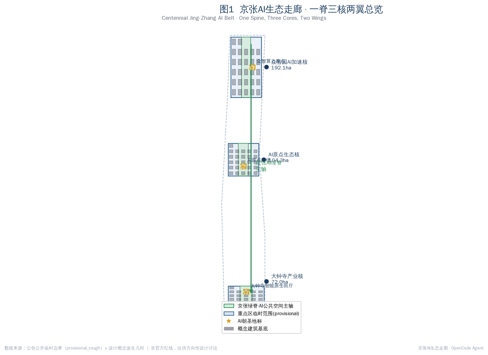
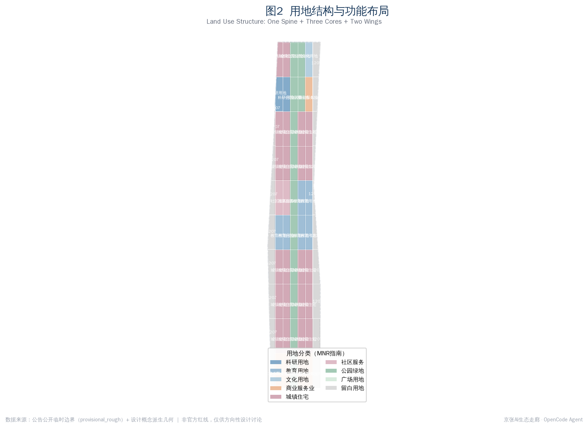
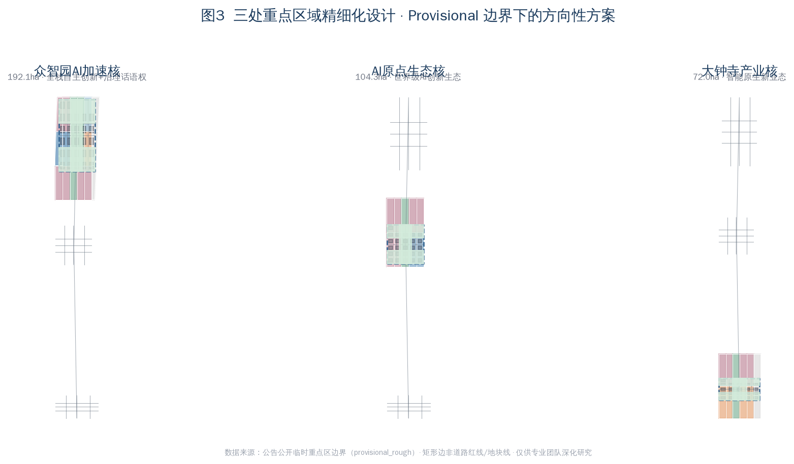
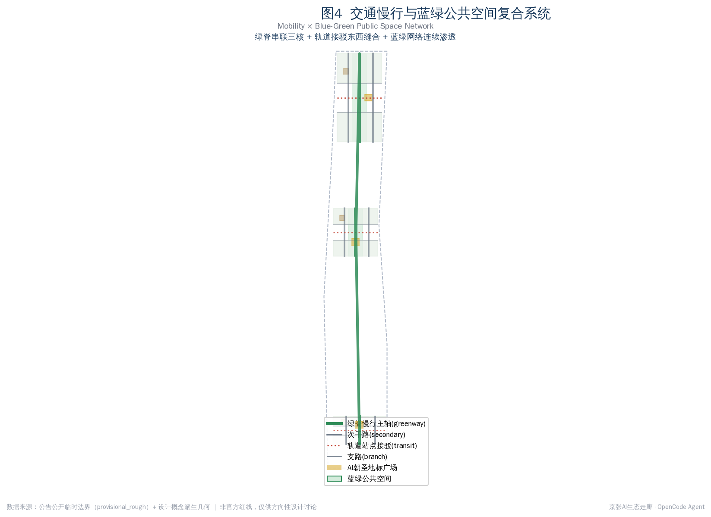
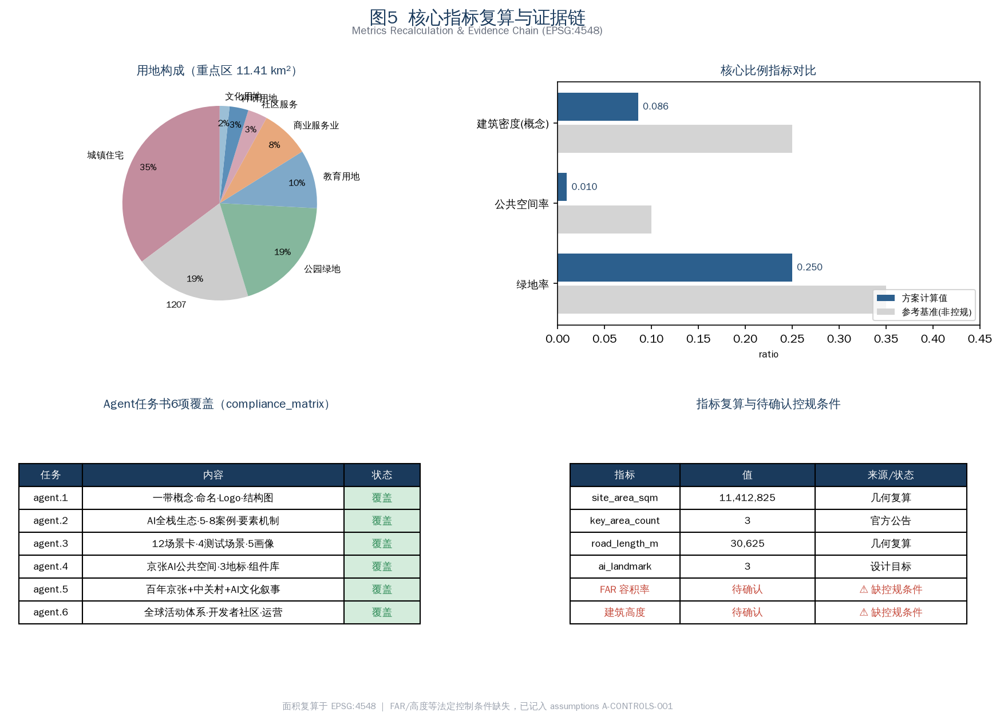

# Jingzhang AI Pulse: A Three-Core, Two-Wing Framework for AI Industry Acceleration and a Smart-Native City

## Design Basis and Source List

This proposal responds to the official qualification pre-announcement of the Centennial Jing-Zhang AI Innovation Belt international urban design call and to the agent-facing open-call taskbook [source:OFFICIAL-ANNOUNCEMENT][source:AGENT-TASKBOOK]. It takes the announcement's three scope levels, three key areas, and design tasks as the master controls, and the user-cleared agent taskbook as the source of the co-creation principles, three positionings, five functions, three-areas-two-wings layout, six agent tasks, and the unified boundary clause [standard:PROJECT-AGENT-OPEN-CALL-TASKBOOK]. All spatial recommendations are conceptual suggestions, reference schemes, or material for professional teams to deepen; they do not replace statutory planning and do not constitute government approval.

The source list strictly distinguishes formal-ready, background, provisional, and needs-review materials. The proposal reads the provisional boundaries, enums, planning limits, and standard snapshots from the site package [source:SITE-PACKAGE], and distinguishes usability through the public source registry [source:SOURCE-REGISTRY]. As of 2026-08-07 no official precise redline has been published in public channels, so the overall design area and three key areas all use provisional rectangular polygons derived as `agent_inferred_from_public_data`; precise area recalculation must wait for official CAD/GIS boundaries [source:BOUNDARY-SOURCE]. Statutory regulatory controls (FAR, height, density, green ratio, setback) are marked missing and recorded as assumption A-CONTROLS-001; related conclusions are always stated as to-be-confirmed.

## Three-Level Scope Framework

The proposal implements the three announcement scope levels [standard:PROJECT-OFFICIAL-ANNOUNCEMENT]. The coordinated research area (about 43.6 km²) studies the world-class AI innovation ecosystem, industry-chain synergy, and future AI city form; the overall design area (about 11.4 km²) carries the urban-renewal framework and regulatory-plan-level urban design; the key detailed-design area (about 3.684 km²) carries detailed design for the three key areas [metric:site_area_sqm]. The three levels cascade: research answers "what the AI belt should become," the overall level answers "how the city form adapts to AI new productive forces," and the detailed level answers "how the three cores land."

The origin and limits of the provisional boundary must be explicit. The overall design polygon used here is derived from the announcement's textual boundaries and the about-11.4 km² constraint; its recalculated area is about 11,412,825 m², broadly consistent with the announced area, but the rectangular edges are not road redlines or statutory lines [depth:three_level_scope_framework]. After an official polygon replaces it, every design layer (land use, buildings, green, public space, roads, phasing) and its metrics must be recomputed in EPSG:4548 [metric:land_use_partition_area_sqm]. The key areas are still expressed separately as PROV-KEY-001/002/003, with areas of about 192.1, 104.3, and 72.0 ha.

## Coordinated Research Area: Industry and Future City Research

This section responds to announcement 1.5 (1) and agent taskbook agent.1, agent.2 [source:AGENT-TASKBOOK]. The overall concept is "Jingzhang AI Pulse," a name joining the century-old industrial spine of the Jing-Zhang railway with the innovation pulse of the AI era; the English name is concise, recognizable, and internationally communicable. The naming system unfolds as "one spine, three cores, two wings": the Jingzhang green spine, the Zhongzhiyuan acceleration core, the AI-Origin ecosystem core, the Dazhongsi industry core, the Zhongguancun technology-service wing, and the Xiaoyuehe scenario-empowerment wing. The logo direction suggests overlaying a rail trajectory with a pulse waveform, in a steel-blue / Jingzhang-green / warm-copper palette — a directional brief whose final type and graphics require clearance by professional designers.

The proposal implements the three positionings (centennial Jing-Zhang culture belt, urban AI life-experience belt, AI convergence-and-innovation belt) and five functions (full-stack autonomous AI innovation, world-class AI ecosystem, AI+ scenario empowerment, smart AI-livable city, global AI governance voice) [standard:PROJECT-AGENT-OPEN-CALL-TASKBOOK]. The three areas and two wings form a collaborative loop: Zhongzhiyuan carries full-stack innovation and governance voice, the AI-Origin community carries the world-class ecosystem, and Dazhongsi carries smart-native new business; the Zhongguancun wing provides global factor allocation and capital, and the Xiaoyuehe wing provides AI scenarios and a livable city.

For world-class ecosystem references, the proposal reviews publicly available cases: Sand Hill Road's capital-compute-talent triangle, London King's Cross rail renewal and AI district, Tokyo Shibuya station-city integration and machine-intelligence testing, Shenzhen Nanshan's industry-academia-research-application integration, Hangzhou Yunqi Town's compute and developer community, Hefei "China Speech Valley" voice industry chain, and Boston Kendall Square's biomedical-AI fusion. Their shared lesson — transit accessibility plus mixed innovation space plus open testing scenarios plus talent livability — is translated into compute and full-stack R&D at Zhongzhiyuan, mixed innovation and talent life at the AI-Origin community, and scenario testing and native consumption at Dazhongsi. These cases are public summaries and do not commit any enterprise, investment, or output value [assumption:A-INDUSTRY-001].

## Overall Design Area: Urban Renewal and Regulatory-Plan-Level Urban Design

This section responds to announcement 1.5 (2) at regulatory-plan urban-design depth [standard:MOHURD-CONTROL-DETAILED-PLANNING]. The overall spatial structure is "one spine, three cores, two wings, with north-south penetration": the Jingzhang green spine is a continuous north-south AI public-space axis, and east-west secondary roads and transit connectors stitch the two wings into a fishbone innovation network. Land use follows the verifiable codes of the national land-use classification guide [standard:MNR-LAND-USE-CLASSIFICATION-GUIDE]; key-area land is partitioned into R&D (0802), commercial-service (05), residential (0701), community service (0702), education (0804), culture (0803), park green (1401), plaza (1403), and reserve (16) [depth:land_use_layout].

The renewal framework uses a retain-renovate-demolish-build classification with a progressive strategy. Along the heritage park the emphasis is retention and functional conversion; inside the three cores it is renovation and precise infill, avoiding large-scale demolition; edge and reserve land carries future new business. Total building scale, FAR, and height controls cannot be given as approved values because statutory conditions are missing — the proposal offers only directional intensity suggestions to be recalculated once controls are confirmed [metric:floor_area_ratio]. Municipal and new-infrastructure strategy fuses distributed compute, edge inference nodes, and new energy with legacy utilities to support the low-latency, high-reliability needs of AI productive forces [depth:municipal_new_infrastructure].

The proposal implements the Urban Design Measures on character shaping and three-dimensional coordination [standard:MOHURD-URBAN-DESIGN-MEASURES]. The urban character is "industrial heritage plus innovation block plus smart-native," controlling building setbacks, sight corridors, and skyline rhythm along the green spine to avoid uniform high-rises; landmark nodes and an honor-display system are directional concepts requiring clearance and review against heritage, aviation, and landscape constraints.

## Detailed Design of Key Areas

This section details the three key areas at comprehensive-implementation urban-design depth [source:KEY-AREA-SOURCE]. Because the key-area polygons are provisional rectangles, the conclusions below are directional design suggestions.

**Zhongzhiyuan AI Acceleration Area (about 192.1 ha, near-term phase_1)**: positioned for full-stack autonomous AI innovation and global AI governance voice. The green spine is the center; the west holds AI R&D and lab clusters, the east holds incubators, accelerators, and mixed innovation, and the north and south ends hold talent apartments and education-research support. Renewal is new-build-led with selective renovation, prioritizing space for compute centers, R&D headquarters, and open test platforms; secondary-road grids and transit connectors enable station integration; the public space strings the compute-origin landmark and community plazas along the spine [depth:three_key_area_detailed_design].

**Beijing AI-Origin Community (about 104.3 ha, mid-term phase_2)**: positioned for the world-class AI ecosystem and a high-quality district talent aspires to. The structure fuses mixed innovation with life: the west holds mixed innovation and commerce, the center holds the spine and origin plaza, the east holds R&D, education, and culture, and residential and community service ring the edge. The strategy is renovation and functional conversion that preserves the community fabric and inserts shared offices, innovation living rooms, and all-weather public space; the origin plaza anchors honor display and developer events [depth:height_massing_character].

**Dazhongsi AI Industry Cluster (about 72.0 ha, long-term phase_3)**: positioned for smart-native business and consumption. The smart-native street hall is the core, linking commerce, mixed industry, and culture; the south reserve carries future business. Renewal upgrades existing commerce with AI retail, immersive experience, and industry service; public space links the consumption circuit via the street-hall plaza and spine nodes [depth:retain_renovate_demolish]. Each core forms a mini-scheme of "positioning + structure + building renewal + mobility + public space + AI scenarios + risk" for professional teams to deepen.

## AI Innovation Ecosystem, Personas, and AI+ Scenarios

This section responds to agent taskbook agent.3 on scenario empowerment and a livable city [source:AGENT-TASKBOOK]. The proposal defines five personas: AI R&D talent (seeking compute access and quality collaboration space), founders and developers (needing low-cost testing and community), local residents (valuing convenience and privacy), international visitors and study groups (needing perceivable AI pilgrimage), and city-governance and public-service actors (needing reviewable smart-governance tools). Each persona maps to differentiated space, operations, and privacy boundaries.

The proposal provides no fewer than ten AI scenario cards (twelve in total), of which no fewer than three are industry test-and-validation scenarios (four in total). The cards are: ① Jingzhang spine AI public-space interactive testing, ② Zhongzhiyuan compute and model open test field, ③ Dazhongsi smart-native consumption validation street, ④ autonomous-driving and smart-connector test corridor (the four industry test scenarios), ⑤ AI+transport spine smart slow-mobility, ⑥ AI+health community station, ⑦ AI+education innovation learning living room, ⑧ AI+law legal-tech service point, ⑨ AI+lifestyle talent-community concierge, ⑩ AI+public-space origin-plaza honor display, ⑪ AI+governance city smart cockpit, ⑫ AI+culture Jingzhang digital-heritage roaming. Each card maps to location, users, data, privacy, human review, operator, and risk [depth:blue_green_public_space].

Scenario design respects privacy and human-review boundaries. All scenarios follow collect-only-when-necessary, minimum-usable, and human-reviewable principles; no scenario may be unreviewable or over-surveilling; test scenarios are stated as concept tests, not approved operations [standard:GENERATIVE-AI-INTERIM-MEASURES]. Accessibility and elderly smart-tech inclusion are addressed by retaining traditional service and human channels [standard:BARRIER-FREE-ENVIRONMENT-LAW][standard:ELDERLY-SMART-TECH-PLAN-2020-45].

## Land Use, Building Scale, and Retain-Renovate-Demolish Strategy

This section implements land layout, building scale, and retain-renovate-demolish classification [standard:MNR-LAND-USE-CLASSIFICATION-GUIDE]. The overall design area is partitioned into 69 seamless cells: about 4.02 km² residential, 2.22 km² road, 2.22 km² park green (including the Jingzhang spine), 1.11 km² education, 0.93 km² commercial-service, 0.37 km² community service, 0.36 km² R&D, and 0.18 km² culture [metric:land_use_partition_area_sqm]. Codes use the verifiable national classification, with shared coordinates and no gaps [depth:land_use_layout].

Building footprints are a conceptual layer of 74 units spanning AI R&D, labs, incubators, offices, mixed use, education, residential, talent apartments, community service, retail, culture, mobility hubs, and existing-retained types [metric:building_footprint_area_sqm]. The conceptual building-plot ratio is about 0.086, a discussion-level value not a regulatory density. The retain-renovate-demolish logic is "retain-and-renovate along the spine, renovate-and-infill inside the cores, reserve for future business at the edges," with parcel-level conclusions to be confirmed after ownership and existing-building survey [assumption:A-DESIGN-001].

All areas, ratios, and scales are recomputable from `geometry/*.geojson` and `metrics.json` in EPSG:4548. FAR and height cannot be given as approved values because statutory controls are missing; the proposal gives only directional intensity and marks it to-be-confirmed [metric:building_height_control_m].

## Transport, Rail, Municipal Infrastructure, and Public Services

This section responds to announcement 1.5 (2) on transport, rail, and municipal utilities [depth:traffic_rail_slow_parking]. The road system is a multi-tier network of "secondary + branch + spine slow-mobility + transit connector": secondary roads carry north-south penetration inside the cores, branches densify block micro-circulation, the green spine carries walking, cycling, and smart connectors, and transit connectors stitch the east-west wings. The conceptual network totals about 30,625 m, a directional supply level; road redlines must follow official controls [metric:road_network_length_m].

Station integration is the key to east-west stitching. Transit connectors at Dazhongsi, Wudaokou / Qinghua-East-Road, and the Zhongzhiyuan rail nodes link station, spine, and block for seamless walking transfers. The slow-mobility system closes the breaks caused by the Jing-Zhang railway cut, achieving continuous east-west penetration via the spine and new crossings. Parking and non-motorized organization follow "underground-centralized + ground-shared + smart-dispatched"; precise capacity awaits controls.

New infrastructure fuses distributed compute, edge inference, and new energy with legacy utilities [depth:municipal_new_infrastructure]. Public services include innovation platforms, talent life services, community health stations, and legal-tech points, with reserved new-infrastructure corridors. All municipal capacity, energy load, and engineering-feasibility conclusions await professional calculation; this proposal gives no engineering values.

## Blue-Green Network, Public Space, and Urban Character

This section responds to the announcement's heritage-park vitality-belt requirement and agent taskbook agent.4 on AI public space, smart-native business, and pilgrimage landmarks [source:AGENT-TASKBOOK]. The Jingzhang green spine is a continuous north-south AI public-space axis linking the three cores and three AI pilgrimage landmarks: the Compute-Origin Point (Zhongzhiyuan), the AI-Origin Plaza (AI-Origin Community), and the Dazhongsi Smart-Native Street Hall [metric:ai_landmark_count]. The spine is both an industrial-heritage display carrier and an open test and public-experience space for AI scenarios.

The blue-green system uses the spine as a skeleton, layered with the Qinghe and Xiaoyuehe blue-green corridors and node greens to form a continuous network [depth:blue_green_public_space]. A public-space component library offers combinable units — spine nodes, street halls, innovation living rooms, honor walls, smart slow-mobility stations — for professional deepening. East-west stitching and north-south penetration are achieved jointly by the spine, east-west secondary roads, and connectors.

Landmark and character design stays professional, restrained, and communicable. Landmark forms are conceptual and require review against heritage, green, blue-line, and traffic-safety constraints, plus clearance of type, image, and enterprise marks [standard:MOHURD-URBAN-DESIGN-MEASURES]. The proposal avoids over-entertaining or vulgar landmarks; signage, logo, and symbol systems are distinguished from the belt-wide logo system and not conflated with it [assumption:A-DESIGN-001].

## Renewal Projects, Implementation Policy, and Phasing

This section responds to the announcement's renewal-project, policy, and phasing requirements and to agent taskbook agent.6 on the global AI event system and long-term operation [source:AGENT-TASKBOOK]. The renewal list is organized by three cores and three phases: near-term (phase_1) focuses on Zhongzhiyuan compute and full-stack R&D and the north spine public space; mid-term (phase_2) on the AI-Origin mixed innovation, talent life, and origin plaza; long-term (phase_3) on Dazhongsi smart-native business, the street hall, and the south reserve [data:geometry/phasing.geojson#PH-ZZY]. Each project records type, location, dependencies, suggested owner, policy direction, and operations.

Policy directions include compatible-use rules for activating industrial and railway heritage, supply mechanisms for talent apartments and mixed innovation space, a sandbox and data-compliance framework for open AI scenario testing, and long-term support for developer communities and events. All policy, investment, and funding arrangements are stated as conceptual suggestions, not determined government decisions [standard:PROJECT-AGENT-OPEN-CALL-TASKBOOK].

The global AI event system proposes an annual framework: the Jingzhang AI Developer Conference, the AI-Origin Innovation Marathon, the Dazhongsi Smart-Native Consumption Season, and the Jingzhang Digital Heritage Festival. Developer-community operation suggests an open-community + honor-display + talent-conversion mechanism linking event experience to talent, enterprise, and developer landing. International communication distinguishes submitted, reviewed, selected, and implemented status; concept events are never stated as confirmed arrangements.

## Metrics, Area Recalculation, and Compliance Matrix

This section explains the metrics, area recalculation, and compliance coverage [depth:metrics_recalculation]. Core metrics include a site area of about 11,412,825 m², a green ratio of about 0.250, a public-space ratio of about 0.010, a conceptual building-plot ratio of about 0.086, a conceptual road network of about 30,625 m, three key areas, three AI landmarks, twelve scenario cards, five personas, and four industry test scenarios [metric:green_ratio][metric:public_space_ratio]. All metrics are recomputable from geometry in EPSG:4548, with formulas and sources in `metrics.json`.

The green ratio of about 0.250 reflects the spine and corridor green belts' support for talent life and innovation exchange; the public-space ratio is lowered by the provisional rectangular boundary and plaza scale and will adjust once the official boundary is supplied; the conceptual 0.086 building-plot ratio reflects the "retain-and-renovate, limit demolition" orientation [metric:building_footprint_ratio]. FAR and height are marked to-be-confirmed because statutory controls are missing, recorded as A-CONTROLS-001 [assumption:A-CONTROLS-001].

The compliance matrix covers all announcement 1.3, 1.4, and 1.5 tasks and agent taskbook agent.1 through agent.6 [depth:risk_missing_data]. The standard matrix covers all five mandatory standards; the architectural-depth standard is marked as a data_gap because the official file is unavailable. The design-depth matrix covers all required items at conceptual depth, status complete.

## Risk, Copyright, and Compliance

The proposal follows public-data and clearance boundaries [source:SOURCE-REGISTRY]. All data come from the public announcement, the user-cleared taskbook, public policy, and provisional geometry derived from public data; no secret maps, private tables, personal data, or commercial tiles are used. The provisional boundary is marked provisional_rough and may not serve as an official redline or precise-area basis [standard:PROJECT-OFFICIAL-ANNOUNCEMENT].

On copyright, the logo, type, images, people, and enterprise marks are directional suggestions requiring clearance before use; cited global cases are public summaries and do not use any enterprise trademark or copyrighted material [depth:risk_missing_data]. AI-generated content follows the Generative AI Interim Measures, and all AI scenarios remain reviewable and privacy-minimal [standard:GENERATIVE-AI-INTERIM-MEASURES].

Outstanding data and professional-review needs include the official precise redline, statutory regulatory controls (FAR, height, density, green ratio, setback), existing-building and ownership survey, heritage and blue/green-line extents, and municipal capacity and engineering feasibility. These gaps do not block content scoring, but related conclusions must be reviewed and recalculated once official data arrives [assumption:A-BOUNDARY-001].

## References

The main judgments rest on the following public and cleared materials; the full machine index is in `sources.json` and the three matrix files [source:SITE-PACKAGE].

1. Beijing Haidian Bureau of Planning and Natural Resources, qualification pre-announcement for the Centennial Jing-Zhang AI Innovation Belt international urban design call (2026-05-09).
2. Agent-facing open-call taskbook excerpt for the Centennial Jing-Zhang AI Innovation Belt (user-cleared).
3. MOHURD, Urban Design Measures; Measures for the Preparation and Approval of Regulatory Detailed Plans.
4. MNR, Guide for Land-Sea Use Classification in National Spatial Survey, Planning, and Use Regulation.
5. CAC et al., Generative AI Service Interim Measures; Barrier-Free Environment Construction Law; Guobanfa [2020] No. 45.
6. Site package: provisional boundaries, enums, planning limits, standard snapshots, and source registry.
7. Public references: Sand Hill Road, London King's Cross, Tokyo Shibuya, Shenzhen Nanshan, Hangzhou Yunqi Town, Hefei China Speech Valley, and Boston Kendall Square AI innovation districts.
