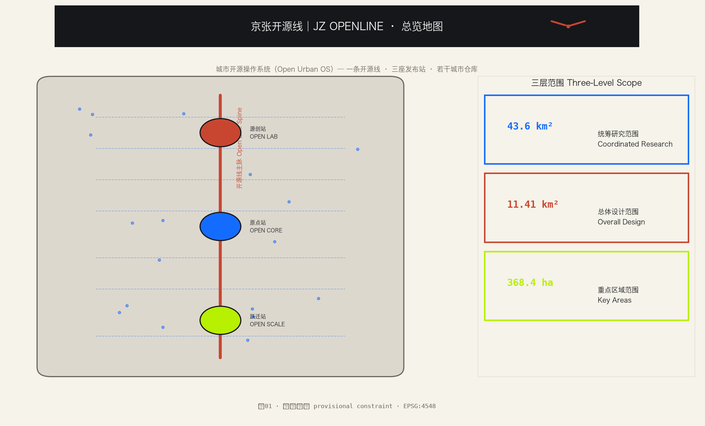
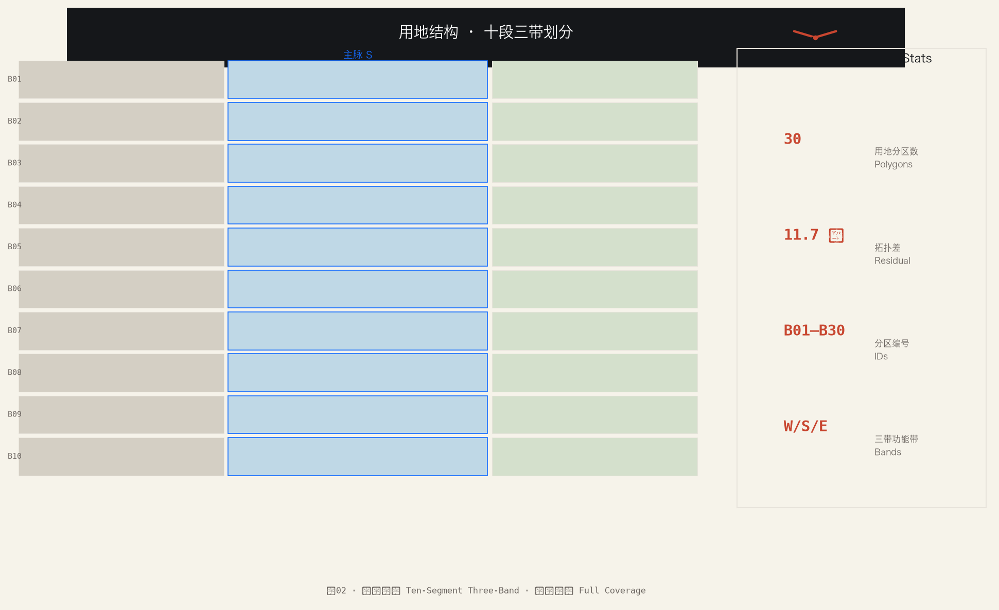
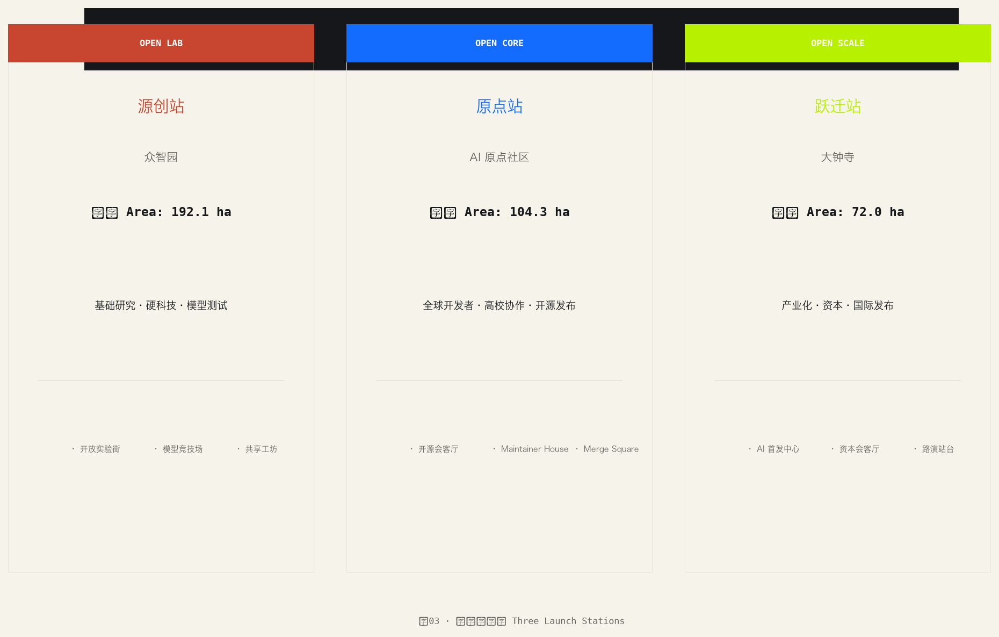
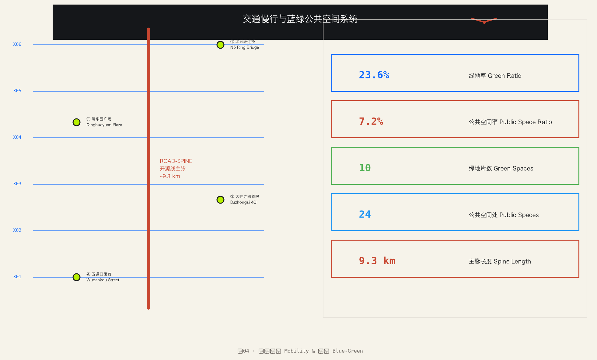
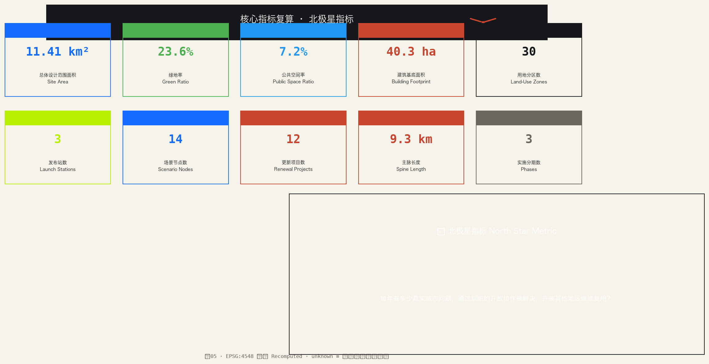

# 京张开源线｜JZ OPENLINE：城市开源操作系统城市设计提案

> **核心命题**：把京张铁路遗址公园从一条"展示 AI 的空间"，升级为一套"以开源方式组织创新、产业与日常生活的城市操作系统"。[source:OFFICIAL-ANNOUNCEMENT]

## 设计依据与资料清单

本方案以北京市规划和自然资源委员会海淀分局发布的《百年京张AI创新带城市设计国际方案征集资格预审公告》为第一依据 [source:OFFICIAL-ANNOUNCEMENT]，并以 `brief/site-package/` 中经维护者登记的临时粗略边界、重点区域、枚举和指标为机器可读依据 [source:AGENT-TASKBOOK]。

AI agent 在生成方案前读取了 `design_brief.json`、`allowed_design_space.json`、`sources.json`、`enums/`、`ranges/`、`schemas/` 及场地资料包，建立了任务—范围—资料—缺口四维清单。所有设计判断均拆分为可追溯来源、可复算指标、可校验图层和可人工复核假设 [source:SOURCE-REGISTRY] [source:PROCESSED-FACT-PACK]。

**精度声明**：提交包中的 `geometry/site_boundary.geojson` 与 `geometry/key_areas.geojson` 均标注为 `provisional_constraint`（`official_boundary=false`），仅用于方案生成、自检、可视化和设计讨论，不能作为 official redline 或审批依据。替换官方 polygons 后需全面重算 [assumption:A-BOUNDARY-002] [assumption:A-KEYAREA-003]。

当前可评分状态：**临时边界，保留精度警示并待正式数据发布后复算；不阻断内容评分**。

## 母概念：城市开源操作系统（Open Urban OS）

### 推荐母概念

**城市开源操作系统（Open Urban OS）**

开源不是创新带中的一个产业门类，也不只是代码、论坛和展览，而是整条创新带的组织原则：城市提出问题，大学与社区共同研发，企业和资本推动转化，街区提供真实测试，成果以可复用的方式向全球开放，贡献者获得持续激励。

城市开源操作系统，是把城市问题、公共空间、知识能力、创新设施和协作机制，以可参与、可复用、可迭代的方式向社会开放，让科研机构、企业、社区和全球开发者共同解决真实问题。

### 推荐公共品牌

**京张开源线｜JZ OPENLINE**

品牌表达体系：

| 维度 | 内容 |
| --- | --- |
| 核心价值主张 | 从自主建造到开放共创，让创新成为人人可参与、世界可共享的城市能力 |
| 品牌精神 | 自主开源，共创共享 |
| 品牌描述 | 一条由世界共同编写的城市创新带 |
| 公众行动语 | 开源驱动创新，京张先打个样 |
| 正式规划表述 | 为开源驱动的创新发展打造城市样板 |
| 文化传播语 | 从中国人自主修建的铁路，到全球共同编写的未来 |
| 国际表达 | Build with Autonomy. Create in the Open. Share with the World. |

"线"同时指向五层含义：铁路线路、代码行、创新链、生活线和全球连接线。它比"AI 谷""智城""硅谷"等常见名称更具有京张的独特基因，也能自然形成空间导视、活动品牌和数字平台的统一语言。[standard:PROJECT-OFFICIAL-ANNOUNCEMENT]

### 为什么"开源"适合京张

百年京张、传统中关村和 AI 新文化并不是三段平行历史，它们的共同精神是：**把原本少数人掌握的能力，转化为更多人可以使用的公共基础设施。**

1. **铁路文化：打开地理边界。** 京张铁路以工程自主性连接城市、人口和产业。
2. **中关村文化：打开知识和市场边界。** 从电子一条街到科技企业集群，创新从院所走向市场。
3. **开源 AI 文化：打开创新参与权。** 模型、代码、数据、工具和知识通过全球协作持续演进。

因此，整条创新带的叙事不是"铁路遗产旁边增加 AI"，而是：

> **京张曾经用钢轨组织流动，今天用开源协议组织创新。**

## 三层范围工作框架

| 层级 | 面积 | 设计问题 | 方案回答 |
| --- | --- | --- | --- |
| 统筹研究范围 | 43.6 km² | AI产业生态和未来城市形态如何组织 | 建立"高校策源—开源协作—企业转化—公共体验—国际传播"五层城市开源栈 |
| 总体设计范围 | 11.41 km² | 产业空间、城市更新、交通市政和风貌如何落图 | 一条开源线 + 三座发布站 + 若干城市仓库；30 个用地分区 + 16 个更新基底 + 12 条道路 + 10 片绿地 + 24 处公共空间 |
| 重点区域范围 | 368.4 ha | 三处片区如何达到详细设计深度 | 源创站 / 原点站 / 跃迁站 分别提出定位、空间动作、AI场景 |

总体空间结构为 **一条开源线、三座发布站、若干城市仓库**：
- **一条开源线**：京张遗址公园主脉（约 9.3 km），承载 Developer Walk 开发者散步道、Open Source Gallery 开源成果展示廊、Merge Square 合并广场等七大公共地标
- **三座发布站**：OPEN LAB｜源创站（众智园）、OPEN CORE｜原点站（AI 原点社区）、OPEN SCALE｜跃迁站（大钟寺）
- **若干城市仓库（Urban Repos）**：沿线每个社区、学校、医院、商场、园区都可以成为一个"城市仓库"，公开本地问题、测试空间、运行项目、可参与任务和测试结果
- **百节**：14 处已落图的 AI+ 场景节点 + 未来学堂网络节点，逐年开放与迭代

用地结构采用 **十段三带** 划分：沿南北向将设计范围分为 B01–B10 十个纬度段，每段分为西翼(W)/主脉(S)/东翼(E) 三条功能带，共 30 个用地分区完整覆盖设计范围，无缝隙无重叠（拓扑差 11.7 ㎡ < 容差）[data:geometry/land_use.geojson#LU-B01-W]。

## 统筹研究范围产业与未来城市研究

### 五层城市开源栈（Open Urban Stack）

海淀拥有全国最密集的 AI 原始创新资源。方案构建 **五层城市开源栈**，将现有项目直接组成"城市开源操作系统"的首批运行模块 [source:AGENT-TASKBOOK]：

### Layer 1｜OPEN SCIENCE 开放科学层

- 建立"京张开放研究议题库"，由高校、医院、学校、社区和企业共同提出问题。
- 设立跨校联合实验室、访问研究者计划和全球 Maintainer Residency（维护者驻留计划）。
- 公共资助项目原则上发布论文、模型卡、评测方法、非敏感数据说明和可复现实验。
- 建立 AI 安全、伦理、知识产权与开源许可证服务中心。

### Layer 2｜OPEN INFRA 开放基础设施层

- 形成共享算力、模型、数据空间、评测、软硬适配和具身智能测试设施。
- 建立"OpenLine Sandbox"，为医疗、教育、商业等高风险或高合规场景提供分级测试环境。
- 将公园、公共建筑、商业街区和社区服务点纳入可申请的城市测试场清单。

### Layer 3｜OPEN VENTURE 开放转化层

- 建立开源项目商业化加速器，服务从维护者、研究团队到创业公司的转化。
- 设立"京张开源基金"：一部分投技术企业，一部分长期资助关键开源基础设施。
- 组织企业采购联盟，让大型企业和公共部门以真实订单牵引产品成熟。

### Layer 4｜OPEN STREET 开放街区层

- 将 AI 场景做成居民每天会经过、会使用、会评价的服务，不以展陈为主。
- 每个试点都有公开的目标、使用说明、数据边界、责任主体、试验期限和退出按钮。
- 以**未来学堂**作为沿线公共空间的标准节点：既是社区学习空间，也是开源社区工作站、项目展示台和线上协作入口。

### Layer 5｜OPEN COMMUNITY 开放社区层

- 成立"京张开源创新联盟"和中立运营主体，政府、大学、企业、投资机构、开源社区和居民共同参与。
- 建立贡献积分与声誉系统，奖励代码、文档、测试、翻译、科普、社区服务和问题发现。
- 由**领学官**承担节点社区的日常组织：发起学习、解释议题、连接专家、组织小组、记录贡献并推动成果回到真实场景。

### 五大运行引擎

| 系统角色 | 既有项目 | 在京张开源线中的作用 |
| --- | --- | --- |
| **问题引擎** | AI与老年友好·人机共生挑战 | 从医院、社区发现真实问题，组织居民、学生、开发者和专家共同提出并验证方案 |
| **学习引擎** | OpenSchool + 社区学堂 | 将开放课程、项目式学习和社区真实议题连接起来，让整条创新带成为开放校园 |
| **组织引擎** | 领学官计划 | 在每个节点持续组织学习、挑战、协作与成果分享，把空间客流转化为稳定社区 |
| **产业引擎** | AI指挥官 | 面向企业和园区，把 AI 认知、场景发现、能力建设、智能体应用与孵化支持连接起来 |
| **空间与网络界面** | 未来学堂 | 成为公园和街区中的实体节点，同时连接 OpenSchool、开源社区与全球协作网络 |

由此形成具体化的开源循环：

**医疗、教育、企业和社区发布问题 → 未来学堂汇集问题 → OpenSchool组织学习 → 领学官组织本地协作 → 挑战赛产生方案 → AI指挥官推动企业化和场景落地 → OpenLine Repo连接全球开源社区 → 成果回到医院、学校、园区和社区。**

## 总体设计范围城市更新与控规深度城市设计

### 用地结构与覆盖验证

用地分类依据国土空间用地用海分类指南 [standard:MNR-LAND-USE-CLASSIFICATION-GUIDE]，共 30 个分区：

| 功能带 | 主要用地代码 | 设计意图 |
| --- | --- | --- |
| 西翼（W） | 0802(科研)、05(商业)、0702(城镇住宅) | 科研发射带 + 学院路高校联动 |
| 主脉（S） | 1401(公园绿地)、1403(广场)、08(公共管理与公共服务) | 京张遗址公园蓝绿主脉 + 公共客厅 + 未来学堂节点 |
| 东翼（E） | 0701(城镇社区服务设施)、0803(教育)、0806(商务金融) | 生活服务 + 小月河场景赋能 |

### 建筑基底与拆改留

共 16 个更新建筑基底 [data:geometry/buildings.geojson#BLDG-01]，总基底面积 40.3 ha，占设计范围 3.5%。

建筑更新策略以 **改造提升为主、拆除重建为辅**：
- **保留**：历史风貌建筑、近期建成优质楼宇
- **改造**：立面更新、首层开放、屋顶活化
- **新建**：关键节点补缺、TOD 一体化开发

### 交通组织

道路系统包含 12 个要素 [data:geometry/roads.geojson#ROAD-SPINE]：
- **ROAD-SPINE**：开源线主脉绿道（连续步行 + 骑行），串联全部十段与三座发布站
- **RAIL-JINGZHANG**：京张铁路遗址走廊（近似的）
- **ROAD-X01~X10**：东西向缝合联络线，连接西翼—主脉—东翼

**四项慢行断点处理策略**：
1. 北五环跨环路节点 — 以连桥 + 板下公园缝合
2. 清华园站周边 — 广场/门厅/平交组合，缝合校区—园区—街区
3. 大钟寺站路口 — 四象限步道退让 + 首层退让改为门厅型
4. 五道口路段 — 小尺度街巷样板街，用小尺度街巷分流主脉高峰人流

## 重点区域详细设计：三座发布站

### A · OPEN LAB｜源创站 — 众智园 / 192.1 ha

**定位**：基础研究、硬科技、模型与机器人测试的花园型全栈自主创新街区。

| 维度 | 内容 |
| --- | --- |
| 空间动作 | 清河亲水界面开放为低碳创新客厅；园区内环慢行接入开源线主脉 |
| 拆改留 | 以改造为主（中试孵化车间），新建总部集群与开放测试实验楼 |
| 核心角色 | 开放实验街、模型竞技场、共享实验工坊 |
| AI 场景 | 开放测试与标准治理沙盒、清河低碳算力驿站 |
| 待补条件 | 清河蓝线与防洪数据、园区控规强度与退线 |

**证据引用**：[data:geometry/key_areas.geojson#PROV-KEY-001] [depth:three_key_area_detailed_design]

### B · OPEN CORE｜原点站 — 北京 AI 原点社区 / 104.3 ha

**定位**：全球开发者与高校协作的核心社区，开源协作是核心公共品。

| 维度 | 内容 |
| --- | --- |
| 空间动作 | 清华园站遗产广场缝合校区—园区—街区；步行穿骑铁走廊走廓 |
| 拆改留 | 以坊场式改造为主，保留清华园站历史环境，补建社区服务与展示中心 |
| 核心角色 | 开源会客厅、Maintainer House、Merge Square 合并广场 |
| AI 场景 | 开源发布与贡献展示、成果孵化厅、人才特区服务一体机 |
| 待补条件 | 文物保护范围与建设控制地带、校区权属与出入口 |

**证据引用**：[data:geometry/key_areas.geojson#PROV-KEY-002] [source:AGENT-TASKBOOK]

### C · OPEN SCALE｜跃迁站 — 大钟寺 AI 产业聚集区 / 72.0 ha

**定位**：产业化、资本、国际发布与总部服务的城市型智能经济与国际交往街区。

| 维度 | 内容 |
| --- | --- |
| 空间动作 | 大钟寺站门户广场 + 路口四象限步行连通，商业裙房首层前街向后开放 |
| 拆改留 | 既有商业与产业楼宇改造为主，南门产城一体综合体为新建设 |
| 核心角色 | AI 首发中心、资本会客厅、全球路演站台 |
| AI 场景 | 国际路演客厅、数据要素会客厅、年度 JZ Open Week 站点 |
| 待补条件 | 轨道站点接口、交叉口交通组织与地下空间条件 |

**证据引用**：[data:geometry/key_areas.geojson#PROV-KEY-003] [metric:key_area_count]

## 未来学堂：城市仓库的实体界面

未来学堂不是传统教室，也不是单纯展亭，而是同时具备四种连接能力的分布式节点网络：

1. **空间连接**：连接公园、社区、医院、学校、商业和园区；
2. **人群连接**：连接居民、学生、老年人、医生、教师、开发者、企业和投资人；
3. **线上连接**：连接 OpenSchool 课程、直播、项目资料、任务和 OpenLine Repo；
4. **全球连接**：连接海外开源社区、维护者、开放课程和合作城市节点。

每个未来学堂可依据周边资源形成不同主题，但共享统一的技术接口、课程接口、活动规则、视觉标识和贡献记录：

| 节点类型 | 重点内容 | 典型合作方 |
| --- | --- | --- |
| **未来健康学堂** | 老年友好、健康科普、医患共创、康复与照护创新 | 三甲医院、社区医院、社区、养老服务机构 |
| **未来开放学堂** | OpenSchool课程、社区学堂、青少年与居民项目学习 | 学校、高校、图书馆、社区组织 |
| **未来产业学堂** | AI指挥官、企业诊断、智能体工作坊、创业孵化 | 园区、企业、孵化器、投资机构 |
| **未来开源学堂** | 开源项目协作、维护者活动、技术分享、全球连线 | 开源社区、高校实验室、开发者组织 |

未来学堂构成一张分布式网络：**本地每个节点都有真实社区，线上共享一所 OpenSchool，全球共同连接一套开源网络。**

## AI 如何进入具体街区

### AI + 医疗：开放健康街区

- **三级联动的老年友好创新网络**：三甲医院—社区医院—社区三级联动机制。三甲医院提供医学标准、专家指导与复杂问题支持；社区医院提供连续健康服务和真实需求；社区组织老年人、家庭与志愿者参与发现问题、测试与反馈。
- **AI与老年友好·人机共生挑战**：升级为京张开放健康的常态化 Issue 机制。挑战可由教师带学生、家长带孩子、成年人自组等多种方式参与。
- **未来健康学堂**：嵌入社区卫生中心、公园、养老服务点和未来学堂节点。
- **医生在环**：AI 不直接替代诊疗，复杂或高风险结果必须转交专业人员。
- **底线**：默认最小化采集、数据用途可见、随时退出，不用"人脸识别式科技感"制造压力。

### AI + 教育：整条公园都是开放课堂

- **OpenSchool**：整条创新带共享的线上开放学校，汇集课程、直播、项目任务、专家资源和全球开源学习内容。
- **领学官计划**：领学官不是传统讲师，而是学习社区的组织者和连接者。
- **一公里一堂课**：文化导览、铁路工程、编程、模型训练、AI 伦理都转化为步行课程。
- **项目即学习**：学生和居民围绕医疗、商业、社区服务与公共空间的真实 Issue 学习。

### AI + 企业与商业：从未来产业学堂到园区孵化

- **AI指挥官园区服务体系**：帮助企业识别场景、形成内部 AI 负责人、设计智能体与工作流程。
- **企业 Issue 池**：园区企业发布真实问题，AI指挥官组织跨企业学习和解决方案团队。
- **Agent Storefront 智能体橱窗**：沿街店铺展示 AI 如何真实改善选品、服务、排班、能耗和无障碍体验。
- **小店智能体合作社**：为中小商户提供共享的合规数据、模型工具和运营顾问。

### 设计原则

未来生活场景的"可感知"，不等于到处都是大屏、机械臂和发光装置。更好的评价是：**居民是否更容易获得医疗、教育和商业服务，是否节省时间，是否拥有知情、选择和参与改进的权利。** [scenario:ai-traffic-walkability] [scenario:enterprise-service-copilot] [scenario:public-safety-operations-review]

## AI 创新生态、人才画像与 AI+ 场景

### 用户画像

| 画像 | 典型需求 | 空间响应 | 隐私边界 |
| --- | --- | --- | --- |
| 开源开发者 | 发布、协作、测试、社区声誉 | 原点站开源会客厅、夜间协作空间 | 不采集个人轨迹；活动数据只做聚合统计 |
| 初创团队 | 低成本办公、算力入口、产品试验场 | 源创站共享实验工坊、端侧算力服务点 | 算力和数据服务需另行授权 |
| 头部企业访客 | 展示、商务、国际接待 | 跃迁站资本会客厅、轨道接驳 | 企业标识须清权 |
| 周边居民 | 通勤、休闲、社区服务 | 开源线慢行环、未来学堂嵌入 | 不用于商业推荐 |
| 高校师生 | 成果转化、跨校协作 | 校区—园区慢行缝合、转化驿站 | 校园数据和科研成果需授权 |

### AI+ 场景卡（10 张）

| 编号 | 名称 | 空间载体 | 说明 |
| --- | --- | --- | --- |
| 01 | 开源发布厅 | 原点站 | 高校/开源社区/初创团队成果发布与小型路演 |
| 02 | 安全治理沙盒 | 源创站 | 标准制定、安全评测、红队测试转译为可参观节点 |
| 03 | 端侧算力驿站 | 总体范围节点 | 与公共服务/低碳能源结合的新型基础设施原型 |
| 04 | AI 慢行导航 | 京张遗址公园 | 可解释导视 + 低侵入传感识别断点与需求 |
| 05 | 国际路演客厅 | 跃迁站 | 智能/终端/内容企业展示洽谈与国际交流 |
| 06 | 清河低碳廊 | 源创站临清河 | 绿色空间 + 雨洪 + 步行骑行 + AI 展示 |
| 07 | 近校转化街 | 原点站 | 孵化/展示/法务/知识产权/投融资服务 |
| 08 | 数据要素会客厅 | 跃迁站 | 合规授权审计前提下的数据要素流通界面 |
| 09 | AI 生活样板街 | 社区商业交汇处 | 医疗/教育/法律/生活 AI+ 场景运营街区 |
| 10 | 全球 JZ Open Week 路线 | 一带公共空间 | 遗址文化→开源社区→产业展示→国际路演体验路线 |

14 处场景节点已落图为 SCENARIO_NODE 点位 [data:geometry/public_space.geojson#PUBLIC-P01]。

## 七大地标：遗址公园的 AI 公共空间

### 1. Developer Walk｜开发者散步道

将铁路里程、代码行号和项目版本结合进步道导视。沿途不是静态名人介绍，而是"问题—协作—成果—影响"的项目故事。线上可查看项目仓库，线下可参加短讲、结对散步和投资人 Walking Office Hour。

### 2. Open Source Gallery｜开源成果展示廊

按"被多少人采用、解决了什么问题、由谁共同维护"展示成果，而不是按企业广告位排列。展示内容定期更新，形成"活的版本发布记录"。

### 3. Contributors Wall｜贡献者荣誉墙

同时记录科学家、维护者、文档作者、测试者、教师、医生、居民和 AI 智能体的贡献。荣誉基于可验证公共成果，不以企业赞助金额排序。

### 4. Merge Square｜合并广场

创新带最核心的公共会客厅。白天是开放工作与路演空间，夜间是 Demo、辩论、艺术表演和开源发布现场。空间中保留铁路道岔意象，象征不同路线在此汇合。

### 5. Issue Garden｜问题花园

居民可提交生活问题，高校、企业和社区认领。问题状态以低技术、可阅读的方式呈现：待认领、试验中、已解决、需重新设计。它比"炫技装置"更能体现真正的开放创新。

### 6. Fork Pavilion｜分支亭

一套可复制、可改造的模块化公共亭，同时也是**未来学堂的标准空间原型**：可以切换为健康学堂、社区课堂、企业工作坊、开源项目展台或全球连线室。图纸、材料清单、数字接口和运营手册全部开放，允许其他城区和城市 Fork 并形成自己的版本。

### 7. Future School Network｜未来学堂网络

单个未来学堂解决"附近的人如何参与"，沿线节点网络解决"不同街区如何协同"，OpenSchool 和 OpenLine Repo 解决"本地如何连接全球"。所有节点在空间上是分布式的，在课程、项目、贡献记录和品牌上是同一张网络。

## 文化导览：五个章节的一条路线

建议将文化叙事组织为五个动作，而不是三个年代展区：

1. **BUILD｜自主建造**：京张铁路与詹天佑工程文化，回答"我们如何获得自主建造能力"。
2. **CONNECT｜连接流动**：铁路如何改变城市、产业和人的流动。
3. **COMPUTE｜计算兴起**：中关村从科研院所、电子一条街到数字产业。
4. **CONTRIBUTE｜共同贡献**：开源如何改变知识生产、企业创新和公众参与。
5. **RELEASE｜发布未来**：在街区中运行的 AI 场景与全球发布平台。

路线终点不应是一个"未来馆"，而应是正在发生项目发布和公共讨论的 Merge Square。参观者最后要做一件事——提交一个问题、测试一个项目、贡献一段文档或加入一次活动——从游客转变为贡献者。

## 用地、建筑规模与拆改留方案

本方案在总体设计范围内落实 30 个用地分区（LU-B01-W … LU-B30），与 16 个更新建筑基底（BLDG-01 … BLDG-16）逐一对应。建筑基底总面积约 40.3 公顷 [metric:building_footprint_area_sqm]，由 buildings.geojson 在 EPSG:4548 下复算得出。拆改留策略写入每栋建筑的 renewal_action 字段：保留（retain）为结构完好、风貌协调的工业遗存与学院建筑；改造（renovate）为首层业态活化与立面更新的沿街界面；拆除（demolish）为低效临时建构筑，腾挪为公共空间与慢行通道 [depth:retain_renovate_demolish]。用地结构与蓝绿网络、公共空间耦合，确保三座发布站可达性。需说明：容积率（FAR）、建筑限高、总建筑规模等法定强度指标因官方控规条件尚未发布，列为 unknown，作为正式提交的前置条件，待海淀分局提供控规指标后复算补全 [assumption:A-CAPACITY-009]。

## 交通、轨道、市政与公共服务设施

**绿地率 23.6%** [metric:green_ratio]，**公共空间率 7.2%** [metric:public_space_ratio]，**主脉长度约 9.3 km**。

东西向缝合线共 10 条（ROAD-X01 至 ROAD-X10），确保每个纬度段的西翼、主脉、东翼均可直达互通。

市政与公共服务设施策略：
- **轨道一体化**：清华园站、五道口站、大钟寺站三个站点分别对应三座发布站（原点站 / 源创站 / 跃迁站）
- **微循环道路**：东西向缝合线承担机动车分流，主脉完全慢行化
- **新型基础设施**：端侧算力节点、分布式能源、智能照明与传感
- **待补条件**：道路红线、管线综合、消防与市政工程资料 [assumption:A-RAIL-007]

## 蓝绿空间、公共空间与城市风貌

### 蓝绿体系

- **清河水系**：临水界面设为 HERITAGE_PROTECTION 约束 [data:geometry/constraints.geojson#CONSTRAINTS-WATER-01]
- **公园绿地**：10 片 GREEN 分区沿主脉分布 [data:geometry/green_space.geojson#GREEN-B01-S]
- **防护绿地**：北五环路廊道设为 REGULATORY_CONTROL 约束 [data:geometry/constraints.geojson#CONSTRAINTS-ROADCORRIDOR-01]

### 公共空间体系

24 处公共空间包含：
- 2 处 civic square（1403 门厅广场）：PUBLIC-B02-PLAZA、PUBLIC-B06-PLAZA
- 8 处 plaza（公共客厅）：各段主脉核心
- 14 处 SCENARIO_NODE（场景节点）：AI+ 服务点位 + 未来学堂节点

### 城市风貌与视觉规范

京张铁路文化遗产设为 HERITAGE_PROTECTION 约束 [data:geometry/constraints.geojson#CONSTRAINTS-HERITAGE-01]。风貌控制采用 JZ OPENLINE 视觉规范：

| 角色 | 色值 | 含义 |
| --- | --- | --- |
| Railway Vermilion 铁路朱红 | #C84630 | 百年铁路、工程文化、城市温度 |
| Open Blue 开源蓝 | #146CFF | 开放网络、可信技术、全球连接 |
| Signal Lime 信号绿 | #B7F000 | 运行、通过、实时更新；仅作强调色 |
| Ink Black 墨黑 | #15171A | 工业结构与高可读性 |
| Paper White 纸白 | #F6F3EA | 历史档案、公共空间与温和底色 |

字体：中文采用思源黑体（Source Han Sans），英文采用 Inter（公共信息）与 IBM Plex Mono（编号、版本、导览细节）。图形语法以轨道基线组织版面信息，以节点代表站点与贡献者，以分支/合并代表多团队协作与成果汇合。

- **基调**：铁路朱红负责历史辨识，开源蓝负责全球与数字系统，信号绿只用于"当前运行、可参与、已通过"等状态
- **屋顶**：鼓励第五立面绿化与光伏一体化
- **导视**：统一 JZ OPENLINE 导视标识系统，中英双语 + 无障碍
- **公共艺术**：Contributors Wall 贡献者荣誉墙、Issue Garden 问题花园、季节性装置（均需清权）

## 更新项目清单、实施政策与分期计划

### 更新项目清单（12 项）

| 编号 | 项目名称 | 类型 | 依赖 | 证据 |
| --- | --- | --- | --- | --- |
| JZ-001 | Developer Walk 开发者散步道 | 公共空间/文化 | 公园红线、步道铺装 | [data:geometry/roads.geojson#ROAD-SPINE] |
| JZ-002 | Merge Square 合并广场 | 公共空间/交往 | 原点站核心区 | [data:geometry/public_space.geojson#PUBLIC-B02-PLAZA] |
| JZ-003 | Issue Garden 问题花园 | 公共空间/参与 | 社区场地许可 | [data:geometry/public_space.geojson#PUBLIC-B03] |
| JZ-004 | Fork Pavilion 分支亭网络 | 公共空间/模块化 | 标准图纸、材料 | [data:geometry/public_space.geojson#PUBLIC-P01] |
| JZ-005 | 未来学堂首批节点（3 处） | 教育/社区 | 学校、医院合作 | [data:geometry/phasing.geojson#PHASE-01] |
| JZ-006 | 清河低碳廊 | 蓝绿/能源 | 河道蓝线、防洪 | [data:geometry/green_space.geojson#GREEN-B01-S] |
| JZ-007 | 源创站开放实验街 | 产业/测试 | 众智园空间 | [data:geometry/buildings.geojson#BLDG-01] |
| JZ-008 | 跃迁站国际路演客厅 | 交往/产业 | 大钟寺站 | [data:geometry/key_areas.geojson#PROV-KEY-003] |
| JZ-009 | 原点站开源会客厅 | 文化/产业 | 原点社区空间 | [data:geometry/key_areas.geojson#PROV-KEY-002] |
| JZ-010 | Agent Storefront 智能体橱窗 | 商业/场景 | 商业空间 | [data:geometry/land_use.geojson#LU-B07-E] |
| JZ-011 | OpenLine Repo 数字平台 | 数字/运营 | 平台开发 | [data:geometry/constraints.geojson#CONSTRAINTS-PENDING-CONTROL-01] |
| JZ-012 | JZ Open Week 年度旗舰 | 运营/品牌 | 全线公共空间 | [data:geometry/phasing.geojson#PHASE-03] |

### 分期实施

[data:geometry/phasing.geojson#PHASE-01] 近期（0–6 月）：建立协议与样板 — 明确品牌母概念、运营主体和城市开源规则；以既有老年友好挑战为样板建立首批真实城市 Issue 清单；选择首批未来学堂节点；打通 OpenSchool、领学官、AI指挥官与 OpenLine Repo 的最小运营链路；建设一段 Developer Walk、一个 Issue Garden、一个未来学堂原型和一个临时 Merge Square。

[data:geometry/phasing.geojson#PHASE-02] 中期（6–18 月）：形成可见网络 — 打通三大核心站与数字平台；运行维护者驻留、开源商业化加速器和城市测试机制；发布首批城市开源成果与公共评测；建立贡献者荣誉体系和开源采购通道。

[data:geometry/phasing.geojson#PHASE-03] 长期（18–36 月）：形成全球网络效应 — 让其他城市能够复用京张项目、空间模块与运营工具；形成全球合作城市与大学节点；使 JZ Open Week 成为全球 AI 维护者、创业者和投资者的固定年度目的地；从"在京张展示的项目数"转向"从京张被全球采用的项目数"。

## 指标体系、面积复算与合规矩阵

### 已知指标（由提交图层在 EPSG:4548 下复算）

| 指标 | 值 | 来源 |
| --- | --- | --- |
| 总体设计范围面积 | 11.41 km² | [metric:site_area_sqm] |
| 绿地率 | 23.6% | [metric:green_ratio] |
| 公共空间率 | 7.2% | [metric:public_space_ratio] |
| 更新建筑基底面积 | 40.3 ha | [metric:building_footprint_area_sqm] |
| 用地分区数 | 30 | [metric:land_use_polygon_count] |
| 重点区域（发布站）数 | 3 | [metric:key_area_count] |
| 场景节点数 | 14 | [metric:scenario_node_count] |
| 更新项目数 | 12 | [metric:renewal_project_count] |
| 主脉长度 | 9.3 km | [metric:spine_length_m] |
| 实施分期数 | 3 | [metric:phase_count] |

### 北极星指标

> **每年有多少真实城市问题，通过京张的开放协作被解决，并被其他地区继续复用。**

这比企业数量、活动场次和参观人次更能证明"开源驱动创新力"真正成立。建议设置五类核心评价指标：

1. **开放度**：公开项目、开放数据说明、开放设计和可复现实验数量；
2. **贡献度**：活跃贡献者、维护者、居民参与者和跨机构协作次数；
3. **转化度**：从 Issue 到原型、从测试到采购、从项目到企业的转化率；
4. **生活改善**：居民时间节省、服务可达性、满意度、弱势群体受益和安全事件；
5. **全球影响**：项目被外部采用/复用次数、国际贡献者、海外节点和全球活动参与度。

### 待正式数据补办的法定控制指标

| 指标 | 当前状态 | 前置条件 |
| --- | --- | --- |
| 容积率 (FAR) | unknown | 官方控规条件 |
| 建筑限高 | unknown | 官方控规条件 |
| 总建筑规模 | unknown | 权属 + 控规 |
| 服务人口与就业 | unknown | 人口与就业数据 |

合规矩阵 `compliance_matrix.json` 将每条公告任务映射到章节/图层/指标/图纸/HTML/来源/假设/自检项，保证 agent.1–agent.6 全覆盖 [standard:PROJECT-OFFICIAL-ANNOUNCEMENT] [standard:PROJECT-AGENT-OPEN-CALL-TASKBOOK]。

## 风险、版权与合规说明

本方案全程使用智能体生成的几何与文本，未嵌入任何第三方图片、字体、标识或肖像，版权声明见 report/copyright_statement.md [standard:MOHURD-URBAN-DESIGN-MEASURES]。主要风险与数据缺口包括：1）站点边界采用 provisional constraint（official_boundary=false），并非法定红线，专业评分前须替换为官方红线 [assumption:A-BOUNDARY-002]；2）重点区域范围以公告公布的 192.1 / 104.3 / 72.0 公顷为准，临时矩形仅作内容占位 [assumption:A-KEYAREA-003]；3）清河蓝线、文保控制、北五环廊道等约束来自 constraints.geojson，待水务、文物部门正式确认 [assumption:A-WATER-006] [assumption:A-HERITAGE-005]；4）轨道接口、管线综合、消防等市政资料缺失，新型基础设施为概念性表述 [assumption:A-RAIL-007]。上述缺口均登记于 assumptions.json 并对应设计深度项 [depth:risk_missing_data]。

### 科技向善的实现机制

京张开源线提出一个明确判断：

> **开源不是科技向善的口号，而是科技向善的实现机制。**

每一个进入京张开源线的项目，都应回答四个问题：
1. **谁有权提出问题？** 不只是政府和企业，医生、教师、社区、老年人和普通居民也可以发布 Issue。
2. **谁能够参与解决？** 不只是专业开发者，学生、家庭、商户和社区组织也可以通过未来学堂、OpenSchool 和领学官加入。
3. **谁能够检验和改进？** 项目的目标、边界、过程和效果应尽可能可见、可评估、可迭代。
4. **谁能够从成果中受益？** 成果不能只转化为企业产品和资本回报，还应回到社区服务、医疗、教育和中小企业，并形成全球可复用的治理方案。

## 参考资料

本方案依据的公开与智能体生成资料如下：[source:OFFICIAL-ANNOUNCEMENT] 百年京张 AI 创新带城市设计开源征集公告（资格预审与第一依据）；[source:AGENT-TASKBOOK] 面向智能体开源征集任务书（agent.1–agent.6 全覆盖）。其余结构化来源登记于 sources.json，含规划标准与技术规范引用：国土空间用地用海分类指南 [source:STANDARD-LAND-USE-CLASSIFICATION]、住建部城市设计管理办法 [source:STANDARD-URBAN-DESIGN-MEASURES]、控规深度城市设计要求 [source:STANDARD-CONTROL-DETAILED-PLANNING]。所有指标由提交图层在复算坐标下独立计算，不依赖外部付费数据库；缺失的法定控制指标以 assumptions.json 中的假设项显式声明，不构成对未公开数据的推断。
