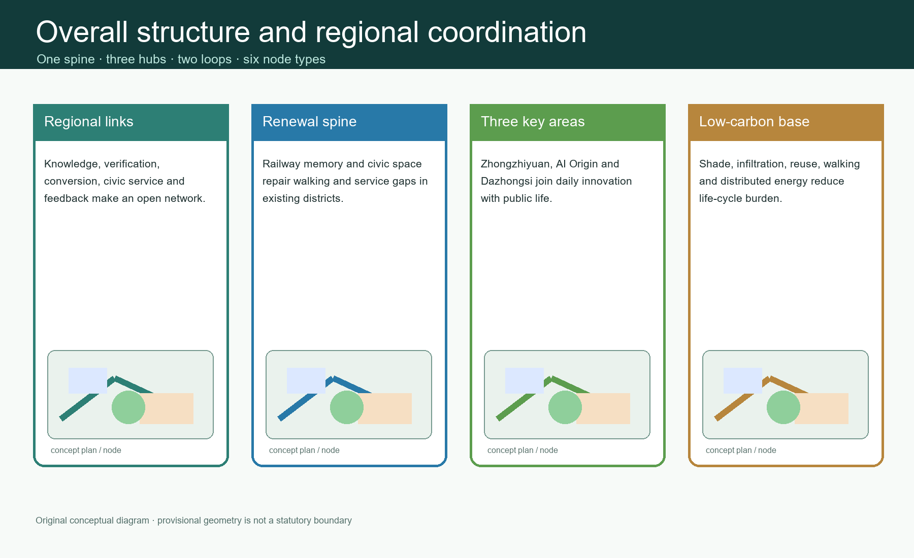
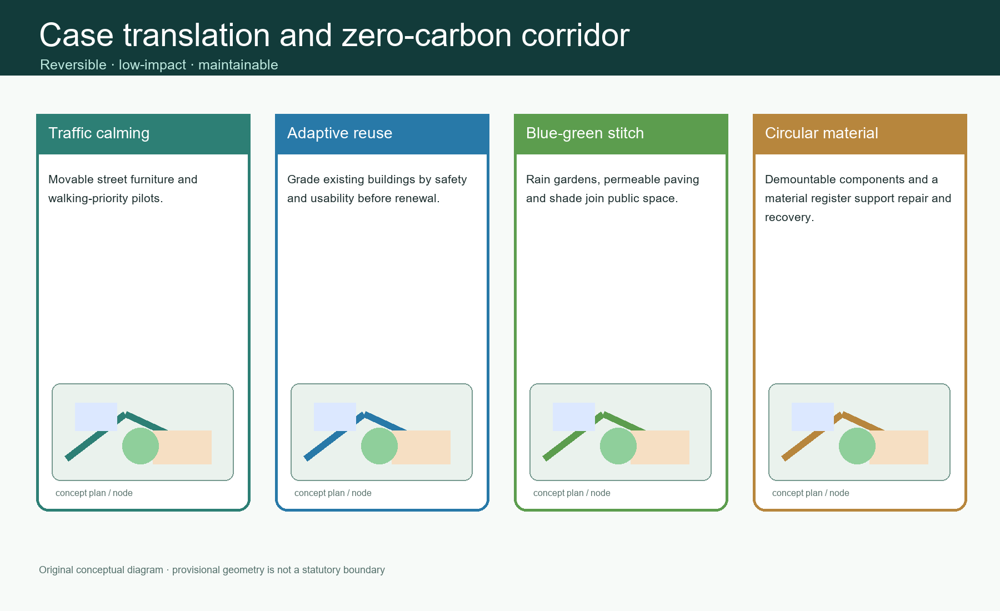
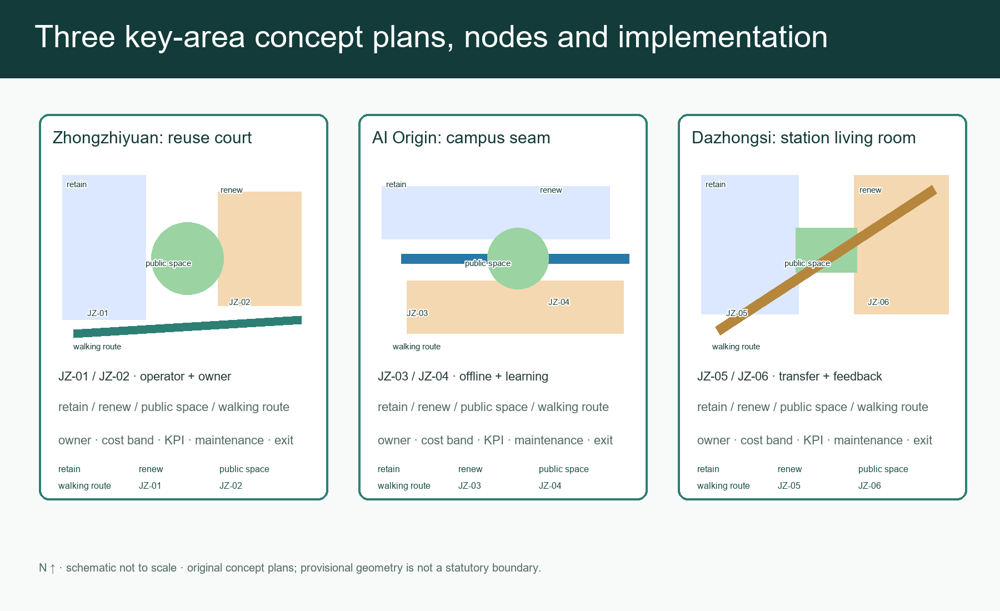
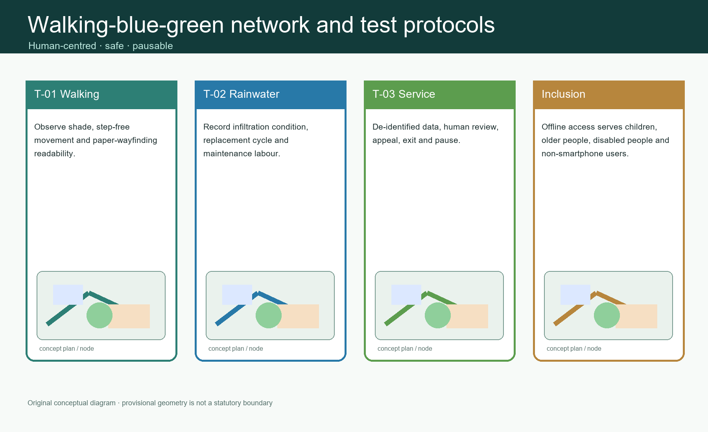
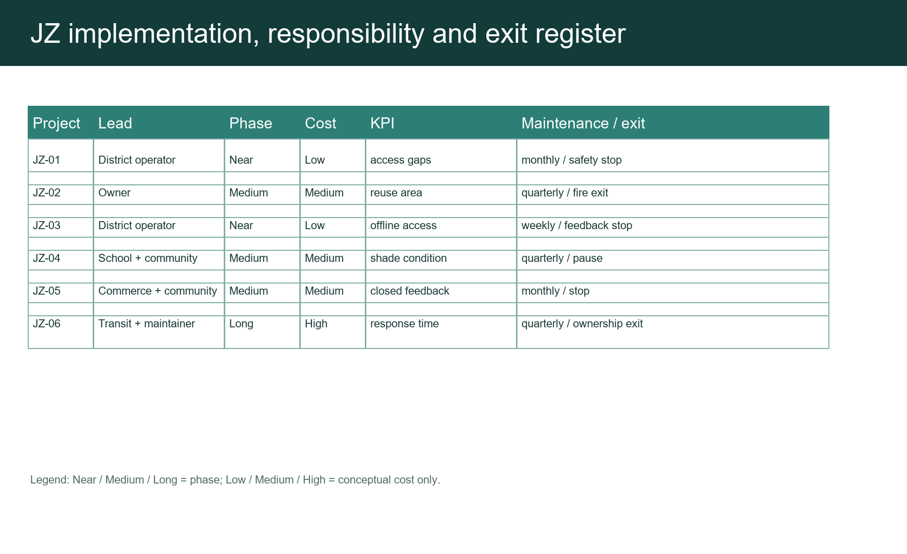

# Zhilian Symbiosis Network

The proposal links knowledge production, industrial conversion, community services and public governance through one civic chain, three hubs, two wings and multiple reversible nodes. It prioritizes adaptive reuse, permeable surfaces, rain gardens, shade, accessibility and maintainable components. All spatial actions are conceptual; provisional geometry is only for display and intake validation. [source:AGENT-TASKBOOK] [depth:overall_spatial_structure]

## Design basis and information register

This package follows the public call, the registered site package and the agent taskbook. Its evidence chain separates source records, reproducible indicators, geometry layers and professional assumptions. Provisional geometry is never upgraded to an official boundary, statutory control, approved programme or government commitment. When official polygons are issued, every dependent layer, metric, board and web page is recalculated together. The sources register, standards matrix, design-depth matrix and missing-data checklist remain the authoritative navigation set for this package.

## Three-scale working framework

The coordination scale establishes an innovation ecosystem and future-city direction. The overall-design scale converts that direction into adaptive-renewal projects, land-use relations, walking connections, public space and infrastructure interfaces. The key-area scale tests building edges, courtyards, streets, stations, open space and implementation thresholds. The same logic is intentionally used for residents, workers, students, visitors, children, older people and people who rely on offline service.

## Coordination-scale industry and future-city research

The innovation ecosystem is organised as a public civic chain: knowledge creation, open collaboration, enterprise conversion, daily service, public experience and external exchange. The framework does not privilege a single user group in its narrative or allocation of public space. It links research, production and civic life through shared facilities, safe streets, accessible green space and accountable service interfaces. Identity, events and cultural routes are therefore supporting instruments for public use rather than branding claims.

## Overall-design adaptive renewal and detailed urban design

At the overall-design scale, existing buildings are retained where safety and use permit, and are upgraded through reversible ground-floor interfaces, shade, accessibility, rainwater facilities, cycle support and maintenance access. The design avoids inventing building heights, FAR, road redlines or engineering capacity where official controls are unavailable. Land use, buildings, roads, green space, public space and phasing are coordinated in the package geometry and verified with reproducible metrics.

## Key-area detailed design

The three key areas form complementary but independent spatial prototypes. Zhongzhiyuan develops a garden innovation courtyard with shared testing and adaptive reuse. Beijing AI Origin Community repairs the campus-city seam with a launch hall, learning steps and staffed offline entry. Dazhongsi works as a station-city civic living room with connected crossings, commercial ground-floor renewal and multifunctional green space. Each prototype identifies public-space action, mobility access, project owner, maintenance threshold and a condition for pausing or exiting the project.

## AI ecosystem, user profiles and civic scenarios

Scenarios are located in public or shared facilities and are bounded by data minimisation, human review, visible appeals and shutdown procedures. The package supports work, study, residence, care, walking, recreation and visiting without requiring smartphone ownership. Paper wayfinding, staffed counters, step-free routes and public feedback are not fallback features: they are equal service channels. Scenario testing must not collect personal movement records or use opaque automated eligibility decisions.

## Land use, building action and retain-renew-replace approach

Building actions use three categories: retain and repair where a building remains useful; renew and open where ground floors or residual spaces can serve the street; replace only where verified safety, accessibility or lifecycle conditions require it. This is a conceptual classification pending surveyed assets and ownership evidence. Reuse prioritises component repair, low-carbon materials and demountable additions so that maintenance and future adjustment remain feasible.

## Mobility, station access, municipal interfaces and civic facilities

Walking continuity is the first mobility priority. The design joins station exits, campus edges, employment areas, homes, green space and civic services through shaded, step-free and legible routes. Cycle parking, short-distance loading and limited service-vehicle access are coordinated at selected interfaces. Rainwater and energy facilities are designed as maintainable public-infrastructure components with clear inspection responsibility, not as autonomous technology displays.

## Blue-green space, public realm and urban character

The blue-green network uses rain gardens, permeable surfaces, tree shade, small courts and connected open spaces to cool streets and reduce runoff. Heritage memory is carried through routes, interpretive information and modest reversible landmark prototypes rather than imitative construction. Public-space details use durable, replaceable components and avoid complex installations that require specialist maintenance or create exclusionary barriers.

## Project register, policy tools and phasing

JZ-01 to JZ-06 provide a concise implementation register. Near-term pilots validate walking, shared service and reversible public-space components. Medium-term actions reuse buildings and improve civic edges after ownership, fire safety and accessibility checks. Long-term actions establish connected low-carbon mobility, maintenance logs, feedback archives and open protocols. Each project has a lead, collaborators, low-medium-high conceptual cost band, dependencies, maintenance responsibility, acceptance indicators and an exit trigger.

## Metrics, recalculation and compliance evidence

The package records boundary area, green and public-space ratios, building footprint and key-area count as reproducible values. Where a value depends on provisional geometry, it is explicitly low confidence, illustrative and non-statutory. Compliance matrices use distinct evidence anchors rather than repeating an undifferentiated file list. Formal scoring must use official geometry and verified field or engineering data when available.

## Risk, rights and compliance statement

Risks include incomplete boundary data, ownership uncertainty, utility and fire constraints, accessibility gaps, maintenance capacity and potential misuse of civic data. The response is staged confirmation, human oversight, transparent feedback, offline access and the ability to pause or withdraw a pilot. Text, diagrams, layout and boards are original to this submission. Asset-level entries record that no third-party photographs, trademarks, remote map tiles, tracking, iframes or restricted fonts are included.

## References

The cited public call, agent taskbook, source registry, processed fact pack, standards references, geometry layers, metrics, assumptions, self-check report and evidence matrices together form the reference set. They are used to substantiate this conceptual proposal and do not substitute for official planning, engineering, ownership or statutory documents.

# Integrated design narrative (resubmission)

# Zhilian Symbiosis Network: a zero-carbon collaborative renewal framework

## 1. Strategic position: the existing city as innovation infrastructure

Zhilian Symbiosis Network treats the Centennial Jing-Zhang AI Innovation Belt as a renewal network made of railway memory, campuses, industrial districts, neighbourhoods and civic services. Instead of clearance-led new construction, it relies on adaptive reuse of existing buildings, repair of walking gaps, stitched blue-green public space and low-impact replacement of infrastructure. Research, entrepreneurship, employment, residence, commuting, care and visiting are supported equally through one shared public-space and service system; innovation therefore becomes part of ordinary urban life rather than an exclusive territory for any group.

The structure is “one spine, three hubs, two loops and six node types”. Jing-Zhang memory and civic space form the spine; Zhongzhiyuan, Beijing AI Origin Community and Dazhongsi form the hubs; a walking-service loop and blue-green resilience loop form the two loops; reused buildings, open courtyards, rain gardens, station interfaces, shared services and low-carbon energy stops form the six node types. Regional coordination and an ecosystem map set the direction; renewal projects and public-space stitching implement it at the overall-design scale; compact walking networks and phased projects test it in the three key areas. [source:OFFICIAL-ANNOUNCEMENT] [source:AGENT-TASKBOOK]

## 2. Regional coordination, case translation and the zero-carbon innovation corridor

The framework connects the Zhongguancun core, northern research corridor, Future Science City, Huairou Science City, Beijing Economic-Technological Development Area and Jing-Jin-Ji application settings as an open collaboration network, not as an administrative commitment. The partners respectively contribute knowledge creation, engineering verification, industrial conversion, public service and scenario feedback. Links are made through joint topics, shared testing protocols and public return of results, rather than through an invented inter-city project list.

Six case families become maintainable methods: Barcelona-style traffic calming becomes reversible street furniture and walking-priority pilots; Helsinki experimentation becomes pausable civic scenario tests; Seoul regeneration becomes graded adaptive reuse; Copenhagen blue-green practice becomes rain gardens and permeable paving; Kyoto university-city exchange becomes campus-street sharing; Amsterdam circularity becomes material registers and demountable components. The zero-carbon innovation corridor uses shade, infiltration, reuse, short walking distances and distributed-energy interfaces as a common technical base, avoiding high-maintenance landscape devices.

## 3. Three key areas: from spatial prototypes to implementable projects

### Zhongzhiyuan AI independent-innovation accelerator

Zhongzhiyuan uses a “garden innovation courtyard” prototype. Viable building frames are retained, while ground-floor edges become shared lobbies, exhibition and civic-service interfaces. Demountable shade, rain gardens and low-carbon computing stops convert residual space; quiet work courts, a step-free loop and evening lighting support all-day use. JZ-01, the Shared Test Courtyard, is led by the district operator using low-cost reversible furniture. JZ-02, the Adaptive-Reuse Unit, is jointly advanced by the owner and specialists only after fire, accessibility and equipment conditions are confirmed.

### Beijing AI Origin Community

The Origin Community uses a “campus-city stitched block” prototype. Continuous walking, pocket squares, a shared launch hall and paper wayfinding connect campus, park, neighbourhood and station. JZ-03, the Open Launch Hall, provides booking and non-digital on-site registration. JZ-04, the Co-learning Steps, combines replaceable seating, shade and rainwater collection. Staffed counters, step-free routes and a grievance route ensure full participation for people who do not use smart devices.

### Dazhongsi AI industry cluster

Dazhongsi uses a “station-city civic living room” prototype. Four-quadrant walking links, a station forecourt, renewed commercial ground floors and multifunctional green space form urban services. JZ-05, the Public Adoption Court, supports display, rest and public feedback. JZ-06, the Low-carbon Transfer Arcade, connects transit through walking shade, cycle parking and maintainable rainwater facilities. Every project first identifies ownership, maintenance responsibility and safety thresholds; if they cannot be met, it exits or remains a temporary pilot.

## 4. Test protocols, operations and inclusive service

T-01, the Walking and Wayfinding Test, records shade, continuous step-free movement, readability of paper wayfinding and observed results; it can stop immediately when safety is affected. T-02, the Rainwater and Maintenance Test, records infiltration condition, replacement cycles and maintenance labour without collecting behavioural data. T-03, the Civic-service Scenario Test, uses only de-identified facility data and provides human review, appeal, exit and pause. Together they create auditable logs rather than using an algorithm to replace public decision-making.

Annual operations combine an Open Scenarios Week, Public Maintenance Day, Joint Review Day and Results-return Season. A district operator coordinates; owners, schools, enterprises, community groups and specialist maintenance teams cooperate by project; public authorities supervise. Indicators include removed accessibility gaps, condition of shade and rainwater facilities, availability of offline services, feedback closure and maintenance response time. Costs are only conceptual low, medium and high bands pending engineering, ownership and official-boundary data.

## 5. Drawings, boundary and rights statement

The board system comprises six complementary drawing families: overall structure; cases and zero-carbon methods; three key-area concept plans and nodes; walking and blue-green networks; project-responsibility-phasing; and metric evidence. The A3 booklet supports page-by-page review, while A0 boards support collective display. The identity uses deep teal, rainwater blue, vegetation green and warm gold as maintainable wayfinding colours; the Chain Gateway, Co-learning Steps and Public Adoption Court are three demountable landmark prototypes.

Current boundary, area and ratio data derive from provisional_only geometry. They are for conceptual display, intake and self-check only, and are not statutory redlines, precise areas or professional-scoring inputs. When official geometry is issued, boundary, key areas, metrics, drawings and the web page must be recalculated together. All icons, diagrams, layout and writing are original to this submission; no third-party photographs, trademarks, map tiles or restricted assets are embedded. The asset register is in `report/copyright_statement.md`.

