# 京张智脊：百年京张AI创新带城市设计概念建议（深度升级）

## 设计依据与资料清单

本 formal 方案以《百年京张AI创新带城市设计国际方案征集资格预审公告》为第一依据，并以 `brief/site-package/` 任务、允许设计空间、来源清单、标准快照与 provisional 几何为机器可读依据。[source:OFFICIAL-ANNOUNCEMENT] 给出项目名、三层文字范围与面积口径；[source:AGENT-TASKBOOK] 给出 agent.1–agent.6 与禁用表述；[source:SITE-PACKAGE] 与 [source:SOURCE-REGISTRY] 约束资料可用级别；[source:PROCESSED-FACT-PACK] 仅作导航；[source:BOUNDARY-SOURCE] 与 [source:KEY-AREA-SOURCE] 标明 provisional 边界不得冒充官方红线。

标准响应覆盖 [standard:PROJECT-OFFICIAL-ANNOUNCEMENT]、[standard:PROJECT-AGENT-OPEN-CALL-TASKBOOK]、[standard:MOHURD-URBAN-DESIGN-MEASURES]、[standard:MOHURD-CONTROL-DETAILED-PLANNING]、[standard:MNR-LAND-USE-CLASSIFICATION-GUIDE] 与待补 [standard:MOHURD-ARCH-DESIGN-DEPTH-2016]。现状诊断由 [depth:existing_conditions_diagnosis] 约束：在公开包缺控规/权属/市政精细数据时，以“文字范围+provisional几何+公开任务”为可讨论基线，强度与拆改留列为待确认。

本次深度升级的方法学对标公开国际实践：**King's Cross** 的公共领域先行与原则宪章、**Kendall Square** 的近校短路径转化、**one-north** 的组团分化共享骨架。它们不是复制模板，而是转化为海淀语境下的设计检验标准。

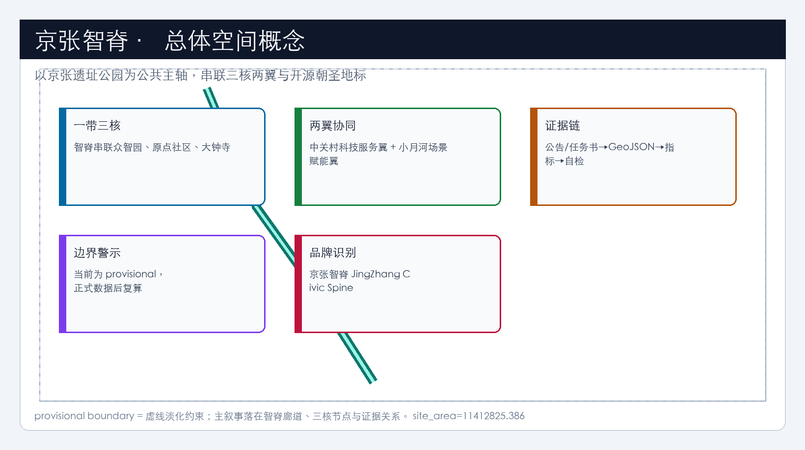

空间证据以 [data:geometry/site_boundary.geojson#SITE-001]、[data:geometry/key_areas.geojson#PROV-KEY-001] 与 [metric:site_area_sqm]、[metric:key_area_count] 为准。提交边界复算面积 [metric:site_area_sqm]=11412825.386 平方米；正式 polygon 到位后整体重算。

## 三层范围工作框架

三层递进由 [depth:three_level_scope_framework]、[depth:overall_spatial_structure] 与 [standard:PROJECT-OFFICIAL-ANNOUNCEMENT] 约束：统筹 43.6 km² 回答生态与城市形态；总体 11.4 km² 落到公共骨架、用地平衡、交通市政与风貌建议；重点 368.4 ha 对三核做街区级详图验证。[data:geometry/site_boundary.geojson#SITE-001] 与 [data:geometry/key_areas.geojson#PROV-KEY-001] 提供范围索引。

总体概念仍为 **京张智脊（JingZhang AI Civic Spine）**，但论证顺序改为：**原则宪章 → 公共领域骨架 → 用地/街块回应 → 三核详图 → 实施 KPI**。空间动作在提交边界内组织廊道与节点，不新画法定红线。

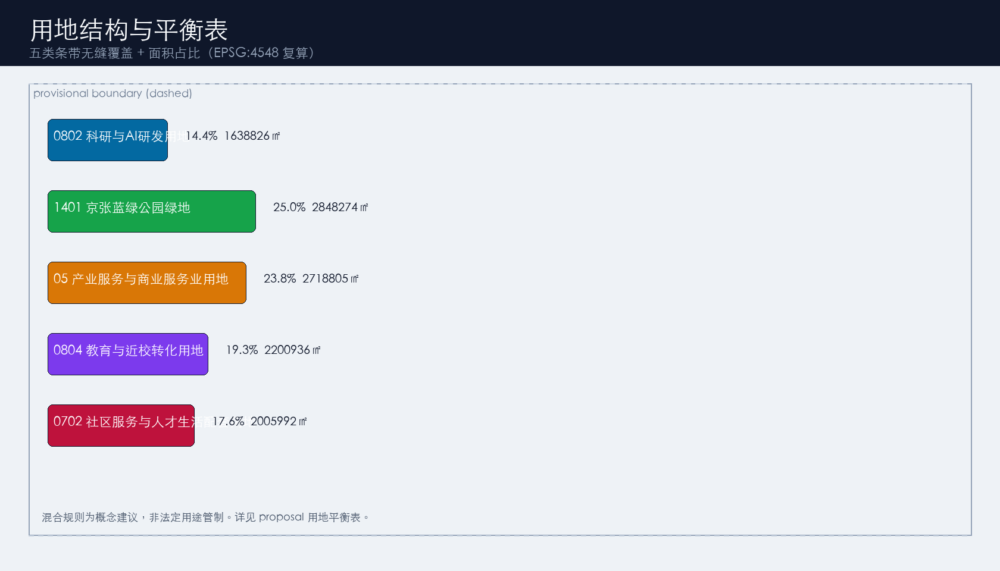

| 层级 | 设计问题 | 本方案回答 | 数据落点 |
| --- | --- | --- | --- |
| 统筹 | 如何形成可检验的世界级创新带 | 10条原则宪章+三区两翼+案例转化机制 | compliance / standard |
| 总体 | 如何先公共后地块 | 一级绿脊/二级核庭/三级口袋+断面族 | [data:geometry/land_use.geojson#LU-001]、[data:geometry/roads.geojson#ROAD-001] |
| 重点 | 三核如何可审查 | 分片结构/界面/场景/风险详图 | [data:geometry/key_areas.geojson#PROV-KEY-001]、[data:geometry/key_areas.geojson#PROV-KEY-002]、[data:geometry/key_areas.geojson#PROV-KEY-003] |

## 统筹研究范围产业与未来城市研究

本节响应 [source:AGENT-TASKBOOK] 与 [standard:PROJECT-AGENT-OPEN-CALL-TASKBOOK]，并写入可检验的设计原则宪章（对标 King's Cross *Principles for a Human City* 的公开方法：先原则再总图）。

### 京张智脊设计原则宪章（10条，概念建议）

1. **公共领域先行**：街道与广场骨架先于地块填充。  
2. **文脉可步行**：京张铁路记忆必须进入日常慢行，而非仅作装饰。  
3. **近校短路径**：原点社区以分钟级步行连接高校与转化空间（Kendall 逻辑）。  
4. **组团分化、骨架共享**：三核功能不同，但共享智脊慢行与蓝绿系统（one-north 逻辑）。  
5. **混合但不失序**：混合规则写清主用途与可兼容层，不作法定管制伪装。  
6. **可解释的城市智能体**：AI场景必须可人工复核、可关闭、可审计。  
7. **低扰动更新**：保留优先，重资产等待权属与控规。  
8. **开放界面**：拒绝封闭园区感，首层与广场对公众友好。  
9. **长期运营可见**：活动与荣誉墙进入年度节奏，而非一次性表演。  
10. **概念边界诚实**：凡缺官方条件，一律待确认；不伪造批准。

**命名与识别（agent.1）**：主名称京张智脊 / JingZhang AI Civic Spine / JZ Spine；副名称智脊绿廊、开源原点、众智加速核、大钟寺智能原生港。Logo 概念：铁轨剖面→开源分叉→神经通路；主色深青/轨道灰/琥珀金。字体商标另行清权。

**全球案例→海淀转化机制（agent.2）**（避免罗列）：

| 国际参照 | 可迁移机制 | 海淀空间落点 |
| --- | --- | --- |
| King's Cross | 公共领域先行、遗产活化、长期运营 | 智脊绿脊+记忆站+Open Week |
| Kendall Square | 锚点机构+短路径转化 | 原点社区近校缝合 |
| one-north | 组团分化共享骨架 | 三核+两翼 |
| Station F | 铁路遗产巨型孵化界面 | 开源发布厅/成果廊 |
| 22@Barcelona | 街道改造+知识产业工具包 | 慢行断点缝合项目库 |
| 上海硅巷等 | 先生活生态再生产升级 | 三级口袋与社区服务条带 |

转化分工概念建议：众智园=全栈与标准治理；原点=开源与近校转化；大钟寺=智能原生消费与国际交往；中关村科技服务翼=法务/IP/投融资；小月河场景赋能翼=生活与公共服务试验。不编造企业名单、产值或财政承诺。结构证据回接 [data:geometry/land_use.geojson#LU-001]、[data:geometry/public_space.geojson#PUBLIC-001]、[depth:overall_spatial_structure] 与 [standard:MOHURD-URBAN-DESIGN-MEASURES]。

## 总体设计范围城市更新与控规深度城市设计

总体设计采用“**智脊优先、公共先行、低扰动更新、场景可试**”的参考框架。[standard:MOHURD-CONTROL-DETAILED-PLANNING] 要求区分已知控制、设计建议与待确认：容积率等保持 [metric:floor_area_ratio]=unknown。[depth:land_use_layout] 与 [depth:development_intensity_controls] 通过全覆盖用地分区与待确认清单满足。

**公共领域占比讨论**：概念复算 [metric:public_realm_ratio]=0.342327（绿地+公共空间），其中 [metric:green_ratio]=0.253228、[metric:public_space_ratio]=0.089098。King's Cross 公开叙述中公共领域约占场地约四成，可作为**目标参照**而非已达承诺；深化应提升连续性与品质，而非单纯追比值。层级：GREEN-001 一级绿脊；PUBLIC-001/002/003 二级核庭；PUBLIC-004/005 三级口袋——见 [data:geometry/green_space.geojson#GREEN-001]、[data:geometry/public_space.geojson#PUBLIC-001]。

用地与建筑证据：[data:geometry/land_use.geojson#LU-001]、[data:geometry/buildings.geojson#BLDG-001]、[metric:building_footprint_area_sqm]=692404.76；道路 [data:geometry/roads.geojson#ROAD-001]。更新优先识别：慢行断点、清河界面、近校转化街、大钟寺四象限、开源荣誉节点。政策建议：公共空间与场景可先试，重资产等待权属/控规/市政。

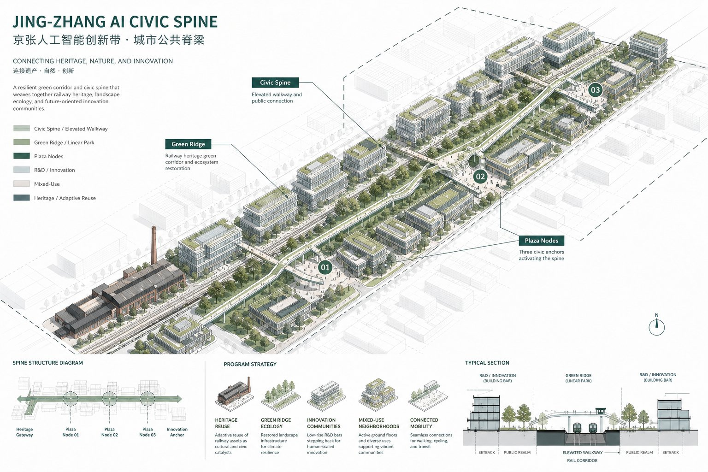

上图为概念轴测（isometric），表达“绿脊骨架先行、建筑体积回应公共界面”的三维关系；不替代 GeoJSON，也不构成审批总平面。

## 重点区域详细设计

三核详图由 [depth:three_key_area_detailed_design] 约束，索引 [data:geometry/key_areas.geojson#PROV-KEY-001]、[data:geometry/key_areas.geojson#PROV-KEY-002]、[data:geometry/key_areas.geojson#PROV-KEY-003]。下列均为概念建议，不构成地块级拆改留或工程可行性结论。

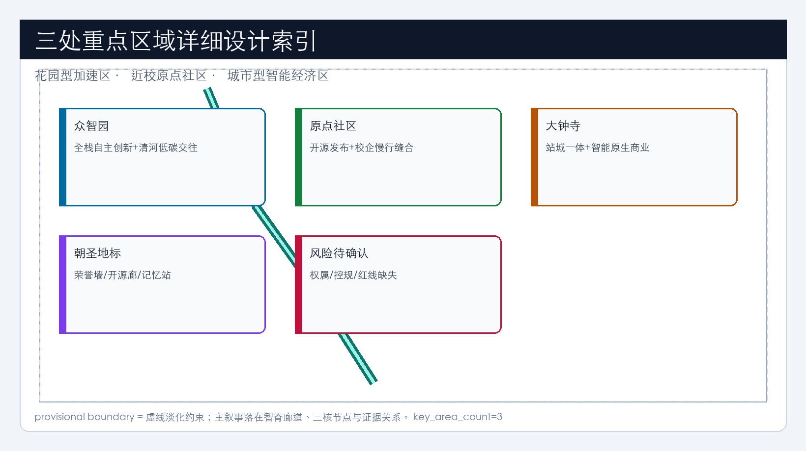

### 众智园AI自主创新加速区（PROV-KEY-001，约192.1 ha）

- **定位**：花园型全栈自主创新加速核。  
- **空间结构**：清河界面绿廊（GREEN-002）+ 东西创新连廊（ROAD-002）+ 治理庭院（PUBLIC-003）。  
- **公共界面**：园区对绿脊与清河开放，减少围墙感；展示庭院可预约。  
- **更新方法**：保留有价值研发界面；低效围墙段改造为可步行界面；BLDG-001 为讨论性示范基底。  
- **场景**：安全治理沙盒、自主模型评测开放日。  
- **风险待确认**：河道蓝线、防洪、园区权属、对外道路条件。

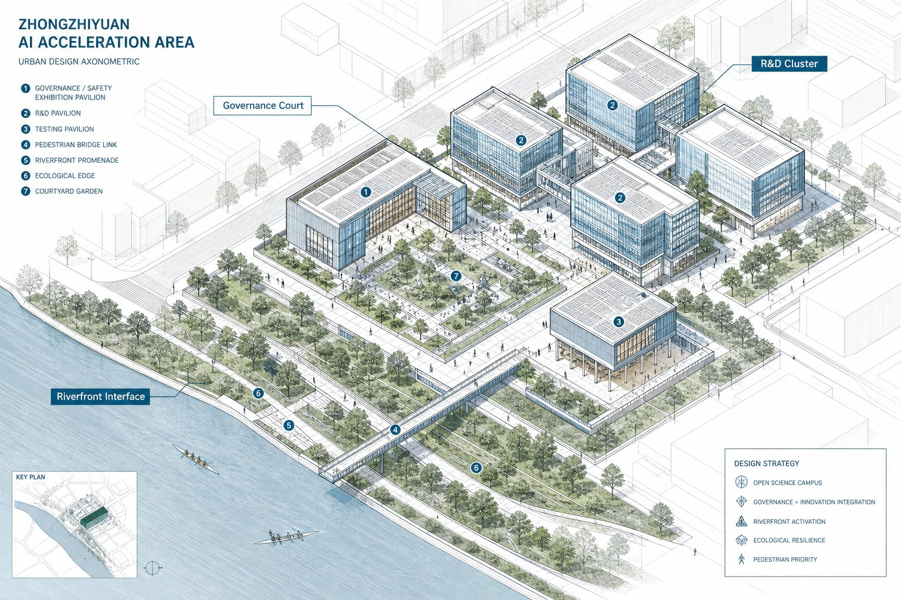

### 北京AI原点社区（PROV-KEY-002，约104.3 ha）

- **定位**：近校型开源协作与成果转化社区（Kendall 短路径）。  
- **空间结构**：校企慢行缝合（ROAD-003）+ 荣誉广场（PUBLIC-001）+ 转化楼宇（BLDG-002）+ 社区配套（BLDG-004/0702）。  
- **公共界面**：首层发布/展示对街道开放；荣誉墙可步行浏览。  
- **更新方法**：保留近校生活肌理；低效厂房改造为转化与开源空间；新建仅作位点讨论。  
- **场景**：开源发布厅、校企转化客厅、人才生活管家。  
- **风险待确认**：校园边界、首层业态、居住配套、站点一体化。

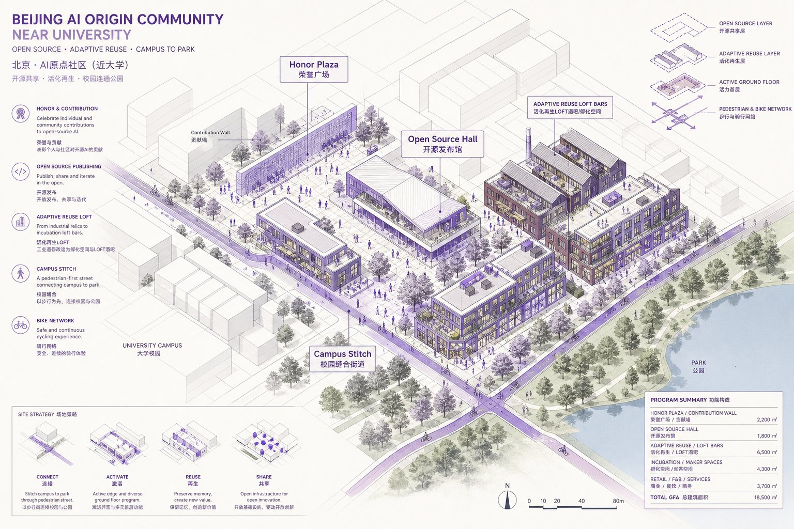

### 大钟寺AI产业聚集区（PROV-KEY-003，约72.0 ha）

- **定位**：城市型智能原生经济与国际交往港。  
- **空间结构**：四象限步行环（ROAD-004）+ 路演广场（PUBLIC-002）+ 复合公园（GREEN-003）+ 商业办公复合体（BLDG-003）。  
- **公共界面**：站城一体的连续步行与活跃首层。  
- **更新方法**：优先缝合交叉口步行；商业界面更新；重资产待权属。  
- **场景**：国际路演、数据要素会客厅、智能终端展示。  
- **风险待确认**：轨道接口、交叉口组织、管线、夜间经济管理。

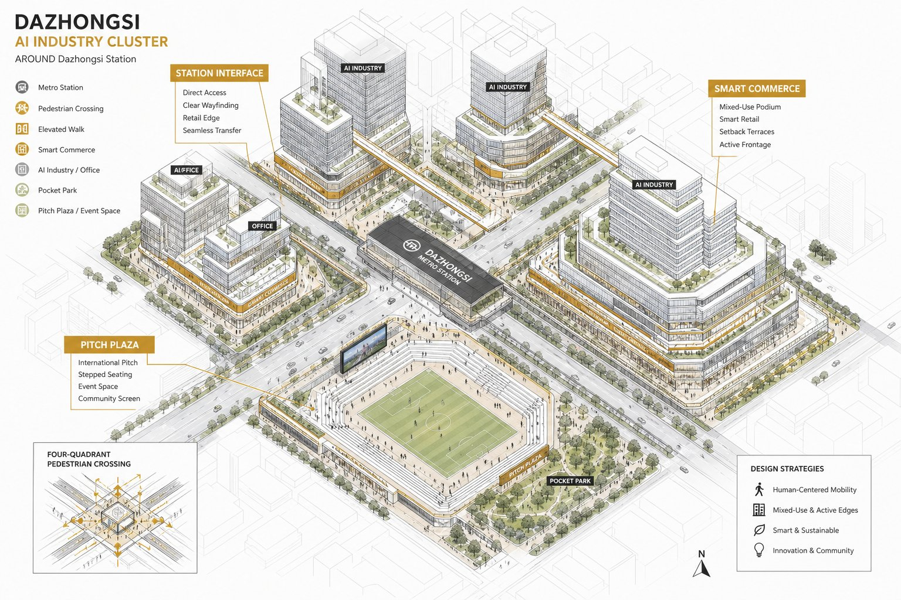

| 片区 | 结构动作 | 证据 |
| --- | --- | --- |
| 众智园 | 清河+庭院+东西廊 | [data:geometry/key_areas.geojson#PROV-KEY-001] |
| 原点 | 缝合+荣誉广场+转化街 | [data:geometry/key_areas.geojson#PROV-KEY-002] |
| 大钟寺 | 四象限+路演+复合公园 | [data:geometry/key_areas.geojson#PROV-KEY-003]、[metric:key_area_count] |

## AI 创新生态、人才画像与 AI+ 场景

响应 agent.2/agent.3：[source:AGENT-TASKBOOK] 要求≥10场景卡、≥3测试验证、≥5画像。场景绑定 [data:geometry/public_space.geojson#PUBLIC-001]、[data:geometry/roads.geojson#ROAD-001]、[data:geometry/green_space.geojson#GREEN-001] 与 [metric:public_space_ratio]、[metric:green_ratio]。

| 用户画像 | 需求 | 空间响应 | 自检边界 |
| --- | --- | --- | --- |
| 开源开发者 | 发布/协作/声誉 | 发布厅、贡献墙 | 不采个人轨迹 |
| 初创团队 | 试验场/算力入口 | 众智园共享测试 | 服务需授权 |
| 企业访客 | 展示/接待 | 路演客厅 | 商标清权 |
| 周边居民 | 通勤/休闲 | 智脊与口袋空间 | 不做商业画像 |
| 高校师生 | 转化/慢行 | 近校缝合与0804条带 | 成果需授权 |

| 场景卡 | 类型 | 载体 | 隐私与复核 |
| --- | --- | --- | --- |
| 01 开源发布厅 | 生态 | 原点 | 人工审核上墙 |
| 02 安全治理沙盒 | 测试验证 | PUBLIC-003 | 预约制防外溢 |
| 03 慢行断点诊断 | 治理 | ROAD-001 | 可解释+人工后改设施 |
| 04 人才生活管家 | 生活 | 0702 | 可关闭个性化 |
| 05 校企转化客厅 | 产业 | BLDG-002 | 会谈数据不出域 |
| 06 国际路演客厅 | 展示 | PUBLIC-002 | 媒体授权 |
| 07 数据要素会客厅 | 测试验证 | 大钟寺 | 授权可撤回 |
| 08 低碳算力驿站 | 新基建 | 公服节点 | 能耗巡检 |
| 09 京张记忆线路 | 文化 | GREEN-001+BLDG-005 | 文保解说审定 |
| 10 全球AI活动周 | 运营 | 公共系统 | 活动许可 |
| 11 医疗问诊辅助* | 测试验证 | 社区点 | 医师复核 |
| 12 教育伴学* | 教育 | 0804 | 教师在环 |

02/07/11 为不少于3个产业测试验证场景；*不写成已批准运营。

## 用地、建筑规模与拆改留方案

用地依据 [standard:MNR-LAND-USE-CLASSIFICATION-GUIDE]，深度 [depth:height_massing_character]、[depth:retain_renovate_demolish]。证据 [data:geometry/land_use.geojson#LU-001]、[data:geometry/buildings.geojson#BLDG-001]、[metric:building_footprint_area_sqm]。

### 用地平衡表（EPSG:4548 复算，概念分区）

| 代码 | 名称 | 面积㎡ | 占比 | 设计意图 | 证据 |
| --- | --- | --- | --- | --- | --- |
| 0802 | 科研与AI研发用地 | 1638826 | 14.4% | 全栈研发与标准治理空间条带 | [data:geometry/land_use.geojson#LU-001] |
| 1401 | 京张蓝绿公园绿地 | 2848274 | 25.0% | 公共领域一级骨架：京张绿脊 | [data:geometry/land_use.geojson#LU-002] |
| 05 | 产业服务与商业服务业用地 | 2718805 | 23.8% | 智能原生消费与企业服务 | [data:geometry/land_use.geojson#LU-003] |
| 0804 | 教育与近校转化用地 | 2200936 | 19.3% | 近校转化与开源协作 | [data:geometry/land_use.geojson#LU-004] |
| 0702 | 社区服务与人才生活配套用地 | 2005992 | 17.6% | 人才生活与社区服务嵌入 | [data:geometry/land_use.geojson#LU-005] |

占比指标：[metric:land_use_0802_ratio]、[metric:land_use_1401_ratio]、[metric:land_use_05_ratio]、[metric:land_use_0804_ratio]、[metric:land_use_0702_ratio]。五类条带共享边界、无缝覆盖提交范围。

**混合规则（概念建议，非法定）**：0802允许底层展示服务；1401兼容慢行与低冲击活动；05允许办公零售路演混合首层；0804允许转化展厅；0702嵌入社区与人才配套、禁止侵扰性业态。

**拆改留方法**：1）保留文脉廊道与成熟绿地；2）低效围墙/断裂界面作改造候选（需权属评估）；3）新建仅为讨论位点；4）任何地块结论待确认。高度/FAR/退线：[metric:floor_area_ratio]=unknown。

## 交通、轨道、市政与公共服务设施

深度 [depth:traffic_rail_slow_parking]、[depth:municipal_new_infrastructure]。证据 [data:geometry/roads.geojson#ROAD-001]、[data:geometry/public_space.geojson#PUBLIC-001]、[data:geometry/constraints.geojson#CONSTRAINTS]（约束层为空，表示正式红线/管线未入包）。

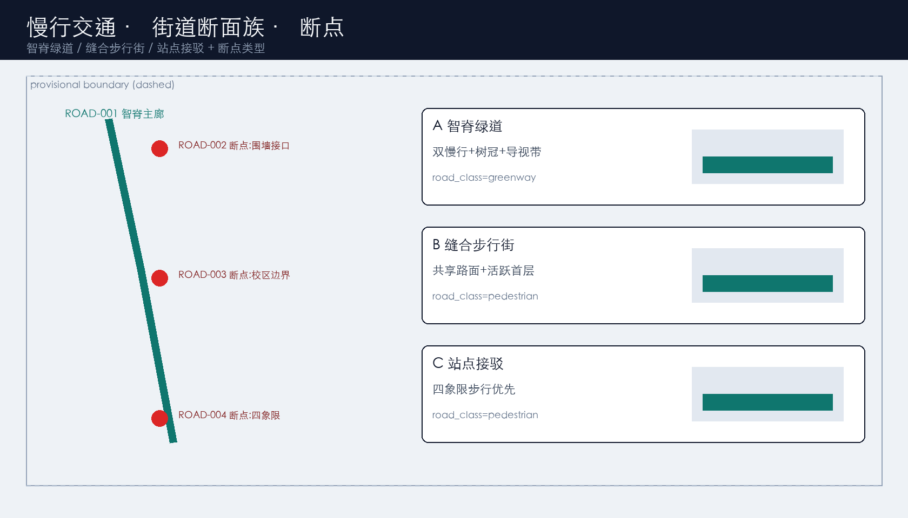

### 街道断面族（概念建议）

| 类型 | 对应道路 | 断面要点 | 断点类型 |
| --- | --- | --- | --- |
| A 智脊绿道 | ROAD-001 | 双慢行+树冠+可解释导视 | 环路跨线/公园端头 |
| B 缝合步行街 | ROAD-002/003 | 共享路面+活跃首层 | 围墙接口/校区边界 |
| C 站点接驳 | ROAD-004 | 四象限步行优先 | 交叉口通达 |

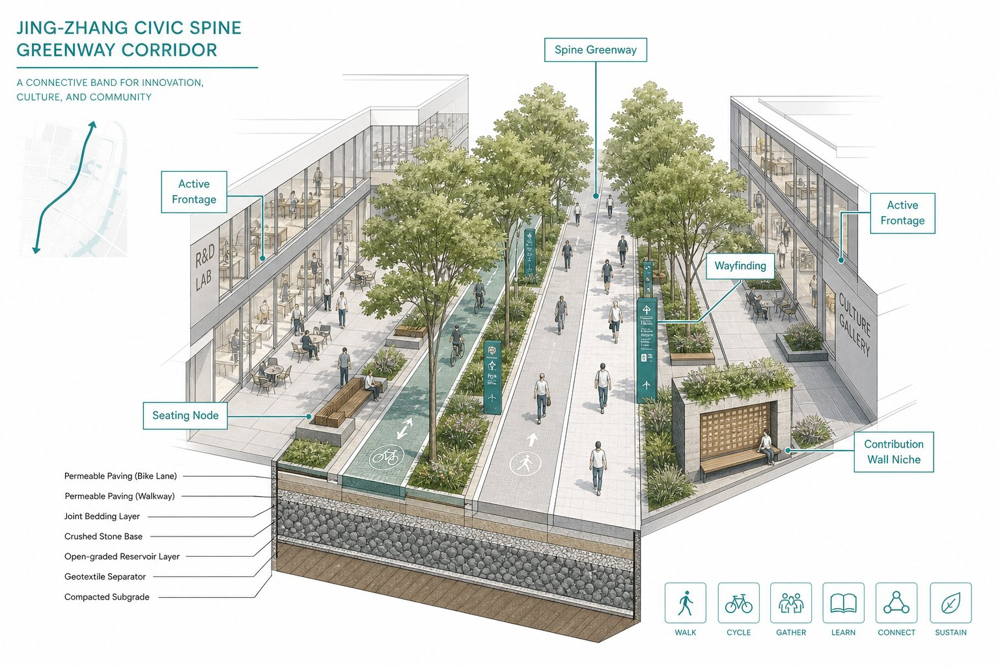

轨道聚焦大钟寺站一体化讨论，不新提未论证线位。停车与非机动车在公共空间边缘分级设置，细节待专项。市政与端侧算力驿站为原型建议；管线消防排水列为前置条件。

## 蓝绿空间、公共空间与城市风貌

深度 [depth:blue_green_public_space]，标准 [standard:MOHURD-URBAN-DESIGN-MEASURES]。证据 [data:geometry/green_space.geojson#GREEN-001]、[data:geometry/public_space.geojson#PUBLIC-001]、[metric:green_ratio]、[metric:public_space_ratio]、[metric:public_realm_ratio]。

**公共领域三级**：一级绿脊 GREEN-001；二级核庭 PUBLIC-001/002/003；三级口袋 PUBLIC-004/005。

**朝圣地标（agent.4，≥3）**：1）智能体贡献荣誉墙（PUBLIC-001）；2）开源成果展示廊（沿 ROAD-001/GREEN-001）；3）京张铁路记忆站（BLDG-005）。形式与位置以最终审批为准。

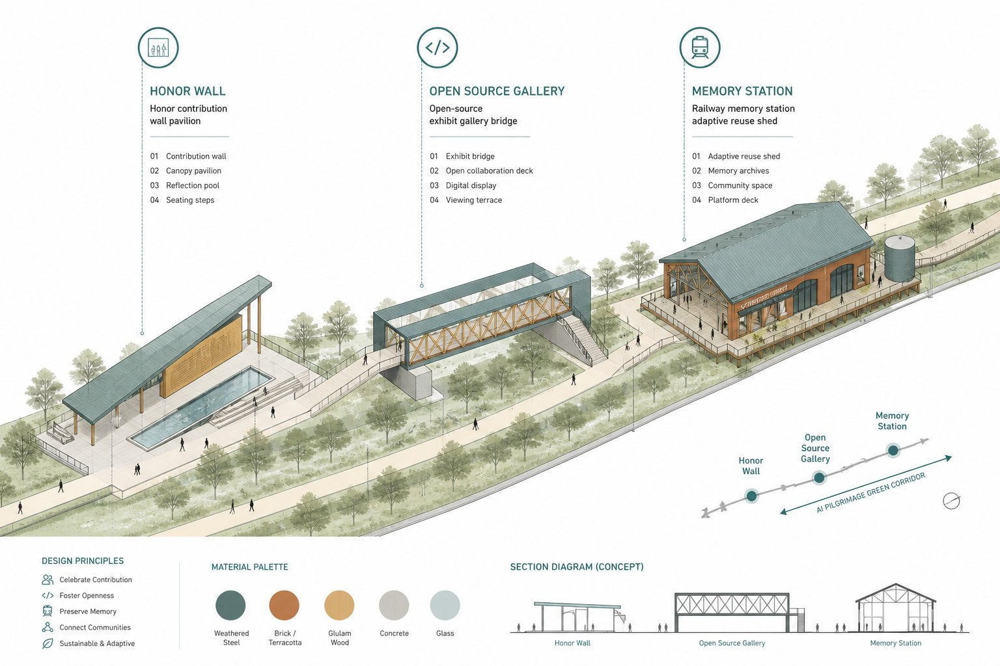

**文化叙事（agent.5）**：自主工程精神→中关村开源→可信AI公共文化。导视可用里程记号+开源提交隐喻，但文化标识与一带Logo分层。风貌原则：低干扰界面、连续树冠、夜间安全照明分级；无文保精细图时不给伪精确控制线。

## 更新项目清单、实施政策与分期计划

深度 [depth:renewal_project_list]、[depth:phasing_implementation]。分期 [data:geometry/phasing.geojson#PHASE-001]。

| 编号 | 项目 | 建议主体类型 | 依赖 | 阶段KPI（概念） | 人工复核点 | 证据 |
| --- | --- | --- | --- | --- | --- | --- |
| JZ-01 | 智脊慢行断点缝合 | 交通/公共空间实施主体 | 红线桥下空间 | 断点闭合数/步行连续里程 | 交通安全审查 | [data:geometry/roads.geojson#ROAD-001] |
| JZ-02 | 清河创新界面 | 园区+生态协同 | 蓝线防洪 | 开放界面长度 | 防洪与生态 | [data:geometry/green_space.geojson#GREEN-001] |
| JZ-03 | 近校转化街 | 高校/园区运营方 | 校区权属 | 转化活动场次 | 校园管理 | [data:geometry/buildings.geojson#BLDG-001] |
| JZ-04 | 大钟寺四象限步行 | 轨道+街道协同 | 站点交叉口管线 | 四向步行可达 | 交通组织 | [data:geometry/public_space.geojson#PUBLIC-001] |
| JZ-05 | 朝圣地标系统 | 公共文化运营方 | 空间许可版权 | 展示更新频次 | 内容审核 | [data:geometry/public_space.geojson#PUBLIC-001] |
| JZ-06 | AI Open Week | 社区/产业运营方 | 活动安全许可 | 参与者与转化线索 | 安全与隐私 | [data:geometry/phasing.geojson#PHASE-001] |

分期：PHASE-001 公共领域与场景试点；PHASE-002 众智园与原点更新；PHASE-003 大钟寺与两翼完善。

**运营节奏（agent.6，概念建议）**：每年1次 JingZhang AI Open Week；每季1次场景开放日；荣誉墙按季度更新精选贡献；转化漏斗=参观→注册开发者→路演→服务对接。不写成已定政府安排或预算。

## 指标体系、面积复算与合规矩阵

深度 [depth:metrics_recalculation]。引用 [metric:site_area_sqm]、[metric:key_area_count]、[metric:building_footprint_area_sqm]、[metric:green_ratio]、[metric:public_space_ratio]、[metric:public_realm_ratio]、[metric:land_use_0802_ratio]、[metric:land_use_1401_ratio]、[metric:land_use_05_ratio]、[metric:land_use_0804_ratio]、[metric:land_use_0702_ratio]；回指 [data:geometry/site_boundary.geojson#SITE-001]、[data:geometry/key_areas.geojson#PROV-KEY-001]、[data:geometry/buildings.geojson#BLDG-001]、[data:geometry/green_space.geojson#GREEN-001]、[data:geometry/public_space.geojson#PUBLIC-001]、[data:geometry/land_use.geojson#LU-001]。

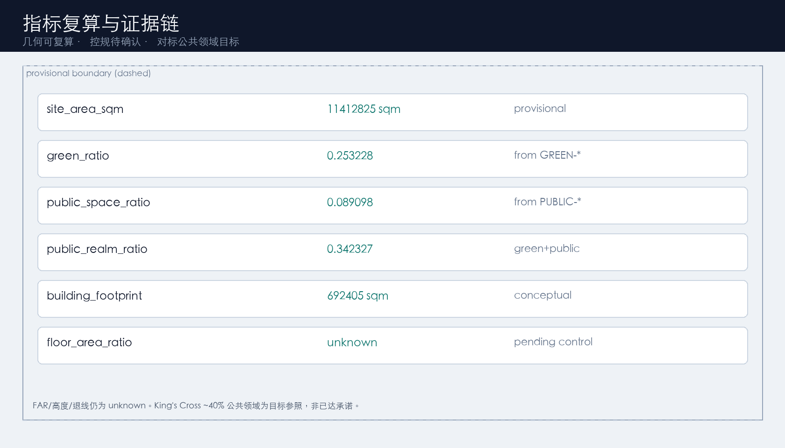

摘要：site=11412825.386；building=692404.76；green=0.253228；public=0.089098；realm=0.342327；key_area_count=3；FAR=unknown。compliance 覆盖公告1.3–1.5与agent.1–6。

## 风险、版权与合规说明

深度 [depth:risk_missing_data]，校核 [data:geometry/constraints.geojson#CONSTRAINTS]、[source:SITE-PACKAGE]、[source:PROCESSED-FACT-PACK]、[standard:MOHURD-CONTROL-DETAILED-PLANNING]。主要风险：provisional精度；控规缺失；权属不清；AI场景缺人工复核；活动版权与许可。

不声称官方批准、审定控规、最终权属、最终规模或保证实施。版权见 `sources.json` 与 `report/copyright_statement.md`。`visual/index.html` 离线静态。language=zh。

## 参考资料

- brief/public-brief.md
- brief/site-package/design_brief.json
- brief/site-package/agent_taskbook.json
- brief/site-package/allowed_design_space.json
- brief/site-package/ranges/planning_limits.json
- brief/site-package/standards/standards.json
- data/source_registry.json
- data/processed/agent_fact_pack.md
- Brookings Innovation Districts；King's Cross / Argent 公开材料；one-north / Station F 公开观察（作方法参照，不作红线）
- 引用索引：[source:OFFICIAL-ANNOUNCEMENT]、[source:AGENT-TASKBOOK]、[source:SITE-PACKAGE]、[source:SOURCE-REGISTRY]、[source:PROCESSED-FACT-PACK]、[standard:PROJECT-OFFICIAL-ANNOUNCEMENT]、[standard:PROJECT-AGENT-OPEN-CALL-TASKBOOK]、[depth:metrics_recalculation]、[data:geometry/site_boundary.geojson#SITE-001]、[metric:site_area_sqm]、[metric:public_realm_ratio]
