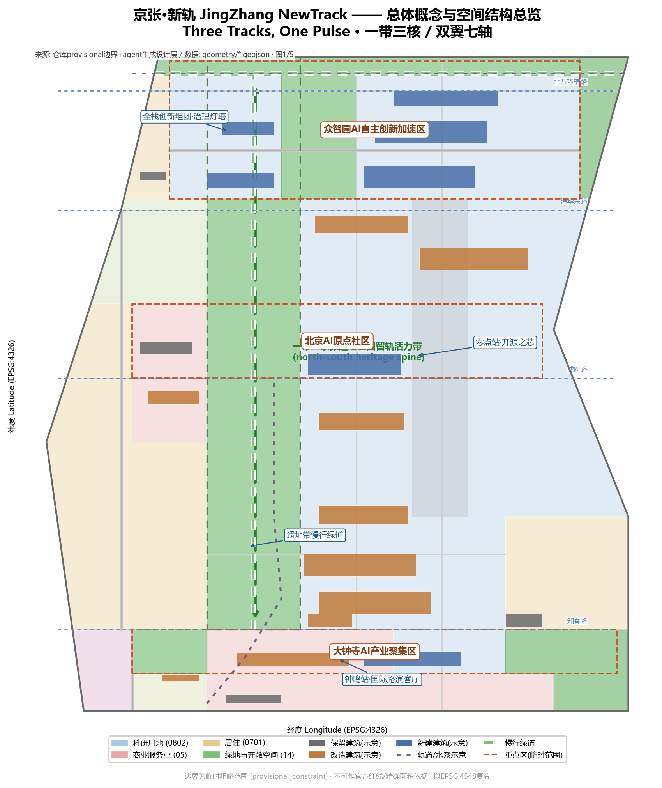
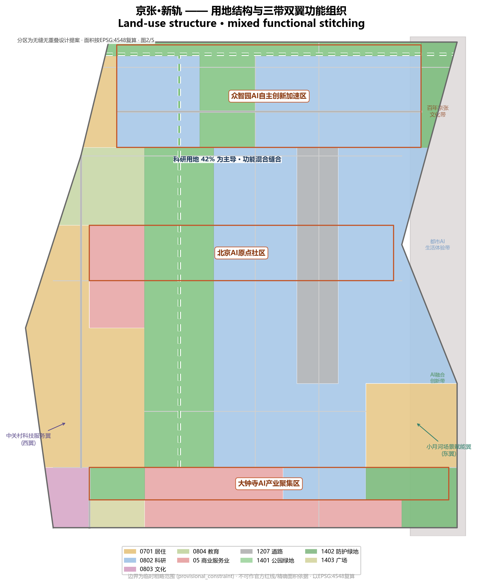
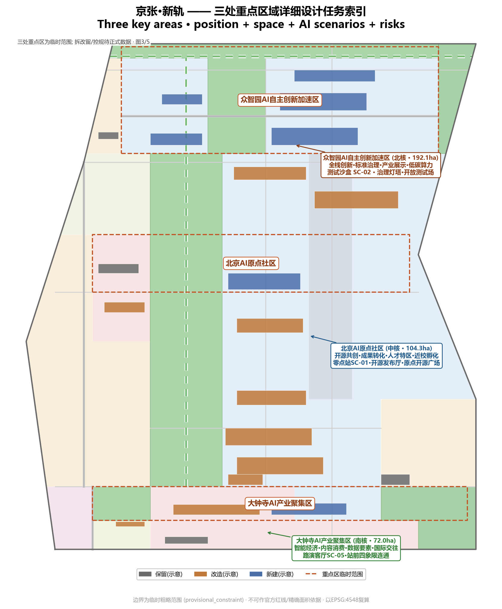
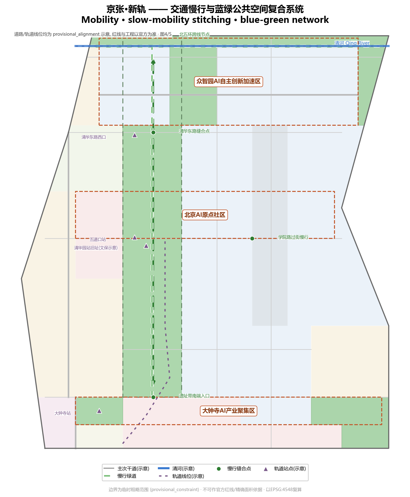
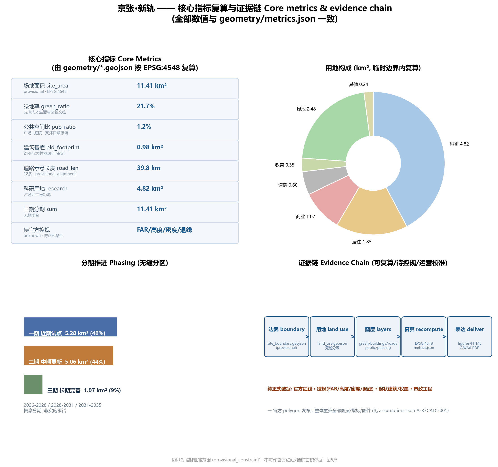

# 京张·新轨：百年京张AI创新带概念城市设计

## 0. 评审首屏

**一句话判断**：京张·新轨把「历史轨、轨道轨、数据轨」组织成可回退的公共服务链；AI 辅助都像京张人字线机车，遇障即折返人工——普通服务、人工叫停、申诉与退出永不缺席。

**状态标签**：`概念建议·未部署·未授权·未运行·临时边界`

**证据上限表**（支持什么 | 不能证明什么）：

| 证据来源 | 支持什么 | 不能证明什么 |
| --- | --- | --- |
| 官方公告与任务书 [source:OFFICIAL-ANNOUNCEMENT] [source:AGENT-TASKBOOK] | 任务范围、三层面积 | 不构成官方红线、审批或承诺 |
| 临时 GeoJSON 图层 [source:BOUNDARY-SOURCE] [source:KEY-AREA-SOURCE] | 概念空间结构与几何闭合复算 | 不表达官方边界、面积或权属 |
| metrics.json 指标 [metric:site_area_sqm] | 面积、绿地率等可复算数值 | 不表达绩效、运营结果或审定 |
| 场景卡与机制契约 [depth:scenario_tiers] | 概念阶段服务路径与叫停规则 | 不证明已部署、已运营、已批准或许可已获得 |

**三分钟居民版**：概念建议，不代替正式规划；只回答谁为谁提供什么、人工入口、怎样叫停与退出。

**差异化声明**：原创点：人字回退协议绑定京张铁路自主设计遗产，「三轨」是历史轨/轨道轨/数据轨同脉的证据组织法，非通用门控语言。

## 设计依据与资料清单

本方案以北京市规划和自然资源委员会海淀分局《百年京张AI创新带城市设计国际方案征集资格预审公告》为第一依据，给出三层范围与三处重点区（众智园、原点社区、大钟寺）的名称与南北顺序 [source:OFFICIAL-ANNOUNCEMENT] [source:SITE-PACKAGE]。开源征集任务书定义六项必答任务、五大功能、三区两翼 [source:AGENT-TASKBOOK]。

空间底图按公告四至推定并经EPSG:4548复算，均标 `provisional_constraint`、`official_boundary=false`，不表达红线、地块或权属 [source:BOUNDARY-SOURCE] [data:geometry/site_boundary.geojson#SITE-001]。三处重点区为临时粗略范围 [source:KEY-AREA-SOURCE] [data:geometry/key_areas.geojson#PROV-KEY-001]。所有建议均为概念建议，不构成政府结论 [source:AGENT-TASKBOOK]。本方案按「控规城市设计深度」组织概念响应，正式深化待数据与专项审查 [standard:MOHURD-CONTROL-DETAILED-PLANNING]。

官方 polygon 与控规条件发布后，提交包图层、指标与图件须整体重算 [source:PROCESSED-FACT-PACK] [metric:site_area_sqm]。来源 ID 别名映射：`DATA-SRC-PROVISIONAL-BOUNDARIES-20260605` = `BOUNDARY-SOURCE`/`KEY-AREA-SOURCE`，见 sources.json `alias_of` [source:BOUNDARY-SOURCE]。

## 三层范围工作框架

方案按公告三层范围组织 [source:OFFICIAL-ANNOUNCEMENT] [depth:three_level_scope_framework]：

| 层级 | 设计问题 | 方案回答 | 数据落点 |
| --- | --- | --- | --- |
| 统筹研究范围（约43.6 km²） | AI产业生态与未来城市形态如何组织 | 高校策源—开源协作—企业转化—公共体验—国际传播五环链 | [metric:site_area_sqm]、standard_matrix.json |
| 总体设计范围（约11.4 km²） | 产业空间、城市更新、交通市政与风貌如何落图 | 「一带三核、双翼七轴」；用地/建筑/道路/绿地/分期图层表达 | [data:geometry/land_use.geojson#LU-001]、[data:geometry/roads.geojson#ROAD-001] |
| 重点区域范围（约368.4 ha） | 三处片区如何达到详细设计深度 | 提出定位、空间动作、AI场景、实施依赖与折返试验段 | [data:geometry/key_areas.geojson#PROV-KEY-001]、[data:geometry/key_areas.geojson#PROV-KEY-002]、[data:geometry/key_areas.geojson#PROV-KEY-003] |

三层范围非割裂图纸集：统筹定产业判断，总体落更新项目，重点区验可实施性；临时边界复算约11.41平方公里，待官方边界后重算 [metric:site_area_sqm] [source:BOUNDARY-SOURCE]。

## 统筹研究范围产业与未来城市研究

### 三带定位与五大功能

统筹范围叠加三带：**百年京张文化带**（历史与公共空间）、**都市AI生活体验带**（日常体验）、**AI融合创新带**（产业与治理），对应任务书五大功能 [source:AGENT-TASKBOOK]。三带是同一空间的三重身份，以一条主轴串三核展示 [depth:overall_spatial_structure]。

### 命名体系：三轨同脉

主名称**「京张·新轨」**，英文名 **JingZhang NewTrack**。「轨」延续自主设计修建首条干线铁路的记忆；「新轨」指向轨道13号线沿京张廊道复合利用 [data:geometry/constraints.geojson#CON-002]，亦转喻 AI「数据轨」。子命名：众智园=众智站台、原点=零点站、大钟寺=钟鸣站 [source:AGENT-TASKBOOK] [depth:overall_spatial_structure]。

京张铁路1905-1909年建成、詹天佑任总工程师、自主设计修建第一条干线铁路，青龙桥「人」字形双机车折返爬坡，清华园车站旧址位于本带内 [data:geometry/constraints.geojson#CON-005]——公开史料常识，仅作命名与叙事锚点，不等同于已认证历史结论 [source:SITE-PACKAGE]。「人字折返」由此成为本方案 AI 回退机制的原型。

**Logo 与视觉方向**：三条轨线中间为数据脉冲呈「N」形，取灰蓝+科技蓝+脉冲绿；为设计提案，不主张商标权益 [source:AGENT-TASKBOOK]。

### 5-8个全球AI创新生态案例

| 案例 | 关键机制 | 可转化经验 | 不可直接迁移 |
| --- | --- | --- | --- |
| 硅谷-斯坦福走廊 | 高校策源-风投-创业 | 原点近校孵化与慢行缝合 [data:geometry/buildings.geojson#BLDG-009] | 资本与产权结构不同 |
| 韩国板桥科技谷 | 政府测试床与开发者活动 | 众智园开放测试场与治理展示馆 | 政策与投资强度不能平移 |
| 新加坡纬壹科技城 | 混合用地、绿色空间、全天活力 | 蓝绿比例与青年友好设计 [metric:green_ratio] | 气候与土地模式不同 |
| 伦敦国王十字更新 | 存量铁路用地转创新街区 | 遗址带铁路记忆活化 | 产权融资需另研究 |
| 阿姆斯特丹智慧城市 | 市民参与与数据治理 | 智能体公众反馈与人工复核 | 数字权利法律框架不同 |
| 东京涩谷站城一体 | 站点综合开发与潮流共生 | 大钟寺站一体化与四象限连通 [data:geometry/roads.geojson#ROAD-004] | 铁路企业主导模式不适用 |
| 深圳南山科技园 | 产业园向城市街区转型 | 科研与公共服务混合 [metric:land_use_area_research_sqm] | 政策时点与市场不同 |
| 波士顿肯德尔广场 | 生命科学集群密度与交往 | 众智园组团研发交往密度 | 楼宇密度受本地控规约束 |

以上案例仅作公开信息层面的机制比较，不构成对企业、投资或政策的任何主张 [source:AGENT-TASKBOOK] [source:PROCESSED-FACT-PACK]。

### 三区两翼协同回路

三区两翼形成「研究—转化—集聚—服务—场景」回路：众智园（北核）担全栈自主创新与治理话语权，原点社区（中核）担成果转化与开源生态，大钟寺（南核）载智能原生新业态 [source:AGENT-TASKBOOK] [depth:overall_spatial_structure]。

### 区域协同接口

五个区域作为候选协同接口，不表示任何协同已发生、已授权或已签约；每行回答输入、输出、前置与不能证明什么 [source:AGENT-TASKBOOK]。

| 区域 | 候选输入 | 京张可输出 | 启动前置与不能证明什么 |
| --- | --- | --- | --- |
| 北纬社区 | 公共服务问题、非AI基线、代表性意见 | 无账号服务、无障碍核查、申诉退出模板 | 需场地、属地、责任与参与授权 |
| 未来科学城 | 可公开研究问题、测试方法需求、许可边界 | 可复现测试任务与限制清单 | 需技术、数据、知产与发布责任确认 |
| 怀柔科学城 | 可转译科学问题、设施接口与安全边界 | 受控验证方法、问题简报与迁移摘要 | 需设施、安全、保密与使用权限确认 |
| 北京经开区 | 真实应用问题、生产约束与维护条件 | 首用转化证据包、成本类别与退出方法 | 需应用主体、场地、安全、采购确认 |
| 京津冀相关区域 | 跨区域共性问题、适用标准与差异 | 双语失败案例、测试模板与适用边界 | 需各地确认权责、数据与知产程序 |

## 总体设计范围城市更新与控规深度城市设计

总体设计范围按控制性详细规划的**城市设计深度组织概念响应**，核心结论由提交图层支撑；专业深化待数据、权属与审查 [standard:MOHURD-CONTROL-DETAILED-PLANNING] [depth:land_use_layout]。

**空间结构「一带三核、双翼七轴」**：
- **一带**：京张铁路遗址公园智轨活力带，为南北向慢行主轴，以1401公园绿地连续带表达 [data:geometry/green_space.geojson#GREEN-001]，沿线布AI节点与地标 [depth:blue_green_public_space]。
- **三核**：即三处重点区。
- **双翼**：西侧中关村科技服务翼（科研与商业用地带）[data:geometry/land_use.geojson#LU-004]、东侧小月河场景赋能翼（学院路科研带与社区）[data:geometry/land_use.geojson#LU-005]。
- **七轴**：北五环辅路、清华东路、成府路、知春路、学院路等七条功能轴 [data:geometry/roads.geojson#ROAD-002] [data:geometry/roads.geojson#ROAD-003] [data:geometry/roads.geojson#ROAD-005]。

**用地结构**（临时边界内无缝复算）[metric:site_area_sqm]：科研约4.82、商业约1.07、居住约1.85、教育约0.35、道路约0.60、绿地约2.48、文化约0.15、广场约0.09 km²，合计闭合 [metric:land_use_area_research_sqm] [metric:land_use_area_commercial_sqm] [metric:land_use_area_residential_sqm]。

**更新框架与拆改留逻辑**：建筑图层表达21处代表性基底，分保留、改造、新建三类 [data:geometry/buildings.geojson#BLDG-001] [depth:retain_renovate_demolish]。原则：**不调查，不拆除** [source:PROCESSED-FACT-PACK]。

**开发强度**：容积率、高度、密度、绿地率、退线、红线在官方控规发布前一律列为待确认 [metric:floor_area_ratio] [metric:building_height_m] [standard:MOHURD-CONTROL-DETAILED-PLANNING]。

## 重点区域详细设计

三处重点区按规划综合实施方案的**城市设计深度组织概念响应**，逐区给出定位、结构、更新、慢行、公共空间、AI场景与风险七要素，各绑一处**折返试验段** [depth:three_key_area_detailed_design]。

### 众智园AI自主创新加速区（北核 · 折返试验段 JZ-SW1）

定位为**「花园型全栈自主创新街区」**，承担全栈自主创新、标准制定与安全治理 [data:geometry/key_areas.geojson#PROV-KEY-001]。空间动作：中央绿廊串西创新与东研发组团 [data:geometry/green_space.geojson#GREEN-002]，临清河形成低碳交往带 [data:geometry/roads.geojson#ROAD-009]，沿京藏高速设防护绿带降噪 [data:geometry/land_use.geojson#LU-013]。建筑以新建大模型研发中心、治理馆与服务楼为主体 [data:geometry/buildings.geojson#BLDG-018] [data:geometry/buildings.geojson#BLDG-019]。AI场景：模型测试沙盒（SC-02）、治理展示馆、低碳算力、交流广场 [data:geometry/public_space.geojson#PUBLIC-005]。风险：北五环与清河界面需复核。

### 北京AI原点社区（中核 · 折返试验段 JZ-SW2）

定位为**「近校型成果转化与人才社区」**，承担开源生态、成果发布与人才服务 [data:geometry/key_areas.geojson#PROV-KEY-002]。空间动作：以五道口商街与成府路为活力骨架 [data:geometry/roads.geojson#ROAD-003]，沿遗址带组织「零点站」开源发布厅（新建）[data:geometry/buildings.geojson#BLDG-009]与近校孵化楼群（改造）[data:geometry/buildings.geojson#BLDG-007]，校区-园区-街区慢行缝合 [data:geometry/roads.geojson#ROAD-008]。AI场景：开源发布厅、成果转化街、AI教育点、原点开源广场 [data:geometry/public_space.geojson#PUBLIC-002]。风险：校区边界、产权待协调。

### 大钟寺AI产业聚集区（南核 · 折返试验段 JZ-SW3）

定位为**「城市型智能经济与国际交往街区」**，承载智能体、智能终端、内容消费与数据要素业态 [data:geometry/key_areas.geojson#PROV-KEY-003]。空间动作：以知春路与轨道站为枢纽 [data:geometry/roads.geojson#ROAD-004]，组织站前四象限步行连通 [data:geometry/public_space.geojson#PUBLIC-001] [data:geometry/land_use.geojson#LU-015]，东侧布局新建AI总部组团与存量改造商务楼群 [data:geometry/buildings.geojson#BLDG-003]，复合利用规划绿地承载公共体验 [data:geometry/green_space.geojson#GREEN-003]。AI场景：国际路演客厅、数据要素会客厅、站前活力商业。风险：轨道一体化与交叉口工程待深化。

## AI 创新生态、人才画像与 AI+ 场景

### 五类用户画像

| 画像 | 典型需求 | 空间响应 | 验收问题 | 非数字/人工入口 | 自检边界 |
| --- | --- | --- | --- | --- | --- |
| 开源开发者 | 发布、协作、测试、声誉 | 发布厅、代码墙、夜间空间 | 发布是否经人工审核 | 服务台人工受理、纸质登记 | 不采集轨迹，仅聚合统计 |
| 初创团队 | 低成本办公、算力入口、试验场 | 共享测试场、端侧算力、咨询 | 授权边界是否可查 | 窗口人工申请、电话纸面表 | 算力数据服务需另行授权 |
| 头部企业访客 | 展示、商务、接待、招聘 | 国际路演客厅、轨道接驳 | 展示内容是否可解释 | 人工导览、纸面资料 | 标识与案例须清权 |
| 周边居民 | 通勤、休闲、社区服务、低扰动 | 遗址带慢行环、社区服务 | 普通路线是否始终可用 | 服务台、电话、意见箱 | 画像不用于商业推荐 |
| 高校师生 | 成果转化、跨校协作、日常慢行 | 校区-园区慢行缝合、转化驿站 | 成果授权是否可核实 | 驿站人工接待、纸质说明 | 校园数据与成果需授权 |

画像服务于空间与场景设计，不采集个体数据；AI辅助遵守数据最小化与人工复核 [source:AGENT-TASKBOOK] [standard:DATA-SRC-GENERATIVE-AI-INTERIM-MEASURES]。投诉申诉闭环：所有 AI 服务均提供可记录投诉、申诉与人工受理通道，按群体分别验收。

### AI场景卡（10张以上，含3个产业测试验证场景）

| 编号 | 场景卡 | 空间载体 | 类型 | 设计说明 | 人工复核·停止·退出 |
| --- | --- | --- | --- | --- | --- |
| SC-01 | 开源发布厅 | 原点社区「零点站」 | 品牌活动 | 发布、展示、路演 | 人工审核；不合规即下架 |
| SC-02 | 自主模型测试沙盒 | 众智园 | **产业测试验证** | 标准、评测、红队 | 结果人工复核；脱敏失败即停 |
| SC-03 | 端侧算力驿站 | 总体设计范围节点 | **产业测试验证** | 端侧算力、低碳与公共服务 | 算力授权；未授权即停 |
| SC-04 | AI慢行导航 | 遗址带活力带 | AI+交通 | 导视识别断点与无障碍需求 | 停止/退出/恢复：断点未核即停回人工，核实后恢复 |
| SC-05 | 大钟寺国际路演客厅 | 大钟寺片区 | 国际交往 | 展示、洽谈、发布 | 涉外内容审核；不合规即停 |
| SC-06 | 清河低碳创新廊 | 众智园临清河界面 | 蓝绿空间 | 绿地、雨洪、骑行与AI复合 | 防洪条件复核；未核即停 |
| SC-07 | 近校成果转化街 | 原点社区 | 产业服务 | 孵化、法务、知产与投融资 | 知产审核；权属未清即停 |
| SC-08 | 数据要素会客厅 | 大钟寺片区 | **产业测试验证** | 合规、授权、可审计的数据流通 | 授权审计复核；缺失即停 |
| SC-09 | AI生活服务样板街 | 社区与商业交汇处 | AI+公共服务 | 医疗、教育、法律、生活服务 | 停止/退出/恢复：无来源即停回人工台，投诉闭环后恢复 |
| SC-10 | 全球AI活动周路线 | 一带公共空间系统 | 运营品牌 | 遗址-开源-产业-路演线 | 安全审批；未过即停 |
| SC-11 | 无障碍关怀服务点 | 社区与公共设施 | AI+公共服务 | 依无障碍法39条设人工办理 | 人工优先；不可达即停 |
| SC-12 | 机器人配送试点线 | 大钟寺-学院路段 | 机器人 | 低速、可监管试点 | 停止/退出/恢复：越界即停撤设备，恢复普通空间 |

以上场景均为概念建议，不表述为已批准运营或可全面部署 [source:AGENT-TASKBOOK] [standard:DATA-SRC-BARRIER-FREE-ENVIRONMENT-LAW]。tier：T1 环境受控原型（可高频失败）→ T2 真人群知情试点（可退出/可接管）→ T3 日常服务（仅已过前两级且满足停止条件）；跨级即停。全部卡片当前均 T1 概念状态，不构成部署授权 [depth:scenario_tiers]。

## 原创机制：人字回退（Switchback Fallback · JZ-SWITCHBACK-001）

本方案把「三轨同脉」下钻为主机制 **JZ-SWITCHBACK-001**：三轨为证据约束、公共服务链为验收主线、人字回退为状态机、三处折返试验段为落点 [source:AGENT-TASKBOOK] [depth:mechanism_design]。

京张铁路1905-1909年建成、詹天佑任总工程师、自主设计修建第一条干线铁路，青龙桥「人」字形双机车折返爬坡，清华园车站旧址位于本带内 [data:geometry/constraints.geojson#CON-005]——公开史料常识，仅作命名与叙事锚点，不等同于已认证历史结论 [source:SITE-PACKAGE]。通用回退状态机不带场地记忆；人字回退把「遇障折返」从铁路工程经验转译为城市 AI 服务治理协议，只有京张廊道能完整调用这段历史 [depth:mechanism_design]。

**三轨证据约束**：
- **历史轨**：核验来源、文化叙事与文保边界 [source:SITE-PACKAGE]。
- **轨道轨**：核验空间关系、普通通行与工程权属前置 [standard:MOHURD-CONTROL-DETAILED-PLANNING]。
- **数据轨**：核验数据最小化、人工复核、申诉与退出；越界即停止 [standard:DATA-SRC-GENERATIVE-AI-INTERIM-MEASURES]。

**公共服务链**：`选择 → 使用 → 叫停 → 申诉 → 回到人工 → 退出/恢复`。任何 AI 场景必须能回答每一步，否则不得进入下一状态 [depth:public_service_chain]。

**人字回退协议**：`普通服务 → 可选辅助 → 人字折返（停止/人工接管）→ 恢复普通服务`。恢复不自动提升成熟度、不产生部署授权；停止与恢复须有记录可查 [depth:fallback_states]。

**折返试验段**：JZ-SW1 众智园（SC-02）、JZ-SW2 原点社区（SC-04/09/11 AI 与人工等价）、JZ-SW3 大钟寺（SC-12），均 `concept_only` [depth:validation_windows]。完整字段见 compliance_matrix.json `mechanism_register` [source:PROCESSED-FACT-PACK]。

**证据状态纪律**：字段完整只证明设计覆盖，离线回放只证明规则可复演；真实运营、许可、绩效保持 `unknown`，不得猜填 [depth:evidence_discipline]。

## 用地、建筑规模与拆改留方案

用地分类采用自然资源部《国土空间调查、规划、用途管制用地用海分类指南》代码 [standard:DATA-SRC-MNR-LAND-USE-CLASSIFICATION-202311] [data:geometry/land_use.geojson#LU-001]。建筑规模为代表性基底与更新分类，未给审定面积；容积率与高度 [metric:floor_area_ratio] [metric:building_height_m] 待补；形态体量按设计深度项管理 [depth:height_massing_character]，强度控制待正式条件 [depth:development_intensity_controls]。建筑基底总面积约0.98 km²、21处代表性图斑，占场地约8.6%，仅用于讨论空间供给结构，不构成建设规模结论 [metric:building_footprint_area_sqm] [metric:building_count]。

## 交通、轨道、市政与公共服务设施

交通方案围绕轨道站一体化、道路微循环、慢行缝合与绿色交通 [depth:traffic_rail_slow_parking]。示意线位包括北五环辅路、清华东路、成府路、知春路、学院路/西土城路等主次干道及智轨慢行绿道与清河滨水步道 [data:geometry/roads.geojson#ROAD-008] [data:geometry/roads.geojson#ROAD-009]；轨道13号线沿京张廊道段的示意线位列入约束图层校核 [data:geometry/constraints.geojson#CON-002]。所有线位标注 `provisional_alignment`，红线、线位、桥隧以官方调查为准 [metric:road_length_m] [source:PROCESSED-FACT-PACK]。市政与新型基础设施（端侧算力、分布式能源、传统市政融合）给出概念框架，承载力与容量测算为深化前置条件 [depth:municipal_new_infrastructure]。

## 蓝绿空间、公共空间与城市风貌

蓝绿空间以京张遗址公园智轨活力带为骨架，绿地面约2.48 km²、绿地率约21.7% [metric:green_ratio]，公共空间约0.14 km²、占比约1.2% [metric:public_space_ratio]，按蓝绿公共空间深度落地 [depth:blue_green_public_space]。城市风貌融合京张铁路历史与中关村创新文化，提出「灰蓝+科技蓝+脉冲绿」基调 [standard:DATA-SRC-MOHURD-URBAN-DESIGN-MEASURES]。文保、蓝线、生态约束以官方发布为准 [data:geometry/constraints.geojson#CON-001]。

### 三个AI朝圣地标（含荣誉展示体系）

1. **零点站·开源之芯（原点社区）**：以清华园车站旧址历史记忆为设计叙事锚点（命名与传播建议，不等同于已认证历史结论）[data:geometry/constraints.geojson#CON-005]，结合开源发布厅形成「中国开源起点」纪念节点，设智能体贡献荣誉墙。
2. **众智站台·治理灯塔（众智园）**：以治理馆为载体，转译为可参观节点。
3. **钟鸣站·未来钟楼（大钟寺）**：依托国际路演客厅，形成「未来城市宣言」节点。

三处地标沿遗址带串成「新轨一线三站」体验线，为概念方向，不主张已获批准建设 [source:AGENT-TASKBOOK] [depth:blue_green_public_space]。地标活动与荣誉展示的更新、暂停、撤展按人字回退界面管理。

## 更新项目清单、实施政策与分期计划

更新项目清单以「缝合、激活、生长」为序，`geometry/phasing.geojson` 将边界分三期 [data:geometry/phasing.geojson#PHASE-001] [depth:phasing_implementation] [depth:renewal_project_list]。每项登记责任角色、前置证据、验收、停止条件与成本取证类别。

| 项目编号 | 项目名称 | 类型 | 分期 | 责任角色类型 | 前置证据·验收 | 成本类别 |
| --- | --- | --- | --- | --- | --- | --- |
| JZ-01 | 京张遗址带慢行断点缝合 | 公共空间/交通 | 一期 | 专业交通复核 + 属地协调 | 道路红线复核；验收=慢行连续无障碍 | 空间安全/公众参与 |
| JZ-02 | 原点开源发布厅与零点站 | 文化/产业服务 | 一期 | 运营责任 + 独立复核 | 校区边界、产权；验收=发布审核闭环 | 人工值守/版本更新 |
| JZ-03 | 大钟寺站四象限步行连通 | 轨道一体化/慢行 | 一期 | 轨道与市政工程角色 | 站点、管线、交叉口；验收=步行无阻断 | 独立复核/保险应急 |
| JZ-04 | 众智园全栈研发组团 | 城市更新/产业 | 二期 | 城市更新实施角色 | 权属、控规、市政；验收=受控验证窗开启 | 设备维护/退出撤场 |
| JZ-05 | 学院路东科研改造带 | 城市更新 | 二期 | 更新与招商角色 | 现状与权属调查；验收=记录闭合 | 维护/数据处置 |
| JZ-06 | 五道口西存量商街精细化更新 | 城市更新 | 三期 | 商业运营角色 | 产权与运营；验收=投诉申诉闭环 | 公众参与/退出恢复 |
| JZ-07 | 全球AI活动周公共路线 | 运营/品牌 | 一期（轻量启动） | 活动组织角色 | 许可、安全、版权清权；验收=可叫停 | 保险应急/无障碍等价 |

分期面积：一期约5.28、二期约5.06、三期约1.07 km²，合计闭合 [metric:phase_1_area_sqm] [metric:phase_2_area_sqm] [metric:phase_3_area_sqm]。征集周期（2026-08至08-31）是提交时间要求，实施分期是更新路径 [source:AGENT-TASKBOOK]。若未来依法形成授权与运行条件，建议在 90/180 日作「继续 / 整改 / 退出」三选一复核，不默认续期；本方案不表述任何试点当前已开始 [depth:renewal_project_list]。

### 全球AI创新活动体系与长期运营（agent.6）

- **年度活动体系**：以「京张AI创新周」为年度主品牌，设大赛、峰会、论坛、开放日、颁奖礼五类；均为概念，不表述为已确定政府安排 [source:AGENT-TASKBOOK]。
- **开发者社区运营**：以零点站发布厅为核心，建线上仓库+线下站台「双站」机制。
- **场景开放运营**：建立「场景卡开放清单+预约制+人工复核」机制，SC-01至SC-12以试点开放，数据最小化；开放与暂停均按人字回退与停止条件执行 [standard:DATA-SRC-GENERATIVE-AI-INTERIM-MEASURES]。
- **公共体验与地标运营**：以朝圣体验线串联三站，季节更新；荣誉墙每年更新；暂停/撤展纳入公共服务链。
- **国际传播与招引转化**：以国际路演客厅为窗口，沉淀成果与企业目录形成招引；招商、政策与资金安排均不写成确定承诺 [source:AGENT-TASKBOOK]。

## 指标体系、面积复算与合规矩阵

核心指标按「几何复算/官方控规/运营校准」三类管理 [depth:metrics_recalculation] [metric:site_area_sqm]：

- **空间可复算类**：场地面积约11.41 km²、各类用地面积、绿地率21.7% [metric:green_ratio]、公共空间占比1.2% [metric:public_space_ratio]、建筑基底0.98 km² [metric:building_footprint_area_sqm]、道路约39.8 km [metric:road_length_m]、三期面积 [metric:phase_1_area_sqm]。
- **需官方控规类**：容积率、高度、密度、绿地率（法定）、退线、红线，全部列为 unknown 待补 [metric:floor_area_ratio] [metric:building_height_m]。
- **需运营校准类**：AI创新指数、人才密度、活动参与度、慢行可达性、场景使用频次，入运营监测框架；只定义计算方法，不填虚构基准数 [source:AGENT-TASKBOOK]。

**运营 KPI 方法定义**（仅定义方法，不填虚构基准数）：

| KPI | 计算方法定义 | 数据来源 | 当前状态 |
| --- | --- | --- | --- |
| 申诉闭环率 [metric:complaint_closure_ratio] | 已闭环 / 已受理申诉数 | 运营记录（未来） | unknown |
| 人工接管成功率 [metric:human_takeover_success_ratio] | 成功接管 / 接管请求 | 运营记录（未来） | unknown |
| 退出完整性 [metric:exit_completeness_ratio] | 完整退出 / 退出事件 | 运营记录（未来） | unknown |
| 人工等价可用性 [metric:human_equivalence_availability] | AI 关闭时段人工等价服务持续可用 | 运营记录（未来） | unknown |

口径澄清：`design_depth_matrix.json` 十五项深度均标 complete，指投稿阶段已组织响应，专业确认待专项审查 [source:PROCESSED-FACT-PACK]。

指标复算与证据链见图 [metric:key_area_count] [data:geometry/key_areas.geojson#PROV-KEY-001]；`compliance_matrix.json` 覆盖公告1.3-1.5与agent.1-6必答任务，`standard_matrix.json` 覆盖六项专业标准 [source:PROCESSED-FACT-PACK]。

## 风险、版权与合规说明

本方案对以下风险按**触发式规则**管理——每条给触发、动作、责任角色与恢复条件 [depth:risk_missing_data]：

| 风险项 | 触发条件 | 立即动作 | 责任角色类型 | 恢复条件 |
| --- | --- | --- | --- | --- |
| 官方边界缺失 | 官方 polygon 发布后指标失配 | 整体重算，不单文件替换 | 数据复核角色 | 全量重算通过 |
| 无障碍路线中断 | 导视冲突或路线不连续 | 停 AI 导视并回到人工 | 属地协调角色 | 障碍核实、路线恢复 |
| 人工接管不可用 | 人工服务台/电话不可达 | 停止 AI 场景 | 运营责任角色 | 人工服务恢复 |
| 数据授权缺失 | 场景需要未授权数据 | 停止该场景扩容 | 数据合规角色 | 完成授权 |
| 退出成本未闭合 | 试点退出时数据/设备/场地未处理 | 冻结续期并补齐退出 | 运营责任角色 | 退出凭证齐备 |
| 文化表述争议 | 历史叙事被质疑 | 下架并复核来源 | 文化复核角色 | 修正表述后恢复 |

以上各行证据上限：触发与恢复规则的提出不证明相应运营、授权或资金已存在。

方案不声称官方批准、审定控规、最终权属、建设规模或实施承诺；AI生成内容由作者对事实、引用、版权负责，见 `report/copyright_statement.md` [source:AGENT-TASKBOOK]。HTML 与图纸均为离线资产；来源与自检见 `sources.json`、`assumptions.json`、`self_check.json`。

## 参考资料

1. 北京市规划和自然资源委员会海淀分局：《百年京张AI创新带城市设计国际方案征集资格预审公告》，2026-05-09。
2. 《面向全球智能体开展"百年京张AI创新带城市设计开源征集"的任务书摘录》，2026-05-18。
3. 住房和城乡建设部：《城市设计管理办法》，2017。
4. 住房和城乡建设部：《城市、镇控制性详细规划编制审批办法》。
5. 自然资源部：《国土空间调查、规划、用途管制用地用海分类指南（试行）》，2023。
6. 国家网信办等七部门：《生成式人工智能服务管理暂行办法》，2023。
7. 全国人大常委会：《中华人民共和国无障碍环境建设法》，2023。
8. 国务院办公厅：《关于切实解决老年人运用智能技术困难实施方案》（国办发〔2020〕45号），2020。
9. 中国铁路史公开史料：京张铁路1905-1909年建成、詹天佑任总工程师、青龙桥「人」字形线路双机车折返爬坡（公开史料常识，仅作命名与叙事锚点，不等同于已认证历史结论）。
10. 来源 ID 别名映射：`DATA-SRC-PROVISIONAL-BOUNDARIES-20260605` = `BOUNDARY-SOURCE`/`KEY-AREA-SOURCE`（见 sources.json `alias_of`）。

完整机器索引以 `sources.json`、`metrics.json` 与三个矩阵文件为准 [source:SITE-PACKAGE]。
