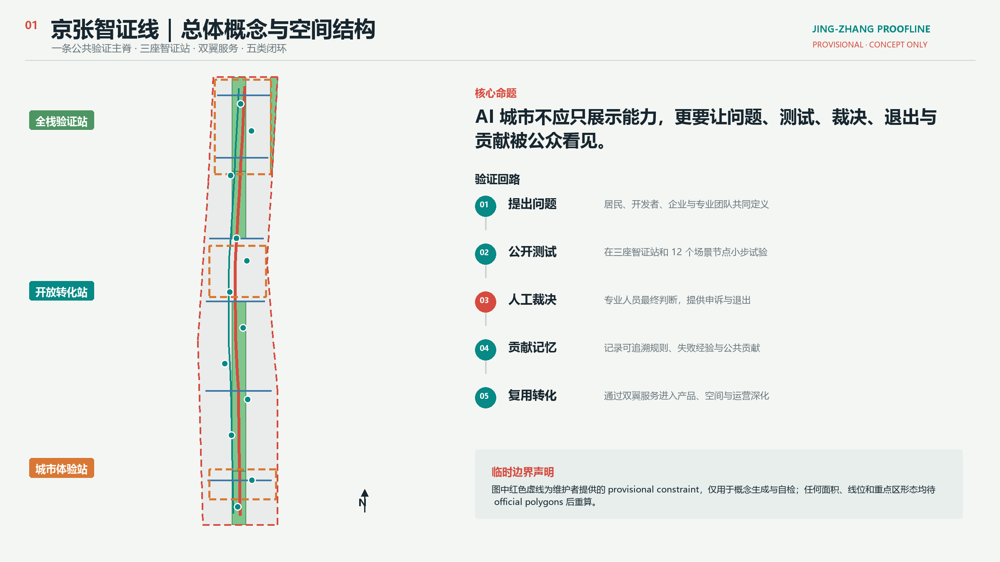
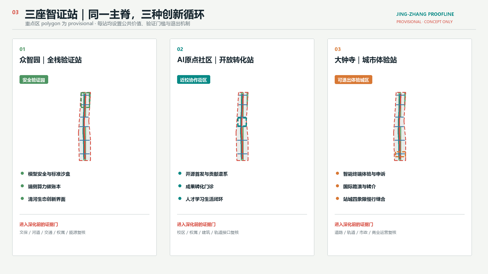
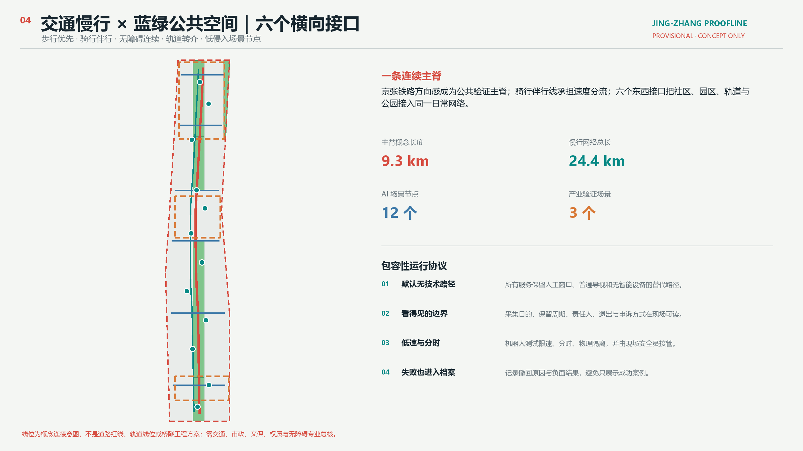
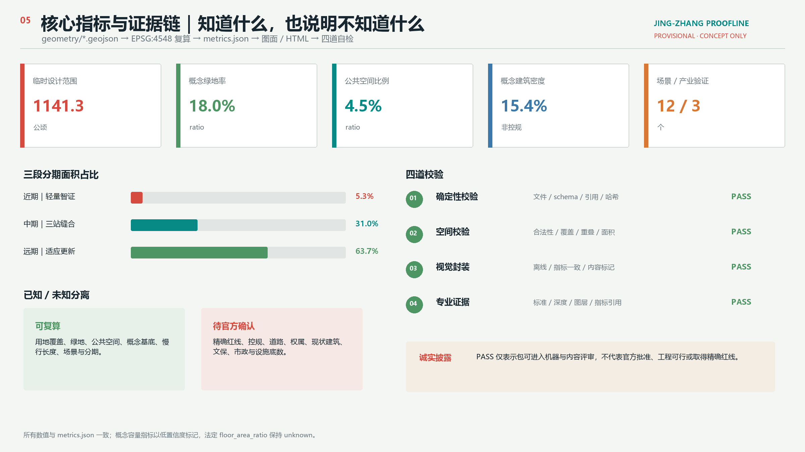

# Jing-Zhang Smart Verification Line: A Verifiable, Shareable, and Evolvable Urban AI Public Infrastructure

> **Boundary State: PROVISIONAL CONSTRAINT.** This proposal uses a provisional rough boundary provided by the repository maintainers based on the public call, which can only be used for concept generation, presentation, and self-review for submission. It is not an official redline and does not express property boundaries, ownership, roads, cultural heritage, or engineering constraints. After obtaining the official polygons, all layers, metrics, images, PDF, and HTML must be recalculated synchronously. [source:BOUNDARY-SOURCE] [data:geometry/site_boundary.geojson#SITE-001]

"Jing-Zhang Proofline" is not about adding more smart devices to the city, but about transforming AI from background capabilities into a city process that the public can see, question, exit, and collectively improve. The Jing-Zhang Railway, spanning a century, leaves behind a "track-station-mile" spatial order; this scheme reinterprets it as a "problem raising—public testing—human adjudication—contribution of memory—reusing transformation" public proof loop. Zhongzhiyuan is responsible for full-stack validation, while the AI Origin community is responsible for open transformation. Dazhongsi is responsible for urban experience; the Zhongguancun Technology Services Wing and the Xiaoyue River Scenario Enablement Wing provide professional elements and real scenarios, respectively, ultimately forming an innovation belt judged by public interest and capped by human final responsibility. [source:AGENT-TASKBOOK] [standard:PROJECT-AGENT-OPEN-CALL-TASKBOOK]

## Design Basis and Source List

### 1. Evidence Level

This proposal first determines what can be supported by the available materials, and then determines how the space can be designed. The project name, three-layer scope text, approximate area, and names of three key areas and design tasks come from the official announcement and can serve as formal task references; the six tasks of the agent, the number of scenes, and brand and operational requirements come from the task book excerpt provided by the user and cleared of rights; Urban Design, control detailed planning boundaries, and land use terminology use the official standard snapshot stored in the repository; precise spatial boundaries have not yet been publicly released, so geometry only uses provisional constraints. [source:OFFICIAL-ANNOUNCEMENT] [source:AGENT-TASKBOOK] [source:URBAN-DESIGN-MEASURES] [source:CONTROL-DETAILED-PLANNING] [source:LAND-USE-CLASSIFICATION]

`data/source_registry.json` is the main control table for source classification, while `data/processed/agent_fact_pack.md` is merely a reading navigation tool that does not generate new authoritative facts. The proposal does not use commercial map tiles, news screenshots, OSM inferred redlines, unauthorised planning diagrams, corporate unauthorised materials, or personal data. [source:SOURCE-REGISTRY] [source:PROCESSED-FACT-PACK]

| Evidence Category | Approach in This Proposal | Supports | Does Not Support |
| --- | --- | --- | --- |
| Official Task Basis | Announcement, Standard Local Snapshot | Task and Scope Text, Approximate Area, Depth of Deliverables, Professional Principles | Precise Polygon, Master Plan Indicators, Engineering Conditions |
| Task Basis for Clear Rights | Excerpts from the Intelligent Body Task Statement | Brand, Case Studies, Scenarios, Landmarks, Culture, and Operations Tasks | Statutory Planning, Government Actions, or Investment Commitments |
| Temporary Space Criteria | provisional boundaries | Generation, Topological Inspection, Relative Relationships, Offline Visualization | official redline, land ownership, precise area, approval basis |
| Smart Body Design Data | This Package GeoJSON / Metrics | Conceptual Districting, Capacity Testing, Networks, Scenario Nodes, Phased Development | Current Surveying, Engineering Lines, Demolish–Renovate–Retain Strategy |
| Background Case | Six Institutions Public Official Websites | Mechanism Comparison and Design Inspiration | Haidian Performance Analogy, Spatial Control or Implementation Assurance |

The authoritative order for this package is GeoJSON, metrics, three-category matrix, sources and assumptions, `proposal.md`, and then images, PDF, and HTML. Each known metric includes a formula, source file, confidence, and assumptions; the statutory Floor Area Ratio remains unknown and is not replaced by a conceptual capacity in lieu of official controls. [standard:MOHURD-CONTROL-DETAILED-PLANNING] [depth:existing_conditions_diagnosis] [metric:site_area_sqm]

### 2. Generation and Review Methods

The Provisional Boundary is uniformly applied.EPSG:4326 Exchange, in EPSG:4548 Calculate the area and length. The land use is generated by intersecting the site polygon with a set of slicing lines, ensuring complete coverage, seamless, and non-overlapping; the green spaces, Public Spaces, conceptual buildings, roads, scene nodes, and phases all derive from the same boundary and land use zones. Five images, offline pages, and PDF Explain only structured data and do not reverse-generate metrics. [data:geometry/land_use.geojson#LU-001] [depth:metrics_recalculation]

The official three-layer range polygons, key areas polygons, control plans, road red lines, land ownership, existing buildings, cultural relics protection, waterways, and municipal and public service facilities baseline data are currently missing. They are registered in the metadata of `assumptions.json` and `geometry/constraints.geojson`; the design adopts a three-category approach of "re-calculating what can be re-calculated, keeping unknown what cannot be confirmed, and setting evidence gates for what needs to be deepened," without creating a sense of certainty through visual refinement. [data:geometry/constraints.geojson#CONSTRAINTS] [standard:MOHURD-ARCH-DESIGN-DEPTH-2016]

## Three-Level Scope Framework

The official announcement divides the task into three levels: integrated research, overall design, and key areas. This plan uses the same "public wisdom" logic throughout the three levels, but each level only addresses the questions that are matched to its data and depth. [source:OFFICIAL-ANNOUNCEMENT] [standard:PROJECT-OFFICIAL-ANNOUNCEMENT]

| Level | Official Approximate Scale and Task | Jing-Zhang Smart Verification Line's Response | Outputs and Evidence |
| --- | --- | --- | --- |
| Coordinated Research Area | Approximately 43.6 km²; Industrial Ecology, Three Zones and Two Wings, Future Urban Form | Six Global Mechanisms Comparison; Five Types of Intelligent Closed Loop; Elements and Scenarios Dual Wings; Annual Operation System | Case Table, Ecological Spectrum, Brand System, Rule and Order Array |
| Overall Design Area | Approximately 11.4 km²; Urban Renewal, Land Use, Transportation, Utilities, Vitality Corridors, Aesthetic Features | A Main Spine, Six Horizontal Interfaces, Complete Conceptual Land Use Zones, Twelve Scene Nodes, Eight Action Packages | Nine Classes of GeoJSON, Metrics, A3/A0, Offline HTML |
| Key-Area Detailed Design Area | Announced approximately 368.4 ha; three areas of detailed design | Zhongzhiyuan "Full Stack Validation Station," AI Origin "Open Transformation Station," Dazhongsi "Urban Experience Station" | Three Temporary Key-Area Small Schemes, Data Gate and Stop Conditions |

The integrated layer poses the questions of "why" and "who will continue to operate it," the overall design layer responds with "how does the spatial system support it," and the focal area layer verifies "how do different locations form differences." These three layers are connected through five closed loops: full-stack independent innovation corresponds to public testing, a world-class innovation ecosystem corresponds to reuse and transformation, AI-Enabled Scenarios correspond to real-world problems, an intelligent vibrant city corresponds to accessible everyday spaces, and AI governance discourse corresponds to human adjudication and contribution memory. [source:AGENT-TASKBOOK] [depth:three_level_scope_framework]

The overall spatial structure is summarized as "one line, three stations, two wings, six interfaces, and twelve smart witness points": one line is the Jing-Zhang Public Validation Main Spine; three stations are three key areas; two wings are the Zhongguancun Technology Services Wing and the Xiaoyue River Scenario Enablement Wing; six interfaces are the horizontal connections that link the park with the communities and parks on both sides and the rail transit; twelve smart witness points distribute technical testing, public services, cultural contributions, and urban experiences along the daily paths. Here, the line, stations, wings, and interfaces are conceptual relationships and are not new administrative boundaries or engineering redlines. [data:geometry/roads.geojson#ROAD-001] [depth:overall_spatial_structure]

Follow the sequence of "constrain first, then design, and finally derive metrics" when replacing official polygons: first replace the site and key areas, then redivide the land use, subsequently derive the buildings, roads, green/public space, and phasing, and finally recalculate the metrics, redraw the five diagrams, and rearrange the PDF and HTML. Do not merely change the boundary appearance while retaining the old areas or node positions. [source:KEY-AREA-SOURCE] [metric:key_area_count]

## Coordinated Research Area: Industry and Future City Research

### 1. Brand: From "Smart Display" to "Public Witness"

Conceptual Recommendation: The Chinese main name "Jing-Zhang Proofline" retains the regional memory of Jing-Zhang, while "Proofline" simultaneously refers to evidence validation and public witness. "Proofline" corresponds to the historical railway, innovation chain, and public experience path. The English name is `Jing-Zhang Proofline`, which uses `proof` instead of `smart`, placing verifiability before technological showmanship. The naming hierarchy is as follows: Proofline (entire corridor) — Proof Station (three key areas) — Proof Mile (distributed contribution nodes) — Proof Protocol (scene governance rules). This hierarchy can cover space, activities, signage, and digital archives, but all names remain conceptual recommendations. [source:AGENT-TASKBOOK] [standard:PROJECT-AGENT-OPEN-CALL-TASKBOOK]

Logo is composed of "two parallel tracks + three check nodes + a set of open brackets": the tracks represent a century of continuity, the nodes represent three key areas, and the open brackets indicate that any conclusion can be supplemented and verified. The visual system does not use corporate trademarks or ready-made park symbols; instead, it uses four color categories: mineral gray, railway signal red, public service blue, and ecological green. Signage is separate from the overall logo, with signage responsible for direction and risk, and the logo responsible for identification. Fonts are only system fonts, rasterized output, and are not included with the package distribution. [depth:height_massing_character]

### 2. Six global case studies, only taking the mechanisms, not the numbers.

The examples are drawn from the official public websites of the institutions, serving only as background references. The schemes do not cite their investment amounts, number of enterprises, output value, or unverified performance metrics, nor do they directly apply external governance conditions to Haidian. [source:SOURCE-REGISTRY]

| Case | Verifiable Institutional Attributes | Transformable Mechanisms | Jing-Zhang Filtering Conditions |
| --- | --- | --- | --- |
| Singapore One-North | JTC provides information on innovative districts and industrial spaces [source:CASE-ONE-NORTH] | As a district operator, coordinate space supply, industrial services, and public realm | Do not transfer land intensity; transform into a catalog of spatial products across key areas |
| Toronto MaRS | Urban Innovation Hub, providing multi-sector support for startups [source:CASE-MARS] | Intermediate platform connecting research, industry, professional services, and urban issues | Not replicating institutional models; transforming into a "Technology Transfer Clinic" |
| Kendall Square | organized by the neighborhood association for community collaboration [source:CASE-KENDALL] | to maintain the community's public issues and activities in the innovation district through a permanent community organization | not assuming corporate involvement; using an open charter with annual public accountability |
| Cornell Tech | University Technology Campus and Applied Innovation Space [source:CASE-CORNELL-TECH] | Research, entrepreneurship, and Public Space converge in the same daily environment | Preserves campus ownership; transforms into reservable collaborative nodes at the near-campus interface |
| Paris STATION F | Concentrated Entrepreneurial Campus [source:CASE-STATION-F] | Consolidate dispersed services into a clear one-stop path and community entrance | Not pursuing individual scale; transformed into distributed "First Release Halls + Conversion Outpatient Clinics" |
| Berlin Adlershof / WISTA | Operational Science Park and Incubator Institution [source:CASE-ADLERSHOF] | Develop, incubate, service, and continuously operate with clear stakeholder alignment | No pre-set government or corporate entity; define roles, data, and exit responsibilities first |

Six cases collectively point to four transformable principles: first, there must be a stable operator beyond the space; second, research outcomes require a comprehensible service entry point; third, Public Space is not a leftover in the landscape but a low-threshold interface for cross-organizational collaboration; fourth, innovation districts need continuous evaluation and exit mechanisms, not a one-time completion. The Jing-Zhang Smart Verification Line codes these four points as "public problem repository, scenario permit, Human Review, contribution record, and phase assessment."

### 3. AI Innovation Ecosystem Map

The ecological map starts with "problems" rather than a list of "institutions." Residents, developers, enterprises, universities, and professional teams propose public or industrial issues; the Zhongguancun Technology Services Wing provides referrals for legal, intellectual property, capital, talent, standards, and international communication; Zhongzhiyuan provides model security, edge computing power, and standard sandboxes; the AI Origin community offers open-source premieres, on-campus transformations, and talent services; the Xiao Yuehe Wing and the Jing-Zhang Main Spine provide real-world scenarios; and Dazhongsi brings mature and exitable products to urban experiences and international exchanges. Each validation produces public protocols, human adjudications, negative outcomes, and reusable components, rather than just forming promotional cases. [depth:overall_spatial_structure]

Collaboration within the region is not represented by a list of unverified companies, but rather by interfaces: establishing an interface for the authorization and release of achievements with universities, an interface for reversible testing and issue reporting with companies, and an interface for remote evaluation and mutual recognition of achievements with innovation resources in the Beijing-Tianjin-Hebei (Jing-Jin-Ji) region. Computational power, data, funding, business attraction, and policies are not written as definite commitments; these will be refined by the principal authorities, right holders, and professional teams.

## Overall Design Area: Urban Renewal and Regulatory-Plan-Level Urban Design

### 1. Spatial Judgment

Overall design is not about evenly spreading AI functionalities across the 11.4 km², but rather forming a "Continuous Public Main Spine + Differentiated Innovation Nodes + Reconfigurable Functional Grid". The main spine prioritizes pedestrian and bicycle use, shading, rain and flood management, cultural interpretation, contribution display, and public services; research and development, education, residential, commercial, and open spaces complement each other along the main spine; conceptual road land uses provide basic horizontal organization; and building prototypes are based on shared ground floors, flexible and combinable research and development spaces, and a preference for preservation and adaptive reuse. [data:geometry/land_use.geojson#LU-001] [standard:MNR-LAND-USE-CLASSIFICATION-GUIDE]

Land use codes adopt a subset of the Ministry of Natural Resources classification, only expressing conceptual capacity and functional relationships. Research and development land accounts for approximately 31.6% of the Provisional Boundary, park green spaces about 16.6%, urban residential land about 14.7%, commercial and service land about 13.1%, conceptual road land about 9.8%, education about 8.4%, squares about 4.5%, and protective green spaces about 1.4%. These proportions are derived from the submitted geometric recalculations, not control plan indicators; they must be compared, restructured, and the differences explained in detail after obtaining the formal control plan. [metric:land_use_0802_sqm] [metric:land_use_1401_sqm] [metric:land_use_0701_sqm] [metric:land_use_05_sqm]

### 2. Update Method: Investigate First, Classify Next, Then Act

Due to the lack of clear ownership status and property records, this plan does not make specific judgments about demolition, retention, or new construction for individual buildings. Urban Renewal follows a four-door process: Door A verifies ownership, purpose, construction era, structure, and fire safety; Door B identifies historical and cultural value, community services, affordable spaces, and mature trees as public assets; Door C compares the full lifecycle impacts of retention, restoration, adaptive reuse, and partial replacement; Door D forms conclusions through public engagement and legal procedures. Only after passing through all four doors can specific parcels enter the professional Demolish–Renovate–Retain Strategy classification. [data:geometry/buildings.geojson#BLDG-001] [depth:retain_renovate_demolish]

The 24 Building Footprints in `buildings.geojson` are conceptual capacity prototypes and not existing buildings. They are used to test whether shared ground floors, research courtyards, talent residences, educational collaboration, and community services can coexist with open spaces. The conceptual building footprints cover an area of approximately 175.4 ha, with a density of about 15.4%. The conceptual gross floor area is approximately 859.4 ha, with a capacity ratio of 0.75; all are marked with low confidence, and the statutory `floor_area_ratio` remains unknown. [metric:building_footprint_area_sqm] [metric:building_density] [metric:concept_floor_area_sqm] [metric:concept_floor_area_ratio]

### 3. Expression of Regulatory Detail Depth

Reach the depth of the control plan Urban Design, not equal to having an agent fabricate control plan values. This package fully expresses the land use, spatial structure, method of building massing, traffic and pedestrian access, municipal interfaces, Public Space, style, renewal projects, phasing, indicators, and risks, and establishes an Evidence Chain through `standard_matrix.json` and `design_depth_matrix.json`. The Floor Area Ratio, height control, density control, green space ratio control, setback, four lines, facility capacity, and road right-of-way are all listed as items to be confirmed. [standard:MOHURD-CONTROL-DETAILED-PLANNING] [depth:development_intensity_controls]

The public interface takes three control suggestions: "first-floor visibility, technical concealment, and spatial reversibility." Research and service spaces are set facing the spine with reservable shared interfaces; information screens, sensors, and robot tests do not occupy continuous barrier-free pathways; lightweight components are prioritized for ease of disassembly, repair, and reuse. Height, roof, and massing are guided by design principles of adjacent relationships, continuous skyline, and heritage interface setbacks, with specific numerical values to be determined by official controls and sightlines analysis. [standard:MOHURD-URBAN-DESIGN-MEASURES]

## Detailed Design of Key Areas

Three areas of approximately 192.1 ha for Zhongzhiyuan, 104.3 ha for AI Origin community, and 72.0 ha for Dazhongsi are designated. The rectangular polygons in this package are rough approximations compiled by the maintainers based on names, north-south order, and approximate areas, and should not be used for land parcel, ownership, demolish-renovate-retain, or precise area determinations. [source:KEY-AREA-SOURCE] [data:geometry/key_areas.geojson#PROV-KEY-001] (Demolish–Renovate–Retain Strategy)

### 1. Zhongzhiyuan: Full Stack Validation Station / Safety Proof Garden

**Location.** Translate "Full-stack Autonomy" from a closed development chain into an auditable verification chain: each of the model, edge devices, energy consumption, standards, and security governance has a testing environment, a human point of responsibility, and public results. The spatial organization adopts a three-tier relationship of "Research and Development Courtyard—Verification Shared Courtyard—Qinghe Ecological Interface," making the research and development space controllable, the verification process bookable, and the public explanation and contribution display accessible.

**Space and Architecture.** The concept spine runs through the public interface of the district, connecting the park with external traffic through east-west interfaces. The research and development building prototype includes modular floors, shared pilot floors, and a ground-level public validation corridor. The Demolish–Renovate–Retain Strategy only proposes "retaining and renovating based on structural survey," without specifying any existing buildings. Ecological buffers and low-disturbance observation nodes are set in the direction of Qinghe. Any waterfront activities, crossings, or equipment placements must await the availability of river, cultural heritage, flood control, and ecological data.

**Testing and Validation Scenario.** Scenario 01 "Model Safety Public Validation Field" provides red team testing, dispute resolution, and version recording of results; Scenario 02 "Edge Side Computational Carbon Ledger" records device-level aggregated energy consumption; Scenario 03 "Robot Coexistence Right-of-Way Sandbox" implements low-speed, time-sliced, physical isolation, and on-site take-over. All three are industry testing and validation scenarios and do not represent direct deployment readiness. [metric:industry_test_scenario_count]

**Evidence Gate.** Before entering the deepening phase, obtain documentation on cultural heritage, river blue line, roads, property rights, energy, and fire safety; any "national-level" or "standard-setting" related expressions only correspond to the announcement task direction and do not constitute institutional establishment or policy commitment. [data:geometry/key_areas.geojson#PROV-KEY-001]

### 2. AI Origin Community: Open Transfer Station

**Location.** Do not view the transfer of university research outcomes as one-way business attraction, but rather establish a "open first release—specialized clinic—small-scale validation—authorization conversion—talent living" cycle near the campus. The spine here forms nodes in the contribution spectrum, displaying open-source projects, public issues, failed experiences, and authorization boundaries; on either side, arrange small, reservable spaces for releases, collaboration, legal affairs, intellectual property, and product validation.

**Space and Architecture.** "Near-School Collaborative Street" is conceived as a conceptual public interface connecting the campus, the park, and the community. The ground floor provides an open launch hall, a technology transfer clinic, nighttime learning, and services for talent living; the upper spaces' uses and capacities await the control plan and architectural investigation. Slow travel emphasizes continuity, clarity, and alternatives, and does not allow for arbitrary crossing of campus or jurisdictional boundaries; rail transit connections are proposed only for pedestrian transfers and information continuity, without making judgments on station infrastructure.

**Scenes and Operations.** Scene 04 "Open Source Premier Hall" records contribution authorizations and revocations; Scene 05 "Conversion Outcome Clinic" is referred to by legal, intellectual property, product, and ethics professionals; Scene 08 "AI Education Trustworthy Experience" does not profile minors and ensures teachers are involved. Annual developer residencies prioritize addressing public issues, with outcomes entering the contribution archive before transitioning to enterprise services.

**Evidence Gate.** The campus boundary, current building conditions, ownership, rail transit interfaces, and baseline numbers for residential and public service facilities must be completed first; "talent community" does not equate to a designated residential project or predetermined amenities. [data:geometry/key_areas.geojson#PROV-KEY-002]

### 3. Dazhongsi: City Experience Station

**Location.** Place the urban experience of smart bodies, smart terminals, and content consumption within a public interface that is exitable, appealable, and accountable, avoiding "collect first, interpret later." The spatial organization is structured as "pre-venue transition plaza—exitable experience street—international showcase and professional service living room—community daily service," ensuring that industrial demonstrations and resident use share the same ethical and safety standards.

**Space and Architecture.** Approach the design problem as quadrants of a slow-moving seam, not as an engineering conclusion: first verify the road boundary, signals, station entrances, accessibility, utility lines, and pedestrian flow, then have a traffic professional team compare crosswalks, optimize existing facilities, or other options. The commercial building prototype emphasizes small units, interchangeable facades, separation of logistics and pedestrian flow, and no alternative equipment paths; no judgment is made on specific enterprise buildings.

**Scenes and Operations.** Scene 11 "Smart Terminal Exit Experience Street" defaults to anonymity, clearly informing and allowing users to exit at any time; Scene 09 "Health Service Navigation" only provides referrals between institutions and does not perform diagnoses; Scene 10 "Legal Service Referral Counter" only provides information navigation, with professional personnel conducting final verification. The international roadshow does not aim for exposure but measures success by problem matching, validation records, and subsequent conversion paths.

**Evidence Gate.** After the roads, tracks, utilities, commercial operations, fire safety, and ownership documents are complete, further development can proceed; station-city connectivity, static traffic, and underground spaces must not be concluded directly by this plan. [data:geometry/key_areas.geojson#PROV-KEY-003] [depth:three_key_area_detailed_design]

## AI Innovation Ecosystem, Personas, and AI+ Scenarios

### 1. User Persona Categories

User profiles are used only for identifying needs and do not generate from individual trajectories or privacy data. Each profile lists "what they want to achieve," "what the space needs," and "what they cannot do," avoiding the simplification of talent attraction to mere aesthetic styles. [source:AGENT-TASKBOOK]

| User | Core Task | Space and Services | Data and Fair Boundaries |
| --- | --- | --- | --- |
| Open-Source Developer | Publish, Collaborate, Test, Obtain Sustainable Contribution Records | Exhibition Hall, Night Collaboration Station, Model Lineage Walkway, Professional Clinic | No Behavior Trajectory Ranking; Contributions Are Correctable and Reversible |
| Startups and Small Teams | Low-Cost Experiments, Computing Entry Point, Compliance Consultation, Finding the First Scenario | Research and Development Space, Validation Sandbox, Edge Computing Station, Scenario License | No Promise of Funding, Orders, or Computing Power; Failure Does Not Affect the Next Application |
| Corporate Products and Visitors | Safety Testing, Roadshows, Talent Exchange, Urban Experience | Zhongzhiyuan Validation, Dazhongsi Roadshow, Track Referral, Public Reception | Corporate Case Studies and Logos Must Be Authorized; Public Space Priority Is Not Exchanged for Branding |
| residents, seniors, caregivers | Commute, recreation, seek assistance, obtain services that do not rely on smart devices | Continuous tree canopies, accessible resting areas, artificial windows, community referrals | No technical pathway is assumed; no commercial profile is recommended. |
| College Students and Researchers | Cross-Institutional Collaboration, Intellectual Property Rights, Public Issue Research | On-Campus Collaborative Streets, Launch Hall, Short-Term Workstations, Open Courses | Campus Data and Research Outputs Require Authorization; Minors Not Portrayed |
| Operators and Professionals | Review Scenarios, Manage Risks, Maintain Facilities, Respond to Complaints | On-Site Responsibility Desk, Review Room, Stop Switch, Version Archive | Decision Logs Are Auditable; AI Does Not Replace Planning, Medical, Legal, and Safety Responsibilities |

### 2. Scene Common Agreement

All scenarios use a six-field protocol: service target, minimum necessary data, spatial boundary, Human Reviewer, exit/appeal mechanism, and evaluation and stop conditions. No scenario shall default to full-area collection, shall not write immature technology as fully available, and shall not make vendor lock-in a necessary condition. Scenario locations are written as `SCENARIO_NODE` in `public_space.geojson`, totaling 12, among which 3 are industrial Testing and Validation Scenarios. [data:geometry/public_space.geojson#SCN-01] [metric:scenario_node_count]

### 3. Twelve Scene Cards

| Card | Type and Space | Service Object / Minimum Data | Human Review, Exit Strategy, and Operations |
| --- | --- | --- | --- |
| 01 Model Safety Public Validation Field | **Industrial Testing**; Zhongzhiyuan Validation Chamber | For development teams and governance researchers; test samples, model versions, risk labels | Decided by the Evaluation Lead; appeals available for disputes; reasons for failing versions retained; quarterly open validation |
| 02 End-Side Computing Carbon Ledger | **Industrial Testing**; Zhongzhiyuan Computing Hub | Equipment Developers and Operators; Aggregate Energy Consumption at the Equipment Level, Not Linked to Individuals | Energy Professionals Verify; Stop Displaying if Below Threshold; Monthly Review |
| 03 Robot Co-Existence Right-of-Way Sandbox | **Industrial Testing**; Xiao Yuehe Wing / Main Spine Test Segment | Robot Team, Pedestrians, and Cyclists; Events and Anonymous Traffic Recorded Only | On-Site Safety Personnel Ready to Take Over at Any Time; Low Speed, Time-Segmented, and Segregated; Testing Paused on Complaint |
| 04 Open Source Launch Hall | Innovation; AI Origin Community | Developers, Higher Education Institutions, and the Public; Authorized Code, Descriptions, and Voluntary Signatures by Contributors | Content Review and Rights Holder Withdrawal; Monthly First Release by the Community Committee |
| 05 Outcome Conversion Clinic | Enterprise Services; AI Origin Community | Team and Professional Institutions; Issue List and Voluntary Submission Materials | Legal / IP / Product Specialist Final Review; No Investment Commitment |
| 06 Barrier-Free Slow Travel Accompaniment | Public Services; Jing-Zhang Main Spine | Visually Impaired, Mobility Impaired, and Visitors; Real-Time Removal of End-Side Obstacles | Artificial Assistance as a Last Resort; Smart Functions Can Be Disabled; Daily Inspection by Operators |
| 07 Public Space Maintenance Co-review | Public Governance; Main Spine Node | Residents and Maintenance Team; Public Work Orders, Aggregated Locations, and Processing Status | Manual Dispatch, Resident Corrections, and Time-out Escalations; No Collection of Personal Trajectories |
| 08 AI Education Trustworthy Experience | Education; Near-School Interface | Students, Teachers, and Families; Course Selection and Anonymous Feedback | Teacher in the Loop; No Portraits of Minors; Content Controversies Can Be Removed |
| 09 Health Service Navigation | Health; Community Service Points | Residents and Visitors; User-Initiated Service Needs | Referral Only, No Diagnosis or Medical Records; Can Be Replaced by Human Windows |
| 10 Legal Referral Counter | Legal; Community Service Point | Residents and Start-up Teams; User Described Problem Types | Reviewed by Lawyers or Legal Service Personnel; Model Answers Not Considered Legal Advice |
| 11 Smart Exit Intelligent Terminal Experience Street | Urban Experience; Dazhongsi | Consumers, Enterprises, and Researchers; Anonymous Feedback | Clear Indications, Option to Exit at Any Time, Customer Service Complaint Desk; Products Rotated on a Cyclical Basis |
| 12 City Memory Contribution Station | Culture; Jing-Zhang Main Spine | Residents, Cultural Memory Contributors, Developers; Authorized Text and Image Metadata | Attribution Marking, Removal for Controversy, Rights Holder Withdrawal; No Fabrication of History |

Scenario—Space—Operational Judgment: First, prove that a public issue exists, then validate using a minimum-scale trial; expansion only occurs after a human review. If privacy, safety, fairness, or Public Space conflicts arise, operations can be immediately halted. The `self_check.json` `PRIVACY_HUMAN_REVIEW` check corresponds to this boundary. [depth:risk_missing_data]

## Land Use, Building Scale, and Retain-Renovate-Demolish Strategy

### 1. Complete Land Use Zoning

The land use is formed by the intersection of the 6×6 conceptual grid with the temporary site polygon, resulting in an actual output of more than 30 valid polygons, all sharing boundary coordinates. The total of research, commercial, residential, educational, road, park, protective green space, and square areas equals the site area; no blank spaces are to be classified as "pending." Structured land use is a replaceable test model, not a judgment of the current or statutory uses. [data:geometry/land_use.geojson#LU-001] [depth:land_use_layout]

The calculated areas are as follows: research and development approximately 360.31 ha, commercial and service approximately 149.49 ha, residential approximately 168.08 ha, education approximately 95.30 ha, concept roads approximately 111.34 ha, parks and green spaces approximately 189.28 ha, protective green spaces approximately 15.69 ha, and squares approximately 51.79 ha. The evidence tags are [metric:land_use_0804_sqm], [metric:land_use_1207_sqm], [metric:land_use_1402_sqm], [metric:land_use_1403_sqm]; all numbers are affected by the Provisional Boundary.

### 2. Building Prototypes and Scale Boundaries

Conceptual buildings are divided into five categories: divisible and combinable research and development courtyards, ground-level open composite service bases, talent residence prototypes embedded with shared amenities, community service and Human Review nodes, and near-school collaborative and lifelong learning spaces. Prototypes only examine the spatial relationships and conceptual bearing of different functions on either side of the main spine, and do not represent specific numbers of floors, heights, structures, ownership, or construction volumes.[data:geometry/buildings.geojson#BLDG-001]

Form and appearance are subject to relative control: the main ridge interface forms a continuous but not overly enclosed street wall; key nodes leave out public forecourts; heritage and blue-green interfaces maintain low scale, are setback, and have continuous sightlines; large volumes are decomposed through courtyards, corridors, and first-floor public interfaces. Roofs prioritize equipment integration, rainwater management, and maintainability, not using architectural forms as AI expressions. [depth:height_massing_character]

### 3. Demolish–Renovate–Retain Decision Tree (Demolish–Renovate–Retain Strategy)

Specific buildings should be evaluated in sequence after entering the detailed design phase: whether they have historical, social, or public service value; whether structural, fire safety, and energy renovations are feasible; how the lifecycle costs of retention, renovation, and replacement compare; how existing users will be accommodated and involved; and whether they comply with the control plan and ownership. Only then can they be categorized into four types: retention and restoration, functional renovation, partial replacement, or legal updates. The current building should not be marked for removal on the map to avoid disguising a lack of data as decisive design. [standard:MOHURD-ARCH-DESIGN-DEPTH-2016]

## Transport, Rail, Municipal Infrastructure, and Public Services

### 1. pedestrian-priority two longitudinal six transverse

`ROAD-001` is a public validation spine oriented along the Jing-Zhang direction, with a conceptual length of approximately 9.33 km; companion cycling line, six lateral interfaces, and track transfer line combined cover a total of approximately 24.41 km. The values reflect only the submitted geometry and are not road engineering distances. [data:geometry/roads.geojson#ROAD-001] [metric:proofline_length_m] [metric:slow_mobility_length_m]

Six horizontal interfaces serve different purposes: northern ecological and external connections, Zhongzhiyuan, school collaboration, AI Origin community, southern community services, and Dazhongsi station-city connections. These interfaces are not uniform bridges but rather a list of issues: where the gaps are, whether standard plan paths can be optimized, whether accessibility is continuous, whether cycling and walking paths conflict, and whether time-based management is needed. Any solutions crossing the fifth ring road, tracks, or major roads will be compared after considering road boundaries, traffic volumes, structures, utilities, fire safety, and cultural heritage data. [depth:traffic_rail_slow_parking]

Track station design prioritizes "information and pedestrian continuity": For nodes such as Wudaokou, Qinghua Donglu Xi Kou, and Dazhongsi, the focus is on the transition, signage, accessibility, bicycle parking, and first-floor functional relationships to the public spine. The design does not alter the station body, routes, or entrances and exits. Parking strategies are studied with a focus on demand management, sharing, and time-sharing, with the specific number of parking spaces remaining unknown.

### 2. Municipal and AI New Infrastructure Interfaces

New Infrastructure is not treated as a separate equipment corridor but is embedded in the traditional municipal capacity and safety review: edge-side computing hubs require power, cooling, noise, carbon accounting, and cybersecurity interfaces; scenario nodes require network tiering, degraded operation in case of network failure, and manual take-over; rain gardens require drainage networks, soil, underground space, and maintenance interfaces; robot testing requires road rights, charging, fire safety, and stop switches. When capacity data is lacking, only system relationships are drawn, without outputting load or pipeline relocation. [data:geometry/constraints.geojson#CONSTRAINTS] [depth:municipal_new_infrastructure]

### 3. Public Service Facilities

Services are structured in a dual-layer approach with "basic public services not reliant on AI and professional services assisted by AI referrals." The lower layer includes physical counters, general wayfinding, accessible restrooms, resting points, drinking water, and emergency assistance. The optional enhanced layer includes legal services, intellectual property, technology transfer, health and legal navigation, educational experiences, and business services. The location of facilities and service radius must be re-verified by the relevant professional teams after the official baseline is completed, and should not be replaced by scene nodes for schools, medical facilities, and elderly care.

## Blue-Green Network, Public Space, and Urban Character

### 1. Jing-Zhang Public Validation Main Spine

Conceptual green spaces cover approximately 204.97 ha, with a green space ratio of about 17.96%; square-type Public Spaces cover approximately 51.79 ha, representing about 4.54%. The green spaces are derived from park green spaces and northern protective green spaces, while the public spaces are derived from conceptual squares; the former is responsible for ecological continuity, and the latter for high-intensity public activities, without overlapping calculations. [data:geometry/green_space.geojson#GREEN-001] [data:geometry/public_space.geojson#PUBLIC-001] [metric:green_space_area_sqm] [metric:green_ratio] [metric:public_space_area_sqm] [metric:public_space_ratio]

The main ridge section is not a fixed template but a combination of six types of components: a memory strip of railway materials, a continuous barrier-free passage, a cycling diverter lane, a rainwater and shade strip, a closable information interface, and artificial service and emergency points. Robots or smart terminals must not occupy the barrier-free clear width; the nighttime interface should maintain low brightness; and equipment updates should not cause frequent large-scale civil construction. [standard:MOHURD-URBAN-DESIGN-MEASURES] [depth:blue_green_public_space]

### 2. Three AI Pilgrimage and Honor Nodes

1. **Contribution Milestones / Proof Mile**: Physical and digital dual-milestones distributed along the main spine, recording only authorized, traceable public contributions, rule versions, and fix records, not ranked by commercial influence.
2. **Model Lineage Gallery**: Located at AI Origin, this gallery showcases the lineage of open-source models, tools, data governance, and community collaboration, while retaining retraction, controversy, and source markings.
3. **Unfinished Tests Pavilion / Museum of Unfinished Tests**: Located at Dazhongsi Urban Experience Station, this pavilion publicly displays scenarios of failure, suspension, and rejection, along with their reasons, making it a worthy urban contribution to document the cessation of an inappropriate technology.

Three are Conceptual Recommendations, not predicated on the construction of new buildings. They can first be piloted through exhibitions, signage, events, and digital archives, and then decided whether to form permanent spaces based on heritage conservation, ownership, fire safety, foot traffic, and operational assessments. Honor displays should adhere to the principle of contributions being correctable, revocable, and verifiable, thus avoiding the dominance of personal adoration or corporate sponsorship in Public Spaces. [source:AGENT-TASKBOOK]

### 3. Cultural Narrative and Signage

The cultural narrative weaves through three timelines: the Jing-Zhang Railway represents a landmark project, connecting and reflecting a century of urban transformation; Zhongguancun represents open experimentation, knowledge transformation, and ongoing entrepreneurship; and AI New Culture emphasizes verifiability, explainability, and accountability. Signage grammar uses mileage, divergences, stations, and validation stamps but does not simplify the railway's history into decorative motifs. Historical facts and images must be verified and authorized from their sources, and specific protection targets like the Tsinghua Garden Station require official cultural heritage layers for accurate positioning. [depth:risk_missing_data]

Urban Character is kept restrained, maintainable, and people-oriented: materials are prioritized to brick, steel, stone, and wood with repairable components; the AI interface follows a small scale, low brightness, and is closable; colors use signal red to mark risks and verifications, cyan to mark public services, and green to mark ecology, without using large areas of cyber neon or giant screens to create a "future" feel. AI-generated Public Space images are only for experience indication, not as current conditions or planning evidence. [source:IMAGEGEN-CONCEPT]

## Renewal Projects, Implementation Policy, and Phasing

### 1. Eight Action Packages

| Number | Concept Action Package | Main Deliverables | Preceding Evidence and Stop Conditions |
| --- | --- | --- | --- |
| P01 | Public Wisdom Protocol and Signage | Scene Six Field Protocol, Risk Identification, Exit/Appeal Template, Contribution Version Rules | Legal, Ethical, Accessibility, and Public Review Must Pass to Activate |
| P02 | Jing-Zhang Main Spine Lightweight Pilot Segment | shade-rest, conventional signage, human service, modular information kiosk | Conflicts regarding cultural heritage, property rights, green spaces, and fire safety are adjusted or halted. |
| P03 | Zhongzhiyuan Safety Verification Garden | Three-sector Testing Scenarios, Standard Sandbox, Research on Qinghe Ecological Interface | Energy, Riverways, Transportation, and Data Security Must Be Confirmed Before Expansion |
| P04 | AI Origin Conversion Clinic | Open Source Launch, IP / Legal / Product Referral, Contribution Lineage | Do not use related content if campus and outcome licensing are unclear |
| P05 | Dazhongsi Exit Experience Street | Terminal Rotation Experience, Manual Complaints, International Roadshow, and Referral | Operations Suspended if Traffic, Fire Safety, Consumer Rights, or Privacy Risks Exceed Thresholds |
| P06 | Six-Interface Barrier-Free Repair | Gap Audit, Temporary Improvements, Professional Scheme Comparison | If a Continuous Safe Path Cannot Be Guaranteed, Maintain the Status Quo and Publicize the Gap |
| P07 | Three Contributions and Honor Nodes | Contribution Milestones, Model Lineage Walkway, Unfinished Experiment Pavilion | Not Permanently Displayed if Source, Copyright, or Controversy Handling Mechanisms Are Incomplete |
| P08 | Proofline Annual Operations | Open Verification, Residency, Public Routes, Annual Review, and Transformation | If primary elements, budget, permits, and safety are not confirmed, reduce or cancel |

The number of action packages is 8, written into the metrics but not representing government project approval. [metric:renewal_project_count] [depth:renewal_project_list]

### 2. Three Phases

Divide the geometry into phases based on "Lightweight Intelligent Verification—Three Stations Integration—Adaptive Update." This covers the temporary site in full. The near-term phase includes approximately 60.67 ha, representing 5.3%, focusing on agreements, activities, signage, and low-impact nodes; the mid-term phase covers about 353.93 ha, or 31.0%, to be further developed with the official data complete, integrating the three stations and horizontal interfaces; the long-term phase covers about 726.68 ha, or 63.7%, to be advanced based on operational assessments and legal procedures for adaptive updates of existing spaces. [data:geometry/phasing.geojson#PHASE-001] [metric:phase_001_area_sqm] [metric:phase_002_area_sqm] [metric:phase_003_area_sqm]

Phasing refers to the sequential relationship of the concepts, not the construction timeline, investment scheduling, or approval commitments. At the end of each phase, a public announcement must be made regarding the conclusions of "continuation, adjustment, or termination": in the short term, to verify whether the public issues are real and whether the exit mechanism is effective; in the medium term, to confirm whether cross-regional coordination and professional conditions are in place; and in the long term, to assess whether the spatial update is superior to maintaining the current status. Only after such an evaluation is passed can the project proceed to the next phase. [depth:phasing_implementation]

### 3. Long-term Operation and Activity Framework

Operational rhythm is divided into four layers: monthly open problem clinics; quarterly industry and public scene validation days; semi-annual developer/designer residencies and public accessibility audits; and an annual `Proofline Week`, which ties together three stages of release testing, failure archives, contribution recognition, and international mechanism dialogues. Names, frequencies, and subjects are Conceptual Recommendations, and activity permits, safety, budgeting, and responsibilities must be confirmed separately. [source:AGENT-TASKBOOK]

Developer communities follow a path of "rewarding problem-solving—transparent selection—small-scale trials—human review—open-source debriefing—transformation and referral"; enterprise attraction follows a path of "problem matching—validation records—specialized consultations—space products—continuous services"; public experience follows a path of "general pathways available—voluntary entry into smart scenarios—clear exit—visible feedback." International communication does not merely showcase success but builds credibility through bilingual agreements, calculable metrics, failure cases, and contribution lineages.

Policy recommendations include: establishing public scenario permits and exit clauses; incorporating no technical alternative paths, Human Review, versioning, and negative outcomes into scenario agreements; developing flexible spatial products for short-term R&D, shared experiments, first-time launches, and community services; and expanding public engagement from a single consultation to problem definition, test observations, and annual reviews. All of the above are provided for further in-depth research by the relevant authorities and professional teams.

## Metrics, Area Recalculation, and Compliance Matrix

### 1. Core Recalculation Indicator

| Indicator | Value in This Package | Explanation Boundary |
| --- | ---: | --- |
| Temporary Overall Design Area | 11,412,825.386 m² [metric:site_area_sqm] | Derived from the provisional site, recalculated in EPSG:4548; not equivalent to the official precise area |
| Green Spaces | 2,049,697.831 m² / 17.9596% [metric:green_space_area_sqm] [metric:green_ratio] | Conceptual zoning, not a statutory green space ratio or green line |
| Public Space | 517,893.121 m² / 4.5378% [metric:public_space_area_sqm] [metric:public_space_ratio] | Only squares-type polygons are calculated; scene points are not included in the area calculation |
| Conceptual Building Footprint | 1,753,582.297 m² / 15.365% [metric:building_footprint_area_sqm] [metric:building_density] | Capacity Prototype, Not Current or Approved Building Coverage Ratio |
| Conceptual Floor Area | 8,593,930.819 m² / 0.753 [metric:concept_floor_area_sqm] [metric:concept_floor_area_ratio] | `footprint × conceptual_floors`; statutory FAR remains unknown |
| Key Areas / Scenarios | 3 / 12 [metric:key_area_count] [metric:scenario_node_count] | Key Areas polygon temporary; scenario nodes are design proposals |
| Industry Test Scenario | 3 [metric:industry_test_scenario_count] | Model safety, edge-side computational power, and robot road rights all require permits and Human Review |
| Main Ridge / Slow Mobility Network | 9,331.8 m / 24,413.8 m [metric:proofline_length_m] [metric:slow_mobility_length_m] | Conceptual alignment, not engineering mileage |
| Concept Update Action Package | 8 [metric:renewal_project_count] | Solution Work Package, Does Not Represent Project Approval |

The known indicators for land classification include [metric:land_use_05_sqm], [metric:land_use_0701_sqm], [metric:land_use_0802_sqm], [metric:land_use_0804_sqm], [metric:land_use_1207_sqm], [metric:land_use_1401_sqm], [metric:land_use_1402_sqm], and [metric:land_use_1403_sqm]. Their sum is consistent with the site area, and the formula and source file can be verified in `metrics.json`.

### 2. AI Innovation Index: Framework Rather Than Pseudo-precise Score

The task requires the study of innovation indices, talent density, and industrial performance. This proposal does not assign scores in the absence of a baseline, but instead proposes a five-dimensional framework: Public Problem Response, Open Contribution and Reuse, Testing Safety and Exit, Daily Talent Experience, and Spatial and Resource Efficiency. Each dimension is only calculated after clear data responsibilities, anonymous or aggregated metrics, evaluation cycles, and grievance mechanisms are established; industrial output, talent, and enterprise data are provided by statutory statistics or clear operational data, and cannot be inferred from scenario usage volumes.

### 3. Task, Standards, and Depth of Coverage

`compliance_matrix.json` covers 17 items of announcements 1.3, 1.4, and 1.5, and 23 items including agent.1–agent.6; `standard_matrix.json` covers 5 mandatory standards and 1 reference for building depth pending official documentation; `design_depth_matrix.json` covers 15 formal depths. Each record points to the text, layers, metrics, drawings, sources, assumptions, and self-inspection. [standard:PROJECT-OFFICIAL-ANNOUNCEMENT] [standard:MOHURD-URBAN-DESIGN-MEASURES]

Content Review for the four self-inspection checks includes: certainty check for the directory, schema, references, and hashes; spatial check for geometry validity, boundaries, land coverage, and area; visual check for offline safety and consistency with three core metrics; and professional evidence check for standards, design depth, layers, and known metric references. PASS only indicates that the package meets the basic requirements for machine and content review, and does not represent official approval, precise redlines, or engineering feasibility.

The design depth evidence includes: [depth:land_use_layout], [depth:development_intensity_controls], [depth:height_massing_character], [depth:retain_renovate_demolish], [depth:traffic_rail_slow_parking], [depth:municipal_new_infrastructure], [depth:blue_green_public_space], [depth:three_key_area_detailed_design], [depth:renewal_project_list], [depth:phasing_implementation], [depth:metrics_recalculation], [depth:risk_missing_data]. These labels correspond to matrix entries and do not replace textual judgments.

## Risk, Copyright, and Compliance

### 1. Data and Professional Risk

| Risk | Current Handling | Necessary Actions to Enter Deep Dive |
| --- | --- | --- |
| Misreading of the Provisional Boundary as Formal Red Line | Fully annotated with provisional, shown on the drawing with low-contrast dashed lines | Recalculate after obtaining the Clear Title official polygon |
| Conceptual land use and density were misinterpreted as the Control Plan | Each indicator marks the design proposal and low confidence, with the statutory FAR remaining unknown | Align with the formal Control Plan, planning conditions, and technical review |
| Conceptual architecture was misinterpreted as the Demolish–Renovate–Retain Strategy conclusion | Clearly identify it as a capacity prototype, without marking the demolition targets | Complete the architectural, ownership, structural, fire safety, and social impact investigations |
| The pedestrian lanes are misinterpreted as engineering lines | Clarify the connecting intent | Supplement road, rail, traffic volume, municipal, accessibility, and structural information |
| Conflicts with Cultural Nodes and Preservation | Do Not Locate Protection Lines, Make No Commitment to Permanent Buildings | Obtain Information on the Preservation Area, Protection Requirements, and Historical Data for Specialized Review |
| AI Scenarios Infringing Privacy or Excluding Non-Digital Users | Minimum Data, Human Review, Exit Appeal, Parallel Common Path | Conduct Privacy Impact, Algorithmic Impact, Fairness and Accessibility Assessments |
| Activities or recruitment are understood as government commitments | to be fully written as Conceptual Recommendations and revocable pilots | clarify the main body, permits, budget, procurement, and performance responsibilities |

All spatial recommendations in this scheme are "Conceptual Recommendations or Reference Plans for Further Study by Professional Teams," and do not replace formal planning nor constitute the government's approval conclusion. Planning, architecture, transportation, municipal services, cultural heritage protection, ecology, fire safety, accessibility, data, law, and operational judgments are ultimately the responsibility of human professional teams with the appropriate duties. [standard:MOHURD-CONTROL-DETAILED-PLANNING]

### 2. AI Governance and Public Interest

Technical risks extend beyond accuracy to include issues such as inability to exit, unclear accountability, digital exclusion, commercialization of Public Spaces, over-collection, and the permanentization of pilot projects. Scene permissions must specify an end date and assign responsibility; positive and negative outcomes must be publicly shared before expanding the scope; the suspension mechanism should be triggered by resident complaints or serious risks identified by professionals; and individuals who do not use smart devices should receive equivalent basic services. Public spaces, computational power, and display resource allocations must not be based solely on corporate branding or payment capacity.

### 3. Copyright and Generation Disclosure

The text, along with the GeoJSON, JSON, HTML, five evidence images, and PDF, were originally generated for this submission. The five images were determined by structured data and were created using the built-in image generation tool in Codex, `visual/assets/proofline-commons-concept.png`, for non-evidence illustrative purposes only. The full prompt, generation method, purpose, and limitations are recorded in `report/copyright_statement.md`. No external reference images, corporate logos, portraits, commercial maps, or paper images were used. [source:IMAGEGEN-CONCEPT]

Offline `visual/index.html` markdown
Not loading
CDN, remote fonts, remote maps, external scripts, iframe, forms API Or tracking code. International cases will only reference the name and mechanism of institutional public web pages, and will not reproduce copyrighted images, charts, or text. If the source, authorization, or dispute resolution mechanism cannot be confirmed, the corresponding content will not enter permanent display.

## References

### Official Task, Standards, and Data

- Beijing Municipal Commission of Planning and Natural Resources Haidian Branch, Qualification Pre-Review Announcement for International Urban Design Proposals for the Centennial Jing-Zhang AI Innovation Belt: [source:OFFICIAL-ANNOUNCEMENT]
- Users provided and rights-cleared excerpt from the Agent Task Book: [source:AGENT-TASKBOOK]
- Warehouse Documentation and Processing Navigation: [source:SOURCE-REGISTRY] [source:PROCESSED-FACT-PACK]
- Temporary overall boundaries with three key areas: [source:BOUNDARY-SOURCE] [source:KEY-AREA-SOURCE]
- Urban Design, Control and Detailed Planning, and Land Use Classification official references: [source:URBAN-DESIGN-MEASURES] [source:CONTROL-DETAILED-PLANNING] [source:LAND-USE-CLASSIFICATION]
- Local standard matrix index: [standard:PROJECT-OFFICIAL-ANNOUNCEMENT] [standard:PROJECT-AGENT-OPEN-CALL-TASKBOOK] [standard:MOHURD-URBAN-DESIGN-MEASURES] [standard:MOHURD-CONTROL-DETAILED-PLANNING] [standard:MNR-LAND-USE-CLASSIFICATION-GUIDE] [standard:MOHURD-ARCH-DESIGN-DEPTH-2016]

### Background Case Studies and Generated Assets

- one-north, MaRS, Kendall Square, Cornell Tech, STATION F, Berlin Adlershof's institutional public websites are preserved for mechanism comparison: [source:CASE-ONE-NORTH] [source:CASE-MARS] [source:CASE-KENDALL] [source:CASE-CORNELL-TECH] [source:CASE-STATION-F] [source:CASE-ADLERSHOF]
- AI-generated Public Space Concept Illustration: [source:IMAGEGEN-CONCEPT]

### Machine-readable Data Total Index

This proposal references all core data files individually: [data:geometry/site_boundary.geojson#SITE-001], [data:geometry/key_areas.geojson#PROV-KEY-001], [data:geometry/land_use.geojson#LU-001], [data:geometry/buildings.geojson#BLDG-001], [data:geometry/roads.geojson#ROAD-001], [data:geometry/green_space.geojson#GREEN-001], [data:geometry/public_space.geojson#PUBLIC-001], [data:geometry/constraints.geojson#CONSTRAINTS], [data:geometry/phasing.geojson#PHASE-001]. They collectively form a replaceable, recalculable, and auditable foundation; any drawing or narrative that contradicts them shall be superseded by structured data and subsequent official documentation.

Design depth total index for [depth:existing_conditions_diagnosis], [depth:three_level_scope_framework], [depth:overall_spatial_structure], [depth:land_use_layout], [depth:development_intensity_controls], [depth:height_massing_character], [depth:retain_renovate_demolish], [depth:traffic_rail_slow_parking], [depth:municipal_new_infrastructure], [depth:blue_green_public_space], [depth:three_key_area_detailed_design], [depth:renewal_project_list],  [depth:phasing_implementation], [depth:metrics_recalculation], [depth:risk_missing_data]. The references above enable reviewers to revert from the text back to the matrix, geometry, metrics, drawings, sources, and assumptions for a comprehensive review.
