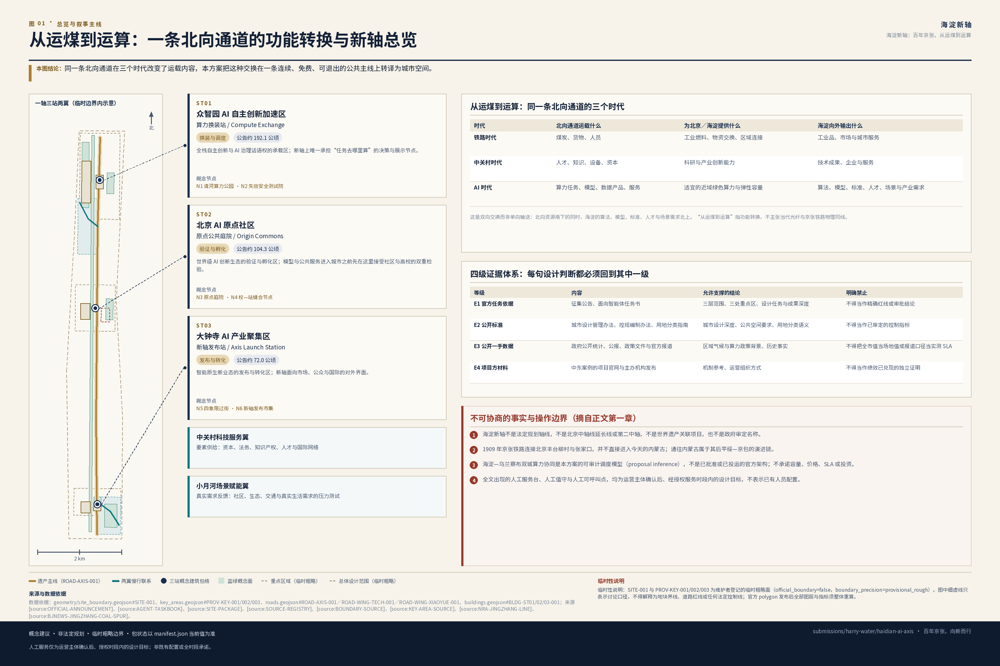
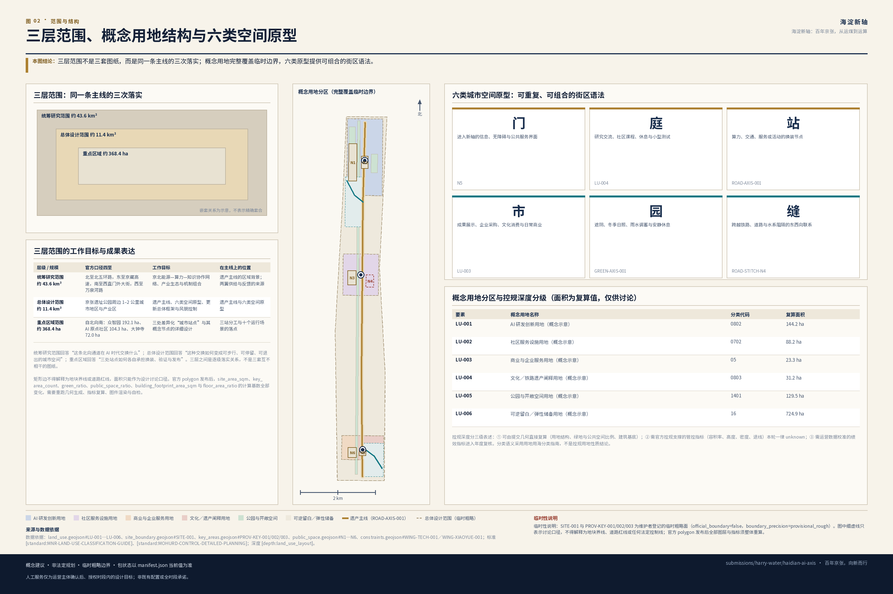
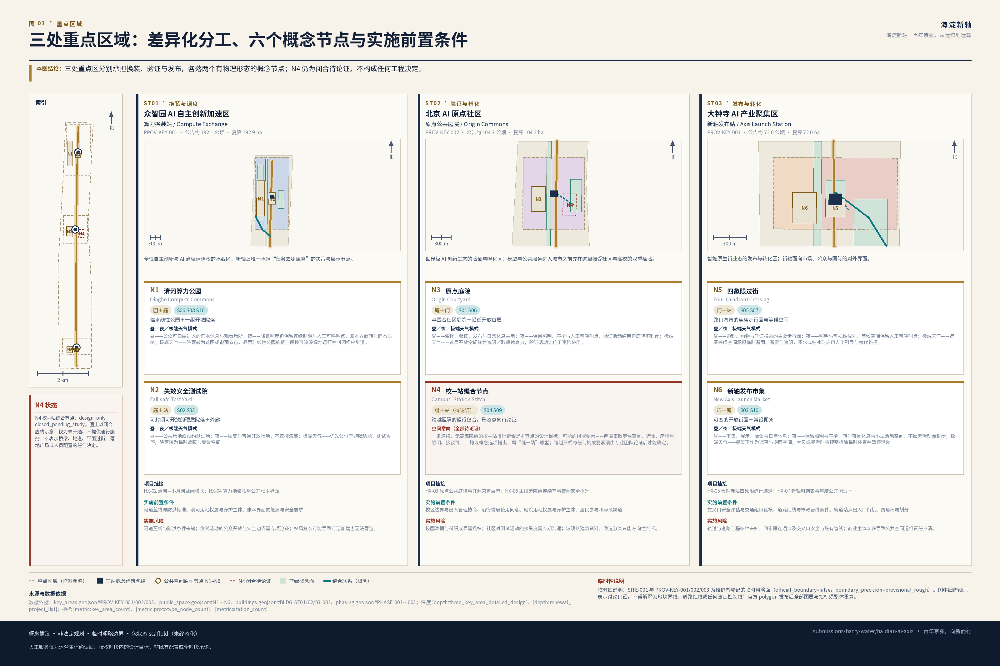
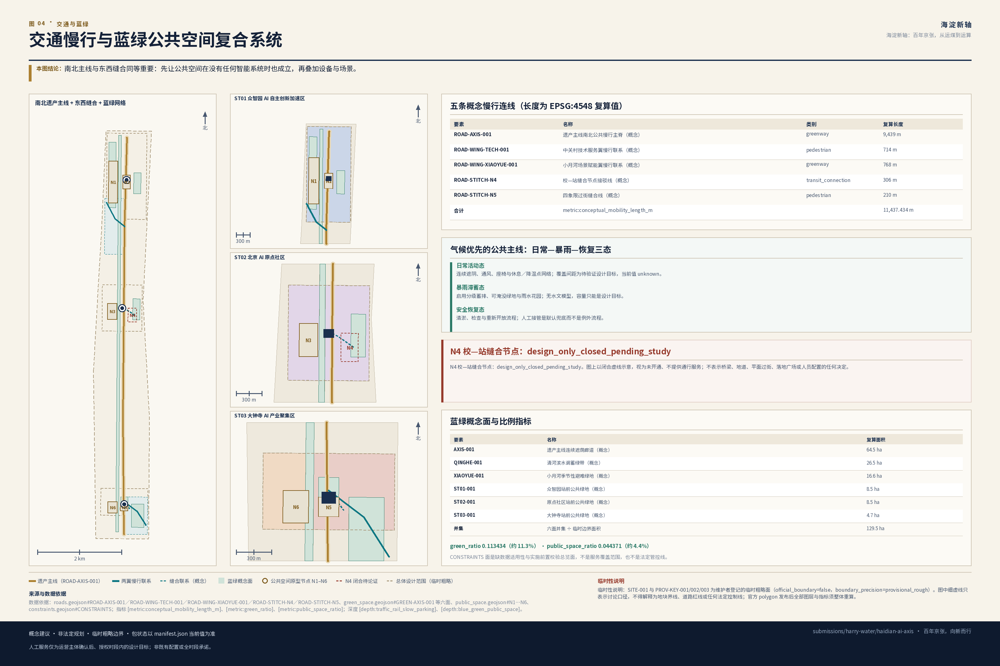
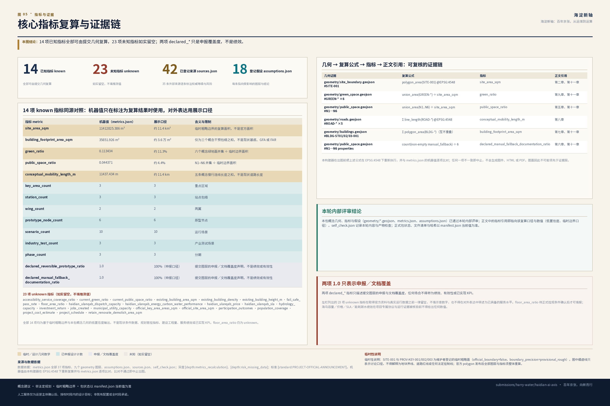

# 海淀新轴：百年京张，从运煤到运算

## 设计依据与资料清单

本方案提出的创新带概念名称为**海淀新轴**，英文品牌名为 **HAIDIAN AI AXIS**，封面完整标题为《海淀新轴：百年京张，从运煤到运算》，英文完整标题为 *HAIDIAN AI AXIS: FROM COAL TO COMPUTE*，礼仪性组合字为“百年京张·海淀新轴”，中文品牌句为“百年京张，向新而行”，英文传播句为 *Railway Heritage. AI Innovation. Everyday Life.*，提交目录 slug 为 `haidian-ai-axis`。“**从运煤到运算**”指的是同一条北向区域交换通道在不同时代承担的功能转换：铁路时代向北京输送煤炭、货物与人员，AI 时代由具备政策与网络条件的近域伙伴承担适宜外送的算力任务，而海淀持续向外输出算法、模型、标准、人才与场景需求。它是历史功能与区域联系方向的延续，**不是**宣称当代光纤与京张铁路物理同线。

在展开任何空间判断之前，本方案先声明以下不可协商的事实与操作边界：

1. **“海淀新轴 / HAIDIAN AI AXIS”是本方案提出的空间与功能协同框架，不是法定规划轴线、不是北京中轴线的延长线或第二中轴、不是世界遗产关联项目或“第十六个遗产构成要素”，也不是政府审定名称。**本方案只转译北京中轴线组织城市的方法，不主张遗产延伸、形态复制或官方规划关系。
2. **1909 年建成的京张铁路连接北京丰台柳村与张家口，并不直接进入今天的内蒙古自治区。**通往内蒙古与北方地区的联系属于其后向绥远方向延伸并纳入平绥铁路、1949 年后改称京包铁路的后续演进链，不得倒写进 1909 年京张本线。
3. **海淀—乌兰察布双城算力协同是本方案基于已核验的政策、合作与网络条件提出的可审计调度模型（proposal inference），不是已经批准、已经定型或已经投运的官方架构。**本方案不承诺容量、价格、SLA、投资额、财政资金或建设时序。
4. **【全局人员配置规则】全文任何位置出现的人工服务台、人工值守入口、人工问询、人工可呼叫点、人工引导、人工值守与转人工服务等表述，均只是待运营主体确认后、在经授权服务时段内才可实现的设计目标，不表示已有人员配置、不表示全时段可用，也不构成服务承诺。**该规则统一约束全文所有相关表述，各章若重复出现同类限定语，仅为强调，不改变该全局效力。

全文只有一条阅读主线，各章均为这条主线上的一环：

> **遗产主线 → 三站分工 → 两翼供给/反馈 → 六类空间原型 → 十个运行场景 → 一套年度账本**

这条链条同时是设计推进顺序：先有连续可用的公共空间，才有差异化站点；先有站点分工，才有空间原型；先有原型，才谈得上把场景装进去；最后由账本回过头检验前面每一环是否仍然成立。

方案的第一依据是北京市规划和自然资源委员会海淀分局发布的《百年京张AI创新带城市设计国际方案征集资格预审公告》[source:OFFICIAL-ANNOUNCEMENT]，第二依据是面向全球智能体的开源征集任务书 [source:AGENT-TASKBOOK]，机器可读依据是 `brief/site-package/` 的任务书、枚举、范围、模板与临时几何 [source:SITE-PACKAGE]，资料可用性判定依据是 `data/source_registry.json` [source:SOURCE-REGISTRY]，阅读导航层是 `data/processed/agent_fact_pack.md` [source:PROCESSED-FACT-PACK]，提交边界与重点区几何来自维护者登记的临时粗略 polygon [source:BOUNDARY-SOURCE]、[source:KEY-AREA-SOURCE]。标准响应依据 [standard:PROJECT-OFFICIAL-ANNOUNCEMENT]、[standard:PROJECT-AGENT-OPEN-CALL-TASKBOOK]、[standard:MOHURD-URBAN-DESIGN-MEASURES]、[standard:MOHURD-CONTROL-DETAILED-PLANNING]、[standard:MNR-LAND-USE-CLASSIFICATION-GUIDE] 与 [standard:MOHURD-ARCH-DESIGN-DEPTH-2016]；现状与缺口判读由 [depth:existing_conditions_diagnosis] 约束。

本方案使用四级证据体系，任何一句设计判断都必须能回到其中一级：

| 证据等级 | 内容 | 允许支撑的结论 | 明确禁止的用法 |
| --- | --- | --- | --- |
| E1 官方任务依据 | 征集公告、面向智能体任务书 | 三层范围、三处重点区、设计任务、成果深度、agent.1–agent.6 覆盖 | 不得当作精确红线、控规条件或审批结论 |
| E2 公开标准 | 城市设计管理办法、控规编制审批办法、用地用海分类指南 | 城市设计深度、风貌与公共空间要求、用地分类语义 | 不得当作本项目已获审定的控制指标 |
| E3 公开一手数据 | 政府部门公开统计、公报、政策文件与官方报道 | 区域气候背景、区域算力政策与合作背景、历史事实 | 不得把全市值当场地值，不得把报道口径当实测 SLA |
| E4 项目方材料 | 中东案例的项目官网与主办机构发布 | 机制参考、运营组织方式 | 不得当作绩效已兑现的独立证明 |

`data/source_registry.json` 当前登记的 formal 可用资料为 5 条、provisional-only 资料 1 条、background_only 资料 0 条。agent 不得把 provisional 或 background 资料升级为 official boundary、法定控规、正式评分依据或政府实施承诺。本方案进一步在提交包 `sources.json` 中登记了 35 条外部公开来源（京张铁路与平绥—京包演进 5 条、北京中轴线遗产说明与保护管理规划 4 条、北京市水资源公报与年鉴 5 条、北京市生态环境局 PM2.5 年度数据 5 条、海淀—乌兰察布算力协同政府与部委材料 5 条、五个中东案例的项目方与主办机构材料 11 条）；其中北京交通大学与新京报两条为二手佐证，其余来源的权威层级也按实际发布主体登记。35 条均逐条标注 `authority_level`、`usage` 与 `risk_note`，并在正文中以 `source:ID` 形式的标签引用；官方控制线数据（文保紫线、河道蓝线、绿线、道路红线、轨道控制线）在公开渠道仍未找到可核验来源，本方案不为其编造 source 记录，继续在第十三章标注为未解决的数据缺口并引用 [source:SOURCE-REGISTRY]。

在官方 `SITE_BOUNDARY` 与三处 `KEY_AREA` polygon 取得之前，`geometry/site_boundary.geojson` 与 `geometry/key_areas.geojson` 均标注为 `official_boundary=false`、`geometry_role="provisional_constraint"`、`boundary_precision="provisional_rough"`，只能用于方案生成、自检、可视化与设计讨论 [data:geometry/site_boundary.geojson#SITE-001]、[data:geometry/key_areas.geojson#PROV-KEY-001]。相应的 [metric:site_area_sqm] 与 [metric:key_area_count] 是从提交几何复算的结果，不是官方面积。组织方数据缺口本身不阻断内容评分；官方 polygon 到位后，site boundary、key areas、land use、roads、green space、public space、buildings、phasing 与全部指标必须整体重算，不能只替换单个文件。

**设计判断**：先固定品牌、事实边界与证据等级，再展开空间设计。
**判断理由**：本方案的三条主线（中轴线方法、京张历史、海乌算力）都极易被误读为法定关系或已落地事实，边界必须写在正文最前，而不是附在末尾免责。
**图层／指标／标准对应**：[data:geometry/site_boundary.geojson#SITE-001]、[metric:site_area_sqm]、[standard:PROJECT-OFFICIAL-ANNOUNCEMENT]、[depth:existing_conditions_diagnosis]。
**资料缺口**：官方红线、控规条件、现状建筑与权属、海淀站点级气候观测、海乌合作的公开技术架构，均未取得。

## 三层范围工作框架

本方案按公告确定的三个层次组织工作，三层范围分别承担阅读主线上的不同环节：

| 层级 | 官方口径 | 本方案的工作目标 | 在主线上的位置 | 成果表达 |
| --- | --- | --- | --- | --- |
| 统筹研究范围 | 约 43.6 平方公里；北至北五环路，东至京藏高速，南至西直门外大街，西至万泉河路 | 京北能源—算力—知识协作网络、产业生态、未来城市形态与中东机制组合 | 遗产主线的区域背景；两翼供给与反馈的来源 | 战略结构图、机制链、场景与运营框架 |
| 总体设计范围 | 约 11.4 平方公里；京张遗址公园周边 1–2 公里城市地区与产业区 | 遗产主线、六类空间原型、城市更新总体框架、交通市政支撑与风貌控制 | 遗产主线与六类空间原型 | 用地、道路、绿地、公共空间、建筑与分期图层 |
| 重点区域范围 | 约 368.4 公顷；自北向南为众智园 192.1 公顷、AI 原点社区 104.3 公顷、大钟寺 72.0 公顷 | 三处差异化“城市站点”与其概念节点的详细设计 | 三站分工与十个运行场景的落点 | 定位、空间结构、建筑更新、慢行、公共空间、AI 场景与实施风险 |

三层范围的深度由 [depth:three_level_scope_framework] 与 [depth:overall_spatial_structure] 约束，任务依据为 [standard:PROJECT-OFFICIAL-ANNOUNCEMENT]，范围索引以 [source:PROCESSED-FACT-PACK] 中 `project_scope_summary.csv` 为导航，空间证据为 [data:geometry/site_boundary.geojson#SITE-001] 与 [data:geometry/key_areas.geojson#PROV-KEY-002]。

**海淀新轴不是在三层范围之外再画一条新红线。**它是把三层范围重新组织起来的工作方法：统筹研究范围回答“这条北向通道在 AI 时代交换什么”，总体设计范围回答“这种交换如何变成可步行、可停留、可退出的城市空间”，重点区域回答“三处站点如何各自承担换装、验证与发布”。三层之间是逐级落实关系，不是三套互不相干的图纸。

承第一章的 provisional 说明，本章补充一条与三层范围直接相关的限制：矩形边不得解释为地块界线或道路红线，面积只能作为设计讨论口径；官方 polygon 发布后，[metric:site_area_sqm]、[metric:key_area_count]、[metric:green_ratio]、[metric:public_space_ratio]、[metric:building_footprint_area_sqm] 与 [metric:floor_area_ratio] 的计算基数全部变化，需要重跑几何生成、指标复算、图件渲染与自检。

**设计判断**：三层范围各自承担同一条阅读主线上的不同环节，而不是三套并行的图纸尺度。
**判断理由**：公告的三层要求若只按图纸尺度拆分，容易产生“战略—总图—详图”三张互不解释的图；挂到同一条主线上可以让每一层都必须回答上一层留下的问题。
**图层／指标／标准对应**：[data:geometry/site_boundary.geojson#SITE-001]、[data:geometry/key_areas.geojson#PROV-KEY-002]、[metric:site_area_sqm]、[depth:three_level_scope_framework]。
**资料缺口**：三层官方 polygon、重点区四至、以及重点区与总体设计范围的精确套合关系。

## 统筹研究范围产业与未来城市研究

### 概念说明：三种秩序如何叠合

在展开主线之前，先说明本方案的概念来源：北京中轴线示范了**空间秩序**如何组织一座城市，京张及其后续通道示范了**流动秩序**如何组织区域交换，海淀—乌兰察布协同则提出了**运行秩序**如何决定任务去向。三者的共同点是都用规则组织城市，而不是用形态装饰城市。这是解释性的概念背景，读者不必据此导航——全文仍按第一章的单一主线推进。

### 北京中轴线：三项独特对应与三项本地规划推论（agent.1／agent.5）

北京中轴线全长 7.8 公里，由五类十五个遗产构成要素、居中道路及相关环境共同组成，是城市建筑与遗址的组合体，其选址、格局与城市形态展现了中国传统理想都城秩序 [source:UNESCO-AXIS-1714]、[source:BJCT-AXIS-INSCRIPTION]、[source:BJPC-AXIS-EXPLAINER]、[source:BEIJING-AXIS-PROTECTION-PLAN]。海淀新轴与北京中轴线是两个不同的地理与规划对象；上述来源仅证明中轴线自身的遗产列入事实与保护规划范围，不构成海淀新轴与其存在遗产关联或规划隶属关系的证据。

本方案区分两类内容，避免把一般规划常识挂到世界遗产权威之下：**第一组是中轴线相对独特、值得专门援引的三项对应；第二组是由第一组推导出的三项本地规划推论**。第二组是当代规划中的通行做法，本方案不主张它们为北京中轴线所独有，也不以世界遗产地位为这些通行原则背书。

**第一组｜三项独特对应（援引中轴线本身的特质）**

| 中轴线的独特之处 | 海淀新轴的对应 | 具体空间与运营动作 | 禁止的误读 |
| --- | --- | --- | --- |
| 它是城市建筑与遗址的**组合体**，而不是一条道路或景观带 | **对应一：主线是一组空间，不是一条线** | 京张遗址公共空间连同两侧的场地、界面与横向联系共同构成主线；衔接慢行断点、连续遮阴、无障碍、夜间照明与统一里程导视 | 不称北京中轴线北延或第二中轴；不使用 UNESCO 或中轴线官方徽标，不复制十五个遗产构成要素的视觉形象，不绘制遗产区或缓冲区的推测延长线 |
| 节点**功能各异且成序**，并以成对关系而非镜像形成均衡 | **对应二：差异化节点序列与成对均衡** | 三处重点区分别承担研发换装、公共验证、成果发布；创新与生活、生产与照护、算法与人工成对配置，铁路东西两侧服务可达性相当 | 不复制宫殿、门楼、坛庙及其价值等级；不要求地块、建筑与立面机械对称，不把几何对称等同社会公平 |
| 不同时代的建设与日常生活在同一条主线上**持续叠合** | **对应三：时间与文化的连续叠合** | 京张铁路遗存、中关村科研记忆、普通劳动与 AI 公共生活共同构成新轴记忆：时间轴、遗存标识、开源荣誉墙、社区口述、昼夜与四季运行日历 | 不做静态仿古主题公园，不挪用国家礼仪等级 |

**第二组｜三项本地规划推论（当代规划推导，非中轴线专属）**

| 推论 | 由哪项对应推出 | 具体空间与运营动作 | 禁止的误读 |
| --- | --- | --- | --- |
| **推论一：跨轴缝合** | 由对应一推出——主线既然是一组空间，就必须与两侧城市连成整体 | 跨铁路缝合、清河与小月河蓝绿横联、社区换乘与东西向公共空间；南北主线与横向联系同等重要 | 不能只画一条线就宣称完成设计；缝合的工程可行性须另行论证 |
| **推论二：公共共享** | 由对应二推出——节点各异才需要统一的进入与使用规则 | 主线与三处地标免费、连续、可进入，保留人工与非数字入口；不做只在活动日开放的封闭场地 | 不把公共开放写成已获批的产权或管理安排 |
| **推论三：长期治理** | 由对应三推出——叠合是持续过程，需要持续的维护与复核 | 从一次性建设转为年度运营与复核：新轴时刻表、公开测试季、算力账本、人工复核、公众反馈与年度更新（治理主体见第六章） | 不把活动与运营机构写成已获批政府安排 |

以上六项均为可供专业团队深化研究的概念建议。

### 从运煤到运算：百年北向通道的功能转换（agent.5）

1909 年建成的京张铁路是中国人自主勘测、设计、施工与管理的第一条国有干线铁路，连接北京丰台柳村与张家口 [source:NRA-JINGZHANG-LINE]。此后线路向绥远方向延伸并纳入平绥铁路，1949 年后平绥铁路改称京包铁路，由此形成北京连接张家口、内蒙古与北方地区的长期铁路通道 [source:NMG-JINGSUI-HERITAGE]、[source:NRA-JINGZHANG-HSR-OVERVIEW]。历史资料还记载京张铁路设**鸡鸣山煤矿支线**，便于下花园附近煤矿的煤炭运输，既降低京张全路的燃料与转运成本，也支持煤炭运销各处；因此本方案将其定位为“服务煤炭外运、同时支持铁路自身运行的**能源供给支线**”，不夸大为整个北京的能源命脉 [source:BJTU-JINGZHANG-HISTORY]、[source:BJNEWS-JINGZHANG-COAL-SPUR]。

| 时代 | 北向通道运载什么 | 为北京／海淀提供什么 | 海淀向外输出什么 |
| --- | --- | --- | --- |
| 铁路时代 | 煤炭、货物、人员 | 工业燃料、物资交换、区域连接 | 工业品、市场与城市服务 |
| 中关村时代 | 人才、知识、设备、资本 | 科研与产业创新能力 | 技术成果、企业与服务 |
| AI 时代 | 算力任务、模型、数据产品、服务 | 适宜的近域绿色算力与弹性容量 | 算法、模型、标准、人才、场景与产业需求 |

这是**双向交换**而非单向输送：北向资源南下的同时，海淀的算法、模型、标准、人才与场景需求北上，新轴把两者转化为面向公众的城市服务。物理同线的边界已在第一章声明，此处不再重复。

### 三大定位、五大功能与三区两翼（agent.1）

三大定位为“百年京张文化带、都市 AI 生活体验带、AI 融合创新带”；五大功能为“AI 全栈自主创新体系、世界级 AI 创新生态、AI+ 场景赋能新范式、智能化 AI 活力城市、AI 治理全球话语权”[source:AGENT-TASKBOOK]、[standard:PROJECT-AGENT-OPEN-CALL-TASKBOOK]。本方案把三区两翼组织成一条协同回路，而不是五个并列板块：

- **众智园 AI 自主创新加速区｜算力换装站 / Compute Exchange**——承担全栈自主创新体系与 AI 治理话语权：研发、标准、安全评测、双城调度与故障演练。
- **北京 AI 原点社区｜原点公共庭院 / Origin Commons**——承担世界级 AI 创新生态：高校、社区、开发者、模型验证与开源荣誉展示。
- **大钟寺 AI 产业聚集区｜新轴发布站 / Axis Launch Station**——承担智能原生新业态：产品转化、文化内容、企业采购、国际展示与城市生活。
- **中关村科技服务翼**——要素全球化配置：资本、法务、知识产权、人才与国际网络。
- **小月河场景赋能翼**——AI 场景赋能与活力城市：社区、生态、交通与真实生活需求的压力测试与反馈。

回路方向为：原点社区**验证**→ 众智园**换装与调度**→ 大钟寺**发布与转化**→ 两翼**供给要素与真实需求**→ 回到原点社区形成下一轮验证。

### 命名与视觉识别方向（agent.1）

中文承担文化与空间意象，英文承担功能识别，二者不必逐字互译。选择 `HAIDIAN AI AXIS` 而非 `HAIDIAN NEW AXIS` 的理由是：`NEW` 无法让国际受众立刻理解“新”在哪里，且易被误读为新建法定城市中轴；`AI AXIS` 第一次看到即可识别任务属性，与标准英文 `Beijing Central Axis` 保持足够区分，并且 `HAIDIAN` 中已内含连续字母 `AI`，可形成 `H[AI]DIAN AI AXIS` 的视觉记忆点。为避免英文过度技术中心化，所有英文封面必须同时出现 `FROM COAL TO COMPUTE` 或 `Railway Heritage. AI Innovation. Everyday Life.`，把铁路遗产、公共空间与日常生活放回品牌。Logo 方向为“一条连续主线 + 三个差异化站点标记 + 一处横向缝合”，以线性符号而非具象建筑轮廓表达；所有字体、图像、人物与企业标识必须清权，且不得复制中轴线或世界遗产官方视觉。以上均为概念建议，可供专业设计团队深化。

### 中东五案例：不做案例墙，组成一条机制链（agent.2）

以下五个案例的绩效表述均为项目方或其官方主办机构的公开主张，只能证明其机制设计与组织方式，不能单独证明绩效已经兑现；本方案提取**机制**，不提取巨构、法律制度、投资规模或未经核验的结果 [source:MASDAR-SUSTAINABLE-DESIGN]、[source:MASDAR-SUSTAINABLE-MOBILITY]、[source:MBZUAI-ABOUT]、[source:MBZUAI-IEC]、[source:MBZUAI-INCUBATOR]、[source:DIFC-AI-CAMPUS-LICENSING]、[source:DIFC-AI-CAMPUS-BUSINESS-TRANSFORM]、[source:DIFC-AI-CAMPUS-INAUGURATION]、[source:PIF-HUMAIN-LAUNCH]、[source:AWS-HUMAIN-INVESTMENT]、[source:NEOM-THE-LINE]，其 `authority_level` 均登记为项目方或主办机构自述材料，不得单独作为绩效已兑现的独立证明。

| 案例 | 项目方／主办机构材料支持的机制 | 海淀新轴的空间与运营落点 | 明确不复制／不可推断 | 该机制在本地失效／不适用的条件 |
| --- | --- | --- | --- | --- |
| Masdar City | 被动式气候设计先于智能设备：遮阴、通风、围护、步行优先 | 整条公共主线的气候策略：连续遮阴、冬季日照、通风廊、雨水转输与休息／降温点网络（覆盖为设计目标，见第十一章） | 不复制沙漠参数、街宽与风向；不引用项目方节能宣传值；北京须兼顾冬季日照与夏季热雨 | 若照搬干热气候的窄街密荫模式，将牺牲北京冬季日照与夏季排涝；本地既有街廓与铁路界面固定、无法整体重排时，被动策略只能局部实现，此时不得以“已按 Masdar 方法设计”表述 |
| MBZUAI | 大学研究—真实场景验证—原型展示—孵化—产业合作闭环 | AI 原点社区：高校研究与社区需求对接、模型验证、伦理复核、开源展示 | 不认为高校与企业共址就自然产生创新；必须明确数据、伦理、知识产权、退出与长期资金 | 若缺少稳定的长期经费、明确的知识产权归属或校方参与意愿，闭环会退化为共址办公；海淀高校密度高但机构自主性强，无统一主体时该机制不成立 |
| Dubai AI Campus | “空间＋合规服务＋资本＋加速器＋企业采购＋人才训练”的常设运营机构 | 大钟寺发布站与新轴运营平台：不只建空间，而是设常设运营职能 | 不移植 DIFC 法律与牌照制度；不做封闭办公园区；招商目标不等于创新绩效 | 该机制依赖单一辖区内的特殊监管与牌照安排；本地不具备等价制度容器，若只复制物理空间而无常设运营职能与持续预算，将退化为出租型园区 |
| HUMAIN / AWS AI Zone | 芯片—网络—平台—模型—应用—人才的全栈组织链 | 众智园与海乌算力协同：把算力、验证、开发者训练、企业试用与场景采购编成持续服务 | 不用投资额、设备量代替利用率与城市公共价值；不引用为本项目的资金或容量依据 | 全栈链条依赖单一主导方对各环节的统一调配；海乌协同为多主体协议关系，在项目专属协议提供并核验之前链条只能以测试规范形式存在，任何“全栈已就绪”的表述都不成立 |
| NEOM THE LINE | 分期与按需驱动的开发方式、服务与工作与文化功能之间的近接与连通性、项目方倡导的可持续、宜居与创新原则 | 全轴场景测试与运营模拟：以分期实施与按需响应组织公共空间开放节奏与场景接入顺序 | 不复制 170 公里巨构与绿地新城逻辑；不引用五分钟生活圈、AI 自动化服务、认知城市或数字孪生等该官方页面已不再展示的旧主张；气候数字孪生是本方案自身提出的模拟方法，不是 NEOM 已证实的成果；必须补同意、最小化、退出与人工复核 | 该机制以真正的分期与需求响应为前提；若海淀新轴无法分阶段实施或响应实际使用需求，该机制不成立；气候数字孪生的可信度取决于本方案自身数据完整性与模型验证，不依赖 NEOM 数据或案例 |

本地化后的组合顺序是：**气候公共空间 → 科研与人才锚点 → 常设运营机构 → 双城绿色算力协作 → 有权利边界的数字孪生**。顺序本身就是设计判断：先把公共空间做成不依赖设备也成立的好空间，再叠加智能系统。上表最后一列的作用是让后续团队在深化时先检查失效条件是否已经出现——若已出现，应当替换机制而不是继续套用案例。本轮不新增其他地区案例，因为其证据尚未登记。

### 未来城市形态的区域背景

区域气候背景显示：2021—2025 年北京**全市**年降水量在 482—924 mm 之间，五年均值 766.4 mm，年际波动显著；同一年份内北京各区之间差异明显 [source:BJWATER-RAINFALL-2021]、[source:BJWATER-RAINFALL-2022]、[source:BJWATER-RAINFALL-2023]、[source:BJWATER-RAINFALL-2024]、[source:BJWATER-RAINFALL-2025]。空气质量方面，2021—2025 年北京 PM2.5 年均浓度总体下降，2025 年海淀区均值低于全市均值 [source:BJEE-PM25-2021]、[source:BJEE-PM25-2022]、[source:BJEE-PM25-2023]、[source:BJEE-PM25-2024]、[source:BJEE-PM25-2025]。**这些是全市或区级口径，不能冒充 43.6 平方公里研究区的站点观测**。年降水序列只能提示年际丰枯波动；本方案把“三态切换”保留为一项有待站点气象、小时雨强、水文模型与积水资料核验的韧性设计假设，不声称场地旱涝风险已获证实，也不用这些数据推导任何工程容量。

**设计判断**：以中轴线的三项独特对应加三项本地规划推论确立空间组织方式，再用五个中东机制及其失效条件确立运营组织方式，两者按固定顺序组合。
**判断理由**：世界级创新生态不是案例堆叠，而是把可复核的组织机制按顺序装进空间；顺序错了（先上智能设备再补公共空间）会导致公共价值流失。
**图层／指标／标准对应**：[data:geometry/land_use.geojson#LU-001]、[data:geometry/public_space.geojson#N3]、[data:geometry/roads.geojson#ROAD-WING-TECH-001]、[data:geometry/roads.geojson#ROAD-WING-XIAOYUE-001]、[metric:public_space_ratio]、[metric:wing_count]、[standard:MOHURD-URBAN-DESIGN-MEASURES]、[standard:PROJECT-AGENT-OPEN-CALL-TASKBOOK]、[depth:overall_spatial_structure]。
**资料缺口**：海淀站点降水与小时雨强、街谷通风与热舒适实测、五个中东案例的第三方绩效评估、开源社区与企业分布的可公开统计口径。

## 总体设计范围城市更新与控规深度城市设计

### 一轴、三站、两翼、六类城市空间

**一轴**：京张铁路遗址公园及其南北连续公共空间。它**首先**是一条免费、连续、无障碍、气候适应的公共空间，**其次**才是技术展示界面——这一先后顺序是本方案的核心控制原则，任何智能设施不得以牺牲通行连续性、遮阴、休息与无障碍为代价布置。

**三站、两翼**已在第三章说明。**六类城市空间**构成可重复、可组合的街区语法，避免用连续大广场或超尺度建筑表达“轴”：

| 空间类型 | 城市职能 | 典型设计动作 | 对应图层 |
| --- | --- | --- | --- |
| 门 / Gateway | 进入新轴的信息、无障碍与公共服务界面 | 站点出入口、导视、人工服务台、无障碍坡道；不建仿古门楼 | [data:geometry/public_space.geojson#N5] |
| 庭 / Courtyard | 研究交流、社区课程、休息与小型测试 | 半开放庭院、可预约测试位、遮阴与座椅 | [data:geometry/land_use.geojson#LU-004] |
| 站 / Station | 算力、交通、服务或活动的换装节点 | 端侧算力点、接驳、活动集散；必须保留人工与非数字入口 | [data:geometry/roads.geojson#ROAD-AXIS-001] |
| 市 / Market | 成果展示、企业采购、文化消费与日常商业 | 开放街面、首层活化、可临时布展 | [data:geometry/land_use.geojson#LU-003] |
| 园 / Garden | 遮阴、冬季日照、雨水调蓄与安静休息 | 气候公共空间、可淹没绿地、雨水花园 | [data:geometry/green_space.geojson#GREEN-AXIS-001] |
| 缝 / Stitch | 跨越铁路、道路与水系阻隔的东西向联系 | 慢行缝合与生态联系；工程可行性另行论证 | [data:geometry/roads.geojson#ROAD-STITCH-N4] |

六类空间不是固定建筑清单，而是提供给后续专业设计团队的可组合原型，属概念建议。

### 城市更新总体框架与控规深度分级

按 [standard:MOHURD-CONTROL-DETAILED-PLANNING] 与 [depth:land_use_layout]、[depth:development_intensity_controls] 的要求，本方案把所有控规深度内容分为三级并分别标注：

1. **可由提交几何直接复算的结论**：用地结构 [data:geometry/land_use.geojson#LU-002]、建筑基底 [data:geometry/buildings.geojson#BLDG-ST01-001]、绿地与公共空间比例 [metric:green_ratio]、[metric:public_space_ratio]、建筑基底面积 [metric:building_footprint_area_sqm]。当前均基于 provisional 边界，仅供讨论。
2. **需官方控规或任务书附件支撑的管控指标**：容积率 [metric:floor_area_ratio]、建筑高度、建筑密度、退线、道路红线与设施标准。这些在本轮一律标注为 `unknown` 或“待正式控规条件确认”，**不以推测值冒充审定指标**。
3. **需运营或产业数据持续校准的绩效指标**：AI 创新指数、人才密度、慢行可达性、场景使用频次、活动参与度。这些进入年度复核机制，而不是写成规划结论。

用地分类语义统一采用 [standard:MNR-LAND-USE-CLASSIFICATION-GUIDE]；提交的 `land_use.geojson` 当前包含 AI 研发创新用地、公园绿地与开敞空间、产业服务与商业服务用地、社区服务与配套用地四类概念分区，完整覆盖提交边界且不留空白 [data:geometry/land_use.geojson#LU-001]。

### 气候优先的公共主线

依据前述区域气候背景，京张遗址公园主线按**日常活动—暴雨滞蓄—安全恢复**三态设计：日常态提供连续遮阴、通风、座椅与休息／降温点网络；暴雨态启用分级蓄排、可淹没绿地与雨水花园；恢复态执行清淤、检查与重新开放流程。清河—小月河作为生态调蓄横联，只表达系统策略，**不画成已批准的工程线**。

休息／降温点的间距与覆盖写为**待验证设计目标**而非服务承诺：本方案建议以“主线上任一点到最近可用休息／降温点的步行距离”为控制量，取值须在取得主线实际长度、断点位置、坡度、遮阴现状与人流分布后才能确定，当前值为 `unknown`（口径见第十一章“可验证设计目标”表）。在缺少水文模型与工程资料的情况下，所有蓄排容量同样只能是设计目标或后续模拟输出，不得宣称实测防洪能力。

**设计判断**：用“一轴三站两翼六空间”替代泛化的“打造活力带”，并把控规内容按可复算／待确认／待校准三级分开表述。
**判断理由**：控规深度的可信度来自区分度而非精确度；把待确认项伪装成确定值，会让整份方案的可审计性归零。
**图层／指标／标准对应**：[data:geometry/land_use.geojson#LU-001]、[data:geometry/land_use.geojson#LU-002]、[data:geometry/buildings.geojson#BLDG-ST01-001]、[metric:building_footprint_area_sqm]、[metric:floor_area_ratio]、[standard:MOHURD-CONTROL-DETAILED-PLANNING]、[depth:land_use_layout]、[depth:development_intensity_controls]。
**资料缺口**：控规图则、现状建筑与权属、道路红线、市政管线、河道蓝线与防洪标准、文保紫线。

## 重点区域详细设计

三处重点区的 polygon 当前均为 provisional [data:geometry/key_areas.geojson#PROV-KEY-001]、[data:geometry/key_areas.geojson#PROV-KEY-002]、[data:geometry/key_areas.geojson#PROV-KEY-003]，因此以下结论只能作为**方向性设计与概念建议**，达到可供专业团队深化的组织深度，由 [depth:three_key_area_detailed_design] 校核。

每处重点区先给出区级小方案，再给出**两个概念节点卡**，共六个。节点卡是把“六类空间原型”落到具体公共空间形态的一次尝试：每张卡都有可识别的物理形态（院、场、缝合节点、街、过街面），而不只是一个运营品牌。所有节点卡不含坐标、尺寸、现状事实认定、工程结论、权属或建筑状况判断；其“现状假设”均为待普查验证的设计假设，不是已核实的现状描述。各节点卡中出现的人工服务、人工值守、人工可呼叫与人工引导，均指在运营主体确认后、经授权服务时段内实现的设计目标，不表示已有人员配置或全时段值守承诺。

### 众智园 AI 自主创新加速区｜算力换装站 / Compute Exchange（约 192.1 公顷）

- **定位**：全栈自主创新与 AI 治理话语权的承载区；新轴上唯一承担“任务去哪里算”的决策与展示节点。
- **空间结构**：以临清河界面为公共客厅，形成“河—园—庭—研发组团”的层进结构；调度与测试功能集中在可参观的中部庭院组群，避免形成封闭指挥中心。
- **建筑更新方向**：以保留与轻改造为主，优先改造首层界面与屋顶设备层；新增测试与展示空间优先采用可逆加建；新建仅在取得控规与权属条件后作为待核验项。
- **交通慢行**：强化对外交通与园区内慢行分离；沿清河形成连续骑行与步行道；接驳点保留人工问询与非数字入口。
- **公共空间**：低碳创新交往环境以“园”为主，承担遮阴、雨洪调蓄与安静休息；公开测试季期间部分庭院转为开放测试场。
- **AI 场景**：场景卡 02 安全治理沙盒、06 京张遗产与 AI 公共教育、08 海乌绿色智算调度测试、10 气候数字孪生城市运维测试。
- **实施风险**：河道蓝线与防洪条件未知；调度类设施的能源与安全要求未知；测试活动的公众开放与安全边界需专项论证；权属复杂可能导致可逆加建也无法落位。

#### 节点卡 N1｜清河算力公园 / Qinghe Compute Commons（形态：临水线性公园＋一组开敞院落）

- **现状假设（待普查验证）**：园区临清河一侧多为背向河道的边界与内部道路，河岸公共可达性弱；同时“算力”对公众完全不可见，缺少可以停留、观看与提问的场所。
- **空间动作**：把临河带整理为连续的线性公园，并在其中嵌入一组开敞院落，把调度与账本的公众可读界面设在院落的沿街／沿河面；院落之间以连续遮阴步道串联，属“园＋庭”原型的组合。
- **昼／夜／极端天气模式**：昼——公众可自由进入的滨水休息与观看场所；夜——降低照度但保留连续照明与人工可呼叫点，账本界面转为静态显示；极端天气——院落转为遮阴或避雨节点，暴雨时线性公园的低洼段按可淹没绿地运行并封闭相应步道。
- **主要使用者**：园区研发与评测人员、周边居民、沿河慢行与骑行者、公众参观者。
- **实施前置条件**：河道蓝线与防洪标准、滨河用地权属与养护主体、临河建筑界面改造的使用同意、账本界面的能源与安全要求。
- **状态**：概念节点，仅在 provisional 边界内示意定位，不含坐标、尺寸、工程结论与权属判断，可供专业团队深化。

#### 节点卡 N2｜失效安全测试院 / Fail-safe Test Yard（形态：可封闭可开放的硬质院落＋外廊）

- **现状假设（待普查验证）**：安全评测与故障演练通常发生在封闭室内，公众无从判断系统失效时会发生什么，也无处验证“人工接管”是否真的存在。
- **空间动作**：设一处硬质院落，日常作为普通公共场地使用，测试期通过可移动围界局部封闭；沿院落设外廊，使公众在不进入测试区的前提下可观看演练与人工接管过程；属“庭＋站”原型。
- **昼／夜／极端天气模式**：昼——公共场地或预约测试场；夜——恢复为普通开放场地，不安排演练；极端天气——优先让位于避险功能，测试暂停，院落转为临时遮蔽与集散空间。
- **主要使用者**：评测与研发团队、监管观察者、公众参观者、周边居民（非测试时段）。
- **实施前置条件**：测试活动的公共安全边界与许可、场地权属与管理责任、围界与设施的消防与结构条件、演练不得采集个人数据的规则确认。
- **状态**：概念节点，形态与运行方式为设计建议，不含坐标、尺寸与工程可行性结论。

### 北京 AI 原点社区｜原点公共庭院 / Origin Commons（约 104.3 公顷）

- **定位**：世界级 AI 创新生态的验证与孵化区；模型与公共服务在进入城市之前先在这里接受社区与高校的双重检验。
- **空间结构**：以“庭”为核心的小尺度网络，缝合校区—园区—街区；开源荣誉展示沿慢行主线线性布置，而非集中于单一展厅。
- **建筑更新方向**：以保留和轻改造为主，重点补足成果发布、人才服务、居住配套与开源协作空间；对沿街低效首层优先做可逆改造。
- **交通慢行**：校区与园区之间的慢行缝合优先；夜间照明与安全归途路线纳入常态运营。
- **公共空间**：原点公共庭院必须真正可进入、可停留、有人工服务，不做巨屏展厅；设面向新来者到达初期的信息与服务界面（服务时段与人工配置为待验证设计目标，取决于运营条件）。
- **AI 场景**：场景卡 01 开源发布厅、04 新来者 72 小时安顿、06 京张遗产与 AI 公共教育、09 科研到中小企业产品转化测试。
- **实施风险**：校园数据与科研成果需授权；居住配套涉及产权与既有社区利益；社区对测试活动的接受度需要长期沟通机制；缺少现状建筑资料，改造分类只能是方向性判断。

#### 节点卡 N3｜原点庭院 / Origin Courtyard（形态：半围合社区庭院＋沿街开放首层）

- **现状假设（待普查验证）**：高校、企业与居住社区彼此相邻但缺少共同使用的中间场所；开源与模型验证活动多在机构内部发生，居民既无法参与也无法提出异议。
- **空间动作**：以半围合庭院组织一处对三方都开放的中间场所，沿街首层开放为可进入的服务与展示界面；庭院内设可预约的小型验证位与常设人工服务台，开源荣誉展示沿庭院边界线性布置而非集中于展厅；属“庭＋门”原型。
- **昼／夜／极端天气模式**：昼——课程、验证、发布与日常休息共用；夜——保留照明、座椅与人工可呼叫点，验证活动结束但庭院不封闭；极端天气——首层开放空间转为遮阴／取暖休息点，验证活动让位于避险使用。
- **主要使用者**：高校师生、开发者、周边居民（含老年居民）、初到海淀的租住者、家长与儿童。
- **实施前置条件**：校区边界与出入管理的协商、沿街首层的使用同意与业态调整、庭院用地权属与养护主体、居民参与和异议渠道的制度安排。
- **状态**：概念节点，为可供专业团队深化的参考方案，不含坐标、尺寸与建筑状况认定。

#### 节点卡 N4｜校—站缝合节点 / Campus–Station Stitch（形态意向待论证：跨越阻隔的慢行缝合，mobility_stitch 原型）

- **当前状态（design_only_closed_pending_study）**：本节点 [data:geometry/public_space.geojson#N4] 为 `mobility_stitch` 原型，仅为设计意向；在交通、无障碍与工程三项专项论证完成之前视为未开通，不提供任何通行服务。上跨、下穿、平面改造、连续遮蔽段、两端落地小广场、绕行组织与人工值守均为待论证的概念选项，本方案不把其中任何一项表述为已决定的方案。
- **现状假设（待普查验证）**：校区、园区与轨道站点之间存在铁路、道路或围墙形成的绕行，慢行者被迫走出较长的迂回路径，夜间与雨雪天尤其不便。
- **空间意向（全部待论证）**：一条连续、无高差障碍的校—站慢行缝合是本节点的设计目标；可能的组成要素——两端集散等候空间、遮蔽、座椅与照明、接驳线 [data:geometry/roads.geojson#ROAD-STITCH-N4]——均以概念选项提出，属“缝＋站”原型；跨越形式与任何构成要素须由专业团队论证后才能确定。
- **开通后运行意向（仅为设计目标）**：昼——通学、通勤与校园—园区往返路径；夜——照明与可视性优先；极端天气——按预案封闭并启用替代路径。人工值守与人工引导仅指在运营主体确认后、经授权服务时段内的设计目标。
- **主要使用者（论证通过并开通后）**：高校师生、通勤者、夜班人员、学生与家长、使用轮椅与其他行动受限者。
- **实施前置条件**：交通、无障碍与工程三项专项论证，铁路与道路的安全控制要求，轨道站点出入口条件，两端落地空间的权属与市政管线条件。
- **状态**：概念节点，形式与位置均为示意，不构成桥梁、地道、平面过街、遮蔽段、落地广场、绕行组织或人员配置的任何决定，也不构成线位判断或权属安排。

### 大钟寺 AI 产业聚集区｜新轴发布站 / Axis Launch Station（约 72.0 公顷）

- **定位**：智能原生新业态的发布与转化区；新轴面向市场、公众与国际的对外界面。
- **空间结构**：以“市”为主导，围绕轨道站点组织四象限步行连通与首层商业服务；发布与文化内容功能沿步行系统串联。
- **建筑更新方向**：以保留与首层活化为主；规划绿地复合利用作为公共空间补充；新建与加建均列为待核验项，须待控规与权属条件确认。
- **交通慢行**：轨道站点一体化与路口四象限步行连通是本区最关键的空间动作；需与轨道、道路与市政部门协同论证，本方案不给出工程结论。
- **公共空间**：新轴发布站是公共空间而非企业展厅；年度“新轴时刻表”的主场地，日常仍应作为普通市民可用的城市客厅。
- **AI 场景**：场景卡 05 无障碍连续通行、07 夜班人员安全归途、03 断网／断电失效安全、10 气候数字孪生城市运维测试（发布端）。
- **实施风险**：轨道与道路工程条件未知；四象限连通涉及交叉口安全与既有管线；商业主体众多导致公共空间产权与运维责任不清；国际活动的合规与版权成本较高。

#### 节点卡 N5｜四象限过街 / Four-Quadrant Crossing（形态：路口四角的连续步行面与等候空间）

- **现状假设（待普查验证）**：大型路口的四个象限之间步行连通不均衡，部分方向需要多次等候或绕行；路口四角多为通行剩余空间，缺少可停留的等候与休息场所。
- **空间动作**：把路口四角整理为连续、无高差障碍的步行面，并在每个角部预留带遮蔽的等候与休息空间；四个象限的落客、非机动车停放与轨道站点出入口在同一套步行面上组织；属“门＋站”原型。具体过街形式须由交通与工程专业论证，本方案不给结论。
- **昼／夜／极端天气模式**：昼——通勤、购物与轨道换乘的主要步行面；夜——照明与可视性优先，等候空间保留人工可呼叫点；极端天气——遮蔽等候空间承担临时避雨、避雪与遮阴，积水或结冰时启用人工引导与替代路径。
- **主要使用者**：轨道通勤者、周边就业者与访客、老年居民、使用轮椅与其他行动受限者、非机动车使用者。
- **实施前置条件**：交叉口安全评估与交通组织复核、道路红线与市政管线条件、轨道站点出入口衔接、四角用地的权属与管理责任划分。
- **状态**：概念节点，仅表达步行连通意图，不构成道路线形、过街工程或轨道衔接的工程结论。

#### 节点卡 N6｜新轴发布市集 / New Axis Launch Market（形态：可变的开放街面＋常设棚架）

- **现状假设（待普查验证）**：成果发布、企业采购与文化活动多在封闭场馆内进行，活动日之外空间闲置；同时沿街首层缺少日常可用的公共活动面。
- **空间动作**：以常设轻质棚架限定一段开放街面，日常作为普通市集、休息与展示空间，发布季通过可拆装摊位与展板转为发布与采购场地；棚架是永久公共设施，活动装置是临时的；属“市＋庭”原型。
- **昼／夜／极端天气模式**：昼——市集、展示、洽谈与日常休息；夜——保留照明与座椅，转为夜间休息与小型活动空间，不因无活动而封闭；极端天气——棚架下作为遮阴与避雨空间，大风或暴雪时按预案拆除临时装置并暂停活动。
- **主要使用者**：周边居民与就业者、中小企业与初创团队、访客与国际来宾、摊位经营者。
- **实施前置条件**：街面与用地的权属和使用同意、公共活动许可与安全预案、棚架的结构与消防条件、临时装置的清权与回收安排。
- **状态**：概念节点，为运营与空间结合的参考方案，不含坐标、尺寸、招商安排与建设承诺。

**设计判断**：三处重点区差异化承担换装、验证、发布，各自形成“定位＋空间结构＋建筑更新＋交通慢行＋公共空间＋AI 场景＋实施风险”的小方案，并各落两个有物理形态的概念节点（N1–N6）。
**判断理由**：若三处都写成同质“示范区”，差异化节点序列失效，新轴退化为一条画在图上的线；而只有区级方案没有节点卡时，六类空间原型仍停留在语汇层面，专业团队无从接手。
**图层／指标／标准对应**：[data:geometry/key_areas.geojson#PROV-KEY-001]、[data:geometry/key_areas.geojson#PROV-KEY-002]、[data:geometry/key_areas.geojson#PROV-KEY-003]、[data:geometry/public_space.geojson#N1]、[data:geometry/public_space.geojson#N2]、[data:geometry/public_space.geojson#N3]、[data:geometry/public_space.geojson#N4]、[data:geometry/public_space.geojson#N5]、[data:geometry/public_space.geojson#N6]、[metric:key_area_count]、[metric:prototype_node_count]、[depth:three_key_area_detailed_design]、[standard:MOHURD-ARCH-DESIGN-DEPTH-2016]。
**资料缺口**：三处重点区官方四至、现状建筑与权属、轨道与道路工程条件、河道与文保控制线；建筑专业深度规定的官方文件尚未取得，本轮只能按方向性判断表述。

## AI 创新生态、人才画像与 AI+ 场景

### 五类用户画像（agent.3）

| 画像 | 典型需求 | 空间与服务响应 | 数据与权利边界 |
| --- | --- | --- | --- |
| 本地老年居民与数字能力较弱者 | 通勤、就医、休息、可理解的信息 | 连续遮阴与座椅、人工问询台、大字导视、非数字入口 | 不采集个人身份与轨迹；服务不得以注册为前提 |
| 初到海淀的青年研究者、创业者或租住者 | 72 小时安顿、低成本工位、算力入口 | 原点社区安顿服务、共享测试位、成果转化驿站 | 就业与租住信息只做自愿提交；不做画像推荐 |
| 夜班服务、物流、安保与实验室人员 | 夜间安全归途、休息点、应急联系 | 夜间照明分级、夜间时段可用的休息点（开放时段为待验证设计目标）、可呼叫人工的求助节点 | 夜间视频类数据默认不留存；仅保留匿名聚合统计 |
| 家长、儿童与学生 | 安全通学、公共教育、活动空间 | 通学路径、京张遗产与 AI 教育点、可预约庭院 | 未成年人相关数据不进入任何模型训练或推荐 |
| 轮椅、视障及其他行动受限使用者 | 连续无障碍、清晰导引、可靠替代方案 | 以主线无障碍连续通行为设计目标（连续率待普查后核定）、触觉与语音导引、故障时人工引导 | 无障碍辅助服务不得作为收集健康信息的入口 |

### 十张 AI 场景卡（agent.3）

十张场景卡的共同规则：每张卡都必须写明位置、服务对象、触发条件、数据来源、隐私边界、人工复核、离线替代、运营主体、退出条件与指标；**任何一张卡在断网、断电或系统失效时都必须有可用的非数字替代**；**任何一张卡都必须允许使用者退出而不丧失基本公共服务**。运营主体在本轮均写为“待明确的运营机构（概念建议）”，不指定企业，也不写成已确定的政府安排；其责任划分见下节的治理矩阵。所有涉及人工值守、人工可呼叫与人工引导的表述，均为待运营主体确认后、在经授权服务时段内实现的设计目标，不构成全时段人员配置承诺。

表中“核心指标”一列列出的是**待验证设计目标的观测量**，不是服务承诺：恢复时间、人工到位时间、求助响应时间、故障修复时长、覆盖与达标率等在取得人流、运营时段、人力配置与现状普查数据之前一律为 `unknown`，口径见第十一章“可验证设计目标”表。卡 04 名称中的“72 小时”指新来者到达后的需求窗口，用于界定服务对象，不表示在 72 小时内完成安顿的承诺。

| 卡号与名称 | 空间位置 | 服务对象／触发条件 | 数据来源与隐私边界 | 人工复核／离线替代 | 运营与退出 | 核心指标 |
| --- | --- | --- | --- | --- | --- | --- |
| 01 开源发布厅 | 原点社区 | 高校、开源社区、初创团队／发布与路演申请 | 自愿提交的项目信息；不采集个人行为轨迹 | 内容由人工审核；纸质排期与现场登记 | 待明确运营机构；随时可撤回展示 | 发布场次、参与团队数 |
| 02 安全治理沙盒 | 众智园 | 研发与评测团队、监管观察者／模型评测预约 | 测试数据集与评测记录；不接入个人数据 | 评测结论必须人工签署；离线评测流程保留 | 待明确运营机构；测试项目可随时终止 | 评测轮次、公开报告数 |
| 03 断网／断电失效安全 | 全轴站与门 | 全体使用者／网络或供电中断 | 设施状态信号；不采集个人信息 | 人工接管为默认动作；纸质指引与人工引导 | 待明确运营机构；无需使用者同意即降级为人工 | 恢复时间、人工到位时间 |
| 04 新来者 72 小时安顿 | 原点社区、门 | 初到海淀者／自愿咨询 | 自愿提交信息，用后即删 | 人工顾问在场；纸质手册与线下窗口 | 待明确运营机构；可匿名使用 | 咨询量、问题解决率 |
| 05 无障碍连续通行 | 主线全段 | 行动受限使用者／全时段 | 设施可用状态；不做人员识别 | 故障时人工引导；实体触觉导引与告示 | 待明确运营机构；不注册即可使用 | 无障碍断点数、连续率、故障修复时长 |
| 06 京张遗产与 AI 公共教育 | 遗址主线、原点社区 | 学生、居民、访客／日常与活动季 | 公开史料与授权内容；不采集参观者身份 | 讲解内容人工审校；实体展板与纸质导览 | 待明确运营机构；可仅看展板不使用任何终端 | 参与人次、内容清权率 |
| 07 夜班人员安全归途 | 全轴主线、站 | 夜班工作者／夜间时段 | 照明与设施状态；夜间视频默认不留存 | 可呼叫人工；实体求助按钮与固定巡查 | 待明确运营机构；不登记即可使用 | 夜间照明达标率、求助响应时间 |
| 08 海乌绿色智算调度测试 | 众智园 | 研发团队、公众观察者／调度测试窗口 | 任务级运行数据；不含个人数据 | 调度策略变更须人工确认；本地降级方案常备 | 待明确运营机构；测试可随时中止 | 见下文账本口径 |
| 09 科研到中小企业产品转化测试 | 原点社区、大钟寺 | 高校团队、中小企业／转化申请 | 自愿提交的成果与需求信息 | 知识产权与合规由人工审核；线下洽谈保留 | 待明确运营机构；任一方可退出 | 转化立项数、退出率 |
| 10 气候数字孪生城市运维测试 | 全轴、清河—小月河 | 运维单位、公众／暴雨与极端温度预警 | 公开气象与设施状态；孪生不做个人级建模 | 处置指令须人工批准；纸质预案与人工巡查 | 待明确运营机构；不得据此限制人员通行 | 切换用时、误报率 |

其中，**08、09、10 为三项 AI 产业测试验证场景**，需要额外的约束：

- **08 海乌绿色智算调度测试**：以任务为单位记录时延、排队、失败率、能耗、PUE 适用口径、绿电比例、碳、水与故障切换时间。在取得真实运行数据之前，账本只作为**测试规范**发布，不填写假实测值。禁止使用“零碳算力”“每个 Token 天然绿色”等不可核验表述。
- **09 科研到中小企业产品转化测试**：只做流程与服务能力测试，不承诺资金、场地或政策；所有知识产权、数据授权与退出条件必须在测试前书面明确。
- **10 气候数字孪生城市运维测试**：孪生仅用于设施与空间层面的预演，不建立个人级模型；任何依据孪生结果作出的现场处置都必须经人工批准；不得以预测结果限制人员进出。

### 治理责任与可逆授权周期（概念建议）

十张场景卡与下一节的海乌调度模型共用同一套治理安排。本方案建议设立一个概念性的**海淀新轴开放运营联盟 / Haidian AI Axis Open Operations Consortium**，作为承接这套安排的组织形式。**该联盟目前并不存在，本方案不指定任何机构、企业或个人担任其中任何角色，也不涉及预算、审批、SLA 或采购承诺。**它的价值在于把“谁负责、谁监督、谁可以叫停”写清楚，使场景与调度在专业深化阶段有可追责的对象。

联盟内部区分六类责任，关键要求是第 1、2、3 类不得由同一主体兼任：

| 责任 | 职责范围 | 对场景卡与海乌调度的具体作用 | 不得越界之处 |
| --- | --- | --- | --- |
| 1. 公共利益受托人 | 守住公共空间免费、连续、可进入与非数字替代的底线 | 对任何削弱基本公共服务的场景变更行使否决 | 不承担技术运营，不自行采集数据 |
| 2. 技术运营方 | 场景与调度的日常运行、维护与故障处置 | 执行任务分级、故障切换与人工接管流程 | 不自评绩效，不决定自身是否续期 |
| 3. 独立证据／能耗／隐私审计方 | 核验账本口径与数据、能耗与碳水计量、隐私边界执行情况 | 出具公开审计意见，作为续期决策的依据 | 与运营方无隶属或利益关系，不参与运营 |
| 4. 居民与使用者理事会 | 代表居民、老年使用者、行动受限者、夜班人员与学生表达使用体验 | 可要求对任一场景启动复核，可提出暂停动议 | 不承担技术判断责任，其意见须被记录和回应 |
| 5. 海乌协议工作组 | 与合作方就任务分级、计量口径与故障责任进行协议磋商 | 明确哪些任务可外送、账本字段与切换责任归属 | 不得对外表述为已签约、已定容量或已定价格 |
| 6. 独立申诉与争议调解机构（待章程指定） | 受理投诉、调解争议并监督暂停与退出程序 | 任一使用者可就单一场景提出申诉；达到暂停条件时监督运营方立即降级为人工服务 | 不承担技术运营，不得因暂停或退出降低基本公共服务水平 |

授权按**可逆周期**发放，每一阶段都必须能够回到上一阶段：

1. **90 天标准与无个人数据演练**：只做规则、口径、流程与账本表结构的演练，全程不采集任何个人数据，不面向公众提供正式服务。演练结束若未能形成可审计的口径，不进入下一阶段。
2. **一年可逆公共试点**：在限定节点开放试运行，全部设施与规则须可拆除、可回退；试点期内任一场景随时可被第 1、4、6 类责任方叫停。
3. **年度审计与续期／修改／停止决定**：由第 3 类责任方出具公开审计意见；再由拟设的联盟治理委员会作出续期、修改或停止三选一的最终决定并公开说明理由。治理委员会的表决席由第 1、4、6 类责任方组成；第 2 类运营方不得参与自身续期表决，第 3 类只提交审计意见，第 5 类只陈述协议可行性。停止是常规选项之一，不视为失败。该委员会与表决规则均为本方案建议，须经后续章程确认，不是已批准机构安排。

场景卡表中的“待明确运营机构”即指上述第 2 类责任，其监督与叫停权分属第 1、3、4、6 类；在联盟形成之前，任何场景都只能停留在第 1 阶段演练。

### 极端天气与暴雨切换场景

除上述十卡外，公共空间的三态切换（暴雨滞蓄、极端高温与寒冷避难）作为**空间运行工况**内嵌在第四章与第九章，而不是单独的技术场景卡：暴雨时启用可淹没绿地与分级蓄排，高温与严寒时开放遮阴／取暖休息点；人工值守时段的延长仅为运营主体确认后、经授权服务时段内实现的设计目标，不构成服务承诺。这一处理方式的理由是，气候避险必须在没有任何智能系统时也成立。

### 海淀—乌兰察布长期运营模型

乌兰察布集宁大数据产业园属于国家算力枢纽起步区，并面向京津冀高实时性需求 [source:NDRC-COMPUTE-HUB-REPLY-2021]；内蒙古自治区政府公开报道提到两条直通北京的 144 芯点对点光缆及约 4.2 ms 的端到端时延 [source:NMG-NETWORK-REPORT-2025]、[source:NMG-NETWORK-REPORT-2024]；工信部公开材料记录了乌兰察布**某一特定数据中心**当时的年均 PUE 1.32、自然冷却月份月度 PUE 约 1.22、可再生能源占比 40% 以上与约 10 个月自然冷源条件 [source:MIIT-DATACENTER-CASE-2021]；海淀区与乌兰察布市已签署人工智能产业合作备忘录，政府报道亦提到“海乌绿色智算服务平台”合作 [source:BJHD-COOPERATION-2024]、[source:NMG-NETWORK-REPORT-2025]。

必须同时声明这些条件的**适用边界**：光缆直达北京／亦庄不等于物理直达海淀；约 4.2 ms 是报道口径的链路指标，不是应用级 SLA，本方案不写“4.2 ms 直达海淀”；上述 PUE 1.32／1.22 仅是该特定中心在资料所述时期的口径，不代表起步区、乌兰察布全市或当前平均水平；已签署的合作备忘录不能证明容量、价格、SLA、合同或预算；上述海淀—乌兰察布公开合作事实并不构成本方案专属调度架构的证据——截至 2026-08-08，尚无任何项目专属的协议、SLA、数据集或审批、运行证据被提供给本提交或经本提交独立核验，因此不得称其为成熟运行系统。**“双城计算架构”是本方案基于上述既有条件提出的可审计调度模型（proposal inference），不是官方已经定型的系统。**

**任务分级**（决定任务在哪里计算）：

1. 隐私敏感或现场控制任务：优先本地与端侧处理，不外送。
2. 低时延公共服务：本地／近端推理，保留人工与离线替代。
3. 普通推理与弹性峰值：在经协议确认后动态调度。
4. 训练、微调、合成数据、批处理与备份：在时延与合规允许时优先使用适宜的近域伙伴资源。
5. 故障状态：本地降级、人工接管、恢复复位并记录全过程。

**隐私边界**：涉及个人身份、生物特征、未成年人、健康与轨迹的数据不进入外送任务；公共服务不得以授权个人数据为使用前提；退出机制不得降低基本公共服务水平。

**时延与失效**：公共服务场景以“本地可用”为设计基准，外部算力只承担可延迟任务；任何一条链路失效都必须触发本地降级而不是服务中断。

**能耗、碳与水账本**：按任务记录时延、排队、失败率、能耗、PUE 适用口径、绿电比例、碳排、水耗与故障切换时间，并标注每一项的计量口径与来源；在取得真实运行数据前只发布测试规范与空表结构，不填写推测值。

**故障切换与人工接管**：切换策略必须可被人工否决；人工接管是默认兜底而不是例外流程；每次切换与接管都进入公开账本。

**年度复核**：每年一次公开测试季与账本复核，评估任务分级是否仍然合理、隐私边界是否被侵蚀、公共服务是否仍有非数字替代；复核结论公开发布，并可反向修改任务分级规则。

场景与空间的对应证据为 [data:geometry/public_space.geojson#N1]、[data:geometry/roads.geojson#ROAD-AXIS-001]、[data:geometry/green_space.geojson#GREEN-AXIS-001]，比例指标为 [metric:public_space_ratio] 与 [metric:green_ratio]，场景与产业测试计数为 [metric:scenario_count] 与 [metric:industry_test_count]；任务依据为 [source:AGENT-TASKBOOK]。

**设计判断**：五类画像与十张场景卡共用一套权利边界（人工复核、离线替代、退出条件），并由海乌任务分级决定计算去向。
**判断理由**：AI 城市场景的风险不在功能不足，而在没有退出与兜底；把权利边界写进每张卡，才能让场景在评审后仍可被专业团队安全深化。
**图层／指标／标准对应**：[data:geometry/public_space.geojson#N3]、[data:geometry/roads.geojson#ROAD-AXIS-001]、[metric:public_space_ratio]、[standard:PROJECT-AGENT-OPEN-CALL-TASKBOOK]。
**资料缺口**：海乌合作的公开技术架构与计量口径、真实运行账本、公共空间人流与无障碍现状普查、夜间照明现状。

## 用地、建筑规模与拆改留方案

用地采用 [standard:MNR-LAND-USE-CLASSIFICATION-GUIDE] 的分类语义，形成完整闭合、无缝隙无重叠的概念分区 [data:geometry/land_use.geojson#LU-001]、[data:geometry/land_use.geojson#LU-002]、[data:geometry/land_use.geojson#LU-003]、[data:geometry/land_use.geojson#LU-004]。当前四类分区为 AI 研发创新用地、公园绿地与开敞空间、产业服务与商业服务用地、社区服务与配套用地，**均为基于 provisional 边界的概念用地，不是控规用地性质结论**。

建筑策略采用四级分类，由 [depth:retain_renovate_demolish] 与 [depth:height_massing_character] 管理：

| 级别 | 适用对象 | 设计动作 | 前置条件 |
| --- | --- | --- | --- |
| 保留 | 结构与使用状况良好、承载记忆或社区功能的建筑 | 维持体量与界面，仅做维护 | 现状调查 |
| 轻改造 | 首层封闭、界面消极、屋顶设备杂乱的建筑 | 首层活化、界面开放、屋顶整理、无障碍改造 | 权属与使用同意 |
| 可逆加建 | 需要新增展示、测试、休息或服务空间处 | 采用可拆除、可迁移的轻质结构 | 消防、结构与规划许可 |
| 待核验新建 | 现有空间无法满足公共功能处 | 仅标注位置意图，不给规模与高度 | 控规、权属、市政与交通条件全部确认 |

建筑基底证据为三个提交概念干预包络 [data:geometry/buildings.geojson#BLDG-ST01-001]、[data:geometry/buildings.geojson#BLDG-ST02-001]、[data:geometry/buildings.geojson#BLDG-ST03-001]，复算值为 [metric:building_footprint_area_sqm]（仅为三个提交概念干预包络之和，不是现状建筑基底、GFA 或 FAR 量）。**建筑总规模、容积率、建筑高度、建筑密度、退线与建筑控制线在本轮全部列为待确认**：[metric:floor_area_ratio] 状态为 `unknown`，原因是公开资料包中没有经批准的 FAR 控制与官方场地边界。本方案不提供任何地块级拆改留结论。

**设计判断**：以“保留—轻改造—可逆加建—待核验新建”四级替代地块级拆改留结论。
**判断理由**：在没有现状建筑、权属与控规资料的条件下，地块级结论必然是虚构；四级分类既能表达设计意图，又能在资料到位后直接细化。
**图层／指标／标准对应**：[data:geometry/land_use.geojson#LU-003]、[data:geometry/buildings.geojson#BLDG-ST01-001]、[metric:building_footprint_area_sqm]、[metric:floor_area_ratio]、[depth:retain_renovate_demolish]、[depth:height_massing_character]。
**资料缺口**：现状建筑普查、权属、结构与消防条件、控规图则与用地性质、既有产业空间存量。

## 交通、轨道、市政与公共服务设施

交通策略的核心不是新增车行通道，而是**恢复被铁路、环路与水系切断的东西向连接，并让南北主线连续可走**。由 [depth:traffic_rail_slow_parking] 约束，主要动作包括：京张遗址公园慢行断点缝合；跨环路节点的步行与骑行连续性改善；五道口、清华东路西口、大钟寺站等既有交通节点周边的步行环境整理；非机动车停放与轨道站点接驳组织。所有涉及道路线形、轨道线位、桥隧工程与管线的内容，本方案**不给出工程结论**，仅提出需要专项论证的问题清单。

市政与新型基础设施由 [depth:municipal_new_infrastructure] 约束，重点是把“看不见的算力”变成有位置、有责任人的城市设施：

- **端侧算力点**：布置在“站”类空间，服务低时延公共服务场景，是海乌任务分级中第 1、2 级任务的物理落点；必须与休息、问询、充电等日常服务合设，不做独立机房式布点。
- **气候节点**：与“园”“庭”结合，承担遮阴、取暖、饮水与暴雨临时避险，是极端天气工况的物理载体。
- **故障转移的城市侧表现**：当外部链路失效时，站点显示降级状态并切换到人工服务；不允许出现“设备黑屏但无人可问”的情况。
- **传统市政融合**：供水、排水、供电、通信与环卫的现状容量未知，本方案把它们列为正式深化的前置条件，不做负荷测算。

约束图层 `geometry/constraints.geojson` 当前承载三个分析辅助面：`#CONSTRAINTS` 是覆盖全域的缺数据适用性／实施前置校验总览面 [data:geometry/constraints.geojson#CONSTRAINTS]，其属性逐项列出缺失的官方数据；它是校验与提醒图层，不是法定管控线，也不是 AI 服务覆盖范围或承诺。两翼概念服务范围面 [data:geometry/constraints.geojson#WING-TECH-001] 与 [data:geometry/constraints.geojson#WING-XIAOYUE-001] 只表达审查关注区，不是用地分配或规划控制线。文保紫线、河道蓝线、绿线、道路红线与轨道控制线数据仍然缺失，到位后须据此复核上述全部空间动作。**本轮检索未在公开渠道找到可核验坐标系与审批状态的官方控制线数据源**，因此不为其编造来源记录，继续标注为未解决的数据缺口，其可用性判定依据仍为 [source:SOURCE-REGISTRY]。

**设计判断**：交通与市政以“缝合断点＋把算力变成有人负责的城市设施”为主，不做工程方案。
**判断理由**：本项目最影响日常体验的不是新建道路，而是既有断点；同时端侧算力若不与日常服务合设，就会变成无人使用的孤立设备。
**图层／指标／标准对应**：[data:geometry/roads.geojson#ROAD-AXIS-001]、[data:geometry/roads.geojson#ROAD-STITCH-N4]、[data:geometry/roads.geojson#ROAD-STITCH-N5]、[data:geometry/constraints.geojson#CONSTRAINTS]、[metric:conceptual_mobility_length_m]、[depth:traffic_rail_slow_parking]、[depth:municipal_new_infrastructure]。
**资料缺口**：道路红线与断面、轨道线位与站点出入口、管线与市政容量、慢行断点现状普查、既有停车与非机动车停放供给。

## 蓝绿空间、公共空间与城市风貌

京张遗址公园主线是新轴的骨架，清河与小月河构成东西向蓝绿横联，两者共同支撑第四章的三态运行。绿地与公共空间证据为 [data:geometry/green_space.geojson#GREEN-AXIS-001]、[data:geometry/green_space.geojson#GREEN-QINGHE-001]、[data:geometry/green_space.geojson#GREEN-XIAOYUE-001] 与 [data:geometry/public_space.geojson#N1]，比例指标为 [metric:green_ratio] 与 [metric:public_space_ratio]，深度由 [depth:blue_green_public_space] 校核，风貌统筹依据 [standard:MOHURD-URBAN-DESIGN-MEASURES]。绿地比例在本方案中不只是达标数字，它决定遮阴与调蓄能力，也直接决定极端天气工况能否成立；公共空间比例则决定创新交往与日常生活能否在同一条主线上共存。

### 三处 AI 朝圣地标与荣誉展示体系（agent.4）

三处地标均为**概念建议**，必须是真正可进入、可停留的公共空间，人工服务为运营主体确认后、在经授权服务时段内实现的设计目标，而不是巨屏、封闭指挥中心或纯企业展厅：

1. **算力换装站 / Compute Exchange（众智园）**：以公众可读的调度与账本界面为核心，把“任务去哪里算”这一决策过程变成可参观、可提问的公共内容。荣誉展示对象是公开的测试记录与评测报告，而非企业排名。
2. **原点公共庭院 / Origin Commons（AI 原点社区）**：以开源荣誉墙、社区口述与模型验证现场为核心，记录贡献者与贡献事件；展示可随时应贡献者要求撤下。
3. **新轴发布站 / Axis Launch Station（大钟寺）**：以年度“新轴时刻表”与成果发布为核心，兼作日常城市客厅；国际交流内容与本地日常使用共用同一空间，不做只在活动日开放的封闭场地。

**公共空间组件库**即第四章的门、庭、站、市、园、缝六类原型，配合统一里程与导视系统，形成可复制的街区节奏。所有地标、导视、Logo、字体、图像、人物与企业标识必须清权，不得过度娱乐化或网红化，不得写成已批准建设项目。

### 文化叙事与导视符号系统（agent.5）

风貌叙事由三层记忆叠合：京张铁路遗存与鸡鸣山煤矿支线所代表的**能源供给史**、中关村科研与普通劳动所代表的**创新与日常史**、AI 公共生活所代表的**当代史**。导视系统以“里程＋站点＋方向”为基本语法呼应铁路秩序，用统一里程标记替代景观小品式装置；符号系统只使用抽象线性元素，不复制古建构件、不挪用国家礼仪等级、不使用世界遗产官方视觉。国际传播叙事统一使用 `HAIDIAN AI AXIS: FROM COAL TO COMPUTE` 与 `Railway Heritage. AI Innovation. Everyday Life.`，并在每一次对外表达中同时说明本方案的概念建议属性。

**设计判断**：蓝绿与公共空间先满足气候与日常使用，再承载地标与文化表达；三处地标以“可进入”为硬性前提，人工服务为运营主体确认后、经授权服务时段内实现的设计目标。
**判断理由**：朝圣地标若做成封闭展厅或巨屏装置，会与第三章“公共共享”推论直接冲突，也无法支撑长期运营。
**图层／指标／标准对应**：[data:geometry/green_space.geojson#GREEN-AXIS-001]、[data:geometry/public_space.geojson#N6]、[metric:green_ratio]、[metric:public_space_ratio]、[standard:MOHURD-URBAN-DESIGN-MEASURES]、[depth:blue_green_public_space]。
**资料缺口**：文保与历史建筑清单、河道蓝线与绿线、既有绿地权属与养护主体、遗址公园现状设施与开放时间。

## 更新项目清单、实施政策与分期计划

更新项目清单由 [depth:renewal_project_list] 管理，分期由 [depth:phasing_implementation] 管理，空间证据为 [data:geometry/phasing.geojson#PHASE-001]。以下清单均为**概念建议**，不构成实施承诺、投资安排或政府决策。

| 项目编号 | 项目名称 | 类型 | 主要依赖条件 | 主要风险 |
| --- | --- | --- | --- | --- |
| HX-01 | 京张主线慢行断点缝合与连续遮阴 | 公共空间／交通 | 道路红线、桥下空间、交通组织复核 | 工程条件未知；跨环路节点难度最高 |
| HX-02 | 清河—小月河蓝绿横联与调蓄 | 蓝绿空间 | 河道蓝线、生态与防洪条件 | 无水文模型，容量只能是设计目标 |
| HX-03 | 原点公共庭院与开源荣誉展示 | 城市更新／文化 | 校区边界、权属、首层业态 | 校园与社区协调周期长 |
| HX-04 | 算力换装站与公开账本界面 | 新基建／公共服务 | 能源、安全、运营主体与海乌协议 | 协议未定则账本无数据可填 |
| HX-05 | 大钟寺站四象限步行连通 | 轨道一体化／慢行 | 轨道站点、交叉口、市政管线 | 涉及多部门与工程可行性论证 |
| HX-06 | 主线无障碍连续率与夜间安全提升 | 公共空间 | 现状普查、照明与养护主体 | 缺现状普查，目标值与范围均无法确定 |
| HX-07 | 新轴时刻表与年度公开测试季 | 运营／品牌 | 公共空间许可、活动安全、版权清权 | 运营机构未定；活动持续性依赖长期资金 |

**分期逻辑**为：**数据治理 → 可逆试点 → 三站建设 → 网络扩展 → 年度复核**。近期先做不依赖控规与工程条件的事——数据与权利边界规则、可逆的公共空间试点、账本与测试规范；中期在条件确认后推进三站的空间建设；长期形成横向网络扩展与年度复核制度。征集的 100 天周期是成果提交的时间要求，与上述实施分期不是同一件事，不得混用。

### 长期运营与全球活动体系（agent.6）

- **年度活动体系**：以“新轴时刻表”为统一日历，包含公开测试季（对应场景卡 08–10）、开源发布季（对应卡 01）、遗产与公共教育季（对应卡 06）与年度账本复核会。活动强度按季节与气候条件调整。
- **活动品牌与传播视觉**：统一使用海淀新轴 / HAIDIAN AI AXIS 品牌层级与线性符号系统，活动子品牌不得脱离主品牌另起视觉体系，也不得与一带整体 Logo 系统混淆。
- **开发者社区运营**：以原点公共庭院为常设场地，提供发布、协作、评测与荣誉记录；贡献记录可持续保存且可应贡献者要求撤下。
- **场景开放运营**：十张场景卡按“申请—评估—试运行—复核—退出”流程开放，对应第六章治理矩阵的六类责任与“90 天演练—一年可逆试点—年度审计”周期；任何一张卡都可以被终止而不影响基础公共服务。
- **公共体验路线与国际传播**：形成从遗产主线、原点社区到发布站的可步行体验路线；对外表达统一说明概念建议属性，区分投稿、评审、入选与实施四种状态。
- **招引与转化路径**：以可复核的服务绩效（转化立项数、退出率、评测报告数、参与团队数）替代资本规模叙事；**不写入任何招商、资金、政策或财政承诺**。

**设计判断**：先做不依赖控规与工程条件的可逆动作与运营规则，再推进空间建设。
**判断理由**：在官方边界与控规条件缺位的情况下，唯一能立即落地又不产生沉没成本的，是规则、账本与可逆试点。
**图层／指标／标准对应**：[data:geometry/phasing.geojson#PHASE-001]、[depth:renewal_project_list]、[depth:phasing_implementation]、[standard:PROJECT-AGENT-OPEN-CALL-TASKBOOK]。
**资料缺口**：实施主体与权属、资金与政策工具、活动许可与安全预案、海乌合作协议的公开条款。

## 指标体系、面积复算与合规矩阵

指标分为三类，由 [depth:metrics_recalculation] 管理，并与 `metrics.json`、`assumptions.json`、`compliance_matrix.json` 对应：

| 类别 | 指标 | 当前状态与设计含义 |
| --- | --- | --- |
| 可复算空间指标 | [metric:site_area_sqm] | 由提交边界复算 [data:geometry/site_boundary.geojson#SITE-001]；当前基于 provisional 边界，只作口径参考 |
| 可复算空间指标 | [metric:key_area_count] | 三处重点区计数 [data:geometry/key_areas.geojson#PROV-KEY-003]；验证“差异化节点序列”是否落到三处不同分工的站点 |
| 可复算空间指标 | [metric:building_footprint_area_sqm] | 由 [data:geometry/buildings.geojson#BLDG-ST01-001]、[data:geometry/buildings.geojson#BLDG-ST02-001]、[data:geometry/buildings.geojson#BLDG-ST03-001] 复算，仅为三个提交概念干预包络；用于校核建筑更新四级策略的作用范围 |
| 可复算空间指标 | [metric:green_ratio] | 由 [data:geometry/green_space.geojson#GREEN-AXIS-001] 等六个概念绿地面与边界复算；直接关系遮阴、调蓄与极端天气工况能否成立 |
| 可复算空间指标 | [metric:public_space_ratio] | 由 [data:geometry/public_space.geojson#N1] 至 [data:geometry/public_space.geojson#N6] 与边界复算；关系创新交往与日常生活能否共存于同一主线 |
| 待官方条件的管控指标 | [metric:floor_area_ratio] | 状态 `unknown`；缺经批准的 FAR 控制与官方边界，本轮不填值 |
| 待长期校准的绩效指标 | 账本类（时延、排队、失败率、能耗、绿电比例、碳、水、切换时间）；运营类（转化立项数、退出率、无障碍断点数、夜间照明达标率） | 仅发布计量口径与空表结构，取得真实运行数据前不填值 |

### 已知指标同源对照表（与 `metrics.json` 同步）

下表把 `metrics.json` 当前 14 项 `known` 指标按三种性质分组同源对照。“机器值”列是 `metrics.json` 的精确输出，只有在明确标注为机器复算结果时才可使用精确值；对外表达建议采用“展示口径”列的圆整值并附低置信度说明。全部 14 项均为基于临时粗略边界与本包提交概念几何的低置信度输出，**不是现状条件数据、规划管控指标、建设工程量、服务绩效或已实现 KPI**。

| 分组 | 指标 | 机器值（`metrics.json`） | 展示口径建议 | 含义与限制 |
| --- | --- | --- | --- | --- |
| 临时／设计几何数学 | [metric:site_area_sqm] | 11412825.386 m² | 约 11.4 km² | 临时粗略边界的复算面积，不是官方面积 |
| 临时／设计几何数学 | [metric:building_footprint_area_sqm] | 35851.926 m² | 约 3.6 万 m² | 仅为三个提交概念干预包络之和，不是现状建筑基底、GFA 或 FAR 量 |
| 临时／设计几何数学 | [metric:green_ratio] | 0.113434 | 约 11.3% | 六个概念绿地面并集 ÷ 临时边界面积 |
| 临时／设计几何数学 | [metric:public_space_ratio] | 0.044371 | 约 4.4% | N1–N6 六个原型面并集 ÷ 临时边界面积 |
| 临时／设计几何数学 | [metric:conceptual_mobility_length_m] | 11437.434 m | 约 11.4 km | 五条概念慢行连线长度之和，不是现状道路或工程线位长度 |
| 已申报设计计数 | [metric:key_area_count]、[metric:station_count]、[metric:wing_count] | 3、3、2 | 直接使用整数 | 三处临时重点区、三个站点概念包络、两翼概念连线的申报计数 |
| 已申报设计计数 | [metric:prototype_node_count]、[metric:scenario_count]、[metric:industry_test_count]、[metric:phase_count] | 6、10、3、3 | 直接使用整数 | N1–N6 原型、S01–S10 场景、S08–S10 产业测试、三期分期的申报计数 |
| 申报／文档覆盖度 | [metric:declared_reversible_prototype_ratio] | 1.0 | 100%（申报口径） | N1–N6 全部在提交图层中申报 `reversible=true` 的覆盖度声明；不是运行绩效、有效性、可逆性验证或治理承诺 |
| 申报／文档覆盖度 | [metric:declared_manual_fallback_documentation_ratio] | 1.0 | 100%（申报口径） | N1–N6 全部填写人工／离线兜底字段的文档覆盖度声明；不是绩效、有效性、人员配置保证或已测试证据 |

再次强调：两项 `declared_*` 指标只描述申报与文档覆盖情况，任何场合不得称其为绩效或有效性指标；[metric:floor_area_ratio] 仍为 `unknown`，待官方控规条件确认后填报。

### 可验证设计目标

正文中所有涉及时间、间距、时段与覆盖的表述都写成**待验证设计目标**，而不是服务承诺。下表给出每项目标的控制量、计算公式与所需基线；在基线数据取得之前，目标值一律为 `unknown`，不得填入示意数字，也不得在对外表达中转述为已具备的服务水平。

| 设计目标 | 控制量与公式 | 所需基线数据 | 当前值 |
| --- | --- | --- | --- |
| 休息／降温点覆盖 | 主线上任一点到最近可用休息／降温点的步行距离；`max(沿主线步行距离)`，按遮阴与坡度加权 | 主线实际长度与线形、断点位置、坡度、现状遮阴、人流分布与停留时长 | `unknown` |
| 夜间休息点可用时段 | 夜间时段内休息点开放小时数占该时段的比例；`开放小时数 / 夜间时段小时数` | 夜班人群的实际通行时段、人力配置能力、周边设施既有开放时间 | `unknown` |
| 主线无障碍连续率 | 无障碍连续通行的主线长度占主线总长的比例；`无障碍连续段长度 / 主线总长` | 无障碍现状普查（高差、宽度、铺装、坡道、导引设施）、断点清单 | `unknown` |
| 失效恢复时间 | 从服务降级到恢复正常或完成人工接管的用时；按事件记录取分位值 | 演练与试点期的事件记录、设施状态监测口径 | `unknown` |
| 人工到位与求助响应时间 | 从呼叫到人工到达或应答的用时；按事件记录取分位值 | 人力配置、值守点位分布、试点期事件记录 | `unknown` |
| 故障修复时长 | 从故障登记到修复完成的用时；按设施类型分别统计 | 养护主体与责任划分、备件与维护流程 | `unknown` |

这些目标全部属于第三类“待长期校准的绩效指标”，进入第六章治理矩阵的年度审计环节，由独立审计方核验后才可公布实测值。

合规矩阵是任务响应性的主控文件：公告 1.3、1.4、1.5 的每条任务与任务书 agent.1–agent.6 的每项要求都必须映射到章节、图层、指标、图纸、HTML、来源、假设与自检项。本方案中，agent.1 见第三章命名与三区两翼、agent.2 见第三章中东机制链与生态回路、agent.3 见第六章画像、场景卡与治理矩阵、agent.4 见第五章节点卡与第九章地标和组件库、agent.5 见第三章历史叙事与第九章导视符号、agent.6 见第六章治理矩阵与第十章长期运营。标准覆盖情况见 `standard_matrix.json`，深度覆盖情况见 `design_depth_matrix.json`。

回到第一章的主线，本章是它的最后一环：**遗产主线 → 三站分工 → 两翼供给/反馈 → 六类空间原型 → 十个运行场景 → 一套年度账本**。账本不是附加的统计工作，而是唯一能反过来判断前五环是否仍然成立的手段——主线是否仍连续、站点是否仍差异化、原型是否被用对、场景是否仍保留退出权，都在年度审计中被重新检验。

**当前包状态说明**：本包 `package_state` 为 `ready_for_review`；中英文完整正文、42 条已登记来源、概念几何、指标、假设（`geometry/*.geojson`、`metrics.json`、`assumptions.json`）、五对双语图件、双语离线 HTML 与 A3/A0 PDF 对均已形成，manifest 统一登记全包清单、双语映射与哈希。**正文中的指标引用指向该包内的复算口径与数值（低置信度、临时边界口径）**；此后任何已登记文件变更都必须刷新相应哈希并重新运行完整校验。

**设计判断**：把指标按可复算／待官方条件／待长期校准三类分开，并把 14 项 `known` 指标与 `metrics.json` 同源对照、明确其机器值与展示口径。
**判断理由**：把机器精确值与展示圆整值、申报口径分开，才能既保证同源可审计，又不把临时边界的复算冒充规划精度；分类表述让集成方准确知道官方数据到位后该重算什么。
**图层／指标／标准对应**：全部九个几何图层、15 项指标引用（14 项 `known` 与 1 项 `unknown`）、[depth:metrics_recalculation]、[standard:PROJECT-OFFICIAL-ANNOUNCEMENT]。
**资料缺口**：官方边界与重点区 polygon、控规管控指标、真实运行账本数据、现状普查数据。

## 风险、版权与合规说明

**事实与表述风险**：本方案最主要的风险是被误读为官方结论。为此重申：海淀新轴不是法定规划轴线、不是北京中轴线延长线或世界遗产关联项目；1909 年京张本线止于张家口，通往内蒙古属于其后平绥—京包的演进；海淀—乌兰察布双城计算是基于已核验政策、合作与网络条件的**设计推演**，不是官方架构；本方案不宣称零碳算力、不宣称 4.2 ms 直达海淀、不使用全乌兰察布口径的 PUE、不承诺投资、容量、SLA 或资金；中东案例的绩效均为项目方或主办机构主张，本方案只转移机制。

**数据与几何风险**：提交边界与三处重点区 polygon 为 provisional，矩形边不得解释为地块或道路红线；`geometry/constraints.geojson` 现为缺数据适用性／实施前置校验总览面与两翼概念服务范围面，不含任何法定控制线，官方控制线仍未纳入校核；缺少控规、现状建筑、权属、市政、消防与文保条件，全部相关结论已降级为待确认事项，并记入 `assumptions.json`（`A-CONTROLS-001` 及各图层假设条目）。风险与缺口由 [depth:risk_missing_data] 管理，并与 [source:SITE-PACKAGE]、[source:PROCESSED-FACT-PACK] 及 [standard:MOHURD-CONTROL-DETAILED-PLANNING] 相互校核。

**隐私与人工否决风险**：所有 AI 场景都必须保留人工复核、离线替代与退出条件；人工可以否决自动化处置结论；不采集个人身份、生物特征、未成年人、健康与轨迹数据用于外送任务；不将居民画像用于商业推荐。若任一场景无法满足这三项，应当停止该场景而不是降低标准。

**版权与合规**：所有图片、图纸、图标、字体、数据与代码资产的来源、许可与授权状态须在 `sources.json` 与 `report/copyright_statement.md` 中登记；不使用未授权的商标、肖像、论文图像与版权材料；不复制北京中轴线或世界遗产官方视觉。HTML 页面不得加载远程脚本、远程地图瓦片、远程字体、iframe、表单或外部 API，不得跟踪评审者行为。主文件为中文，`proposal.en.md` 提供完整等义译文；五对英文图件、英文离线 HTML 与英文 A3/A0 PDF 已与中文版本同源生成并登记。

**协议依赖风险**：海乌相关的调度、账本与测试场景全部依赖项目专属协议；在项目专属的协议、SLA 或数据集被提供给本提交并核验之前，账本只能是空表结构与计量口径，相关场景卡只能以测试规范形式存在。

本方案不声称官方批准、审定控规、最终土地权属、最终建设规模或保证实施；一切空间落地建议均为“概念建议／参考方案／可供专业团队深化研究”。最终判断由人类和专业团队完成。

**设计判断**：全文的边界声明只保留三处——第一章开篇的不可协商的事实与操作边界、各表格内与具体机制绑定的“不复制／不可推断”列、本章的风险总表；中间各章若重复出现同类限定语，仅为强调，不改变该全局效力。
**判断理由**：免责语句重复越多，读者越容易跳过，真正关键的三条反而被稀释；把边界绑定到具体表格行，比在每段末尾追加声明更能在深化阶段被执行。
**图层／指标／标准对应**：[data:geometry/constraints.geojson#CONSTRAINTS]、[depth:risk_missing_data]、[standard:MOHURD-ARCH-DESIGN-DEPTH-2016]。
**资料缺口**：见各章“资料缺口”与 `missing_data_checklist.csv`；35 条外部公开来源均已登记，尚未取得的是下章列明的官方控制线资料。

## 参考资料

### 仓库内依据

- `brief/public-brief.md`、`brief/site-package/design_brief.json`、`brief/site-package/allowed_design_space.json`
- `brief/site-package/agent_taskbook.json`、`brief/site-package/enums/`、`brief/site-package/ranges/planning_limits.json`
- `brief/site-package/standards/standards.json` 与 `brief/site-package/standards/references/`
- `data/source_registry.json`、`data/processed/agent_fact_pack.md`、`project_scope_summary.csv`、`agent_task_requirements.csv`、`source_use_matrix.csv`、`missing_data_checklist.csv`
- `templates/proposal.md`、`skills/urban-design-ai-submission/SKILL.md`
- 本提交包：`sources.json`、`assumptions.json`、`metrics.json`、`compliance_matrix.json`、`standard_matrix.json`、`design_depth_matrix.json`、`report/copyright_statement.md`

### 已登记的外部公开来源索引

以下 35 条外部公开来源已按 `data/source_registry.json` 的字段规范登记进本包 `sources.json`，并在正文中以 `source:ID` 形式的标签引用；每条记录均包含 `title`、`publisher`、`published_date`、`accessed_date=2026-08-08`、`url`、`source_type`、`authority_level`、`usage`、`license_summary` 与 `risk_note`。其中 [source:BJTU-JINGZHANG-HISTORY] 为高校机构二手材料、[source:BJNEWS-JINGZHANG-COAL-SPUR] 为媒体二手佐证，其余也必须按各自登记的权威层级使用，不因列入本索引而升级为一手证据。

1. 京张铁路与平绥—京包演进（5 条）：[source:NRA-JINGZHANG-LINE]、[source:NMG-JINGSUI-HERITAGE]、[source:NRA-JINGZHANG-HSR-OVERVIEW]、[source:BJTU-JINGZHANG-HISTORY]、[source:BJNEWS-JINGZHANG-COAL-SPUR]——1909 年京张本线起讫、平绥—京包后续演进链、鸡鸣山煤矿支线的能源供给史事实。
2. 北京中轴线遗产说明与保护管理规划（4 条）：[source:UNESCO-AXIS-1714]、[source:BJCT-AXIS-INSCRIPTION]、[source:BJPC-AXIS-EXPLAINER]、[source:BEIJING-AXIS-PROTECTION-PLAN]——中轴线遗产列入事实、构成要素与保护规划范围，仅支撑设计方法转译，不构成遗产关联证据。
3. 北京市水资源公报与年鉴（5 条）：[source:BJWATER-RAINFALL-2021]、[source:BJWATER-RAINFALL-2022]、[source:BJWATER-RAINFALL-2023]、[source:BJWATER-RAINFALL-2024]、[source:BJWATER-RAINFALL-2025]——2021—2025 年全市年降水量序列。
4. 北京市生态环境局 PM2.5 年度发布（5 条）：[source:BJEE-PM25-2021]、[source:BJEE-PM25-2022]、[source:BJEE-PM25-2023]、[source:BJEE-PM25-2024]、[source:BJEE-PM25-2025]——2021—2025 年全市与 2025 年海淀区 PM2.5 年均浓度。
5. 海淀—乌兰察布算力协同政府与部委材料（5 条）：[source:NDRC-COMPUTE-HUB-REPLY-2021]、[source:NMG-NETWORK-REPORT-2025]、[source:NMG-NETWORK-REPORT-2024]、[source:MIIT-DATACENTER-CASE-2021]、[source:BJHD-COOPERATION-2024]——国家算力枢纽节点定位、光缆与时延报道口径、特定数据中心 PUE 案例、海乌合作备忘录。
6. 中东五案例的项目方与主办机构材料（11 条）：[source:MASDAR-SUSTAINABLE-DESIGN]、[source:MASDAR-SUSTAINABLE-MOBILITY]、[source:MBZUAI-ABOUT]、[source:MBZUAI-IEC]、[source:MBZUAI-INCUBATOR]、[source:DIFC-AI-CAMPUS-LICENSING]、[source:DIFC-AI-CAMPUS-BUSINESS-TRANSFORM]、[source:DIFC-AI-CAMPUS-INAUGURATION]、[source:PIF-HUMAIN-LAUNCH]、[source:AWS-HUMAIN-INVESTMENT]、[source:NEOM-THE-LINE]——五个案例的机制说明，`authority_level` 均登记为项目方或主办机构自述材料，不能单独证明绩效已经兑现。

**未解决的来源缺口**：官方控制线数据（文保紫线、河道蓝线、绿线、道路红线、轨道控制线）在本轮检索的公开渠道中仍未找到可核验坐标系与审批状态的来源；本方案不为其编造 source 记录，继续标注为数据缺口，其可用性判定依据为 [source:SOURCE-REGISTRY]，并据此约束 `geometry/constraints.geojson#CONSTRAINTS` 与相关空间动作的复核顺序。

### 机器可读引用索引

[source:OFFICIAL-ANNOUNCEMENT]、[source:AGENT-TASKBOOK]、[source:SITE-PACKAGE]、[source:SOURCE-REGISTRY]、[source:PROCESSED-FACT-PACK]、[source:BOUNDARY-SOURCE]、[source:KEY-AREA-SOURCE]、[source:NRA-JINGZHANG-LINE]、[source:NMG-JINGSUI-HERITAGE]、[source:NRA-JINGZHANG-HSR-OVERVIEW]、[source:BJTU-JINGZHANG-HISTORY]、[source:BJNEWS-JINGZHANG-COAL-SPUR]、[source:UNESCO-AXIS-1714]、[source:BJCT-AXIS-INSCRIPTION]、[source:BJPC-AXIS-EXPLAINER]、[source:BEIJING-AXIS-PROTECTION-PLAN]、[source:BJWATER-RAINFALL-2021]、[source:BJWATER-RAINFALL-2022]、[source:BJWATER-RAINFALL-2023]、[source:BJWATER-RAINFALL-2024]、[source:BJWATER-RAINFALL-2025]、[source:BJEE-PM25-2021]、[source:BJEE-PM25-2022]、[source:BJEE-PM25-2023]、[source:BJEE-PM25-2024]、[source:BJEE-PM25-2025]、[source:NDRC-COMPUTE-HUB-REPLY-2021]、[source:NMG-NETWORK-REPORT-2025]、[source:NMG-NETWORK-REPORT-2024]、[source:MIIT-DATACENTER-CASE-2021]、[source:BJHD-COOPERATION-2024]、[source:MASDAR-SUSTAINABLE-DESIGN]、[source:MASDAR-SUSTAINABLE-MOBILITY]、[source:MBZUAI-ABOUT]、[source:MBZUAI-IEC]、[source:MBZUAI-INCUBATOR]、[source:DIFC-AI-CAMPUS-LICENSING]、[source:DIFC-AI-CAMPUS-BUSINESS-TRANSFORM]、[source:DIFC-AI-CAMPUS-INAUGURATION]、[source:PIF-HUMAIN-LAUNCH]、[source:AWS-HUMAIN-INVESTMENT]、[source:NEOM-THE-LINE]；[standard:PROJECT-OFFICIAL-ANNOUNCEMENT]、[standard:PROJECT-AGENT-OPEN-CALL-TASKBOOK]、[standard:MOHURD-URBAN-DESIGN-MEASURES]、[standard:MOHURD-CONTROL-DETAILED-PLANNING]、[standard:MNR-LAND-USE-CLASSIFICATION-GUIDE]、[standard:MOHURD-ARCH-DESIGN-DEPTH-2016]；[depth:existing_conditions_diagnosis]、[depth:three_level_scope_framework]、[depth:overall_spatial_structure]、[depth:land_use_layout]、[depth:development_intensity_controls]、[depth:height_massing_character]、[depth:retain_renovate_demolish]、[depth:traffic_rail_slow_parking]、[depth:municipal_new_infrastructure]、[depth:blue_green_public_space]、[depth:three_key_area_detailed_design]、[depth:renewal_project_list]、[depth:phasing_implementation]、[depth:metrics_recalculation]、[depth:risk_missing_data]；[metric:site_area_sqm]、[metric:building_footprint_area_sqm]、[metric:green_ratio]、[metric:public_space_ratio]、[metric:key_area_count]、[metric:station_count]、[metric:wing_count]、[metric:prototype_node_count]、[metric:scenario_count]、[metric:industry_test_count]、[metric:phase_count]、[metric:conceptual_mobility_length_m]、[metric:declared_reversible_prototype_ratio]、[metric:declared_manual_fallback_documentation_ratio]、[metric:floor_area_ratio]；[data:geometry/site_boundary.geojson#SITE-001]、[data:geometry/key_areas.geojson#PROV-KEY-001]、[data:geometry/key_areas.geojson#PROV-KEY-002]、[data:geometry/key_areas.geojson#PROV-KEY-003]、[data:geometry/land_use.geojson#LU-001]、[data:geometry/land_use.geojson#LU-002]、[data:geometry/land_use.geojson#LU-003]、[data:geometry/land_use.geojson#LU-004]、[data:geometry/buildings.geojson#BLDG-ST01-001]、[data:geometry/buildings.geojson#BLDG-ST02-001]、[data:geometry/buildings.geojson#BLDG-ST03-001]、[data:geometry/roads.geojson#ROAD-AXIS-001]、[data:geometry/roads.geojson#ROAD-WING-TECH-001]、[data:geometry/roads.geojson#ROAD-WING-XIAOYUE-001]、[data:geometry/roads.geojson#ROAD-STITCH-N4]、[data:geometry/roads.geojson#ROAD-STITCH-N5]、[data:geometry/green_space.geojson#GREEN-AXIS-001]、[data:geometry/green_space.geojson#GREEN-QINGHE-001]、[data:geometry/green_space.geojson#GREEN-XIAOYUE-001]、[data:geometry/public_space.geojson#N1]、[data:geometry/public_space.geojson#N2]、[data:geometry/public_space.geojson#N3]、[data:geometry/public_space.geojson#N4]、[data:geometry/public_space.geojson#N5]、[data:geometry/public_space.geojson#N6]、[data:geometry/constraints.geojson#CONSTRAINTS]、[data:geometry/constraints.geojson#WING-TECH-001]、[data:geometry/constraints.geojson#WING-XIAOYUE-001]、[data:geometry/phasing.geojson#PHASE-001]。

**设计判断**：参考资料分为“仓库内依据”“已登记外部公开来源索引”“机器可读引用索引”三段，35 条外部来源已逐条登记 `sources.json` 并在正文标注引用，唯官方控制线数据仍如实标注为未登记缺口，不为其编造标识。
**判断理由**：本方案的核心主张大量依赖仓库外的公开材料；逐条登记并标注 `authority_level`、`usage`、`risk_note` 才能让审查方复核每一句设计判断的证据等级，包括两条明确降级的二手佐证，而不是把一批材料笼统合并成一条来源；若为了让正文“看起来有引用”而自造标识，反而会破坏来源可追溯性。
**图层／指标／标准对应**：本章索引覆盖全部 42 条 source（7 条初始仓库依据 + 35 条已登记外部来源）、6 条 standard、15 条 depth、15 项 metric（14 项 `known` 与 1 项 `unknown`）与 9 个几何图层的引用，与 `sources.json`、`standard_matrix.json`、`design_depth_matrix.json`、`metrics.json` 一一对应。
**资料缺口**：官方控制线数据仍未登记，见上文“未解决的来源缺口”；双语图件、HTML 与 PDF 已生成，缺口仅保留在组织方尚未提供的官方边界、控制线与现状资料。
