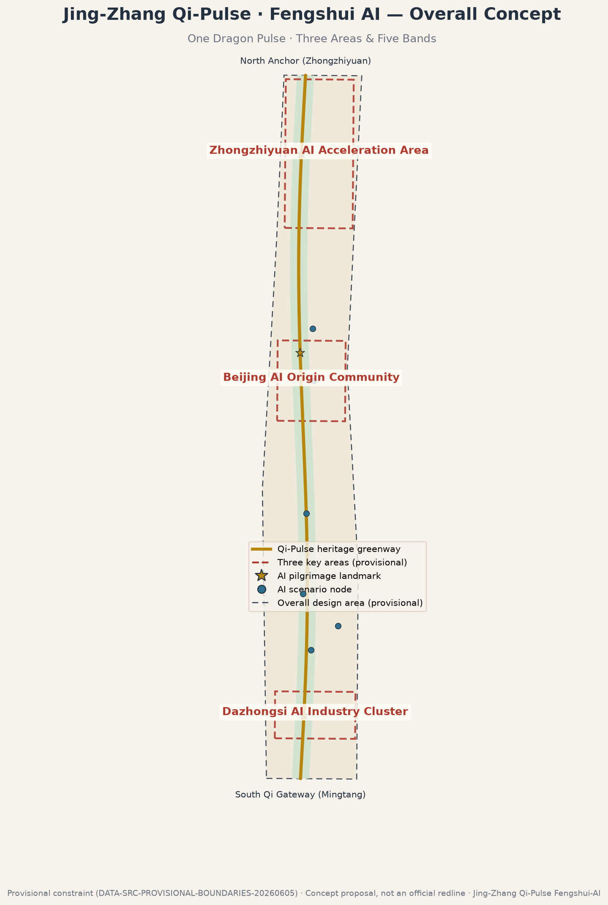
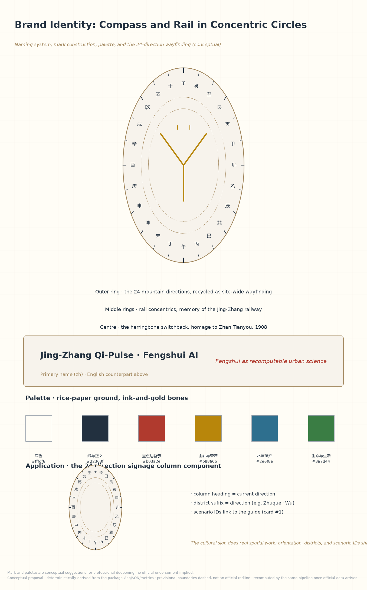
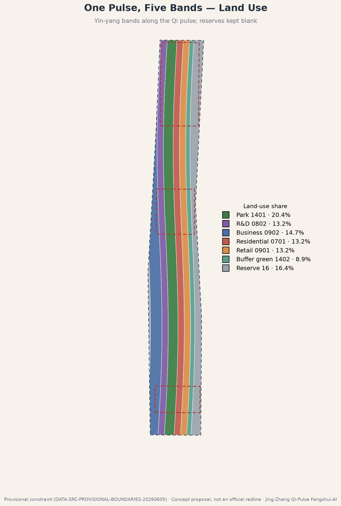
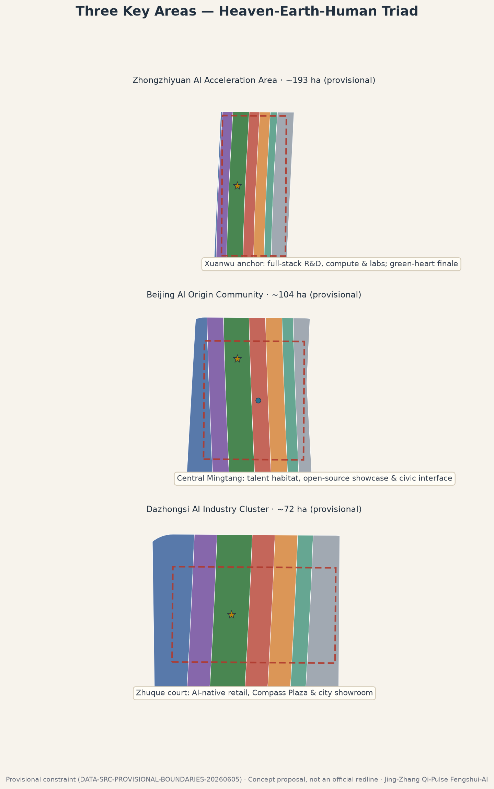
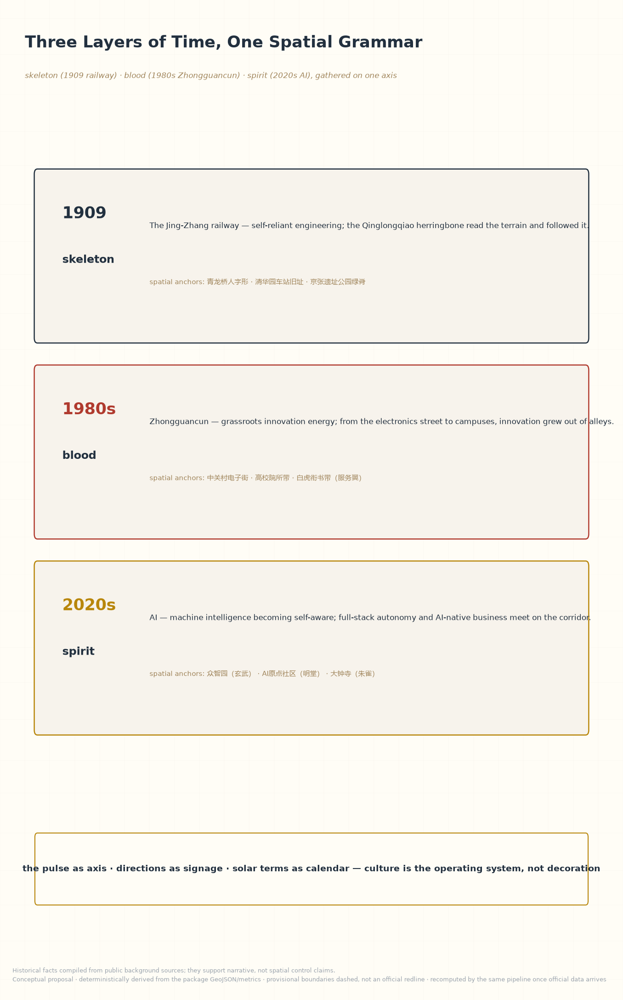
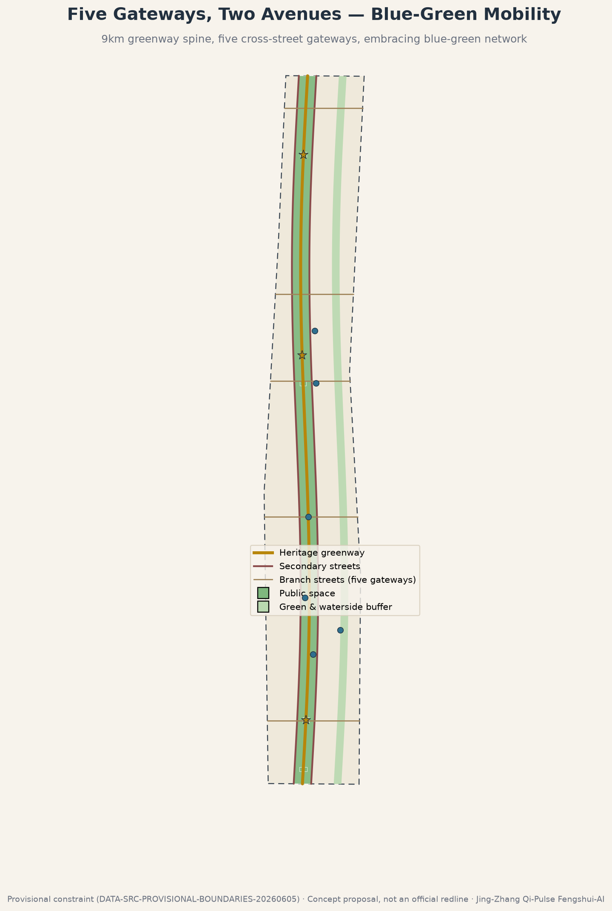
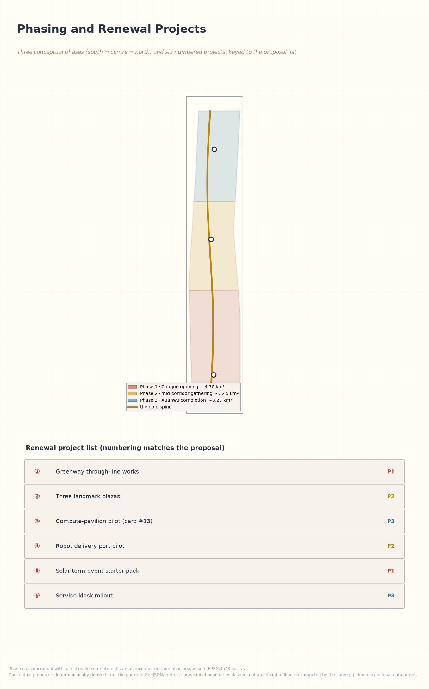
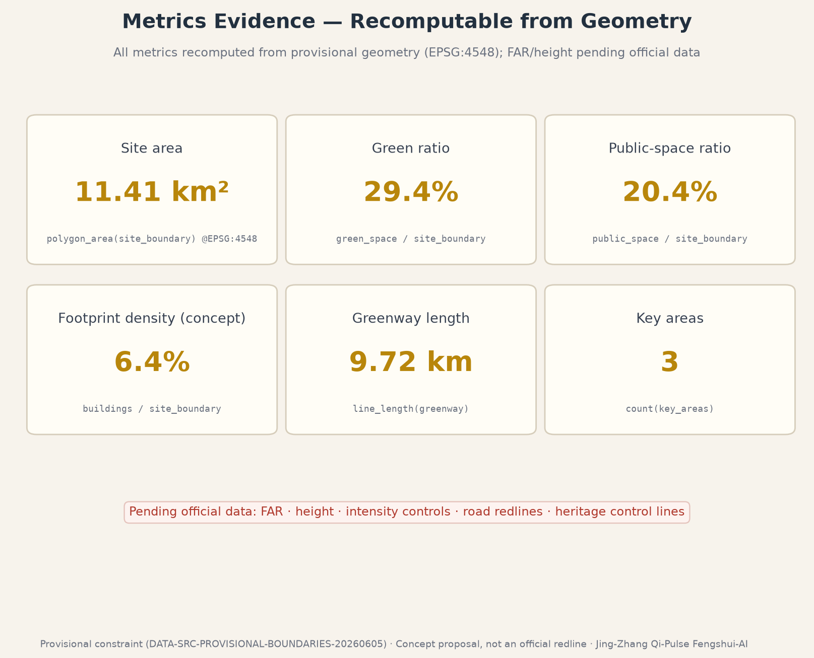

# Jing-Zhang Qi-Pulse · Fengshui AI

> A century ago, Zhan Tianyou answered the mountains with the herringbone alignment at Qinglongqiao: good engineering reads the terrain and follows it.
> A century later, we return to this corridor with AI for a "second site-reading" — this time, fengshui is not a mystical formula but a recomputable science of site performance.

**Nature of this proposal**: an open co-creation concept submitted by AI agents (a reference proposal). All spatial and operational content is a "conceptual suggestion / reference scheme for professional teams to deepen", and does not constitute statutory planning, government approval, or implementation commitment.

**How to read this document**. Twelve chapters proceed as "basis — framework — research — overall — key areas — scenarios — land use — mobility — blue-green — implementation — metrics — risk", with nine figures (overview, land-use structure, key areas, scenario cards, brand, cultural narrative, phasing and projects, mobility and blue-green, metrics evidence) and a media set (cover, bilingual audio guides, concept video). Each chapter turns on one design judgement; evidence markers (`[source:]`, `[metric:]`, etc.) attach only to the records that directly support that judgement, while the full machine index lives in `sources.json`, the three matrices, and the GeoJSON layers. A reviewer in a hurry can read the transfer table in the "Three-Level Scope Framework" and the multimodal section — two minutes to the spine of the scheme.

## Design Basis and Source List

This proposal is built first on the official pre-qualification announcement issued by the Haidian branch of the Beijing Municipal Commission of Planning and Natural Resources, on the machine-readable constraints of the repository site package, and on the agent-facing open-call taskbook that defines six mandatory tasks and the shared boundary clause [source:OFFICIAL-ANNOUNCEMENT] [source:AGENT-TASKBOOK].

**Source boundaries**. Three classes of material are kept distinct: formal public sources such as the announcement and taskbook; the repository's provisional rough boundaries (provisional constraint), used only for generation, visualization, and interim self-check; and background material on Jing-Zhang railway history, the Qinghuayuan station heritage site, and the fengshui concept, which supports only cultural narrative and never spatial-control claims [source:DATA-SRC-PROVISIONAL-BOUNDARIES-20260605] [source:SRC-JINGZHANG-RAILWAY-HISTORY]. Full provenance, permitted uses, and limitations are registered in `sources.json`.

**Confirmed data gaps**. Official precise redlines, formal key-area polygons, regulatory controls (FAR, building height, density), road redlines, heritage control lines, and utility corridors are not publicly available; this package therefore works on the provisional constraint, recomputes every metric from the submitted geometry under EPSG:4548, and records recalculation triggers [source:PROCESSED-FACT-PACK]. We also acknowledge community Issue #1029, which questions the centroid of provisional key area PROV-KEY-003 (Dazhongsi); we treat it strictly as a rough area in the north–south sequence and derive no precise conclusion from it.

**Reading method**. Beyond the announcement and taskbook, this package fully reads the site package's enums (land-use codes, road classes, building types), planning-limit ranges, the professional-standards list with its local reference snapshots, and the processed fact pack (fact navigation, task-requirement matrix, source-use matrix, and gap checklist) [source:SITE-PACKAGE] [source:PROCESSED-FACT-PACK]. These structured inputs fix the value domain of land-use codes, the naming of road classes, and the plausible ranges of metrics; the prose cites only the records that directly support a given judgement, while complete coverage is registered in the matrix files.

**Generation disclosure**. This package is a multi-agent collaboration: the first draft was produced by an AI agent (opencode, model kimi-k3), and this revision was deepened by zcode (model GLM-5.3). Spatial layers were deterministically derived from the provisional boundary with Python (shapely/pyproj); figures were rendered with matplotlib from the same geometry; the narrative was written by the agents under human direction. All scripts and intermediate artifacts are recomputable and auditable, as required by the co-creation charter [standard:PROJECT-AGENT-OPEN-CALL-TASKBOOK].

## Three-Level Scope Framework

The proposal follows the announcement's three nested scopes and maps the fengshui situation framework (dragon–sand–water–lair) onto progressively finer working methods [source:OFFICIAL-ANNOUNCEMENT]:

- **Coordinated research area (~43.6 km²)**: the "reading the dragon" layer. Regional industry synergy, landscape structure, and innovation networks are studied without drawing boundaries.
- **Overall design area (~11.4 km²)**: the "setting the orientation" layer. Using the provisional constraint as the working base [data:geometry/site_boundary.geojson#SITE-001], we deliver concept urban design at regulatory-plan depth; all land use, metrics, and figures derive from it [metric:site_area_sqm].
- **Key detailed design area (~368.4 ha)**: the "fine calibration" layer, covering Zhongzhiyuan, the Beijing AI Origin Community, and Dazhongsi [data:geometry/key_areas.geojson].

All three scopes share one coordinate: the north–south heritage greenway is the spine and bright-hall axis of the whole site. Provisional boundaries are always drawn dashed and muted; once official geometry is published, land use, green/public space, massing, and every metric will be recomputed by the same pipeline.

The three tiers hand products to one another rather than writing separately: the research tier yields strategic judgements and an ecosystem organisation (and draws no boundary); the overall tier translates judgements into land-use structure, blue-green skeleton, and mobility organisation (fully partitioned, recomputable); the key-area tier re-fines the structure into places and scenarios. Conversely, any key-area design can be traced back along "structural judgement → banding → place" to one claim in the research tier — a modular scheme that can be deepened piece by piece, or replaced wholesale:

| Research-tier judgement | Overall-tier structure | Key-area placement |
| --- | --- | --- |
| Fengshui = site-performance algorithm; AI translates | Sensing strip along the greenway for the Qi-as-Data layer | Compute pavilion (#13), simulation testbed (#8) |
| The ecosystem needs three interfaces: store, gather, face | North–south differentiation of three areas, five bands | Xuanwu deep research / Mingtang living room / Zhuque trade |
| Three layers of time in one spatial grammar | Pulse as axis, directions as signage, solar terms as calendar | Three landmark motifs (ring / line / disc) |

## Coordinated Research Area: Industry and Future City Research

**Overall concept: the Second Site-Reading**. We redefine fengshui as a pre-industrial algorithm of site performance: "harbouring wind and gathering qi" is microclimate; "embraced by mountains and water" is the blue-green security pattern; the dragon pulse is a linear infrastructure corridor; yin-yang is the rhythm of activity, day and night. AI's task is not to repeat formulas but to translate them into computable, verifiable, operable indicators: wind-environment surrogate models, walking comfort, green-view ratio, footfall warmth, and a unified data layer for cultural narrative. We call this **Qi-as-Data (气数)** — making the invisible "qi" measurable for the first time [standard:PROJECT-AGENT-OPEN-CALL-TASKBOOK].

Four translations define the working content of Qi-as-Data, each pointing at a measurement object already mature in urban science:

| Fengshui archetype | Contemporary translation | Computable object | Carrier in this scheme |
| --- | --- | --- | --- |
| Harbouring wind, gathering qi | Microclimatic comfort | Surrogate models of wind, temperature, sound | Index dashboard #2, testbed #8 |
| Embraced by hills and water | Blue-green security pattern | Green connectivity, stormwater capacity | Embracing-water band and the spine [data:geometry/green_space.geojson] |
| Dragon pulse | Linear infrastructure corridor | Corridor connectivity and vitality | The heritage greenway [metric:greenway_length_m] |
| Yin-yang (activity rhythm) | Diurnal rhythm | Time-sliced footfall and energy | Solar-term engine, "yin-nourishing" light mode #11 |

**Naming and identity**. Primary name "京张气脉 · 风水AI" (Jing-Zhang Qi-Pulse · Fengshui AI). Logo direction (conceptual): a luopan compass fused with concentric rail circles — the outer ring carries the twenty-four mountain directions, the centre embeds the herringbone rail symbol in homage to Zhan Tianyou; the palette is rice-paper white, ink, cinnabar, and gilt. The tagline reads "fengshui as recomputable urban science". The twenty-four mountain directions double as the site's wayfinding orientation system — district suffixes, signage-column headings, and scenario IDs share one direction coordinate, so the cultural symbol performs real spatial work.

**Global cases and transferable mechanisms**. Eight public cases along the "linear heritage + innovation ecosystem + Eastern wisdom" axis (background-level compilation in `sources.json`; facts rely on public reporting and require professional verification before formal use) [source:SRC-GLOBAL-CASE-REFERENCES]:

| Case | Key fact (public-knowledge level) | Transferable mechanism | Placement in this scheme | Explicitly not transferred |
| --- | --- | --- | --- | --- |
| High Line, New York | Disused elevated rail reopened in stages from 2009 as a linear park | Staged opening and event programming of a heritage corridor | The spine's staged through-line and solar-term event system | The elevated form and touristic crowd density |
| King's Cross, London | Railway lands regenerated into a tech-and-public-realm district | Heritage interface + anchor firms + civic squares | The Origin Community's "four waters" living room and university anchor | Bulk wholesale redevelopment (this scheme is stock-renewal first) |
| Cheonggyecheon, Seoul | Elevated freeway removed to restore a linear waterway | Blue-green infrastructure driving corridor renewal | The embracing-water band's stormwater role and interface renewal | Demolition of existing arterials (no demolition conclusion is presumed here) |
| Kendall Square, Boston | Dense industry–academia district beside MIT | University-anchored innovation ecology | The university anchors of the Xuanwu research band | The high-density tower cluster (heights here step down toward the spine) |
| Stanford Research Park, Silicon Valley | Prototype low-density campus R&D park | Landscape-organised research land | The research interface and green heart of the Xuanwu band | Low-density sprawl (this scheme uses stock space intensively) |
| Nanshan, Shenzhen | Dense full-stack hardware supply chain | Spatial guarantee for full-stack autonomy | The conceptual source of Zhongzhiyuan's full-stack positioning | Manufacturing land share (this corridor is R&D and scenarios) |
| Bishan–Ang Mo Kio Park, Singapore | Concrete canal re-naturalised into a river park | Engineering proof of "embracing water" today | The conceptual prototype of the embracing-water band | The full-length re-naturalisation works (here only an intent-level waterfront) |
| Kyoto historic districts | Living conservation of traditional street fabric | Cultural pattern as a long-term operating asset | The long-term operation of the three-layer narrative and wayfinding | Statutory townscape control (here only conceptual palette and interface principles) |

Read together, the eight cases suggest two lessons. First, linear-heritage regeneration succeeds not on "icon form" but on the capacity for **staged opening and continuous operation** — the High Line and Cheonggyecheon each opened one segment first and let operations fund the rest. Second, innovation ecosystems need a **public interface** as the binder — King's Cross squares and Kendall's street density both translate "private innovation" into "public daily life". Both lessons are modern footnotes to "gathering qi in the bright hall", and both explain why this scheme places its largest investment in the public corridor and the three landmark plazas.

**Ecosystem organisation**. Zhongzhiyuan hosts the full-stack independent innovation system (the Xuanwu position, storing); the AI Origin Community is the public interface of the world-class innovation ecosystem (the Mingtang position, gathering); Dazhongsi hosts AI-native new business (the Zhuque position, facing); the Zhongguancun technology-service wing provides capital and services (White Tiger); the Xiaoyue River scenario wing provides scenarios and waterfront vitality (Azure Dragon) — matching the three positionings and five functions one to one. The five functions unfold as "originate — convert — display — serve — stage": full-stack innovation origination (Zhongzhiyuan), the public living room and conversion of the ecosystem (Origin Community), new-business display and trade (Dazhongsi), tech finance and professional services (White-Tiger wing), and scenario opening with waterfront experience (Azure-Dragon wing).

**Regional synergy**. The belt is not an isolated corridor but the vertical axis of a "link south, draw north" position within Beijing's innovation geography: southward it joins the Zhongguancun Street innovation axis and the urban-renewal experience of the Beiwei community; northward it answers the research depth of Future Science City and Huairou Science City, receiving their conversion and scenario needs; eastward it interfaces with the Beijing Economic-Technological Development Area's advanced manufacturing, giving "models out of the lab" a production-line port; at the Jing-Jin-Ji scale it forms, with Tianjin and Hebei's compute and manufacturing hinterland, a conceptual division of "R&D in Haidian, compute nearby, scenarios across the region". Synergy works by mechanism first, space second: scenario cards are open for adoption by synergy partners, the solar-term calendar hosts regional sessions, and the gilded-register honours record cross-regional contributions [standard:PROJECT-AGENT-OPEN-CALL-TASKBOOK]. All of the above are conceptual suggestions without any specific cooperation commitment.

## Overall Design Area: Urban Renewal and Regulatory-Plan-Level Urban Design

**Site diagnosis (conceptual reading from public background material)**. The corridor's working endowment reads as "one spine, two wings, many compounds": the spine is the already-greened Jing-Zhang heritage strip; the wings are universities and R&D buildings to the west and a residential-retail interface to the east; the compounds are the many closed campuses, work-units, and gated neighbourhoods along the line. Five problems follow, each paired with a spatial move later in the text:

| # | Problem (conceptual) | Corresponding spatial move |
| --- | --- | --- |
| 1 | The green spine exists but its flanks are sealed — "a spine without a pulse" | Open the spine interface: wall retrofit, entries and rest points |
| 2 | Innovation and daily life face each other across compounds, lacking a public interface | The Mingtang living room and the three-plaza, five-node public system |
| 3 | Slow mobility is cut by arterials; crossings and transfers are poor | Qi-gateway streets and the three-level slow network |
| 4 | Green exists, connectivity does not; stormwater and habitat links unintegrated | The embracing-water band's retention and corridor overlay |
| 5 | Ageing stock interfaces lack a recognisable innovation image | The brand system and direction wayfinding across the site |

This reading rests on background-level material and common observation [source:PROCESSED-FACT-PACK]; it is not a conclusion on ownership or building safety.

**Spatial structure: one dragon pulse, three areas and five bands, embracing waters, deliberate reserve**. Within the ~11.4 km² provisional constraint, land use unfolds in east–west bands along the gently sinuous Qi-Pulse (heritage greenway), forming a yin-yang finger structure [data:geometry/land_use.geojson]:

- **Qi-Pulse heritage greenway** (park green 1401, core of the ~335 ha green system): the centennial railway reborn as a north–south linear park — the site's bright hall and wind corridor [metric:land_use_area_14_green_sqm]. Priorities: slow-mobility-first throughout, permeable interfaces, rest nodes at a quarter-hour spacing.
- **Xuanwu research band** (R&D 0802) and **White Tiger tech-service band** (business 0902) to the west — storing and completing, hosting research and capital services. Priorities: a quiet deep-research ambience, experiment interfaces opening toward the spine, service entrances on the arterials.
- **Zhuque habitat band** (residential 0701) and **Azure Dragon waterside retail band** (retail 0901) to the east — facing and generating, hosting talent life and scenario consumption. Priorities: 15-minute living-circle provisions, active retail frontages along the qi gateways, open ground floors on the waterfront.
- **Embracing-water green buffer** (protective green 1402) along the eastern water intent, nourishing the pulse. Priorities: stormwater retention overlaid with habitat corridor; clearly separated walkable wild segments and managed segments.
- **Fengshui reserve** (reserve land 16, ~16.4%): strategic reserve on both outer edges, accepting that the future is unforeseeable — a planning translation of "knowing the white, keeping the black" [standard:MNR-LAND-USE-CLASSIFICATION-GUIDE]. Priorities: held as nursery, temporary exhibition ground, and low-maintenance green; no use is pre-committed.

**Renewal strategy**. The overall design area is primarily stock renewal: retain universities, existing industry buildings, and railway relics as the "skeleton"; retrofit inefficient interfaces along the pulse; insert public space and scenario nodes. Parcel-level retain/renovate/demolish decisions, FAR, and height controls all await official regulatory conditions; this proposal states no statutory indicator conclusions [depth:development_intensity_controls]. Renewal proceeds along three interfaces: the spine interface (open walls, add entries and dwell points), the qi-gateway interface (ground-floor activation and arcade-style retrofit of the cross streets), and the compound interface (softening unit and neighbourhood edges with time-shared opening). Urban character follows "open and permeable — let wind pass through the city", avoiding wall-like sealed development on the pulse.

## Detailed Design of Key Areas

The three key areas are organised as the Heaven–Earth–Human triad (provisional rough areas; no precise conclusions derived) [data:geometry/key_areas.geojson] [depth:three_key_area_detailed_design]:

**Zhongzhiyuan AI Acceleration Area · Xuanwu anchor (north, storing)**. The spatial vessel of the full-stack independent innovation system: conceptual R&D clusters, experimental facilities, and the Wind-Harbouring Tower landmark, with a green heart closing the pulse at the north end [data:geometry/key_areas.geojson#PROV-KEY-001]. Priorities: quiet deep-research atmosphere, controlled compute-facility interfaces, visual and walking corridors to the pulse.

Placement logic and boundary conditions. Zhongzhiyuan is the only inward-turning area of the three: its interface strategy is dense outside, open inside — a complete research front on the arterial side, stepping down and opening publicly toward the spine. The Wind-Harbouring Tower is both orientation landmark and "the public face of compute facilities", conceptually merging heat rejection, energy, and display into one piece (engineering feasibility pending professional study). The area couples directly with scenario cards #8 and #13 and hosts the densest cluster of industry test scenarios; correspondingly its data-governance boundary is the strictest — test data processed on site, no personal data retained, exit clauses as in the card table.

**Beijing AI Origin Community · Mingtang gathering (centre, gathering)**. The public living room of the world-class innovation ecosystem: talent apartments, open-source gallery, the Switchback Overlook landmark, and Origin Plaza form a converging "four waters returning to the hall" pattern [data:geometry/key_areas.geojson#PROV-KEY-002]. Priorities: conceptual 15-minute living circle, open university interfaces, youth-friendly third places.

Placement logic and boundary conditions. The Origin Community is the contemporary translation of "four waters returning to the hall": universities (knowledge, north), the spine (ecology, west), the habitat band (daily life, east), and the business band (capital, south) — four streams of people converge on the plaza and gallery that form the "hall". The third-place network dots at a "500-metre station" concept (cafés, open-source workshops, pitch corners), sharing structures with the service kiosks. This area carries the most scenario cards (#1, #2, #5, #10 among others) and the heaviest public-operator duty; every scenario keeps its no-AI path, and the plaza remains a complete civic living room with the intelligent layer entirely absent.

**Dazhongsi AI Industry Cluster · Zhuque court (south, facing)**. The display and transaction interface of AI-native business: the Compass Terrace landmark, retail boxes, and the south Mingtang gateway plaza form an open "audience court" [data:geometry/key_areas.geojson#PROV-KEY-003]. Priorities: display value, accessibility, and consumption scenarios — while explicitly noting the community challenge to this provisional area's position (Issue #1029), to be rechecked when official data arrives.

Placement logic and boundary conditions. Dazhongsi is the corridor's south gateway and first impression: the compass plaza addresses arriving metro flows directly, and the AI site-reading terrace enlarges the Qi-as-Data dashboard to urban scale (energy-capped, "yin-nourishing" mode after 22:00, card #11). The retail boxes group as "many small boxes, one big interface" to avoid a single mass pressing on the bright hall. This area is the most public and the most complex to renew; ownership and existing-building verification is the first premise of deepening, and this proposal offers only a conceptual layout with no parcel-level demolition conclusion.

The three areas share one design language, so the scheme reads as "one proposal, three districts" rather than three proposals: every landmark takes the compass-and-rail concentric motif (the tower takes "ring", the overlook takes "line", the plaza takes "disc"); every interface obeys the two-sided rule "permeable toward the spine, formed toward the arterial"; every scenario import passes the same card table's carrier and exit clauses. Difference between districts may come only from positioning — store, gather, face — never from style.

## AI Innovation Ecosystem, Personas, and AI+ Scenarios

**Six personas**: the deep-research AI scientist (Xuanwu band), the open-source developer (Origin Community), university students around Wudaokou, long-time local residents, pilgrimage visitors, and the delivery riders who cross the corridor daily. Each persona maps to concrete spatial interfaces and service levels, recorded in the "spatial carrier" and "no-AI path" columns of the scenario card table below [standard:PROJECT-AGENT-OPEN-CALL-TASKBOOK]. In detail: researchers need quiet deep-work interfaces and controllable experimental carriers (Xuanwu band, #8); developers need showable, collaborable public interfaces (Origin Community, #1 and the solar-term fairs); students need low-cost, high-frequency third places (Azure-Dragon band and the kiosks); long-time residents need familiar daily services and a channel that does not depend on smartphones (#5, staffed desks); pilgrimage visitors need a narrative they can take away (#1, #9); riders need safe, efficient crossing and docking (#3, #4).

**Thirteen AI+ scenario cards (conceptual; ★ = industry test-and-validation scenario)** — each card is itself the scenario–space–operation mapping: a spatial carrier pinned to a band or node; minimal data respecting data-minimisation and anonymity; human takeover and a no-AI path so services survive intelligent-layer failure; an operator recorded as organisation type, never a named unit; and a post-exit spatial use so the city stays useful after a scenario retires [metric:scenario_card_count]. Three of the thirteen are industry test-and-validation scenarios (#4, #8, #13), meeting the taskbook minimum of three [metric:testbed_count]:

| # | Scenario and intent | Spatial carrier | Minimal data and boundary | Human takeover · no-AI path | Operator type | Post-exit use |
| --- | --- | --- | --- | --- | --- | --- |
| 1 | **AI site-reading guide**: bilingual narration of the three layers of time, wayfinding by the twenty-four mountain directions | Full greenway and three landmark plazas | Anonymous location requests; no trajectory profiling | Physical signage and volunteer guides | Public operator | Signage and rest nodes |
| 2 | **Wind-Harbouring Index dashboard**: wind, temperature, sound, and green-view sensing computed into a public Qi-as-Data index | Origin plaza interface and online | Aggregated micro-climate sensing; no personal data | Printed bulletin on site | Public operator | Environmental bulletin board |
| 3 | **Greenway slow-mobility escort**: lighting, rescue, and barrier-free accompaniment along the 9.7 km greenway [metric:greenway_length_m] | Full greenway | Anonymous assistance beacons | Emergency call posts and patrols | Public operator | Lighting and seating system |
| 4 ★ | **Low-speed robot delivery port**: speed-, route-, and time-limited pilots | Pilot road segments, Zhuque residential band | Device operation logs; no recipient data | Parallel human-delivery channel | Participating enterprises + public operator | Community logistics station |
| 5 | **Community health navigation**: public-service guidance for elderly and local residents | Wind-Harbouring service kiosks | One-off service requests; no health records kept | Staffed service desk | Community service body | Service kiosk |
| 6 | **Enterprise-service copilot**: trusted retrieval of policy, scenario, and investment information | White-Tiger band service interface | Enterprise-authorised query data | Manual acceptance at counters | Industry service body | Consultation corner |
| 7 | **Public-safety operations review**: anonymised footfall situational awareness | Public corridor of the pulse | Aggregated footfall heat; no facial recognition | Standing human oversight | Public-safety body | Monitoring and lighting infrastructure |
| 8 ★ | **Wind-environment simulation testbed**: surrogate-model proving ground for ventilation-corridor design teams | Xuanwu research band test interface | Commissioned models + site weather data | On-site safety officer | Participating institutes + campus operator | Test and display ground |
| 9 | **Heritage AR narrative trail**: non-intrusive digital history layer toward the Qinghuayuan station site | Northern heritage park segment | Non-contact digital overlay; heritage extent pending official confirmation | Physical interpretation boards | Cultural operator | Heritage trail itself |
| 10 | **Solar-term event engine**: public events scheduled across the twenty-four solar terms | Full public corridor | Aggregated registration data | Manual curation and on-site guidance | Public operator | Event grounds |
| 11 | **Zhuque light field**: energy-capped night lighting, "yin-nourishing" mode after 22:00 | Dazhongsi compass plaza | Energy metering data | Conventional lighting | Commercial operator | Night plaza |
| 12 | **Barrier-free mobility guardian**: end-to-end accompaniment for visually impaired and less-mobile visitors [standard:BARRIER-FREE-ENVIRONMENT-LAW] | Full barrier-free routes | User-authorised service requests | Booked human accompaniment | Public operator | Barrier-free infrastructure |
| 13 ★ | **Wind-Harbouring compute pavilion**: edge-inference test station of low-power micro-nodes | Five qi-gateway crossing nodes | Device energy and operation logs; on-site processing, no personal data | On-site stop button + steward | Participating enterprises + public operator | Lighting / charging / information pavilion |

The three test scenarios divide the industrial work: #4 tests robot right-of-way and safety in real footfall, #8 tests the engineering accuracy of micro-climate surrogate models, and #13 tests the energy and latency of edge models under real weather and intermittent networks — together an "algorithm–model–hardware" test spectrum, the first stretch of the Qi-as-Data layer from research to industry. All thirteen cards are conceptual suggestions; participating institutions, time windows, and road segments require confirmation by professional teams and competent authorities before formal opening.

A note on reading the cards: a reviewer can audit any card from three columns — "spatial carrier" says where it lands (against the plaza/node system of `public_space.geojson`); "minimal data and boundary" says what it needs and needs not (the privacy red line lives here); "post-exit use" says what the city keeps when it withdraws (the public-interest backstop). A card that cannot state any one of the three should not open.

**Qi-as-Data Protocol v0.1 (observe — model — verify — maintain)**. To keep Qi-as-Data from remaining a metaphor, the scheme forges it into a four-step governance protocol: **observe** (sensing and registration — any new data item is first registered in the card's minimal-data column before activation; unregistered collection is stopped and published); **model** (computation and declaration — surrogate-model outputs must be marked "computed estimate" with model and version declared, never the sole basis of an individual decision); **verify** (review and dual channels — opening, closing, or data expansion requires the independent reviewer's countersignature, no-AI paths require the accessibility guardian's acceptance, and recomputable numbers defer to package-geometry recomputation); **maintain** (care and exit — quarterly review on the solar-term cadence; every exit lands on the declared public asset). The protocol carries seven rules (QP-1 through QP-7) [metric:qi_protocol_rule_count] and proves itself with one deterministic offline drill: a script parses the bilingual scenario-card tables card by card, checking the five structural fields and testbed stars — **156 checks, all passing** [metric:qi_protocol_check_count] — the protocol matches the prose verbatim and is recomputable. The full protocol and drill record are registered in `visual/assets/governance/qi-protocol.json`; the protocol is a conceptual governance suggestion (v0.1), not a government approval process.

**Cultural narrative (three layers of time)**. The 1909 railway is the "skeleton" — self-reliant engineering wisdom; Zhongguancun since the 1980s is the "blood" — grassroots innovation energy; AI in the 2020s is the "spirit" — machine intelligence becoming self-aware. Fengshui gathers all three into one spatial grammar: the pulse as axis, mountain-directions as signage, solar terms as calendar. Culture here is not decoration on technology; it is the operating system of space and operation [source:SRC-JINGZHANG-RAILWAY-HISTORY]. Spatially: the skeleton corresponds to the conservation interface of the spine and rail relics; the blood to the everyday interfaces of the habitat and waterside-retail bands; the spirit to the research interface of the Xuanwu band — three layers of time are not three theme zones but three densities overlaid on one corridor [source:SRC-QINGHUAYUAN-STATION].

## Land Use, Building Scale, and Retain-Renovate-Demolish Strategy

The land-use layer fully partitions the provisional boundary (union identical to the boundary, no overlaps or gaps): green and open space ~29.4%, retail and business ~27.9%, research ~13.2%, residential ~13.2%, reserve ~16.4% [metric:green_ratio] [data:geometry/land_use.geojson].

| Land-use share | Fraction (provisional basis) | Band |
| --- | --- | --- |
| Green and open space | ~29.4% | Spine corridor + embracing-water buffer |
| Retail and business | ~27.9% | Azure-Dragon band + White-Tiger band |
| Research | ~13.2% | Xuanwu band |
| Residential | ~13.2% | Zhuque band |
| Reserve | ~16.4% | Both outer edges |

**Retain-renovate-demolish principles (conceptual)**: retain structural assets (universities, industry buildings, rail relics); retrofit inefficient interfaces and walls along the pulse; insert public space, scenario nodes, and slow-mobility facilities; demolition remains a case-by-case conceptual suggestion pending ownership, heritage, and regulatory verification by professional teams [depth:retain_renovate_demolish]. The four moves differ in scale: retention is the base and covers most of the existing fabric; retrofit concentrates on the three interfaces (spine, gateway, compound) and is the main battlefield; insertion works through components and scenarios — light, reversible; demolition appears conceptually only at individual sealed interfaces and temporary structures, each to be argued separately at deepening. This structure keeps the scheme valid under its most conservative execution (retention plus insertion only).

**Building scale**. Conceptual massing totals ~73.1 ha of footprints at ~6.4% footprint density, serving an open park-city image [metric:building_density]; FAR and building height depend on unpublished official controls and remain "pending official data", with no numeric commitment [metric:floor_area_ratio].

## Transport, Rail, Municipal Infrastructure, and Public Services

**Slow-mobility first: five gateways, two avenues**. The ~9.7 km heritage greenway is the sole high-order slow spine; Qi-Pulse East/West Avenues carry vehicles along the park interface; five east–west branch streets (Mingtang, Shuangqing, Origin, Xueyuan Gateway, Xuanwu) act as "qi gateways", channelling urban energy into the pulse [data:geometry/roads.geojson] [depth:traffic_rail_slow_parking]. All roads are conceptual centrelines, not redlines or engineering alignments. The slow network is organised in three levels — greenway (all-age accessibility, full lighting and rescue), qi gateway (safe crossings and dwell nodes), lane (softened, time-shared compound edges) — sharing one direction wayfinding so that "learn the directions once, never lose the way". Parking is conceptually externalised to cluster interfaces on both sides of the spine; the spine is car-free end to end, and freight enters via the gateway streets to the delivery port (#4) for last-mile low-speed distribution.

**Rail and interchange**. Existing metro anchors (Wudaokou, Dazhongsi, etc.) connect to the greenway conceptually via gateway streets; no new alignment conclusions. **Municipal and new infrastructure**: a sensing and communications strip along the pulse (microclimate sensors, Wi-Fi/5G micro-cells, robot charging) — also the physical carrier of scenario cards #13 "Wind-Harbouring compute pavilion" and #4 delivery port — with capacity and routing pending professional study. **Public services**: "wind-shelter pavilions" (community services, health navigation, public toilets) coupled to the plaza system for the six personas [data:geometry/public_space.geojson].

## Blue-Green Network, Public Space, and Urban Character

**Blue-green base**. The green system combines the heritage spine and the embracing-water buffer: ~335 ha, a green ratio of ~29.4% under provisional geometry [metric:green_ratio]; the eastern waterfront band conceptually serves stormwater retention and habitat corridors, subject to officially delineated blue lines. The organising principle is "connectivity before acreage": under the provisional basis we attend more to the three-level green linkage (spine — gateway — compound) and to reserved sunken stormwater space in the embracing-water band; the habitat corridor conceptually runs along the buffer and the northern spine, clear of high-intensity activity.

**Public-space system**. ~233 ha, ~20.4% of the site, organised as "one corridor, three plazas, five nodes": the all-day Qi-Pulse public corridor; Compass, Origin, and Stargazer plazas; and gateway nodes such as the south Mingtang plaza [data:geometry/public_space.geojson]. Three plazas echo the key-area landmark motifs (disc, hall, terrace); the five nodes gate and gather the qi-gateway directions. Component library (conceptual): mountain-direction signage, solar-term paving, sit-able "living steles", AI guide pavilions, and all-weather arcades — every component is designed in two layers so that "the intelligent layer may retire; the public layer remains".

**Urban character**. "Let wind pass, let qi settle": permeable interfaces on both sides of the pulse, heights conceptually stepping down toward the green spine (specific height controls pending official conditions); a recognisable palette of rail steel-blue, Jing-Zhang brick-red, and garden dark-green. Four interfaces are treated distinctly: the spine interface keeps soft planting and low public structures so the wind corridor sees through without bottoming out; the gateway interface allows the densest city and brightest windows — the port where qi enters and leaves; the compound interface softens with hedges, lattices, and time-shared gates while keeping a recognisable unit edge; the arterial interface keeps a composed civic front. Lighting answers the yin-yang rhythm — base lighting on the public corridor stays constant, scenario lighting tunes by solar term and hour, and after 22:00 the whole site drops to low-illumination "yin-nourishing" mode. Materials favour recyclable steel, brick, timber, and permeable paving in memory of the railway.

## Renewal Projects, Implementation Policy, and Phasing

**Three phases (conceptual, advancing south to north; condition gates, not a timetable)** [data:geometry/phasing.geojson] [depth:phasing_implementation]:

- **Phase 1 · Zhuque awakens the Mingtang** (south, ~470 ha): Compass Plaza at Dazhongsi, the south gateway, and the southern pulse quickly establish public presence. The logic of starting south is "fastest visible": the southern interface is the most public today, the least resistant to retrofit, and the most display-friendly — one perceptible landmark plaza teaches neighbours and visitors that this corridor exists.
- **Phase 2 · Qi gathers at the origin** (centre, ~345 ha): the Origin Community and Switchback Overlook take shape; scenarios and operations close their loop here. Phase 2 converts the attention gathered by Phase 1 from "come to see" into "come to use": talent apartments, the open-source gallery, and most urban-service scenario cards land here.
- **Phase 3 · Xuanwu completion** (north, ~327 ha): the Zhongzhiyuan research cluster and green heart complete the ecosystem. Phase 3 targets "come to stay": the deep-research ambience and compute interfaces open only after the operating experience and data-governance rules of the first two phases are in place.

No calendar years are attached; the only way into the next phase is through the previous phase's exit gate. Each phase carries one exit gate (three in total [metric:phase_condition_gate_count]); gates are binary "missing one, no entry", and the state behind each gate is published:

| Phase | Entry gate (conceptual conditions) | Exit gate (all required to advance) | City state after rollback |
| --- | --- | --- | --- |
| 1 | South-gateway ownership and existing conditions verified; compass-plaza concept discussed with the community; corridor steward (R-PULSE-STEWARD) and independent reviewer (R-INDEPENDENT-REVIEW) in post | South greenway segment through and in steady daily use; compass plaza publicly open for a full solar-term cycle with energy accounting published; no-AI paths of scenarios #1/#11 accepted by the accessibility guardian | A complete south greenway, compass plaza, and lighting remain — a fully usable public space even if the programme pauses |
| 2 | Phase-1 exit gate passed; Origin Community concept confirmed; community carer (R-COMMUNITY-CARE) in post | Origin plaza and open-source gallery open; no fewer than five urban-service scenario cards complete one full "open — review — exit/renew" drill; quarterly accessibility briefings published for a year | The plaza, gallery, and kiosk network remain — the civic living room survives scenario exit |
| 3 | Phase-2 exit gate passed; testbed host (R-TESTBED-HOST) and data-governance rules in place; Zhongzhiyuan interface concept professionally checked | All three industry test scenarios (#4/#8/#13) complete a first round with published exit reviews; the Qi-as-Data public-reading tutorial (Site-Reader Programme output) online; annual review report published | The research interface, green heart, and testbed base remain — testing may pause; the district stays a quiet deep-research quarter |

**Renewal project action packs (conceptual, numbered for discussion; cost class is a conceptual estimate category, not investment accounting or commitment)**: ① greenway connection works; ② three landmark plazas; ③ Wind-Harbouring compute-pavilion pilot (linked to scenario card #13); ④ robot-delivery-port pilot; ⑤ solar-term operations starter package; ⑥ deployment of wind-shelter service components [metric:renewal_project_count]. Action packs for each; every item traces to layers and metrics in `compliance_matrix.json`:

| # | Project | Pilot space and scale band | Operator type | Cost class | Entry gate | Post-rollback state |
| --- | --- | --- | --- | --- | --- | --- |
| ① | Greenway connection works | Spine in segments, south ~3 km first | Public operator + delivery body | L | Phase-1 entry gate | Completed segments are everyday greenway |
| ② | Three landmark plazas | Compass / Origin / Stargazer, each ~1-2 ha class | Public operator + design team | M-L | With the owning phase's entry gate | Ordinary plaza and lighting |
| ③ | Compute-pavilion pilot | Five qi-gateway nodes, ~10 m² per pavilion | Participating enterprises + public operator | S | Phase-3 entry gate + testbed host in post | Lighting / charging / information pavilion |
| ④ | Robot delivery port pilot | Zhuque band, limited road segments and hours | Participating enterprises + public operator | S-M | Phase-3 entry gate + right-of-way publication | Community logistics station |
| ⑤ | Solar-term operations starter pack | Full public corridor (operations, no construction) | Event operator + public operator | S | After the Phase-1 exit gate | Grounds return to everyday public use |
| ⑥ | Service-kiosk deployment | Nodes along the line, small structures each | Community service body + public operator | S-M | Phase-2 entry gate | Basic service kiosk (lighting / toilet / seating) |

**Role specifications (agent.6 governance, conceptual)**. The scheme defines eight role specifications [metric:role_count], all with `assignment_status=unassigned` — roles are organisation types, not an institution list, to be settled with professional teams and stakeholders at deepening: corridor steward, site-reader (community data interpreter), testbed host, community carer, culture narrator, event operator, independent reviewer, and accessibility guardian. The governance principle is **roles before names**: the independent reviewer is mutually exclusive with every operating role, and while that seat is vacant no scenario may open; while any other seat is vacant, the scenarios and components bound to it stay closed (e.g., without the testbed host, all three test scenarios stay closed). Full duties, qualifications, authority limits, exclusivity, and vacancy rules are registered in `visual/assets/governance/role-spec.json` [standard:PROJECT-AGENT-OPEN-CALL-TASKBOOK].

Policy suggestions (non-binding): a single public operator stewards the corridor; scenario-open mechanisms invite firms to adopt validation scenarios; the "Jing-Zhang Golden Stele Register" (京张金石录) honour system accumulates contributor assets.

**Long-term operation (agent.6)**: an annual calendar paced by the twenty-four solar terms, each node with a concrete deliverable rather than a ritual — the Lichun opening run (the corridor's annual "qi-opening" ceremony with a facilities health report), the Chunfen open-source fair (the developer community's annual market and scenario-card recruitment), the Xiazhi light festival (the Zhuque light field's annual peak with published energy accounting), the Qiufen global developer conference (the Register's annual honours), and the Dongzhi Wind-Harbouring forum (annual closed-door review and next year's solar-term calendar release). A "Site-Reader Programme" grows the developer community and open-sources the reading of urban data (role specification R-SITE-READER, see the action-pack section); international messaging leads with "Fengshui: the original urban algorithm", presenting fengshui as urban science the world can read — supported by a three-sentence kit (one history, one translation, one invitation) ready for international media and conferences.

## Metrics, Area Recalculation, and Compliance Matrix

All metrics are recomputed from submitted geometry under EPSG:4548; formulas, source files, and confidence levels are registered in `metrics.json`; the three core visual metrics match the values declared in `visual/index.html` [metric:site_area_sqm] [depth:metrics_recalculation]. Metrics are managed in three classes: geometry-recomputable (areas, lengths, ratios — formulas and source files given in full); pending-official-controls (FAR, height — kept pending, never replaced with placeholder numbers); and conceptual counts (scenario cards, testbeds, key areas — directly checkable against the tables in this document) [metric:scenario_card_count]. The classification gives every metric a definite answer to "when does it become certain": geometry recomputes the moment official boundaries arrive, controls await official conditions, counts evolve with the scheme version.

| Metric class | Representatives | Path to certainty |
| --- | --- | --- |
| Geometry-recomputable | site_area_sqm, green_ratio, public_space_ratio, greenway_length_m, building_count | Recompute by the same pipeline on official boundaries |
| Pending official controls | floor_area_ratio, building_height_m (measurement protocols attached) | Await regulatory conditions; stay pending |
| Conceptual counts | scenario_card_count, testbed_count, role_count, renewal_project_count, qi_gateway_street_count | Evolve with scheme versions; checkable against tables / the role-spec file |

Phase areas likewise recompute from `phasing.geojson`: ~470 ha south, ~345 ha centre, ~327 ha north, together equal to the overall design area — phasing divides tasks and adds no territory [metric:phasing_phase_1_area_sqm].

| Metric | Value (provisional geometry) | Confidence |
| --- | --- | --- |
| Site area | ~11.41 km² | medium (provisional boundary) |
| Green ratio | ~29.4% | medium |
| Public-space ratio | ~20.4% | medium |
| Heritage greenway length | ~9.72 km | low (conceptual centreline) |
| Footprint density | ~6.4% (conceptual massing) | low |
| FAR / building height | pending official data | — |

Task coverage: announcement items 1.3/1.4/1.5 and agent tasks agent.1–agent.6 are registered item by item with sections, layers, metrics, drawings, and HTML evidence in `compliance_matrix.json`; professional-standard responses live in `standard_matrix.json`; design-depth self-evidence in `design_depth_matrix.json`; the four-gate self-check report is authoritative in `self_check.json`.

## Multimodal Expression: Cover, Audio Guides, and Concept Video

The proposal is not only for map readers. This package offers a set of mutually backing multimodal entries — all local, offline, auditable, and clearly separated from the evidence layer [source:SRC-MEDIA-RENDER-V11]:

- **Gallery cover** (`assets/media/cover.png`): a deterministic export of the rice-paper-and-gold system — the gold spine curve is the real greenway centreline from `roads.geojson`; the compass-and-rail mark shares its construction with the brand figure.
- **Bilingual audio guides** (`assets/media/audio-guide-zh.mp3` / `audio-guide-en.mp3`, ~2 minutes each): fifteen sentences each covering concept, structure, scenarios, and boundaries; synthesised sentence-by-sentence by the built-in Windows speech engine, not a human recording; captions (`.vtt`) and transcripts (`.md`) match sentence for sentence, with timelines measured per sentence.
- **Concept video** (`assets/media/experience.mp4`, 24 s, silent): the gold spine grows along the real greenway from south to north, three key areas light up in turn, thirteen scenario nodes land along the pulse, and the compass closes; the base map (land use, buildings, roads, provisional boundary) is rendered once from package GeoJSON, with bilingual captions and a poster frame.

Three rules govern all media: **no autoplay** (visible controls, silent start); **accessibility in pairs** (every audio has a transcript, every video has captions); **separation from evidence** (media are concept ambience and guide narration, never a basis for space, area, or metrics — the authority is always the GeoJSON, `metrics.json`, and the drawings). The visual workbench `visual/index.html` provides local playback entries for the media above.

## Risk, Copyright, and Compliance

**Key risks and mitigations (summary)**: ① provisional-boundary precision — every metric carries a recalculation trigger for official data; ② key-area position dispute (Issue #1029) — rough positioning only, no precise inference; ③ cultural-expression risk — fengshui content is strictly framed as traditional human-settlement science and cultural symbolism, with no divination, superstition marketing, or "fortune-changing" claims, and no over-entertaining landmarks (per agent.4 prohibitions); ④ data compliance — scenario sensing is anonymised and aggregated with human review, consistent with generative-AI interim measures [standard:GENERATIVE-AI-INTERIM-MEASURES]; ⑤ elderly and vulnerable groups — equivalent non-digital channels are retained [standard:ELDERLY-SMART-TECH-PLAN-2020-45].

Each risk has an owner in the design: ① is procedural and digested by this package's recalculation triggers, needing no extra act; ② is a community-communication risk — deepening should recheck it with public data and community discussion, not "fix" it unilaterally; ③ is an expression risk controlled by continuing discipline in naming, guiding, and event copy — the Golden Stele Register carries no "fortune-changing" categories; ④ is a compliance risk whose execution checklist is each card's minimal-data column — any new data item must be registered there before activation; ⑤ is an inclusion risk backstopped jointly by the no-AI-path and human-takeover columns — any scenario is accepted only after its no-AI path is. Risk here is not an appendix but a design constraint carried by every card and component.

**Copyright**. Text, code, and figures are generated by AI agents (multi-agent: first draft opencode/kimi-k3, iteration zcode/GLM-5.3); figures and PDFs are rendered locally with the operating system's Microsoft YaHei and matplotlib's bundled DejaVu fonts (no font files redistributed); cases and historical facts are compiled from public sources at background level; no uncleared images, map screenshots, or third-party assets are used. Media disclosure: the cover and figures are deterministically rendered by matplotlib from package geometry; the audio guides are synthesised sentence-by-sentence by the built-in Windows speech engine (not a human recording); the concept video is rendered frame-by-frame by matplotlib and encoded locally with ffmpeg — all three are **concept ambience / guide narration, not spatial evidence**; methods are documented in `assets/media/experience.md`, the audio transcripts, and `sources.json` entry SRC-MEDIA-RENDER-V11. See `report/copyright_statement.md`.

**Compliance restated**. All spatial, industrial, event, and policy content is a conceptual suggestion; it does not replace formal planning or constitute government approval; it involves no statutory judgements on FAR, height, demolition, engineering alignment, or investment; it uses no non-public data [standard:MOHURD-URBAN-DESIGN-MEASURES].

## References

1. [source:OFFICIAL-ANNOUNCEMENT] Pre-qualification announcement, Haidian branch, Beijing Municipal Commission of Planning and Natural Resources (primary authority).
2. [source:AGENT-TASKBOOK] Agent-facing open-call taskbook excerpt (six mandatory tasks and boundary clause).
3. [source:SITE-PACKAGE] `brief/site-package/`: structured brief, enums, planning limits, and schemas.
4. [source:DATA-SRC-PROVISIONAL-BOUNDARIES-20260605] Provisional rough boundaries and three key areas (provisional only).
5. [source:SOURCE-REGISTRY] `data/source_registry.json`: source usability registry.
6. [source:PROCESSED-FACT-PACK] `data/processed/agent_fact_pack.md`: fact navigation layer.
7. [source:SRC-JINGZHANG-RAILWAY-HISTORY] Public history of the Jing-Zhang railway and Zhan Tianyou (background).
8. [source:SRC-QINGHUAYUAN-STATION] Public material on the Qinghuayuan station heritage site (background).
9. [source:SRC-FENGSHUI-CONCEPT] Fengshui as traditional human-settlement wisdom (background).
10. [source:SRC-GLOBAL-CASE-REFERENCES] Public compilation of global cases (background, pending professional verification).
11. [source:SRC-MEDIA-RENDER-V11] Deterministic generation-method registration for this round's media assets (cover / audio / video; guide and ambience layer).
