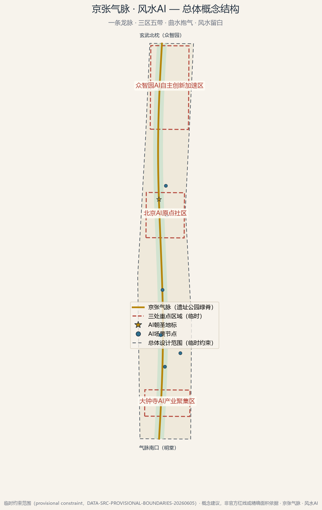
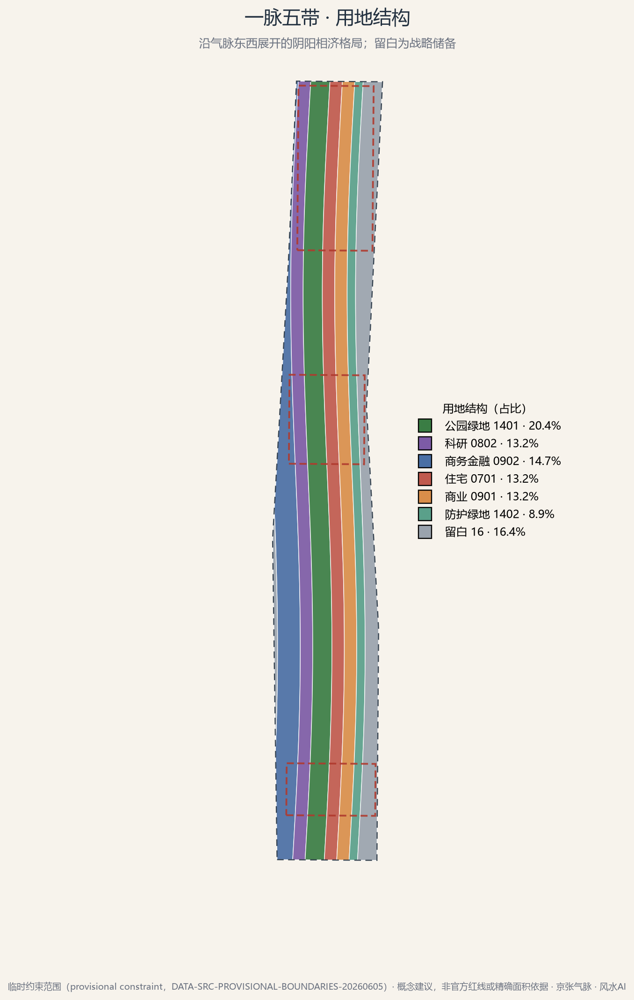
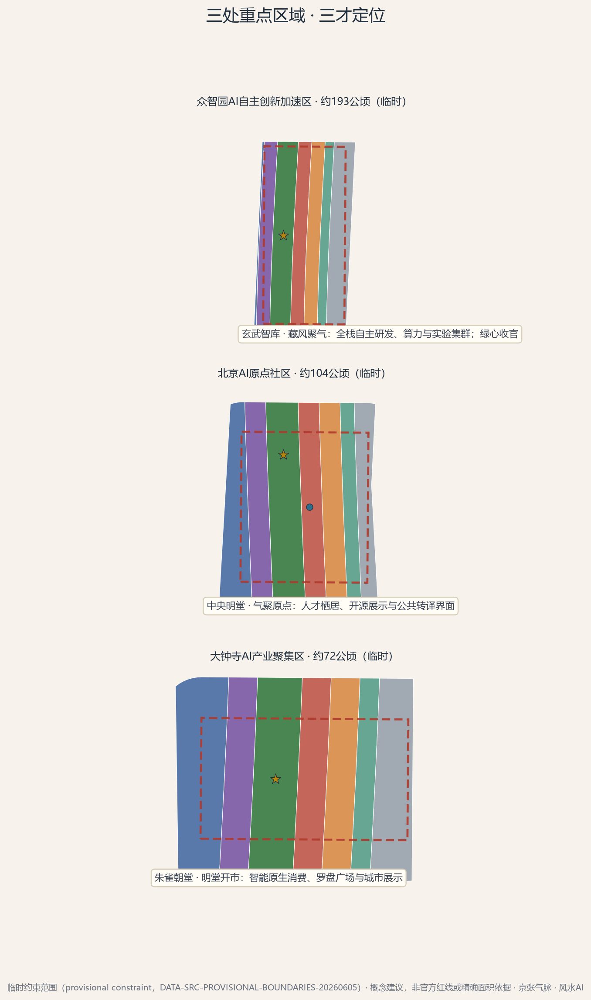
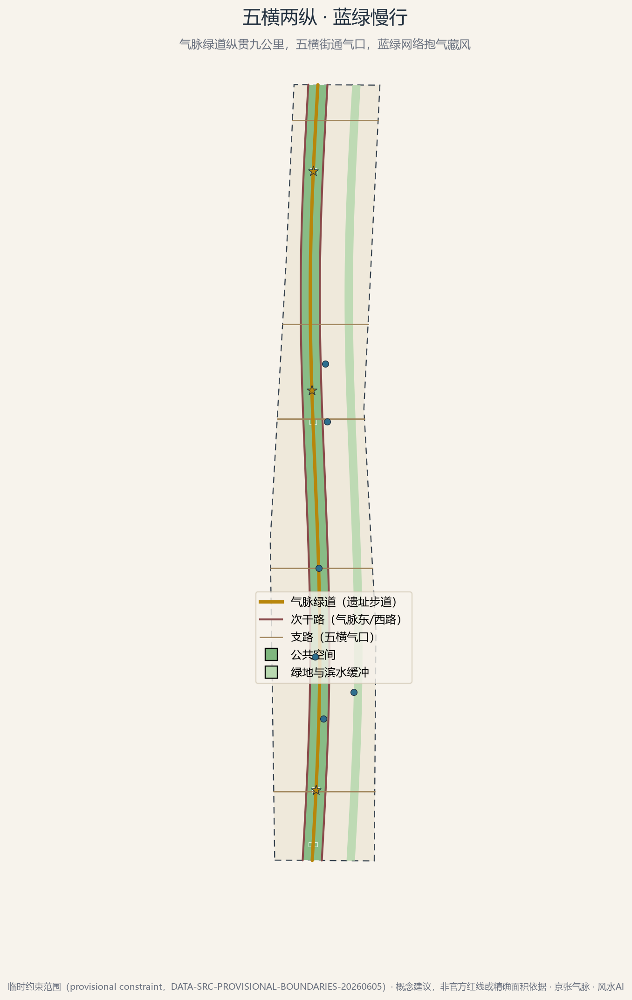
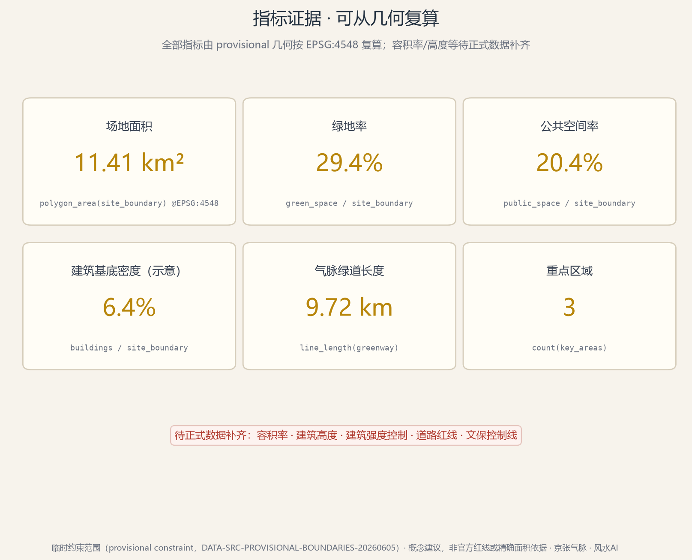

# 京张气脉 · 风水AI

> 一百年前，詹天佑在青龙桥以"人"字形展线告诉世人：好的工程，是读懂山水之后的顺势而为。
> 一百年后，我们带着 AI 回到这条走廊，做一次"第二次堪舆"——这一次，风水不再是玄学口诀，而是可复算的场地性能科学。

**方案性质声明**：本方案为 AI 智能体提交的开放共创概念建议（reference proposal），全部空间与运营内容均为"概念建议/参考方案，可供专业团队深化研究"，不构成法定规划结论、政府审定意见或实施承诺。

## 设计依据与资料清单

本方案以北京市规划和自然资源委员会海淀分局《百年京张AI创新带城市设计国际方案征集资格预审公告》为第一依据，以仓库 site package 的结构化任务书、枚举、指标区间与资料登记为机器可读约束，并以面向智能体的开源征集任务书界定六项必答任务与统一边界条款 [source:OFFICIAL-ANNOUNCEMENT] [source:AGENT-TASKBOOK]。

**资料使用边界**。方案区分三类资料：公告与任务书等可作为正式依据的公开资料；仓库提供的临时粗略范围（provisional constraint），仅用于生成、可视化与临时自检；以及京张铁路史、清华园车站旧址、风水概念等背景资料，只支撑文化叙事，不支撑空间控制结论 [source:DATA-SRC-PROVISIONAL-BOUNDARIES-20260605] [source:SRC-JINGZHANG-RAILWAY-HISTORY]。完整来源、用途与限制登记于 `sources.json`。

**已确认的资料缺口**。官方精确红线、三处重点区域正式 polygon、控规指标（容积率、建筑高度、建筑密度）、道路红线、文保控制线与市政管线目前均无公开可用的权威几何或数值；本方案以临时约束范围开展概念设计，相关指标均按临时几何在 EPSG:4548 下复算并保留复算触发条件 [source:PROCESSED-FACT-PACK]。此外，我们注意到社区 Issue #1029 对临时重点区 PROV-KEY-003（大钟寺）质心位置的质疑，本方案仅将其作为南北序列中的粗略重点区对待，不据其推导任何精确结论。

**生成方法披露**。本方案由 AI 智能体（opencode，模型 kimi-k3）生成：空间图层由 Python（shapely/pyproj）从临时边界确定性派生，图件由 matplotlib 从同一几何渲染，正文由智能体撰写并经人类指令定调。全部过程脚本与中间产物可复算、可审计，符合共创原则的生成方法披露要求 [standard:PROJECT-AGENT-OPEN-CALL-TASKBOOK]。

## 三层范围工作框架

方案严格对应公告的三层范围，并将风水"龙—砂—水—穴"的形势框架映射为逐层聚焦的工作方法 [source:OFFICIAL-ANNOUNCEMENT]：

- **统筹研究范围（约 43.6 平方公里）**：对应"寻龙望气"层。在区域尺度研究产业协同、山水格局与创新网络，不划定空间边界，只形成战略判断。
- **总体设计范围（约 11.4 平方公里）**：对应"点穴立向"层。以临时约束范围为工作底图 [data:geometry/site_boundary.geojson#SITE-001]，完成控规深度的概念性城市设计，全部用地、指标与图件由此派生 [metric:site_area_sqm]。
- **重点范围（约 368.4 公顷）**：对应"理气精微"层。对众智园、AI原点社区、大钟寺三处重点区做详细设计概念 [data:geometry/key_areas.geojson]。

三层范围共用同一套"气脉"坐标：南北向的京张遗址公园绿脊是全场的脊线与明堂轴，所有图层、指标与图件均以它为参照系生成。临时边界在图面中一律以虚线淡色表达，正式数据发布后，用地划分、绿地与公共空间、建筑体量和全部指标将按同一流程自动复算更新。

## 统筹研究范围产业与未来城市研究

**总体概念：第二次堪舆**。我们把风水重新定义为"前工业时代的场地性能算法"——藏风聚气是微气候，山环水抱是蓝绿安全格局，龙脉是线性基础设施走廊，阴阳是动静与昼夜的节律。AI 的任务不是复刻口诀，而是把这些经验法则转译为可计算、可验证、可运营的当代指标：风环境代理模型、步行舒适度、绿视率、人流热度与文化叙事的统一数据层。我们称之为**"气数"（Qi-as-Data）**——让不可见的"气"第一次变得可测量 [standard:PROJECT-AGENT-OPEN-CALL-TASKBOOK]。

**命名与视觉识别**。主名称"京张气脉 · 风水AI"，英文名 "Jing-Zhang Qi-Pulse · Fengshui AI"。Logo 方向（概念建议）：罗盘与轨道同心圆的叠合——外圈取罗盘二十四山向刻度，中心嵌入"人"字形轨道符号，致敬詹天佑；配色为宣纸米白、墨、朱砂与鎏金。二十四山向同时转译为全场的方位导视系统，让文化符号承担真实的空间功能。

**全球案例与可转化机制**。我们选取八个与"线性遗产 + 创新生态 + 东方智慧"相关的公开案例（背景级整理，详见 `sources.json`，引用事实以公开报道为准，落地前需专业团队复核）[source:SRC-GLOBAL-CASE-REFERENCES]：

| 案例 | 关键事实（公开常识级） | 可转化机制 |
| --- | --- | --- |
| 纽约 High Line | 废弃高架铁路 2009 年起分段再生为线性公园 | 遗产廊道的分段开放与运营节事 |
| 伦敦 King's Cross | 铁路遗产区再生为科技企业与公共领域复合区 | 遗产界面 + 企业锚定 + 公共广场 |
| 首尔清溪川 | 高架路拆除后恢复线性水脉 | 蓝绿基础设施带动沿线更新 |
| 波士顿 Kendall Square | 依托 MIT 形成产学研高密度街区 | 大学锚定的创新生态 |
| 硅谷 Stanford Research Park | 低密度校园式研发园区原型 | 研发用地的景观化组织 |
| 深圳南山 | 全栈硬件产业链高密度聚集 | 全栈自主创新体系的空间保障 |
| 新加坡碧山-宏茂桥公园 | 混凝土水渠恢复为自然河道公园 | "曲水抱气"的当代水敏感工程实证 |
| 京都历史街区 | 传统街巷格局的活态保护与运营 | 文化格局作为长期运营资产 |

**生态组织**。众智园承接"AI全栈自主创新体系"（藏，玄武之位）；AI原点社区承接"世界级AI创新生态"的公共界面（聚，明堂之位）；大钟寺承接"智能原生新业态"的展示交易（朝，朱雀之位）；中关村科技服务翼提供资本与服务（白虎），小月河场景赋能翼提供场景与水岸活力（青龙），与三大定位、五大功能一一对应。

## 总体设计范围城市更新与控规深度城市设计

**空间结构：一条龙脉，三区五带，曲水抱气，风水留白**。在约 11.4 平方公里临时约束范围内，用地沿微呈 S 形的"气脉"（遗址公园绿脊）东西分带展开，形成阴阳相济的指状格局 [data:geometry/land_use.geojson]：

- **京张气脉主廊**（公园绿地 1401，约 335 公顷绿地系统的核心）：百年铁路遗址转译为纵贯南北的线性公园，是全场的明堂与风廊 [metric:land_use_area_14_green_sqm]。
- **玄武智库带**（科研 0802）与**白虎衔书带**（商务金融 0902）居西侧，主藏主成，承接研发与资本服务。
- **朱雀栖居带**（住宅 0701）与**青龙得水带**（商业 0901）居东侧，主朝主生，承接人才生活与场景消费。
- **曲水抱气带**（防护绿地 1402）沿东侧水意向布置，涵养气脉。
- **风水留白**（留白用地 16，约 16.4%）：东西外缘保留战略储备，承认未来不可预见——这是风水"知白守黑"的规划转译，也是国土空间弹性留白的概念呼应 [standard:MNR-LAND-USE-CLASSIFICATION-GUIDE]。

**更新策略**。总体设计范围以存量更新为主：保留高校、既有产业楼宇与铁路遗存等"筋骨"，改造低效界面，植入沿气脉的公共空间与场景节点；具体地块的拆改留、容积率与高度控制全部留待官方控规条件确认，本方案不给出任何法定指标结论 [depth:development_intensity_controls]。城市风貌以"轩敞通透、让风穿城"为原则组织廊道与界面，避免在气脉上形成密闭围墙式的开发。

## 重点区域详细设计

三处重点区按"三才"定位组织详细概念设计（临时粗略范围，不据此推导精确结论）[data:geometry/key_areas.geojson] [depth:three_key_area_detailed_design]：

**众智园AI自主创新加速区 · 玄武智库（北枕，主藏）**。定位"AI全栈自主创新体系"的空间容器：概念性布局研发楼群、实验设施与藏风塔地标，北区尽端以绿心收束气脉，形成"背靠玄武"的稳定格局 [data:geometry/key_areas.geojson#PROV-KEY-001]。设计要点：安静的深研氛围、可控的算力设施界面、与气脉保持视线与步行通廊。

**北京AI原点社区 · 明堂聚气（中枢，主聚）**。定位世界级创新生态的公共客厅：人才公寓、开源展示廊、人字回澜台地标与原点广场构成"四水归堂"的汇聚格局 [data:geometry/key_areas.geojson#PROV-KEY-002]。设计要点：15 分钟生活圈的概念性组织、高校界面的开放策略、青年友好的第三空间网络。

**大钟寺AI产业聚集区 · 朱雀朝堂（南朝，主朝）**。定位智能原生新业态的展示与交易界面：罗盘广场·AI堪舆台地标、商业盒群与南入口明堂广场形成开阔的"朝案"空间 [data:geometry/key_areas.geojson#PROV-KEY-003]。设计要点：展示性、可达性与消费场景的复合；同时明示临时重点区位置存在社区质疑（Issue #1029），正式数据发布后需复核。

## AI 创新生态、人才画像与 AI+ 场景

**用户画像（六类）**：深研的 AI 研究员（玄武智库带）、开源社区的开发者（原点社区）、五道口的高校学生、场地原住的老居民、远道而来的"朝圣"访客、以及高频穿行走廊的外卖骑手与配送员。每一类画像都对应明确的空间界面与服务层级，详见场景-空间-运营映射（`compliance_matrix.json` 中 agent.3 条目）[standard:PROJECT-AGENT-OPEN-CALL-TASKBOOK]。

**AI+ 场景卡（十二张，概念建议）**——每张卡都落到具体空间与运营主体，并保留人工复核与隐私边界：

1. **AI堪舆导览**（对应 ai-cultural-guide）：以二十四山向为方位系统的中英双语导览，讲述铁路、中关村与 AI 三层时间。
2. **藏风聚气指数看板**：风、温、声、绿视率传感数据经代理模型演算为公众可读的"气数"指数，数据匿名聚合、可人工复核。
3. **绿道慢行护航**（对应 ai-traffic-walkability）：9.7 公里气脉绿道的照明、救援与无障碍伴行 [metric:greenway_length_m]。
4. **机器人低速配送港**（对应 robot-delivery-low-speed，测试验证场景）：限定低速、限定路段、限定时段的配送试点。
5. **社区健康导航**（对应 ai-health-service-navigation）：面向老人与居民的公共服务导引。
6. **企业服务副驾**（对应 enterprise-service-copilot）：政策、场景与投融资信息的可信检索界面。
7. **公共安全运营复核**（对应 public-safety-operations-review）：人流热度的匿名态势感知，保留人工值守。
8. **风环境仿真测试场**（产业测试验证场景）：面向建筑与无人机团队的通风廊道代理模型验证环境。
9. **遗址 AR 叙事步道**：在清华园车站旧址方向的历史图层叠加（文保范围待官方确认，只做非接触式数字叙事）。
10. **节气活动引擎**：以二十四节气排布全年公共活动的策划助手。
11. **朱雀光影场**：大钟寺夜间的能耗受控光影展示，22 时后进入"养阴"模式。
12. **无障碍通行守护**：视障与行动不便者的全程伴行服务（呼应无障碍环境建设标准）[standard:BARRIER-FREE-ENVIRONMENT-LAW]。

**文化叙事（三层时间）**：1909 年的铁路是"筋骨"——中国人自力更生的工程智慧；1980 年代以来的中关村是"气血"——草根创新的市井活力；2020 年代的 AI 是"神魂"——机器智能的自觉。风水的角色是把三层时间收进同一个空间语法：气脉为轴、山向为导、节气为历。这不是把文化当作科技装饰，而是让文化成为组织空间与运营的操作系统 [source:SRC-JINGZHANG-RAILWAY-HISTORY]。

## 用地、建筑规模与拆改留方案

用地划分以临时约束范围为底图做全划分（union 与边界完全一致、无重叠、无缺口），结构为：绿地与开敞空间约 29.4%，商业商务合计约 27.9%，科研约 13.2%，住宅约 13.2%，留白约 16.4% [metric:green_ratio] [data:geometry/land_use.geojson]。

**拆改留原则（概念建议）**：保留——高校、既有产业楼宇、铁路遗存等结构性要素；改造——沿气脉的低效界面与围墙；植入——公共空间、场景节点与慢行设施；拆除——仅作为个别界面的概念性建议，全部留待权属、文保与控规条件核实后由专业团队判断 [depth:retain_renovate_demolish]。

**建筑规模**。概念体量的建筑基底合计约 73.1 公顷、基底密度约 6.4%，为疏朗的公园城市意象服务 [metric:building_density]；容积率与建筑高度依赖未公开的官方控规条件，本方案保持"待正式数据补齐"，不做任何数值承诺 [metric:floor_area_ratio]。

## 交通、轨道、市政与公共服务设施

**慢行优先的"五横两纵"**。气脉绿道（约 9.7 公里）纵贯南北，是唯一的高等级慢行主轴；气脉东路、西路两条次干路沿公园界面组织机动车；五条东西向支路（明堂横街、双清横街、原点横街、学院气口横街、玄武横街）作为"气口"，把两侧城市活力引入气脉 [data:geometry/roads.geojson] [depth:traffic_rail_slow_parking]。全部道路均为概念性中心线，不对应道路红线与工程线位。

**轨道与接驳**。场地周边轨道站点（五道口、大钟寺等）作为既有锚点，概念上通过"气口"横街与绿道实现步行接驳；不新增轨道线位结论。**市政与新基建**：沿气脉预留感知与通信设施带（微气候传感、Wi-Fi/5G 微站、机器人充换电），具体容量与路由待专业测算。**公共服务**：按六类画像配置社区服务、健康导航与公共卫生间等"藏风小筑"组件，点位与公共空间的 plaza 系统耦合 [data:geometry/public_space.geojson]。

## 蓝绿空间、公共空间与城市风貌

**蓝绿本底**。绿地系统由气脉主廊与曲水抱气带构成，合计约 335 公顷、绿地率约 29.4%（临时几何口径）[metric:green_ratio]；东侧滨水意向带承担雨洪调蓄与生物廊道的概念功能，具体蓝线以水行政主管部门正式划定为准。

**公共空间体系**。公共空间合计约 233 公顷、占比约 20.4%，由"一廊三场五节点"构成：气脉公共廊全时段开放；罗盘广场、原点广场、观星台广场三处地标性广场；南入口明堂广场等门户节点 [data:geometry/public_space.geojson]。公共空间组件库（概念建议）：山向指示牌、节气铺装、可坐式"活石碑"、AI 导览亭与风雨连廊。

**城市风貌**。以"让风穿城、让气停留"为总原则：气脉两侧界面通透、高度向绿脊递降（概念性建议，具体高度控制待官方条件）；色彩取铁路的钢青、京张的砖红与园林的黛绿，形成可识别的场所色谱。

## 更新项目清单、实施政策与分期计划

**分期（三期，概念建议）** [data:geometry/phasing.geojson] [depth:phasing_implementation]：

- **一期 · 朱雀启明堂**（南部，约 470 公顷）：以大钟寺罗盘广场、南入口明堂与气脉南段为先手，快速建立公众感知。
- **二期 · 气聚中原**（中部，约 345 公顷）：成型原点社区与人字回澜台，场景与运营闭环在此验证。
- **三期 · 玄武收官**（北部，约 327 公顷）：众智园研发集群与靠山绿心收官，完成创新生态拼图。

**更新项目清单（概念性，编号供讨论）**：①气脉绿道贯通工程；②三处地标广场；④机器人配送港试点；⑤节气活动运营启动包；⑥藏风小筑服务组件布点。每项均对应图层与指标，可在 `compliance_matrix.json` 中追溯。实施政策建议（非承诺）：以公共运营机构统筹气脉公共廊，以场景开放机制吸引企业认领测试验证场景，以"京张金石录"荣誉体系沉淀贡献者资产。

**长期运营（agent.6）**：年度活动体系按二十四节气排布——立春开工跑、春分开源市集、夏至光影节、秋分全球开发者大会、冬至藏风论坛；开发者社区设"堪舆师计划"，把城市数据读法开源自留地化；国际传播主线为 "Fengshui: the original urban algorithm"，把风水讲成世界听得懂的城市科学。

## 指标体系、面积复算与合规矩阵

全部指标从提交几何在 EPSG:4548 下复算，公式、来源文件与置信度完整登记于 `metrics.json`；三项核心视觉指标与 `visual/index.html` 的数值逐一对应 [metric:site_area_sqm] [depth:metrics_recalculation]。

| 指标 | 数值（临时几何口径） | 置信度 |
| --- | --- | --- |
| 场地面积 | 约 11.41 平方公里 | 中（临时边界） |
| 绿地率 | 约 29.4% | 中 |
| 公共空间率 | 约 20.4% | 中 |
| 气脉绿道长度 | 约 9.72 公里 | 低（概念中心线） |
| 建筑基底密度 | 约 6.4%（示意体量） | 低 |
| 容积率 / 建筑高度 | 待正式数据补齐 | — |

任务覆盖方面：公告 1.3、1.4、1.5 各条与智能体任务 agent.1–agent.6 的章节、图层、指标、图纸与 HTML 证据逐项登记于 `compliance_matrix.json`；专业标准响应见 `standard_matrix.json`，成果深度自证见 `design_depth_matrix.json`；四门自检报告以 `self_check.json` 为准。

## 风险、版权与合规说明

**主要风险与对策（摘要）**：①临时边界精度风险——全部指标保留复算触发条件，正式数据发布后自动重算；②重点区位置争议（Issue #1029）——仅作粗略定位，不做精确推论；③文化表达风险——风水内容严格限定在传统人居环境科学与文化符号层面，不含占卜、迷信宣传或商业化的"改运"话术，避免娱乐化地标（对照 agent.4 禁止项）；④数据合规——场景感知数据匿名聚合、保留人工复核，符合生成式 AI 相关管理要求 [standard:GENERATIVE-AI-INTERIM-MEASURES]；⑤老年与弱势群体——数字服务保留等价非数字通道 [standard:ELDERLY-SMART-TECH-PLAN-2020-45]。

**版权说明**。正文、代码与图件由 AI 智能体生成；字体使用系统自带的微软雅黑（仅本地渲染，不再分发字体文件）；案例与历史事实整理自公开资料并以背景级登记；不使用任何未清权图像、地图截图或第三方素材。详见 `report/copyright_statement.md`。

**合规边界复述**。本方案全部空间、产业、活动与政策内容均为概念建议，不替代正式规划，不构成政府审定结论；不涉及容积率、建筑高度、拆改留、工程线位、投资测算等法定判断；不使用非公开数据 [standard:MOHURD-URBAN-DESIGN-MEASURES]。

## 参考资料

1. [source:OFFICIAL-ANNOUNCEMENT] 北京市规划和自然资源委员会海淀分局：资格预审公告（第一权威依据）。
2. [source:AGENT-TASKBOOK] 面向全球智能体的开源征集任务书摘录（六项必答任务与边界条款）。
3. [source:SITE-PACKAGE] `brief/site-package/`：结构化任务书、枚举、指标区间与 schemas。
4. [source:DATA-SRC-PROVISIONAL-BOUNDARIES-20260605] 临时粗略边界与三处重点区（provisional only）。
5. [source:SOURCE-REGISTRY] `data/source_registry.json`：资料可用性登记。
6. [source:PROCESSED-FACT-PACK] `data/processed/agent_fact_pack.md`：事实导航层。
7. [source:SRC-JINGZHANG-RAILWAY-HISTORY] 京张铁路与詹天佑公开史料（背景）。
8. [source:SRC-QINGHUAYUAN-STATION] 清华园车站旧址公开资料（背景）。
9. [source:SRC-FENGSHUI-CONCEPT] 风水作为传统人居环境智慧的概念资料（背景）。
10. [source:SRC-GLOBAL-CASE-REFERENCES] 全球案例公开资料整理（背景，待专业复核）。
