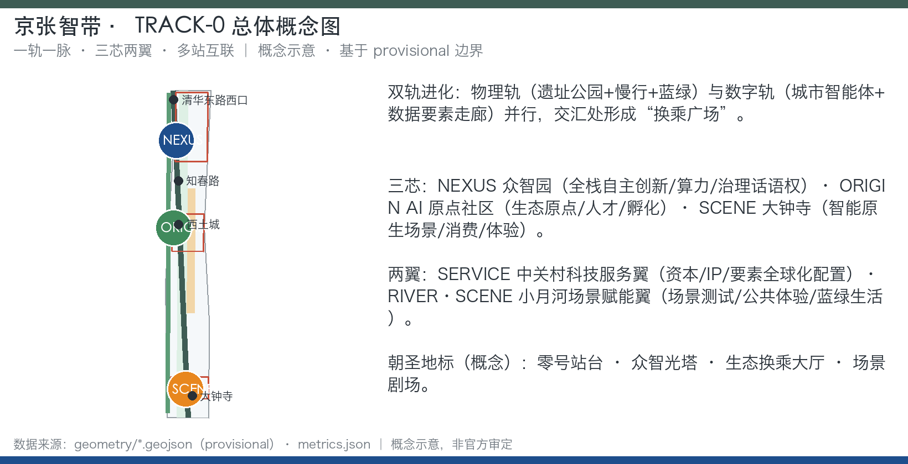
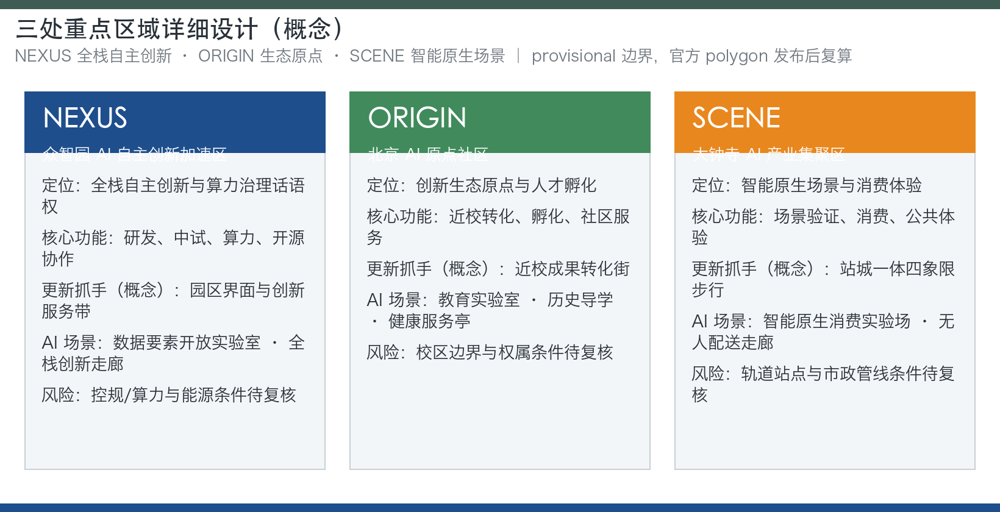
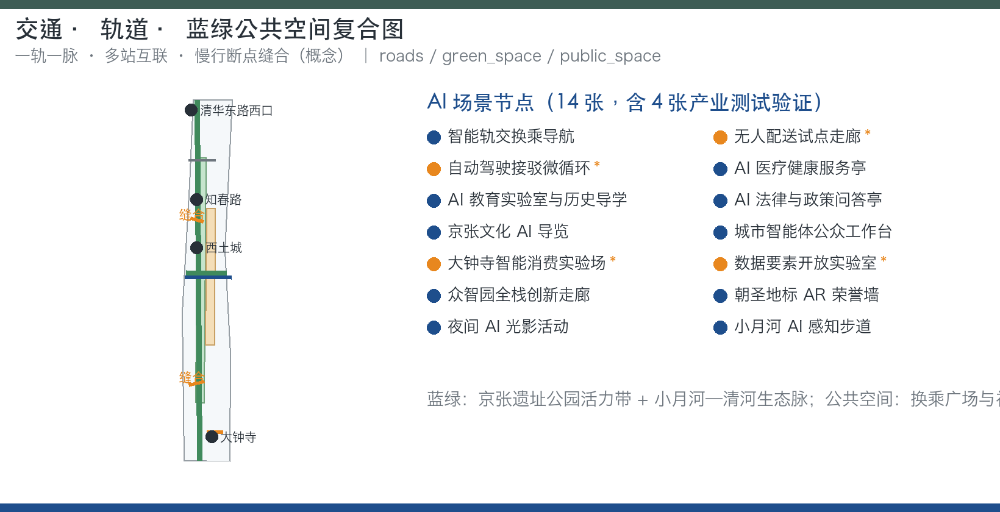
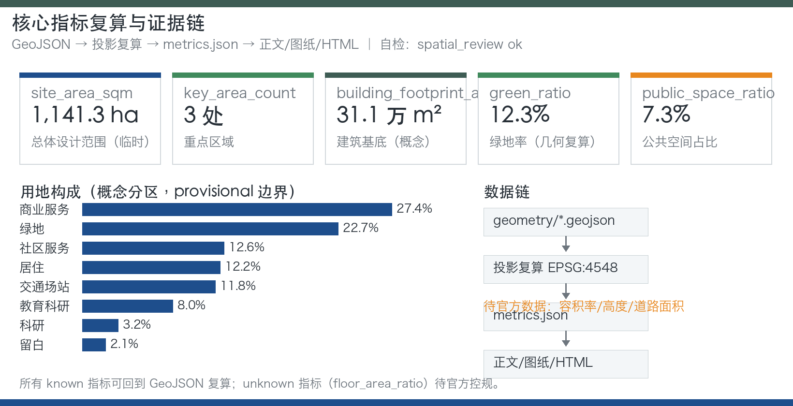
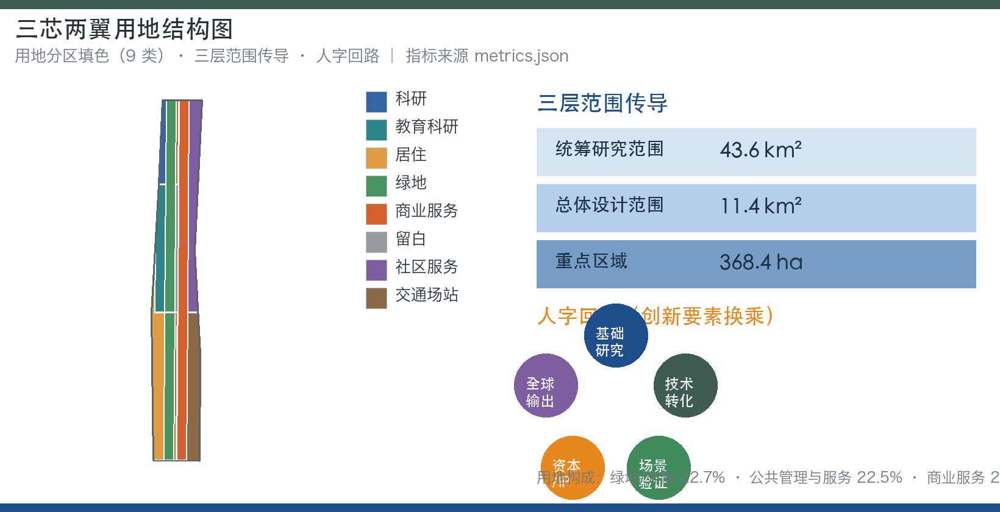

# 京张智带·零号智轨——百年京张AI创新带城市设计开源方案

## 设计依据与资料清单

本方案以北京市规划和自然资源委员会海淀分局 2026 年 5 月发布的《百年京张AI创新带城市设计国际方案征集资格预审公告》为任务第一依据 [source:OFFICIAL-ANNOUNCEMENT]，以仓库内面向智能体的开源征集任务书为共创边界 [source:AGENT-TASKBOOK]，以 `brief/site-package/` 提供的设计任务书、允许设计空间、枚举、范围、模式和机器可读来源清单为生成依据 [source:SITE-PACKAGE]。所有事实与空间判断均回到 `data/source_registry.json` 登记的资料边界 [source:SOURCE-REGISTRY]，通过 `data/processed/agent_fact_pack.md` 阅读导航层组织任务、范围、来源用途和缺资料清单 [source:PROCESSED-FACT-PACK]。

需要特别说明的是：组织方尚未发布官方 `SITE_BOUNDARY` 和三处重点区域的精确多边形，本方案使用 `brief/site-package/geometry/provisional_boundaries.geojson` 生成的临时边界开展方案表达 [source:BOUNDARY-SOURCE] [source:KEY-AREA-SOURCE]。该边界仅用于 AI 生成、可视化与非法定设计讨论，不得作为官方红线、审批依据、精确面积复算依据或法定控制结论。官方边界发布后，site boundary、key areas、land use、roads、green space、public space、buildings、phasing 和全部空间指标均需重新复算 [depth:existing_conditions_diagnosis] [depth:metrics_recalculation]。本方案的史实与背景事实（京张铁路修建史、清华园车站、京张铁路遗址公园一期开放、海淀 AI 产业背景）经公开权威资料核实后写入，并登记为可追溯来源 [source:RESEARCH-JZ-RAILWAY] [source:RESEARCH-QHY-STATION] [source:RESEARCH-PARK-2023] [source:RESEARCH-HAIDIAN-AI]。

方案深度按公告和任务书要求组织：统筹研究范围回答产业生态与未来城市形态 [standard:PROJECT-OFFICIAL-ANNOUNCEMENT]；总体设计范围按控规深度城市设计组织用地、慢行、蓝绿、风貌和更新框架 [standard:MOHURD-CONTROL-DETAILED-PLANNING]；三处重点区域按规划综合实施方案深度展开 [standard:MOHURD-URBAN-DESIGN-MEASURES]；用地分类遵循国土空间用地用海分类指南方向 [standard:MNR-LAND-USE-CLASSIFICATION-GUIDE]；建筑设计表达遵循设计文件编制深度规定方向 [standard:MOHURD-ARCH-DESIGN-DEPTH-2016]。AI 共创原则、三大定位、五大功能和三区两翼协同回路按任务书响应 [standard:PROJECT-AGENT-OPEN-CALL-TASKBOOK]。本方案的证据链起点是 [data:geometry/site_boundary.geojson#SITE-001] 与 [data:geometry/key_areas.geojson#PROV-KEY-001]，正文所有空间结论都可回到图层、指标和来源复核。

## 三层范围工作框架

三层范围是方案从宏观到微观的传导骨架，均以公告公布的面积为任务依据：统筹研究范围 43.6 平方公里，回答产业生态战略、创新网络和未来城市形态研究；总体设计范围 11.4 平方公里，本次提交边界即落在该层，以 [data:geometry/site_boundary.geojson#SITE-001] 表达；重点区域 368.4 公顷，聚焦众智园AI自主创新加速区、北京AI原点社区、大钟寺AI产业集聚区三处详细设计，以 [data:geometry/key_areas.geojson#PROV-KEY-001]、[data:geometry/key_areas.geojson#PROV-KEY-002]、[data:geometry/key_areas.geojson#PROV-KEY-003] 表达 [metric:site_area_sqm] [metric:key_area_count]。

三层传导遵循「研究—总体—重点」的深度递进：统筹层确定协同圈与要素流动方向，总体层把协同圈落实为用地、慢行、蓝绿、风貌和更新框架，重点层在 368.4 公顷内给出功能业态、建筑规模方向、交通组织、公共空间和实施项目清单。三处重点区域面积均为公告约面积，provisional polygon 不得作为官方片区边界，也不得作为正式评分或审批依据 [depth:three_level_scope_framework] [depth:three_key_area_detailed_design]。现状诊断与资料缺口是三层范围传导的前提：官方边界、控规条件、道路红线、权属、市政和文保控制线缺失时，对应结论一律降级为概念建议 [depth:existing_conditions_diagnosis] [depth:risk_missing_data]。

## 统筹研究范围产业与未来城市研究

统筹研究范围（43.6 km²）承担三区两翼协同圈研究。本方案提出「人字回路」作为三区两翼协同治理机制：基础研究（高校与 ORIGIN 芯）→ 技术转化（NEXUS 芯）→ 场景验证（SCENE 芯与 RIVER·SCENE 翼）→ 资本与 IP（SERVICE 翼）→ 全球输出并回馈 ORIGIN 芯。创新要素像列车一样在生态换乘站换乘，人才、资本、数据、场景四类要素的周转与停留效率成为城市设计与 AI 生态指标同构的观察对象 [depth:overall_spatial_structure] [standard:PROJECT-AGENT-OPEN-CALL-TASKBOOK]。

AI 创新生态图谱围绕三层展开：核心层为三芯（NEXUS 全栈自主创新、ORIGIN 创新生态原点、SCENE 智能原生场景）；支撑层为两翼（SERVICE 资本/IP/要素全球化配置、RIVER·SCENE 场景测试与公共体验）；外圈为高校群、园区群、社区和全球开发者网络。海淀区作为中关村发源地，公开资料显示其汇聚 37 所高校、百余家国家级科研机构并形成 AI 全栈产业链 [source:RESEARCH-HAIDIAN-AI]，这是「人字回路」基础研究端与人才供给端的现实支撑，也为 ORIGIN 芯近校型街区提供了可依托的智力网络。生态机制覆盖土地、空间、产业、资金、人才、算力、数据、场景八类要素，均以公开资料为边界，不把招商、投资或政策安排写成已确定事项 [source:AGENT-TASKBOOK] [depth:risk_missing_data]。

全球案例按「经验→转化机制」提炼，仅作方向性示意，具体数据以公开资料复核为准：

| 案例（示意） | 可迁移经验 | 在本带的转化机制 |
| --- | --- | --- |
| 波士顿 Kendall Square | 「校区—园区—城区」连续界面，创新要素沿街区流动 | ORIGIN 芯近校型街区缝合与成果转化驿站 |
| 新加坡纬壹科技城 one-north | 产业簇群与公共界面分层，花园型园区体验 | NEXUS 芯花园型创新街区与低碳算力体验 |
| 伦敦 King's Cross 知识区 | 更新型公共空间与产权协作激活存量 | 大钟寺与遗址公园更新运营、场景剧场 |
| 硅谷与帕洛阿尔托 | 大学-企业-资本回路与风险文化 | SERVICE 翼要素配置与路演客厅 |
| 深圳南山科技园与华强北 | 硬件创新-场景迭代、快速原型文化 | 智能终端与内容消费、大钟寺智能原生实验场 |
| 杭州云栖小镇 | 开源大会与活动驱动的产业聚集 | TRACK-0 Festival 与开源征集发布 |
| 柏林 Adlershof | 科学城分期建设与稳定实施框架 | 一期试点—中期更新—远期治理分期 |
| 特拉维夫创业生态 | 政府服务界面与创业支持网络 | AI 法律与政策问答亭、企业服务驿站 |

以上案例均不构成企业名单、投资额、产值或政策承诺，只提取可迁移的空间与治理机制 [depth:existing_conditions_diagnosis] [source:OFFICIAL-ANNOUNCEMENT]。

## 总体设计范围城市更新与控规深度城市设计

总体设计范围（11.4 km²，本次提交边界）以「一轨一脉、三芯两翼、多站互联」为空间结构：一轨为京张铁路遗址公园活力带，是南北主轴与百年文化轨、AI 体验轨双轨并行；一脉为小月河—清河蓝绿生态脉，是西侧纵向绿脉并衔接清河；三芯为众智园（NEXUS）、AI 原点社区（ORIGIN）、大钟寺（SCENE）；两翼为中关村科技服务翼（SERVICE）与小月河场景赋能翼（RIVER·SCENE）；多站为知春路、西土城、大钟寺、清华东路西口等方向性概念节点与 AI 场景节点 [depth:overall_spatial_structure] [depth:land_use_layout]。

用地框架覆盖提交边界且无重叠，用地方案为概念建议，最终以官方控规和几何复算为准 [data:geometry/land_use.geojson#LU-001] [data:geometry/land_use.geojson#LU-002] [data:geometry/land_use.geojson#LU-003] [data:geometry/land_use.geojson#LU-004]：公园绿地与开敞空间（含遗址公园活力带、小月河绿廊与社区公园）建议约 20–24%；公共管理与公共服务（科研、教育、文化、体育、医疗，含高校周边）约 18–22%；商业服务业用地（大钟寺场景芯、沿轨商业与创新服务带）约 10–14%；居住用地（更新社区、人才公寓与混合社区）约 26–30%；道路与交通设施约 10–14%；留白与发展备用地约 2–5%。上述比例是空间结构推演的方向性结论，不是审定用地指标；缺乏控规条件时不得写成审定容积率、建筑高度或建设规模 [standard:MOHURD-CONTROL-DETAILED-PLANNING] [depth:development_intensity_controls]。

「双轨进化」是本层机制亮点：物理轨承载公园、慢行与蓝绿系统，数字轨承载城市智能体、数据要素走廊与轨道接口；两轨交汇处形成「换乘广场」，既是物理换乘点，也是数据、场景与公众参与的交汇点。城市更新采用「保留—改造—更新—新建—待确认」五级拆改留框架，但仅给出方法与待校准清单，不编造拆改留结论 [depth:retain_renovate_demolish] [data:geometry/buildings.geojson#BLDG-001] [data:geometry/phasing.geojson#PHASE-001]。风貌控制按「轨、站、芯、翼、脉」五类空间提出界面、高度、体量、屋顶和材质方向，具体控制值等待官方控规与文保条件 [depth:height_massing_character] [depth:risk_missing_data]。

## 重点区域详细设计

三处重点区域按规划综合实施方案的城市设计深度展开，均以公告名称为任务依据、以 provisional polygon 为表达载体，不得作为官方片区边界 [depth:three_key_area_detailed_design]。

**众智园AI自主创新加速区（NEXUS 芯，公告约 192.1 公顷）**：定位花园型全栈自主创新街区，承担全栈自主创新体系、国家级集聚区方向和 AI 治理话语权。空间动作包括：强化清河界面形成低碳创新交往岸线；组织产业展示、标准制定工作坊、安全治理展示与低碳算力体验；以绿色空间承载开放测试与标准治理展示；优化对外交通与慢行联系 [data:geometry/key_areas.geojson#PROV-KEY-001] [depth:land_use_layout]。朝圣地标为「众智光塔（NEXUS Beacon）」，以算力与自主创新精神公共艺术与荣誉展示为方向，属概念级公共艺术，不涉工程结论 [source:AGENT-TASKBOOK]。

**北京AI原点社区（ORIGIN 芯，公告约 104.3 公顷）**：定位近校型创新街区与成果孵化转化、人才特区方向。空间动作包括：缝合校区、园区、街区慢行联系；补足成果发布、人才服务、居住生活和开源协作空间；组织轨道站点一体化与低扰动更新；围绕高校与园区形成「生态换乘大厅（Origin Interchange Hall）」概念地标，承载创新生态与荣誉展示 [data:geometry/key_areas.geojson#PROV-KEY-002] [depth:retain_renovate_demolish] [source:AGENT-TASKBOOK]。不得把高校、园区或街区改造写成已获权属同意。

**大钟寺AI产业集聚区（SCENE 芯，公告约 72.0 公顷）**：定位城市型智能经济与智能原生新业态街区。空间动作包括：围绕大钟寺站一体化与四象限步行连通组织「场景剧场（Scene Theatre）」概念地标；以智能体、智能终端、内容消费、数据要素与数字资产为方向组织商业服务；优化重点企业周边公共环境与静态交通；组织智能原生消费实验场 [data:geometry/key_areas.geojson#PROV-KEY-003] [depth:traffic_rail_slow_parking] [data:geometry/roads.geojson#ROAD-001] [data:geometry/public_space.geojson#PUBLIC-001]。大钟寺站一体化改造仅为概念方向，不得写成已批准工程。

「零号站台（Track-0 Platform）」作为一带文化原点地标，指向清华园车站旧址方向，以百年站台记忆与 AI 首发站装置为概念，呼应 1909 年中国人自主修筑第一条干线铁路的历史起点 [source:AGENT-TASKBOOK] [depth:blue_green_public_space]。公开史料显示，清华园车站建于 1910 年，是京张铁路出西直门站后的第一座车站，站名由詹天佑题写 [source:RESEARCH-QHY-STATION]；这一史实为「零号站台」提供了可追溯的文化坐标。

## AI 创新生态、人才画像与 AI+ 场景

AI 创新生态以「三芯两翼」为空间载体，以「生态换乘站（Ecosystem Interchange）」为组织机制，提出人才、资本、数据、场景四类要素的「换乘效率」观察指标，城市设计与 AI 生态指标首次同构 [standard:PROJECT-AGENT-OPEN-CALL-TASKBOOK] [depth:metrics_recalculation]。

用户画像覆盖七类，每类对应空间响应与隐私边界：

| 画像 | 典型需求 | 空间响应 | 隐私与复核边界 |
| --- | --- | --- | --- |
| 青年 AI 工程师/开发者 | 落户、场景、社区、开放数据 | 原点社区开源发布厅、公共代码墙、夜间协作空间 | 不采集个人行为轨迹，活动数据只做聚合统计 |
| 高校科研团队 | 中试、算力、数据、测试场景 | 近校成果转化街、数据要素开放实验室、测试沙箱 | 校园与科研成果数据需另行授权，人工复核 |
| 创业者与中小企业 | 政策、资本、场景试点、合规 | 众智园共享测试场、企业服务驿站、合规咨询 | 算力与数据服务另行授权，不编造政策承诺 |
| 园区企业员工 | 通勤、餐饮、健康、夜生活 | 轨道接驳微循环、沿轨商业、夜间光影运营 | 服务数据最小化，不做商业画像推荐 |
| 社区居民与老人 | 公共服务、健康、参与、就业 | AI 医疗健康服务亭、社区服务嵌入、参与工作台 | 健康数据匿名聚合，必须人工复核 |
| 游客与 AI 爱好者 | 文化导览、朝圣体验、活动 | 京张文化 AI 导览、零号站台、场景剧场 | 不追踪个人位置历史，仅提供导航服务 |
| 政府/公共治理人员 | 数据合规、跨部门协同、监测评估 | 城市智能体公众工作台、治理沙盘 | 公开数据可复核，不输出个人画像 |

以上边界遵循数据最小化、公开来源、可解释与人工复核原则 [depth:blue_green_public_space] [source:AGENT-TASKBOOK]。

场景卡共 14 张，全部落到空间载体、数据来源、隐私边界、人工复核与运营主体五要素，其中 4 张标注为产业测试验证场景：

| 编号 | 场景名称 | 位置 | 类型 | 服务对象 | 隐私与人工复核边界 |
| --- | --- | --- | --- | --- | --- |
| 01 | 智能轨交换乘导航 | 多站节点 | 公共体验 | 通勤者、游客 | 仅用公开导航数据，不追踪位置历史 |
| 02 | 无人配送与低速机器人试点走廊 | 京张公园南段/大钟寺 | **产业测试验证** | 居民、商户 | 试点区划与时间窗公示，人工复核运行日志 |
| 03 | 自动驾驶接驳微循环 | 三芯之间 | **产业测试验证** | 通勤者、访客 | 限定线路与速度，人工安全复核 |
| 04 | AI 医疗健康服务亭 | 原点社区/居住片区 | 公共服务 | 居民、老人 | 健康数据匿名聚合，人工复核服务建议 |
| 05 | AI 教育实验室与历史导学 | 清华园/遗址公园 | 文化叙事 | 学生、家庭 | 教育数据最小化，内容经史实人工复核 |
| 06 | AI 法律与政策问答亭 | SERVICE 翼 | 企业服务 | 创业者、企业 | 仅引用公开政策，输出标注出处与复核 |
| 07 | 京张文化 AI 导览 | 一轨全线 | 公共体验 | 游客、居民 | 不采集个人行为，导览内容经史实复核 |
| 08 | 城市智能体公众工作台 | 换乘广场/社区中心 | 公共参与 | 居民、治理人员 | 公开数据可审计，人工复核意见采纳 |
| 09 | 大钟寺智能原生消费实验场 | SCENE 芯 | **产业测试验证** | 消费者、商家 | 消费数据匿名聚合，不用于跨场景画像 |
| 10 | 数据要素开放实验室 | NEXUS 芯 | **产业测试验证** | 开发者、科研团队 | 数据授权与审计留痕，人工复核开放范围 |
| 11 | 众智园全栈创新走廊展示 | NEXUS 芯 | 产业展示 | 开发者、访客 | 展示内容来源可追溯，仅使用公开或清权资料 |
| 12 | AI 朝圣地标 AR 荣誉墙 | 三处地标 | 文化/荣誉 | 公众、开发者 | 荣誉信息经授权发布，人工复核 |
| 13 | 夜间 AI 光影与活动运营 | 一轨 | 公共空间 | 公众 | 光影数据不采集个人，活动安全人工复核 |
| 14 | 小月河滨水 AI 感知步道 | RIVER·SCENE 翼 | 生态/健康 | 居民、健身人群 | 仅聚合环境与流量统计，不识别个人 |

所有场景遵守数据最小化、公开来源、可解释与人工复核原则：不得采集个人行为轨迹，不得输出未经授权的个人画像，不得把测试场景写成已批准运营，不得以非公开数据或指定供应商为必要条件 [source:AGENT-TASKBOOK] [depth:risk_missing_data] [metric:public_space_ratio] [metric:green_ratio]。

## 用地、建筑规模与拆改留方案

用地方案依据国土空间调查、规划、用途管制分类公开标准方向表达，形成完整、闭合、无缝的用地分区 [standard:MNR-LAND-USE-CLASSIFICATION-GUIDE]。提交几何中，AI 研发创新用地（代码 0802）、公园绿地与开敞空间（代码 1401）、产业服务与商业服务用地（代码 05）、社区服务与配套用地（代码 0702）构成总体框架 [data:geometry/land_use.geojson#LU-001] [data:geometry/land_use.geojson#LU-002] [data:geometry/land_use.geojson#LU-003] [data:geometry/land_use.geojson#LU-004]；正式深化时需扩展为二级代码体系，覆盖 0701/0702/0802/0803/0804/0805/0806/05/1207/1401/1402/1403/16 等方向，并按官方控规逐地块校核 [depth:land_use_layout] [depth:development_intensity_controls]。

建筑方案区分保留、改造、更新、新建与待确认五类对象，明确建筑基底、功能、规模、风貌、屋顶、体量与高度控制的建议层级 [data:geometry/buildings.geojson#BLDG-001] [metric:building_footprint_area_sqm]。建筑基底面积可复算，但总建筑规模、容积率、建筑高度、建筑密度、退线和建筑控制线缺少官方条件时列为 unknown 或 pending_control，不得用固定数值制造精确感 [metric:floor_area_ratio] [depth:height_massing_character]。拆改留方法遵循「资料充分才给结论，资料不足只给方法」：现状建筑、权属、控规与工程条件齐备前，只给出待校准清单和复核流程，不编造拆改留结论 [depth:retain_renovate_demolish] [depth:risk_missing_data]。

## 交通、轨道、市政与公共服务设施

交通方案回应公告对轨道站点一体化、道路微循环、慢行断点、对外交通、停车、非机动车停放和绿色交通系统的要求 [standard:PROJECT-OFFICIAL-ANNOUNCEMENT] [depth:traffic_rail_slow_parking]。本方案提出五类概念动作：一是轨道站点一体化，围绕知春路、西土城、大钟寺、清华东路西口等方向性节点组织站城一体与换乘广场 [data:geometry/roads.geojson#ROAD-001]；二是慢行断点缝合，重点处理京张遗址公园跨环路节点、东西连通与五道口地区慢行联系 [data:geometry/public_space.geojson#PUBLIC-001]；三是自动驾驶接驳微循环，在三芯之间组织低速、可监管、可复核的接驳试点 [depth:municipal_new_infrastructure]；四是无人配送与低速机器人试点走廊，在京张公园南段与大钟寺组织物流场景测试；五是静态交通与非机动车停放，围绕站点与公共空间提出分级引导方向。道路红线、断面、管线、市政与消防资料缺失时，交通结论仅为临时设计讨论 [depth:risk_missing_data] [data:geometry/constraints.geojson#CONSTRAINTS]。

市政与公共服务设施覆盖 AI 产业服务设施、创新服务平台、人才生活服务设施、新型基础设施、分布式能源、端侧算力和传统市政设施融合 [depth:municipal_new_infrastructure]。端侧算力驿站、数据要素开放实验室与零号轨道公共接口（Trackside API-like）是概念层新型基础设施原型，说明设施标准、空间布局、服务半径、运营模式与分期实施逻辑；缺少管线、能源、排水、防洪、消防等工程资料时，列为正式深化前置条件 [source:AGENT-TASKBOOK] [depth:phasing_implementation]。

## 蓝绿空间、公共空间与城市风貌

蓝绿空间以「一轨一脉」为骨架：一轨为京张遗址公园活力带，南北贯通、东西缝合，承载文化轨与 AI 体验轨；一脉为小月河—清河生态脉，西侧纵向绿脉衔接清河，承载 RIVER·SCENE 翼的滨水 AI 感知步道与蓝绿生活 [data:geometry/green_space.geojson#GREEN-001] [metric:green_ratio] [depth:blue_green_public_space]。公开报道显示，京张铁路遗址公园一期已于 2023 年 6 月开放，位于清华东路至知春路、长约 2.5 公里 [source:RESEARCH-PARK-2023]；本方案的一轨活力带以这一已开放事实为衔接基础，向南向北延伸组织 AI 体验轨与换乘广场。公共空间系统包含换乘广场、社区中心、遗址公园节点、滨水步道和活动场地，以 [data:geometry/public_space.geojson#PUBLIC-001] 与 [metric:public_space_ratio] 表达，并组织「AI 公共空间组件库」方向：可解释导视、无障碍路径、活动插座、临时展陈与 AI 感知节点，全部以低侵入、可复核为前提 [depth:blue_green_public_space] [source:AGENT-TASKBOOK]。

本方案提出 4 处朝圣地标方向，全部为概念级公共艺术与展示，不涉工程结论：

| 地标 | 位置 | 概念内涵 | 表达方向 |
| --- | --- | --- | --- |
| 零号站台（Track-0 Platform） | 清华园车站旧址方向 | 百年站台记忆 + AI 首发站 | 记忆装置、首发仪式、AR 荣誉墙 |
| 众智光塔（NEXUS Beacon） | 众智园 | 算力与自主创新精神 | 公共艺术、标准治理展示、荣誉墙 |
| 生态换乘大厅（Origin Interchange Hall） | AI 原点社区 | 创新生态原点与荣誉展示 | 成果发布厅、生态图谱、社区荣誉 |
| 场景剧场（Scene Theatre） | 大钟寺 | AI 场景体验与活动主场 | 智能原生消费实验、国际路演、演出 |

风貌体系按「轨、站、芯、翼、脉」五类空间建立：京张铁灰绿（钢轨与遗址公园）代表历史轨，中关村蓝（科技）代表数字轨，海淀暖橙（活力）代表生活界面；Logo 方向为抽象「双轨人字折线」，两条平行铁轨在交点折成「人」字，致敬詹天佑人字形线路，可延展为轨道、节点、换乘符号体系，全部为原创矢量方向，不借用第三方商标、字体与图片 [source:AGENT-TASKBOOK] [depth:height_massing_character] [depth:overall_spatial_structure]。风貌控制值在官方控规与文保条件到位前保持方向性。

## 更新项目清单、实施政策与分期计划

更新项目清单为概念清单，需以权属、现状建筑和控规条件复核后深化 [depth:renewal_project_list] [depth:risk_missing_data]：

| 项目（概念） | 类型 | 位置 | 依赖条件 | 建议主体（示意） |
| --- | --- | --- | --- | --- |
| 遗址公园活力带贯通与换乘广场 | 公共空间/慢行 | 京张遗址公园 | 公园实施边界、文保控制线 | 政府+社区共建 |
| 原点社区近校缝合与开源发布厅 | 更新/服务 | AI 原点社区 | 校区园区权属、低扰动更新 | 高校+园区+社区 |
| 大钟寺站四象限步行连通与场景剧场 | 交通/公共 | 大钟寺 | 轨道一体化、交通安全复核 | 轨道+街区运营方 |
| 众智园清河界面与低碳算力展示 | 产业/滨水 | 众智园临清河 | 蓝线、防洪与园区更新 | 园区+科研机构 |
| SERVICE 翼企业服务集群 | 产业服务 | 中关村科技服务翼 | 办公与商务条件 | 企业服务运营商 |
| RIVER·SCENE 滨水感知步道 | 生态/健康 | 小月河—清河 | 蓝线、防洪与市政条件 | 水务+街道 |
| 端侧算力驿站与数据要素开放实验室 | 新型基础设施 | NEXUS 芯/多站 | 电力、数据合规与运营主体 | 平台企业+专业机构 |

实施政策方向包括：场景开放政策（场景卡认领、测试沙箱、人工复核）、开发者社区政策（开放 API 目录、公共数据集、提案-评审-试点回路）、国际传播机制（多语种叙事、朝圣路线、直播）与招引转化路径（活动→社区→试点→落地），均不构成政府承诺 [source:AGENT-TASKBOOK] [standard:PROJECT-AGENT-OPEN-CALL-TASKBOOK]。

分期计划与 100 天征集周期区分：征集周期是提交成果的时间要求，实施分期是城市更新推进路径 [data:geometry/phasing.geojson#PHASE-001] [data:geometry/phasing.geojson#PHASE-002] [data:geometry/phasing.geojson#PHASE-003] [depth:phasing_implementation]：

| 分期 | 重点内容 | 活动机制（概念） |
| --- | --- | --- |
| 近期（概念试点期） | 轻量设施、运营活动、公共服务平台；场景卡认领与测试沙箱 | TRACK-0 Festival 春季「原点日」、夏季「场景开放周」 |
| 中期（场景开放期） | 轨道接口完善、场景开放运营、开发者社区回路 | 秋季「国际 AI 城市论坛+开源征集发布」、Hack the Track 开发者周 |
| 长期（治理框架期） | 城市智能体公共知识库、全带更新治理 | 冬季「开发者回望/荣誉之夜」、国际传播与招引转化 |

必须等待正式控规、市政、交通和权属条件确认的内容，一律列为前置条件 [depth:phasing_implementation] [depth:risk_missing_data]。

## 指标体系、面积复算与合规矩阵

指标体系分三类：第一类为可由提交几何直接复算的空间指标，包括总体设计范围面积 [metric:site_area_sqm]、重点区域数量 [metric:key_area_count]、建筑基底面积 [metric:building_footprint_area_sqm]、绿地比例 [metric:green_ratio] 与公共空间比例 [metric:public_space_ratio]，分别对应 [data:geometry/site_boundary.geojson#SITE-001]、[data:geometry/key_areas.geojson#PROV-KEY-001]、[data:geometry/buildings.geojson#BLDG-001]、[data:geometry/green_space.geojson#GREEN-001] 与 [data:geometry/public_space.geojson#PUBLIC-001]；第二类为需要官方控规或任务书附件支撑的管控指标，如容积率 [metric:floor_area_ratio]、建筑高度、建筑密度、退线、道路红线和设施标准，当前列为 unknown/pending_control；第三类为需要运营与产业数据持续校准的绩效指标，如「换乘效率」四要素周转与停留、人才密度、场景使用频次、活动参与度和慢行可达性 [depth:metrics_recalculation] [standard:PROJECT-OFFICIAL-ANNOUNCEMENT]。

面积复算深度由几何复核与视觉复核共同支撑，所有 known 指标必须能从 GeoJSON 或可信来源复算，unknown 指标必须说明原因和正式提交前置条件 [depth:metrics_recalculation] [data:geometry/constraints.geojson#CONSTRAINTS] [data:geometry/phasing.geojson#PHASE-001]。合规矩阵是本方案任务响应性的主控文件：公告 1.3、1.4、1.5 与 agent.1–agent.6 每条必选任务均对应报告章节、图层、指标、图纸、HTML 页面、来源、假设和自检项，未能覆盖任一必选任务不得进入正式专业评分 [standard:PROJECT-AGENT-OPEN-CALL-TASKBOOK] [standard:MOHURD-URBAN-DESIGN-MEASURES] [standard:MOHURD-CONTROL-DETAILED-PLANNING] [standard:MNR-LAND-USE-CLASSIFICATION-GUIDE] [standard:MOHURD-ARCH-DESIGN-DEPTH-2016] [depth:three_key_area_detailed_design]。

## 风险、版权与合规说明

主要风险与缺口：一是边界风险，official boundary 与三处 key area 多边形缺失，所有面积与比例值基于 provisional boundary，官方边界发布后必须全量复算 [depth:existing_conditions_diagnosis] [depth:risk_missing_data] [source:BOUNDARY-SOURCE] [source:KEY-AREA-SOURCE]；二是资料风险，控规、道路红线、权属、市政、消防和文保控制线缺失，相关结论只能作为概念建议 [source:SOURCE-REGISTRY] [source:PROCESSED-FACT-PACK] [depth:development_intensity_controls]；三是合规风险，AI 场景涉及数据、隐私与运营边界，必须以数据最小化、公开来源、可解释和人工复核为底线 [source:AGENT-TASKBOOK]；四是版权风险，所有图片、图纸、图标、数据与代码资产需在 `sources.json` 与 `report/copyright_statement.md` 中说明来源、许可与授权状态，Logo 为原创矢量方向 [source:SITE-PACKAGE] [source:OFFICIAL-ANNOUNCEMENT] [depth:risk_missing_data]。

本方案为开放共创概念建议，不替代专业规划，不越过政府审定与法定审批；不声称官方批准、审定控规、最终土地权属、最终建设规模或保证实施 [source:AGENT-TASKBOOK] [standard:PROJECT-OFFICIAL-ANNOUNCEMENT] [standard:MOHURD-CONTROL-DETAILED-PLANNING]。全文使用中文，license 采用 CC-BY-4.0，开放共享、保留署名；不包含手机号、身份证号等个人敏感信息；企业、机构名称仅作方向性举例并标注示意 [source:SOURCE-REGISTRY] [depth:risk_missing_data]。

## 参考资料

- 北京市规划和自然资源委员会海淀分局《百年京张AI创新带城市设计国际方案征集资格预审公告》 [source:OFFICIAL-ANNOUNCEMENT]
- 面向全球智能体开展「百年京张AI创新带城市设计开源征集」任务书摘录 [source:AGENT-TASKBOOK]
- `brief/site-package/design_brief.json`、`allowed_design_space.json`、`enums/`、`ranges/`、`schemas/`、`sources.json` [source:SITE-PACKAGE]
- `data/source_registry.json` 与 `data/processed/agent_fact_pack.md` [source:SOURCE-REGISTRY] [source:PROCESSED-FACT-PACK]
- `brief/site-package/geometry/provisional_boundaries.geojson`（临时边界） [source:BOUNDARY-SOURCE] [source:KEY-AREA-SOURCE]
- `data/processed/project_scope_summary.csv`、`agent_task_requirements.csv`、`source_use_matrix.csv`、`missing_data_checklist.csv`
- 图纸与可视化：`drawings/a3-booklet.pdf`、`drawings/a0-boards.pdf`、`visual/index.html`、`assets/figures/*.png`
- 机器可读证据索引：[standard:PROJECT-OFFICIAL-ANNOUNCEMENT]、[standard:PROJECT-AGENT-OPEN-CALL-TASKBOOK]、[standard:MOHURD-URBAN-DESIGN-MEASURES]、[standard:MOHURD-CONTROL-DETAILED-PLANNING]、[standard:MNR-LAND-USE-CLASSIFICATION-GUIDE]、[standard:MOHURD-ARCH-DESIGN-DEPTH-2016]、[depth:metrics_recalculation]、[data:geometry/site_boundary.geojson#SITE-001]、[metric:site_area_sqm]
