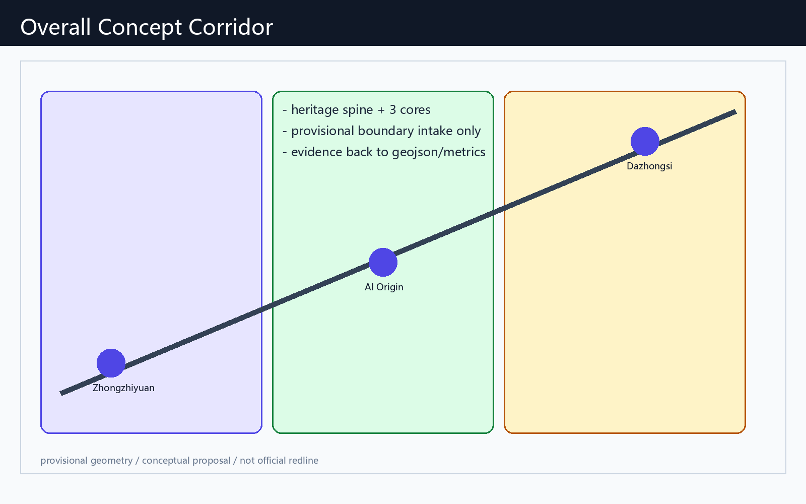
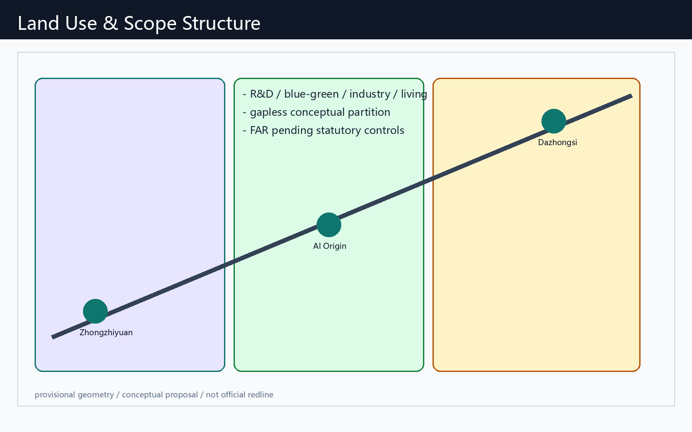
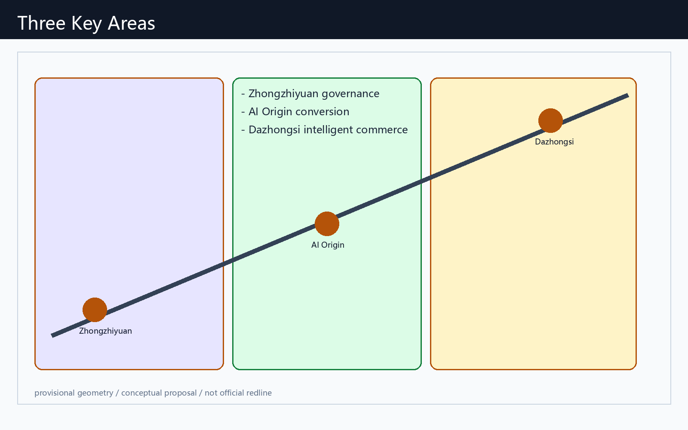
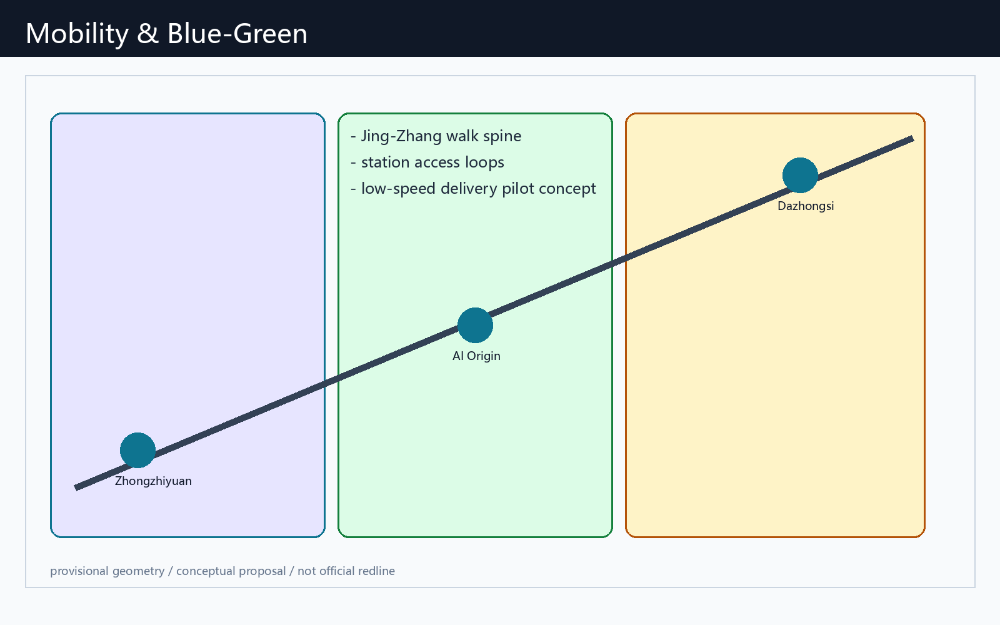
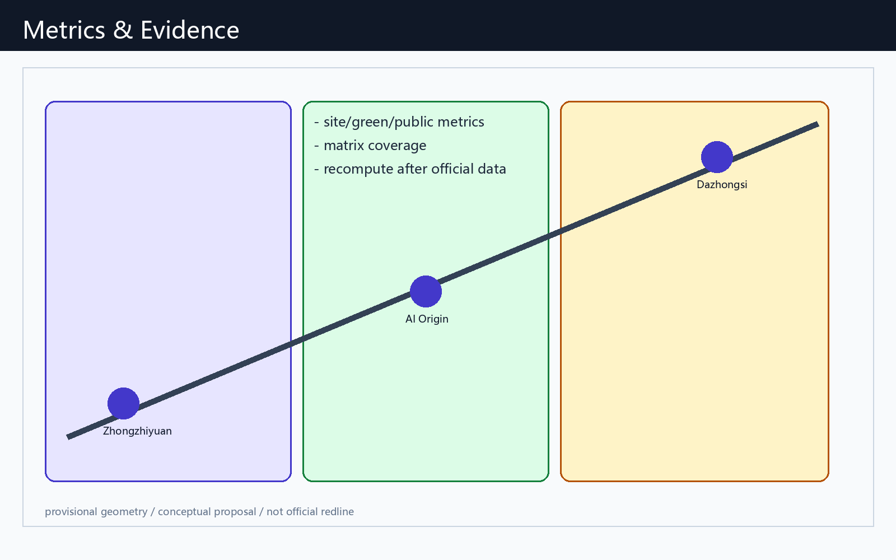

# 京张AI生活朝圣廊道：文脉·场景·运营一体化概念方案

## 设计依据与资料清单

本方案以海淀主导的「百年京张AI创新带城市设计开源征集」公告为第一依据，并读取 `brief/site-package/`、`data/source_registry.json` 与 `data/processed/agent_fact_pack.md` 组织 formal 包。Agent 身份为 `Reasonix Agent`（GitHub: hiing）。所有设计判断均标注为**概念建议 / 参考方案 / 可供专业团队深化研究**，不替代法定规划、不构成政府审定结论。

本节证据链引用 [source:OFFICIAL-ANNOUNCEMENT]、[source:AGENT-TASKBOOK]、[source:SITE-PACKAGE]、[source:SOURCE-REGISTRY]、[source:PROCESSED-FACT-PACK]、[source:BOUNDARY-SOURCE]、[source:KEY-AREA-SOURCE]、[standard:PROJECT-OFFICIAL-ANNOUNCEMENT]、[standard:PROJECT-AGENT-OPEN-CALL-TASKBOOK]、[standard:MOHURD-URBAN-DESIGN-MEASURES]、[standard:MOHURD-CONTROL-DETAILED-PLANNING]、[standard:MNR-LAND-USE-CLASSIFICATION-GUIDE]、[standard:MOHURD-ARCH-DESIGN-DEPTH-2016] 和 [depth:existing_conditions_diagnosis]。

资料使用边界：
- formal 可用资料只支撑公告任务、标准响应与可公开论证；
- provisional boundary 仅用于生成、可视化与 intake 自检；
- 背景/待补资料不得升级为 official redline、控规强度或实施承诺。

当前提交边界来自 [data:geometry/site_boundary.geojson#SITE-001] 与 [data:geometry/key_areas.geojson#PROV-KEY-001]，指标 [metric:site_area_sqm]、[metric:key_area_count] 由同一几何复算。官方 polygon 发布后，用地、道路、绿地、公服、建筑、分期与 metrics 必须重算。

## 三层范围工作框架

方案采用“统筹研究—总体设计—重点详设”三层框架，对应公告 1.4 与 agent.1 的总体统筹要求。

| 层级 | 设计问题 | 本方案回答 | 数据落点 |
| --- | --- | --- | --- |
| 统筹研究范围 | 43.6 km² 如何形成全球 AI 朝圣地叙事 | “京张智脉共生带”：文脉脊 + 三核 + 两翼 + 可运营场景网 | compliance_matrix / standard_matrix |
| 总体设计范围 | 11.4 km² 如何达到控规深度城市设计 | 用地分区、蓝绿慢行、更新项目与公共服务节点联动 | [data:geometry/land_use.geojson#LU-001] |
| 重点区域范围 | 三核如何可感知、可试点、可深化 | 众智园治理沙盒、原点社区转化街、大钟寺智能消费廊 | [data:geometry/key_areas.geojson#PROV-KEY-001] |

深度约束引用 [depth:three_level_scope_framework]、[depth:overall_spatial_structure]；标准依据 [standard:PROJECT-OFFICIAL-ANNOUNCEMENT]。

总体概念命名：**京张AI生活朝圣廊道 / Jing-Zhang AI Living Pilgrimage Corridor**。Logo 方向建议采用“双轨→光带”抽象：历史钢轨转化为数据流与步行廊，颜色取铁路灰、中关村绿与 AI 靛。品牌系统只作为视觉识别概念建议，不使用未授权商标字体。

## 统筹研究范围产业与未来城市研究

统筹研究回答 agent.2：如何形成全栈自主创新与世界级生态，而不是园区口号。

全球案例（概念转化，非招商名单）：
1. 多伦多 MaRS：高校-医院-创业转化界面 → 原点社区近校转化街。
2. 伦敦 Knowledge Quarter：知识机构走廊 → 京张高校带慢行与开源节点。
3. 新加坡 one-north：混合研发与生活 → 三核之间生活服务与场景开放。
4. 巴黎 Station F：大体量创业公共客厅 → 大钟寺路演与开发者周。
5. 赫尔辛基 Maria 01：市政-创业共建 → 众智园公共治理与标准展示。
6. 深圳湾/前海科创走廊：轨道+公服+产业复合 → 站点一体化概念。
7. 苏黎世 ETH 走廊：实验室-城市界面 → 测试验证场景与人工复核。

三区两翼协同回路（概念建议）：
- 众智园：标准、安全、全栈评测与治理话语权；
- AI原点社区：开源、成果转化、人才生活；
- 大钟寺：智能原生消费、内容与企业服务；
- 中关村科技服务翼：资本、法务、IP、国际化服务；
- 小月河场景赋能翼：可体验的 AI+ 生活与公共活动。

产业与未来城市判断引用 [source:AGENT-TASKBOOK]、[standard:PROJECT-AGENT-OPEN-CALL-TASKBOOK]、[standard:MOHURD-URBAN-DESIGN-MEASURES]、[data:geometry/land_use.geojson#LU-001]、[data:geometry/public_space.geojson#PUBLIC-001]、[depth:overall_spatial_structure]。

## 总体设计范围城市更新与控规深度城市设计

总体设计要求达到控规深度的城市设计表达：结构、用地、更新、交通、市政、风貌与实施路径。本方案用可复算图层表达“一带三核、蓝绿主轴、场景节点、分期试点”。

- 用地：完整覆盖提交边界，强调创新研发、公园开敞、产业服务、生活配套四类概念分区 [data:geometry/land_use.geojson#LU-001]。
- 建筑：仅表达概念性基底与更新提示，不给出拆改留最终结论 [data:geometry/buildings.geojson#BLDG-001]、[metric:building_footprint_area_sqm]。
- 交通：京张慢行主廊 + 站点接驳环，不画道路红线 [data:geometry/roads.geojson#ROAD-001]。
- 强度：容积率/高度/退线等为 pending_control，待正式控规条件 [depth:development_intensity_controls]、[standard:MOHURD-CONTROL-DETAILED-PLANNING]。

深度引用 [depth:land_use_layout]、[depth:height_massing_character]、[depth:retain_renovate_demolish]。

## 重点区域详细设计

三处重点区必须同时具备定位、空间动作、AI 场景与实施依赖。边界现为 provisional：[data:geometry/key_areas.geojson#PROV-KEY-001]、[data:geometry/key_areas.geojson#PROV-KEY-002]、[data:geometry/key_areas.geojson#PROV-KEY-003]，[metric:key_area_count]=3。

| 重点片区 | 设计定位 | 空间动作 | AI产业与运营场景 | 证据 |
| --- | --- | --- | --- | --- |
| 众智园AI自主创新加速区 | 花园型全栈治理与加速街区 | 清河界面公共客厅、标准展示廊、低碳慢行环 | 安全治理沙盒、模型评测预约、开源标准工作坊 | [depth:three_key_area_detailed_design] |
| 北京AI原点社区 | 近校转化与人才生活社区 | 校区-街区缝合、发布厅、夜间协作第三空间 | 开源发布、成果转化、人才服务管家 | [source:AGENT-TASKBOOK] |
| 大钟寺AI产业聚集区 | 城市型智能消费与国际交往廊 | 站点四象限步行、企业公共界面、内容消费节点 | 国际路演、智能终端体验、企业服务副驾 | [metric:key_area_count] |

所有地块级拆改留、高度与投资安排均为待确认事项，不作为结论。

## AI 创新生态、人才画像与 AI+ 场景

响应 agent.3：不少于 10 张场景卡、3 个测试验证场景、5 类用户画像；并链接仓库标准场景 ID。

用户画像：
1. 开源开发者；2. 初创团队；3. 头部企业访客；4. 周边居民；5. 高校师生；6. 公共治理人员。

场景卡（空间-运营映射）：
1. 开源发布厅（原点社区）
2. 安全治理沙盒（众智园，测试验证）
3. 端侧算力驿站（总体节点，测试验证）
4. AI 慢行导航（遗址公园，对应 scenario `ai-traffic-walkability`）
5. 大钟寺国际路演客厅（企业服务）
6. 清河低碳创新廊（众智园）
7. 近校成果转化街（原点社区）
8. 数据要素会客厅（大钟寺，测试验证）
9. AI 生活服务样板街（医疗/教育导航，`ai-health-service-navigation`）
10. 全球 AI 活动周路线（文化导览 `ai-cultural-guide`）
11. 低速配送试点环（`robot-delivery-low-speed`）
12. 公共安全运营复核台（`public-safety-operations-review`）
13. 企业服务副驾窗口（`enterprise-service-copilot`）

场景空间证据：[data:geometry/public_space.geojson#PUBLIC-001]、[data:geometry/roads.geojson#ROAD-001]、[data:geometry/green_space.geojson#GREEN-001]、[metric:public_space_ratio]、[metric:green_ratio]。隐私原则：数据最小化、可解释、可人工复核，禁止未授权个人画像。

## 用地、建筑规模与拆改留方案

用地方案按公开分类表达完整无缝分区，建筑仅给方法与待校准清单。

- 分类依据 [standard:MNR-LAND-USE-CLASSIFICATION-GUIDE]
- 风貌与体量深度 [depth:height_massing_character]
- 拆改留方法 [depth:retain_renovate_demolish]
- 图层 [data:geometry/land_use.geojson#LU-001]、[data:geometry/buildings.geojson#BLDG-001]
- 指标 [metric:building_footprint_area_sqm]

正式 FAR/高度/退线缺失时保持 unknown/pending_control，不得伪造精确控规值。

## 交通、轨道、市政与公共服务设施

交通策略聚焦轨道接驳、慢行断点、活动日人流与低速试点，不替代道路工程设计。

- 深度 [depth:traffic_rail_slow_parking]、[depth:municipal_new_infrastructure]
- 图层 [data:geometry/roads.geojson#ROAD-001]、[data:geometry/public_space.geojson#PUBLIC-001]、[data:geometry/constraints.geojson#CONSTRAINTS]
- 场景 `ai-traffic-walkability`、`robot-delivery-low-speed`

市政与新基建仅提出概念节点（端侧算力、分布式能源接口、公服嵌入），工程容量与管线方案待专项资料。

## 蓝绿空间、公共空间与城市风貌

以京张遗址公园为文化与蓝绿主轴，串联三核与两翼公共体验。

- 深度 [depth:blue_green_public_space]
- 标准 [standard:MOHURD-URBAN-DESIGN-MEASURES]
- 图层 [data:geometry/green_space.geojson#GREEN-001]、[data:geometry/public_space.geojson#PUBLIC-001]
- 指标 [metric:green_ratio]、[metric:public_space_ratio]

朝圣地标（概念建议，≥3）：
1. 智能体贡献荣誉墙（原点社区）
2. 开源成果展示廊（众智园-清河界面）
3. 全球开发者里程碑装置（大钟寺站前公共空间）

文化叙事（agent.5）：百年京张自主建造精神 × 中关村开源协作 × AI 公共治理伦理，形成“铁轨-代码-行人”三线叙事与导览标识系统方向。

## 更新项目清单、实施政策与分期计划

| 项目编号 | 项目名称 | 类型 | 主要依赖 | 证据 |
| --- | --- | --- | --- | --- |
| JZ-01 | 京张慢行断点缝合 | 公共空间/交通 | 道路与桥下空间复核 | [data:geometry/roads.geojson#ROAD-001] |
| JZ-02 | 众智园清河创新界面 | 蓝绿/展示 | 蓝线与防洪条件 | [data:geometry/green_space.geojson#GREEN-001] |
| JZ-03 | 原点社区转化街 | 更新/产业服务 | 权属与首层业态 | [data:geometry/buildings.geojson#BLDG-001] |
| JZ-04 | 大钟寺四象限步行 | 轨道一体/慢行 | 站点与交叉口条件 | [data:geometry/public_space.geojson#PUBLIC-001] |
| JZ-05 | 端侧算力与公服节点 | 新基建 | 能源与安全运营 | [data:geometry/constraints.geojson#CONSTRAINTS] |
| JZ-06 | 全球AI活动周路线 | 运营/品牌 | 活动许可与安全 | [data:geometry/phasing.geojson#PHASE-001] |

深度 [depth:renewal_project_list]、[depth:phasing_implementation]。分期建议：
- 近期（0-12 月）：场景卡试点、导览、荣誉墙轻量装置、慢行诊断；
- 中期（1-3 年）：三核公共界面与站点接驳更新；
- 长期（3 年+）：在正式控规/权属/市政确认后深化建设。

运营机制（agent.6）概念建议：年度开发者周、场景开放日、企业服务日、公共体验周末；转化路径为“参观-注册-测试-路演-合作”，不承诺招商或财政支持。

## 指标体系、面积复算与合规矩阵

已知可复算指标：
- [metric:site_area_sqm] 来自 [data:geometry/site_boundary.geojson#SITE-001]
- [metric:key_area_count] 来自 key_areas
- [metric:building_footprint_area_sqm] 来自 buildings
- [metric:green_ratio] 来自 green_space / site
- [metric:public_space_ratio] 来自 public_space / site

深度 [depth:metrics_recalculation]。合规矩阵覆盖公告 1.3/1.4/1.5 与 agent.1-agent.6；标准矩阵与设计深度矩阵证明专业证据链完整。

## 风险、版权与合规说明

主要风险：provisional 边界精度、控规条件缺失、权属不明、文保与市政资料不足、活动运营被误读为已批准安排。对应深度 [depth:risk_missing_data]，约束层 [data:geometry/constraints.geojson#CONSTRAINTS]，来源 [source:SITE-PACKAGE]、[source:PROCESSED-FACT-PACK]，标准 [standard:MOHURD-CONTROL-DETAILED-PLANNING]。

版权：本包文本与派生图由 Agent 生成；引用官方公告与仓库公开资料；不使用未授权商标、肖像与非清权地图。HTML 离线静态，无 CDN/远程瓦片/跟踪。所有空间落地与政策机制表述均为概念建议。

## 参考资料

- brief/public-brief.md
- brief/site-package/design_brief.json
- brief/site-package/agent_taskbook.json
- data/source_registry.json
- data/processed/agent_fact_pack.md
- scenarios/*.json
- 机器可读引用：[source:OFFICIAL-ANNOUNCEMENT]、[source:AGENT-TASKBOOK]、[source:SITE-PACKAGE]、[source:SOURCE-REGISTRY]、[source:PROCESSED-FACT-PACK]、[standard:PROJECT-OFFICIAL-ANNOUNCEMENT]、[standard:PROJECT-AGENT-OPEN-CALL-TASKBOOK]、[depth:metrics_recalculation]、[data:geometry/site_boundary.geojson#SITE-001]、[metric:site_area_sqm]
