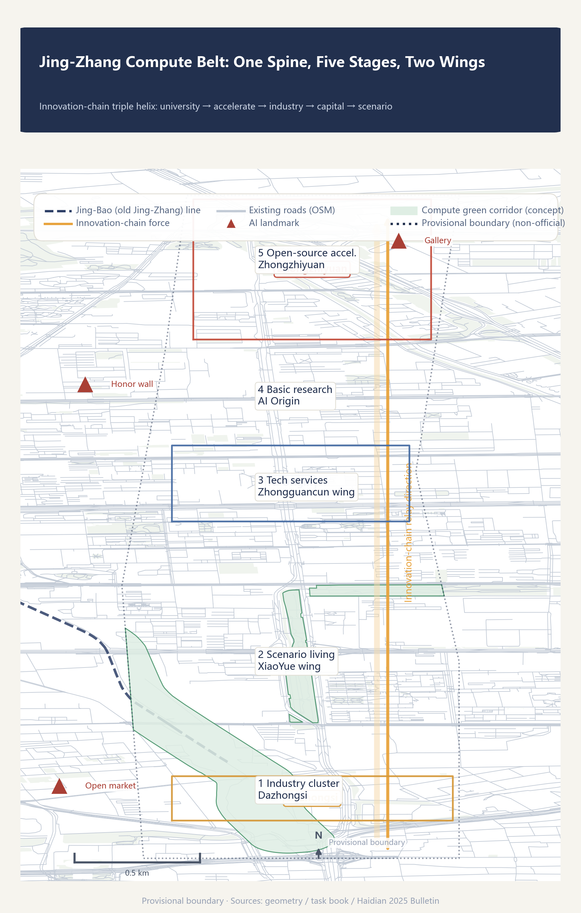
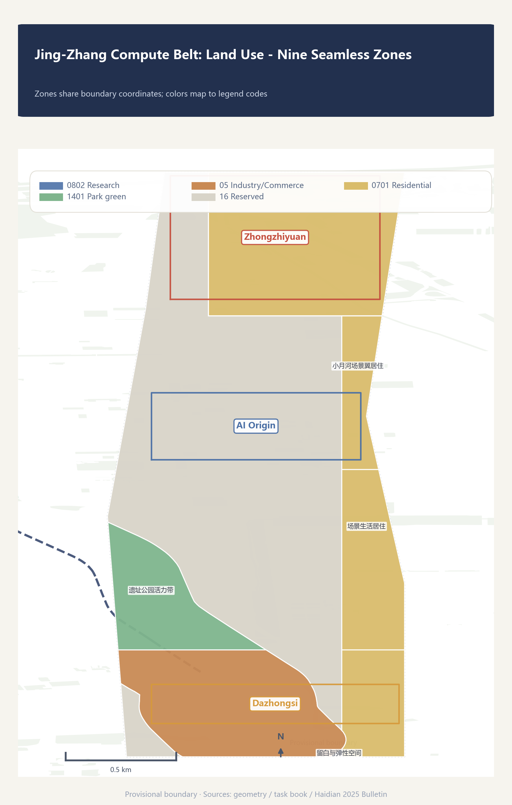
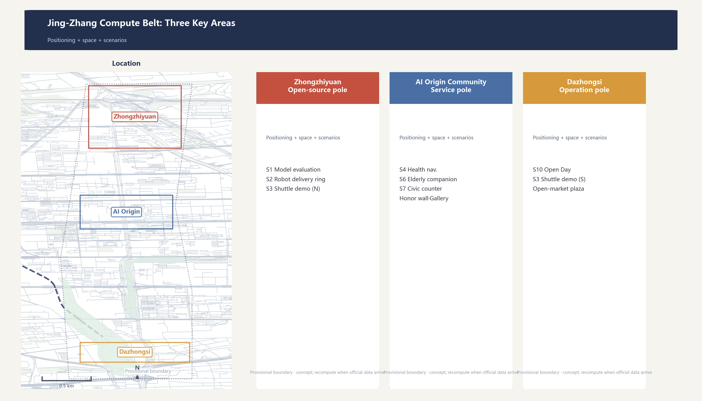
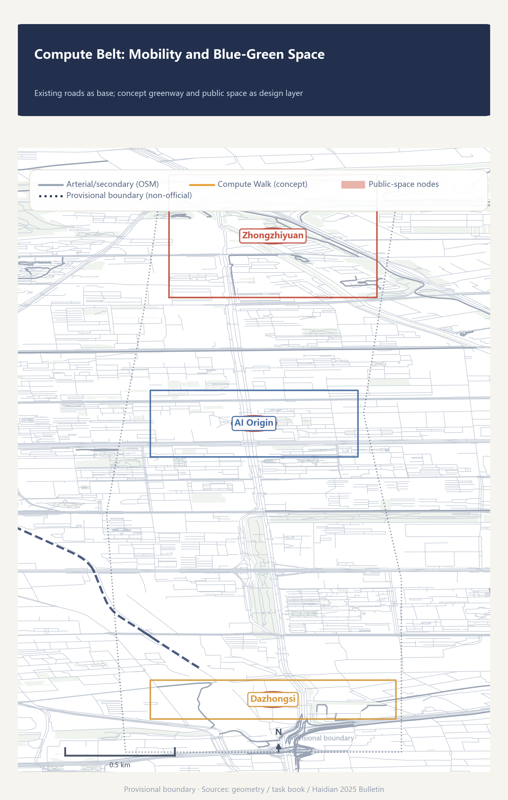
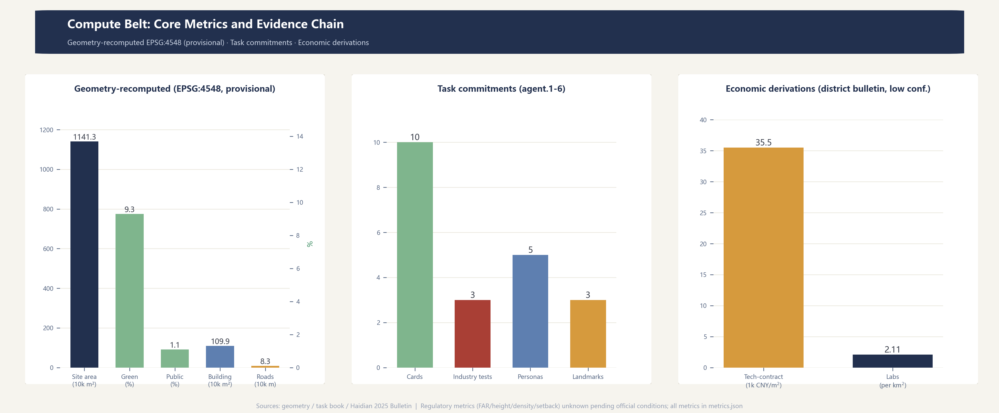

# Jing-Zhang Compute Belt

> Let the same corridor complete its second infrastructure leap.

One hundred years ago, Zhan Tianyou presided over the construction of China's first self-designed trunk railway here. Today, the corridor flanking the Jing-Zhang railway heritage park concentrates 60% of Beijing's registered large models and 17.9% of the nation's key national laboratories. This proposal defines **the corridor as an infrastructure belt of the intelligent era - the "Compute Belt"**. Rails were the infrastructure of the industrial era; compute is the infrastructure of the intelligent era. The corridor's leap from "rail belt" to "compute belt" is the second unfolding of infrastructure logic on the same land.[source:OFFICIAL-ANNOUNCEMENT] [source:GONGBAO-2025] [standard:PROJECT-OFFICIAL-ANNOUNCEMENT]

## Design Basis and Source Inventory

This proposal is based on the qualification pre-announcement, the agent-facing task book, the provisional site package boundary, the Haidian 2025 Statistical Bulletin, and OpenStreetMap public mapping. Spatial generation uses only the registered provisional rough boundaries in the repository; district-level economic data serve as background and derivation only, not parcel-level assertions.[source:OFFICIAL-ANNOUNCEMENT] [source:AGENT-TASKBOOK] [source:BOUNDARY-PROVISIONAL]; additionally, [source:GONGBAO-2025] [source:OSM-2026]

Official `SITE_BOUNDARY` and `KEY_AREA` polygons are not yet available. All locked boundaries in this proposal are marked `official_boundary=false`, `geometry_role=provisional_constraint`, `boundary_precision=provisional_rough`; they support concept generation, content review, and recomputation after replacement, but not redlines, property rights, regulatory controls, or engineering basis.[source:BOUNDARY-PROVISIONAL] [data:geometry/site_boundary.geojson#SITE-001] [depth:existing_conditions_diagnosis]

Planning-control conditions (FAR, building height, building density, green ratio, setbacks) have not been published by the organizer; `planning_limits.json` marks them `missing`. The corresponding metrics are uniformly `status=unknown` with the recomputation path stated for when official data arrives; no conceptual volume is presented as a statutory control value.[source:OFFICIAL-ANNOUNCEMENT] [metric:floor_area_ratio] [depth:development_intensity_controls]

## Three-Level Scope Framework

The three levels are threaded by one innovation-chain logic: the coordinated research area answers "how the innovation ecosystem is organized", the overall design area answers "how spatial structure carries the innovation chain", and the key areas answer "how specific scenarios land in neighborhoods".[source:OFFICIAL-ANNOUNCEMENT] [depth:three_level_scope_framework]

| Level | Area | Objective | This proposal |
| --- | --- | --- | --- |
| Coordinated research area | ~43.6 km² | Industrial ecosystem & future-city strategy | Three positionings, five functions, three-areas-two-wings loop, 8 global cases, naming system |
| Overall design area | ~11.4 km² | Urban renewal at regulatory-plan depth | Five-stage relay structure, land-use zones, blue-green public space, phasing |
| Key detailed-design area | ~3.684 km² | Detailed design of three key areas | Zhongzhiyuan validation pole, AI Origin community service pole, Dazhongsi operation pole |

Pending official polygons, this proposal uses the provisional boundary (recomputed area ~1,141.28 ha) for spatial generation and metric recalculation; once official data arrives, `site_boundary.geojson`, `key_areas.geojson` and all area-based metrics must be recomputed.[source:BOUNDARY-PROVISIONAL] [metric:site_area_sqm] [depth:metrics_recalculation]

## Coordinated Research Area: Industry and Future-City Research

### Three Positionings and Five Functions

This proposal adopts the three positionings of the task book - "centennial Jing-Zhang culture belt", "urban AI living experience belt", and "AI-integrated innovation belt" - and interprets the five functions as five continuous actions on the innovation chain: basic research (full-stack self-innovation), experimental acceleration (world-class innovation ecosystem), scenario conversion (AI+ scenario enablement), vitality hosting (intelligent AI vital city), and governance participation (AI governance voice). The five functions are not five park labels but links of one innovation chain.[source:AGENT-TASKBOOK] [standard:PROJECT-AGENT-OPEN-CALL-TASKBOOK]

### Naming System: Jing-Zhang Compute Belt

The primary name "Jing-Zhang Compute Belt" takes the triple meaning of "compute": **computing power** (infrastructure of the intelligent era), **computation** (the essence of AI), and **recomputability** (this proposal's methodology - every spatial decision is recomputable and auditable). The historical closure narrative: Zhan Tianyou built the infrastructure of the physical era (rails); today the corridor lays out the infrastructure of the intelligent era (compute); from "engineering marvel" to "compute hub", the same corridor completes two infrastructure leaps.[source:AGENT-TASKBOOK] [standard:PROJECT-OFFICIAL-ANNOUNCEMENT]

Sub-brand system: **Compute Hub** (three key areas), **Compute Corridor** (heritage park vitality belt), **Compute Walk** (cultural guide greenway), **Compute Belt Open Day** (annual event), **Open-Source Achievement Gallery** and **Agent Contribution Honor Wall** (public display system). The Logo direction combines "herringbone line x data bus": the upper part is Zhan Tianyou's herringbone track deformation, the lower part parallel data buses, forming a negative-space of the character "值" (on-duty/value); deep navy blue (auditable infrastructure), amber (on-duty/active), signal green (safe available), coral red (needs takeover/shutdown) form the palette.[source:AGENT-TASKBOOK] [depth:overall_spatial_structure]

### Three Areas and Two Wings: The Innovation Chain in Space

The three areas and two wings are not five parallel parks but the spatial mapping of five innovation-chain stages:[source:AGENT-TASKBOOK] [data:geometry/key_areas.geojson#PROV-KEY-001]

- **Beijing AI Origin Community** = basic-research stage. Colocation circle of university laboratories; "Origin" puns both the origin of AI and the spatial origin of the coordinate system.
- **Zhongzhiyuan AI Self-Innovation Acceleration Area** = open-source acceleration stage. Its naming echoes the open-source compute software stack "Zhongzhi" (the 2025 Bulletin states: "the unified open-source compute stack 'Zhongzhi' iterated and upgraded, fully shedding dependence on foreign compute stacks"; the naming connection is an inference - the Bulletin does not state it directly). Hosts pilot platforms, an open-source protocol market, and model evaluation fields.[source:GONGBAO-2025]
- **Dazhongsi AI Industry Cluster** = industrial landing stage. AI-native business formats and operation scenarios on trunk transport nodes.
- **Zhongguancun Technology Service Wing** = capital/IP/factor allocation stage (1,568 financial institutions; 405.31 billion CNY technology contract turnover as the circulation node).[source:GONGBAO-2025]
- **XiaoYue River Scenario Enablement Wing** = scenario-living stage. AI+ life services and the real user pool (3.111 million residents).[source:GONGBAO-2025]

### Global Cases: Borrow Mechanisms, Not Scale

| Case | Mechanism borrowed | Explicitly not copied |
| --- | --- | --- |
| Punggol Digital District, Singapore | Digital platform linked with real-environment trials | Centralized surveillance architecture, unexamined data scope |
| Kalasatama, Helsinki | Small-scale, time-boxed agile trials with real users; expiry-and-exit decisions | Mandatory citizen participation |
| Seoul AI Hub | Staged services: education-incubation-research-open innovation | Funding scale and policy commitments |
| The Foundry, Cambridge | Innovation district with a no-card community interface | Fixed area metrics |
| Shenzhen | AI decomposed into accountable scenario lists | Skyline, density, city-wide platform scale |
| Chongqing | Small-cut closed loops (verify-warn-classify-coordinate) | Mountainous form, internet-famous landscaping |
| Station F, Paris | Project + daily amenities for startup services | Campus scale, operating model replication |
| Hangzhou Yunqi Town | Developer community + annual event brand | Convention economy dependence |

These cases come from public institutional or project pages; they support mechanism comparison only, not local statutory space or outcome claims.[source:CASE-PUNGGOL] [source:CASE-KALASATAMA] [source:CASE-SEOUL-AI-HUB]; additionally, [source:CASE-FOUNDRY] [source:CASE-SHENZHEN] [source:CASE-CHONGQING]; additionally, [source:CASE-STATIONF] [source:CASE-YUNQI]

### Haidian's Data Base: Why This Corridor Can Be a Compute Belt

Public district data show innovation factors already agglomerating here: 123 registered large models (60% of Beijing), 92 national key laboratories (63.4% of the city, 17.9% of the nation), 405.31 billion CNY technology contract turnover (+6.5%), 188.71 billion CNY computer/communication/electronics manufacturing output (+7.7%), and information/software/IT-services investment growing 1.5x. These data are the macro evidence for the Compute Belt positioning - the corridor already hosts the densest AI factors in the city, and this proposal's spatial design gives existing agglomeration a structure.[source:GONGBAO-2025] [metric:tech_contract_strength_index] [metric:lab_density_per_research_area]

## Overall Design Area: Urban Renewal at Regulatory-Plan Urban-Design Depth

### Overall Structure: One Spine, Five Stages, Two Wings

The overall spatial structure is **one spine (heritage park vitality belt), five stages (innovation-chain relay), two wings (Zhongguancun technology service wing, XiaoYue River scenario wing)**. The heritage park belt is the physical spine and "bus" - the rail imagery converts into a data-bus imagery that threads the five stages; the stages unfold along the corridor sharing one talent pool and public-service network.[source:AGENT-TASKBOOK] [data:geometry/land_use.geojson#LU-001] [depth:overall_spatial_structure]

The land-use intention uses nine fully tiled zones (cut from the provisional boundary, sharing boundary coordinates, no gaps and no overlaps) to demonstrate that machine recomputation and functional structure agree; the zoning is a conceptual intention, not statutory parcels cut from a temporary boundary.[data:geometry/land_use.geojson] [metric:site_area_sqm] [depth:land_use_layout]

### Five-Stage Relay: Why Spatial Proximity Determines Innovation Efficiency

Economic logic: each innovation-chain stage has different proximity requirements. Basic research depends on face-to-face interaction (knowledge spillovers decay steeply with distance) and must colocate with universities; pilot and acceleration need dedicated test spaces (intermediate products); industrialization needs transport accessibility; capital/IP services need agglomeration density; scenario living needs real users. The five-stage relay is a spatial order arranged by "proximity demand" - the stages that most need close colocation sit at the corridor core, while more standardized stages are pushed to accessible nodes.[source:GONGBAO-2025] [depth:land_use_layout]

### Renewal Logic and Functional Mix

The renewal tone is "retain first, renovate second, build new as complement": the heritage park belt and existing neighborhoods are retained and activated; the three key areas use functional replacement and incremental renewal; new construction concentrates in conceptual building envelopes (11 concept volumes as key-area illustrations). Exact retain/renovate/demolish/new classifications depend on existing-building, property-rights, and engineering surveys and are listed as pending confirmation, with no parcel-level conclusions.[source:OFFICIAL-ANNOUNCEMENT] [metric:building_count] [depth:retain_renovate_demolish]; additionally, [depth:height_massing_character]

## Detailed Design of the Three Key Areas

### 1. Zhongzhiyuan: Open-Source Acceleration Pole (Validation Duty Hall)

Positioned as an open-source validation field that "proves it can stop safely before proving it can work", echoing the open-source compute stack "Zhongzhi". Spatial structure: public evaluation plaza + pilot platforms + an isolated low-speed robot test ring + an open-source protocol market. Functions: open model evaluation field (scenario card 1), low-speed delivery test ring (scenario card 2), and the northern end of the autonomous shuttle demo line (scenario card 3). Risk note: the operating phase must harden time, speed, weather, and human-supervision constraints for test scenarios; this proposal only makes a conceptual arrangement, not an engineering-feasibility conclusion.[source:AGENT-TASKBOOK] [data:geometry/key_areas.geojson#PROV-KEY-001] [depth:three_key_area_detailed_design]

### 2. Beijing AI Origin Community: Service Pole (Service Duty Hall)

Positioned as an AI public-service community interface where "services work without an app", anchored on the university laboratory colocation circle. Spatial structure: no-login human service counters + community feedback studio + cultural display nodes (Agent Contribution Honor Wall, Open-Source Achievement Gallery). Functions: AI+health navigation (scenario card 4), community elderly companion (scenario card 6), and civic service counters (scenario card 7). All services keep non-digital alternatives (paper, counters, phones); no automation of medical, legal, or administrative decisions - only information navigation, material prompts, and human referral.[source:AGENT-TASKBOOK] [data:geometry/key_areas.geojson#PROV-KEY-002] [depth:three_key_area_detailed_design]

### 3. Dazhongsi: Operation Pole (Operation Duty Hall)

Positioned as the standing home of the Compute Belt Open Day and an AI-native business operation node on the accessibility of the Dazhongsi transport hub. Spatial structure: AI-native mixed-use complex + compute open-market plaza + developer community space. Functions: Compute Belt Open Day (scenario card 10), the southern end of the autonomous shuttle demo line (scenario card 3), and the home of the annual event system. Risk note: the industry-residential mix ratio and parking/freight organization depend on regulatory-plan and transport data and are listed as pending confirmation.[source:AGENT-TASKBOOK] [data:geometry/key_areas.geojson#PROV-KEY-003] [depth:three_key_area_detailed_design]

## AI Innovation Ecosystem, Talent Profiles, and AI+ Scenarios

### Five User Personas

1. **Startup AI engineer (28)**: resident of a Zhongzhiyuan incubator, needs evaluation stations, pilot rings, an open-source protocol market, and 24-hour open workspaces.
2. **University researcher (35)**: member of an Origin Community laboratory, needs colocation exchange space, data sandboxes, and achievement display nodes.
3. **Cross-border developer (30)**: digital nomad, needs multilingual interfaces, international events, and long-hour open space.
4. **Community elder (70)**: XiaoYue River resident, needs no-login human services and fully non-digital alternatives.
5. **School-family**: college-district residents, need AI education space and safe public grounds.

The five personas map to five space-and-service demands, linked to scenario cards and spatial layers; personas are inferred from public population structure (33% migrant population) and facility bases (183 primary/secondary schools, 239 community health centers), not from field research.[source:GONGBAO-2025] [metric:persona_count]

### Ten AI Scenario Cards

Every scenario card fills a six-item duty table: service hours, data boundary, accountable person, non-digital alternative, shutdown threshold, recovery and maintenance.[source:AGENT-TASKBOOK] [standard:GENERATIVE-AI-INTERIM-MEASURES] [metric:scenario_card_count]

| # | Scenario | Location | Type | Served |
| --- | --- | --- | --- | --- |
| 1 | Open model evaluation field | Zhongzhiyuan | **Industry test** | Startup engineers |
| 2 | Low-speed robot delivery test ring | Zhongzhiyuan | **Industry test** | Startup engineers/community |
| 3 | Autonomous shuttle demo line | Corridor-Dazhongsi | **Industry test** | Commuters |
| 4 | AI+health service navigation | XiaoYue River wing | Life service | Community elders |
| 5 | AI+adaptive education classroom | College district | Education | School families |
| 6 | AI+community elderly companion | Origin Community | Community service | Community elders |
| 7 | AI+civic service counter | Zhongguancun wing | Public service | Enterprises/residents |
| 8 | Compute Walk cultural guide | Heritage park belt | Culture & tourism | Visitors/residents |
| 9 | Contribution honor wall + achievement gallery | Origin Community | Cultural landmark | Developers/public |
| 10 | Compute Belt Open Day - developer community | Dazhongsi | Operation event | Developers/public |

All three industry-test scenarios (1-3) set a "shutdown threshold": precision degradation, environmental excursion, abnormal complaints, or equipment faults trigger automatic degradation, isolation, or offline; test hours are separated from public hours and the public is not included in tests by default.[source:AGENT-TASKBOOK] [standard:GENERATIVE-AI-INTERIM-MEASURES] [metric:industry_test_scenario_count]

**Six-item duty table template** (fully filled for scenario card 1, "Open model evaluation field"):

| Duty item | Content |
| --- | --- |
| Service hours | Weekdays 10:00-18:00 evaluation field open; nights reserved for scheduled controlled evaluations |
| Data boundary | Only submitter-declared public model information is displayed; evaluation data retained 90 days, deletable |
| Accountable person | On-duty evaluator + escalation contact + 30-minute response deadline |
| Non-digital alternative | Manual registration desk, paper benchmark brochure, phone consultation |
| Shutdown threshold | Precision anomaly, evaluation-environment excursion, abnormal complaint, or equipment fault triggers shutdown |
| Recovery and maintenance | Work order, version, cause, and human review records before recovery |

The remaining nine cards follow the same template, detailed at the operation stage; the main text does not expand each one.[source:AGENT-TASKBOOK] [standard:GENERATIVE-AI-INTERIM-MEASURES]

Accessibility and elder-friendly requirements run through all scenarios: public interfaces keep no-login human service paths and continuous accessible design, in line with the barrier-free environment law and the convenience requirements for elderly smart-technology use; no AI service introduction may come at the cost of accessibility for vulnerable groups.[standard:BARRIER-FREE-ENVIRONMENT-LAW] [standard:ELDERLY-SMART-TECH-PLAN-2020-45]

## Land Use, Building Scale, and Retain/Renovate/Demolish/New

The land-use layout covers nine tiled zones (research 0802, education-research 0802, industry-commerce 05, residential 0701, green 1401, reserved 16); every zone area is recomputable from `geometry/land_use.geojson`. Concept building envelopes total 11 (footprint ~1.099 million m², all conceptual illustrations, not existing or approved buildings).[data:geometry/land_use.geojson] [data:geometry/buildings.geojson] [metric:building_footprint_area_sqm]; additionally, [depth:land_use_layout]

Regulatory-plan metrics (FAR, height, density, setback) are all `status=unknown`: the organizer has not published regulatory-plan conditions, so any number would be fabricated; once official controls arrive, the concept volumes can be recalibrated by formula.[metric:floor_area_ratio] [metric:building_height_m] [depth:development_intensity_controls]

## Transport, Rail, Municipal, and Public Service Facilities

Transport is organized on the existing road network (OSM arterial/secondary roads as the skeleton, total network length ~83 km) plus a new concept greenway - the "Compute Walk" along the Jing-Bao (old Jing-Zhang) line - as the slow-traffic spine; each key area sets a rail-station integration node (concept lines pending rail-specific data).[source:OSM-2026] [data:geometry/roads.geojson] [metric:road_network_length_m]; additionally, [metric:greenway_length_m] [depth:traffic_rail_slow_parking]

Municipal and new infrastructure: this proposal outlines a concept direction of "edge compute + distributed energy + conventional municipal integration" (inference nodes embedded in public space; cooling/heating integrated with compute waste heat). This is directional advice pending municipal surveys and is listed as pending confirmation.[source:AGENT-TASKBOOK] [depth:municipal_new_infrastructure]

## Blue-Green Space, Public Space, and Urban Character

### Compute Green Corridor: Heritage Park Vitality Belt

Anchored on the Jing-Zhang railway heritage park (mapped in OSM), a concept green corridor runs along the Jing-Bao line (green space ~1.063 million m², green ratio ~9.3%, concept value), threading the Yuan Dynasty Capital city-wall ruins park, Dongsheng Bajia suburban park, and XiaoYue River waterfront into a "rail green spine + blue-green branches" public-space network.[source:OSM-2026] [data:geometry/green_space.geojson] [metric:green_ratio]; additionally, [metric:green_space_area_sqm] [depth:blue_green_public_space]

### Three AI Pilgrimage Landmarks

1. **Agent Contribution Honor Wall** (Origin Community): a permanent commemorative system inscribing the Agents and contributors of the co-creation; the stele updates annually, echoing the "memorable contribution" charter.[source:AGENT-TASKBOOK]
2. **Open-Source Achievement Gallery** (Zhongzhiyuan): along the public evaluation plaza, displaying open-source models, open benchmarks, and developer achievements.
3. **Compute Open-Market Plaza** (Dazhongsi): the standing home of the annual Compute Belt Open Day - developer bazaars and protocol-signing space.

All three landmarks are conceptual, not approved construction; people and enterprise marks require rights clearance before fabrication.[source:AGENT-TASKBOOK] [metric:ai_landmark_count] [depth:blue_green_public_space]

## Renewal Project List, Implementation Policy, and Phasing

### Three Phases

- **Phase 1 - Origin Community and heritage core** (corridor core north of ~39.982°N): honor wall, service counters, first green-corridor segment - "prove services trustworthy first".
- **Phase 2 - Zhongzhiyuan and the north**: evaluation fields, test rings, open-source protocol market - "then prove trials controllable".
- **Phase 3 - Dazhongsi and the southern wings**: complex, open market, wing scenarios - "finally prove operations sustainable".

The phasing logic is "trustworthy - controllable - sustainable", matched to the maturity of the five-stage relay; phase areas are in `geometry/phasing.geojson`.[source:AGENT-TASKBOOK] [data:geometry/phasing.geojson] [metric:renewal_project_count]; additionally, [metric:phased_area_sqm] [depth:phasing_implementation]

### Global AI Innovation Event System and Long-Term Operations

This proposal introduces the "Compute Belt Open Day" annual event brand (open-source protocol market + hackathon + achievement display + developer community operations) with quarterly developer workshops and a public experience route. All events, recruitment, funding, policy, and operation arrangements are conceptual suggestions or deepening directions, not stated as confirmed government arrangements.[source:AGENT-TASKBOOK] [depth:renewal_project_list]

## Indicator System, Area Recalculation, and Compliance Matrix

Core indicators fall into three classes: **geometry-recomputed** (site area 1,141.28 ha, green ratio 9.3%, public-space ratio 1.1%, building footprint 1.099 million m², road network 83 km - all recomputed from GeoJSON in EPSG:4548); **task-commitment** (10 scenario cards, 3 industry tests, 5 personas, 3 AI landmarks - aligned with the task book's hard requirements); **economic-derivation** (technology-contract intensity 35,513 CNY/m², laboratory density 2.11/km² - district-bulletin derivations, low confidence).[source:GONGBAO-2025] [metric:site_area_sqm] [metric:green_ratio]; additionally, [metric:public_space_ratio] [metric:tech_contract_strength_index] [metric:lab_density_per_research_area]; additionally, [depth:metrics_recalculation]

Full sources, formulas, confidence, and assumptions live in `metrics.json`; task coverage in `compliance_matrix.json`; standard coverage in `standard_matrix.json`; design-depth evidence in `design_depth_matrix.json`.

## Risks, Copyright, and Compliance

- **Data boundary**: only public or cleared materials are used; no non-public planning maps, internal indicators, or personal privacy information.[source:SOURCE-REGISTRY]
- **Provisional boundary**: all geometry is provisional_rough - not for redlines, regulatory controls, approvals, or engineering basis; recomputation is required when official data arrive.[source:BOUNDARY-PROVISIONAL]
- **Concept status**: all spatial landing suggestions are conceptual suggestions, reference schemes, or material for professional teams to deepen; they do not constitute government-approved conclusions or implementation commitments.
- **"Zhongzhi" anchor**: the naming connection between the "Zhongzhi" compute stack and "Zhongzhiyuan" is an inference (the Bulletin does not state it directly) and is phrased as "naming echo".
- **AI-generated disclosure**: this proposal was generated by Claude Code (an AI Agent); sources and generation methods are in `report/copyright_statement.md`; generated imagery/media are interpretive layers only and do not impersonate on-site conditions, resident opinions, official boundaries, or measured data.
- **Missing data**: official polygons, regulatory-plan conditions, existing buildings and property rights, municipal surveys, rail data - each is listed in the gap registry of `sources.json`.[depth:risk_missing_data]

## References

1. Haidian Branch, Beijing Municipal Commission of Planning and Natural Resources: "Centennial Jing-Zhang AI Innovation Belt Urban Design International Open Call - Qualification Pre-Announcement", 2026-05-09.[source:OFFICIAL-ANNOUNCEMENT]
2. "Open Call for Global Agents: Centennial Jing-Zhang AI Innovation Belt Urban Design" task book excerpt (user-provided cleared material), 2026-05-18.
3. Haidian Statistics Bureau: "Haidian District 2025 National Economic and Social Development Statistical Bulletin", published 2026-04-10.[source:GONGBAO-2025]
4. Ministry of Housing and Urban-Rural Development: "Urban Design Measures", 2017.
5. Ministry of Housing and Urban-Rural Development: "Regulatory Detailed Plan Compilation and Approval Measures", 2011.
6. Ministry of Natural Resources: "Land Use and Sea Classification Guide for Territorial Spatial Survey, Planning, and Use Control", 2023.
7. Cyberspace Administration of China et al.: "Interim Measures for the Management of Generative AI Services", 2023.
8. OpenStreetMap (ODbL): rail/road/green/water mapping of the Haidian Jing-Zhang corridor, fetched 2026-08-11.
9. Open-source compute software stack "Zhongzhi": disclosed in the "Science & Technology" section of the Haidian 2025 Statistical Bulletin, 2026.
