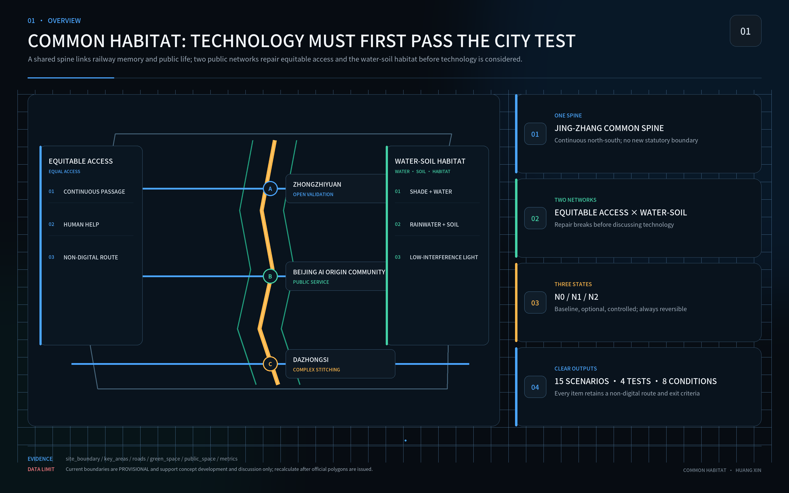
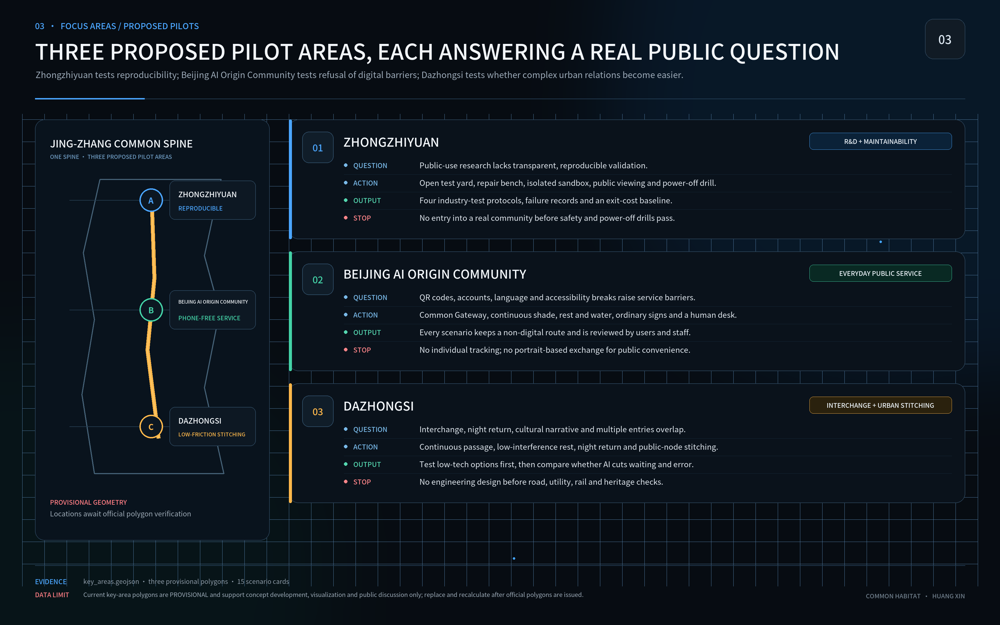

# Common Habitat

## Human–AI–Nature Urban Design for the Centennial Jingzhang Corridor

Author: Huang Xin — GitHub [@huangxin-design](https://github.com/huangxin-design)

This proposal judges urban performance by one question: can people of different ages, bodies, languages, care duties and digital experience independently arrive, orient, rest, participate, get help and return safely? This submission contains a design goal, a test protocol and a pilot proposal. It does not claim measured performance, construction approval, committed funding or operating authority.

The proposal forms a One-Day Common Loop along the Jingzhang heritage and innovation corridor. Continuous access, shade, drinking water, stormwater management, habitat, ordinary signage and human service form the public baseline. Optional AI addresses only the remaining gap, and only when an equivalent non-digital route, accountable maintenance, data limits, energy accounting, human takeover and physical removal are all credible. If a low-tech approach achieves the same public result, AI is not introduced.

## Design Basis and Source List

The official public brief and Agent Taskbook govern the work scope: an approximately 43.6 km² coordinated research area, an approximately 11.4 km² overall design area and three key areas totalling approximately 368.4 ha. Current GeoJSON boundaries are provisional and support concept generation, visualisation and topology checks only. They cannot support a statutory red line, precise area, permit or engineering conclusion. [source:OFFICIAL-ANNOUNCEMENT] [source:SITE-PACKAGE]

Chinese planning, urban-design and accessibility references frame professional depth. International sources calibrate inclusion, child-friendly and age-friendly practice, ecology and AI ethics. International alignment is not certification; policy context is not proof of local implementation. Official attachments, surveys and professional review remain mandatory before engineering decisions. [standard:MOHURD-URBAN-DESIGN-MEASURES] [source:CN-ACCESSIBILITY-LAW]

Nine material datasets still require official confirmation: boundaries, key-area polygons, regulatory controls, ownership and existing buildings, transport counts, municipal capacity, seasonal ecology, heritage controls and operating authority. Missing data does not block concept review, but it blocks statutory, engineering, investment and performance claims. [depth:existing_conditions_diagnosis] [source:BOUNDARY-SOURCE]

## Three-Level Scope Framework

The coordinated level asks how the Jingzhang corridor can operate as an open validation network for public problems. The overall level joins the heritage spine, walking, public services, blue-green systems and renewal projects. The key-area level tests whether a person can complete a real journey through entrances, paths, places to rest and help points. All three levels use the same six-task evidence model. [depth:three_level_scope_framework] [metric:site_area_sqm]

The spatial structure is one spine, two networks and three proposed pilot areas. The Jingzhang Common Spine is supported by an Equitable Access Network and a Water–Soil–Habitat Network. The three proposed pilot areas are Zhongzhiyuan, Beijing AI Origin Community and Dazhongsi, testing maintainability, phone-free public service, and complex interchange and night return respectively. Their locations and boundaries remain provisional and must be recalculated when official polygons arrive. [data:geometry/key_areas.geojson#PROV-KEY-001] [metric:key_area_count]

## Coordinated Research Area: Industry and Future City Research

The corridor is proposed as an openly auditable urban testing process. Enterprises, researchers and public bodies would define real urban tasks and compare a zero-AI baseline, a low-tech solution and an optional AI solution at the same location. Public-interest safeguards become design inputs, test conditions and procurement evidence, reducing the risk of deploying a compelling demonstration that cannot be maintained, explained or removed. [source:AGENT-TASKBOOK] [depth:overall_spatial_structure]

A City Test Passport structures the pathway: problem registration, three-way comparison, isolated verification, shadow operation, limited public trial, independent recalculation, and either procurement discussion or exit. Each gate publishes versions, errors, energy, human takeover, least-served-group results and unresolved issues. Enterprises gain reusable task definitions, open interfaces, a shared testing space and a record of unsuccessful trials; participation alone conveys no procurement preference, certification or partnership.

Industry validation begins with four cross-cutting tests: low-energy edge sensing, a robot shared-space safety sandbox, public-service-agent reliability and red-teaming, and AI energy and exit cost. These tests support accessible mobility, public-service navigation, low-interference cultural guidance, enterprise-service coordination and public-safety review. If ordinary signage, telephone or human service performs better, “do not procure AI” is a legitimate and useful result. [source:INT-UNESCO-AI-ETHICS] [metric:industry_test_count]

## Overall Design Area: Urban Renewal and Regulatory-Plan-Level Urban Design

The One-Day Common Loop connects rail stations, public services, places to rest, weather protection, drinking water, toilets, cultural spaces and human help. Ordinary signage and continuous accessibility define the base version. A removable digital layer may add live information or translation after the baseline works. [depth:overall_spatial_structure] [data:geometry/roads.geojson#ROAD-001]

Official regulatory controls, road red lines, building heights, plot ratios and utility information remain incomplete. The proposal therefore sets a decision order—retain, repair, replace, then trial—without inventing statutory indicators. All current ratios remain provisional calculations with explicit sources, formulas, coordinate status and provisional labels. [standard:MOHURD-CONTROL-DETAILED-PLANNING] [metric:floor_area_ratio]

## Detailed Design of Key Areas

Zhongzhiyuan hosts maintainability and research verification through an open test yard, repair bench, isolated sandbox, records of unsuccessful trials and outage drills. Beijing AI Origin Community hosts ordinary public life through a Common Gateway, continuous shade, rest and water, non-digital signage, a human service desk and six offline information formats. Dazhongsi addresses interchange, night return, culture and complex entrance relationships. [depth:three_key_area_detailed_design] [source:KEY-AREA-SOURCE]

Each area uses the same design card: intended users, six tasks, spatial action, zero-AI route, optional technology, physical location, maintainer, test method, stop condition and restoration action. All placements remain conceptual until boundaries, ownership and operating rights are confirmed.

## AI Innovation Ecosystem, Personas, and AI+ Scenarios

Recruitment does not assume an average user. Eight capability conditions cover mobility and stamina; vision and colour; hearing and speech; reading and cognitive load; device and digital experience; heat, noise and crowding; care duties; and time or night conditions. A participant may occupy several conditions. Results are published by intersections; an unrepresented high-risk intersection is explicitly marked as missing evidence and cannot pass the gate. [source:INT-UN-CRPD9] [metric:capability_condition_count]

The 90-Day Pioneer Pilot is proposed for one verifiable section of a public-life loop in Beijing AI Origin Community, subject to operator and professional confirmation. Days 0–15 record boundaries, responsibility, existing conditions and six-task baselines. Days 16–30 co-design zero-AI, low-tech and optional-AI candidates. Days 31–60 repeat tests by capability condition and publish unsuccessful trials and maintenance hours. Days 61–75 apply controlled AI shadow testing only to remaining gaps while basic service continues. Days 76–90 complete network, power and removal drills, independently recalculate the evidence, and recommend continuation, modification, reduction or exit.

By day 90, the pilot must deliver: a defect ledger, a zero-AI public baseline, three reversible interventions, a six-format offline guide plan, task-test records, a three-year cost account, maintenance and emergency responsibilities, procurement acceptance clauses and an open evidence pack. The three interventions focus on the Common Gateway and continuous access, human service and multi-format information, and optional route, translation or status assistance. Evidence determines whether AI is used.

## Land Use, Building Scale, and Retain-Renovate-Demolish Strategy

Current land-use and building data explain spatial relationships and recalculation methods; they do not replace official codes, title records, surveys or structural assessment. The sequence protects public-service and heritage continuity, repairs interruptions, and considers new construction last. Permanent work must wait for official boundary, planning, heritage, municipal and structural information. [standard:MNR-LAND-USE-CLASSIFICATION-GUIDE] [data:geometry/land_use.geojson#LU-001]

The 90-day pilot is limited to reversible, low-impact and maintainable components: temporary shade and seating, tactile and large-print signs, a human-service desk, and removable sensors or screens. It may not remove existing public service, occupy emergency routes, alter statutory use or create a compulsory digital entrance. [metric:building_footprint_area_sqm]

## Transport, Rail, Municipal Infrastructure, and Public Services

Transport and services are derived from the six tasks. Every test route needs an accessible entrance, continuous passage, legible landmarks, rest and weather protection, information on water and toilets, human help, night lighting and a safe return. Rail and bus relationships require field verification; the current road-centreline length is only a concept-comparison metric. [data:geometry/roads.geojson#ROAD-001] [metric:road_centerline_length_m]

Basic public service does not require a smartphone, account, identity recognition or AI fluency. The offline plan includes Braille plus a tactile route map, large-print high contrast, child easy-read, older-adult easy-read, audio, and telephone plus on-site human explanation. All six are planned and not yet delivered. QR is supplementary only, and each format must be co-created and tested with its intended users. [source:CN-BRAILLE-LAYOUT-44725-2024] [source:CN-ACCESSIBILITY-LAW]

## Blue-Green Network, Public Space, and Urban Character

The Water–Soil–Habitat Network measures shade, stormwater, soil, native planting, habitat continuity, darkness and maintenance work together. Shade, drinking water and rest support older people, children, persons with disabilities, carers and night workers while providing basic heat and extreme-weather resilience. [source:INT-UNEP-NBS] [depth:blue_green_public_space]

Ecological release requires at least one complete growing season with records of survival, soil compaction, ponding, heat exposure, night disturbance, maintenance frequency and failure. The AI resource account includes electricity, network and storage, device replacement, repair labour, spares and retirement. Expansion stops when ecology worsens, measurement fails or burden shifts to the least-served group. [metric:green_ratio] [data:geometry/green_space.geojson#GREEN-001]

## Renewal Projects, Implementation Policy, and Phasing

Eight actions organise delivery: the One-Day Common Loop, Common Gateway, continuous shade and rest, human service and multi-format information, water and soil repair, low-interference cultural nodes, a trusted urban validation field, and the Jingzhang Open Ledger. Every action records an owner role, prerequisite data, zero-AI version, test group, maintenance resources, stop condition and restoration action. [metric:renewal_project_count] [data:geometry/phasing.geojson#PHASE-001]

Ninety days produces a pioneer-pilot result and a recommendation on whether to enter procurement discussion. It is not a procurement decision or corridor-wide construction. G0 accepts the non-digital baseline; G1 permits a small optional service; G2 permits only isolated or controlled verification. Each gate requires both professional review and affected-user confirmation. Missing critical participants, a red-line event, or interrupted budget and contract automatically returns service to N0.

Required roles are a site owner, public-service owner, accessibility and co-design lead, ecology lead, data and safety lead, and independent reviewer. Names, mandates, funding and long-term maintenance contracts are not yet confirmed and must be secured before construction or a limited public trial.

## Metrics, Area Recalculation, and Compliance Matrix

Metrics distinguish known facts, provisional recalculations, proposal targets and missing data. Current package geometry recalculates approximately 11.41 km² of site, 10.96% green ratio and 4.03% public-space ratio. These figures prove internal traceability only; they are not official current conditions or commitments. [metric:site_area_sqm] [metric:green_ratio] [metric:public_space_ratio]

Pilot admission first checks two public-service baselines: 100% non-digital coverage for critical services and zero new identity-recognition features. [metric:non_digital_service_coverage_target] [metric:new_identity_recognition_features_target]

Two further gates test exit and safety: zero minutes of basic-service interruption after planned AI removal and zero tolerance for rights, safety or ecological red-line events. Results are published by eight capability conditions and intersections, with the least-served and best-performing observed groups shown together. [metric:ai_removal_service_interruption_target_minutes] [metric:red_line_incident_tolerance_count]

AI advances only when it produces a perceptible improvement over both N0 and low-tech versions, repeats under independent testing, fits a three-year cost and maintenance envelope, and does not worsen the least-served group, ecology or human workload. If low tech reaches the target, if the AI result cannot be independently recalculated, or if the exit drill fails, AI is not adopted.

## Risk, Copyright, and Compliance

Principal risks are provisional geometry being mistaken for statutory control, targets being mistaken for achieved results, missing participants in critical capability conditions, AI demonstrations replacing basic services, child-data overreach, hidden energy and maintenance costs, vendor lock-in, decorative ecology and absent owners. Every risk is paired with counter-evidence, a stop action and an accountable role. Negative findings remain in the open record. [source:INT-UNESCO-AI-ETHICS] [depth:risk_missing_data]

Child-facing scenarios default to no collection of identity, biometrics, precise location, raw voice, identifiable work or long-term profiles. Any breach stops the trial. Braille requires professional transcription, independent proofreading by two qualified people, and testing with blind users; tactile route maps require separate orientation review. The guide plan, pilot targets and international alignment are not certificates, compliance opinions or completed deliverables.

This work participates in the Haidian-led open call for the Centennial Jingzhang AI Innovation Belt. It is a competition concept, not a formal plan, government approval, investment promise, procurement decision, engineering conclusion or operating authorisation. Original text and graphics follow the package licence; third-party sources are cited without implying permission to redistribute their pages, imagery or marks.

## References

The official task, site package, source registry and local standard snapshots form the primary evidence layer. UN, WHO, UNESCO, W3C and UNEP materials calibrate methods. The complete source record, permitted uses, prohibited uses, access dates and local paths are in `sources.json`; professional mapping is in `standard_matrix.json` and `design_depth_matrix.json`. [source:SOURCE-REGISTRY] [source:PROCESSED-FACT-PACK]

Spatial data are in `geometry/`, metrics in `metrics.json`, assumptions and gaps in `assumptions.json`, required tasks in `compliance_matrix.json`, and validation in `self_check.json`. These structured files are the audit and recalculation layer; the narrative keeps only evidence anchors necessary for human decisions.
