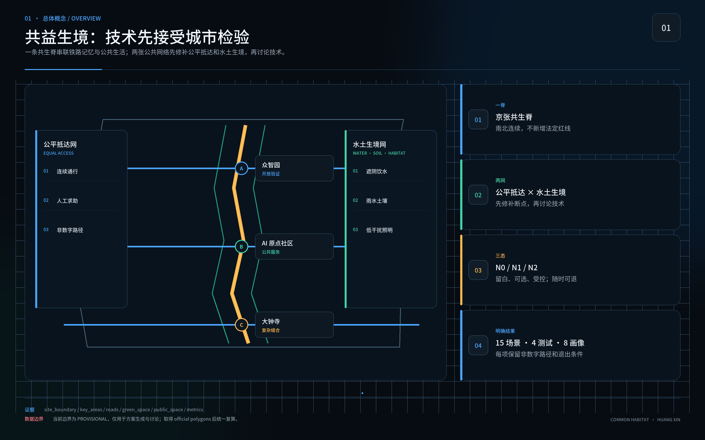
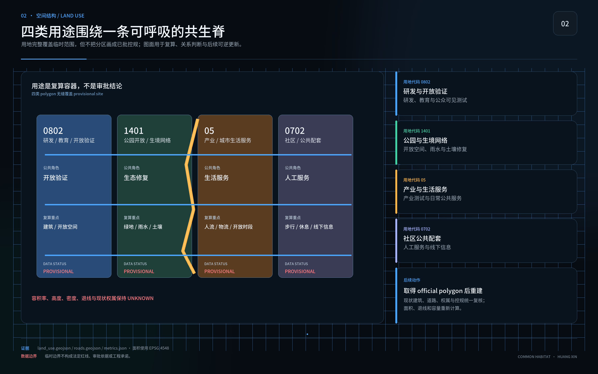

# 共益生境

## 百年京张人—AI—自然共生城市设计 / COMMON HABITAT

作者 / AUTHOR：黄鑫（GitHub [@huangxin-design](https://github.com/huangxin-design)）

本方案只用一个问题判断城市是否有效：无论年龄、身体能力、语言、照护负担或数字经验，每个人是否都能独立完成抵达、识路、休息、参与、求助和安全返程？目前提交的是设计目标、测试协议和试点建议；现场表现、实施主体、建设资金与正式审批均待后续确认。

方案沿京张遗产与创新带组织“一日共益环”：公共底盘先补连续通行、遮阴、饮水、雨水、生境、普通导视和人工服务；可选 AI 只处理仍未解决的缺口。每项技术都要回答受益人、非数字等价路径、维护责任、数据边界、能耗、停机接管与撤除恢复。低技术方案达到同等结果时，不引入 AI。

## 设计依据与资料清单

工作范围以官方公开任务与智能体任务书为主控：统筹研究范围约 43.6 平方公里，总体设计范围约 11.4 平方公里，三处重点区域合计约 368.4 公顷。当前 GeoJSON 为临时粗略边界，只支持概念生成、可视化和拓扑自检，不支持红线、精确面积、许可或工程结论。[source:OFFICIAL-ANNOUNCEMENT] [source:SITE-PACKAGE]

国内专业依据用于约束城市设计、控规衔接、无障碍服务和用地表达；国际资料用于校准包容、公平、儿童友好、老龄友好、生态和 AI 伦理。国际对齐不等于认证，政策背景不等于本地已实施事实；正式工程阶段仍需官方附件、现状测绘和专业审查。[standard:MOHURD-URBAN-DESIGN-MEASURES] [source:CN-ACCESSIBILITY-LAW]

九类关键资料仍待正式补齐：官方边界、重点区多边形边界、控规条件、权属与现状建筑、交通实测、市政容量、四季生态、文保控制和运营授权。缺资料不阻断概念评审，却会阻断法定、工程、投资和绩效结论。[depth:existing_conditions_diagnosis] [source:BOUNDARY-SOURCE]

## 三层范围工作框架

统筹层回答京张创新带如何形成面向公共问题的开放验证网络；总体层回答遗产轴线、慢行、公共服务、蓝绿系统和更新项目如何协同；重点区层回答人在真实入口、路径、停留和求助过程中能否完成一天。三层使用同一套六任务证据，避免区域叙事与现场体验脱节。[depth:three_level_scope_framework] [metric:site_area_sqm]

空间结构概括为“一脊、两网、三处建议试点区”。一脊是京张共生脊；两网是公平抵达网与水土生境网；三处建议试点区分别是众智园、北京 AI 原点社区和大钟寺，依次验证研发与可维护性、无手机公共服务、复杂换乘与夜间返程。位置和边界均为临时建议，官方多边形边界到位后必须统一复算。[data:geometry/key_areas.geojson#PROV-KEY-001] [metric:key_area_count]

## 统筹研究范围产业与未来城市研究

京张创新带需要一套可公开核验的城市试验机制：企业、研究团队和公共部门围绕真实城市任务共同定义问题，在同一地点比较 N0 零 AI、低技术方案和可选 AI 方案。公共利益规则直接转化为研发输入、测试条件和采购证据，减少展示成功却无法维护、无法解释、无法退出的部署风险。[source:AGENT-TASKBOOK] [depth:overall_spatial_structure]

建议建立“城市测试护照”：问题登记 → N0/低技术/AI 三案比较 → 隔离验证 → 影子运行 → 限量公众试用 → 独立复算 → 采购讨论或退出。每一关发布版本、错误、能耗、人工接管、最少获得服务的观察组结果和未解决问题；企业可以获得可复用的任务定义、开放接口、试验空间和未通过记录，但不会因参赛文本自动获得采购、认证或合作资格。

产业验证先从四项横向测试开始：低能耗端侧感知、机器人共享空间安全沙盒、公共服务智能体可靠性与红队、AI 能源与退出成本。这四项测试服务于无障碍交通、公共服务导航、低干扰文化导览，以及企业服务协同和公共安全复核。场景只在问题和责任人明确后进入；若普通导视、电话或人工服务更可靠，测试护照会记录“不采购 AI”作为有效结论。[source:INT-UNESCO-AI-ETHICS] [metric:industry_test_count]

## 总体设计范围城市更新与控规深度城市设计

总体设计把京张铁路记忆、公共生活和自然过程叠合为连续的“一日共益环”。环线优先连接轨道站点、公共服务、休息节点、避雨遮阴、可饮水设施、卫生间、文化空间和人工求助入口；以普通标识和连续无障碍构成基础版本，再用可撤除的数字层补足实时信息或语言服务。[depth:overall_spatial_structure] [data:geometry/roads.geojson#ROAD-001]

控规、道路红线、建筑高度、容积率和工程管线尚无官方完整附件。方案仅提出保留—修缮—替换—临时试验的决策顺序，不自造法定指标。所有比例来自当前临时几何复算，必须保留来源、公式、坐标状态和“临时建议”标记。[standard:MOHURD-CONTROL-DETAILED-PLANNING] [metric:floor_area_ratio]

## 重点区域详细设计

众智园承担研发与可维护性验证：开放测试场、维修台、隔离沙箱、未通过记录和断电演练被放在可见位置。北京 AI 原点社区承担日常公共服务：共益门廊、连续遮阴、休息饮水、普通导视、人工服务台和六种线下信息版本组成试点核心。大钟寺承担复杂换乘、夜间返程、文化叙事和多入口缝合。[depth:three_key_area_detailed_design] [source:KEY-AREA-SOURCE]

三处重点区共享一张详细设计卡：目标人群、六项任务、空间动作、N0 路径、可选技术、现场位置、维护者、测试方法、停止条件和恢复动作。边界与权属未核实前，所有落位均为概念建议，不触发拆迁、施工或运营承诺。

## AI 创新生态、人才画像与 AI+ 场景

测试不按“平均用户”招募。八种能力条件覆盖移动与耐力、视力与色觉、听力与语音、阅读与认知负担、设备与数字经验、热噪声拥挤等感官负担、照护同行责任、夜间与服务时段。同一参与者可以跨越多种条件，结果按交叉组发布；高风险交叉条件缺席时，相关结论不予放行，并明确标记为待补样本。[source:INT-UN-CRPD9] [metric:capability_condition_count]

90 天先锋试点建议设置于北京 AI 原点社区的一段可核实公共生活环，最终位置须由场地管理方与专业团队确认。0—15 天记录边界、责任、现状和六任务基线；16—30 天共创 N0、低技术和可选 AI 方案；31—60 天按能力条件分组复测，公开未通过记录和维护工时；61—75 天只对剩余缺口进行受控 AI 影子测试，同时保持基本服务正常；76—90 天完成断网、停电、撤除演练与独立复算，形成继续、修改、缩小或退出建议。

试点结束时应交出：一张现状缺陷台账、一套 N0 公共底盘、三项可逆装置、六种线下手册计划、任务测试记录、三年全成本账、维护与应急责任页、采购验收条款和开放证据包。三项装置聚焦共益门廊与连续通行、人工服务与多格式信息、可选路径/翻译/状态提示；是否采用 AI 由测试结果决定。

## 用地、建筑规模与拆改留方案

当前用地与建筑层用于解释空间关系和复算流程，不替代官方用地代码、产权、测绘或危房鉴定。拆改留采用“先保留公共服务与遗产连续性、再修复断点、最后评估新增”的顺序；永久建设必须等待官方边界、控规、文保、市政和结构资料。[standard:MNR-LAND-USE-CLASSIFICATION-GUIDE] [data:geometry/land_use.geojson#LU-001]

90 天试点限定为可逆、低干预、可维护构件：临时遮阴与座椅、触觉与大字导视、人工服务桌、可移除传感器或屏幕。不得以试点名义拆除既有公共服务、占用消防疏散、改变法定用途或制造新的强制数字入口。[metric:building_footprint_area_sqm]

## 交通、轨道、市政与公共服务设施

交通与公共服务从六项任务反推：每条测试路径都要有可到达入口、连续无障碍、可辨识节点、休息和避雨点、饮水与卫生间信息、人工求助、夜间照明和安全返程。轨道与公交衔接以现场核验为准，当前道路中心线长度只用于概念比较。[data:geometry/roads.geojson#ROAD-001] [metric:road_centerline_length_m]

公共服务默认不要求智能手机、账号、身份识别或熟练 AI 使用。线下信息计划包含盲文与触觉路线图、低视力大字高对比、儿童易读、老人易读、音频、电话加现场人工六种版本；目前均为计划项，尚未交付。二维码只作补充，每种版本须与对应使用者共创并跑完六项任务测试。[source:CN-BRAILLE-LAYOUT-44725-2024] [source:CN-ACCESSIBILITY-LAW]

## 蓝绿空间、公共空间与城市风貌

水土生境网把遮阴、雨水、土壤、乡土植物、生境连续性、暗夜和维护工时纳入同一套证据。公共空间的树荫、饮水和休息既服务老人、儿童、残障人士、照护者和夜班人员，也构成热风险与极端天气下的基本韧性。[source:INT-UNEP-NBS] [depth:blue_green_public_space]

生态放行至少观察一个完整生长季，记录植物成活、土壤压实、积水、热暴露、夜间干扰、维护频率和未通过原因。AI 资源账同步记录运行用电、网络与存储、设备更换、维修工时、备件和退役；生态层恶化、计量缺失或维护负担转嫁给最少获得服务的群体时暂停扩展。[metric:green_ratio] [data:geometry/green_space.geojson#GREEN-001]

## 更新项目清单、实施政策与分期计划

项目清单以八项行动组织：一日共益环、共益门廊、连续遮阴与休息、人工服务和多格式信息、雨水与土壤修复、低干扰文化节点、可信城市验证场、京张开放档案。每项均登记责任角色、前置资料、N0 版本、测试对象、维护资源、停止条件和恢复动作。[metric:renewal_project_count] [data:geometry/phasing.geojson#PHASE-001]

90 天只形成先锋试点结果，以及是否进入采购讨论的建议，不构成采购决定，更不代表全线施工。G0 验收 N0 公共底盘；G1 允许小规模可选服务；G2 仅允许隔离或受控验证。每道门同时需要专业团队与受影响使用者代表确认；关键能力样本缺席、红线触发、预算或合同中断时，自动退回 N0。

建议的实施责任包括场地责任方、公共服务责任方、无障碍与共创负责人、生态负责人、数据与安全负责人、独立复核人。真实姓名、授权、预算来源和长期维护合同尚未取得，必须在开工或公众试用前补齐。

## 指标体系、面积复算与合规矩阵

核心指标分为已知事实、临时复算、提案目标和待补数据。当前临时几何复算包括约 11.41 平方公里场地、绿地率约 10.96%、公共空间率约 4.03%；它们仅验证包内几何与指标能互相回溯，不表示官方现状或规划承诺。[metric:site_area_sqm] [metric:green_ratio] [metric:public_space_ratio]

试点准入先检查两项公共服务底线：非数字关键服务覆盖 100%，新增身份识别功能 0。[metric:non_digital_service_coverage_target] [metric:new_identity_recognition_features_target]

另外两项检验可退出性与安全边界：计划性移除 AI 后基本服务中断 0 分钟，权利、安全或生态红线容忍 0。结果按八种能力条件和交叉组发布，获得服务最少的观察组与表现最佳的观察组同时报告，不用总体平均掩盖差异。[metric:ai_removal_service_interruption_target_minutes] [metric:red_line_incident_tolerance_count]

AI 只有同时满足四项条件才进入下一门：相对 N0 和低技术方案带来可感知改善；独立复测可重复；三年总成本与维护工时可承担；最少获得服务的观察组、生态和人工负担不退步。低技术达到目标、AI 结果不可复算或退出演练失败时，结论为不采用。

## 风险、版权与合规说明

主要风险包括临时边界被误读为官方红线、目标值被误读为已实现结果、关键能力条件样本缺席、AI 展示替代基本服务、儿童数据越界、能耗与维护成本漏算、供应商锁定、生态包装化和责任主体缺位。每项风险绑定反证、停止动作和责任角色；不利结果同样进入公开档案。[source:INT-UNESCO-AI-ETHICS] [depth:risk_missing_data]

儿童场景默认不采集身份、生物特征、精确位置、原始声音、可识别作品和长期画像。任何越界即暂停。盲文版本必须由专业人员转写并双人校对，与盲人使用者共同测试；触觉路线图另做定向行走复核。手册计划、试点目标和国际对齐均不构成认证、合规结论或已交付声明。

本成果参加由海淀主导的百年京张 AI 创新带城市设计开源征集，当前为参赛概念建议。文本与自制图形按包内许可展示；第三方资料仅作引用，不推定其页面、图片或商标可再分发。作品不替代正式规划、工程设计、政府审定、投资承诺、采购决定或运营授权。

## 参考资料

官方任务、site package、来源登记表和本地标准快照构成主要证据入口；联合国、WHO、UNESCO、W3C 与 UNEP 资料用于方法校准。完整来源、允许用途、禁止用途、访问日期和本地路径见 `sources.json`；专业要求映射见 `standard_matrix.json` 与 `design_depth_matrix.json`。[source:SOURCE-REGISTRY] [source:PROCESSED-FACT-PACK]

空间数据见 `geometry/`，指标见 `metrics.json`，假设与缺口见 `assumptions.json`，合规任务见 `compliance_matrix.json`，自检结果见 `self_check.json`。上述结构化文件是复算与审查依据，正文只保留与判断直接相关的证据锚点。
