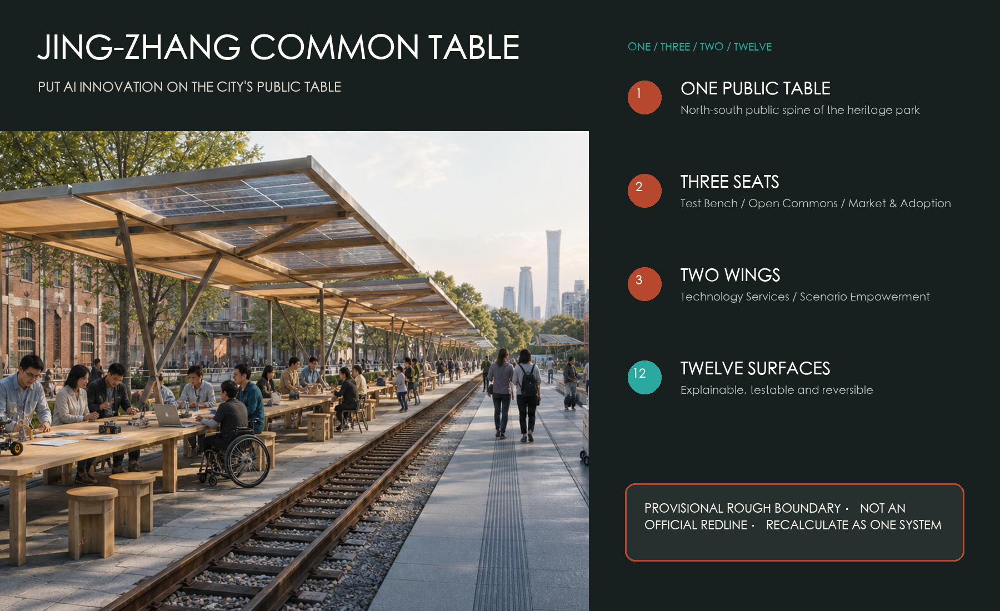
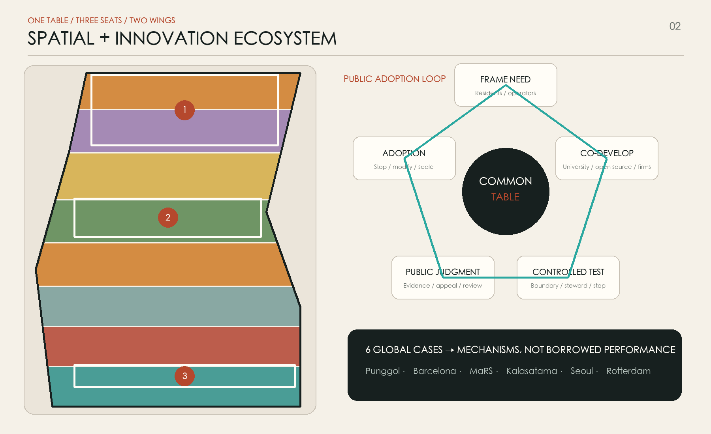
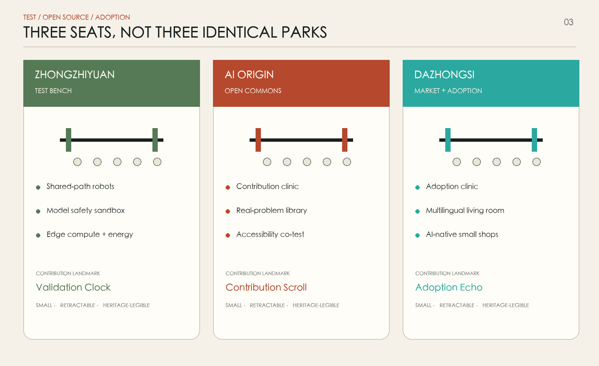
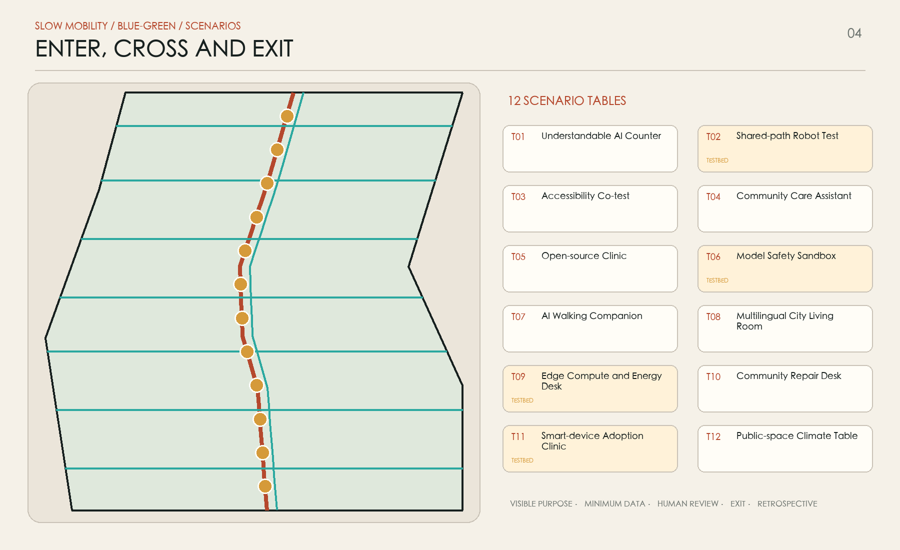
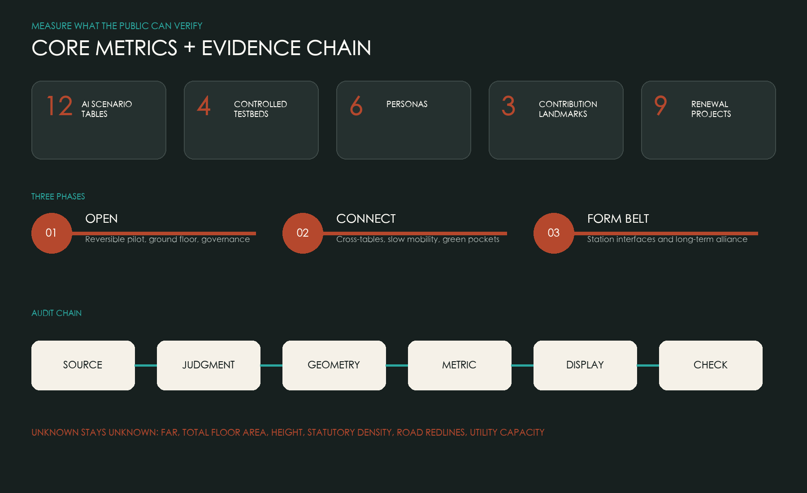

# JING-ZHANG COMMON TABLE

> Put AI innovation on the city's public table. Researchers, residents, students, companies and city operators should not merely work along the same innovation belt; they should be able to sit at one table, frame problems, try technology, judge it together, and leave safely.

**Status of this work.** This is an open-call concept proposal and a reference scheme for further professional study. It does not replace statutory planning or constitute an approved government decision. The submitted geometry uses the repository's provisional rough boundaries. Every area-sensitive conclusion must be recalculated as one system when official boundaries, regulatory plans, ownership, utilities, heritage controls and measured existing conditions become available.

## Design Basis and Source List

The primary bases are the qualification announcement issued by the Haidian Branch of the Beijing Municipal Commission of Planning and Natural Resources, the Agent taskbook, and the repository site package. The announcement defines three levels: a 43.6 square-kilometre coordinated research area, an approximately 11.4 square-kilometre overall design area, and approximately 368.4 hectares of key areas. The Agent taskbook adds the three positionings, five functions, three areas and two wings, global cases, scenario cards, landmarks and long-term operations. These sources define what the proposal must address; they do not authorize implementation [source:OFFICIAL-ANNOUNCEMENT] [source:AGENT-TASKBOOK].

The public package does not contain statutory overall redlines, exact limits of the three key areas, an existing-building survey, ownership, road redlines, utility capacity or heritage control lines. `geometry/site_boundary.geojson` and `geometry/key_areas.geojson` therefore retain the repository's provisional rough geometry and the properties `official_boundary=false` and `provisional_constraint`. They support concept mapping, topology checks and future replacement only; they are not approval, acquisition or engineering evidence [data:geometry/site_boundary.geojson#SITE-001] [source:BOUNDARY-SOURCE].

External research uses first-party institutional pages accessed on 14 August 2026. No third-party photograph, diagram, trademark or page code is copied. Punggol Digital District informs the co-location of university, industry and community with real-district testing; Smart Kalasatama informs small agile pilots with residents; MaRS informs the connection of venture services to adopters. Publishers, links, rights status and use limits are recorded in `sources.json` [source:CASE-PUNGGOL] [source:CASE-KALASATAMA] [source:CASE-MARS].

## Three-Level Scope Framework

The three scopes form one chain of reasoning, not three unrelated drawings. The coordinated research area asks how the belt connects universities, research, firms, communities and wider regional networks. The overall design area asks how industry, renewal, mobility, blue-green systems and public services become continuous. The key areas test this structure through ground-floor interfaces, scenario nodes and implementable projects. Announced areas verify the work levels, while the submitted boundary area is used only for the current geometric recalculation [standard:PROJECT-OFFICIAL-ANNOUNCEMENT] [metric:site_area_sqm].

The Common Table translates that chain into one public table, three innovation seats, two resource wings and twelve scenario surfaces. The table follows the Jing-Zhang Heritage Park as a continuous, threshold-free north-south public route. The three seats are the Test Bench at Zhongzhiyuan in the north, the Open Commons Table at the Beijing AI Origin Community in the centre, and the Market and Adoption Table at Dazhongsi in the south. The Zhongguancun Technology Service Wing brings capital, IP, legal and talent services from the west; the Xiaoyuehe Scenario Empowerment Wing brings community and city-operation test settings from the east [depth:three_level_scope_framework] [data:geometry/key_areas.geojson#PROV-KEY-002].

| Level | Core question | Common Table response | Main evidence |
| --- | --- | --- | --- |
| Coordinated research | How does innovation create public value? | Problem framing, co-development, controlled testing, public judgment and adoption | Cases, ecosystem roles and operating rules |
| Overall design | How do dispersed resources become one urban experience? | One north-south table plus short east-west cross-tables | Land use, mobility, blue-green, public-space and phase layers |
| Key areas | How do three maturity stages land differently? | Test at Zhongzhiyuan, open-source at Origin, adopt at Dazhongsi | Area components, scenarios and project list |

## Coordinated Research Area: Industry and Future City Research

The proposal's industry hypothesis is that the belt needs more than additional R&D floor space: it needs a public interface between technology supply and city adoption. Universities and laboratories produce knowledge; firms productize; communities and public agencies hold real needs and responsibilities. What is often missing is a low-threshold place to meet, an auditable way to try, and a way to stop. The table is therefore both a physical object and a civic interface that places need, data permission, testing, feedback and pre-procurement evaluation on one visible surface [source:AGENT-TASKBOOK] [depth:overall_spatial_structure].

Six global cases offer transferable mechanisms rather than templates. Punggol shows how education, industry, community and an open digital platform can co-locate. Barcelona's 22@ links innovation policy to urban renewal and knowledge transfer. MaRS connects founders with capital, customers, talent and adopters. Kalasatama uses small, reviewable pilots in real neighbourhoods. Seoul's AI Smart City Center translates administrative and enterprise AI into free public experience. Rotterdam's Reyeroord work suggests that sensing infrastructure should be tested with residents and explain its purpose [source:CASE-PUNGGOL] [source:CASE-BARCELONA] [source:CASE-SEOUL-AI-CENTER].

| Case | Mechanism | Jing-Zhang translation | What is not copied |
| --- | --- | --- | --- |
| Punggol Digital District | University-industry-community co-location and testbed | Zhongzhiyuan Test Bench with public hours | Land regime and named platform vendors |
| Barcelona 22@ | Renewal plus knowledge transfer | Underused ground floors become open service surfaces | Overseas performance figures |
| MaRS Discovery District | Venture support connected to adopters | Dazhongsi Market and Adoption Table | Brand, firm lists and investment promises |
| Smart Kalasatama | Resident-centred agile pilots | 90-day scenario cards and open retrospectives | Treating a pilot as permanent deployment |
| Seoul AI Smart City Center | Free and legible public AI experience | An Understandable AI counter at Origin | Exhibits and government application lists |
| Rotterdam Sensible Sensor Lab | Neighbourhood sensing with residents | Purpose labels, physical off-switches and logs | Default collection of personal movement |

The future-city form is thus a learning everyday city, not a technology showroom filled with screens. Research space opens a controlled public ground-floor surface; neighbourhood problems enter a transparent backlog; maturity and data limits are legible. Every scenario states its users, operator, authorized data, human review, failure condition and exit. Land, space, industry, finance, talent, compute, data and scenarios form the ecosystem, but this proposal offers interfaces only and claims no committed policy, funding or institution.

## Overall Design Area: Urban Renewal and Regulatory-Plan-Level Urban Design

The overall structure is one table, three seats, two wings and twelve scenario surfaces. The table is the public heritage-park spine. The seats are the three key areas. The wings use east-west walking and service links to connect Zhongguancun resources and Xiaoyuehe real-city settings. The twelve surfaces are reservable, explainable and recoverable public nodes. A complete, gap-free land-use partition expresses conceptual functional emphasis, while public space, green space, building prototypes and routes are independently auditable overlays [data:geometry/land_use.geojson#LU-01] [depth:land_use_layout].

Renewal begins at the ground floor rather than with assumed demolition. Fences, leftover corners, lobbies, station entrances and underused spaces are grouped into five interface opportunities: open a door, add a table, cross a courtyard, add shade, and share a service. Each is first tested with light and reversible components and operating hours. Building footprints in `geometry/buildings.geojson` are capacity and interface prototypes, not statements about existing buildings or parcel-specific retention and demolition [data:geometry/buildings.geojson#BLDG-01] [depth:retain_renovate_demolish].

Official controls for total floor area, FAR, building height, density, setbacks and road redlines are absent and therefore remain unknown in `metrics.json`. Once official lines and measured conditions arrive, professional teams should work backward from continuity of the public table, universal access, heritage legibility, sunlight, wind and utility capacity to parcel-level intensity. The current colour blocks must not be converted directly into a regulatory plan [standard:MOHURD-CONTROL-DETAILED-PLANNING] [metric:floor_area_ratio].

## Detailed Design of Key Areas

The three seats are not three identical AI parks. They represent different points in an innovation maturity chain. Zhongzhiyuan is the Test Bench: a containable walking-robot loop, model-safety evaluation, low-carbon compute display and green public interface near Qinghe. A risk card is published before testing, human takeover is retained during testing, and reusable findings follow testing. Public and sensitive research zones remain clearly separated [data:geometry/key_areas.geojson#PROV-KEY-001] [depth:three_key_area_detailed_design].

The Beijing AI Origin Community is the Open Commons Table. It first repairs walking links among campus, park and neighbourhood, then adds a contribution desk, open-source clinic, release steps, talent-service table and community problem wall. Recognition covers documentation, data stewardship, accessibility testing, resident feedback and useful failures, so non-developers can also receive credit. Station integration, campus openness and building renewal require continued agreement among rights holders [data:geometry/key_areas.geojson#PROV-KEY-002] [source:AGENT-TASKBOOK].

Dazhongsi is the Market and Adoption Table. Around rail arrival, four-quadrant walking and existing commerce, it offers product experience, compliance advice, early-customer clinics, international demonstrations and small AI-native retail. Continuous ground floors, low-glare table-edge lighting and multilingual service create an urban innovation living room without a giant attention-seeking object. Cross-road, underground or station works remain needs to be studied, not engineering conclusions [data:geometry/key_areas.geojson#PROV-KEY-003] [depth:traffic_rail_slow_parking].

Three contribution landmarks return prestige to the process: Zhongzhiyuan's Validation Clock gains one segment after a completed safety test; Origin's Contribution Scroll records open-source, civic and community work; Dazhongsi's Adoption Echo shows the full path from a stated problem to real adoption. Content is permissioned and retractable, avoids excessive personalization, and uses maintainable small-scale components that preserve heritage views.

## AI Innovation Ecosystem, Personas, and AI+ Scenarios

The table serves six everyday users rather than an abstract category of talent. Open-source developers need visible contribution, affordable collaboration and test access. Startups need customer discovery, compliance advice and shared equipment. University communities need pathways from coursework and papers to real needs. Companies and adopters need controlled validation. Residents need calm public space, trustworthy services and refusal. City operators need explainable alerts, responsibility and human review. Each persona is mapped to space, service, risk and exit [standard:PROJECT-AGENT-OPEN-CALL-TASKBOOK] [data:geometry/public_space.geojson#SCENE-01].

| Persona | Key task | Table response | Rights boundary |
| --- | --- | --- | --- |
| Open-source developer | Find, collaborate, publish, maintain | Contribution desk, clinic and evening table | No facial recognition or movement-based reputation |
| Startup team | Find first users, test and ask compliance questions | Booking, adoption clinic and shared equipment | Failed tests do not expose trade secrets by default |
| University community | Applied learning, transfer and cross-campus work | Real-problem library, mentor table and release steps | Research and campus data require permission |
| Company and adopter | Compare, validate and assess adoption | Test card, evidence packet and demonstration table | Display does not imply procurement endorsement |
| Resident | Commute, rest, ask for help and object | Shaded seats, problem wall and human counter | Anonymous, off and non-digital alternatives |
| City operator | Detect, dispatch and review | Explainable dashboard, handover seat and audit log | AI does not replace enforcement or approval |

All twelve AI scenario cards use the same rule: visible purpose, minimum data, a human in the loop, an exit and a retrospective. T02, T06, T09 and T11 are controlled industry test scenarios with geofencing, booked hours, a safety steward and stop conditions. Other tables centre on public service and learning. Coordinates express conceptual distribution only and must be calibrated with official mapping and site surveys [metric:scenario_node_count] [data:geometry/public_space.geojson#SCENE-12].

| ID | Scenario table | Location | Users | Data and human boundary | Suggested operation |
| --- | --- | --- | --- | --- | --- |
| T01 | Understandable AI Counter | Origin | Residents, students | No identity collection; educator hands off to people | Daily |
| T02 | Shared-path Robot Test | Zhongzhiyuan | Firms, operators, walkers | Booked, low speed, physical stop and steward | 90-day test |
| T03 | Accessibility Co-test | Common Table | Disabled users, elders, designers | Voluntary paid participation; de-identified feedback | Monthly |
| T04 | Community Care Assistant | Xiaoyuehe Wing | Residents, social workers | No diagnosis; high-risk requests go to people | Hosted locally |
| T05 | Open-source Clinic | Origin | Developers, students | Code and data released only under permission | Weekly |
| T06 | Model Safety Sandbox | Zhongzhiyuan | R&D and governance researchers | Isolated data, human red team and graded reporting | Batch test |
| T07 | AI Walking Companion | Heritage Park | Commuters, visitors | Edge processing; no continuous trajectory storage | Public service |
| T08 | Multilingual City Living Room | Dazhongsi | Visitors, merchants | Machine translation is labelled and correctable | Co-operated |
| T09 | Edge Compute and Energy Desk | Zhongzhiyuan | Developers, facility operators | Aggregated energy only; device isolation | Booked test |
| T10 | Community Repair Desk | Neighbourhoods | Residents, property teams, operators | Work orders minimized; accountable dispatch | Quarterly review |
| T11 | Smart-device Adoption Clinic | Dazhongsi | Startups, firms, early users | Trial status visible; no default recommendation | Open call |
| T12 | Public-space Climate Table | Blue-green nodes | Residents, landscape operators | Open environmental data, never linked to people | Seasonal |

## Land Use, Building Scale, and Retain-Renovate-Demolish Strategy

Concept land use employs the national classification subset and forms a complete non-overlapping partition. It includes research, culture, education and public service, community service, commerce, housing and park green space. Colours do not imply ownership or statutory use; they test whether the three seats and two wings receive the spatial resources they need. Areas are recalculable from geometry and retain low confidence because of the provisional boundary [standard:MNR-LAND-USE-CLASSIFICATION-GUIDE] [metric:land_use_0802_area_sqm].

Buildings follow four steps: retain first, adapt, add reversibly, and consider necessary renewal only after evidence. Without a building survey and structural assessment, no specific building is labelled for demolition. Teams first identify ground floors and courtyards that can open, then test table canopies, shade, ramps and shared lobbies. Parcel-specific decisions require ownership, structure, fire, daylight, heritage and economic assessments. Submitted footprints carry `conceptual_prototype=true` [data:geometry/buildings.geojson#BLDG-12] [depth:height_massing_character].

Ground-floor interfaces follow four suggestions: a free seat or service every 300 to 500 metres; separated public display and sensitive R&D zones; non-purchase dwell space at commercial fronts; and continuous step-free access with a visible human counter and a non-digital alternative. Official total floor area, FAR, height and density remain pending regulatory controls and surveys. Prototype areas are not extrapolated into development indicators [metric:total_floor_area_sqm] [depth:development_intensity_controls].

## Transport, Rail, Municipal Infrastructure, and Public Services

Mobility first addresses the last 500 metres and east-west crossings rather than proposing major new works. The public table combines a continuous walking spine, a cycle commuter line and short cross-tables. Cross-tables focus at key areas, station exits, neighbourhoods and university edges, using signal adjustment, shorter crossings, clear corners, shade and cycle parking. Lines are conceptual relationships pending road redlines, traffic counts, bus operations and safety review [data:geometry/roads.geojson#ROAD-01] [depth:traffic_rail_slow_parking].

A station is the first table, not an isolated gateway. On exit, users find orientation, an accessible route, current activity status, human help and walking times. Dazhongsi studies surface continuity among four quadrants; Origin studies station-campus-park relays; Zhongzhiyuan separates public-transport visitors from controlled tests. Bridges, tunnels, underground links and station alterations are recorded only as connection needs.

Municipal and digital infrastructure follows a small-node, metered and disconnectable principle. Each scenario table reserves graded power, network, locked equipment, canopy, lighting and maintenance access. Edge compute handles only necessary data; cross-system calls require authorization and logs. Photovoltaic canopies, rain gardens and charging require structural, fire, energy and utility checks. Public service retains screen-free signs, human support, drinking water, seating, toilet directions and emergency calls to prevent digital exclusion [standard:BARRIER-FREE-ENVIRONMENT-LAW] [depth:municipal_new_infrastructure].

## Blue-Green Network, Public Space, and Urban Character

The blue-green structure uses the heritage park and ecological clues related to Qinghe and Xiaoyuehe as a framework: a continuous shaded tablecloth, three stormwater pockets and twelve places to stop. Green and public-space layers are concept design coverages, not statutory green, blue or river-management lines. Current ratios describe the submitted design allocation only and must be recalculated when official constraints arrive [data:geometry/green_space.geojson#GREEN-01] [metric:green_ratio].

The component kit contains six combinable parts: a 2.4-metre modular table, movable backed seating, a translucent photovoltaic canopy, high and low work surfaces, a purpose-and-data label, and an equipment box with a physical off-switch. They share a geometry of two rails plus one transverse surface without imitating railway equipment. Replaceable timber, recycled metal and permeable paving support repair. Fire egress, tactile paths, wheelchair turning and maintenance clearance remain unobstructed [data:geometry/public_space.geojson#PUBLIC-01] [depth:blue_green_public_space].

Urban character is rational, warm and repairable rather than cyberpunk. Daytime continuity comes from shade, brick, rail texture and pale tabletops. At night, low-level warm-white light traces edges and directions; cyan appears only as a status accent. Two fine lines and one cross-line form the visual mark: the pair recalls the Jing-Zhang railway and parallel open collaboration, while the cross-line is the public surface where anyone may join. Heritage structures, old trees and important views require specialist surveys before design.

## Renewal Projects, Implementation Policy, and Phasing

Nine projects follow open a table, connect tables, then form the belt. P01 a 1:1 pilot, P02 three open ground floors, P03 accessibility co-testing and P04 scenario governance cards are near-term reversible tests. P05 the three public seats, P06 east-west walking repairs and P07 blue-green pockets follow when conditions are clear. P08 station interfaces and P09 a long-term alliance wait for transport, utilities, ownership and governance agreements. Phase geometry communicates spatial sequence, not investment or approval timing [data:geometry/phasing.geojson#PHASE-01] [depth:renewal_project_list].

| Project | Main output | Start trigger | Stop or adapt trigger |
| --- | --- | --- | --- |
| P01 Table pilot | 100-150 m reversible canopy and seating | Site permission, access and fire check | Blocks movement or cannot be maintained |
| P02 Open ground floors | Three free service tables | Owner and operator agreement | Harms sensitive R&D or residential calm |
| P03 Accessibility co-test | Joint route, seat and sign review | Paid participation by disabled users | Critical safety issue unresolved |
| P04 Governance card | Purpose, data, human, exit and review template | Named controller and responsible person | No non-digital alternative |
| P05 Three public seats | Test, open-source and adoption prototypes | Official key-area lines and existing surveys | Conflict with planning or heritage |
| P06 East-west cross-tables | Crossing, cycle and station micro-renewal | Traffic study and authority review | Safety performance worsens |
| P07 Blue-green pockets | Shade, infiltration, rain and rest nodes | Sponge-city and landscape review | Ecology or utilities conflict |
| P08 Station-city interface | First Table at three stations | Rail-operator coordination | Egress or station conditions prohibit |
| P09 Common Table Alliance | Events, test registry and open review | Multi-party charter and stable budget | No independent audit or resident seat |

Operations begin with a 90-day loop: publish real problems, co-select with communities and experts, issue a risk card, run a small test, review independently, and stop, modify or expand. The proposed year includes a Spring Problem Table, Summer Co-test Season, Autumn Open Source and Adoption Week, and Winter Useful Failure Review. These are suggestions, not confirmed government events. Participant pathways connect visits, contribution, validation, adoption and long-term presence, while recruitment, grants and policy support require separate decisions [depth:phasing_implementation] [source:CASE-KALASATAMA].

## Metrics, Area Recalculation, and Compliance Matrix

The package separates three metric types. First are design metrics recalculated from submitted geometry: provisional boundary area, land-use areas, green and public space, prototype footprints, route length, nodes and phase areas. Second are officially announced work-scope areas. Third are statutory or engineering metrics that cannot yet be calculated reliably: total floor area, FAR, height, statutory density, road redlines and utility capacity. Unknown is an explicit professional prerequisite, not a missing number [depth:metrics_recalculation] [metric:public_space_ratio].

Experience metrics translate innovation into auditable public value: at least four of twelve scenarios are controlled industry tests; all six personas receive non-digital alternatives and human review; three landmarks recognize contribution rather than celebrity; and all nine renewal projects have start and stop conditions. Spatial and operational measures stay separate so participation counts cannot conceal unequal space and concept node counts cannot masquerade as delivery [metric:testbed_scenario_count] [metric:renewal_project_count].

The compliance matrix maps all seventeen mandatory announcement items and agent.1 to agent.6. The standard matrix covers urban design, regulatory depth, land classification, architectural depth, generative AI, accessibility and ageing. The depth matrix covers fifteen planning topics. Five paired figures, A3 booklet, A0 boards, bilingual reports, offline pages, GeoJSON, metrics and assumptions form one evidence chain; any mismatch between display and structured values blocks submission [standard:MOHURD-URBAN-DESIGN-MEASURES] [data:geometry/constraints.geojson#CONSTRAINT-DATA-GAP].

## Risk, Copyright, and Compliance

The highest risk is reading provisional geometry as an official redline. Every provisional map uses dashed lines and an explicit warning; area metrics carry low confidence. When official geometry arrives, land use, buildings, roads, green space, public space, phases and metrics must all be recalculated together. Gaps in buildings, ownership, utilities, transport, heritage and ecology are recorded in `assumptions.json` and the empty constraint layer [source:KEY-AREA-SOURCE] [depth:risk_missing_data].

AI scenarios share risks of purpose drift, excessive collection, automation bias and unclear responsibility. Every table uses a five-cell governance card: purpose, minimum data, responsible human, exit and review date. High-risk use may not make rights-affecting decisions solely from model output. Public safety, health, care and minors require a human route, appeal, logs and a stop mechanism [standard:GENERATIVE-AI-INTERIM-MEASURES] [source:AGENT-TASKBOOK].

The five figures, pages, icons, layouts and data graphics are original outputs generated for this submission from its geometry. The cover concept was generated with OpenAI's built-in image tool from an original prompt. It is atmospheric concept art, not a site photograph or observation. Prompt, date, limitations and rights notes are in `sources.json` and `report/copyright_statement.md`. Global cases inform text only; their images, diagrams, fonts, logos and page code are not copied [source:AI-COVER-GENERATION] [source:CASE-ROTTERDAM-SENSOR-LAB].

## References

The bibliography uses claim-adjacent anchors and a structured registry. Project facts rely on the announcement, taskbook and site package. Professional boundaries rely on public regulations and standard summaries in the repository. Cases support method comparison only, never area, performance or implementation promises for this site. Publisher, URL, access date, reuse limits and exact use are recorded in `sources.json` [source:SITE-PACKAGE] [source:SOURCE-REGISTRY].

- Haidian Branch, Beijing Municipal Commission of Planning and Natural Resources: qualification announcement for the Centennial Jing-Zhang AI Innovation Belt urban-design call.
- Open City AI: `brief/site-package/`, `data/source_registry.json`, and the Agent open-call taskbook.
- Public regulations and standards summarized in the professional standard matrix.
- JTC: Punggol Digital District; Barcelona City Council: Science and Innovation; MaRS Discovery District: About MaRS.
- Forum Virium Helsinki: Smart Kalasatama; Smart City Korea: Seoul AI Smart City Center; City of Rotterdam: Living Lab Sensible Sensor.
- Complete evidence index: `sources.json`, `metrics.json`, `assumptions.json`, `standard_matrix.json`, `design_depth_matrix.json`, and `compliance_matrix.json`.
