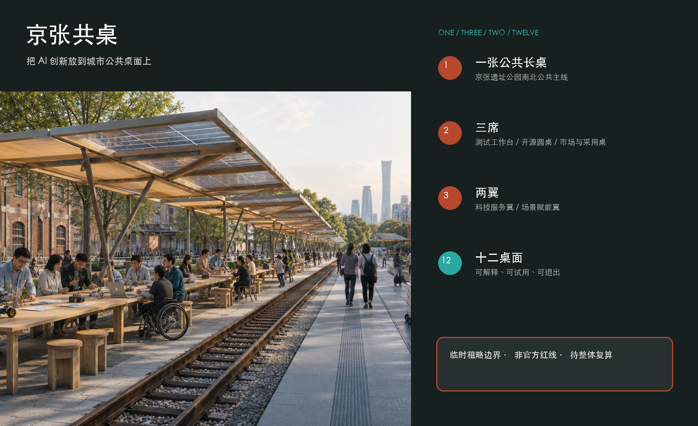
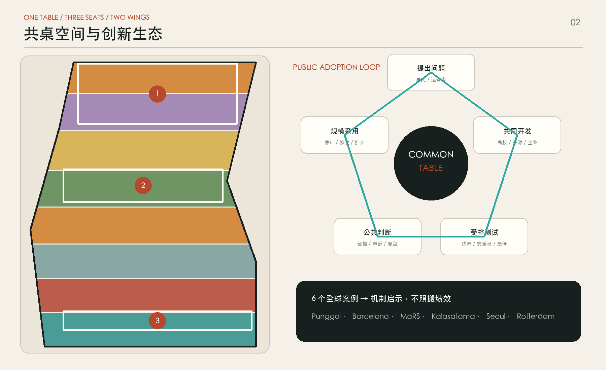
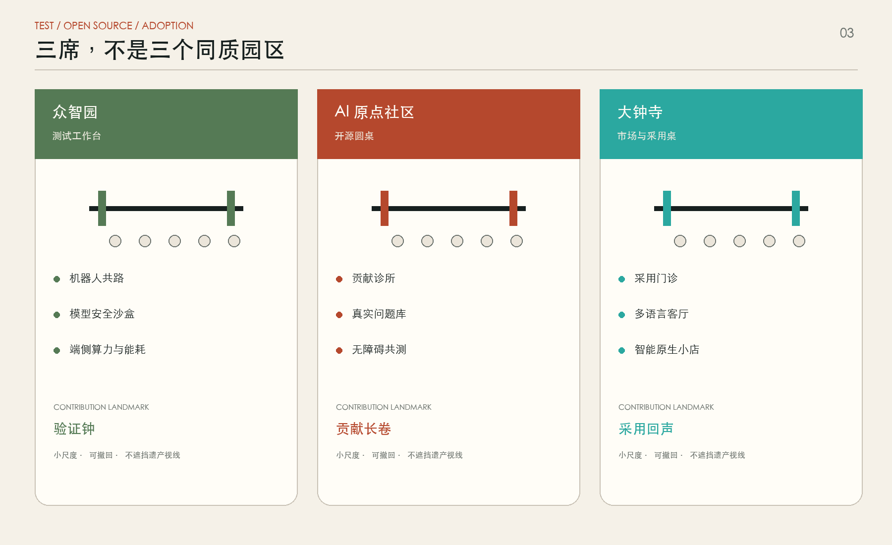
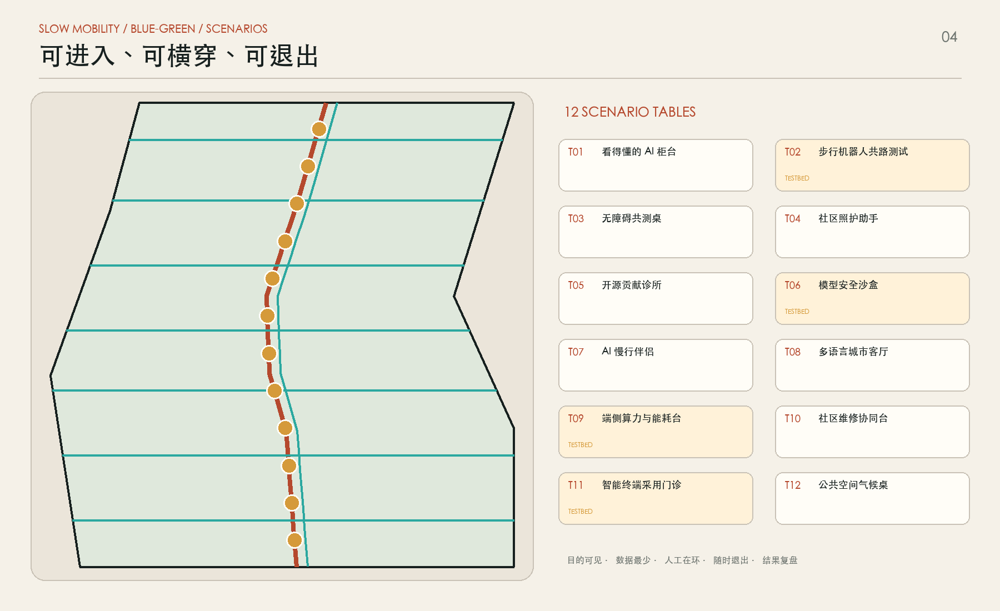
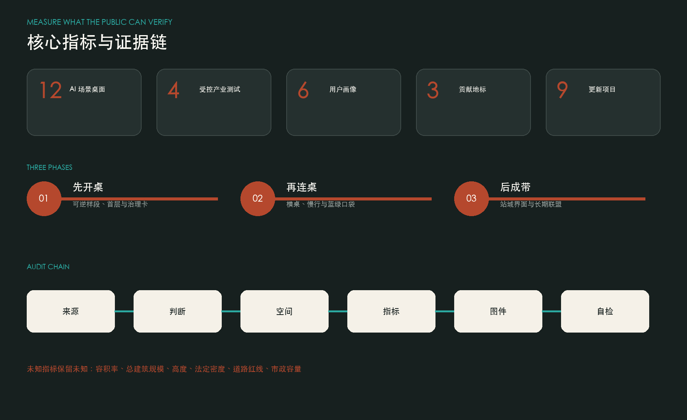

# 京张共桌 / JING-ZHANG COMMON TABLE

> 把 AI 创新放到城市公共桌面上。让研发者、居民、学生、企业和城市运营者不仅在同一条创新带上工作，更能在同一张桌子旁提出问题、试用技术、共同判断并安全退出。

**成果性质。** 本方案是开源征集中的概念建议和参考方案，可供专业团队深化研究；不替代正式规划，不构成政府审定结论。提交几何采用仓库临时粗略边界，所有面积敏感结论均须在官方红线、控规、权属、市政、文保和现状测绘补齐后整体复算。

## 设计依据与资料清单

方案以北京市规划和自然资源委员会海淀分局发布的资格预审公告、面向智能体任务书和仓库场地包为主依据。公告明确 43.6 平方公里统筹研究、约 11.4 平方公里总体设计和约 368.4 公顷重点区域三个层级；智能体任务书进一步要求回应三大定位、五大功能、三区两翼、全球案例、场景卡、朝圣地标与长期运营。上述内容是本方案判断任务完成度的依据，而不是对实施的授权 [source:OFFICIAL-ANNOUNCEMENT] [source:AGENT-TASKBOOK]。

当前公开场地包没有提供可用于法定规划的精确总体红线、三处重点区四至、现状建筑、权属、道路红线、市政容量和文保控制线。`geometry/site_boundary.geojson` 与 `geometry/key_areas.geojson` 因而沿用仓库发布的临时粗略几何，属性持续标注 `official_boundary=false` 和 `provisional_constraint`；它们仅用于概念落图、拓扑检查和替换后的整体复算，不能作为审批、征拆或工程依据 [data:geometry/site_boundary.geojson#SITE-001] [source:BOUNDARY-SOURCE]。

外部研究只采用机构官网的一手页面，访问日期统一登记为 2026-08-14；未下载或再发布其照片、图表和商标，仅将公开文字归纳为方法启示。新加坡榜鹅数字园区用于研究“高校-产业-社区共址与真实城区测试”，赫尔辛基卡拉萨塔玛用于研究“小规模敏捷试点与居民共创”，多伦多 MaRS 用于研究“创业服务和采用端连接”。完整发布者、链接、许可状态和用途限制保存在 `sources.json` [source:CASE-PUNGGOL] [source:CASE-KALASATAMA] [source:CASE-MARS]。

## 三层范围工作框架

三层范围不是三份互不相干的图，而是一条从区域生态到街道界面的推理链。统筹研究范围回答京张创新带如何连接高校、科研、企业、社区和京津冀协同网络；总体设计范围回答产业、更新、慢行、蓝绿和公共服务如何形成连续结构；三处重点区域则用具体首层界面、场景节点和实施项目验证结构是否可用。公告面积用于校核工作层级，提交边界面积只用于当前几何复算 [standard:PROJECT-OFFICIAL-ANNOUNCEMENT] [metric:site_area_sqm]。

“京张共桌”把这条推理链转译为空间语言：一张公共长桌、三席创新节点、两翼资源接口和十二个场景桌面。公共长桌沿京张遗址公园形成连续、无门槛、可全天候局部使用的南北公共主线；三席分别是北段众智园“测试工作台”、中段 AI 原点社区“开源圆桌”和南段大钟寺“市场与采用桌”；中关村科技服务翼从西侧提供资本、知识产权、法务和人才服务，小月河场景赋能翼从东侧提供社区和城市运行测试环境 [depth:three_level_scope_framework] [data:geometry/key_areas.geojson#PROV-KEY-002]。

| 层级 | 关键问题 | 共桌回答 | 主要证据 |
| --- | --- | --- | --- |
| 统筹研究范围 | 创新如何从实验走向公共价值 | 建立“提出问题-共同开发-受控测试-公共判断-规模采用”的闭环 | 全球案例、生态角色、运营规则 |
| 总体设计范围 | 分散资源如何形成连续城市体验 | 一张南北长桌加多条东西横桌，串联三席两翼 | 用地、慢行、蓝绿、公共空间与分期图层 |
| 重点区域范围 | 三种创新阶段如何各自落地 | 众智园验证技术，原点社区组织开源，大钟寺连接市场采用 | 三处重点区组件、场景和项目清单 |

## 统筹研究范围产业与未来城市研究

本方案的产业判断是：京张创新带不应只增加研发载体，而应补上从“技术供给”到“城市采用”的公共接口。高校和实验室擅长产生知识，企业擅长产品化，政府和社区掌握真实问题与公共责任；三者之间常缺少低门槛相遇、可审计试用和失败后退出的共同场所。因此“桌”既是可坐下来的物理构件，也是把需求、数据授权、测试、反馈与采购前评估放在同一页面上的制度界面 [source:AGENT-TASKBOOK] [depth:overall_spatial_structure]。

六个全球案例形成六条可转译而非照搬的启示。榜鹅数字园区证明教育、产业、社区和开放数字平台可在街区尺度共址；巴塞罗那 22@ 说明创新区需要知识转移与城市更新共同推进；MaRS 说明创新枢纽的价值来自资本、客户、人才和采用方的连接；卡拉萨塔玛证明真实社区可以用小额、敏捷、可复盘的试点逐步学习；首尔 AI 智慧城市中心把行政 AI 与企业解决方案转译为公众可理解的免费体验；鹿特丹 Reyeroord 则提示传感设施应与居民共同试验并公开用途 [source:CASE-PUNGGOL] [source:CASE-BARCELONA] [source:CASE-SEOUL-AI-CENTER]。

| 案例 | 可借鉴机制 | 在京张共桌的转译 | 明确不照搬之处 |
| --- | --- | --- | --- |
| Punggol Digital District | 产学研社区共址、真实场景测试 | 众智园测试工作台与公共开放时段 | 不移植其土地制度和平台供应商 |
| Barcelona 22@ | 更新、知识转移与城市经济协同 | 低效首层转为开放服务桌面 | 不将海外绩效数字套用于海淀 |
| MaRS Discovery District | 创业服务、资本、客户和采用端连接 | 大钟寺市场与采用桌 | 不复制品牌、企业名单和招商承诺 |
| Smart Kalasatama | 居民参与的敏捷试点 | 90 天场景试用卡和公开复盘 | 不把试点等同于永久部署 |
| Seoul AI Smart City Center | 免费、可理解的公共 AI 体验 | 原点社区“看得懂的 AI”展台 | 不复制展项或政府应用清单 |
| Rotterdam Sensible Sensor Lab | 真实街区传感试验与居民协作 | 传感器用途牌、关闭开关和审计日志 | 不默认采集个人轨迹 |

未来城市形态因此被定义为“可学习的日常城市”，而不是布满屏幕的科技展厅。研发空间向首层公共桌面开放，社区问题可以进入测试清单，技术成熟度和数据边界以人人看得懂的方式展示；每个场景必须说明服务对象、运营者、授权数据、人工复核、失败条件和退出路径。区域生态由土地、空间、产业、资金、人才、算力、数据、场景八种资源组成，但本方案只提出接口机制，不声称任何政策、资金或机构已经承诺。

## 总体设计范围城市更新与控规深度城市设计

总体结构概括为“一桌、三席、两翼、十二桌面”。“一桌”是遗址公园公共主线；“三席”对应三处重点区；“两翼”用东西向步行和服务接口连接中关村科技服务资源与小月河真实城市场景；“十二桌面”是可预约、可解释、可回收的公共场景节点。用地分区以完整无缝的拓扑分区表达概念性功能重心，公共空间、绿地、建筑原型和线路作为独立叠加层复核 [data:geometry/land_use.geojson#LU-01] [depth:land_use_layout]。

城市更新从首层开始，而不是先假设大拆大建。沿长桌的现有园区围墙、闲置边角、建筑门厅、地铁出入口和桥下空间，被归纳为五类“接口机会”：开门、加桌、穿院、补荫、共享服务。每个接口先以轻量、可逆构件和运营时段验证公共价值，再决定是否进入建筑或市政工程深化。`geometry/buildings.geojson` 中的建筑仅是验证空间容量和界面关系的概念原型，并非现状建筑判断或具体地块拆改留结论 [data:geometry/buildings.geojson#BLDG-01] [depth:retain_renovate_demolish]。

开发强度、总建筑规模、建筑高度、密度、退线和道路红线均缺少官方控制条件，因此在 `metrics.json` 中保持未知，而不以概念图推算审定指标。专业深化阶段应在官方红线和现状测绘到位后，以公共长桌连续性、无障碍通行、遗产可读性、日照风环境和市政承载为约束，反推分地块的混合功能与强度，而不是把当前色块直接转成控规 [standard:MOHURD-CONTROL-DETAILED-PLANNING] [metric:floor_area_ratio]。

## 重点区域详细设计

三席不是同质化的“AI 园区”，而是创新成熟度链条上的三种桌面。众智园是“测试工作台”：以可封闭的机器人步行测试环、模型安全评测室、低碳算力展示和清河绿色会客界面为核心，测试前公开风险卡，测试中保留人工接管，测试后发布可复用结论。公共部分应与敏感研发边界清晰分开 [data:geometry/key_areas.geojson#PROV-KEY-001] [depth:three_key_area_detailed_design]。

AI 原点社区是“开源圆桌”：以高校-园区-社区之间的步行缝合为先，设置贡献台、开源诊所、成果发布阶梯、人才服务桌和社区问题墙。贡献不只展示模型成绩，还记录文档、数据治理、无障碍测试、居民反馈和失败复盘，让非研发角色也能获得可见荣誉。站点一体化、校区开放和建筑更新均需相关主体继续协商 [data:geometry/key_areas.geojson#PROV-KEY-002] [source:AGENT-TASKBOOK]。

大钟寺是“市场与采用桌”：围绕轨道到达、四象限步行联系和现有商业服务，设置产品体验、合规咨询、早期客户门诊、国际路演和智能原生消费小店。它不以巨型地标抢夺注意力，而通过连续首层、夜间可见但低眩光的桌边灯带和多语言服务形成城市型创新客厅。任何跨路、地下或站城工程只作为待论证连接需求，不作工程可行性结论 [data:geometry/key_areas.geojson#PROV-KEY-003] [depth:traffic_rail_slow_parking]。

三个“朝圣”节点把荣誉还给贡献过程：众智园“验证钟”每完成一次安全测试亮起一格；原点社区“贡献长卷”滚动展示开源、公益和社区共创记录；大钟寺“采用回声”展示从问题提出到真实采用的完整链条。其内容必须经授权、可撤回、不过度个人化，构件保持小尺度、可维护和不遮挡遗产视线。

## AI 创新生态、人才画像与 AI+ 场景

共桌服务六类日常使用者，而不是抽象“人才”：开源开发者需要贡献声誉、低成本协作和测试入口；初创团队需要客户发现、合规咨询和共享设备；高校师生需要从课程和论文走向真实问题；头部企业与采购方需要受控验证和采用证据；周边居民需要低扰动公共空间、可信服务和拒绝权；城市运营者需要可解释告警、责任链和人工复核。每类画像都对应空间、服务、风险与退出方式 [standard:PROJECT-AGENT-OPEN-CALL-TASKBOOK] [data:geometry/public_space.geojson#SCENE-01]。

| 用户画像 | 一天中的关键任务 | 桌面响应 | 权利边界 |
| --- | --- | --- | --- |
| 开源开发者 | 找问题、协作、发布、维护 | 贡献台、开源诊所、夜间协作桌 | 不以刷脸或轨迹计算贡献 |
| 初创团队 | 找首批用户、测产品、问合规 | 测试预约、采用门诊、共享设备 | 失败测试不自动公开商业秘密 |
| 高校师生 | 课程实践、成果转化、跨校交流 | 真实问题库、导师桌、发布阶梯 | 科研成果与校园数据须授权 |
| 企业与采购方 | 比较方案、验证性能、评估采用 | 标准测试卡、证据包、路演桌 | 不把展示等同于采购背书 |
| 周边居民 | 通勤、休闲、求助、表达意见 | 荫凉座席、社区问题墙、人工窗口 | 有匿名、关闭与非数字替代选项 |
| 城市运营者 | 发现问题、调度、复盘 | 可解释仪表、交接席、审计记录 | AI 不替代执法、审批和最终判断 |

十二张 AI 场景卡共同遵循“目的可见、数据最少、人工在环、随时退出、结果复盘”。其中 T02、T06、T09、T11 是产业测试验证场景，必须使用时空围栏、预约时段、安全员和停止条件；其他桌面以公共服务和学习为主。节点坐标只表达概念分布，待官方底图和现场踏勘后校准 [metric:scenario_node_count] [data:geometry/public_space.geojson#SCENE-12]。

| ID | 场景桌面 | 主要位置 | 服务对象 | 数据与人工边界 | 运营建议 |
| --- | --- | --- | --- | --- | --- |
| T01 | 看得懂的 AI 柜台 | 原点社区 | 居民、学生 | 不采个人身份；讲解员可转人工服务 | 每日开放 |
| T02 | 步行机器人共路测试 | 众智园 | 企业、运营者、行人 | 预约时段、低速、实体急停、安全员 | 90 天测试 |
| T03 | 无障碍共测桌 | 公共长桌 | 轮椅使用者、老人、设计者 | 自愿参与；反馈去标识化 | 月度共测 |
| T04 | 社区照护助手 | 小月河翼 | 居民、社工 | 不诊断；高风险请求转人工 | 社区机构托管 |
| T05 | 开源贡献诊所 | 原点社区 | 开发者、学生 | 代码和数据按授权发布 | 每周门诊 |
| T06 | 模型安全沙盒 | 众智园 | 研发、监管研究者 | 隔离数据；人工红队；结果分级 | 批次测试 |
| T07 | AI 慢行伴侣 | 遗址公园 | 通勤者、访客 | 端侧计算；不保存连续轨迹 | 公共服务 |
| T08 | 多语言城市客厅 | 大钟寺 | 国际访客、商户 | 明示机器翻译；人工纠错 | 商圈共营 |
| T09 | 端侧算力与能耗台 | 众智园 | 开发者、设施运营者 | 只公开聚合能耗；设备隔离 | 预约测试 |
| T10 | 社区维修协同台 | 沿线社区 | 居民、物业、运营者 | 工单脱敏；责任人确认后派发 | 季度复盘 |
| T11 | 智能终端采用门诊 | 大钟寺 | 初创、企业、早期客户 | 明示试用状态；不默认商业推荐 | 公开征集 |
| T12 | 公共空间气候桌 | 蓝绿节点 | 居民、园林运营者 | 环境数据公开；不关联个人 | 四季观测 |

## 用地、建筑规模与拆改留方案

概念用地采用国家用途分类子集，形成完整覆盖、无缝无重叠的分区；功能重点包括科研、文化、教育与公共服务、社区服务、商业服务、居住及公园绿地。色块不是地块权属或法定用地结论，而是用于检验三席两翼能否获得相应空间资源。每个分区的面积可从提交几何复算，并统一保留临时边界低置信度说明 [standard:MNR-LAND-USE-CLASSIFICATION-GUIDE] [metric:land_use_0802_area_sqm]。

建筑策略使用“保留优先、适应性改造、可逆加建、必要更新待证”的四步法。没有现状建筑普查和安全鉴定时，不给任何具体建筑贴“拆除”标签：先识别可开放的首层和庭院，再用轻量桌棚、遮荫、坡道和共享门厅验证；只有在权属、结构、消防、日照、文保与经济评估完成后，专业团队才可提出具体拆改留。提交建筑图层中的原型以 `conceptual_prototype=true` 明示其用途 [data:geometry/buildings.geojson#BLDG-12] [depth:height_massing_character]。

首层公共接口遵循四项控制建议：沿公共长桌每 300 至 500 米至少出现一种可免费使用的座席或服务；研发建筑把展示与敏感区分层；商业首层保留非消费性停留位置；所有入口提供连续无障碍路线、清晰人工服务点和关闭数字功能的替代路径。总建筑面积、容积率、建筑高度和建筑密度法定值待正式控规与测绘补齐，本方案不将原型面积外推为开发指标 [metric:total_floor_area_sqm] [depth:development_intensity_controls]。

## 交通、轨道、市政与公共服务设施

交通策略优先解决“最后 500 米”和东西横穿，而非新增宏大工程。公共长桌由一条连续步行主线、一条骑行通勤线和多条短横桌组成；横桌在三处重点区、轨道站口、社区和高校界面集中设置，通过信号优化、过街缩短、转角清理、遮荫和自行车停放形成可逐段实施的连接。线形为概念关系，必须在道路红线、交通量、公交组织和安全评估后深化 [data:geometry/roads.geojson#ROAD-01] [depth:traffic_rail_slow_parking]。

轨道站点不被设计成孤立门户，而是“第一张桌”：出站即可获得方向、无障碍路径、活动状态、人工咨询和步行时间。大钟寺重点研究四象限地面步行连续性，原点社区重点研究站点-校区-园区的慢行接力，众智园重点研究公共交通与测试区访客分流。任何跨路桥隧、地下连通和站体改造均只记录需求，不作可行性判断。

市政与新型基础设施采用“小节点、可计量、可断开”的原则。每张场景桌预留分级供电、网络、设备锁柜、雨棚、照明和维护接口；端侧算力优先处理最少必要数据，跨系统调用需要授权和日志；光伏桌棚、雨水花园和充电设施须在荷载、消防、能耗和市政容量核验后实施。公共服务至少保留无屏幕导视、人工窗口、饮水、座椅、卫生间指引和应急呼叫，避免数字服务排斥老人、儿童和残障人士 [standard:BARRIER-FREE-ENVIRONMENT-LAW] [depth:municipal_new_infrastructure]。

## 蓝绿空间、公共空间与城市风貌

蓝绿结构以遗址公园和清河、小月河相关生态线索为骨架，形成“连续绿荫桌布、三处雨洪口袋、十二个可停留节点”。绿地和公共空间图层是概念设计覆盖，不替代绿线、蓝线和河道管理边界；当前复算比例只说明方案图层自身的空间分配，待官方边界和生态控制补齐后统一调整 [data:geometry/green_space.geojson#GREEN-01] [metric:green_ratio]。

公共空间组件库包括六件可组合单元：2.4 米模块化共桌、可移动靠背座椅、透光光伏桌棚、低位与高位双层操作面、用途与数据说明牌、带实体关闭开关的设备盒。它们共享两条轨道加一条横向桌面的几何语言，但不仿制铁路设备；材料以可替换木面、再生金属和透水铺装为主。组件必须保留消防疏散、盲道、轮椅回转和维护净空 [data:geometry/public_space.geojson#PUBLIC-01] [depth:blue_green_public_space]。

城市风貌不追求赛博霓虹，而强调“理性、温暖、可修理”。白天由树荫、砖、钢轨肌理和浅色桌面建立连续性，夜间仅在桌沿和方向节点使用低亮度暖白光，青色只作为数据状态提示。两条细线与一条横线组成可延展的视觉符号：两线代表京张轨道与开源协作的并行历史，横线代表任何人都能加入的公共桌面。遗产构筑物、古树和重要视廊必须由专项调查确认后再设计。

## 更新项目清单、实施政策与分期计划

九个更新项目按“先开桌、再连桌、后成带”组织。P01 共桌 1:1 样段、P02 三处首层开放试点、P03 无障碍共测、P04 场景治理卡和预约平台属于近期可逆试点；P05 三席公共界面、P06 东西横桌慢行修补、P07 蓝绿口袋与雨洪节点属于条件明确后的中期更新；P08 站城连续界面和 P09 长期共桌运营联盟需等待交通、市政、权属和治理协商。分期几何展示空间先后关系，不代表投资或审批时序 [data:geometry/phasing.geojson#PHASE-01] [depth:renewal_project_list]。

| 项目 | 主要交付 | 启动条件 | 停止或调整条件 |
| --- | --- | --- | --- |
| P01 共桌样段 | 100 至 150 米可逆桌棚与座席测试 | 场地授权、无障碍和消防核验 | 阻断通行、维护不可持续 |
| P02 首层开放试点 | 三处可免费进入的服务桌 | 产权人和运营者协议 | 敏感研发或居民安宁受影响 |
| P03 无障碍共测 | 路线、座席、导视共同评估 | 残障使用者有偿参与机制 | 未解决关键安全问题 |
| P04 场景治理卡 | 目的、数据、人工、退出、复盘模板 | 数据保护与责任人确认 | 无法提供非数字替代 |
| P05 三席公共界面 | 测试、开源、采用三类空间原型 | 重点区官方边界与现状资料 | 与控规或文保冲突 |
| P06 东西横桌 | 过街、骑行、站点接驳微更新 | 交通调查和交管论证 | 交通安全指标恶化 |
| P07 蓝绿口袋 | 遮荫、渗透、雨洪和休息节点 | 海绵与园林专项核验 | 生态或管线约束冲突 |
| P08 站城界面 | 三站第一张桌与信息服务 | 轨道运营主体协同 | 站体和疏散条件不允许 |
| P09 共桌联盟 | 年度活动、测试登记、公开复盘 | 多方治理章程和稳定预算 | 缺少独立审计与居民席位 |

运营以一个 90 天循环开始：公开征集真实问题，社区和专业团队共同筛选，发布场景风险卡，小范围测试，独立复盘，决定停止、修改或扩大。年度节奏包括春季“问题开桌”、夏季“共测季”、秋季“开源与采用周”、冬季“失败也有用”复盘展；这些均是活动建议，不是已确定政府安排。每个参与团队从到访、贡献、验证、采用到长期驻留都有清晰转化路径，但招商、资金和政策支持须另行决策 [depth:phasing_implementation] [source:CASE-KALASATAMA]。

## 指标体系、面积复算与合规矩阵

本包将指标分成三类。第一类是从提交几何直接复算的概念空间指标，包括临时边界面积、各类用地面积、绿地与公共空间面积、建筑原型基底、线路长度、节点和分期面积；第二类是公告给出的工作范围面积；第三类是当前不可可靠计算的法定或工程指标，包括总建筑规模、容积率、建筑高度、法定建筑密度、道路红线和市政容量。未知不是缺失的数字，而是明确的专业前置条件 [depth:metrics_recalculation] [metric:public_space_ratio]。

核心体验指标将“创新”转成可审计公共价值：十二个场景节点中至少四个为受控产业测试；六类用户画像均有非数字替代和人工复核；三个贡献地标展示过程而非名人；九个更新项目均有启动与停止条件。空间指标与运营指标分开记录，避免用活动人次掩盖空间不公平，也避免把概念节点数量冒充实施绩效 [metric:testbed_scenario_count] [metric:renewal_project_count]。

任务覆盖矩阵逐条映射公告 17 项必选内容和 agent.1 至 agent.6；专业标准矩阵覆盖城市设计、控规深度、用地分类、建筑设计深度、生成式 AI、无障碍和适老化；设计深度矩阵覆盖十五项规划表达。五张图、A3 文册、A0 展板、双语报告、离线网页、GeoJSON、指标和假设共同构成证据链，任一显示材料与结构化数值不一致都应阻止提交 [standard:MOHURD-URBAN-DESIGN-MEASURES] [data:geometry/constraints.geojson#CONSTRAINT-DATA-GAP]。

## 风险、版权与合规说明

最高风险来自把临时几何误读为官方红线。所有临时边界图均使用虚线与显著说明，面积指标标注低置信度；官方几何一旦发布，必须同时重算用地、建筑、道路、绿地、公共空间、分期和指标，而不能只替换一张底图。现状建筑、权属、市政、交通、文保和生态资料缺口分别记录在 `assumptions.json` 与空约束图层中 [source:KEY-AREA-SOURCE] [depth:risk_missing_data]。

AI 场景的共同风险是目的漂移、过度采集、自动化偏差和责任模糊。每张桌面必须使用五格治理卡：明确目的、最少数据、人工责任、退出方式和复盘日期；高风险用途不得仅凭模型结果作出影响个人权益的决定。涉及公共安全、健康、照护和未成年人时，AI 只能辅助，必须提供人工入口、申诉、日志和停止机制 [standard:GENERATIVE-AI-INTERIM-MEASURES] [source:AGENT-TASKBOOK]。

五张图件、网页、图标、排版和数据图由本次智能体工作流根据提交几何原创生成。封面概念图由 OpenAI 内置图像生成工具依据自有提示生成，作为概念气氛图而非现场照片或观测证据；提示、生成日期、限制和权利声明登记在 `sources.json` 与 `report/copyright_statement.md`。全球案例仅做文字研究，不复制其图片、图表、字体、Logo 或页面代码 [source:AI-COVER-GENERATION] [source:CASE-ROTTERDAM-SENSOR-LAB]。

## 参考资料

本方案的书目采用“正文就近锚点 + 结构化来源清单”两层方式。项目事实以公告、任务书和场地包为主；专业边界以仓库收录的公开法规与标准摘要为主；案例只支持方法比较，不支持对本场地的面积、绩效或实施承诺。每条外部来源的发布者、URL、访问日期、复用限制和具体用途均见 `sources.json` [source:SITE-PACKAGE] [source:SOURCE-REGISTRY]。

- 北京市规划和自然资源委员会海淀分局：《百年京张 AI 创新带城市设计国际方案征集资格预审公告》。
- Open City AI：`brief/site-package/`、`data/source_registry.json` 与面向智能体任务书。
- 中华人民共和国住房和城乡建设部、自然资源部及相关公共法规摘要，详见专业标准矩阵。
- JTC: Punggol Digital District；Barcelona City Council: Science and Innovation；MaRS Discovery District: About MaRS。
- Forum Virium Helsinki: Smart Kalasatama；Smart City Korea: Seoul AI Smart City Center；City of Rotterdam: Living Lab Sensible Sensor。
- 完整证据索引：`sources.json`、`metrics.json`、`assumptions.json`、`standard_matrix.json`、`design_depth_matrix.json` 与 `compliance_matrix.json`。
